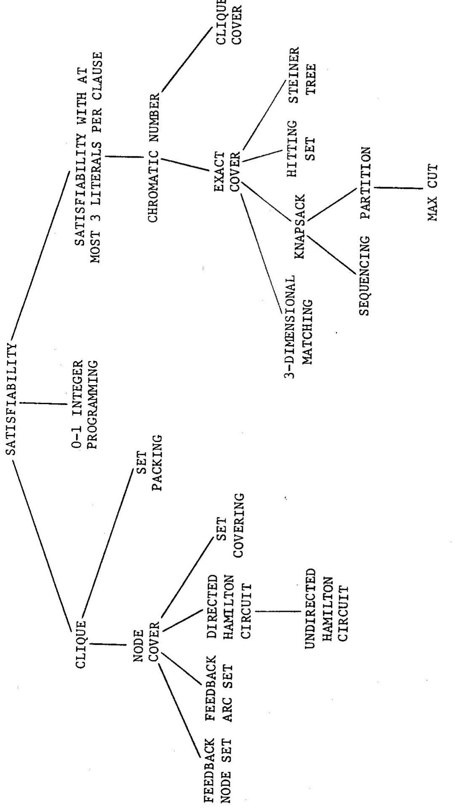

Richard M. Karp

University of California at Berkeley

Abstract: A large class of computational problems involve the determination of properties of graphs, digraphs, integers, arrays of integers, finite families of finite sets, boolean formulas and elements of other countable domains. Through simple encodings from such domains into the set of words over a finite alphabet these problems can be converted into language recognition problems, and we can inquire into their computational complexity. It is reasonable to consider such a problem satisfactorily solved when an algorithm for its solution is found which terminates within a number of steps bounded by a polynomial in the length of the input. We show that a large number of classic unsolved problems of covering, matching, packing, routing, assignment and sequencing are equivalent, in the sense that either each of them possesses a polynomial-bounded algorithm or none of them does.

# 1. INTRODUCTION

All the general methods presently known for computing the chromatic number of a graph, deciding whether a graph has a Hamilton circuit, or solving a system of linear inequalities in which the variables are constrained to be O or l, require a combinatorial search for which the worst case time requirement grows exponentially with the length of the input. In this paper we give theorems which strongly suggest, but do not imply, that these problems, as well as many others, will remain intractable perpetually.

We are specifically interested in the existence of algorithms that are guaranteed to terminate in a number of steps bounded by a polynomial in the length of the input. We exhibit a class of wellknown combinatorial problems, including those mentioned above, which are equivalent, in the sense that a polynomial-bounded algorithm for any one of them would effectively yield a polynomialbounded algorithm for all. We also show that, if these problems do possess polynomial-bounded algorithms then all the problems in an unexpectedly wide class (roughly speaking, the class of problems solvable by polynomial-depth backtrack search) possess polynomialbounded algorithms.

The following is a brief summary of the contents of the paper. For the sake of definiteness our technical development is carried out in terms of the recognition of languages by one-tape Turing machines, but any of a wide variety of other abstract models of computation would yield the same theory. Let $\Sigma ^ { \star }$ be the set of all finite strings of $0 ^ { \prime } { \bf s }$ and ${ \bf 1 } \ " { \bf s }$ . A subset of $\sum ^ { \# }$ is called a language. Let P be the class of languages recognizable in polynomial time by one-tape deterministic Turing machines, and let NP be the class of languages recognizable in polynomial time by one-tape nondeterministic Turing machines. Let I be the class of functions from \* into $\sum ^ { \star }$ computable in polynomial time by one-tape Turing machines. Let L and M be languages. We say that L a M (L is reducible to M) if there is a function f e l suCh that f(x)e M→x E L. If M e P and $\mathrm { ~ L ~ } \propto \mathrm { ~ M ~ }$ then Le P. We call L and M equivalent if $\underline { { \tau } } ~ \propto ~ \mathbb { M }$ and $M \propto \mathbb { L }$ . Call L (polynomial) complete if L e NP and every language in NP is reducible to L. Either all complete languages are in $P$ , or none of them are. The former alternative holds if and only if $P = N P$ :

The main contribution of this paper is the demonstration that a large number of classic difficult computational problems, arising in fields such as mathematical programming, graph theory, combinatorics, computational logic and switching theory, are complete (and hence equivalent) when expressed in a natural way as language recognition problems.

This paper was stimulated by the work of Stephen Cook (197l), and rests on an important theorem which appears in his paper. The author also wishes to acknowledge the substantial contributions of Eugene Lawler and Robert Tarjan.

# 2. THE CLASS P

There is a large class of important computational problems which involve the determination of properties of graphs, digraphs, integers, finite families of finite sets, boolean formulas and

elements of other countable domains. It is a reasonable working hypothesis, championed originally by Jack Edmonds (1965) in connection with problems in graph theory and integer programming, and by now widely accepted, that such a problem can be regarded as tractable if and only if there is an algorithm for its solution whose running time is bounded by a polynomial in the size of the input. In this section we introduce and begin to investigate the class of problems solvable in polynomial time.

We begin by giving an extremely general definition of "deterministic algorithm", computing a function from a countable domain D into a countable range R.

For any finite alphabet A, let $\mathsf { A } ^ { \ast }$ be the set of finite strings of elements of A; for x E A\*, let $\mathtt { l g } ( \mathtt { x } )$ denote the length of x.

A deterministic algorithm A is specified by:

The computation of A on input x e D is the unique sequence ${ \bf y } _ { 1 } , { \bf y } _ { 2 } , \ldots$ such that ${ \bf y } _ { 1 } = { \bf z } ( { \bf x } )$ $\bf y _ { i + 1 } = \tau ( \bf y _ { i } )$ for all i and, if the sequence is finite and ends with $\mathbf { \Delta y _ { k } }$ , then ${ \bf y } _ { \bf k }$ e R. Any string occurring as an element of a computation is cafled an instantaneous description. If the computation of A on input x is finite and of length t(x), then ${ \sf t } \left( { \bf x } \right)$ is the running time of A on input x. A is terminating if all its computations are finite. A terminating algorithm A computes the function $\pounds _ { A } \colon \mathsf { D } \ \to \ \mathsf { R }$ such that ${ \pmb { \mathscr { t } } } _ { \pmb { A } } ( { \pmb { \mathscr { x } } } )$ is the last element of the computatior of A on $\mathbf { x }$ :

If. ${ \textbf { R } } =$ {ACCEPT,REJECT} then A is called a recognition algorithm. A recognition algorithm in which $\ D \ = \ \Sigma ^ { \mathcal { \ Z } }$ iscalled a string recognition algorithm. If A is a string recognition $\left\{ { \bf x } ~ \in ~ \Sigma ^ { \star } \right| ~ \mathbf { f } _ { A } ( { \bf x } ) ~ =$ ACCEPT}. If D = R = ∑\* then A is called a string mapping algorithm. A terminating algorithm A with domain $\boldsymbol { \mathrm { ~ D ~ } } = \boldsymbol { \Sigma } ^ { \star }$ operates in polynomial time if there is a polynomial ${ \mathfrak { p } } ( \cdot )$ such that, for every x $\overline { { \Sigma } } ^ { \ast }$ , $\overline { { { \sf t } } } ( { \bf x } ) \leq { \sf p } ( 1 { \sf g } ( { \bf x } ) )$ .

To discuss algorithms in any practical context we must specialize the concept of deterministic algorithm. Various well known classes of string recognition algorithms (Markov algorithms, one-tape Turing machines, multitape and multihead Turing machines, random access machines, etc.) are delineated by restricting the functions E and T to be of certain very simple types. These definitions are standard [Hopcroft $\&$ Ullman (1969)] and will not be repeated here It is by now commonplace to observe that many such classes are equivalent in their capability to recognize languages; for each such class of algorithms, the class of languages recognized is the class of recursive languages. This invariance under changes in definition is part of the evidence that recursiveness is the correct technical formulation of the concept of decidability.

The class of languages recognizable by string recognition algorithms which operate in polynomial time is also invariant under a wide range of changes in the class of algorithms. For example, any language recognizable in time $\mathsf { p } ( \cdot )$ by a multihead or multitape Turing machine is recognizable in time $\mathfrak { p } ^ { 2 } ( \cdot )$ by a one-tape Turing machine. Thus the class of languages recognizable in polynomial time by one-tape Turing machines is the same as the class recognizable by the ostensibly more powerful multihead or multitape Turing machines. Similar remarks apply to random access machines.

Definition 1. P is the class of languages recognizable by one-tape Turing machines which operate in polynomial time.

Definition 2. Ⅱ is the class of functions from $\Sigma ^ { * }$ into $\Sigma ^ { \star }$ defined by one-tape Turing machines which operate in polynomial time.

The reader will not go wrong by identifying P with the class of languages recognizable by digital computers (with unbounded backup storage) which operate in polynomial time and Ⅱ with the class of string mappings performed in polynomial time by such computers.

Remark. If f $\smash { \mathopen { : } \mathclose \ b { \Sigma ^ { \star } } } \to \Sigma ^ { \star }$ is in I then there is a polynomial p(.) such that $\mathtt { l g } \left( \mathtt { f } \left( \mathbf { x } \right) \right) \ \le \ \mathtt { p } \left( \mathtt { l g } \left( \mathbf { x } \right) \right)$ .

We next introduce a concept of reducibility which is of central importance in this paper.

Definition 3. Let L and M be languages. Then $\mathrm { ~ \bf ~ L ~ } \propto \mathrm { ~ \bf ~ M ~ }$ (L is reducible to M) if there is a function f e II such that f(x)eM→xL. •

Proof. The following is a polynomial-time bounded algorithm to decide if x e L: compute $\mathbf { f } \left( \mathbf { x } \right)$ ; then test in polynomial time whether f(x) e M.

We will be interested in the difficulty of recognizing subsets of countable domains other than $\Sigma ^ { \star }$ Given such a domain D,

there is usually a natural one-one encoding e: $\mathbb { D } \ \to \ \Sigma ^ { \star }$ For example we can represent a positive integer by the string of $0 ^ { \prime } s$ and 1's comprising its binary representation, a l-dimensional integer array as a list of integers, a matrix as a list of l-dimensional arrays, etc.; and there are standard techniques for encoding lists into strings over a finite alphabet, and strings over an arbitrary finite alphabet as strings of $0 " \mathbf { s }$ and $1 ^ { \prime } { \mathsf { s } }$ . Given such an encoding e: D  , we say that a set T D is recognizable in polynomial time if' $\pmb { e }$ ( e P. Also, ivenset. T  D and U D', and encoding functions e: $\mathbb { D } \neq \Sigma ^ { \ast }$ and e': D'→ ∑\* we say T $\propto$ U if e(T) $\propto$ e'(U).

As a rule several natural encodings of a given domain are possible, For instance a graph can be represented by its adjacency matrix, by its incidence matrix, or by a list of unordered pairs of nodes, corresponding to the arcs. Given one of these representations, there remain a number of arbitrary decisions as to format and punctuation. Fortunately, it is almost always obvious that any two "reasonable" encodings ${ \tt e } _ { \tt o }$ and ${ \tt e } _ { 1 }$ of a given problem are equivalent; i.e., ${ \bf e } _ { 0 } ( \mathsf { S } ) \ \in \ \mathcal { P } \Leftrightarrow { \bf e } _ { 1 } ( \mathsf { S } ) .$ $\mathcal { P }$ One important exception concerns the representation of positive integers; we stipulate that a positive integer is encoded in a binary, rather than unary, representation. In view of the invariance of recognizability in polynomial time and reducibility under reasonable encodings, we discuss problems in terms of their original domains, without specifying an encoding into $\Sigma ^ { \star }$ :

We complete this section by listing a sampling of problems which are solvable in polynomial time. In the next section we examine a number of close relatives of these problems which are not known to be solvable in polynomial time. Appendix l establishes our notation.

Each problem is specified by giving (under the heading "INPUT") a generic element of its domain of definition and (under the heading "PROPERTY") the property which causes an input to be accepted.

SATISFIABILITY WITH AT MOST 2 LITERALS PER CLAUSE [COOk (1971)]   
PNOUT: C1auses $\mathsf { c } _ { 1 } , \mathsf { c } _ { 2 } , \ldots , \mathsf { c } _ { \mathrm { _ p } } ;$ each containing at most 2 literals   
PROPERTY: The conjunction of the' given clauses is_ satisfiable;   
ie.,there is a set $\mathsf { s } \subseteq \{ \mathbf { x } _ { 1 } , \mathbf { x } _ { 2 } , \bullet \bullet , \mathbf { x } _ { \mathrm { { n } } } , \mathbf { \overline { { x } } } _ { 1 } , \mathbf { \overline { { x } } } _ { 2 } , \bullet \bullet , \mathbf { \overline { { x } } } _ { \mathrm { { n } } } \}$ ch tha a)s does not contain a complementary pair of literals and b) $\ S \cap { \mathbb C } _ { \mathrm { k } } \neq \Phi , \mathrm { \bf k } = 1 , 2 , \dots , { \mathrm p }$ :

MINIMUM SPANNING TREE [Kruskal (1956)]

PROPERTY: There exists a spanning tree of weight $\leq ~ \mathsf { W }$

SHORTEST PATH [Dijkstra (1959)]   
INPUT: G, W, W, S, t   
PROPERTY: There is a path between s and t of weight  W.

MINIMUM CUT [Edmonds & Karp (1972)] INPUT: G, W, W, S, t PROPERTY: There is an s,t cut of weight $\leq \mathsf { W }$

ARC COVER [Edmonds (1965)]   
INPUT: G, k   
PROPERTY:' There is a set Y  A suCh that $| \mathtt { Y } | \le \mathtt { k }$ and every node is incident with an arc in Y. ARC DELETION   
INPUT: G, k   
PROPERTY: There is a set of k arcs whose deletion breaks all cycles.

BIPARTITE MATCHING [Hal1 (1948)]

PROPERTY: There are p elements of S, no two of which are equal in either component.

SEQUENCING WITH DEADLINES INPUT: PROPERTY: Starting at time 0, $( \mathbb { T } _ { 1 } , \dots , \mathbb { T } _ { \mathtt { n } } )$ E $z ^ { \mathtt { n } }$ , (D,...,D) one can execute jobs 1,2,...,n, n $z ^ { \mathtt { n } }$ , k with execution times $\mathbf { T _ { i } }$ and deadlines $\mathtt { D _ { i } }$ , in some order such that not more than k jobs miss their deadlines.

SOLVABILITY OF LINEAR EQUATIONS   
INPUT: $( { \bf { c } } _ { \bf { i } , j } )$ , $( \mathsf { a } _ { \mathrm { i } } )$   
PROPERTY: There exisTS a vector $( \mathsf { y } _ { \mathrm { j } } )$ such that, for each i,   
$\Sigma _ { \mathrm { ~ \bf ~ i ~ j ~ } } \circ _ { \mathrm { ~ \bf ~ i ~ } }$

# 3. NONDETERMINISTIC ALGORITHMS AND COOK'S THEOREM

In this section we state an important theorem due to Cook (l971) which asserts that any language in a certain wide class NP is reducible to a specific set S, which corresponds to the problem of deciding whether a boolean formula in conjunctive normal form is satisfiable.

Let p(2) denote the class of subsets of $\boldsymbol { \Sigma } ^ { \star } \times \boldsymbol { \Sigma } ^ { \star }$ which are recognizable in polynomial time. Given L(2)e p(2) and a polynomial p, we define a language L as follows:

L = {x| there exists y such that <x,y> e L(2) and $\mathbb { 1 } _ { 8 } ( \mathbf { y } ) \ \underline { { < } } \ \mathtt { p } ( \mathtt { l } _ { 8 } ( \mathbf { x } ) ) \}$

We refer to L as the language derived from L2 by p-bounded existential quantification.

Definition 4. NP is the set of languages derived from elements of p(2) by polynomial-bounded existential quantification.

There is an alternative characterization of NP in terms of nondeterministic Turing machines. A nondeterministic recognition algorithm A is specified by:

a countable set D (the domain) a finite alphabet $\Delta$ such that \*∩{ACCEPT,REJECT} = φ an encoding function E: $D \neq \Delta ^ { \ast }$ a transition relation τ  Δ\*x (∆\*U{ACCEPT,REJECT}) such that, for every $y _ { 0 } \in \Delta ^ { \star }$ ,the set $\{ < \mathbf { y } _ { 0 } , \mathbf { y } > | \mathbf { \zeta } < \mathbf { y } _ { 0 } , \mathbf { y } > \textbf { \in } \boldsymbol \tau \}$ has fewer than $\mathbf { k } _ { \mathsf { A } }$ elements, where $\mathbf { k } _ { A }$ is a constant. A computation of A on input x e D is a sequence ${ \tt y } _ { 1 } , { \tt y } _ { 2 } , \ldots$ such that ${ \bf y } _ { 1 } = { \bf E } ( { \bf x } )$ $< \mathbf { y _ { i } } , \mathbf { y _ { i + 1 } } > \textsf { e t } ^ { \intercal }$ for all i, and, if the sequence is finite and ends with ${ \tt y } _ { \tt k }$ ;then ${ \bf y _ { k } }$ e {ACCEPT, REJECT}. A string y E $\Delta ^ { * }$ which occurs in some computation is an instantaneous description. A finite computation ending in ACcEPT is an accepting computation. Input x is accepted if there is an accepting coputation for x. If $D = \sum \limits _ { i = 1 } ^ { \infty }$ then A is a nondeterministic string recognition algorithm and we say that A operates in polynomial time if there is a polynomial $\mathfrak { p } \left( \cdot \right)$ such that, whenever A accepts x, there is an accepting computation for 'x of length $\underline { { \underline { { \mathbf { \Pi } } } } } \texttt { p } ( 1 \mathbf { g } \left( \mathbf { x } \right) )$ :

A nondeterministic algorithm can be regarded as a process which, when confronted with a choice between (say) two alternatives, can create two copies of itself, and follow up the consequences of both courses of action. Repeated splitting may lead to an exponentially growing number of copies; the input is accepted if any sequence of choices leads to acceptance.

The nondeterministic 1-tape Turing machines, multitape Turing machines, random-access machines, etc. define classes of nondeterministic string recognition algorithms by restricting the encoding function E and transition relation τ to particularly simple forms. All these classes of algorithms, restricted to operate in polynomial time, define the same class of languages. Moreover, this class is NP.

Theorem l. L e NP if and only if L is accepted by a nondeterministic Turing machine which operates in polynomial time.

Proof. $\Rightarrow$ Suppose L e NP. Then, for some $\mathtt { L } ^ { ( 2 ) } \ \in \ \mathcal { P } ^ { ( 2 ) }$ and some polynomial p, L is obtained from L(2) by p-bounded existential quantification. We can construct a nondeterministic

machine which first guesses the successive digits of a string y of length $\leq \mathtt { p } ( \mathtt { l g } ( \mathbf { y } ) )$ and then tests whether $< \mathbf { x } , \mathbf { y } > \texttt { e L } ^ { ( 2 ) }$ . Such a machine clearly recognizes L in polynomial time.

- Suppose L is accepted by a nondeterministic Turing machine T which operates in time p. Assume without loss of generality that, for any instantaneous description Z, there are at most two instantaneous descriptions that may follow Z (i.e., at most two primitive transitions are applicable). Then the sequence of choices of instantaneous descriptions made by T in a given computation can be encoded as a string y of O's and l's, such that $\mathbf { l } _ { \mathbf { \delta g } } ( \mathbf { y } ) \mathbf { \eta } \le \mathbf { \eta } _ { \mathbf { p } } ( \mathbf { l } _ { \mathbf { \mathcal { E } } } ( \mathbf { x } ) )$ :

Thus we can construct a deterministic Turing machine T', with ∑\*x ∑\* as its domain of inputs, which, on input <x,y>, simulates the action of T on input x with the sequence of choices y. Clearly T' operates in polynomial time, and L is obtained by polynomial bounded existential quantification from the set of pairs of strings accepted by T'.

The class NP is very extensive. Loosely, a recognition problem is in NP if and only if it can be solved by a backtrack search of polynomial bounded depth. A wide range of important computational problems which are not known to be in P are obviously in NP. For example, consider the problem of determining whether the nodes of a graph G can be colored with k colors so that no two adjacent nodes have the same color. A nondeterministic algorithm can simply guess an assignment of colors to the nodes and then check (in polynomial time) whether all pairs of adjacent nodes have distinct colors.

In view of the wide extent of NP, the following theorem due to Cook is remarkable. We define the satisfiability problem as follows:

# SATISFIABILITY

INPUT: ClausEs C1,C2,..Cp   
PROPERTY: The conjunction of f the given clauses is satisfiable;   
ie., there is a set $\mathbf { S } \subseteq \{ \mathbf { x } _ { 1 } , \mathbf { x } _ { 2 } , \dotsc , \mathbf { x } _ { \mathrm { n } } ; \mathbf { \overline { { x } } } _ { 1 } , \mathbf { \overline { { x } } } _ { 2 } , \dotsc , \mathbf { \overline { { x } } } _ { \mathrm { n } } \}$ b such that s does not contain a complementary pair of literals   
andbS∩Ck≠φk = 1,2,...,p.

Theorem 2 (Cook). If L € NP then L α SATISFIABILITY.

The theorem stated by Cook (197l) uses a weaker notion of reducibility than the one used here, but Cook's proof supports the present statement.

Proof. If SATISFIABILITY e $P$ then, for each L e NP, Le P, since L α SATISFIABILITY. If SATISFIABILITY $\sum P$ ,then, since clearly SATISFIABILITY e NP, $P \neq N P$ .

Remark: If $P = N P$ then NP is closed under complementation and polynomial-bounded existential quantification. Hence it is also closed under polynomial-bounded universal quantification. It follows that a polynomial-bounded analogue of Kleene's Arithmetic Hierarchy [Rogers (1967)] becomes trivial if $P = N P$ :

Theorem 2 shows that, if there were a polynomial-time algorithm to decide membership in SATISFIABILITY then every problem solvable by a polynomial-depth backtrack search would also be solvable by a polynomial-time algorithm, This is strong circumstantial evidence that SATISFIABILITY $\sum p$ :

# 4. COMPLETE PROBLEMS

The main object of this paper is to establish that a large number of important computational problems can play the role of SATISFIABILITY in Cook's theorem. Such problems will be called complete.

Definition 5. The language L is (polynomial) complete if a) Le NP and b) SATISFIABILITY $\propto \mathbb { L }$ :

Theorem 3. Either all complete languages are in $\cdot \mathcal { P }$ , or none of them are. The former alternative holds if and only if $P = N P$ .

We can extend the concept of completeness to problems defined over countable domains other than $\sum ^ { \ast }$ .

Definition 6. Let D be a countable domain, e a "standard" one-one encoding e: $\mathbb { D }  \mathbb { \sum } ^ { \star }$ aNd T a subsEt of D. THEN T is complete if and only if $\mathbf { e }$ (D) is complete.

Lemma 2. Let D and D' be countable domains, with one-one   
encoding functions $\curvearrowleft$ and $e ^ { 1 }$ . Let TD and $\mathbf { T } ^ { \prime } \subseteq \mathbf { D } ^ { \prime }$ Then   
T α T' if there is a function F: $\mathbb { D } \  \ \mathbb { D } ^ { \ \prime }$ such that a) $\mathbf { F } \left( \mathbf { x } \right)$ eT $\ l \textbf { \textsc { i } } \Leftrightarrow \textbf { \textsc { x } }$ E T   
and b there is a function f e I such that $\textbf { f } ( \textbf { x } ) ~ = ~ \textbf { e } ^ { \prime } ( \mathtt { F } ( \mathbf { e } ^ { - 1 } ( \mathbf { x } ) ) )$ whenever ${ \bf e } ^ { \prime } \left( \mathbb { F } \left( { \bf e } ^ { - 1 } ( { \bf x } ) \right) \right)$ is defined.

The rest of the paper is mainly devoted to the proof of the following theorem.

Main Theorem. All the problems on the following list are complete.

1. SATISFIABILITY

COMMENT: By duality, this problem is equivalent to determining whether a disjunctive normal form expression is a tautology.

2. 0-1 INTEGER PROGRAMMING INPUT: integer matrix C and integer vector d PROPERTY: There exists a O-1 vector x such that Cx = d.

3. CLIQUE INPUT: graph G, positive integer k PROPERTY: G has a set of k mutually adjacent nodes.

4. SET PACKING INPUT: FAMily of sEts PROPERTY: {s,} contain $\mathbf { \Sigma } _ { \mathbf { s } } ^ { \{ \mathbf { s } _ { \mathbf { j } } \} }$ , positive integer & mutually disjoint sets. j

5. NODE COVER INPUT: graph G', positive integer & PROPERTY: There is a set $\textsf { R } \subseteq \mathbb { N } ^ { \prime }$ such that $| { \mathbb { R } } | \ \leq \ { \ell }$ and every arc is incident with some node in R.

6. SET COVERING

$\{ \mathsf { s } _ { \mathsf { 4 } } \}$ positive integer kk $\{ \mathtt { T } _ { \mathtt { h } } \} \subseteq { \mathbb { S } _ { \mathtt { j } } } \mathtt { k } _ { \mathtt { j } } \mathtt { k }$ sets such that $\cup _ { \mathtt { h } } = \cup _ { \mathtt { j } }$ :

7. FEEDBACK NODE SET INPUT: digraph H, positive integer k PROPERTY: There is a set R v such that every (directed) cycle of H contains a node in R.

8. FEEDBACK ARC SET INPUT: digraph H, positive integer k PROPERTY: There is a set S E such that every (directed) cycle of H contains an arc in S.

9. DIRECTED HAMILTON CIRCUIT INPUT: digraph H PROPERTY: H has a directed cycle which includes each node exactly once.

10. UNDIRECTED HAMILTON CIRCUIT

INPUT: graph G   
PROPERTY: G has a cycle which includes each node exactly   
once,

11. SATISFIABILITY WITH AT MOST 3 LITERALS PER CLAUSE INPUT: Clauses $\mathbb { D } _ { 1 } , \mathbb { D } _ { 2 } , \ldots , \mathbb { D } _ { \mathtt { Y } }$ , each consisting of at most 3 literals from the set $\{ \mathbf { u } _ { 1 } , \mathbf { u } _ { 2 } ^ { ^ \mathrm { { s } } } , \ldots , \mathbf { u } _ { \mathrm { m } } \} \cup \{ \bar { \mathbf { u } } _ { 1 } , \bar { \mathbf { u } } _ { 2 } , \ldots , \bar { \mathbf { u } } _ { \mathrm { m } } \}$ PROPERTY: THe sEt $\{ \mathrm { D } _ { 1 } , \mathrm { D } _ { 2 } ^ { - } , \ldots , \mathrm { D } _ { \mathrm { r } } \}$ is satisfiable.

12. CHROMATIC NUMBER

INPUT: graph G, positive integer $\mathbf { k }$   
PROPERTY: There is a function $\Phi$ : $\mathrm { ~ N ~ } \to \mathrm { ~ Z _ { k } ~ }$ such that, $\smash { \textbf { i f } \cdot \textbf { u } }$ and v are adjacent, then $\Phi ( \mathbf { u } ) \ \ne \ \Phi ( \mathbf { v } )$ .

13. CLIQUE COVER INPUT: graph G', positive integer l PROPERTY: $\aleph ^ { \prime }$ is the union of $\updownarrow$ or fewer cliques.

14. EXACT COVER

INPUT: fam1ly $\{ \mathsf { s } _ { \mathbf { j } } \}$ a Of subsetss $\{ \mathrm { u } _ { \bf i } , \ \mathrm { ~ i ~ } = \ 1 , 2 , \ldots , \mathrm { t } \}$ $\{ \mathtt { T } _ { \mathtt { h } } \} \subseteq \{ \mathtt { s } _ { \mathtt { i } } \}$ are disjoint and $\cup _ { \mathfrak { r } _ { \mathfrak { h } } } \ = \cup _ { \mathfrak { S } _ { \vec { \textbf { j } } } } ^ { * } \ = \ \{ \mathbf { u } _ { \vec { \textbf { i } } } ^ { \mathbf { J } } , \ \textbf { i } \ = \ 1 , 2 , \dotsc , \operatorname { t } \}$ .

15. HITTING SET

INPUT: family $\{ \mathtt { U } _ { \mathtt { i } } \}$ of subsets of $\{ \mathbf { s } _ { \mathrm { ~ i ~ } } , \ \mathbf { j } \ = \ 1 , 2 , \ldots , \mathbf { r } \}$ PROPERTY: There is a set W such that, for each i, $| \ l _ { W } \cap \mathrm {  ~ U ~ } _ { \mathbf { i } } | ~ = ~ 1$ .

16. STEINER TREE

INPUT: graph G, R N, weighting function W: $\mathrm { ~ \bf ~ A ~ } \to \mathrm { ~ \bf ~ Z ~ }$ , positive integer k   
PROPERTY: G has a subtree of weight < k containing the set of nodes in R.

17. 3-DIMENSIONAL MATCHING

INPUT: set U $\underline { { \mathsf { C } } } \mathrm { ~ T } \times \mathrm { T } \times \mathrm { T }$ , where T' is a finite set PROPERTY: ThErE is a sEt $w \subseteq U$ such that $\left| \ W \right| \ = \ \left| \tau \right|$ and no two elements of w agree in any coordinate. -

18. KNAPSACK

INPUT:(a1,a2,..ar,b) ezn+1 PROPERTY: E a,x, = b has a O-1 solution. aj\*j

19. JOB SEQUENCING

$$
\begin{array} { r l } &  \tt  \tt { s u c \tt { c u t i o n } } ~ t i m e ~ v e c t o r ^ { * } { \tt { \tt { ( T _ { 1 } , \ldots \tt { ( \tt { \tt { \tt { 1 } } , \tt { \tt { \tt { \tt { \tt { \tt } { \tt { \tt } { \tt { \tt } { \tt { \tt } { \tt } { \tt { \tt } { \tt { \tt } { \tt } { \tt { \tt } { \tt } { \tt { \tt } { \tt } { \tt { \tt } { \tt } { \tt { } \tt { \tt } { \tt } { \tt { } \tt { \tt } { \tt } { \tt { } \tt { } \tt { \tt } { \tt { } \tt { } \tt { } \tt { } \tt { } \tt { } \tt { } \tt { } \tt { } \tt { } \tt { } \tt { } \tt { } \tt { } } } } } } } } } } } } } } } } } } } } } } \\ &  \tt  \tt { \tt { d e a d l i n e ~ v e c t o r ^ { * \tt { \tt { \tt { t } } } { \tt { \tt { \tt { \tt { \tt { \tt { } \tt { \tt { } \tt { } \tt { \tt { } \tt { } \tt { } { \tt { \tt { } \tt { } \tt { } \tt { } \tt { } { \tt { } \tt { } \tt { } \tt { } { \tt { } \tt { } \tt { } \tt { } { \tt } { \tt { } \tt { } \tt { } \tt { } { \tt } { \tt { } \tt { } \tt { } \tt { } { \tt } { \tt { } \tt { } \tt { } \tt { } \tt { } } } } } } } } } } } } } } } } } } } \\ &  \tt  \tt { \tt { p e n a l t y ~ v e c t o r ^ { * \tt { \tt { t } } { \tt { \tt { \tt { \tt { } \tt { \tt { } \tt { { \tt { } \tt { } \tt { { \tt { } \tt { } \tt { } { \tt { } \tt { } \tt { } { \tt { } \ * } } } } } } } } } } } } } } &  \tt  \tt  \tt  \tt  \tt { } \tt  \vec   \end{array}
$$

PROPERTY: such:hat

$$
\displaystyle ( \sum _ { \mathbf { j } = \mathbf { 1 } } ^ { \texttt { p } } [ \texttt { i f } \texttt { T } _ { \pi ( \mathbf { 1 } ) } ] ^ { + \cdot \cdot \cdot \cdot + \mathbf { \bar { \tau } } } _ { \mathfrak { { I } } ( \mathbf { j } ) } > \texttt { D } _ { \pi ( \mathbf { j } ) } \texttt { t h e n } \texttt { P } _ { \pi ( \mathbf { j } ) } \texttt { e l s e } 0 ] ) \leq \texttt { k }
$$

20. PARIITION

INPUT: (c1,c2,...,cge 2   
PROPERTY:  There is a set I  {1,2,...,s} such that   
$\sum _ { \mathbf { h } \in \mathbb { T } } \mathbf { c } _ { \mathbf { h } } = \sum _ { \mathbf { h } \notin \mathbf { I } } \mathbf { c } _ { \mathbf { h } }$

21. MAX CUT INPUT: graph G, weighting function w: A → Z, positive integer W

PROPERTY: There is a set such that

$$
\{ \underset { \mathbf { u } \in \mathbb { S } } { \sum } \mathbf { w } ( \{ \mathbf { u } , \mathbf { v } \} ) ~ \geq ~ W \hfill 
$$

It is clear that these problems (or, more precisely, their encodings into ∑\*), are all in NP. We proceed to give a series of explicit reductions, showing that SATISFIABILITY is reducible to each of the problems listed. Figure 1 shows the structure of the set of reductions. Each line in the figure indicates a reduction of the upper problem to the lower one.

To exhibit a reduction of a set T d to a set T' D', we specify a function F: D → D' which satisfies the conditions of Lemma 2. In each case, the reader should have little difficulty in verifying that F does satisfy these conditions.

SATISFIABILITY & 0-1 INTEGER PROGRAMMING

$$
\begin{array} { r l r } { \mathrm { c } _ { \overset { . } { 1 } \overset { . } { 1 } \overset { . } { 1 } } = } & { { } \begin{array} { l l } { \left\{ \begin{array} { l l } { 1 } & { \mathrm { ~ i f ~ } \quad \mathrm {  ~ x _ { j } ~ } \in \mathrm { ~  ~ C _ { \overset { . } { 1 } } ~ } } \\ { - 1 } & { \mathrm { ~ i f ~ } \quad \bar { \mathrm {  ~ x _ { j } ~ } } \in \mathrm { ~  ~ C _ { \overset { . } { 1 } } ~ } } \\ { 0 } & { \mathrm { ~ o t h e r w i s e } } \end{array} \right. } & { \qquad \mathrm {  ~ j ~ } = \mathrm { ~  ~ 1 , 2 , \dots , p ~ } } \end{array} } \end{array}
$$

bi = 1-(the number of complemented variables in ) $\textbf { i } = \textbf { 1 } , 2 , \ldots , \mathbf { p } .$

SATISFIABILITY $\propto$ CLIQUE

$$
\begin{array}{c} \begin{array} { r l }  \mathrm { ~ N ~ = ~ \{ < \mathrm { { \mathcal O } ~ , ~ i > | ~ \begin{array} { l l l } { \mathrm { ~ \odot ~ ~ i s ~ \mathrm { {  ~ 1 } ~ i t e r a 1 ~ a n d ~ \mathrm { { \textperthous c c u r s } } } } } \\ { \mathrm { ~ A _ \Sigma = ~ \{ ~ \{ ~  < \mathrm { { \mathcal O } ~ , ~ i > \mathrm { , ~ \text A _ \Sigma ,  \} \} ~ | ~ \mathrm { ~ {  ~ \neq ~ \mathrm { \bf ~ j } ~ \mathrm { ~ a n d ~ \mathrm {  ~ \textmu ~ } ~ \neq ~ \bar { \delta } } } } \} ~ } } } \end{array}  } } \\ { \mathrm { ~ k _ \Sigma ~ = ~ \mathrm { {  ~ } ~ \{ ~ \mathrm { ~ t h e ~ \ n u m b e r ~ \ o f ~ \ c l a u s e s } ~ . } } \end{array}  } } \end{array}
$$

CLIQUE $\propto$ SET PACKING

Assume N = {1,2,...,n}. The elements of the sets $s _ { 1 } , s _ { 2 } , \ldots , s _ { \mathrm { n } }$ are those two-element sets of nodes $\{ \mathbf { i } , \mathbf { j } \}$ not in A.

$$
\begin{array}{c} \begin{array} { r c l } { \mathrm { S } _ { \perp } } & { = \{ \{ \bf { i } , \bf { j } \} | \begin{array} { c c } { \{ { \bf { i } } , { \bf { j } } \} } \end{array}  \begin{array} { c c } { \{ { \bf { i } } , { \bf { j } } \} } \end{array} \ c } \end{array}  , ~ \bf { i }  & { = \ { \bf { 1 } } , 2 , \ldots , \bf { n } } \\ { \mathrm { \& } ~ \mathrm { \& } ~ \mathrm { \& } ~ \mathrm { \& } ~ \mathrm { \& } ~ \mathrm { \& } ~ \mathrm { \& } } \end{array}
$$

CLIQUE $\propto$ NODF COVER G' is the complement of G. $\hat { \mathcal { L } } ~ = ~ \left| ~ \mathbb { N } \right| - \mathbf { k }$

NODE COVER $\propto$ SET COVERING

Assume N' = {1,2,...,n}. The elements are the arcs of G'. $s _ { \mathrm { j } }$ i te t of arcs incident with node . $k = \ell$ .

NODE COVER $\propto$ FEEDBACK NODE SET

$$
\begin{array} { l l l } { \mathrm {  ~ V ~ } = } & { \mathrm {  ~ N ~ } ^ { \prime } } \\ { \mathrm {  ~ E ~ } = } & { \left\{ < { \bf u } , { \bf v } > \right| \mathrm {  ~ \left\{ u , v \right\} ~ } \in \mathrm {  ~ \cal { A } ^ { \prime } \Sigma } } \\ { \mathrm {  ~ k ~ } = } & { \ell } \end{array}
$$

NODE COVER $\propto$ FEEDBACK ARC SET

$$
\begin{array} { r l } & { \texttt { V } = \texttt { N } ^ { \texttt { t } } \times \{ 0 , 1 \} } \\ & { \texttt { E } = \texttt { \{ < < u } , 0 > , < \cup , 1 > > } | \texttt { u e } \texttt { N } ^ { \prime } \} \cup \{ < < \texttt { u } , 1 > , < \texttt { v } , 0 > >  | \texttt { \{ u }  , { \texttt { v } } \texttt { \{ \in } A   \\ & { \texttt { k } = \texttt { \{ < } } \texttt { " }  \end{array}
$$

NODE COVER & DIRECTED HAMILTON CIRCUIT

$$
\begin{array} { r l } { \nabla = } & { \{ \mathbf a _ { 1 } , \mathbf a _ { 2 } , \dots , \mathbf a _ { 2 } \} \cup \{ \textrm { = } - \int _ { - \infty } ^ { \infty } \int _ { - \infty } ^ { \infty } \int _ { \mathrm { ~ u p } } \mathbf a \cdot \mathbf { \Phi } \mathrm { ~ n t } \mathrm { ~ a d e n t ~ } \mathrm { ~ w i t h } : } \\ & { \qquad \quad \textrm { a n d ~  { \alpha } ~ \in ~ \mathbb { N } ^ { \times } ~ \{ \times } ~ }  \\ { \mathbb { E } = } & { \{ ( < \mathbf u _ { 1 } , \mathbf a _ { 2 } , \dots , \mathbf a _ { 2 } , \mathbf a _ { 1 } , \mathbf a _ { 2 } > \int _ { - \infty } ^ { \infty } \int _ { + \infty } ^ { \infty } \int _ { + \infty } ^ { \infty } \int _ { - \infty } ^ { \infty } \int _ { + \mathrm { ~ u p } } \mathbf a \cdot \mathbf { \Phi } \mathrm { ~ n t } \mathrm { ~ a d e n t ~ } \mathrm { ~ w i t h } : } \\ & { \{ \ x \in \mathbf a _ { 1 } , \mathbf a _ { 2 } \lor , \mathbf c \mathbf u _ { 1 } , \dots , \mathbf a _ { 3 } > \int _ { - \infty } ^ { \infty } \int _ { + \infty } ^ { \infty } \int _ { - \infty } ^ { \infty } \int _ { - \infty } ^ { \infty } \mathbf a \cdot \mathbf a _ { 1 } \mathrm { ~ a n d ~  { \alpha } ~ \mathrm { u p } ~ a r e } \mathrm { ~ i n ~ a c i a l e n t ~ } \mathrm { ~ v i o } } \\ & { \{ \ x \in \{ \times \mathbf a _ { 1 } , \mathbf a _ { 3 } , \dots , \mathbf a _ { 2 } \} , 0 > \int _ { - \infty } ^ { \infty } \int _ { + \infty } ^ { \infty } \int _ { - \infty } ^ { \infty } \int _ { - \infty } ^ { \infty } \int _ { + \mathrm { ~ u p } } \mathbf a \cdot \mathbf a _ { 1 } \mathrm { ~ a n d ~ } \mathrm { ~ f o r ~ a d e n t ~ } \mathrm { ~ a d d ~ } \mathrm { ~ a n d ~ } \mathrm { ~ f o ~ a r } } \\ &  \qquad \quad \textrm { = } \frac  \end{array}
$$

DIRECTED HAMILTON CIRCUIT α UNDIRECTED HAMILTON CIRCUIT

$$
\begin{array} { r l } & { \texttt { N } = \texttt { V } \times \{ 0 , 1 , 2 \} } \\ & { \texttt { A } = \texttt { \{ \{ < u , 0 > , < u , 1 > \} , \{ < u , 1 > , < u , 2 > \} | u e v \} } } \\ & { \texttt { \{ U } \{ \{ < u , 2 > , < v , 0 > \} | \texttt { < u , v > \in \texttt { E } \} } }  \end{array}
$$

SATISFIABILITY & SATISFIABILITY WITH AT MOST 3 LITERALS PER CLAUSE

Replace a clause σ1Uσ2U...Uσm, where the σi are literals and $\mathfrak { m } \ > \ 3$ , by

$$
( \sigma _ { \mathbf { 1 } } \cup _ { \sigma _ { 2 } } \cup _ { \mathbf { u } _ { \mathbf { 1 } } } ) ( \sigma _ { 3 } \cup \ldots \cup _ { \sigma _ { \mathfrak { m } } } \cup _ { \mathbf { u } _ { \mathbf { 1 } } } ) ( \bar { \sigma } _ { 3 } \cup _ { \mathbf { u } _ { \mathbf { 1 } } } ) \ldots ( \bar { \sigma } _ { \mathfrak { m } } \cup _ { \mathbf { u } _ { \mathbf { 1 } } } )
$$

where u1 is a new variable. Repeat this transformation until no clause has more than three literals.

SATISFIABILITY WITH AT MOST 3 LITERALS PER CLAUSE $\propto$ CHROMATIC NUMBER

Assume without loss of generality that $m \geq 4$ :

$$
\begin{array} { r l } & { \mathrm { ~ N = ~ \{ u _ 1 , u _ 2 , \cdot \cdot \cdot , u _ m \} ~ ~ \cup ~ \{ \bar { u } _ 1 , \bar { u } _ 2 , \cdot \cdot \cdot , \bar { u } _ { m } \} ~ \cup ~ \{ v _ 1 , \bar { v } _ 2 , \cdot \cdot \cdot , v _ { m } \} ~ } } \\ & { \mathrm { ~ U ~ \{ p _ 1 , \bar { v } _ 2 , \cdot \cdot \cdot , \bar { v } _ r \} ~ } } \\ & { \mathrm { ~ A ~ = ~ \{ \bar { \{ \Phi } } _ 1 , \bar { u } _ \pm \} ~ \left| ~ \bar { \Psi } _ \pm 1 , 2 , \ldots , n \right. ~ }  \\ & { \mathrm { ~ U ~ \{ \bar { \{ \Phi } } _ 1 , \bar { x } _ { \pm } \} ~ } \left| ~ \begin{array} { l } { \mathrm { ~ U ~ } ; } \\ { \mathrm { ~ \bar { u } _ \pm , \bar { v } _ \pm \} } \end{array} \right. ~ \cup ~ \{ \bar { \Psi } _ \pm \ , ~ \bar { v } _ \pm \ } \left| ~ \begin{array} { l } { \mathrm { ~ \bar { u } _ \pm \vec { \Phi } _ 1 ~ } ; } \\ { \mathrm { ~ \bar { u } _ \pm \vec { \Phi } _ 2 ~ } ; } \end{array} \right. ~ \cup ~ \{ \bar { \Psi } _ \pm \ , ~ \bar { v } _ \pm \ \} ~  \\ & { \mathrm { ~ k ~ = ~ r ~ } + 1 } \end{array}
$$

CHROMATIC NUMBER & CLIQUE COVER

CHROMATIC NUMBER & EXACT COVER The set of elements is NUAU{<u,e,f>| u is incident with e and 1 ≤ f ≤ k} : The sets Sj are the following: for each f, 1 < f < k, and each u e N, {u}U{<u,e,f>] e is incident with u} ; for each e e A and each pair f1, f2 such that $\begin{array} { r } { \sum \mathrm { ~ a c u ~  ~ { \widetilde ~ \phi ^ \le ~ a ~  ~ { \widetilde ~ \phi ^ \le ~ a ~  ~ { \widetilde ~ \phi ~ a ~ c h ~ \phi ~ p a r ~ \phi ~ a ~ 1 ~ r _ 1 ~ \widetilde ~ \phi ~ 2 ~ \phi ~ s u c h ~ \phi ~ } } ~ } } } \\ { \mathrm { ~  ~ { \widetilde ~ \phi ^ \to ~ f _ 1 ~ \leq ~ k , ~ \widetilde ~ \phi ~ 1 \leq ~ f _ 2 ~ \leq ~ k ~ a n d ~ \phi ~ f _ 1 ~ \neq ~ f _ 2 ~ \phi ~ } ~ } } \\ { \mathrm { ~ \{ e \widetilde ~ \phi ~ \cup \{ < u , e , f > , f \neq f _ 1 \} ~ \cup \{ < v , e , g > \phi | ~ \phi _ { g \neq f _ 2 } \} ~ } ~ } ,  \end{array}$

where u and v are the two nodes incident with e.

EXACT COVER $\propto$ HITTING SET

The hitting set problem has sets Ui and elements sj, such that $\mathbf { s } _ { \mathbf { j } } \ \in \ \mathbf { U } _ { \mathbf { i } } \ \Leftrightarrow \ \mathbf { u } _ { \mathbf { i } } \ \in \ \mathbb { s } _ { \mathbf { j } } .$ b

EXACT COVER $\pmb { \alpha }$ STEINER TREE

$$
\begin{array} { r l } { \mathrm { ~  ~ { ~ N ~ } ~ } = } & { \{ { \bf n } _ { 0 } \} \cup \{ s _ { \bf j } \} \cup \{ { \bf u } _ { \bf i } \} } \\ { \mathrm { ~  ~ { ~ \cal ~ R ~ } ~ } = } & { \{ { \bf n } _ { 0 } \} \cup \{ { \bf u } _ { \bf i } \} } \\ { \mathrm { ~  ~ { ~ \cal ~ A ~ } ~ } = } &  \{ \{ { \bf n } _ { 0 } , s _ { \bf j } \} \} \cup \{ \{ s _ { \bf j } , { \bf u } _ { \bf i } \} \} \left| \begin{array} { l }  { \bf u } _ { \bf i } \in \mathcal { S } _ { \bf j } \} \\ { { \bf u } _ { 0 } , { s _ { \bf j } \} } \end{array} \right. } \\ { \mathrm { ~  ~ { ~ w ~ } ~ } ( \{ { \bf n } _ { 0 } , s _ { \bf j } \} ) = } & { \left| \ S _ { \bf j } \right. } \\ { \mathrm { ~  ~ { ~ w ~ } ~ } ( \{ { \bf s } _ { \bf j } , { \bf u } _ { \bf i } \} ) = } & { 0 } \\ { \mathrm { ~  ~ { ~ \cal ~ k ~ } ~ } = } & { \left| \{ { \bf u } _ { \bf i } \} \right| } \end{array}
$$

# EXACT COVER $\propto 3 \cdot$ -DIMENSIONAL MATCHING

Without loss of generality assume |sjl ≥ 2 for each j. Let T = {<i,j>| ui e S,}. Let α be an arbitrary one-one function

from $\{ \mathbf { u _ { i } } \}$ into T. Let : $\mathrm { ~ \bf ~ T ~ } \to \mathrm { ~ \bf ~ T ~ }$ be a permutation such that, for each fixed j, $\{ < { \bf i } , { \bf j } > \} ~ { \bf u _ { i } } ~ \in ~ { \bf s _ { j } } \}$ is a cycle of $\pi$ :

$$
\begin{array} { r c l } { \texttt { U = } } & { \left\{ < \alpha ( \mathbf { u _ { i } } ) , < \mathbf { i } , \mathbf { j } > , < \mathbf { i } , \mathbf { j } > > \right| < \mathbf { i } , \mathbf { j } > \texttt { \in T } \} } \\ & & { \cup \texttt { \{ < } } & { \left\{ < \beta , \sigma , \pi ( \sigma ) > \right| \texttt { f o r } \ a l l \ i , \beta \ne \alpha ( \mathbf { u _ { i } } ) \} } \end{array}
$$

EXACT COVER $\propto$ KNAPSACK

$$
\mathrm { ~ \bf ~ r ~ } = ~ \left| ~ \{ s _ { \bf j } ~ \} ~ \right| , \quad a _ { \bf j } ~ = ~ \sum ~ \epsilon _ { { \bf j } \bot } \mathrm { d } ^ { \bf i - 1 } \quad \mathrm { a n d } \quad { \bf b } ~ = ~ \frac { \mathrm { d } ^ { \sf t } - 1 } { \mathrm { d } - 1 } .
$$

KNAPSACK $\propto$ SEQUENCING

$$
\mathrm { ~ \bf ~ p ~ } = \mathrm { ~ \bf ~ r ~ } , \quad \mathrm { ~ \bf ~ T ~ _ { \bf ~ i ~ } ~ } = \mathrm { ~ \bf ~ P ~ _ { \bf ~ i ~ } ~ } = \mathrm { ~ \bf ~ a ~ _ { \bf ~ i ~ } ~ } , \quad \mathrm { ~ \bf ~ D ~ _ { \bf ~ i ~ } ~ } = \mathrm { ~ \bf ~ b ~ } .
$$

KNAPSACK $\propto$ PARTITION

$$
\begin{array} { r l } { \mathbf { s } } & { = \mathbf { \phi } _ { \mathbf { r } } + 2 } \\ { \mathbf { c _ { i } } } & { = \mathbf { \phi } _ { \mathbf { a _ { i } } } \quad , \quad \mathbf { i } \quad = \ 1 , 2 , \ldots , \mathbf { r } } \\ { \mathbf { c _ { { r } + 1 } } } & { = \mathbf { \phi } _ { \mathbf { b } } + 1 } \\ { \mathbf { c _ { { r } + 2 } } } & { = \mathbf { \phi } ( \begin{array} { l } { \ r } \\ { { \sum } \mathbf { \phi } _ { \mathbf { a _ { i } } } ) + 1 - \mathbf { b } } \end{array} } \end{array}
$$

PARTITION $\propto$ MAX CUT

$$
\begin{array} { r l } & { \tt { N \tt ~ = ~ \{ 1 , 2 , \underline { { \tau } } _ { \bf { \Theta } } , \underline { { \tau } } _ { \bf { \Theta } } , \underline { { \tau } } _ { \bf { \Theta } } \} } } \\ & { \tt { A \tt ~ = ~ \{ \{ \epsilon \leq \epsilon , \underline { { \tau } } _ { \bf { \Theta } } \} ~ \cdot \in ~ \underline { { \tau } } _ { \bf { \Theta } } \cdot \in ~ \mathbb { N } , \epsilon _ { \bf { \Theta } } ~ \cdot ~ j ~ \in ~ \mathbb { N } , \epsilon _ { \bf { \Theta } } ~ \cdot ~ i ~ \neq ~ j ~ \} ~ } } \\ & { \tt { w \tt ~ ( \{ \epsilon _ { \bf { \Theta } } , \bf { j } ~ \in ~ \mathbb { C } _ { \bf { \sigma } } \underline { { \tau } } _ { \bf { \dot { \Theta } } } \cdot \in ~ \mathbb { j } ~ } }  \\ & { \tt { W \tt ~ = ~ \lceil \frac { \tau } { \epsilon _ { \bf { \Theta } } } ~ \mathbb { Z } ~ \mathbb { C } _ { \bf { \sigma } } ^ { 2 } \rceil } } \end{array}
$$

Some of the reductions exhibited here did not originate with the present writer. Cook (197l) showed that SATISFIABILITY $\propto$ SATISFIABILITY WITH AT MOST 3 LITERALS PER CLAUSE. The reduCtiOn is implicit in Cook (l970), and was also known to Raymond Reiter. The reduction

was found by the Algorithms Seminar at the Cornell University Computer Science Department. The reduction

NODE COVER $\propto$ FEEDBACK ARC SET

was found by Lawler and the writer, and Lawler discovered the reduction

EXACT COVER $\pmb { \alpha }$ 3-DIMENSIONAL MATCHING

The writer discovered that the exact cover problem was reducible to the directed traveling-salesman problem on a digraph in which the arcs have weight zero or one. Using refinements of the technique used in this construction, Tarjan showed that

EXACT COVER $\propto$ DIRECTED HAMILTON CIRCUIT and, independently, Lawler showed that

NODE COVER $\propto$ DIRECTED HAMILTON CIRCUIT

The reduction

DIRECTED HAMILTON CIRCUIT $\propto$ UNDIRECTED HAMILTON CIRCUIT was pointed out by Tarjan.

Below we list three problems in automata theory and language theory to which every complete problem is reducible. These problems are not known to be complete, since their membership in NP is presently in doubt. The reader unacquainted with automata and language theory can find the necessary definitions in Hopcroft and Ullman (1969).

EQUIVALENCE OF REGULAR EXPRESSIONS

INPUT: A pair of regular expressions over the alphabet {0,1} PROPERTY: The two expressions define the same language.

EQUIVALENCE OF NONDETERMINISTIC FINITE AUTOMATA

INPUT: A pair of nondeterministic finite automata with input alphabet {0,1} PROPERTY: The two automata define the same language.

CONTEXT-SENSITIVE RECOGNITION

INPUT: A context-sensitive grammar T and a string x PROPERTY: x is in the language generated by T.

First we show that

SATISFIABILITY WITH AT MOST 3 LITERALS PER CLAUSE $\propto$ EQUIVALENCE OF REGULAR EXPRESSIONS .

The reduction is made in two stages. In the first stage we construct a pair of regular expressions over an alphabet Δ = {u1,u2, $\ldots , \phantom { } _ { \mathrm { u _ { n } } } , \overline { { \mathrm { u } } } _ { 1 } , \overline { { \mathrm { u } } } _ { 2 } , \ldots , \overline { { \mathrm { u } } } _ { \mathrm { n } } \}$ . We then convert these regular expressions to regular expressions over {0,1}.

The first regular expression is $\Delta ^ { \mathfrak { n } } \Delta ^ { * }$ (more exactly, $\Delta$ is written out as $( \mathfrak { u } _ { 1 } { + } \mathfrak { u } _ { 2 } { + } ^ { \bullet \bullet \bullet \bullet \bullet } \mathfrak { u } _ { \mathfrak { n } } { + } \overline { { \mathfrak { u } } } _ { 1 } { + } \bullet \bullet { + } \overline { { \mathfrak { u } } } _ { \mathfrak { n } } )$ , and $\Delta ^ { \mathfrak { n } }$ represents n copies of the expression for Δ concatenated together). The second regular expression is

$$
\Delta ^ { \bar { \bf n } } \Delta ^ { \star } \cup \bigcup _ { { \bf i } = 1 } ^ { \bar { \bf n } } ( \Delta ^ { \star } { \bf u _ { \underline { { i } } } } \Delta ^ { \star } { \bf \bar { u } _ { \underline { { i } } } } \Delta ^ { \star } \cup \Delta ^ { \star } { \bf \bar { u } _ { \underline { { i } } } } \Delta ^ { \star } { \bf u _ { \underline { { i } } } } \Delta ^ { \star } ) \cup \bigcup _ { \mathrm { h } = 1 } ^ { \bar { \bf \gamma } } \Theta ( \mathrm { D _ { h } } )
$$

where

$$
\begin{array} { r l } { { \Theta ( { \bf { \Phi } } _ { \mathbf { { \Phi } } } ) } } & { = \begin{array} { r } { \{ { \Delta } ^ { \star } \overline { { \mathfrak { T } } } _ { \overline { { \mathbb { O } } } _ { 1 } \Delta } { } ^ { \star } } \quad \quad \quad \quad \quad \quad \quad \quad \quad \quad \quad \quad \quad \quad \quad \quad \quad \quad \mathrm \quad \quad \quad \quad \quad \quad \mathrm \quad \quad \quad \quad \quad \mathrm \quad \quad \quad \quad \mathrm \quad \quad \quad \quad \mathrm \quad \quad \quad \quad \mathrm \quad \quad \quad \quad \mathrm \quad \quad \quad \quad \mathrm \quad \quad \quad \mathrm \quad \quad \quad \quad \mathrm \quad \quad \quad \quad \mathrm \quad \quad \quad \mathrm \quad \quad \quad }  \\ { \Delta ^ { \star } \overline { { \mathfrak { T } } } _ { 1 } \Delta ^ { \star } \overline { { \mathfrak { T } } } _ { 2 } \Delta ^ { \star } \cup \quad \quad \quad \quad \quad \quad \quad \quad \quad \quad \quad \quad \quad \quad \quad \quad \quad \quad \quad \quad \quad \mathrm { { \Phi } } _ { \overline { { \mathbb { O } } } _ { 2 } \Delta } { } ^ { \star } \overline { { \mathfrak { T } } } _ { 1 } \Delta ^ { \star } \overline { { \mathfrak { T } } } _ { 3 } \Delta ^ { \star } \quad \mathrm { \Phi } _ { \overline { { \mathbb { O } } } _ { 3 } } { } ^ { \star } \overline { { \mathfrak { T } } } _ { 2 } \Delta ^ { \star } \quad \mathrm { \Phi } _ { 1 } \cup \sigma _ { 2 } } \\  \Delta ^ { \star } \overline { { \mathfrak { T } } } _ { 2 } \Delta ^ { \star } \overline { { \mathfrak { T } } } _ { 3 } \Delta ^ { \star } \overline { { \mathfrak { T } } } _ { 3 } \Delta ^ { \star } \cup \quad \Delta ^ { \star } \overline { { \mathfrak { T } } } _ { 1 } \Delta ^ { \star } \overline { { \mathfrak { T } } } _ { 3 } \Delta ^ { \star } \overline { { \mathfrak { T } } } _ { 3 } \Delta ^ { \star } \overline { { \mathfrak { T } } } _ { 3 } \Delta ^ { \star } \end{array} \end{array}
$$

Now let m be the least positive integer $\geq 1 0 8 , \left| \Delta \right|$ , and let $\boldsymbol { \Phi }$ be a 1-1 function from $\Delta$ into $\{ 0 , 1 \} ^ { \mathtt { m } }$ Replace2each regular expression by a regular expression over {o,1}, by making the substitution a $ \ \Phi$ (a) for each occurrence of each element of $\Delta$ :

EQUIVALENCE OF REGULAR EXPRESSIONS $\propto$ EQUIVALENCE OF NONDETERMINISTIC FINITE AUTOMATA

There are standard polynomial-time algorithms [Salomaa (1969)] to convert a regular expression to an equivalent nondeterministic automaton. Finally, we show that, for any L e NP,

Suppose L is recognized in time p( ) by a nondeterministic Turing machine. Then the following language L over the alphabet $\{ 0 , 1 , \sharp \}$ is accepted by a nondeterministic linear bounded automaton which simulates the Turing machine:

$$
\widetilde \texttt { T } = \{ { / } \beta ^ { \lceil } \left( 1 \mathbf { g } \left( \mathbf { x } \right) \right) _ { \mathbf { x } \nmid \mathbb { X } } \left( 1 \mathbf { g } \left( \mathbf { x } \right) \right) _ { \left. \textbf { x } \in \mathrm { ~ \mathbb { L } } \right. }
$$

Hence L is context-sensitive and has a context-sensitive grammar $\widetilde { \Gamma }$ . Thus x e L iff

$$
\tilde { \Gamma } , \mu ^ { \mathrm { p } \left( 1 \mathbf { g } \left( \mathbf { x } \right) \right) } \mathbf { \Lambda } _ { \mathbf { x } \nmid \mathbf { \Lambda } ^ { \mathrm { p } } } ( 1 \mathbf { g } \left( \mathbf { x } \right) )
$$

is an acceptable input to CONTEXT-SENSITIVE RECOGNITION.

We conclude by listing the following important problems in NP which are not known to be complete.

GRAPH ISOMORPHISM INPUT: grapHs G and G' PROPERTY: G is isomorphic to G'.

NONPRIMES INPUT: positive integer k PROPERTY: k is compOsite.

LINEAR INEQUALITIES INPUT: integer matrix C, integer vector d PROPERTY: Cx > d has a rational solution.

# APPENDIX I

Notation and Terminology Used in Problem Specification

PROPOSITIONAL CALCULUS

$\begin{array} { r l } & { \mathbf { x _ { 1 } } , \mathbf { x _ { 2 } } , \ldots , \mathbf { x _ { n } } \qquad \mathbf { u _ { 1 } } , \mathbf { u _ { 2 } } , \ldots , \mathbf { u _ { m } } } \\ & { \vec { \mathbf { x } } _ { 1 } , \vec { \mathbf { x } } _ { 2 } , \ldots , \vec { \mathbf { x } } _ { \mathrm { n } } \qquad \mathbf { \bar { u } } _ { 1 } , \mathbf { \bar { u } } _ { 2 } , \ldots , \mathbf { \bar { u } _ { m } } } \\ & { \phantom { \mathbf { x _ { 1 } } , \mathbf { x _ { 2 } } , \ldots , \mathbf { x _ { n } } } } \\ & { \phantom { \mathbf { x _ { 1 } } , \mathbf { x _ { 2 } } , \ldots , \mathbf { x _ { n } } } } \\ & { \phantom { \mathbf { x _ { 2 } } , \mathbf { x _ { 1 } } , \ldots , \mathbf { x _ { 2 } } } } \\ & { \phantom { \mathbf { x _ { 1 } } , \mathbf { x _ { 2 } } , \ldots , \mathbf { x _ { n } } \qquad } \mathbf { \bar { u } _ { 1 } } , \mathbf { \bar { u } _ { 2 } } , \ldots , \mathbf { \bar { x } _ { n } } } \\ & { \phantom { \mathbf { x _ { 1 } } , \mathbf { x _ { 2 } } , \ldots , \mathbf { x _ { n } } } } \\ & { \phantom { \mathbf { x _ { 2 } } , \mathbf { x _ { 2 } } } \subseteq \{ \mathbf { u _ { 1 } } , \mathbf { u _ { 2 } } , \ldots , \mathbf { u _ { m } } , \mathbf { \bar { u } _ { 1 } } , \mathbf { \bar { u } _ { 2 } } , \ldots , \mathbf { \bar { x } _ { n } } \} } \end{array}$ propositional variables complements of propositional variables literals clauses

A clause contains no complementary pair of literals.

SCALARS, VECTORS, MATRICES

$_ { \tt Z ^ { p } } ^ { \tt Z }$ the positive integers   
\$\fra{}\$ the set $\{ 0 , 1 , \ldots , { \tt p } { - } 1 \}$ f positive integers elements of Z   
$< \mathbf { x } , \mathbf { y } >$ . the ordered pair $< \tt x _ { \cdot } \tt y >$   
$( \mathbf { a } _ { \mathbf { i } } ) \cdot ( \mathbf { y } _ { \mathbf { j } } )$ d vectors with nonnegative integer components   
(c, ij ) matrices with integer components

GRAPHS AND DIGRAPHS

$\mathsf { \Lambda } _ { \mathsf { G } } = \mathsf { \Gamma } ( \mathbb { N } , \mathbb { A } )$ ${ { \bf G } ^ { \prime } } = ( { \bf N } ^ { \prime } , { \bf A } ^ { \prime } )$ finite graphs   
$\aleph , \aleph ^ { \prime }$ sets of nodes A,A{ sets of arcs   
$\mathbf { \hat { s } } , \mathbf { t } , \mathbf { u } , \mathbf { v }$ nodes e\ $\{ \mathfrak { u } , \mathfrak { v } \}$ arcs   
$( \tt X , \breve { X } ) \ = \ \{ \{ \ u , v \} \big | \ u \in \tt X $ and v e x} cut   
If s e X and te $\bar { \tt x }$ , (x,X) is a s-t cut.   
$\mathbf { w } \colon \mathrm { ~ \bf ~ A ~ } \to \mathrm { ~ \bf ~ Z ~ } \quad \mathrm { ~ \bf ~ w ~ } ^ { \prime } \colon \mathrm { ~ \bf ~ A ~ } ^ { \prime } \ \to \ \mathrm { ~ \bf ~ Z ~ }$ weight functions   
The weight of a subgraph is the sum of the weights of its arcs. $\dot { \mathrm { ~  ~ H ~ } } = \mathrm { ~  ~ \nabla ~ } ( \nabla , { \bf E } )$ digraph V set of nodes, E set of arcs . $\mathbf { e } _ { } , \mathrm { < u } _ { } , \mathbf { v } >$ arcs

SETS

$\begin{array} { l } { \Phi } \\ { \left\{ s \right. } \\ { \lbrace s _ { \mathbf { j } } ^ { \rbrace } \left\{ \tau _ { \mathbf { h } } ^ { } \right\} \quad \lbrace \mathfrak { u } _ { \mathbf { i } } ^ { } \rbrace } \end{array}$ the empty set the number of elements in the finite set S finite families of finite sets