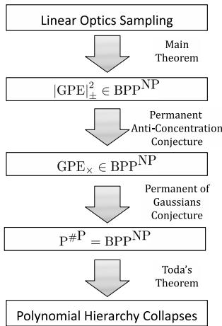
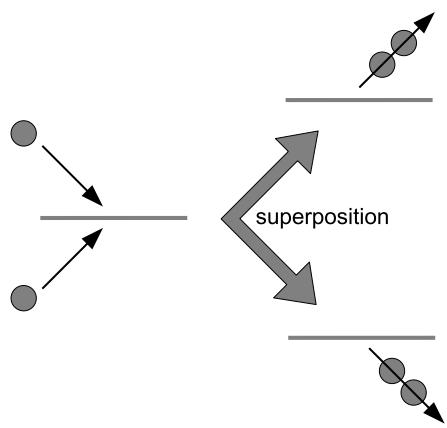
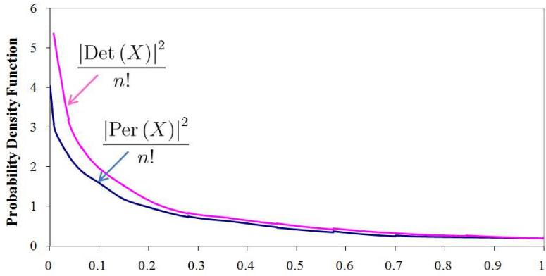

# The Computational Complexity of Linear Optics

Scott Aaronson∗ Alex Arkhipov†

# Abstract

We give new evidence that quantum computers—moreover, rudimentary quantum computers built entirely out of linear-optical elements—cannot be efficiently simulated by classical computers. In particular, we define a model of computation in which identical photons are generated, sent through a linear-optical network, then nonadaptively measured to count the number of photons in each mode. This model is not known or believed to be universal for quantum computation, and indeed, we discuss the prospects for realizing the model using current technology. On the other hand, we prove that the model is able to solve sampling problems and search problems that are classically intractable under plausible assumptions.

Our first result says that, if there exists a polynomial-time classical algorithm that samples from the same probability distribution as a linear-optical network, then P#P = BPPNP, and hence the polynomial hierarchy collapses to the third level. Unfortunately, this result assumes an extremely accurate simulation.

Our main result suggests that even an approximate or noisy classical simulation would already imply a collapse of the polynomial hierarchy. For this, we need two unproven conjectures: the Permanent-of-Gaussians Conjecture, which says that it is $\# \mathsf { P }$ -hard to approximate the permanent of a matrix $A$ of independent $\mathcal { N } \left( 0 , 1 \right)$ Gaussian entries, with high probability over $A$ ; and the Permanent Anti-Concentration Conjecture, which says that $| \mathrm { P e r } \left( A \right) | \geq \sqrt { n ! } / \operatorname { p o l y } \left( n \right)$ with high probability over $A$ . We present evidence for these conjectures, both of which seem interesting even apart from our application.

This paper does not assume knowledge of quantum optics. Indeed, part of its goal is to develop the beautiful theory of noninteracting bosons underlying our model, and its connection to the permanent function, in a self-contained way accessible to theoretical computer scientists.

# Contents

# 1 Introduction 2

1.1 Our Model 4   
1.2 Our Results . 5   
1.2.1 The Exact Case . 5   
1.2.2 The Approximate Case 7   
1.2.3 The Permanents of Gaussian Matrices 8   
1.3 Experimental Implications 10   
1.4 Related Work . 12   
2 Preliminaries 16   
2.1 Sampling and Search Problems 17

# 3 The Noninteracting-Boson Model of Computation 18

3.1 Physical Definition 19   
3.2 Polynomial Definition 21   
3.3 Permanent Definition . 26   
3.4 Bosonic Complexity Theory 28

# 4 Efficient Classical Simulation of Linear Optics Collapses PH 29

4.1 Basic Result . 30   
4.2 Alternate Proof Using KLM 34   
4.3 Strengthening the Result . 35

# 5 Main Result 37

5.1 Truncations of Haar-Random Unitaries . . 37   
5.2 Hardness of Approximate BosonSampling 43   
5.3 Implications . . 48

# 6 Experimental Prospects 48

6.1 The Generalized Hong-Ou-Mandel Dip 49   
6.2 Physical Resource Requirements 51   
6.3 Reducing the Size and Depth of Optical Networks 55

7 Reducing GPE $\times$ to $| \mathbf { G P E } | _ { \pm } ^ { 2 }$

57

# 8 The Distribution of Gaussian Permanents 66

8.1 Numerical Data . 68   
8.2 The Analogue for Determinants 68   
8.3 Weak Version of the PACC 72

# 9 The Hardness of Gaussian Permanents 76

9.1 Evidence That GPE $\times$ Is #P-Hard 76   
9.2 The Barrier to Proving the PGC 80

# 10 Open Problems 83

# 11 Acknowledgments 84

12 Appendix: Positive Results for Simulation of Linear Optics

13 Appendix: The Bosonic Birthday Paradox 91

# 1 Introduction

The Extended Church-Turing Thesis says that all computational problems that are efficiently solvable by realistic physical devices, are efficiently solvable by a probabilistic Turing machine. Ever since Shor’s algorithm [52], we have known that this thesis is in severe tension with the currentlyaccepted laws of physics. One way to state Shor’s discovery is this:

Predicting the results of a given quantum-mechanical experiment, to finite accuracy, cannot be done by a classical computer in probabilistic polynomial time, unless factoring integers can as well.

As the above formulation makes clear, Shor’s result is not merely about some hypothetical future in which large-scale quantum computers are built. It is also a hardness result for a practical problem. For simulating quantum systems is one of the central computational problems of modern science, with applications from drug design to nanofabrication to nuclear physics. It has long been a major application of high-performance computing, and Nobel Prizes have been awarded for methods (such as the Density Functional Theory) to handle special cases. What Shor’s result shows is that, if we had an efficient, general-purpose solution to the quantum simulation problem, then we could also break widely-used cryptosystems such as RSA.

However, as evidence against the Extended Church-Turing Thesis, Shor’s algorithm has two significant drawbacks. The first is that, even by the conjecture-happy standards of complexity theory, it is no means settled that factoring is classically hard. Yes, we believe this enough to base modern cryptography on it—but as far as anyone knows, factoring could be in BPP without causing any collapse of complexity classes or other disastrous theoretical consequences. Also, of course, there are subexponential-time factoring algorithms (such as the number field sieve), and few would express confidence that they cannot be further improved. And thus, ever since Bernstein and Vazirani [9] defined the class BQP of quantumly feasible problems, it has been a dream of quantum computing theory to show (for example) that, if ${ \mathsf { B P P } } = { \mathsf { B Q P } }$ , then the polynomial hierarchy would collapse, or some other “generic, foundational” assumption of theoretical computer science would fail. In this paper, we do not quite achieve that dream, but we come closer than one might have thought possible.

The second, even more obvious drawback of Shor’s algorithm is that implementing it scalably is well beyond current technology. To run Shor’s algorithm, one needs to be able to perform arithmetic (including modular exponentiation) on a coherent superposition of integers encoded in binary. This does not seem much easier than building a universal quantum computer.1 In particular, it appears one first needs to solve the problem of fault-tolerant quantum computation, which is known to be possible in principle if quantum mechanics is valid [7, 36], but might require decoherence rates that are several orders of magnitude below what is achievable today.

Thus, one might suspect that proving a quantum system’s computational power by having it factor integers encoded in binary is a bit like proving a dolphin’s intelligence by teaching it to solve arithmetic problems. Yes, with heroic effort, we can probably do this, and perhaps we have good reasons to. However, if we just watched the dolphin in its natural habitat, then we might see it display equal intelligence with no special training at all.

Following this analogy, we can ask: are there more “natural” quantum systems that already provide evidence against the Extended Church-Turing Thesis? Indeed, there are countless quantum systems accessible to current experiments—including high-temperature superconductors, Bose-Einstein condensates, and even just large nuclei and molecules—that seem intractable to simulate on a classical computer, and largely for the reason a theoretical computer scientist would expect: namely, that the dimension of a quantum state increases exponentially with the number of particles. The difficulty is that it is not clear how to interpret these systems as solving computational problems. For example, what is the “input” to a Bose-Einstein condensate? In other words, while these systems might be hard to simulate, we would not know how to justify that conclusion using the one formal tool (reductions) that is currently available to us.

  
Figure 1: Galton’s board, a simple “computer” to output samples from the binomial distribution. From MathWorld, http://mathworld.wolfram.com/GaltonBoard.html

So perhaps the real question is this: do there exist quantum systems that are “intermediate” between Shor’s algorithm and a Bose-Einstein condensate—in the sense that

(1) they are significantly closer to experimental reality than universal quantum computers, but (2) they can be proved, under plausible complexity assumptions (the more “generic” the better), to be intractable to simulate classically?

In this paper, we will argue that the answer is yes.

# 1.1 Our Model

We define and study a formal model of quantum computation with noninteracting bosons. Physically, our model could be implemented using a linear-optical network, in which $n$ identical photons pass through a collection of simple optical elements (beamsplitters and phaseshifters), and are then measured to determine their locations. In Section 3, we give a detailed exposition of the model that does not presuppose any physics knowledge. For now, though, it is helpful to imagine a rudimentary “computer” consisting of $n$ identical balls, which are dropped one by one into a vertical lattice of pegs, each of which randomly scatters each incoming ball onto one of two other pegs. Such an arrangement—called Galton’s board—is sometimes used in science museums to illustrate the binomial distribution (see Figure 1). The “input” to the computer is the exact arrangement $A$ of the pegs, while the “output” is the number of balls that have landed at each location on the bottom (or rather, a sample from the joint distribution $\mathcal { D } _ { A }$ over these numbers). There is no interaction between pairs of balls.

Our model is essentially the same as that shown in Figure 1, except that instead of identical balls, we use identical bosons governed by quantum statistics. Other minor differences are that, in our model, the “balls” are each dropped from different starting locations, rather than a single location; and the “pegs,” rather than being arranged in a regular lattice, can be arranged arbitrarily to encode a problem of interest.

Mathematically, the key point about our model is that, to find the probability of any particular output of the computer, one needs to calculate the permanent of an $n \times n$ matrix. This can be seen even in the classical case: suppose there are $n$ balls and $n$ final locations, and ball $i$ has probability $a _ { i j }$ of landing at location $j$ . Then the probability of one ball landing in each of the $n$ locations is

$$
\operatorname { P e r } \left( A \right) = \sum _ { \sigma \in S _ { n } } \prod _ { i = 1 } ^ { n } a _ { i \sigma ( i ) } ,
$$

where A = (aij )i,j [n]. Of course, in the classical case, the $a _ { i j }$ ’s are nonnegative real numbers— which means that we can approximate $\mathrm { P e r } \left( A \right)$ in probabilistic polynomial time, by using the celebrated algorithm of Jerrum, Sinclair, and Vigoda [30]. In the quantum case, by contrast, the $a _ { i j }$ ’s are complex numbers. And it is not hard to show that, given a general matrix $A \in \mathbb { C } ^ { n \times n }$ , even approximating $\mathrm { P e r } \left( A \right)$ to within a constant factor is #P-complete. This fundamental difference between nonnegative and complex matrices is the starting point for everything we do in this paper.

It is not hard to show that a boson computer can be simulated by a “standard” quantum computer (that is, in BQP). But the other direction seems extremely unlikely—indeed, it even seems unlikely that a boson computer can do universal classical computation! Nor do we have any evidence that a boson computer could factor integers, or solve any other decision or promise problem not in BPP. However, if we broaden the notion of a computational problem to encompass sampling and search problems, then the situation is quite different.

# 1.2 Our Results

In this paper we study BosonSampling: the problem of sampling, either exactly or approximately, from the output distribution of a boson computer. Our goal is to give evidence that this problem is hard for a classical computer. Our main results fall into three categories:

(1) Hardness results for exact BosonSampling, which give an essentially complete picture of that case.   
(2) Hardness results for approximate BosonSampling, which depend on plausible conjectures about the permanents of i.i.d. Gaussian matrices.   
(3) A program aimed at understanding and proving the conjectures.

We now discuss these in turn.

# 1.2.1 The Exact Case

Our first (easy) result, proved in Section 4, says the following.

Theorem 1 The exact BosonSampling problem is not efficiently solvable by a classical computer, unless $\mathsf { P } ^ { \# \mathsf { P } } = \mathsf { B P P } ^ { \mathsf { N P } }$ and the polynomial hierarchy collapses to the third level.

More generally, let $\mathcal { O }$ be any oracle that “simulates boson computers,” in the sense that $\mathcal { O }$ takes as input a random string $r$ (which $\mathcal { O }$ uses as its only source of randomness) and a description of $a$ boson computer $A$ , and returns a sample $\mathcal { O } _ { A } \left( r \right)$ from the probability distribution $\mathcal { D } _ { A }$ over possible outputs of A. Then P#P ⊆ BPPNPO.

In particular, even if the exact BosonSampling problem were solvable by a classical computer with an oracle for a PH problem, Theorem 1 would still imply that $\mathsf { P } ^ { \# \mathsf { P } } \subseteq \mathsf { B P P } ^ { \mathsf { P } \mathsf { H } }$ —and therefore that the polynomial hierarchy would collapse, by Toda’s Theorem [60]. This provides evidence that quantum computers have capabilities outside the entire polynomial hierarchy, complementing the recent evidence of Aaronson [3] and Fefferman and Umans [20].

At least for a computer scientist, it is tempting to interpret Theorem 1 as saying that “the exact BosonSampling problem is $\# \mathsf { P }$ -hard under BPP ${ \mathsf { N P } }$ -reductions.” Notice that this would have a shocking implication: that quantum computers (indeed, quantum computers of a particularly simple kind) could efficiently solve a #P-hard problem!

There is a catch, though, arising from the fact that BosonSampling is a sampling problem rather than a decision problem. Namely, if $\mathcal { O }$ is an oracle for sampling from the boson distribution $\mathcal { D } _ { A }$ , then Theorem 1 shows that $\mathsf { P } ^ { \# \mathsf { P } } \subseteq \mathsf { B P P } ^ { \mathsf { N P } ^ { \cup } }$ —but only if the BPP ${ \mathsf { N P } }$ machine gets to fix the random bits used by $\mathcal { O }$ . This condition is clearly met if $\mathcal { O }$ is a classical randomized algorithm, since we can always interpret a randomized algorithm as just a deterministic algorithm that takes a random string $r$ as part of its input. On the other hand, the condition would not be met if we implemented $\mathcal { O }$ (for example) using the boson computer itself. In other words, our “reduction” from #P-complete problems to BosonSampling makes essential use of the hypothesis that we have a classical BosonSampling algorithm.

We will give two proofs of Theorem 1. In the first proof, we consider the probability $p$ of some particular basis state when a boson computer is measured. We then prove two facts:

(1) Even approximating $p$ to within a multiplicative constant is a #P-hard problem.

(2) If we had a polynomial-time classical algorithm for exact BosonSampling, then we could approximate $p$ to within a multiplicative constant in the class BPP ${ \mathsf { N P } }$ , by using a standard technique called universal hashing.

Combining facts (1) and (2), we find that, if the classical BosonSampling algorithm exists, then $\mathsf { P } ^ { \# \mathsf { P } } = \mathsf { B P P } ^ { \mathsf { N P } }$ , and therefore the polynomial hierarchy collapses.

Our second proof was inspired by independent work of Bremner, Jozsa, and Shepherd [10]. In this proof, we start with a result of Knill, Laflamme, and Milburn [35], which says that linear optics with adaptive measurements is universal for BQP. A straightforward modification of their construction shows that linear optics with postselected measurements is universal for PostBQP (that is, quantum polynomial-time with postselection on possibly exponentially-unlikely measurement outcomes). Furthermore, Aaronson [2] showed that PostBQP = PP. On the other hand, if a classical BosonSampling algorithm existed, then we will show that we could simulate postselected linear optics in PostBPP (that is, classical polynomial-time with postselection, also called BPPpath). We would therefore get

$$
{ \mathsf { B P P } } _ { \mathsf { p a t h } } = { \mathsf { P o s t B P P } } = { \mathsf { P o s t B Q P } } = { \mathsf { P P } } ,
$$

which is known to imply a collapse of the polynomial hierarchy.

Despite the simplicity of the above arguments, there is something conceptually striking about them. Namely, starting from an algorithm to simulate quantum mechanics, we get an algorithm2 to solve #P-complete problems—even though solving #P-complete problems is believed to be well beyond what a quantum computer itself can do! Of course, one price we pay is that we need to talk about sampling problems rather than decision problems. If we do so, though, then we get to base our belief in the power of quantum computers on $\mathsf { P } ^ { \# \mathsf { P } } \neq \mathsf { B } \mathsf { P } \mathsf { P } ^ { \mathsf { N P } }$ , which is a much more “generic” (many would say safer) assumption than Factoring $\notin$ BPP.

As we see it, the central drawback of Theorem 1 is that it only addresses the consequences of a fast classical algorithm that exactly samples the boson distribution $\mathcal { D } _ { A }$ . One can relax this condition slightly: if the oracle $\mathcal { O }$ samples from some distribution $\mathcal { D } _ { A } ^ { \prime }$ whose probabilities are all multiplicatively close to those in DA, then we still get the conclusion that P#P ⊆ BPPNPO. In our view, though, multiplicative closeness is already too strong an assumption. At a minimum, given as input an error parameter $\varepsilon > 0$ , we ought to let our simulation algorithm sample from some distribution $\mathcal { D } _ { A } ^ { \prime }$ such that $\| \mathcal { D } _ { A } ^ { \prime } - \mathcal { D } _ { A } \| \leq \varepsilon$ (where $\lVert \cdot \rVert$ represents total variation distance), using poly $( n , 1 / \varepsilon )$ time.

Why are we so worried about this issue? One obvious reason is that noise, decoherence, photon losses, etc. will be unavoidable features in any real implementation of a boson computer. As a result, not even the boson computer itself can sample exactly from the distribution $\mathcal { D } _ { A }$ ! So it seems arbitrary and unfair to require this of a classical simulation algorithm.

A second, more technical reason to allow error is that later, we would like to show that a boson computer can solve classically-intractable search problems, in addition to sampling problems. However, while Aaronson [4] proved an extremely general connection between search problems and sampling problems, that connection only works for approximate sampling, not exact sampling.

The third, most fundamental reason to allow error is that the connection we are claiming, between quantum computing and #P-complete problems, is so counterintuitive. One’s first urge is to dismiss this connection as an artifact of poor modeling choices. So the burden is on us to demonstrate the connection’s robustness.

Unfortunately, the proof of Theorem 1 fails completely when we consider approximate sampling algorithms. The reason is that the proof hinges on the #P-completeness of estimating a single, exponentially-small probability $p$ . Thus, if a sampler “knew” which $p$ we wanted to estimate, then it could adversarially choose to corrupt that $p$ . It would still be a perfectly good approximate sampler, but would no longer reveal the solution to the #P-complete instance that we were trying to solve.

# 1.2.2 The Approximate Case

To get around the above problem, we need to argue that a boson computer can sample from a distribution $\mathcal { D }$ that “robustly” encodes the solution to a #P-complete problem. This means intuitively that, even if a sampler was badly wrong about any $\varepsilon$ fraction of the probabilities in $\mathcal { D }$ , the remaining $1 - \varepsilon$ fraction would still allow the #P-complete problem to be solved.

It is well-known that there exist #P-complete problems with worst-case/average-case equivalence, and that one example of such a problem is the permanent, at least over finite fields. This is a reason for optimism that the sort of robust encoding we need might be possible. Indeed, it was precisely our desire to encode the “robustly #P-complete” permanent function into a quantum computer’s amplitudes that led us to study the noninteracting-boson model in the first place. That this model also has great experimental interest simply came as a bonus.

In this paper, our main technical contribution is to prove a connection between the ability of classical computers to solve the approximate BosonSampling problem and their ability to approximate the permanent. This connection “almost” shows that even approximate classical simulation of boson computers would imply a collapse of the polynomial hierarchy. There is still a gap in the argument, but it has nothing to do with quantum computing. The gap is simply that it is not known, at present, how to extend the worst-case/average-case equivalence of the permanent from finite fields to suitably analogous statements over the reals or complex numbers. We will show that, $i f$ this gap can be bridged, then there exist search problems and approximate sampling problems that are solvable in polynomial time by a boson computer, but not by a BPP machine unless P#P = BPPNP.

More concretely, consider the following problem, where the GPE stands for Gaussian Permanent Estimation:

Problem 2 $( | \mathbf { G P E } | _ { \pm } ^ { 2 } )$ Given as input a matrix $\ b X \sim \ b N ( 0 , 1 ) _ { \mathbb { C } } ^ { n \times n }$ of i.i.d. Gaussians, together with error bounds $\varepsilon , \delta > 0$ , estimate $| \mathrm { P e r } \left( X \right) | ^ { 2 }$ to within additive error $\pm \varepsilon \cdot n !$ , with probability at least $1 - \delta$ over $X$ , in poly $( n , 1 / \varepsilon , 1 / \delta )$ time.

Then our main result is the following.

Theorem 3 (Main Result) Let $\mathcal { D } _ { A }$ be the probability distribution sampled by a boson computer $A$ . Suppose there exists a classical algorithm $C$ that takes as input a description of $A$ as well as an error bound $\varepsilon$ , and that samples from a probability distribution $\mathcal { D } _ { A } ^ { \prime }$ such that $\| { \mathcal { D } } _ { A } ^ { \prime } - { \mathcal { D } } _ { A } \| \leq \varepsilon$ in poly (|A| , 1/ε) time. Then the |GPE|2 problem is solvable in BPPNP. I ndeed, if we treat $C$ as $a$ black box, then |GPE|2 ∈ BPPNPC .

Theorem 3 is proved in Section 5. The key idea of the proof is to “smuggle” the $| \mathrm { G P E } | _ { \pm } ^ { 2 }$ instance $X$ that we want to solve into the probability of a random output of a boson computer $A$ . That way, even if the classical sampling algorithm $C$ is adversarial, it will not know which of the exponentially many probabilities in $\mathcal { D } _ { A }$ is the one we care about. And therefore, provided $C$ correctly approximates most probabilities in $\mathcal { D } _ { A }$ , with high probability it will correctly approximate “our” probability, and will therefore allow $| \mathrm { P e r } \left( X \right) | ^ { 2 }$ to be estimated in BPPNP.

Besides this conceptual step, the proof of Theorem 3 also contains a technical component that might find other applications in quantum information. This is that, if we choose an $m \times m$ unitary matrix $U$ randomly according to the Haar measure, then any $n \times n$ submatrix of $U$ will be close in variation distance to a matrix of i.i.d. Gaussians, provided that $n \le m ^ { 1 / 6 }$ . Indeed, the fact that i.i.d. Gaussian matrices naturally arise as submatrices of Haar unitaries is the reason why we will be so interested in Gaussian matrices in this paper, rather than Bernoulli matrices or other well-studied ensembles.

In our view, Theorem 3 already shows that fast, approximate classical simulation of boson computers would have a surprising complexity consequence. For notice that, if $\boldsymbol { X } \sim \mathcal { N } \left( 0 , 1 \right) _ { \mathbb { C } } ^ { n \times n }$ is a complex Gaussian matrix, then $\mathrm { P e r } \left( X \right)$ is a sum of $n$ ! complex terms, almost all of which usually cancel each other out, leaving only a tiny residue exponentially smaller than $n !$ . A priori, there seems to be little reason to expect that residue to be approximable in the polynomial hierarchy, let alone in BPPNP.

# 1.2.3 The Permanents of Gaussian Matrices

One could go further, though, and speculate that estimating $\mathrm { P e r } \left( X \right)$ for Gaussian $X$ is actually #P-hard. We call this the Permanent-of-Gaussians Conjecture, or PGC.3 We prefer to state the

PGC using a more “natural” variant of the Gaussian Permanent Estimation problem than $| \mathrm { G P E } | _ { \pm } ^ { 2 }$ . The more natural variant talks about estimating $\mathrm { P e r } \left( X \right)$ itself, rather than $| \mathrm { P e r } \left( X \right) | ^ { 2 }$ , and also asks for a multiplicative rather than additive approximation.

Problem 4 $\mathbf { \vec { G P E } } _ { \times }$ ) Given as input a matrix $\ b X \sim \ b N ( 0 , 1 ) _ { \mathbb { C } } ^ { n \times n }$ of i.i.d. Gaussians, together with error bounds $\varepsilon , \delta > 0$ , estimate $\mathrm { P e r } \left( X \right)$ to within error $\pm \varepsilon \cdot | \mathrm { P e r } \left( X \right) |$ , with probability at least $1 - \delta$ over $X$ , in poly $( n , 1 / \varepsilon , 1 / \delta )$ time.

Then the main complexity-theoretic challenge we offer is to prove or disprove the following:

Conjecture 5 (Permanent-of-Gaussians Conjecture or PGC) GPE $\times$ is #P-hard. In other   
words, if $\mathcal { O }$ is any oracle that solves GPE , then $\mathsf { P } ^ { \# \mathsf { P } } \subseteq \mathsf { B P P } ^ { \mathcal { O } }$ . $\times$

Of course, a question arises as to whether one can bridge the gap between the $| \mathrm { G P E } | _ { \pm } ^ { 2 }$ problem that appears in Theorem 3, and the more “natural” GPE $\times$ problem used in Conjecture 5. We are able to do so assuming another conjecture, this one an extremely plausible anti-concentration bound for the permanents of Gaussian random matrices.

Conjecture 6 (Permanent Anti-Concentration Conjecture) There exists a polynomial p such that for all $n$ and $\delta > 0$ ,

$$
\operatorname* { P r } _ { X \sim \mathcal { N } ( 0 , 1 ) _ { \mathbb { C } } ^ { n \times n } } \left[ | \mathrm { P e r } \left( X \right) | < \frac { \sqrt { n ! } } { p \left( n , 1 / \delta \right) } \right] < \delta .
$$

In Section 7, we give a complicated reduction that proves the following:

Theorem 7 Suppose the Permanent Anti-Concentration Conjecture holds. Then |GPE $| _ { \pm } ^ { 2 }$ and GPE $\times$ are polynomial-time equivalent.

Figure 2 summarizes the overall structure of our hardness argument for approximate Boson-Sampling.

The rest of the body of the paper aims at a better understanding of Conjectures 5 and 6.

First, in Section 8, we summarize the considerable evidence for the Permanent Anti-Concentration Conjecture. This includes numerical results; a weaker anti-concentration bound for the permanent recently proved by Tao and Vu [57]; another weaker bound that we prove; and the analogue of Conjecture 6 for the determinant.

Next, in Section 9, we discuss the less certain state of affairs regarding the Permanent-of-Gaussians Conjecture. On the one hand, we extend the random self-reducibility of permanents over finite fields proved by Lipton [39], to show that exactly computing the permanent of most Gaussian matrices $\boldsymbol { X } \sim \mathcal { N } \left( 0 , 1 \right) _ { \mathbb { C } } ^ { n \times n }$ is $\# \mathsf { P }$ -hard. On the other hand, we also show that extending this result further, to show that approximating $\mathrm { P e r } \left( X \right)$ for Gaussian $X$ is $\# \mathsf { P }$ -hard, will require going beyond Lipton’s polynomial interpolation technique in a fundamental way.

Two appendices give some additional results. First, in Appendix 12, we present two remarkable algorithms due to Gurvits [27] (with Gurvits’s kind permission) for solving certain problems related to linear-optical networks in classical polynomial time. We also explain why these algorithms do not conflict with our hardness conjecture. Second, in Appendix 13, we bring out a useful fact that was implicit in our proof of Theorem 3, but seems to deserve its own treatment. This is that, if we have $n$ identical bosons scattered among $m \gg n ^ { 2 }$ locations, with no two bosons in the same location, and if we apply a Haar-random $m \times m$ unitary transformation $U$ and then measure the number of bosons in each location, with high probability we will still not find two bosons in the same location. In other words, at least asymptotically, the birthday paradox works the same way for identical bosons as for classical particles, in spite of bosons’ well-known tendency to cluster in the same state.

  
Figure 2: Summary of our hardness argument (modulo conjectures). If there exists a polynomialtime classical algorithm for approximate BosonSampling, then Theorem 3 says that $| \mathrm { G P E } | _ { \pm } ^ { 2 } \in$ BPPNP. Assuming Conjecture 6 (the PACC), Theorem 7 says that this is equivalent to $\mathrm { G P E } _ { \times } \in$ BPPNP. Assuming Conjecture 5 (the PGC), this is in turn equivalent to $\mathsf { P } ^ { \# \mathsf { P } } = \mathsf { B } \mathsf { P } \mathsf { P } ^ { \mathsf { N P } }$ × , which collapses the polynomial hierarchy by Toda’s Theorem [60].

# 1.3 Experimental Implications

An important motivation for our results is that they immediately suggest a linear-optics experiment, which would use simple optical elements (beamsplitters and phaseshifters) to induce a Haar-random $m \times m$ unitary transformation $U$ on an input state of $n$ photons, and would then check that the probabilities of various final states of the photons correspond to the permanents of $n \times n$ submatrices of $U$ , as predicted by quantum mechanics. Were such an experiment successfully scaled to large values of $n$ , Theorem 3 asserts that no polynomial-time classical algorithm could simulate the experiment even approximately, unless |GPE|2 ∈ BPPNP.

Of course, the question arises of how large $n$ has to be before one can draw interesting conclusions. An obvious difficulty is that no finite experiment can hope to render a decisive verdict on the Extended Church-Turing Thesis, since the ECT is a statement about the asymptotic limit as $n \to \infty$ . Indeed, this problem is actually worse for us than for (say) Shor’s algorithm, since unlike with Factoring, we do not believe there is any NP witness for BosonSampling. In other words, if $n$ is large enough that a classical computer cannot solve BosonSampling, then $n$ is probably also large enough that a classical computer cannot even verify that a quantum computer is solving BosonSampling correctly.

Yet while this sounds discouraging, it is not really an issue from the perspective of near-term experiments. For the foreseeable future, $n$ being too large is likely to be the least of one’s problems!

If one could implement our experiment with (say) $2 0 \leq n \leq 3 0$ , then certainly a classical computer could verify the answers—but at the same time, one would be getting direct evidence that a quantum computer could efficiently solve an “interestingly difficult” problem, one for which the best-known classical algorithms require many millions of operations. While disproving the Extended Church-Turing Thesis is formally impossible, such an experiment would arguably constitute the strongest evidence against the ECT to date.

Section 6 goes into more detail about the physical resource requirements for our proposed experiment, as well as how one would interpret the results. In Section 6, we also show that the size and depth of the linear-optical network needed for our experiment can both be improved by polynomial factors over the na¨ıve bounds. Complexity theorists who are not interested in the “practical side” of boson computation can safely skip Section 6, while experimentalists who are only interested the practical side can skip everything else.

While most further discussion of experimental issues is deferred to Section 6, there is one question we need to address now. Namely: what, if any, are the advantages of doing our experiment, as opposed simply to building a somewhat larger “conventional” quantum computer, able (for example) to factor 10-digit numbers using Shor’s algorithm? While a full answer to this question will need to await detailed analysis by experimentalists, let us mention four aspects of BosonSampling that might make it attractive for quantum computing experiments.

(1) Our proposal does not require any explicit coupling between pairs of photons. It therefore bypasses what has long been seen as one of the central technological obstacles to building a scalable quantum computer: namely, how to make arbitrary pairs of particles “talk to each other” (e.g., via two-qubit gates), in a manner that still preserves the particles’ coherence. One might ask how there is any possibility of a quantum speedup, if the particles are never entangled. The answer is that, because of the way boson statistics work, every two identical photons are somewhat entangled “for free,” in the sense that the amplitude for any process involving both photons includes contributions in which the photons swap their states. This “free” entanglement is the only kind that our model ever uses.

(2) Photons traveling through linear-optical networks are known to have some of the best coherence properties of any quantum system accessible to current experiments. From a “traditional” quantum computing standpoint, the disadvantages of photons are that they have no direct coupling to one another, and also that they are extremely difficult to store (they are, after all, traveling at the speed of light). There have been ingenious proposals for working around these problems, most famously the adaptive scheme of Knill, Laflamme, and Milburn [35]. By contrast, rather than trying to remedy photons’ disadvantages as qubits, our proposal simply never uses photons as qubits at all, and thereby gets the coherence advantages of linear optics without having to address the disadvantages.

(3) To implement Shor’s algorithm, one needs to perform modular arithmetic on a coherent superposition of integers encoded in binary. Unfortunately, this requirement causes significant constant blowups, and helps to explain why the “world record” for implementations of Shor’s algorithm is still the factoring of 15 into $3 \times 5$ , first demonstrated in 2001 [64]. By contrast, because the BosonSampling problem is so close to the “native physics” of linear-optical networks, an $n$ -photon experiment corresponds directly to a problem instance of size $n$ , which involves the permanents of $n \times n$ matrices. This raises the hope that, using current technology, one could sample quantum-mechanically from a distribution in which the probabilities depended (for example) on the permanents of $1 0 \times 1 0$ matrices of complex numbers.

(4) The resources that our experiment does demand—including reliable single-photon sources and photodetector arrays—are ones that experimentalists, for their own reasons, have devoted large and successful efforts to improving within the past decade. We see every reason to expect further improvements.

In implementing our experiment, the central difficulty is likely to be getting a reasonably-large probability of an $n$ -photon coincidence: that is, of all $n$ photons arriving at the photodetectors at the same time (or rather, within a short enough time interval that interference is seen). If the photons arrive at different times, then they effectively become distinguishable particles, and the experiment no longer solves the BosonSampling problem. Of course, one solution is simply to repeat the experiment many times, then postselect on the $n$ -photon coincidences. However, if the probability of an $n$ -photon coincidence decreases exponentially with $n$ , then this “solution” has obvious scalability problems.

$I f$ one could scale our experiment to moderately large values of $n$ (say, 10 or 20), without the probability of an $n$ -photon coincidence falling off dramatically, then our experiment would raise the exciting possibility of doing an interestingly-large quantum computation without any need for explicit quantum error-correction. Whether or not this is feasible is the main open problem we leave for experimentalists.

# 1.4 Related Work

By necessity, this paper brings together many ideas from quantum computing, optical physics, and computational complexity. In this section, we try to survey the large relevant literature, organizing it into eight categories.

Quantum computing with linear optics. There is a huge body of work, both experimental and theoretical, on quantum computing with linear optics. Much of that work builds on a seminal 2001 result of Knill, Laflamme, and Milburn [35], showing that linear optics combined with adaptive measurements is universal for quantum computation. It is largely because of this result that linear optics is considered a viable proposal for building a universal quantum computer.4

In the opposite direction, several interesting classes of linear-optics experiments have been proved to be efficiently simulable on a classical computer. For example, Bartlett and Sanders [8] showed that a linear-optics network with coherent-state inputs and possibly-adaptive Gaussian measurements can be simulated in classical polynomial time. (Intuitively, a coherent state— the output of a standard laser—is a superposition over different numbers of photons that behaves essentially like a classical wave, while a Gaussian measurement is a measurement that preserves this classical wave behavior.) Also, Gurvits [27] showed that, in any $n$ -photon linear-optics experiment, the probability of measuring a particular basis state can be estimated to within $\pm \varepsilon$ additive error in poly $( n , 1 / \varepsilon )$ time.5 He also showed that the marginal distribution over any $k$ photon modes can be computed deterministically in $n ^ { O ( k ) }$ time. We discuss Gurvits’s results in detail in Appendix 12.

Our model can be seen as intermediate between the above two extremes: unlike Knill et al. [35], we do not allow adaptive measurements, and as a result, our model is probably not universal for BQP. On the other hand, unlike Bartlett and Sanders, we do allow single-photon inputs and photon-number measurements; and unlike Gurvits [27], we consider the complexity of sampling from the joint distribution over all poly ( $n$ ) photon modes. Our main result gives strong evidence that the resulting model cannot be simulated in classical polynomial time. On the other hand, it might be significantly easier to implement than a universal quantum computer.

Intermediate models of quantum computation. By now, several interesting models of quantum computation have been proposed that are neither known to be universal for BQP, nor simulable in classical polynomial time. A few examples, besides the ones mentioned elsewhere in the paper, are the “one-clean-qubit” model of Knill and Laflamme [34]; the permutational quantum computing model of Jordan [31]; and stabilizer circuits with non-stabilizer initial states (such as $\cos { \frac { \pi } { 8 } } \left| 0 \right. + \sin { \frac { \pi } { 8 } } \left| 0 \right. )$ and nonadaptive measurements [5]. The noninteracting-boson model is another addition to this list.

The Hong-Ou-Mandel dip. In 1987, Hong, Ou, and Mandel [29] performed a now-standard experiment that, in essence, directly confirms that two-photon amplitudes correspond to $2 \times 2$ permanents in the way predicted by quantum mechanics. From an experimental perspective, what we are asking for could be seen as a generalization of the so-called “Hong-Ou-Mandel dip” to the $n$ -photon case, where $n$ is as large as possible. Lim and Beige [38] previously proposed an $n$ -photon generalization of the Hong-Ou-Mandel dip, but without the computational complexity motivation.

Bosons and the permanent. Bosons are one of the two basic types of particle in the universe; they include photons and the carriers of nuclear forces. It has been known since work by Caianiello [13] in 1953 (if not earlier) that the amplitudes for $n$ -boson processes can be written as the permanents of $n \times n$ matrices. Meanwhile, Valiant [62] proved in 1979 that the permanent is $\# \mathsf { P }$ -complete. Interestingly, according to Valiant (personal communication), he and others put these two facts together immediately, and wondered what they might mean for the computational complexity of simulating bosonic systems. To our knowledge, however, the first authors to discuss this question in print were Troyansky and Tishby [61] in 1996. Given an arbitrary matrix $A \in \mathbb { C } ^ { n \times n }$ , these authors showed how to construct a quantum observable with expectation value equal to $\operatorname { P e r } \left( A \right)$ . However, they correctly pointed out that this did not imply a polynomial-time quantum algorithm to calculate $\operatorname { P e r } \left( A \right)$ , since the variance of their observable was large enough that exponentially many samples would be needed.

Later, Scheel [49] explained how permanents arise as amplitudes in linear-optical networks, and noted that calculations involving linear-optical networks might be intractable because the permanent is $\# \mathsf { P }$ -complete.

Fermions and the determinant. Besides bosons, the other basic particles in the universe are fermions; these include matter particles such as quarks and electrons. Remarkably, the amplitudes for $n$ -fermion processes are given not by permanents but by determinants of $n \times n$ matrices. Despite the similarity of their definitions, it is well-known that the permanent and determinant differ dramatically in their computational properties; the former is $\# \mathsf { P }$ -complete while the latter is in $\mathsf { P }$ . In a lecture in 2000, Wigderson called attention to this striking connection between the bosonfermion dichotomy of physics and the permanent-determinant dichotomy of computer science. He joked that, between bosons and fermions, “the bosons got the harder job.” One could view this paper as a formalization of Wigderson’s joke.

To be fair, half the work of formalizing Wigderson’s joke has already been carried out. In 2002, Valiant [63] defined a beautiful subclass of quantum circuits called matchgate circuits, and showed that these circuits could be efficiently simulated classically, via a nontrivial algorithm that ultimately relied on computing determinants.6 Shortly afterward, Terhal and DiVincenzo [58] (see also Knill [33]) pointed out that matchgate circuits were equivalent to systems of noninteracting fermions7: in that sense, one could say Valiant had “rediscovered fermions”! Indeed, Valiant’s matchgate model can be seen as the direct counterpart of the model studied in this paper, but with noninteracting fermions in place of noninteracting bosons.8 At a very high level, Valiant’s model is easy to simulate classically because the determinant is in P, whereas our model is hard to simulate because the permanent is #P-complete.

Ironically, when the quantum Monte Carlo method [14] is used to approximate the ground states of many-body systems, the computational situation regarding bosons and fermions is reversed. Bosonic ground states tend to be easy to approximate because one can exploit non-negativity, while fermionic ground states tend to be hard to approximate because of cancellations between positive and negative terms, what physicists call “the sign problem.”

Quantum computing and #P-complete problems. Since amplitudes in quantum mechanics are the sums of exponentially many complex numbers, it is natural to look for some formal connection between quantum computing and the class $\# \mathsf { P }$ of counting problems. In 1993, Bernstein and Vazirani [9] proved that ${ \mathsf { B Q P \subseteq P ^ { \# } P } }$ .9 However, this result says only that #P is an upper bound on the power of quantum computation, so the question arises of whether solving #P-complete problems is in any sense necessary for simulating quantum mechanics.

To be clear, we do not expect that ${ \mathsf { B Q P } } = { \mathsf { P } } ^ { \# { \mathsf { P } } }$ ; indeed, it would be a scientific revolution even if BQP were found to contain NP. However, already in 1999, Fenner, Green, Homer, and Pruim [21] noticed that, if we ask more refined questions about a quantum circuit than

“does this circuit accept with probability greater than $1 - \varepsilon$ or less than $\varepsilon$ , promised that one of those is true?,”

then we can quickly encounter #P-completeness. In particular, Fenner et al. showed that deciding whether a quantum circuit accepts with nonzero or zero probability is complete for the complexity class coC=P. Since $\mathsf { P } ^ { \# \mathsf { P } } \subseteq \mathsf { N P } ^ { \mathsf { c o C } = \mathsf { P } }$ , this means that the problem is #P-hard under nondeterministic reductions.

Later, Aaronson [2] defined the class PostBQP, or quantum polynomial-time with postselection on possibly exponentially-unlikely measurement outcomes. He showed that PostBQP is equal to the classical class PP. Since $\mathsf { P } ^ { \mathsf { P P } } = \mathsf { P } ^ { \# \mathsf { P } }$ , this says that quantum computers with postselection can already solve #P-complete problems. Following [10], in Section 4.2 we will use the PostBQP = PP theorem to give an alternative proof of Theorem 1, which does not require using the #Pcompleteness of the permanent.

Quantum speedups for sampling and search problems. Ultimately, we want a hardness result for simulating real quantum experiments, rather than postselected ones. To achieve that, a crucial step in this paper will be to switch attention from decision problems to sampling and search problems. The value of that step in a quantum computing context was recognized in several previous works.

In 2008, Shepherd and Bremner [50] defined and studied a fascinating subclass of quantum computations, which they called “commuting” or “temporally-unstructured.” Their model is probably not universal for BQP, and there is no known example of a decision problem solvable by their model that is not also in BPP. However, if we consider sampling problems or interactive protocols, then Shepherd and Bremner plausibly argued (without formal evidence) that their model might be hard to simulate classically.

Recently, and independently of us, Bremner, Jozsa, and Shepherd [10] showed that commuting quantum computers can sample from probability distributions that cannot be efficiently sampled classically, unless $\mathsf { P P } = \mathsf { B P P } _ { \mathsf { p a t h } }$ and hence the polynomial hierarchy collapses to the third level. This is analogous to our Theorem 1, except with commuting quantum computations instead of noninteracting-boson ones.

Previously, in 2002, Terhal and DiVincenzo [59] showed that constant-depth quantum circuits can sample from probability distributions that cannot be efficiently sampled by a classical computer, unless BQP ⊆ AM. By using our arguments and Bremner et al.’s [10], it is not hard to strengthen Terhal and DiVincenzo’s conclusion, to show that exact classical simulation of their model would also imply $\mathsf { P P } = \mathsf { P o s t B Q P } = \mathsf { B P P } _ { \mathsf { p a t h } }$ , and hence that the polynomial hierarchy collapses.

However, all of these results (including our Theorem 1) have the drawback that they only address sampling from exactly the same distribution $\mathcal { D }$ as the quantum algorithm—or at least, from some distribution in which all the probabilities are multiplicatively close to the ideal ones. Indeed, in these results, everything hinges on the $\# \mathsf { P }$ -completeness of estimating a single, exponentially-small probability $p$ . For this reason, such results might be considered “cheats”: presumably not even the quantum device itself can sample perfectly from the ideal distribution $\mathcal { D }$ ! What if we allow “realistic noise,” so that one only needs to sample from some probability distribution $\mathcal { D } ^ { \prime }$ that is $1 / \mathrm { p o l y } \left( n \right)$ -close to $\mathcal { D }$ in total variation distance? Is that still a classically-intractable problem? This is the question we took as our starting point.

Oracle results. We know of one previous work that addressed the hardness of sampling approximately from a quantum computer’s output distribution. In 2010, Aaronson [3] showed that, relative to a random oracle $A$ , quantum computers can sample from probability distributions $\mathcal { D }$ that are not even approximately samplable in ${ \mathsf { B P P } } ^ { \mathsf { P H } ^ { A } }$ (that is, by classical computers with oracles for the polynomial hierarchy). Relative to a random oracle $A$ , quantum computers can also solve search problems not in $\mathsf { B P P } ^ { \mathsf { P H } ^ { A } }$ . The point of these results was to give the first formal evidence that quantum computers have “capabilities outside PH.”

For us, though, what is more relevant is a striking feature of the proofs of these results. Namely, they showed that, if the sampling and search problems in question were in ${ \mathsf { B P P } } ^ { \mathsf { P H } ^ { A } }$ , then (via a nonuniform, nondeterministic reduction) one could extract small constant-depth circuits for the $2 ^ { n }$ -bit Majority function, thereby violating the celebrated circuit lower bounds of H˚astad [54] and others. What made this surprising was that the $2 ^ { n }$ -bit Majority function is #P-complete.10 In other words, even though there is no evidence that quantum computers can solve #P-complete problems, somehow we managed to prove the hardness of simulating a BQP machine by using the hardness of #P.

Of course, a drawback of Aaronson’s results [3] is that they were relative to an oracle. However, just like Simon’s oracle algorithm [53] led shortly afterward to Shor’s algorithm [52], so too in this case one could hope to “reify the oracle”: that is, find a real, unrelativized problem with the same behavior that the oracle problem illustrated more abstractly. That is what we do here.

# 2 Preliminaries

Throughout this paper, we use $\mathcal { G }$ to denote $\mathcal { N } \left( 0 , 1 \right) _ { \mathbb { C } }$ , the complex Gaussian distribution with mean 0 and variance $\mathrm { E } _ { z \sim \mathcal { G } } \left[ | z | ^ { 2 } \right] = 1$ . (We often use the word “distribution” for continuous probability measures, as well as for discrete distributions.) We will be especially interested in $\mathcal { G } ^ { n \times n }$ , the distribution over $n \times n$ matrices with i.i.d. Gaussian entries.

For $m \geq n$ , we use $\mathcal { U } _ { m , n }$ to denote the set of matrices $A \in \mathbb { C } ^ { m \times n }$ whose columns are orthonormal vectors, and $\mathcal { H } _ { m , n }$ to denote the Haar measure over $\mathcal { U } _ { m , n }$ . So in particular, $\mathcal { H } _ { m , m }$ is the Haar measure over the set $\mathcal { U } _ { m , m }$ of $m \times m$ unitary matrices.

We use $\overline { \alpha }$ to denote the complex conjugate of $\alpha$ . We denote the set $\{ 1 , \ldots , n \}$ by $[ n ]$ . Let $v \in \mathbb { C } ^ { n }$ and $A \in \mathbb { C } ^ { n \times n }$ . Then $\| v \| : = \sqrt { | v _ { 1 } | ^ { 2 } + \cdot \cdot \cdot + | v _ { n } | ^ { 2 } }$ , and $\| A \| : = \operatorname* { m a x } _ { \| v \| = 1 } \| A v \|$ . Equivalently, $\| A \| = \sigma _ { \operatorname* { m a x } } \left( A \right)$ is the largest singular value of $A$ .

We generally omit floor and ceiling signs, when it is clear that the relevant quantities can be rounded to integers without changing the asymptotic complexity. Likewise, we will talk about a polynomial-time algorithm receiving as input a matrix $A \in \mathbb { C } ^ { n \times n }$ , often drawn from the Gaussian distribution $\mathcal { G } ^ { n \times n }$ . Here it is understood that the entries of $A$ are rounded to $p \left( n \right)$ bits of precision, for some polynomial $p$ . In all such cases, it will be straightforward to verify that there exists a fixed polynomial $p$ , such that none of the relevant calculations are affected by precision issues.

We assume familiarity with standard computational complexity classes such as BQP (Bounded-Error Quantum Polynomial-Time) and PH (the Polynomial Hierarchy).11 We now define some other complexity classes that will be important in this work.

Definition 8 (PostBPP and PostBQP) Say the algorithm A “succeeds” if its first output bit is measured to be 1 and “fails” otherwise; conditioned on succeeding, say A “accepts” if its second output bit is measured to be 1 and “rejects” otherwise. Then PostBPP is the class of languages $L \subseteq \{ 0 , 1 \} ^ { * }$ for which there exists a probabilistic polynomial-time algorithm A such that, for all inputs $x$ :

(i) $\mathrm { P r } \left[ \boldsymbol { A } \left( \boldsymbol { x } \right) \ s u c c e d { s } \right] > 0$ .   
(ii) If $x \in L$ then $\operatorname* { P r } \left[ \mathcal { A } \left( x \right) \right.$ accepts $\mid { \mathcal { A } } \left( x \right)$ succeeds] ≥ 23 .   
(iii) If $x \notin L$ then $\operatorname* { P r } \left[ \mathcal { A } \left( x \right) \right.$ accepts $\mid { \mathcal { A } } \left( x \right)$ succeeds] ≤ 13 .

PostBQP is defined the same way, except that $\mathcal { A }$ is a quantum algorithm rather than a classical one.

PostBPP is easily seen to equal the complexity class $\mathsf { B P P } _ { \mathsf { p a t h } }$ , which was defined by Han, Hemaspaandra, and Thierauf [28]. In particular, it follows from Han et al.’s results that MA $\subseteq$ PostBPP and that $\mathsf { P } _ { | | } ^ { \mathsf { N P } } \subseteq \mathsf { P o s t B P P } \subseteq \mathsf { B P P } _ { | | } ^ { \mathsf { N P } }$ , where $\mathsf { P } _ { | | } ^ { \mathsf { N P } }$ and ${ \mathsf { B P P } } _ { | | } ^ { \mathsf { N P } }$ denote $\mathsf { P }$ and BPP respectively with nonadaptive queries to an NP oracle. As for PostBQP, we have the following result of Aaronson [2], which characterizes PostBQP in terms of the classical complexity class PP (Probabilistic Polynomial-Time).

# Theorem 9 (Aaronson [2]) PostBQP = PP.

It is well-known that $\mathsf { P } ^ { \mathsf { P P } } = \mathsf { P } ^ { \# \mathsf { P } }$ —and thus, Theorem 9 has the surprising implication that BQP with postselection is as powerful as an oracle for counting problems.

Aaronson [2] also observed that, just as intermediate measurements do not affect the power of BQP, so intermediate postselected measurements do not affect the power of PostBQP.

# 2.1 Sampling and Search Problems

In this work, a central role is played not only by decision problems, but also by sampling and search problems. By a sampling problem $S$ , we mean a collection of probability distributions $( \mathcal { D } _ { x } ) _ { x \in \{ 0 , 1 \} ^ { * } }$ , one for each input string $x \in \{ 0 , 1 \} ^ { n }$ . Here $\mathcal { D } _ { x }$ is a distribution over $\{ 0 , 1 \} ^ { p ( n ) }$ , for some fixed polynomial $p$ . To “solve” $S$ means to sample from $\mathcal { D } _ { x }$ , given $x$ as input, while to solve $S$ approximately means (informally) to sample from some distribution that is $1 / \mathrm { p o l y } ( n ) $ -close to $\mathcal { D } _ { x }$ in variation distance. In this paper, we will be interested in both notions, but especially approximate sampling.

We now define the classes SampP and SampBQP, consisting of those sampling problems that are approximately solvable by polynomial-time classical and quantum algorithms respectively.

Definition 10 (SampP and SampBQP) SampP is the class of sampling problems $S = \left( \mathcal { D } _ { x } \right) _ { x \in \{ 0 , 1 \} ^ { * } }$ for which there exists a probabilistic polynomial-time algorithm $A$ that, given $\langle x , 0 ^ { 1 / \varepsilon } \rangle$ as input,12 samples from a probability distribution $\mathcal { D } _ { x } ^ { \prime }$ such that $\| \mathcal { D } _ { x } ^ { \prime } - \mathcal { D } _ { x } \| \leq \varepsilon$ . SampBQP is defined the same way, except that A is a quantum algorithm rather than a classical one.

Another class of problems that will interest us are search problems (also confusingly called “relation problems” or “function problems”). In a search problem, there is always at least one valid solution, and the problem is to find a solution: a famous example is finding a Nash equilibrium of a game, the problem shown to be PPAD-complete by Daskalakis et al. [17]. More formally, a search problem $R$ is a collection of nonempty sets $( B _ { x } ) _ { x \in \{ 0 , 1 \} ^ { * } }$ , one for each input $x \in \{ 0 , 1 \} ^ { n }$ .

Here $B _ { x } \subseteq \{ 0 , 1 \} ^ { p ( n ) }$ for some fixed polynomial $p$ . To solve $R$ means to output an element of $B _ { x }$ , given $x$ as input.

We now define the complexity classes FBPP and FBQP, consisting of those search problems that are solvable by BPP and BQP machines respectively.

Definition 11 (FBPP and FBQP) FBPP is the class of search problems $R = ( B _ { x } ) _ { x \in \{ 0 , 1 \} ^ { * } }$ for which there exists a probabilistic polynomial-time algorithm $A$ that, given $\langle x , 0 ^ { 1 / \varepsilon } \rangle$ as input, produces an output y such that $\operatorname* { P r } \left[ y \in B _ { x } \right] \geq 1 - \varepsilon$ , where the probability is over $A$ ’s internal randomness. FBQP is defined the same way, except that $A$ is a quantum algorithm rather than a classical one.

Recently, and directly motivated by the present work, Aaronson [4] proved a general connection between sampling problems and search problems.

Theorem 12 (Sampling/Searching Equivalence Theorem [4]) Let $S = ( { \mathcal { D } } _ { x } ) _ { x \in \{ 0 , 1 \} ^ { * } }$ be any approximate sampling problem. Then there exists a search problem $R _ { S } = { ( B _ { x } ) } _ { x \in \{ 0 , 1 \} ^ { * } }$ that is “equivalent” to $S$ in the following two senses.

(i) Let $\mathcal { O }$ be any oracle that, given $\langle x , 0 ^ { 1 / \varepsilon } , r \rangle$ as input, outputs a sample from a distribution $\mathcal { C } _ { x }$ such that $\| \mathcal { C } _ { x } - \mathcal { D } _ { x } \| \leq \varepsilon$ , as we vary the random string $r$ . Then $R _ { S } \in \mathsf { F B P P } ^ { \mathcal { O } }$ .   
(ii) Let $M$ be any probabilistic Turing machine that, given $\left. x , 0 ^ { 1 / \delta } \right.$ as input, outputs an element $Y \in B _ { x }$ with probability at least $1 - \delta$ . Then $S \in \mathsf { S a m p } ^ { \mathsf { M } }$ .

Briefly, Theorem 12 is proved by using the notion of a “universal randomness test” from algorithmic information theory. Intuitively, given a sampling problem $S$ , we define an “equivalent” search problem $R _ { S }$ as follows: “output a collection of strings $Y = ( y _ { 1 } , \dots , y _ { T } )$ in the support of $\mathcal { D } _ { x }$ , most of which have large probability in $\mathcal { D } _ { x }$ and which also, conditioned on that, have closeto-maximal Kolmogorov complexity.” Certainly, if we can sample from $\mathcal { D } _ { x }$ , then we can solve this search problem as well. But the converse also holds: if a probabilistic Turing machine is solving the search problem $R _ { S }$ , it can only be doing so by sampling approximately from $\mathcal { D } _ { x }$ . For otherwise, the strings $y _ { 1 } , \ldots , y _ { T }$ would have short Turing machine descriptions, contrary to assumption.

In particular, Theorem 12 implies that $S \in { \mathsf { S a m p P } }$ if and only if $R _ { S } \in \mathsf { F B P P }$ , $S \in$ SampBQP if and only if $R _ { S } \in \mathsf { F B Q P }$ , and so on. We therefore obtain the following consequence:

Theorem 13 ([4]) SampP = SampBQP if and only if FBPP = FBQP.

# 3 The Noninteracting-Boson Model of Computation

In this section, we develop a formal model of computation based on identical, noninteracting bosons: as a concrete example, a linear-optical network with single-photon inputs and nonadaptive photonnumber measurements. This model will yield a complexity class that, as far as we know, is intermediate between BPP and BQP. The ideas behind the model have been the basis for optical physics for almost a century. To our knowledge, however, this is the first time the model has been presented from a theoretical computer science perspective.

Like quantum mechanics itself, the noninteracting-boson model possesses a mathematical beauty that can be appreciated even independently of its physical origins. In an attempt to convey that beauty, we will define the model in three ways, and also prove those ways to be equivalent. The first definition, in Section 3.1, is directly in terms of physical devices (beamsplitters and phaseshifters) and the unitary transformations that they induce. This definition should be easy to understand for those already comfortable with quantum computing, and makes it apparent why our model can be simulated on a standard quantum computer. The second definition, in Section 3.2, is in terms of multivariate polynomials with an unusual inner product. This definition, which we learned from Gurvits [27], is the nicest one mathematically, and makes it easy to prove many statements (for example, that the probabilities sum to 1) that would otherwise require tedious calculation. The third definition is in terms of permanents of $n \times n$ matrices, and is what lets us connect our model to the hardness of the permanent. The second and third definitions do not use any quantum formalism.

Finally, Section 3.4 defines BosonSampling, the basic computational problem considered in this paper, as well as the complexity class BosonFP of search problems solvable using a Boson-Sampling oracle. It also proves the simple but important fact that BosonFP $\subseteq$ FBQP: in other words, boson computers can be simulated efficiently by standard quantum computers.

# 3.1 Physical Definition

The model that we are going to define involves a quantum system of $n$ identical photons $^ { 1 3 }$ and $m$ modes (intuitively, places that a photon can be in). We will usually be interested in the case where $n \leq m \leq \mathrm { p o l y } \left( n \right)$ , though the model makes sense for arbitrary $n$ and $m$ .14 Each computational basis state of this system has the form $\vert S \rangle = \vert s _ { 1 } , \dots , s _ { m } \rangle$ , where $s _ { i }$ represents the number of photons in the $i ^ { t h }$ mode ( $s _ { i }$ is also called the $i ^ { t h }$ occupation number ). Here the $s _ { i }$ ’s can be any nonnegative integers summing to $n$ ; in particular, the $s _ { i }$ ’s can be greater than 1. This corresponds to the fact that photons are bosons, and (unlike with fermions) an unlimited number of bosons can be in the same place at the same time.

During a computation, photons are never created or destroyed, but are only moved from one   
mode to another. Mathematically, this means that the basis states $| S \rangle$ of our computer will always   
satisfy $S \in \Phi _ { m , n }$ , where $\Phi _ { m , n }$ is the set of tuples ${ \cal S } = ( s _ { 1 } , \dots , s _ { m } )$ satisfying $s _ { 1 } , \ldots , s _ { m } \geq 0$ and   
$s _ { 1 } + \cdots + s _ { m } = n$ Let . $M = | \Phi _ { m , n } |$ be the total number of basis states; then one can easily check $M = { \binom { m + n - 1 } { n } }$

Since this is quantum mechanics, a general state of the computer has the form

$$
\left| \psi \right. = \sum _ { S \in \Phi _ { m , n } } \alpha _ { S } \left| S \right. ,
$$

where the $\alpha _ { S }$ ’s are complex numbers satisfying $\begin{array} { r } { \sum _ { S \in \Phi _ { m , n } } \left. \alpha _ { S } \right. ^ { 2 } = 1 } \end{array}$ . In other words, $| \psi \rangle$ is a unit vector in the $M$ -dimensional complex Hilbert space spanned by elements of $\Phi _ { m , n }$ . Call this Hilbert space $H _ { m , n }$ .

Just like in standard quantum computing, the Hilbert space $H _ { m , n }$ is exponentially large (as a function of $m + n$ ), which means that we can only hope to explore a tiny fraction of it using polynomial-size circuits. On the other hand, one difference from standard quantum computing is that $H _ { m , n }$ is not built up as the tensor product of smaller Hilbert spaces.

Throughout this paper, we will assume that our computer starts in the state

$$
| 1 _ { n } \rangle : = | 1 , \dots , 1 , 0 , \dots , 0 \rangle ,
$$

where the first $n$ modes contain one photon each, and the remaining $m - n$ modes are unoccupied.   
We call $\left| 1 _ { n } \right.$ the standard initial state.

We will also assume that measurement only occurs at the end of the computation, and that what is measured is the number of photons in each mode. In other words, a measurement of the state $\textstyle | \psi \rangle = \sum _ { S \in \Phi _ { m , n } } \alpha _ { S } | S \rangle$ returns an element $S$ of $\Phi _ { m , n }$ , with probability equal to

$$
\mathrm { P r } [ S ] = | \alpha _ { S } | ^ { 2 } = |  \psi | S  | ^ { 2 } .
$$

But which unitary transformations can we perform on the state $| \psi \rangle$ , after the initialization and before the final measurement? For simplicity, let us consider the special case where there is only one photon; later we will generalize to $n$ photons. In the one-photon case, the Hilbert space $H _ { m , 1 }$ has dimension $M = m$ , and the computational basis states $( | 1 , 0 , \dots , 0 \rangle$ , $| 0 , 1 , 0 , \dots , 0 \rangle$ , etc.) simply record which mode the photon is in. Thus, a general state is just a unit vector in $\mathbb { C } ^ { m }$ : that is, a superposition over modes.

In standard quantum computing, we know that any unitary transformation on $n$ qubits can be decomposed as a product of gates, each of which acts nontrivially on at most two qubits, and is the identity on the other qubits. Likewise, in the linear optics model, any unitary transformation on $m$ modes can be decomposed into a product of optical elements, each of which acts nontrivially on at most two modes, and is the identity on the other $m - 2$ modes. The two best-known optical elements are called phaseshifters and beamsplitters. A phaseshifter multiplies a single amplitude $\alpha _ { S }$ by $e ^ { i \theta }$ , for some specified angle $\theta$ , and acts as the identity on the other $m - 1$ amplitudes. A beamsplitter modifies two amplitudes $\alpha _ { S }$ and $\alpha _ { T }$ as follows, for some specified angle $\theta$ :

$$
\left( \begin{array} { c } { { \alpha _ { S } ^ { \prime } } } \\ { { \alpha _ { T } ^ { \prime } } } \end{array} \right) : = \left( \begin{array} { c c } { { \cos \theta } } & { { - \sin \theta } } \\ { { \sin \theta } } & { { \cos \theta } } \end{array} \right) \left( \begin{array} { c } { { \alpha _ { S } } } \\ { { \alpha _ { T } } } \end{array} \right) .
$$

It acts as the identity on the other $m - 2$ amplitudes. It is easy to see that beamsplitters and phaseshifters generate all optical elements (that is, all $2 \times 2$ unitaries). Moreover, the optical elements generate all $m \times m$ unitaries, as shown by the following lemma of Reck et al. [46]:

Lemma 14 (Reck et al. [46]) Let $U$ be any $m \times m$ unitary matrix. Then one can decompose $U$ as a product $U = U _ { T } \cdot \cdot \cdot U _ { 1 }$ , where each $U _ { t }$ is an optical element (that is, a unitary matrix that acts nontrivially on at most 2 modes and as the identity on the remaining $m - 2$ modes). Furthermore, this decomposition has size $T = { \cal { O } } \left( m ^ { 2 } \right)$ , and can be found in time polynomial in $m$ .

Proof Sketch. The task is to produce $U$ starting from the identity matrix—or equivalently, to produce $I$ starting from $U$ —by successively multiplying by block-diagonal unitary matrices, each of which contains a single $2 \times 2$ block and $m - 2$ blocks consisting of 1.15 To do so, we use a procedure similar to Gaussian elimination, which zeroes out the $m ^ { 2 } - m$ off-diagonal entries of $U$ one by one. Then, once $U$ has been reduced to a diagonal matrix, we use $m$ phaseshifters to produce the identity matrix.

We now come to the more interesting part: how do we describe the action of an optical element on multiple photons? In the case of a phaseshifter, it is relatively obvious what should happen. Namely, phaseshifting the $i ^ { t h }$ mode by angle $\theta$ should multiply the amplitude by $e ^ { i \theta }$ once for each of the $s _ { i }$ photons in mode $i$ . In other words, it should effect the diagonal unitary transformation

$$
| s _ { 1 } , \ldots , s _ { m }   e ^ { i \theta s _ { i } } | s _ { 1 } , \ldots , s _ { m }  .
$$

However, it is much less obvious how to describe the action of a beamsplitter on multiple photons.

As it turns out, there is a natural homomorphism $\varphi$ , which maps an $m \times m$ unitary transformation $U$ acting on a single photon to the corresponding $M \times M$ unitary transformation $\varphi \left( U \right)$ acting on $n$ photons. Since $\varphi$ is a homomorphism, Lemma 14 implies that we can specify $\varphi$ merely by describing its behavior on $2 \times 2$ unitaries. For given an arbitrary $m \times m$ unitary matrix $U$ , we can write $\varphi \left( U \right)$ as

$$
\varphi \left( U _ { T } \cdot \cdot \cdot U _ { 1 } \right) = \varphi \left( U _ { T } \right) \cdot \cdot \cdot \varphi \left( U _ { 1 } \right) ,
$$

where each $U _ { t }$ is an optical element (that is, a block-diagonal unitary that acts nontrivially on at most 2 modes). So let

$$
U = \left( \begin{array} { c c } { { a } } & { { b } } \\ { { c } } & { { d } } \end{array} \right)
$$

be any $2 \times 2$ unitary matrix, which acts on the Hilbert space $H _ { 2 , 1 }$ spanned by $| 1 , 0 \rangle$ and $| 0 , 1 \rangle$ . Then since $\varphi \left( U \right)$ preserves photon number, we know it must be a block-diagonal matrix that satisfies

$$
\left. s , t \right| \varphi \left( U \right) \left| u , v \right. = 0
$$

whenever $s + t \ne u + v$ . But what about when $s + t = u + v$ ? Here the formula for the appropriate entry of $\varphi \left( U \right)$ is

$$
\left. s , t \right. \varphi \left( U \right) \left. u , v \right. = \sqrt { \frac { u ! v ! } { s ! t ! } } \sum _ { k + \ell = u , \ k \leq s , \ \ell \leq t } { \binom { s } { k } } { \binom { t } { \ell } } a ^ { k } b ^ { s - k } c ^ { \ell } d ^ { t - \ell } .
$$

One can verify by calculation that $\varphi \left( U \right)$ is unitary; however, a much more elegant proof of unitarity will follow from the results in Section 3.2.

One more piece of notation: let $\mathcal { D } _ { U }$ be the probability distribution over $S \in \Phi _ { m , n }$ obtained by measuring the state $\varphi \left( U \right) \left| 1 _ { n } \right.$ in the computational basis. That is,

$$
\operatorname* { P r } _ { D _ { U } } \left[ S \right] = \left| \left. 1 _ { n } | \varphi \left( U \right) | S \right. \right| ^ { 2 } .
$$

Notice that $\mathcal { D } _ { U }$ depends only on the first $n$ columns of $U$ . Therefore, instead of writing $\mathcal { D } _ { U }$ it will be better to write $\mathcal { D } _ { A }$ , where $A \in \mathcal { U } _ { m , n }$ is the $m \times n$ matrix corresponding to the first $n$ columns of $U$ .

# 3.2 Polynomial Definition

In this section, we present a beautiful alternative interpretation of the noninteracting-boson model, in which the “states” are multivariate polynomials, the “operations” are unitary changes of variable, and a “measurement” samples from a probability distribution over monomials weighted by their coefficients. We also prove that this model is well-defined (i.e. that in any measurement, the probabilities of the various outcomes sum to $1$ ), and that it is indeed equivalent to the model from Section 3.1. Combining these facts yields the simplest proof we know that the model from Section 3.1 is well-defined.

Let $m \geq n$ . Then the “state” of our computer, at any time, will be represented by a multivariate complex-valued polynomial $p \left( x _ { 1 } , \ldots . x _ { m } \right)$ of degree $n$ . Here the $x _ { i }$ ’s can be thought of as just formal variables.16 The standard initial state $\left| 1 _ { n } \right.$ corresponds to the degree- $n$ polynomial $J _ { m , n } \left( x _ { 1 } , \ldots , x _ { m } \right) : = x _ { 1 } \cdot \cdot \cdot x _ { n }$ , where $x _ { 1 } , \ldots , x _ { n }$ are the first $n$ variables. To transform the state, we can apply any $m \times m$ unitary transformation $U$ we like to the vector of $x _ { i }$ ’s:

$$
\left( \begin{array} { c } { x _ { 1 } ^ { \prime } } \\ { \vdots } \\ { x _ { m } ^ { \prime } } \end{array} \right) = \left( \begin{array} { c c c } { u _ { 1 1 } } & { \cdots } & { u _ { 1 m } } \\ { \vdots } & { \ddots } & { \vdots } \\ { u _ { m 1 } } & { \cdots } & { u _ { m m } } \end{array} \right) \left( \begin{array} { c } { x _ { 1 } } \\ { \vdots } \\ { x _ { m } } \end{array} \right) .
$$

The new state of our computer is then equal to

$$
U \left[ J _ { m , n } \right] \left( x _ { 1 } , \ldots . . x _ { m } \right) = J _ { m , n } \left( x _ { 1 } ^ { \prime } , \ldots . . . x _ { m } ^ { \prime } \right) = \prod _ { i = 1 } ^ { n } \left( u _ { i 1 } x _ { 1 } + \cdot \cdot \cdot + u _ { i m } x _ { m } \right) .
$$

Here and throughout, we let $L \left[ p \right]$ be the polynomial obtained by starting with $p$ and then applying the $m \times m$ linear transformation $L$ to the variables.

After applying one or more unitary transformations to the $x _ { i }$ ’s, we then get a single opportunity to measure the computer’s state. Let the polynomial $p$ at the time of measurement be

$$
p \left( x _ { 1 } , \ldots \ldots x _ { m } \right) = \sum _ { S = \left( s _ { 1 } , \ldots , s _ { m } \right) } a _ { S } x _ { 1 } ^ { s _ { 1 } } \cdot \cdot \cdot x _ { m } ^ { s _ { m } } ,
$$

measurement returns the monomial where $S$ ranges over $\Phi _ { m , n }$ (i.e., lists of nonnegative integers such that $x _ { 1 } ^ { s _ { 1 } } \cdots x _ { m } ^ { s _ { m } }$ (or equivalently, the list of integers $s _ { 1 } + \cdot \cdot \cdot + s _ { m } = n _ { \cdot }$ $\boldsymbol { S } = ( s _ { 1 } , \dots , s _ { m } ) )$ ). Then the with probability equal to

$$
\operatorname* { P r } \left[ S \right] : = \left| a _ { S } \right| ^ { 2 } s _ { 1 } ! \cdot \cdot \cdot s _ { m } ! .
$$

From now on, we will use $x$ as shorthand for $x _ { 1 } , . . . . x _ { m }$ , and $x ^ { S }$ as shorthand for the monomial $x _ { 1 } ^ { s _ { 1 } } \cdots x _ { m } ^ { s _ { m } }$ . Given two polynomials

$$
\begin{array} { l } { \displaystyle p \left( x \right) = \sum _ { S \in \Phi _ { m , n } } a _ { S } x ^ { S } , } \\ { \displaystyle q \left( x \right) = \sum _ { S \in \Phi _ { m , n } } b _ { S } x ^ { S } , } \end{array}
$$

we can define an inner product between them—the so-called Fock-space inner product—as follows:

$$
\langle p , q \rangle : = \sum _ { S = ( s _ { 1 } , \ldots , s _ { m } ) \in \Phi _ { m , n } } \overline { { { a } } } _ { S } b _ { S } s _ { 1 } ! \cdot \cdot \cdot s _ { m } ! .
$$

The following key result gives a more intuitive interpretation of the Fock-space inner product.

Lemma 15 (Interpretation of Fock Inner Product) $\left. p , q \right. = \mathrm { E } _ { \mathit { x } \sim \mathcal { G } ^ { m } } \left[ \overline { { p } } \left( \mathit { x } \right) q \left( \mathit { x } \right) \right]$ , where $\mathcal { G }$ is the Gaussian distribution $\mathcal { N } \left( 0 , 1 \right) _ { \mathbb { C } }$ .

Proof. Since inner product and expectation are linear, it suffices to consider the case where $p$ and $q$ are monomials. Suppose $p \left( x \right) = x ^ { R }$ and $q \left( x \right) = x ^ { S }$ , for some $R = ( r _ { 1 } , \ldots , r _ { m } )$ and $S = ( s _ { 1 } , \ldots , s _ { m } ) $ in $\Phi _ { m , n }$ . Then

$$
\underset { x \sim \mathcal { G } ^ { m } } { \mathrm { E } } \left[ \overline { { p } } \left( x \right) q \left( x \right) \right] = \underset { x \sim \mathcal { G } ^ { m } } { \mathrm { E } } \left[ \overline { { x } } ^ { R } x ^ { S } \right] .
$$

If $p \neq q$ —that is, if there exists an $i$ such that $r _ { i } \neq s _ { i }$ —then the above expectation is clearly 0, since the Gaussian distribution is uniform over phases. If $p = q$ , on the other hand, then the expectation equals

$$
\begin{array} { l } { \underset { x \sim \mathcal { G } ^ { m } } { \mathrm { \underline { { E } } } } \left[ | x _ { 1 } | ^ { 2 s _ { 1 } } \cdots | x _ { m } | ^ { 2 s _ { m } } \right] = \underset { x _ { 1 } \sim \mathcal { G } } { \mathrm { \underline { { E } } } } \left[ | x _ { 1 } | ^ { 2 s _ { 1 } } \right] \cdots \underset { x _ { m } \sim \mathcal { G } } { \mathrm { \underline { { E } } } } \left[ | x _ { m } | ^ { 2 s _ { m } } \right] } \\ { = s _ { 1 } ! \cdots s _ { m } ! } \end{array}
$$

We conclude that

$$
\underset { x \sim \mathcal { G } ^ { m } } { \mathrm { E } } \left[ \overline { { p } } \left( x \right) q \left( x \right) \right] = \sum _ { S = \left( s _ { 1 } , \ldots , s _ { m } \right) \in \Phi _ { m , n } } \overline { { a } } _ { S } b _ { S } s _ { 1 } ! \cdot \cdot \cdot s _ { m } !
$$

as desired.

Recall that $U \left[ p \right]$ denotes the polynomial $p \left( U x \right)$ , obtained by applying the $m \times m$ linear transformation $U$ to the variables $x = ( x _ { 1 } , \ldots , x _ { m } ) $ of $p$ . Then Lemma 15 has the following important consequence.

Theorem 16 (Unitary Invariance of Fock Inner Product) $\left. p , q \right. = \left. U \left[ p \right] , U \left[ q \right] \right.$ for all polynomials $p , q$ and all unitary transformations $U$ .

Proof. We have

$$
\begin{array} { r l } & { \left. U \left[ p \right] , U \left[ q \right] \right. = \underset { x \sim \mathcal { G } ^ { m } } { \mathrm { E } } \left[ \overline { { U \left[ p \right] } } \left( x \right) U \left[ q \right] \left( x \right) \right] } \\ & { \qquad = \underset { x \sim \mathcal { G } ^ { m } } { \mathrm { E } } \left[ \overline { { p } } \left( U x \right) q \left( U x \right) \right] } \\ & { \qquad = \underset { x \sim \mathcal { G } ^ { m } } { \mathrm { E } } \left[ \overline { { p } } \left( x \right) q \left( x \right) \right] } \\ & { \qquad = \left. p , q \right. , } \end{array}
$$

where the third line follows from the rotational invariance of the Gaussian distribution.

Indeed, we have a more general result:

Theorem 17 $\langle p , L \left[ q \right] \rangle = \left. L ^ { \dagger } \left[ p \right] , q \right.$ for all polynomials $p , q$ and all linear transformations $L$ . (So in particular, if $L$ is invertible, then $\left. p , q \right. = \left. L ^ { - \dagger } \left[ p \right] , L \left[ q \right] \right.$ . )

Proof. Let $\begin{array} { r } { p \left( x \right) = \sum _ { S \in \Phi _ { m , n } } a _ { S } x ^ { S } } \end{array}$ and $\begin{array} { r } { q \left( x \right) = \sum _ { S \in \Phi _ { m , n } } b _ { S } x ^ { S } } \end{array}$ . First suppose $L$ is a diagonal matrix, i.e. $L = \mathrm { d i a g } \left( \lambda \right)$ for some $\lambda = ( \lambda _ { 1 } , \ldots , \lambda _ { m } )$ . Then

$$
\begin{array} { l } { \langle p , L \left[ q \right] \rangle = \displaystyle \sum _ { S = \left( s _ { 1 } , \ldots , s _ { m } \right) \in \Phi _ { m , n } } \overline { { a } } _ { S } \left( b _ { S } \lambda ^ { S } \right) s _ { 1 } ! \cdot \cdot \cdot s _ { m } ! } \\ { = \displaystyle \sum _ { S = \left( s _ { 1 } , \ldots , s _ { m } \right) \in \Phi _ { m , n } } \left( \overline { { a _ { S } \overline { { \lambda } } ^ { S } } } \right) b _ { S } s _ { 1 } ! \cdot \cdot \cdot s _ { m } ! } \\ { = \left. L ^ { \dag } \left[ p \right] , q \right. . } \end{array}
$$

Now note that we can decompose an arbitrary $L$ as $U \Lambda V$ , where $\Lambda$ is diagonal and $U , V$ are unitary. So

$$
\begin{array} { r l } & { \langle p , L \left[ q \right] \rangle = \langle p , U \Lambda V \left[ q \right] \rangle } \\ & { \qquad = \Big \langle U ^ { \dagger } \left[ p \right] , \Lambda V \left[ q \right] \Big \rangle } \\ & { \qquad = \Big \langle \Lambda ^ { \dagger } U ^ { \dagger } \left[ p \right] , V \left[ q \right] \Big \rangle } \\ & { \qquad = \Big \langle V ^ { \dagger } \Lambda ^ { \dagger } U ^ { \dagger } \left[ p \right] , q \Big \rangle } \\ & { \qquad = \Big \langle L ^ { \dagger } \left[ p \right] , q \Big \rangle } \end{array}
$$

where the second and fourth lines follow from Theorem 16.

We can also define a Fock-space norm as follows:

$$
\left\| p \right\| _ { \mathrm { F o c k } } ^ { 2 } = \langle p , p \rangle = \sum _ { S = ( s _ { 1 } , \ldots , s _ { m } ) } | a _ { S } | ^ { 2 } s _ { 1 } ! \cdot \cdot \cdot s _ { m } ! .
$$

Clearly $\left\| \boldsymbol { p } \right\| _ { \mathrm { F o c k } } ^ { 2 } \geq 0$ for all $p$ . We also have the following:

Corollary 18 $\| U \left[ J _ { m , n } \right] \| _ { \mathrm { F o c k } } ^ { 2 } = 1$ for all unitary matrices $U$

Proof. By Theorem 16,

$$
\begin{array} { r } { \left. U \left[ J _ { m , n } \right] \right. _ { \mathrm { F o c k } } ^ { 2 } = \left. U \left[ J _ { m , n } \right] , U \left[ J _ { m , n } \right] \right. = \left. U U ^ { \dagger } \left[ J _ { m , n } \right] , J _ { m , n } \right. = \left. J _ { m , n } , J _ { m , n } \right. = 1 . } \end{array}
$$

Corollary 18 implies, in particular, that our model of computation based on multivariate polynomials is well-defined: that is, the probabilities of the various measurement outcomes always sum to $\left\| U \left[ J _ { m , n } \right] \right\| _ { \mathrm { F o c k } } ^ { 2 } = 1$ . We now show that the polynomial-based model of this section is equivalent to the linear-optics model of Section 3.1. As an immediate consequence, this implies that probabilities sum to 1 in the linear-optics model as well.

Given any pure state

$$
\left| \psi \right. = \sum _ { S \in \Phi _ { m , n } } \alpha _ { S } \left| S \right.
$$

in $H _ { m , n }$ , let $P _ { \left| \psi \right. }$ be the multivariate polynomial defined by

$$
P _ { | \psi \rangle } \left( x \right) : = \sum _ { S = ( s _ { 1 } , \ldots , s _ { m } ) \in \Phi _ { m , n } } \frac { \alpha _ { S } x ^ { S } } { \sqrt { s _ { 1 } ! \cdot \cdot \cdot s _ { m } ! } } .
$$

In particular, for any computational basis state $| S \rangle$ , we have

$$
P _ { | S \rangle } \left( x \right) = \frac { x ^ { S } } { \sqrt { s _ { 1 } ! \cdots s _ { m } ! } } .
$$

Theorem 19 (Equivalence of Physical and Polynomial Definitions) $| \psi \rangle \longleftrightarrow P _ { | \psi \rangle }$ defines an isomorphism between quantum states and polynomials, which commutes with inner products and unitary transformations in the following senses:

$$
\begin{array} { r } { \langle \psi | \phi \rangle = \left. P _ { | \psi \rangle } , P _ { | \phi \rangle } \right. , } \\ { P _ { \varphi ( U ) | \psi \rangle } = U \left[ P _ { | \psi \rangle } \right] . \quad } \end{array}
$$

Proof. That $\langle \psi | \phi \rangle = \langle P _ { | \psi \rangle } , P _ { | \phi \rangle } \rangle$ follows immediately from the definitions of $P _ { \left| \psi \right. }$ and the Fockspace inner product. For $P _ { \varphi ( U ) | \psi \rangle } = U \left[ P _ { \psi } \right]$ , notice that

$$
U \left[ P _ { | \psi \rangle } \right] = U \left[ \sum _ { S = ( s _ { 1 } , \ldots , s _ { m } ) \in \Phi _ { m , n } } \frac { \alpha _ { S } x ^ { S } } { \sqrt { s _ { 1 } ! \cdot \cdot \cdot s _ { m } ! } } \right]
$$

So in particular, transforming $P _ { \left| \psi \right. }$ to $U \left\lfloor P _ { \left| \psi \right. } \right\rfloor$ simply effects a linear transformation on the coefficients on $P _ { \left| \psi \right. }$ . This means that there must be some $M \times M$ linear transformation $\varphi \left( U \right)$ , depending on $U$ , such that $U \left\lfloor P _ { | \psi \rangle } \right\rfloor = P _ { \varphi ( U ) | \psi \rangle }$ . Thus, in defining the homomorphism $U \to \varphi \left( U \right)$ in equation (1), we simply chose it to yield that linear transformation. This can be checked by explicit computation. By Lemma 14, we can restrict attention to a $2 \times 2$ unitary matrix

$$
U = \left( \begin{array} { l l } { { a } } & { { b } } \\ { { c } } & { { d } } \end{array} \right) .
$$

By linearity, we can also restrict attention to the action of $\varphi \left( U \right)$ on a computational basis state $| s , t \rangle$ (or in the polynomial formalism, the action of $U$ on a monomial $x ^ { s } y ^ { t }$ ). Then

$$
\begin{array} { l } { { U \left[ x ^ { s } y ^ { t } \right] = \left( a x + b y \right) ^ { s } \left( c x + d y \right) ^ { t } } } \\ { { \ \qquad = \displaystyle \sum _ { k = 0 } ^ { s } \sum _ { \ell = 0 } ^ { t } \binom { s } { k } \binom { t } { \ell } a ^ { k } b ^ { s - k } c ^ { \ell } d ^ { t - \ell } x ^ { k + \ell } y ^ { s + t - k - \ell } } } \\ { { \ \qquad = \displaystyle \sum _ { u + v = s + t k + \ell = u , \ k < s , \ \ell < t } \binom { s } { k } \binom { t } { \ell } a ^ { k } b ^ { s - k } c ^ { \ell } d ^ { t - \ell } x ^ { u } y ^ { v } } . }  \end{array}
$$

Thus, inserting normalization,

$$
U \left[ { \frac { { { x ^ { s } } y ^ { t } } } { { \sqrt { s ! t ! } } } } \right] = \sum _ { u + v = s + t } \left( { \sqrt { \frac { u ! v ! } { s ! t ! } } } \sum _ { { k + \ell = u , { k } \leq s } , { \ell \leq t } } { \binom { s } { k } } { \binom { t } { \ell } } a ^ { k } b ^ { s - k } c ^ { \ell } d ^ { t - \ell } \right) { \frac { { { x ^ { u } } y ^ { v } } } { { \sqrt { u ! v ! } } } } ,
$$

which yields precisely the definition of $\varphi \left( U \right)$ from equation (1).

As promised in Section 3.1, we can also show that $\varphi \left( U \right)$ is unitary.

Corollary 20 $\varphi \left( U \right)$ is unitary.

Proof. One definition of a unitary matrix is that it preserves inner products. Let us check that this is the case for $\varphi \left( U \right)$ . For all $U$ , we have

$$
\begin{array} { r l } & { \langle \psi | \phi \rangle = \langle P _ { | \psi \rangle } , P _ { | \phi \rangle } \rangle } \\ & { \qquad = \langle U \left[ P _ { | \psi \rangle } \right] , U \left[ P _ { | \phi \rangle } \right] \rangle } \\ & { \qquad = \langle P _ { \varphi ( U ) | \psi \rangle } , P _ { \varphi ( U ) | \phi \rangle } \rangle } \\ & { \qquad = \langle \psi | \varphi \left( U \right) ^ { \dagger } \varphi \left( U \right) | \phi \rangle } \end{array}
$$

where the second line follows from Theorem 16, and all other lines from Theorem 19.

# 3.3 Permanent Definition

This section gives a third interpretation of the noninteracting-boson model, which makes clear its connection to the permanent. Given an $n \times n$ matrix $A = ( a _ { i j } ) \in \mathbb { C } ^ { n \times n }$ , recall that the permanent is

$$
\operatorname { P e r } \left( A \right) = \sum _ { \sigma \in S _ { n } } \prod _ { i = 1 } ^ { n } a _ { i , \sigma ( i ) } .
$$

Also, given an $m \times m$ matrix $V$ , let $V _ { n , n }$ be the top-left $n \times n$ submatrix of $V$ . Then the following lemma establishes a direct connection between $\mathrm { P e r } \left( V _ { n , n } \right)$ and the Fock-space inner product defined in Section 3.2.

Lemma 21 $\mathrm { P e r } \left( V _ { n , n } \right) = \langle J _ { m , n } , V \left[ J _ { m , n } \right] \rangle$ for any $m \times m$ matrix $V$ .

Proof. By definition,

$$
V \left[ J _ { m , n } \right] = \prod _ { i = 1 } ^ { n } \left( v _ { i 1 } x _ { 1 } + \cdot \cdot \cdot + v _ { i m } x _ { m } \right) .
$$

Then $\langle J _ { m , n } , V \left[ J _ { m , n } \right] \rangle$ is just the coefficient of $J _ { m , n } = x _ { 1 } \cdot \cdot \cdot x _ { n }$ in the above polynomial. This coefficient can be calculated as

$$
\sum _ { \sigma \in S _ { n } } \prod _ { i = 1 } ^ { n } v _ { i , \sigma ( i ) } = \operatorname { P e r } \left( V _ { n , n } \right) .
$$

Combining Lemma 21 with Theorem 17, we immediately obtain the following:

Corollary ${ \bf 2 2 } \mathrm { P e r } \left( \left( V ^ { \dagger } W \right) _ { n , n } \right) = \left. V \left[ J _ { m , n } \right] , W \left[ J _ { m , n } \right] \right.$ for any two matrices $V , W \in \mathbb { C } ^ { m \times m }$ .

Proof.

$$
\mathrm { P e r } \left( \left( V ^ { \dagger } W \right) _ { n , n } \right) = \left. J _ { m , n } , V ^ { \dagger } W \left[ J _ { m , n } \right] \right. = \left. V \left[ J _ { m , n } \right] , W \left[ J _ { m , n } \right] \right. .
$$

Now let $U$ be any $m \times m$ unitary matrix, and let $S = ( s _ { 1 } , \ldots , s _ { m } ) $ and $T = ( t _ { 1 } , \dots , t _ { m } )$ be any two computational basis states (that is, elements of $\Phi _ { m , n }$ ). Then we define an $n \times n$ matrix $U _ { S , T }$ in the following manner. First form an $m \times n$ matrix $U _ { T }$ by taking $t _ { j }$ copies of the $j ^ { t h }$ column of

$U$ , for each $j \in [ m ]$ . Then form the $n \times n$ matrix $U _ { S , T }$ by taking $s _ { i }$ copies of the $i ^ { t h }$ row of $U _ { T }$ , for each $i \in [ m ]$ . As an example, suppose

$$
U = \left( \begin{array} { c c c } { { 0 } } & { { 1 } } & { { 0 } } \\ { { 1 } } & { { 0 } } & { { 0 } } \\ { { 0 } } & { { 0 } } & { { - 1 } } \end{array} \right)
$$

and $S = T = ( 0 , 1 , 2 )$ . Then

$$
U _ { S , T } = \left( \begin{array} { c c c } { { 0 } } & { { 0 } } & { { 0 } } \\ { { 0 } } & { { - 1 } } & { { - 1 } } \\ { { 0 } } & { { - 1 } } & { { - 1 } } \end{array} \right) .
$$

Note that if the $s _ { i }$ ’s and $t _ { j }$ ’s are all $0$ or $1$ , then $U _ { S , T }$ is simply an $n \times n$ submatrix of $U$ . If some $s _ { i }$ ’s or $t _ { j }$ ’s are greater than 1, then $U _ { S , T }$ is like a submatrix of $U$ , but with repeated rows and/or columns.

Here is an alternative way to define $U _ { S , T }$ . Given any $S \in \Phi _ { m , n }$ , let $I _ { S }$ be a linear substitution so on, so that of variables, which maps the variables $I _ { S } \left[ x _ { 1 } \cdot \cdot \cdot x _ { n } \right] = x _ { 1 } ^ { s _ { 1 } } \cdot \cdot \cdot x _ { m } ^ { s _ { m } }$ $x _ { 1 } , \ldots , x _ { s _ { 1 } }$ . (If $i > n$ to , then $x _ { 1 }$ , the variables $I _ { S } \left. x _ { i } \right. = 0$ .) Then one can check that $x _ { s _ { 1 } + 1 } , \ldots , x _ { s _ { 1 } + s _ { 2 } }$ to $x _ { 2 }$ , and

$$
U _ { S , T } = \left( I _ { S } ^ { \dagger } U I _ { T } \right) _ { n , n } .
$$

(Note also that $\varphi \left( I _ { S } \right) \left| 1 _ { n } \right. = \left| S \right.$ .)

Theorem 23 (Equivalence of All Three Definitions) For all $m \times m$ unitaries $U$ and basis states $S , T \in \Phi _ { m , n }$ ,

$$
\mathrm { P e r } \left( U _ { S , T } \right) = \left. x ^ { S } , U \left[ x ^ { T } \right] \right. = \left. S | \varphi \left( U \right) | T \right. \sqrt { s _ { 1 } ! \cdot \cdot \cdot s _ { m } ! t _ { 1 } ! \cdot \cdot \cdot t _ { m } ! }
$$

Proof. For the first equality, from Corollary 22 we have

$$
\begin{array} { r l } & { \left. x ^ { S } , U \left[ x ^ { T } \right] \right. = \left. I _ { S } \left[ J _ { m , n } \right] , U I _ { T } \left[ J _ { m , n } \right] \right. } \\ & { \quad \quad \quad = \mathrm { P e r } \left( \left( I _ { S } ^ { \dagger } U I _ { T } \right) _ { n , n } \right) } \\ & { \quad \quad \quad = \mathrm { P e r } \left( U _ { S , T } \right) . } \end{array}
$$

For the second equality, from Theorem 19 we have

$$
\begin{array} { r l } & { \langle S | \varphi \left( U \right) | T \rangle = \left. P _ { | S \rangle } , P _ { \varphi \left( U \right) | T \rangle } \right. } \\ & { \qquad = \left. P _ { | S \rangle } , U \left[ P _ { | T \rangle } \right] \right. } \\ & { \qquad = \cfrac { \left. x ^ { S } , U \left[ x ^ { T } \right] \right. } { \sqrt { s _ { 1 } ! \cdot \cdot \cdot s _ { m } ! t _ { 1 } ! \cdot \cdot \cdot t _ { m } ! } } . } \end{array}
$$

# 3.4 Bosonic Complexity Theory

Having presented the noninteracting-boson model from three perspectives, we are finally ready to define BosonSampling, the central computational problem considered in this work. The input to the problem will be an $m \times n$ column-orthonormal matrix $A \in \mathcal { U } _ { m , n }$ .17 Given $A$ , together with a basis state $S \in \Phi _ { m , n }$ —that is, a list $\boldsymbol { S } = \left( s _ { 1 } , \ldots , s _ { m } \right)$ of nonnegative integers, satisfying $s _ { 1 } + \cdots + s _ { m } = n$ —let $A _ { S }$ be the $n \times n$ matrix obtained by taking $s _ { i }$ copies of the $i ^ { t h }$ row of $A$ , for all $i \in \lfloor m \rfloor$ . Then let $\mathcal { D } _ { A }$ be the probability distribution over $\Phi _ { m , n }$ defined as follows:

$$
\operatorname* { P r } _ { \mathcal { D } _ { A } } \left[ S \right] = \frac { \left| \operatorname* { P e r } \left( A _ { S } \right) \right| ^ { 2 } } { s _ { 1 } ! \cdots s _ { m } ! } .
$$

(Theorem 23 implies that $\mathcal { D } _ { A }$ is indeed a probability distribution, for every $A \in \mathcal { U } _ { m , n }$ .) The goal of BosonSampling is to sample either exactly or approximately from $\mathcal { D } _ { A }$ , given $A$ as input.

Of course, we also could have defined $\mathcal { D } _ { A }$ as the distribution over $\Phi _ { m , n }$ obtained by first completing $A$ to any $m \times m$ unitary matrix $U$ , then measuring the quantum state $\varphi \left( U \right) \left| 1 _ { n } \right.$ in the computational basis. Or we could have defined $\mathcal { D } _ { A }$ as the distribution obtained by first applying the linear change of variables $U$ to the polynomial $x _ { 1 } \cdots x _ { n }$ (where again $U$ is any $m \times m$ unitary completion of $A$ ), to obtain a new $m$ -variable polynomial

$$
U \left[ x _ { 1 } \cdot \cdot \cdot x _ { n } \right] = \sum _ { S \in \Phi _ { m , n } } \alpha _ { S } x ^ { S } ,
$$

and then letting

$$
\operatorname* { P r } _ { \mathcal { D } _ { A } } \left[ S \right] = \left| \alpha _ { S } \right| ^ { 2 } s _ { 1 } ! \cdot \cdot \cdot s _ { m } ! = { \frac { \left| \left. x ^ { S } , U \left[ x _ { 1 } \cdot \cdot \cdot \cdot x _ { n } \right] \right. \right| ^ { 2 } } { s _ { 1 } ! \cdot \cdot \cdot s _ { m } ! } } .
$$

For most of the paper, though, we will find it most convenient to use the definition of $\mathcal { D } _ { A }$ in terms of permanents.

Besides the BosonSampling problem, we will also need the concept of an exact or approximate BosonSampling oracle. Intuitively, a BosonSampling oracle is simply an oracle $\mathcal { O }$ that solves the BosonSampling problem: that is, $\mathcal { O }$ takes as input a matrix $A \in \mathcal { U } _ { m , n }$ , and outputs a sample from $\mathcal { D } _ { A }$ . However, there is a subtlety, arising from the fact that $\mathcal { O }$ is an oracle for a sampling problem. Namely, it is essential that $\mathcal { O }$ ’s only source of random randomness be a string $r \in \{ 0 , 1 \} ^ { \mathrm { p o l y } ( n ) }$ that is also given to $\mathcal { O }$ as input. In other words, if we fix $r$ , then $\mathcal { O } \left( A , r \right)$ must be deterministic, just like a conventional oracle that decides a language. Of course, if $\mathcal { O }$ were implemented by a classical algorithm, this requirement would be trivial to satisfy.

More formally:

Definition 24 (BosonSampling oracle) Let $\mathcal { O }$ be an oracle that takes as input a string $r \in$ $\{ 0 , 1 \} ^ { \mathrm { p o l y } ( n ) }$ , an $m \times n$ matrix $A \in \mathcal { U } _ { m , n }$ , and an error bound $\varepsilon > 0$ encoded as $0 ^ { 1 / \varepsilon }$ . Also, let $\mathcal { D } _ { \mathcal { O } } \left( A , \varepsilon \right)$ be the distribution over outputs of $\mathcal { O }$ if $A$ and $\varepsilon$ are fixed but $r$ is uniformly random. We call $\mathcal { O }$ an exact BosonSampling oracle if $\mathcal { D } \mathcal { O } \left( A , \varepsilon \right) = \mathcal { D } _ { A }$ for all $A \in \mathcal { U } _ { m , n }$ . Also, we call $\mathcal { O }$ an approximate BosonSampling oracle if $\| \mathcal { D } _ { \mathcal { O } } \left( A , \varepsilon \right) - \mathcal { D } _ { A } \| \leq \varepsilon$ for all $A \in \mathcal { U } _ { m , n }$ and $\varepsilon > 0$ .

If we like, we can define the complexity class BosonFP, to be the set of search problems $R = ( B _ { x } ) _ { x \in \{ 0 , 1 \} ^ { * } }$ that are in $\mathsf { F B P P } ^ { \mathcal { O } }$ for every exact BosonSampling oracle $\mathcal { O }$ . We can also define BosonFP $\varepsilon$ to be the set of search problems that are in FBPP $\boldsymbol { \mathcal { O } }$ for every approximate Boson-Sampling oracle $\mathcal { O }$ . We then have the following basic inclusions:

Theorem 25 FBPP ⊆ BosonFP $\varepsilon$ = BosonFP ⊆ FBQP.

Proof. For $\mathsf { F B P P \subseteq B o s o n F P } _ { \varepsilon }$ , just ignore the BosonSampling oracle. For BosonFP $\varepsilon \subseteq$ BosonFP, note that any exact BosonSampling oracle is also an $\varepsilon$ -approximate one for every $\varepsilon$ . For the other direction, BosonFP $\subseteq$ BosonFP $\varepsilon$ , let $M$ be a BosonFP machine, and let $\mathcal { O }$ be $M$ ’s exact BosonSampling oracle. Since $M$ has to work for every $\mathcal { O }$ , we can assume without loss of generality that $\mathcal { O }$ is chosen uniformly at random, consistent with the requirement that $\mathcal { D } \varrho \left( A \right) = \mathcal { D } _ { A }$ for every $A$ . We claim that we can simulate $\mathcal { O }$ to sufficient accuracy using an approximate BosonSampling oracle. To do so, we simply choose $\varepsilon \ll \delta / p \left( n \right)$ , where $p \left( n \right)$ is an upper bound on the number of queries to $\mathcal { O }$ made by $M$ , and $\delta$ is the desired failure probability of $M$ .

For BosonFP $\subseteq$ FBQP, we use an old observation of Feynman [22] and Abrams and Lloyd [6]: that fermionic and bosonic systems can be simulated efficiently on a standard quantum computer. In more detail, our quantum computer’s state at any time step will have the form

$$
\left| \psi \right. = \sum _ { ( s _ { 1 } , \ldots , s _ { m } ) \in \Phi _ { m , n } } \alpha _ { s _ { 1 } , \ldots , s _ { m } } \left| s _ { 1 } , \ldots , s _ { m } \right. .
$$

That is, we simply encode each occupation number $0 \leq s _ { i } \leq n$ in binary using $\lceil \log _ { 2 } n \rceil$ qubits. (Thus, the total number of qubits in our simulation is $m \left\lceil \log _ { 2 } n \right\rceil$ .) To initialize, we prepare the state $| 1 _ { n } \rangle = | 1 , \dots , 1 , 0 , \dots , 0 \rangle$ ; to measure, we measure in the computational basis. As for simulating an optical element: recall that such an element acts nontrivially only on two modes $i$ and $j$ , and hence on 2 $\lceil \log _ { 2 } n \rceil$ qubits. So we can describe an optical element by an $O \left( n ^ { 2 } \right) \times O \left( n ^ { 2 } \right)$ unitary matrix $U$ —and furthermore, we gave an explicit formula (1) for the entries of $U$ . It follows immediately, from the Solovay-Kitaev Theorem (see [42]), that we can simulate $U$ with error $\varepsilon$ , using poly $( n , \log 1 / \varepsilon )$ qubit gates. Therefore an FBQP machine can simulate each call that a BosonFP machine makes to the BosonSampling oracle.

# 4 Efficient Classical Simulation of Linear Optics Collapses PH

In this section we prove Theorem 1, our hardness result for exact BosonSampling. First, in Section 4.1, we prove that P#P ⊆ BPPNPO, where $\mathcal { O }$ is any exact BosonSampling oracle. In particular, this implies that, if there exists a polynomial-time classical algorithm for exact Boson-Sampling, then $\mathsf { P } ^ { \# \mathsf { P } } = \mathsf { B P P } ^ { \mathsf { N P } }$ and hence the polynomial hierarchy collapses to the third level. The proof in Section 4.1 directly exploits the fact that boson amplitudes are given by the permanents of complex matrices $X \in \mathbb { C } ^ { n \times n }$ , and that approximating $\mathrm { P e r } \left( X \right)$ given such an $X$ is $\# \mathsf { P }$ -complete. The main lemma we need to prove is simply that approximating $| \mathrm { P e r } \left( X \right) | ^ { 2 }$ is also #P-complete. Next, in Section 4.2, we give a completely different proof of Theorem 1. This proof repurposes two existing results in quantum computation: the scheme for universal quantum computing with adaptive linear optics due to Knill, Laflamme, and Milburn [35], and the PostBQP = PP theorem of Aaronson [2]. Finally, in Section 4.3, we observe two improvements to the basic result.

# 4.1 Basic Result

First, we will need a classic result of Stockmeyer [55].

Theorem 26 (Stockmeyer [55]) Given a Boolean function $f : \{ 0 , 1 \} ^ { n }  \{ 0 , 1 \}$ , let

$$
p = \operatorname* { P r } _ { x \in \{ 0 , 1 \} ^ { n } } \left[ f \left( x \right) = 1 \right] = { \frac { 1 } { 2 ^ { n } } } \sum _ { x \in \{ 0 , 1 \} ^ { n } } f \left( x \right) .
$$

Then for all g ≥ 1 + $\begin{array} { r } { g \ge 1 + \frac { 1 } { \mathrm { p o l y } ( n ) } } \end{array}$ , there exists an FBPPNPf machine that approximates $p$ to within a multiplicative factor of $g$ .

Intuitively, Theorem 26 says that a BPP ${ \mathsf { N P } }$ machine can always estimate the probability $p$ that a polynomial-time randomized algorithm accepts to within a $1 / \mathrm { p o l y } \left( n \right)$ multiplicative factor, even if $p$ is exponentially small. Note that Theorem 26 does not generalize to estimating the probability that a quantum algorithm accepts, since the randomness is “built in” to a quantum algorithm, and the ${ \mathsf { B P P } } ^ { \mathsf { N P } }$ machine does not get to choose or control it.

Another interpretation of Theorem 26 is that any counting problem that involves estimating the sum of $2 ^ { n }$ nonnegative real numbers $^ { 1 8 }$ can be approximately solved in ${ \mathsf { B P P } } ^ { \mathsf { N P } }$ .

By contrast, if a counting problem involves estimating a sum of both positive and negative numbers—for example, if one wanted to approximate $\operatorname { E } _ { x \in \{ 0 , 1 \} ^ { n } } \left[ f \left( x \right) \right]$ , for some function $f : \{ 0 , 1 \} ^ { n } \to$ $\{ - 1 , 1 \}$ —then the situation is completely different. In that case, it is easy to show that even multiplicative approximation is #P-hard, and hence unlikely to be in FBPPNP.

We will show this phenomenon in the special case of the permanent. If $X$ is a non-negative matrix, then Jerrum, Sinclair, and Vigoda [30] famously showed that one can approximate $\mathrm { P e r } \left( X \right)$ to within multiplicative error $\varepsilon$ in poly $( n , 1 / \varepsilon )$ time (which improves on Theorem 26 by getting rid of the NP oracle). On the other hand, let $\ b { X } \in \mathbb { R } ^ { n \times n }$ be an arbitrary real matrix, with both positive and negative entries. Then we will show that multiplicatively approximating $\mathrm { P e r } \left( X \right) ^ { \cdot } =$ $| \mathrm { P e r } \left( X \right) | ^ { 2 }$ is #P-hard. The reason why we are interested in $| \mathrm { P e r } \left( X \right) | ^ { 2 }$ , rather than $\mathrm { P e r } \left( X \right)$ itself, is that measurement probabilities in the noninteracting-boson model are the absolute squares of permanents.

Our starting point is a famous result of Valiant [62]:

Theorem 27 (Valiant [62]) The following problem is #P-complete: given a matrix $X \in \{ 0 , 1 \} ^ { n \times n }$ , compute $\mathrm { P e r } \left( X \right)$ .

We now show that $\mathrm { P e r } \left( X \right) ^ { 2 }$ is $\# \mathsf { P }$ -hard to approximate.

Theorem 28 (Hardness of Approximating $\mathrm { P e r } \left( X \right) ^ { 2 }$ ) The following problem is #P-hard, for any $g \in \left[ 1 , \mathrm { p o l y } \left( n \right) \right]$ : given a real matrix $X \in \mathbb { R } ^ { n \times n }$ , approximate $\mathrm { P e r } \left( X \right) ^ { 2 }$ to within a multiplicative factor of $g$ .

Proof. Let $\mathcal { O }$ be an oracle that, given a matrix $M \in \mathbb { R } ^ { n \times n }$ , outputs a nonnegative real number $\mathcal { O } \left( M \right)$ such that

$$
{ \frac { \operatorname { P e r } \left( M \right) ^ { 2 } } { g } } \leq { \mathcal { O } } \left( M \right) \leq g \operatorname { P e r } \left( M \right) ^ { 2 } .
$$

Also, let $X = ( x _ { i j } ) \in \{ 0 , 1 \} ^ { n \times n }$ be an input matrix, which we assume for simplicity consists only of 0s and 1s. Then we will show how to compute $\mathrm { P e r } \left( X \right)$ exactly, in polynomial time and using $O \left( g n ^ { 2 } \log n \right)$ adaptive queries to $\mathcal { O }$ . Since $\mathrm { P e r } \left( X \right)$ is $\# \mathsf { P }$ -complete by Theorem 27, this will immediately imply the lemma.

Since $X$ is non-negative, we can check in polynomial time whether $\mathrm { P e r } \left( X \right) = 0$ . If $\mathrm { P e r } \left( X \right) = 0$ we are done, so assume $\operatorname* { P e r } \left( X \right) \geq 1$ . Then there exists a permutation $\sigma$ such that $x _ { 1 , \sigma ( 1 ) } = \cdots =$ $x _ { n , \sigma ( n ) } = 1$ . By permuting the rows and columns, we can assume without loss of generality that $x _ { 1 1 } = \cdot \cdot \cdot = x _ { n n } = 1$ .

Our reduction will use recursion on $n$ . Let $Y = ( y _ { i j } )$ be the bottom-right $( n - 1 ) \times ( n - 1 )$ submatrix of $X$ . Then we will assume inductively that we already know $\mathrm { P e r } \left( Y \right)$ . We will use that knowledge, together with $O \left( g n \log n \right)$ queries to $\mathcal { O }$ , to find $\mathrm { P e r } \left( X \right)$ .

Given a real number $r$ , let $X ^ { [ r ] } \in \mathbb { R } ^ { n \times n }$ be a matrix identical to $X$ , except that the top-left entry is $x _ { 1 1 } - r$ instead of $x _ { 1 1 }$ . Then it is not hard to see that

$$
\mathrm { P e r } \left( X ^ { [ r ] } \right) = \mathrm { P e r } \left( X \right) - r \mathrm { P e r } \left( Y \right) .
$$

Note that $y _ { 1 1 } = \cdot \cdot \cdot = y _ { ( n - 1 ) , ( n - 1 ) } = 1$ , so $\operatorname* { P e r } \left( Y \right) \geq 1$ . Hence there must be a unique value $r = r ^ { * }$ such that $\mathrm { P e r } \left( X ^ { [ r ^ { * } ] } \right) = 0$ . Furthermore, if we can find that $r ^ { * }$ , then we are done, since $\mathrm { P e r } \left( X \right) = r ^ { * } \mathrm { P e r } \left( Y \right)$ .

To find

$$
r ^ { * } = { \frac { \mathrm { P e r } \left( X \right) } { \mathrm { P e r } \left( Y \right) } } ,
$$

we will use a procedure based on binary search. Let $r \left( 0 \right) : = 0$ be our “initial guess”; then we will repeatedly improve this guess to $r \left( 1 \right)$ , $r \left( 2 \right)$ , etc. The invariant we want to maintain is that

$$
\mathcal O \left( X ^ { \left[ r \left( t + 1 \right) \right] } \right) \le \frac { \mathcal O \left( X ^ { \left[ r \left( t \right) \right] } \right) } { 2 }
$$

for all $t$

To find $r \left( t + 1 \right)$ starting from $r \left( t \right)$ : first observe that

$$
\begin{array} { r l } & { \left| { r \left( t \right) - r ^ { * } } \right| = \frac { \left| { r \left( t \right) \operatorname* { P e r } \left( { Y } \right) - \operatorname* { P e r } \left( { X } \right) } \right| } { { \operatorname* { P e r } \left( { Y } \right) } } } \\ & { \qquad = \frac { \left| { \operatorname* { P e r } \left( { X } ^ { \left\lceil r \left( t \right) \right\rceil } \right) } \right| } { \operatorname* { P e r } \left( { Y } \right) } } \\ & { \qquad \le \frac { \sqrt { g \cdot \mathcal { O } \left( { X } ^ { \left\lceil r \left( t \right) \right\rceil } \right) } } { \operatorname* { P e r } \left( { Y } \right) } , } \end{array}
$$

where the last line follows from $\operatorname { P e r } \left( M \right) ^ { \cdot 2 } / g \le \mathcal { O } \left( M \right)$ . So setting

$$
\beta : = \frac { \sqrt { g \cdot \mathcal { O } \left( X ^ { [ r ( t ) ] } \right) } } { \mathrm { P e r } \left( Y \right) } ,
$$

we find that $r ^ { * }$ is somewhere in the interval $I : = [ r \left( t \right) - \beta , r \left( t \right) + \beta ]$ . Divide $I$ into $L$ equal segments (for some $L$ to be determined later), and let $s \left( 1 \right) , \ldots , s \left( L \right)$ be their left endpoints. Then

the procedure is to evaluate $\mathcal { O } \left( X ^ { \left. s \left( i \right) \right. } \right)$ for each $i \in \left\lfloor L \right\rfloor$ , and set $r \left( t + 1 \right)$ equal to the $s \left( i \right)$ for which $\mathcal { O } \left( X ^ { \left[ s \left( i \right) \right] } \right)$ is minimized (breaking ties arbitrarily).

Clearly there exists an $i \in [ L ]$ such that $| s ( i ) - r ^ { * } | \le \beta / L$ —and for that particular choice of $i$ we have

$$
\begin{array} { r l } { \mathcal { O } \left( X ^ { [ s ( i ) ] } \right) \leq { g } \mathrm { P e r } \left( X ^ { [ s ( i ) ] } \right) ^ { 2 } } \\ & { = { g } \left( \mathrm { P e r } \left( X \right) - s \left( i \right) \mathrm { P e r } \left( Y \right) \right) ^ { 2 } } \\ & { = { g } \left( \mathrm { P e r } \left( X \right) - \left( s \left( i \right) - r ^ { * } \right) \mathrm { P e r } \left( Y \right) - r ^ { * } \mathrm { P e r } \left( Y \right) \right) ^ { 2 } } \\ & { = { g } \left( { s } \left( i \right) - r ^ { * } \right) ^ { 2 } \mathrm { P e r } \left( Y \right) ^ { 2 } } \\ & { \leq { g } \frac { \beta ^ { 2 } } { L ^ { 2 } } \mathrm { P e r } \left( Y \right) ^ { 2 } } \\ & { = \frac { g ^ { 2 } } { L ^ { 2 } } \mathcal { O } \left( X ^ { [ r ( t ) ] } \right) . } \end{array}
$$

Therefore, so long as we choose $L \geq { \sqrt { 2 } } g$ , we find that

$$
\mathcal { O } \left( X ^ { [ r ( t + 1 ) ] } \right) \leq \mathcal { O } \left( X ^ { [ s ( i ) ] } \right) \leq \frac { \mathcal { O } \left( X ^ { [ r ( t ) ] } \right) } { 2 } ,
$$

which is what we wanted.

Now observe that

$$
\mathcal { O } \left( X ^ { \left[ r \left( 0 \right) \right] } \right) = \mathcal { O } \left( X \right) \leq g \mathrm { P e r } \left( X \right) ^ { 2 } \leq g \left( n ! \right) ^ { 2 } .
$$

So for some $T = O \left( n \log n \right)$ ,

$$
\mathcal { O } \left( X ^ { \left[ r \left( T \right) \right] } \right) \leq \frac { \mathcal { O } \left( X ^ { \left[ r \left( 0 \right) \right] } \right) } { 2 ^ { T } } \leq \frac { g \left( n ! \right) ^ { 2 } } { 2 ^ { T } } \ll \frac { 1 } { 4 g } .
$$

By equation (2), this in turn implies that

$$
| r \left( T \right) - r ^ { * } | \leq \frac { \sqrt { g \cdot \mathcal { O } \left( X ^ { \left[ r \left( T \right) \right] } \right) } } { \operatorname* { P e r } \left( Y \right) } \ll \frac { 1 } { 2 \operatorname* { P e r } \left( Y \right) } .
$$

But this means that we can find $r ^ { * }$ exactly, since $r ^ { * }$ equals a rational number $\frac { \mathrm { P e r } ( X ) } { \mathrm { P e r } ( Y ) }$ , where $\mathrm { P e r } \left( X \right)$ and $\mathrm { P e r } \left( Y \right)$ are both positive integers and $\mathrm { P e r } \left( Y \right)$ is known.

Let us remark that one can improve Theorem 28, to ensure that the entries of $X$ are all at most poly ( $n$ ) in absolute value. We do not pursue that here, since it will not be needed for our application.

Lemma 29 Let $X \in \mathbb { C } ^ { n \times n }$ . Then for all $m \geq 2 n$ and $\varepsilon \leq 1 / \| X \|$ , there exists an $m \times m$ unitary matrix $U$ that contains $\varepsilon X$ as a submatrix. Furthermore, $U$ can be computed in polynomial time given $X$ .

Proof. Let $Y = \varepsilon X$ . Then it suffices to show how to construct a $2 n \times n$ matrix $W$ whose columns are orthonormal vectors, and that contains $Y$ as its top $n \times n$ submatrix. For such a $W$ can easily be completed to an $m \times n$ matrix whose columns are orthonormal (by filling the bottom $m - 2 n$ rows with zeroes), which can in turn be completed to an $m \times m$ unitary matrix in $O \left( m ^ { 3 } \right)$ time.

Since $\| Y \| \leq \varepsilon \| X \| \leq 1$ , we have $Y ^ { \dagger } Y ~ \preceq ~ I$ in the semidefinite ordering. Hence $I - Y ^ { \dagger } Y$ is positive semidefinite. So $I - Y ^ { \dagger } Y$ has a Cholesky decomposition $I - Y ^ { \dagger } Y = Z ^ { \dagger } Z$ , for some $Z \in \mathbb { C } ^ { n \times n }$ . Let us set $W : = \left( { \frac { Y } { Z } } \right)$ Then $W ^ { \dagger } W = Y ^ { \dagger } Y + Z ^ { \dagger } Z = I$ , so the columns of $W$ are orthonormal as desired.

We are now ready to prove Theorem 1: that P#P ⊆ BPPNPO for any exact BosonSampling OProof of Theorem 1. Given a matrix oracle $\mathcal { O }$ . $\ b { X } \in \mathbb { R } ^ { n \times n }$ and a parameter $\begin{array} { r } { g \in \left[ 1 + \frac { 1 } { \mathrm { p o l y } ( n ) } , \mathrm { p o l y } \left( n \right) \right] , } \end{array}$ we know from Theorem 28 that it is #P-hard to approximate $\mathrm { P e r } \left( X \right) ^ { 2 }$ to within a multiplicative factor of g. So to prove the theorem, it suffices to show how to approximate Per (X)2 in FBPPNPO.

Set $m : = 2 n$ and $\varepsilon : = 1 / \| X \| \geq 2 ^ { - \mathrm { p o l y } ( n ) }$ . Then by Lemma 29, we can efficiently construct an $m \times m$ unitary matrix $U$ with $U _ { n , n } = \varepsilon X$ as its top-left $n \times n$ submatrix. Let $A$ be the $m \times n$ column-orthonormal matrix corresponding to the first $n$ columns of $U$ . Let us feed $A$ as input to $\mathcal { O }$ , and consider the probability $p _ { A }$ that $\mathcal { O }$ outputs $1 _ { n }$ . We have

$$
{ \begin{array} { r l } & { p _ { A } = { \underset { r } { \operatorname* { P r } } } [ \ O ( A , r ) = 1 _ { n } ] } \\ & { \quad = |  1 _ { n } { \big | } \varphi ( U ) | 1 _ { n }  | ^ { 2 } } \\ & { \quad = | \operatorname* { P e r } ( U _ { n , n } ) | ^ { 2 } } \\ & { \quad = \varepsilon ^ { 2 n } | \operatorname* { P e r } ( X ) | ^ { 2 } , } \end{array} }
$$

a multiplicative factor of where the third line follows from Theorem 23. But by Theorem 26, we can approximate $g$ in FBPP ${ \mathsf { N P } } ^ { \mathcal { O } }$ . It follows that we can approximate $\left| \operatorname { P e r } \left( X \right) \right| ^ { 2 } = \operatorname { P e r } \left( X \right) ^ { 2 }$ $p .$ to within in FBPPNPO as well.

The main fact that we wanted to prove is an immediate corollary of Theorem 1:

Corollary 30 Suppose exact BosonSampling can be done in classical polynomial time. Then $\mathsf { P } ^ { \# \mathsf { P } } = \mathsf { B P P } ^ { \mathsf { N P } }$ , and hence the polynomial hierarchy collapses to the third level.

Proof. Combining the assumption with Theorem 1, we get that $\mathsf { P } ^ { \# \mathsf { P } } \subseteq \mathsf { B P P } ^ { \mathsf { N P } }$ , which by Toda’s Theorem [60] implies that $\mathsf { P } ^ { \# \mathsf { P } } = \mathsf { P } \mathsf { H } = \Sigma _ { 3 } ^ { \mathsf { P } } = \mathsf { B P P } ^ { \mathsf { N P } }$ . −

Likewise, even if exact BosonSampling can be done in BPP $\mathsf { P H }$ (that is, using an oracle for some fixed level of the polynomial hierarchy), we still get that

$$
\mathsf { P } ^ { \# \mathsf { P } } \subseteq \mathsf { B P P } ^ { \mathsf { N P P H } } = \mathsf { B P P } ^ { \mathsf { P H } } = \mathsf { P H } ,
$$

and hence PH collapses.

As another application of Theorem 1, suppose exact BosonSampling can be done in BPPPromiseBQP: that is, using an oracle for BQP decision problems. Then we get the containment

$$
\mathsf { P } ^ { \# \mathsf { P } } \subseteq \mathsf { B P P } ^ { \mathsf { N P } ^ { \mathsf { P r o m i s e B Q P } } } .
$$

Such a containment seems unlikely (though we admit to lacking a strong intuition here), thereby providing possible evidence for a separation between BQP sampling problems and BQP decision problems.

# 4.2 Alternate Proof Using KLM

Inspired by recent work of Bremner et al. [10], in this section we give a different proof of Theorem 1. This proof makes no use of permanents or approximate counting; instead, it invokes two previous quantum computing results—the KLM Theorem [35] and the PostBQP = PP theorem [2]—as black boxes. Compared to the first proof, the second one has the advantage of being shorter and completely free of calculations; also, it easily generalizes to many other quantum computing models, besides noninteracting bosons. The disadvantage is that, to those unfamiliar with [35, 2], the second proof gives less intuition about why Theorem 1 is true. Also, we do not know how to generalize the second proof to say anything about the hardness of approximate sampling. For that, it seems essential to talk about the Permanent or some other concrete #P-complete problem.

Our starting point is the KLM Theorem, which says informally that linear optics augmented with adaptive measurements is universal for quantum computation. A bit more formally, define BosonPadap to be the class of languages that are decidable in BPP (that is, classical probabilistic polynomial-time), augmented with the ability to prepare $k$ -photon states (for any $k = \mathrm { p o l y } \left( n \right)$ ) in any of $m = \mathrm { p o l y } \left( n \right)$ modes; apply arbitrary optical elements to pairs of modes; measure the photon number of any mode at any time; and condition future optical elements and classical computations on the outcomes of the measurements. From Theorem 25, it is not hard to see that BosonPadap ⊆ BQP. The amazing discovery of Knill et al. [35] was that the other direction holds as well:

# Theorem 31 (KLM Theorem [35]) BosonPadap = BQP.

In the proof of Theorem 31, a key step is to consider a model of linear optics with postselected measurements. This is similar to the model with adaptive measurements described above, except that here we guess the outcomes of all the photon-number measurements at the very beginning, and then only proceed with the computation if the guesses turn out to be correct. In general, the resulting computation will only succeed with exponentially-small probability, but we know when it does succeed. Notice that, in this model, there is never any need to condition later computational steps on the outcomes of measurements—since if the computation succeeds, then we know in advance what all the measurement outcomes are anyway! One consequence is that, without loss of generality, we can postpone all measurements until the end of the computation.

Along the way to proving Theorem 31, Knill et al. [35] showed how to simulate any postselected quantum computation using a postselected linear-optics computation.19 To formalize the “Postselected KLM Theorem,” we now define the complexity class PostBosonP, which consists of all problems solvable in polynomial time using linear optics with postselection.

Definition 32 (PostBosonP) PostBosonP is the class of languages $L \subseteq \{ 0 , 1 \} ^ { * }$ for which there exist deterministic polynomial-time algorithms $\nu , A , B$ such that for all inputs $\boldsymbol { x } \in \{ 0 , 1 \} ^ { N }$ :

(i) The output of $\nu$ is an $m \times n$ matrix $V \left( x \right) \in \mathcal { U } _ { m , n }$ (for some $m , n = \mathrm { p o l y } \left( N \right) ,$ , corresponding to a linear-optical network that samples from the probability distribution $\mathcal { D } _ { V ( x ) }$ .

(iii) If $x \in L$ then $\mathrm { P r } _ { y \sim \mathcal { D } _ { V ( x ) } } \left[ \mathcal { B } \left( y \right) \right.$ accepts | A (y) accepts] ≥ 23 . (iv) If $x \notin L$ then $\begin{array} { r } { \operatorname* { P r } _ { y \sim \mathcal { D } _ { V ( x ) } } [ \ B ( y ) \ a c c e p t s \ | \ A ( y ) \ a c c e p t s ] \leq \frac { 1 } { 3 } . } \end{array}$

In our terminology, Knill et al. [35] showed that PostBosonP captures the full power of postselected quantum computation—in other words, of the class PostBQP defined in Section 2. We now sketch a proof for completeness.

# Theorem 33 (Postselected KLM Theorem [35]) PostBosonP $=$ PostBQP.

Proof Sketch. For PostBosonP $\subseteq$ PostBQP, use the procedure from Theorem 25, to create an ordinary quantum circuit $C$ that simulates a given linear-optical network $U$ . Note that the algorithms $\mathcal { A }$ and $\boldsymbol { B }$ from Definition 32 can simply be “folded” into $C$ , so that $\boldsymbol { \mathcal { A } } \left( \boldsymbol { y } \right)$ accepting corresponds to the first qubit of $C$ ’s output being measured to be $| 1 \rangle$ , and $B \left( y \right)$ accepting corresponds to the second qubit of $C$ ’s output being measured to be $| 1 \rangle$ .

The more interesting direction is PostBQP $\subseteq$ PostBosonP. To simulate BQP in PostBosonP, the basic idea of KLM is to use “nondeterministic gates,” which consist of sequences of beamsplitters and phaseshifters followed by postselected photon-number measurements. $I f$ the measurements return a particular outcome, then the effect of the beamsplitters and phaseshifters is to implement (perfectly) a 2-qubit gate that is known to be universal for standard quantum computation. We refer the reader to [35] for the details of how such gates are constructed; for now, assume we have them. Then for any BQP machine $M$ , it is easy to create a PostBosonP machine $M ^ { \prime }$ that simulates $M$ . But once we have BQP, we also get PostBQP essentially “free of charge.” This is because the simulating machine $M ^ { \prime }$ can postselect, not only on its nondeterministic gates working correctly, but also (say) on $M$ reaching a final configuration whose first qubit is |1i.

We can now complete our alternative proof of Theorem 1, that $\mathsf { P } ^ { \# \mathsf { P } } \subseteq \mathsf { B P P } ^ { \mathsf { N P } ^ { \mathcal { O } } }$ for any exact BosonSampling oracle $\mathcal { O }$ .

Proof of Theorem 1. Let $\mathcal { O }$ be an exact BosonSampling oracle. Then we claim that PostBosonP ⊆ PostBPPO. To see this, let $\nu , A , B$ be the polynomial-time Turing machines from Definition 32. Then we can create a PostBPP $\boldsymbol { \mathcal { O } }$ machine that, given an input $x$ and random string $r$ :

(i) “Succeeds” if $\boldsymbol { \mathcal { A } } \left( \boldsymbol { \mathcal { O } } \left( V \left( \boldsymbol { x } \right) , \boldsymbol { r } \right) \right)$ accepts, and “fails” otherwise.   
(ii) Conditioned on succeeding, accepts if $\boldsymbol { B } \left( \boldsymbol { \mathcal { O } } \left( V \left( x \right) , r \right) \right)$ accepts and rejects otherwise.

Then

$$
{ \mathsf { P P } } = { \mathsf { P o s t B Q P } } = { \mathsf { P o s t B o s o n P } } \subseteq { \mathsf { P o s t B P P } } ^ { \mathcal { O } } \subseteq { \mathsf { B P P } } ^ { \mathsf { N P } ^ { \mathcal { O } } } ,
$$

where the first equality comes from Theorem 9 and the second from Theorem 33. Therefore $\mathsf { P } ^ { \# \mathsf { P } } = \mathsf { P } ^ { \mathsf { P } \mathsf { P } }$ is contained in ${ \mathsf { B P P } } ^ { \mathsf { N P } ^ { \mathcal { O } } }$ as well.

# 4.3 Strengthening the Result

In this section, we make two simple but interesting improvements to Theorem 1.

The first improvement is this: instead of considering a whole collection of distributions, we can give a fixed distribution $\mathcal { D } _ { n }$ (depending only on the input size $n$ ) that can be sampled by a boson computer, but that cannot be efficiently sampled classically unless the polynomial hierarchy collapses. This $\mathcal { D } _ { n }$ will effectively be a “complete distribution” for the noninteracting-boson model under nondeterministic reductions. Let us discuss how to construct such a $\mathcal { D } _ { n }$ , using the approach of Section 4.2.

Let $p \left( n \right)$ be some fixed polynomial (say $n ^ { 2 }$ ), and let $\mathcal { C }$ be the set of all quantum circuits on $n$ qubits with at most $p \left( n \right)$ gates (over some finite universal basis, such as {Hadamard, Toffoli} [51]). Then consider the following PostBQP algorithm $\mathcal { A }$ , which takes as input a description of a circuit $C ^ { \ast } \in \mathcal { C }$ . First, generate a uniform superposition

$$
| { \mathcal { C } } \rangle = { \frac { 1 } { \sqrt { | { \mathcal { C } } | } } } \sum _ { C \in { \mathcal { C } } } | C \rangle
$$

over descriptions of all circuits $C \in { \mathcal { C } }$ . Then measure $| { \mathcal { C } } \rangle$ in the standard basis, and postselect on the outcome being $| C ^ { * } \rangle$ . Finally, assuming $| C ^ { * } \rangle$ was obtained, take some fixed universal circuit $U$ with the property that

$$
\mathrm { P r } \left[ U \left( \left| C \right. \right) \mathrm { a c c e p t s } \right] \approx \mathrm { P r } \left[ C \left( 0 ^ { n } \right) \mathrm { a c c e p t s } \right]
$$

for all $C \in { \mathcal { C } }$ , and run $U$ on input $\left| C ^ { * } \right.$ . Now, since PostBQP = PostBosonP by Theorem 33, it is clear that $\mathcal { A }$ can be “compiled” into a postselected linear-optical network $\mathcal { A } ^ { \prime }$ . Let $\mathcal { D } _ { A ^ { \prime } }$ be the probability distribution sampled by $\mathcal { A } ^ { \prime }$ if we ignore the postselection steps. Then $\mathcal { D } _ { A ^ { \prime } }$ is our desired universal distribution $\mathcal { D } _ { n }$ .

More concretely, we claim that, if $\mathcal { D } _ { n }$ can be sampled in FBPP, then $\mathsf { P } \# \mathsf { P } = \mathsf { P } \mathsf { H } = \mathsf { B } \mathsf { P } \mathsf { P } ^ { \mathsf { N P } }$ . To see this, let $\mathcal { O } \left( r \right)$ be a polynomial-time classical algorithm that outputs a sample from $\mathcal { D } _ { n }$ , given as input a random string $r \in \{ 0 , 1 \} ^ { \mathrm { p o l y } ( n ) }$ . Then, as in the proof of Theorem 1 in Section 4.2, we have PostBosonP $\subseteq$ PostBPP. For let $\nu , A , B$ be the polynomial-time algorithms from Definition 32. Then we can create a PostBPP machine that, given an input $x$ and random string $r$ :

(1) Postselects on $\mathcal { O } \left( r \right)$ containing an encoding of the linear-optical network $V \left( x \right)$ . (2) Assuming $\vert V \left( x \right) \rangle$ is observed, simulates the PostBosonP algorithm: that is, “succeeds” if $\boldsymbol { \mathcal { A } } \left( \boldsymbol { \mathcal { O } } \left( \boldsymbol { r } \right) \right)$ accepts and fails otherwise, and “accepts” if $\boldsymbol { B } \left( \boldsymbol { \mathcal { O } } \left( \boldsymbol { r } \right) \right)$ accepts and rejects otherwise.

Our second improvement to Theorem 1 weakens the physical resource requirements needed to sample from a hard distribution. Recall that we assumed our boson computer began in the “standard initial state” $| 1 _ { n } \rangle : = | 1 , \dots , 1 , 0 , \dots , 0 \rangle$ , in which the first $n$ modes were occupied by a single boson each. Unfortunately, in the optical setting, it is notoriously difficult to produce a single photon on demand (see Section 6 for more about this). Using a standard laser, it is much easier to produce so-called coherent states, which have the form

$$
| \alpha \rangle : = e ^ { - | \alpha | ^ { 2 } / 2 } \sum _ { n = 0 } ^ { \infty } \frac { \alpha ^ { n } } { \sqrt { n ! } } | n \rangle
$$

for some complex number $\alpha$ . (Here $| n \rangle$ represents a state of $n$ photons.) However, we now observe that the KLM-based proof of Theorem 1 goes through almost without change, if the inputs are coherent states rather than individual photons. The reason is that, in the PostBosonP model, we can first prepare a coherent state (say $| \alpha = 1 \rangle$ ), then measure it and postselect on getting a single photon. In this way, we can use postselection to generate the standard initial state $\left| 1 _ { n } \right.$ , then run the rest of the computation as before.

Summarizing the improvements:

Theorem 34 There exists a family of distributions $\{ \mathcal { D } _ { n } \} _ { n \geq 1 }$ , depending only on $n$ , such that:

(i) For all $n$ , a boson computer with coherent-state inputs can sample from $\mathcal { D } _ { n }$ in poly $( n )$ time.   
(ii) Let $\mathcal { O }$ be any oracle that takes as input a random string $r$ (which $\mathcal { O }$ uses as its only source of randomness) together with $n$ , and that outputs a sample $\mathcal { O } _ { n } \left( r \right)$ from $\mathcal { D } _ { n }$ . Then $\mathsf { P } ^ { \# \mathsf { P } } \subseteq$ BPPNPO.

# 5 Main Result

We now move on to prove our main result: that even approximate classical simulation of boson computations would have surprising complexity consequences.

# 5.1 Truncations of Haar-Random Unitaries

In this section we prove a statement we will need from random matrix theory, which seems new and might be of independent interest. Namely: any $m ^ { 1 / 6 } \times m ^ { 1 / 6 }$ submatrix of an $m \times m$ Haar-random unitary matrix is close, in variation distance, to a matrix of i.i.d. Gaussians. It is easy to see that any individual entry of a Haar unitary matrix is approximately Gaussian. Thus, our result just says that any small enough set of entries is approximately independent—and that here, “small enough” can mean not only a constant number of entries, but even $m ^ { \Omega ( 1 ) }$ of them. This is not surprising: it simply means that one needs to examine a significant fraction of the entries before one “notices” the unitarity constraint.

Given $m \geq n$ , recall that $\mathcal { U } _ { m , n }$ is the set of $m \times n$ complex matrices whose columns are orthonormal vectors, and $\mathcal { H } _ { m , n }$ is the Haar measure over $\mathcal { U } _ { m , n }$ . Define $\boldsymbol { S _ { m , n } }$ to be the distribution over $n \times n$ matrices obtained by first drawing a unitary $U$ from $\mathcal { H } _ { m , m }$ , and then outputting $\sqrt { m } U _ { n , n }$ where $U _ { n , n }$ is the top-left $n \times n$ submatrix of $U$ . In other words, $\boldsymbol { S _ { m , n } }$ is the distribution over $n \times n$ truncations of $m \times m$ Haar unitary matrices, where the entries have been scaled up by a factor of $\sqrt { m }$ so that they have mean 0 and variance 1. Also, recall that $\mathcal { G } ^ { n \times n }$ is the probability distribution over $n \times n$ complex matrices whose entries are independent Gaussians with mean 0 and variance 1. Then our main result states that $S _ { m , n }$ is close in variation distance to $\mathcal { G } ^ { n \times n }$ :

Theorem 35 Let $\begin{array} { r } { m \geq \frac { n ^ { 5 } } { \delta } \log ^ { 2 } \frac { n } { \delta } } \end{array}$ , for any $\delta > 0$ . Then $\lVert S _ { m , n } - \mathcal { G } ^ { n \times n } \rVert = O \left( \delta \right)$

The bound $\begin{array} { r } { m \geq \frac { n ^ { 5 } } { \delta } \log ^ { 2 } \frac { n } { \delta } } \end{array}$ is almost certainly not tight; we suspect that it can be improved (for example) to $m = O \left( n ^ { 2 } / \delta \right)$ . For our purposes, however, what is important is simply that $m$ is polynomial in $n$ and $1 / \delta$ .

Let $p _ { G } , p _ { S } : \mathbb { C } ^ { n \times n } \to \mathbb { R } ^ { + }$ be the probability density functions of $\mathcal { G } ^ { n \times n }$ and $\mathcal { S } _ { m , n }$ respectively (for convenience, we drop the subscripts $m$ and $n$ ). Then for our application, we will actually need the following stronger version of Theorem 35:

Theorem 36 (Haar-Unitary Hiding Theorem) Let $\begin{array} { r } { m \geq \frac { n ^ { 5 } } { \delta } \log ^ { 2 } \frac { n } { \delta } } \end{array}$ . Then

$$
p _ { S } \left( X \right) \leq \left( 1 + O \left( \delta \right) \right) p _ { G } \left( X \right)
$$

for all $X \in \mathbb { C } ^ { n \times n }$

Fortunately, Theorem 36 will follow fairly easily from our proof of Theorem 35.

Surprisingly, Theorems 35 and 36 do not seem to have appeared in the random matrix theory literature, although truncations of Haar unitary matrices have been studied in detail. In particular, Petz and R´effy [44] showed that the truncated Haar-unitary distribution $\boldsymbol { S _ { m , n } }$ converges to the Gaussian distribution, when $n$ is fixed and $m \to \infty$ . (Mastrodonato and Tumulka [41] later gave an elementary proof of this fact.) In a followup paper, Petz and R´effy [45] proved a large deviation bound for the empirical eigenvalue density of matrices drawn from $\boldsymbol { S _ { m , n } }$ (see also R´effy’s PhD thesis [47]). We will use some observations from those papers, especially an explicit formula in [47] for the probability density function of $\mathcal { S } _ { m , n }$ .

We now give an overview of the proof of Theorem 35. Our goal is to prove that

$$
\Delta \left( p _ { G } , p _ { S } \right) : = \int _ { X \in \mathbb { C } ^ { n \times n } } \left| p _ { G } \left( X \right) - p _ { S } \left( X \right) \right| d X
$$

is small, where the integral (like all others in this section) is with respect to the Lebesgue measure over the entries of $X$ .

The first crucial observation is that the probability distributions $\mathcal { G } ^ { n \times n }$ and $\boldsymbol { S _ { m , n } }$ are both invariant under left-multiplication or right-multiplication by a unitary matrix. It follows that $p _ { G } \left( X \right)$ and $p _ { S } \left( X \right)$ both depend only on the list of singular values of $X$ . For we can always write $X = ( x _ { i j } )$ as $U D V$ , where $U , V$ are unitary and $D \ = \ ( d _ { i j } )$ is a diagonal matrix of singular values; then $p _ { G } \left( X \right) = p _ { G } \left( D \right)$ and $p _ { S } \left( X \right) = p _ { S } \left( D \right)$ . Let $\lambda _ { i } : = d _ { i i } ^ { 2 }$ be the square of the $i ^ { t h }$ singular value of $X$ . Then from the identity

$$
\sum _ { i , j \in [ n ] } | x _ { i j } | ^ { 2 } = \sum _ { i \in [ n ] } \lambda _ { i } ,
$$

we get the following formula for $p _ { G }$ :

$$
p _ { G } \left( X \right) = \prod _ { i , j \in \left[ n \right] } \frac { 1 } { \pi } e ^ { - | x _ { i j } | ^ { 2 } } = \frac { 1 } { \pi ^ { n ^ { 2 } } } \prod _ { i \in \left[ n \right] } e ^ { - \lambda _ { i } } .
$$

Also, R´effy [47, p. 61] has shown that, provided $m \geq 2 n$ , we have

$$
p _ { S } \left( X \right) = c _ { m , n } \prod _ { i \in [ n ] } \left( 1 - \frac { \lambda _ { i } } { m } \right) ^ { m - 2 n } I _ { \lambda _ { i } \leq m }
$$

for some constant $c _ { m , n }$ , where $I _ { \lambda _ { i } \leq m }$ equals $_ 1$ if $\lambda _ { i } \le m$ and $0$ otherwise. Here and throughout, the $\lambda _ { i }$ ’s should be understood as functions $\lambda _ { i } \left( X \right)$ of $X$ .

Let $\lambda _ { \operatorname* { m a x } } : = \operatorname* { m a x } _ { i } \lambda _ { i }$ be the greatest squared spectral value of $X$ . Then we can divide the space $\mathbb { C } ^ { n \times n }$ of matrices into two parts: the head $R _ { \mathrm { h e a d } }$ , consisting of matrices $X$ such that $\lambda _ { \operatorname* { m a x } } \le k$ , and the tail $R _ { \mathrm { t a i l } }$ , consisting of matrices $X$ such that $\lambda _ { \operatorname* { m a x } } > k$ , for a value $k \leq \frac { m } { 2 n ^ { 2 } }$ that we will set later. At a high level, our strategy for upper-bounding $\Delta \left( p _ { G } , p _ { S } \right)$ will be to show that the head distributions are close and the tail distributions are small. More formally, define

$$
\begin{array} { r l } & { g _ { \mathrm { h e a d } } : = \displaystyle \int _ { X \in R _ { \mathrm { h e a d } } } p _ { G } \left( X \right) d X , } \\ & { s _ { \mathrm { h e a d } } : = \displaystyle \int _ { X \in R _ { \mathrm { h e a d } } } p _ { S } \left( X \right) d X , } \\ & { \Delta _ { \mathrm { h e a d } } : = \displaystyle \int _ { X \in R _ { \mathrm { h e a d } } } \left. p _ { G } \left( X \right) - p _ { S } \left( X \right) \right. d X , } \end{array}
$$

and define $g _ { \mathrm { t a i l } }$ , $s _ { \mathrm { t a i l } }$ , and $\Delta _ { \mathrm { t a i l } }$ similarly with integrals over $R _ { \mathrm { t a i l } }$ . Note that $g _ { \mathrm { h e a d } } + g _ { \mathrm { t a i l } } =$ $s _ { \mathrm { h e a d } } + s _ { \mathrm { t a i l } } = 1$ by normalization. Also, by the triangle inequality,

$$
\Delta \left( p _ { G } , p _ { S } \right) = \Delta _ { \mathrm { h e a d } } + \Delta _ { \mathrm { t a i l } } \leq \Delta _ { \mathrm { h e a d } } + g _ { \mathrm { t a i l } } + s _ { \mathrm { t a i l } } .
$$

So to upper-bound $\Delta \left( p _ { G } , p _ { S } \right)$ , it suffices to upper-bound $g _ { \mathrm { t a i l } }$ , $s _ { \mathrm { t a i l } }$ , and $\Delta _ { \mathrm { h e a d } }$ separately, which we now proceed to do in that order.

Lemma 37 $g _ { \mathrm { t a i l } } \le n ^ { 2 } e ^ { - k / n ^ { 2 } }$ .

Proof. We have

$$
\begin{array} { r l } & { g _ { \mathrm { t a i l } } = \underset { X \sim \mathcal { G } ^ { n \times n } } { \mathrm { P r } } \left[ \lambda _ { \operatorname* { m a x } } > k \right] } \\ & { \qquad \leq \underset { X \sim \mathcal { G } ^ { n \times n } } { \mathrm { P r } } \left[ \sum _ { i , j \in [ n ] } | x _ { i j } | ^ { 2 } > k \right] } \\ & { \qquad \leq \underset { i , j \in [ n ] } { \sum } \underset { X \sim \mathcal { G } ^ { n \times n } } { \mathrm { P r } } \left[ | x _ { i j } | ^ { 2 } > \frac { k } { n ^ { 2 } } \right] } \\ & { \qquad = n ^ { 2 } e ^ { - k / n ^ { 2 } } , } \end{array}
$$

where the second line uses the identity (3) and the third line uses the union bound.

Lemma 38 $s _ { \mathrm { t a i l } } \leq n ^ { 2 } e ^ { - k / ( 2 n ^ { 2 } ) }$ .

Proof. Recall that $\mathcal { H } _ { m , m }$ is the Haar measure over $m \times m$ unitary matrices. Then for a single entry (say $u _ { 1 1 }$ ) of a matrix $U = ( u _ { i j } )$ drawn from $\mathcal { H } _ { m , m }$ ,

$$
\operatorname* { P r } _ { U \sim \mathcal { H } _ { m . m } } \left[ \left| u _ { 1 1 } \right| ^ { 2 } \geq r \right] = ( 1 - r ) ^ { m - 1 }
$$

for all $r \in [ 0 , 1 ]$ , which can be calculated from the density function given by R´effy [47] for the case $n = 1$ . So as in Lemma 37,

$$
\begin{array} { r l } {  { s _ { \mathrm { t a i l } } = \frac { \operatorname { P r } } { x \cdot s \cdot s _ { \mathrm { o n } , \infty } } [ \lambda _ { \mathrm { m a x } } > k ] } } \\ & { \le \ \sum _ { X } \operatorname { P r } } \\ & { \le \sum _ { X } \operatorname { P r } _ { X } [ \sum _ { i , j \in [ n ] } | x _ { i j } | ^ { 2 } > k ] } \\ & { \le \ \sum _ { j \in [ n ] } x \operatorname { P r } _ { i \in \mathcal { S } _ { n , \infty } } [ | x _ { i j } | ^ { 2 } > \frac { k } { \pi ^ { 2 } } ] } \\ & { = n ^ { 2 } \ { \operatorname { P r } } _ { U \cdot s \cdot u _ { \mathrm { m a x } } } [ | u _ { 1 1 } | ^ { 2 } > \frac { k } { m n ^ { 2 } } ] } \\ & { = n ^ { 2 } ( 1 - \frac { k } { m n ^ { 2 } } ) ^ { m - 1 } } \\ & { < n ^ { 2 } e ^ { k ( 1 - 1 / n ) / n ^ { 2 } } } \\ & { < n ^ { 2 } e ^ { - k / ( 2 n ^ { 2 } ) } . } \end{array}
$$

The rest of the proof is devoted to upper-bounding $\Delta _ { \mathrm { h e a d } }$ , the distance between the two head distributions. Recall that R´effy’s formula for the density function $p _ { S } \left( X \right)$ (equation (4)) involved a multiplicative constant $c _ { m , n }$ . Since it is difficult to compute the value of $c _ { m , n }$ explicitly, we will instead define

$$
\zeta : = \frac { \left( 1 / \pi \right) ^ { n ^ { 2 } } } { c _ { m , n } } ,
$$

and consider the scaled density function

$$
\widetilde { p } _ { S } \left( X \right) : = \zeta \cdot p _ { S } \left( X \right) = \frac { 1 } { \pi ^ { n ^ { 2 } } } \prod _ { i \in [ n ] } \left( 1 - \frac { \lambda _ { i } } { m } \right) ^ { m - 2 n } I _ { \lambda _ { i } \leq m } .
$$

We will first show that $p _ { G }$ and $\widetilde { p } _ { S }$ are close on $R _ { \mathrm { h e a d } }$ . We will then deduce from that result, together with the fact that $g _ { \mathrm { t a i l } }$ and $s _ { \mathrm { t a i l } }$ are small, that $p _ { G }$ and $p _ { S }$ must be close on $R _ { \mathrm { h e a d } }$ , which is what we wanted to show. Strangely, nowhere in this argument do we ever bound $\zeta$ directly. After proving Theorem 35, however, we will then need to go back and show that $\zeta$ is close to 1, on the way to proving Theorem 36.

Let

$$
\widetilde { \Delta } _ { \mathrm { h e a d } } : = \int _ { X \in { \cal R } _ { \mathrm { h e a d } } } | p _ { G } \left( X \right) - \widetilde { p } _ { S } \left( X \right) | d X .
$$

Then our first claim is the following.

Lemma 39 $\begin{array} { r } { \widetilde { \Delta } _ { \mathrm { h e a d } } \le \frac { 4 n k ( n + k ) } { m } } \end{array}$ .

Proof. As a first observation, when we restrict to $R _ { \mathrm { h e a d } }$ , we have $\begin{array} { r } { \lambda _ { i } \le k \le \frac { m } { 2 n ^ { 2 } } < m } \end{array}$ for all $i \in [ n ]$ by assumption. So we can simplify the expression for $\widetilde { p } _ { S } \left( X \right)$ by removing the indicator variable $I _ { \lambda _ { i } \leq m }$ :

$$
{ \widetilde { p } } _ { S } \left( X \right) = { \frac { 1 } { \pi ^ { n ^ { 2 } } } } \prod _ { i \in \left[ n \right] } \left( 1 - { \frac { \lambda _ { i } } { m } } \right) ^ { m - 2 n } .
$$

Now let us rewrite equation (5) in the form

$$
\widetilde { \Delta } _ { \mathrm { h e a d } } = \int _ { X \in R _ { \mathrm { h e a d } } } p _ { G } \left( X \right) \left| 1 - \frac { \widetilde { p } _ { S } \left( X \right) } { p _ { G } \left( X \right) } \right| d X .
$$

Then plugging in the expressions for $\widetilde { p } _ { S } \left( X \right)$ and $p _ { G } \left( X \right)$ respectively gives the ratio

$$
\begin{array} { c } { { \displaystyle \frac { \widetilde { p } _ { S } \left( X \right) } { p _ { G } \left( X \right) } = \frac { \pi ^ { - n ^ { 2 } } \prod _ { i \in [ n ] } \left( 1 - \lambda _ { i } / m \right) ^ { m - 2 n } } { \pi ^ { - n ^ { 2 } } \prod _ { i \in [ n ] } e ^ { - \lambda _ { i } } } } } \\ { { = \displaystyle \exp \left( \sum _ { i \in [ n ] } f \left( \lambda _ { i } \right) \right) , } } \end{array}
$$

where

$$
\begin{array} { l } { f \left( \lambda _ { i } \right) = \displaystyle \ln \frac { \left( 1 - \lambda _ { i } / m \right) ^ { m - 2 n } } { e ^ { - \lambda _ { i } } } } \\ { = \lambda _ { i } - \left( m - 2 n \right) \left( - \ln \left( 1 - \lambda _ { i } / m \right) \right) . } \end{array}
$$

Since $0 \leq \lambda _ { i } < m$ , we may use the Taylor expansion

$$
- \ln \left( 1 - \lambda _ { i } / m \right) = \frac { \lambda _ { i } } { m } + \frac { 1 } { 2 } \frac { \lambda _ { i } ^ { 2 } } { m ^ { 2 } } + \frac { 1 } { 3 } \frac { \lambda _ { i } ^ { 3 } } { m ^ { 3 } } + \cdot \cdot \cdot
$$

So we can upper-bound $f \left( \lambda _ { i } \right)$ by

$$
\begin{array} { c } { f \left( \lambda _ { i } \right) \leq \lambda _ { i } - \left( m - 2 n \right) \displaystyle \frac { \lambda _ { i } } { m } } \\ { \displaystyle = \frac { 2 n \lambda _ { i } } { m } } \\ { \leq \displaystyle \frac { 2 n k } { m } , } \end{array}
$$

and can lower -bound $f \left( \lambda _ { i } \right)$ by

$$
\begin{array} { r l } & { f \left( \lambda _ { i } \right) \geq \lambda _ { i } - \left( m - 2 n \right) \left( \frac { \lambda _ { i } } { m } + \frac { 1 } { 2 } \frac { \lambda _ { i } ^ { 2 } } { m ^ { 2 } } + \frac { 1 } { 3 } \frac { \lambda _ { i } ^ { 3 } } { m ^ { 3 } } + \cdots \right) } \\ & { \qquad > \lambda _ { i } - \left( m - 2 n \right) \left( \frac { \lambda _ { i } } { m } + \frac { \lambda _ { i } ^ { 2 } } { m ^ { 2 } } + \frac { \lambda _ { i } ^ { 3 } } { m ^ { 3 } } + \cdots \right) } \\ & { \qquad = \lambda _ { i } - \frac { \left( m - 2 n \right) \lambda _ { i } } { m \left( 1 - \lambda _ { i } / m \right) } } \\ & { \qquad > \lambda _ { i } - \frac { \lambda _ { i } } { 1 - \lambda _ { i } / m } } \\ & { \qquad > - \frac { \lambda _ { i } ^ { 2 } } { m - \lambda _ { i } } } \\ & { \qquad \geq - \frac { 2 k ^ { 2 } } { m } . } \end{array}
$$

Here the last line used the fact that $\begin{array} { r } { \lambda _ { i } \le k \le \frac { m } { 2 n ^ { 2 } } < \frac { m } { 2 } } \end{array}$ , since $X \in R _ { \mathrm { h e a d } }$ . It follows that

$$
- \frac { 2 n k ^ { 2 } } { m } \leq \sum _ { i \in [ n ] } f \left( \lambda _ { i } \right) \leq \frac { 2 n ^ { 2 } k } { m } .
$$

So

$$
\begin{array} { r l } & { \left| 1 - \displaystyle \frac { \widetilde { p } _ { S } \left( X \right) } { p _ { G } \left( X \right) } \right| = \left| 1 - \displaystyle \exp \left( \displaystyle \sum _ { i \in [ n ] } f \left( \lambda _ { i } \right) \right) \right| } \\ & { \qquad \le \operatorname* { m a x } \left\{ 1 - \displaystyle \exp \left( - \frac { 2 n k ^ { 2 } } { m } \right) , \exp \left( \displaystyle \frac { 2 n ^ { 2 } k } { m } \right) - 1 \right\} } \\ & { \qquad \le \operatorname* { m a x } \left\{ \displaystyle \frac { 2 n k ^ { 2 } } { m } , \displaystyle \frac { 4 n ^ { 2 } k } { m } \right\} } \\ & { \qquad \le \displaystyle \frac { 4 n k \left( n + k \right) } { m } } \end{array}
$$

where the last line used the fact that $e ^ { \delta } - 1 < 2 \delta$ for all $\delta \leq 1$ .

To conclude,

$$
\begin{array} { l } { \displaystyle \widetilde { \Delta } _ { \mathrm { h e a d } } \leq \int _ { X \in R _ { \mathrm { h e a d } } } p _ { G } \left( X \right) \left[ \frac { 4 n k \left( n + k \right) } { m } \right] d X } \\ { \displaystyle \leq \frac { 4 n k \left( n + k \right) } { m } . } \end{array}
$$

Combining Lemmas 37, 38, 39, and 40, and making repeated use of the triangle inequality, we find that

$$
\begin{array} { r l } {  { \Delta _ { \mathrm { h e a d } } = \int _ { X \in R _ { \mathrm { h e a d } } } | p _ { G } ( X ) - p s ( X ) | d X } } \\ & { \le \widetilde { \Delta } _ { \mathrm { h e a d } } + \int _ { X \subset R _ { \mathrm { h e a d } } } | \widetilde { p } _ { S } ( X ) - p _ { S } ( X ) | d X } \\ & { = \widetilde { \Delta } _ { \mathrm { h e a d } } + | \zeta \mathscr { S } _ { \mathrm { h e a d } } - \mathscr { S } _ { \mathrm { h e a d } } | } \\ & { \le \widetilde { \Delta } _ { \mathrm { h e a d } } + | \zeta \mathscr { S } _ { \mathrm { h e a d } } - \mathscr { S } _ { \mathrm { h e a d } } | + | \mathscr { G } _ { \mathrm { h e a d } } - 1 | + | 1 - \mathscr { S } _ { \mathrm { h e a d } } | } \\ & { \le 2 \widetilde { \Delta } _ { \mathrm { h e a d } } + \mathscr { S } _ { \mathrm { t a i l } } + \mathscr { S } _ { \mathrm { t a i l } } } \\ & { \le \frac { 8 n k ( n + k ) } { m } + n ^ { 2 } e ^ { - k / n ^ { 2 } } + n ^ { 2 } e ^ { - k / ( 2 n ^ { 2 } ) } . } \end{array}
$$

Therefore

$$
\begin{array} { l } { \displaystyle \Delta \left( p _ { G } , p _ { S } \right) \leq \Delta _ { \mathrm { h e a d } } + g _ { \mathrm { t a i l } } + s _ { \mathrm { t a i l } } } \\ { \displaystyle \qquad \leq \frac { 8 n k \left( n + k \right) } { m } + 2 n ^ { 2 } e ^ { - k / n ^ { 2 } } + 2 n ^ { 2 } e ^ { - k / ( 2 n ^ { 2 } ) } . } \end{array}
$$

Recalling that $\begin{array} { r } { m \ge \frac { n ^ { 5 } } { \delta } \log ^ { 2 } \frac { n } { \delta } } \end{array}$ , let us now make the choice $\begin{array} { r } { k : = 6 n ^ { 2 } \log \frac { n } { \delta } } \end{array}$ . Then the constraint $\begin{array} { r } { k \le \frac { m } { 2 n ^ { 2 } } } \end{array}$ δ δis satisfied, and furthermore $\Delta \left( p _ { G } , p _ { S } \right) = { \cal O } \left( \delta \right)$ δ. This completes the proof of Theorem 35. The above derivation “implicitly” showed that $\zeta$ is close to 1. As a first step toward proving Theorem 36, let us now make the bound on $\zeta$ explicit.

Lemma 40 $| \zeta - 1 | = O \left( \delta \right)$ .

Proof. We have

and

$$
\begin{array} { r l } & { \left| \zeta s _ { \mathrm { h e a d } } - s _ { \mathrm { h e a d } } \right| \leq \left| \zeta s _ { \mathrm { h e a d } } - g _ { \mathrm { h e a d } } \right| + \left| g _ { \mathrm { h e a d } } - 1 \right| + \left| 1 - s _ { \mathrm { h e a d } } \right| } \\ & { \qquad = \widetilde { \Delta } _ { \mathrm { h e a d } } + g _ { \mathrm { t a i l } } + s _ { \mathrm { t a i l } } } \\ & { \qquad \leq \frac { 4 n k \left( n + k \right) } { m } + n ^ { 2 } e ^ { - k / n ^ { 2 } } + n ^ { 2 } e ^ { - k / ( 2 n ^ { 2 } ) } } \end{array}
$$

$$
s _ { \mathrm { h e a d } } = 1 - s _ { \mathrm { t a i l } } \geq 1 - n ^ { 2 } e ^ { - k / ( 2 n ^ { 2 } ) } .
$$

As before, recall that $\begin{array} { r } { m \geq \frac { n ^ { 5 } } { \delta } \log ^ { 2 } \frac { n } { \delta } } \end{array}$ and set $\begin{array} { r } { k : = 6 n ^ { 2 } \log \frac { n } { \delta } } \end{array}$ . Then

$$
\begin{array} { r l r } {  { \vert \zeta - 1 \vert = \frac {  \zeta s _ { \mathrm { h e a d } } - s _ { \mathrm { h e a d } }  } { s _ { \mathrm { h e a d } } } } } \\ & { } & { \leq \frac { 4 n k ( n + k ) / m + n ^ { 2 } e ^ { - k / n ^ { 2 } } + n ^ { 2 } e ^ { - k / ( 2 n ^ { 2 } ) } } { 1 - n ^ { 2 } e ^ { - k / ( 2 n ^ { 2 } ) } } } \\ & { } & { = O ( \delta ) . } \end{array}
$$

We can now prove Theorem 36, that $p _ { S } \left( X \right) \leq \left( 1 + O \left( \delta \right) \right) p _ { G } \left( X \right)$ for all $X \in \mathbb { C } ^ { n \times n }$ . Proof of Theorem 36. Our goal is to upper-bound

$$
C : = \operatorname* { m a x } _ { X \in \mathbb { C } ^ { n \times n } } \frac { p _ { S } \left( X \right) } { p _ { G } \left( X \right) } .
$$

Using the notation of Lemma 39, we can rewrite $C$ as

$$
\frac { 1 } { \zeta } \operatorname* { m a x } _ { X \in \mathbb { C } ^ { n \times n } } \frac { \widetilde { p } _ { S } \left( X \right) } { p _ { G } \left( X \right) } = \frac { 1 } { \zeta } \operatorname* { m a x } _ { \lambda _ { 1 } , \ldots , \lambda _ { n } \geq 0 } \exp \left( \sum _ { i \in [ n ] } f \left( \lambda _ { i } \right) \right) ,
$$

where

$$
f \left( \lambda _ { i } \right) : = \lambda _ { i } + ( m - 2 n ) \ln \left( 1 - \lambda _ { i } / m \right) .
$$

By elementary calculus, the function $f \left( \lambda \right)$ achieves its maximum at $\lambda = 2 n$ ; note that this is a valid maximum since $m \geq 2 n$ . Setting $\lambda _ { i } = 2 n$ for all $i$ then yields

$$
\begin{array} { r l } { C = \displaystyle \frac { 1 } { \zeta } \exp \left( 2 n ^ { 2 } + n \left( m - 2 n \right) \ln \left( 1 - \frac { 2 n } { m } \right) \right) } & { } \\ { \displaystyle } & { = \displaystyle \frac { 1 } { \zeta } e ^ { 2 n ^ { 2 } } \left( 1 - \frac { 2 n } { m } \right) ^ { n ( m - 2 n ) } } \\ & { \displaystyle \leqslant \frac { 1 } { \zeta } e ^ { 2 n ^ { 2 } } e ^ { - 2 n ^ { 2 } ( m - 2 n ) / m } } \\ & { = \displaystyle \frac { 1 } { \zeta } \epsilon ^ { 4 n ^ { 3 } / m } } \\ & { \displaystyle \le \frac { 1 } { 1 - O ( \delta ) } \left( 1 + O ( \delta ) \right) } \\ & { = 1 + O ( \delta ) . } \end{array}
$$

Here the second-to-last line used Lemma 40, together with the fact that $\begin{array} { r } { m \gg \frac { 4 n ^ { 3 } } { \delta } } \end{array}$

# 5.2 Hardness of Approximate BosonSampling

$| \mathrm { G P E } | _ { \pm } ^ { 2 } \in \mathsf { F B P P } ^ { \mathsf { N P } ^ { \scriptscriptstyle \mathcal { O } } }$ rem 36,, where $\mathcal { O }$ e are finally ready to prove the main result of the paper: that is any approximate BosonSampling oracle. In other words, if there is a fast classical algorithm for approximate BosonSampling, then there is also a BPPNP algorithm to estimate $| \mathrm { P e r } \left( X \right) | ^ { 2 }$ , with high probability for a Gaussian random matrix $X \sim \mathcal { G } ^ { n \times n }$ .

We first need a technical lemma, which formalizes the well-known concept of rejection sampling.

Lemma 41 (Rejection Sampling) Let $\mathcal { D } = \{ p _ { x } \}$ and ${ \mathcal { E } } = \{ { \boldsymbol { q } } _ { x } \}$ be any two distributions over a finite set $S$ . Suppose that there exists a polynomial-time algorithm to compute $\zeta q _ { x } / p _ { x }$ given $x \in S$ , where $\zeta$ is some constant independent of $x$ such that $| \zeta - 1 | \leq \delta$ . Suppose also that $q _ { x } / p _ { x } \leq 1 + \delta$ for all $x \in S$ . Then there exists a BPP algorithm $\mathcal { R }$ that takes a sample $x \sim \mathcal { D }$ as input, and either accepts or rejects. $\mathcal { R }$ has the following properties:

(i) Conditioned on $\mathcal { R }$ accepting, x is distributed according to $\varepsilon$ (ii) The probability that $\mathcal { R }$ rejects (over both its internal randomness and $x \sim \mathcal { D }$ ) is $O \left( \delta \right)$ .

Proof. $\mathcal { R }$ works as follows: first compute $\zeta q _ { x } / p _ { x }$ ; then accept with probability $\begin{array} { r } { \frac { \zeta q _ { x } / p _ { x } } { \left( 1 + \delta \right) ^ { 2 } } \leq 1 } \end{array}$ . Property (i) is immediate. For property (ii),

$$
\begin{array} { l } { \displaystyle \operatorname* { P r } \left[ \mathcal { R } \mathrm { \ r e j e c t s } \right] = \sum _ { x \in S } p _ { x } \left( 1 - \frac { \zeta q _ { x } / p _ { x } } { \left( 1 + \delta \right) ^ { 2 } } \right) } \\ { \displaystyle = \sum _ { x \in S } \left( p _ { x } - \frac { \zeta q _ { x } } { \left( 1 + \delta \right) ^ { 2 } } \right) } \\ { \displaystyle = 1 - \frac { \zeta } { \left( 1 + \delta \right) ^ { 2 } } } \\ { \displaystyle = O \left( \delta \right) . } \end{array}
$$

By combining Lemma 41 with Theorem 36, we now show how it is possible to “hide” a matrix $X \sim \mathcal { G } ^ { n \times n }$ of i.i.d. Gaussians as a random $n \times n$ submatrix of a Haar-random $m \times n$ columnorthonormal matrix $A$ , provided $m = \Omega \left( n ^ { 5 } \log ^ { 2 } n \right)$ . Our hiding procedure does not involve any distortion of $X$ . We believe that the hiding procedure could be implemented in BPP; however, we will show only that it can be implemented in BPPNP, since that is easier and suffices for our application.

Lemma 42 (Hiding Lemma) Let $\begin{array} { r } { m \geq \frac { n ^ { 5 } } { \delta } \log ^ { 2 } \frac { n } { \delta } } \end{array}$ for some $\delta > 0$ . Then there exists a BPPNP algorithm $\mathcal { A }$ that takes as input a matrix $X \sim { \mathcal { G } } ^ { n \times n }$ , that “succeeds” with probability $1 - O \left( \delta \right)$ over $X$ , and that, conditioned on succeeding, samples a matrix $A \in \mathcal { U } _ { m , n }$ from a probability distribution $\mathcal { D } _ { X }$ , such that the following properties hold:

(i) $X / \sqrt { m }$ occurs as a uniformly-random $n \times n$ submatrix of $A \sim { \mathcal { D } } _ { X }$ , for every $X$ such that $\mathrm { P r } \left[ \boldsymbol { A } \left( \boldsymbol { X } \right) \ s u c c e e d s \right] > 0$ .   
(ii) The distribution over $A \in \mathbb { C } ^ { m \times n }$ induced by drawing $X \sim \mathcal { G } ^ { n \times n }$ , running ${ \boldsymbol { \mathcal { A } } } \left( { \boldsymbol { X } } \right)$ , and conditioning on ${ \cal A } \left( X \right)$ succeeding is simply $\mathcal { H } _ { m , n }$ (the Haar measure over $m \times n$ column-orthonormal matrices).

Proof. Given a sample $X \sim \mathcal { G } ^ { n \times n }$ , the first step is to “convert” $X$ into a sample from the truncated Haar measure $\boldsymbol { S _ { m , n } }$ . To do so, we use the rejection sampling procedure from Lemma 41. By Theorem 36, we have $p _ { S } \left( X \right) / p _ { G } \left( X \right) \leq 1 + O \left( \delta \right)$ for all $X \in \mathbb { C } ^ { n \times n }$ , where $p _ { S }$ and $p _ { G }$ are the probability density functions of $\boldsymbol { S _ { m , n } }$ and $\mathcal { G } ^ { n \times n }$ respectively. Also, letting $\zeta : = \left( 1 / \pi \right) ^ { n ^ { 2 } } / c _ { m , n }$ be the constant from Section 5.1, we have

$$
\frac { \boldsymbol { \zeta } \cdot \boldsymbol { p } _ { S } \left( \boldsymbol { X } \right) } { \boldsymbol { p } _ { G } \left( \boldsymbol { X } \right) } = \frac { \widetilde { \boldsymbol { p } } _ { S } \left( \boldsymbol { X } \right) } { \boldsymbol { p } _ { G } \left( \boldsymbol { X } \right) } = \frac { \prod _ { i \in [ n ] } \left( 1 - \lambda _ { i } / m \right) ^ { m - 2 n } } { \prod _ { i \in [ n ] } e ^ { - \lambda _ { i } } } ,
$$

which is clearly computable in polynomial time (to any desired precision) given $X$ . Finally, we saw from Lemma 40 that $| \zeta - 1 | = O \left( \delta \right)$ .

So by Lemma 41, the rejection sampling procedure $_ { \mathcal { R } }$ has the following properties:

(1) $\mathcal { R }$ can be implemented in BPP.

(2) $\mathcal { R }$ rejects with probability $O \left( \delta \right)$

(3) Conditioned on $\mathcal { R }$ accepting, we have $X \sim S _ { m , n }$

Now suppose $\mathcal { R }$ accepts, and let $X ^ { \prime } : = X / \sqrt { m }$ . Then our problem reduces to embedding $X ^ { \prime }$ as a random submatrix of a sample $A$ from $\mathcal { H } _ { m , n }$ . We do this as follows. Given a matrix $A \in \mathcal { U } _ { m , n }$ , let $E _ { X } \left( A \right)$ be the event that $X ^ { \prime }$ occurs as an $n \times n$ submatrix of $A$ . Then let $\mathcal { D } _ { X }$ be the distribution over $A \in \mathcal { U } _ { m , n }$ obtained by first sampling $A$ from $\mathcal { H } _ { m , n }$ , and then conditioning on $E _ { X } \left( A \right)$ holding. Note that $\mathcal { D } _ { X }$ is well-defined, since for every $X$ in the support of $\boldsymbol { S _ { m , n } }$ , there is some $A \in \mathcal { U } _ { m , n }$ satisfying $E _ { X } \left( A \right)$ .

We now check that $\mathcal { D } _ { X }$ satisfies properties (i) and (ii). For (i), every element in the support of $\mathcal { D } _ { X }$ contains $X ^ { \prime }$ as a submatrix by definition, and by symmetry, this $X ^ { \prime }$ occurs at a uniformlyrandom location. For (ii), notice that we could equally well have sampled $A \sim { \mathcal { D } } _ { X }$ by first sampling $X \sim S _ { m , n }$ , then placing $X ^ { \prime }$ at a uniformly-random location within $A$ , and finally “filling in” the remaining $( m - n ) \times n$ block of $A$ by drawing it from $\mathcal { H } _ { m , n }$ conditioned on $X ^ { \prime }$ . From this perspective, however, it is clear that $A$ is Haar-random, since $\boldsymbol { S _ { m , n } }$ was just a truncation of $\mathcal { H } _ { m , n }$ to begin with.

The last thing we need to show is that, given $X$ as input, we can sample from $\mathcal { D } _ { X }$ in BPPNP. As a first step, we can certainly sample from $\mathcal { H } _ { m , n }$ in BPP. To do so, for example, we can first generate a matrix $A \sim \mathcal { G } ^ { m \times n }$ of independent Gaussians, and then apply the Gram-Schmidt orthogonalization procedure to $A$ . Now, given a BPP algorithm that samples $A \sim \mathcal { H } _ { m , n }$ , the remaining task is to condition on the event $E _ { X } \left( A \right)$ . Given $X$ and $A$ , it is easy to check whether $E _ { X } \left( A \right)$ holds. But this means that we can sample from the conditional distribution $\mathcal { D } _ { X }$ in the complexity class PostBPP.

Composing a BPP algorithm with a PostBPP one yields an algorithm that runs in BP·PostBPP ⊆ BPPNP.

The final step is to prove that, if we had an oracle $\mathcal { O }$ for approximate BosonSampling, then by using $\mathcal { O }$ in conjunction with the hiding procedure from Lemma 42, we could estimate $| \mathrm { P e r } \left( X \right) | ^ { 2 }$ in BPP ${ \mathsf { N P } }$ , where $X \sim \mathcal { G } ^ { n \times n }$ is a Gaussian input matrix.

To prove this theorem, we need to recall some definitions from previous sections. The set of tuples $S = ( s _ { 1 } , \ldots , s _ { m } ) $ satisfying $s _ { 1 } , \ldots , s _ { m } \geq 0$ and $s _ { 1 } + \cdots + s _ { m } = n$ is denoted $\Phi _ { m , n }$ . Given a matrix $A \in \mathcal { U } _ { m , n }$ , we denote by $\mathcal { D } _ { A }$ the distribution over $\Phi _ { m , n }$ where each $S$ occurs with probability

$$
\operatorname* { P r } _ { \mathcal { D } _ { A } } \left[ S \right] = \frac { \left| \operatorname* { P e r } \left( A _ { S } \right) \right| ^ { 2 } } { s _ { 1 } ! \cdots s _ { m } ! } .
$$

Also, recall that in the $| \mathrm { G P E } | _ { \pm } ^ { 2 }$ problem, we are given an input of the form $\langle X , 0 ^ { 1 / \varepsilon } , 0 ^ { 1 / \delta } \rangle$ , where $X$ is an $n \times n$ matrix drawn from the Gaussian distribution $\mathcal { G } ^ { n \times n }$ . The goal is to approximate $| \mathrm { P e r } \left( X \right) | ^ { 2 }$ to within an additive error $\varepsilon \cdot n !$ , with probability at least $1 - \delta$ over $X$ .

We now prove Theorem 3, our main result. Let us restate the theorem for convenience:

Let O be any approximate BosonSampling oracle. Then |GPE|2 ∈ FBPPNPO.

Proof of Theorem 3. Let $X \sim \mathcal { G } ^ { n \times n }$ be an input matrix, and let $\varepsilon , \delta > 0$ be error parameters. Then we need to show how to approximate $| \mathrm { P e r } \left( X \right) | ^ { 2 }$ to within an additive error $\varepsilon \cdot n !$ , with

probability at least $1 - \delta$ over $X$ , in the complexity class FBPPNPO. The running time should be polynomial in $n$ , $1 / \varepsilon$ , and $1 / \delta$ .

Let $\begin{array} { r } { m : = \frac { K } { \delta } n ^ { 5 } \log ^ { 2 } \frac { n } { \delta } } \end{array}$ , where $K$ is a suitably large constant. Also, let $X ^ { \prime } : = X / \sqrt { m }$ be a scaled version of $X$ . Then we can state our problem equivalently as follows: approximate

$$
\left| \operatorname { P e r } \left( X ^ { \prime } \right) \right| ^ { 2 } = { \frac { \left| \operatorname { P e r } \left( X \right) \right| ^ { 2 } } { m ^ { n } } }
$$

to within an additive error $\varepsilon \cdot n ! / m ^ { n }$ .

As a first step, Lemma 42 says that in BPP ${ \mathsf { N P } }$ , and with high probability over $X ^ { \prime }$ , we can generate a matrix $A \in \mathcal { U } ^ { m \times n }$ that is exactly Haar-random, and that contains $X ^ { \prime }$ as a random $n \times n$ submatrix. So certainly we can generate such an $A$ in FBPP ${ \mathsf { N P } } ^ { \mathcal { O } }$ (indeed, without using the oracle $\mathcal { O }$ ). Provided we chose $K$ sufficiently large, this procedure will succeed with probability at least (say) $1 - \delta / 4$ .

Set $\beta : = \varepsilon \delta / 2 4$ . Suppose we feed $\left. A , 0 ^ { 1 / \beta } , r \right.$ to the approximate BosonSampling oracle $\mathcal { O }$ , where $r \in \{ 0 , 1 \} ^ { \mathrm { p o l y } ( m ) }$ is a random string. Then by definition, as $r$ is varied, $\mathcal { O }$ returns a sample from a probability distribution $\mathcal { D } _ { A } ^ { \prime }$ such that $\| \mathcal { D } _ { A } - \mathcal { D } _ { A } ^ { \prime } \| \leq \beta$ .

Let $p s : = \operatorname* { P r } _ { \mathcal { D } _ { A } } \left[ S \right]$ and $q _ { S } : = \operatorname* { P r } _ { \mathcal { D } _ { A } ^ { \prime } } \left[ S \right]$ for all $S \in \Phi _ { m , n }$ . Also, let $W \subset [ m ]$ be the subset of $n$ rows of $A$ in which $X ^ { \prime }$ occurs as a submatrix. Then we will be particularly interested in the basis state $S ^ { * } = ( s _ { 1 } , \ldots , s _ { m } )$ , which is defined by $s _ { i } = 1$ if $i \in W$ and $s _ { i } = 0$ otherwise. Notice that

$$
p _ { S ^ { * } } = { \frac { | \mathrm { P e r } \left( A _ { S ^ { * } } \right) | ^ { 2 } } { s _ { 1 } ! \cdot \cdot \cdot s _ { m } ! } } = \left| \mathrm { P e r } \left( X ^ { \prime } \right) \right| ^ { 2 } ,
$$

and that

$$
q _ { S ^ { * } } = \operatorname* { P r } _ { \mathcal { D } _ { A } ^ { \prime } } \left[ S ^ { * } \right] = \operatorname* { P r } _ { r \in \left\{ 0 , 1 \right\} ^ { \mathrm { p o l y } ( m ) } } \left[ \mathcal { O } \left( A , 0 ^ { 1 / \beta } , r \right) = S ^ { * } \right] .
$$

In other words: $p _ { S ^ { \ast } }$ encodes the squared permanent that we are trying to approximate, while $q _ { S ^ { * } }$ can be approximated in FBPPNPO using Stockmeyer’s approximate counting method (Theorem 26). Therefore, to show that with high probability we can approximate $p _ { S ^ { \ast } }$ in $\mathsf { F B P P ^ { N P ^ { \mathcal { O } } } }$ , it suffices to show that ${ p } _ { S ^ { * } }$ and $q _ { S ^ { * } }$ are close with high probability over $X$ and $A$ .

Call a basis state $S \in \Phi _ { m , n }$ collision-free if each $s _ { i }$ is either 0 or 1. Let $G _ { m , n }$ be the set of collision-free $S$ ’s, and notice that $S ^ { * } \in G _ { m , n }$ . From now on, we will find it convenient to restrict attention to Gm,n.

Let $\Delta _ { S } : = | p _ { S } - q _ { S } |$ , so that

$$
\left. \mathcal { D } _ { A } - \mathcal { D } _ { A } ^ { \prime } \right. = \frac 1 2 \sum _ { S \in \Phi _ { m , n } } \Delta _ { S } .
$$

Then

$$
\begin{array} { r l r } { \underset { S \in G _ { m , n } } { \mathbf { E } } [ \Delta _ { S } ] \leq \frac { \sum _ { S \in \Phi _ { m , n } } \Delta _ { S } } { | G _ { m , n } | } } & \\ { = \frac { 2 \| \mathcal { D } _ { A } - \mathcal { D } _ { A } ^ { \prime } \| } { | G _ { m , n } | } } & \\ { \leq \frac { 2 \beta } { \binom { m } { n } } } & \\ { } & { < 3 \beta \cdot \frac { n ! } { m ^ { n } } , } \end{array}
$$

where the last line used the fact that $m = \omega \left( n ^ { 2 } \right)$ . So by Markov’s inequality, for all $k > 1$ ,

$$
\operatorname* { P r } _ { S \in G _ { m , n } } \left[ \Delta _ { S } > 3 \beta k \cdot \frac { n ! } { m ^ { n } } \right] < \frac { 1 } { k } .
$$

In particular, if we set $k : = 4 / \delta$ and notice that $4 \beta k = 1 2 \beta / \delta = \varepsilon / 2$ ,

$$
\operatorname* { P r } _ { S \in G _ { m , n } } \left[ \Delta _ { S } > \frac { \varepsilon } { 2 } \cdot \frac { n ! } { m ^ { n } } \right] < \frac { \delta } { 4 } .
$$

Of course, our goal is to upper-bound $\Delta _ { S ^ { * } }$ , not $\Delta _ { S }$ for a randomly-chosen $S \in G _ { m , n }$ . However, a crucial observation is that, from the perspective of $\mathcal { O }$ —which sees only $A$ , and not $S ^ { * }$ or $X ^ { \prime }$ — the distribution over possible values of $S ^ { * }$ is simply the uniform one. To see this, notice that instead of sampling $X$ and then $A$ (as in Lemma 42), we could have equally well generated the pair $\langle X , A \rangle$ by first sampling $A$ from the Haar measure $\mathcal { H } _ { m , n }$ , and then setting $X : = { \sqrt { m } } A _ { S ^ { * } }$ , for $S ^ { * }$ chosen uniformly from $G _ { m , n }$ . It follows that seeing $A$ gives $\mathcal { O }$ no information whatsoever about the identity of $S ^ { * }$ . So even if $\mathcal { O }$ is trying adversarially to maximize $\Delta _ { S ^ { * } }$ , we still have

$$
\operatorname* { P r } _ { X , A } \left[ \Delta _ { S ^ { * } } > \frac { \varepsilon } { 2 } \cdot \frac { n ! } { m ^ { n } } \right] < \frac { \delta } { 4 } .
$$

Now suppose we use Stockmeyer’s algorithm to approximate $q S ^ { * }$ in FBPPNPO. Then by Theorem 26, for all $\alpha > 0$ , we can obtain an estimate $\widetilde { q } _ { S ^ { * } }$ such that

$$
\operatorname* { P r } \left[ | \widetilde { q } _ { S ^ { * } } - q _ { S ^ { * } } | > \alpha \cdot q _ { S ^ { * } } \right] < \frac { 1 } { 2 ^ { m } } ,
$$

in time polynomial in $m$ and $1 / \alpha$ . Note that

$$
\operatorname { E } _ { S \in G _ { m , n } } \left[ q s \right] \leq { \frac { 1 } { \left| G _ { m , n } \right| } } = { \frac { 1 } { \binom { m } { n } } } < 2 { \frac { n ! } { m ^ { n } } } ,
$$

so

$$
\operatorname* { P r } _ { S \in G _ { m , n } } \bigg [ q _ { S } > 2 k \cdot \frac { n ! } { m ^ { n } } \bigg ] < \frac { 1 } { k }
$$

for all $k > 1$ by Markov’s inequality, so

$$
\operatorname* { P r } _ { X , A } \left[ q _ { S ^ { * } } > 2 k \cdot \frac { n ! } { m ^ { n } } \right] < \frac { 1 } { k }
$$

by the same symmetry principle used previously for $\Delta _ { S ^ { * } }$

Let us now make the choice $\alpha : = \varepsilon \delta / 1 6$ and $k : = 4 / \delta$ . Then putting everything together and applying the union bound,

$$
\begin{array} { r l } { \widetilde { q } _ { S ^ { * } } - p _ { S ^ { * } } | > \varepsilon \cdot \frac { n ! } { m ^ { n } } \biggr ] \le \operatorname* { P r } \bigg [ | \widetilde { q } _ { S ^ { * } } - q _ { S ^ { * } } | > \frac { \varepsilon } { 2 } \cdot \frac { n ! } { m ^ { n } } \bigg ] + \operatorname* { P r } \bigg [ | q _ { S ^ { * } } - p _ { S ^ { * } } | > \frac { \varepsilon } { 2 } \cdot \frac { n ! } { m ^ { n } } \bigg ] } & { } \\ { \le \operatorname* { P r } \bigg [ q _ { S ^ { * } } > 2 k \cdot \frac { n ! } { m ^ { n } } \bigg ] + \operatorname* { P r } \big [ | \widetilde { q } _ { S ^ { * } } - q _ { S ^ { * } } | > \alpha \cdot q _ { S ^ { * } } \big ] + \operatorname* { P r } \bigg [ \Delta _ { S ^ { * } } > \frac { \varepsilon } { 2 } \big ] } & { } \\ { < \frac { 1 } { k } + \frac { 1 } { 2 ^ { m } } + \frac { \delta } { 4 } } & { } \\ { } & { = \frac { \delta } { 2 } + \frac { 1 } { 2 ^ { m } } , } \end{array}
$$

where the probabilities are over $X$ and $A$ as well as the internal randomness used by the approximate counting procedure. So, including the probability that the algorithm $\mathcal { A }$ from Lemma 42 fails, the total probability that our FBPPNPO machine fails to output a good enough approximation to $p _ { S ^ { * } } = | \mathrm { P e r } \left( X ^ { \prime } \right) | ^ { 2 }$ is at most

$$
\frac { \delta } { 4 } + \left( \frac { \delta } { 2 } + \frac { 1 } { 2 ^ { m } } \right) < \delta ,
$$

as desired. This completes the proof.

# 5.3 Implications

In this section, we harvest some implications of Theorem 3 for quantum complexity theory. First, if a fast classical algorithm for BosonSampling exists, then it would have a surprising consequence for the classical complexity of the $| \mathrm { G P E } | _ { \pm } ^ { 2 }$ problem.

Corollary 43 Suppose BosonSampling∈ SampP. Then |GPE $| \mathbf { \Psi } _ { \pm } ^ { 2 } \in \mathbf { \Psi }$ FBPP ${ \mathsf { N P } }$ . Indeed, even if BosonSampling∈ SampP $\mathsf { P H }$ , then $| \mathrm { G P E } | _ { \pm } ^ { 2 } \in \mathsf { F B P P } ^ { \mathsf { P H } }$ .

However, we would also like evidence that a boson computer can solve search problems that are intractable classically. Fortunately, by using Theorem 12—the “Sampling/Searching Equivalence Theorem”—we can obtain such evidence in a completely automatic way. In particular, combining Corollary 43 with Theorem 12 yields the following conclusion.

Corollary 44 There exists a search problem R ∈ BosonFP such that |GPE|2 ∈ FBPPNPO f or all computable oracles $\mathcal { O }$ that solve $R$ . So in particular, if BosonFP $\subseteq$ FBPP (that is, all search problems solvable by a boson computer are also solvable classically), then |GPE|2 ∈ FBPPNP.

Recall from Theorem 25 that BosonFP $\subseteq$ FBQP: that is, linear-optics computers can be simulated efficiently by “ordinary” quantum computers. Thus, Corollary 44 implies in particular that, if $\mathsf { F B P P } = \mathsf { F B Q P }$ , then $| \mathrm { G P E } | _ { \pm } ^ { 2 } \in \mathsf { F B P P } ^ { \mathsf { N P } }$ . Or in other words: if $| \mathrm { G P E } | _ { \pm } ^ { 2 }$ is $\# \mathsf { P }$ -hard, then FBPP cannot equal FBQP, unless P#P = BPPNP and the polynomial hierarchy collapses. This would arguably be our strongest evidence to date against the Extended Church-Turing Thesis.

In Sections 7, 8, and 9, we initiate a program aimed at proving $| \mathrm { G P E } | _ { \pm } ^ { 2 }$ is #P-hard.

# 6 Experimental Prospects

Our main goal in this paper was to define and study a theoretical model of quantum computing with noninteracting bosons. There are several ways to motivate this model other than practical realizability: for example, it abstracts a basic class of physical systems, it leads to interesting new complexity classes between BPP and BQP, and it helped us provide evidence that quantum mechanics in general is hard to simulate classically. (In other words, even if we only cared about “standard” quantum computing, we would not know how to prove results like Theorem 3 without using linear optics as a proof tool.)

Clearly, though, a major motivation for our results is that they raise the possibility of actually building a scalable linear-optics computer, and using it to solve the BosonSampling problem. By doing this, one could hope to give evidence that nontrivial quantum computation is possible, without having to solve all the technological problems of building a universal quantum computer. In other words, one could see our results as suggesting a new path to testing the Extended Church-Turing Thesis, which might be more experimentally accessible than alternative paths.

  
Figure 3: The Hong-Ou-Mandel dip.

A serious discussion of implementation issues is outside the scope of this paper. Here, though, we offer some preliminary observations that emerged from our discussions with quantum optics experts. These observations concern both the challenges of performing a BosonSampling experiment, and the implications of such an experiment for complexity theory.

# 6.1 The Generalized Hong-Ou-Mandel Dip

From a physics standpoint, the experiment that we are asking for is essentially a generalization of the Hong-Ou-Mandel dip [29] to three or more photons. The Hong-Ou-Mandel dip (see Figure 3) is a well-known effect in quantum optics whereby two identical photons, which were initially in different modes, become correlated after passing through a beamsplitter that applies the Hadamard transformation. More formally, the basis state $| 1 , 1 \rangle$ evolves to

$$
{ \frac { | 2 , 0 \rangle - | 0 , 2 \rangle } { \sqrt { 2 } } } ,
$$

so that a subsequent measurement reveals either both photons in the first mode or else both photons in the second mode. This behavior is exactly what one would predict from the model in Section 3, in which $n$ -photon transition amplitudes are given by the permanents of $n \times n$ matrices. More concretely, the amplitude of the basis state $| 1 , 1 \rangle$ “dips” to $0$ because

$$
\mathrm { P e r } \left( \begin{array} { c c } { { \frac { 1 } { \sqrt { 2 } } } } & { { \frac { 1 } { \sqrt { 2 } } } } \\ { { \frac { 1 } { \sqrt { 2 } } } } & { { - \frac { 1 } { \sqrt { 2 } } } } \end{array} \right) = 0 ,
$$

and hence there is destructive interference between the two paths mapping $| 1 , 1 \rangle$ to itself.

Our challenge to experimentalists is to confirm directly that the quantum-mechanical formula for $n$ -boson transition amplitudes in terms of $n \times n$ permanents given in Section 3.3, namely

$$
\langle S | \varphi \left( U \right) | T \rangle = \frac { \mathrm { P e r } \left( U _ { S , T } \right) } { \sqrt { s _ { 1 } ! \cdots s _ { m } ! t _ { 1 } ! \cdots t _ { m } ! } } ,
$$

continues to hold for large values of $n$ . In other words, demonstrate a Hong-Ou-Mandel interference pattern involving as many identical bosons as possible (though even 3 or 4 bosons would be of interest here).

The point of such an experiment would be to produce evidence that a linear-optical network can indeed solve the BosonSampling problem in a scalable way—and that therefore, no polynomialtime classical algorithm can sample the observed distribution over photon numbers (modulo our conjectures about the computational complexity of the permanent).

Admittedly, since complexity theory deals only with asymptotic statements, no finite experiment can answer the relevant questions definitively. That is, even if formula (6) were confirmed in the case of 30 identical bosons, a true-believer in the Extended Church-Turing Thesis could always maintain that the formula would break down for 31 bosons, and so on. Thus, the goal here is simply to collect enough evidence, for large enough $n$ , that the ECT becomes less tenable as a scientific hypothesis.

Of course, one should not choose $n$ so large that a classical computer cannot even efficiently verify that the formula (6) holds! It is important to understand this difference between the BosonSampling problem on the one hand, and NP problems such as Factoring on the other. Unlike with Factoring, there does not seem to be any witness for BosonSampling that a classical computer can efficiently verify, much less a witness that a boson computer can produce.20 This means that, when $n$ is very large (say, more than 100), even if a linear-optics device is correctly solving BosonSampling, there might be no feasible way to prove this without presupposing the truth of the physical laws being tested! Thus, for experimental purposes, the most useful values of $n$ are presumably those for which a classical computer has some difficulty computing an $n \times n$ permanent, but can nevertheless do so in order to confirm the results. We estimate this range as $1 0 \leq n \leq 5 0$ .

But how exactly should one verify formula (6)? One approach would be to perform full quantum state tomography on the output state of a linear-optical network, or at least to characterize the distribution over photon numbers. However, this approach would require a number of experimental runs that grows exponentially with $n$ , and is probably not needed.

Instead, given a system with $n$ identical photons and $m \geq n$ modes, one could do something like the following:

(1) Prepare the “standard initial state” $\left| 1 _ { n } \right.$ , in which modes $1 , \ldots , n$ are occupied with a single photon each and modes $n + 1 , \ldots , m$ are unoccupied.   
(2) By passing the photons through a suitable network of beamsplitters and phaseshifters, apply an $m \times m$ mode-mixing unitary transformation $U$ . This maps the state $\left| 1 _ { n } \right.$ to $\varphi \left( U \right) \left| 1 _ { n } \right.$ , where $\varphi \left( U \right)$ is the induced action of $U$ on $n$ -photon states.   
(3) For each mode $i \in [ m ]$ , measure the number of photons $s _ { i }$ in the $i ^ { t h }$ mode. This collapses the state $\varphi \left( U \right) \left| 1 _ { n } \right.$ to some $| S \rangle = | s _ { 1 } , \ldots , s _ { m } \rangle$ , where $s _ { 1 } , \ldots , s _ { m }$ are nonnegative integers summing to $n$ .   
(4) Using a classical computer, calculate $\left| \mathrm { P e r } \left( U _ { 1 _ { n } , S } \right) \right| ^ { 2 } / s _ { 1 } ! \cdot \cdot \cdot s _ { m } !$ , the theoretical probability of observing the basis state $| S \rangle$ .

(5) Repeat steps (1) to (4), for a number of repetitions that scales polynomially with $n$ and $m$ .

(6) Plot the empirical frequency of $\left| \mathrm { P e r } \left( U _ { 1 n , S } \right) \right| ^ { 2 } / s _ { 1 } ! \cdot \cdot \cdot s _ { m } ! > x$ for all $x \in [ 0 , 1 ]$ , with particular focus on the range $x \approx 1 / \binom { m + n - 1 } { n }$ . Check for agreement with the frequencies predicted by quantum mechanics (which can again be calculated using a classical computer, either deterministically or via Monte Carlo simulation).

The procedure above does not prove that the final state is $\varphi \left( U \right) \left| 1 _ { n } \right.$ . However, it at least checks that the basis states $| S \rangle$ with large values of $| \mathrm { P e r } \left( U _ { 1 _ { n } , S } \right) | ^ { 2 }$ are more likely to be observed than those with small values of $| \mathrm { P e r } \left( U _ { 1 _ { n } , S } \right) | ^ { 2 }$ , in the manner predicted by formula (6).

# 6.2 Physical Resource Requirements

We now make some miscellaneous remarks about the physical resource requirements for our experiment.

Platform. The obvious platform for our proposed experiment is linear optics. However, one could also do the experiment (for example) in a solid-state system, using bosonic excitations. What is essential is just that the excitations behave as indistinguishable bosons when they are far apart. In other words, the amplitude for $n$ excitations to transition from one basis state to another must be given by the permanent of an $n \times n$ matrix of transition amplitudes for the individual excitations. On the other hand, the more general formula (6) need not hold; that is, it is acceptable for the bosonic approximation to break down for processes that involve multiple excitations in the same mode. (The reason is that the events that most interest us do not involve collisions anyway.)

Initial state. In our experiment, the initial state would ideally consist of at most one photon per mode: that is, single-photon Fock states. This is already a nontrivial requirement, since a standard laser outputs not Fock states but coherent states, which have the form

$$
| \alpha \rangle = e ^ { - | \alpha | ^ { 2 } / 2 } \sum _ { n = 0 } ^ { \infty } \frac { \alpha ^ { n } } { \sqrt { n ! } } | n \rangle
$$

for some $\alpha \in \mathbb { C }$ . (In other words, sometimes there are zero photons, sometimes one, sometimes two, etc., with the number of photons following a Poisson distribution.) Fortunately, the task of building reliable single-photon sources is an extremely well-known one in quantum optics [40], and the technology to generate single-photon Fock states has been steadily improving over the past decade.

Still, one can ask whether any analogue of our computational hardness results goes through, if the inputs are coherent states rather than Fock states. Bartlett and Sanders [8] have shown that, if the inputs to a linear-optical network are coherent states, and the measurements are socalled homodyne (or more generally Gaussian) measurements, then the probability distribution over measurement outcomes can be sampled in classical polynomial time. Intuitively, in this case the photons behave like classical waves, so there is no possibility of a superpolynomial quantum speedup.

On the other hand, if we have coherent-state inputs and measurements in the photon-number basis, then the situation is more complicated. As pointed out in Section 4.3, in this case Theorem 1 still holds: using postselection, one can prove that exact classical simulation of the linear-optics experiment would collapse the polynomial hierarchy. However, we do not know whether approximate classical simulation would already have surprising complexity consequences in this case.

Measurements. For our experiment, it is desirable to have an array of $m$ photodetectors, which reliably measure the number of photons $s _ { i }$ in each mode $i \in [ m ]$ . However, it would also suffice to use detectors that only measure whether each $s _ { i }$ is zero or nonzero. This is because our hardness results talk only about basis states $\vert S \rangle = \vert s _ { 1 } , \dots , s _ { m } \rangle$ that are collision-free, meaning that $s _ { i } \in \{ 0 , 1 \}$ for all $i \in [ m ]$ . Thus, one could simply postselect on the runs in which exactly $n$ of the $m$ detectors record a photon, in which case one knows that $s _ { i } = 1$ for the corresponding modes $i$ , while $s _ { i } = 0$ for the remaining $m - n$ modes. (In Appendix 13, we will prove a “Boson Birthday Bound,” which shows that as long as $m$ is sufficiently large and the mode-mixing unitary $U$ is Haar-random, this postselection step succeeds with probability close to 1. Intuitively, if $m$ is large enough, then collision-free basis states are the overwhelming majority.)

What might not suffice are so-called Gaussian measurements. As mentioned earlier, if the measurements are Gaussian and the inputs are coherent states, then Bartlett and Sanders [8] showed that no superpolynomial quantum speedup is possible. We do not know what the situation is if the measurements are Gaussian and the inputs are single-photon Fock states.

Like single-photon sources, photodetectors have improved dramatically over the past decade, but of course no detector will be $1 0 0 \%$ efficient.21 As we discuss later, the higher the photodetector efficiencies, the less need there is for postselection, and therefore, the more easily one can scale to larger numbers of photons.

Number of photons $n$ . An obvious question is how many photons are needed for our experiment. The short answer is simply “the more, the better!” The goal of the experiment is to confirm that, for every positive integer $n$ , the transition amplitudes for $n$ identical bosons are given by $n \times n$ permanents, as quantum mechanics predicts. So the larger the $n$ , the stronger the evidence for this claim, and the greater the strain on any competing interpretation.

At present, it seems fair to say that our experiment has already been done for $n = 2$ (this is the Hong-Ou-Mandel dip [29]). However, we are not aware of any experiment directly testing formula (6) even for $n = 3$ . Experimentalists we consulted expressed the view that this is mostly just a matter of insufficient motivation before now, and that the $n = 3$ and even $n = 4$ cases ought to be feasible with current technology.

Of course, the most interesting regime for computer science is the one where $n$ is large enough that a classical computer would have difficulty computing an $n \times n$ permanent. The best known classical algorithm for the permanent, Ryser’s algorithm, uses about $2 ^ { n + 1 } n ^ { 2 }$ floating-point operations. If $n = 1 0$ , then this is about $2 0 0 , 0 0 0$ operations; if $n = 2 0$ , it is about 800 million; if $n = 3 0$ , it is about 2 trillion. In any of these cases, it would be exciting to perform a linear-optics experiment that “almost-instantly” sampled from a distribution in which the probabilities were given by $n \times n$ permanents.

Number of modes $m$ . Another important question is how many modes are needed for our experiment. We showed in Theorem 3 that it suffices to use $\begin{array} { r } { m = O \left( \frac { 1 } { \delta } n ^ { 5 } \log ^ { 2 } \frac { n } { \delta } \right) } \end{array}$ modes, which is polynomial in $n$ but impractical. We strongly believe that an improved analysis could yield $m = O \left( n ^ { 2 } \right)$ . On the other hand, by the birthday paradox, we cannot have fewer than $m = \Omega \left( n ^ { 2 } \right)$

modes, if we want the state $\varphi \left( U \right) \left| 1 _ { n } \right.$ to be dominated by collision-free photon configurations (meaning those containing at most one photon per mode).

Unfortunately, a quadratic number of modes might still be difficult to arrange in practice. So the question arises: what would happen if we ran our experiment with a linear number of modes, $m = O \left( n \right)$ ? In that case, almost every basis state would contain collisions, so our formal argument for the classical hardness of approximate BosonSampling, based on Conjectures 6 and 5, would no longer apply. On the other hand, we suspect it would still be true that sampling is classically hard! Giving a formal argument for the hardness of approximate BosonSampling, with $n$ photons and $m = O \left( n \right)$ modes, is an important technical challenge that we leave.

In the meantime, if the goal of one’s experiment is just to verify that the permanent formula (6) remains correct for large values of $n$ , then large numbers of photon collisions are presumably acceptable. In this case, it should suffice to set $m \approx n$ , or possibly even $m \ll n$ (though note that it is easy to give a classical simulation algorithm that runs in ${ \boldsymbol n } ^ { O ( m ) }$ time).

Choice of unitary transformation $U$ . One could look for an $n$ -photon Hong-Ou-Mandel dip using any unitary transformation $U$ that produces nontrivial interference among $n$ of the $m$ modes. However, some choices of $U$ are more interesting than others. The prescription suggested by our results is to choose $U$ randomly, according to the Haar measure over $m \times m$ unitaries. Once $U$ is chosen, one can then “hardwire” a network of beamsplitters and phaseshifters that produces $U$ .

There are at least three reasons why using a Haar-random $U$ seems like a good idea:

(1) Theorem 35 showed that any sufficiently small submatrix of a Haar-random unitary matrix $U$ is close to a matrix of i.i.d. Gaussians. This extremely useful fact is what let us prove Theorem 3, which relates the hardness of approximate BosonSampling to the hardness of more “natural” problems that have nothing to do with unitary matrices.   
(2) Setting aside our results, the Haar measure is the unique rotationally-invariant measure over unitaries. This makes it an obvious choice, if the goal is to avoid any “special structure” that might make the BosonSampling problem easy.   
(3) In the linear-optics model, one simple way to apply a Haar-random $m \times m$ unitary matrix $U$ is via a network of poly ( $m$ ) randomly-chosen beamsplitters and phaseshifters.

Optical elements. One might worry about the number of beamsplitters and phaseshifters needed to implement an arbitrary $m \times m$ unitary transformation $U$ , or a Haar-random $U$ in particular. And indeed, the upper bound of Reck et al. [46] (Lemma 14) shows only that $O \left( m ^ { 2 } \right)$ beamsplitters and phaseshifters suffice to implement any unitary, and this is easily seen to be tight by a dimension argument. Unfortunately, a network of $\sim m ^ { 2 }$ optical elements might already strain the limits of practicality, especially if $m$ has been chosen to be quadratically larger than $n$ .

Happily, Section 6.3 will show how to reduce the number of optical elements from $O \left( m ^ { 2 } \right)$ to $O \left( m n \right)$ , by exploiting a simple observation: namely, we only care about the optical network’s behavior on the first n modes, since the standard initial state $\left| 1 _ { n } \right.$ has no photons in the remaining $m - n$ modes anyway. Section 6.3 will also show how to “parallelize” the resulting optical network, so that the $O \left( m n \right)$ beamsplitters and phaseshifters are arranged into only $O \left( n \log m \right)$ layers.

Whether one can parallelize linear-optics computations still further, and whether one can sample from hard distributions using even fewer optical elements (say, $O ( m \log m ) )$ , are interesting topics for future work.

Error. There are many sources of error in our experiment; understanding and controlling the errors is perhaps the central challenge an experimentalist will face. At the most obvious level:

(1) Generation of single-photon Fock states will not be perfectly reliable.   
(2) The beamsplitters and phaseshifters will not induce exactly the desired unitary transformations.   
(3) Each photon will have some probability of “getting lost along the way.”   
(4) The photodetectors will not have perfect efficiency.   
(5) If the lengths of the optical fibers are not well-calibrated, or the single-photon sources are not synchronized, or there is vibration, etc., then the photons will generally arrive at the photodetectors at different times.

If (5) occurs, then the photons effectively become distinguishable, and the amplitudes will no longer correspond to $n \times n$ permanents. So then how well-synchronized do the photons need to be? To answer this question, recall that each photon is actually a Gaussian wavepacket in the position basis, rather than a localized point. For formula (6) to hold, what is necessary is that the photons arrive at the photodetectors within a short enough time interval that their wavepackets have large pairwise overlaps.

The fundamental worry is that, as we increase the number of photons $n$ , the probability of a successful run of the experiment might decrease like $c ^ { - n }$ . In practice, experimentalists usually deal with such behavior by postselecting on the successful runs. In our context, that could mean (for example) that we only count the runs in which $n$ detectors register a photon simultaneously, even if such runs are exponentially unlikely. We expect that any realistic implementation of our experiment would involve at least some postselection. However, if the eventual goal is to scale to large values of $n$ , then any need to postselect on an event with probability $c ^ { - n }$ presents an obvious barrier. Indeed, from an asymptotic perspective, this sort of postselection defeats the entire purpose of using a quantum computer rather than a classical computer.

For this reason, while even a heavily-postselected Hong-Ou-Mandel dip with (say) $n = 3$ , 4, or 5 photons would be interesting, our real hope is that it will ultimately be possible to scale our experiment to interestingly large values of $n$ , while maintaining a total error that is closer to 0 than to 1. However, supposing this turns out to be possible, one can still ask: how close to 0 does the error need to be?

Unfortunately, just like with the question of how many photons are needed, it is difficult to give a direct answer, because of the reliance of our results on asymptotics. What Theorem 3 shows is that, if one can scale the BosonSampling experiment to $n$ photons and error $\delta$ in total variation distance, using an amount of “experimental effort” that scales polynomially with both $n$ and $1 / \delta$ , then modulo our complexity conjectures, the Extended Church-Turing Thesis is false. The trouble is that no finite experiment can ever prove (or disprove) the claim that scaling to $n$ photons and error $\delta$ takes poly $( n , 1 / \delta )$ experimental effort. One can, however, build a circumstantial case for this claim—by increasing $n$ , decreasing $\delta$ , and making it clear that, with reasonable effort, one could have increased $n$ and decreased $\delta$ still further.

One challenge we leave is to prove a computational hardness result that works for a fixed (say, constant) error $\delta$ , rather than treating $1 / \delta$ as an input parameter to the sampling algorithm along with $n$ . A second challenge is whether any nontrivial error-correction is possible within the noninteracting-boson model. In standard quantum computing, the famous Threshold Theorem [7, 36] asserts that there exists a constant $\tau > 0$ such that, even if each qubit fails with independent probability $\tau$ at each time step, one can still “correct errors faster than they happen,” and thereby perform an arbitrarily long quantum computation. In principle, the Threshold Theorem could be applied to our experiment, to deal with all the sources of error listed above. The issue is that, if we have the physical resources available for fault-tolerant quantum computing, then perhaps we ought to forget about BosonSampling, and simply run a universal quantum computation! What we want, ideally, is a way to reduce the error in our experiment, without giving up on the implementation advantages that make the experiment attractive in the first place.

# 6.3 Reducing the Size and Depth of Optical Networks

In this section, we discuss how best to realize an $m \times m$ unitary transformation $U$ , acting on the initial state $\left| 1 _ { n } \right.$ , as a product of beamsplitters and phaseshifters. If we implement $U$ in the “obvious” way—by appealing to Lemma 14—then the number of optical elements and the depth will both be $O \left( m ^ { 2 } \right)$ . However, we can obtain a significant improvement by noticing that our goal is just to apply some unitary transformation $\widetilde { U }$ such that $\varphi ( \widetilde { U } ) \left| 1 _ { n } \right. = \varphi \left( U \right) \left| 1 _ { n } \right.$ : we do not care about the behavior on $\widetilde { U }$ on inputs other than $\left| 1 _ { n } \right.$ . This yields a network in which the number of optical elements and the depth are both $O \left( m n \right)$ .

The following theorem shows that we can reduce the depth further, to $O \left( n \log m \right)$ , by exploiting parallelization.

Theorem 45 (Parallelization of Linear-Optics Circuits) Given any $m \times m$ unitary operation $U$ , one can map the initial state $\left| 1 _ { n } \right.$ to $\varphi \left( U \right) \left| 1 _ { n } \right.$ using a linear-optical network of depth $O \left( n \log m \right)$ , consisting of $O \left( m n \right)$ beamsplitters and phaseshifters.

Proof. We will consider a linear-optics system with $m + n$ modes. Let

$$
V = { \left( \begin{array} { l l } { U } & { 0 } \\ { 0 } & { I } \end{array} \right) }
$$

be a unitary transformation that acts as $U$ on the first $m$ modes, and as the identity on the remaining $n$ modes. Then our goal will be to map $\left| 1 _ { n } \right.$ to $\varphi \left( V \right) \left| 1 _ { n } \right.$ .

Let $| e _ { i } \rangle$ be the basis state that consists of a single photon in mode $i$ , and no photons in the remaining $m + n - 1$ modes. Also, let $\left| \psi _ { i } \right. = V \left| e _ { i } \right.$ . Then it clearly suffices to implement some unitary transformation $\widetilde { V }$ that maps $| e _ { i } \rangle$ to $| \psi _ { i } \rangle$ for all $i \in [ n ]$ —for then $\varphi ( \widetilde { V } ) \left| 1 _ { n } \right. = \varphi \left( V \right) \left| 1 _ { n } \right.$ by linearity.

Our first claim is that, for each $i \in [ n ]$ individually, there exists a unitary transformation $V _ { i }$ that maps $| e _ { i } \rangle$ to $| \psi _ { i } \rangle$ , and that can be implemented by a linear-optical network of depth $\log _ { 2 } m + O \left( 1 \right)$ with $O \left( m \right)$ optical elements. To implement $V _ { i }$ , we use a binary doubling strategy: first map $| e _ { i } \rangle$ to a superposition of the first two modes,

$$
\left| z _ { 1 } \right. = \alpha _ { 1 } \left| e _ { 1 } \right. + \alpha _ { 2 } \left| e _ { 2 } \right. .
$$

Then, by using two beamsplitters in parallel, map the above state $| z _ { 1 } \rangle$ to a superposition of the first four modes,

$$
z _ { 2 } \rangle = \alpha _ { 1 } \left| e _ { 1 } \right. + \alpha _ { 2 } \left| e _ { 2 } \right. + \alpha _ { 3 } \left| e _ { 3 } \right. + \alpha _ { 4 } \left| e _ { 4 } \right. .
$$

Next, by using four beamsplitters in parallel, map $| z _ { 2 } \rangle$ to a superposition $| z _ { 3 } \rangle$ of the first eight modes, and so on until $| \psi _ { i } \rangle$ is reached. It is clear that the total depth required is $\log _ { 2 } m + O \left( 1 \right)$ , while the number of optical elements required is $O \left( m \right)$ . This proves the claim.

Now let $S _ { i }$ be a unitary transformation that swaps modes $i$ and $m + i$ , and that acts as the identity on the remaining $m + n - 2$ modes. Then we will implement $\widetilde { V }$ as follows:

$$
\widetilde V = V _ { n } S _ { n } V _ { n } ^ { \dagger } \cdots \cdots V _ { 2 } S _ { 2 } V _ { 2 } ^ { \dagger } \cdot V _ { 1 } S _ { 1 } V _ { 1 } ^ { \dagger } \cdot S _ { n } \cdots S _ { 1 } .
$$

In other words: first swap modes $1 , \ldots , n$ with modes $m + 1 , \ldots , m + n$ . Then, for all $i : = 1$ to $n$ apply $V _ { i } S _ { i } V _ { i } ^ { \dagger }$ .

Since each $S _ { i }$ involves only one optical element, while each $V _ { i }$ and $V _ { i } ^ { \dagger }$ involves $O \left( m \right)$ optical elements and $O \left( \log m \right)$ depth, it is clear that we can implement $\widetilde { V }$ using a linear-optical network of depth $O \left( n \log m \right)$ with $O \left( m n \right)$ optical elements.

To prove the theorem, we need to verify that $\widetilde V \left| e _ { i } \right. = \left| \psi _ { i } \right.$ for all $i \in [ n ]$ . We do so in three steps. First, notice that for all $i \in [ n ]$ ,

$$
\begin{array} { c } { { V _ { i } S _ { i } V _ { i } ^ { \dagger } \left( S _ { i } \left| e _ { i } \right. \right) = V _ { i } S _ { i } V _ { i } ^ { \dagger } \left| e _ { m + i } \right. } } \\ { { { } } } \\ { { = V _ { i } S _ { i } \left| e _ { m + i } \right. } } \\ { { { } } } \\ { { = V _ { i } \left| e _ { i } \right. } } \\ { { { } } } \\ { { = \left| \psi _ { i } \right. . } } \end{array}
$$

where the second line follows since $V _ { i } ^ { \dagger }$ acts only on the first $m$ modes.

Second, for all $i , j \in [ n ]$ with $i \neq j$ ,

$$
V _ { j } S _ { j } V _ { j } ^ { \dagger } \left| e _ { m + i } \right. = \left| e _ { m + i } \right. ,
$$

since $V _ { j }$ and $S _ { j }$ both act as the identity on $| e _ { m + i } \rangle$ .

Third, notice that $\langle \psi _ { i } | \psi _ { j } \rangle = 0$ for all $i \neq j$ , since $| \psi _ { i } \rangle$ and $| \psi _ { j } \rangle$ correspond to two different columns of the unitary matrix $U$ . Since unitaries preserve inner product, this means that $V _ { j } ^ { \dagger } \left| \psi _ { i } \right.$ is also orthogonal to $V _ { j } ^ { \dagger } \left| \psi _ { j } \right. = V _ { j } ^ { \dagger } V _ { j } \left| e _ { j } \right. = \left| e _ { j } \right.$ : in other words, the state $V _ { j } ^ { \dagger } \left| \psi _ { i } \right.$ has no support on the $j ^ { t h }$ mode. It follows that $S _ { j }$ acts as the identity on $V _ { j } ^ { \dagger } \left| \psi _ { i } \right.$ —and therefore, for all $i , j \in [ n ]$ with $i \neq j$ , we have

$$
V _ { j } S _ { j } V _ { j } ^ { \dagger } \left| \psi _ { i } \right. = V _ { j } V _ { j } ^ { \dagger } \left| \psi _ { i } \right. = \left| \psi _ { i } \right. .
$$

Summarizing, we find that for all $i \in [ n ]$ :

• $V _ { i } S _ { i } V _ { i } ^ { \dagger }$ maps $| e _ { m + i } \rangle$ to $| \psi _ { i } \rangle$ .   
• $V _ { j } S _ { j } V _ { j } ^ { \dagger }$ maps $| e _ { m + i } \rangle$ to itself for all $j < i$ .   
• $V _ { j } S _ { j } V _ { j } ^ { \dagger }$ maps $| \psi _ { i } \rangle$ to itself for all $j > i$ .

We conclude that $\widetilde V \left| e _ { i } \right. = V _ { i } S _ { i } V _ { i } ^ { \dagger } \left| e _ { m + i } \right. = | \psi _ { i } \rangle$ for all $i \in [ n ]$ . This proves the theorem.

# 7 Reducing GPE $\times$ to $| \mathbf { G P E } | _ { \pm } ^ { 2 }$

The goal of this section is to prove Theorem 7: that, assuming Conjecture 6 (the Permanent Anti-Concentration Conjecture), the GPE $\times$ and $| \mathrm { G P E } | _ { \pm } ^ { 2 }$ problems are polynomial-time equivalent. Or in words: if we can additively estimate $| \mathrm { P e r } \left( X \right) | ^ { 2 }$ with high probability over a Gaussian matrix $X \sim \mathcal { G } ^ { n \times n }$ , then we can also multiplicatively estimate $\mathrm { P e r } \left( X \right)$ with high probability over a Gaussian matrix $X$ .

Given as input a matrix $\ b X \sim \ b N ( 0 , 1 ) _ { \mathbb { C } } ^ { n \times n }$ of i.i.d. Gaussians, together with error bounds $\varepsilon , \delta > 0$ , recall that the GPE $\times$ problem (Problem 4) asks us to estimate $\mathrm { P e r } \left( X \right)$ to within error $\pm \varepsilon \cdot | \mathrm { P e r } \left( X \right) |$ , with probability at least $1 - \delta$ over $X$ , in poly $( n , 1 / \varepsilon , 1 / \delta )$ time. Meanwhile, the $| \mathrm { G P E } | _ { \pm } ^ { 2 }$ problem (Problem 2) asks us to estimate $| \mathrm { P e r } \left( X \right) | ^ { 2 }$ to within error $\pm \varepsilon \cdot n !$ , with probability at least $1 - \delta$ hard direction, and the one that requires Conjecture 6, is to reduce GPE over $X$ , in poly $( n , 1 / \varepsilon , 1 / \delta )$ time. It is easy to give a reduction from $| \mathrm { G P E } | _ { \pm } ^ { 2 }$ $\times$ to $| \mathrm { G P E } | _ { \pm } ^ { 2 }$ to GPE . $\times$ . The

While technical, this reduction is essential for establishing the connection we want between

(1) Theorem 3 (our main result), which relates the classical hardness of BosonSampling to $| \mathrm { G P E } | _ { \pm } ^ { 2 }$ , and   
(2) Conjecture 5 (the Permanent-of-Gaussians Conjecture), which asserts that the Gaussian Permanent Estimation problem is #P-hard, in the more “natural” setting of multiplicative rather than additive estimation, and $\mathrm { P e r } \left( X \right)$ rather than $| \mathrm { P e r } \left( X \right) | ^ { 2 }$ .

Besides GPE $\times$ and $| \mathrm { G P E } | _ { \pm } ^ { 2 }$ , one could of course also define two “hybrid” problems: $\mathrm { G P E _ { \pm } }$ (additive estimation of $\mathrm { P e r } \left( X \right)$ ), and $| \mathrm { G P E } | _ { \times } ^ { 2 }$ (multiplicative estimation of $| \mathrm { P e r } \left( X \right) | ^ { 2 } )$ . Mercifully, we will not need to make explicit use of these hybrid problems. Indeed, assuming Conjecture 6, they will simply become equivalent to GPE $\times$ and $| \mathrm { G P E } | _ { \pm } ^ { 2 }$ as a byproduct.

Let us start by proving the easy direction of the equivalence between GPE $\times$ and $| \mathrm { G P E } | _ { \pm } ^ { 2 }$ . This direction does not rely on any unproved conjectures.

Lemma 46 $| \mathrm { G P E } | _ { \pm } ^ { 2 }$ is polynomial-time reducible to GPE $\times$ .

Proof. Suppose we have a polynomial-time algorithm $M$ that, given $\left. X , 0 ^ { 1 / \varepsilon } , 0 ^ { 1 / \delta } \right.$ , outputs a good multiplicative approximation to $\mathrm { P e r } \left( X \right)$ —that is, a $z$ such that

$$
| z - \mathrm { P e r } \left( X \right) | \leq \varepsilon \left| \mathrm { P e r } \left( X \right) \right|
$$

—with probability at least $1 - \delta$ over $X \sim \mathcal { G } ^ { n \times n }$ . Then certainly $| z | ^ { 2 }$ is a good multiplicative approximation to $| \mathrm { P e r } \left( X \right) | ^ { 2 }$ :

$$
\begin{array} { r l } & { \left| | z | ^ { 2 } - | \mathrm { P e r } \left( X \right) | ^ { 2 } \right| = | | z | - | \mathrm { P e r } \left( X \right) | | \left( | z | + | \mathrm { P e r } \left( X \right) | \right) } \\ & { \qquad \leq \varepsilon \left( 2 + \varepsilon \right) \left| \mathrm { P e r } \left( X \right) \right| ^ { 2 } } \\ & { \qquad \leq 3 \varepsilon \left| \mathrm { P e r } \left( X \right) \right| ^ { 2 } . } \end{array}
$$

We claim that $| z | ^ { 2 }$ is also a good additive approximation to $| \mathrm { P e r } \left( X \right) | ^ { 2 }$ , with high probability over $X$ . For by Markov’s inequality,

$$
\operatorname* { P r } _ { X } \left[ | \mathrm { P e r } \left( X \right) | ^ { 2 } > k \cdot n ! \right] < \frac { 1 } { k } .
$$

So by the union bound,

$$
\begin{array} { r l } & { -   \operatorname* { P e r } ( X )  ^ { 2 }  > \varepsilon k \cdot n !  \leq \operatorname* { P r } _ { X } [  \vert z \vert ^ { 2 } -  \operatorname* { P e r } ( X )  ^ { 2 }  > 3 \varepsilon  \operatorname* { P e r } ( X )  ^ { 2 } ] + \operatorname* { P r } _ { X } [ 3 \varepsilon  \operatorname* { P e r } ( X )  ^ { 2 } ] } \\ & { \qquad \leq \delta + \frac { 3 } { k } . } \end{array}
$$

Thus, we can achieve any desired additive error bounds $( \varepsilon ^ { \prime } , \delta ^ { \prime } )$ by (for example) setting $\varepsilon : = \varepsilon ^ { \prime } \delta ^ { \prime } / 6$ , $\delta : = \delta ^ { \prime } / 2$ , and $k : = 6 / \delta ^ { \prime }$ , so that $\varepsilon k = \varepsilon ^ { \prime }$ and $\begin{array} { r } { \delta + \frac { 3 } { k } \le \delta ^ { \prime } } \end{array}$ . Clearly this increases $M$ ’s running time by at most a polynomial factor.

We now prove that, assuming the Permanent Anti-Concentration Conjecture, approximating $| \mathrm { P e r } \left( X \right) | ^ { 2 }$ for a Gaussian random matrix $X \sim \mathcal { G } ^ { n \times n }$ is as hard as approximating $\mathrm { P e r } \left( X \right)$ itself. This result can be seen as an average-case analogue of Theorem 28. To prove it, we need to give a reduction that estimates the phase $\mathrm { P e r } \left( X \right) / \left| \mathrm { P e r } \left( X \right) \right|$ of a permanent $\mathrm { P e r } \left( X \right)$ , given only the ability to estimate $| \mathrm { P e r } \left( X \right) |$ (for most Gaussian matrices $X$ ). As in the proof of Theorem 28, our reduction proceeds by induction on $n$ : we assume the ability to estimate $\mathrm { P e r } \left( Y \right)$ for a certain $( n - 1 ) \times ( n - 1 )$ submatrix $Y$ of $X$ , and then use that (together with estimates of $| \mathrm { P e r } \left( X ^ { \prime } \right) |$ for various $n \times n$ matrices $X ^ { \prime }$ ) to estimate $\mathrm { P e r } \left( X \right)$ . Unfortunately, the reduction and its analysis are more complicated than in Theorem 28, since in this case, we can only assume that our oracle estimates $| \mathrm { P e r } \left( X \right) | ^ { 2 }$ with high probability if $X$ “looks like” a Gaussian matrix. This rules out the adaptive reduction of Theorem 28, which even starting with a Gaussian matrix $X$ , would vary the top-left entry so as to produce new matrices $X ^ { \prime }$ that look nothing like Gaussian matrices. Instead, we will use a nonadaptive reduction, which in turn necessitates a more delicate error analysis, as well as an appeal to Conjecture 6.

To do the error analysis, we first need a technical lemma about the numerical stability of triangulation. By triangulation, we simply mean a procedure that determines a point $x \in \mathbb { R } ^ { d }$ , given the Euclidean distances $\Delta \left( x , y _ { i } \right)$ between $x$ and $d + 1$ fixed points $y _ { 1 } , \ldots , y _ { d + 1 } \in \mathbb { R } ^ { d }$ that are in general position. So for example, the $d = 3$ case corresponds to how a GPS receiver would calculate its position given its distances to four satellites. We will be interested in the $d = 2$ case, which corresponds to calculating an unknown complex number $x = \operatorname { P e r } \left( X \right) \in \mathbb { C }$ given the squared Euclidean distances $\left| x - y _ { 1 } \right| ^ { 2 } , \left| x - y _ { 2 } \right| ^ { 2 } , \left| x - y _ { 3 } \right| ^ { 2 }$ , for some $y _ { 1 } , y _ { 2 } , y _ { 3 } \in \mathbb { C }$ that are in general position. The question that interests us is this:

Suppose our estimates of the squared distances $\left| x - y _ { 1 } \right| ^ { 2 } , \left| x - y _ { 2 } \right| ^ { 2 } , \left| x - y _ { 3 } \right| ^ { 2 }$ are noisy, and our estimates of the points $y _ { 1 } , y _ { 2 } , y _ { 3 }$ are also noisy. How much noise does that induce in our resulting estimate of $x \ell$

The following lemma answers that question, in the special case where $y _ { 1 } = 0$ , $y _ { 2 } = w$ , $y _ { 3 } = i w$ for some complex number $w$ .

Lemma 47 (Stability of Triangulation) Let $z = r e ^ { i \theta } \in \mathbb { C }$ be a hidden complex number that we are trying to estimate, and let $w = c e ^ { i \tau } \in \mathbb { C }$ be a second “reference” number $( r , c > 0 , \theta , \tau \in$ $( - \pi , \pi ] )$ . For some known constant $\lambda > 0$ , let

$$
\begin{array} { r l } & { R : = | z | ^ { 2 } = r ^ { 2 } , } \\ & { S : = | z - \lambda w | ^ { 2 } = r ^ { 2 } + \lambda ^ { 2 } c ^ { 2 } - 2 \lambda r c \cos \left( \theta - \tau \right) , } \\ & { T : = | z - i \lambda w | ^ { 2 } = r ^ { 2 } + \lambda ^ { 2 } c ^ { 2 } - 2 \lambda r c \sin \left( \theta - \tau \right) , } \\ & { C : = | w | ^ { 2 } = c ^ { 2 } . } \end{array}
$$

Suppose we are given approximations $\tilde { R } , \tilde { S } , \tilde { T } , \tilde { C } , \tilde { \tau }$ to $R , S , T , C , \tau$ respectively, such that

$$
\begin{array} { r } { | \widetilde { R } - R | , | \widetilde { S } - S | , | \widetilde { T } - T | < \varepsilon \lambda ^ { 2 } C ,  } \\ {  | \widetilde { C } - C | < \varepsilon C .  } \end{array}
$$

Suppose also that $\begin{array} { r } { \varepsilon \leq \frac { 1 } { 1 0 } \operatorname* { m i n } \left. 1 , \frac { R } { \lambda ^ { 2 } C } \right. } \end{array}$ . Then the approximation

satisfies

$$
\widetilde { \theta } : = \widetilde { \tau } + \mathrm { s g n } \left( \widetilde { R } + \widetilde { C } - \widetilde { T } \right) \operatorname { a r c c o s } \left( \frac { \widetilde { R } + \widetilde { C } - \widetilde { S } } { 2 \sqrt { \widetilde { R } \widetilde { C } } } \right)
$$

$$
\left| \widetilde \theta - \theta \right| \mathrm { m o d } 2 \pi \leq \left| \widetilde \tau - \tau \right| + 1 . 3 7 \sqrt \varepsilon \left( \lambda \sqrt { \frac { C } { R } } + 1 \right) .
$$

Proof. Without loss of generality, we can set $\lambda : = 1$ ; the result for general $\lambda > 0$ then follows by replacing $w$ with $\lambda w$ and $C$ with $\lambda ^ { 2 } C$ .

Let $\alpha : = R / C$ , $\beta : = S / C$ , and $\gamma : = T / C$ , and note that $\alpha \geq 2 \varepsilon$ . Observe that

$$
\begin{array} { l } { \cos \left( \theta - \tau \right) = \displaystyle \frac { R + C - S } { 2 \sqrt { R C } } = \frac { \alpha + 1 - \beta } { 2 \sqrt { \alpha } } , } \\ { \sin \left( \theta - \tau \right) = \displaystyle \frac { R + C - T } { 2 \sqrt { R C } } = \frac { \alpha + 1 - \gamma } { 2 \sqrt { \alpha } } . } \end{array}
$$

So we can write

$$
\theta = \tau + b \operatorname { a r c c o s } { \left( \frac { \alpha + 1 - \beta } { 2 { \sqrt { \alpha } } } \right) }
$$

where $b \in \{ - 1 , 1 \}$ is a sign term given by

$$
b : = \operatorname { s g n } \left( \theta - \tau \right) = \operatorname { s g n } \left( \sin \left( \theta - \tau \right) \right) = \operatorname { s g n } \left( \alpha + 1 - \gamma \right) .
$$

Now l $\mathfrak { t } \widetilde { \alpha } : = \widetilde { R } / C , \widetilde { \beta } : = \widetilde { S } / C , \widetilde { \gamma } : = \widetilde { T } / C$ , and $\chi : = { \widetilde { C } } / C$ . Note that $\left| \widetilde { \alpha } - \alpha \right| , \left| \widetilde { \beta } - \beta \right| , \left| \widetilde { \gamma } - \gamma \right| , \left| \chi - 1 \right| <$ $\varepsilon$ . Let

$$
\begin{array} { r l } & { \widetilde { b } : = \mathrm { s g n } \left( \widetilde { \alpha } + \chi - \widetilde { \gamma } \right) , } \\ & { \widetilde { \theta } : = \widetilde { \tau } + \widetilde { b } \operatorname { a r c c o s } \left( \displaystyle \frac { \widetilde { \alpha } + \chi - \widetilde { \beta } } { 2 \sqrt { \widetilde { \alpha } \chi } } \right) . } \end{array}
$$

We now consider two cases. First suppose $| \alpha + 1 - \gamma | \leq 3 \varepsilon$ . Then $| 2 \sqrt { \alpha } \sin { ( \theta - \tau ) } | \leq 3 \varepsilon$ , which implies

$$
\sin ^ { 2 } \left( \theta - \tau \right) \leq \frac { 9 \varepsilon ^ { 2 } } { 4 \alpha } .
$$

Likewise, we have

$$
\begin{array} { r l } & { \left| 2 \sqrt { \widetilde { \alpha } \lambda } \sin \left( \widetilde { \theta } - \widetilde { \tau } \right) \right| = | \widetilde { \alpha } + \chi - \widetilde { \gamma } | } \\ & { \qquad \le | \alpha + 1 - \gamma | + | \widetilde { \alpha } - \alpha | + | \chi - 1 | + | \widetilde { \gamma } - \gamma | } \\ & { \qquad \le 6 \varepsilon } \end{array}
$$

and hence

$$
\sin ^ { 2 } \left( \widetilde { \theta } - \widetilde { \tau } \right) \leq \frac { \left( 6 \varepsilon \right) ^ { 2 } } { \left( 2 \sqrt { \widetilde { \alpha } \chi } \right) ^ { 2 } } \leq \frac { 9 \varepsilon ^ { 2 } } { \left( \alpha - \varepsilon \right) \left( 1 - \varepsilon \right) } .
$$

So if we write

$$
\begin{array} { r l } & { \theta = \tau + b \operatorname { a r c c o s } \left( \cos \left( \theta - \tau \right) \right) , } \\ & { \widetilde { \theta } = \widetilde { \tau } + \widetilde { b } \operatorname { a r c c o s } \left( \cos \left( \widetilde { \theta } - \widetilde { \tau } \right) \right) , } \end{array}
$$

we find that

$$
\begin{array} { r l } & { \left| \widetilde { \theta } - \theta \right| - \left| \widetilde { \tau } - \tau \right| \leq \left| \operatorname { a r c c o s } \left( \cos \left( \theta - \tau \right) \right) \right| + \left| \operatorname { a r c c o s } \left( \cos \left( \widetilde { \theta } - \widetilde { \tau } \right) \right) \right| } \\ & { \qquad \leq \operatorname { a r c c o s } \sqrt { 1 - \frac { 9 \varepsilon ^ { 2 } } { 4 \alpha } } + \operatorname { a r c c o s } \sqrt { 1 - \frac { 9 \varepsilon ^ { 2 } } { \left( \alpha - \varepsilon \right) \left( 1 - \varepsilon \right) } } } \\ & { \qquad = \arcsin \frac { 3 \varepsilon } { 2 \sqrt { \alpha } } + \arcsin \frac { 3 \varepsilon } { \sqrt { \left( \alpha - \varepsilon \right) \left( 1 - \varepsilon \right) } } } \\ & { \qquad \leq 1 . 1 \left( \frac { 3 \varepsilon } { 2 \sqrt { \alpha } } + \frac { 3 \varepsilon } { \sqrt { \left( \alpha - \varepsilon \right) \left( 1 - \varepsilon \right) } } \right) } \\ & { \qquad \leq 5 . 3 2 \frac { \varepsilon } { \sqrt { \alpha } } . } \end{array}
$$

Here the last two lines used the fact that $\begin{array} { r } { \varepsilon \leq \frac { 1 } { 1 0 } \operatorname* { m i n } \left\{ 1 , \alpha \right\} } \end{array}$ , together with the inequality $\arcsin x \leq$ $1 . 1 x$ for small enough $x$ .

Next suppose $| \alpha + 1 - \gamma | > 3 \varepsilon$ . Then by the triangle inequality,

$$
| | \widetilde { \alpha } + \lambda - \widetilde { \gamma } | - | \alpha + 1 - \gamma | | \leq | \widetilde { \alpha } - \alpha | + | \widetilde { \gamma } - \gamma | + | \chi - 1 | \leq 3 \varepsilon ,
$$

which implies that $\operatorname { s g n } \left( { \tilde { \alpha } } + \chi - { \tilde { \gamma } } \right) = \operatorname { s g n } \left( \alpha + 1 - \gamma \right)$ and hence ${ \widetilde { b } } = b$ . So

$$
\begin{array} { r l } { \tilde { \sigma } _ { - d } \Bigl ( - | x - | x | < | x | < \sqrt { \frac { \partial } { \partial | x | } } \Bigr ) - \alpha \alpha \alpha \alpha \alpha \left( \frac { \partial + ( 1 - x ) ^ { 2 } } { \partial | x | } \right) } & { = \alpha \alpha \alpha \left( \frac { \partial + ( 1 - x ) ^ { 2 } } { \partial | x | } \right) } \\ & { \qquad \le \alpha \alpha \left( \frac { \partial + ( 1 - x ) ^ { 2 } } { \partial | x | } \right) ^ { \frac { 1 } { 2 } } \alpha \alpha \left( \frac { \partial + ( 1 - x ) ^ { 2 } } { \partial | x | } \right) \quad \mathrm { a n d } \left( \frac { \partial } { \partial x | } \right) } \\ & { \qquad \le \frac { 1 } { 2 } \alpha \left( \frac { \partial + ( 1 - x ) ^ { 2 } } { \partial | x | } \right) \left( \frac { \partial + ( 1 - x ) ^ { 2 } } { \partial | x | } \right) \left( \frac { \partial + ( 1 - x ) ^ { 2 } } { \partial | x | } \right) } \\ & { \qquad \le \frac { 1 } { 2 } \alpha \left. \frac { \partial } { \partial | x | } \right. \qquad \le \frac { 1 } { 2 } \alpha \left( \frac { \partial + ( 1 - x ) ^ { 2 } } { \partial | x | } - \frac { 1 } { 2 } \alpha \right) \left( \frac { \partial + ( 1 - x ) ^ { 2 } } { \partial | x | } \right) } \\ & { \qquad \le \frac { 1 } { 2 } \alpha \left. \frac { \partial } { \partial | x | } \right. \qquad \le \frac { 1 } { 2 } \alpha \left( \frac { \partial + ( 1 - x ) ^ { 2 } } { \partial | x | } - \frac { 1 } { 2 } \alpha \right) \left( \frac { \partial + ( 1 - x ) ^ { 2 } } { \partial | x | } \right) } \\ & { \qquad \le \frac { 1 } { 2 } \alpha \left( \frac { \partial + ( 1 - x ) ^ { 2 } } { \partial | x | } \right) \left( \frac { \partial } { \partial x | } \right) \left( \frac { \partial } { \partial x | } \right) } \\ &  \qquad \le \frac { 1 } \end{array}
$$

Here the second line used the monotonicity of the arccos function, the third line used the inequality

$$
\operatorname { a r c c o s } \left( x - \varepsilon \right) - \operatorname { a r c c o s } x \leq 1 . 5 { \sqrt { \varepsilon } }
$$

for $\varepsilon \leq \textstyle { \frac { 1 } { 2 } }$ , and the fifth and ninth lines used the fact that $\textstyle { \varepsilon \leq \operatorname* { m i n } \left\{ { \frac { 1 } { 1 0 } } , { \frac { \alpha } { 1 0 } } \right\} }$ . Combining the two cases, we have

$$
\left| \widetilde { \theta } - \theta \right| \leq \left| \widetilde { \tau } - \tau \right| + \operatorname* { m a x } \left\{ 5 . 3 2 \frac { \varepsilon } { \sqrt { \alpha } } , 1 . 3 7 \sqrt { \varepsilon } \left( \frac { 1 } { \sqrt { \alpha } } + 1 \right) \right\} .
$$

Using the fact that $\begin{array} { r } { \varepsilon \le \operatorname* { m i n } \left\{ \frac { 1 } { 1 0 } , \frac { \alpha } { 1 0 } \right\} } \end{array}$ , one can check that the second item in the maximum is always greater. Therefore

$$
\left| { \widetilde { \theta } } - \theta \right| \leq \left| { \widetilde { \tau } } - \tau \right| + 1 . 3 7 { \sqrt { \varepsilon } } \left( { \frac { 1 } { \sqrt { \alpha } } } + 1 \right) = \left| { \widetilde { \tau } } - \tau \right| + 1 . 3 7 { \sqrt { \varepsilon } } \left( { \sqrt { \frac { C } { R } } } + 1 \right)
$$

as claimed.

We will also need a lemma about the autocorrelation of the Gaussian distribution, which will be reused in Section 9.

# Lemma 48 (Autocorrelation of Gaussian Distribution) Consider the distributions

$$
\begin{array} { l } { \displaystyle \mathcal { D } _ { 1 } = \mathcal { N } \left( 0 , ( 1 - \varepsilon ) ^ { 2 } \right) _ { \mathbb { C } } ^ { N } , } \\ { \displaystyle \mathcal { D } _ { 2 } = \prod _ { i = 1 } ^ { N } \mathcal { N } \left( v _ { i } , 1 \right) _ { \mathbb { C } } } \end{array}
$$

for some vector $\boldsymbol { v } \in \mathbb { C } ^ { N }$ . We have

$$
\begin{array} { r } { \left\| \mathcal { D } _ { 1 } - \mathcal { G } ^ { N } \right\| \leq 2 N \varepsilon , } \\ { \left\| \mathcal { D } _ { 2 } - \mathcal { G } ^ { N } \right\| \leq \| v \| _ { 2 } . } \end{array}
$$

Proof. It will be helpful to think of each complex coordinate as two real coordinates, in which case $\mathcal { G } ^ { N } = \mathcal { N } \left( 0 , 1 / 2 \right) _ { \mathbb { R } } ^ { 2 N }$ and $v$ is a vector in $\mathbb { R } ^ { 2 N }$ .

For the first part, we have

$$
\begin{array} { c } { \displaystyle \left\| \mathcal D _ { 1 } - \mathcal G ^ { N } \right\| \leq 2 N \left\| \mathcal N \left( 0 , \frac { ( 1 - \varepsilon ) ^ { 2 } } 2 \right) _ { \mathbb R } - \mathcal N \left( 0 , \frac 1 2 \right) _ { \mathbb R } \right\| } \\ { = \displaystyle \frac { N } { \sqrt \pi } \int _ { - \infty } ^ { \infty } \left| e ^ { - x ^ { 2 } / ( 1 - \varepsilon ) ^ { 2 } } - e ^ { - x ^ { 2 } } \right| d x } \\ { \displaystyle \leq 2 N \varepsilon } \end{array}
$$

where the first line follows from the triangle inequality and the last line from straightforward estimates.

For the second part, by the rotational invariance of the Gaussian distribution, the variation distance is unaffected if we replace $v$ by any other vector with the same 2-norm. So let $v : = { }$ $( \ell , 0 , \ldots , 0 )$ where $\ell = \| v \| _ { 2 }$ . Then

$$
\begin{array} { l } { \displaystyle \mathcal { D } _ { 2 } - \mathcal { G } ^ { N } \| = \frac { 1 } { 2 } \int _ { x _ { 1 } , \dots , x _ { 2 N } = - \infty } ^ { \infty } \left| \frac { e ^ { - ( x _ { 1 } - \ell ) ^ { 2 } } } { \sqrt { \pi } } \frac { e ^ { - x _ { 2 } ^ { 2 } } } { \sqrt { \pi } } \cdot \cdot \frac { e ^ { - x _ { 2 N } ^ { 2 } } } { \sqrt { \pi } } - \frac { e ^ { - x _ { 1 } ^ { 2 } } } { \sqrt { \pi } } \frac { e ^ { - x _ { 2 } ^ { 2 } } } { \sqrt { \pi } } \cdot \cdot \cdot \frac { e ^ { - x _ { 2 N } ^ { 2 } } } { \sqrt { \pi } } \right| d x _ { 1 } \cdot \cdot \cdot \cdot \frac { e ^ { - x _ { 2 N } ^ { 2 } } } { \sqrt { \pi } } } \\ { \displaystyle \quad \quad = \frac { 1 } { 2 \sqrt { \pi } } \int _ { - \infty } ^ { \infty } \left| e ^ { - ( x - \ell ) ^ { 2 } } - e ^ { - x ^ { 2 } } \right| d x } \\ { \displaystyle \quad \leq \ell , } \end{array}
$$

where the last line follows from straightforward estimates.

Using Lemmas 47 and 48, we can now complete the proof of Theorem 7: that assuming Conjecture 6 (the Permanent Anti-Concentration Conjecture), the GPE $\times$ and $| \mathrm { G P E } | _ { \pm } ^ { 2 }$ problems are polynomial-time equivalent.

Proof of Theorem 7. Lemma 46 already gave an unconditional reduction from $| \mathrm { G P E } | _ { \pm } ^ { 2 }$ to GPE $\times$ . So it suffices to give a reduction from GPE $\times$ to $| \mathrm { G P E } | _ { \pm } ^ { 2 }$ , assuming the Permanent Anti-Concentration Conjecture.

Throughout the proof, we will fix an $N \times N$ input matrix $X = ( x _ { i j } ) \in \mathbb { C } ^ { N \times N }$ , which we think of as sampled from the Gaussian distribution $\mathcal { G } ^ { N \times N }$ . Probabilities will always be with respect to $X \sim \mathcal { G } ^ { N \times N }$ . For convenience, we will often assume that “bad events” (i.e., estimates of various

quantities outside the desired error bounds) simply do not occur; then, at the end, we will use the union bound to show that the assumption was justified.

The GPE $\times$ problem can be stated as follows. Given the input $\left. X , 0 ^ { 1 / \varepsilon } , 0 ^ { 1 / \delta } \right.$ for some $\varepsilon , \delta > 0$ , output a complex number $z \in \mathbb { C }$ such that

$$
| z - \mathrm { P e r } \left( X \right) | \leq \varepsilon \left| \mathrm { P e r } \left( X \right) \right| ,
$$

with success probability at least $1 - \delta$ over $X$ , in time poly $( N , 1 / \varepsilon , 1 / \delta )$ .

Let $\mathcal { O }$ be an oracle that solves $| \mathrm { G P E } | _ { \pm } ^ { 2 }$ . That is, given an input $\left. A , 0 ^ { 1 / \epsilon } , 0 ^ { 1 / \Delta } \right.$ where $A$ is an $n \times n$ complex matrix, $\mathcal { O }$ outputs a nonnegative real number $\mathcal { O } \left( \left. A , 0 ^ { 1 / \epsilon } , 0 ^ { 1 / \Delta } \right. \right)$ such that

$$
\operatorname* { P r } _ { A \sim \mathcal { G } ^ { n \times n } } \left[ \left| \mathcal { O } \left( \left. A , 0 ^ { 1 / \epsilon } , 0 ^ { 1 / \Delta } \right. \right) - \left| \operatorname* { P e r } \left( A \right) \right| ^ { 2 } \right| \leq \epsilon \left| \operatorname* { P e r } \left( A \right) \right| ^ { 2 } \right] \geq 1 - \Delta .
$$

Then assuming Conjecture 6, we will show how to solve the GPE $\times$ instance $\left. X , 0 ^ { 1 / \varepsilon } , 0 ^ { 1 / \delta } \right.$ in time poly $( N , 1 / \varepsilon , 1 / \delta )$ , with the help of $3 N$ nonadaptive queries to $\mathcal { O }$ .

Let $R = \vert \mathrm { P e r } \left( X \right) \vert ^ { 2 }$ . Then by simply calling $\mathcal { O }$ on the input matrix $X$ , we can obtain a good approximation $\widetilde { R }$ to $R$ , such that (say) $\left| \widetilde { R } - R \right| \le \varepsilon R / 1 0$ . Therefore, our problem reduces to estimating the phase $\theta = \operatorname { P e r } \left( X \right) / \left| \operatorname { P e r } \left( X \right) \right|$ . In other words, we need to give a procedure that returns an approximation $ { \hat { \theta } }$ to $\theta$ such that (say) $\left| \widetilde { \theta } - \theta \right| \leq 0 . 9 \varepsilon$ , and does so with high probability. (Here and throughout, it is understood that all differences between angles are mod $2 \pi$ .)

For all $n \in [ N ]$ , let $X _ { n }$ be the bottom-right $n \times n$ submatrix of $X$ (thus $X _ { N } = X$ ). A crucial observation is that, since $X$ is a sample from $\mathcal { G } ^ { N \times N }$ , each $X _ { n }$ can be thought of as a sample from $\mathcal { G } ^ { n \times n }$ .

As in Theorem 28, given a complex number $w$ and a matrix $A = \left( a _ { i j } \right)$ , let $A ^ { [ w ] }$ be the matrix that is identical to $A$ , except that its top-left entry equals $a _ { 1 1 } - w$ instead of $a _ { 1 1 }$ . Then for any $n$ and $w$ , we can think of the matrix $X _ { n } ^ { [ w ] }$ as having been drawn from a distribution $\mathcal { D } _ { n } ^ { [ w ] }$ that is identical to $\mathcal { G } ^ { n \times n }$ , except that the top-left entry is distributed according to $\mathcal { N } \left( - w , 1 \right) _ { \mathbb { C } }$ rather than $\mathcal { G }$ . Recall that by Lemma 48, the variation distance between $\mathcal { D } _ { n } ^ { [ w ] }$ and $\mathcal { G } ^ { n \times n }$ satisfies

$$
\left\| { \mathcal { D } } _ { n } ^ { [ w ] } - { \mathcal { G } } ^ { n \times n } \right\| \leq | w | .
$$

Let $\lambda > 0$ be a parameter to be determined later. Then for each $n \in \lfloor N \rfloor$ , we will be interested in two specific $n \times n$ matrices besides $X _ { n }$ , namely $X _ { n } ^ { \lfloor \lambda \rfloor }$ [λ] and X [iλ]n . Similarly to Theorem 28, our reduction will be based on the identities

$$
\begin{array} { r l } & { \mathrm { P e r } \left( X _ { n } ^ { \left[ \lambda \right] } \right) = \mathrm { P e r } \left( X _ { n } \right) - \lambda \mathrm { P e r } \left( X _ { n - 1 } \right) , } \\ & { \mathrm { P e r } \left( X _ { n } ^ { \left[ i \lambda \right] } \right) = \mathrm { P e r } \left( X _ { n } \right) - i \lambda \mathrm { P e r } \left( X _ { n - 1 } \right) . } \end{array}
$$

More concretely, let

$$
\begin{array} { r l } & { R _ { n } : = \left| \mathrm { P e r } \left( X _ { n } \right) \right| ^ { 2 } , } \\ & { \theta _ { n } : = \frac { \mathrm { P e r } \left( X _ { n } \right) } { \left| \mathrm { P e r } \left( X _ { n } \right) \right| } , } \\ & { S _ { n } : = \left| \mathrm { P e r } \left( X _ { n } ^ { \left[ \lambda \right] } \right) \right| ^ { 2 } = \left| \mathrm { P e r } \left( X _ { n } \right) - \lambda \mathrm { P e r } \left( X _ { n - 1 } \right) \right| ^ { 2 } , } \\ & { T _ { n } : = \left| \mathrm { P e r } \left( X _ { n } ^ { \left[ i \lambda \right] } \right) \right| ^ { 2 } = \left| \mathrm { P e r } \left( X _ { n } \right) - i \lambda \mathrm { P e r } \left( X _ { n - 1 } \right) \right| ^ { 2 } . } \end{array}
$$

Then some simple algebra—identical to what appeared in Lemma 47—yields the identity

$$
\theta _ { n } = \theta _ { n - 1 } + \mathrm { s g n } \left( R _ { n } + R _ { n - 1 } - T _ { n } \right) \operatorname { a r c c o s } \left( { \frac { R _ { n } + R _ { n - 1 } - S _ { n } } { 2 { \sqrt { R _ { n } R _ { n - 1 } } } } } \right)
$$

for all $n \geq 2$ . “Unravelling” this recursive identity, we obtain a useful formula for $\begin{array} { r } { \theta = \theta _ { N } = \frac { \mathrm { P e r } ( X ) } { | \mathrm { P e r } ( X ) | } } \end{array}$ :

$$
\theta = \frac { x _ { N N } } { | x _ { N N } | } + \sum _ { n = 2 } ^ { N } \xi _ { n }
$$

where

$$
\xi _ { n } : = \mathrm { s g n } \left( R _ { n } + R _ { n - 1 } - T _ { n } \right) \operatorname { a r c c o s } \left( \frac { R _ { n } + R _ { n - 1 } - S _ { n } } { 2 \sqrt { R _ { n } R _ { n - 1 } } } \right) .
$$

Our procedure to approximate $\theta$ will simply consist of evaluating the above expression for all $n \geq 2$ but using estimates $\widetilde { R } _ { n } , \widetilde { S } _ { n } , \widetilde { T } _ { n }$ produced by the oracle $\mathcal { O }$ in place of the true values $R _ { n } , S _ { n } , T _ { n }$ .

In more detail, let $\bar { R } _ { 1 } : = \left| x _ { N N } \right| ^ { 2 }$ , and for all $n \geq 2$ , let

$$
\begin{array} { r l } & { \widetilde { R } _ { n } : = { \mathcal O } \left( \left. X _ { n } , 0 ^ { 1 / \epsilon } , 0 ^ { 1 / \Delta } \right. \right) , } \\ & { \widetilde { S } _ { n } : = { \mathcal O } \left( \left. X _ { n } ^ { [ \lambda ] } , 0 ^ { 1 / \epsilon } , 0 ^ { 1 / \Delta } \right. \right) , } \\ & { \widetilde { T } _ { n } : = { \mathcal O } \left( \left. X _ { n } ^ { [ i \lambda ] } , 0 ^ { 1 / \epsilon } , 0 ^ { 1 / \Delta } \right. \right) , } \end{array}
$$

where $\epsilon , \Delta > 1 / \mathrm { p o l y } ( N )$ are parameters to be determined later. Then our procedure for approximating $\theta$ is to return

$$
\widetilde \theta : = \frac { x _ { N N } } { | x _ { N N } | } + \sum _ { n = 2 } ^ { N } \widetilde \xi _ { n } ,
$$

where

$$
\widetilde \xi _ { n } : = \mathrm { s g n } \left( \widetilde R _ { n } + \widetilde R _ { n - 1 } - \widetilde T _ { n } \right) \operatorname { a r c c o s } \left( \frac { \widetilde R _ { n } + \widetilde R _ { n - 1 } - \widetilde S _ { n } } { 2 \sqrt { \widetilde R _ { n } \widetilde R _ { n - 1 } } } \right) .
$$

Clearly this procedure runs in polynomial time and makes at most $3 N$ nonadaptive calls to $\mathcal { O }$ .

We now upper-bound the error $\left| \widetilde { \theta } - \theta \right|$ incurred in the approximation. Since

$$
\left| \widetilde { \theta } - \theta \right| \leq \sum _ { n = 2 } ^ { N } \left| \widetilde { \xi } _ { n } - \xi _ { n } \right| ,
$$

it suffices to upper-bound $\left| { \widetilde { \xi } } _ { n } - \xi _ { n } \right|$ for each $n$ . By the definition of $\mathcal { O }$ , for all $n \in \lfloor N \rfloor$ we have

$$
\begin{array} { r l } & { \operatorname* { P r } \left[ \left| \widetilde { R } _ { n } - R _ { n } \right| \leq \epsilon R _ { n } \right] \geq 1 - \Delta , } \\ & { \quad \operatorname* { P r } \left[ \left| \widetilde { S } _ { n } - S _ { n } \right| \leq \epsilon S _ { n } \right] \geq 1 - \Delta - \left\| { \mathcal { D } } _ { n } ^ { [ \lambda ] } - { \mathcal { G } } ^ { n \times n } \right\| } \\ & { \qquad \quad \geq 1 - \Delta - \lambda , } \\ & { \quad \operatorname* { P r } \left[ \left| \widetilde { T } _ { n } - T _ { n } \right| \leq \epsilon T _ { n } \right] \geq 1 - \Delta - \left\| { \mathcal { D } } _ { n } ^ { [ i \lambda ] } - { \mathcal { G } } ^ { n \times n } \right| } \\ & { \qquad \quad > 1 - \Delta - \lambda . } \end{array}
$$

Also, let $p \left( n , 1 / \beta \right)$ be a polynomial such that

$$
\operatorname* { P r } _ { A \sim \mathcal { G } ^ { n \times n } } \left[ | \mathrm { P e r } \left( A \right) | ^ { 2 } \ge \frac { n ! } { p \left( n , 1 / \beta \right) } \right] \ge 1 - \beta
$$

for all $n$ and $\beta > 0$ ; such a $p$ is guaranteed to exist by Conjecture 6. It will later be convenient to assume $p$ is monotone. Then

$$
\operatorname* { P r } \left[ R _ { n } \geq { \frac { n ! } { p \left( n , 1 / \beta \right) } } \right] \geq 1 - \beta
$$

In the other direction, for all $0 < \kappa < 1$ Markov’s inequality gives us

$$
\begin{array} { l } { \displaystyle \operatorname* { P r } \left[ R _ { n } \le \frac { n ! } { \kappa } \right] \ge 1 - \kappa , } \\ { \displaystyle \operatorname* { P r } \left[ S _ { n } \le \frac { n ! } { \kappa } \right] \ge 1 - \kappa - \lambda , } \\ { \displaystyle \operatorname* { P r } \left[ T _ { n } \le \frac { n ! } { \kappa } \right] \ge 1 - \kappa - \lambda , } \end{array}
$$

where we have again used the fact that $S _ { n } , T _ { n }$ are random variables with variation distance at most $\lambda$ from $R _ { n }$ . Now think of $\beta , \kappa > 1 / \mathrm { p o l y } \left( N \right)$ as parameters to be determined later, and suppose that all seven of the events listed above hold, for all $n \in \lfloor N \rfloor$ . In that case,

$$
\begin{array} { r l } { \widetilde { R } _ { n } - R _ { n } \Big | \le \epsilon R _ { n } } & { } \\ & { \le \epsilon \frac { n ! } { \kappa } } \\ & { = \epsilon \frac { R _ { n - 1 } n } { \kappa } \frac { ( n - 1 ) ! } { R _ { n - 1 } } } \\ & { \le \epsilon \frac { R _ { n - 1 } n } { \kappa } p ( n - 1 , 1 / \beta ) } \\ & { \le \epsilon \frac { R _ { n - 1 } N } { \kappa } p ( N , 1 / \beta ) } \\ & { = \frac { \epsilon N \cdot p ( N , 1 / \beta ) } { \kappa \lambda ^ { 2 } } \lambda ^ { 2 } R _ { n - 1 } } \end{array}
$$

and likewise

$$
\left| \widetilde { S } _ { n } - S _ { n } \right| , \left| \widetilde { T } _ { n } - T _ { n } \right| \le \frac { \epsilon N \cdot p \left( N , 1 / \beta \right) } { \kappa \lambda ^ { 2 } } \lambda ^ { 2 } R _ { n - 1 } .
$$

Plugging the above bounds into Lemma 47, we find that, if there are no “bad events,” then noisy triangulation returns an estimate $\widetilde { \xi } _ { n }$ of $\xi _ { n }$ such that

$$
\begin{array} { r l } & { \left| \widetilde { \xi } _ { n } - \xi _ { n } \right| \leq 1 . 3 7 \sqrt { \frac { \epsilon N \cdot p \left( N , 1 / \beta \right) } { \kappa \lambda ^ { 2 } } } \left( \lambda \sqrt { \frac { R _ { n - 1 } } { R _ { n } } } + 1 \right) } \\ & { \qquad \leq 1 . 3 7 \sqrt { \frac { \epsilon N \cdot p \left( N , 1 / \beta \right) } { \kappa \lambda ^ { 2 } } } \left( \lambda \sqrt { \frac { \left( n - 1 \right) ! / \kappa } { n ! / p \left( N , 1 / \beta \right) } } + 1 \right) } \\ & { \qquad \leq 1 . 3 7 \sqrt { \epsilon } \left( \frac { p \left( N , 1 / \beta \right) } { \kappa } + \frac { \sqrt { N } \sqrt { p \left( N , 1 / \beta \right) } } { \lambda \sqrt { \kappa } } \right) . } \end{array}
$$

We now upper-bound the probability of a bad event. Taking the union bound over all $n \in \lfloor N \rfloor$ and all seven possible bad events, we find that the total probability that the procedure fails is at most

$$
p _ { \mathrm { F A I L } } : = \left( 3 \Delta + 3 \kappa + 4 \lambda + \beta \right) N .
$$

Thus, let us now make the choices $\begin{array} { r } { \Delta , \kappa : = \frac { \delta } { 1 2 N } } \end{array}$ , $\begin{array} { r } { \lambda : = \frac { \delta } { 1 6 N } } \end{array}$ , and $\begin{array} { r } { \beta : = \frac { \delta } { 4 N } } \end{array}$ , so that $p _ { \mathrm { F A I L } } \leq \delta$ as desired. Let us also make the choice

$$
\epsilon : = \frac { \varepsilon ^ { 2 } \delta ^ { 3 } } { 7 1 2 0 N ^ { 6 } p \left( N , 4 N / \delta \right) ^ { 2 } } .
$$

Then

$$
\begin{array} { r l } & { \displaystyle \left. \widetilde { \theta } - \theta \right. \leq \sum _ { n = 2 } ^ { N } \left. \widetilde { \xi } _ { n } - \xi _ { n } \right. } \\ & { \quad \leq 1 . 3 7 \sqrt { \epsilon } \left( \frac { 1 2 N \cdot p \left( N , 4 N / \delta \right) } { \delta } + \frac { 3 2 \sqrt { 3 } N ^ { 2 } \sqrt { p \left( N , 4 N / \delta \right) } } { \delta ^ { 3 / 2 } } \right) N } \\ & { \quad \leq \displaystyle \frac { 9 \varepsilon } { 1 0 } } \end{array}
$$

as desired. Furthermore, if none of the bad events happen, then we get “for free” that

$$
\Big | \widetilde { R } - R \Big | = \Big | \widetilde { R } _ { N } - R _ { N } \Big | \le \epsilon R _ { N } \le \frac { \varepsilon R } { 1 0 } .
$$

So letting $r : = \sqrt { R }$ and $\widetilde r : = \sqrt { \widetilde R }$ , by the triangle inequality we have

$$
\begin{array} { r l } & { \left| \widetilde { r } e ^ { i \widetilde { \theta } } - r e ^ { i \theta } \right| \leq | \widetilde { r } - r | + r \sqrt { 2 - 2 \cos \left( \widetilde { \theta } - \theta \right) } } \\ & { \qquad \leq \frac { \left| \widetilde { R } - R \right| } { \widetilde { r } + r } + r \left| \widetilde { \theta } - \theta \right| } \\ & { \qquad \leq \frac { \varepsilon R } { 1 0 r } + r \frac { 9 \varepsilon } { 1 0 } } \\ & { \qquad = \varepsilon r } \\ & { \qquad = \varepsilon \left| \mathrm { P e r } \left( X \right) \right| , } \end{array}
$$

and hence we have successfully approximated $\operatorname { P e r } \left( X \right) = r e ^ { i \theta }$ .

# 8 The Distribution of Gaussian Permanents

In this section, we seek an understanding of the distribution over $\mathrm { P e r } \left( X \right)$ , where $X \sim \mathcal { G } ^ { n \times n }$ is a matrix of i.i.d. Gaussians. Here, recall that $\mathcal { G } = \mathcal { N } ( 0 , 1 ) _ { \mathbb { C } }$ is the standard complex normal distribution, though one suspects that most issues would be similar with $\mathcal { N } \left( 0 , 1 \right) _ { \mathbb { R } }$ , or possibly even the uniform distribution over $\{ - 1 , 1 \}$ . As explained in Section 1.2.2, the reason why we focus on the complex Gaussian ensemble $\mathcal { G } ^ { n \times n }$ is simply that, as shown by Theorem 35, the Gaussian ensemble arises naturally when we consider truncations of Haar-random unitary matrices.

Our goal is to give evidence in favor of Conjecture 6, the Permanent Anti-Concentration Conjecture (PACC). This is the conjecture that, if $X \sim \mathcal { G } ^ { n \times n }$ is Gaussian, then $\mathrm { P e r } \left( X \right)$ is “not too concentrated around $0 ^ { \dag }$ : a $1 - 1 / \mathrm { p o l y } \left( n \right)$ fraction of its probability mass is greater than ${ \sqrt { n ! } } / \operatorname { p o l y } \left( n \right)$ in absolute value, $\sqrt { n ! }$ being the standard deviation. More formally, there exists a polynomial $p$ such that for all $n$ and $\delta > 0$ ,

$$
\operatorname* { P r } _ { X \sim \mathcal { G } ^ { n \times n } } \left[ | \mathrm { P e r } \left( X \right) | < \frac { \sqrt { n ! } } { p \left( n , 1 / \delta \right) } \right] < \delta .
$$

An equivalent formulation is that there exist constants $C , D$ and $\beta > 0$ such that for all $n$ and $\varepsilon > 0$ ,

$$
\operatorname* { P r } _ { X \sim { \mathcal { G } } ^ { n \times n } } \left[ | { \mathrm { P e r } } \left( X \right) | < \varepsilon { \sqrt { n ! } } \right] < C n ^ { D } \varepsilon ^ { \beta } .
$$

Conjecture 6 has two applications to strengthening the conclusions of this paper. First, it lets us multiplicatively estimate $\mathrm { P e r } \left( X \right)$ (that is, solve the GPE $\times$ problem), assuming only that we can additively estimate $\mathrm { P e r } \left( X \right)$ (that is, solve the GPE $\pm$ problem). Indeed, if Conjecture 6 holds, then as pointed out in Lemma 46, additive and multiplicative estimation become equivalent for this problem. Second, as shown by Theorem 7, Conjecture 6 lets us estimate $\mathrm { P e r } \left( X \right)$ itself, assuming we can estimate $| \mathrm { P e r } \left( X \right) | ^ { 2 }$ . The bottom line is that, if Conjecture 6 holds, then we can base our conclusions about the hardness of approximate BosonSampling on the natural conjecture that GPE $\times$ is #P-hard, rather than the relatively-contrived conjecture that $| \mathrm { G P E } | _ { \pm } ^ { 2 }$ is #P-hard.

At a less formal level, we believe proving Conjecture 6 might also provide intuition essential to proving the “bigger” conjecture, that these problems are $\# \mathsf { P }$ -hard in the first place.

The closest result to Conjecture 6 that we know of comes from a 2009 paper of Tao and Vu [57]. These authors show the following:

Theorem 49 (Tao-Vu [57]) For all $\varepsilon > 0$ and sufficiently large $n$ ,

$$
\operatorname* { P r } _ { X \in \{ - 1 , 1 \} ^ { n \times n } } \left[ | \mathrm { P e r } \left( X \right) | < \frac { \sqrt { n ! } } { n ^ { \varepsilon n } } \right] < \frac { 1 } { n ^ { 0 . 1 } } .
$$

Alas, Theorem 49 falls short of what we need in two respects. First, it only upper-bounds the probability that $\vert \mathrm { P e r } \left( X \right) \vert < \sqrt { n ! } / n ^ { \varepsilon n }$ , whereas we need to upper-bound the probability that $\vert \mathrm { P e r } \left( X \right) \vert < \sqrt { n ! } / \operatorname { p o l y } \left( n \right)$ . Second, the upper bound obtained is $1 / n ^ { 0 . 1 }$ (and Tao and Vu say that their technique seems to hit a barrier at $1 / \sqrt { n }$ ), whereas we need an upper bound of $1 / \mathrm { p o l y } \left( n \right)$ . A more minor problem is that Theorem 49 applies to Bernoulli random matrices, not Gaussian ones. Of course, the Gaussian case might be easier rather than harder.

In the rest of the section, we will give three pieces of evidence for Conjecture 6. The first, in Section 8.1, is that it is supported numerically. The second, in Section 8.2, is that the analogous statement holds with the determinant instead of the permanent. The proof of this result makes essential use of geometric properties of the determinant, which is why we do not know how to extend it to the permanent. On the other hand, Godsil and Gutman [26] observed that, for all matrices $X = ( x _ { i j } )$ ,

$$
\mathrm { P e r } \left( X \right) = \mathrm { E } \left[ \mathrm { D e t } \left( \begin{array} { c c c } { \pm \sqrt { x _ { 1 1 } } } & { \cdots } & { \pm \sqrt { x _ { 1 n } } } \\ { \vdots } & { \ddots } & { \vdots } \\ { \pm \sqrt { x _ { n 1 } } } & { \cdots } & { \pm \sqrt { x _ { n n } } } \end{array} \right) ^ { 2 } \right] ,
$$

where the expectation is over all $2 ^ { n ^ { 2 } }$ ways of assigning $^ +$ ’s and $-$ ’s to the entries. Because of this fact, together with our numerical data, we suspect that the story for the permanent may be similar to that for the determinant. The third piece of evidence is that a weaker form of Conjecture 6 holds: basically, $| \mathrm { P e r } \left( X \right) |$ has at least a $\Omega ( 1 / n )$ probability of being $\Omega \left( { \sqrt { n ! } } \right)$ . We prove this by calculating the fourth moment of $\mathrm { P e r } \left( X \right)$ . Unfortunately, extending the calculation to higher moments seems difficult.

Before going further, let us make some elementary remarks about the distribution over $\mathrm { P e r } \left( X \right)$ for $X \sim { \mathcal { G } } ^ { n \times n }$ . By symmetry, clearly $\operatorname { E } \left[ \operatorname { P e r } \left( X \right) \right] = 0$ . The second moment is also easy to calculate:

$$
\begin{array} { l } { \displaystyle \mathrm { E } \left[ \left| \mathrm { P e r } \left( X \right) \right| ^ { 2 } \right] = \mathrm { E } \left[ \sum _ { \sigma , \tau \in S _ { n } } \prod _ { i = 1 } ^ { n } x _ { i , \sigma ( i ) } \overline { { x } } _ { i , \tau ( i ) } \right] } \\ { \displaystyle = \mathrm { E } \left[ \sum _ { \sigma \in S _ { n } } \prod _ { i = 1 } ^ { n } \left| x _ { i , \sigma ( i ) } \right| ^ { 2 } \right] } \\ { \displaystyle = \sum _ { \sigma \in S _ { n } } \prod _ { i = 1 } ^ { n } \mathrm { E } \left[ \left| x _ { i , \sigma ( i ) } \right| ^ { 2 } \right] } \\ { \displaystyle = n ! . } \end{array}
$$

We will often find it convenient to work with the normalized random variable

$$
P _ { n } : = { \frac { | \mathrm { P e r } \left( X \right) | ^ { 2 } } { n ! } } ,
$$

so that $\operatorname { E } \left[ P _ { n } \right] = 1$ .

# 8.1 Numerical Data

Figure 4 shows the numerically-computed probability density function of $P _ { n }$ when $n = 6$ . For comparison, we have also plotted the pdf of $D _ { n } : = \left| \operatorname { D e t } \left( X \right) \right| ^ { 2 } / n !$ .

The numerical evidence up to $n = 1 0$ is strongly consistent with Conjecture 6. Indeed, from the data it seems likely that for all $0 \leq \beta < 2$ , there exist constants $C , D$ such that for all $n$ and $\varepsilon > 0$ ,

$$
\operatorname* { P r } _ { X \sim { \mathcal { G } } ^ { n \times n } } \left[ | \mathrm { P e r } \left( X \right) | < \varepsilon { \sqrt { n ! } } \right] < C n ^ { D } \varepsilon ^ { \beta } ,
$$

and perhaps the above even holds when $\beta = 2$ .

# 8.2 The Analogue for Determinants

We prove the following theorem, which at least settles Conjecture 6 with the determinant in place of the permanent:

Theorem 50 (Determinant Anti-Concentration Theorem) For all $0 \leq \beta < 2$ , there exists a constant $C _ { \beta }$ such that for all $n$ and $\varepsilon > 0$ ,

$$
\operatorname* { P r } _ { X \sim \mathcal { G } ^ { n \times n } } \left[ | \mathrm { D e t } \left( X \right) | < \varepsilon \sqrt { n ! } \right] < C _ { \beta } n ^ { \beta ( \beta + 2 ) / 8 } \varepsilon ^ { \beta } .
$$

  
Figure 4: Probability density functions of the random variables $D _ { n } = \left| \mathrm { D e t } \left( X \right) \right| ^ { 2 } / n !$ and $P _ { n } =$ $\left| \mathrm { P e r } \left( X \right) \right| ^ { 2 } / n !$ , where $X \sim \mathcal { G } ^ { n \times n }$ is a complex Gaussian random matrix, in the case $n = 6$ . Note that $\mathrm { E } \left[ D _ { n } \right] = \mathrm { E } \left[ P _ { n } \right] = 1$ . As $n$ increases, the bends on the left become steeper. We do not know whether the pdfs diverge at the origin.

We leave as an open problem whether Theorem 50 holds when $\beta = 2$ .

Compared to the permanent, a lot is known about the determinants of Gaussian matrices. In particular, Girko [25] (see also Costello and Vu [16, Appendix A]) have shown that

$$
\frac { \ln { \left| \mathrm { D e t } \left( { X } \right) \right| } - \ln { \sqrt { ( n - 1 ) ! } } } { \sqrt { \frac { \ln n } { 2 } } }
$$

converges weakly to the normal distribution $\mathcal { N } \left( 0 , 1 \right) _ { \mathbb { R } }$ . Unfortunately, weak convergence is not enough to imply Theorem 50, so we will have to do some more work. Indeed, we will find that the probability density function of $| \mathrm { D e t } \left( X \right) | ^ { 2 }$ , in the critical regime where $| \mathrm { D e t } \left( X \right) | ^ { 2 } \approx 0$ , is different than one might guess from the above formula.

The key fact about $\mathrm { D e t } \left( X \right)$ that we will use is that we can compute its moments exactly—even the fractional and inverse moments. To do so, we use the following beautiful characterization, which can be found (for example) in Costello and Vu [16].

Lemma 51 ([16]) Let $X \sim \mathcal { G } ^ { n \times n }$ be a complex Gaussian random matrix. Then $| \mathrm { D e t } \left( X \right) | ^ { 2 }$ has the same distribution as

$$
\prod _ { i = 1 } ^ { n } \left( \sum _ { j = 1 } ^ { i } | \xi _ { i j } | ^ { 2 } \right)
$$

where the $\xi _ { i j }$ ’s are independent $\mathcal { N } ( 0 , 1 ) _ { \mathbb { C } }$ Gaussians. (In other words, $| \mathrm { D e t } \left( X \right) | ^ { 2 }$ is distributed as $T _ { 1 } \cdots T _ { n }$ , where each $T _ { k }$ is an independent $\chi ^ { 2 }$ random variable with $k$ degrees of freedom.)

The proof of Lemma 51 (which we omit) uses the interpretation of the determinant as the volume of a parallelepiped, together with the spherical symmetry of the Gaussian distribution.

As with the permanent, it will be convenient to work with the normalized random variable

$$
D _ { n } : = { \frac { | \mathrm { D e t } \left( X \right) | ^ { 2 } } { n ! } } ,
$$

so that $\operatorname { E } \left[ D _ { n } \right] = 1$ . Using Lemma 51, we now calculate the moments of $D _ { n }$ .

Lemma 52 For all real numbers $\alpha > - 1$ ,

$$
\operatorname { E } \left[ D _ { n } ^ { \alpha } \right] = { \frac { 1 } { ( n ! ) ^ { \alpha } } } \prod _ { k = 1 } ^ { n } { \frac { \Gamma \left( k + \alpha \right) } { \Gamma \left( k \right) } } .
$$

(If $\alpha \leq - 1$ then $\operatorname { E } \left[ D _ { n } ^ { \alpha } \right] = \infty$ .)

Proof. By Lemma 51,

$$
\begin{array} { r l r } & { } & { \displaystyle \mathrm { E } \left[ { \cal D } _ { n } ^ { \alpha } \right] = \frac { 1 } { \left( n ! \right) ^ { \alpha } } \mathrm { E } \left[ T _ { 1 } ^ { \alpha } \cdot \cdot \cdot T _ { n } ^ { \alpha } \right] } \\ & { } & { \displaystyle = \frac { 1 } { \left( n ! \right) ^ { \alpha } } \prod _ { k = 1 } ^ { n } \mathrm { E } \left[ T _ { k } ^ { \alpha } \right] , } \end{array}
$$

where each $\mathit { \Delta } ^ { \prime } \mathit { I } _ { k } ^ { \prime }$ is an independent $\chi ^ { 2 }$ random variable with $k$ degrees of freedom. Now, $T _ { k }$ has probability density function

$$
f \left( x \right) = \frac { e ^ { - x } x ^ { k - 1 } } { \Gamma \left( k \right) }
$$

for $x \ge 0$ . So

$$
\begin{array} { l } { \displaystyle \operatorname { E } \left[ T _ { k } ^ { \alpha } \right] = \frac 1 { \Gamma \left( k \right) } \int _ { 0 } ^ { \infty } e ^ { - x } x ^ { k + \alpha - 1 } d x } \\ { \displaystyle \quad = \frac { \Gamma \left( k + \alpha \right) } { \Gamma \left( k \right) } } \end{array}
$$

as long as $k + \alpha > 0$ . (If $k + \alpha \leq 0$ , as can happen if $\alpha \leq - 1$ , then the above integral diverges.) As a sample application of Lemma 52, if $\alpha$ is a positive integer then we get

$$
\operatorname { E } \left[ D _ { n } ^ { \alpha } \right] = \prod _ { i = 1 } ^ { \alpha - 1 } { \binom { n + i } { i } } = \Theta \left( n ^ { \alpha ( \alpha - 1 ) / 2 } \right) .
$$

For our application, though, we are interested in the dependence of $\operatorname { E } \left[ D _ { n } ^ { \alpha } \right]$ on $n$ when $\alpha$ is not necessarily a positive integer. The next lemma shows that the asymptotic behavior above generalizes to negative and fractional $\alpha$ .

Lemma 53 For all real numbers $\alpha > - 1$ , there exists a positive constant $C _ { \alpha }$ such that

$$
\operatorname* { l i m } _ { n \to \infty } \frac { \mathrm { E } \left[ D _ { n } ^ { \alpha } \right] } { n ^ { \alpha ( \alpha - 1 ) / 2 } } = C _ { \alpha } .
$$

Proof. Let us write

$$
\operatorname { E } \left[ D _ { n } ^ { \alpha } \right] = { \frac { \Gamma \left( 1 + \alpha \right) } { n ^ { \alpha } } } \prod _ { k = 1 } ^ { n - 1 } { \frac { \Gamma \left( k + \alpha + 1 \right) } { k ^ { \alpha } \Gamma \left( k + 1 \right) } } .
$$

Then by Stirling’s approximation,

$$
\begin{array} { r l } { \underset { k = 1 } { \overset { \nabla } { \sum } } \frac { \Gamma \left( k + \alpha - 1 \right) } { k ^ { 2 } \Gamma \left( k + 1 \right) } - \underset { k = 1 } { \overset { \nabla } { \sum } } \left( \ln \frac { \Gamma \left( k + \alpha + 1 \right) } { \Gamma \left( k + 1 \right) } - \alpha \ln k \right) } \\ & { = H _ { \alpha } + \sigma ( 1 ) + \underset { k = 1 } { \overset { \nabla - 1 } { \sum } } \left( \ln \left( \frac { \sqrt { 2 \kappa ( k + \alpha ) } \left( \frac { \tilde { \varepsilon } - \alpha } { \varepsilon } \right) ^ { k + \alpha } } { \sqrt { 2 \kappa \tilde { \varepsilon } \tilde { \varepsilon } } \left( \frac { \tilde { \varepsilon } } { \varepsilon } \right) ^ { k } } \right) - \alpha \ln k \right) } \\ & { = H _ { \alpha } + \sigma ( 1 ) + \underset { k = 1 } { \overset { \nabla } { \sum } } \left( \left( k + \alpha + \frac { 1 } { 2 } \right) \ln \left( \frac { k + \alpha } { k } \right) - \alpha \right) } \\ & { = H _ { \alpha } + J _ { \alpha } + \sigma ( 1 ) + \underset { k = 1 } { \overset { \nabla } { \sum } } \left( \left( k + \alpha + \frac { 1 } { 2 } \right) \ln \left( \frac { \alpha } { k } - \frac { \alpha ^ { 2 } } { 2 k ^ { 2 } } \right) - \alpha \right) } \\ & { = H _ { \alpha } + J _ { \alpha } + \sigma ( 1 ) + \underset { k = 1 } { \overset { \nabla - 1 } { \sum } } \left( \frac { \alpha \left( \alpha + 1 \right) } { \sqrt { \kappa \tilde { \varepsilon } \tilde { \varepsilon } \tilde { \varepsilon } \tilde { \varepsilon } \tilde { \varepsilon } \tilde { \varepsilon } \tilde { \varepsilon } \tilde { \varepsilon } \tilde { \varepsilon } \tilde { \varepsilon } \tilde { \varepsilon } \tilde { \varepsilon } \tilde { \varepsilon } \tilde { \varepsilon } } } \right) - \alpha \right) } \\ &  = H _ { \alpha } + J _ { \alpha } + \sigma ( 1 ) + \underset { k = 1 } { \overset { \nabla - 1 } { \sum } } \left( \frac  \alpha \end{array}
$$

In the above, $H _ { \alpha } , J _ { \alpha }$ , and $L _ { \alpha }$ are finite error terms that depend only on $\alpha$ (and not $n$ ):

$$
\begin{array} { l } { \displaystyle { H _ { \alpha } = \sum _ { k = 1 } ^ { \infty } \ln \left( \frac { \Gamma \left( k + \alpha + 1 \right) } { \Gamma \left( k + 1 \right) } \frac { \sqrt { k } \left( \frac { k } { \epsilon } \right) ^ { k } } { \sqrt { k + \alpha } \left( \frac { k + \alpha } { \epsilon } \right) ^ { k + \alpha } } \right) , } } \\ { \displaystyle { J _ { \alpha } = \sum _ { k = 1 } ^ { \infty } \left( k + \alpha + \frac { 1 } { 2 } \right) \left( \ln \left( \frac { k + \alpha } { k } \right) - \left( \frac { \alpha } { k } - \frac { \alpha ^ { 2 } } { 2 k ^ { 2 } } \right) \right) , } } \\ { \displaystyle { L _ { \alpha } = \frac { \alpha \left( \alpha + 1 \right) } { 2 } \left( \operatorname* { l i m } _ { n \to \infty } \sum _ { k = 1 } ^ { \infty } \frac { 1 } { k } - \ln n \right) - \sum _ { k = 1 } ^ { \infty } \frac { \alpha ^ { 2 } \left( 2 \alpha + 1 \right) } { 4 k ^ { 2 } } } } \\ { \displaystyle { \quad = \frac { \alpha \left( \alpha + 1 \right) \gamma } { 2 } - \frac { \alpha ^ { 2 } \left( 2 \alpha + 1 \right) \pi ^ { 2 } } { 2 4 k ^ { 2 } } } , } \end{array}
$$

where $\gamma \approx 0 . 5 7 7$ is the Euler-Mascheroni constant. The $o \left( 1 \right)$ ’s represent additional error terms that go to $0$ as $n \to \infty$ . Hence

$$
\prod _ { k = 1 } ^ { n - 1 } { \frac { \Gamma \left( k + \alpha + 1 \right) } { k ^ { \alpha } \Gamma \left( k + 1 \right) } } = e ^ { H _ { \alpha } + J _ { \alpha } + L _ { \alpha } + o ( 1 ) } n ^ { \alpha \left( \alpha + 1 \right) / 2 }
$$

and

$$
\begin{array} { l } { \displaystyle \operatorname* { l i m } _ { n  \infty } \frac { \operatorname { E } { [ D _ { n } ^ { \alpha } ] } } { n ^ { \alpha ( \alpha - 1 ) / 2 } } = \operatorname* { l i m } _ { n  \infty } { ( \frac { 1 } { n ^ { \alpha ( \alpha - 1 ) / 2 } } \cdot \frac { \Gamma ( 1 + \alpha ) } { n ^ { \alpha } } e ^ { H _ { \alpha } + J _ { \alpha } + L _ { \alpha } + o ( 1 ) } n ^ { \alpha ( \alpha + 1 ) / 2 } ) } } \\ { = \Gamma ( 1 + \alpha ) e ^ { H _ { \alpha } + J _ { \alpha } + L _ { \alpha } } , } \end{array}
$$

which is a positive constant $C _ { \alpha }$ depending on $\alpha$

We can now complete the proof of Theorem 50.

Proof of Theorem 50. Let $\alpha : = - \beta / 2$ . Then by Markov’s inequality, for all $\varepsilon > 0$ we have

$$
\begin{array} { r l r } {  { \operatorname { E } [ D _ { n } ^ { \alpha } ] = \operatorname { E } [ ( \frac { \sqrt { n ! } } { | \operatorname { D e t } ( X ) | } ) ^ { \beta } ] } } \\ & { } & { \geq \operatorname* { P r } _ { X \sim \mathcal { G } ^ { n \times n } } [ | \operatorname { D e t } ( X ) | < \varepsilon \sqrt { n ! } ] \cdot \frac { 1 } { \varepsilon ^ { \beta } } . } \end{array}
$$

Hence

$$
\begin{array} { r l r } { \operatorname* { P r } _ { X \sim \mathcal { G } ^ { n \times n } } \left[ | \mathrm { D e t } \left( X \right) | < \varepsilon \sqrt { n ! } \right] \le \mathrm { E } \left[ { D } _ { n } ^ { \alpha } \right] \cdot \varepsilon ^ { \beta } } & { } & \\ { < C _ { \alpha } { n } ^ { \alpha ( \alpha - 1 ) / 2 } \varepsilon ^ { \beta } } & { } & \\ { = C _ { \beta } ^ { \prime } { n } ^ { \beta ( \beta + 2 ) / 8 } \varepsilon ^ { \beta } } \end{array}
$$

for some positive constants $C _ { \alpha } , C _ { \beta } ^ { \prime }$ depending only on $\alpha$ and $\beta$ respectively.

# 8.3 Weak Version of the PACC

We prove the following theorem about concentration of Gaussian permanents.

Theorem 54 (Weak Anti-Concentration of the Permanent) For all $\alpha < 1$ ,

$$
\operatorname* { P r } _ { X \sim \mathcal { G } ^ { n \times n } } \left[ | \mathrm { P e r } \left( X \right) | ^ { 2 } \geq \alpha \cdot n ! \right] > \frac { \left( 1 - \alpha \right) ^ { 2 } } { n + 1 } .
$$

While Theorem 54 falls short of proving Conjecture 6, it at least shows that $| \mathrm { P e r } \left( X \right) |$ has a non-negligible probability of being large enough for our application when $X$ is a Gaussian random matrix. In other words, it rules out the possibility that $| \mathrm { P e r } \left( X \right) |$ is almost always tiny compared to its expected value, and that only for (say) a $1 / \exp \left( n \right)$ fraction of matrices $X$ does $| \mathrm { P e r } \left( X \right) |$ become enormous.

Recall that $P _ { n }$ denotes the random variable $| \mathrm { P e r } \left( X \right) | ^ { 2 } / n !$ , and that $\operatorname { E } \left[ P _ { n } \right] = 1$ . Our proof of Theorem 54 will proceed by showing that $\operatorname { E } \left\lfloor P _ { n } ^ { 2 } \right\rfloor \ : = \ : n + 1$ . As we will see later, it is almost an “accident” that this is true— $\mathrm { E } \left\lfloor P _ { n } ^ { 3 } \right\rfloor$ , $\mathrm { ~ E ~ } [ P _ { n } ^ { 4 } ]$ , and so on all grow exponentially with $n$ —but it is enough to imply Theorem 54.

To calculate $\mathrm { E } \left\lfloor P _ { n } ^ { 2 } \right\rfloor$ , we first need a proposition about the number of cycles in a random permutation, which can be found in Lange [37, p. 76] for example, though we prove it for completeness. Given a permutation $\sigma \in S _ { n }$ , let $\csc \left( \sigma \right)$ be the number of cycles in $\sigma$ .

Proposition 55 For any constant $c \geq 1$ ,

$$
\operatorname { E } _ { \sigma \in S _ { n } } { \Big [ } c ^ { \operatorname { c y c } ( \sigma ) } { \Big ] } = { \binom { n + c - 1 } { c - 1 } } .
$$

Proof. Assume for simplicity that $c$ is a positive integer. Define a $c$ -colored permutation (on $n$ elements) to be a permutation $\sigma \in S _ { n }$ in which every cycle is colored one of $c$ possible colors. Then clearly the number of $c$ -colored permutations equals

$$
f \left( n \right) : = \sum _ { \sigma \in S _ { n } } c ^ { \mathrm { c y c } \left( \sigma \right) } .
$$

Now consider forming a $c$ -colored permutation $\sigma$ . There are $n$ possible choices for $\sigma \left( 1 \right)$ . If $\sigma \left( 1 \right) = 1$ , then we have completed a cycle of length 1, and there are $c$ possible colors for that cycle. Therefore the number of $c$ -colored permutations $\sigma$ such that $\sigma \left( 1 \right) = 1$ is $c \cdot f \left( n - 1 \right)$ . On the other hand, if $\sigma \left( 1 \right) = b$ for some $b \neq 1$ , then we can treat the pair $( 1 , b )$ as though it were a single element, with an incoming edge to 1 and an outgoing edge from $b$ . Therefore the number of $c$ -colored permutations $\sigma$ such that $\sigma \left( 1 \right) = b$ is $f \left( n - 1 \right)$ . Combining, we obtain the recurrence relation

$$
\begin{array} { c } { { f \left( n \right) = c \cdot f \left( n - 1 \right) + \left( n - 1 \right) f \left( n - 1 \right) } } \\ { { { } } } \\ { { = \left( n + c - 1 \right) f \left( n - 1 \right) . } } \end{array}
$$

Together with the base case $f \left( 0 \right) = 1$ , this implies that

$$
{ \begin{array} { r l } & { f \left( n \right) = \left( n + c - 1 \right) \left( n + c - 2 \right) \cdots \cdots \cdot c } \\ & { \qquad = { \binom { n + c - 1 } { c - 1 } } \cdot n ! . } \end{array} }
$$

Hence

$$
\operatorname* { E } _ { \sigma \in S _ { n } } { \Big [ } c ^ { \operatorname { c y c } \left( \sigma \right) } { \Big ] } = { \frac { f \left( n \right) } { n ! } } = { \binom { n + c - 1 } { c - 1 } } .
$$

The above argument can be generalized to non-integer $c$ using standard tricks (though we will not need that in the paper).

We can now compute $\mathrm { E } \left\lfloor P _ { n } ^ { 2 } \right\rfloor$

Lemma 56 $\operatorname { E } \left[ P _ { n } ^ { 2 } \right] = n + 1$

Proof. We have

$$
\begin{array} { l } { \displaystyle \operatorname { E } \left[ P _ { n } ^ { 2 } \right] = \frac { 1 } { \left( n ! \right) ^ { 2 } } \underset { X \sim \mathcal { G } ^ { n \times n } } { \mathrm { \underline { { \operatorname { E } } } } } \left[ \mathrm { P e r } \left( X \right) ^ { 2 } \mathrm { P e r } \left( X \right) ^ { 2 } \right] } \\ { \displaystyle \quad \quad = \frac { 1 } { \left( n ! \right) ^ { 2 } } \underset { X \sim \mathcal { G } ^ { n \times n } } { \mathrm { \underline { { E } } } } \left[ \sum _ { \sigma , \tau , \alpha , \beta \in S _ { n } } \prod _ { i = 1 } ^ { n } x _ { i , \sigma ( i ) } x _ { i , \tau ( i ) } \overline { { x } } _ { i , \alpha ( i ) } \overline { { x } } _ { i , \beta ( i ) } \right] } \\ { \displaystyle \quad \quad = \frac { 1 } { \left( n ! \right) ^ { 2 } } \underset { \sigma , \tau , \alpha , \beta \in S _ { n } } { \mathrm { \underline { { \operatorname { E } } } } } M \left( \sigma , \tau , \alpha , \beta \right) } \end{array}
$$

where

$$
\begin{array} { r } { M \left( \sigma , \tau , \alpha , \beta \right) : = \underset { X \sim \mathcal { G } ^ { n \times n } } { \mathrm { E } } \left[ \overset { n } { \underset { i = 1 } { \prod } } x _ { i , \sigma \left( i \right) } x _ { i , \tau \left( i \right) } \overline { { x } } _ { i , \alpha \left( i \right) } \overline { { x } } _ { i , \beta \left( i \right) } \right] } \\ { = \underset { i = 1 } { \overset { n } { \prod } } \underset { X \sim \mathcal { G } ^ { n \times n } } { \mathrm { E } } \left[ x _ { i , \sigma \left( i \right) } x _ { i , \tau \left( i \right) } \overline { { x } } _ { i , \alpha \left( i \right) } \overline { { x } } _ { i , \beta \left( i \right) } \right] , } \end{array}
$$

the last line following from the independence of the Gaussian variables $x _ { i j }$

We now evaluate $M \left( \sigma , \tau , \alpha , \beta \right)$ . Write $\sigma \cup \tau = \alpha \cup \beta$ if {(1, σ ( $1 ) , ( 1 , \tau \left( 1 \right) ) , \ldots , ( n , \sigma \left( n \right) ) , ( n , \tau \left( n \right) ) \} = \{ ( 1 , \alpha \left( 1 \right) ) , ( 1 , \beta \left( 1 \right) ) \ldots , ( n , \alpha \left( n \right) ) , ( n , \beta \left( n \right) ) \} = 1 .$ ))} .

If $\sigma \cup \tau \neq \alpha \cup \beta$ , then we claim that $M \left( \sigma , \tau , \alpha , \beta \right) = 0$ . This is because the Gaussian distribution is uniform over phases—so if there exists an $x _ { i j }$ that is not “paired” with its complex conjugate $\overline { { x } } _ { i j }$ (or vice versa), then the variations in that $x _ { i j }$ will cause the entire product to equal 0. So suppose instead that $\sigma \cup \tau = \alpha \cup \beta$ . Then for each $i \in [ n ]$ in the product, there are two cases. First, if $\sigma \left( i \right) \neq \tau \left( i \right)$ , then

$$
\begin{array} { r l } & { \underset { X \sim \mathcal { G } ^ { n \times n } } { \mathrm { E } } \left[ x _ { i , \sigma \left( i \right) } x _ { i , \tau \left( i \right) } \overline { { x } } _ { i , \alpha \left( i \right) } \overline { { x } } _ { i , \beta \left( i \right) } \right] = \underset { X \sim \mathcal { G } ^ { n \times n } } { \mathrm { E } } \left[ \left| x _ { i , \sigma \left( i \right) } \right| ^ { 2 } \left| x _ { i , \tau \left( i \right) } \right| ^ { 2 } \right] } \\ & { \quad \quad \quad \quad \quad \quad = \underset { X \sim \mathcal { G } ^ { n \times n } } { \mathrm { E } } \left[ \left| x _ { i , \sigma \left( i \right) } \right| ^ { 2 } \right] \underset { X \sim \mathcal { G } ^ { n \times n } } { \mathrm { E } } \left[ \left| x _ { i , \tau \left( i \right) } \right| ^ { 2 } \right] } \\ & { \quad \quad \quad \quad = 1 . } \end{array}
$$

Second, if $\sigma \left( i \right) = \tau \left( i \right)$ , then

$$
\underset { X \sim \mathcal { G } ^ { n \times n } } { \mathrm { E } } \left[ x _ { i , \sigma \left( i \right) } x _ { i , \tau \left( i \right) } \overline { { x } } _ { i , \alpha \left( i \right) } \overline { { x } } _ { i , \beta \left( i \right) } \right] = \underset { X \sim \mathcal { G } ^ { n \times n } } { \mathrm { E } } \left[ \left. x _ { i , \sigma \left( i \right) } \right. ^ { 4 } \right] = 2 .
$$

The result is that $M \left( \sigma , \tau , \alpha , \beta \right) = 2 ^ { K \left( \sigma , \tau \right) }$ , where $K \left( \sigma , \tau \right)$ is the number of $i$ ’s such that $\sigma \left( i \right) = \tau \left( i \right)$

Now let $N \left( \sigma , \tau \right)$ be the number of pairs $\alpha , \beta \in S _ { n }$ such that $\sigma \cup \tau = \alpha \cup \beta$ . Then

$$
\begin{array} { l } { { \displaystyle { \mathrm { E } \left[ P _ { n } ^ { 4 } \right] = \frac { 1 } { \left( n ! \right) ^ { 2 } } \sum _ { \sigma , \tau , \alpha , \beta \in S _ { n } } M \left( \sigma , \tau , \alpha , \beta \right) } } } \\ { { \displaystyle { \phantom { \mathrm { E } \left[ P _ { n } ^ { 4 } \right] = \frac { 1 } { \left( n ! \right) ^ { 2 } } \sum _ { \sigma , \tau \in S _ { n } } 2 ^ { K \left( \sigma , \tau \right) } N \left( \sigma , \tau \right) } } } } \\ { { \displaystyle { \phantom { \mathrm { E } \left[ P _ { n } ^ { 4 } \right] = \frac { 1 } { \left( n ! \right) ^ { 2 } } \sum _ { \sigma , \tau \in S _ { n } } \left[ 2 ^ { K \left( \sigma , \tau \right) } N \left( \sigma , \tau \right) \right] } } } } \\ { { \displaystyle { \phantom { \mathrm { E } \left[ P _ { n } ^ { 4 } \right] = \frac { 1 } { \left( n ! \right) ^ { 2 } } \sum _ { \sigma , \tau \in S _ { n } } \left[ 2 ^ { K \left( \sigma - 1 \right) } \sigma \cdot N \left( \sigma ^ { - 1 } \sigma , \sigma ^ { - 1 } \right) \right] } } } } \\ { { \displaystyle { \phantom { \mathrm { E } \left[ \sigma , \tau \right] = \frac { 1 } { \left( n ! \right) ^ { 2 } } \sum _ { \sigma , \tau \in S _ { n } } \left[ 2 ^ { K \left( \sigma , \xi \right) } N \left( \sigma , \xi \right) \right] } } , } } \end{array}
$$

where $e$ denotes the identity permutation. Here the fourth line follows from symmetry—specifically, from the easily-checked identities $K \left( \sigma , \tau \right) = K \left( \alpha \sigma , \alpha \tau \right)$ and $N \left( \sigma , \tau \right) = N \left( \alpha \sigma , \alpha \tau \right)$ .

We claim that the quantity $2 ^ { K ( e , \xi ) } N \left( e , \xi \right)$ has a simple combinatorial interpretation as $2 ^ { \mathrm { c y c } ( \xi ) }$ , where $\operatorname { c y c } \left( \xi \right)$ is the number of cycles in $\xi$ . To see this, consider a bipartite multigraph $G$ with $n$ vertices on each side, and an edge from left-vertex $i$ to right-vertex $j$ if $i = j$ or $\xi \left( i \right) = j$ (or a double-edge from $i$ to $j$ if $i = j$ and $\xi \left( i \right) = j$ ). Then since $e$ and $\xi$ are both permutations, $G$ is a disjoint union of cycles. By definition, $K \left( e , \xi \right)$ equals the number of indices $i$ such that $\xi \left( i \right) = i$ —which is simply the number of double-edges in $G$ , or equivalently, the number of cycles in $\xi$ of length 1. Also, $N \left( e , \xi \right)$ equals the number of ways to partition the edges of $G$ into two perfect matchings, corresponding to $\alpha$ and $\beta$ respectively. In partitioning $G$ , the only freedom we have is that each cycle in $G$ of length at least 4 can be decomposed in two inequvalent ways. This implies that $N \left( e , \xi \right) = 2 ^ { L \left( \xi \right) }$ , where $L \left( \xi \right)$ is the number of cycles in $\xi$ of length at least 2 (note that a cycle in $\xi$ of length $k$ gives rise to a cycle in $G$ of length $2 k$ ). Combining,

$$
2 ^ { K \left( e , \xi \right) } N \left( e , \xi \right) = 2 ^ { K \left( e , \xi \right) + L \left( \xi \right) } = 2 ^ { \operatorname { c y c } \left( \xi \right) } .
$$

Hence

$$
\operatorname { E } \left[ P _ { n } ^ { 2 } \right] = \operatorname { E } _ { \xi \in S _ { n } } \left[ 2 ^ { \operatorname { c y c } ( \xi ) } \right] = n + 1
$$

by Proposition 55.

Using Lemma 56, we can now complete the proof of Theorem 54, that $\begin{array} { r } { \mathrm { P r } \left[ P _ { n } \geq \alpha \right] > \frac { ( 1 - \alpha ) ^ { 2 } } { n + 1 } } \end{array}$ Proof of Theorem 54. Let $F$ denote the event that $P _ { n } \geq \alpha$ , and let $\delta : = \operatorname* { P r } \left[ F \right]$ . Then

$$
\begin{array} { r l } & { 1 = \operatorname { E } \left[ P _ { n } \right] } \\ & { ~ = \operatorname* { P r } \left[ F \right] \operatorname { E } \left[ P _ { n } \mid F \right] + \operatorname* { P r } \left[ \overline { { F } } \right] \operatorname { E } \left[ P _ { n } \mid \overline { { F } } \right] } \\ & { ~ < \delta \operatorname { E } \left[ P _ { n } \mid F \right] + \alpha , } \end{array}
$$

so

$$
\operatorname { E } \left[ P _ { n } \mid F \right] > { \frac { 1 - \alpha } { \delta } } .
$$

By Cauchy-Schwarz, this implies

$$
\operatorname { E } \left[ P _ { n } ^ { 2 } \mid F \right] > { \frac { ( 1 - \alpha ) ^ { 2 } } { \delta ^ { 2 } } }
$$

and hence

$$
\begin{array} { l } { \operatorname { E } \left[ P _ { n } ^ { 2 } \right] = \operatorname* { P r } \left[ F \right] \operatorname { E } \left[ P _ { n } ^ { 2 } \mid F \right] + \operatorname* { P r } \left[ F \right] \operatorname { E } \left[ P _ { n } ^ { 2 } \mid F \right] } \\ { > \delta \cdot \displaystyle \frac { \left( 1 - \alpha \right) ^ { 2 } } { \delta ^ { 2 } } + 0 } \\ { = \displaystyle \frac { \left( 1 - \alpha \right) ^ { 2 } } { \delta } . } \end{array}
$$

Now, we know from Lemma 56 that $\operatorname { E } \left[ P _ { n } ^ { 2 } \right] = n + 1$ . Rearranging, this means that

$$
\delta > { \frac { ( 1 - \alpha ) ^ { 2 } } { n + 1 } }
$$

which is what we wanted to show.

A natural approach to proving Conjecture 6 would be to calculate the higher moments of $P _ { n }$ —E $\left\lfloor P _ { n } ^ { 3 } \right\rfloor$ , $\mathrm { ~ E ~ } [ P _ { n } ^ { 4 } ]$ , and so on—by generalizing Lemma 56. In principle, these moments would determine the probability density function of $P _ { n }$ completely.

When we do so, here is what we find. Given a bipartite $k$ -regular multigraph $G$ with $n$ vertices on each side, let $M \left( G \right)$ be the number of ways to decompose $G$ into an ordered list of $k$ disjoint perfect matchings. Also, let $M _ { k }$ be the expectation of $M \left( G \right)$ over a $k$ -regular bipartite multigraph $G$ chosen uniformly at random. Then the proof of Lemma 56 extends to show the following:

Theorem 57 $\operatorname { E } \left[ P _ { n } ^ { k } \right] = M _ { k }$ for all positive integers $k$

However, while $M _ { 1 } = 1$ and $M _ { 2 } = n + 1$ , it is also known that $M _ { k } \sim ( k / e ) ^ { n }$ for all $k \geq 3$ : this follows from the van der Waerden conjecture, which was proved by Falikman [19] and Egorychev [18] in 1981. In other words, the higher moments of $P _ { n }$ grow exponentially with $n$ . Because of this, it seems one would need to know the higher moments extremely precisely in order to conclude anything about the quantities of interest, such as $\operatorname* { P r } \left[ P _ { n } < \alpha \right]$ .

In this section, we move on to discuss Conjecture 5, which says that GPE $\times$ —the problem of multiplicatively estimating $\mathrm { P e r } \left( X \right)$ , where $X \sim \mathcal { G } ^ { n \times n }$ is a Gaussian random matrix—is #P-hard. Proving Conjecture 5 is the central theoretical challenge that we leave.22

Intuitively, Conjecture 5 implies that if $\mathsf { P } ^ { \# \mathsf { P } } \neq \mathsf { B } \mathsf { P } \mathsf { P }$ , then no algorithm for GPE $\times$ can run in time poly $( n , 1 / \varepsilon , 1 / \delta )$ . Though it will not be needed for this work, one could also consider a stronger conjecture, which would say that if time $n ^ { f ( \varepsilon , \delta ) }$ for any function $f$ . $\mathsf { P } ^ { \# \mathsf { P } } \neq \mathsf { B } \mathsf { P } \mathsf { P }$ , then no algorithm for GPE $\times$ can run in

In contrast to the case of the Permanent Anti-Concentration Conjecture, the question arises of why one should even expect Conjecture 5 to be true. Undoubtedly the main reason is that the analogous statement for permanents over finite fields is true: this is the random self-reducibility of the permanent, first proved by Lipton [39]. Thus, we are “merely” asking for the real or complex analogue of something already known in the finite field case.

A second piece of evidence for Conjecture 5 is that, if $X \sim \mathcal { G } ^ { n \times n }$ is a Gaussian matrix, then all known approximation algorithms fail to find any reasonable approximation to $\mathrm { P e r } \left( X \right)$ . If $X$ were a nonnegative matrix, then we could use the celebrated approximation algorithm of Jerrum, Sinclair, and Vigoda [30]—but since $X$ has negative and complex entries, it is not even clear how to estimate $\mathrm { P e r } \left( X \right)$ in ${ \mathsf { B P P } } ^ { \mathsf { N P } }$ , let alone in BPP. Perhaps the most relevant approximation algorithms are those of Gurvits [27], which we discuss in Appendix 12. In particular, Theorem 66 will give a randomized algorithm due to Gurvits that approximates $\mathrm { P e r } \left( X \right)$ to within an additive error $\pm \varepsilon \parallel X \parallel ^ { n }$ , in $O \left( n ^ { 2 } / \varepsilon ^ { 2 } \right)$ time. For a Gaussian matrix $X \sim \mathcal { G } ^ { n \times n }$ , it is known that $\| X \| \approx 2 { \sqrt { n } }$ almost surely. So in $O \left( n ^ { 2 } / \varepsilon ^ { 2 } \right)$ time, we can approximate $\mathrm { P e r } \left( X \right)$ to within additive error $\pm \varepsilon \left( 2 \sqrt { n } \right) ^ { \pi }$ . However, this is larger than what we need (namely $\pm \varepsilon \sqrt { n ! } / \mathrm { p o l y } \left( n \right) )$ by a $\sim ( 2 \sqrt { e } ) ^ { n }$ factor.

In the rest of this section, we discuss the prospects for proving Conjecture 5. First, in Section 9.1, we at least show that exactly computing $\mathrm { P e r } \left( X \right)$ for a Gaussian random matrix $X \sim \mathcal { G } ^ { n \times n }$ is #P-hard. The proof is a simple extension of the classic result of Lipton [39], that the permanent over finite fields is “random self-reducible”: that is, as hard to compute on average as it is in the worst case. As in Lipton’s proof, we use the facts that (1) the permanent is a low-degree polynomial, and (2) low-degree polynomials constitute excellent error-correcting codes. However, in Section 9.2, we then explain why any extension of this result to show average-case hardness of approximating $\mathrm { P e r } \left( X \right)$ will require a fundamentally new approach. In other words, the “polynomial reconstruction paradigm” cannot suffice, on its own, to prove Conjecture 5.

# 9.1 Evidence That GPE $\times$ Is #P-Hard

We already saw, in Theorem 28, that approximating the permanent (or even the magnitude of the permanent) of all matrices $\ b X \in \mathbb { C } ^ { n \times n }$ is a #P-hard problem. But what about the “opposite” problem: exactly computing the permanent of most matrices $X \sim { \mathcal { G } } ^ { n \times n }$ ? In this section, we will show that the latter problem is #P-hard as well. This means that, if we want to prove the Permanent-of-Gaussians Conjecture, then the difficulty really is just to combine approximation with an average-case assumption.

Our result will be an adaptation of a famous result on the random-self-reducibility of the permanent over finite fields:

Theorem 58 (Random-Self-Reducibility of the Permanent [39],[23],[24],[12]) For all $\alpha \geq$ $1 / \mathrm { p o l y } \left( n \right)$ and primes $p > ( 3 n / \alpha ) ^ { 2 }$ , the following problem is #P-hard: given a uniform random matrix $M \in \mathbb { F } _ { p } ^ { n \times n }$ , output $\mathrm { P e r } \left( M \right)$ with probability at least $\alpha$ over $M$ .

The proof of Theorem 58 proceeds by reduction: suppose we had an oracle $\mathcal { O }$ such that

$$
\operatorname* { P r } _ { M \in \mathbb { F } _ { p } ^ { n \times n } } \left[ \mathcal { O } \left( M \right) = \operatorname { P e r } \left( M \right) \right] \geq \alpha .
$$

Using $\mathcal { O }$ , we give a randomized algorithm that computes the permanent of an arbitrary matrix $X \in \mathbb { F } _ { p } ^ { n \times n }$ . The latter is certainly a #P-hard problem, which implies that computing $\mathrm { P e r } \left( M \right)$ for even an $\alpha$ fraction of $M$ ’s must have been #P-hard as well.

There are actually four variants of Theorem 58, which handle increasingly small values of $\alpha$ . All four are based on the same idea—namely, reconstructing a low-degree polynomial from noisy samples—but as $\alpha$ gets smaller, one has to use more and more sophisticated reconstruction methods. For convenience, we have summarized the variants in the table below.

<table><tr><td>Success probability α</td><td>Reconstruction method</td><td>Curve in Fn×n</td><td>Reference</td></tr><tr><td>1 3n</td><td>Lagrange interpolation</td><td>Linear</td><td>Lipton [39]</td></tr><tr><td>3 + poly(n)</td><td>Berlekamp-Welch</td><td>Linear</td><td>Gemmell et al. [23]</td></tr><tr><td>+ poly(n)</td><td>Berlekamp-Welch</td><td>Polynomial</td><td>Gemmell-Sudan [24]</td></tr><tr><td>1 poly(n)</td><td>Sudan&#x27;s list decoding [56]</td><td>Polynomial</td><td>Cai et al. [12]</td></tr></table>

In adapting Theorem 58 to matrices over simplicity, we have chosen to prove only th $\mathbb { C }$ ice of which variant to prove. Forvariant in this paper. However, we $\begin{array} { r } { \alpha = \frac { 3 } { 4 } + \frac { 1 } { \mathrm { p o l y } ( n ) } } \end{array}$   
believe that it should be possible to adapt the α = 12 $\begin{array} { r } { \alpha = \frac { 1 } { 2 } + \frac { 1 } { \mathrm { p o l y } ( n ) } } \\ { \mathfrak { c } \ : \mathrm { ~ \ : \ : \mathscr ~ { ~ \alpha ~ } ~ \ : \ : } . } \end{array}$ and $\begin{array} { r } { \alpha = \frac { 1 } { \mathrm { p o l y } ( n ) } } \end{array}$ variants to the   
complex case as well; we leave this as a problem for future work.

Let us start by explaining how the reduction works in the finite field case, when $\textstyle \alpha = { \frac { 3 } { 4 } } + \delta$ for some $\begin{array} { r } { \delta = \frac { 1 } { \mathrm { p o l y } _ { . } ( n ) } } \end{array}$ Assume we are given as input a matrix $X \in \mathbb { F } _ { p } ^ { n \times n }$ , where $p \ge n / \delta$ is a prime. We are also given an oracle $\mathcal { O }$ such that

$$
\operatorname* { P r } _ { M \in \mathbb { F } _ { p } ^ { n \times n } } \left[ \mathcal { O } \left( M \right) = \operatorname { P e r } \left( M \right) \right] \geq \frac { 3 } { 4 } + \delta .
$$

Then using $\mathcal { O }$ , our goal is to compute $\mathrm { P e r } \left( X \right)$ .

We do so using the following algorithm. First choose another matrix $Y \in \mathbb { F } _ { p } ^ { n \times n }$ uniformly at random. Then set

$$
\begin{array} { l } { { X \left( t \right) : = X + t Y , } } \\ { { q \left( t \right) : = \operatorname { P e r } \left( X \left( t \right) \right) . } } \end{array}
$$

Notice that $q \left( t \right)$ is a univariate polynomial in $t$ , of degree at most $n$ . Furthermore, $q \left( 0 \right) =$ $\operatorname { P e r } \left( X \left( 0 \right) \right) = \operatorname { P e r } \left( X \right)$ , whereas for each $t \neq 0$ , the matrix $X \left( t \right)$ is uniformly random. So by assumption, for each $t \neq 0$ we have

$$
\mathrm { P r } \left[ \mathcal { O } \left( X \left( t \right) \right) = q \left( t \right) \right] \geq \frac { 3 } { 4 } + \delta .
$$

Let $S$ be the set of all nonzero $t$ such that $\mathcal { O } \left( X \left( t \right) \right) = q \left( t \right)$ . Then by Markov’s inequality,

$$
\operatorname* { P r } \left[ | S | \geq \left( { \frac { 1 } { 2 } } + \delta \right) ( p - 1 ) \right] \geq 1 - { \frac { { \frac { 1 } { 4 } } - \delta } { { \frac { 1 } { 2 } } - \delta } } \geq { \frac { 1 } { 2 } } + \delta .
$$

So if we can just compute $\mathrm { P e r } \left( X \right)$ in the case where $| S | \ge \left( 1 / 2 + \delta \right) \left( p - 1 \right)$ , then all we need to do is run our algorithm $O \left( 1 / \delta ^ { 2 } \right)$ times (with different choices of the matrix $Y$ ), and output the majority result.

So the problem reduces to the following: reconstruct a univariate polynomial $q : \mathbb { F } _ { p } \to \mathbb { F } _ { p }$ of degree $n$ , given “sample data” $\mathcal { O } \left( X \left( 1 \right) \right) , \ldots , \mathcal { O } \left( X \left( p - 1 \right) \right)$ that satisfies $q \left( t \right) = \mathcal { O } \left( X \left( t \right) \right)$ for at least a ${ \frac { 1 } { 2 } } + \delta$ fraction of $t$ ’s. Fortunately, we can solve that problem efficiently using the well-known Berlekamp-Welch algorithm:

Theorem 59 (Berlekamp-Welch Algorithm) Let $q$ be a univariate polynomial of degree $d$ , over any field F. Suppose we are given $m$ pairs of $\mathbb { F }$ -elements $( x _ { 1 } , y _ { 1 } ) , \dotsc , ( x _ { m } , y _ { m } )$ (with the $x _ { i }$ ’s all distinct), and are promised that $y _ { i } = q \left( x _ { i } \right)$ for more than $\textstyle { \frac { m + d } { 2 } }$ values of $i$ . Then there is a deterministic algorithm to reconstruct $q$ , using poly $( n , d )$ field operations.

Theorem 59 applies to our scenario provided $p$ is large enough (say, at least $n / \delta$ ). Once we have the polynomial $q$ , we then simply evaluate it at 0 to obtain $q \left( 0 \right) = \mathrm { P e r } \left( X \right)$ .

The above argument shows that it is #P-hard to compute the permanent of a “random” matrix—but only over a sufficiently-large finite field $\mathbb { F }$ , and with respect to the uniform distribution over matrices. By contrast, what if $\mathbb { F }$ is the field of complex numbers, and the distribution over matrices is the Gaussian distribution, $\mathcal { G } ^ { n \times n }$ ?

In that case, one can check that the entire argument still goes through, except for the part where we asserted that the matrix $X \left( t \right)$ was uniformly random. In the Gaussian case, it is easy enough to arrange that $\ b X \left( t \right) \sim \ b G ^ { n \times n }$ for some fixed $t \neq 0$ , but we can no longer ensure that $\ b X \left( t \right) \sim \ b G ^ { n \times n }$ f or all $t \neq 0$ simultaneously. Indeed, $X \left( t \right)$ becomes arbitrarily close to the input matrix $X \left( 0 \right) = X$ as $t \to 0$ . Fortunately, we can deal with that problem by means of Lemma 48, which implies that, if the matrix $M \in \mathbb { C } ^ { n \times n }$ is sampled from $\mathcal { G } ^ { n \times n }$ and if $E$ is a small shift, then $M + E$ is nearly indistinguishable from a sample from $\mathcal { G } ^ { n \times n }$ . Using Lemma 48, we now adapt Theorem 58 to the complex case.

Theorem 60 (Random Self-Reducibility of Gaussian Permanent) For all $\delta \geq 1 / \operatorname { p o l y } \left( n \right)$ , the following problem is #P-hard. Given an $n \times n$ matrix $M$ drawn from $\mathcal { G } ^ { n \times n }$ , output $\mathrm { P e r } \left( M \right)$ with probability at least ${ \frac { 3 } { 4 } } + \delta$ over $M$ .

Proof. Let $X = ( x _ { i j } ) \in \{ 0 , 1 \} ^ { n \times n }$ be an arbitrary $0 / 1$ matrix. We will show how to compute $\mathrm { P e r } \left( X \right)$ in probabilistic polynomial time, given access to an oracle $\mathcal { O }$ such that

$$
\operatorname* { P r } _ { M \sim \mathcal { G } ^ { n \times n } } \left[ \mathcal { O } \left( M \right) = \mathrm { P e r } \left( M \right) \right] \geq \frac { 3 } { 4 } + \delta .
$$

Clearly this suffices to prove the theorem.

The first step is to choose a matrix $Y \in \mathbb { C } ^ { n \times n }$ from the Gaussian distribution $\mathcal { G } ^ { n \times n }$ . Then define

$$
X \left( t \right) : = \left( 1 - t \right) Y + t X ,
$$

so that $X \left( 0 \right) = Y$ and $X \left( 1 \right) = X$ . Next define

$$
q \left( t \right) : = \mathrm { P e r } \left( X \left( t \right) \right) ,
$$

so that $q \left( t \right)$ is a univariate polynomial in $t$ of degree at most $n$ , and $q \left( 1 \right) = \mathrm { P e r } \left( X \left( 1 \right) \right) = \mathrm { P e r } \left( X \right)$ . Now let $L : = \lceil n / \delta \rceil$ and $\begin{array} { r } { \varepsilon : = \frac { \delta } { ( 4 n ^ { 2 } + 2 n ) L } } \end{array}$ . For each $\ell \in [ L ]$ , call the oracle $\mathcal { O }$ on input matrix $X \left( \varepsilon \ell \right)$ . Then, using the Berlekamp-Welch algorithm (Theorem 59), attempt to find a degree- $n$ polynomial $q ^ { \prime } : \mathbb { C } \to \mathbb { C }$ such that

$$
q ^ { \prime } \left( \varepsilon \ell \right) = \mathcal { O } \left( X \left( \varepsilon \ell \right) \right)
$$

for at least a ${ \frac { 3 } { 4 } } + \delta$ fraction of $\ell \in [ L ]$ . If no such $q ^ { \prime }$ is found, then fail; otherwise, output $q ^ { \prime } \left( 1 \right)$ as the guessed value of $\mathrm { P e r } \left( X \right)$ .

We claim that the above algorithm succeeds (that is, outputs $q ^ { \prime } \left( 1 \right) = \mathrm { P e r } \left( X \right) )$ with probability at least $\begin{array} { r } { \frac { 1 } { 2 } + \frac { \delta } { 2 } } \end{array}$ over $Y$ . Provided that holds, it is clear that the success probability can be boosted to (say) $2 / 3$ , by simply repeating the algorithm $O \left( 1 / \delta ^ { 2 } \right)$ times with different choices of $Y$ and then outputting the majority result.

To prove the claim, note that for each $\ell \in [ L ]$ , one can think of the matrix $X \left( \varepsilon \ell \right)$ as having been drawn from the distribution

$$
{ \mathcal { D } } _ { \ell } : = \prod _ { i , j = 1 } ^ { n } { \mathcal { N } } \left( \varepsilon \ell a _ { i j } , ( 1 - \varepsilon \ell ) ^ { 2 } \right) _ { \mathbb { C } } .
$$

Let

$$
{ \mathcal { D } } _ { \ell } ^ { \prime } : = \prod _ { i , j = 1 } ^ { n } { \mathcal { N } } ( \varepsilon \ell a _ { i j } , 1 ) _ { \mathbb { C } }
$$

Then by the triangle inequality together with Lemma 48,

$$
\begin{array} { r l } & { \left\| { \mathcal D } _ { \ell } - { \mathcal G } ^ { n \times n } \right\| \leq \left\| { \mathcal D } _ { \ell } - { \mathcal D } _ { \ell } ^ { \prime } \right\| + \left\| { \mathcal D } _ { \ell } ^ { \prime } - { \mathcal G } ^ { n \times n } \right\| } \\ & { \qquad \leq 2 n ^ { 2 } \varepsilon \ell + \sqrt { n ^ { 2 } \left( \varepsilon \ell \right) ^ { 2 } } } \\ & { \qquad \leq \left( 2 n ^ { 2 } + n \right) \varepsilon L } \\ & { \qquad \leq \frac \delta 2 . } \end{array}
$$

Hence

$$
\begin{array} { l } { \displaystyle \operatorname* { P r } \left[ \boldsymbol { \mathcal { O } } \left( \boldsymbol { X } \left( \varepsilon \boldsymbol { \ell } \right) \right) = \boldsymbol { q } \left( \varepsilon \boldsymbol { \ell } \right) \right] \geq \frac { 3 } { 4 } + \delta - \left\| \mathcal { D } _ { \boldsymbol { \ell } } - \mathcal { N } \left( 0 , 1 \right) _ { \mathbb { C } } ^ { n \times n } \right\| } \\ { \geq \displaystyle \frac { 3 } { 4 } + \frac { \delta } { 2 } . } \end{array}
$$

Now let $S$ be the set of all $\ell \in [ L ]$ such that $\mathcal { O } \left( X \left( \varepsilon \ell \right) \right) = q \left( \varepsilon \ell \right)$ . Then by Markov’s inequality,

$$
\operatorname* { P r } \left[ | S | \geq \left( { \frac { 1 } { 2 } } + { \frac { \delta } { 2 } } \right) L \right] \geq 1 - { \frac { { \frac { 1 } { 4 } } - { \frac { \delta } { 2 } } } { { \frac { 1 } { 2 } } - { \frac { \delta } { 2 } } } } \geq { \frac { 1 } { 2 } } + { \frac { \delta } { 2 } } .
$$

Furthermore, suppose $\begin{array} { r } { | S | \ge \left( \frac { 1 } { 2 } + \frac { \partial } { 2 } \right) L } \end{array}$ . Then by Theorem 59, the Berlekamp-Welch algorithm will succeed; that is, its output polynomial $q ^ { \prime }$ will be equal to $q$ . This proves the claim and hence the lemma.

As mentioned before, we conjecture that it is possible to improve Theorem 60, to show that it is #P-hard even to compute the permanent of an $\begin{array} { r } { \alpha = \frac { 1 } { \mathrm { p o l y } ( n ) } } \end{array}$ fraction of matrices $X$ drawn from the Gaussian distribution $\mathcal { G } ^ { n \times n }$ .

Let us mention two other interesting improvements that one can make to Theorem 60. First, one can easily modify the proof to show that not just $\mathrm { P e r } \left( X \right)$ , but also $| \mathrm { P e r } \left( X \right) | ^ { 2 }$ , is as hard to compute for $X$ drawn from the Gaussian distribution $\mathcal { G } ^ { n \times n }$ as it is in the worst case. For this, one simply needs to observe that, just as $\mathrm { P e r } \left( X \right)$ is a degree- $n$ polynomial in the entries of $X$ , so $| \mathrm { P e r } \left( X \right) | ^ { 2 }$ is a degree- $2 n$ polynomial in the entries of $X$ together with their complex conjugates (or alternatively, in the real and imaginary parts of the entries). The rest of the proof goes through as before. Since $| \mathrm { P e r } \left( X \right) | ^ { 2 }$ is #P-hard to compute in the worst case by Theorem 28, it follows that $| \mathrm { P e r } \left( X \right) | ^ { 2 }$ is #P-hard to compute for $X$ drawn from the Gaussian distribution as well.

Second, in the proof of Theorem 60, one can relax the requirement that the oracle $\mathcal { O }$ computes $\mathrm { P e r } \left( X \right)$ exactly with high probability over $X \sim \mathcal { G } ^ { n \times n }$ , and merely require that

$$
\operatorname* { P r } _ { X \sim { \mathcal G } ^ { n \times n } } \left[ \left| { \mathcal O } \left( X \right) - \mathrm { P e r } \left( X \right) \right| \le 2 ^ { - q ( n ) } \right] \ge \frac { 3 } { 4 } + \frac { 1 } { \mathrm { p o l y } \left( n \right) } ,
$$

for some sufficiently large polynomial $q$ . To do so, one can appeal to the following lemma of Paturi.

Lemma 61 (Paturi [43]; see also Buhrman et al. [11]) Let $p : \mathbb { R }  \mathbb { R }$ be a real polynomial of degree $d$ , and suppose $| p \left( x \right) | \leq \delta$ for all $| x | \le \varepsilon$ . Then $| p \left( 1 \right) | \leq \delta e ^ { 2 d \left( 1 + 1 / \varepsilon \right) }$ .

From this perspective, the whole challenge in proving the Permanent-of-Gaussians Conjecture is to replace the $2 ^ { - q ( n ) }$ approximation error with $1 / q \left( n \right)$ .

Combining, we obtain the following theorem, whose detailed proof we omit.

Theorem 62 There exists a polynomial $p$ for which the following problem is #P-hard, for all $\delta \geq 1 / \operatorname { p o l y } \left( n \right)$ . Given an $n \times n$ matrix $X$ drawn from $\mathcal { G } ^ { n \times n }$ , output a real number y such that $\left| y - \vert \mathrm { P e r } \left( X \right) \vert ^ { 2 } \right| \leq 2 ^ { - p \left( n , 1 / \delta \right) }$ with probability at least ${ \frac { 3 } { 4 } } + \delta$ over $X$ .

As a final observation, it is easy to find some efficiently samplable distribution $\mathcal { D }$ over matrices $X \in \mathbb { C } ^ { n \times n }$ , such that estimating $\mathrm { P e r } \left( X \right)$ or $| \mathrm { P e r } \left( X \right) | ^ { 2 }$ for most $X \sim { \mathcal { D } }$ is a #P-hard problem. To do so, simply start with any problem that is known to be $\# \mathsf { P }$ -hard on average: for example, computing $\mathrm { P e r } \left( M \right)$ for most matrices $M \in \mathbb { F } _ { p } ^ { n \times n }$ over a finite field $\mathbb { F } _ { p }$ . Next, use Theorem 28 to reduce the computation of $\mathrm { P e r } \left( M \right)$ (for a uniform random $M$ ) to the estimation of $| \mathrm { P e r } \left( X _ { 1 } \right) | ^ { 2 } , \ldots , | \mathrm { P e r } \left( X _ { m } \right) | ^ { 2 }$ , for various matrices $X _ { 1 } , \ldots , X _ { m } \in \mathbb { C } ^ { n \times n }$ . Finally, output a random $X _ { i }$ as one’s sample from $\mathcal { D }$ . Clearly, if one could estimate $| \mathrm { P e r } \left( X \right) | ^ { 2 }$ for a $1 - 1 / \mathrm { p o l y } \left( n \right)$ fraction of $X \sim { \mathcal { D } }$ , one could also compute $\mathrm { P e r } \left( M \right)$ for a $1 - 1 / \mathrm { p o l y } \left( n \right)$ fraction of $M \in \mathbb { F } _ { p } ^ { n \times n }$ , and thereby solve a $\# \mathsf { P }$ -hard problem. Because of this, we see that the challenge is “merely” how to prove average-case #P-hardness, in the specific case where the distribution $\mathcal { D }$ over matrices that interests us is the Gaussian distribution $\mathcal { G } ^ { n \times n }$ (or more generally, some other “nice” or “uniform-looking” distribution).

# 9.2 The Barrier to Proving the PGC

In this section, we identify a significant barrier to proving Conjecture 5, and explain why a new approach seems needed.

As Section 9.1 discussed, all existing proofs of the worst-case/average-case equivalence of the Permanent are based on low-degree polynomial interpolation. More concretely, given a matrix $X \in \mathbb { F } ^ { n \times n }$ for which we want to compute $\mathrm { P e r } \left( X \right)$ , we first choose a random low-degree curve $X \left( t \right)$ through $\mathbb { F } ^ { n \times n }$ satisfying $X \left( 0 \right) = X$ . We then choose nonzero points $t _ { 1 } , \ldots , t _ { m } \in \mathbb { R }$ , and compute or approximate $\mathrm { P e r } \left( X \left( t _ { i } \right) \right)$ for all $i \in [ m ]$ , using the assumption that the Permanent is easy on average. Finally, using the fact that $q \left( t \right) : = \mathrm { P e r } \left( X \left( t \right) \right)$ is a low-degree polynomial in $t$ , we perform polynomial interpolation on the noisy estimates

$$
y _ { 1 } \approx q \left( t _ { 1 } \right) , \ldots , y _ { m } \approx q \left( t _ { m } \right) ,
$$

in order to obtain an estimate of the worst-case permanent $q \left( 0 \right) = \mathrm { P e r } \left( X \left( 0 \right) \right) = \mathrm { P e r } \left( X \right)$ .

The above approach is a very general one, with different instantiations depending on the base field $\mathbb { F }$ , the fraction of $X$ ’s for which we can compute $\mathrm { P e r } \left( X \right)$ , and so forth. Nevertheless, we claim that, assuming the Permanent Anti-Concentration Conjecture, the usual polynomial interpolation approach cannot possibly work to prove Conjecture $\it 5$ . Let us see why this is the case.

Let $X \in \mathbb { C } ^ { n \times n }$ be a matrix where every entry has absolute value at most 1. Then certainly it is a #P-hard problem to approximate $\mathrm { P e r } \left( X \right)$ multiplicatively (as shown by Theorem 28, for example). Our goal is to reduce the approximation of $\mathrm { P e r } \left( X \right)$ to the approximation of $\mathrm { P e r } \left( X _ { 1 } \right) , \ldots , \mathrm { P e r } \left( X _ { m } \right)$ , for some matrices $X _ { 1 } , \ldots , X _ { m }$ that are drawn from the Gaussian distribution $\mathcal { G } ^ { n \times n }$ or something close to it.

Recall from Section 8 that

$$
\operatorname { E } _ { X \sim { \mathcal { G } } ^ { n \times n } } \left[ \left| \operatorname { P e r } \left( X \right) \right| ^ { 2 } \right] = n ! ,
$$

which combined with Markov’s inequality yields

$$
\operatorname* { P r } _ { X \sim { \mathcal { G } } ^ { n \times n } } \left[ | { \mathrm { P e r } } \left( X \right) | > k { \sqrt { n ! } } \right] < { \frac { 1 } { k ^ { 2 } } }
$$

for all $k > 1$ . But this already points to a problem: $| \mathrm { P e r } \left( X \right) |$ could, in general, be larger than $\left| \operatorname { P e r } \left( X _ { 1 } \right) \right| , \ldots , \left| \operatorname { P e r } \left( X _ { m } \right) \right|$ by an exponential factor. Specifically, $| \mathrm { P e r } \left( X \right) |$ could be as large as $n$ ! (for example, if $A$ is the all-1’s matrix). By contrast, $\left| \operatorname { P e r } \left( X _ { 1 } \right) \right| , \ldots , \left| \operatorname { P e r } \left( X _ { m } \right) \right|$ will typically be $O ( { \sqrt { n ! } } )$ by equation (7). And yet, from constant-factor approximations to $\mathrm { P e r } \left( X _ { 1 } \right) , \ldots , \mathrm { P e r } \left( X _ { m } \right)$ , we are supposed to recover a constant-factor approximation to $\mathrm { P e r } \left( X \right)$ , even in the case that $| \mathrm { P e r } \left( X \right) |$ is much smaller than n! (say, $| \mathrm { P e r } \left( X \right) | \approx \sqrt { n ! }$ ).

Why is this a problem? Because polynomial interpolation is linear with respect to additive errors. And therefore, even modest errors in estimating $\mathrm { P e r } \left( X _ { 1 } \right) , \ldots , \mathrm { P e r } \left( X _ { m } \right)$ could cause a large error in estimating $\mathrm { P e r } \left( X \right)$ .

To see this concretely, let $X$ be the $n \times n$ all-1’s matrix, and $X \left( t \right)$ be a randomly-chosen curve through $\mathbb { C } ^ { n \times n }$ that satisfies $X \left( 0 \right) = X$ . Also, let $t _ { 1 } , \ldots , t _ { m } \in \mathbb { R }$ be nonzero points such that, as we vary $X$ , each $X \left( t _ { i } \right)$ is close to a Gaussian random matrix $X \sim \mathcal { G } ^ { n \times n }$ . (We need not assume that the $X \left( t _ { i } \right)$ ’s are independent.) Finally, let $q _ { 0 } \left( t \right) : = \mathrm { P e r } \left( X \left( t \right) \right)$ . Then

(i) $\left| q _ { 0 } \left( t _ { 1 } \right) \right| , . . . , | q _ { 0 } \left( t _ { m } \right) |$ are each at most $n ^ { O ( 1 ) } { \sqrt { n ! } }$ with high probability over the choice of $X$ but

(ii) $| q _ { 0 } \left( 0 \right) | = | \mathrm { P e r } \left( X \left( 0 \right) \right) | = | \mathrm { P e r } \left( X \right) | = n ! .$

Here (i) holds by our assumption that each $X \left( t _ { i } \right)$ is close to Gaussian, together with equation (7).

All we need to retain from this is that a polynomial $q _ { 0 }$ with properties (i) and (ii) exists, within whatever class of polynomials is relevant for our interpolation problem.

Now, suppose that instead of choosing $X$ to be the all-1’s matrix, we had chosen an $X$ such that $| \mathrm { P e r } \left( A \right) | \leq { \sqrt { n ! } }$ . Then as before, we could choose a random curve $X \left( t \right)$ such that $X \left( 0 \right) = X$ and $X \left( t _ { 1 } \right) , \ldots , X \left( t _ { m } \right)$ are approximately Gaussian, for some fixed interpolation points $t _ { 1 } , \ldots , t _ { m } \in \mathbb { R }$ . Then letting $q \left( t \right) : = \mathrm { P e r } \left( X \left( t \right) \right)$ , we would have

(i) $\left| q \left( t _ { 1 } \right) \right| , \ldots , \left| q \left( t _ { m } \right) \right|$ are each at least ${ \sqrt { n ! } } / n ^ { O ( 1 ) }$ with high probability over the choice of $X$ and

$$
| q \left( 0 \right) | = \left| \operatorname { P e r } \left( X \left( 0 \right) \right) \right| = \left| \operatorname { P e r } \left( X \right) \right| \leq { \sqrt { n ! } } .
$$

Here (i) holds by our assumption that each $X \left( t _ { i } \right)$ is close to Gaussian, together with Conjecture 6 (the Permanent Anti-Concentration Conjecture).

Now define a new polynomial

$$
\widetilde { q } \left( t \right) : = q \left( t \right) + \gamma q _ { 0 } \left( t \right) ,
$$

where, say, $| \gamma | = 2 ^ { - n }$ . Then for all $i \in [ m ]$ , the difference

$$
| \widetilde { q } \left( t _ { i } \right) - q \left( t _ { i } \right) | = | \gamma q _ { 0 } \left( t _ { i } \right) | \leq \frac { n ^ { O \left( 1 \right) } } { 2 ^ { n } } \sqrt { n ! } ,
$$

is negligible compared to $\sqrt { n ! }$ . This means that it is impossible to distinguish the two polynomials $\widetilde { q }$ and $q$ , given their approximate values at the points $t _ { 1 } , \ldots , t _ { m }$ . And yet the two polynomials have completely different behavior at the point 0: by assumption $\left| q \left( 0 \right) \right| \leq { \sqrt { n ! } }$ , but

$$
\begin{array} { c } { { | \widetilde { q } ( 0 ) | \geq | \gamma q _ { 0 } \left( 0 \right) | - | q \left( 0 \right) | } } \\ { { \mathrm { \underline { { { \sigma } } } } \mathrm { \underline { { { n } } } } ! } } \end{array}
$$

We conclude that it is impossible, given only the approximate values of the polynomial $q \left( t \right) : =$ $\mathrm { P e r } \left( X \left( t \right) \right)$ at the points $t _ { 1 } , \ldots , t _ { m }$ , to deduce its approximate value at 0. And therefore, assuming the PACC, the usual polynomial interpolation approach cannot suffice for proving Conjecture 5.

Nevertheless, we speculate that there is a worst-case/average-case reduction for approximating the permanents of Gaussian random matrices, and that the barrier we have identified merely represents a limitation of current techniques. So for example, perhaps one can do interpolation using a restricted class of low-degree polynomials, such as polynomials with an upper bound on their coefficients. To evade the barrier, what seems to be crucial is that the restricted class of polynomials one uses not be closed under addition.

Of course, the above argument relied on the Permanent Anti-Concentration Conjecture, so one conceivable way around the barrier would be if the PACC were false. However, in that case, the results of Section 7 would fail: that is, we would not know how to use the hardness of GPE $\times$ to deduce the hardness of $| \mathrm { G P E } | _ { \pm } ^ { 2 }$ that we need for our application.

The most exciting challenge we leave is to do the experiments discussed in Section 6, whether in linear optics or in other physical systems that contain excitations that behave as identical bosons. If successful, such experiments have the potential to provide the strongest evidence to date for violation of the Extended Church-Turing Thesis in nature.

We now list a few theoretical open problems.

(1) The most obvious problem is to prove Conjecture 5 (the Permanent-of-Gaussians Conjecture): that approximating the permanent of a matrix of i.i.d. Gaussian entries is #P-hard. Failing that, can we prove #P-hardness for any problem with a similar “flavor” (roughly speaking, an average-case approximate counting problem over $\mathbb { R }$ or $\mathbb { C }$ )? Can we at least find evidence that such a problem is not in BPPNP?

(2) Another obvious problem is to prove Conjecture 6 (the Permanent Anti-Concentration Conjecture), that $| \mathrm { P e r } \left( X \right) |$ almost always exceeds ${ \sqrt { n ! } } / \operatorname { p o l y } \left( n \right)$ for Gaussian random matrices $\displaystyle X \sim { \mathcal { N } } ( 0 , 1 ) _ { \mathbb { C } } ^ { n \times n }$ . Failing that, any progress on understanding the distribution of $\mathrm { P e r } \left( X \right)$ for Gaussian $X$ would be interesting.

(3) Can we reduce the number of modes needed for our linear-optics experiment, perhaps from $O \left( n ^ { 2 } \right)$ to $O \left( n \right)$ ?

(4) How does the noninteracting-boson model relate to other models of computation that are believed to be intermediate between BPP and BQP? To give one concrete question, can every boson computation be simulated by a qubit-based quantum circuit of logarithmic depth?

(5) Using quantum fault-tolerance techniques, can one decrease the effective error in our experiment to $1 / \exp \left( n \right)$ —thereby obviating the need for the mathematical work we do in this paper to handle $1 / \mathrm { p o l y } \left( n \right)$ error in variation distance? Note that, if one had the resources for universal quantum computation, then one could easily combine our experiment with standard fault-tolerance schemes, which are known to push the effective error down to $1 / \exp \left( n \right)$ using poly ( $n$ ) computational overhead. So the interesting question is whether one can make our experiment fault-tolerant using fewer resources than are needed for universal quantum computing—and in particular, whether one can do so using linear optics alone.

(6) Can we give evidence against not merely an FPTAS (Fully Polynomial Time Approximation Scheme) for the BosonSampling problem, but an approximate sampling algorithm that works for some fixed error $\varepsilon > 1 / \mathrm { p o l y } ( n ) \mathrm { \Omega } ^ { \star }$ ?

(7) For what other interesting quantum systems, besides linear optics, do analogues of our hardness results hold? As mentioned in Section 1.4, the beautiful work of Bremner, Jozsa, and Shepherd [10] shows that exact simulation of “commuting quantum computations” in classical polynomial time would collapse the polynomial hierarchy. What can we say about approximate classical simulation of their model?

(8) In this work, we showed that unlikely complexity consequences would follow if classical computers could simulate quantum computers on all sampling or search problems: that is, that SampP = SampBQP or FBPP = FBQP. An obvious question that remains is, what about decision problems? Can we derive some unlikely collapse of classical complexity classes from the assumption that ${ \mathsf { P } } = { \mathsf { B Q P } }$ or PromiseP $=$ PromiseBQP?

(9) Is there any plausible candidate for a decision problem that is efficiently solvable by a boson computer, but not by a classical computer?

(10) As discussed in Section 6, it is not obvious how to convince a skeptic that a quantum computer is really solving the BosonSampling problem in a scalable way. This is because, unlike with (say) Factoring, neither BosonSampling nor any related problem seems to be in NP. How much can we do to remedy this? For example, can a prover with a BosonSampling oracle prove any nontrivial statements to a BPP verifier via an interactive protocol?

(11) Is there a polynomial-time classical algorithm to sample from a probability distribution $\mathcal { D } ^ { \prime }$ that cannot be efficiently distinguished from the distribution $\mathcal { D }$ sampled by a boson computer?

# 11 Acknowledgments

We thank Andy Drucker, Oded Goldreich, Aram Harrow, Matt Hastings, Greg Kuperberg, Masoud Mohseni, Terry Rudolph, Barry Sanders, Madhu Sudan, Terry Tao, Barbara Terhal, Lev Vaidman, Leslie Valiant, and Avi Wigderson for helpful discussions. We especially thank Leonid Gurvits for explaining his polynomial formalism and for allowing us to include several of his results in Appendix 12, and Mick Bremner and Richard Jozsa for discussions of their work [10].

# References

[1] S. Aaronson. Algorithms for Boolean function query properties. SIAM J. Comput., 32(5):1140– 1157, 2003.   
[2] S. Aaronson. Quantum computing, postselection, and probabilistic polynomial-time. Proc. Roy. Soc. London, A461(2063):3473–3482, 2005. quant-ph/0412187.   
[3] S. Aaronson. BQP and the polynomial hierarchy. In Proc. ACM STOC, 2010. arXiv:0910.4698.   
[4] S. Aaronson. The equivalence of sampling and searching. arXiv:1009.5104, ECCC TR10-128, 2010.   
[5] S. Aaronson and D. Gottesman. Improved simulation of stabilizer circuits. Phys. Rev. A, 70(052328), 2004. quant-ph/0406196.   
[6] D. S. Abrams and S. Lloyd. Simulation of many-body Fermi systems on a universal quantum computer. Phys. Rev. Lett., 79:2586–2589, 1997. quant-ph/9703054.   
[7] D. Aharonov and M. Ben-Or. Fault-tolerant quantum computation with constant error. In Proc. ACM STOC, pages 176–188, 1997. quant-ph/9906129.   
[8] S. D. Bartlett and B. C. Sanders. Requirement for quantum computation. Journal of Modern Optics, 50:2331–2340, 2003. quant-ph/0302125.   
[9] E. Bernstein and U. Vazirani. Quantum complexity theory. SIAM J. Comput., 26(5):1411– 1473, 1997. First appeared in ACM STOC 1993.   
[10] M. Bremner, R. Jozsa, and D. Shepherd. Classical simulation of commuting quantum computations implies collapse of the polynomial hierarchy. Proc. Roy. Soc. London, 2010. To appear. arXiv:1005.1407.   
[11] H. Buhrman, R. Cleve, R. de Wolf, and Ch. Zalka. Bounds for small-error and zero-error quantum algorithms. In Proc. IEEE FOCS, pages 358–368, 1999. cs.CC/9904019.   
[12] J.-Y. Cai, A. Pavan, and D. Sivakumar. On the hardness of permanent. In Proc. Intl. Symp. on Theoretical Aspects of Computer Science (STACS), pages 90–99, 1999.   
[13] E. R. Caianiello. On quantum field theory, 1: explicit solution of Dyson’s equation in electrodynamics without use of Feynman graphs. Nuovo Cimento, 10:1634–1652, 1953.   
[14] D. M. Ceperley. An overview of quantum Monte Carlo methods. Reviews in Mineralogy and Geochemistry, 71(1):129–135, 2010.   
[15] R. Cleve and J. Watrous. Fast parallel circuits for the quantum Fourier transform. In Proc. IEEE FOCS, pages 526–536, 2000. quant-ph/0006004.   
[16] K. P. Costello and V. H. Vu. Concentration of random determinants and permanent estimators. SIAM J. Discrete Math, 23(3).   
[17] C. Daskalakis, P. W. Goldberg, and C. H. Papadimitriou. The complexity of computing a Nash equilibrium. Commun. ACM, 52(2):89–97, 2009. Earlier version in Proceedings of STOC’2006.   
[18] G. P. Egorychev. Proof of the van der Waerden conjecture for permanents. Sibirsk. Mat. Zh., 22(6):65–71, 1981. English translation in Siberian Math. J. 22, pp. 854-859, 1981.   
[19] D. I. Falikman. Proof of the van der Waerden conjecture regarding the permanent of a doubly stochastic matrix. Mat. Zametki, 29:931–938, 1981. English translation in Math. Notes 29, pp. 475-479, 1981.   
[20] B. Fefferman and C. Umans. Pseudorandom generators and the BQP vs. PH problem. http://www.cs.caltech.edu/ $\sim$ umans/papers/FU10.pdf, 2010.   
[21] S. Fenner, F. Green, S. Homer, and R. Pruim. Determining acceptance possibility for a quantum computation is hard for the polynomial hierarchy. Proc. Roy. Soc. London, A455:3953– 3966, 1999. quant-ph/9812056.   
[22] R. P. Feynman. Simulating physics with computers. Int. J. Theoretical Physics, 21(6-7):467– 488, 1982.   
[23] P. Gemmell, R. Lipton, R. Rubinfeld, M. Sudan, and A. Wigderson. Self-testing/correcting for polynomials and for approximate functions. In Proc. ACM STOC, pages 32–42, 1991.   
[24] P. Gemmell and M. Sudan. Highly resilient correctors for polynomials. Inform. Proc. Lett., 43:169–174, 1992.   
[25] V. L. Girko. A refinement of the Central Limit Theorem for random determinants. Teor. Veroyatnost. i Primenen, 42:63–73, 1997. Translation in Theory Probab. Appl 42 (1998), 121-129.   
[26] C. D. Godsil and I. Gutman. On the matching polynomial of a graph. In Algebraic Methods in Graph Theory I-II, pages 67–83. North Holland, 1981.   
[27] L. Gurvits. On the complexity of mixed discriminants and related problems. In Mathematical Foundations of Computer Science, pages 447–458, 2005.   
[28] Y. Han, L. Hemaspaandra, and T. Thierauf. Threshold computation and cryptographic security. SIAM J. Comput., 26(1):59–78, 1997.   
[29] C. K. Hong, Z. Y. Ou, and L. Mandel. Measurement of subpicosecond time intervals between two photons by interference. Phys. Rev. Lett., 59(18):2044–2046, 1987.   
[30] M. Jerrum, A. Sinclair, and E. Vigoda. A polynomial-time approximation algorithm for the permanent of a matrix with non-negative entries. J. ACM, 51(4):671–697, 2004. Earlier version in STOC’2001.   
[31] S. P. Jordan. Permutational quantum computing. Quantum Information and Computation, 10(5/6):470–497, 2010. arXiv:0906.2508.   
[32] S. Khot. On the Unique Games Conjecture. In Proc. IEEE Conference on Computational Complexity, pages 99–121, 2010.   
[33] E. Knill. Fermionic linear optics and matchgates. quant-ph/0108033, 2001.   
[34] E. Knill and R. Laflamme. Power of one bit of quantum information. Phys. Rev. Lett., 81(25):5672–5675, 1998. quant-ph/9802037.   
[35] E. Knill, R. Laflamme, and G. J. Milburn. A scheme for efficient quantum computation with linear optics. Nature, 409:46–52, 2001. See also quant-ph/0006088.   
[36] E. Knill, R. Laflamme, and W. Zurek. Resilient quantum computation. Science, 279:342–345, 1998. quant-ph/9702058.   
[37] K. Lange. Applied Probability. Springer, 2003.   
[38] Y. L. Lim and A. Beige. Generalized Hong-Ou-Mandel experiments with bosons and fermions. New J. Phys., 7(155), 2005. quant-ph/0505034.   
[39] R. J. Lipton. New directions in testing. In Distributed Computing and Cryptography, pages 191–202. AMS, 1991.   
[40] B. Lounis and M. Orrit. Single-photon sources. Reports on Progress in Physics, 68(5), 2005.   
[41] C. Mastrodonato and R. Tumulka. Elementary proof for asymptotics of large Haar-distributed unitary matrices. Letters in Mathematical Physics, 82(1):51–59, 2007. arXiv:0705.3146.   
[42] M. Nielsen and I. Chuang. Quantum Computation and Quantum Information. Cambridge University Press, 2000.   
[43] R. Paturi. On the degree of polynomials that approximate symmetric Boolean functions. In Proc. ACM STOC, pages 468–474, 1992.   
[44] D. Petz and J. R´effy. On asymptotics of large Haar distributed unitary matrices. Periodica Mathematica Hungarica, 49(1):103–117, 2004. arXiv:math/0310338.   
[45] D. Petz and J. R´effy. Large deviation theorem for empirical eigenvalue distribution of truncated Haar unitary matrices. Prob. Theory and Related Fields, 133(2):175–189, 2005. arXiv:math/0409552.   
[46] M. Reck, A. Zeilinger, H. J. Bernstein, and P. Bertani. Experimental realization of any discrete unitary operator. Phys. Rev. Lett., 73(1):58–61, 1994.   
[47] J. R´effy. Asymptotics of random unitaries. PhD thesis, Budapest University of Technology and Economics, 2005. http://www.math.bme.hu/˜reffyj/disszer.pdf.   
[48] T. Rudolph. A simple encoding of a quantum circuit amplitude as a matrix permanent. arXiv:0909.3005, 2009.   
[49] S. Scheel. Permanents in linear optical networks. quant-ph/0406127, 2004.   
[50] D. Shepherd and M. J. Bremner. Temporally unstructured quantum computation. Proc. Roy. Soc. London, A465(2105):1413–1439, 2009. arXiv:0809.0847.   
[51] Y. Shi. Both Toffoli and controlled-NOT need little help to do universal quantum computation. Quantum Information and Computation, 3(1):84–92, 2002. quant-ph/0205115.   
[52] P. W. Shor. Polynomial-time algorithms for prime factorization and discrete logarithms on a quantum computer. SIAM J. Comput., 26(5):1484–1509, 1997. Earlier version in IEEE FOCS 1994. quant-ph/9508027.   
[53] D. Simon. On the power of quantum computation. In Proc. IEEE FOCS, pages 116–123, 1994.   
[54] J. H˚astad. Computational Limitations for Small Depth Circuits. MIT Press, 1987.   
[55] L. J. Stockmeyer. The complexity of approximate counting. In Proc. ACM STOC, pages 118–126, 1983.   
[56] M. Sudan. Maximum likelihood decoding of Reed-Solomon codes. In Proc. IEEE FOCS, pages 164–172, 1996.   
[57] T. Tao and V. Vu. On the permanent of random Bernoulli matrices. Advances in Mathematics, 220(3):657–669, 2009. arXiv:0804.2362.   
[58] B. M. Terhal and D. P. DiVincenzo. Classical simulation of noninteracting-fermion quantum circuits. Phys. Rev. A, 65(032325), 2002. quant-ph/0108010.   
[59] B. M. Terhal and D. P. DiVincenzo. Adaptive quantum computation, constant-depth circuits and Arthur-Merlin games. Quantum Information and Computation, 4(2):134–145, 2004. quantph/0205133.   
[60] S. Toda. PP is as hard as the polynomial-time hierarchy. SIAM J. Comput., 20(5):865–877, 1991.   
[61] L. Troyansky and N. Tishby. Permanent uncertainty: On the quantum evaluation of the determinant and the permanent of a matrix. In Proceedings of PhysComp, 1996.   
[62] L. G. Valiant. The complexity of computing the permanent. Theoretical Comput. Sci., 8(2):189–201, 1979.   
[63] L. G. Valiant. Quantum circuits that can be simulated classically in polynomial time. SIAM J. Comput., 31(4):1229–1254, 2002. Earlier version in STOC’2001.   
[64] L. Vandersypen, M. Steffen, G. Breyta, C. S. Yannoni, M. H. Sherwood, and I. L. Chuang. Experimental realization of Shor’s quantum factoring algorithm using nuclear magnetic resonance. Nature, 414:883–887, 2001. quant-ph/0112176.

# 12 Appendix: Positive Results for Simulation of Linear Optics

In this appendix, we present two results of Gurvits, both of which give surprising classical polynomial time algorithms for computing certain properties of linear-optical networks. The first result, which appeared in [27], gives an efficient randomized algorithm to approximate the permanent of a (sub)unitary matrix with $\pm 1 / \mathrm { p o l y } \left( n \right)$ additive error, and as a consequence, to estimate final amplitudes such as $\left. 1 _ { n } | \varphi \left( U \right) | 1 _ { n } \right. = \mathrm { P e r } \left( U _ { n , n } \right)$ with $\pm 1 / \mathrm { p o l y } \left( n \right)$ additive error, given any linear-optical network $U$ . This ability is of limited use in practice, since $\left. 1 _ { n } \right| \varphi \left( U \right) \left| 1 _ { n } \right.$ will be exponentially small for most choices of $U$ (in which case, 0 is also a good additive estimate!). On the other hand, we certainly do not know how to do anything similar for general, qubit-based quantum circuits—indeed, if we could, then BQP would equal BPP.

Gurvits’s second result (unpublished) gives a way to compute the marginal distribution over photon numbers for any $k$ modes, deterministically and in $n ^ { O ( k ) }$ time. Again, this is perfectly consistent with our hardness conjectures, since if one wanted to sample from the distribution over photon numbers (or compute a final probability such as $|  \boldsymbol { 1 } _ { n } | \varphi ( U ) | \boldsymbol { 1 } _ { n }  | ^ { 2 } )$ , one would need to take $k \geq n$ .

To prove Gurvits’s first result, our starting point will be the following identity of Ryser, which is also used for computing the permanent of an $n \times n$ matrix in $O \left( 2 ^ { n } n ^ { 2 } \right)$ time.

Lemma 63 (Ryser’s Formula) For all $V \in \mathbb { C } ^ { n \times n }$ ,

$$
\mathrm { P e r } \left( V \right) = \underset { x _ { 1 } , \ldots , x _ { n } \in \{ - 1 , 1 \} } { \mathrm { E } } \left[ x _ { 1 } \cdots x _ { n } \underset { i = 1 } { \overset { n } { \prod } } \left( v _ { i 1 } x _ { 1 } + \cdots + v _ { i n } x _ { n } \right) \right] .
$$

Proof. Let $p \left( x _ { 1 } , \ldots , x _ { n } \right)$ be the degree- $n$ polynomial that corresponds to the product in the above expectation. Then the only monomial of $p$ that can contribute to the expectation is $x _ { 1 } \cdots x _ { n }$ , since all the other monomials will be cancelled out by the multiplier of $x _ { 1 } \cdots x _ { n }$ (which is equally likely to be $^ 1$ or $^ { - 1 }$ ). Furthermore, as in Lemma 21, the coefficient of $x _ { 1 } \cdots x _ { n }$ is just

$$
\sum _ { \sigma \in S _ { n } } \prod _ { i = 1 } ^ { n } v _ { i , \sigma ( i ) } = \operatorname { P e r } \left( V \right) .
$$

Therefore the expectation equals

$$
\operatorname { P e r } \left( V \right) \underset { x _ { 1 } , \ldots , x _ { n } \in \{ - 1 , 1 \} } { \mathrm { E } } \left[ x _ { 1 } ^ { 2 } \cdot \cdot \cdot x _ { n } ^ { 2 } \right] = \operatorname { P e r } \left( V \right) .
$$

(Indeed, all we needed about the random variables $x 1 , \ldots , x _ { n }$ was that they were independent and had mean 0 and variance 1.) $-$

Given $x = ( x _ { 1 } , \ldots , x _ { n } ) \in \{ - 1 , 1 \} ^ { n }$ , let

$$
\operatorname { R y s } _ { x } \left( V \right) : = x _ { 1 } \cdot \cdot \cdot x _ { n } \prod _ { i = 1 } ^ { n } \left( v _ { i 1 } x _ { 1 } + \cdot \cdot \cdot + v _ { i n } x _ { n } \right) .
$$

Then Lemma 63 says that $\mathrm { R y s } _ { x } \left( V \right)$ is an unbiased estimator for the permanent, in the sense that $\operatorname { E } _ { x } \left[ \operatorname { R y s } _ { x } \left( V \right) \right] = \operatorname { P e r } \left( V \right)$ . Gurvits [27] observed the following key further fact about $\mathrm { R y s } _ { x } \left( V \right)$ .

Lemma 64 $\lvert \mathrm { R y s } _ { x } \left( V \right) \rvert \leq \lvert \lvert V \rvert \rvert ^ { n }$ for all $x \in \{ - 1 , 1 \} ^ { n }$ and all $V$ .

Proof. Given a vector $x = ( x _ { 1 } , \ldots , x _ { n } )$ all of whose entries are 1 or $^ { - 1 }$ , let $y = V x$ , and let

$$
y _ { i } : = v _ { i 1 } x _ { 1 } + \cdot \cdot \cdot + v _ { i n } x _ { n }
$$

be the $i ^ { t h }$ component of $y$ . Then $\| x \| = { \sqrt { n } }$ , so $\left\| y \right\| \leq \left\| V \right\| \left\| x \right\| = \left\| V \right\| { \sqrt { n } }$ . Hence

$$
\begin{array} { r l } & { \left| \operatorname { R y s } _ { x } \left( V \right) \right| = \left| x _ { 1 } \cdots x _ { n } y _ { 1 } \cdots y _ { n } \right| } \\ & { \qquad = \left| y _ { 1 } \cdots y _ { n } \right| } \\ & { \qquad \leq \left( \frac { \left| y _ { 1 } \right| + \cdot \cdot \cdot + \left| y _ { n } \right| } { n } \right) ^ { n } } \\ & { \qquad \leq \left( \frac { \left\| y \right\| } { \sqrt { n } } \right) ^ { n } } \\ & { \qquad \leq \left\| V \right\| ^ { n } , } \end{array}
$$

where the third line follows from the arithmetic-geometric mean inequality, and the fourth line follows from Cauchy-Schwarz.

An immediate consequence of Lemma 64 is the following:

Corollary 65 $| \mathrm { P e r } \left( V \right) | \leq \| V \| ^ { n }$ for all $V$ .

Another consequence is a fast additive approximation algorithm for $\mathrm { P e r } \left( V \right)$ , which works whenever $\| V \|$ is small.

Theorem 66 (Gurvits’s Permanent Approximation Algorithm [27]) There exists a randomized (classical) algorithm that takes a matrix $V \in \mathbb { C } ^ { n \times n }$ as input, runs in $O \left( n ^ { 2 } / \varepsilon ^ { 2 } \right)$ time, and with high probability, approximates $\mathrm { P e r } \left( V \right)$ to within an additive error $\pm \varepsilon \parallel V \parallel ^ { n }$ .

Proof. By Lemma 63,

$$
\operatorname { P e r } \left( V \right) = \operatorname { E } _ { x \in \left\{ - 1 , 1 \right\} ^ { n } } \left[ \operatorname { R y s } _ { x } \left( V \right) \right] .
$$

Furthermore, we know from Lemma 64 that $\lvert \mathrm { R y s } _ { x } \left( V \right) \rvert \leq \lVert V \rVert ^ { n }$ for every $x$ . So our approximation algorithm is simply the following: for $T = { \cal O } \left( 1 / \varepsilon ^ { 2 } \right)$ , first choose $T$ vectors $x \left( 1 \right) , \ldots , x \left( T \right)$ uniformly at random from $\{ - 1 , 1 \} ^ { n }$ . Then output the empirical mean

$$
{ \widetilde { p } } : = { \frac { 1 } { T } } \sum _ { t = 1 } ^ { T } \operatorname { R y s } _ { x \left( t \right) } \left( V \right)
$$

as our estimate of $\mathrm { P e r } \left( V \right)$ . Since $\mathrm { R y s } _ { x } \left( V \right)$ can be computed in $O \left( n ^ { 2 } \right)$ time, this algorithm takes $O \left( n ^ { 2 } / \varepsilon ^ { 2 } \right)$ time. The failure probability,

$$
\operatorname* { P r } _ { x ( 1 ) , \ldots , x ( T ) } \left[ | \widetilde { p } - \mathrm { P e r } \left( V \right) | > \varepsilon \| V \| ^ { n } \right] ,
$$

can be upper-bounded using a standard Chernoff bound.

In particular, Theorem 66 implies that, given an $n \times n$ unitary matrix $U$ , one can approximate $\mathrm { P e r } \left( U \right)$ to within an additive error $\pm \varepsilon$ (with high probability) in poly $( n , 1 / \varepsilon )$ time.

We now sketch a proof of Gurvits’s second result, giving an $n ^ { O ( k ) }$ -time algorithm to compute the marginal distribution over any $k$ photon modes. We will assume the following lemma, whose proof will appear in a forthcoming paper of Gurvits.

Lemma 67 (Gurvits) Let $V \in \mathbb { C } ^ { n \times n }$ be a matrix of rank $k$ . Then $\operatorname* { P e r } \left( V + I \right)$ can be computed exactly in $n ^ { O ( k ) }$ time.

We now show how to apply Lemma 67 to the setting of linear optics.

Theorem 68 (Gurvits’s $k$ -Photon Marginal Algorithm) There exists a deterministic classical algorithm that, given a unitary matrix $U \in \mathbb { C } ^ { m \times m }$ , indices $i _ { 1 } , \ldots , i _ { k } \in [ m ]$ , and occupation numbers $j _ { 1 } , \dots , j _ { k } \in \{ 0 , \dots , n \}$ , computes the joint probability

$$
\operatorname* { P r } _ { S = ( s _ { 1 } , \ldots , s _ { m } ) \sim \mathcal { D } _ { U } } \left[ s _ { i _ { 1 } } = j _ { 1 } \wedge \cdot \cdot \cdot \wedge s _ { i _ { k } } = j _ { k } \right]
$$

in $n ^ { O ( k ) }$ time.

Proof. By symmetry, we can assume without loss of generality that $( i _ { 1 } , \dots , i _ { k } ) = ( 1 , \dots , k )$ . Let ${ \boldsymbol { c } } = ( c _ { 1 } , \dots , c _ { k } )$ be an arbitrary vector in $\mathbb { C } ^ { k }$ . Then the crucial claim is that we can compute the expectation

$$
\operatorname { E } _ { S \sim { D } _ { U } } ^ { \mathbf { E } } \left[ \left| c _ { 1 } \right| ^ { 2 s _ { 1 } } \cdots \left| c _ { k } \right| ^ { 2 s _ { k } } \right] = \sum _ { s _ { 1 } , \ldots , s _ { k } } { \mathrm { P r } } \left[ s _ { 1 } , \ldots , s _ { k } \right] \left| c _ { 1 } \right| ^ { 2 s _ { 1 } } \cdots \left| c _ { k } \right| ^ { 2 s _ { k } }
$$

in $n ^ { O ( k ) }$ time. Given this claim, the theorem follows easily. We simply need to choose $( n + 1 ) ^ { k }$ values for $\left| { c _ { 1 } } \right| , \ldots , \left| { c _ { k } } \right|$ , compute $\mathrm { E } _ { S \sim \mathcal { D } _ { U } } \left[ \left| c _ { 1 } \right| ^ { 2 s _ { 1 } } \cdot \cdot \cdot \left| c _ { k } \right| ^ { 2 s _ { k } } \right]$ for each one, and then solve the resulting system of $( n + 1 ) ^ { k }$ independent linear equations in $( n + 1 ) ^ { k }$ unknowns to obtain the probabilities $\operatorname* { P r } \left[ s _ { 1 } , \ldots , s _ { k } \right]$ themselves.

We now prove the claim. Let $I _ { c } : \mathbb { C } ^ { m } \to \mathbb { C } ^ { m }$ be the diagonal linear transformation that maps the vector $( x _ { 1 } , \ldots , x _ { m } )$ to $( c _ { 1 } x _ { 1 } , \ldots , c _ { k } x _ { k } , x _ { k + 1 } , \ldots , x _ { m } )$ , and let $I _ { | c | ^ { 2 } } = I _ { c } ^ { \dagger } I _ { c }$ be the linear transformation that maps $( x _ { 1 } , \ldots , x _ { m } )$ to $\left( | c _ { 1 } | ^ { 2 } x _ { 1 } , \ldots , | c _ { k } | ^ { 2 } x _ { k } , x _ { k + 1 } , \ldots , x _ { m } \right)$ . Also, let

$$
U \left[ J _ { m , n } \right] ( x ) = \sum _ { S \in \Phi _ { m , n } } a _ { S } x ^ { S } .
$$

Now define a polynomial $q$ by

$$
q \left( x \right) : = I _ { c } U \left[ J _ { m , n } \right] \left( x \right) ,
$$

and note that

$$
q \left( x \right) = \sum _ { S \in \Phi _ { m , n } } a _ { S } x ^ { S } c _ { 1 } ^ { s _ { 1 } } \cdot \cdot \cdot c _ { k } ^ { s _ { k } } .
$$

Hence

$$
\begin{array} { r l } { \underset { 1 , \ldots , s _ { m } ) \sim \mathcal { D } _ { U } } { \mathrm { E } } \left[ \left| c _ { 1 } \right| ^ { 2 s _ { 1 } } \cdots \left| c _ { k } \right| ^ { 2 s _ { k } } \right] = \underset { S = \left( s _ { 1 } , \ldots , s _ { m } \right) \in \Phi _ { m , n } } { \sum } \left( \left| a _ { S } \right| ^ { 2 } s _ { 1 } ! \cdots s _ { m } ! \right) \left| c _ { 1 } \right| ^ { 2 s _ { 1 } } \cdots \left| c _ { k } \right| ^ { 2 s _ { k } } } & { } \\ { = \underset { S = \left( s _ { 1 } , \ldots , s _ { m } \right) \in \Phi _ { m , n } } { \sum } \left( \overline { { a } } _ { S } \overline { { c } } _ { 1 } ^ { s _ { 1 } } \cdots \overline { { c } } _ { k } ^ { s _ { k } } \right) \left( a _ { S } c _ { 1 } ^ { s _ { 1 } } \cdots c _ { k } ^ { s _ { k } } \right) s _ { 1 } ! \cdots s _ { m } } & { } \\ { = \left. q , q \right. . } & { } \end{array}
$$

Now,

$$
\begin{array} { r l r } {  { \langle q , q \rangle = \langle I _ { c } U [ J _ { m , n } ] , I _ { c } U [ J _ { m , n } ] \rangle } } \\ & { } & { = \Big \langle U [ J _ { m , n } ] , I _ { | c | ^ { 2 } } U [ J _ { m , n } ] \Big \rangle } \\ & { } & { = \Big \langle J _ { m , n } , U ^ { \dagger } I _ { | c | ^ { 2 } } U [ J _ { m , n } ] \Big \rangle } \\ & { } & { = \mathrm { P e r } ( ( U ^ { \dagger } I _ { | c | ^ { 2 } } U ) _ { n , n } ) } \end{array}
$$

where the second and third lines follow from Theorem 17, and the fourth line follows from Lemma 21. Finally, let $\Lambda : = I _ { | c | ^ { 2 } } - I$ . Then $\Lambda$ is a diagonal matrix of rank at most $k$ , and

$$
\begin{array} { r l } & { \left( \boldsymbol { U } ^ { \dagger } \boldsymbol { I } _ { | c | ^ { 2 } } \boldsymbol { U } \right) _ { n , n } = \left( \boldsymbol { U } ^ { \dagger } \left( \boldsymbol { \Lambda } + \boldsymbol { I } \right) \boldsymbol { U } \right) _ { n , n } } \\ & { \qquad = \left( \boldsymbol { U } ^ { \dagger } \boldsymbol { \Lambda } \boldsymbol { U } + \boldsymbol { I } \right) _ { n , n } } \\ & { \qquad = \boldsymbol { V } + \boldsymbol { I } , } \end{array}
$$

where $V : = \left( U ^ { \dagger } \Lambda U \right) _ { n , n }$ is an $n \times n$ matrix of rank at most $k$ . So by Lemma 67, we can compute

$$
\operatorname { P e r } \left( V + I \right) = \underset { S = ( s _ { 1 } , \ldots , s _ { m } ) \sim \mathcal { D } _ { U } } { \mathrm { E } } \left[ \vert c _ { 1 } \vert ^ { 2 s _ { 1 } } \cdots \vert c _ { k } \vert ^ { 2 s _ { k } } \right]
$$

in $n ^ { O ( k ) }$ time. Furthermore, notice that we can compute $V$ itself in $O \left( n ^ { 2 } k \right) ~ = ~ n ^ { O ( 1 ) }$ time, independent of $m$ . Therefore the total time needed to compute the expectation is $n ^ { O ( k ) + O ( 1 ) } =$ $n ^ { O ( k ) }$ . This proves the claim.

# 13 Appendix: The Bosonic Birthday Paradox

By the birthday paradox, we mean the statement that, if $n$ balls are thrown uniformly and independently into $m$ bins, then with high probability we will see a collision (i.e., two or more balls in the same bin) if $m = O \left( n ^ { 2 } \right)$ , but not otherwise.

In this appendix, we prove the useful fact that the birthday paradox still holds if the balls are identical bosons, and “throwing” the balls means applying a Haar-random unitary matrix. More precisely, suppose there are $m$ modes, of which the first $n$ initially contain $n$ identical photons (with one photon in each mode) and the remaining $m - n$ are unoccupied. Suppose we mix the modes by applying an $m \times m$ unitary matrix $U$ chosen uniformly at random from the Haar measure. Then if we measure the occupation number of each mode, we will observe a collision (i.e., two or more photons in the same mode) with probability bounded away from 0 if $m = O \left( n ^ { 2 } \right)$ but not otherwise.

It is well-known that identical bosons are “gregarious,” in the sense of being more likely than classical particles to occur in the same state. For example, if we throw two balls uniformly and independently into two bins, then the probability of both balls landing in the same bin is only $1 / 2$ with classical balls, but $2 / 3$ if the balls are identical bosons.23 So the interesting part of the bosonic birthday paradox is the “converse direction”: when $m \gg n ^ { 2 }$ , the probability of two or more bosons landing in the same mode is not too large. In other words, while bosons are “somewhat” more gregarious than classical particles, they are not $s o$ gregarious as to require a different asymptotic relation between $m$ and $n$ .

The proof of our main result, Theorem 3, implicitly used this fact: we needed that when $m \gg n ^ { 2 }$ , the basis states with two or more photons in the same mode can safely be neglected. However, while in principle one could extract a proof of the bosonic birthday paradox from the proof of Theorem 3, we thought it would be illuminating to prove the bosonic birthday paradox directly.

The core of the proof is the following simple lemma about the transition probabilities induced by unitary matrices.

Lemma 69 (Unitary Pigeonhole Principle) Partition a finite set $\lfloor M \rfloor$ into a “good part” $G$ and “bad part” $B = [ M ] \backslash G$ . Also, let $U = \left( u _ { x y } \right)$ be any $M \times M$ unitary matrix. Suppose we choose an element $x \in G$ uniformly at random, apply $U$ to $| x \rangle$ , then measure $U \left| x \right.$ in the standard basis. Then letting $y$ be the measurement outcome, we have $\operatorname* { P r } \left[ { \boldsymbol { y } } \in B \right] \leq \left| { \boldsymbol { B } } \right| / \left| { \boldsymbol { G } } \right|$ .

Proof. Let $R$ be an $M \times M$ doubly-stochastic matrix whose $( x , y )$ entry is $r _ { x y } : = | u _ { x y } | ^ { 2 }$ . Then applying $U$ to a computational basis state $| x \rangle$ and measuring immediately afterward is the same as applying $R$ ; in particular, $\operatorname* { P r } \left[ y \in B \right] = r _ { x y }$ . Moreover,

$$
\begin{array} { l } { { \displaystyle \sum _ { x , y \in G } r _ { x y } = \sum _ { x \in G , y \in [ M ] } r _ { x y } + \sum _ { x \in [ M ] , y \in G } r _ { x y } - \sum _ { x , y \in [ M ] } r _ { x y } + \sum _ { x , y \in B } r _ { x y } } } \\ { { \displaystyle \quad = \left. G \right. + \left. G \right. - M + \sum _ { x , y \in B } r _ { x y } } } \\ { { \displaystyle \quad \geq 2 \left. G \right. - M , } } \end{array}
$$

where the first line follows from simple rearrangements and the second line follows from the doublestochasticity of $R$ . Hence

$$
\operatorname* { P r } \left[ y \in G \right] = \operatorname { \underset { x \in G } { E } } \left[ \sum _ { y \in G } r _ { x y } \right] \geq { \frac { 2 \left| G \right| - M } { \left| G \right| } } = 1 - { \frac { \left| B \right| } { \left| G \right| } } ,
$$

and

$$
\operatorname* { P r } \left[ y \in B \right] = 1 - \operatorname* { P r } \left[ y \in G \right] \leq { \frac { | B | } { | G | } } .
$$

Lemma 69 has the following important corollary. Suppose we draw the $M \times M$ unitary matrix $U$ from a probability distribution $\mathcal { Z }$ , where $\mathcal { Z }$ is symmetric with respect to some transitive group of permutations on the good set $G$ . Then $\operatorname* { P r } \left[ y \in B \right]$ is clearly independent of the choice of initial state $x \in G$ . And therefore, in the statement of the lemma, we might as well fix $x \in G$ rather than choosing it randomly. The statement then becomes:

Corollary 70 Partition a finite set $\lfloor M \rfloor$ into a “good part” $G$ and “bad part” $B = [ M ] \backslash G$ . Also, let $\Gamma \leq S _ { M }$ be a permutation group that is transitive with respect to $G$ , and let $\mathcal { Z }$ be a probability distribution over $M \times M$ unitary matrices that is symmetric with respect to $\Gamma$ . Fix an element $x \in G$ . Suppose we draw a unitary matrix $U$ from $\mathcal { Z }$ , apply $U$ to $| x \rangle$ , and measure $U \left| x \right.$ in the standard basis. Then the measurement outcome will belong to $B$ with probability at most $| B | / G |$ .

Given positive integers $m \ \geq \ n$ , recall that $\Phi _ { m , n }$ is the set of lists of nonnegative integers $\boldsymbol { S } = ( s _ { 1 } , \ldots , s _ { m } )$ such that $s _ { 1 } + \cdots + s _ { m } = n$ . Also, recall from Theorem 3 that a basis state $S \in \Phi _ { m , n }$ is called collision-free if each $s _ { i }$ is either 0 or $1$ . Let $G _ { m , n }$ be the set of collision-free $S$ ’s, and let $B _ { m , n } = \Phi _ { m , n } \setminus { G _ { m , n } }$ . Then we have the following simple estimate.

# Proposition 71

$$
{ \frac { | G _ { m , n } | } { | \Phi _ { m , n } | } } > 1 - { \frac { n ^ { 2 } } { m } } .
$$

Proof.

$$
\begin{array} { l } { \displaystyle \frac { | G _ { m , n } | } { | \Phi _ { m , n } | } = \frac { \binom { m } { n } } { \binom { m + n - 1 } { n } } } \\ { = \frac { m ! ( m - 1 ) ! } { ( m - n ) ! ( m + n - 1 ) ! } } \\ { = \left( 1 - \frac { n - 1 } { m } \right) \left( 1 - \frac { n - 1 } { m + 1 } \right) \cdot \dots \cdot \left( 1 - \frac { n - 1 } { m + n - 1 } \right) } \\ { > 1 - \frac { n ^ { 2 } } { m } . } \end{array}
$$

Now let $U$ be an $m \times m$ unitary matrix, and recall from Section 3.1 that $\varphi \left( U \right)$ is the “lifting” of $U$ to the $n$ -photon Hilbert space of dimension $M = { \binom { m + n - 1 } { n } }$ . Also, let $A = A \left( U , n \right)$ be the $m \times n$ matrix corresponding to the first $n$ columns of $U$ . Then recall that $\mathcal { D } _ { A }$ is the probability distribution over $\Phi _ { m , n }$ obtained by drawing each basis state $S \in \Phi _ { m , n }$ with probability equal to $\left| \left. 1 _ { n } | \varphi \left( U \right) | S \right. \right| ^ { 2 }$ .

Using the previous results, we can upper-bound the probability that a Haar-random unitary maps the basis state $\left| 1 _ { n } \right.$ to a basis state containing two or more photons in the same mode.

Theorem 72 (Boson Birthday Bound) Recalling that $\mathcal { H } _ { m , m }$ is the Haar measure over $m \times m$ unitary matrices,

$$
\operatorname { E } _ { U \in \mathcal { H } _ { m , m } } \left[ \operatorname* { P r } _ { \mathcal { D } _ { A ( U , n ) } } \left[ S \in B _ { m , n } \right] \right] < \frac { 2 n ^ { 2 } } { m } .
$$

Proof. Given a permutation $\sigma \in \ S _ { m }$ of single-photon states (or equivalently of modes), let $\varphi \left( \sigma \right)$ be the permutation on the set $\Phi _ { m , n }$ of $n$ -photon states that is induced by $\sigma$ , and let $\Gamma : = \{ \varphi \left( \sigma \right) : \sigma \in S _ { m } \}$ . Then $\Gamma$ is a subgroup of $S _ { M }$ of order $m$ ! (where as before, $M = { \binom { m + n - 1 } { n } } ,$ ). Furthermore, $\Gamma$ is transitive with respect to the set $G _ { m , n }$ , since we can map any collision-free basis state $S \in G _ { m , n }$ to any other collision-free basis state $S ^ { \prime } \in G _ { m , n }$ via a suitable permutation $\sigma \in S _ { m }$ of the underlying modes.

Now let $\boldsymbol { u }$ be the probability distribution over $M \times M$ unitary matrices $V$ that is obtained by first drawing an $m \times m$ unitary matrix $U$ from $\mathcal { H } _ { m , m }$ and then setting $V : = \varphi \left( U \right)$ . Then since $\mathcal { H } _ { m , m }$ is symmetric with respect to permutations $\sigma \in S _ { m }$ , it follows that $\boldsymbol { \mathcal { U } }$ is symmetric with respect to permutations $\varphi \left( \sigma \right) \in S _ { M }$ .

We want to upper-bound $\mathrm { E } _ { U \in \mathcal { H } _ { m , m } } \left[ \operatorname* { P r } _ { { \mathcal { D } _ { A ( U , n ) } } } \left[ S \in B _ { m , n } \right] \right]$ . This is simply the probability that, after choosing an $m \times m$ unitary $U$ from ${ \mathcal { H } } _ { m , m }$ , applying the $M \times M$ unitary $\varphi \left( U \right)$ to the basis state $\left| 1 _ { n } \right.$ , and then measuring in the Fock basis, we obtain an outcome in $G _ { m , n }$ . So

$$
\underset { U \in \mathcal { H } _ { m , m } } { \mathrm { E } } \left[ \operatorname* { P r } _ { \mathcal { N } _ { A ( U , n ) } } \left[ S \in B _ { m , n } \right] \right] \leq \frac { \left| B _ { m , n } \right| } { \left| G _ { m , n } \right| } < \frac { n ^ { 2 } / m } { 1 - n ^ { 2 } / m } .
$$

Here the first inequality follows from Corollary 70 together with the fact that $1 _ { n } \in G _ { m , n }$ , while the second inequality follows from Proposition 71. Since the expectation is in any case at most $1$ , we therefore have an upper bound of

$$
\operatorname* { m i n } \left\{ \frac { n ^ { 2 } / m } { 1 - n ^ { 2 } / m } , 1 \right\} \leq \frac { 2 n ^ { 2 } } { m } .
$$