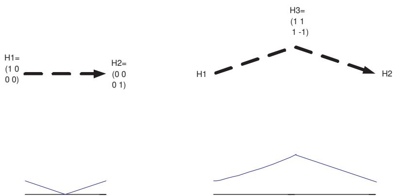

# Adiabatic Quantum State Generation and Statistical Zero Knowledge

Dorit Aharonov∗ Amnon Ta-Shma †

# Abstract

The design of new quantum algorithms has proven to be an extremely difficult task. This paper considers a different approach to the problem. We systematically study ’quantum state generation’, namely, which superpositions can be efficiently generated. We first show that all problems in Statistical Zero Knowledge (SZK), a class which contains many languages that are natural candidates for BQP, can be reduced to an instance of quantum state generation. This was known before for graph isomorphism, but we give a general recipe for all problems in SZK. We demonstrate the reduction from the problem to its quantum state generation version for three examples: Discrete log, quadratic residuosity and a gap version of closest vector in a lattice.

We then develop tools for quantum state generation. For this task, we define the framework of ’adiabatic quantum state generation’ which uses the language of ground states, spectral gaps and Hamiltonians instead of the standard unitary gate language. This language stems from the recently suggested adiabatic computation model [20] and seems to be especially tailored for the task of quantum state generation. After defining the paradigm, we provide two basic lemmas for adiabatic quantum state generation:

• The Sparse Hamiltonian lemma, which gives a general technique for implementing sparse Hamiltonians efficiently, and, The jagged adiabatic path lemma, which gives conditions for a sequence of Hamiltonians to allow efficient adiabatic state generation.

We use our tools to prove that any quantum state which can be generated efficiently in the standard model can also be generated efficiently adiabatically, and vice versa. Finally we show how to apply our techniques to generate superpositions corresponding to limiting distributions of a large class of Markov chains, including the uniform distribution over all perfect matchings in a bipartite graph and the set of all grid points inside high dimensional convex bodies. These final results draw an interesting connection between quantum computation and rapidly mixing Markov chains.

# 1 Introduction

Quantum computation carries the hope of solving in quantum polynomial time classically intractable tasks. The most notable success so far is Shor’s quantum algorithm for factoring integers and for finding the discrete log [41]. Following Shor’s algorithm, several other algorithms were discovered, such as Hallgren’s algorithm for solving Pell’s equation [28], Watrous’s algorithms for the group black box model [45], and the Legendre symbol algorithm by Van Dam et al [14]. Except for [14], all of these algorithms fall into the framework of the Hidden subgroup problem, and in fact use exactly the same quantum circuitry; The exception, [14], is a different algorithm but also heavily uses Fourier transforms and exploits the special algebraic structure of the problem. Recently, a beautiful new algorithm by Childs et. al.[10] was found, which gives an exponential speed up over classical algorithms using an entirely different approach, namely quantum walks. The algorithm however, works in the black box model and solves a fairly contrived problem.

One cannot overstate the importance of developing qualitatively different quantum algorithmic techniques and approaches for the development of the field of quantum computation. In this paper we attempt to make a step in that direction by approaching the issue of quantum algorithms from a different point of view.

It has been folklore knowledge for a few years already that the problem of graph isomorphism, which is considered classically hard [33] has an efficient quantum algorithm as long as a certain state, namely the superposition of all graphs isomorphic to a given graph,

$$
| \alpha _ { G } \rangle = \sum _ { \sigma \in S _ { n } } | \sigma ( G ) \rangle
$$

can be generated efficiently by a quantum Turing machine (for simplicity, we ignore normalizing constants in the above state and in the rest of the paper). The reason that generating $\left| \alpha _ { G } \right.$ suffices is very simple: For two isomorphic graphs, these states are identical, whereas for two non isomorphic graphs they are orthogonal. A simple circuit can distinguish between the case of orthogonal states and that of identical states, where the main idea is that if the states are orthogonal they will prevent the different states of a qubit attached to them to interfere. One is tempted to assume that such a state, $\left| \alpha _ { G } \right.$ , is easy to construct since the equivalent classical distribution, namely the uniform distribution over all graphs isomorphic to a certain graph, can be sampled from efficiently. Indeed, the state $\begin{array} { r } { | \beta _ { G } \rangle = \sum _ { \sigma \in S _ { n } } | \sigma \rangle \otimes | \sigma ( G ) \rangle } \end{array}$ can be easily generated by this argument; However, it is a curious (and disturbing) fact of quantum mechanics that though $| \beta _ { G } \rangle$ is an easy state to generate, so far no one knows how to generate $\left| \alpha _ { G } \right.$ efficiently, because we cannot forget the value of $| \sigma \rangle$ .

In this paper we systematically study the problem of quantum state generation. We will mostly be interested in a restricted version of state generation, namely generating states corresponding to classical probability distributions, which we loosely refer to as quantum sampling (or Qsampling) from a distribution. To be more specific, we consider the probability distribution of a circuit, $D _ { C }$ , which is the distribution over the outputs of the classical circuit $C$ when its inputs are uniformly distributed. Denote $\begin{array} { r } { | C \rangle \ { \stackrel { \mathrm { d e f } } { = } } \ \sum _ { z \in \{ 0 , 1 \} ^ { m } } { \sqrt { D _ { C } ( z ) } } | z \rangle } \end{array}$ . We define the problem of circuit quantum sampling:

# Definition 1. Circuit Quantum Sampling (CQS):

Input: $( \epsilon , C )$ where $C$ is a description of a classical circuit from n to m bits, and $\begin{array} { r } { 0 \leq \epsilon \leq \frac { 1 } { 2 } } \end{array}$ .

Output: $A$ description of a quantum circuit $Q$ of size poly( $| C |$ ) such that $| Q ( | \vec { 0 } \rangle ) -$ $| C \rangle | \leq \epsilon$ .

We first show that most of the quantum algorithmic problems considered so far can be reduced to quantum sampling. Most problems that were considered good candidates for BQP, such as discrete log (DLOG), quadratic residuosity, approximating closest and shortest vectors in a lattice, graph isomorphism and more, belong to the complexity class statistical zero knowledge, or SZK (see section 2 for background.) We prove

Theorem 1. Any $\mathcal { L } \in S Z K$ (Statistical Zero Knowledge) can be reduced to a family of instances of CQS.

The proof relies on a reduction by Sahai and Vadhan [40] from SZK to a complete problem called statistical difference. Theorem 1 shows that a general solution for quantum sampling would imply $S Z K \subseteq B Q P$ . We note that there exists an oracle $A$ relative to which $S Z K ^ { A } \subset B Q P ^ { A }$ [1], and so such a proof must be non relativizing.

Theorem 1 translates a zero knowledge proof into an instance of CQS. In general, the reduction can be quite involved, building on the reduction in [40]. Specific examples of special interest turn out to be simpler, e.g., for the case of graph isomorphism described above, the reduction results in a circuit $C _ { G }$ that gets as an input a uniformly random string and outputs a uniformly random graph isomorphic to $G$ . In section 2 we demonstrate the reduction for three interesting cases: a decision variant of DLOG (based on a zero knowledge proof of Goldreich and Kushilevitz [21]), quadratic residuosity (based on a zero knowledge proof of Goldwasser, Micali and Rackoff [24]) and approximating the closest vector problem in lattices (based on a zero knowledge proof of Goldreich and Goldwasser [22]). The special cases reveal that although quite often one can look at the zero knowledge proof and directly infer the required state generation, sometimes it is not obvious such a transition exists at all. Theorem 1, however, tells us such a reduction is always possible.

The problem of what states can be generated efficiently by a quantum computer is thus of critical importance to the understanding of the computational power of quantum computers. We therefore embark on the task of designing tools for quantum state generation, and studying which states can be generated efficiently. The recently suggested framework of adiabatic quantum computation [20] seems to be tailored exactly for this purpose, since it is stated in terms of quantum state generation; Let us first explain this framework.

Recall that the time evolution of a quantum system’s state $| \psi ( t ) \rangle$ is described by Schrodinger’s equation:

$$
i \hbar { \frac { d } { d t } } | \psi ( t ) \rangle = H ( t ) | \psi ( t ) \rangle .
$$

where $H ( t )$ is an operator called the Hamiltonian of the system. We will consider systems of $n$ qubits; $H$ is then taken to be local, i.e. a sum of operators, each operating on a constant number of qubits. This captures the physical restriction that interactions in nature involve only a small number of particles, and means that the Hamiltonian $H ( t )$ can actually be implemented in the lab. Adiabatic evolution concerns the case in which $H ( t )$ varies very slowly in time; The qualitative statement of the adiabatic theorem is that if the quantum system is initialized in the ground state (the eigenstate with lowest eigenvalue) of $H ( 0 )$ , and if the modification of $H$ in time is done slowly enough, namely adiabatically, then the final state will be the ground state of the final Hamiltonian $H ( T )$ .

Recently, Farhi, Goldstone, Gutmann and Sipser [20] suggested to use adiabatic evolutions to solve $N P$ -hard languages. It was shown in [20, 15] that such adiabatic evolutions can be simulated efficiently on a quantum circuit, and so designing such a successful process would imply a quantum efficient algorithm for the problem. Farhi et. al.’s idea was to find the minimum of a given function $f$ as follows: $H ( 0 )$ is chosen to be some generic Hamiltonian. $H ( T )$ is chosen to be the problem Hamiltonian, namely a matrix which has the values of $f$ on its diagonal and zero everywhere else. The system is then initialized in the ground state of $H ( 0 )$ and evolves adiabatically on the convex line $\begin{array} { r } { H ( t ) = ( 1 - \frac { t } { T } ) H _ { 0 } + \frac { t } { T } H _ { T } } \end{array}$ . By the adiabatic theorem if the evolution is slow enough, the final state will be the groundstate of $H ( T )$ which is exactly the sought after minimum of $f$ .

The efficiency of these adiabatic algorithms is determined by how slow the adiabatic evolution needs to be for the adiabatic theorem to hold. It turns out that this depends mainly on the spectral gaps of the Hamiltonians $H ( t )$ . If these spectral gaps are not too small, the modification of the Hamiltonians can be done ’fairly fast’, and the adiabatic algorithm then becomes efficient. The main problem in analyzing the efficiency of adiabatic algorithms is thus lower bounding the spectral gap; This is a very difficult task in general, and hence not much is known analytically about adiabatic algorithms. [17, 12, 18] analyze numerically the performance of adiabatic algorithms on random instances of NP complete problems. It was proven in [15, 39] that Grover’s quadratic speed up [26] can be achieved adiabatically. Lower bounds for special cases were given in [15]. In [2] it was shown that adiabatic evolution with local Hamiltonians is in fact equivalent in computational power to the standard quantum computation model.

In this paper, we propose to use the language of Adiabatic evolutions, Hamiltonians, ground states and spectral gaps as a theoretical framework for quantum state generation. Our goal is not to replace the quantum circuit model, neither to improve on it, but rather to develop a paradigm, or a language, in which quantum state generation can be studied conveniently. The advantage in using the Hamiltonian language is that the task of quantum state generation becomes much more natural, since adiabatic evolution is cast in the language of state generation. Furthermore, as we will see, it seems that this language lends itself more easily than the standard circuit model to developing general tools.

In order to provide a framework for the study of state generation using the adiabatic language, we define adiabatic quantum state generation as general as we can. Thus, we replace the requirement that the Hamiltonians are on a straight line, with Hamiltonians on any general path. Second, we replace the requirement that the Hamiltonians are local, with the requirement that they are simulatable, i.e., that the unitary matrix $ e ^ { - i t H ( s ) }$ can be approximated by a quantum circuit to within any polynomial accuracy for any polynomially bounded time $t$ . Thus, we still use the standard model of quantum circuits in our paradigm. However, our goal is to derive quantum circuits solving the state generation problem, from adiabatic state generation algorithms. Indeed, any adiabatic state generator can be simulated efficiently by a quantum circuit. We give two proofs of this fact. The first proof follows from the adiabatic theorem. The second proof is self contained, and does not require knowledge of the adiabatic theorem. Instead it uses the simple Zeno effect[38], thus providing an alternative point of view of adiabatic algorithms using measurements (Such a path was taken also in [11].) This implies that adiabatic state generators can be used as a framework for designing algorithms for quantum state generation.

We next describe two basic and general tools for designing adiabatic state generators. The first question that one encounters is naturally, what kind of Hamiltonians can be used. In other words, when is it possible to simulate, or implement, a Hamiltonian efficiently. To this end we prove the sparse Hamiltonian lemma which gives a very general condition for a Hamiltonian to be simulatable. A Hamiltonian $H$ on $n$ qubits is row-sparse if the number of non-zero entries at each row is polynomially bounded. $H$ is said to be row-computable if there exists a (quantum or classical) efficient algorithm that given $i$ outputs a list $( j , H _ { i , j } )$ running over all non zero entries $H _ { i , j }$ . As a norm for Hamiltonians we use the spectral norm, i.e. the operator norm induced by the $l _ { 2 }$ norm on states.

Lemma 1. (The sparse Hamiltonian lemma). If $H$ is a row-sparse, row-computable Hamiltonian on n qubits and $\begin{array} { r } { | | H | | \le p o l y ( n ) } \end{array}$ , then $H$ is simulatable.

We note that this general lemma is useful also in two other contexts: first, in the context of simulating complicated physical systems on a quantum circuit. Second, for continuous quantum walks [13] which use Hamiltonians. For example, in [10] Hamiltonians are used to derive an exponential quantum speed up using quantum walks. Our lemma can be used directly to simplify the Hamiltonian implementation used in [10] and to remove the unnecessary constraints (namely coloring of the nodes) which were assumed for the sake of simulating the Hamiltonian.

The next question that one encounters in designing adiabatic quantum state generation algorithms concerns bounding the spectral gap, which as we mentioned before is a difficult task. We would like to develop tools to find paths in the Hamiltonian space such that the spectral gaps are guaranteed to be non negligible, i.e. larger than $1 / p o l y ( n )$ . Our next lemma provides a way to do this in certain cases. Denote $\alpha ( H )$ to be the ground state of $H$ (if unique.)

Lemma 2. (The Jagged Adiabatic Path lemma). Let $\{ H _ { j } \} _ { j = 1 } ^ { T = p o l y ( n ) }$ T =poly(n) be a sequence of simulatable Hamiltonians on n qubits, all with polynomially bounded norm, non-negligible spectral gaps and with groundvalues 0, such that the inner product between the unique ground states $\alpha ( H _ { j } )$ and $\alpha ( H _ { j + 1 } )$ is non negligible for all $j$ . Then there is an efficient quantum algorithm that takes $\alpha ( H _ { 0 } )$ to within arbitrarily small distance from $\alpha ( H _ { T } )$ .

To prove this lemma, the naive idea is to use the sequence of Hamiltonians as stepping stones for the adiabatic computation, connecting $H _ { j }$ to $H _ { j + 1 }$ by a straight line to create the path $H ( t )$ . However this way the spectral gaps along the way might be small. Instead we use two simple ideas, which we can turn into two more useful tools for manipulating Hamiltonians for adiabatic state generation. The first idea is to replace each Hamiltonian $H _ { j }$ by the Hamiltonian $\Pi _ { H _ { j } }$ which is the projection on the subspace orthogonal to the ground states of $H _ { j }$ . We show how to implement these projections using Kitaev’s phase estimation algorithm [32]. The second useful idea is to connect by straight lines projections on states with non negligible inner product. We show that the Hamiltonians on such a line are guaranteed to have non negligible spectral gap. These ideas can be put together to show that the jagged adiabatic path connecting the projections $\Pi _ { H _ { j } }$ is guaranteed to have sufficiently large spectral gap.

We use the above tools to show that

Theorem 2. Any quantum state that can be efficiently generated in the circuit model, can also be efficiently generated by an adiabatic state generation algorithm, and vice versa.

Thus the question of the complexity of quantum state generation is equivalent (up to polynomial terms) in the circuit model and in the adiabatic state generation model.

In the final part of the paper we demonstrate how our methods for adiabatic quantum state generation work in a particularly interesting domain, namely Qsampling from the limiting distributions of Markov chains. There is an interesting connection between rapidly mixing Markov chains and adiabatic computation. A Markov chain is rapidly mixing if and only if the second eigenvalue gap, namely the difference between the largest and second largest eigenvalue of the Markov matrix $M$ , is non negligible [4]. This clearly bears resemblance to the adiabatic condition of a non negligible spectral gap, and suggests to look at Hamiltonians of the form

$$
H _ { M } = I - M .
$$

$H _ { M }$ will be a Hamiltonian if $M$ is symmetric; if $M$ is not symmetric but is a reversible Markov chain [35] we can still define the Hamiltonian corresponding to it (see section 8.) The sparse Hamiltonian lemma has as an immediate corollary that for a special type of Markov chains, which we call strongly samplable, the quantum analog of the Markov chain can be implemented:

# Corollary 1. If $M$ is a strongly samplable Markov chain, then $H _ { M }$ is simulatable.

In adiabatic computation one is interested in sequences of Hamiltonians; We thus consider sequences of strongly samplable Markov chains. There is a particularly interesting paradigm in the study of Markov chains where sequences of Markov chains are repeatedly used: Approximate counting [30]. In approximate counting the idea is to start from a Markov chain on a set that is easy to count, and which is contained in a large set $\Omega$ the size of which we want to estimate; One then slowly increases the set on which the Markov chain operates so as to finally get to the desired set $\Omega$ . This paradigm and modifications of it, in which the Markov chains are modified slightly until the desired Markov chain is attained, are a commonly used tool in many algorithms; A notable example is the recent algorithm for approximating the permanent [29]. In the last part of the paper we show how to use our techniques to translate such approximate counting algorithms in order to quantum sample from the limiting distributions of the final Markov chain. We show:

Theorem 3. (Loosely:) Let A be an efficient randomized algorithm to approximately count a set $\Omega$ , possibly with weights; Suppose A uses slowly varying Markov chains starting from a simple Markov chain. Then there is an efficient quantum algorithm $Q$ that Qsamples from the final limiting distribution over $\Omega$ .

We stress that it is NOT the case that we are interested in a quantum speed up for sampling from various distributions but rather we are interested in the coherent Qsample of the classical distribution.

We exploit this paradigm to Qsample from the set of all perfect matchings of a bipartite graph, using the recent algorithm by Jerrum, Sinclair and Vigoda [29]. Using the same ideas we can also Qsample from all linear extensions of partial orders, using Bubley and Dyer algorithm [9], from all lattice points in a convex body satisfying certain restrictions using Applegate-Kannan technique [6] and from many more states. We note that some of these states (perhaps all) can be generated using standard techniques which exploit the self reducibility of the problem (see [27]). We stress however that our techniques are qualitatively and significantly different from previous techniques for generating quantum states, and in particular do not require self reducibility. This can be important for extending this approach to other quantum states.

In this paper we have set the grounds for the general study of the problem of Qsampling and adiabatic quantum state generation, where we have suggested to use the language of Hamiltonians and ground states for quantum state generation. This direction points at very interesting and intriguing connections between quantum computation and many different areas: the complexity class SZK and its complete problem statistical difference [40], the notion of adiabatic evolution [31], the study of rapidly mixing Markov chains using spectral gaps [35], quantum walks [10], and the study of ground states and spectral gaps of Hamiltonians in Physics. Hopefully, these connections will point at various techniques from these areas which can be borrowed to give more tools for adiabatic quantum state generation; Notably, the study of spectral gaps of Hamiltonians in physics is a lively area with various recently developed techniques (see [42] and references therein). It seems that a much deeper understanding of the adiabatic paradigm is required, in order to solve the most interesting open question, namely to design interesting new quantum algorithms. An open question which might help in the task is to present known quantum algorithms, eg. Shor’s DLOG algorithm, or the quadratic residuosity algorithm, in the language of adiabatic computation, in an insightful way.

The rest of the paper is organized as follows. We start with the results related to SZK; We then describe quantum adiabatic computation, define the adiabatic quantum state generation framework, and use the adiabatic theorem to prove that an adiabatic state generator implies a state generation algorithm. Next we prove our two main tools: the sparse Hamiltonian lemma, and the jagged adiabatic path lemma. We then use these tools to prove that adiabatic state generation is equivalent to standard quantum state generation. Finally we draw the connection to Markov chains and demonstrate how to use our techniques to Qsample from approximately countable sets. In the appendix we give the second proof of transforming adiabatic state generators to algorithms using the Zeno effect.

# 2 Qsampling and SZK

We start with some background about Statistical Zero Knowledge. For an excellent source on this subject, see Vadhan’s thesis [44] or Sahai and Vadhan [40].

# 2.1 SZK

A pair $\Pi = ( \Pi _ { Y e s } , \Pi _ { N o } )$ is a promise problem if $\Pi _ { Y e s } \subseteq \{ 0 , 1 \} ^ { * }$ , $\Pi _ { N o } \subseteq \{ 0 , 1 \} ^ { * }$ a nd $\Pi _ { Y e s } \cap \Pi _ { N o } = \varnothing$ . We look at $\Pi _ { Y e s }$ as the set of all yes instances, $\Pi _ { N o }$ as the set of all $n o$ instances and we do not care about all other inputs. If every $x \in \left\{ 0 , 1 \right\} ^ { * }$ is in $\Pi _ { Y e s } \cup \Pi _ { N o }$ we call $\Pi$ a language.

We say a promise problem $\Pi$ has an interactive proof with soundness error $\epsilon _ { s }$ and completeness error $\epsilon _ { c }$ if there exists an interactive protocol between a prover $P$ and a verifier $V$ denoted by $( P , V )$ , where $V$ is a probabilistic polynomial time machine, and

• If $x \in \Pi _ { Y e s } \ V$ accepts with probability at least $1 - \epsilon _ { c }$ .   
• If $x \in \Pi _ { N o }$ then for every prover $P ^ { * }$ , $V$ accepts with probability at most $\epsilon _ { s }$ .

When an interactive proof system $( \Pi , V )$ for a promise problem $\Pi$ is run on an input $x$ , it produces a distribution over ”transcripts” that contain the conversation between the prover and the verifier. I.e., each possible transcript appears with some probability (depending on the random coin tosses of the prover and the verifier).

An interactive proof system $( \Pi , V )$ for a promise problem $\Pi$ is said to be ”honest verifier statistical zero knowledge”, and in short HVSZK, if there exists a probabilistic polynomial time simulator $S$ that for every $x \in \Pi _ { Y e s }$ produces a distribution on transcripts that is close (in the $\ell _ { 1 }$ distance defined below) to the distribution on transcripts in the real proof. If the simulated distribution is exactly the correct distribution, we say the proof system is ”honest verifier perfect zero knowledge, and in short HVPZK.

We stress that the simulator’s output is based on the input alone, and the simulator has no access to the prover. Also, note that we only require the simulator to produce a good distribution on inputs in $\Pi _ { Y e s }$ , and we do not care about other inputs. This is because for ”No” instances there is no correct proof anyway. We refer the interested reader to Vadhan’s thesis [44] for rigorous definitions and a discussion of their subtleties.

The definition of HVSZK captures exactly the notion of “zero knowledge”; If the honest verifier can simulate the interaction with the prover by himself, in case the input is in $\Pi$ , then he does not learn anything from the interaction (except for the knowledge that the input is in $\Pi$ ). We denote by HVSZK the class of all promise problems that have an interactive proof which satisfies these restrictions. One can wonder whether cheating verifiers can get information from an honest prover by deviating from the protocol. Indeed, in some interactive proofs this happens. However, a general result says that any HVSZK proof can be simulated by one which does not leak much information even with dishonest verifiers [23]. We thus denote by SZK the class of all promise problems which have interactive proof systems which are statistically zero knowledge against an honest (or equivalently a general) verifier.

It is known that $B P P \subseteq S Z K \subseteq A M \cap c o A M$ and that SZK is closed under complement. It follows that SZK does not contain any NP–complete language unless the polynomial hierarchy collapses. For this, and other results known about this elegant class, we refer the reader, again, to Vadhan’s thesis [44].

# 2.2 The complete problem

Recently, Sahai and Vadhan found a natural complete problem for the class Statistical Zero Knowledge, denoted by SZK. One nice thing about the problem is that it does not mention interactive proofs in any explicit or implicit way. We need some facts about distances between distributions in order to define the problem. For two classical distributions $\{ p ( x ) \} , \{ q ( x ) \}$ define their $\ell _ { 1 }$ distance and their fidelity (this measure is known by many other names as well):

$$
\begin{array} { l l l } { | p - q | _ { 1 } } & { = } & { \displaystyle \sum _ { x } | p ( x ) - q ( x ) | } \\ { F ( p , q ) } & { = } & { \displaystyle \sum _ { x } \sqrt { p ( x ) q ( x ) } } \end{array}
$$

We also define the variation distance to be $| | p - q | | = { \textstyle { \frac { 1 } { 2 } } } | p - q | _ { 1 }$ so that it is a value between 0 and 1. The following fact is very useful:

Fact 1. (See [37])

$$
1 - F ( p , q ) \leq \ | | p - q | | \leq { \sqrt { 1 - F ( p , q ) ^ { 2 } } }
$$

or equivalently

$$
1 - | | p - q | | \leq \ F ( p , q ) \ \leq { \sqrt { 1 - | | p - q | } } | ^ { 2 }
$$

We can now define the complete problem for SZK:

Definition 2. Statistical Difference $( S D _ { \alpha , \beta } )$

Input : Two classical circuits $C _ { 0 } , C _ { 1 }$ with m Boolean outputs.

Promise : $| | D _ { C _ { 0 } } - D _ { C _ { 1 } } | | \geq \alpha$ or $| | D _ { C _ { 0 } } - D _ { C _ { 1 } } | | \leq \beta$ .

Output : Which of the two possibilities occurs? (yes for the first case and no for the second)

Sahai and Vadhan [40, 44] show that for any two constants $0 \leq \beta < \alpha \leq 1$ such that even $\alpha ^ { 2 } > \beta$ , $S D _ { \alpha , \beta }$ is complete for SZK 1. A well explained exposition can also be found in [44].

# 2.3 Reduction from SZK to Qsampling.

We need a very simple building block.

Claim 1. Let $\begin{array} { r } { \psi = \frac { 1 } { \sqrt { 2 } } ( | 0 , v \rangle + | 1 , w \rangle ) } \end{array}$ . If we apply a Hadamard gate on the first qubit and measure it, we get the answer 0 with probability1−Real(hv|wi) 1+Real(hv|wi) and 1 with probability

The proof is a direct calculation. We now proceed to prove Theorem 1.

Proof. Let $C _ { 0 } , C _ { 1 }$ be an input to $S D$ , $C _ { 0 } , C _ { 1 }$ are circuits with $m$ outputs. It is enough to show that $S D _ { 1 / 4 , 3 / 4 } \in B Q P$ , given that we can Qsample from the given circuits. Let us first assume that we can Qsample from both circuits with $\epsilon = 0$ error. We can therefore generate the superposition $\begin{array} { r } { \frac { 1 } { \sqrt { 2 } } ( \left. 0 \right. \left. C _ { 0 } \right. + \left. 1 \right. \left. C _ { 1 } \right. ) } \end{array}$ ). We then apply a Hadamard gate on the first qubit and measure it. We use Claim 1 with $v = | C _ { 0 } \rangle$ and $w = | C _ { 1 } \rangle$ . In our case

$$
\langle v | w \rangle = \sum _ { z \in \{ 0 , 1 \} ^ { m } } \sqrt { D _ { C _ { 0 } } ( z ) D _ { C _ { 1 } } ( z ) } = F ( D _ { C _ { 0 } } , D _ { C _ { 0 } } )
$$

We therefore get 0 with probability 1+F (DC0 ,DC0) . Thus, • If $| | D _ { C _ { 0 } } - D _ { C _ { 1 } } | | \geq \alpha$ , then we measure 0 with probability $\frac { 1 + F ( D _ { C _ { 0 } } , D _ { C _ { 0 } } ) } { 2 } ~ \leq$ $\begin{array} { r } { \frac { 1 + \sqrt { 1 - | | D _ { C _ { 0 } } - D _ { C _ { 1 } } | | ^ { 2 } } } { 2 } \leq \frac { 1 + \sqrt { 1 - \alpha ^ { 2 } } } { 2 } } \end{array}$ , while, • If $\begin{array} { r } { \frac { 2 - | | D _ { C _ { 0 } } - D _ { C _ { 1 } } | | } { 2 } \geq 1 - \frac { \beta } { 2 } } \end{array}$ $| | D _ { C _ { 0 } } - D _ { C _ { 1 } } | | \leq \beta$ . , then we measure 0 with probability $\frac { 1 + F ( D _ { C _ { 0 } } , D _ { C _ { 0 } } ) } { 2 } \geq$

Setting $\textstyle \alpha = { \frac { 3 } { 4 } }$ and $\beta = \textstyle { \frac { 1 } { 4 } }$ we get that if $| | D _ { C _ { 0 } } - D _ { C _ { 1 } } | | \geq \alpha$ we measure 0 with probability at most 1+√1−α2 $\textstyle { \frac { 1 + { \sqrt { 1 - \alpha ^ { 2 } } } } { 2 } } \leq 0 . 8 3 1$ , while if $| | D _ { C _ { 0 } } - D _ { C _ { 1 } } | | \leq \beta$ we measure 0 with probability at least $\textstyle 1 - { \frac { \beta } { 2 } } \geq { \frac { 7 } { 8 } } = 0 . 8 7 5$ . Repeating the experiment $\begin{array} { r } { O ( \log ( \frac { 1 } { \delta } ) ) } \end{array}$ times, we can decide on the right answer with error probability smaller than $\delta$ . If the quantum sampling circuit has a small error (say $\epsilon < \frac { 1 } { 1 0 0 }$ ) then the resulting states are close to the correct ones and the error introduced can be swallowed by the gap of the BQP algorithm. □

The above theorem shows that in order to give an efficient quantum algorithm for any problem in SZK, it is sufficient to find an efficient quantum sampler from the corresponding circuits. One can use the theorem to start from a zero knowledge proof for a certain language, and translate it to a family of circuits which we would like to Qsample from. Sometimes this reduction can be very easy, without the need to go through the complicated reduction of Sahai and Vadhan [40], but in general we do not know that the specification of the states is easy to derive. For the sake of illustration, we give the exact descriptions of the states required to Qsample from for three examples, in which the reduction turns out to be much simpler than the general case. These cases are of particular interest for quantum algorithms: discrete log, quadratic residuosity and a gap version of Closest vector in a lattice.

# 2.4 A promise problem equivalent to Discrete Log

# The problem :

Goldreich and Kushilevitz [21] define the promise problem $D L P _ { c }$ as:

• Input: A prime $p$ , a generator $g$ of $Z _ { p } ^ { * }$ and an input $y \in Z _ { p } ^ { * }$ . • Promise: The promise is that $x = \log _ { g } ( y )$ is in $[ 1 , c p ] \cup [ { \textstyle { \frac { p } { 2 } } } + 1 , { \frac { p } { 2 } } + c p ]$ , • Output: Whether $x \in [ 1 , c p ]$ or $x \in [ \textstyle { \frac { p } { 2 } } + 1 , \textstyle { \frac { p } { 2 } } + c p ]$

[21] proves that DLOG is reducible to $D L P _ { c }$ for every $0 < c < 1 / 2$ . They also prove that $D L P _ { c }$ has a perfect zero knowledge proof if $0 < c \leq 1 / 6$ . We take $c = 1 / 6$ and show how to solve $D L P _ { 1 / 6 }$ with CQS.

# The reduction :

We assume we can solve the construction problem for the circuit $C _ { y , k } = C _ { n , g , y , k }$ that computes $C _ { y , k } ( i ) = y \cdot g ^ { i } ( \mathrm { m o d } p )$ for $i \in \{ 0 , 1 \} ^ { k }$ . The algorithm gets into the state $\left. \frac { 1 } { \sqrt { 2 } } [ \begin{array} { c } { | 0 \rangle \left| C _ { g ^ { p / 2 + 1 } , \lfloor \log ( p ) \rfloor - 1 } \right. + | 1 \rangle \left| C _ { y , \lfloor \log ( p ) \rfloor - 3 } \right. } \end{array} \right]$ and proceeds as in Claim 1.

# Correctness :

We have:

$$
\left| C _ { g ^ { p / 2 + 1 } , \lfloor \log ( p ) \rfloor - 1 } \right. = { \frac { 1 } { \sqrt { 2 ^ { t } } } } \sum _ { i = 0 } ^ { 2 ^ { t } - 1 } \left| g ^ { p / 2 + i } \right.
$$

where $t$ is the largest power of 2 smaller than $p$ . Also, as $y = g ^ { x }$ we have

$$
\left| C _ { y , \lfloor \log ( p ) \rfloor - 3 } \right. = { \frac { 1 } { \sqrt { 2 ^ { t ^ { \prime } } } } } \sum _ { i = 0 } ^ { 2 ^ { t ^ { \prime } - 1 } } \left| g ^ { x + i } \right. 
$$

where $t ^ { \prime }$ is the largest power of 2 smaller than $p / 8$ . Now, comparing the powers of $g$ in the support of Equations 5 and 6 we see that

• If $x \in [ 1 , c p ]$ then $\big | C _ { g ^ { p / 2 + 1 } , \lfloor \log ( p ) \rfloor - 1 } \big \rangle$ a nd $\left| C _ { y , \lfloor \log ( p ) \rfloor - 3 } \right.$ have disjoint supports   
and therefore $\langle C _ { y , \lfloor \log ( p ) \rfloor - 3 } | C _ { g ^ { p / 2 + 1 } , \lfloor \log ( p ) \rfloor - 1 } \rangle | = 0$ , while,   
• If $x \in [ { \frac { p } { 2 } } + 1 , { \frac { p } { 2 } } + c p ]$ then the overlap is large and $| \langle C _ { y , \lfloor \log ( p ) \rfloor - 3 } | C _ { g ^ { p / 2 + 1 } , \lfloor \log ( p ) \rfloor - 1 } \rangle |$ is a constant.

# 2.5 Quadratic residuosity

# The problem :

we denote $x R n$ if $x = y ^ { 2 } ( { \bmod { n } } )$ for some $y$ , and $x N n$ otherwise. The problem QR is to decide on input $x , n$ whether $x R n$ . An efficient algorithm is known for the case of $n$ being a prime, and the problem is believed to be hard for $n = p q$ where $p , q$ are chosen at random among large primes $p$ and $q$ . A basic fact, that follows directly from the Chinese remainder theorem is

# Fact 2.

• If the prime factorization of $n$ is $n = p _ { 1 } ^ { e _ { 1 } } p _ { 2 } ^ { e _ { 2 } } \cdot \cdot \cdot p _ { k } ^ { e _ { k } }$ , then for every $x$

$$
x R n \iff \forall _ { 1 \leq i \leq k } x R p _ { i }
$$

• If the prime factorization of $n$ is $n = p _ { 1 } p _ { 2 } \ldots p _ { k }$ then every $z \in Z _ { n }$ that has a square root, has the same number of square roots.

We show how to reduce the $n = p q$ case to the CQS (adopting the zero knowledge proof of [24]).

The reduction : We use the circuit $C _ { a } ( \boldsymbol { r } )$ that on input $r ~ \in ~ Z _ { n }$ outputs $z =$ $r ^ { 2 } a$ ( mod $n$ ). Suppose we know how to quantum sample $C _ { a }$ for every $a$ . On input integers $n , x$ , $( n , x ) = 1$ , the algorithm gets into the state $\textstyle { \frac { 1 } { \sqrt { 2 } } } [ \left| 0 \right. \left| C _ { 1 } \right. + \left| 1 \right. \left| C _ { x } \right. ]$ and proceeds as in Claim 1.

# Correctness :

We have

$$
\left| C _ { x } \right. \ = \ \sum _ { z } { \sqrt { p _ { z } } } \left| z \right.
$$

where $p _ { z } = \mathrm { P r } _ { r } ( z = r ^ { 2 } x )$ , and

$$
\begin{array} { c c l } { \displaystyle | C _ { 1 } \rangle } & { = } & { \displaystyle \sum _ { z : z R n } \alpha \left| z \right. } \end{array}
$$

for some fixed $\alpha$ independent of $z$ .

If $x R n$ then $z = r ^ { 2 } x$ is also a square. Furthermore, as $( x , n ) = 1$ we have $p _ { z } = \mathrm { P r } _ { r } ( r$ is a square root of $\frac { z } { x }$ ) and as every square has the same number of square roots, we conclude that $| C _ { x } \rangle = | C _ { 1 } \rangle$ and $\langle C _ { x } | C _ { 1 } \rangle = 1$ . Suppose $x N n$ . There are only $p + q - 1$ integers $r \in Z _ { n }$ that are not co-prime to $n$ . For every $r$ co-prime with $n$ , $z = x r ^ { 2 }$ must be a non-residue (or else $x R n$ as well). We conclude that $\begin{array} { r } { \sum _ { z : z R n } p _ { z } \le \frac { p + q } { p q } \approx 0 } \end{array}$ and so $\langle C _ { x } | C _ { 1 } \rangle \approx 0$ .

We note that for a general $n$ , different elements might have a different number of solutions (e.g., try $n = 8$ ) and the number of elements not co-prime to $n$ might be large, so one has to be more careful.

# 2.6 Approximating CVP

We describe here the reduction to quantum sampling for a gap problem of CVP (closest vector in a lattice), which builds upon the statistical zero knowledge proof of Goldreich and Goldwasser [22]. A lattice of dimension $n$ is represented by a basis, denoted $B$ , which is an $n \times n$ non-singular matrix over $\mathbb { R }$ . The lattice $\mathcal { L } ( B )$ is the set of points ${ \mathcal { L } } ( B ) = \{ B c \mid c \in \mathbb { Z } ^ { n } \}$ , i.e., all integer linear combinations of the columns of $B$ . The distance $d ( v _ { 1 } , v _ { 2 } )$ between two points is the Euclidean distance $\ell _ { 2 }$ . The distance between a point $\boldsymbol { v }$ and a set $\mathcal { A }$ is $d ( v , { \mathcal { A } } ) = \operatorname* { m i n } _ { a \in A } d ( v , a )$ . We also denote $| | S | |$ the length of the largest vector of the set $S$ . The closest vector problem, CVP, gets as input an $n$ –dimensional lattice $B$ and a target vector $v \in \mathbb { R } ^ { n }$ . The output should be the point $b \in { \mathcal { L } } ( B )$ closest to $\boldsymbol { v }$ . The problem is NP hard. Furthermore, it is NP hard to approximate the distance to the closest vector in the lattice to within small factors, and it is easy to approximate it to within $2 ^ { \epsilon n }$ factor, for every $\epsilon > 0$ . See [22] for a discussion. In [22] an (honest prover) perfect zero knowledge proof for being far away from the lattice is given. We now describe the promise problem.

# The problem :

• Input: An $n$ –dimensional lattice $B$ , a vector $v \in \mathbb { R } ^ { n }$ and designated distance d. We set g = g(n) = q $g = g ( n ) = { \sqrt { \frac { n } { c \log n } } }$ , for some $c > 0$ .

• Promise: Either $d ( v , { \mathcal { L } } ( B ) ) \leq d$ or $d ( v , { \mathcal { L } } ( B ) \geq g \cdot d$ .   
• Output: Which possibility happens.

We let $H _ { t }$ denote the sphere of all points in $\mathbb { R } ^ { n }$ of distance at most $t$ from the origin.

The reduction : The circuit $C _ { 0 }$ gets as input a random string, and outputs the vector $r + \eta$ , where $r$ is a uniformly random point in $H _ { 2 ^ { n } | | B \cup \{ v \} | | } \cap \mathcal { L } ( B )$ and $\eta$ is a uniformly random point $\begin{array} { r } { \eta \in H _ { \frac { g } { 2 } \cdot d } } \end{array}$ . [22] explain how to sample such points with almost the right distribution, i.e. they give a description of an efficient such $C _ { 0 }$ .

We remark that the points cannot be randomly chosen from the real (continuous) vector space, due to precision issues, but [22] show that taking a fine enough discrete approximation and a large enough cutoff of the lattice results in an exponentially small error. $\begin{array} { r } { \Dot { \iota } , } \end{array}$ From now on we work in the continuous world, bearing in mind that in fact everything is implemented in a discrete approximation of it.

Now assume we can quantum sample from the circuit $C _ { 0 }$ . We can then also quantum sample from the circuit $C _ { v }$ which we define to be the same circuit except that the outputs are shifted by the vector $\boldsymbol { v }$ and become $r + \eta + v$ . To solve the gap problem the algorithm gets into the state $\textstyle { \frac { 1 } { \sqrt { 2 } } } \left[ \begin{array} { l } { \left| 0 \right. \left| C _ { 0 } \right. + \left| 1 \right. \left| C _ { 1 } \right. } \end{array} \right]$ and proceeds as in Claim 1.

# Correctness :

If $\boldsymbol { v }$ is far away from the lattice $\mathcal { L } ( B )$ , then the calculation at [22] shows that the states $| C _ { 0 } \rangle$ and $| C _ { 1 } \rangle$ have no overlap and so $\langle C _ { 0 } | C _ { 1 } \rangle = 0$ .

On the other hand, suppose $\boldsymbol { v }$ is close to the lattice, $d ( v , { \mathcal { L } } ( B ) ) \leq d$ . Notice that the noise $\eta$ has magnitude about $g d$ , and so the spheres around any lattice point $r$ and around $r + v$ have a large overlap. Indeed, the argument of [22] shows that if we express $\begin{array} { r } { \left| C _ { 0 } \right. = \sum _ { z } p _ { z } \left| z \right. } \end{array}$ and $\begin{array} { r } { \left| \boldsymbol { C } _ { 1 } \right. = \sum _ { z } p _ { z } ^ { \prime } \left| z \right. } \end{array}$ then $| p - p ^ { \prime } | _ { 1 } \leq 1 - n ^ { - 2 c }$ . We see that $\langle C _ { 0 } | C _ { 1 } \rangle = F ( p , p ^ { \prime } ) \ge n ^ { - 2 c }$ . Iterating the above $p o l y ( n )$ times we get an RQP algorithm, namely a polynomial quantum algorithm with one sided error.

# 3 Physics Background

This section gives background required for our definition of adiabatic state generation. We start with some preliminaries regarding the operator norm and the Trotter formula. We then describe the adiabatic theorem, and the model of adiabatic computation as defined in [20].

# 3.1 Spectral Norm

The operator norm of a linear transformation $T$ , induced by the $l _ { 2 }$ norm is called the spectral norm and is defined by

$$
| | T | | \ = \ \operatorname* { m a x } _ { \psi \neq 0 } { \frac { | T \psi | } { | \psi | } }
$$

If $T$ is Hermitian or Unitary (in general, if $T$ is normal, namely commutes with its adjoint) than $| | T | |$ equals the largest absolute value of its eigenvalues. If $U$ is unitary, $| | U | | = 1$ . Also, $| | A B | | \leq | | A | | \cdot | | B | |$ . Finally, if $A = \left( a _ { i , j } \right)$ is a $\boldsymbol { D } \times \boldsymbol { D }$ matrix, then $\vert \vert A \vert \vert \leq D ^ { 2 } \vert \vert A \vert \vert _ { \infty }$ where $\vert \vert A \vert \vert _ { \infty } = \operatorname* { m a x } _ { i , j } \left. a _ { i , j } \right.$ .

Definition 3. We say a linear transformation $T _ { 2 }$ $\alpha$ –approximates a linear transformation $T _ { 1 }$ if $| | T _ { 1 } - T _ { 2 } | | \leq \alpha$ , and if this happens we write $T _ { 2 } ^ { \prime } = T _ { 1 } ^ { \prime } + \alpha$ .

# 3.2 Trotter Formula

Say $H = \sum H _ { m }$ with each $H _ { m }$ Hermitian. Trotter’s formula states that one can approximate $e ^ { - i t H }$ by slowly interleaving executions of $e ^ { - t H _ { m } }$ . We use the following variant of it:

Lemma 3. [37] Let have bounded norm, $H _ { i }$ $\begin{array} { r } { H = \sum _ { m = 1 } ^ { M } H _ { m } } \end{array}$ . Further assume $H$ and $H _ { i }$ $| | H | | , | | H _ { i } | | \leq \Lambda$

$$
\begin{array} { r c l } { { U _ { \delta } } } & { { = } } & { { \left[ \begin{array} { l } { { e ^ { - \delta i H _ { 1 } } \cdot e ^ { - \delta i H _ { 2 } } \cdot \dots \cdot e ^ { - \delta i H _ { M } } } } \end{array} \right] \cdot \left[ \begin{array} { l } { { e ^ { - \delta i H _ { M } } \cdot e ^ { - \delta i H _ { M - 1 } } \cdot \dots \cdot e ^ { - \delta i H _ { 1 } } } } \end{array} \right] \cdot } } \end{array}
$$

Then $| | U _ { \delta } - e ^ { - 2 \delta i H } | | \le { \cal { O } } ( M \cdot ( \delta \Lambda ) ^ { 3 } )$ .

Using the $| | \cdot | |$ properties stated above we conclude:

Corollary 2. Let $H _ { i }$ be Hermitian, $\begin{array} { r } { H = \sum _ { m = 1 } ^ { M } H _ { m } } \end{array}$ . Assume $| | H | | , | | H _ { i } | | \leq \Lambda$ . Then, for every $t > 0$

$$
| | U _ { \delta } ^ { \frac { t } { 2 \delta } } - e ^ { - i t H } | | \leq O ( \frac { t } { 2 \delta } \cdot M \cdot ( \delta \Lambda ) ^ { 3 } )
$$

As $| | U _ { \delta } - I | | \le 2 M \Lambda \delta$ we also have $| | U _ { \delta } ^ { \lfloor \frac { t } { 2 \delta } \rfloor } - U _ { \delta } ^ { \frac { t } { 2 \delta } } | | \leq 2 M \Lambda \delta$ and thus:

Corollary 3. Let $H _ { i }$ be Hermitian, $\begin{array} { r } { H = \sum _ { m = 1 } ^ { M } H _ { m } } \end{array}$ . Assume $| | H | | , | | H _ { i } | | \leq \Lambda$ . Then, for every $t > 0$

$$
| | U _ { \delta } ^ { \lfloor \frac { t } { 2 \delta } \rfloor } - e ^ { - i t H } | | ~ \le ~ O ( M \Lambda \cdot \delta + M \Lambda ^ { 3 } t \cdot \delta ^ { 2 } )
$$

Notice that for every fixed $t , M$ and $\Lambda$ , the error term goes down to zero with $\delta$ . In applications, we will pick $\delta$ to be polynomially small, in such a way that the above error term is polynomially small.

# 3.3 Time Dependent Schrodinger Equation

A quantum state $| \psi \rangle$ of a quantum system evolves in time according to Schrodinger’s equation:

$$
i \hbar { \frac { d } { d t } } | \psi ( t ) \rangle = H ( t ) | \psi ( t ) \rangle
$$

where $H ( t )$ is a Hermitian matrix which is called the Hamiltonian of the physical system. The evolution of the state from time $0$ to time $T$ can be described by integrating Schrodinger’s equation over time. If $H$ is constant and independent of time, one gets

$$
| \psi ( T ) \rangle = U ( T ) | \psi ( 0 ) \rangle = e ^ { - i H T } | \psi ( 0 ) \rangle
$$

Since $H$ is Hermitian $e ^ { - i H T }$ is unitary, and so we get the familiar unitary evolution from quantum circuits. The time evolution is unitary regardless of whether $H$ is time dependent or not.

The groundstate of a Hamiltonian $H$ is the eigenstate with the smallest eigenvalue, and we denote it by $\alpha ( H )$ . The spectral gap of a Hamiltonian $H$ is the difference between the smallest and second to smallest eigenvalues, and we denote it by $\Delta ( H )$ .

# 3.4 The adiabatic Theorem

In the study of adiabatic evolution one is interested in the long time behavior (at large times $T$ ) of a quantum system initialized in the ground state of $H$ at time 0 when the Hamiltonian of the system, $H ( t )$ changes very slowly in time, namely adiabatically.

The qualitative statement of the adiabatic theorem is that if the quantum system is initialized in the ground state of $H ( 0 )$ , the Hamiltonian at time 0, and if the modification of $H$ along the path $H ( t )$ in the Hamiltonian space is done infinitely slowly, then the final state will be the ground state of the final Hamiltonian $H ( T )$ .

To make this statement correct, we need to add various conditions and quantifications. Historically, the first and simplest adiabatic theorem was found by Born and Fock in 1928 [8]. In 1958 Kato [31] improved the statement to essentially the statement we use in this paper (which we state shortly), and which is usually referred to as the adiabatic theorem. A proof can be found in [36]. For more sophisticated adiabatic theorems see [7] and references therein.

To state the adiabatic theorem, it is convenient and traditional to work with a re-scaled time $\begin{array} { r } { s = \frac { t } { T } } \end{array}$ where $T$ is the total time. The Schrodinger’s equation restated in terms of the re-scaled time $s$ then reads

$$
i \hbar { \frac { d } { d s } } { \vert { \psi ( s ) } \rangle } = T \cdot H ( s ) { \vert { \psi ( s ) } \rangle }
$$

where $\begin{array} { r } { T = \frac { d t } { d s } } \end{array}$ can be referred to as the delay schedule, or the total time.

Theorem 4. (The adiabatic theorem, adapted from [36, 20]). Let $H ( \cdot )$ be a function from $\lfloor 0 , 1 \rfloor$ to the vector space of Hamiltonians on n qubits. Assume $H ( \cdot )$ i s

continuous, has a unique ground state, for every $s \in \lbrack 0 , 1 ]$ , and is differentiable in all but possibly finitely many points. Let $\epsilon > 0$ and assume that the following adiabatic condition holds for all points $s \in ( 0 , 1 )$ in which the derivative is defined:

$$
T \epsilon \geq \frac { \| \frac { d } { d s } H ( s ) \| } { ( \Delta ( H ( s ) ) ^ { 2 } }
$$

Then, a quantum system that is initialized at time 0 with the ground state $\alpha ( H ( 0 ) )$ of $H ( 0 )$ , and evolves according to the dynamics of the Hamiltonians $H ( \cdot )$ , ends up at re-scaled time 1 at a state $| \psi ( 1 ) \rangle$ that is within $\epsilon ^ { c }$ distance from $\alpha ( H ( 1 ) )$ for some constant $c > 0$ .

We will refer to equation 14 as the adiabatic condition.

The proof of the adiabatic theorem is rather involved. One way to get intuition about it is by observing how the Schrodinger equation behaves when eigenstates are considered; If the eigenvalue is $\lambda$ , the eigenstate evolves by a multiplicative factor $e ^ { i \lambda t }$ , which rotates in time faster the larger the absolute value of the eigenvalue $\lambda$ is, and so the ground state rotates the least. The fast rotations are essentially responsible to the cancellations of the contributions of the vectors with the higher eigenvalues, due to interference effects.

# 4 Adiabatic Quantum State Generation

In this section we define our paradigm for quantum state generation, based on the ideas of adiabatic quantum computation (and the adiabatic theorem). We would like to allow as much flexibility as possible in the building blocks. We therefore allow any Hamiltonian which can be implemented efficiently by quantum circuits. We also allow using general Hamiltonian paths and not necessarily straight lines. We define:

Definition 4. (Simulatable Hamiltonians). We say a Hamiltonian $H$ on $n$ qubits is simulatable if for every $t > 0$ and every accuracy $0 \textless \alpha \textless 1$ the unitary transformation

$$
U ( t ) = e ^ { - i H t }
$$

can be approximated to within $\alpha$ accuracy by a quantum circuit of size poly $\iota ( n , t , 1 / \alpha )$

If $H$ is simulatable, then by definition so is $c H$ for any $0 \leq c \leq p o l y ( n )$ . It therefore follows by Trotter’s equation (3) that any convex combination of two simulatable, bounded norm Hamiltonians is simulatable. Also, If $H$ is simulatable and $U$ is a unitary matrix that can be efficiently applied by a quantum circuit, then $U H U ^ { \dagger }$ is also simulatable, because $e ^ { - i t U H U ^ { \dagger } } = U e ^ { - i t H } U ^ { \dagger }$ .

We note that these rules cannot be applied unboundedly many times in a recursive way, because the simulation will then blow up. The interested reader is referred to [37, 10] for a more complete set of rules for simulating Hamiltonians.

We now describe an adiabatic path, which is an allowable path in the Hamiltonian space:

Definition 5. (Adiabatic path). A function H from $s \in \lbrack 0 , 1 \rbrack$ to the vector space of Hamiltonians on n qubits, is an adiabatic path if

• $H ( s )$ is continuous,   
• $H ( s )$ is differentiable except for finitely many points, • ∀s $H ( s )$ has a unique groundstate, and   
• $\forall s$ , $H ( s )$ is simulatable given $s$ .

The adiabatic theorem tells us that the time evolution of a system evolving along the adiabatic path will end with the final ground state, if done slowly enough, namely when the adiabatic condition holds. Adiabatic quantum state generation is basically the process of implementing the Schrodinger’s evolution along an adiabatic path, where we require that the adiabatic condition holds.

Definition 6. (Adiabatic Quantum State Generation). An adiabatic Quantum State Generator $( H _ { x } ( s ) , T , \epsilon )$ has for every $x \in \{ 0 , 1 \} ^ { n }$ an adiabatic path $H _ { x } ( s )$ , such that for the given $T , \epsilon$ the adiabatic condition is satisfied for all $s \in [ 0 , 1 ]$ where it is defined. We also require that the generator is explicit, i.e., that there exists a polynomial time quantum machine that

• On input $x \in \{ 0 , 1 \} ^ { n }$ outputs $\alpha ( H _ { x } ( 0 ) )$ , the groundstate of $H _ { x } ( 0 )$ , and, • On input $x \in \{ 0 , 1 \} ^ { n }$ , $s \in [ 0 , 1 ]$ and $\delta > 0$ outputs a circuit $C _ { x } ( s )$ approximating $e ^ { - i \delta H _ { x } ( s ) }$ .

We then say the generator adiabatically generates $\alpha ( H _ { x } ( 1 ) )$ .

Remark: We note that in previous papers on adiabatic computation, eg. in [15], a delay schedule $\tau ( s )$ which is a function of $s$ was used. We chose to work with one single delay parameter, $T$ , instead, which might seem restrictive; However, working with a single parameter does not restrict the model since more complicated delay schedules can be encoded into the dependence on $s$ .

We will show that every adiabatic quantum state Generator can be efficiently simulated by a quantum circuit, in Claim 2. We later on prove the other direction of Claim 2, which implies Theorem 2, which shows the equivalence in computational power of quantum state generation in the standard and in the adiabatic frameworks. Thus, designing state generation algorithms in the adiabatic paradigm indeed makes sense since it can be simulated efficiently on a quantum circuit, and we do not lose in computational power by moving to the adiabatic framework and working only with ground states. The advantage in working in the adiabatic model is that the language of this paradigm seems more adequate for developing general tools. After the statement and proof of Claim 2, we proceed to prove several such basic tools. Once we develop these tools, we will be able to prove the other direction of the equivalence theorem and apply the tools for generating interesting states.

# 4.1 Circuit simulation of adiabatic state generation

An adiabatic state generator can be simulated efficiently by a quantum circuit:

Claim 2. (Circuit simulation of adiabatic state generation). Let $( H _ { x } ( s ) , T , \epsilon )$ be an Adiabatic Quantum State Generator. Assume $T \leq p o l y ( n )$ . Then, there exists a quantum circuit that on input $x$ generates the state $\alpha ( H _ { x } ( 1 ) )$ to within ǫ accuracy, with size $p o l y ( T , 1 / \epsilon , n )$ .

Proof. (Based on Adiabatic Theorem) The circuit is built by discretizing time to sufficiently small intervals of length $\delta$ , and then applying the unitary matrices $e ^ { - i H ( \delta j ) \delta }$ . Intuitively this should work, as the adiabatic theorem tells us that a physical system evolving for time $T$ according to Schrodinger’s equation with the given adiabatic path will end up in a state close to $\alpha ( H _ { x } ( 1 ) )$ . The formal error analysis can be done by exactly the same techniques that were used in [15]. We do not give the details of the proof based on the adiabatic theorem here, since the proof of the adiabatic theorem itself is hard to follow. □

We give a second proof of Claim 2. The proof does not require knowledge of the adiabatic theorem. Instead, it relies on the Zeno effect[38], and due to its simplicity, we can give it in full details. We include it in order to give a self contained proof of Claim 2, and also because we believe it gives a different, illuminating perspective on the adiabatic evolution from the measurement point of view. We note that another approach toward the connection between adiabatic computation and measurements was taken in [11]. The full Zeno based proof appears in Appendix A. Here we give a sketch.

Proof. (Based on the Zeno effect) As before, we begin at the state $\alpha ( H ( 0 ) )$ , and the circuit is built by discretizing time to sufficiently small intervals of length $\delta$ . At each time step $j$ , $j = 1 , \dots , R$ , instead of simulating the Hamiltonian as before we apply a measurement determined by $H ( s _ { j } )$ . Specifically, we measure the state in a basis which includes the groundstate $\alpha ( H ( s _ { j } ) )$ . If $R$ is sufficiently large, the subsequent Hamiltonians are very close in the spectral norm, and the adiabatic condition guarantees that their groundstates are very close in the Euclidean norm. Given that at time step $j$ the state is the groundstate $\alpha ( H ( s _ { j } ) )$ , the next measurement results with very high probability in a projection on the new groundstate $\alpha ( H ( s _ { j + 1 } ) )$ . The Zeno effect guarantees that the error probability behaves like $1 / R ^ { 2 }$ , i.e. quadratically in $R$ (and not linearly), and so the accumulated error after $R$ steps is still small, which implies that the probability that the final state is the groundstate of $H ( 1 )$ is very high, if $R$ is taken to be large enough.

# 5 The Sparse Hamiltonian Lemma

Our first concern is which Hamiltonians can be simulated efficiently. We restate the sparse Hamiltonian lemma:

Lemma 1 The sparse Hamiltonian lemma If $H$ is a row-sparse, row-computable Hamiltonian on n qubits and $\begin{array} { r } { | | H | | \le p o l y ( n ) } \end{array}$ then $H$ is simulatable.

The main idea of the proof is to explicitly write $H$ as a sum of polynomially many bounded norm Hamiltonians $H _ { m }$ which are all block diagonal (in a combinatorial sense) and such that the size of the blocks in each matrix is at most $2 \times 2$ . We then show that each Hamiltonian $H _ { m }$ is simulatable and use Trotter’s formula to simulate $H$ .

# 5.1 The reduction to $2 \times 2$ combinatorially block diagonal matrices.

Let us define:

Definition 7. (Combinatorial block.) Let $A$ be a matrix with rows $R O W S ( A )$ and columns $C O L S ( A )$ . We say $( R , C ) \subseteq R O W S ( A ) \times C O L S ( A )$ is a combinatorial block if $| R | = | C |$ , for every $c \in C$ , $r \not \in R$ , $A ( c , r ) = 0$ , and for every $c \notin C$ , $r \in R$ , $A ( c , r ) = 0$ .

$A$ is block diagonal in the combinatorial sense iff there is some renaming of the nodes under which it becomes block diagonal in the usual sense. Equivalently, $A$ is block diagonal in the combinatorial sense iff there is a decomposition of its rows into $R O W S ( A ) = \bigcup _ { b = 1 } ^ { B } R _ { b }$ , and of its columns $\ C O L S ( A ) = \bigcup _ { b = 1 } ^ { \bar { B } } C _ { b }$ such that for every $b$ , $( R _ { b } , C _ { b } )$ is a combinatorial block. We say $A$ is $2 \times 2$ combinatorially block diagonal, if each combinatorial block $( R _ { b } , C _ { b } )$ is at most $2 \times 2$ , i.e., for every $b$ either $| R _ { b } | = | C _ { b } | = 1$ or $| R _ { b } | = | C _ { b } | = 2$ .

Claim 3. (Decomposition lemma). Let $H$ be a row-sparse, row-computable Hamiltonian over $n$ qubits, with at most $D$ non-zero elements in each row. Then there is $a$ way to decompose H into H = P(D+1)2n6m=1 H where:

• Each $H _ { m }$ is a row-sparse, row-computable Hamiltonian over n qubits, and, • Each $H _ { m }$ is $2 \times 2$ combinatorially block diagonal.

Proof. (Of Claim 3) We color all the entries of $H$ with $( D + 1 ) ^ { 2 } n ^ { 6 }$ colors. For $( i , j ) \in$ $[ N ] \times [ N ]$ and $i < j$ (i.e., $( i , j )$ is an upper-diagonal entry) we define:

$$
c o l _ { H } ( i , j ) = ( k ~ , ~ i ~ { \bmod { k } } ~ , ~ j ~ { \bmod { k } } ~ , ~ r i n d e x _ { H } ( i , j ) ~ , ~ c i n d e x _ { H } ( i , j ) )
$$

where

• If $i = j$ we set $k = 1$ , otherwise we let $k$ be the first integer in the range $\left[ 2 . . n ^ { 2 } \right]$ such that $i \neq j ( { \bmod { k } } )$ , and we know there must be such a $k$ .

If $H _ { i , j } = 0$ we set $r i n d e x _ { H } ( i , j ) = 0$ , otherwise we l $\mathrm { ~ a t ~ } r i n d e x _ { H } ( i , j )$ be the index of $H _ { i , j }$ in the list of all non-zero elements in the $i$ ’th row of $H$ . $c i n d e x _ { H } ( i , j )$ is similar, but with regard to the columns of $H$ .

For lower-diagonal entries, $i > j$ , we define $c o l _ { H } ( i , j ) = c o l _ { H } ( j , i )$ . Altogether, we use $( n ^ { 2 } ) ^ { 3 } \cdot ( D + 1 ) ^ { 2 } $ colors.

For a color $m$ , we define $H _ { m } [ i , j ] = H [ i , j ] \cdot \delta _ { c o l _ { H } ( i , j ) , m }$ , i.e., $H _ { m }$ is $H$ on the entries colored by $m$ and zero everywhere else. Clearly, $\begin{array} { r } { H \ = \ \sum _ { m } H _ { m } } \end{array}$ and each $H _ { m }$ is Hermitian. Also as $H$ is row-sparse and row-computable, there is a simple $p o l y ( n )$ - time classical algorithm computing the coloring $c o l _ { H } ( i , j )$ , and so each $H _ { m }$ is also row-computable. It is left to show that it is $2 \times 2$ combinatorially block-diagonal.

Indeed, fix a color $m$ . Let us order all the upper-triangular, non-zero elements of $H _ { m }$ in a list $N O N Z E R O _ { m } = \{ ( i , j ) \mid H _ { m } ( i , j ) \neq 0$ and $i \leq j \}$ . Say the elements of $N O N Z E R O _ { m }$ are $\{ ( i _ { 1 } , j _ { 1 } ) , . . . , ( i _ { B } , j _ { B } ) \}$ . For every element $( i _ { b } , j _ { b } ) \in N O N Z E R O _ { m }$ we introduce a block. If $i _ { b } = j _ { b }$ then we set $R _ { b } = C _ { b } = \left\{ i _ { b } \right\}$ while if $i _ { b } \neq j _ { b }$ then we set $R _ { b } = C _ { b } = \{ i _ { b } , j _ { b } \}$ .

Say $i _ { b } \neq j _ { b }$ (the $i _ { b } = j _ { b }$ case is similar and simpler). As the color $m$ contains the row-index and column-index of $( i _ { b } , j _ { b } )$ , it must be the case that $( i _ { b } , j _ { b } )$ is the only element in $N O N Z E R O _ { m }$ from that row (or column). Furthermore, as $i _ { b }$ mod $k \neq$ $j _ { b }$ mod $k$ , and both $k , \ i$ mod $k$ and $j$ mod $k$ are included in the color $m$ , it must be the case that there are no elements in $N O N Z E R O _ { m }$ that belong to the $j _ { b }$ row or $i _ { b }$ column (see Figure 1). It follows that $( R _ { b } , C _ { b } )$ is a block. We therefore see that $H _ { m }$ is $2 \times 2$ combinatorially block-diagonal as desired.

  
Figure 1: In the upper diagonal side of the matrix $H _ { m }$ : the row and column of $( i _ { b } , j _ { b } )$ are empty because the color m contains the row-index and column index of $( i , j )$ , and the $j _ { b }$ ’th row and $i _ { b }$ ’th column are empty because m contains $k$ , $_ i$ mod $k$ , $j$ mod $k$ and $i$ mod $k \neq j$ mod $k$ . The lower diagonal side of $H _ { m }$ is just a reflection of the upper diagonal side. It follows that $\{ i _ { b } , j _ { b } \}$ is a $2 \times 2$ combinatorial block.

Claim 4. For every $m$ , $\left| \left| H _ { m } \right| \right| \leq \left| \left| H \right| \right|$

Proof. Fix an $m$ . $H _ { m }$ is combinatorially block diagonal and therefore its norm $| | H _ { m } | |$ is achieved as the norm of one of its blocks. Now, $H _ { m }$ blocks are either

• $1 \times 1$ , and then the block is $( H _ { i , i } )$ for some $i$ , and it has norm $| H _ { i , i } |$ , or, $2 \times 2$ , and then the block is $\left( \begin{array} { c c } { { 0 } } & { { A _ { k , \ell } } } \\ { { A _ { k , \ell } ^ { * } } } & { { 0 } } \end{array} \right)$ for some $k , \ell$ , and has norm $| A _ { k , \ell } |$

It follows that $\begin{array} { r } { \operatorname* { m a x } _ { m } \vert \vert H _ { m } \vert \vert \leq \operatorname* { m a x } _ { k , \ell } \vert H _ { k , \ell } \vert } \end{array}$ . On the other hand $\begin{array} { r } { \vert \vert H \vert \vert \geq \operatorname* { m a x } _ { k , \ell } \vert H _ { k , \ell } \vert } \end{array}$ .   
The proof follows.

# 5.2 $2 \times 2$ combinatorially block diagonal matrices are simulatable.

Claim 5. Every $2 \times 2$ combinatorially block diagonal, row-computable Hamiltonian $A$ is simulatable to within arbitrary polynomial approximation.

Proof. Let $t > 0$ and $\alpha > 0$ an accuracy parameter.

# The circuit :

$A$ is $2 \times 2$ combinatorially block diagonal. It therefore follows that $A$ ’s action on a given input $| k \rangle$ is captured by a $2 \times 2$ unitary transformation $U _ { k }$ . Formally, given $k$ , say $| k \rangle$ belongs to a $2 \times 2$ block $\{ k , \ell \}$ in $A$ . We set $b _ { k } ~ = ~ 2$ (for a $2 \times 2$ block) and $\mathrm { m i n } _ { k } \ = \ \mathrm { m i n } ( k , \ell )$ , $\mathrm { m a x } _ { k } \ = \ \mathrm { m a x } ( k , \ell )$ (for the subspace to which $k$ belongs). We then set $A _ { k }$ to be the part of $A$ relevant to this subspace $A _ { k } = { \left( \begin{array} { l l } { A _ { m i n _ { k } , m i n _ { k } } } & { A _ { m i n _ { k } , m a x _ { k } } } \\ { A _ { m a x _ { k } , m i n _ { k } } } & { A _ { m a x _ { k } , m a x _ { k } } } \end{array} \right) }$ and $U _ { k } = e ^ { - i t A _ { k } }$ . If $| k \rangle$ belongs to a 1 $\times$ 1 block we similarly define $b _ { k } = 1$ , $\mathrm { m i n } _ { k } = m a x _ { k } = k$ , $A _ { k } = \left( A _ { k , k } \right)$ and $U _ { k } = ( e ^ { - i t A _ { k } } )$ .

Our approximated circuit simulates this behavior. We need two transformations. We define

$$
T _ { 1 } : | k , 0 \rangle  | b _ { k } , m i n _ { k } , m a x _ { k } , \widetilde { A _ { k } } , \widetilde { U _ { k } } , k 
$$

where $\widetilde { A _ { k } }$ is our approximation to the entries of $A _ { k }$ and $\widetilde { U _ { k } }$ is our approximation to $e ^ { - i t \widetilde { A _ { k } } }$ , and where both matrices are expressed by their four (or one) entries. We use $\alpha ^ { O ( 1 ) }$ accuracy.

Having $\widetilde { U _ { k } } , m i n _ { k } , m a x _ { k } , k$ written down, we can simulate the action of $\widetilde { U _ { k } }$ . We can therefore have an efficient unitary transformation $T _ { 2 }$ :

$$
T _ { 2 } : \left| \widetilde { U _ { k } } , m i n _ { k } , m a x _ { k } \right. \left| v \right. = \left| \widetilde { U _ { k } } , m i n _ { k } , m a x _ { k } \right. \left| \widetilde { U _ { k } } v \right.
$$

for $\vert v \rangle \in S p a n \{ m i n _ { k } , m a x _ { k } \}$ .

Our algorithm is applying $T _ { 1 }$ followed by $T _ { 2 }$ and then $T _ { 1 } ^ { - 1 }$ for cleanup.

Correctness : Let us denote $\mathrm { D I F F } = e ^ { - i t A } - T _ { 1 } ^ { - 1 } T _ { 2 } T _ { 1 }$ . Our goal is to show that $| | \mathrm { D i f f } | | \le \alpha$ . We notice that Diff is also $2 \times 2$ block diagonal, and therefore its norm can be achieved by a vector $\psi$ belonging to one of its dimension one or two subspaces, say to $S p a n \{ m i n _ { k } , m a x _ { k } \}$ . Let $U _ { k } \left| \psi \right. = \alpha \left| m i n _ { k } \right. + \beta \left| m a x _ { k } \right.$ and $\widetilde { U _ { k } } \left| \psi \right. = \widetilde { \alpha } \left| m i n _ { k } \right. + \widetilde { \beta } \left| m a x _ { k } \right.$ . We see that:

$$
{ \begin{array} { r l } { | \psi , 0 \rangle } & { { \xrightarrow { T _ { 1 } } } } \\ & { { \xrightarrow { T _ { 2 } } } } \\ & { = } \\ & { \qquad \widetilde { \alpha } \ \left| b _ { k } , m i n _ { k } , m a x _ { k } , { \widetilde { A _ { k } } } , { \widetilde { U _ { k } } } , { \widetilde { U _ { k } } } \right. } \\ & { = } \\ & { { \widetilde { \alpha } } \ \left| b _ { k } , m i n _ { k } , m a x _ { k } , { \widetilde { A _ { k } } } , { \widetilde { U _ { k } } } , m i n _ { k } \right. + { \widetilde { \beta } } \left| b _ { k } , m i n _ { k } , m a x _ { k } , { \widetilde { A _ { k } } } , { \widetilde { U _ { k } } } , m a x \right. } \\ & { { \xrightarrow { T _ { 1 } ^ { - 1 } } } \ { \widetilde { \alpha } } \left| m i n _ { k } , 0 \right. + { \widetilde { \beta } } \left| m a x _ { k } , 0 \right. } \end{array} }
$$

where the first equation holds since it holds for $| m i n _ { k } \rangle$ , $\left| m a x _ { k } \right.$ and by linearity it holds for the whole subspace spanned by them. We conclude that $\left| \operatorname { D i f f } \left| \psi \right. \right| =$ $\left| \left( U _ { k } - \widetilde { U _ { k } } \right) \left| \psi \right. \right|$ and so $\lvert \lvert \mathrm { D i f f } \rvert \rvert = \operatorname* { m a x } _ { k } \lvert \lvert U _ { k } - \widetilde { U _ { k } } \rvert \rvert$ . However, by our construction, $\| \hat { A _ { k } } - A _ { k } \| _ { \infty } \leq \alpha ^ { O ( 1 ) }$ and so $| | \mathscr { T } _ { k } - U _ { k } | | \leq \alpha$ as desired.

We proved the claim for matrices with $2 \times 2$ combinatorial blocks. We remark that the same approach works for matrices with $m \times m$ combinatorial blocks, as long as $m$ is polynomial in $n$ .

# 5.3 Proving the sparse Hamiltonian lemma

We now prove the sparse Hamiltonian Lemma:

Proof. (Of Lemma 1.) Let $H$ be row-sparse with $D \leq p o l y ( n )$ non-zero elements in each row, and $| | H | | = \Lambda \leq p o l y ( n )$ . Let $t > 0$ . Our goal is to efficiently simulate $e ^ { - i t H }$ to within $\alpha$ accuracy.

We express $\begin{array} { r } { H = \sum _ { m = 1 } ^ { M } H _ { m } } \end{array}$ as in Claim 3, $M \leq ( D + 1 ) ^ { 2 } n ^ { 6 } \leq p o l y ( n )$ . We choose $\Delta$ such that $\begin{array} { r } { O ( M t \Lambda ^ { 3 } \Delta ^ { 2 } ) \ \leq \ \frac { \alpha } { 2 } } \end{array}$ . Note that $\begin{array} { r } { \frac { 1 } { \Delta } \le p o l y ( t , n ) } \end{array}$ for some large enough polynomial. By Claim 5 we can simulate in polynomial time each $e ^ { - i \Delta H _ { m } }$ to within $\frac { \alpha } { 2 M t / \Delta }$ α accuracy. We then compute $U _ { \Delta } ^ { \frac { t } { 2 \Delta } }$ , using our approximations to $e ^ { - i \Delta H _ { m } }$ , as in Corollary 3. Corollary 3 assures us that our computation is $\alpha$ close to $e ^ { - i t H }$ , as the computation is desired (suing the fact that for every $\begin{array} { r } { \frac { t } { 2 \Delta } \cdot 2 M \cdot p o l y ( \Delta , M , n , \alpha ) = p o l y ( n , t , \alpha ) } \end{array}$ $m$ , $| | H _ { m } | | \leq | | H | | = \Lambda \leq p o l y ( n ) )$ as required. . The size of □

# 6 The Jagged Adiabatic Path Lemma

Next we consider the question of which paths in the Hamiltonian space guarantee non negligible spectral gaps. We restate the jagged adiabatic path lemma.

Lemma 2: Let $\{ H _ { j } \} _ { j = 1 } ^ { T = p o l y ( n ) }$ be a sequence of bounded norm, simulatable Hamiltonians on n qubits, with non-negligible spectral gaps and with groundvalues 0 such that the inner product between the unique ground states $\alpha ( H _ { j } ) , \alpha ( H _ { j + 1 } )$ is non negligible for all $j$ . Then there is an efficient quantum algorithm that takes $\alpha ( H _ { 0 } )$ to within arbitrarily small distance from $\alpha ( H _ { T } )$ .

Proof. (of lemma 2) We replace the sequence $\{ H _ { j } \}$ with the sequence of Hamiltonians $\left\{ \Pi _ { H _ { j } } \right\}$ where $\Pi _ { H }$ is a projection on the space orthogonal to the groundstate of $H _ { j }$ , and we connect two neighboring projections by a line. We prove in claim 6, using Kitaev’s phase estimation algorithm, that the fact that $H _ { j }$ is simulatable implies that so is $\Pi _ { H _ { j } }$ . Also, as projections, $\Pi _ { H _ { j } }$ have bounded norms, $| | \Pi _ { H _ { j } } | | \leq 1$ . It follows then, by the results mentioned in Section 3, that all the Hamiltonians on the path connecting these projections are simulatable, as convex combinations of simulatable Hamiltonians.

  
Figure 2: In the left side of the drawing we see two Hamiltonians $H _ { 1 }$ and $H _ { 2 }$ connected by a straight line, and the spectral gaps along that line. In the right side of the drawing we see the same two Hamiltonians $H _ { 1 }$ and $H _ { 2 }$ connected through a jagged line that goes through a third connecting Hamiltonian $H _ { 3 }$ in the middle, and the spectral gaps along that jagged path. Note that on the left the spectral gap becomes zero in the middle, while on the right it is always larger than one.

We now have to show the Hamiltonians on the path have non negligible spectral gap. By definition $\Pi _ { H _ { j } }$ has a spectral gap equal to 1. It remains to show, however, that the Hamiltonians on the line connecting $\Pi _ { H _ { j } }$ and $\Pi _ { H _ { j + 1 } }$ have large spectral gaps, which we prove in the simple Claim 7.

We can now apply the adiabatic theorem and get Lemma 2. Indeed, a linear time parameterization suffices to show that this algorithm satisfies the adiabatic condition.

We now turn to the proofs of claims 6 and 7.

Claim 6. (Hamiltonian-to-projection lemma). Let $H$ be a Hamiltonian on $n$ qubits such that $e ^ { - i H }$ can be approximated to within arbitrary polynomial accuracy by a polynomial quantum circuit, and let $\| H \| \le m = p o l y ( n )$ . Let $\Delta ( H )$ be non negligible, and larger than $1 / n ^ { c }$ , and further assume that the groundvalue of $H$ is $0$ . Then the projection $\Pi _ { H }$ , is simulatable.

Proof. We observe that Kitaev’s phase estimation algorithm [32, 37] can be applied here to give a good enough approximation of the eigenvalue, and as the spectral gap is non-negligible we can decide with exponentially good confidence whether an eigenstate has the lowest eigenvalue or a larger eigenvalue. We therefore can apply the following algorithm:

Apply Kitaev’s phase estimation algorithm to write down one bit of information on an extra qubit: whether an input eigenstate of $H$ is the ground state or orthogonal to it.

Apply a phase shift of value $e ^ { - i t }$ to this extra qubit, conditioned that it is in the state $| 1 \rangle$ (if it is $| 0 \rangle$ we do nothing). This conditional phase shift corresponds to applying for time $t$ a Hamiltonian with two eigenspaces, the ground state and the subspace orthogonal to it, with respective eigenvalues 0 and 1, which is exactly the desired projection.

• Finally, to erase the extra qubit written down, we reverse the first step and uncalculate the information written on that qubit using Kitaev’s phase estimation algorithm again.

We will also use the following basic but useful claim regarding the convex combination of two projections. For a vector $| \alpha \rangle$ , the Hamiltonian $H _ { \alpha } = I - | \alpha \rangle \langle \alpha |$ is the projection onto the subspace orthogonal to $\alpha$ . We prove:

Claim 7. Let $| \alpha \rangle , | \beta \rangle$ be two vectors in some subspace, $H _ { \alpha } = I - | \alpha \rangle \langle \alpha |$ and $H _ { \beta } =$ $I - | \beta \rangle \langle \beta |$ . For any convex combination $H _ { \eta } = ( 1 - \eta ) ( I - | \alpha \rangle \langle \alpha | ) + \eta ( I - | \beta \rangle \langle \beta | , \quad \eta \in$ $[ 0 , 1 ]$ , of the two Hamiltonians $H _ { \alpha } , H _ { \beta }$ , $\Delta ( H _ { \eta } ) \ge | \langle \alpha | \beta \rangle |$ .

Proof. To prove this, we observe that the problem is two dimensional, write $| \beta \rangle =$ $~ a | \alpha \rangle + b | \alpha ^ { \perp } \rangle$ , and write the matrix $H$ in a basis which contains $| \alpha \rangle$ and $| \alpha ^ { \perp } \rangle$ . The eigenvalues of this matrix are all 1 except for a two dimensional subspace, where the matrix is exactly

$$
\left( \begin{array} { c c } { { \eta | a | ^ { 2 } + ( 1 - \eta ) } } & { { \eta a b ^ { * } } } \\ { { \eta a ^ { * } b } } & { { \eta | b | ^ { 2 } } } \end{array} \right) .
$$

Diagonalizing this matrix we find that the spectral gap is exactly $\sqrt { 1 - 4 ( 1 - \eta ) \eta | b | ^ { 2 } }$ which is minimized for $\eta = 1 / 2$ where it is exactly $| a |$ . □

We use the tools we have developed to prove the equivalence of standard and adiabatic state generation complexity, and for generating interesting Markov chain states. We start with the equivalence result.

# 7 Equivalence of Standard and Adiabatic State Generation

Theorem 2 asserts that any quantum state that can be efficiently generated in the quantum circuit model, can also be efficiently generated by an adiabatic state generation algorithm, and vice versa. We already saw the direction from adiabatic state generation to quantum circuits. To complete the proof of Theorem 2 we now show the other direction.

Claim 8. let $| \phi \rangle$ be the final state of a quantum circuit $C$ with $M$ gates, then there is $a$ quantum adiabatic state generator which outputs this state, of complexity pol $\jmath ( n , M )$ .

Proof. W.l.o.g. the circuit starts in the state $| 0 \rangle$ . We first modify the circuit so that the state does not change too much between subsequent time steps. The reason we need this will become apparent shortly. To make this modification, let us assume for concreteness that the quantum circuit $C$ uses only Hadamard gates, Toffoli gates and Not gates. This set of gates was recently shown to be universal by Shi [43], and a simplified proof can be found in [3] (Our proof works with any universal set with obvious modifications.) We replace each gate $g$ in the circuit by two $\sqrt { g }$ gates. For $\sqrt { g }$ we can choose any of the possible square roots arbitrarily, but for concreteness we notice that Hadamard, Not and Toffoli gates have $\pm 1$ eigenvalues, and we choose $\sqrt { 1 } = 1$ and ${ \sqrt { - 1 } } = i$ . We call the modified circuit $C ^ { \prime }$ . Obviously $C$ and $C ^ { \prime }$ compute the same function.

The path. We let $M ^ { \prime }$ be the number of gates in $C ^ { \prime }$ . For integer $0 \le j \le M ^ { \prime }$ , we set

$$
H _ { x } ( \frac { j } { M ^ { \prime } } ) = I - | \alpha _ { x } ( j ) \rangle \langle \alpha _ { x } ( j ) |
$$

|the input where $\left| \alpha _ { x } ( j ) \right.$ $x$ i. For is the state of the system after applying the first $\begin{array} { r } { s = \frac { j + \eta } { M ^ { \prime } } } \end{array}$ , $\eta \in [ 0 , 1 )$ , define $H _ { x } ( s ) = ( 1 - \eta ) H _ { x } ( j ) + \eta H _ { x } ( j + 1 )$ $j$ gates of $C ^ { \prime }$ o n .

The spectral gaps are large. Clearly all the Hamiltonians $H _ { x } ( j )$ for integer $0 \leq$ $j \leq M ^ { \prime }$ , have non-negligible spectral gaps, since they are projections. We claim that for any state $\beta$ and any gate $\sqrt { g }$ , $\begin{array} { r } { | \langle \beta | \sqrt { g } | \beta \rangle | \ge \frac { 1 } { \sqrt { 2 } } } \end{array}$ . Indeed, represent $\beta$ as $a _ { 1 } v _ { 1 } + a _ { 2 } v _ { 2 }$ where $v _ { 1 }$ belongs to the 1-eigenspace of $\sqrt { g }$ and $v _ { 2 }$ belongs to the $i$ -eigenspace of $\sqrt { g }$ . We see that $| \langle \beta | \sqrt { g } | \beta \rangle | = | | a _ { 1 } | ^ { 2 } + i | a _ { 2 } | ^ { 2 } |$ . As $| a _ { 1 } | ^ { 2 } + | a _ { 2 } | ^ { 2 } = 1$ , a little algebra shows that this quantity is at least $\scriptstyle { \frac { 1 } { \sqrt { 2 } } }$ . In particular, setting $\beta = \alpha _ { x } ( j )$ we see that $| \langle \alpha _ { x } ( j ) | \alpha _ { x } ( j + 1 ) \rangle | \geq \frac { 1 } { \sqrt { 2 } }$ . It therefore follows by claim 7 that all the Hamiltonians on the line between $H _ { x } ( j )$ and $H _ { x } ( j + 1 )$ have spectral gaps larger than $\scriptstyle { \frac { 1 } { \sqrt { 2 } } }$ .

The Hamiltonians are simulatable. Given a state $| y \rangle$ we can • Apply the inverse of the first $j$ gates of $C ^ { \prime }$ , • If we are in state $| x , 0 \rangle$ apply a phase shift $e ^ { - i \delta }$ , and Apply the first $j$ gates of $C ^ { \prime }$

which clearly implements $e ^ { - i \delta H _ { x } ( j ) }$ .

Adiabatic Condition is Satisfied. We have $\begin{array} { r } { \frac { d H } { d s } ( s _ { 0 } ) = l i m _ { \zeta  0 } \frac { H ( s _ { 0 } + \zeta ) - H ( s _ { 0 } ) } { \zeta } } \end{array}$ H(s0+ζ)−H(s0) . We ignore the finitely many points $\begin{array} { r } { s = \frac { j } { M ^ { \prime } } } \end{array}$ where $j$ is an integer in $[ 0 , M ^ { \prime } ]$ . For all other points , when $\zeta$ goes to $0$ both $H ( s _ { 0 } + \zeta )$ and $H ( s _ { 0 } )$ belong to the same interval. Say they belong to the $j$ ’th interval, $\begin{array} { r } { s _ { 0 } = \frac { j + \eta } { M ^ { \prime } } } \end{array}$ , $0 < \eta < 1$ . Then,

$$
\begin{array} { r c l } { { H ( s _ { 0 } ) } } & { { = } } & { { ( 1 - \eta ) H _ { x } ( j ) + \eta H _ { x } ( j + 1 ) } } \\ { { } } & { { } } & { { } } \\ { { I ( s _ { 0 } + \zeta ) = H ( \frac { j + \eta + M ^ { \prime } \zeta } { M ^ { \prime } } ) } } & { { = } } & { { ( 1 - \eta - M ^ { \prime } \zeta ) H _ { x } ( j ) + ( \eta + M ^ { \prime } \zeta ) H _ { x } ( j + 1 ) } } \end{array}
$$

It follows that $H ( s _ { 0 } + \zeta ) - H ( s _ { 0 } ) = M ^ { \prime } \zeta H _ { x } ( j + 1 ) - M ^ { \prime } \zeta H _ { x } ( j )$ and $\begin{array} { r } { \frac { d H } { d s } ( s _ { 0 } ) = } \end{array}$ $M ^ { \prime } \cdot \left[ H _ { x } ( j + 1 ) - H _ { x } ( j ) \right]$ . We conclude that $\vert \vert \frac { d H } { d s } \vert \vert \leq 2 M ^ { \prime }$ and to satisfy Equation (14) we just need to pick $\begin{array} { r } { T = O ( \frac { M ^ { \prime } } { \epsilon } ) } \end{array}$ .

# 8 Quantum State Generation and Markov Chains

Finally, we show how to use our techniques to generate interesting quantum states related to Markov chains.

# 8.1 Markov chain Background

We will consider Markov chains with states indexed by $n$ bit strings. If $M$ is an ergodic (i.e. connected, aperiodic) Markov chain, characterized with the matrix $M$ operating on probability distributions over the state space, and $p$ is an initial probability distribution, then $\begin{array} { r } { \operatorname* { l i m } _ { t \longmapsto \infty } p M ^ { t } = \pi } \end{array}$ where $\pi$ is called the limiting distribution and is unique and independent of $p$ .

A Markov chain $M$ has eigenvalues between $- 1$ and 1. A Markov chain is said to be rapidly mixing if starting from any initial distribution, the distribution after polynomially many time steps is within $\epsilon$ total variation distance from the limiting distribution $\pi$ . [5] shows that a Markov chain is rapidly mixing if and only if its second eigenvalue gap is non negligible, namely bounded from below by $1 / p o l y ( n )$ .

A Markov chain is reversible if for the limiting distribution $\pi$ it holds that $M [ i , j ]$ · $\pi _ { i } = M [ j , i ] \cdot \pi _ { j }$ . We note that a symmetric Markov chain $M$ is in particular reversible. Also, for an ergodic, reversible Markov chain $M$ $\pi _ { i } > 0$ for all $i$ .

In approximate counting algorithms one is interested in sequences of rapidly mixing Markov chains, where subsequent Markov chains have quite similar limiting distributions. For more background regarding Markov chains, see [35] and references therein; For more background regarding approximate counting algorithms see [30].

# 8.2 Reversible Markov chains and Hamiltonians

For a reversible $M$ we define

$$
H _ { M } = I - D i a g ( \sqrt { \pi _ { i } } ) \cdot M \cdot D i a g ( \frac { 1 } { \sqrt { \pi _ { j } } } )
$$

A direct calculation shows that $M$ is reversible iff $H _ { M }$ is symmetric. In such a case we call $H _ { M }$ the Hamiltonian corresponding to $M$ . The properties of $H _ { M }$ and $M$ are very much related:

Claim 9. If $M$ is a reversible Markov chain, we have:

• $H _ { M }$ is a Hamiltonian with $| | H _ { M } | | \leq 1$ .

• The spectral gap of $H _ { M }$ equals the second eigenvalue gap of $M$ .

• If $\pi$ is the limiting distribution of $M$ , then the ground state of $H _ { M }$ is $\alpha ( H _ { M } ) =$ $\begin{array} { r } { \left| \pi \right. \stackrel { \mathrm { d e f } } { = } \sum _ { i } \sqrt { \pi ( i ) } \left| i \right. } \end{array}$ .

Proof. If $M$ is reversible, $H _ { M }$ is Hermitian and hence has an eigenvector basis. In particular $I - H _ { M } = \sqrt { \Pi } M \sqrt { \Pi } ^ { - 1 }$ and so $I - H _ { M }$ and $M$ have the same spectrum. It follows that if the eigenvalues of $H _ { M }$ are $\{ \lambda _ { r } \}$ then the eigenvalues of $M$ are $\{ 1 - \lambda _ { r } \}$ . As a reversible Markov chain, $M$ has norm bounded by 1.

Also, if $v _ { r }$ is an eigenvector of $H _ { M }$ with eigenvalue $\lambda _ { r }$ , then $D i a g ( \sqrt { \pi } ) v _ { r }$ is the corresponding left eigenvectors of $M$ with eigenvalue $1 - \lambda _ { r }$ . In particular, $D i a g ( \sqrt { \pi } ) \alpha ( H _ { M } ) = \pi ( M )$ . It therefore follows that $\alpha ( H _ { M } ) _ { i } ~ = ~ \sqrt { \pi _ { i } }$ , or in short $\alpha ( H _ { M } ) = | \pi \rangle$ . □

This gives a direct connection between Hamiltonians, spectral gaps and groundstates on one hand, and rapidly mixing reversible Markov chains and limiting distribution on the other hand.

# 8.3 Simulating $H _ { M }$

Not every Hamiltonian corresponding to a reversible Markov chain can be easily simulated. We will shortly see that the Hamiltonian corresponding to a symmetric Markov chain is simulatable. For general reversible Markov chains we need some more restrictions. We define:

Definition 8. A reversible Markov chain is strongly samplable if it is:

• row computable, and, • Given $i , j \in \Omega$ , there is an efficient way to approximate $\frac { \pi _ { i } } { \pi _ { j } }$ .

Row computability holds in most interesting cases but the second requirement is quite restrictive. Still, we note that it holds in many interesting cases such as all Metropolis algorithms (see [25]). It also trivially holds for symmetric $M$ , where the limiting distribution is uniform.

As $\begin{array} { r } { H _ { M } [ i , j ] = \sqrt { \frac { \pi _ { i } } { \pi _ { j } } } M [ i , j ] } \end{array}$ we see that if $M$ is strongly samplable then $H _ { M }$ is row-computable. As $H _ { M }$ has bounded norm, the sparse Hamiltonian lemma implies:

Corollary 1: If a Markov chain $M$ is a strongly samplable then $H _ { M }$ is simulatable.

# 8.4 From Markov chains to Quantum Sampling

We are interested in strongly samplable rapidly mixing Markov chains, so that the Hamiltonians are simulatable and have non negligible spectral gaps by claim 9. To adapt this setting to adiabatic algorithms, and to the setting of the jagged adiabatic path lemma in particular, we now consider sequences of Markov chains, and define:

Definition 9. (Slowly Varying Markov Chains). Let $\{ M _ { t } \} _ { t = 1 } ^ { T }$ be a sequence of Markov chains on $\Omega$ , $| \Omega | = N = 2 ^ { n }$ . Let $\boldsymbol { \mathit { \Omega } } ^ { \prime } \boldsymbol { \mathit { \Omega } } ^ { \prime } \boldsymbol { t }$ be the limiting distribution of $M _ { t }$ . We say the sequence is slowly varying if for all $c > 0$ , for all large enough $n$ , for all $1 \leq t \leq T \ | \pi _ { t } - \pi _ { t + 1 } | \leq 1 - 1 / n ^ { c }$ .

We prove that we can move from sequences of slowly varying Markov chains to Quantum sampling. We can now state Theorem 3 precisely.

Theorem 3: Let $\{ M _ { t } \} _ { t = 1 } ^ { T }$ be a slowly varying sequence of strongly samplable Markov chains which are all rapidly mixing, and let $\pi _ { t }$ be their corresponding limiting distributions. Then if there is an efficient Qsampler for $\left| \pi _ { 0 } \right.$ , then there is an efficient Qsampler for $\left| \pi _ { T } \right.$ .

Proof. We already saw the Hamiltonians $H _ { M _ { t } }$ are simulatable and have bounded norm. Also, as the Markov chains in the sequence are rapidly mixing, they have large spectral gaps, and therefore so do the Hamiltonians $H _ { M _ { t } }$ . To complete the proof we show that the inner product between the groundstates of subsequent Hamiltonians is non negligible, and then the theorem follows from the jagged path lemma. Indeed, $\begin{array} { r } { \langle \alpha ( H _ { M _ { t } } ) | \alpha ( H _ { M _ { t + 1 } } ) \rangle = \langle \pi _ { t } | \pi _ { t + 1 } \rangle = \sum _ { i } \sqrt { \pi _ { t } ( i ) \pi _ { t + 1 } ( i ) } \ge 1 - | \pi _ { t } - \pi _ { t + 1 } | } \end{array}$ and therefore is non-negligible. □

Essentially all Markov chains that are used in approximate counting that we are aware of meet the criteria of the theorem. The following is a partial list of states we can Qsample from using Theorem 1, where the citations refer to the approximate algorithms that we use as the basis for the quantum sampling algorithm:

1. Uniform superposition over all perfect matchings of a given bipartite graph [29].   
2. All spanning trees of a given graph [9].   
3. All lattice points contained in a high dimensional convex body satisfying the conditions of [6].   
4. Various Gibbs distribution over rapidly mixing Markov chains using the Metropolis filter [35].   
5. Log-concave distributions [6].

We note that most if not all of these states can be generated using other simpler techniques. However our techniques do not rely on self reducibility, and are thus qualitatively different and perhaps extendible in other ways. We illustrate our technique with the example of how to Qsample from all perfect matchings in a given bipartite graph. We also note that if we could relax the second requirement in Definition 8 the techniques in this section could have been used to give a quantum algorithm for graph isomorphism.

# 8.5 Qsampling from Perfect Matchings

In this subsection we heavily rely on the work of Sinclair, Jerrum and Vigoda [29] who recently showed how to efficiently approximate a permanent of any matrix with non negative entries, using a sequence of Markov chains on the set of Matchings of a bipartite graph. The details of this work are far too involved to explain here fully, and we refer the interested reader to [29] for further details.

In a nutshell, the idea in [29] is to apply a Metropolis random walk on the set of perfect and near perfect matchings (i.e. perfect matchings minus one edge) of the complete bipartite graph. Since [29] is interested in a given input bipartite graph, which is a subgraph of the complete graph, they assign weights to the edges such that edges that do not participate in the input graph are slowly decreasing until the probability they appear in the final distribution practically vanishes. The weights of the edges are updated using data that is collected from running the Markov chain with the previous set of weights, in an adaptive way. The final Markov chain with the final parameters converges to a probability distribution which is essentially concentrated on the perfect and near perfect matchings of the input graph, where the probability of the perfect matchings is $1 / n$ times that of the near perfect matching.

It is easy to check that the Markov chains being used in [29] are all strongly samplable, since they are Metropolis chains. Moreover, the sequence of Markov chains is slowly varying. It remains to see that can quantum sample from the limiting distribution of the initial chain that is used in [29]. This limiting distribution is a distribution over all perfect and near perfect matchings in the complete bipartite graph, with each near perfect matching having weight $n$ times that of a perfect matching, where $n$ is the number of nodes of the given graph. Indeed, to generate this super-position we do the following:

• We generate $\textstyle \sum _ { \pi \in S _ { n } } | m _ { \pi } \rangle$ , where $m$ in the matching on the bipartite graph in  
duced by $\pi \in S _ { n }$ . We can efficiently generate this state because we can generate   
a super-position over all permutations in $S _ { n }$ , and there is an easy computation from a permutation to a perfect matching in a complete bipartite graph and vice versa.   
• We generate the state $\begin{array} { r } { \left| 0 \right. + \sqrt { n } \sum _ { i = 1 } ^ { n } \left| i \right. } \end{array}$ normalized, on a $l o g ( n )$ dimensional   
register. This can be done efficiently because of the low-dimension.   
• We apply a transformation that maps $| m , i \rangle$ to $| 0 , m \rangle$ when $i ~ = ~ 0$ , and to $\left| 0 , m - \{ e _ { i } \} \right.$ for $i > 0$ , where $m - \left\{ e _ { i } \right\}$ is the matching $m$ minus the $i ^ { \prime } t h$ edge in the matching. There is an easy computation from $m - \{ e _ { i } \}$ to $m , i$ and vice versa, and so this transformation can be done efficiently. We are now at the desired state.

Thus we can apply Theorem 1 to Qsample from the limiting distribution of the final Markov chain. We then measure to see whether the matching is perfect or not, and with non negligible probability we project the state onto the uniform distribution over all perfect matchings of the given graph.

# 9 Acknowledgements

We wish to thanks Umesh Vazirani, Wim van Dam, Zeph Landau, Oded Regev, Dave Bacon, Manny Knill, Eddie Farhi, Ashwin Nayak and John Watrous for many inspiring discussions. In particular we thank Dave Bacon for an illuminating discussion which led to the proof of claim 8.

# References

[1] S. Aaronson, Quantum lower bound for the collision problem. STOC 2002, pp. 635-642   
[2] D. Aharonov, W. van Dam, Z. Landau, S. Lloyd, J. Kempe and O. Regev, Universality of Adiabatic quantum computation, in preparation, 2002   
[3] D. Aharonov, A simple proof that Toffoli and Hadamard are quantum universal, in preparation, 2002   
[4] N. Alon, Eigenvalues and Expanders. Combinatorica 6(1986), pp. 83-96.   
[5] N. Alon and J. Spencer, The Probabilistic Method. John Wiley & Sons, 1991.   
[6] D. Applegate and R. Kannan, Sampling and integration of near log-concave functions, STOC 1991, pp. 156–163   
[7] Y. Avron and A. Elgart, Adiabatic Theorem without a Gap Condition, Commun. Math. Phys. 203, pp. 445-463, 1999   
[8] M. Born, V. Fock and B. des Adiabatensatzes. Z. Phys. 51, pp. 165-169, 1928   
[9] R. Bubley and M. Dyer, Faster random generation of linear extensions, SODA 1998, pp. 350-354.   
[10] A. M. Childs, R. Cleve, E. Deotto, E. Farhi, S. Gutmann and D. A. Spielman, Exponential algorithmic speedup by quantum walk, quant-ph/0209131   
[11] A. M. Childs, E. Deotto, E. Farhi, J. Goldstone, S. Gutmann, A. J. Landahl, Quantum search by measurement, Phys. Rev. A 66, 032314 (2002)   
[12] A. M. Childs, E. Farhi, J. Goldstone and S. Gutmann, Finding cliques by quantum adiabatic evolution, quant-ph/0012104.   
[13] A. M. Childs, E. Farhi and S. Gutmann, An example of the difference between quantum and classical random walks, quant-ph/0103020. Also, E. Farhi and S. Gutmann, Quantum Computation and Decision Trees, quant-ph/9706062   
[14] W. van Dam and S. Hallgren, Efficient quantum algorithms for Shifted Quadratic Character Problems, quant-ph/0011067   
[15] W. van Dam, M. Mosca and U. V. Vazirani, How Powerful is Adiabatic Quantum Computation?. FOCS 2001, pp 279-287   
[16] W. van Dam and U. Vazirani, More on the power of adiabatic computation, unpublished, 2001   
[17] E. Farhi, J. Goldstone and S. Gutmann, A numerical study of the performance of a quantum adiabatic evolution algorithm for satisfiability, quant-ph/0007071.   
[18] E. Farhi, J. Goldstone, S. Gutmann, J. Lapan, A. Lundgren and D. Preda, A quantum adiabatic evolution algorithm applied to random instances of an NPcomplete problem, Science 292, 472 (2001), quant-ph/0104129.   
[19] E. Farhi, J. Goldstone and S. Gutmann, Quantum Adiabatic Evolution Algorithms with Different Paths, quant-ph/0208135   
[20] E. Farhi, J. Goldstone, S. Gutmann and M. Sipser, Quantum Computation by Adiabatic Evolution, quant-ph/0001106   
[21] O. Goldreich and E. Kushilevitz, A Perfect Zero-Knowledge Proof System for a Problem Equivalent to the Discrete Logarithm, Journal of Cryptology, pp. 97–116, vol 6 number 2, 1993   
[22] O. Goldreich and S. Goldwasser, On the limits of non-approximability of lattice problems, STOC 1998, pp. 1-9   
[23] O. Goldreich, A. Sahai and S. Vadhan, Honest-Verifier Statistical Zero-Knowledge Equals General Statistical Zero-Knowledge, STOC 1998 pp. 399–408,   
[24] S. Goldwasser, S. Micali and C. Rackoff, The Knowledge Complexity of Interactive Proof Systems, SIAM Journal on Computing, SIAM J Comput, Vol 18 Number 1, pp. 186–208, 1989   
[25] M. Grotschel and L. Lovasz, Combinatorial Optimization: A Survey, Handbook of Combinatorics, North-Holland, 1993   
[26] L. Grover, Quantum Mechanics helps in searching for a needle in a haystack, Phys. Rev. Letters, July 14, 1997   
[27] L. Grover and T. Rudolph, Creating superpositions that correspond to efficiently integrable probability distributions, quant-ph/0208112   
[28] S. Hallgren, Polynomial-Time Quantum Algorithms for Pell’s Equation and the Principal Ideal Problem, STOC 2002   
[29] M. Jerrum and A. Sinclair, E. Vigoda A Polynomial-Time Approximation Algorithm for the permanent of a matrix with non-negative entries, STOC 2000   
[30] M. Jerrum and A. Sinclair, The Markov chain Monte Carlo method: an approach to approximate counting and integration. in Approximation Algorithms for NPhard Problems, D.S.Hochbaum ed., PWS Publishing, Boston, 1996.   
[31] T. Kato, On the adiabatic theorem of Quantum Mechanics, J. Phys. Soc. Jap. 5, pp. 435-439 (1951)   
[32] A. Yu. Kitaev, Quantum measurements and the Abelian Stabilizer Problem, quant-ph/9511026   
[33] J. Kobler, U. Schoning and J. Turan, The Graph Isomorphism Problem. Birkjauser, 1993.   
[34] Landau and Lifshitz, Quantum Mechanics (Second edition of English Translation), Pergamon press, 1965   
[35] L. Lovasz: Random Walks on Graphs: A Survey. Combinatorics, Paul Erdos is Eighty, Vol. 2 (ed. D. Miklos, V. T. Sos, T. Szonyi, Janos Bolyai Mathematical Society, Budapest, 1996, pp. 353–398.   
[36] Messiah, Quantum Mechanics, John Willey & Sons (1958)   
[37] M. A. Nielsen and I. Chuang, Quantum Computation and Information, Cambridge University Press, 2000   
[38] See A. Peres, Quantum Theory: Concepts and methods, Kluwer Academic Publishers, 1995   
[39] J. Roland and N. Cerf, Quantum Search by Local Adiabatic Evolution Phys. Rev. A 65, 042308 (2002)   
[40] A. Sahai and S. P. Vadhan, A Complete Promise Problem for Statistical Zero-Knowledge, FOCS 1997 pp. 448–457   
[41] P. W. Shor: Polynomial-Time Algorithms for Prime Factorization and Discrete Logarithms on a Quantum Computer. SIAM J. Comput. 26(5) 1997, pp. 1484- 1509   
[42] W. L. Spitzer and S. Starr, Improved bounds on the spectral gap above frustration free ground states of quantum spin chains, math-ph/0212029   
[43] Y. Shi, Both Toffoli and Controlled-NOT need little help to do universal quantum computation, quant-ph/0205115   
[44] S. Vadhan, A Study of Statistical Zero Knowledge Proofs, PhD Thesis, M.I.T., 1999   
[45] J. Watrous: Quantum algorithms for solvable groups. STOC 2001, pp. 60-67

# A Zeno effect approach to simulating adiabatic Generators

Proof. (Of Claim 2) We concentrate on a time interval $[ s _ { 0 } , s _ { 1 } ]$ , $s _ { 0 } ~ < ~ s _ { 1 }$ , where $H ( \cdot )$ is continuous on $[ s _ { 0 } , s _ { 1 } ]$ and differentiable on $\left( { { s _ { 0 } } , { s _ { 1 } } } \right)$ . We denote $\begin{array} { r l } { \eta _ { m a x } } & { { } = } \end{array}$ $\begin{array} { r } { \operatorname* { m a x } _ { s \in ( s _ { 0 } , s _ { 1 } ) } \left| \left| \frac { d H } { d s } ( s ) \right| \right| } \end{array}$ and $\begin{array} { r } { \Delta _ { m i n } = \mathrm { m i n } _ { s \in ( s _ { 0 } , s _ { 1 } ) } \Delta ( H ( s ) ) } \end{array}$ . We choose $\begin{array} { r } { R \geq \Theta \big ( \frac { \eta _ { m a x } ^ { 2 } } { \Delta _ { m i n } ^ { 2 } } \epsilon \big ) } \end{array}$ ( η2max2 ǫ). Notice that $R$ is polynomially related to the schedule time $T$ in the adiabatic condition.

We divide the interval $\lfloor 0 , 1 \rfloor$ to $R$ time steps. At time step $j$ , $j = 1 , \dots , R$ , we measure the state with a projective, orthogonal measurement that has the ground state of $H ( \textstyle { \frac { j } { R } } )$ as one of its answers. We begin at the state $\alpha ( H ( 0 ) )$ .

We need to show our procedure can be implemented efficiently, i.e., that if $H$ is simulatable and has a non negligible spectral gap, then such a measurement can be implemented efficiently. We also need to show our procedure is accurate, i.e., that under the condition of the adiabatic theorem, for the $R$ we have chosen, with very high probability the final state is indeed $\alpha ( H ( 1 ) )$ .

# Accuracy :

We first bound the relative change of $\begin{array} { r } { | | \int _ { s } ^ { s + \delta } \frac { d H } { d s } ( s ) d s | | \leq \int _ { s } ^ { s + \delta } | | \frac { d H } { d s } ( s ) | | d s \leq \eta _ { m a x } \cdot \delta . } \end{array}$ $\delta \in [ s _ { 0 } , s _ { 1 } ]$ $\begin{array} { r } { H ( s + \delta ) - H ( s ) = \int _ { s } ^ { s + \delta } \frac { d H } { d s } ( s ) d s } \end{array}$ $H ( s + \delta )$ . with respect to and so $| | H ( s + \delta ) - H ( s ) | | =$ $H ( s )$ . For $s , s +$

Our next step is to claim that two Hamiltonians that are close to each other have close groundstates. This is captured in the following claim, that we prove later.

Claim 10. Let $H , J$ be two Hamiltonians $\| H - J \| \leq \eta$ . Assume $H , J$ have large spectral gaps: $\Delta ( H ) , \Delta ( J ) \ge \Delta$ Then $\begin{array} { r } { | \langle \alpha ( H ) | \alpha ( J ) \rangle | \geq 1 - \frac { 4 \eta ^ { 2 } } { \Delta ^ { 2 } } } \end{array}$ .

Having that, we see that since $\begin{array} { r } { \| H ( \frac { j + 1 } { R } ) - H ( \frac { j } { R } ) \| \le \frac { \eta _ { m a x } } { R } } \end{array}$ , Claim 10 asserts that the probability for successful projection at the $j ^ { \prime } t h$ measurement, i.e. the probability that the outcome is indeed the groundstate, is $\begin{array} { r } { 1 - O \big ( \frac { \eta _ { m a x } ^ { 2 } } { R ^ { 2 } \Delta _ { m i n } ^ { 2 } } \big ) } \end{array}$ ). The probability we err at any of the $R$ steps is therefore at most $\begin{array} { r } { O ( \frac { \eta _ { m a x } ^ { 2 } } { R \Delta _ { m i n } ^ { 2 } } ) } \end{array}$ which is at most $\epsilon$ by our choice of $R$ .

# Efficiency :

We use Kitaev’s phase estimation algorithm [32, 37] to give, with polynomially good confidence, a polynomially good approximation of the eigenvalue, and we then measure the eigenvalue. As the spectral gap is non-negligible, this in effect does an orthonormal measurement with the eigenstate subspace as one possible answer, as desired. The procedure is polynomial because $H$ is simulatable and we can efficiently approximate $e ^ { - i H t }$ for every polynomial $t$ .

We finish with the proof of Claim 10.

Proof. (Of Claim 10) W.l.o.g we can assume $H$ and $J$ are positive, otherwise just add $C \cdot I$ to both matrices, for large enough constant $C$ . This does not effect the spectral norm of the difference, the spectral gaps or the inner product between the groundstates.

Let $\{ v _ { i } \}$ be the $H$ eigenvectors with eigenvalues $\lambda _ { 1 } < . . . < \lambda _ { N }$ , and $\{ u _ { i } \}$ , $\{ \mu _ { i } \}$ for $J$ . Again, w.l.o.g, $0 = \lambda _ { 1 } \leq \mu _ { 1 }$ . Notice also that $\mu _ { 1 } \leq \lambda _ { 1 } + \eta$ , because $\mu _ { 1 } =$ $\mathrm { m i n } _ { v : | | v | | = 1 } | J v |$ , and $| J v _ { 1 } | \leq | H v _ { 1 } | + | ( J - H ) v _ { 1 } | \leq \lambda _ { 1 } + \eta$ .

So, $| J v _ { 1 } | \le \lambda _ { 1 } + \eta$ . On the other hand, express $v _ { 1 } = a u _ { 1 } + b u _ { \perp }$ , with $u _ { \perp } \perp u _ { 1 }$ . Then, $\begin{array} { r } { J v _ { 1 } | = | b J u _ { \perp } + a J u _ { 1 } | \ \ge \ | b | \cdot \mu _ { 2 } - | a | \cdot \mu _ { 1 } \ \ge \ | b | \cdot ( \mu _ { 1 } + \Delta ) - | a | \cdot \mu _ { 1 } \ \ge \ | b | \cdot \mu _ { 2 } - | a | \cdot \mu _ { 1 } | \ . } \end{array}$ $( \lambda _ { 1 } + \Delta ) - | a | \cdot ( \lambda _ { 1 } + \eta )$ . Setting $\lambda _ { 1 } = 0$ we get: $\eta \geq | b | \cdot \Delta - | a | \cdot \eta$ . Let us denote $\begin{array} { r } { c = \frac { \Delta } { \eta } } \end{array}$ . We see that $| a | \geq c | b | - 1$ .

We now plug in $| a | = { \sqrt { 1 - | b | ^ { 2 } } }$ , and square both sides of the inequality. We get $1 - | b | ^ { 2 } \geq 1 - 2 c | b | + c ^ { 2 } | b | ^ { 2 }$ , i.e., $\begin{array} { r } { | b | \le \frac { 2 c } { c ^ { 2 } + 1 } \le \frac { 2 c } { c ^ { 2 } } = \frac { 2 } { c } } \end{array}$ . Equivalently, $| \langle \alpha ( H _ { 1 } ) | \alpha ( H _ { 2 } ) \rangle | =$ $\begin{array} { r } { | \langle v _ { 1 } | u _ { 1 } \rangle | = | a | = \sqrt { 1 - | b | ^ { 2 } } \geq 1 - \frac { 4 } { c ^ { 2 } } = 1 - \frac { 4 \eta ^ { 2 } } { \Delta ^ { 2 } } } \end{array}$ as desired. □