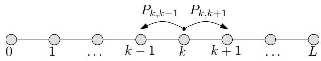
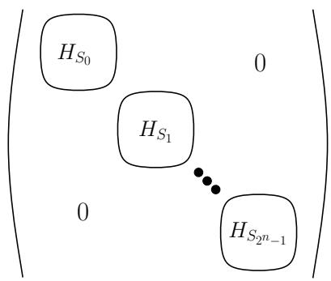
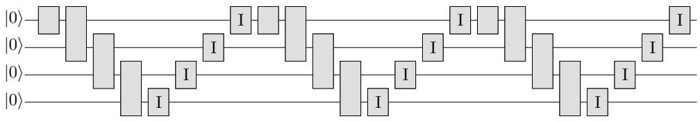
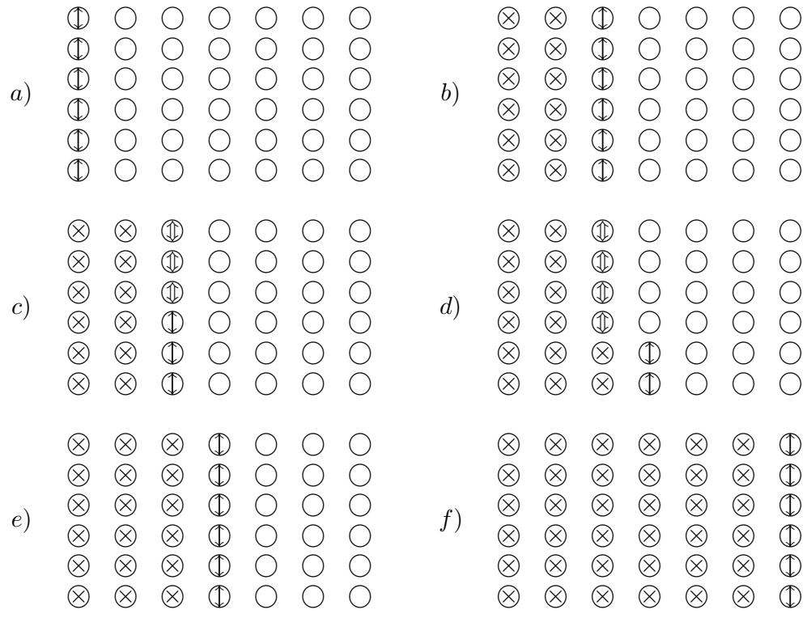

# Adiabatic Quantum Computation is Equivalent to Standard Quantum Computation

Dorit Aharonov School of Computer Science and Engineering, Hebrew University, Jerusalem, Israel

Wim van Dam Department of Computer Science, UC Santa Barbara, CA

Julia Kempe CNRS-LRI UMR 8623, Universit´e de Paris-Sud, Orsay, France

Zeph Landau Department of Mathematics, City College of New York, NY

Seth Lloyd Department of Mechanical Engineering, MIT, Cambridge, MA

Oded Regev Computer Science Department, Tel Aviv University, Israel

February 1, 2008

# Abstract

Adiabatic quantum computation has recently attracted attention in the physics and computer science communities, but its computational power was unknown. We describe an efficient adiabatic simulation of any given quantum algorithm, which implies that the adiabatic computation model and the conventional quantum computation model are polynomially equivalent. Our result can be extended to the physically realistic setting of particles arranged on a two-dimensional grid with nearest neighbor interactions. The equivalence between the models provides a new vantage point from which to tackle the central issues in quantum computation, namely designing new quantum algorithms and constructing fault tolerant quantum computers. In particular, by translating the main open questions in the area of quantum algorithms to the language of spectral gaps of sparse matrices, the result makes these questions accessible to a wider scientific audience, acquainted with mathematical physics, expander theory and rapidly mixing Markov chains.

# 1 Introduction

The study of adiabatic quantum computation was initiated several years ago by Farhi, Goldstone, Gutmann and Sipser [14], who suggested a novel quantum algorithm for solving classical optimization problems such as Satisfiability (Sat). Their algorithm is based on a celebrated theorem in quantum mechanics known as the adiabatic theorem [19, 25]. Although the exact worst-case behavior of this algorithm is not known, several simulations (see, e.g., [13]) on random instances of up to 20 quantum bits led to various optimistic speculations. The bad news is that there is now mounting evidence [9, 10, 29] that the algorithm of [14] takes exponential time in the worst-case for NP-complete problems. Nevertheless, adiabatic computation was since shown to be promising in other less ambitious directions: it possesses several interesting algorithmic capabilities, as we will soon review, and in addition, it exhibits inherent robustness against certain types of quantum errors [8]. We note that a small scale adiabatic algorithm has already been implemented experimentally, using a Nuclear Magnetic Resonance (NMR) system [36].

We briefly describe the model of adiabatic computation (a more precise description appears in Section 2.2). A computation in this model is specified by two Hamiltonians named $H _ { \mathrm { i n i t } }$ and $H _ { \mathrm { f i n a l } }$ (a Hamiltonian is simply a Hermitian matrix). The eigenvector with smallest eigenvalue (also known as the ground state) of $H _ { \mathrm { i n i t } }$ is required to be an easy to prepare state, such as a tensor product state. The output of the adiabatic computation is the ground state of the final Hamiltonian $H _ { \mathrm { f i n a l } }$ . Hence, we choose an $H _ { \mathrm { f i n a l } }$ whose ground state represents the solution to our problem. We require the Hamiltonians to be local, i.e., we require them to only involve interactions between a constant number of particles (this can be seen as the equivalent of allowing gates operating on a constant number of qubits in the standard model). This, in particular, makes sure that the Hamiltonians have a short classical description, by simply listing the matrix entries of each local term. The running time of the adiabatic computation is determined by the minimal spectral gap1 of all the Hamiltonians on the straight line connecting $H _ { \mathrm { i n i t } }$ and $H _ { \mathrm { f i n a l } }$ : $H ( s ) = ( 1 - s ) H _ { \mathrm { i n i t } } + s H _ { \mathrm { f i n a l } }$ for $s \in [ 0 , 1 ]$ . More precisely, the adiabatic computation is polynomial time if this minimal spectral gap is at least inverse polynomial.

The motivation for the above definition is physical. The Hamiltonian operator corresponds to the energy of the quantum system, and for it to be physically realistic and implementable it must be local. Its ground state is the state of lowest energy. We can set up a quantum system in the ground state of $H _ { \mathrm { i n i t } }$ (which is supposed to be easy to generate) and apply the Hamiltonian $H _ { \mathrm { i n i t } }$ to the system. We then slowly modify the Hamiltonian along the straight line from $H _ { \mathrm { i n i t } }$ towards $H _ { \mathrm { f i n a l } }$ . It follows from the adiabatic theorem that if this transformation is performed slowly enough (how slow is determined by the minimal spectral gap), the final state of the system will be in the ground state of $H _ { \mathrm { f i n a l } }$ , as required.

What is the computational power of this model? In order to refer to the adiabatic model as a computational model that computes classical functions (rather than quantum states), we consider the result of the adiabatic computation to be the outcome of a measurement of one or more of the qubits, performed on the final ground state. It is known that adiabatic computation can be efficiently simulated by standard quantum computers [9, 13]. Hence, its computational power is not greater than that of standard quantum computers. Several positive results are also known. In [9, 30] it was shown that Grover’s quadratic speed-up for an unsorted search [16] can be realized as an adiabatic computation. Moreover, [11,29,32] showed that adiabatic computation can ‘tunnel’ through wide energy barriers and thus outperform simulated annealing, a classical counterpart of the adiabatic model. However, whether adiabatic computation can achieve the full power of quantum computation was not known. In fact, even the question of whether adiabatic computation can simulate general classical computations efficiently was unknown. The focus of this paper is the exact characterization of the computational power of adiabatic computation.

Before we describe our results, let us clarify one subtle point. Most of the previous work on the subject focused on a restricted class of adiabatic algorithms that can be referred to as adiabatic optimization algorithms. In these algorithms, $H _ { \mathrm { f i n a l } }$ is chosen to be a diagonal matrix, corresponding to a combinatorial optimization problem. In particular, this implies that the ground state of $H _ { \mathrm { f i n a l } }$ (which is the output of the computation) is a classical state, i.e., a state in the computational basis. In this paper, however, we associate the term adiabatic computation with the more general class of adiabatic algorithms, where the only restriction on $H _ { \mathrm { f i n a l } }$ is that it is a local Hamiltonian. We do this because, from a physical point of view, there is no reason to force the physical process described above to have a diagonal $H _ { \mathrm { f i n a l } }$ , when all other Hamiltonians are not restricted this way. Thus, our definition of adiabatic computation seems to be the natural one to use. It is this natural definition that allows us to prove our results.

# 1.1 Results – Computational Complexity of the Adiabatic Model

Our main result clarifies the question of the computational power of adiabatic algorithms. We show:

Theorem 1.1 The model of adiabatic computation is polynomially equivalent to the standard model of quantum computation.

As mentioned above, one direction of the equivalence is already known [13,9]. Our contribution is to show that standard quantum computation can be efficiently simulated by adiabatic computation. We do this by using adiabatic computation with 3-local Hamiltonians. We note that [4] made a preliminary step in the direction of Theorem 1.1 but the model that they considered was quite different.2

One corollary of our main theorem is the following. We can consider the model of adiabatic computation with a more general set of Hamiltonians known as explicit sparse Hamiltonians. These are Hermitian matrices that have at most polynomially many nonzero elements in each row and column, and, moreover, there is an efficient Turing machine that can generate a list of all nonzero entries in a given row or column. Clearly, local Hamiltonians are a special case of explicit sparse Hamiltonians. It was shown in [4] that adiabatic computation with explicit sparse Hamiltonians can still be simulated by standard quantum computation (this extends the result of [9, 14] in a non-trivial way). Hence, we obtain the following result.

Corollary 1.2 The model of adiabatic computation with explicit sparse Hamiltonians is polynomially equivalent to the standard model of quantum computation.

Explicit sparse matrices are pervasive in computer science and combinatorics, and hence this corollary might be more useful than Theorem 1.1 in the context of the design of quantum algorithms and the study of quantum complexity.

To summarize, our results show that questions about quantum computation can be equivalently considered in the model of adiabatic computation, a model that is quite different from the more common circuit-based models. There are two reasons why it seems worthwhile to try to design quantum algorithms in the adiabatic framework. First, there are several known powerful techniques to analyze spectral gaps of matrices, including expander theory [15] and rapidly mixing Markov chains [24,34]. Indeed, probability theory is often used in mathematical physics to analyze spectral gaps of Hamiltonians (see, e.g., [35]), and our proofs also make extensive use of Markov chain tools. Second, it is known that many interesting algorithmic problems in quantum computation can be cast as quantum state generation problems [4]. The problem of generating special quantum states seems more natural in the adiabatic model than in the standard model.

# 1.2 Results – Towards Experimental Implications

Theorem 1.1 uses 3-local Hamiltonians that act on particles that may be arbitrarily far apart. From a practical point of view, it is often difficult to create controlled interactions between particles located far-away from each other. Moreover, three-particle Hamiltonians are technologically very difficult to realize. If one wants to physically realize the adiabatic algorithms, it would be much better to have only two-local interactions between nearest neighbor particles. To this end we prove the following theorem. This, we believe, brings the adiabatic computation model one step closer to physical realization.

Theorem 1.3 Any quantum computation can be efficiently simulated by an adiabatic computation with two-local nearest neighbor Hamiltonians operating on six-state particles set on a two dimensional grid.

The need for six-state particles arises from our construction. It is an open question whether this can be improved.

Theorems 1.1 and 1.3 open up the possibility of physically realizing universal quantum computation using adiabatically evolving quantum systems. As mentioned before, there are possible advantages to this approach: adiabatic quantum computation is resilient to certain types of noise [8]. An important component of this resilience is the existence of a spectral gap in the Hamiltonian. It is well known in physics that such a gap plays an important role in the context of protecting quantum systems from noise. However, it remains to be further studied, both experimentally and theoretically, what the right model for noisy adiabatic computation is, and whether fault tolerant adiabatic computation can be achieved. We refer the reader to further discussion in Subsection 1.6.

# 1.3 Proof of Theorem 1.1: Overview

Given an arbitrary quantum circuit [26], our goal is to design an adiabatic computation whose output is the same as that of the quantum circuit. Some similarities between the models are obvious: one model involves unitary gates on a constant number of qubits, while the other involves local Hamiltonians. However, after some thought, one eventually arrives at the following difficulty. The output state of the adiabatic computation is the ground state of $H _ { \mathrm { f i n a l } }$ . The output state of the quantum circuit is its final state, which is unknown to us. How can we specify $H _ { \mathrm { f i n a l } }$ without knowing the output state of the quantum circuit? Notice that this state can be some complicated quantum superposition. One might wonder why our task is not trivial, since this state does have an efficient local classical description, namely the quantum circuit. However, local quantum gates, which operate in sequence to generate a non-local overall action, are very different from local Hamiltonians, which correspond to simultaneous local constraints. To explain the solution, we first set some notations.

Without loss of generality we assume that the input to the quantum circuit consists of $n$ qubits all initialized to $| 0 \rangle$ ’s.3 Then, a sequence of $L$ unitary gates, $U _ { 1 } , \dots , U _ { L }$ , each operating on one or two qubits, is applied to the state. The system’s state after the $\ell ^ { \prime }$ th gate is $| \alpha ( \ell ) \rangle$ . The output of the quantum circuit is in general a complicated quantum state $| \alpha ( L ) \rangle$ of $n$ qubits, which is then measured in the standard basis. We now want to associate with it a corresponding adiabatic computation.

A first natural attempt would be to define $H _ { \mathrm { f i n a l } }$ as a local Hamiltonian with $| \alpha ( L ) \rangle$ as its ground state. However, this attempt encounters the difficulty mentioned above: not knowing $| \alpha ( L ) \rangle$ , it seems impossible to explicitly specify $H _ { \mathrm { f i n a l } }$ . The key to resolve this difficulty is the observation that the ground state of $H _ { \mathrm { f i n a l } }$ need not necessarily be the state $| \alpha ( L ) \rangle$ . It is sufficient (under some mild restrictions) that the ground state has a non-negligible inner product with $| \alpha ( L ) \rangle$ . This gives us significant flexibility in designing $H _ { \mathrm { f i n a l } }$ . Our idea is to base our solution on a seemingly unrelated ingenious result of Kitaev [22], in which he provides the first quantum NP-complete problem, namely, local Hamiltonians. This result can be viewed as the quantum analogue of the Cook-Levin theorem [28], which states that 3-Sat is NP-complete. For his proof, Kitaev defined a local

Hamiltonian that checks the time propagation of a quantum circuit. Kitaev’s local Hamiltonian has as its ground state the entire history of the quantum computation, in superposition:

$$
\vert \eta \rangle \ : : = \ : \ : \frac { 1 } { \sqrt { L + 1 } } \sum _ { \ell = 0 } ^ { L } \vert \alpha ( \ell ) \rangle \otimes \vert 1 ^ { \ell } 0 ^ { L - \ell } \rangle ^ { c } .
$$

The right ( $L$ qubits) register is a clock that counts the steps by adding 1s from left to right. The superscript $c$ denotes clock qubits. We note that this state has a non-negligible projection on our desired state $| \alpha ( L ) \rangle$ . Hence, instead of designing a Hamiltonian that has the final unknown state of the circuit as its ground state, a task that seems impossible, we can define $H _ { \mathrm { f i n a l } }$ to be Kitaev’s local Hamiltonian. Why is it possible to define a local Hamiltonian whose ground state is $| \eta \rangle$ , whereas the same task seems impossible with $| \alpha ( L ) \rangle$ ? The idea is that the unary representation of the clock enables a local verification of correct propagation of the computation from one step to the next, which cannot be done without the intermediate computational steps.

We thus choose Kitaev’s Hamiltonian [22] to be our $H _ { \mathrm { f i n a l } }$ . This Hamiltonian involves five body interactions (three clock particles and two computation particles). For the initial Hamiltonian $H _ { \mathrm { i n i t } }$ we require that it has $| \alpha ( 0 ) \rangle \otimes | 0 ^ { L } \rangle ^ { c }$ , the first term in the history state, as its unique ground state. It is easy to define such a local Hamiltonian, because $| \alpha ( 0 ) \rangle \otimes | 0 ^ { L } \rangle ^ { c }$ is a tensor product state. Crucially, $H _ { \mathrm { i n i t } }$ and $H _ { \mathrm { f i n a l } }$ can be constructed efficiently from the given quantum circuit; no knowledge of $| \alpha ( L ) \rangle$ is required for the construction.

A technical problem lies in showing that the spectral gap of the intermediate Hamiltonian $H ( s )$ is lower bounded by some inverse polynomial (more specifically, we show it is larger than $1 / L ^ { 2 }$ ). To do this, we use a mapping of the Hamiltonian to a Markov chain corresponding to a random walk on the $L + 1$ time steps. We then apply the conductance bound from the theory of rapidly mixing Markov chains [34] to bound the spectral gap of this chain. We note that, in general, applying the conductance bound requires knowing the limiting distribution of the chain, which in our case is hard since it corresponds to knowing the coefficients of the ground state for all the Hamiltonians $H ( s )$ . We circumvent this problem by noticing that it is actually sufficient in our case to know very little about the limiting distribution of the Markov chain, namely that it is monotone (in a certain sense to be defined later). This allows us to apply the conductance bound, and deduce that the spectral gap is $\Omega ( 1 / L ^ { 2 } )$ . From this it follows that the running time of the adiabatic computation is polynomial. Extracting the output of the quantum circuit from the history state efficiently is easy: Measure all the qubits of the clock and if the clock is in the state $| 1 ^ { \ell } \rangle$ , the computational qubits carry the result of the circuit. Otherwise, start from scratch.4

The above scheme gives a proof of Theorem 1.1 that uses 5-local Hamiltonians, and runs in time roughly ${ \cal O } ( L ^ { 5 } )$ . The improvement to 3-locality is based on a simple idea (used in [20] to prove that the 3-local Hamiltonian problem is quantum NP-complete) but obtaining a lower bound on the spectral gap is significantly more involved technically. We postpone its explanation to the body of the paper. The running time we achieve in this case is roughly ${ \cal O } ( L ^ { 1 4 } )$ .

# 1.4 Proof of Theorem 1.3: Overview

The idea underlying the proof of Theorem 1.1 by itself does not suffice to prove Theorem 1.3. The basic problem lies in arranging sufficient interaction between the computational and the clock particles, since if the particles are set on a grid, each clock particle can only interact with four neighbors. We circumvent this problem as follows. Instead of having separate clock and computational particles, we now assign to each particle both clock and computational degrees of freedom (this is what makes our particles six-state). We then construct a computation that propagates locally over the entire set of particles, snaking up and down each column of the lattice. The adiabatic evolution now ends up in the history state of this snake-like sequence of states.

The lower bound on the spectral gap is obtained in an essentially identical way as in the 3-local Hamiltonian case.

# 1.5 Related Work

After the preliminary version of this paper appeared [2], the results regarding Quantum-NP completeness were tightened by [21] to show that the 2-local Hamiltonian problem is Quantum-NP complete. Following the ideas presented in the current paper, [21] used their result to show that Theorem 1.1 holds when the Hamiltonians are 2-local.

The idea to use an inverse polynomial spectral gap for fault tolerance is certainly not new. It is a crucial ingredient in topological (and later, geometrical) quantum computation [18, 23, 27]. Note, however, that in those models the spectral gap has no effect on the running time or on any other algorithmic aspects, and it is used only to separate the computational subspace from the “noisy” subspace. In contrast, the spectral gap in adiabatic computation is crucial from the algorithmic point of view, since it determines the time complexity of the computation.

# 1.6 Open Questions

This paper demonstrates that quantum computation can be studied and implemented entirely within the adiabatic computation model, without losing its computational power. This result raises many open questions in various directions. First, it would be interesting to determine if the parameters presented in this work can be improved. For example, it might be possible to shorten the running time of our adiabatic simulation. Decreasing the dimensionality of the particles used in Theorem 1.3 from six to two or three might be important for implementation applications. An interesting question is whether Theorem 1.3 can be achieved using a one dimensional instead of a two dimensional grid.

Second, the possibility of fault tolerant adiabatic computation deserves to be studied both experimentally and theoretically. Since the publication of the preliminary version of the current paper [2], several researchers have begun to study adiabatic computation in the presence of noise [1, 31, 33]. However, it is still unclear whether adiabatic evolution might be helpful for the physical implementation of quantum computers.

Our results imply the equivalence between standard quantum computation and various other variants of adiabatic computation that have been considered in the literature and that are more general than our model. These include adiabatic computation with a general path between $H _ { \mathrm { i n i t } }$ and $H _ { \mathrm { f i n a l } }$ , rather than a straight line (see [4] and [12] for a rigorous definition), and adiabatic computation with explicit sparse Hamiltonians [4] (see Corollary 1.2). A problem we leave open is to characterize the computational power of adiabatic optimization, studied in [9, 10, 14]. In this model, the initial state is a tensor product of qubits in the state $\scriptstyle { \frac { 1 } { \sqrt { 2 } } } ( \left| 0 \right. + \left| 1 \right. )$ , the final Hamiltonian is diagonal, and the evolution is carried out on a straight line. It is still possible that such a computation can be simulated efficiently by a classical Turing Machine.

Finally, we hope that the adiabatic framework might lead to the discovery of new quantum algorithms. As shown in this paper, as well as in [4], tools from probability theory, mathematical physics and spectral gap analysis might turn out to be relevant and useful. In order to improve our understanding of the benefits of the adiabatic paradigm, it might be insightful to see adiabatic versions of known quantum algorithms, presented in a meaningful way.

Organization: In Section 2 we describe the model of adiabatic computation and state some relevant facts about Markov chains. Section 3 shows how adiabatic systems with local Hamiltonians allowing five- and later three-body interactions, can efficiently simulate standard quantum computations. Section 4 shows how to adapt the construction to a two-dimensional grid.

# 2 Preliminaries

# 2.1 Hamiltonians of $n$ -Particle Systems

For background on $n$ -qubit systems, quantum circuits and Hamiltonians, see [26]. An $n$ -particle system is described by a state in Hilbert space of dimension $d ^ { n }$ , the tensor product of $n$ $d$ -dimensional Hilbert spaces. For simplicity, we restrict our discussion in this subsection to quantum systems composed of 2-dimensional particles, i.e., qubits; a similar discussion holds for higher dimensional particles (such as the 6-dimensional case we consider later).

In the standard model of quantum computation, the state of $n$ qubits evolves in discrete time steps by unitary operations. In fact, the underlying physical description of this evolution is continuous, and is governed by Schr¨odinger’s equation: $\begin{array} { r } { - i \frac { d } { d t } | \psi ( t ) \rangle = H ( t ) | \psi ( t ) \rangle } \end{array}$ . Here $| \psi ( t ) \rangle$ is the state of the $n$ qubits at time $t$ , and $H ( t )$ is a Hermitian $2 ^ { n } \times 2 ^ { n }$ matrix operating on the space of $n$ qubits. This $H ( t )$ is the Hamiltonian operating on a system; it governs the dynamics of the system. Given that the state of the system at time $t = 0$ is equal to $| \psi ( 0 ) \rangle$ , one can in principle solve Schr¨odinger’s equation with this initial condition, to get $| \psi ( T ) \rangle$ , the state of the system at a later time $t = T$ . The fact that the Hamiltonian is Hermitian corresponds to the familiar fact that the discrete time evolution of the quantum state from time $t _ { 1 }$ to a later time $t _ { 2 }$ is unitary.

We sometimes refer to eigenvalues of Hamiltonians as energies. The ground energy of a Hamiltonian is its lowest eigenvalue and the corresponding eigenvector(s) are called ground state(s). We define $\Delta ( H )$ , the spectral gap of a Hamiltonian $H$ , to be the difference between the lowest eigenvalue of $H$ and its second lowest eigenvalue. ( $\Delta ( H ) = 0$ if the lowest eigenvalue is degenerate, namely, has more than one eigenvector associated with it). We define the restriction of $H$ to some subspace $\boldsymbol { S }$ , denoted $H _ { S }$ , as $\Pi _ { S } H \Pi _ { S }$ where $\Pi _ { S }$ is the orthogonal projection on $\boldsymbol { S }$ .

A Hamiltonian on an $n$ -particle system represents a certain physical operation that one can, in principle, apply to an $n$ -particle system. However, it is clear that one cannot efficiently apply any arbitrary Hamiltonian (just describing it requires roughly $2 ^ { 2 n }$ space). We say that a Hamiltonian $H$ is $k$ -local if $H$ can be written as $\textstyle \sum _ { A } H ^ { A }$ where $A$ runs over all subsets of $k$ particles, and $H ^ { A }$ operates trivially on all but the particles in $A$ (i.e., it is a tensor product of a Hamiltonian on $A$ with identity on the particles outside of $A$ ). Notice that for any constant $k$ , a $k$ -local Hamiltonian on $n$ -qubits can be described by $2 ^ { 2 k } n ^ { k } = \mathrm { p o l y } ( n )$ numbers. We say that $H$ is local if $H$ is $k$ -local for some constant $k$ .

In this paper we restrict our attention to $k$ -local Hamiltonians. This requirement corresponds to the fact that all known interactions in nature involve a constant number of particles. We attempt to make $k$ as small as possible to make the Hamiltonian easier to implement.

# 2.2 The Model of Adiabatic Computation

The cornerstone of the adiabatic model of computation is the celebrated adiabatic theorem [19,25]. Consider a time-dependent Hamiltonian $H ( s )$ , $s \in \lbrack 0 , 1 ]$ , and a system initialized at time $t = 0$ in the ground state of $H ( 0 )$ (here and in the following we assume that for all $s \in [ 0 , 1 ]$ , $H ( s )$ has a unique ground state). Let the system evolve according to the Hamiltonian $H ( t / T )$ from time $t = 0$ to time $T$ . We refer to such a process as an adiabatic evolution according to $H$ for time $T$ . The adiabatic theorem affirms that for large enough $T$ the final state of the system is very close to the ground state of $H ( 1 )$ . Just how large $T$ should be for this to happen is determined by the spectral gap of the Hamiltonians $H ( s )$ . Such an upper bound on $T$ is given in the following theorem, adapted from [29] (whose proof in turn is based on [6]; see also [5] for a recent elementary proof of a slightly weaker version).

Theorem 2.1 (The Adiabatic Theorem (adapted from [29])) Let $H _ { \mathrm { i n i t } }$ and $H _ { \mathrm { f i n a l } }$ be two Hamiltonians acting on a quantum system and consider the time-dependent Hamiltonian $H ( s ) : = ( 1 -$ $s ) H _ { \mathrm { i n i t } } + s H _ { \mathrm { f i n a l } }$ . Assume that for all $s$ , $H ( s )$ has a unique ground state. Then for any fixed $\delta > 0$ , if

$$
\begin{array} { r l r } { T } & { \ge } & { \Omega \left( \frac { \| H _ { \mathrm { f i n a l } } - H _ { \mathrm { i n i t } } \| ^ { 1 + \delta } } { \epsilon ^ { \delta } \operatorname* { m i n } _ { s \in [ 0 , 1 ] } \{ \Delta ^ { 2 + \delta } ( H ( s ) ) \} } \right) } \end{array}
$$

then the final state of an adiabatic evolution according to $H$ for time $T$ (with an appropriate setting of global phase) is $\epsilon$ -close in $\ell _ { 2 }$ -norm to the ground state of $H _ { \mathrm { f i n a l } }$ . The matrix norm is the spectral norm $\| H \| : = \operatorname* { m a x } _ { w } \| H w \| / \| w \|$ .

One should think of $\delta$ as being some fixed constant, say, 0.1. We cannot take $\delta = 0$ because of the constant hidden in the $\Omega$ notation, which goes to infinity as $\delta$ goes to 0.

Let us now describe the model of adiabatic computation. In this paper we use the following definition of adiabatic computation that slightly generalizes that of Farhi et al. [14]. The adiabatic ‘circuit’ is determined by $H _ { \mathrm { i n i t } }$ and $H _ { \mathrm { f i n a l } }$ and the output of the computation is (close to) the ground state of $H _ { \mathrm { f i n a l } }$ .

Definition 2.2 A $k$ -local adiabatic computation $A C ( n , d , H _ { \mathrm { i n i t } } , H _ { \mathrm { f i n a l } } , \epsilon )$ is specified by two $k$ -local Hamiltonians, $H _ { \mathrm { i n i t } }$ and $H _ { \mathrm { f i n a l } }$ acting on n $d$ -dimensional particles, such that both Hamiltonians have unique ground states. The ground state of $H _ { \mathrm { i n i t } }$ is a tensor product state. The output is a state that is $\epsilon$ -close in $\ell _ { 2 }$ -norm to the ground state of $H _ { \mathrm { f i n a l } }$ . Let $T$ be the smallest time such that the final state of an adiabatic evolution according to $H ( s ) : = ( 1 - s ) H _ { \mathrm { i n i t } } + s H _ { \mathrm { f i n a l } }$ for time $T$ is $\epsilon$ -close in $\ell _ { 2 }$ -norm to the ground state of $H _ { \mathrm { f i n a l } }$ . The running time of the adiabatic algorithm is defined to be $T \cdot \operatorname* { m a x } _ { s } \| H ( s ) \|$ .

Observe that we have chosen our definition of running time to be $T \cdot \operatorname* { m a x } _ { s } \| H ( s ) \|$ and not $T$ . Notice that if the Hamiltonians are multiplied by some factor, this divides the bound of Equation 2, and hence $T$ , by the same factor. Hence, if the running time is defined to be $T$ one would be able to achieve arbitrarily small running times, by multiplying the Hamiltonians by large factors. Our definition, on the other hand, is invariant under a multiplication of the Hamiltonian by an overall factor, and so takes into account the known physical trade-off between time and energy.5

The right hand side of Equation 2 can be used to provide an upper bound on the running time of an adiabatic computation. Hence, in order to show that an adiabatic algorithm is efficient, it is enough to use Hamiltonians of at most poly $( n )$ norm, and show that for all $s \in [ 0 , 1 ]$ the spectral gap $\Delta ( H ( s ) )$ is at least inverse polynomial in $n$ .

We note that in certain cases, it is possible to obtain a stronger upper bound on the running time. Indeed, assume there exists a subspace $\boldsymbol { S }$ such that for all $s \in [ 0 , 1 ]$ , $H ( s )$ leaves $\boldsymbol { S }$ invariant, i.e., $H ( s ) ( S ) \subseteq S$ . Equivalently, $H ( s )$ is block diagonal in $\boldsymbol { S }$ and its orthogonal space $\mathcal { S } ^ { \perp }$ . Consider $H _ { S } ( s )$ , the restriction of $H ( s )$ to $\boldsymbol { S }$ . Then, starting from a state inside $\boldsymbol { S }$ , an adiabatic evolution according to $H$ is identical to an adiabatic evolution according to $H _ { S }$ (this follows from Schr¨odinger’s equation). Hence, we can potentially obtain a stronger upper bound by replacing $\Delta ( H ( s ) )$ with $\Delta ( H _ { S } ( s ) )$ in Equation 2. This stronger upper bound will be used in our first adiabatic algorithm.

Finally, let us mention that one can define more general models of adiabatic computation. For example, one might consider non-local Hamiltonians (see [4]). Another possible extension is to consider more general paths between $H _ { \mathrm { i n i t } }$ and $H _ { \mathrm { f i n a l } }$ (see, e.g., [12, 8, 4]). Obviously, our main results, such as Theorem 1.1, hold also for these more general models.

# 2.3 Markov Chains and Hermitian Matrices

Under certain conditions, there exists a standard mapping of Hamiltonians to Markov chains (for background on Markov chains, see [24]). The following fact is useful to show that this mapping applies in the case we analyze.

Fact 2.3 (Adapted from Perron’s Theorem, Theorem 8.2.11 in [17]) Let $G$ be a Hermitian matrix with real non-negative entries. If there exists a finite $k$ such that all entries of $G ^ { k }$ are positive, then $G$ ’s largest eigenvalue is positive, and all other eigenvalues are strictly smaller in absolute value. Moreover, the corresponding eigenvector is unique, and all its entries are positive.

We define the mapping for $G$ , a Hermitian matrix operating on an $L + 1$ dimensional Hilbert space. Suppose that all the entries of $G$ are real and non-negative, that its eigenvector $( \alpha _ { 0 } , \dots , \alpha _ { L } )$ with largest eigenvalue $\mu$ satisfies $\alpha _ { i } > 0$ for all $0 \leq i \leq L$ and that $\mu > 0$ . Define $P$ by:

$$
{ P } _ { i j } : = \frac { { \alpha } _ { j } } { { \mu } { \alpha } _ { i } } { \cal G } _ { i j } .
$$

The matrix $P$ is well defined, and is stochastic because all its entries are non-negative and each of its rows sums up to one. It is easy to verify the following fact:

Fact 2.4 The vector $( v _ { 0 } , \ldots , v _ { L } )$ is an eigenvector of $G$ with eigenvalue $\delta$ if and only if $( \alpha _ { 0 } v _ { 0 } , \ldots , \alpha _ { L } v _ { L } )$ is a left eigenvector of $P$ with eigenvalue $\delta / \mu$ .

We will consider $G$ of the form $G = I - H$ for some Hamiltonian $H$ . The above fact implies that if $( \alpha _ { 0 } , \dots , \alpha _ { L } )$ is the ground state of $H$ with eigenvalue $\lambda$ then $( \alpha _ { 0 } ^ { 2 } , \dots , \alpha _ { L } ^ { 2 } )$ is a left eigenvector of $P$ with maximal eigenvalue 1. By normalizing, we obtain that $\pi : = ( \alpha _ { 0 } ^ { 2 } / Z , \dots , \alpha _ { L } ^ { 2 } / Z )$ is the limiting distribution of $P$ , where $Z = \textstyle \sum \alpha _ { i } ^ { 2 }$ . Moreover, the gap between $P$ ’s largest and second largest eigenvalues is equal to $\Delta ( H ) / ( 1 - \lambda )$ .

# 2.4 Spectral Gaps of Markov Chains

Given a stochastic matrix $P$ with limiting distribution $\pi$ , and a subset $B \subseteq \{ 0 , \ldots , L \}$ , the flow from $B$ is given by $\begin{array} { r } { F ( B ) : = \sum _ { i \in B , j \not \in B } \pi _ { i } P _ { i j } } \end{array}$ . Define the $\pi$ -weight of $B$ as $\textstyle { \pi ( B ) : = \sum _ { i \in B } \pi _ { i } }$ . The conductance of $P$ is defined by $\varphi ( P ) : = \mathrm { m i n } _ { B } F ( B ) / \pi ( B )$ , where we minimize over all non-empty subsets $B \subseteq \{ 0 , \ldots , L \}$ with $\pi ( B ) \leq { \frac { 1 } { 2 } }$ .

Theorem 2.5 (The conductance bound [34])) The eigenvalue gap of $P$ is at least ${ \textstyle \frac { 1 } { 2 } } \varphi ( P ) ^ { 2 }$ .

# 3 Equivalence of Adiabatic and Quantum Computation

Here we prove Theorem 1.1, by showing how to simulate a quantum circuit with $L$ two-qubit gates on $n$ qubits by an adiabatic computation on $n + L$ qubits (the other direction was shown in [14,9]). We first allow five qubit interactions. We later show how to reduce it to three, using techniques that will also be used in Section 4.

# 3.1 Five-local Hamiltonian

Theorem 3.1 Given a quantum circuit on n qubits with $L$ two-qubit gates implementing a unitary $U$ , and $\epsilon > 0$ , there exists a 5-local adiabatic computation $A C ( n + L , 2 , H _ { \mathrm { i n i t } } , H _ { \mathrm { f i n a l } } , \epsilon )$ whose running time is $\mathrm { p o l y } ( L , \frac { 1 } { \epsilon } )$ and whose output (after tracing out some ancilla qubits) is $\epsilon$ -close (in trace distance) to $U | 0 ^ { n } \rangle$ . Moreover, $H _ { \mathrm { i n i t } }$ and $H _ { \mathrm { f i n a l } }$ can be computed by a polynomial time Turing machine.

The running time we obtain here is $O ( \epsilon ^ { - ( 5 + 3 \delta ) } L ^ { 5 + 2 \delta } )$ for any fixed $\delta > 0$

# 3.1.1 The Hamiltonian

For our construction we use the Hamiltonian defined in [22]. Denote $| \gamma _ { \ell } \rangle : = | \alpha ( \ell ) \rangle \otimes | 1 ^ { \ell } 0 ^ { L - \ell } \rangle ^ { c }$ , where $| \alpha ( \ell ) \rangle$ denotes the state of the circuit after the $\ell$ th gate and the superscript $c$ denotes the clock qubits. We would like to define a local Hamiltonian $H _ { \mathrm { i n i t } }$ with ground state $| \gamma _ { 0 } \rangle = | 0 ^ { n } \rangle \otimes | 0 ^ { L } \rangle ^ { c }$ , and a local Hamiltonian $H _ { \mathrm { f i n a l } }$ with ground state $\begin{array} { r } { | \eta \rangle = \frac { 1 } { \sqrt { L + 1 } } \sum _ { \ell = 0 } ^ { L } | \gamma _ { \ell } \rangle } \end{array}$ as in Equation 1. To do this, we write $H _ { \mathrm { i n i t } }$ and $H _ { \mathrm { f i n a l } }$ as a sum of terms:

$$
\begin{array} { r l r } & { } & { H _ { \mathrm { i n i t } } : = H _ { \mathrm { c l o c k i n i t } } + H _ { \mathrm { i n p u t } } + H _ { \mathrm { c l o c k } } } \\ & { } & { H _ { \mathrm { f i n a l } } : = \displaystyle \frac { 1 } { 2 } \sum _ { \ell = 1 } ^ { L } H _ { \ell } + H _ { \mathrm { i n p u t } } + H _ { \mathrm { c l o c k } } . } \end{array}
$$

The terms in $H _ { \mathrm { f i n a l } }$ (and likewise in $H _ { \mathrm { i n i t } }$ ) are defined such that the only state whose energy (i.e., eigenvalue) is $0$ is the desired ground state. This is done by assigning an energy penalty to any state that does not satisfy the required properties of the ground state. The different terms, which correspond to different properties of the ground states, are described in the following paragraphs. The adiabatic evolution then follows the time-dependent Hamiltonian

$$
\begin{array} { l l l } { { H ( s ) } } & { { = } } & { { ( 1 - s ) H _ { \mathrm { i n i t } } + s H _ { \mathrm { f i n a l } } . } } \end{array}
$$

Notice that as $s$ goes from $0$ to $^ 1$ , $H _ { \mathrm { c l o c k i n i t } }$ is slowly replaced by $\begin{array} { r } { \frac { 1 } { 2 } \sum _ { \ell = 1 } ^ { L } H _ { \ell } } \end{array}$ while $H _ { \mathrm { i n p u t } }$ and $H _ { \mathrm { c l o c k } }$ are held constant.

We now describe each of the terms. First, $H _ { \mathrm { c l o c k } }$ checks that the clock’s state is of the form $| 1 ^ { \ell } 0 ^ { L - \ell } \rangle ^ { c }$ for some $0 \le \ell \le L$ . This is achieved by assigning an energy penalty to any basis state on the clock qubits that contains the sequence 01,

$$
H _ { \mathrm { c l o c k } } : = \sum _ { \ell = 1 } ^ { L - 1 } | 0 1 \rangle \langle 0 1 | _ { \ell , \ell + 1 } ^ { c } ,
$$

where the subscript indicates which clock qubits the projection operates on. Note that illegal clock states are eigenstates of $H _ { \mathrm { c l o c k } }$ with eigenvalue at least 1; legal clock states have eigenvalue 0.

Next, $H _ { \mathrm { i n p u t } }$ checks that if the clock is $| 0 ^ { L } \rangle ^ { c }$ , the computation qubits must be in the state $| 0 ^ { n } \rangle$

$$
H _ { \mathrm { i n p u t } } : = \sum _ { i = 1 } ^ { n } | 1 \rangle \langle 1 | _ { i } \otimes | 0 \rangle \langle 0 | _ { 1 } ^ { c } .
$$

We complete the description of $H _ { \mathrm { i n i t } }$ with $H _ { \mathrm { c l o c k i n i t } }$ whose goal is to check that the clock’s state is $| 0 ^ { L } \rangle ^ { c }$ ,

$$
\begin{array} { r l r } { H _ { \mathrm { c l o c k i n i t } } } & { { } : = } & { | 1 \rangle \langle 1 | _ { 1 } ^ { c } . } \end{array}
$$

Claim 3.2 The state $| \gamma _ { 0 } \rangle$ is a ground state of $H _ { \mathrm { i n i t } }$ with eigenvalue 0.6

Proof: It is easy to verify that $H _ { \mathrm { i n i t } } | \gamma _ { 0 } \rangle = 0$ . As a sum of projectors, $H _ { \mathrm { i n i t } }$ is positive semidefinite and hence $| \gamma _ { 0 } \rangle$ is a ground state of $H _ { \mathrm { i n i t } }$ .

We now proceed to the first term in $H _ { \mathrm { f i n a l } }$ . The Hamiltonian $H _ { \ell }$ checks that the propagation from step $\ell - 1$ to $\ell$ is correct, i.e., that it corresponds to the application of the gate $U _ { \ell }$ . For $1 < \ell < L$ , it is defined as

$$
\begin{array} { r c l } { { H _ { \ell } } } & { { : = } } & { { I \otimes | 1 0 0 \rangle \langle 1 0 0 | _ { \ell - 1 , \ell , \ell + 1 } ^ { c } - U _ { \ell } \otimes | 1 1 0 \rangle \langle 1 0 0 | _ { \ell - 1 , \ell , \ell + 1 } ^ { c } } } \\ { { } } & { { } } & { { - U _ { \ell } ^ { \dagger } \otimes | 1 0 0 \rangle \langle 1 1 0 | _ { \ell - 1 , \ell , \ell + 1 } ^ { c } + I \otimes | 1 1 0 \rangle \langle 1 1 0 | _ { \ell - 1 , \ell , \ell + 1 } ^ { c } . } } \end{array}
$$

Intuitively, the three-qubit terms above move the state of the clock one step forward, one step backward, or leave it unchanged. The accompanying matrices $U _ { \ell } , U _ { \ell } ^ { \dagger }$ describe the associated time evolution. For the boundary cases $\ell = 1 , L$ , we omit one clock qubit from these terms and define

$$
\begin{array} { r c l } { { \bar { { \cal I } } _ { 1 } } } & { { : = } } & { { { \cal I } \otimes | 0 0 \rangle \langle 0 0 | _ { 1 , 2 } - { \cal U } _ { 1 } \otimes | 1 0 \rangle \langle 0 0 | _ { 1 , 2 } - { \cal U } _ { 1 } ^ { \dagger } \otimes | 0 0 \rangle \langle 1 0 | _ { 1 , 2 } + { \cal I } \otimes | 1 0 \rangle \langle 1 0 | _ { 1 , 2 } } } \\ { { { \cal I } _ { L } } } & { { : = } } & { { { \cal I } \otimes | 1 0 \rangle \langle 1 0 | _ { L - 1 , L } - { \cal U } _ { L } \otimes | 1 1 \rangle \langle 1 0 | _ { L - 1 , L } - { \cal U } _ { L } ^ { \dagger } \otimes | 1 0 \rangle \langle 1 1 | _ { L - 1 , L } + { \cal I } \otimes | 1 1 \rangle \langle 1 1 | _ { L - 1 , L } } } \end{array}
$$

Claim 3.3 The history state $| \eta \rangle$ is a ground state of $H _ { \mathrm { f i n a l } }$ with eigenvalue 0.

Proof: It is easy to verify that $H _ { \mathrm { f i n a l } } | \eta \rangle = 0$ . It remains to notice that for all $1 \le \ell \le L$ , $H _ { \ell }$ is positive semidefinite and hence so is $H _ { \mathrm { f i n a l } }$ .

Remark: Strictly speaking, Theorem 3.1 holds even if we remove the terms $H _ { \mathrm { c l o c k } }$ and $H _ { \mathrm { i n p u t } }$ from both $H _ { \mathrm { i n i t } }$ and $H _ { \mathrm { f i n a l } }$ . We include them mainly for consistency with the rest of the paper.

# 3.1.2 Spectral Gap in a Subspace

Let $S _ { 0 }$ be the $L + 1$ -dimensional subspace spanned by $| \gamma _ { 0 } \rangle , \dots , | \gamma _ { L } \rangle$ . It is easy to verify the following claim.

Claim 3.4 The subspace $S _ { 0 }$ is invariant under $H ( s )$ , i.e., $H ( s ) ( S _ { 0 } ) \subseteq S _ { 0 }$

In this subsection, we show that the spectral gap of $H _ { S _ { 0 } } ( s )$ , the restriction of $H$ to $S _ { 0 }$ , is inverse polynomial in $L$ . As mentioned in Subsection 2.2, this, together with Claim 3.4, is enough to obtain a bound on the running time of the adiabatic algorithm.

Lemma 3.5 The spectral gap of the restriction of $H ( s )$ to $S _ { 0 }$ satisfies $\Delta ( H _ { S _ { 0 } } ( s ) ) = \Omega ( L ^ { - 2 } )$ for all $s \in [ 0 , 1 ]$ .

Proof: Let us write the Hamiltonians $H _ { S _ { \mathrm { 0 } } , \mathrm { i n i t } }$ and $H _ { S _ { 0 } , \mathrm { { f i n a l } } }$ in the basis $| \gamma _ { 0 } \rangle , \dots , | \gamma _ { L } \rangle$ of $ { \boldsymbol { S } } _ { 0 }$ . Both $H _ { \mathrm { c l o c k } }$ and $H _ { \mathrm { i n p u t } }$ are $0$ on $S _ { 0 }$ and can thus be ignored. We have the following $( L + 1 ) \times ( L + 1 )$ matrices:

$$
\begin{array} { r l r } { H _ { S _ { 0 } , \mathrm { i n i t } } } & { = } & { \left( \begin{array} { c c c c } { 0 } & { 0 } & { \dots } & { 0 } \\ { 0 } & { 1 } & { \dots } & { 0 } \\ { \vdots } & { \vdots } & { \ddots } & { \vdots } \\ { 0 } & { 0 } & { \dots } & { 1 } \end{array} \right) , } \end{array}
$$

$$
\begin{array} { r l } { H _ { \mathrm { S i , f n a l } } } & { = \ \frac { 1 } { 2 } | \gamma _ { 0 } \middle \langle \gamma _ { 0 } \middle | - \frac { 1 } { 2 } | \gamma _ { 0 } \middle \rangle \middle \langle \gamma _ { 1 } | - \frac { 1 } { 2 } | \gamma _ { 0 } \middle \rangle \middle \langle \gamma _ { - 1 } | + \frac { 1 } { 2 } | \gamma _ { 0 } \middle \rangle \middle \langle \gamma _ { 0 } | } \\ & { \quad + \displaystyle \sum _ { \ell = 1 } ^ { L - 1 } ( - \frac { 1 } { 2 } | \gamma _ { \ell } \middle \rangle \middle \langle \gamma _ { \ell - 1 } | + | \gamma _ { \ell } \middle \rangle \middle \langle \gamma _ { \ell } | - \frac { 1 } { 2 } | \gamma _ { \ell }  \middle \langle \gamma _ { \ell + 1 } | | } \\ & { = \ ( \begin{array} { l l l l l l } { \frac { 1 } { 2 } } & { - \frac { 1 } { 2 } } & { 0 } & { \ \ \cdots } & { 0 } \\ { - \frac { 1 } { 2 } } & { 1 } & { - \frac { 1 } { 2 } } & { 0 } & { \cdots } & { \frac { 1 } { 2 } } \\ { 0 } & { - \frac { 1 } { 2 } } & { 1 } & { - \frac { 1 } { 2 } } & { 0 } & { \cdots } & { \vdots } \\ { \ddots } & { \ddots } & { \ddots } & { \ddots } & { \ddots } & { \ddots } \\ { \vdots } & { \ \ } & { 0 } & { - \frac { 1 } { 2 } } & { 1 } & { - \frac { 1 } { 2 } } & { 0 } \\ { 0 } & { \ \cdots } & { 0 } & { - \frac { 1 } { 2 } } & { 1 } & { - \frac { 1 } { 2 } } \\ { 0 } & { \cdots } & { 0 } & { 0 } & { - \frac { 1 } { 2 } } & { \frac { 1 } { 2 } } \end{array} ) } \\ &  = \ ( \begin{array} { l l l l l } { \frac { 1 } { 2 } } &   \end{array} \end{array}
$$

We now lower bound $\Delta ( H _ { S _ { 0 } } ( s ) )$ . We consider two cases:

The case $s < 1 / 3$ : Here, $H _ { S _ { 0 } } ( s )$ is sufficiently close to $H _ { S _ { \mathrm { 0 } } , \mathrm { i n i t } }$ (whose spectral gap is 1) so we can apply the following standard lemma (see, e.g., [7], Page 244).

Lemma 3.6 (Gerschgorin’s Circle Theorem) Let $A$ be any matrix with entries $a _ { i j }$ . Consider the discs in the complex plane given by

$$
D _ { i } = \Big \{ z \ | \ | z - a _ { i i } | \le \sum _ { j \neq i } | a _ { i j } | \Big \} , 1 \le i \le n .
$$

Then the eigenvalues of $A$ are contained in $\cup D _ { i }$ and any connected component of $\cup D _ { i }$ contains as many eigenvalues of $A$ as the number of discs that form this component.

For $s < 1 / 3$ , $H _ { S _ { 0 } } ( s ) _ { 1 , 1 } < 1 / 6$ and $\textstyle \sum _ { j \neq 1 } H _ { S _ { 0 } } ( s ) _ { 1 , j } < 1 / 6$ . Moreover, for any $i \neq 1$ , ${ \cal H } _ { S _ { 0 } } ( s ) _ { i , i } >$ $5 / 6$ and $\textstyle \sum _ { j \neq i } H _ { S _ { 0 } } ( s ) _ { i , j } < 1 / 6$ . By the above lemma, we obtain that there is one eigenvalue smaller than $1 / 3$ while all other eigenvalues are larger than $2 / 3$ . Hence, the spectral gap is at least $1 / 3$ .

The case $s \geq 1 / 3$ : We note that $H _ { S _ { \mathrm { 0 } } , \mathrm { f i n a l } }$ is the Laplacian of the simple random walk [24] of a particle on a line of length $L + 1$ . A standard result in Markov chain theory implies $\Delta ( H _ { S _ { \mathrm { 0 } } , \mathrm { f i n a l } } ) =$ $\Omega ( 1 / L ^ { 2 } )$ [24]. For $s \geq 1 / 3$ , $H _ { S _ { 0 } } ( s )$ is sufficiently close to $H _ { S _ { 0 } , \mathrm { f i n a l } }$ to apply Markov chain techniques, as we show next.

Let $( \alpha _ { 0 } , \ldots , \alpha _ { L } ) ^ { \dagger }$ be the ground state of $H _ { S _ { 0 } } ( s )$ with eigenvalue $\lambda$ . Define the Hermitian matrix $G ( s ) = I - H _ { S _ { 0 } } ( s )$ . It is easy to see that $G ( s )$ satisfies the conditions of Fact 2.3 for all $s > 0$

We obtain that the largest eigenvalue $\mu = 1 - \lambda$ of $G ( s )$ is positive and non-degenerate and the corresponding eigenvector $( \alpha _ { 0 } , \ldots , \alpha _ { L } ) ^ { \dagger }$ has positive entries. We can now map the matrix $G ( s )$ to a stochastic matrix $P ( s )$ as described in Subsection 2.3. The transition matrix $P ( s )$ describes a random walk on the line of $L + 1$ sites (Fig. 1). Fact 2.4 implies that the limiting distribution of $P ( s )$ is given by $\pi = ( \alpha _ { 0 } ^ { 2 } / Z , \dots , \alpha _ { L } ^ { 2 } / Z )$ where $\begin{array} { r } { Z = \sum _ { i } \alpha _ { i } ^ { 2 } } \end{array}$ .

  
Figure 1: The random walk of $P ( s )$

We bound the spectral gap of $P ( s )$ using the conductance bound (see Subsection 2.4). To do this we need to know that $\pi$ is monotone. We first show:

Claim 3.7 For all $0 \leq s \leq 1$ , the ground state of $H _ { S _ { 0 } } ( s )$ is monotone, namely $\alpha _ { 0 } \geq \alpha _ { 1 } \geq . . . \geq$ $\alpha _ { L } \geq 0$ .

Proof: The case $s ~ = ~ 0$ is obvious, so assume $s \ > \ 0$ . We first claim that the ground state $( \alpha _ { 0 } , \ldots , \alpha _ { L } ) ^ { \dagger }$ of $H _ { S _ { 0 } } ( s ) = I - G ( s )$ can be written as the limit

$$
{ \frac { 1 } { c _ { 0 } } } \operatorname* { l i m } _ { \ell \to \infty } ( G ( s ) / \mu ) ^ { \ell } ( 1 , \dots , 1 ) ^ { \dagger }
$$

for some constant $c _ { 0 } > 0$ . To see this, let $\vert v _ { 0 } \rangle , \dots , \vert v _ { L } \rangle$ be an orthonormal set of eigenvectors of $G ( s )$ , with corresponding eigenvalues $\mu _ { 0 } \geq \mu _ { 1 } \geq . . . \geq \mu _ { L }$ . By Fact 2.3, the largest eigenvalue corresponds to a unique eigenvector, and hence we have $| v _ { 0 } \rangle = ( \alpha _ { 0 } , \ldots , \alpha _ { L } ) ^ { \dagger }$ , and $\mu _ { 0 } = \mu$ .

The set of eigenvectors $\left| v _ { i } \right.$ forms an orthonormal basis, and we can write $( 1 , \ldots , 1 ) ^ { \dagger }$ in terms of this basis: $\begin{array} { r } { ( 1 , \ldots , 1 ) ^ { \dagger } = \sum _ { i } c _ { i } | v _ { i } \rangle } \end{array}$ . Now, we have that $\begin{array} { r } { ( G ( s ) / \mu ) ^ { \ell } ( 1 , \dots , 1 ) ^ { \dagger } = \sum _ { i } c _ { i } ( \frac { \mu _ { i } } { \mu } ) ^ { \ell } | v _ { i } \rangle } \end{array}$ . By Fact 2.3 we have $| \mu _ { i } | < \mu$ for all $i \neq 0$ , and $\mu > 0$ . We thus have that $\begin{array} { r } { \operatorname* { l i m } _ { \ell  \infty } ( G ( s ) / \mu ) ^ { \ell } ( 1 , \dots , 1 ) ^ { \dagger } = } \end{array}$ $c _ { 0 } | v _ { 0 } \rangle$ .

It is easy to check that $G ( s )$ preserves monotonicity, namely, if $G ( s )$ is applied to a monotone vector, the result is a monotone vector. Hence, when $G ( s ) / \mu$ is applied to the monotone vector $( 1 , \ldots , 1 ) ^ { \dagger }$ , the result is a monotone vector. Thus, $c _ { 0 } | v _ { 0 } \rangle$ is monotone. Finally, we observe that $c _ { 0 } > 0$ . This is because $c _ { 0 }$ is the inner product between the all 1 vector, and $\left| v _ { 0 } \right.$ whose entries are all positive by Fact 2.3. This implies that $\left| v _ { 0 } \right.$ is also monotone, as desired.

It follows that $\pi$ is also monotone. We use this and simple combinatorial arguments to prove the following claim.

Claim 3.8 For all $1 / 3 \le s \le 1$ , $\begin{array} { r } { \varphi ( P ( s ) ) \ge \frac { 1 } { 6 L } } \end{array}$ .

Proof: We show that for any nonempty $B \subseteq \{ 0 , \ldots , L \}$ , $F ( B ) / \pi ( B ) \geq { \frac { 1 } { 6 L } }$ . We consider two cases. First, assume that $0 \in B$ . Let $k$ be the smallest such that $k \in B$ but $k + 1 \notin B$ . Then,

$$
^ { \circ } ( B ) \geq \pi _ { k } P ( s ) _ { k , k + 1 } = \pi _ { k } \cdot { \frac { { \sqrt { \pi _ { k + 1 } } } } { \mu { \sqrt { \pi _ { k } } } } } G ( s ) _ { k , k + 1 } = { \frac { { \sqrt { \pi _ { k } \pi _ { k + 1 } } } } { 1 - \lambda } } G ( s ) _ { k , k + 1 } \geq { \frac { \pi _ { k + 1 } } { 1 - \lambda } } G ( s ) _ { k , k + 1 }
$$

where the last inequality follows from the monotonicity of $\pi$ . Using the definition of $G$ and the assumption that $s \geq 1 / 3$ we get that $G ( s ) _ { k , k + 1 } \geq 1 / 6$ . We also have $0 < 1 - \lambda \leq 1$ , where the

second inequality follows from the fact that $H _ { S _ { 0 } } ( s )$ is positive semidefinite, and the first follows from $\mu > 0$ which we previously deduced from Fact 2.3. Hence,

$$
{ \frac { F ( B ) } { \pi ( B ) } } \geq { \frac { \pi _ { k + 1 } } { 6 \pi ( B ) } }
$$

By $\pi ( B ) \leq 1 / 2$ , we have $\pi ( \{ k + 1 , \ldots , L \} ) \geq 1 / 2$ . Together with $\pi ( \{ k + 1 , \ldots , L \} ) \leq L \pi _ { k + 1 }$ we obtain $\pi _ { k + 1 } \geq 1 / ( 2 L )$ . This yields the desired bound $F ( B ) / \pi ( B ) \geq 1 / ( 6 L )$ .

Now assume that $0 \notin B$ and let $k$ be the smallest such that $k \notin B$ and $k + 1 \in B$ . It is easy to see that $\pi _ { k } P ( s ) _ { k , k + 1 } = \pi _ { k + 1 } P ( s ) _ { k + 1 , k }$ . Hence, using the same argument as before we can see that Equation 9 holds in this case too. Since $B \subseteq \{ k + 1 , \dots , L \}$ , we have $\pi ( \{ k + 1 , \ldots , L \} ) \geq \pi ( B )$ . Hence, $\pi _ { k + 1 } \geq \pi ( B ) / L$ . Again, this yields the bound $F ( B ) / \pi ( B ) \geq 1 / ( 6 L )$ .

By Theorem 2.5, we have that the spectral gap of $P ( s )$ is larger than $1 / ( 2 \cdot ( 6 ) ^ { 2 } \cdot L ^ { 2 } )$ . By Subsection 2.3, we have that $\Delta ( H _ { S _ { 0 } } ) \ge \mu / ( 2 \cdot ( 6 ) ^ { 2 } L ^ { 2 } )$ . Finally, notice that $\textstyle \mu = 1 - \lambda \geq { \frac { 1 } { 2 } }$ , because $\begin{array} { r } { \lambda \le \langle \gamma _ { 0 } | H _ { S _ { 0 } } ( s ) | \gamma _ { 0 } \rangle = \frac { s } { 2 } \le \frac { 1 } { 2 } } \end{array}$ .

# 3.1.3 Running Time

We now complete the proof of Theorem 3.1. Note that we have already proved something which is very close to Theorem 3.1.

Claim 3.9 Given a quantum circuit on n qubits with $L$ gates, the adiabatic algorithm with $H _ { \mathrm { i n i t } }$ and $H _ { \mathrm { f i n a l } }$ as defined in the previous section, with $T = { \cal O } ( \epsilon ^ { - \delta } L ^ { 4 + 2 \delta } )$ for some fixed $\delta > 0$ , outputs a final state that is within $\ell _ { 2 }$ -distance ǫ of the history state of the circuit, $| \eta \rangle$ . The running time of the algorithm is $O ( T \cdot L )$ .

Proof: Claim 3.4 shows that $S _ { 0 }$ is invariant under $H$ . Hence, as mentioned in Subsection 2.2, an adiabatic evolution according to $H$ is identical to an adiabatic evolution according to $H _ { S _ { 0 } }$ . Using Lemma 3.5 and Theorem 2.1 (with $\lVert H _ { \mathrm { i n i t } } - H _ { \mathrm { f i n a l } } \rVert = O ( 1 ) )$ ), we obtain that for $T$ as above the final state (with global phase adjusted appropriately) is indeed $\epsilon$ -close in $\ell _ { 2 }$ -norm to $| \eta \rangle$ . By our definition, the running time of the adiabatic algorithm is $O ( T \cdot L )$ since $\| H ( s ) \| \leq ( 1 - s ) \| H _ { \mathrm { i n i t } } \| +$ $s \| H _ { \mathrm { f i n a l } } \| = O ( L + n ) = O ( L )$ . The last equality follows from $n = O ( L )$ , because each qubit is assumed to participate in the computation (otherwise we can omit it).

In fact, one might be satisfied with this claim, which enables generating adiabatically a state which is very close to $| \eta \rangle$ , instead of our desired $| \alpha ( L ) \rangle$ . To see why this might be sufficient to simulate quantum circuits, suppose for a moment that $\epsilon$ is $0$ , and the final state is exactly $| \eta \rangle$ . As mentioned in the introduction, we can now measure the clock qubits of the history state, and with probability $1 / L$ the outcome is $\ell = L$ , which means that the state of the first register is the desired state $| \alpha ( L ) \rangle$ . If the measurement yields another value, we repeat the adiabatic algorithm from scratch. To get $\ell = L$ with sufficiently high probability, we repeat the process $O ( L )$ times, which introduces an overhead factor of $L$ . The above discussion is also true with $\epsilon > 0$ , as long as it is much smaller than $1 / L$ , the weight of $| \alpha ( L ) \rangle$ in $| \eta \rangle$ .

However, this is not sufficient to complete the proof of Theorem 3.1. Indeed, the theorem as stated follows our definition of the model of adiabatic computation, which allows to perform one adiabatic evolution and then measure (and possibly trace out some qubits). Classical postprocessing such as conditioning on $\ell$ being equal to $L$ , and repeating the computation if it is not, are not allowed. Hence, we need to adiabatically generate a state that is close to $| \alpha ( L ) \rangle$ .

This technical issue can be resolved with the following simple trick, which at the same time allows us to avoid the overhead factor of $L$ introduced before. We simply add another $O ( \textstyle { \frac { 1 } { \epsilon } } L )$ identity gates to the original quantum circuit at the end of its computation and then apply the adiabatic simulation to this modified circuit. This modification increases the weight of $| \alpha ( L ) \rangle$ in the history state. The following lemma makes this precise.

Lemma 3.10 Assume we can transform any given quantum circuit with $L$ two-qubit gates on $n$ qubits into a $k$ -local adiabatic computation on n+L $d$ -dimensional particles whose output is ǫ close in $\ell _ { 2 }$ -norm to the history state of the quantum circuit and whose running time is $f ( L , \epsilon )$ for some function $f$ . Then, we can transform any given quantum circuit with $L$ two-qubit gates on n qubits into a $k$ -local adiabatic computation on $n { + } 2 L / \epsilon$ $d$ -dimensional particles whose output (after tracing out some ancilla qubits) is $\epsilon$ close in trace distance to the final state of the circuit and whose running time is $f ( 2 L / \epsilon , \epsilon / 2 )$ .

Proof: Given a quantum circuit on $n$ qubits with $L$ gates, consider the circuit obtained by appending to it $\begin{array} { r } { \big ( \frac { 2 } { \epsilon } - 1 \big ) L } \end{array}$ identity gates. Let $L ^ { \prime } = 2 L / \epsilon$ be the number of gates in the modified circuit and let $| \eta \rangle$ denote its history state. By our assumption, we can transform this modified circuit into an adiabatic computation whose output is $\epsilon / 2$ close in $\ell _ { 2 }$ -norm to $| \eta \rangle$ and whose running time is $f ( L ^ { \prime } , \epsilon / 2 )$ . Since the trace distance between two pure states is bounded from above by the $\ell _ { 2 }$ - distance (see, e.g., [3]), we obtain that the output of the adiabatic computation is also $\epsilon / 2$ close in trace distance to $| \eta \rangle \langle \eta |$ . In addition, it is easy to check that after we trace out the clock qubits from $| \eta \rangle$ , we are left with a state that is $\epsilon / 2$ close in trace distance to the final state of the circuit. We complete the proof by applying the triangle inequality.

We can now apply this lemma on the result of Claim 3.9. This completes the proof of Theorem 3.1, with the running time being $O ( \epsilon ^ { - ( 5 + 3 \delta ) } L ^ { 5 + 2 \delta } )$ .

# 3.1.4 Spectral Gap

In the previous subsections, we presented a Hamiltonian $H ( s )$ and showed that inside a preserved subspace $S _ { 0 }$ it has a non-negligible spectral gap. This was enough for the adiabatic algorithm since the entire adiabatic evolution is performed inside this subspace.

In this subsection, we show that the spectral gap of $H ( s )$ in the entire Hilbert space is also non-negligible. The purpose of this result is twofold. First, the existence of a non-negligible spectral gap in the entire Hilbert space might have some relevance when dealing with adiabatic computation in the presence of noise (see, e.g., [8]). Second, the techniques that we use here, and in particular Lemma 3.12, are used again in the next subsection, but are easier to present in this simpler context.

Lemma 3.11 For all $0 \leq s \leq 1$ , $\Delta ( H ( s ) ) = \Omega ( L ^ { - 3 } )$ .

Proof: Let $\boldsymbol { S }$ be the subspace of dimension $( L + 1 ) \cdot 2 ^ { n }$ spanned by all legal clock states. Observe that $\boldsymbol { S }$ is preserved by $H ( s )$ , i.e., $H ( s ) ( { s } ) \subseteq { s }$ . Hence, the eigenstates of $H ( s )$ belong either to $\boldsymbol { S }$ or to its orthogonal subspace $\mathcal { S } ^ { \perp }$ . We can therefore analyze the spectrum of $H _ { S } ( s )$ and of $H _ { S ^ { \perp } } ( s )$ separately.

First, due to the term $H _ { \mathrm { c l o c k } }$ and the fact that all other terms are positive semidefinite, the ground energy of $H _ { S ^ { \perp } } ( s )$ is at least 1. Second, as we will show next using Lemma 3.12, the spectral gap of $H _ { S } ( s )$ is $\Omega ( L ^ { - 3 } )$ . To establish the same spectral gap for $H ( s )$ , it is enough to show that the ground energy of $H _ { S } ( s )$ is smaller than $\begin{array} { l } { { \frac { 1 } { 2 } } } \end{array}$ , which would mean that the spectral gap of $H ( s )$ is exactly that of $H _ { S } ( s )$ . Indeed, observe that

$$
\langle \gamma _ { 0 } | H _ { S } ( s ) | \gamma _ { 0 } \rangle = \langle \gamma _ { 0 } | H _ { S _ { 0 } } ( s ) | \gamma _ { 0 } \rangle = s / 2 \le 1 / 2
$$

where the first equality holds because $| \gamma _ { 0 } \rangle \in S _ { 0 }$ and the second follows from Equations 7 and 8.   
Therefore, the smallest eigenvalue of $H _ { S } ( s )$ is bounded from above by $1 / 2$ .

Lemma 3.12 Let $\boldsymbol { S }$ denote the subspace spanned by all legal clock states. Then the ground state of $H _ { S } ( 0 )$ is $| \gamma _ { 0 } \rangle$ , and that of $H _ { S } ( 1 )$ is $| \eta \rangle$ . Moreover, for all $0 \leq s \leq 1$ , $\Delta ( H _ { S } ( s ) ) = \Omega ( L ^ { - 3 } )$ .

Proof: We can write $\boldsymbol { S }$ as the direct sum of $2 ^ { n }$ orthogonal subspaces $S _ { 0 } , S _ { 1 } , \ldots , S _ { 2 ^ { n } - 1 }$ , defined as follows. For $0 \leq j \leq 2 ^ { n } - 1$ and $0 \le \ell \le L$ define $| \gamma _ { \ell } ^ { j } \rangle : = | \alpha ^ { j } ( \ell ) \rangle \otimes | 1 ^ { \ell } 0 ^ { L - \ell } \rangle$ , where $| \alpha ^ { j } ( \ell ) \rangle$ is the state of the quantum circuit at time $\ell$ if the input state corresponds to the binary representation $j$ . Note that $| \gamma _ { \ell } ^ { 0 } \rangle = | \gamma _ { \ell } \rangle$ . The space $S _ { j }$ is spanned by $\{ | \gamma _ { 0 } ^ { j } \rangle , \dots , | \gamma _ { L } ^ { j } \rangle \}$ . It is easy to check the following claim (see Figure 2).

Claim 3.13 The Hamiltonian $H _ { S } ( s )$ is block diagonal in the $S _ { j }$ ’s.

  
Figure 2: $H _ { S } ( s )$ is block diagonal.

By Claims 3.2, 3.3, 3.5, and 3.13, it suffices to argue that the ground energy of $H _ { S _ { j } } ( s )$ for any $j \neq 0$ is larger than the ground energy of $H _ { S _ { 0 } } ( s )$ by at least $\Omega ( 1 / L ^ { 3 } )$ . Essentially, this follows from the penalty given by the term $H _ { \mathrm { i n p u t } }$ to nonzero input states. The proof, however, is slightly subtle since $H _ { \mathrm { i n p u t } }$ assigns a penalty only to states $| \gamma _ { \ell } ^ { j } \rangle$ with $\ell = 0$ .

Notice that

$$
H _ { S _ { j } } ( s ) = H _ { S _ { 0 } } ( s ) + H _ { S _ { j } , \mathrm { i n p u t } } .
$$

Moreover, for $1 \leq j \leq 2 ^ { n } - 1$ , $H _ { S _ { j } , \mathrm { i n p u t } }$ is diagonal, with its top-left element at least 1 (it actually equals the number of $1$ ’s in the binary representation of $j$ ) and all other diagonal elements zero. Hence, if we define $M$ as

$$
\begin{array} { r l r } { M } & { : = } & { \left( \begin{array} { l l l l } { 1 } & { 0 } & { \dots } & { 0 } \\ { 0 } & { 0 } & { \dots } & { 0 } \\ { \vdots } & { \vdots } & { \ddots } & { \vdots } \\ { 0 } & { 0 } & { \dots } & { 0 } \end{array} \right) } \end{array}
$$

then $H _ { S _ { j } }$ ,input $- \ M$ is positive definite and therefore we can lower bound the ground energy of $H _ { S _ { j } } ( s )$ with the ground energy of $H _ { S _ { 0 } } ( s ) + M$ . For this, we apply the following geometrical lemma by Kitaev (Lemma 14.4 in [22]).

Lemma 3.14 Let $H _ { 1 } , H _ { 2 }$ be two Hamiltonians with ground energies $a _ { 1 } , a _ { 2 }$ , respectively. Suppose that for both Hamiltonians the difference between the energy of the (possibly degenerate) ground space and the next highest eigenvalue is larger than $\Lambda$ , and that the angle between the two ground spaces is $\theta$ . Then the ground energy of $H _ { 1 } + H _ { 2 }$ is at least $a _ { 1 } + a _ { 2 } + 2 \Lambda \mathrm { s i n } ^ { 2 } ( \theta / 2 )$ .

We now apply this lemma to $H _ { S _ { 0 } } ( s )$ and $M$ . By Claim 3.5, the spectral gap of $H _ { S _ { 0 } } ( s )$ is $\Omega ( 1 / L ^ { 2 } )$ . The spectral gap of $M$ is clearly 1. Moreover, using Claim 3.7, we obtain that the angle between the two ground spaces satisfies $\cos ( \theta ) \leq 1 - 1 / L$ by the monotonicity property of the ground state of $H _ { S _ { 0 } } ( s )$ (see Claim 3.7). It follows that the ground energy of $H _ { S _ { j } } ( s )$ is higher by at least $\Omega ( 1 / L ^ { 3 } )$ than that of $H _ { S _ { 0 } } ( s )$ .

Remark: Notice that we only used the following properties of $H _ { \mathrm { i n p u t } }$ : its restriction to $S _ { 0 }$ is 0 and its restriction to $S _ { j }$ for any $j \neq 0$ is a diagonal matrix in the basis $| \gamma _ { 0 } ^ { j } \rangle , \dots , | \gamma _ { L } ^ { j } \rangle$ whose top-left entry is at least 1 and all other entries are non-negative. This observation will be useful in Section 4.

# 3.2 Three-local Hamiltonian

We now show that adiabatic computation with 3-local Hamiltonians is sufficient to simulate standard quantum computations.

Theorem 3.15 Given a quantum circuit on n qubits with $L$ two-qubit gates implementing a unitary $U$ , and $\epsilon > 0$ , there exists a 3-local adiabatic computation $A C ( n { + } L , 2 , H _ { \mathrm { i n i t } } , H _ { \mathrm { f i n a l } } , \epsilon )$ whose running time is poly $( L , \textstyle { \frac { 1 } { \epsilon } } )$ and whose output state is $\epsilon$ -close (in trace distance) to $U | 0 ^ { n } \rangle$ . Moreover, $H _ { \mathrm { i n i t } }$ and $H _ { \mathrm { f i n a l } }$ can be computed by a polynomial time Turing machine.

The proof of this theorem builds on techniques developed in previous subsections. The techniques developed in this section will be used in Section 4.

# 3.2.1 The Hamiltonian

Consider the Hamiltonian constructed in Subsection 3.1.1. Notice that all terms except $H _ { \ell }$ are already 3-local (some are even 2-local or 1-local). In order to obtain a 3-local Hamiltonian, we remove two clock qubits from the 5-local terms in $H _ { \ell }$ and leave only the $\ell$ th clock qubit. More precisely, for $1 < \ell < L$ define

$$
\begin{array} { r l r } { { \bf \Xi } _ { \ell } ^ { \prime } } & { : = } & { I \otimes | 1 0 0 \rangle \langle 1 0 0 | _ { \ell - 1 , \ell , \ell + 1 } ^ { c } - U _ { \ell } \otimes | 1 \rangle \langle 0 | _ { \ell } ^ { c } - U _ { \ell } ^ { \dagger } \otimes | 0 \rangle \langle 1 | _ { \ell } ^ { c } + I \otimes | 1 1 0 \rangle \langle 1 1 0 | _ { \ell - 1 , \ell , \ell + 1 } ^ { c } . } \end{array}
$$

For the boundary cases $l = 1 , L$ we define

$$
\begin{array} { r l } & { H _ { 1 } ^ { \prime } : = I \otimes | 0 0 \rangle \langle 0 0 | _ { 1 , 2 } ^ { c } - U _ { 1 } \otimes | 1 \rangle \langle 0 | _ { 1 } ^ { c } - U _ { 1 } ^ { \dag } \otimes | 0 \rangle \langle 1 | _ { 1 } ^ { c } + I \otimes | 1 0 \rangle \langle 1 0 | _ { 1 , 2 } ^ { c } } \\ & { H _ { L } ^ { \prime } : = I \otimes | 1 0 \rangle \langle 1 0 | _ { L - 1 , L } ^ { c } - U _ { \ell } \otimes | 1 \rangle \langle 0 | _ { L } ^ { c } - U _ { L } ^ { \dag } \otimes | 0 \rangle \langle 1 | _ { L } ^ { c } + I \otimes | 1 1 \rangle \langle 1 1 | _ { L - 1 , L } ^ { c } . } \end{array}
$$

Note that because of the terms $| 1 \rangle \langle 0 | ^ { c }$ and $| 0 \rangle \langle 1 | ^ { c }$ , these Hamiltonians no longer leave the subspace $\boldsymbol { S }$ invariant. To mend this, we assign a much larger energy penalty to illegal clock states. As we will see soon, this makes the lower part of the spectrum of our Hamiltonians behave essentially like in their restriction to $\boldsymbol { S }$ . Set $J = \epsilon ^ { - 2 } L ^ { 6 }$ and define

$$
\begin{array} { r c l } { H _ { \mathrm { i n i t } } ^ { \prime } } & { : = } & { H _ { \mathrm { c l o c k i n i t } } + H _ { \mathrm { i n p u t } } + J \cdot H _ { \mathrm { c l o c k } } } \\ { H _ { \mathrm { f i n a l } } ^ { \prime } } & { : = } & { \displaystyle \frac { 1 } { 2 } \sum _ { \ell = 1 } ^ { L } H _ { \ell } ^ { \prime } + H _ { \mathrm { i n p u t } } + J \cdot H _ { \mathrm { c l o c k } } . } \end{array}
$$

The Hamiltonian we use here is thus

$$
H ^ { \prime } ( s ) = ( 1 - s ) H _ { \mathrm { i n i t } } ^ { \prime } + s H _ { \mathrm { f i n a l } } ^ { \prime } .
$$

Essentially the same proof as that of Claim 3.2 shows that $| \gamma _ { 0 } \rangle$ is a ground state of $H _ { \mathrm { i n i t } } ^ { \prime }$ . However, it turns out that $| \eta \rangle$ is no longer a ground state of $H _ { \mathrm { f i n a l } } ^ { \prime }$ (the proof of Claim 3.3 does not apply since $H _ { \ell } ^ { \prime }$ is no longer positive semidefinite). However, as we shall see later, $| \eta \rangle$ is very close to the ground state of $H _ { \mathrm { f i n a l } } ^ { \prime }$ .

# 3.2.2 The Spectral Gap

Our first claim is that, when restricted to $\boldsymbol { S }$ , $H ^ { \prime }$ and $H$ are identical.

Claim 3.16 For any $0 \leq s \leq 1$ , $H _ { S } ( s ) = H _ { S } ^ { \prime } ( s )$ .

Proof: Let $\Pi _ { S }$ be the orthogonal projection on $\boldsymbol { S }$ . Then our goal is to show that $\Pi _ { S } H ( s ) \Pi _ { S } =$ $\Pi _ { S } H ^ { \prime } ( s ) \Pi _ { S }$ . The only difference between $H ( s )$ and $H ^ { \prime } ( s )$ is the factor of $J$ in $H _ { \mathrm { c l o c k } }$ , and that the $H _ { \ell }$ terms are replaced by $H _ { \ell } ^ { \prime }$ . We note that $H _ { S , \mathrm { c l o c k } }$ is zero. Hence, it suffices to show that for all $1 \le \ell \le L$ ,

$$
\Pi _ { S } H _ { \ell } \Pi _ { S } = \Pi _ { S } H _ { \ell } ^ { \prime } \Pi _ { S } .
$$

For this, observe that for any $1 < \ell < L$ ,

$$
\Pi _ { \mathcal { S } } | 1 \rangle \langle 0 | _ { \ell } ^ { c } \Pi _ { \mathcal { S } } = | 1 ^ { \ell } 0 ^ { L - \ell } \rangle \langle 1 ^ { \ell - 1 } 0 ^ { L - ( \ell - 1 ) } | ^ { c } = \Pi _ { \mathcal { S } } | 1 1 0 \rangle \langle 1 0 0 | _ { \ell - 1 , \ell , \ell + 1 } ^ { c } \Pi _ { \mathcal { S } }
$$

and similarly for $| 0 \rangle \langle 1 | _ { \ell } ^ { c }$ . A similar statement holds for $\ell = 1 , L$ with the right hand term modified appropriately.

Lemma 3.12 and Claim 3.16 imply that $\Delta ( H _ { S } ^ { \prime } ( s ) ) = \Omega ( L ^ { - 3 } )$ . We now want to deduce from this a lower bound on $\Delta ( H ^ { \prime } ( s ) )$ , without the restriction to $\boldsymbol { S }$ . For this we use the following claim. Essentially, it says that if $J$ is large enough, then the lower part of the spectrum of $H ^ { \prime } ( s )$ is similar to that of $H _ { S } ^ { \prime } ( s )$ . More precisely, it shows that the lowest eigenvalues, the second lowest eigenvalues, and the ground states of the two Hamiltonians are close. Intuitively, this holds since the energy penalty given to states in $\boldsymbol { S ^ { \perp } }$ , the orthogonal space to $\boldsymbol { S }$ , is very high and hence any eigenvector with low eigenvalue must be almost orthogonal to $\boldsymbol { S ^ { \perp } }$ (and hence almost inside $\boldsymbol { S }$ ). We note that a similar lemma was used in [20] in the context of quantum NP-complete problems.

Lemma 3.17 Let $H = H _ { 1 } + H _ { 2 }$ be the sum of two Hamiltonians operating on some Hilbert space $\mathcal { H } = \mathcal { S } + \mathcal { S } ^ { \perp }$ . The Hamiltonian $H _ { 2 }$ is such that $\boldsymbol { S }$ is a zero eigenspace and the eigenvectors in $\boldsymbol { S ^ { \perp } }$ have eigenvalue at least $J > 2 K$ where $K = \| H _ { 1 } \|$ . Let a and $b$ be the lowest and the second lowest eigenvalues of $H _ { S }$ and let $a ^ { \prime }$ and $b ^ { \prime }$ be the corresponding quantities for $H$ . Then the lowest eigenvalue of $H$ satisfies $\begin{array} { r } { a - \frac { K ^ { 2 } } { J - 2 K } \le a ^ { \prime } \le a } \end{array}$ and the second lowest eigenvalue of $H$ satisfies $\begin{array} { r } { b ^ { \prime } \ge b - \frac { K ^ { 2 } } { J - 2 K } } \end{array}$ . If, moreover, $b > a$ then the ground states $| \xi \rangle , | \xi ^ { \prime } \rangle$ of $H _ { S } , H$ respectively satisfy

$$
| \langle \xi | \xi ^ { \prime } \rangle | ^ { 2 } \geq 1 - \frac { K ^ { 2 } } { ( b - a ) ( J - 2 K ) } .
$$

Proof: First, we show that $a ^ { \prime } \leq a$ . Using $H _ { 2 } | \xi \rangle = 0$ ,

$$
\langle \xi | H | \xi \rangle = \langle \xi | H _ { 1 } | \xi \rangle + \langle \xi | H _ { 2 } | \xi \rangle = a
$$

and hence $H$ must have an eigenvector of eigenvalue at most $a$ .

We now show the lower bound on $a ^ { \prime }$ . We can write any unit vector $| v \rangle \in \mathcal { H }$ as $| v \rangle = \alpha _ { 1 } | v _ { 1 } \rangle +$ $\alpha _ { 2 } | v _ { 2 } \rangle$ where $| v _ { 1 } \rangle \in { \mathcal { S } }$ and $| v _ { 2 } \rangle \in S ^ { \perp }$ are two unit vectors and $\alpha _ { 1 } , \alpha _ { 2 }$ are two non-negative reals satisfying $\alpha _ { 1 } ^ { 2 } + \alpha _ { 2 } ^ { 2 } = 1$ . Then we have,

$$
\begin{array} { l l l } { \langle v | H | v \rangle } & { \geq } & { \langle v | H _ { 1 } | v \rangle + J \alpha _ { 2 } ^ { 2 } } \\ & { = } & { ( 1 - \alpha _ { 2 } ^ { 2 } ) \langle v _ { 1 } | H _ { 1 } | v _ { 1 } \rangle + 2 \alpha _ { 1 } \alpha _ { 2 } \mathrm { R e } \langle v _ { 1 } | H _ { 1 } | v _ { 2 } \rangle + \alpha _ { 2 } ^ { 2 } \langle v _ { 2 } | H _ { 1 } | v _ { 2 } \rangle + J \alpha _ { 2 } ^ { 2 } } \\ & { \geq } & { \langle v _ { 1 } | H _ { 1 } | v _ { 1 } \rangle - K \alpha _ { 2 } ^ { 2 } - 2 K \alpha _ { 2 } - K \alpha _ { 2 } ^ { 2 } + J \alpha _ { 2 } ^ { 2 } } \\ & { = } & { \langle v _ { 1 } | H _ { 1 } | v _ { 1 } \rangle + ( J - 2 K ) \alpha _ { 2 } ^ { 2 } - 2 K \alpha _ { 2 } } \end{array}
$$

where we used $\alpha _ { 1 } ^ { 2 } = 1 - \alpha _ { 2 } ^ { 2 }$ and $\alpha _ { 1 } \leq 1$ . Since $( J - 2 K ) \alpha _ { 2 } ^ { 2 } - 2 K \alpha _ { 2 }$ is minimized for $\alpha _ { 2 } = K / ( J - 2 K )$ , we have

$$
\langle v | H | v \rangle \ge \langle v _ { 1 } | H _ { 1 } | v _ { 1 } \rangle - \frac { K ^ { 2 } } { J - 2 K } .
$$

We obtain the required lower bound by noting that $\langle v _ { 1 } | H _ { 1 } | v _ { 1 } \rangle \geq a$ .

Consider now the two-dimensional space $\mathcal { L }$ spanned by the two eigenvectors of $H$ corresponding to $a ^ { \prime }$ and $b ^ { \prime }$ . For any unit vector $| v \rangle \in { \mathcal { L } }$ we have $\langle v | H | v \rangle \leq b ^ { \prime }$ . Hence, if $\mathcal { L }$ contains a vector $| v \rangle$ orthogonal to $\boldsymbol { S }$ , then we have $b ^ { \prime } \geq \langle v | H | v \rangle \geq J - K > K \geq b$ and we are done. Otherwise, the projection of $\mathcal { L }$ on $\boldsymbol { S }$ must be a two-dimensional space. Being two-dimensional, this space must contain a vector orthogonal to $| \xi \rangle$ . Let $| v \rangle$ be a vector in $\mathcal { L }$ whose projection on $\boldsymbol { S }$ is orthogonal to $| \xi \rangle$ . By (10), $\begin{array} { r } { b ^ { \prime } \geq \langle v | H | v \rangle \geq b - \frac { K ^ { 2 } } { J - 2 K } } \end{array}$ , as required.

Finally, let $\beta = | \langle \xi | \xi ^ { \prime } \rangle | ^ { 2 }$ . Then we can write $| \xi \rangle = \sqrt { \beta } | \xi ^ { \prime } \rangle + \sqrt { 1 - \beta } | \xi ^ { \prime \bot } \rangle$ for some unit vector $| \xi ^ { \prime \bot } \rangle$ orthogonal to $\left| \xi ^ { \prime } \right.$ . Since $\left| \xi ^ { \prime } \right.$ is an eigenvector of $H$ ,

$$
\begin{array} { r c l } { { a = \langle \xi | H | \xi \rangle } } & { { = } } & { { \beta \langle \xi ^ { \prime } | H | \xi ^ { \prime } \rangle + ( 1 - \beta ) \langle \xi ^ { \prime \perp } | H | \xi ^ { \prime \perp } \rangle } } \\ { { } } & { { \geq } } & { { \beta a ^ { \prime } + ( 1 - \beta ) b ^ { \prime } } } \\ { { } } & { { \geq } } & { { \beta \Big ( a - \displaystyle \frac { K ^ { 2 } } { J - 2 K } \Big ) + ( 1 - \beta ) \Big ( b - \displaystyle \frac { K ^ { 2 } } { J - 2 K } \Big ) } } \\ { { } } & { { = } } & { { a + ( 1 - \beta ) ( b - a ) - \displaystyle \frac { K ^ { 2 } } { J - 2 K } . } } \end{array}
$$

Rearranging, we obtain the required bound.

We can now bound the spectral gap of $H ^ { \prime } ( s )$ .

Lemma 3.18 For all $0 \leq s \leq 1$ , $\Delta ( H ^ { \prime } ( s ) ) = \Omega ( L ^ { - 3 } )$ .

Proof: We apply Lemma 3.17 by setting $H _ { 2 } = J \cdot H _ { c l o c k }$ and $H _ { 1 }$ to be the remaining terms such that $H ^ { \prime } ( s ) = H _ { 1 } + H _ { 2 }$ . Note that Lemma 3.17 implies that the spectral gap of $H ^ { \prime } ( s )$ is smaller than that of $H _ { S } ^ { \prime } ( s )$ (which is $\Omega ( 1 / L ^ { 3 } )$ by Lemma 3.12) by at most $K ^ { 2 } / ( J - 2 K )$ . But it is easy to see that $K = O ( L )$ , due to the fact that $H _ { 1 }$ consists of $O ( L )$ terms, each of constant norm. The result follows since $J = \epsilon ^ { - 2 } L ^ { 6 }$ .

This shows the desired bound on the spectral gap. Before we complete the proof, we must show that the final ground state is close to the history state.

Lemma 3.19 The ground state of $H ^ { \prime } ( 1 )$ is $\epsilon$ -close to $| \eta \rangle$

Proof: Apply Lemma 3.17 as in the proof of Lemma 3.18, for the case $s = 1$ . We obtain that the inner product squared between the ground state of $H ^ { \prime } ( 1 )$ and $| \eta \rangle$ , is at least $1 - \delta$ , with $\begin{array} { r } { \delta = \frac { K ^ { 2 } } { ( b - a ) ( J - 2 K ) } = O ( L ^ { - 1 } \epsilon ^ { 2 } ) } \end{array}$ , where we have used $K = O ( L )$ , $J = \epsilon ^ { - 2 } L ^ { 6 }$ , and $b - a = \Omega ( 1 / L ^ { 3 } )$ by Lemma 3.12. This implies that the $\ell _ { 2 }$ -distance between the ground state of $H ^ { \prime } ( 1 )$ and $| \eta \rangle$ is $O ( \epsilon / \sqrt { L } ) \leq \epsilon$ .

We now complete the proof of Theorem 3.15. The adiabatic algorithm starts with $| \gamma _ { 0 } \rangle$ and evolves according to $H ^ { \prime } ( s )$ for $T = \theta ( \epsilon ^ { - \partial } L ^ { 7 + 3 \partial } )$ . Such a $T$ satisfies the adiabatic condition (Equation 2), using $\| H _ { \mathrm { f i n a l } } ^ { \prime } - H _ { \mathrm { i n i t } } ^ { \prime } \| = O ( L )$ . By Theorem 2.1 the final state is $\epsilon$ -close in $\ell _ { 2 }$ -distance to the ground state of $H _ { \mathrm { f i n a l } } ^ { \prime }$ . Lemma 3.19 implies that this state is $\epsilon$ -close in $\ell _ { 2 }$ -distance to $| \eta \rangle$ . Using the triangle inequality we note that the output of the adiabatic computation is $2 \epsilon$ -close to $| \eta \rangle$ . The running time of this algorithm is $O ( T \cdot J \cdot L ) = O ( T \cdot \epsilon ^ { - 2 } L ^ { 7 } ) = O ( \epsilon ^ { - ( 2 + \delta ) } L ^ { 1 4 + 3 \delta } )$ .

We can now apply Lemma 3.10 to obtain a modified adiabatic computation whose output state after tracing out the clock qubits is $\epsilon$ -close in trace distance to $U | 0 ^ { n } \rangle$ . The running time is $O ( \epsilon ^ { - ( 1 6 + 4 \delta ) } L ^ { 1 4 + 3 \delta } )$ for any fixed $\delta > 0$ .

# 4 Two Local Hamiltonians on a Two-Dimensional Lattice

In this section we prove Theorem 1.3. We simulate a given quantum circuit by an adiabatic evolution of a system of 6-dimensional quantum particles arranged on a two-dimensional grid. More precisely, we prove the following theorem:

Theorem 4.1 Given a quantum circuit on n qubits with $L$ two-qubit gates implementing a unitary $U$ , and $\epsilon > 0$ , there exists a 2-local adiabatic computation $A C ( \mathrm { p o l y } ( n , L ) , 6 , H _ { \mathrm { i n i t } } , H _ { \mathrm { f i n a l } } , \epsilon )$ such that $H _ { \mathrm { i n i t } }$ and $H _ { \mathrm { f i n a l } }$ involve only nearest neighbors on a 2-dimensional grid, its running time is $\mathrm { p o l y } ( L , \frac { 1 } { \epsilon } )$ , and its output (after performing a partial measurement on each particle) is $\epsilon$ -close (in trace distance) to $U | 0 ^ { n } \rangle$ . Moreover, $H _ { \mathrm { i n i t } }$ and $H _ { \mathrm { f i n a l } }$ can be computed by a polynomial time Turing machine.

As mentioned in the introduction, the main problem in proving this theorem, and more precisely, in moving to a two dimensional grid, is the notion of a clock. In the constructions of the previous section, the clock is represented by an additional register that counts the clock steps in unary representation. The terms $H _ { \ell }$ , which check the correct propagation in the $\ell$ th time step, interact between the $\ell$ th qubit of the clock and the corresponding qubits on which $U _ { \ell }$ operates. If we want to restrict the interaction to nearest neighbors in two dimensions using this idea, then no matter how the clock qubits are arranged on the grid, we run into problems interacting the qubits with the corresponding clock qubits in a local way. The solution to this problem lies in the way we represent the clock. Instead of using an extra register, we embed the clock into the same particles that perform the computation by defining the notion of a shape of a state, to be defined later. We then create a sequence of legal shapes, and show how states can evolve from one legal shape to another.

Although the construction of this section is more involved than the ones of the previous section, its analysis follows almost immediately from the analysis carried out in Theorem 3.15. To achieve this, we make sure that the Hamiltonians and some relevant subspaces are as similar as possible to those in the previous section.

# 4.1 Assumptions on the Input Circuit

To simplify the construction of our adiabatic evolution, we first assume without loss of generality that the quantum circuit we wish to simulate has a particular layout of its gates. Namely, it consists of $R$ rounds, where each round is composed of $n$ nearest neighbor gates (some can be the identity gate), followed by $n$ identity gates, as in Figure 3. More specifically, the first gate in each round is a one-qubit gate applied to the first qubit. For $i = 2 , \ldots , n$ , the $i$ th gate is a two-qubit gate applied to qubits $i - 1$ and $i$ . For $i = n + 1 , \ldots , 2 n$ the $i$ th gate is an identity gate applied to the $( 2 n + 1 - i ) \mathrm { t h }$ qubit. These identity gates are included for convenience of notation. Any circuit can be transformed to such a form by introducing extra identity and swap gates. Let $L = 2 n R$ be the total number of gates in the circuit so obtained. Clearly, $L$ is at most polynomially larger than the number of gates in the original circuit.

  
Figure 3: The modified circuit with $R = 3$ .

# 4.2 The Particles of the Adiabatic Quantum System

The adiabatic computation is performed on 6-dimensional particles, arranged on a two-dimensional square lattice with $n$ rows and $R + 1$ columns. We number the rows from 1 (top) to $n$ (bottom) and the columns from 0 (left) to $R$ (right). Columns number 0 and 1 are used to simulate the first round of the circuit. Columns number 1 and 2 are used for the second round of computation, and so on. We denote the six internal states of a particle by $| \bigcirc \rangle , | \mathbb { O } \rangle , | \mathbb { O } \rangle , | \mathbb { O } \rangle , | \mathbb { O } \rangle , | \mathbb { O } \rangle$ , and $\left| \left. \otimes \right. \right.$ . These six states are divided into four phases: the unborn phase $| \bigcirc \rangle$ , the first phase $\lvert \textcircled{1 } \rangle , \lvert \textcircled { \scriptsize { \textrm { 1 } } } \rangle$ , the second phase $| \textcircled { 1 } \rangle , | \textcircled { 1 } \rangle$ , and the dead phase $| \textcircled { \times } \rangle$ . The two states in the first phase and the two states in the second phase correspond to computational degrees of freedom, namely to the $| 0 \rangle$ and $| 1 \rangle$ states of a qubit. We write $| \textcircled{1} \rangle$ to denote an arbitrary state in the subspace spanned by $| \textcircled{1} \rangle$ and $| \textcircled{2} \rangle$ . Similarly, $| \textcircled{1} \rangle$ denotes a state in the space spanned by $| \textcircled{1} \rangle$ and $\left| \bigoplus \right.$ . The phases are used to define the shape of the basis states. A shape of a basis state is simply an assignment of one of the four phases to each particle, ignoring the computational degrees of freedom inside the first and second phase. These shapes will be used instead of the clock states of the previous section.

# 4.3 Geometrical Clock

We now describe the way we represent clock using shapes. In the previous constructions, the space $\boldsymbol { S }$ of dimension $2 ^ { n } ( L + 1 )$ was the ground space of the clock, i.e., the space spanned by legal clock states. Inside the clock register there were $L + 1$ legal clock states. Note that each such clock state can be described, essentially, in a geometric way by the “shape” of the clock particles: how many 1’s precede how many 0’s.

We now describe the corresponding subspaces involved in our construction for the two dimensional case. For each $0 \le \ell \le L$ , we have a $2 ^ { \pi }$ -dimensional subspace corresponding to that clock state. Each of these $L + 1$ subspaces can be described by its shape, that is, a setting of one of the four phases to each particle. See Figure 4 for an illustration with $n = 6 , R = 6$ . The six shapes shown correspond to clock states $\ell = 0 , \ell = 4 n , \ell = 4 n + 3 , \ell = 5 n + 2 , \ell = 6 n$ , and $\ell = 2 n R$ respectively. Notice that each shape has exactly $n$ particles in the first or second phase. Hence, the dimension of the subspace induced by each shape is $2 ^ { n }$ . As $\ell$ goes from 0 to $L$ , the shape changes from that shown in Fig. 4a to that shown in Fig. 4. The locations at which the changes occur form a snake-like pattern winding down and up the lattice, following the layout of the gates in the input circuit Fig. 3.

  
Figure 4: Legal clock states

We now describe the legal shapes more formally.

1. The shape corresponding to clock state $\ell = 2 n r + k$ for $0 \leq k \leq n$ has its $r$ leftmost columns in the dead phase. The top $k$ particles in the $r + 1 \mathrm { s t }$ column are in their second phase while the bottom $n - k$ are in the first phase. Particles in the remaining $R - r$ columns are all in the unborn phase.

2. The shape corresponding to clock state $\ell = 2 n r + n + k$ for $1 \leq k \leq n - 1$ has, as before, its $r$ leftmost columns in the dead phase. The $r + 1 \mathrm { s t }$ column has its $n - k$ topmost particles in the second phase, and its remaining $k$ particles in the dead phase. The $r + 2 \mathrm { n d }$ column has its $n - k$ topmost particles in the unborn phase and its remaining $k$ particles in the first phase. All remaining particles are in the unborn phase.

The subspace $\boldsymbol { S }$ is defined as the $( L + 1 ) 2 ^ { n }$ -dimensional space spanned by all legal shapes. As in previous sections we partition $\boldsymbol { S }$ into $2 ^ { n }$ subspaces $S _ { j }$ . Each subspace $S _ { j }$ is spanned by $L + 1$ orthogonal states $| \gamma _ { 0 } ^ { j } \rangle , \dots , | \gamma _ { L } ^ { j } \rangle$ , defined as follows. For each $0 \le \ell \le L$ and $0 \leq j \leq 2 ^ { n } - 1$ , the shape of $| \gamma _ { \ell } ^ { j } \rangle$ corresponds to $\ell$ . The state of the $n$ active particles (i.e., those in either the first or the second phase), when read from top to bottom, corresponds to the state of the circuit after the

$$
\begin{array} { c } { \Phi \mathrm { ~ O ~ O ~ O ~ O ~ O ~ O ~ O ~ O ~ O ~ } } \\ { \Phi \mathrm { ~ O ~ O ~ O ~ O ~ O ~ O ~ O ~ O ~ O ~ } } \\ { \Phi \mathrm { ~ O ~ O ~ O ~ O ~ O ~ O ~ O ~ O ~ O ~ } } \\ { \Phi \mathrm { ~ O ~ O ~ O ~ O ~ O ~ O ~ O ~ O ~ } } \\ { \Phi \mathrm { ~ O ~ O ~ O ~ O ~ O ~ O ~ O ~ O ~ } } \\ { \Phi \mathrm { ~ O ~ O ~ O ~ O ~ O ~ O ~ O ~ O ~ } } \end{array}
$$

Figure 5: The initial state

first $\ell$ gates are applied to an initial state corresponding to the binary representation of $j$ ; i.e., it corresponds to the state $U _ { \ell } \cdot U _ { \ell - 1 } \cdot \cdot \cdot U _ { 1 } | j \rangle$ . More precisely, these particles are in a superposition obtained by mapping this state to the state of the $n$ active particles in the following way: $| 0 \rangle$ to $\textcircled{1}$ (or $\textcircled{1}$ for a second phase particle) and $| 1 \rangle$ to $\textcircled{4}$ (or $\textcircled{\Downarrow}$ for a second phase particle). We often denote $| \gamma _ { \ell } ^ { 0 } \rangle$ , which corresponds to the all 0 input, by $| \gamma _ { \ell } \rangle$ . For example, $| \gamma _ { 0 } \rangle$ is shown in Figure 5.

With the risk of being somewhat redundant, let us now give an alternative description of the states $| \gamma _ { 0 } ^ { j } \rangle , \dots , | \gamma _ { L } ^ { j } \rangle$ . This description is more helpful in understanding the Hamiltonians $H _ { \ell } ^ { \prime \prime }$ which we will define shortly. Consider a state $| \gamma _ { \ell } ^ { j } \rangle$ for some $\ell = 2 r n$ . The $n$ particles in the $r$ th column are in their first phase and their computational degrees of freedom correspond to the state of the circuit’s qubits at the beginning of the $r$ th round. Particles to the left of this column are dead, those to the right of this column are unborn. The state $| \gamma _ { \ell + 1 } ^ { j } \rangle$ is obtained from $| \gamma _ { \ell } ^ { j } \rangle$ by changing the topmost particle in the $r$ th column to a second phase particle and applying the first gate in the $r$ th round (a one-qubit gate) to its computational degrees of freedom. Next, the state $| \gamma _ { \ell + 2 } ^ { j } \rangle$ is obtained from $| \gamma _ { \ell + 1 } ^ { j } \rangle$ by changing the second particle from above in the $r$ th column to a second phase particle and applying the second gate in the $r$ th round (a two-qubit gate) to both this particle and the one on top of it. We continue in a similar fashion until we reach $| \gamma _ { \ell + n } ^ { j } \rangle$ , in which the entire $r$ th column is in the second phase. We refer to these steps as the downward stage.

Next, let us describe the upward stage. The state $| \gamma _ { \ell + n + 1 } ^ { j } \rangle$ is obtained from $| \gamma _ { \ell + n } ^ { j } \rangle$ by ‘moving’ the bottommost particle in the $r$ th column one location to the right. More precisely, the bottommost particle changes to the dead phase and the one to the right of it changes to the first phase. The computational degrees of freedom are the same in both states. This corresponds to the fact that the $n + \mathrm { 1 s t }$ gate in a round of the circuit is the identity gate.7 Continuing in a similar fashion, we see that the upwards stage ends in the state $| \gamma _ { \ell + n + n } ^ { j } \rangle = | \gamma _ { 2 ( r + 1 ) n } ^ { j } \rangle$ that matches the above description of the first state in a round.

# 4.4 The Hamiltonian

The initial and final Hamiltonians are defined as

$$
\begin{array} { r c l } { { { \cal H } _ { \mathrm { i n i t } } ^ { \prime \prime } } } & { { : = } } & { { { \cal H } _ { \mathrm { c l o c k i n i t } } ^ { \prime \prime } ~ + ~ { \cal H } _ { \mathrm { i n p u t } } ^ { \prime \prime } ~ + ~ { \cal J } \cdot { \cal H } _ { \mathrm { c l o c k } } ^ { \prime \prime } } } \\ { { } } & { { } } & { { } } \\ { { { \cal H } _ { \mathrm { f i n a l } } ^ { \prime \prime } } } & { { : = } } & { { \displaystyle { \frac { 1 } { 2 } } \sum _ { \ell = 1 } ^ { L } { \cal H } _ { \ell } ^ { \prime \prime } + { \cal H } _ { \mathrm { i n p u t } } ^ { \prime \prime } + { \cal J } \cdot { \cal H } _ { \mathrm { c l o c k } } ^ { \prime \prime } , } } \end{array}
$$

where $J = \epsilon ^ { - 2 } \cdot L ^ { 6 }$ . These Hamiltonians are chosen to be as similar as possible to the corresponding Hamiltonians in previous sections. For example, $H _ { \mathrm { { c l o c k } } } ^ { \prime \prime }$ has as its ground space the space of legal clock states, $\boldsymbol { S }$ . As before, it allows us to essentially project all other Hamiltonians on $\boldsymbol { S }$ , by assigning a large energy penalty to states with illegal shape. Also, the Hamiltonians $H _ { \ell } ^ { \prime \prime }$ (once projected to $\boldsymbol { S }$ ) check correct propagation from one step to the next. Other terms also serve similar roles as before.

Let us start with the simplest terms. Define

$$
H _ { \mathrm { i n p u t } } ^ { \prime \prime } : = \sum _ { i = 1 } ^ { n } { ( | \mathbb { O } \rangle \langle \mathbb { O } | ) _ { i , 1 } } .
$$

The indices indicate the row and column of the particle on which the Hamiltonian operates. This Hamiltonian checks that none of the particles in the leftmost column are in $| \textcircled{1} \rangle$ . Then, define

$$
H _ { \mathrm { c l o c k i n i t } } ^ { \prime \prime } = ( I - \vert \mathbb { \Phi } \rangle \langle \mathbb { \Phi } \vert - \vert \mathbb { O } \rangle \langle \mathbb { O } \vert ) _ { 1 , 1 } .
$$

This Hamiltonian checks that the top-left particle is in a $| \textcircled{1} \rangle$ state. The remaining terms are described in the following subsections.

# 4.4.1 The Clock Hamiltonian

The shapes we define satisfy the following important property: there exists a tthat a shape is legal. This allows us to define a two-local clock Hamiltonian, $H _ { \mathrm { c l o c k } } ^ { \prime \prime }$ al way to verify, whose ground space is exactly $\boldsymbol { S }$ , the $( L + 1 ) 2 ^ { n }$ -dimensional space spanned by all legal shapes.

Table 1: Local rules for basis state to be in $\boldsymbol { S }$   

<table><tr><td rowspan=1 colspan=1>Forbidden</td><td rowspan=1 colspan=1>Guarantees that</td></tr><tr><td rowspan=1 colspan=1>O①,O⑩,O⑧</td><td rowspan=1 colspan=1> is to the right of all other qubits</td></tr><tr><td rowspan=1 colspan=1>⑧,①,①</td><td rowspan=1 colspan=1> is to the left of all other qubits</td></tr><tr><td rowspan=1 colspan=1>O⑧,O</td><td rowspan=1 colspan=1>and  are not horizontally adjacent</td></tr><tr><td rowspan=1 colspan=1>①①, ①①,DD,DD</td><td rowspan=1 colspan=1>only one of ①,  per row</td></tr><tr><td rowspan=1 colspan=1>O ①  8①&#x27;&#x27;①</td><td rowspan=1 colspan=1>only  above </td></tr><tr><td rowspan=1 colspan=1>①.① ①O,①,⑧</td><td rowspan=1 colspan=1>only ① below </td></tr><tr><td rowspan=1 colspan=1>O  ⑧⑧,O</td><td rowspan=1 colspan=1>and  are not vertically adjacent</td></tr><tr><td rowspan=1 colspan=1>① 0O,①</td><td rowspan=1 colspan=1>no  below  and no  below </td></tr></table>

Claim 4.2 A shape is legal if and only if it contains none of the forbidden configurations of Table 1.

Proof: It is easy to check that any legal shape contains none of the forbidden configurations. For the other direction, consider any shape that contains none of these configurations. Observe that each row must be of the form $\otimes ^ { * } \mathopen { } \mathclose \bgroup \left. \mathrm {  { \mathcal { D } } } , \boldsymbol { \mathcal { D } } \aftergroup \egroup \right| \mathrm {  { \mathcal { O } } } ^ { * }$ , that is, it starts with a sequence of zero or more $\circledast$ , it then contains either $\textcircled{1}$ or $\textcircled{1}$ , and then ends with a sequence of zero or more $\bigcirc$ . Columns can be of three different forms. Read from top to bottom, it is either $\textcircled{1} ^ { * } \textcircled { 1 } ^ { * }$ , $\textcircled { \Updownarrow } ^ { * } \textcircled { \times } ^ { * }$ , or $\bigcirc ^ { * } \textcircled { \updownarrow } ^ { * }$ . It is now easy to verify that such a shape must be one of the legal shapes.

Using this claim, we can define a two-local nearest-neighbor Hamiltonian that guarantees a legal shape. For example, if the rule forbids a particle at location $( i , j )$ in state $\bigcirc$ to the left of a particle at location $( i , j + 1 )$ in state $\circledast$ , then the corresponding term in the Hamiltonian is $( | \bigcirc , \bigotimes \rangle \langle \bigcirc , \bigotimes | ) _ { ( i , j ) , ( i , j + 1 ) }$ . Summing over all the forbidden configurations of Table 1 and over all relevant pairs of particles, we have

$$
H _ { \mathrm { c l o c k } } ^ { \prime \prime } : = \sum _ { r \in \mathrm { r u l e s } } H _ { r } .
$$

Note that the ground space of $H _ { \mathrm { { c l o c k } } } ^ { \prime \prime }$ is the $( L + 1 ) 2 ^ { n }$ -dimensional space $\boldsymbol { S }$

# 4.4.2 The Propagation Hamiltonian

The choice of legal shapes has the following important property: the shape of $\ell$ and that of $\ell + 1$ differ in at most two locations. This means that for any $\ell$ and $j$ , the shape of $| \gamma _ { \ell - 1 } ^ { j } \rangle$ and that of $| \gamma _ { \ell } ^ { j } \rangle$ differ in at most two locations. Moreover, if we consider the state of the $n$ active particles in both states we see that these differ on at most two particles, namely, those on which the $\ell$ th gate in the circuit acts. Crucially, and this is where we use our assumption on the form of the circuit (Figure 3), the particle(s) on which the $\ell$ th gate acts are at the same location as the particle(s) whose phase changes. It is this structure that allows us to define the Hamiltonians $H _ { \ell } ^ { \prime \prime }$ . These Hamiltonians act on two particles and ‘simultaneously’ advance the clock (by changing the shape) and advance the computational state (by modifying the state of the active particles). Since $| \gamma _ { \ell } \rangle$ differs from $| \gamma _ { \ell - 1 } \rangle$ in at most two adjacent lattice sites, this can be done using a two-body nearest neighbor Hamiltonian.

The definition of $H _ { \ell } ^ { \prime \prime }$ depends on whether $\ell$ is in the downward phase (i.e., is of the form $2 r n + k$ for $1 \leq k \leq n$ ) or in the upward phase (i.e., is of the form $2 r n + n + k$ for $1 \leq k \leq n$ ). We first define $H _ { \ell } ^ { \prime \prime }$ for the upward phase. Assume $\ell = 2 r n + n + k$ for some $0 \leq r < R , 1 < k < n$ and let $i = n - k + 1$ be the row in which $| \gamma _ { \ell - 1 } \rangle$ and $| \gamma _ { \ell } \rangle$ differ. Then,

$$
\begin{array} { r l r } { I _ { \ell } ^ { \prime \prime } } & { : = } & { \displaystyle \big \lvert \frac { \langle \widehat { \mathbb { W } } \rangle } { \langle \otimes } \big \rangle \big \langle \frac { \langle \widehat { \mathbb { W } } \rangle } { \langle \otimes } \big \rvert _ { \mathrm { i + 1 , r } } + \displaystyle \big \lvert \frac { \langle \bigcirc } { \langle \Phi } \rangle \big \langle \frac { \langle \bigcirc } { \langle \Phi \rangle } _ { \mathrm { i , r + 1 } } - ( \lvert \widehat { \mathbb { W } } , \bigcirc \rangle \langle \otimes , \widehat { \mathbb { W } } \rvert + \lvert \otimes , \mathbb { O } \rangle \langle \langle \widehat { \mathbb { W } } , \Omega \rvert ) _ { ( \mathrm { i , r } ) ( \mathrm { i , r } ) } } \\ & { + } & { \displaystyle \big \lvert \frac { \langle \widehat { \mathbb { W } } \rangle } { \langle \otimes } \big \rangle \big \langle \frac { \langle \widehat { \mathbb { W } } \rangle } { \langle \otimes } \big \rvert _ { \mathrm { i + 1 , r } } + \displaystyle \big \lvert \frac { \langle \bigcirc } { \langle \Phi } \rangle \big \langle \frac { \langle \bigcirc } { \langle \Phi \rangle } _ { \mathrm { i , r + 1 } } - ( \lvert \Phi , \bigcirc \rangle \langle \otimes , \mathbb { O } \rvert + \lvert \otimes , \mathbb { O } \rangle \langle \langle \Phi , \Omega \rvert ) _ { ( \mathrm { i , r } ) ( \mathrm { i , r } ) } } \end{array}
$$

The first line corresponds to changing the state $| \textcircled { 1 } , \textcircled { < } \rangle$ into $| \bigotimes , \bigotimes \rangle$ . The second line is similar for $| \Phi , \bigcirc \rangle$ and $| \circled { \times } , \textcircled { \downarrow } \rangle$ . The purpose of the first two terms in each line is the same as that of $| 1 0 0 \rangle \langle 1 0 0 | ^ { c }$ and $| 1 1 0 \rangle \langle 1 1 0 | ^ { c }$ in $H _ { \ell }$ from previous sections.8 The difference is that here, to uniquely identify the current clock state, we need to consider particles on top of each other. The remaining terms in each line correspond to $| 1 0 0 \rangle \langle 1 1 0 | ^ { c }$ and $| 1 0 0 \rangle \langle 1 1 0 | ^ { c }$ in $H _ { \ell }$

For the case $k = 1 , n$ , the definition is

$$
\begin{array} { r l r } { \mathbf \Lambda _ { m + n + 1 } ^ { \prime } } & { : = } & { | \widehat \Phi \rangle \langle \widehat \Phi | _ { n , r } + \big | \bigodot \rangle \big \langle \bigodot | \mathbf { \bar { \Omega } } _ { | \bar { \Omega } } | - ( | \widehat \Phi , \mathsf { O } \rangle \langle \otimes , \widehat \Phi | + | \otimes , \boldsymbol { \mathbb { O } } \rangle \langle \langle \widehat \Phi , \mathsf { O } | ) _ { ( \mathfrak { n } , \mathrm { r } ) ( \bar { \Omega } ) } } \\ & { + } & { | \Phi \rangle \langle \underline { { \mathbb { G } } } | _ { n , r } + \big | \bigodot \rangle \big \langle \bigodot | \mathbf { \bar { \Omega } } _ { | \bar { \Omega } } | - \mathbf { \bar { \Omega } } _ { - } ( | \bar { \Phi } , \mathsf { O } \rangle \langle \otimes , \boldsymbol { \mathbb { O } } | + | \otimes , \boldsymbol { \mathbb { O } } \rangle \langle \langle \underline { { \mathbb { O } } } , \mathsf { O } | ) _ { ( \mathfrak { n } , \mathrm { r } ) ( \bar { \Omega } ) } } \\ { \mathbf \Lambda _ { 2 r n + 2 n } ^ { \prime \prime } } & { : = } & { | \big \frac { \langle \widehat \Phi \rangle } { \big \langle \bigotimes } \big \rangle \big \langle \frac { \langle \widehat \Phi \rangle } { \bigotimes } \big | _ { \mathrm { 2 r } } + | \Phi \rangle \langle \mathbb { \bar { Q } } | _ { \mathrm { 1 } , r + 1 } - ( | \Phi , \mathsf { O } \rangle \langle \otimes , \widehat \Phi | + | \otimes , \boldsymbol { \mathbb { O } } \rangle \langle \langle \widehat { \Phi } , \mathsf { O } | ) _ { ( \mathrm { 1 } , \mathrm { r } ) ( \bar { 1 } , \mathrm { r } ) } } \\ & { + } &  | \bigotimes \big \rangle \big \langle \frac { \langle \Phi \rangle } { \bigotimes } \big | _ { \mathrm { 2 r } } + | \big \langle \Phi \rangle \langle \mathbb { \bar { Q } } | _ { \mathrm { 1 } , r + 1 } - ( | \Phi , \mathsf { O } \rangle \langle \otimes , \mathbb { O } | + | \otimes , \mathbb  O  \end{array}
$$

For the downward stage, $H _ { \ell } ^ { \prime \prime }$ checks that a gate is applied correctly. For $\ell = 2 n r + k$ and $1 < k < n$ we define

$$
\begin{array} { r }  \small { I _ { \ell } ^ { \prime \prime } : = ( \begin{array} { c c } { 0 } & { - U _ { \ell } } \\ { - U _ { \ell } ^ { \dagger } } & { 0 } \end{array} ) + ( | \begin{array} { c } { 0 } \\ { \mathbb { O } } \end{array}   \frac { \mathbb { G } } { \mathbb { O } } | + | \frac { \mathbb { G } } { \mathbb { O } }  \big < \frac { \mathbb { G } } { \mathbb { O } } \big | + | \frac { \mathbb { G } } { \mathbb { O } } \big > \big < \frac { \mathbb { G } } { \mathbb { O } } \big | + | \frac { \mathbb { G } } { \mathbb { O } } \big > \big < \frac { \mathbb { G } } { \mathbb { O } } \big | ) \ \ O _ { \mathrm { k , r } } ^ { \mathrm { k - 1 , r } } } \\ { + ( | \frac { \mathbb { G } } { \mathbb { O } }  \big < \frac { \mathbb { G } } { \mathbb { O } } \big | + | \frac { \mathbb { G } } { \mathbb { O } } \big > \big < \frac { \mathbb { G } } { \mathbb { O } } \big | + | \frac { \mathbb { G } } { \mathbb { O } } \big > \big < \frac { \mathbb { O } } { \mathbb { O } } \big | + | \frac { \mathbb { G } } { \mathbb { O } } \big > \big < \frac { \mathbb { G } } { \mathbb { O } } \big | ) \ \ O _ { \mathrm { k + 1 , r } } ^ { \mathrm { k , r } } \ . } \end{array}
$$

The last two terms are meant, as before, to replace the terms $| 1 1 0 \rangle \langle 1 1 0 | ^ { c }$ and $| 1 0 0 \rangle \langle 1 0 0 | ^ { c }$ . Once again, to uniquely identify the current clock state, we need to consider particles on top of each other. The first term represents a Hamiltonian that acts on the two particles in positions $( k , r )$ and $( k + 1 , r )$ . These particles span a 36-dimensional space. The matrix shown above is in fact the restriction of this Hamiltonian to the 8 dimensional space spanned by

$$
| \begin{array} { l } { \medskip \displaystyle \mathfrak { D } } \\ { \displaystyle \bigcirc } \end{array} | \begin{array} { l } { \displaystyle \bigotimes } \\ { \displaystyle \mathfrak { D } } \end{array}  \begin{array} { l } { \displaystyle \bigotimes } \\ { \displaystyle \bigotimes } \end{array}  \begin{array} { l } { \displaystyle \bigotimes } \\ { \displaystyle \bigotimes } \end{array}  \begin{array} { l } { \displaystyle \bigotimes } \\ { \displaystyle \bigotimes } \end{array}  \begin{array} { l } { \displaystyle \bigotimes } \\ { \displaystyle \bigotimes } \end{array}  \begin{array} { l } { \displaystyle \bigotimes } \\ { \displaystyle \bigotimes } \end{array}  \begin{array} { l } { \displaystyle \bigotimes } \\ { \displaystyle \bigoplus } \end{array}  \begin{array} { l } { \displaystyle \bigotimes } \\ { \displaystyle \bigoplus } \end{array}
$$

(recall that $U _ { \ell }$ acts on two qubits and is therefore a $4 \times 4$ matrix). Everywhere else in this 36 dimensional subspace, this Hamiltonian acts trivially, i.e., is 0.

For the case $k = n$ we slightly modify the terms that identify the clock states,

$$
\begin{array} { r }  \begin{array} { r } { : = \left( \begin{array} { c c } { 0 } & { - U _ { 2 n r + n } } \\ { - U _ { 2 n r + n } ^ { \dagger } } & { 0 } \end{array} \right) + \left( \begin{array} { c } { | \widehat { \mathbb { W } } \rangle \langle \widehat { \mathbb { W } } | + | \widehat { \mathbb { W } } \rangle \langle \widehat { \mathbb { W } } | + | \widehat { \mathbb { W } } \rangle \langle \widehat { \mathbb { W } } | + | \widehat { \mathbb { W } } \rangle \langle \widehat { \mathbb { W } } | + | \widehat { \mathbb { W } } \rangle \langle \widehat { \mathbb { W } } | } \\ { + \left( | \widehat { \mathbb { W } } \rangle \langle \widehat { \mathbb { W } } | + | \mathbb { W } \rangle \langle \mathbb { W } | \right) _ { n , r } . } \end{array} \right. } \end{array} \end{array}
$$

For the case $k = 1$ we have

$$
\begin{array} { r } { \begin{array} { c } { \displaystyle _ { \boldsymbol { \sigma } + 1 } : = ( \begin{array} { c c } { 0 } & { - U _ { 2 n r + 1 } } \\ { - U _ { 2 n r + 1 } ^ { \dagger } } & { 0 } \end{array} ) + ( | \boldsymbol { \mathbb { O } } \rangle \langle \boldsymbol { \mathbb { O } } | + | \boldsymbol { \mathbb { O } } \rangle \langle \boldsymbol { \mathbb { O } } | ) _ { 1 , r } } \\ { \displaystyle + ( | \frac { \widehat { \mathbb { O } } } { \widehat { \mathbb { O } } }   \frac { \widehat { \mathbb { O } } } { \Phi } | + | \frac { \widehat { \mathbb { O } } } { \Phi }  \big < \frac { \widehat { \mathbb { O } } } { \Phi } \big | + | \frac { \mathbb { O } } { \Phi } \big > \big < \frac { \widehat { \mathbb { O } } } { \Phi } \big | + | \frac { \mathbb { O } } { \Phi } \big > \big < \frac { \widehat { \mathbb { O } } } { \Phi } | ) } \end{array} } \end{array}
$$

where the first term shows the restriction an operator acting on the particle $( 1 , r )$ to the four dimensional space spanned by $| \Phi \rangle , | \Phi \rangle , | \Phi \rangle , | \Phi \rangle$ (recall that $U _ { 2 n r + 1 }$ is a one-qubit gate).

# 4.5 Spectral Gap

The analysis of the spectral gap follows almost immediately from that in Subsection 3.2.2. The main effort is in verifying that the restriction of each of our Hamiltonians to $\boldsymbol { S }$ is identical to the restriction of the corresponding Hamiltonian in previous sections to according to the modified quantum circuit of Subsection 4.1. This, in $\boldsymbol { S }$ , when both are consact, does not hold for $H _ { \mathrm { i n p u t } } ^ { \prime \prime }$ whose projection is not quite the same as that of $H _ { \mathrm { i n p u t } }$ ; still, it is similar enough for the analysis in Subsection 3.2.2 to hold.

Claim 4.3 $H _ { S , \mathrm { c l o c k i n i t } } ^ { \prime \prime } = H _ { S }$ ,clockinit

Proof: Both Hamiltonians are diagonal in the basis $| \gamma _ { \ell } ^ { j } \rangle$ with eigenvalue $0$ for $\ell = 0$ and eigenvalue 1 for any $\ell > 0$ .

Claim 4.4 For any $1 \le \ell \le L$ , $H _ { S , \ell } ^ { \prime \prime } = H _ { S , \ell }$

Proof: It is straightforward to verify that both Hamiltonians, when restricted to $\boldsymbol { S }$ , are equal to

$$
\sum _ { j = 0 } ^ { 2 ^ { n } - 1 } [ | \gamma _ { \ell } ^ { j } \rangle \langle \gamma _ { \ell } ^ { j } | + | \gamma _ { \ell - 1 } ^ { j } \rangle \langle \gamma _ { \ell - 1 } ^ { j } | - | \gamma _ { \ell } ^ { j } \rangle \langle \gamma _ { \ell - 1 } ^ { j } | - | \gamma _ { \ell - 1 } ^ { j } \rangle \langle \gamma _ { \ell } ^ { j } | ] .
$$

For H′′input t he situation is similar, although in this case the restriction to $\boldsymbol { S }$ is not exactly the same. Still, the resemblance is enough for the same analysis to hold:

Claim 4.5 Both $H _ { S , \mathrm { i n p u t } }$ and $H _ { S , \mathrm { i n p u t } } ^ { \prime \prime }$ are diagonal in the basis $| \gamma _ { \ell } ^ { j } \rangle$ . Moreover, the eigenvalue in both Hamiltonians corresponding to $| \gamma _ { \ell } ^ { j } \rangle$ for $\ell = 0$ is exactly the number of 1’s in the binary representation of $j$ .

Proof: Easy to verify.

The similarityresponding to $| \gamma _ { \ell } ^ { j } \rangle$ ween for $\ell > 0$ wo Hamilt are 0 in $H _ { S , \mathrm { i n p u t } }$ breaks dow, those in $H _ { S , \mathrm { i n p u t } } ^ { \prime \prime }$ ows. While the eigenvalues cor-might be positive (namely, for $0 \leq \ell \leq n$ , the eigenvalue of $| \gamma _ { \ell } ^ { j } \rangle$ is the number of 1’s in the last $n - \ell$ digits in the binary representation of $j$ ). Nevertheless, due to the remark at the end of Subsection 3.1.4, Lemma 3.12 holds here as well. We get:

Lemma 4.6 For any $0 \leq s \leq 1$ , $H _ { S } ^ { \prime \prime } ( s )$ has a spectral gap of $\Omega ( L ^ { - 3 } )$ . Moreover, the ground state of $H _ { S , \mathrm { f i n a l } } ^ { \prime \prime } ~ i s ~ | \eta \rangle$ .

The rest of the proof of Theorem 1.3 is essentially the same as in Subsection 3.2.2. By applying Lemma 3.17, we obtain that

Lemma 4.7 For all $0 \le s \le 1 , \Delta ( H ^ { \prime \prime } ( s ) ) = \Omega ( L ^ { - 3 } )$ . Moreover, the ground state of $H ^ { \prime \prime } ( 1 )$ is $\epsilon$ -close to $| \eta \rangle$ .

The proof is similar to that of Lemmas 3.18 and 3.19. This enables us to adiabatically generate the history state with exactly the same running time as in the three-local case (when the number of gates is that of the modified circuit of Subsection 4.1).

Finally, we would like to apply Lemma 3.10 as before. However, we cannot quite do this due to a technical issue: our Hilbert space is no longer a tensor product of computation qubits and clock qubits and tracing out the clock qubits is meaningless. Nevertheless, a minor modification of that lemma still applies. We first add, say, $L / \epsilon$ identity gates to the end of the (modified) circuit. Now, the adiabatic computation produces a state close to the history state. We then measure the shape of the system without measuring the inner computational degrees of freedom. Due to the additional identity gates, with all but $\epsilon$ probability, the outcome of the measurement is a shape $\ell$ for $\ell \geq L$ . If this is the case then the state of the system is such that the active particles are in the final state of the circuit, as desired. This completes the proof of the theorem.

# 5 Acknowledgments

We wish to thank Dave Bacon, Ed Farhi, Leonid Gurvitz and Umesh Vazirani for inspiring discussions. DA’s work is supported in part by ARO grant DAAD19-03-1-0082, NSF ITR grant CCR-0121555, ISF grant 032-9738 and an Alon fellowship. WvD work was supported in part by the U.S. Department of Energy (DOE) and cooperative research agreement DF-FC02-94ER40818, a CMI postdoctoral fellowship, and an HP/MSRI fellowship. JK’s effort is partly sponsored by DARPA and AFL, Air Force Material Command, USAF, under agreement number F30602-01-2-0524 and FDN00014-01-1-0826 and by ACI S´ecurit´e Informatique, 2003-n24, projet “R´eseaux Quantiques”, ACI-CR 2002-40 and EU 5th framework program RESQ IST-2001-37559. OR’s effort is supported by an Alon Fellowship, the Israeli Science Foundation, ARO grant DAAD19-03-1-0082, and NSF grant CCR-9987845. Part of this work was done while DA, WvD, JK, ZL were members of the MSRI, Berkeley, CA.

# References

[1] J. Aberg, D. Kult and E. Sjoqvist, Robustness of adiabatic quantum search, arXiv:quantph/0412124, 2004.   
[2] D. Aharonov, W. van Dam, J. Kempe, Z. Landau, S. Lloyd, O. Regev, Adiabatic quantum computation is equaivalent to standard quantum computation, in Proc. 45th FOCS, pages 42–51, 2004.   
[3] D. Aharonov, A. Kitaev, and N. Nisan, Quantum circuits with mixed states, in Proc. 30th STOC, pages 20–30, 1998.   
[4] D. Aharonov and A. Ta-Shma, Adiabatic quantum state generation and statistical zeroknowledge, in Proc. 35th STOC, pages 20–29, 2003.   
[5] A. Ambainis and O. Regev, An elementary proof of the quantum adiabatic theorem, arXiv:quant-ph/0411152, 2004.   
[6] Y. Avron and A. Elgart, Adiabatic theorem without a gap condition, Commun. Math. Phys. 203, pp. 445–463, 1999.   
[7] R. Bhatia, Matrix Analysis, Number 169 in Graduate Texts in Mathematics. Springer-Verlag, New York, 1997.   
[8] A. Childs, E. Farhi, and J. Preskill, Robustness of adiabatic quantum computation, Physical Review A, 65:012322, 2002.   
[9] W. van Dam, M. Mosca, and U. Vazirani, How powerful is adiabatic quantum computation?, in Proc. 42nd FOCS, pages 279–287, 2001.   
[10] W. van Dam and U. Vazirani, More on the power of adiabatic computation, Unpublished, 2001.   
[11] E. Farhi, J. Goldstone, and S. Gutmann, Quantum adiabatic evolution algorithms versus simulated annealing, arXiv:quant-ph/0201031, 2002.   
[12] E. Farhi, J. Goldstone, and S. Gutmann, Quantum adiabatic evolution algorithms with different paths, arXiv:quant-ph/0208135, 2002.   
[13] E. Farhi, J. Goldstone, S. Gutmann, J. Lapan, A. Lundgren, and D. Preda, A quantum adiabatic evolution algorithm applied to random instances of an NP-complete problem, Science, 292(5516):472–476, 2001.   
[14] E. Farhi, J. Goldstone, S. Gutmann, and M. Sipser, Quantum computation by adiabatic evolution, arXiv:quant-ph/0001106, 2000.   
[15] J. Friedman, Expanding Graphs, Series in Discrete Mathematics and Theoretical Computer Science, American Mathematical Society, 1993.   
[16] L. Grover, Quantum mechanics helps in searching for a needle in a haystack, Physical Review Letters, 79:325, 1997.   
[17] R.A. Horn and C.R. Johnson, Matrix Analysis, Cambridge University Press, Cambridge, 1985.   
[18] J.A. Jones, V. Vedral, A. Ekert, and G. Castagnoli, Geometric quantum computation with NMR, Nature, 403:869–871, 2000.   
[19] T. Kato, On the adiabatic theorem of quantum mechanics, J. Phys. Soc. Jap., 5:435–439, 1951.   
[20] J. Kempe and O. Regev, 3-local Hamiltonian is QMA-complete, Quantum Inf. Comput., 3(3):258–264, 2003.   
[21] J. Kempe, A. Kitaev and O. Regev, The complexity of the local Hamiltonian problem, Proc. 24th FSTTCS, pages 372–383, 2004.   
[22] A. Kitaev, A. Shen, and M. Vyalyi, Classical and Quantum Computation, Number 47 in Graduate Series in Mathematics. AMS, Providence, RI, 2002.   
[23] A. Y. Kitaev, Fault-tolerant quantum computation by anyons, Ann. Physics, 303(1):2–30, 2003.   
[24] L. Lov´asz, Random walks on graphs: a survey, in Combinatorics, Paul Erd˝os is eighty, Vol. 2 (Keszthely, 1993), volume 2 of Bolyai Soc. Math. Stud., pages 353–397, J´anos Bolyai Math. Soc., Budapest, 1996.   
[25] A. Messiah, Quantum Mechanics, John Wiley & Sons, New York, 1958.   
[26] M. Nielsen and I. Chuang, Quantum Computation and Quantum Information, Cambridge University Press, Cambridge, UK, 2000.   
[27] J. Pachos and P. Zanardi, Quantum holonomies for quantum computing, Int.J.Mod.Phys. B, 15:1257–1286, 2001.   
[28] C. Papadimitriou, Computational Complexity, Addison Wesley, Reading, Massachusetts, 1994.   
[29] B. Reichardt, The quantum adiabatic optimization algorithm and local minima, in Proc. 36th STOC, pages 502–510, 2004.   
[30] J. Roland and N. Cerf, Quantum search by local adiabatic evolution, Phys. Rev. A, 65:042308, 2002.   
[31] J. Roland and N. Cerf, Noise resistance of adiabatic quantum computation using random matrix theory, to appear in Physical Review A, arXiv:quant-ph/0409127, 2004.   
[32] G. Santoro, R. Martonak, E. Tosatti, and R. Car, Theory of quantum annealing of an Ising spin glass, Science, 295:2427–30, 2002.   
[33] M.S. Sarandy and D. Lidar, Adiabatic quantum computation in open systems, arXiv:quantph/0502014, 2005.   
[34] A. Sinclair and M. Jerrum, Approximate counting, uniform generation and rapidly mixing Markov chains (extended abstract), in Graph-theoretic concepts in computer science (Staffelstein, 1987), volume 314 of Lecture Notes in Comput. Sci., pages 134–148. Springer, Berlin, 1988.   
[35] W. Spitzer and S. Starr, Improved bounds on the spectral gap above frustration-free ground states of quantum spin chains, Lett. Math. Phys., 63(2):165–177, 2003.   
[36] M. Steffen, W. van Dam, T. Hogg, G. Breyta and I. Chuang, Experimental implementation of an adiabatic quantum optimization algorithm, Physical Review Letters, 90(6), 067903, 2003.