# Analog Quantum Computing for NP-Hard Combinatorial Graph Problems

Arthur Braida

# To cite this version:

Arthur Braida. Analog Quantum Computing for NP-Hard Combinatorial Graph Problems. Computer Science [cs]. Université d’Orléans, 2024. English. ffNNT : 2024ORLE1017ff. fftel-04706199ff

# HAL Id: tel-04706199

https://theses.hal.science/tel-04706199v1

Submitted on 23 Sep 2024

HAL is a multi-disciplinary open access archive for the deposit and dissemination of scientific research documents, whether they are published or not. The documents may come from teaching and research institutions in France or abroad, or from public or private research centers.

L’archive ouverte pluridisciplinaire HAL, est destinée au dépôt et à la diffusion de documents scientifiques de niveau recherche, publiés ou non, émanant des établissements d’enseignement et de recherche français ou étrangers, des laboratoires publics ou privés.

# UNIVERSITÉ D’ORLÉANS Mathématiques, Informatique, Physique Théorique et Ingénierie des Systèmes (MIPTIS)

Laboratoire d’Informatique Fondamentale d’Orléans (LIFO)

PHD THESIS Defended by :

# Arthur BRAIDA

defended on June 20, 2024

to obtain the title of : Docteur de l’Université d’Orléans

Specialty : Quantum Computing

# Analog Quantum Computing for NP-Hard Combinatorial Graph Problems

Calcul Analogique Quantique pour des Problèmes Combinatoires sur Graphes NP-difficile

JURY :

M. Ioan Todinca M. Simon Martiel M. Tameem Albash

Professor, Université d’Orléans, supervisor   
PhD, IBM Quantum, supervisor   
Research Associate Professor, University of New   
Mexico & Principal Scientist, Sandia National Lab,   
reviewer   
Professor, Université Libre de Bruxelles, reviewer   
PhD, Eviden QuantumLab   
Professor, Université Aix-Marseille, jury chairman

M. Jérémie Roland M. Thomas Ayral M. Giuseppe Di Molfetta

# Acknowledgments

Tout d’abord, je souhaite remercier Simon. Merci de m’avoir pris en stage, de m’avoir accompagné et soutenu pour que je transforme ce stage en une thèse. Je sais que cela n’aurait pas été possible sans toi. Nous nous sommes aventurés dans une recherche exploratoire, ce qui me convenait très bien. Merci d’avoir eu confiance en moi pour ce projet qui n’était pas ton expertise. Au-delà de cela, j’ai énormément appris à tes côtés, et je reste très impressionné par tes capacités d’abstraction. Je suis content que tu aies trouvé une position qui te convient. Ioan, je ne sais pas à quoi tu t’attendais quand nous t’avons approché avec Simon, mais ce qui a compté en premier pour moi, c’est le rapport humain et honnête que nous avons eu. J’ai ensuite découvert l’immense chance que j’ai eue de tomber sur toi. Tu as su diriger une thèse éloignée de tes sujets avec légèreté tout en trouvant les mots justes pour m’aider durant ces trois années. Merci pour ta franchise et ta sympathie. Beaucoup d’élèves ont de la chance de t’avoir comme professeur. Globalement, merci à vous deux pour m’avoir poussé et encourager à donner le meilleur de moi même et à atteindre une rigueur technique et scientifique que vous défendez.

Many thanks to Tameem Albash and Jérémie Roland for reviewing my manuscript. Asking recognized researchers in the field was a bet, and I was very honored that you accepted this task. Thank you for your pertinent comments and for the conversation we had. I would also like to thank Thomas Ayral and Giuseppe di Molfetta for agreeing to be part of my jury.

Je souhaite également remercier l’ANRT pour m’avoir accordé les financements nécessaires pour mener à bien cette thèse CIFRE encadrée par Eviden et l’Université d’Orléans. Cela m’amène à remercier en premier lieu l’équipe QuantumLab d’Eviden. Merci à toute l’équipe pour votre accueil et votre disponibilité sans limites, des discussions au RIE et au bar, vous êtes nombreux à m’avoir marqué. Ensuite, merci à l’équipe du LIFO de m’avoir si bien intégré malgré ma faible présence. Merci à tous ceux avec qui j’ai pu interagir et qui m’ont facilité énormément de tâches, notamment Isabelle.

Enfin, à ma famille et mes amis, vous ne vous en rendez peut-être pas compte, mais vous êtes ce que j’ai de plus précieux. Vous contribuez à mon bien-être au quotidien par tous les échanges et partages riches en contenu et en émotions. J’ai énormément de chance d’être aussi bien entouré. Particulièrement, papa, maman, merci beaucoup de nous avoir rendu la vie aussi facile pour que tout nous soit possible. Frère, continue comme ça, tu fais plaisir. Merci beaucoup Caroline de m’avoir accompagné et énormément aidé pendant les deux mois de rédaction pour que tout se passe le plus aisément possible. Ceci va de paire avec toute la gratitude que j’ai envers Cissine et Ita pour leur accueil chaleureux à la vieille Enseigne. J’ai eu le cadre rêvé pour un des moments les plus compliqués de la thèse. Nonna, merci beaucoup pour toutes tes pensées et attention positives, ainsi que pour ton savoirfaire culinaires inégalés que j’essaie petit à petit de récupérer. Bien sûr aussi à toute ma famille Braida et Valerio avec laquelle je continue de passer de moments très agréables. Bibi, merci pour tout ce que nous avons vécu ces presque deux dernières années et tout ce que nous allons vivre à partir de maintenant. Merci pour tous les efforts que tu fais pour me supporter, merci d’avoir confiance en moi.

Benjamin, tu as commencé cette aventure avec moi, même si je n’étais qu’en stage. Le bonheur quotidien que nous avons partagé n’a pas de valeur et m’a permis de donner le meilleur de moi-même et de me lancer dans ce beau projet, merci pour tout. Vous êtes tellement nombreux à avoir contribué à ce résultat aujourd’hui que je ne pourrais citer tout le monde : Theo, Thomas, Salim, Antoine, on s’est bien régalé à la colocaspoon et que ça continue, je suis tellement content de continuer à vous voir, Gab et Max et cette belle discussion Nirvana sur la conscience, j’adore tout simplement, Brieuc et Vincent, un régal de vous avoir rencontrés, Gasp, Xence et Arthur, des amitiés qui ne s’estompent pas, tous ceux de ma prépa, mon école, de Londres et d’autres relations incroyables que je n’ai pu citer mais avec qui j’ai beaucoup partagé, encore merci. Et puis la team d’Orlinz, la coloc à 45000 vitesses, vous avez contribué plus que tout à mon année au bord de la Loire, merci aussi à mes partenaires de squash, grâce à vous j’ai pu progresser auprès de joueurs expérimentés, merci de m’avoir intégré à votre groupe. À tous ceux qui m’ont fait l’immense honneur de se déplacer pour ma soutenance et partager cette journée inoubliable, un vrai bonheur.

# Contents

# List of Acronyms vii

Introduction en français 1

# 1 Introduction 13

1.1 History of computing . 13   
1.2 From quantum mechanics to quantum computation 15   
1.3 Theoretical foundation of analog quantum computing . 20   
1.4 Contribution of this thesis . 25

# 2 Preliminaries 29

# 2.1 Theoretical foundation of analog quantum computing . 30

2.1.1 Complexity theory 30   
2.1.2 Adiabatic quantum computing 32   
2.1.3 Quantum annealing 36   
2.1.4 Hardware and quantum annealer 37   
2.2 Hamiltonians definition for graphs combinatorial problems 38   
2.2.1 General optimization on graphs 38   
2.2.2 Maximum Cut 40   
2.2.3 Maximum Independent Set 42   
2.2.4 Maximum weight $k$ -clique problem 43   
2.3 Approximation of MaxCut . 46   
2.3.1 Quantum Approximate Optimization Algorithm (QAOA) 46   
2.3.2 Classical local algorithms 49   
2.3.3 Overview of few results 50   
2.4 Avoided level crossings (AC) 52   
2.4.1 Perturbation theory 52   
2.4.2 Initial description of an Anti-crossing . 54   
2.4.3 Perturbative crossings 55   
2.4.4 Choi’s crossing definition 58   
2.5 Lieb-Robinson bound . 60   
2.5.1 Observation and intuition 60   
2.5.2 Mathematical derivation 62   
2.5.3 Some known applications 64

# I Anti-crossings in Adiabatic Quantum Computing 65

3 Anti-crossings characterization 67   
3.1 Results and limitations of Def. 2.6 67   
3.1.1 Minimum gap in AC of Def. 2.6 . 68   
3.1.2 AC in Maximum-Weight $k$ -clique problem 71   
3.2 New characterization of anti-crossing 75   
3.2.1 Variation of $| \phi _ { 0 } ( s ) \rangle$ at $s ^ { * }$ 75   
3.2.2 New anti-crossing definition 77   
3.2.3 Thorough comparison of ACs definitions 78   
3.3 Limitation and other potential type of AC 82

# 4 Exponentially closing gaps in AQC 85

# 4.1 Perturbative Analysis to AQC 85

4.1.1 Initial perturbation 89   
4.1.2 Final perturbation 90   
4.1.3 Energy crossing . 91   
4.2 Application to MaxCut over bipartite graphs 93   
4.2.1 $d -$ regular bipartite graphs 93   
4.2.2 General bipartite graphs 99   
4.2.3 Numerical study: AC and other observations 103   
4.2.4 Validation of perturbative expansion and limitations 106   
4.3 Higher order perturbative expansion for MaxCut 108

# II Approximation ratio in short-time Quantum Annealing 115

# 5 Direct Lieb-Robinson type approach 117

5.1 Locality in short-time quantum annealing 117   
5.1.1 Locality and restriction to regular graph 118   
5.1.2 Lieb-Robinson like bound 121   
5.2 Two different problem applications 124   
5.2.1 QA approximation of MaxCut 124   
5.2.2 QA approximation of MIS 125   
5.3 Toward a better bound for MaxCut? 127   
5.3.1 (Non) Tightness of our LR bound . 128   
5.3.2 Hints for better approximation ratios 129

# 6 Tight Lieb-Robinson bound for approximation ratio 133

6.1 Local analysis of QA and Lieb-Robinson Bound 134

6.1.1 Parametrized QA 134   
6.1.2 $p -$ local analysis 135   
6.1.3 Lieb-Robinson bound reduction 137   
6.2 Tight LR bound on regular graphs for MaxCut approximation 139   
6.2.1 Tight LR bound on regular graphs in QA 139   
6.2.2 Global LR bound . . 144   
6.2.3 Application to approximation ratio of MaxCut 146   
6.3 Discussion 149   
6.3.1 Tightness of the analysis method 149   
6.3.2 Toward better ratios 151   
6.3.3 Directions for generalizing the construction 152

# 7 Effective approximation of MaxCut 155

7.1 Toward a state-dependent LR bound 155   
7.1.1 Exact expansion of an edge energy 156   
7.1.2 State-dependent LR bound 159   
7.2 Double binary tree simulation and optimal approximation ratio 161   
7.2.1 Symmetry in $T _ { p }$ for dimensional reduction 161   
7.2.2 Optimal approximation ratio for QA? 165

# Conclusion & Outlooks

167

# Appendices

171

# A Some interesting features of the $k -$ clique problem 173

A.1 Influence of the driver graph 173   
A.2 Some property of $H _ { 0 }$ 175   
A.3 Lower bound on the minimum gap 176   
B MaxCut $H _ { 1 }$ on $H _ { 0 }$ eigenvectors 179   
B.1 Proof of Proposition 4.1 179

# C Technical results for the LR bound based ratio 183

C.1 Minimization of Equation 6.6 183   
C.2 Proof of Equation 6.10 184   
C.3 Nested integrals . 184

# Bibliography

# List of Acronyms

AC Avoided level-crossing . 16   
AQC Adiabatic Quantum Computation . . 20   
LR Lieb-Robinson 24   
MaxCut Maximum Cut . 18   
MIS Maximum Independent Set 33   
NISQ Near Intermediate Scale Quantum 23   
ODE Ordinary Differential Equation . . . . 164   
QA Quantum Annealing 19   
QAOA Quantum Approximation Optimization Algorithm . . . 23   
QUBO Quadratic Unconstrained Binary Optimization . . 22

# Introduction en français

# Histoire du calcul

Calculus signifie caillou en latin [Larousse 2023]. Les cailloux ont été la première unité de comptage utilisée par les bergers pour compter les moutons qui entraient et sortaient de la bergerie. Au retour d’une sortie, le nombre de cailloux restants indiquait le nombre de moutons manquants. Ce système a également été utilisé pendant les conflits pour compter le nombre de soldats qui ne revenaient pas de la bataille. Ce système de comptage a rapidement été dépassé par la nécessité d’effectuer des opérations plus complexes, nécessaire pour le commerce par exemple. Vers 2700-2300 avant J.-C., le premier mécanisme de type boulier est inventé. Il est conçu comme une extension des doigts de la main pour permettre de compter jusqu’à plus de 10. À l’époque, on comptait en base 5. Le boulier (Fig. 1.1 (a)) est considéré comme la première version d’une calculatrice. Ces calculs se limitaient encore à des opérations arithmétiques. Plusieurs siècles plus tard, en 1050-771 av. J.-C., dans la Chine ancienne, les voyageurs utilisaient un “Chariot pointant le Sud” pour indiquer le sud au cours d’un voyage. Le mécanisme était basé sur un engrenage différentiel mis en place au début du voyage. Il s’agit du premier calcul analogique enregistré. En effet, à chaque virage, le chariot calcule la différence de rotation des deux roues opposées pour la compenser en tournant le pointeur vers l’orientation initiale. Le premier mécanisme considéré comme un ordinateur est le mécanisme d’Antikythera (Fig. 1 (b)) dans la Grèce antique, datant de 100 avant J.-C. [Efstathiou & Efstathiou 2018]. Il a été conçu pour calculer les positions astronomiques à l’aide d’engrenages différentiels. Plusieurs engrenages étaient en jeu : l’un d’eux comptait 365 dents pour les jours de l’année, un autre contrôlait le nombre de lunaisons, et ainsi de suite. Pour l’utiliser, il fallait indiquer la date du jour, et en tournant les engrenages, il donnait la date et les positions de la Lune et du Soleil pour la prochaine éclipse. Ce calcul utilise la rotation mécanique des engrenages comme processus de calcul, les données d’entrée et de sortie étant codées dans la position des engrenages.

Ce type d’ordinateur, qui utilise intelligemment une variation continue d’un dispositif physique, c’est- $\mathrm { { \dot { a } } }$ -dire un signal analogique, est appelé ordinateur analogique. Un exemple de base de calcul analogique est l’opération de multiplication. Connaissant la loi d’Ohm, $U = R I$ où la tension $U$ est égale à la résistance $R$ multipliée par le courant $I$ , nous pouvons calculer la multiplication entre deux entrées que nous encodons dans $R$ et $I$ . En mesurant $U$ , nous obtenons la multiplication de nos entrées encodées. Ce n’est que vers 1150 qu’est apparu le premier ordinateur analogique “programmable”, appelé l’“Horloge Éléphant” inventée par les Arabes [Al-Jazari 1974]. Ici, “programmable” signifie que le mécanisme pouvait être réglé avant d’être mis en marche. Il repose sur la vitesse d’écoulement continues de l’eau pour donner le pourcentage de temps diurne écoulé. Bien que les ordinateurs numériques aient commencé à apparaître à la fin du $1 8 ^ { \mathrm { { \dot { e } m e } } }$ siècle, à cette époque les ordinateurs analogiques étaient encore plus puissants, comme en témoigne la “machine à prévoir les marées” capable, entre autre, d’effectuer une transformée de Fourier [Wikipedia 2024].

  
Figure 1: (a) Photo d’un vieux boulier [Baynes 1875] et (b) fragment du mécanisme d’Antikythera de [Wikipedia 2005].

Nous remarquons que tous les systèmes semblables à des ordinateurs mentionnés ci-dessus sont conçus pour effectuer une tâche spécifique, comme compter, indiquer une direction ou donner l’heure. Nous appelons ordinateur à usage général ou universel un ordinateur capable de résoudre n’importe quel calcul au sens moderne du terme, c’est-à-dire un ordinateur Turing-complet. Nous comprenons que pour construire un ordinateur universel, nous devons disposer d’une sorte d’ensemble d’opérations de base qui peuvent être utilisées comme éléments constitutifs d’un calcul plus complexe. Ces opérations sont nécessairement basées sur le calcul analogique et doivent également interagir les unes avec les autres. La quantité physique connue la plus pratique pour effectuer un calcul est le signal électrique.

Jusque dans les années 60, l’une des dernières utilisations du calcul analogique a été la simulation de systèmes mécaniques complexes, comme le système de suspension d’une voiture avec deux masses couplées à des ressorts et un amortisseur. [Ulmann 2008]. Vers 1950-1960, les ordinateurs numériques ont surpassé les ordinateurs analogiques [Wikipedia 2024]. Le transistor utilisé comme élément de base est devenu suffisamment puissant pour effectuer tout calcul complexe plus efficacement que les ordinateurs analogiques. Dans un ordinateur numérique, l’information n’est plus représentée par une quantité physique continue, mais par une valeur discrète. Bien entendu, le matériel tel que les transistors utilise toujours des variables physiques continues telles que la tension électrique. Une abstraction supplémentaire permet de faire le lien avec l’information numérisée : par exemple, une tension inférieure à $1 / 3$ d’une certaine unité représente la valeur binaire $0 ^ { \circ }$ , et une tension supérieure à cette valeur représente ‘1’. Cette abstraction et l’universalité des ordinateurs numériques les rendent plus versatiles et plus précis que les ordinateurs analogiques pour effectuer des tâches élaborées.

Au $2 1 ^ { \mathrm { { e m e } } }$ siècle, il reste très peu de cas de calcul analogique, les plus connus étant la montre mécanique et l’ordinateur de vol. Avec l’essor de l’intelligence artificielle, de nouveaux prototypes d’ordinateurs analogiques sont développés dans les laboratoires d’informatique neuromorphique [James et al. 2017]. L’avantage de l’informatique analogique est son efficacité énergétique et sa rapidité. Les algorithmes d’intelligence artificielle ne sont pas conçus pour avoir des valeurs exactes, ce qui fait des ordinateurs analogiques des candidats prometteurs pour accélérer, avec moins d’énergie, l’exécution de ces algorithmes.

Quoi qu’il en soit, pour calculer quelque chose, nous devons nous appuyer sur du matériel physique et sur un encodage de l’information. D’une part, l’encodage dépend du choix entre le calcul numérique ou analogique. D’autre part, le dispositif physique est soumis aux lois de la physique sous-jacente en jeu : pour les dispositifs mécaniques, il suit les lois fondamentales de la dynamique, pour les dispositifs électriques, il suit les lois fondamentales de l’électromagnétisme. Selon les lois en question, les limitations ne sont pas les mêmes. Jusqu’à aujourd’hui, les lois classiques de l’électromagnétisme ont dominé son utilisation pour le calcul. Au milieu des années 1920, les lois de la mécanique quantique ont été découvertes. Ce n’est que dans les années 1980 que l’idée d’un ordinateur quantique est née [Benioff 1980, Manin 1980, Feynman 1982]. Comme pour les ordinateurs classiques, il existe des versions quantiques analogiques et numériques. Toutes deux sont basées sur l’équation maîtresse de la physique quantique. Pour accéder à l’informatique quantique, nous devons développer un dispositif physique quantique qui peut être “facilement” contrôlé. Dans la section suivante, nous retracerons l’histoire de la dé- couverte de la mécanique quantique jusqu’à son utilisation en tant que physique sous-jacente de l’informatique.

# De la mécanique quantique au calcul quantique

La découverte des lois fondamentales de la mécanique quantique est attribuée à Erwin Schrödinger en 1926 [Schrödinger 1926]. Dans ses travaux, Schrödinger s’est fortement appuyé sur la thèse de Louis de Broglie, qui a été le premier à postuler que le rayonnement pouvait être à la fois ondulatoire et corpusculaire [de Broglie 1924]. Au départ, ni de Broglie ni Schrödinger ne semblaient vraiment croire à cette hypothèse particulière sur la matière. Cette hypothèse contre-intuitive leur a permis d’obtenir des résultats intéressants pour la compréhension de l’atome.

En thermodynamique classique, nous savons qu’au cours d’un processus adiabatique, certaines propriétés physiques telles que l’énergie ou l’entropie sont conservées [Planck 1903]. Nous appelons processus adiabatique une évolution durant laquelle les conditions externes varient suffisamment lentement. En 1928, Born et Fock ont démontré la première version mathématique du théorème adiabatique en physique quantique afin de mieux comprendre la stabilité des orbitales électroniques dans les atomes [Born & Fock 1928]. Ils ont prouvé que le niveau d’énergie d’un système quantique est conservé en cas de variation lente du champ électromagnétique. En cas de variation rapide, il peut passer à un niveau d’énergie différent, appelé état excité. Illustrons (Fig. 2) ce résultat important, car il constitue le fondement théorique du calcul quantique adiabatique (voir Sec. 1.3). Imaginons la situation suivante : Notre objectif est de transporter un bébé de son domicile à un endroit (pour l’instant non défini). Au départ, le bébé est endormi et est transporté dans une poussette. Nous savons que si la personne qui pousse la poussette va lentement, il y a une forte probabilité que le bébé reste endormi. En revanche, si la personne qui pousse la poussette va trop vite, il y a de fortes chances que le bébé se réveille, commence à pleurer et atteigne l’état d’excitation. Le paramètre externe qui change est la vitesse de la poussette, et son environnement exterieur est défini par sa position dans l’espace. Pour un système quantique, l’environnement exterieur est défini par un objet appelé l’Hamiltonien $H$ du système. Pour qu’une évolution soit adiabatique, la variation de $H$ au cours du temps doit être suffisamment lent.

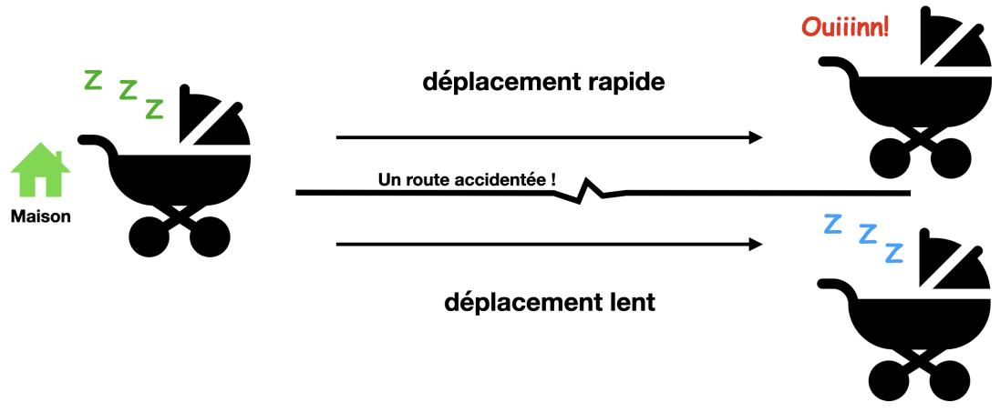  
Figure 2: Une image schématique pour expliquer le théorème adiabatique (inspirée par Pauline Besserve). Elle ne vise pas à rendre compte de l’ensemble de la physique sous-jacente. Le bébé endormi représente l’état de plus basse énergie et le bébé qui pleure représente un état excité du système quantique.

Le théorème adiabatique soulève quelques questions intéressantes. Tout d’abord, qu’entend-on par “lent” ? La vitesse de l’évolution est liée à l’inverse du gap Hamiltonien. Le gap est la différence entre les niveaux d’énergie à chaque instant de l’évolution. Pour répondre à cette question sur la validité du théorème adiabatique, von Neumann et Wigner ont développé un résultat appelé “règle de non-croisement”. Cette règle stipule que, sous certaines conditions relatives à l’Hamiltonien, deux niveaux d’énergie ne se croisent jamais réellement lorsque l’Hamiltonien est modifié, mais qu’ils peuvent s’approcher de très près. Le phénomène qui se produit lorsqu’ils se rapprochent suffisamment pour que l’on puisse penser qu’ils se croisent est appelé croisement-évité, que nous définirons formellement au chapitre 2, Sec. 2.4. Le gap atteint donc un minimum, que nous notons $\Delta _ { \mathrm { m i n } }$ . Par conséquent, dans le régime de temps infini, le système quantique est assuré de rester au même niveau que celui à partir duquel il a commencé son évolution. Dans notre illustration, cela signifie que le théorème garantit que le bébé restera endormi si la poussette se déplace infiniment lentement. La question est la suivante : que se passe-t-il si l’évolution est plus rapide que la condition adiabatique ? En 1932, Landau et Zener ont calculé indépendamment la probabilité que le système quantique passe d’un niveau d’énergie à l’autre. Ces transitions sont appelées transitions non adiabatiques. En clair, plus le gap est petit, plus la probabilité de saut est grande [Landau 1932, Zener 1932]. La meilleure analogie avec le point de gap minimum dans notre exemple serait la position de la poussette où le bébé pourrait facilement se réveiller, par exemple lorsque la route est accidentée. Les parties bosselées de la route doivent être traversées encore plus lentement que les parties plates. Il arrive que ces passages cahoteux apparaissent plusieurs fois au cours de l’évolution. Dans le travail de [Wilkinson 1987, Wilkinson 1989], l’auteur a entrepris d’abord une description des croisement-évités, puis une étude statistique de leur nombre.

La première version du théorème adiabatique impose de fortes contraintes sur l’Hamiltonien, ce qui limite ses applications potentielles. Une version mathématique plus générale et plus rigoureuse a été dérivée par [Kato 1950] au Japon. En particulier, il s’est débarrassé de deux hypothèses sur le spectre de l’Hamiltonien. Dans sa version, ce dernier peut être continu et présenter des dégénérescences. À la même époque, dans [Anderson 1958], l’auteur démontre un phénomène physique se produisant dans un système quantique évoluant selon l’équation de Schrödinger. Il affirme que, dans certaines conditions, aucune diffusion n’a lieu dans un réseau quantique alors qu’elle était attendue. Plus simplement, il suggère qu’un état quantique peut se localiser dans une région spécifique avant que l’évolution ne se termine. Cette localisation peut se produire dans un “mauvais” niveau d’énergie - par exemple, dans cette thèse, la principale conséquence de ce phénomène est qu’à un moment intermédiaire de l’évolution, l’état d’énergie le plus bas est proche de l’état excité du système à la fin de l’évolution (Fig. 3).

Pour comprendre les différents événements que peut subir un système quantique, il faut également mentionner qu’il peut expérimenter des transitions de phase. Ces transitions peuvent être du premier ou du second ordre, selon la continuité d’évolution de l’état au moment de la transition. Nous renvoyons le lecteur à [Sachdev 1999] pour plus de détails. Un autre résultat théorique important pour comprendre l’évolution quantique est la limite de Lieb-Robinson. De manière informelle, elle indique que l’information voyage à une vitesse finie dans un système quantique [Lieb & Robinson 1972]. Cela signifie, entre autres, qu’il existe une évolution de durée total $T$ telle qu’il n’y a pas de corrélation entre deux régions suffisamment éloignés au sein du système quantique. La distance “suffisante” est définie par la vitesse de Lieb-Robinson $v _ { L R }$ et est égale à $v _ { L R } T$ . Cette vitesse dépend notamment de la structure du système et de son matériel physique.

Au début des années 70, peu après le début de la recherche en informatique théorique avec la thèse de Church-Turing, Cook et Levin ont indépendamment prouvé le premier problème combinatoire NP-difficile [Cook 1971, Levin 1973]. Pour l’instant, il suffit de considérer les problèmes NP-difficiles comme des problèmes difficiles qui ne peuvent pas être résolus efficacement. Ce problème est appelé 3SAT pour Satisfiabilité Booléenne sur des clauses de taille trois. Ce problème marque le début de la théorie de la complexité. Ce domaine traite de l’analyse des ressources nécessaires pour calculer certaines fonctions données. En général, il s’agit de ressources temporelles. À la même époque, Karp a prouvé par réduction un zoo de 21 problèmes combinatoires qui sont NP-difficiles [Karp 1972]. Par exemple, le problème de le coupe maximale (MaxCut) est l’un d’entre eux. Illustrons ce problème (Fig. 4).

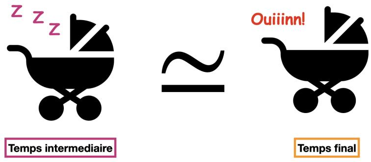  
Figure 3: Le phénomène de localisation d’Anderson avec notre illustration. L’état d’énergie le plus bas à un moment intermédiaire est le bébé endormi au milieu du voyage. Ce dernier état est proche au bébé qui pleure à la fin du voyage. Ici le terme “proche” est légèrement tiré par les cheveux et montre une limite de notre anaologie.

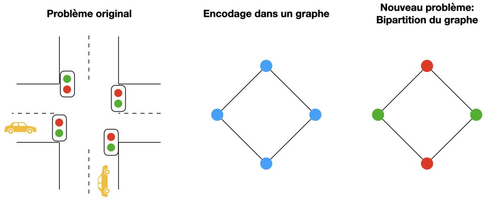  
Figure 4: Illustration du problème de la coupe maximale. À gauche, le problème original. Au milieu, son encodage dans une instance de graphe. À droite, une solution possible au problème de la coupe maximale sur le graphe donné. Cette dernière solution est également une solution au problème original.

Imaginons une intersection avec des feux de circulation. L’objectif est d’initialiser les couleurs des feux de circulation afin d’empêcher le plus grand nombre possible d’événements indésirables de se produire. Supposons que nous n’ayons que deux couleurs, le rouge et le vert. Une façon de résoudre ce problème est de l’encoder dans un graphe ; chaque feu de circulation est représenté par un sommet dans le graphe, et nous connectons deux sommets si les feux de circulation correspondants devraient, idéalement, être de couleurs différentes. Le nouvel objectif du problème original est de trouver une bipartition rouge/verte dans le graphe généré. Il s’agit de la coupe maximale, car si nous affichons les sommets verts à droite et les sommets rouges à gauche, toutes les arêtes traversant la bipartition peuvent être coupées. Nous comprenons qu’avec un carrefour plus complexe comme celui de la Fig. 5, trouver la meilleure bicoloration est beaucoup moins simple. Le nombre de combinaisons de couleurs explose exponentiellement avec le nombre $n$ de feux de circulation sous la forme (nombre de couleurs)n.

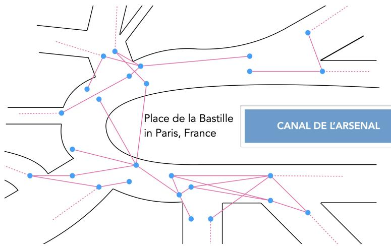  
Figure 5: Exemple d’un problème de feux de circulation sur une instance complexe. Lorsque le nombre de feux de circulation augmente, le nombre de combinaisons explose. La meilleure solution pourrait être frustré, ce qui signifie que même deux feux de circulation liés ont la même couleur.

Dans cette thèse, nous étudions principalement ce type de problèmes, appelés problèmes combinatoires sur graphes NP-difficile. Nous renvoyons le lecteur à la revue suivante [Barahona et al. 1988] sur l’application des problèmes combinatoires. Par exemple, la solution de MaxCut permet de concevoir des circuits électriques et de résoudre le problème d’Ising en physique. La difficulté NP de MaxCut signifie que nous ne connaissons pas d’algorithme dont le temps d’exécution maximum varie de façon polynomiale avec la taille de l’entrée pour résoudre le problème sur un graphe d’entrée arbitraire. Cependant, nous pouvons toujours être intéressés par des solutions approximatives qui peuvent être atteintes efficacement, c’est-à-dire en temps polynomial. De tels algorithmes sont appelés algorithmes d’approximation, et nous évaluons leur performance en calculant leur ratio d’approximation. En bref, le taux d’approximation nous indique à quel point nous sommes proches de la solution optimale. Le meilleur algorithme d’approximation pour MaxCut sur un graphe général est celui de [Goemans & Williamson 1995], qui atteint un ratio d’approximation de 0,87856, c’est-à-dire que cet algorithme garantit que sa solution de sortie coupe plus de 87, 856% de toutes les arêtes possibles qui peuvent être coupées dans la solution optimale. Si nous limitons le graphe à des graphes 3- réguliers, c’est-à-dire que chaque sommet est lié à exactement 3 autres, les auteurs de [Halperin et al. 2002] ont prouvé que leur algorithme atteint une approximation de 0,93 en temps polynomial.

Pendant cette période, la première idée d’un ordinateur quantique a été lancée en 1982 par Feynman [Feynman 1982]. Il pensait que la meilleure façon de simuler la nature, qui est quantique, était d’utiliser du matériel quantique. L’idée a été formalisée par Deutsch, qui a présenté l’ordinateur quantique universel [Deutsch & Penrose 1985]. Il est fondamentalement similaire à un ordinateur “classique”, mais les lois physiques sous-jacentes qui régissent l’appareil sont des lois quantiques. À la fin des années 80, une équipe italienne a eu l’idée d’utiliser les fluctuations quantiques pour résoudre des problèmes combinatoires [de Falco et al. 1988, Apolloni et al. 1989]. Ils ont introduit l’algorithme du recuit quantique, une métaheuristique générale du même type que le recuit simulé pour minimiser une fonction de coût donnée. Il utilise l’effet tunnel quantique pour surmonter les barrières potentielles, alors que le recuit simulé nécessite une température élevée pour surmonter ces barrières (Fig. 6). Dans [Kadowaki & Nishimori 1998], les auteurs ont fourni la première comparaison rigoureuse du recuit simulé et du recuit quantique.

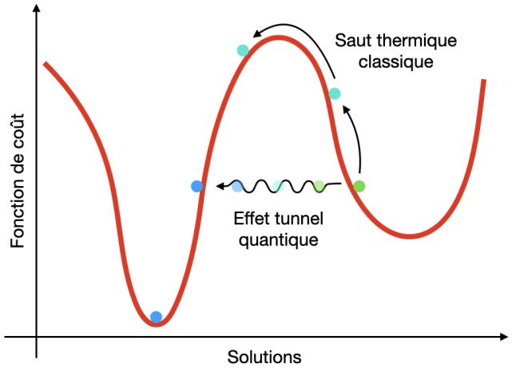  
Figure 6: Explication schématique de la physique qui aide l’état à franchir la barrière de potentiel.

Ce n’est que dans les années 1990 que les premiers algorithmes quantiques ont formellement démontré une “accélération quantique” par rapport aux ordinateurs classiques. Cela signifie que les ordinateurs quantiques peuvent résoudre des problèmes plus efficacement que les ordinateurs classiques [Deutsch & Jozsa 1992, Bernstein & Vazirani 1997]. Il s’agit d’algorithmes numériques, car la propriété discrète rend le cadre plus propice aux démonstrations. Parmi eux, les deux plus célèbres sont l’algorithme de [Shor 1994] pour la décomposition des nombres en facteurs premiers et l’algorithme de [Grover 1996] pour la recherche d’une aiguille dans une botte de foin. Ces travaux ont lancé une course sans précédent vers la réalisation de l’avantage quantique en pratique.

# Structure du manuscrit et contributions

Dans la suite de ce manuscrit, nous reprenons cette introduction en anglais en y ajoutant tout les travaux des années 2000 à aujourd’hui qui constituent l’état de l’art duquel la recherche présentée dans cette thèse s’est lancée.

La recherche présentée dans ce manuscrit se base principalement sur des articles publiés ou acceptés dans différentes revues scientifiques [Braida & Martiel 2021, Braida et al. 2022, Braida et al. 2024a, Braida et al. 2024b]. Nous avons essayé de les laisser tels qu’ils ont été publiés, nous avons modifié certaines notations pour qu’elles restent harmonieuses dans le manuscrit et nous avons ajouté certains travaux non publiés qui sont de nature plus exploratoire, mais qui pourraient fournir des idées et des possibilités futures. Dans le chapitre 2, nous introduisons formellement les notations du calcul quantique analogique et la définition des Hamiltoniens pour les problèmes combinatoires sur graphes. Nous détaillons différents algorithmes pour le problème MaxCut. Ensuite, nous définissons clairement la notion de croisement évités et la borne de Lieb-Robinson.

Sauf indication contraire, tout le contenu des parties I et II relève du travail original du doctorant avec ses superviseurs.

La partie I se concentre sur la compréhension du phénomène de croisement évité dans le calcul quantique adiabatique (CQA). Dans le chapitre 3, nous commençons par la caractérisation récente de [Choi 2020] et prouvons comment sa paramétrisation est liée au gap minimum. Ensuite, en appliquant sa définition à un modèle jouet pour le problème de la $k -$ clique de poids maximum, nous mettons en évidence comment la définition peut manquer la caractérisation d’un croisement évité (Sec. 3.1). Ces observations nous conduisent à proposer une nouvelle définition, plus générale que la précédente (voir Fig. 7 et Sec. 3.2). Elle utilise un développement de Taylor pour justifier notre nouvelle définition et fournit en même temps la démonstration rigoureuse de la description initiale d’un croisement évité (Sec. 2.4.2). Nous validons notre définition par des analyses numériques. Finalement, nous montrons quelques cas de limitation que notre définition ne capturera pas non plus (Sec. 3.3). Dans le chapitre 4, nous prouvons un théorème qui donne une condition d’apparition des croisement-évités sous la validité de l’expansion de perturbation au premier ordre (Sec. 4.1). Nous appliquons ensuite ce théorème au problème MaxCut pour prouver que CQA résout efficacement MaxCut sur des graphes bipartis réguliers et qu’une irrégularité suffisante conduit à un gap se réduisant exponentiellement (Sec. 4.2).

Bien que l’implication générale de cette observation serait de conclure à l’échec de CQA dans ce cas, en utilisant notre nouvelle définition de croisement-évités, une étude numérique suggère que ce n’est probablement pas le cas. Pour de petites instances, la probabilité de mesurer l’état optimal semble atteindre efficacement une valeur constante. Cette observation frappante nous amène à poser la question de la possibilité de prouver un théorème adiabatique relaxé de sa dépendance dans le gap. La dernière section du chapitre (Sec. 4.3) suggère d’autres études intéressantes du problème MaxCut en utilisant la théorie perturbative. Il est tout à fait remarquable que nous puissions analyser différents coefficients du processus quantique à l’aide de la terminologie de théorie des graphes. Cela permettrait-il de prouver des résultats intéressants ?

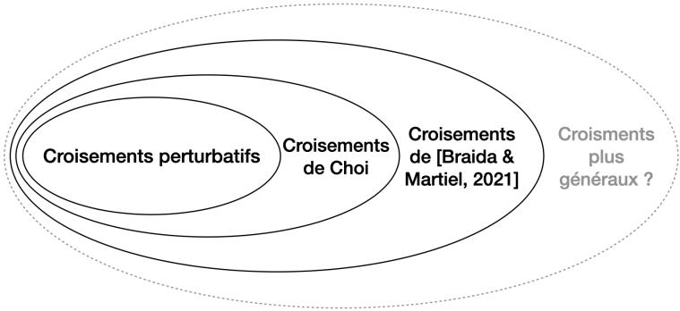  
Figure 7: Inclusion des définitions des croisement-évités.

La partie II se concentre sur les potentialités du recuit quantique en tant qu’algorithme d’approximation. Plus précisément, nous nous attaquons à l’étude du recuit quantique courts en temps et constant pour MaxCut sur les graphes cubiques (i.e. 3-régulier). Notre première approche (Chapitre 5) est une adaptation directe de la démonstration du rapport d’approximation de QAOA [Farhi et al. 2014]. Nous décrivons d’abord les différentes étapes de la preuve dans le régime du calcul analogique (Sec. 5.1). Ensuite, le travail réside dans le calcul d’une borne de Lieb-Robinson (LR) suffisamment petite à distance 1 pour dériver une borne inférieure non triviale (au-dessus du choix aléatoire) sur le ratio d’approximation lorsque le recuit quantique est étudié comme un algorithme 1-local (0.5933 dans Fig. 1.11 et Sec. 5.2). Une étude de l’optimalité de la borne de type LR utilisée nous conduit à apporter des arguments numériques convaincants selon lesquels le ratio devrait être supérieur à celui de QAOA (0.6925). Nous suggérons un algorithme non implé- mentable, dans le sens où il est trop coûteux à exécuter, dont le ratio est probablement proche de 0.6963 (Sec. 5.3). Dans le dernier projet détaillé dans le chapitre 6, nous développons une borne de LR super serrée atteignant des valeurs numériques étonnantes nous permettant de réduire le temps nécessaire pour l’algorithme précé- dent. Avec l’introduction d’une version paramétrée du recuit quantique, nous avons pu prouver qu’il atteint avec une analyse 1-locale un ratio d’approximation supérieur à 0.7020, surpassant tout algorithme 1-local connu pour ce problème (voir Fig. 8 et

Sec. 6.2). Nous discutons de l’optimalité de cette nouvelle borne et prouvons que la méthode employée atteint presque son optimalité (Sec. 6.3). Dans un dernier chapitre (Chapitre 7), nous développons quelques idées sur la localité dans le recuit quantique, et ce qui est nécessaire pour prouver une borne de LR dépendante de l’état. Finalement, nous donnons quelques arguments sur le ratio d’approximation effectif en argumentant sur le pire graphe et en tirant astucieusement parti des symétries des graphes, grâce auxquelles nous sommes capables de simuler rapidement des graphes de grande taille.

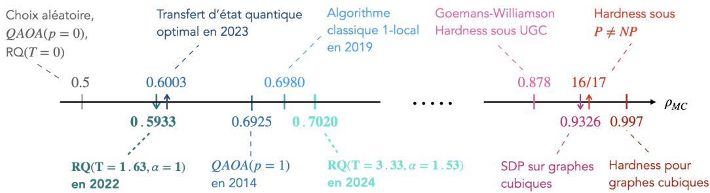  
Figure 8: Ratio d’approximation atteint par différent algorithmes que nous détaillons par la suite. En gras sont indiquées nos contributions.

Le dernier chapitre Conclusion et perspectives résume les principaux résultats et suggère quelques pistes de recherche.

# Introduction

# Contents

1.1 History of computing . . 13   
1.2 From quantum mechanics to quantum computation . . . . . 15   
1.3 Theoretical foundation of analog quantum computing . . . 20   
1.4 Contribution of this thesis . . . 25

# 1.1 History of computing

Calculus means pebble in Latin [Larousse 2023]. Pebbles were the first counting unit used by shepherds to count sheep entering and leaving the sheepfold. On the way back, the number of pebbles remaining indicated the number of sheep missing. This system was also used during conflicts to count the number of soldiers who failed to return from battle. This counting system was soon surpassed by the need to carry out more complex operations, such as trade. Around 2700-2300 BC, the first abacustype mechanism was invented. It was designed as an extension of the fingers of the hand to enable counting to more than 10. At the time, counting was done in base 5. The abacus (Fig. 1.1 (a)) is considered to be the first version of a calculator. These calculations were still limited to arithmetic operations. Several centuries later, in 1050-771 BC, in ancient China, travelers used a south-pointing chariot to indicate south during a journey. The mechanism was based on a differential gear set up at the start of the journey. This was the first reported analog calculation. The first mechanism considered to be a computer was the Antikythera mechanism (Fig. 1.1 (b)) in ancient Greece, dating from 100 BC [Efstathiou & Efstathiou 2018]. It was designed to compute astronomical positions using differential gears. Several gears were involved: one had 365 teeth for the days of the year, another controlled the number of lunations, and so on. To use it, you had to indicate the day’s date, and by turning the gears, it gave the date and the positions of the moon and sun for the next eclipse. This computation uses the mechanical rotation of the gears as the computational process, with the input and output data encoded in the position of the gears.

This type of computer, which intelligently uses a continuous variation of a physical device, i.e. an analog signal, is called an analog computer. A basic example of analog computation is the multiplication operation. Knowing Ohm’s law, $U = R I$ where voltage $U$ is equal to resistance $R$ multiplied by current $I$ , we can compute the multiplication between two inputs that we encode as $R$ and $I$ . By measuring $U$ , we obtain the multiplication of our encoded inputs. It was not until around 1150 that the first “programmable” analog computer appeared, called the Elephant Clock invented by the Arabs [Al-Jazari 1974]. Here, “programmable” means that the mechanism could be adjusted before it was started. It operates on the speed of continuous hydraulic quantities to give the percentage of daylight time elapsed. Although digital computers began to appear at the end of the $1 8 ^ { t h }$ century, at that time analog computers were still more powerful, as witnessed by the tide-predicting machine capable of performing the Fourier transform [Wikipedia 2024].

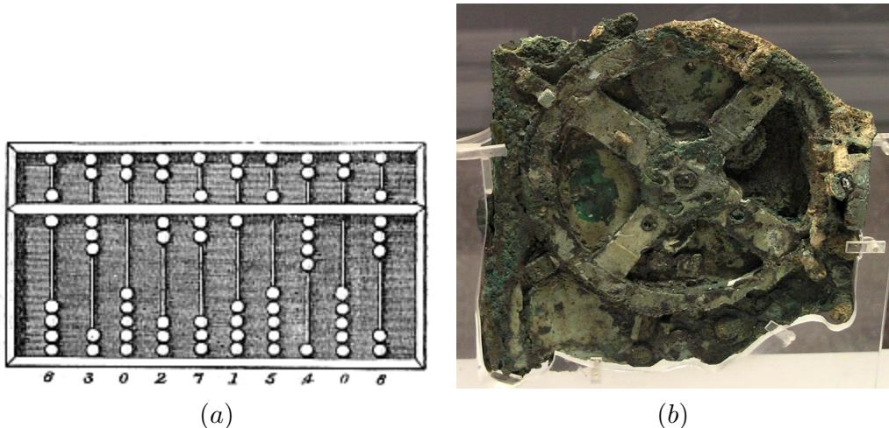  
Figure 1.1: (a) Picture of the abacus in [Baynes 1875] and (b) fragment of the Antikythera mechanism from [Wikipedia 2005].

We note that all the computer-like systems mentioned above are designed to perform a specific task, such as counting, indicating direction or telling the time. We call a general-purpose or a universal computer a computer capable of solving any computation in the modern sense of the term, i.e. a Turing-complete computer. We understand that to build a universal computer, we need to have some kind of set of basic operations that can be used as building blocks for a more complex calculation. These operations are necessarily based on analog computation and must also interact with each other. The most practical known physical quantity for performing a computation is the electrical signal.

Until the 60s, one of the last uses of analog calculation was to simulate complex mechanical systems, such as the suspension system of a car with two masses coupled to springs and a damper [Ulmann 2008]. Around 1950-1960, digital computers outperformed analog computers [Wikipedia 2024]. The transistor used as the basic building block became powerful enough to perform any complex calculation more efficiently than analog computers. In a digital computer, information is no longer represented by a continuous physical quantity, but by a discrete value. Of course, hardware such as transistors still use continuous physical variables such as electrical voltage. A further abstraction makes the link with digitized information: for example, a voltage less than $1 / 3$ by a certain unit represents the binary value of ‘ $0 ^ { \circ }$ , and a voltage greater than this value represents ‘1’. This abstraction and the universality of digital computers make them more versatile and precise than analog computers for performing elaborate tasks.

In the $2 1 ^ { s t }$ century, there are very few cases of analog calculation left, the bestknown being the mechanical watch and the flight computer. With the rise of artificial intelligence, new prototypes of analog computers are being developed in laboratories for neuromorphic computing [James et al. 2017]. The advantage of analog computing is its energy efficiency and speed. Artificial intelligence algorithms are not designed to have exact values, which makes analog computers promising candidates for speeding up, with less energy, the execution of these algorithms.

In any case, to compute something, we need to rely on physical hardware and information encoding. On the one hand, the encoding depends on the choice between digital or analog computation. On the other hand, the physical device is governed by the laws of the underlying physics at play : for mechanical devices, it follows the fundamental laws of dynamics, for electrical devices, it follows the fundamental laws of electromagnetism. Depending on the laws involved, the limitations are not the same. Until today, the classical laws of electromagnetism have dominated its use for computation. In the mid-1920s, the laws of quantum mechanics were discovered. It wasn’t until the 1980s that the idea of a quantum computer was born [Benioff 1980, Manin 1980, Feynman 1982]. As with classical computers, there are analog and digital quantum versions. Both are based on the master equation of quantum physics. To access quantum computing, we need to develop a quantum physical device that can be “easily” manipulated. In the following section, we will trace the history from the discovery of quantum mechanics to its use as a computational framework.

# 1.2 From quantum mechanics to quantum computation

The discovery of the fundamental laws of quantum mechanics is attributed to Erwin Schrödinger in 1926 [Schrödinger 1926]. In his work, Schrödinger relied heavily on the thesis of Louis de Broglie, who was the first to postulate that radiation could be both wave and corpuscular [de Broglie 1924]. Neither de Broglie nor Schrödinger at first seemed to really believe in this particular hypothesis about matter. This counter-intuitive assumption allowed them to derive interesting results for the understanding of the atom.

In classical thermodynamics, we know that during an adiabatic process, certain physical properties such as energy or entropy are conserved [Planck 1903]. Classical evolution is irreversible, so the process is said to be adiabatic if the evolution is extremely fast. Quantum evolution, on the other hand, is reversible. We call a quantum adiabatic process an evolution in which external conditions vary sufficiently slowly. In 1928, Born and Fock proved the first mathematical version of the adiabatic theorem in quantum physics to better understand the stability of electronic orbitals in atoms [Born & Fock 1928]. They proved that the energy level of a quantum system is conserved under a slow variation of the electromagnetic field. Under fast variation, a state initialized in the lowest energy level, called the ground-state, can move to a different energy level, called the excited state. Let us illustrate (Fig. 1.2) this important result as it is the theoretical foundation of adiabatic quantum computing (see Sec. 1.3). Imagine the following: Our goal is to transport a baby from its home to a (for now undefined) location. Initially the baby is asleep, and is transported in a stroller. We know that if the person who is pushing the stroller goes slowly, there is a high probability that the baby will stay asleep. On the other hand, if the person pushing the stroller goes too fast, there is a high probability that the baby will wake up, start crying and reach the excited state. The external parameter that changes is the speed of the stroller, and its external environment is defined by its position in space. For a quantum system, the external environment is defined by an object called the Hamiltonian $H$ of the system. For an evolution to be adiabatic, the rate of the change of $H$ is set to be slow enough.

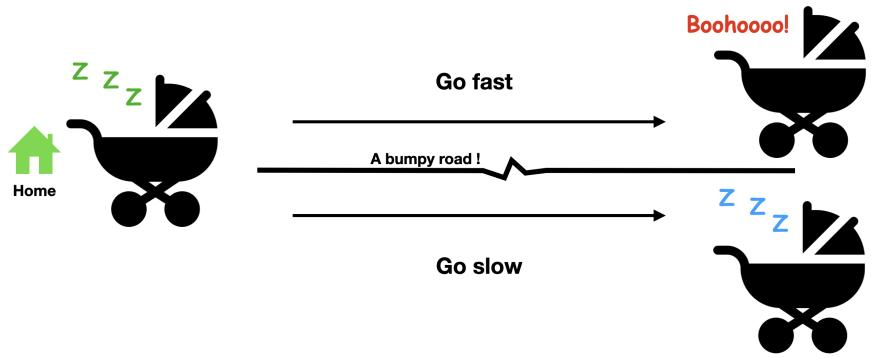  
Figure 1.2: A schematic picture to explain the adiabatic theorem (inspired by Pauline Besserve). It does not aim to capture the whole underlying physics. The asleep baby represents the state of lowest energy and the crying baby represents an excited state of the quantum system.

The adiabatic theorem raises some interesting questions. First, what does “slow” mean here? The rate is related to the inverse of the Hamiltonian gap. The gap is the difference in energy levels throughout the evolution. To answer this question about the validity of the adiabatic theorem, von Neumann and Wigner derived a result called the “no-crossing rule”. This rule states that, under certain conditions on the Hamiltonian, two energy levels never actually cross when the Hamiltonian is modified, but can come very close. The phenomenon when they come so close enough that we might think they are crossing is called Avoided level-crossing (AC), which we will formally define in Chapter 2, Sec. 2.4. The gap thus reaches a minimum, which we note as $\Delta _ { \mathrm { m i n } }$ . Consequently, in the infinite time regime, the quantum system is guaranteed to remain at the same level from which it started its evolution. In our illustration, this means that the theorem guarantees that the baby will stay asleep if the stroller moves infinitely slowly. The next question is: what happens if evolution proceeds faster than the adiabatic condition? In 1932, Landau and Zener independently derived the probability that the quantum system will jump from one energy level to the other. These transitions are called non-adiabatic transitions. In plain English, the smaller the gap, the greater the probability of jumping [Landau 1932, Zener 1932]. The best analogy to the small gap point in our example would be the position of the stroller where the baby could easily wake up, e.g. when the road is bumpy. The bumpy parts of the road should be crossed even more slowly than the flat ones. It happens that these bumpy passages can appear several times during the evolution. In the work of [Wilkinson 1987, Wilkinson 1989], the author undertook first a description of AC, then a statistical study of their number.

The first version of the adiabatic theorem has strong constraints on the Hamiltonian, limiting its potential applications. A more general and rigorous mathematical version was derived by [Kato 1950] in Japan. In particular, he got rid of two assumptions about the spectrum of the Hamiltonian. In his version, the latter can be continuous and show degeneracies. Around the same time, in [Anderson 1958], the author demonstrated a physical phenomenon occurring in a quantum system evolving according to Schrödinger’s equation. He asserted that, under certain conditions, no diffusion takes place in a lattice when it was expected. In simpler terms, it suggests that a quantum state can become localized within a specific region before the evolution concludes. This localization may occur in a “wrong” energy level – for instance, in this thesis, the main consequence of this phenomenon is that at some intermediate time of the evolution, the lowest energy state is close to the excited state at final time (Fig. 1.3).

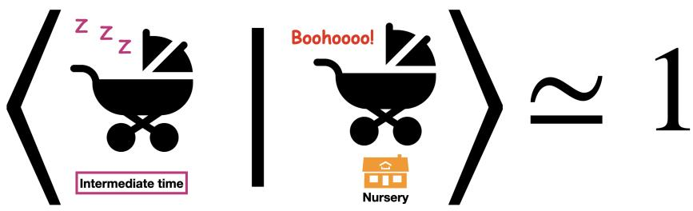  
Figure 1.3: Anderson’s localization phenomenon with our illustration. We represent the state inside the bra-ket notation [Nielsen & Chuang 2002]. The lowest energy state at an intermediate moment is the sleeping baby in the middle of the journey. This last state is akin to the crying baby at the end of the journey. It is a bit far-fetched and shows a limit to the comparison.

To understand the different events a quantum system can undergo, we should also mention that it can experience phase transitions. These transitions can be firstor second-order, depending on the continuity of the evolved state at the time of the transition. We refer the reader to [Sachdev 1999] for more details. Another important theoretical result for understanding quantum evolution is the Lieb-Robinson bound. Informally speaking, it states that information travels at a finite speed in a quantum system [Lieb $\&$ Robinson 1972]. This means, among other things, that there is an evolution in total time $T$ such that there is no correlation between two sufficiently distant sites of the quantum system. The “sufficient” distance is defined by the Lieb-Robinson velocity $v _ { L R }$ and is equal to $v _ { L R } T$ .

In the early 70s, shortly after research into theoretical computer science began with the Church-Turing thesis, Cook and Levin independently proved the first combinatorial NP-hard problem [Cook 1971, Levin 1973]. For now, it is enough to think of NP-hard problems as difficult problems that cannot be solved efficiently. This problem is called 3SAT for Boolean Satisfiability over clauses of size three. This problem marks the beginning of complexity theory. This field deals with the analysis of the resources required to compute certain given functions. In general, these are temporal resources. At the same time, Karp proved by reduction a zoo of 21 combinatorial problems that are NP-hard [Karp 1972]. For example, the Maximum Cut (MaxCut) problem is one of them. Let us illustrate this problem (Fig. 1.4).

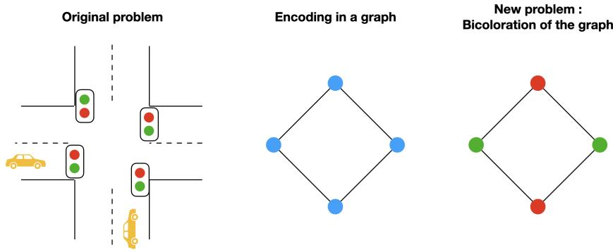  
Figure 1.4: Illustration of the MaxCut problem. On the left the original problem. On the middle, its encoding in a graph instance. On the right, a possible solution to the MaxCut problem on the given graph. The latter solution is also solution to the original problem.

Let us imagine an intersection with traffic lights. The aim is to initialize the colors of the traffic lights to prevent as many undesirable events as possible from occurring. Let us assume we only have two colors, red and green. One way of solving this problem is to encode it in a graph; each traffic light is represented by a node in the graph, and we connect two nodes if the corresponding traffic lights should, ideally, be of different colors. The new goal in addressing the original problem is to find a red/green bicoloration of the generated graph. This is the maximum cut, because if we display green nodes on the right and red nodes on the left, all edges crossing the bipartition can be cut. We understand that with a more complex intersection like the one shown in Fig. 1.5, finding the best bicoloration is much less straightforward. The number of color combinations explodes exponentially with the number $n$ of traffic lights as (number of colors) $_ n$ .

In this thesis, we mainly study this type of problem, called NP-hard combinatorial graph problems. We refer the reader to the following review [Barahona et al. 1988] on the application of combinatorial problems. For example, MaxCut’s solution helps design electrical circuits and solves the Ising problem in physics. The NP-hardness of MaxCut means that we do not know of any algorithm that scales polynomially with the input size to solve the problem on an arbitrary input graph. However, we may still be interested in approximate solutions that can be reached efficiently, i.e. in polynomial time. Such algorithms are called approximation algorithms, and we evaluate their performance by calculating their approximation ratio. In a nutshell, the approximation ratio tells us how close we are to the optimal solution. The best approximation algorithm for MaxCut on a general graph is that of [Goemans & Williamson 1995], which achieves an approximation ratio of 0.87856, i.e. this algorithm guarantees that its output solution cuts more than 87, 856% of all possible edges that can be cut in the optimal solution. If we restrict the graph to 3-regulars, i.e. each node is linked to exactly 3 others, the authors of [Halperin et al. 2002] proved that their algorithm achieves an approximation of 0.93 in polynomial time.

  
Figure 1.5: Example of a traffic lights problem on a complex instance. As the number of traffic lights increases, the number of combination explodes. The best solution might be frustrated, meaning that even two linked traffic lights have the same colors.

Meanwhile, the first idea for a quantum computer was launched independently by Benioff, Manin and Feynman [Benioff 1980, Manin 1980, Feynman 1982]. Feynman thought that the best way to simulate nature, which is quantum, was to use quantum hardware. The idea was formalized by Deutsch, who presented the universal quantum computer [Deutsch & Penrose 1985]. It is fundamentally similar to a “classical” computer, but the underlying physical laws governing the device are quantum laws. In the late ’80s, an Italian team came up with the idea of using quantum fluctuations to solve combinatorial problems [de Falco et al. 1988, Apolloni et al. 1989]. They introduced the Quantum Annealing (QA) algorithm, a general metaheuristic of the same type as simulated annealing to minimize a given cost function. It uses quantum tunneling to overcome potential barriers, whereas simulated annealing requires a high temperature to overcome these barriers (Fig. 1.6). In [Kadowaki & Nishimori 1998], the authors provided the first rigorous comparison of simulated annealing and quantum annealing.

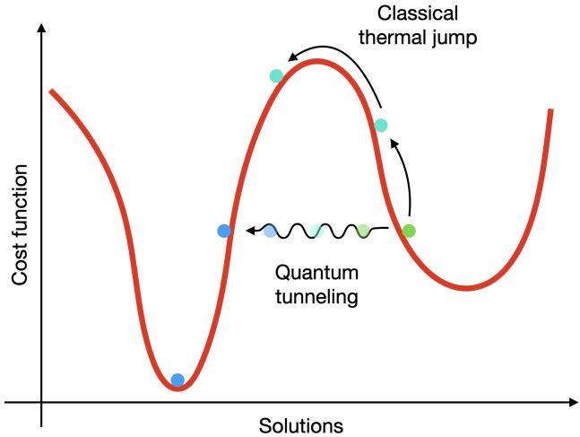  
Figure 1.6: Schematic explanation of the physics that helps the state to get over potential barrier.

It was not until the 1990s that the first quantum algorithms formally demonstrated “quantum speed-up” compared with classical computers. This means that quantum computers can solve problems more efficiently than classical computers [Deutsch & Jozsa 1992, Bernstein & Vazirani 1997]. These are numerical algorithms, as the discrete property makes the setting more conducive to demonstrations. Among them, the two most famous are [Shor 1994]’s algorithm for factoring prime numbers and [Grover 1996]’s algorithm for finding a needle in a haystack. These works launched an unprecedented race towards the realization of quantum advantage in practice.

# 1.3 Theoretical foundation of analog quantum computing

In the digital framework, research is already well advanced, with several concrete proofs of quantum acceleration. The first hardware was beginning to emerge. On the analog side, the D-Wave Inc. launched its first hardware capable of quantum annealing. However, theoretical research into the model was not as advanced as in digital quantum computing. The year 2000 marked the beginning of the formalization of Adiabatic Quantum Computation (AQC) coined by the authors of [Farhi et al. 2001]. They formalized the quantum adiabatic computing framework with the guarantee of finding the desired state on the basis of the adiabatic theorem. Basically, in AQC, the initial state is a ground-state of some easy-to-capture Hamiltonian $H _ { 0 }$ and the Hamiltonian is continuously modified so that the final Hamiltonian encodes some combinatorial problem. Indeed, as we mentioned earlier, the Maximum Cut problem, for example, is equivalent to solving an Ising problem which is described by the ground-state of a certain Hamiltonian $H _ { 1 }$ . Consequently, finding the ground-state of $H _ { 1 }$ is equivalent to finding the solution to the MaxCut problem. Thanks to the adiabatic theorem, we know that if evolution is sufficiently slow, the system will remain in the same energy level. So, if it starts from the groundstate (lowest energy state) of a certain initial Hamiltonian $H _ { 0 }$ and we change the Hamiltonian slowly over time, at the end the state is the ground-state of $H _ { 1 }$ , i.e. the desired solution. To visualize the role of $H _ { 0 }$ and $H _ { 1 }$ , we understand that $H _ { 1 }$ depends on the problem and the input instance of the problem. It is as if we could choose between different final destinations to take the baby, the problem varies if we have to transport the baby to the nursery or to school. Conversely, the initial Hamiltonian depends on the problem and it should be easy to prepare the groundstate of such a Hamiltonian, just as it is easy to put the baby to sleep when he is at home.

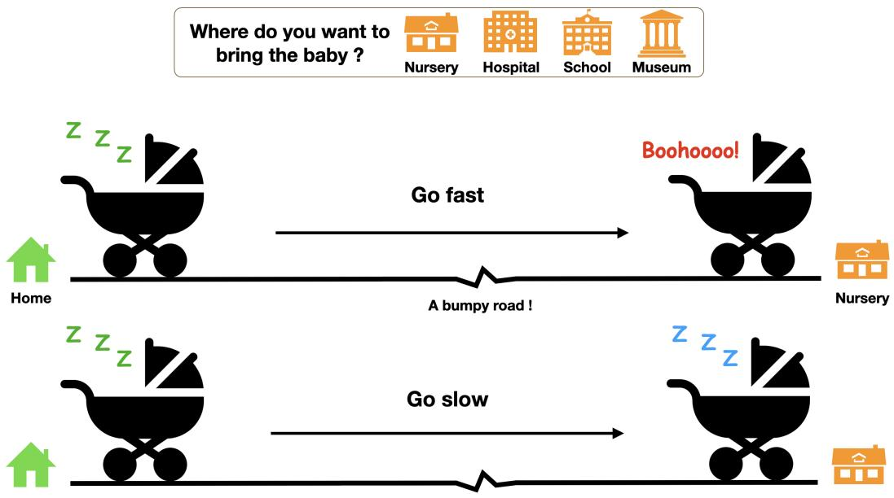  
Figure 1.7: A schematic picture to explain AQC (inspired by Pauline Besserve). The state is the baby in the stroller. Its ground-state is the asleep state. The excited state is the awake crying state. The starting point is some place where it is easy to prepare the baby in the asleep state, e.g. “Home”. The final destination depends on the problem we want to solve. Here, the goal is to bring the baby to the nursery in its asleep state. The straight road is bumpy and by going too fast we increase the probability to awake the baby and finish the trip in the excited state.

Let us imagine for a moment that $H _ { 0 }$ is a bathtub. If we compare $H _ { 1 }$ to the shape of the bottom of a bathtub, its ground-state is the deepest point of the bathtub. Evolution begins with a full bath and no knowledge of the shape of its bottom. At the start of evolution, we empty the bath and the state begins to “see” the shape of the bottom. It guesses where the deepest point is as the bath empties. Depending on $H _ { 1 }$ ’s landscape, a potential barrier may have separated the bath into several parts. In order to transport part of the state of a well with local minima to the well including global minima, i.e. the ground-state, physics relies on quantum tunneling. This tunneling phenomenon needs time to be effective. In fact, it requires the rate of change of the Hamiltonian to be sufficiently slow in relation to the inverse square of the gap $\Delta _ { \mathrm { m i n } }$ . This requirement is exactly that imposed by the adiabatic condition, which then ensures the effectiveness of the tunneling effect and guarantees that the final state is the target state. This new formalism makes the study of the gap the main tool for analyzing the complexity of AQC.

Like the MaxCut problem, it seems that many other combinatorial problems can be encoded in an $H _ { 1 }$ Hamiltonian. For example, in [Childs et al. 2002], the authors proposed a method for solving the $k -$ clique problem with AQC. For this problem, we look for a clique of a given size $k$ in a given input graph $G$ , a clique being a complete subgraph. In general, combinatorial problems defined on graphs constitute a subset of problems called Quadratic Unconstrained Binary Optimization (QUBO) and go back to [Hammer & Rudeanu 1968]. We say “quadratic” because at most two variables are linked, like two nodes in a graph, and “binary” because the solution is a binary string that associates a bit with each node. Hamiltonians defined on a graph are said to be 2-local because the Hamiltonian’s operators generally propagate on a node and/or an edge (2 nodes). In a $k -$ local Hamiltonian, at most $k$ sites are involved in an operator. In [Cubitt & Montanaro 2016], the authors proved that finding the ground-state of a $k -$ local Hamiltonian is NP-hard. One of the first theoretical results in this framework was proved by [Roland & Cerf 2002]. The authors mainly demonstrate that AQC has the same quantum acceleration for Grover’s problem (the needle in a haystack) by designing a specific Hamiltonian rate-of-change profile such that the gap has the best possible closure. In 2004, a major result of [Aharonov et al. 2004] proved the equivalence between AQC and the universal digital quantum computer, making AQC universal for computation. The fact that the digital quantum computer can simulate an analog quantum evolution was already proven, the main contribution focused on the other implication, namely that AQC¸ can efficiently simulate any polynomial-depth quantum circuit.

The difficulty in proving the complexity result in AQC comes from its continuous nature. When the Hamiltonian is time-dependent, there is no general result for the Schrödinger equation. Determining the scale of the gap is also a difficult challenge. Previously, we mentioned that two physical phenomena have been observed to generate small gaps. With AQC, the study of the gap attracts a lot of attention with the aim of proving the tendency to scale with the size of the input instance. [Knysh & Smelyanskiy 2006, Schützhold & Schaller 2006] tackled the gap by observing the quantum phase transition. A first-order phase transition is characterized by an exponentially decreasing gap, while second-order transitions are generally accompanied by polynomial closure (exceptions can be found in [Tsuda et al. 2013]). Perturbation theory provides an approach to exponentially small gaps. The authors of [Amin & Choi 2009] used it to highlight the appearance of a first-order transition in an evolution of AQC for a specific case. In [Altshuler et al. 2010], the authors show that Anderson localization can also produce an exponentially small gap for an NP-hard problem. From these results, it is usual to conclude that AQC is inefficient, since the adiabatic guarantee is valid for times greater than ∆−2min. However, this conclusion is quickly relaxed by [Choi 2011], where the author shows on a particular example that by changing parameters of the final Hamiltonian, we can transform a first-order transition into a second-order one. We refer the reader to [Laumann et al. 2015]’s study of the effect of the Hamiltonian parameter on the efficiency of AQC.

Short of mathematical tools to study the analog framework, [Farhi et al. 2014]’s work introduced a quantum circuit inspired by AQC to approximate a combinatorial problem. It is called Quantum Approximation Optimization Algorithm (QAOA) and basically, they performed a continuous evolution digitization and then a parameterization to optimize the approximation ratio achieved. This algorithm is also parameterized by its depth. The depth of a quantum circuit is equivalent to the running time of the evolution. In the infinite depth regime, the adiabatic theorem guarantees the optimal solution. The authors proved that with a single layer, QAOA achieves an approximation ratio of 0.6925 for MaxCut on cubic (3 regular) graphs. This type of algorithm, known as a variational algorithm, attracted a lot of attention in the Near Intermediate Scale Quantum (NISQ) era [Preskill 2018], as it performs well in short constant time. In the NISQ era, we assume that quantum computers are still noisy, so the result of an algorithm is not exactly as predicted by theory. Also, the computer has a fairly short lifetime due to fast decoherence. We refer the reader to [Albash & Lidar 2018] for the most recent review on AQC.

More recently, over the last five years, a large number of research papers have been published motivating the use of QAOA as a promising candidate for approximating combinatorial graph problems [Shaydulin & Alexeev 2019, Herrman et al. 2021, Farhi et al. 2022]. A series of variants of this algorithm have been proposed to improve its performance in practice [Blekos et al. 2023]. In [Lykov et al. 2023], the authors even suggest that QAOA could provide a quantum advantage over classical algorithms in the NISQ era. Several numerical studies using classical simulation and also quantum hardware such as [Pelofske et al. 2024] maintain that QA outperforms QAOA. Both metaheuristics are well suited to approximate combinatorial optimization problems. QA has even been extended to continuous function optimization and industrial applications [Yarkoni et al. 2022, Arai et al. 2023]. Another analog approach to quantum computation, called Continuous-Time Quantum Walk (CTQW), is also a promising computational framework, as similar analytical results have been proven for its efficiency [Apers et al. 2022]. In CTQW, the Hamiltonian is independent of time. In this thesis, we do not cover this topic and refer the reader to a recent review by [Kadian et al. 2021]. In the same vein, the authors of [Banks et al. 2024] proved that optimal state transfer techniques achieve an approximation ratio of 0.6003 for the MaxCut problem on cubic graphs. To improve the analog approaches of QA and AQC, one idea is to modify the Hamiltonian in the middle of the evolution by adding another Hamiltonian. This technique stems from the theory behind the idea of Shortcut-to-Adiabaticity [Guéry-Odelin et al. 2019]. With our example of the baby in the stroller, the idea would be to find a new route from the house to the nursery, avoiding the bumps (Fig. 1.8). From a numerical point of view, this approach looks promising for improving gap scaling [Seki & Nishimori 2012, Feinstein et al. 2022].

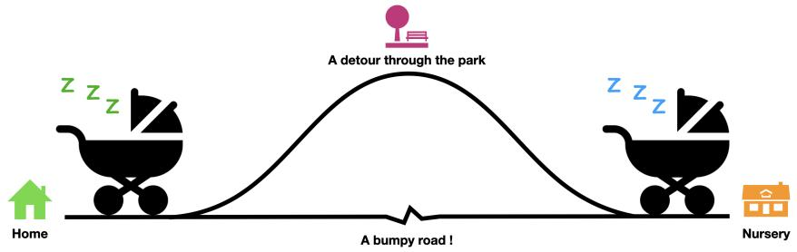  
Figure 1.8: A schematic picture to explain the idea of Shortcut-to-Adiabaticity. To avoid the bumps part on the journey, the stroller can take a detour by some designed place, e.g. a square, so that going fast on this path is safe in terms of excitation probability.

Some researchers are focusing more on the optimal design of the total Hamiltonian rate of change, i.e. the combination function that links $H _ { 0 }$ and $H _ { 1 }$ . This latter function is called the schedule. Recall that in QA, the computation does not rely on the adiabatic theorem and has no general guarantee on the output state. With this in mind, any schedule is worth to be tested. It has long been thought that the “bang-bang” form of schedule is optimal [Yang et al. 2017]. The “bang-bang” schedule refers to the specific combination in which only $H _ { 1 }$ is applied first, then only $H _ { 0 }$ . This is exactly what the QAOA circuit implements. However, in [Brady et al. 2021], the authors demonstrate that a “bang-anneal-bang” scheme might be more efficient. In other words, a continuous part in the middle of the combination certainly improves the performance of the annealing process. In general, the task of schedule optimization is an important field of research in analog quantum computing (Fig. 1.9).

In terms of understanding anti-crossings, it has been proposed by [Choi 2020] a new definition of this phenomenon by explicitly describing the behaviors of certain quantities of the quantum system. This provides a better understanding of the phenomenon and enables it to be characterized more formally. Finally, we mention some recent uses of the Lieb-Robinson bound in quantum computing. In [Haah et al. 2021], the authors proved a bound Lieb-Robinson (LR) for Hamiltonian simulation on a quantum circuit. Their algorithm decomposes the full Hamiltonian acting on all qubits into local gates. The LR bound keeps track of the error made by truncating the gates. The complexity, i.e. the number of gates, of the algorithm is almost optimal in the worst case. This approach has also been developed in [Tran et al. 2019]. A major improvement in the tightness of the LR bound was proposed in [Wang & Hazzard 2020]. In [Moosavian et al. 2022], the bound was also used to study the limited performance of quantum annealing in a short running time. They proved that the approximation ratio achieved by QA for the MaxCut problem is lower than the best classical algorithm (Goemans-Williamson) if the running time is less than logarithmic in the input size.

  
Figure 1.9: A schematic picture to explain the idea of schedule optimization. On flat part of the road the stroller can go fast. The knowledge of bumps positions can help to design optimal driving speed of the stroller. This idea was used by [Roland & Cerf 2002] to prove the Grover speed-up in AQC.

# 1.4 Contribution of this thesis

This thesis manuscript is based primarily on peer-reviewed articles [Braida & Martiel 2021, Braida et al. 2022, Braida et al. 2024a, Braida et al. 2024b] and published or accepted in different scientific journals. We tried to leave them as published, we changed some of the notation to keep it harmonious in the manuscript and we added some unpublished work that is more exploratory in nature, but which could provide insights and future possibilities. In Chapter 2, we formally introduce the notations of analog quantum computing and the definition of the Hamiltonians. We detail different algorithms for the MaxCut problem. Then, we clearly define the notion of anti-crossings and the Lieb-Robinson bound.

Unless otherwise stated, all content in Part I and II is original work from the PhD candidate with his supervisors.

Part I focuses on the understanding of the avoided crossing phenomenon in adiabatic quantum computing. In Chapter 3, we first start from the recent characterization of [Choi 2020] and prove how her parametrization is related to the minimum gap. Then applying her definition to a toy model for the maximum $k -$ clique problem, we highlight how the definition can miss an AC (Sec. 3.1). These observations lead us to suggest a new definition, more general than the former (see Fig. 1.10 and Sec. 3.2). It uses a Taylor expansion to justify our new definition and it provides in the same time the rigorous demonstration of the initial description of an AC (Sec. 2.4.2). We validate our definition with numerical evidence. Eventually, we show some limitation cases that our definition will not capture either (Sec. 3.3). In Chapter 4, we prove a theorem that gives a condition of occurrences of an AC under the validity of the perturbation expansion at first order (Sec. 4.1). We then apply this theorem to the MaxCut problem to prove that AQC efficiently solves MaxCut over regular bipartite graphs and that enough irregularity leads to an exponentially closing gap (Sec. 4.2). Although the general implication of this observation would be to conclude on the failure of AQC in this case, using our new AC definition, a numerical study hints that it is probably not the case. For small instances, the probability to measure the optimal state seems to reach a constant value efficiently. This striking observation leads us to open a question on the possibility to prove an adiabatic theorem relaxed from its dependence in the gap. The last section of the Chapter (Sec. 4.3) suggests other interesting studies of the MaxCut problem using perturbative theory. It is quite remarkable that we can speak about the different coefficients in graph terminology. Would it allow to prove interesting results?

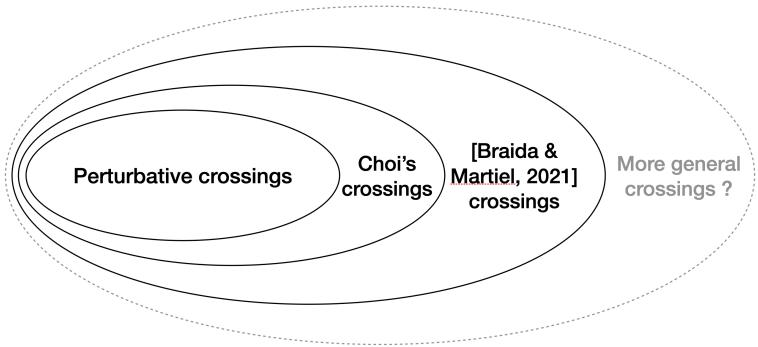  
Figure 1.10: Inclusion of the anti-crossings definitions.

Part II targets the potentiality of QA as an approximation algorithm. More precisely, we tackle the study of short constant time QA for MaxCut over cubic graphs. Our first approach (Chapter 5) is a direct adaptation of the QAOA approximation ratio demonstration. We first describe the different steps in the analog regime (Sec. 5.1). Then, the work resides in the computation of a small enough LR bound at distance 1 to derive a non-trivial (above random guess) lower bound on the approximation ratio when QA is studied as a 1-local algorithm (0.5933 in Fig. 1.11 and Sec. 5.2). A tightness study of the LR type bound used leads us to bring some numerically convincing argument that the ratio should be above the QAOA one (0.6925). We suggest a non-implementable algorithm, in the sense that it is too costly to be run, whose ratio is probably close to 0.6963 (Sec. 5.3). In the last project detailed in Chapter 6, we develop a super tight LR bound achieving astonishing numerical values allowing us to reduce the time needed for the hinted previous algorithm. Along with the introduction of a parametrized version of QA, we were able to prove that the approximation ratio reached by QA with a 1-local analysis is above 0.7020, outperforming any known 1-local algorithm for this problem (see Fig. 1.11 and Sec. 6.2). We discuss the tightness of this new bound and prove that the employed method almost reaches its optimality (Sec. 6.3). In a last chapter (Chapter 7), we develop some insight about the locality in QA, and what is needed to prove a state-dependent LR bound. Eventually, we give some argument on the effective approximation ratio by arguing on the worst graph and by cleverly taking advantage of the graph symmetry, thanks to which we are able to quickly simulate large graphs.

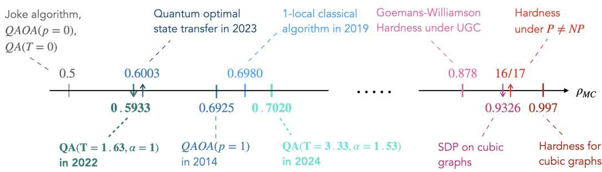  
Figure 1.11: Similar to Fig. 2.9 where we added our contributions in bold. They corresponds to a 1-local analysis of QA.

# Preliminaries

# Contents

# 2.1 Theoretical foundation of analog quantum computing . . . 30

2.1.1 Complexity theory 30   
2.1.2 Adiabatic quantum computing 32   
2.1.3 Quantum annealing 36   
2.1.4 Hardware and quantum annealer 37

# 2.2 Hamiltonians definition for graphs combinatorial problems 38

2.2.1 General optimization on graphs . . . 38   
2.2.2 Maximum Cut 40   
2.2.3 Maximum Independent Set . . 42   
2.2.4 Maximum weight $k$ -clique problem . . . 43

# 2.3 Approximation of MaxCut . . . 46

2.3.1 Quantum Approximate Optimization Algorithm (QAOA) . . 46   
2.3.2 Classical local algorithms 49   
2.3.3 Overview of few results 50

# 2.4 Avoided level crossings (AC) . . . . 52

2.4.1 Perturbation theory 52   
2.4.2 Initial description of an Anti-crossing 54   
2.4.3 Perturbative crossings 55   
2.4.4 Choi’s crossing definition 58

# 2.5 Lieb-Robinson bound 60

2.5.1 Observation and intuition 60   
2.5.2 Mathematical derivation 62   
2.5.3 Some known applications 64

In this chapter, we will develop the mathematical formalism that will be useful for us in pursuing the research that is the subject of this thesis. As far as possible, we have tried to use common symbols for well-known physical quantities, or if we have reused some of the work of other authors, but to keep a harmonious notation in the manuscript, we may adapt some of them.

# 2.1 Theoretical foundation of analog quantum computing

# 2.1.1 Complexity theory

Before diving into the quantum formalism, it is essential to establish some fundamental definitions regarding complexity classes for decision and optimization problems. The complexity of an algorithm denotes the resources required for its execution. When unspecified, complexity typically refers to the time needed to run the algorithm, expressed as a function of the input size $n$ , and called the running time $T$ . The algorithm can be of different nature, namely, classical or quantum. The distinction is based on the hardware used to run the algorithm. In the classical case, we distinguish between deterministic algorithms, i.e. same input result in the same output, and probabilistic algorithms, i.e. same input potentially result in different outputs. The output of a quantum algorithm is defined by the probability distribution generated by the final state of the algorithm. Usually, when unspecified, algorithm refers to deterministic algorithm. In the thesis, we simply use algorithm to mention quantum algorithm when it is clear from the context.

Complexity classes were first defined for decision problems and then adapted for optimization problems. A decision problem is a yes-no problem, i.e. if $g$ is an instance of a decision problem, the goal is to answer the question “is there a solution $x$ to $g ^ { , }$ ? For example, MaxCut above $k$ (“is there a bipartition that cuts at least $k$ edges of the input graph?”) or $k$ -clique (“does the input graph have a complete subgraph of size $k$ ?”) are decision problems. The definition automatically splits the inputs into two subsets, “yes”-instances and “no”-instances, for which the above question is answered by “yes” and “no” respectively. In this thesis, we will restrict to problems whose solutions $x$ can be checked efficiently, i.e. there exists a deterministic algorithm, called the verifier, that takes $g$ and $x$ as an input and verifies if $x$ is a solution for input $g$ . The verifier runs in polynomial time with respect to the input size (in particular the size of $x$ is polynomial in the size of $g$ ). Note that for “yes”-instances, there exists $x$ such the verifier accepts, while for no-instances the verifier rejects for any $x$ . This class of problems is called NP:

Definition 2.1 (NP). The class NP is defined as the set of all decision problems for which the solution of a “yes”-instance is verifiable in polynomial time and any candidate solution of a “no”-instance is rejected by the verifier in polynomial time.

Among all problems in NP, some of them have solutions that are efficiently computable. It defines a subset of NP and it is called P:

Definition 2.2. ( $P$ ) The class $P$ is defined as the set of all decision problems for which there is a polynomial-time deterministic algorithm that can decide if the input is a “no” or “yes”-instance.

Although it is somewhat trivial to see that ${ \mathsf { P } } \subset { \mathsf { N P } }$ , it is widely believed that ${ \mathsf { P } } \neq { \mathsf { N P } }$ since [Cook 1971, Levin 1973] but no one ever proved or disproved the converse inclusion. It is widely believed that there exists problems in NP that are not in P. To class the ones that are very unlikely to be in $\mathsf { P }$ , we define the notion of NP-hardness. If solving a specific problem $L$ in polynomial time, allows us to solve efficiently any other problem in NP, then $L$ is said to be NP-hard. In addition, if $L$ belongs to the class NP then $L$ is NP-complete. This field of research started with the Cook-Levin theorem [Cook 1971, Levin 1973] where the authors, independently proved the first NP-complete problem. Then, by a technique called polynomial reduction, Karp showed 21 other NP-complete problems [Karp 1972].

All these above definitions were generalized to the probabilistic and quantum case. P in the probabilistic framework becomes BPP, and in the quantum one, it becomes BQP. B stands for “Bounded-error”, meaning that there exists a polynomial randomized/quantum algorithm that gives the correct yesno answer with probability at least $\frac { 2 } { 3 }$ . The same generalization exists for the class NP and it becomes MA, for Merlin-Arthur, in the probabilistic regime and QMA in the quantum one. We refer the reader to the following references [Bernstein & Vazirani 1997, Ausiello et al. 1999] for a more comprehensive presentation of computational complexity. On Fig. 2.1, we sum up the known inclusion results between the complexity classes (see [Albash & Lidar 2018] for more details).

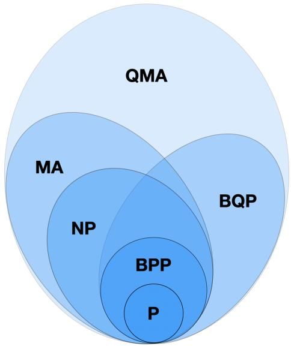  
Figure 2.1: Known inclusion of some complexity classes

In this work, we are interested in the optimization versions of those problems. The goal is not to answer the yes-no question anymore but to compute the optimal solution $x$ of the problem input $g$ with respect to some cost function $C ( g , x )$ . Even though there exists well defined terminology for the optimization versions, for simplicity, we will abusively call them the same way. For example, as we will see in the

Section 2.3, we say that the maximum cut optimization problem is NP-hard.

NP-hard problems are more difficult to solve in terms of time complexity and usually the best known algorithm find the optimal solution in exponentially long time with respect to the input size. What happens if we only allow polynomial time? We only hope for an approximated solution. Those algorithms that run in polynomial time and guarantee that the solution is “close to the optimum” are called approximation algorithms (classical or quantum). To evaluate their performance, we compute their approximation ratio. Here, we only consider maximization functions. For a deterministic algorithm $\mathcal { A }$ , it is defined as the minimum among all inputs $g$ of the ratio of the cost of the output $y$ of the approximation algorithm with the optimal cost $C _ { o p t } ( g )$ of the input :

$$
\rho _ { \mathcal { A } } = \operatorname* { m i n } _ { g } \frac { C ( g , y ) } { C _ { o p t } ( g ) }
$$

For example, we say that $\mathcal { A }$ is a 0.7 approximation algorithm for maximization problem $C$ if, given any input $g$ , it guarantees that the output solution cost is at least 0.7 times the best value $C _ { o p t } ( g )$ .

For probabilistic algorithms, we are interested in the expectation of the output cost value $\mathbb { E } _ { y \sim \mathcal { A } } ( C ( g , y ) )$ , i.e. it is guaranteed that given an input $g$ , on average, the output cost value is $\rho _ { C }$ times the optimal cost value for $g$ .

For quantum algorithms solving classical problems, we also look at the the average output value of the final state measure compared to the optimal one. To write it properly, let us first introduce the quantum computational model we will study in this thesis and its notations.

# 2.1.2 Adiabatic quantum computing

As in the classical setting, in quantum computing we differentiate between digital and analog computing based on the hardware used. In this thesis we mainly study the quantum analog framework to solve or approximate NP-hard optimization problems. Let us start with a formal definition of AQC as defined in the review [Albash & Lidar 2018].

Definition 2.3 (AQC). A $k -$ local adiabatic quantum computation is specified by two $k -$ local Hamiltonians, $H _ { 0 }$ and $H _ { 1 }$ , acting on n $p - s t a t e$ particles, $p \geq 2$ . The ground-state of $H _ { 0 }$ is unique and is a product state. The output is a state that is $\varepsilon -$ close in the $l _ { 2 } { - } n o r m$ to the ground-state of $H _ { 1 }$ . Let $s ( t ) : [ 0 , T ] \to [ 0 , 1 ]$ (the “schedule”) and let $T$ be the smallest time such that the final state of an adiabatic evolution generated by $H ( s ) = ( 1 - s ) H _ { 0 } + s H _ { 1 }$ for time $T$ is $_ { \varepsilon - c l o s e }$ in $l _ { 2 } { - } n o r m$ to the ground-state of $H _ { 1 }$ . $T$ is called the running time of the computation.

In this work, we are only interested in Hamiltonians acting on quantum bits (qubits) so $p = 2$ . Qubits are $2 -$ states particles that can be represented by $| 0 \rangle$ the ground-state and $| 1 \rangle$ the excited state. For a comprehensive introduction to quantum computing, we refer the reader to [Nielsen & Chuang 2002]. Furthermore, we will mainly be concerned with QUBO problems (Def. 2.4) which implies that our Hamiltonians are $k = 2 -$ local. Unless specifically mentioned, we will not use $p$ and $k$ to represent those parameters as we are fixing them here for the rest of the thesis. For AQC to solve QUBO problems, it must be ensured that the final ground-state of $H _ { 1 }$ encodes the solution $x ^ { * }$ of the optimization problem. The choice of the two Hamiltonians $H _ { 0 }$ and $H _ { 1 }$ differs according to the problem under study. In this definition, both Hamiltonians are hermitian matrices in $\mathbb { C } ^ { 2 ^ { n } \times 2 ^ { n } }$ . In Sec. 2.2, we express the Hamiltonians for three problems: maximum $k -$ clique, MaxCut and Maximum Independent Set (MIS). The last quantity to be designed is the schedule $s ( t )$ such that $s ( 0 ) = 0$ and $s ( T ) = 1$ , the choice being totally arbitrary.

Definition 2.4 (QUBO). Let $x \in \{ 0 , 1 \} ^ { n }$ be an $n { - } t$ itstring and $Q \in \mathbb { R } ^ { n \times n }$ a weight matrix. The goal of a Quadratic Unconstrained Binary Optimization problem is to find the assignment $x ^ { * }$ that minimizes the following function:

$$
f _ { Q } ( x ) = x ^ { T } Q x = \sum _ { i , j } Q _ { i j } x _ { i } x _ { j }
$$

Now, let us call $| \phi _ { j } ( s ) \rangle$ and $E _ { j } ( s )$ the instantaneous eigenvectors and eigenvalues of the total Hamiltonian $H ( s )$ acting on $n$ qubits, such that $\forall j \in [ 0 , 2 ^ { n } -$ $1 ] , H ( s ) | \phi _ { j } ( s ) \rangle \ : = \ : E _ { j } ( s ) | \phi _ { j } ( s ) \rangle$ where the eigenvalues are ordered with $E _ { 0 } ( s ) \ \leq$ $E _ { 1 } ( s ) \ \leq \ \ldots \ \leq \ E _ { 2 ^ { n } - 1 } ( s )$ . With this notation, the ground-state is the state of minimum energy, namely $| \phi _ { 0 } ( s ) \rangle$ . The definition then requires that at $s ~ = ~ 0$ , $E _ { 0 } ( 0 ) \ < \ E _ { 1 } ( 0 )$ , so that the initial ground-state $| \phi _ { 0 } ( 0 ) \rangle$ is unique and that it is a product state. This last condition can be relaxed with an “easy-to-prepare state” which is the case of product states but in some cases it can be interesting to start from an easy-to-prepare entangled state (see Sec.2.2.4). The output state, which we do not know yet how to construct, is represented by $| \psi _ { T } \rangle$ , for now, and is $\varepsilon -$ close to the final ground-state of $H _ { 1 }$ , i.e. $| \langle \psi _ { T } | \phi _ { 0 } ( 1 ) \rangle | ^ { 2 } \geq 1 - \varepsilon$ . The final ground-state can be degenerate and so the output state can be in a superposition of states lying in the ground subspace of $H _ { 1 }$ . We detail in Sec. 2.2 how to write the Hamiltonians for graph combinatorial problems. In [Lucas 2014], the authors show how to write Hamiltonians for many NP-hard problems.

Writing $| \psi ( s ) \rangle$ the current state of the algorithm, the computation runs as follows for runtime $T$ . The initial quantum state $| \psi _ { 0 } \rangle = | \psi ( 0 ) \rangle$ is the ground-state of the initial Hamiltonian $H _ { 0 }$ , then the quantum system evolves under the effect of the defined Hamiltonian $H ( s )$ according to Schrödinger’s equation:

$$
\forall s \in [ 0 , 1 ] , \quad i \hbar { \frac { \partial } { \partial s } } | \psi ( s ) \rangle = T H ( s ) | \psi ( s ) \rangle
$$

As it is standard in this field of research, $\hbar$ is taken as unity which sets the order of magnitude of the Hamiltonians strength. The output state, abusively written earlier $| \psi _ { T } \rangle$ to preserve the dependence on the runtime, is the final state $| \psi ( 1 ) \rangle$ of the quantum evolution. It usually ends up in a superposition of classical states. The aim of

AQC is for the latter state to overlap significantly with the final ground-state to solve the problem at hand. The main theoretical support for this property is the adiabatic theorem, which states that a quantum system will remain in the same eigensubspace during the whole quantum process if the evolution is slow enough. “Slow enough” is characterized by the size of minimum spectral gap $\begin{array} { r } { \Delta _ { \mathrm { m i n } } = \operatorname* { m i n } _ { s } \left| E _ { 1 } ( s ) - E _ { 0 } ( s ) \right| } \end{array}$ of the total Hamiltonian $H ( s )$ . In general, with few assumptions on the Hamiltonian, the gap dependence is $\mathcal { O } ( \Delta _ { \mathrm { m i n } } ^ { - 3 } )$ [Jansen et al. 2007], and with smoothness hypothesis it can be improved to $\mathcal { O } ( \Delta _ { \mathrm { m i n } } ^ { - 2 } )$ [Elgart $\&$ Hagedorn 2012]. In most cases of interest in computer science, the Hamiltonians respect the condition for an inverse square minimum gap dependence of the running time. Here we expose the version of [Morita $\&$ Nishimori 2008] for which the adiabatic condition is somewhat easier to capture. It is, however, more restrictive than the previous cited versions as it assumes a non-degenerate instantaneous ground-state throughout the evolution.

Theorem 2.1 ([Morita $\&$ Nishimori 2008]). If the initial state is the ground-state at $s = 0$ , i.e. $| \psi ( 0 ) \rangle = | \phi _ { 0 } ( 0 ) \rangle$ and the instantaneous ground-state of $H ( s )$ is not degenerated for $s \geq 0$ , the quantum state $| \psi ( s ) \rangle$ has the following asymptotic form in the limit of large $T$ :

$$
\begin{array} { l } { { \displaystyle | \psi ( s ) \rangle = \sum _ { j } c _ { j } ( s ) e ^ { - i T \int _ { 0 } ^ { s } E _ { j } ( s ^ { \prime } ) d s ^ { \prime } } | \phi _ { j } ( s ) \rangle , } } \\ { { \displaystyle c _ { 0 } ( s ) \simeq 1 + \mathcal { O } ( T ^ { - 2 } ) , } } \\ { { \displaystyle c _ { j \neq 0 } ( s ) \simeq \frac { i } { T } \left[ A _ { j } ( 0 ) - e ^ { i T \int _ { 0 } ^ { s } \Delta _ { j 0 } ( s ^ { \prime } ) d s ^ { \prime } } A _ { j } ( s ) \right] + \mathcal { O } ( T ^ { - 2 } ) } } \end{array}
$$

where Aj (s) = ⟨ϕj (s)|H˙ |ϕ0(s)⟩ and $\Delta _ { j k } ( s ) = E _ { j } ( s ) - E _ { k } ( s )$ .

Proof. Substituting state (2.2) in Schrödinger equation (2.1) gives us the following equation for the coefficient $c _ { j } ( s )$ :

$$
\dot { c } _ { j } = \sum _ { k \neq j } c _ { k } ( s ) \frac { e ^ { i T \int _ { 0 } ^ { s } \Delta _ { j k } ( s ^ { \prime } ) d s ^ { \prime } } } { \Delta _ { j k } ( s ) } \langle \phi _ { j } ( s ) | \dot { H } | \phi _ { k } ( s ) \rangle
$$

where we used that $\langle \phi _ { j } ( s ) | \dot { \phi _ { j } } ( s ) \rangle = 0$ because the state is of unit norm and we can fix the global phase of the state which is irrelevant in quantum computing. The derivative of the eigen-relation $H ( s ) | \phi _ { j } ( s ) \rangle = E _ { j } ( s ) | \phi _ { j } ( s ) \rangle$ gives :

$$
\langle \phi _ { j } ( s ) | \dot { \phi _ { k } } ( s ) \rangle = - \frac { \langle \phi _ { j } ( s ) | \dot { H } | \phi _ { k } ( s ) \rangle } { \Delta _ { j k } ( s ) }
$$

Then integrating Eq. (2.3) yields

$$
c _ { j } ( s ) = c _ { j } ( 0 ) + \sum _ { k \neq j } \int _ { 0 } ^ { s } c _ { k } ( u ) e ^ { i T \int _ { 0 } ^ { u } \Delta _ { j k } ( s ^ { \prime } ) d s ^ { \prime } } \frac { \langle \phi _ { j } ( u ) | \dot { H } | \phi _ { k } ( u ) \rangle } { \Delta _ { j k } ( u ) } \mathrm { d } u
$$

By assumption, the initial state is the ground-state of $H ( 0 )$ , so $c _ { 0 } ( 0 ) = 1$ and cj̸=0(0) = 0. By introducing αjk(u) = eiT R u0 ∆jk(s′)ds′ ⟨ϕj (u)|H˙ |ϕk(u)⟩ and inserting the former equation into itself, we can distinguish two cases $j = 0$ and $j \neq 0$ as

$$
\begin{array} { r l } & { \quad c _ { 0 } ( s ) = 1 + 0 + \displaystyle \sum _ { k \neq 0 } \displaystyle \sum _ { l \neq k } \int _ { 0 } ^ { s } \int _ { 0 } ^ { u } c _ { l } ( v ) \alpha _ { k l } ( v ) \mathrm { d } v \ \alpha _ { 0 k } ( u ) \mathrm { d } u } \\ & { \quad c _ { j \neq 0 } ( s ) = 0 + \displaystyle \int _ { 0 } ^ { s } \alpha _ { j 0 } ( u ) \mathrm { d } u + \displaystyle \sum _ { k \neq j } \displaystyle \sum _ { l \neq k } \displaystyle \int _ { 0 } ^ { s } \int _ { 0 } ^ { u } c _ { l } ( v ) \alpha _ { k l } ( v ) \mathrm { d } v \ \alpha _ { j k } ( u ) \mathrm { d } u } \end{array}
$$

We then perform an integration by parts of $\alpha _ { j 0 } ( u )$ giving us :

$$
\int _ { 0 } ^ { s } \alpha _ { j 0 } ( u ) \mathrm { d } u = \frac { 1 } { i T } \left[ e ^ { i T \int _ { 0 } ^ { u } \Delta _ { j 0 } ( s ^ { \prime } ) d s ^ { \prime } } A _ { j } ( u ) \right] _ { 0 } ^ { s } - \frac { 1 } { i T } \int _ { 0 } ^ { s } e ^ { i T \int _ { 0 } ^ { u } \Delta _ { j 0 } ( s ^ { \prime } ) d s ^ { \prime } } \frac { \mathrm { d } } { \mathrm { d } u } A _ { j } ( u ) \mathrm { d } u
$$

where $[ f ( u ) ] _ { 0 } ^ { s } = f ( s ) - f ( 0 )$ . Therefore the first term yields the order $T ^ { - 1 }$ part of the $c _ { j \neq 0 } ( s )$ coefficients. The next integration by parts will give the $T ^ { - 2 }$ term along with the nested integrals of Eq. (2.5). For the ground-state coefficient $c _ { 0 } ( s )$ , we see that the $T ^ { - 1 }$ is null and the next one is of order $T ^ { - 2 }$ with the nested integrals of Eq. (2.4). □

The condition for adiabatic evolution is straightforward. We say that the quantum evolution is adiabatic if for every $s \in \lbrack 0 , 1 ]$ , the state $| \psi ( s ) \rangle$ remains close to the instantaneous ground-state of $H ( s )$ . In other words, the condition translates into $\forall j \neq 0 , \forall s , c _ { j } ( s ) \ll 1$ , i.e. $T \gg | A _ { j } ( s ) |$ . We recover the usual writing of the adiabatic validity condition, namely

$$
T \gg \frac { \| \dot { H } \| _ { \operatorname* { m a x } } } { \Delta _ { \operatorname* { m i n } } ^ { 2 } }
$$

where $\| \dot { H } \| _ { \operatorname* { m a x } }$ is the maximum norm of the time derivative of the Hamiltonian throughout the evolution. We note that this condition is consistent with the expansion presented in the proof of Theorem 2.1. In usual case of combinatorial problem, the numerator scales only polynomially with the input size, making the scaling of the minimum gap the main quantity to analyze to conclude on the complexity of AQC.

The adiabatic theorem is the main theoretical foundation of AQC. This theorem guarantees that the runtime is bounded by the complexity of the minimum spectral gap. In 2004, the authors of [Aharonov et al. 2004] showed that AQC is equivalent to the gate-based model of quantum computing making AQC a universal computational framework. Indeed, any continuous quantum evolution can be efficiently approximated by a quantum circuit using a discretization, a process known as Hamiltonian simulation. Conversely, it is possible to encode a quantum circuit into a local Hamiltonian such that its ground-state contains the output of the circuit. Based on this theorem, the task of analyzing the complexity of adiabatic computation is restricted to understanding the behavior of Hamiltonian gap. It appears that this task is extremely difficult in the general case, and there are only few cases where an analytical derivation of the gap is possible. The main focus of the studies is to understand how $\Delta _ { \mathrm { m i n } }$ scales with the input size, and to distinguish between hard problems with a gap that closes at least exponentially fast and easy problems with only a polynomially small gap or less. In Sec. 2.4, we will detail the interesting case where the gap closes exponentially fast at avoided level crossing. Two physical phenomena are known to be the source of these AC: first order quantum phase transitions [Sachdev 1999] and Anderson localization [Anderson 1958].

Overall, AQC seems well suited for some specific tasks such as finding the groundstate of an Hamiltonian and very little analytical work is known around its complexity, compared to promising numerical works. The gap dependence is the main hurdle toward analytical proofs of quantum advantage. However, it is still possible to study a quantum evolution by eliminating the gap dependence in the design of the algorithm as we see in the next section. For near-term devices (see Sec. 2.1.4), the runtime is limited by a constant and, in practice, the duration of quantum evolution should be less than this latter upper limit. This is why there is great interest in understanding quantum evolution performance on different time scales.

# 2.1.3 Quantum annealing

In this setting, the runtime $T$ can be arbitrarily chosen and the initial state may not be the initial ground-state (although this is usually the case). Depending on the choice of $T$ , the evolution is not necessarily adiabatic and the final state no longer has the same guarantee. We call such an evolution quantum annealing (QA) and it is a general meta-heuristic for approximating combinatorial problems. It has been introduced in [de Falco et al. 1988, Kadowaki & Nishimori 1998] with practical implementation in [Apolloni et al. 1989]. With this definition, QA is more general than AQC but the convergence of QA towards the optimal solution is still guaranteed by the adiabatic theorem. This opens the door to approximation study or to parametrization of AQC to optimize a certain target measure. To evaluate the performance of the evolution, we may want to study/optimize the probability of measuring the target state $| x ^ { * } \rangle$ , i.e. $| \langle x ^ { * } | \psi _ { T } \rangle | ^ { 2 }$ . Nonetheless, as the runtime is arbitrarily chosen, away from the adiabatic regime, it is most likely that the output state differs from the target. Depending on $T$ , the output state can still have a good enough cost value not too far from the target. The output state is an approximate solution. To capture “good enough”, another potential performance indicator is the approximation ratio (Def. 2.5), the goal being to optimize the average value of the final state with respect to the optimal value.

Definition 2.5 (Approximation ratio). Given an input graph $G$ on which we want to solve an maximization problem $C$ , and a quantum algorithm $\mathcal { A }$ that outputs $a$ potential solution $x$ for the problem with value $C ( G , x )$ , the approximation ratio $r ( C ( G ) , A )$ is defined by the ratio of the expected output of $\mathcal { A }$ and the optimal value

$C _ { o p t } ( G )$

$$
r _ { C ( G ) , A } = \frac { \mathbb { E } _ { x \sim A } ( C ( G , x ) ) } { C _ { o p t } ( G ) }
$$

In this thesis, we are interested in the worst case scenario. This means that we are looking for input-independent lower bounds of the worst possible ratio taken over all possible input graphs:

$$
\rho _ { C , A } = \operatorname* { m i n } _ { G } \frac { \mathbb { E } _ { x \sim A } ( C ( G , x ) ) } { C _ { o p t } ( G ) }
$$

In our notation, the final expected output is written as $\langle \psi _ { T } | H _ { 1 } | \psi _ { T } \rangle$ . To see this, let us decompose $| \psi _ { T } \rangle$ in the computational basis of the bit-strings, and write

$$
\begin{array} { l } { \displaystyle \langle \psi _ { T } | H _ { 1 } | \psi _ { T } \rangle = \sum _ { x , y \in \{ 0 , 1 \} ^ { n } } \langle \psi _ { T } | y \rangle \langle y | H _ { 1 } | x \rangle \langle x | \psi _ { T } \rangle } \\ { = \sum _ { x \in \{ 0 , 1 \} ^ { n } } \langle x | \psi _ { T } \rangle \langle \psi _ { T } | x \rangle C ( x ) } \\ { = \sum _ { x \in \{ 0 , 1 \} ^ { n } } | \langle x | \psi _ { T } \rangle | ^ { 2 } C ( x ) } \\ { = \mathbb { E } _ { x \sim \{ 0 , 1 \} ^ { n } } } \\ { = \mathbb { E } _ { x \sim \mathcal { A } } ( C ( x ) ) } \end{array}
$$

where we use the fact that $\langle x | H _ { 1 } | y \rangle = C ( x ) \delta _ { x y }$ and we remove the dependency in $G$ of $C$ as it is clear from the context. $\delta _ { x y }$ represents the Kronecker delta symbol that evaluates to 1 when its indices are equal ( $x = y$ ) and $0$ otherwise ( $x \neq y$ ).

This broader setting of QA offers room to analyze the quantum evolution as an approximation algorithm for shorter runtimes, away from the adiabatic condition. In this thesis (Part II), we undertake the specific runtime regime of constant time QA with the goal to formally prove lower bounds on the approximation ratio achieved by QA on some specific benchmark problems that we will detail in the next section. Similar results exist in the bounded depth quantum circuit model as well as in the classical case with constant round distributed algorithms. In Sec. 2.3, we will develop the construction of two other algorithms that formally prove lower bounds on the worst-case approximation ratio.

Quantum annealing seems to be even more suitable for NISQ use, as the hardware developed to perform this metaheuristic have a limited “quantum lifetime”. As we will see in the next section, this lifetime is called decoherence time.

# 2.1.4 Hardware and quantum annealer

The hardware available today for performing continuous quantum evolution is generally referred to as quantum annealer. As mentioned in the Introduction chapter 1, D-Wave was the first company to commercialize this type of hardware. Subsequently, many other companies began to develop technology to perform continuous quantum evolution, such as Pasqal [Henriet et al. 2020], Qilimanjaro, QuEra Computing and others. The main limitation of current hardware is the total runtime it allows. This limitation means that adiabatic evolution cannot be guaranteed in the general case. This makes QA the main metaheuristic for analog quantum computing in the NISQ era. However, very few analytical results are known for this regime, so in this thesis we set out to prove the algorithmic performance of QA in constant time (Part II).

As an example, the hardware from the French company Pasqal uses Rydberg atoms as the physical building blocks of quantum information. Indeed, in [Saffman et al. 2010], the authors show how to use this technology to perform quantum computations. In [Serret et al. 2020], the authors provide quantitative requirements for running a QA algorithm with this hardware. A Rydberg atoms Hamiltonian naturally encode a specific combinatorial problem, called the MIS problem (see Sec. 2.2.3). A recent study [Ebadi et al. 2022] published in Science claimed a “quantum speed-up” using 287 Rydbergs atoms to solve a combinatorial graph problem compared with simulated annealing, the classical version of QA. Later in [Andrist et al. 2023], the result was mitigated by using a broader range of classical solvers.

# 2.2 Hamiltonians definition for graphs combinatorial problems

In both AQC and QA, the encoding of the target Hamiltonian $H _ { 1 }$ is crucial. As stipulated by Def. 2.3, the ground-state of $H _ { 1 }$ should encode the desired output state. As mentioned earlier, in this work we will mainly focus on graph optimization problems. In this section, we first develop the general form of the target Hamiltonian to solve such combinatorial problems. Then we explicit the expression of the Hamiltonians for three problems : Maximum Cut, Maximum Independent Set and Maximum (weight) $k -$ clique. While the initial Hamiltonian $H _ { 0 }$ remains independent of the input and the same one can always be used, its design can be tailored according to the nature of the problem, as in the maximum (weight) $k -$ clique problem. For more examples of problems encoded in Hamiltonian, we refer the reader to the seminal work of [Farhi et al. 2001] and the comprehensive work of [Lucas 2014].

# 2.2.1 General optimization on graphs

We consider a restricted class of problems whose inputs are graphs and outputs are set of nodes, or two-partitions of the input node set, minimizing some global cost function. Moreover, we focus our interest on combinatorial graph problems where the global cost is a sum of cost functions localized on the nodes and the edges of the input graph.

Formally, we are given as input some graph $G = ( V , E )$ on $n$ nodes, and our cost function $C$ associates any $n$ -bit vector $x$ (bit $x _ { i }$ corresponding to the Boolean value of node $i$ ) with a value $\begin{array} { r } { C ( x ) = \sum _ { i \in V } v ( x _ { i } ) + \sum _ { \langle i , j \rangle \in E } u ( x _ { i } , x _ { j } ) } \end{array}$ , for certain functions $v : \{ 0 , 1 \} \to \mathbb { N }$ and $u : \{ 0 , 1 \} \times \{ 0 , 1 \} \to \mathbb { N }$ . In general, the weighted version of each problem can be easily expressed by including the dependence of the weights in the cost functions $u$ and $v$ . The values taken from the cost function are then $\mathbb { R }$ . Moreover, if we assume that the local cost functions are quadratic, it is easy to see that the resulting cost functions are a special case of Def 2.4, see [Hauke et al. 2020].

In quantum computing, we call the basis $\{ | x \rangle , x \in \{ 0 , 1 \} ^ { n } \}$ the computational basis. A quantum annealing algorithm, $a$ fortiori an adiabatic quantum computation algorithm, for minimizing a cost function $C$ on $n$ -node graphs is defined by three ingredients:

Final Hamiltonian $H _ { 1 }$ . A target Hamiltonian $H _ { 1 }$ (i.e. a hermitian operator) encoding the solution of the cost function $C$ as its ground-state. The generic way to ensure this property is to encode the entire cost function, in the sense that for all $x \in \{ 0 , 1 \} ^ { n }$ , $H _ { 1 } | x \rangle = C ( x ) | x \rangle$ . Notice that $H _ { 1 }$ is diagonal in the computational basis. This completely defines $H _ { 1 }$ and the target state $x ^ { * }$ , which minimizes $C$ , is each clause of the ground-state as $C$ separately: $H _ { 1 } | x ^ { * } \rangle = C ( x ^ { * } ) | x ^ { * } \rangle$ $\begin{array} { r } { H _ { 1 } = - \sum _ { i \in V } N ^ { ( i ) } - \sum _ { \langle i , j \rangle \in E } M ^ { ( i , j ) } } \end{array}$ . This construction is achieved by encoding . It follows that the structure of $C$ is preserved by this Hamiltonian $H _ { 1 }$ and local clauses become local terms (also called observables). Here, $N ^ { ( i ) }$ encodes the local cost function $v ( x _ { i } )$ of node $i$ acting on qubit $i$ and $M ^ { ( i , j ) }$ the local cost function $u ( x _ { i } , x _ { j } )$ of edge $\left. i , j \right.$ acting on qubits $i$ and $j$ . They can be defined as follows:

$$
\begin{array} { c } { N ^ { ( i ) } = \left( v ( 0 ) | 0 \rangle \langle 0 | + v ( 1 ) | 1 \rangle \langle 1 | \right) \otimes \mathbb { I } _ { V \backslash \{ i \} } } \\ { M ^ { ( i , j ) } = \left( u ( 0 , 0 ) | 0 0 \rangle \langle 0 0 | + u ( 0 , 1 ) | 0 1 \rangle \langle 0 1 | \right. } \\ { \left. + u ( 1 , 0 ) | 1 0 \rangle \langle 1 0 | + u ( 1 , 1 ) | 1 1 \rangle \langle 1 1 | \right) \otimes \mathbb { I } _ { V \backslash \{ i , j \} } } \end{array}
$$

Initial Hamiltonian $H _ { 0 }$ . An input-independent initial Hamiltonian $H _ { 0 }$ to start our annealing. The ground-state of this Hamiltonian must be easy to prepare, as, for example, the product states. Apart from this technical constraint, to understand the choice of this Hamiltonian, we need to understand the role it plays in the evolution. Let’s consider the evolution of the amplitude of a state $\langle x |$ in the quantum system $| \psi ( s ) \rangle$ . The Schrödinger equation allows us to write

$$
\begin{array} { r l } & { \quad i \displaystyle \frac { | \psi ( s + \mathrm { d } s ) \rangle - | \psi ( s ) \rangle } { \mathrm { d } s } = T H ( s ) | \psi ( s ) \rangle } \\ & { \Rightarrow | \psi ( s + \mathrm { d } s ) \rangle = ( I - i T \mathrm { d } s ( ( 1 - s ) H _ { 0 } + s H _ { 1 } ) ) | \psi ( s ) \rangle } \\ & { \Rightarrow \langle x | \psi ( s + \mathrm { d } s ) \rangle = ( 1 - i T s C ( x ) \mathrm { d } s ) \langle x | \psi ( s ) \rangle - i T ( 1 - s ) \mathrm { d } s \langle x | H _ { 0 } | \psi ( s ) \rangle } \\ & { \Rightarrow \langle x | \psi ( s + \mathrm { d } s ) \rangle = ( 1 - i T s C ( x ) \mathrm { d } s ) \langle x | \psi ( s ) \rangle - i T ( 1 - s ) \mathrm { d } s \displaystyle \sum _ { y _ { \widetilde { H _ { 0 } } } x } ( H _ { 0 } ) _ { x y } \langle y | \psi ( s ) \rangle } \\ & { \Rightarrow | \psi ( s + \mathrm { d } s ) \rangle = ( I - i T s C ( x ) \mathrm { d } s ( ( 1 - s ) H _ { 0 } + s H _ { 1 } ) ) | \psi ( s ) \rangle } \end{array}
$$

where $I$ is the identity matrix and $\boldsymbol { \mathcal { Y } } _ { \boldsymbol { H _ { 0 } } } ^ { \mathrm { ~ \scriptsize ~ \textit ~ { ~ x ~ } ~ } }$ means that the matrix element $( H _ { 0 } ) _ { x y }$ is non-zero, i.e. states $x$ and $y$ are related via $H _ { 0 }$ . We understand from the last equation that the amplitude at time $s + \mathrm { d } s$ of state $x$ is influenced by the amplitude of $x$ at time $s$ but also by the amplitude of “neighboring” states $y$ via $H _ { 0 }$ . Without saying more on the evolution, we understand that if we want to reach some state $x ^ { * }$ , i.e. the amplitude of $x ^ { * }$ at time $s = 1$ is large, it requires that this state “communicates” with other states. Otherwise, the probability of measuring the target state at the end of the evolution will be the same as the initial probability. Therefore, $H _ { 0 }$ should connect all states that are potential solution to the optimization problem. Informally, physicists call this a driver in which the quantum system can evolve.

Schedule $s ( t )$ . The schedule is a function $s ( t ) : [ 0 , T ] \to \mathbb { R }$ with $s ( 0 ) = 0$ and $s ( T ) = 1$ so that $H ( 0 ) = H _ { 0 }$ and $H ( s ( T ) ) = H _ { 1 }$ and it rules the trajectory in time of the total Hamiltonian $H ( s )$ . It also fixes the runtime $T$ and depending on the scaling of the minimum gap, the evolution will be adiabatic or not. This degree of freedom allows a wide range of possible functions and it includes the whole research area of optimal transport (see [Brady et al. 2021]). Freedom in the choice of the schedule also enables to add a catalyst Hamiltonian in the middle of the evolution. For example, the following total Hamiltonian is allowed

$$
H ( s ) = ( 1 - s ) H _ { 0 } + s ( 1 - s ) H _ { c a t } + s H _ { 1 }
$$

The most standard choice of schedule is the linear interpolation with $\begin{array} { r } { s ( t ) = \frac { t } { T } } \end{array}$ which is a straight line between 0 and 1. Unless stated otherwise, in this work we mostly focus on this standard schedule without perturbative Hamiltonian and we leave this question for further work. It is interesting to point out that a local adiabatic condition can be stated as

$$
\frac { \mathrm { d } s } { \mathrm { d } t } \ll \frac { \Delta _ { 0 1 } ( s ) } { \langle \phi _ { 1 } ( s ) | \dot { H } | \phi _ { 0 } ( s ) \rangle }
$$

enabling for an adjusted design of the schedule, i.e. to go fast when the gap is large and slow down when it is small. This idea has been deftly manipulated in [Roland & Cerf 2002] to prove the well-known Grover speedup in the adiabatic regime. The authors adjusted the speed of the evolution according to the gap leading to a particular form of schedule. We see that the standard linear schedule has a speed of $1 / T$ which does not allow for intelligent control of the speed.

These three ingredients are both necessary and sufficient for initiating a quantum annealing process. In order to comprehensively understand the Hamiltonians formulation, we provide a detailed description of the Hamiltonians employed to investigate the computational complexity of solving three combinatorial graph problems. It is important to note that the complexity depends on the choice of your Hamiltonians [Choi 2011].

# 2.2.2 Maximum Cut

Maximum Cut as an optimization problem, is a combinatorial problem in which one has to find a bi-partition of the nodes of an input graph $G ( V , E )$ such that the number of edges across the bi-partition is maximized (see Fig. 2.2). The bi-partition is represented by a $n -$ bit vector $x$ with partition $0$ ’s and ‘1’s (respectively green and red in Fig. 2.2). The associated cost function is $\begin{array} { r } { C _ { \mathrm { M a x C u t } } ( x , G ) = \sum _ { ( i , j ) \in E } x _ { i } \oplus x _ { j } } \end{array}$ where $\bigoplus$ is a XOR operator between two bits. It evaluates to $1$ if $x _ { i } \neq x _ { j }$ and $0$ otherwise. Using the notation of the previous section, we have that function $v ( . )$ is null and the cost function $u ( . , . )$ is the XOR operation. It is interesting to note that this function has a $\mathbb { Z } _ { 2 }$ symmetry meaning that by flipping all the bits of a bitstring $x$ , it gives another bitstring $x$ with the exactly the same cost value. Also, without any knowledge of the input labeling, any bitstring is a potential solution.

  
Figure 2.2: Example of Maxcut solving on the graph (left) with solution (right). The bi-partition green/red represents the bi-partition ‘ $0$ ’ and ‘1’. The solution proposed on the right has value $C ( 1 0 1 0 ) = - 4$ .

To solve this problem using quantum annealing, we first look at the opposite cost function $C = - C _ { \mathrm { M a x C u t } }$ , as the setting of QA we defined earlier can be used to minimize some functions.

A standard choice for the initial Hamiltonian is

$$
H _ { 0 } = - \sum _ { i \in V } \sigma _ { x } ^ { ( i ) }
$$

where $\sigma _ { x } ^ { \left( i \right) }$ is the bit-flip operator acting on qubit $i$ . The ground-state (i.e. the eigenvector of minimum eigenvalue) of this Hamiltonian is the product state $| \psi _ { 0 } \rangle =$ $\left( { \frac { | 0 \rangle + | 1 \rangle } { \sqrt { 2 } } } \right) ^ { \otimes n }$ , the uniform superposition of all possible bit-strings of length $n$ . This state is particularly easy to prepare (it is not entangled) and will be the starting point of our computation. Now, if we look at the matrix elements of $H _ { 0 }$ , we understand that for any bit-strings $x$ and $y$ , $( H _ { 0 } ) _ { x y } = - 1$ if $x$ differs from $y$ by exactly one bit and 0 otherwise. This observation tells us that the graph generated by $- H _ { 0 }$ is the hypercube, e.g. see Fig. 2.3. This choice of Hamiltonian satisfies the connection condition between all the possible solutions.

For the final Hamiltonian $H _ { 1 }$ , we observe that the cost function can be rewritten in terms of variables zi = 2xi − 1 ∈ {−1, +1} as C(z) = − P⟨i,j⟩∈E 1−z2 izj . It computes exactly the same function. To encode it in a Hamiltonian, we use the Pauli $\sigma _ { z }$ operator where state $| 0 \rangle$ is the $+ 1$ eigenvector and state $| 1 \rangle$ is the -1 eigenvector. For quantum computing, this operator is the perfect basis transformation from $\{ 0 , 1 \}$ to $\{ - 1 , + 1 \}$ . Thus, the Hamiltonian writes

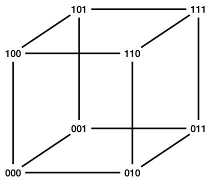  
Figure 2.3: Example of the graph generated by $- H _ { 0 }$ with $n = 3$ . Each node of the graph represents a potential solution, i.e. a bi-partition of the input graph $G$ .

$$
H _ { 1 } = - \sum _ { \langle i , j \rangle \in E } \frac { 1 - \sigma _ { z } ^ { ( i ) } \sigma _ { z } ^ { ( j ) } } { 2 }
$$

so that it verifies for any bit-string $H _ { 1 } | x \rangle = C ( x ) | x \rangle$ . The optimal state $x ^ { * }$ is the one that minimizes $C$ , so the quantum state $| x ^ { * } \rangle$ is the ground-state of $H _ { 1 }$ .

These two Hamiltonians are well defined as required by the setting of AQC or QA, and the adiabatic theorem guarantees that the adiabatic evolution will find the solution to this problem. In Sec. 2.3, we review some of the known approximation ratios proved on this problem in the classical and quantum world.

# 2.2.3 Maximum Independent Set

Maximum Independent Set as an optimization problem, is a combinatorial problem where the goal is to find the largest set $S$ of nodes of a graph $G ( V , E )$ such that there is no edge of $E$ between the nodes of $S$ , called a stable. We encode the potential independent set in a vector $\boldsymbol { x } = x _ { 1 } x _ { 1 } . . . . x _ { n }$ with $x _ { i } = 1$ if $i \in S$ and $x _ { i } = 0$ otherwise. The cost function is written in two parts because we want to maximize the Hamming weight of $x$ while minimizing the number of edges between nodes $i$ and $j$ such that $x _ { i } = x _ { j } = 1$ . We write $\begin{array} { r } { C _ { \mathrm { M I S } } ( x ) = \sum _ { i \in V } x _ { i } - \sum _ { ( i , j ) \in E } x _ { i } x _ { j } } \end{array}$ . Even though this function only weakly encodes the independent set constraint, one can easily transform any bit-string $x$ of cost $C _ { \mathrm { M I S } } ( x )$ into a stable of size at least $C _ { \mathrm { M I S } } ( x )$ . This can be done considering each edge that violates the stable condition (i.e. each edge $\langle i , j \rangle$ such that $x _ { i } = x _ { j } = 1$ ), picking at random one of its extremities, and removing it from the solution. This effectively removes a node from $x$ while “fixing” at least an edge, thus creating a new solution with an increased cost. Eventually, the maximum of $C _ { \mathrm { M I S } } ( x )$ corresponds to a maximum independent set.

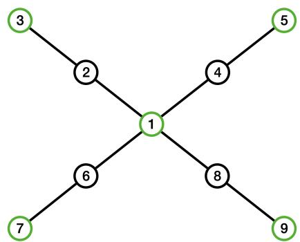  
Figure 2.4: Example of an MIS in a graph. The MIS in green node is encoded in vector $x = 1 0 1 0 1 0 1 0 1$ with value $C ( x ) = - 5$ .

Like the MaxCut problem, to solve MIS via analog quantum computing, we will look at the cost function $C = - C _ { \mathrm { M I S } }$ . The same initial Hamiltonian works as well for this problem, i.e. $\begin{array} { r } { H _ { 0 } = - \sum _ { i \in V } \sigma _ { x } ^ { ( i ) } } \end{array}$ . In order to implement $C$ into a Hamiltonian we proceed to the same change of basis as for MaxCut: $\{ 1 , - 1 \}$ and $C$ can be written as $\begin{array} { r } { C ( z ) = \sum _ { i } \frac { 1 - z _ { i } } { 2 } - \sum _ { \langle i , j \rangle } \frac { 1 - z _ { i } } { 2 } \frac { 1 - z _ { j } } { 2 } } \end{array}$ $\{ 0 , 1 \}$ 1−zi 1−zj . Thus, the final is transformed into Hamiltonian for MIS that QA will minimize is:

$$
H _ { 1 } = - \sum _ { i \in V } \frac { 1 } { 2 } ( 1 - \sigma _ { z } ^ { ( i ) } ) + \sum _ { ( i , j ) \in E } \frac { 1 } { 4 } ( 1 - \sigma _ { z } ^ { ( i ) } ) ( 1 - \sigma _ { z } ^ { ( j ) } )
$$

Unlike MaxCut, we see here that we have a component on the nodes and a component on the edges; $N ^ { ( i ) } = \textstyle { \frac { 1 } { 2 } } ( 1 - \sigma _ { z } ^ { ( i ) } )$ and $\begin{array} { r } { M ^ { ( i , j ) } = - \frac { 1 } { 4 } ( 1 - \sigma _ { z } ^ { ( i ) } ) ( 1 - \sigma _ { z } ^ { ( j ) } ) } \end{array}$ . The ground-state of this Hamiltonian is the MIS.

# 2.2.4 Maximum weight $k$ -clique problem

First, let us define the Maximum Clique problem. As an optimization problem, the goal is to find the clique of maximal size in an input random graph $G ( V , E )$ . It is directly equivalent to solving MIS problem in the complementary graph of $G$ . A clique is a complete graph, so its complementary graph is an independent set. The complement of a graph $G$ is a graph $G ^ { \prime }$ on the same nodes such that two distinct nodes of $G ^ { \prime }$ are adjacent if and only if they are not adjacent in $G$ . Similarly, a bitstring $\boldsymbol { x } = x _ { 1 } x _ { 2 } . . . x _ { n }$ encodes a potential solution as it selects the subgraph generated by the set $\{ i , x _ { i } = 1 \}$ .

In the maximum $k$ -clique optimization problem, we parametrized the Maximum Clique problem by the knowledge of the maximum clique size $k$ . This parameter allows us to focus on bit-strings of Hamming weight equal to $k$ as we are only interested in sub-graphs of size $k$ . Thus the whole search space of size $2 ^ { n }$ is reduced to the $\textstyle { \binom { n } { k } }$ search space, that is the space spanned by bit-strings of Hamming weight $k$ . Consequently, in the cost function, we can remove the part that deals with the Hamming weight and we are left with $\begin{array} { r } { C _ { k - \mathrm { c l i q u e } } ( x ) = \sum _ { ( i , j ) \notin E } x _ { i } x _ { j } } \end{array}$ . It counts the number of edges missing from the subgraph generated by $x$ for it to be a clique. In

Fig. 2.5 for example, looking at the subgraph generated by nodes 1,2 and 3 results in the vector $x = 1 1 1 0 0 0$ with cost value $C _ { k { \mathrm { - c l i q u e } } } ( x ) = 1$ .

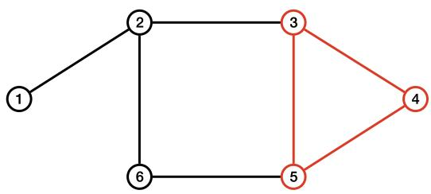  
Figure 2.5: Example of a 3-clique in a graph. The solution in red is encoded in vector $x = 0 0 1 1 1 0$ and its value is $C ( x ) = 0$ .

The authors of [Childs et al. 2002] were the first to introduce the potential of AQC to solve the maximum $k -$ clique problem. Cleverly and unlike the previously presented problems, the chosen initial Hamiltonian $H _ { 0 }$ stabilizes the $\binom { n } { k }$ Hilbert space and thus preserves the Hamming weight of the computational basis vectors encoding our subgraphs. The S operator, exchanging the position of $x _ { i }$ and $x _ { j }$ in vector $x$ , does not affect the Hamming weight and is the retained candidate in the original paper. Therefore, we write:

$$
H _ { 0 } = - \sum _ { ( i j ) \in E \left( G \mathrm { d r i v e r } \right) } \mathrm { S } ^ { ( i j ) }
$$

where

$$
\mathrm { S } ^ { ( i j ) } = \left( \begin{array} { l l l l } { { 0 } } & { { 0 } } & { { 0 } } & { { 0 } } \\ { { 0 } } & { { 0 } } & { { 1 } } & { { 0 } } \\ { { 0 } } & { { 1 } } & { { 0 } } & { { 0 } } \\ { { 0 } } & { { 0 } } & { { 0 } } & { { 0 } } \end{array} \right) ^ { ( i j ) } \mathrm { ~ s w a p s ~ q u b i t s ~ } i \mathrm { ~ a n d ~ } j
$$

and $G _ { \mathrm { d r i v e r } }$ represents the graph of the allowed swaps between the qubits. In the original work [Childs et al. 2002], they only look at the complete driver graph, allowing the swap of any pairs of qubits. Then noticing that $\mathrm { 2 S } ^ { ( i j ) } = \sigma _ { x } ^ { ( i ) } \sigma _ { x } ^ { ( j ) } + \sigma _ { y } ^ { ( i ) } \sigma _ { y } ^ { ( j ) }$ . we can write $H _ { 0 }$ with quantum operators like:

$$
H _ { 0 } = - \frac { 1 } { 2 } \sum _ { ( i j ) \in E ( G _ { \mathrm { d r i v e r } } ) } ( \sigma _ { x } ^ { ( i ) } \sigma _ { x } ^ { ( j ) } + \sigma _ { y } ^ { ( i ) } \sigma _ { y } ^ { ( j ) } )
$$

Now, $- H _ { 0 }$ does not generate a hypercube anymore, but still connects every potential solution if $G _ { \mathrm { d r i v e r } }$ is connected. Let us illustrate with a path graph as the driver graph. In Fig. 2.6, we plot on the top a line graph of size 5 and the corresponding graph with adjacency matrix $- H _ { 0 }$ and $k = 3$ . We can see that the vector $x$ is linked to the vector $y$ if, for a node $i \in V ( G _ { d r i v e r } )$ , the exchange of the positions of $x _ { i }$ and $x _ { i + 1 }$ gives $y$ . For example, vector $x = 1 1 1 0 0$ has only one neighbor because only $x _ { 3 }$ and $x 4$ can swap. This is why the state that alternates between ‘0’ and ‘1’ is the highest degree node, since each swap of pairs $( x _ { i } , x _ { i + 1 } )$ results in a new state. This driver graph gives us another degree of freedom to play with.

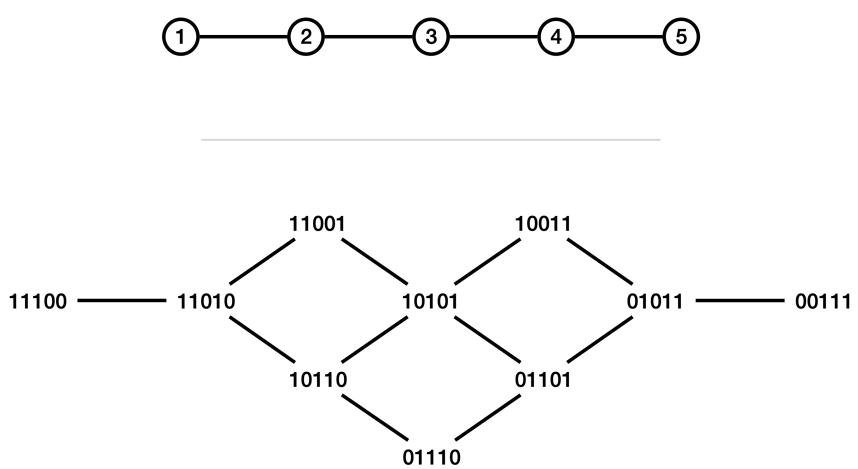  
Figure 2.6: Example of a connected $G _ { \mathrm { d r i v e r } }$ , a line on $n = 5$ nodes (top) and the generated search graph (down) with adjacency matrix $- H _ { 0 }$ associated to the given driver graph where we implicitly fix $k = 3$ .

For the final Hamiltonian, with a similar reasoning from the MIS problem, it is written as follows:

$$
H _ { 1 } = \frac { 1 } { 4 } \sum _ { i , j \notin E } ( 1 - \sigma _ { z } ^ { ( i ) } ) ( 1 - \sigma _ { z } ^ { ( j ) } )
$$

Now, we will introduce the weighted version of the $k -$ clique problem 1. We suppose that each node $i$ of the input graph has a weight $w _ { i }$ and the goal is to find the $k -$ clique such that it maximizes the sum of the weights of the clique. The cost function can be updated to $\begin{array} { r } { C ( x ) = \sum _ { ( i , j ) \not \in E } x _ { i } x _ { j } - \alpha \sum _ { i \in V } w _ { i } x _ { i } } \end{array}$ with a free parameter $\alpha$ that we can arbitrarily turn on to give more or less importance to the weights. The resulting final Hamiltonian for the weighted version is

$$
H _ { 1 } = \frac { 1 } { 4 } \sum _ { i , j \notin E } ( 1 - \sigma _ { z } ^ { ( i ) } ) ( 1 - \sigma _ { z } ^ { ( j ) } ) - \alpha \sum _ { i \in V } \frac { 1 - \sigma _ { z } ^ { ( i ) } } { 2 } w _ { i }
$$

The above presented problems are the three problems on which we applied the theoretical results we developed during this thesis. Now that we know how to write the Hamiltonian for different graph problems, we have every ingredient to study the QA evolution. Before moving on to the specific questions that we tackle in this thesis to provide some numerical and analytical results on the complexity of AQC and QA applied to these problems, in the next section, we present a quick overview of the state-of-the-art results on the MaxCut problem as well as the construction of two algorithms that can be compared to QA.

# 2.3 Approximation of MaxCut

In this section, we first show the construction of two algorithms that have proven an approximation ratio on MaxCut over regular graphs and can be compared to quantum annealing. Then we review some known results about the approximability of the MaxCut problem in order to put the complexity of the problem into perspective. We also mention recently proved results on QA applied to MaxCut.

# 2.3.1 Quantum Approximate Optimization Algorithm (QAOA)

QAOA is a gate-based algorithm introduced by [Farhi et al. 2014]. The construction of this algorithm is inspired by the quantum adiabatic evolution. It works in two parts: first a digitization of the continuous evolution and then a Trotterization and parametrization of the gates.

The first idea starts with trying to approximate the unitary operator $U _ { T }$ of the continuous evolution. This operator is the solution of the Schrödinger evolution, i.e. the operator that transforms $| \psi _ { 0 } \rangle$ in $| \psi _ { T } \rangle$ . We can write this as $| \psi _ { T } \rangle = U _ { T } | \psi _ { 0 } \rangle$ . There is no known closed form for this unitary when the Hamiltonian $H ( s )$ is timedependent. The continuous interval $[ 0 , T ]$ is decomposed into $p$ pieces of size $\delta _ { t }$ so that $p \delta _ { t } = T$ . For large enough $p$ , $H ( s )$ is well approximated by the function constant by pieces of values $H ( j \delta _ { t } )$ for $j \in [ 0 , p ]$ . Now, the Schrödinger equation can be solved on every interval $[ j \delta _ { t } , ( j + 1 ) \delta _ { t } ]$ because the Hamiltonian is constant. The unitary operators are therefore equal to $e ^ { - i \delta _ { t } H ( j \delta _ { t } ) }$ . The total evolution operator can be approximated by the product of all these operators, i.e.

$$
U _ { T } \simeq \prod _ { j = 0 } ^ { p } e ^ { - i \delta _ { t } H ( j \delta _ { t } ) } , \quad \mathrm { f o r ~ l a r g e ~ e n o u g h } \ p
$$

We can already state that the limit when $p$ tends to infinity of the right hand side is the unitary of the adiabatic evolution.

The next step is to decompose the exponential. We know that for any matrices $A$ and $B$ , $e ^ { A + B } = e ^ { A } e ^ { B }$ if and only if $A$ and $B$ commute. If we develop the Hamiltonian we have $H ( j \delta _ { t } ) - \mathbf { \delta } = ( 1 - j \delta _ { t } ) H _ { 0 } + j \delta _ { t } H _ { 1 }$ with $\left\lfloor H _ { 0 } , H _ { 1 } \right\rfloor \ne 0$ so the splitting of the exponential is not possible. But the Trotter-Suzuki [Trotter 1959, Suzuki 1976] formula

$$
e ^ { A + B } = \operatorname* { l i m } _ { n  + \infty } ( e ^ { \frac { A } { n } } e ^ { \frac { B } { n } } ) ^ { n }
$$

at first order allows us to write

$$
U _ { T } \simeq \prod _ { j = 0 } ^ { p } e ^ { - i \delta _ { t } ( 1 - j \delta _ { t } ) H _ { 0 } } e ^ { - i j \delta _ { t } ^ { 2 } H _ { 1 } }
$$

with the error in $\mathcal { O } ( | | [ H _ { 0 } , H _ { 1 } ] | )$ . We see that the coefficients in front of the Hamiltonians in the exponential come from the schedule. As mentioned in the Schedule paragraph of Section 2.2.1, this function can be optimized to improve the efficiency. Here these coefficients are replaced by real parameters $\beta _ { j } , \gamma _ { j }$ that can be optimized with respect to a chosen target function. We call $U _ { Q A O A _ { p } } ( \gamma , \beta )$ the unitary generated at a given $p$ with parameters vectors $\gamma = ( \gamma _ { 1 } , . . . , \gamma _ { p } )$ and $\beta = ( \beta _ { 1 } , . . . , \beta _ { p } )$ the following product:

$$
U _ { Q A O A _ { p } } ( \gamma , \beta ) = e ^ { - i \beta _ { p } H _ { 0 } } e ^ { - i \gamma _ { p } H _ { 1 } } . . . e ^ { - i \beta _ { 1 } H _ { 0 } } e ^ { - i \gamma _ { 1 } H _ { 1 } }
$$

To see that these operators are quantum gates, we apply it to the MaxCut problem on some graph $G ( V , E )$ . We use the same expressions of the Hamiltonians as defined in Section 2.2.2, i.e. $\begin{array} { r } { H _ { 0 } = \sum _ { i \in V } \sigma _ { x } ^ { ( i ) } } \end{array}$ ) and H1 = Pe∈E Oe with Oe = 1−σ(i)z σ(j)z2 for $e ~ = ~ ( i , j )$ , the signs of the Hamiltonians have no more importance as they are absorbed by the parameters. It is easy to see that every term in $H _ { 0 }$ or in $H _ { 1 }$ commutes so the corresponding exponential splits like:

$$
\begin{array} { l } { { \displaystyle e ^ { - i \beta _ { j } H _ { 0 } } = \prod _ { i \in V } e ^ { - i \beta _ { j } \sigma _ { x } ^ { ( i ) } } } } \\ { { \displaystyle e ^ { - i \gamma _ { j } H _ { 1 } } = \prod _ { e \in E } e ^ { - i \gamma _ { j } O _ { e } } } } \end{array}
$$

Each term within the product consists of local operators acting on either one or two qubits exclusively. Consequently, the resultant quantum gates are readily implementable (see Fig. 2.7).

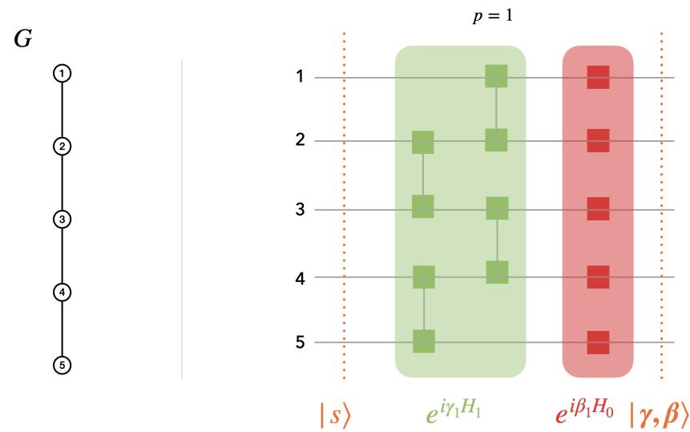  
Figure 2.7: On the left the example of a graph $G$ on which we solve MaxCut via QAOA. On the right a QAOA circuit for $p = 1$ applied to $G$ where the two qubits gates (in green) are $e ^ { - i \gamma _ { 1 } O _ { e } }$ for each edge $e$ and the single qubit gate (in red) are $e ^ { - i \beta _ { 1 } \sigma _ { x } ^ { ( i ) } }$ for each node $i$ .

In practice to run a QAOA, we need to choose a starting state $| s \rangle$ and a target function on which optimizing the parameters. Let us call $\mid \gamma , \beta \rangle$ the final state of a QAOA circuit with $p$ layers, i.e. $| \gamma , \beta \rangle = U _ { Q A O A _ { p } } ( \gamma , \beta ) | s \rangle$ . We know that in the limit of an infinite large $p$ , $U _ { Q A O A _ { p } } ( \gamma , \beta )$ can produce an adiabatic transformation of the starting state. So to keep the guarantee that the final state will converge toward a superposition of the optimal states $| x ^ { * } \rangle$ , solutions of the MaxCut problem on $G$ , the starting state is the same as in QA, meaning the ground-state of $H _ { 0 }$ , the uniform superposition of all possible states:

$$
| s \rangle = | \psi _ { 0 } \rangle = { \frac { 1 } { \sqrt { 2 ^ { n } } } } \sum _ { x \in \{ 0 , 1 \} ^ { n } } | x \rangle
$$

For finite $p$ , the guarantee does not hold anymore, and the final state is a complex superposition. Complex in the sense that even for $p = 1$ , it has been shown that under some complexity assumptions $\mathsf { P o s t B P P } \neq \mathsf { P o s t B Q P } )$ ), finding the final probability of a given computational state classically is “Hard” [Farhi $\&$ Harrow 2019]. The chosen target function, like in the case of finite time QA, is the expected output cost value, i.e. F $\mathsf { \Pi } _ { p } ^ { \prime } ( \gamma , \beta ) = \mathbb { E } _ { x \sim Q A O A _ { p } } [ C ( x ) ] = \langle \gamma , \beta | H _ { 1 } | \gamma , \beta \rangle$ , where $C$ is the classical cost function of MaxCut defined in Section 2.2.2. Let us look at how it simplifies for $p = 1$ . By linearity of the expectation,

$$
\begin{array} { r l } {  { F _ { 1 } ( \gamma , \beta ) = \sum _ { e \in E } \langle \gamma , \beta | O _ { e } | \gamma , \beta \rangle } } \\ & { = \displaystyle \sum _ { e \in E } \langle s | e ^ { i \gamma _ { 1 } H _ { 1 } } e ^ { i \beta _ { 1 } H _ { 0 } } O _ { e } e ^ { - i \beta _ { 1 } H _ { 0 } } e ^ { - i \gamma _ { 1 } H _ { 1 } } | s \rangle } \end{array}
$$

To simplify the formula we will use the following result. Given two observables $O _ { X }$ and $O _ { Y }$ supported on qubits in set $X$ and $Y$ respectively, we have that $e ^ { i O _ { Y } } O _ { X } e ^ { - i O _ { Y } } \ = \ O _ { X }$ as long as the observables commute. When the observables do not share their support, i.e. $X \ \cap \ Y \ = \ \varnothing$ , it is easy to see that they commute. Using this with the expressions of the gates of Eq. (2.7), we see that for each summand, many terms cancel out ending in $\begin{array} { r } { \langle s | \prod _ { X \sim e } e ^ { i \gamma _ { 1 } O _ { X } } e ^ { i \beta _ { 1 } ( \sigma _ { x } ^ { ( a ) } + \sigma _ { x } ^ { ( b ) } ) } O _ { e } e ^ { - i \beta _ { 1 } ( \sigma _ { x } ^ { ( a ) } + \sigma _ { x } ^ { ( b ) } ) } \prod _ { X \sim e } e ^ { - i \gamma _ { 1 } O _ { X } } | s \rangle } \end{array}$ with edge $e = ( a , b )$ and $X \sim e$ meaning that the product is over every edges $X \in E$ that share a common node with $e$ (see Fig. 2.8). Therefore, for a given edge $e$ , the term only depends upon the structure at distance one from $e$ . Using a similar reasoning for any $p$ , we can show that the term will depends on the neighboring structure up to distance $p$ from $e$ .

Knowing this property of QAOA circuit at finite $p$ , the rest of the reasoning to show the achieved approximation ratio for MaxCut over regular graphs is decomposed in a combinatorial argument followed by an optimization of the parameters $( \gamma , \beta )$ . Indeed, a nice property of regular graphs is the finite number of local structures around a given edge. So, for a fixed degree, there is only a finite number of different terms in Eq. (2.9). This is how the authors of the original paper [Farhi et al. 2014] show the 0.6925 approximation ratio for cubic graphs. We intentionally stay quite blurry on this final step as we will follow a similar reasoning to prove our bound on the QA framework, so all details will be given later (see Part II). The main property of QAOA allowing for this straightforward proof is its locality.

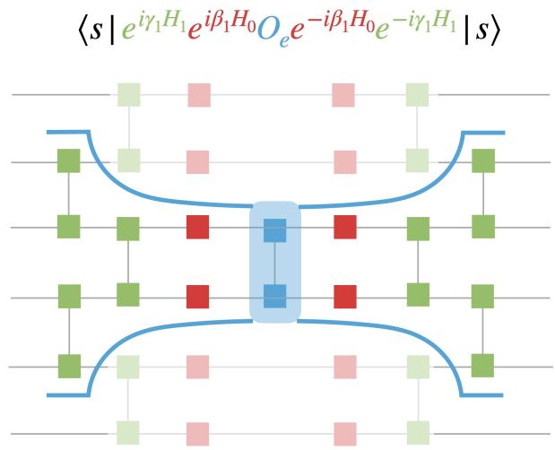  
Figure 2.8: Schematic view of a term in the sum of Eq. (2.9) and how the different terms cancel each other. Two boxes of same colors in row is equal to the identity.

# 2.3.2 Classical local algorithms

In the section, we review the best known classical local algorithms for MaxCut. In short, for local algorithms on graphs used in distributed computing, “the output of a node in a local algorithm is a function of the input available within a constant-radius neighborhood of the vertex” (by [Suomela 2013], Suomela’s survey on local algorithms). Here we talk about an algorithm called the threshold algorithm [Hirvonen et al. 2017]. For simplicity of the analysis, the original paper restricts the input graphs to triangle-free instances. The algorithm works in one round: each node of the input graph $G$ receives a random variable in $\{ - 1 , + 1 \}$ , then if the value of a node agrees with too many of its neighbors’ value, it changes its own variable. “Agree” means that they have the same initial value and “too many” is relative to a given threshold $\tau$ , a hyper-parameter that is fixed before running the algorithm. Formally, if $u _ { i } \in \{ - 1 , + 1 \}$ is the initial value of node $u$ , the final value $\boldsymbol { u } _ { f }$ is given by :

$$
u _ { f } = { \left\{ \begin{array} { l l } { - u _ { i } { \mathrm { ~ i f ~ } } | \{ v , v \sim u { \mathrm { ~ a n d ~ } } v _ { i } = u _ { i } \} | \geq \tau } \\ { u _ { i } { \mathrm { ~ o t h e r w i s e . } } } \end{array} \right. }
$$

where $v \sim u$ means that $\langle u , v \rangle$ is an edge of $G$ . The authors proved that it approximates MaxCut on cubic graphs with a ratio of 0.6875.

This algorithm has been relaxed to increase its performance [Hastings 2019]. Let $v _ { 0 } \in [ - 1 , 1 ] ^ { n }$ be the vector of the initial value for each node, i.e. node $i$ has value $( { \pmb v _ { 0 } } ) _ { i }$ . This vector is transformed into a vector $\mathbf { v _ { 1 } }$ according to the following equation:

$$
{ \pmb v } _ { 1 } = { \pmb v } _ { 0 } - c J . { \pmb v } _ { 0 }
$$

where $J$ is the adjacency matrix of the input graph $G$ . The output bi-partition is given by the sign of the final vector $\mathbf { v _ { 1 } }$ for each node. By choosing $c = 0 . 6$ , Hastings numerically shows that it achieves an approximation ratio of 0.6980 for MaxCut over cubic graphs. Even though it is only a numerical argument, the author adds “it would also likely not be difficult to prove the performance of the classical algorithm rigorously”. It is believed that this value can be proved and we will take it as if it were. This value, obtained by a Monte Carlo sampling over $1 0 ^ { 8 }$ different graphs is also believed to be tight, like in the QAOA case, i.e. there are input graphs for which it achieves this value.

Remark. To understand how the Hastings algorithm is a relaxed version of the threshold algorithm, we can see that in the discrete case where ${ \pmb v _ { 0 } }$ is sampled from $\{ - 1 , + 1 \} ^ { n }$ and the same above update rule is used, the new value of a node $i$ is equal to:

$$
( \pmb { v _ { 1 } } ) _ { i } = ( \pmb { v _ { 0 } } ) _ { i \cdot } ( 1 - c ( 2 m - d ) )
$$

where $d$ is the degree of the graph, so $d \ : = \ : 3$ in the cubic case, and $m$ is the number of $i$ ’s neighbors that agree with $i$ . Therefore, the new value changes sign if $c ( 2 m - d ) \geq 1$ , i.e. if $m$ is large enough. This large enough $m$ is the threshold.

This new algorithm is strictly local like QAOA and achieves a better performance than the quantum algorithm. Apparently, local quantum algorithms bring no speedup upon the classical ones. In the next section, we review some other result about the MaxCut problem and sum up the known approximation value for cubic graphs.

# 2.3.3 Overview of few results

The MaxCut problem is known to be NP-hard even for regular cubic graphs [Alimonti & Kann 2000]. More precisely, it is NP-hard to approximate this problem up to some threshold. For arbitrary graphs, the best known algorithm is a semi-definite programming algorithm introduced by Goemans and Williamson [Goemans & Williamson 1995] and guarantees a 0.87856 approximation. Moreover, under the assumption of Unique Games Conjecture (UGC), the authors of [Khot et al. 2007] proved that for arbitrary graphs, it is NP-hard to approximate MaxCut above the Goemans-Williamson value of 0.87856. Assuming $P \neq N P$ , the hardness of approximability is of $1 6 / 1 7 \simeq 0 . 9 4 .$ .. [Håstad 2001]. When restricted to cubic graphs, or maximum degree bounded by 3, the hardness of approximability increases to 0.997 [Berman & Karpinski 1999] while the best known algorithm achieves an approximation ratio of 0.9326 [Halperin et al. 2002]. All of these classical algorithms run in polynomial time with respect to the input size. In Fig. 2.9, we sum up the known approximation values in different regimes.

Focusing on constant time algorithms, we have local algorithms as the one reviewed in the previous section. Basically, each node of the graph receives a random bit and updates it according to some information about its neighbors’ bits. If we limit the number of update rounds to $p$ , we call it a $p -$ local algorithm. This approach runs in constant time only if the graph is regular so that the number of neighbors does not depend on the input size. With this method, the best classical algorithm achieves a ratio of 0.6980 MaxCut over cubic graphs [Hastings 2019, Marwaha 2021] (see Sec. 2.3.2). It is easy to see that a random attribution of colors to the nodes gives a 0.5 approximation ratio.

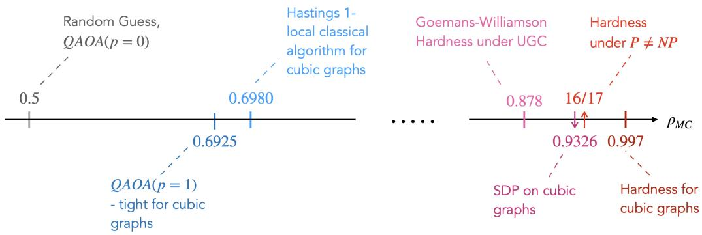  
Figure 2.9: Sum up of the known approximation results and hardness value for MaxCut in general and in cubic graphs as well as the approximation ratios reach by local algorithm that run in constant time.

In the quantum framework, there are no known polynomial time approximation algorithms for combinatorial problems. If we restrict to constant time algorithms, we have the QAOA that we reviewed in Sec. 2.3.1 and its circuit depth is parametrized with $p$ . With $p = 0$ , it achieves the trivial value of 0.5 and with $p = 1$ it reaches a ratio of 0.6925 for MaxCut over cubic graph [Farhi et al. 2014]. This algorithm, by its construction, is a $p -$ local algorithm. In the intermediate time scale, there are no proven results in polynomial depth, however, in logarithmic depth, the authors of [Farhi et al. 2020] proved that QAOA does not perform well even on random regular bipartite graphs.

In the QA setting, there was no known result apart from the adiabatic theorem that guarantees the optimal solution in exponentially long runtime. In [Moosavian et al. 2022], using Lieb-Robinson techniques (see Sec. 2.5), it was proved similar results to QAOA in the logarithmic time regime, i.e. QA with less than logarithmic time does not perform well, the approximation ratio for some regular bipartite graphs is upper bounded by a value below the Goemans-Williamson. In order to provide analytical proofs of the computational complexity in the AQC regime, the main theoretical tool remains the adiabatic theorem. The validity of this theorem is ruled by the minimum gap $\Delta _ { \mathrm { m i n } }$ amplitude. It happens that two physical phenomena can give rise to exponentially small $\Delta _ { \mathrm { m i n } }$ : first-order quantum phase transition [Sachdev 1999] and Anderson localization [Anderson 1958]. These two phenomenons, when associated with exponentially closing gaps, have a typical signature when looking at the behavior of the eigen-energies during a quantum evolution and it is called “Anti-crossings” or “Avoided level-crossing” and sometimes “level repulsion”. This behavior is the subject of the next section.

# 2.4 Avoided level crossings (AC)

In this section, we discuss the literature around the ACs behavior as they are related to exponentially closing gaps. The early motivations behind the study of AC were the validity conditions of applicability of the adiabatic theorem [von Neumann & Wigner 1929, Wilkinson 1987, Wilkinson 1989]. Then with the rise of quantum annealing [de Falco et al. 1988] and adiabatic quantum computing [Farhi et al. 2000], proving their occurrences in a quantum evolution is a method to prove the inefficiency of AQC [Altshuler et al. 2010]. Inversely, proving that no such behavior occurs guarantee the efficiency of AQC [Braida et al. 2024a]. Also, knowing the time at which they occur during the evolution can still help to prove some quantum advantage [Roland & Cerf 2002, Amin & Choi 2009, Dalzell et al. 2023] as it allows to tune the schedule accordingly. The key technical tool to study avoided level-crossings is the perturbation theory, so we explain the general idea of the method and derive the main results as well as the original description. Both of them will be useful in this thesis.

# 2.4.1 Perturbation theory

General setting: In general, the perturbative analysis is used to study the effect a perturbation has on a system well-defined without this perturbation. For example, given two Hermitian matrices $A$ and $B$ , we know an eigen-pair $( x , \lambda )$ of $A$ , i.e. $A x = \lambda x$ and we are interested in how a perturbation $B$ will change this state. In other words, if $( x , \lambda )$ represents the $k ^ { t h }$ eigen-pair of $A$ , we are interested in the $k ^ { t h }$ eigen-pair $( x _ { \mu } , \lambda _ { \mu } )$ of $A + \mu B$ for a small parameter $\mu$ . We suppose then that there exists a polynomial expansion in $\mu$ computing $( x _ { \mu } , \lambda _ { \mu } )$ . We write these expansions as:

$$
\begin{array} { c } { { x _ { \mu } = x + x ^ { ( 1 ) } \mu + x ^ { ( 2 ) } \mu ^ { 2 } + x ^ { ( 3 ) } \mu ^ { 3 } + . . . } } \\ { { \lambda _ { \mu } = \lambda + \lambda ^ { ( 1 ) } \mu + \lambda ^ { ( 2 ) } \mu ^ { 2 } + \lambda ^ { ( 3 ) } \mu ^ { 3 } + . . . } } \end{array}
$$

where $x ^ { ( i ) }$ and $\lambda ^ { ( i ) }$ represent the different coefficients of the polynomial expansion being respectively vectors and scalars. In practice, to be able to say something interesting, we stop the expansion at some order $i$ . The validation of the truncation is justified by the ratio of the $( i + 1 ) ^ { t h }$ term over the $i ^ { t h }$ being small.

The different coefficients are derived iteratively by identification in the eigenrelation of the perturbed matrices. Namely, we identify each term in $\mu ^ { j }$ in the relation $( A + \mu B ) x _ { \mu } = \lambda _ { \mu } x _ { \mu }$ . Finally, the obtained relations for each order in $\mu$ are vector equations. After choosing a right basis for the entire space (usually the eigen-vectors of $A$ ), we project along the different basis vectors each relation. Projecting along $x$ gives the $\lambda ^ { ( i ) }$ terms and along others basis vectors gives the different coordinates of the vector $\boldsymbol { x } ^ { ( i ) }$ .

Application to quantum mechanics: We now apply the perturbative analysis to studying quantum system. For a full course on perturbation theory in quantum mechanics, we refer the reader to the MIT lecture notes [Zwiebach 2018].

Let $H$ be an Hamiltonian from which we have the full knowledge of its dynamics, meaning we know the whole spectrum respecting $H | n \rangle = E _ { n } | n \rangle$ for the $n ^ { t h }$ state. We assume that the states are normalized, i.e. $\langle n | n \rangle = 1$ . We are interested in the behavior of the eigen-energy and eigen-vector corresponding to the $n ^ { t h }$ eigen-state under the perturbation $\lambda V$ for a small parameter $\lambda$ and an Hamiltonian $V$ . In other words, we are looking for $E _ { n } ( \lambda )$ and $\left| n _ { \lambda } \right.$ solution of $\hat { H } _ { \lambda } | n _ { \lambda } \rangle = E _ { n } ( \lambda ) | n _ { \lambda } \rangle$ where $\hat { H } _ { \lambda } = H + \lambda V$ . Like presented above, we suppose that the eigen-energy and vector have an expansion in $\lambda$ and we identify the different terms in the eigen-relation

$$
( H + \lambda V ) ( | n \rangle + \lambda | n ^ { ( 1 ) } \rangle + . . . ) = ( E _ { n } + \lambda E _ { n } ^ { ( 1 ) } + . . . ) ( | n \rangle + \lambda | n ^ { ( 1 ) } \rangle + . . . )
$$

Thus, by identification of the $\lambda ^ { j }$ terms, we have the following relations:

$\begin{array} { r } { \lambda ^ { \cup } \colon H | n \rangle = E _ { n } | n \rangle } \end{array}$ , already known,

$$
\begin{array} { r l } & { \lambda ^ { 1 } \colon H | n ^ { ( 1 ) } \rangle + V | n \rangle = E _ { n } | n ^ { ( 1 ) } \rangle + E _ { n } ^ { ( 1 ) } | n \rangle } \\ & { \lambda ^ { 2 } \colon H | n ^ { ( 2 ) } \rangle + V | n ^ { ( 1 ) } \rangle = E _ { n } | n ^ { ( 2 ) } \rangle + E _ { n } ^ { ( 1 ) } | n ^ { ( 1 ) } \rangle + E _ { n } ^ { ( 2 ) } | n \rangle } \\ & { \vdots } \end{array}
$$

Then we project those relations onto vector $| n \rangle$ to get the energy corrections:

The last term can be canceled because the expanded state is not assumed to be normalized and the following claim is true.

Claim. For $i \geq 1$ , we can assume that vectors $| n ^ { ( i ) } \rangle$ have no component against $| n \rangle$

Proof. Let us fix an $i \geq 1$ and suppose $| n ^ { ( i ) } \rangle$ has a component in $| n \rangle$ , so we can write:

$$
| n ^ { ( i ) } \rangle = | n ^ { ( i ) } \rangle _ { \bot } + \alpha _ { i } | n \rangle
$$

where $| n ^ { ( i ) } \rangle _ { \perp }$ is a vector orthogonal to $| n \rangle$ . The expanded state $\left| n _ { \lambda } \right.$ can now be written like:

$$
| n _ { \lambda } \rangle = ( 1 + \alpha _ { 1 } \lambda + \alpha _ { 2 } \lambda ^ { 2 } + . . . ) | n \rangle + \lambda | n ^ { ( 1 ) } \rangle _ { \bot } + \lambda ^ { 2 } | n ^ { ( 2 ) } \rangle _ { \bot } + . . .
$$

So this eigenstate will still be an eigenstate of $\hat { H } _ { \lambda }$ if we divide it by the coefficient in front of $| n \rangle$ . We call the latter state $| n _ { \lambda } \rangle ^ { \prime }$ and has the following expansion:

$$
| n _ { \lambda } \rangle ^ { \prime } = | n \rangle + \lambda | n ^ { ( 1 ) } \rangle _ { \perp } ^ { \prime } + \lambda ^ { 2 } | n ^ { ( 2 ) } \rangle _ { \perp } ^ { \prime } + . . .
$$

To get the first correction orders of the state, we project onto another basis state $| m \rangle$ to obtain the different coordinates:

$$
\langle m | n ^ { ( 2 ) } \rangle = \frac { 1 } { E _ { n } - E _ { m } } ( \langle m | V | n ^ { ( 1 ) } \rangle - E _ { n } ^ { ( 1 ) } \langle m | n ^ { ( 1 ) } \rangle )
$$

To develop an intuition of these expressions, we will see in Sec. 2.4.3 that they have been used to study the behaviors of the eigen-energies $E _ { 0 } ( s )$ and $E _ { 1 } ( s )$ at the end of a QA evolution. These latter anti-crossings are called perturbative crossings. Before that, we present in the next section the original description of an AC.

# 2.4.2 Initial description of an Anti-crossing

The goal is to retrieve, in our setting, the first results about AC given by [von Neumann $\&$ Wigner 1929] right after the first version of the adiabatic theorem [Born & Fock 1928] and later by [Wilkinson 1989].

For two Hamiltonians $A$ and $B$ , let $H ( s )$ be a Hamiltonian with parameter $s \in [ 0 , 1 ]$ of the form $( 1 - s ) A + s B$ . We note that we are in a more general setting as the standard $A + \mu B$ . Let $( | \phi _ { j } ( s ) \rangle , E _ { j } ( s ) )$ be the pairs of instantaneous eigenvector/eigen-values. We suppose that the eigen-values are ordered with $E _ { 0 } ( s )$ the smallest one.

Suppose that for a specific value of $s = s ^ { * }$ , the gap $\Delta _ { 0 1 } ( s ) = E _ { 1 } ( s ) - E _ { 0 } ( s )$ is minimal, i.e. ${ \Delta _ { \mathrm { 0 1 } } ( s ^ { * } ) = \Delta _ { \mathrm { m i n } } }$ and the value of $E _ { 0 } ( s ^ { * } )$ and $E _ { 1 } ( s ^ { * } )$ are extremely close. At $s ^ { * }$ , $H ( s ^ { * } )$ is diagonal in the eigen basis span by $( | \phi _ { 0 } ^ { * } \rangle , | \phi _ { 1 } ^ { * } \rangle , . . . )$ where we removed the dependency in $s ^ { * }$ and just added a star for clarity. The total Hamiltonian can be written like $H ( s ) = H ( s ^ { * } ) + ( s - s ^ { * } ) { \dot { H } }$ . Here, ${ \dot { H } } = B - A$ is the derivative of $H ( s )$ with respect to $s$ . This basis will be our working basis and the diagonal values of $H ( s ^ { * } )$ are the eigen-energies $( E _ { 0 } ^ { * } , E _ { 1 } ^ { * } , \ldots )$ and will be called the star basis.

$$
H ( s ^ { * } ) = \left( \begin{array} { c c c } { { E _ { 0 } ^ { * } } } & { { 0 } } & { { ( { \bf 0 } ) } } \\ { { 0 } } & { { E _ { 1 } ^ { * } } } & { { } } \\ { { ( { \bf 0 } ) } } & { { } } & { { \ddots } } \end{array} \right)
$$

where (0) means that the upper and lower parts are filled with zeros. We are interested the behavior of the energies $E _ { 0 } ( s )$ and $E _ { 1 } ( s )$ around $s = s ^ { * }$ when $H ( s ^ { * } )$ is perturbed by the Hamiltonian $\delta _ { s } \dot { H }$ for a small variation $\delta _ { s } = s - s ^ { * }$ . Let us call ${ { H } _ { { \delta } _ { s } } } =$ $H ( s ^ { * } + \delta _ { s } ) = H ( s ^ { * } ) + \delta _ { s } \dot { H }$ . In [von Neumann $\&$ Wigner 1929, Wilkinson 1989], the authors explains that at first order, in the star basis, this Hamiltonian has the following structure:

$$
H _ { \delta _ { s } } = \left( \frac { E _ { 0 , \delta _ { s } } } { b ^ { \dagger } } \quad E _ { 1 , \delta _ { s } } \quad \left| \begin{array} { c } { \mathbf { \sigma } ( \mathbf { 0 } ) } \\ { R } \end{array} \right. \right)
$$

where $R$ denotes the square matrix for the remaining Hilbert space. Importantly, we note that all matrix elements $\langle \phi _ { j } ^ { * } | H _ { \delta _ { s } } | \phi _ { i } ^ { * } \rangle = 0$ for $j \in \{ 0 , 1 \}$ and $i \geq 2$ . In Chapter 3, we provide a rigorous proof of this statement in the demonstration of Theorem 3.1

as it does not appear in the original work. There are three last terms to explicitly describe the behavior around the crossing point $s ^ { * }$ . It is straightforward to see that

$$
\begin{array} { r l r } & { } & { E _ { 0 , \delta _ { s } } = \langle \phi _ { 0 } ^ { * } | H _ { \delta _ { s } } | \phi _ { 0 } ^ { * } \rangle = E _ { 0 } ^ { * } + \delta _ { s } \dot { H } _ { 0 0 } } \\ & { } & { E _ { 1 , \delta _ { s } } = \langle \phi _ { 1 } ^ { * } | H _ { \delta _ { s } } | \phi _ { 1 } ^ { * } \rangle = E _ { 1 } ^ { * } + \delta _ { s } \dot { H } _ { 1 1 } } \\ & { } & { b = \langle \phi _ { 0 } ^ { * } | H _ { \delta _ { s } } | \phi _ { 1 } ^ { * } \rangle = \delta _ { s } \dot { H } _ { 0 1 } ~ } \end{array}
$$

where we introduced the matrix element $\begin{array} { r } { \dot { H } _ { i j } = \langle \phi _ { i } ^ { * } | \dot { H } | \phi _ { j } ^ { * } \rangle } \end{array}$ . In Proposition 3.1, we also prove that $\dot { H } _ { 0 0 } = \dot { H } _ { 1 1 }$ at a crossing point. Solving the diagonalization of the two by two upper matrix yields the energy expressions:

$$
E _ { \delta _ { s } } ^ { \pm } = \frac { E _ { 0 } ^ { * } + E _ { 1 } ^ { * } } { 2 } + \dot { H } _ { 0 0 } \delta _ { s } \pm \frac { \Delta _ { m i n } } { 2 } \sqrt { 1 + \left( \frac { 2 \dot { H } _ { 0 1 } } { \Delta _ { m i n } } \delta _ { s } \right) ^ { 2 } }
$$

These expressions are the first mathematical description of the eigen-energies’ shape undergoing an anti-crossing. On Fig. 2.10, we draw the well-known plot of the energy behaviors around the crossing point, they take the shape of two hyperbola branches.

To close the loop, let us discuss about the different expressions we have for the approximation of the eigen-energies around the crossing point. Indeed, in this section we exploited a related but different perturbation theory, namely we reduced the problem to a $2 \times 2$ matrix and diagonalized the system. In Section 2.4.1, we presented a generic perturbation theory. Using the latter, we remark that the $E _ { j , \delta _ { s } }$ ’s expressions are the first order approximation of $E _ { j } ( s )$ around $s ^ { * }$ . How Eq.(2.10) is equivalent to the generic perturbation theory? Developing the square root like ${ \sqrt { 1 + x ^ { 2 } } } \simeq 1 + { \textstyle { \frac { 1 } { 2 } } } x ^ { 2 }$ , under the condition of 2H˙ 01∆ δs ≪ 1, yields an expression up the second order:

$$
E _ { \delta _ { s } } ^ { \pm } \simeq E _ { 0 , 1 } ^ { * } + \dot { H } _ { 0 0 } \delta _ { s } \pm \frac { \dot { H } _ { 0 1 } ^ { 2 } } { \Delta _ { m i n } } \delta _ { s } ^ { 2 }
$$

which is consistent with the second order generic perturbative expansion.

Now that the general idea of the AC phenomenon has been described properly, let us move on its application in quantum computing.

# 2.4.3 Perturbative crossings

In this section, we review the AC happening at the end of a QA or AQC evolution called perturbative crossings. There are usually attributed to the Anderson Localization effect as close to the end, the Hamiltonian $H ( s )$ is close to the final one $H _ { 1 }$ . In few words, this effect tends to localized the system in computational states (eigen-states of $H _ { 1 }$ ) and if it localized in the “wrong” energy level, the gap shrinks as ${ \mathcal { O } } ( b ^ { h } )$ for some $b < 1$ and $h$ the Hamming distance between the state where it localized and the right energy level state. Informally, let say that the ground-state of the system localized in state $y = 1 1 1 0 0 0$ and the true ground-state of the final

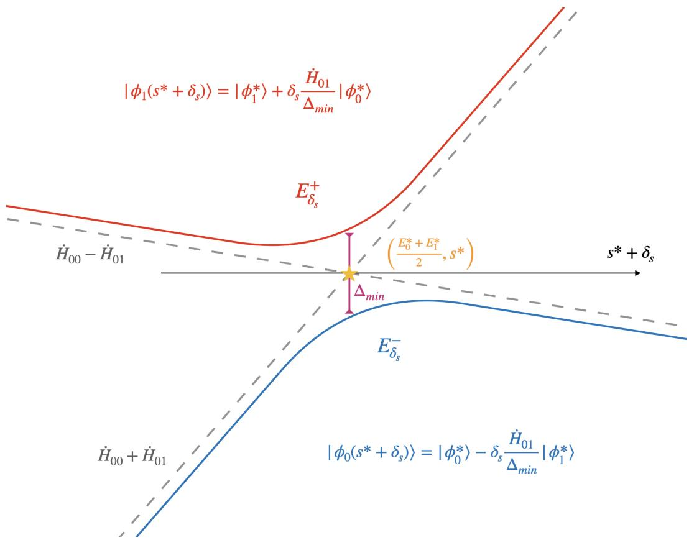  
Figure 2.10: Plot of the energy shapes around the anti-crossings. Two branches of hyperbolas respecting Eq. (2.10). The orange star is the non-crossing point. In grey, the values of the asymptote slopes. The first order expansion of the associated eigen-states.

Hamiltonian is $x ^ { * } = 0 0 0 1 1 1$ , then it has to move from $y$ to $x ^ { * }$ through all states in the path that links $y$ and $x ^ { * }$ in $H _ { 0 }$ . So if $H _ { 0 }$ is the bit-flip mixing operator, then the distance is the Hamming distance between $x ^ { * }$ and $y$ . It results in a gap that closes exponentially fast with the system size. We will see a more detailed example in Chapter 3 and Appendix A.

The approach to show the occurrence of a perturbative crossing is to study the final Hamiltonian $H _ { 1 }$ perturbed by the initial $H _ { 0 }$ , i.e. the study of $\bar { H } ( \lambda ) =$ $H _ { 1 } + \lambda H _ { 0 }$ . Without choosing a specific final Hamiltonian, we call $| \mathsf { G S } \rangle = | \phi _ { 0 } ( 1 ) \rangle$ and $| \mathsf { F S } \rangle = | \phi _ { 1 } ( 1 ) \rangle$ the ground-state and first excited state of $H _ { 1 }$ of energy $E _ { g s }$ and $E _ { f s }$ respectively. Looking at the behaviors of $E _ { 0 , \lambda }$ and $E _ { 1 , \lambda }$ being respectively the perturbed expansion in $\lambda$ of $E _ { 0 } ( 1 ) = E _ { g s }$ and $E _ { 1 } ( 1 ) = E _ { f s }$ , can point out a real crossing of the perturbed expansion arising from an avoided crossing (see Fig.2.11)

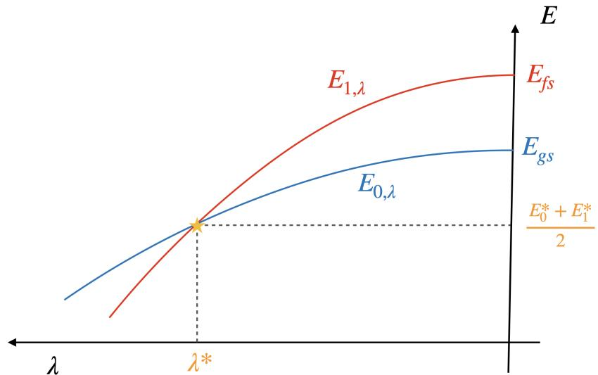  
Figure 2.11: Schematic plot of a perturbative crossings. The perturbed expansions $E _ { 0 , \lambda }$ and $E _ { 1 , \lambda }$ cross at $\lambda ^ { * }$ . For the plot, we stop at the second-order perturbation making the curves quadratic in $\lambda$ .

In [Altshuler et al. 2010], the authors applied this method on the Exact Cover problem. This problem is NP-Hard and the encoded-problem Hamiltonian $H _ { 1 }$ has a similar structure to the ones of Section 2.2.1. They expressed the eigen-values of $H ( \lambda )$ , $E _ { 0 , \lambda }$ and $E _ { 1 , \lambda }$ as an expansion in $\lambda$ :

$$
E _ { j , \lambda } = E _ { j } ( 1 ) + \sum _ { q = 1 } ^ { \infty } \lambda ^ { q } E _ { j } ^ { ( q ) } , \quad j \in [ 0 , 1 ]
$$

and studied the behavior of these factors $E _ { j } ^ { ( q ) }$ to conclude on the presence of a strong anti-crossing when AQC is used to solve Exact Cover. The difficulty when using perturbative theory is to prove the validity of the expansion. This means that if the expansion can be stopped at any finite order as long as the next term is negligeable compared to the previous one. In this latter work, the authors carefully bound the tail of the expansion allowing them to conclude on the theoretical implication of their result, i.e. AQC fails at solving Exact Cover, it gets stuck in a local minimum.

This type of perturbative crossing has also been highlighted in [Amin & Choi 2009] as a first-order quantum phase transition. It is said that this transition happens between two ordered phases only after localization. Is it the same thing as Anderson localization (AL)? How first-order phase transition and AL are related? We leave these questions to physicists. In any case, Amin and Choi used a perturbative expansion up to second order to point out the occurrence of an AC on a specific instance of the MIS problem. The condition for this expansion to hold is satisfied in their example. To understand the necessity of the second-order derivation, let us see the expressions of the eigen-values. Using the same perturbation and the formula of Section 2.4.1, we get:

$$
\begin{array} { l } { E _ { 0 , \lambda } = E _ { g s } + \lambda \underbrace { \langle \mathsf { G S } \mathsf { S } | H _ { 0 } | \mathsf { G S } \rangle } _ { \displaystyle \lambda \neq \mathsf { G S } } - \lambda ^ { 2 } \underbrace { \sum _ { x \neq \mathsf { G S } } \frac { | \langle \mathsf { G S } | H _ { 0 } | x \rangle | ^ { 2 } } { E _ { x } - E _ { g s } } } _ { \displaystyle \lambda \neq \mathsf { G S } } } \\ { E _ { 1 , \lambda } = E _ { f s } + \lambda \underbrace { \langle \mathsf { F S } | H _ { 0 } | \mathsf { F S } \rangle } _ { \displaystyle \lambda \neq \mathsf { F S } } - \lambda ^ { 2 } \underbrace { \sum _ { x \neq \mathsf { G S } } \frac { | \langle \mathsf { F S } | H _ { 0 } | x \rangle | ^ { 2 } } { E _ { x } - E _ { f s } } } _ { \displaystyle \lambda _ { x } + \mathsf { F } } } \end{array}
$$

where we abusively used the notation GS to represent the ground-state bit-string and for a bit-string $x$ , we note $E _ { x }$ the energy of state $| x \rangle$ . We observe that the first-order term vanishes because $\langle x | H _ { 0 } | y \rangle \neq 0$ only when $x$ and $y$ differ by exactly one bit. Therefore, the curves cross if the $\lambda ^ { 2 }$ coefficient of the first excited state is larger in norm than the coefficient of the ground-state, i.e:

$$
\sum _ { x \sim \mathsf { F S } } \frac { 1 } { E _ { x } - E _ { f s } } > \sum _ { x \sim \mathsf { G S } } \frac { 1 } { E _ { x } - E _ { g s } }
$$

The two sums have the same number of terms, so the inequality is satisfied if FS has lower energy neighbors than GS. This idea leads the author of [Choi 2020] to propose the “LENS” property, meaning “Low-Energy Neighboring State”. Using this insight the author suggested a new characterization of an anti-crossing that we present in the next section. Although the perturbative approach seems conclusive in some cases, one can not conclude in the absence of an AC during the evolution if not found by the perturbative method. Indeed, from [Laumann et al. 2015], we know that they can happen at any time. This is why V. Choi suggested a more general definition for an AC at any time in the annealing process.

# 2.4.4 Choi’s crossing definition

In this section, we review a new description of an avoided crossing in a QA process suggested in [Choi 2020] to tackle anti-crossings at any time in the evolution. From the states $| \phi _ { k } ( 1 ) \rangle$ which can be degenerated and represent the states at the $k ^ { t h }$ energy level, V. Choi introduces the following quantities:

$$
\begin{array} { r } { a _ { k } ( s ) = \vert \langle \phi _ { k } ( 1 ) \vert \phi _ { 0 } ( s ) \rangle \vert ^ { 2 } } \\ { b _ { k } ( s ) = \vert \langle \phi _ { k } ( 1 ) \vert \phi _ { 1 } ( s ) \rangle \vert ^ { 2 } } \end{array}
$$

They are the decomposition in the possible degenerated computational basis of the instantaneous eigenvectors corresponding to the two lowest eigenvalues. Especially, with $k = 0 , 1$ , we have $a _ { 0 } ( s )$ and $a _ { 1 } ( s )$ representing respectively how much of the final ground-state $| \phi _ { 0 } ( 1 ) \rangle = | \mathsf { G S } \rangle$ and the final first excited state $\vert \phi _ { 1 } ( 1 ) \rangle = \vert \mathsf { F S } \rangle$ overlaps with the instantaneous ground-state $| \phi _ { 0 } ( s ) \rangle$ , i.e. $a _ { 0 } ( s )$ is the probability of finding $| \mathsf { G S } \rangle$ in $| \phi _ { 0 } ( s ) \rangle$ . The same is true for $b _ { 0 } ( s )$ and $b _ { 1 } ( s )$ with the instantaneous first excited state $| \phi _ { 1 } ( s ) \rangle$ . Let’s restate her definition of a $( \gamma , \varepsilon )$ -anti-crossing:

Definition 2.6. For $\gamma \geq 0$ , $\varepsilon \geq 0$ we say there is an $( \gamma , \varepsilon )$ -Anti-crossing if there exists a $\delta _ { s } > 0$ such that

1. For $s \in [ s ^ { * } - \delta _ { s } , s ^ { * } + \delta _ { s } ]$ ,

$$
\begin{array} { c } { { | \phi _ { 0 } ( s ) \rangle \simeq \sqrt { a _ { 0 } ( s ) } | G S \rangle + \sqrt { a _ { 1 } ( s ) } | F S \rangle } } \\ { { | \phi _ { 1 } ( s ) \rangle \simeq \sqrt { b _ { 0 } ( s ) } | G S \rangle - \sqrt { b _ { 1 } ( s ) } | F S \rangle } } \end{array}
$$

where $a _ { 0 } ( s ) + a _ { 1 } ( s ) \in [ 1 - \gamma , 1 ]$ , $b _ { 0 } ( s ) + b _ { 1 } ( s ) \in [ 1 - \gamma , 1 ]$ . Within the time interval $\left[ s ^ { * } - \delta _ { s } , s ^ { * } + \delta _ { s } \right]$ , both $| \phi _ { 0 } ( s ) \rangle$ and $E _ { 1 } ( s ) \rangle$ are mainly composed of $| G S \rangle$ and $| F S \rangle$ . That is, all other states (eigenstates of the problem Hamiltonian $H _ { 1 }$ ) are negligible (which sums up to at most $\gamma \geq 0$ ).

2. $A t$ the avoided crossing point $s \ = \ s ^ { * }$ , $a _ { 0 }$ , $a _ { 1 }$ , $b _ { 0 }$ , $b _ { 1 } \in [ 1 / 2 - \varepsilon , 1 / 2 + \varepsilon ]$ , for a small $\varepsilon > 0$ . That is, $| \phi _ { 0 } ( s ^ { * } ) \rangle \simeq 1 / \sqrt { 2 } ( | G S \rangle + | F S \rangle )$ and $\left| \phi _ { 1 } ( s ^ { * } ) \right. \simeq$ $1 / \sqrt { 2 } ( | G S \rangle - | F S \rangle )$ .

3. Within the time interval $\left[ s ^ { * } - \delta _ { s } , s ^ { * } + \delta _ { s } \right]$ , $a _ { 0 } ( s )$ increases from $\leq \gamma$ t $o \ge \left( 1 - \gamma \right)$ , while $a _ { 1 } ( s )$ decreases $f r o m \ge ( 1 - \gamma ) t o \le \gamma$ . The reverse is true for $b _ { 0 } ( s )$ , $b _ { 1 } ( s )$ .

This definition of an anti-crossing gives more insights toward the understanding of this physical phenomenon happening during an adiabatic evolution. Four new quantities, $a _ { 0 } ( s )$ , $a _ { 1 } ( s )$ and $b _ { 0 } ( s )$ , $b 1 ( s )$ , and two parameters $( \gamma , \varepsilon )$ are at stake here, to describe it. Definition 2.6 presents in a precise way how the quantities vary through the anti-crossing (see Fig.2.12) and implicitly suggests on the size of the parameters that the smaller they are, the stronger the anti-crossing will be. However, there is a missing result that directly links this definition of an anti-crossing to the min-gap. How the parameters $( \gamma , \varepsilon )$ influence the min-gap? In Chapter 3, we answer this question by providing a rigorous proof the the minimum gap expressed in terms of $a _ { k }$ and $b _ { k }$ .

In this section, we sorted out the literature around the avoided crossing phenomenon after a general introduction to the perturbative theory which is the main technical tool to study the ACs. The understanding of the AC is an active research area as it indicates the computational complexity of the problem we are dealing with. There are still no general approaches to qualify the phenomena apart from the exponentially closing gap at the crossing point. Furthermore, the presence of such AC allows to conclude on the exponential time complexity to solve the problem but does not give insights on the performance of a quantum evolution to approximate it. Can we still guarantee some performance of QA if one fixes the time away from the adiabatic regime? The other technical tool that is known to study a quantum evolution is the Lieb-Robinson bound.

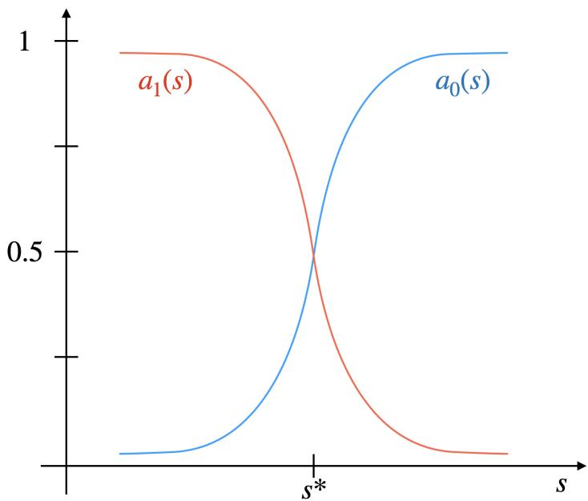  
Figure 2.12: Evolution of $a _ { 0 } ( s )$ and $a _ { 1 } ( s )$ around a $( \gamma , \varepsilon ) -$ anti-crossing point $s ^ { * }$ . The same goes for $b _ { 0 } ( s )$ and $b _ { 1 } ( s )$ but inverted so that $b _ { 1 } ( s )$ ends close to 1.

# 2.5 Lieb-Robinson bound

In this section, we present a result from theoretical physics that has numerous application in computer science. Informally, it states as follows.

Theorem 2.2 (Lieb-Robinson bound). There is an upper bound on the velocity $v _ { L R }$ at which information can propagate in a quantum system.

It has been first proved in [Lieb & Robinson 1972], but it is only after a generalization of a result in higher dimension in [Hastings 2004] that uses the LR bound, that Theorem 2.2 gained more and more attention.

# 2.5.1 Observation and intuition

Let us first develop the intuition and some observations that are useful to understand how we will use this bound. By Theorem 2.2, the finite velocity $v _ { L R }$ implies at finite time $T$ that the correlation of two distant subsystems is very small. Here the notion of distance is defined by the Hamiltonian connectivity acting on the quantum system. For simplicity, we suppose that the Hamiltonian $H _ { G }$ is $2 -$ local and the connectivity is described by a graph $G$ . So the distance is relative to $G$ . For instance, on a line graph, the qubits at the extremity of the line are weakly correlated for some time. On a general graph $G$ , the runtime required to correlate every qubits is of order $\frac { D } { v _ { L R } }$ , where $D$ is the diameter of the graph.

Another point of view of this result is to look at the evolution of an observable. If $| \psi _ { T } ^ { G } \rangle$ is a quantum system that evolved under $H _ { G }$ for time $T$ , the final expectation value of a local observable $O _ { X }$ supported on $X$ depends mainly on the neighboring configuration $\Omega$ of $X$ up to distance $p \simeq v _ { L R } T$ . This means that a quantum system that evolves under the Hamiltonian restricted to the subgraph $\Omega$ , noted $H _ { \Omega }$ produces a final expected value of the observable $O _ { X }$ very close to the one with the whole quantum system.

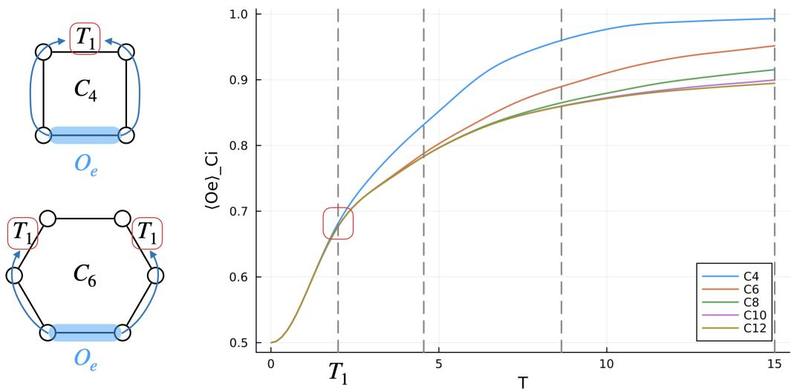  
Figure 2.13: On the right, the plot of the evolution of the expected edge $e$ energy for different size $l$ of cycle $C _ { l }$ . The dashed lines in light grey point out the splitting time when the remaining curve splits from the others with a difference less than 0.005. On the left, cycle of size 4 and 6 with the representation of the time evolution of the support of the evolved observable $O _ { e }$ up to time $T _ { 1 }$ , indicated by the red box.

To illustrate this phenomenon, let’s put ourselves in the QA framework to solve the MaxCut problem over even cycles, as defined previously in Section 2.2.2. We restrict the input graphs to even cycle of size . The total Hamiltonian is written $\begin{array} { r } { H ( C _ { l } , s ) = - ( 1 - s ) \sum _ { i } \sigma _ { x } ^ { ( i ) } - s \sum _ { e } O _ { e } } \end{array}$ l where for any edge $e = ( a , b )$ , the observable $O _ { e }$ encodes the MaxCut cost function, i.e. for a bit-string state $| x \rangle \in \{ 0 , 1 \} ^ { l }$ , $\langle x | O _ { e } | x \rangle = 1$ if and only if $x _ { a } \neq x _ { b }$ and 0 otherwise. The initial state $| \psi _ { 0 } \rangle$ of the evolution being the uniform superposition over all bit-strings of length $l$ , the initial expected value of the edge $e$ is $\langle \psi _ { 0 } | O _ { e } | \psi _ { 0 } \rangle = 0 . 5$ as there is the same amount of computational states that cut edge $e$ $( x _ { a } \neq x _ { b }$ ) and uncut it. After some time $T$ , the final expected value is $\langle { \cal O } _ { e } \rangle _ { C _ { l } } = \langle \psi _ { T } ^ { C _ { l } } | { \cal O } _ { e } | \psi _ { T } ^ { C _ { l } } \rangle$ . We note that in the limit of large $T$ , this latter value converges toward 1 as every edge $e$ can be cut in an even cycle, and the adiabatic theorem guarantees that the final state converges toward the optimal state $| x ^ { * } \rangle$ . On Fig. 2.13 we plotted the evolution of $\langle O _ { e } \rangle _ { C _ { l } }$ for different values of $l$ against the total runtime $T$ . We observe that all curves start at 0.5 as expected and then follow the same trajectory up to some time $T _ { 1 }$ where the value for $C _ { 4 }$ starts to increase toward 1 faster than all the others that continue on the same trajectory for a while. Then, we can see similar splitting point later between the smallest remaining cycle and the others. We can infer that until time $T _ { 1 }$ , $\langle O _ { e } \rangle _ { C _ { l } }$ remains independent of the cycle size. Consequently, the quantum evolution has the capability to differentiate between $C _ { 4 }$ and the other cycles. The underlying intuition drawn from this observation suggests that information must propagate around the cycle, and up to $T _ { 1 }$ , the finite velocity $v _ { L R }$ implies that examining a local observable does not provide sufficient information to distinguish among all cycles. The knowledge of the graph structure at this point is limited. At time $T _ { 1 }$ , edge $e$ of $C _ { 4 }$ starts to gain the knowledge that it is inside a cycle whereas the edge of the other cycle could potentially be in the middle of a long path. The drawings on the left of Fig. 2.13 try to convey this idea by showing that the edge $e$ is looking around him and information comes at a finite speed, so the longer you let the system evolves the further in the graph $e$ can “see”. The knowledge of belonging to an even cycle helps $e$ to take a better decision faster, and thus converges toward 1.

This illustration is only a toy example with an informal tone to communicate some intuition behind Theorem 2.2. In the next section we dive into the mathematical derivation of the bound.

# 2.5.2 Mathematical derivation

The original derivation of the LR bound is an upper bound on the norm of a commutator between an evolved local observable $A ( t )$ and a static one $B$ . It is assumed that the support $Y$ of $B$ and the support $X$ of $A = A ( 0 )$ are at distance $p$ (see Fig. 2.14). If $U _ { t } ^ { G }$ is the unitary solution of the Schrodinger equation under $H _ { G }$ (here $G$ can be an hyper-graph), then the evolved observable is written $A ( t ) = ( U _ { t } ^ { G } ) ^ { \dagger } A U _ { t } ^ { G }$ . Because $X$ and $Y$ are distant subsets of $G$ , we have that $[ A , B ] = 0$ . But for positive time $t$ , in general $[ A ( t ) , B ] \neq 0$ . The LR bound gives an upper limit on the norm of this commutator and shows that it is exponentially small with the distant $p$ , namely, there exists a constant $v _ { L R }$ and two real scalars $a$ and $b$ such that

$$
\| [ A ( t ) , B ] \| \leq a e ^ { - b ( p - v _ { L R } t ) }
$$

We see from this equation that the bound is exponentially small with $p$ and exponentially large with $t$ . This also means that for large $t$ the bound becomes too loose to be meaningful. We will not prove the bound in details but we show how the different steps fit into each other by following these Lecture Notes [Hastings 2010].

The first derived LR bounds were in the time independent case. Let us work with a general time-independent Hamiltonian of the form $\begin{array} { r } { H = \sum _ { Z } \gamma _ { Z } } \end{array}$ where the sum is over the subset $Z$ of qubits on which the local operator $\gamma _ { Z }$ acts. It can be shown that the derivative of the commutator of interest respects:

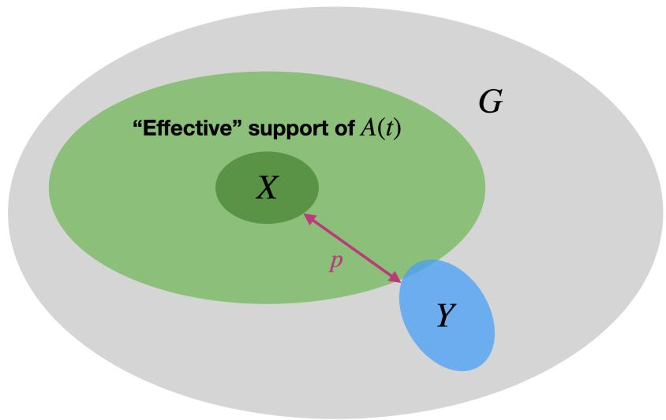  
Figure 2.14: Setting for LR bound derivation.

$$
\frac { d \| [ A ( t ) , B ] \| } { d t } \leq 2 \| A \| \sum _ { Z : Z \cap X \neq \emptyset } \| [ \gamma _ { Z } ( t ) , B ] \|
$$

where $\gamma _ { Z } ( t )$ is the evolved operator $\gamma _ { Z }$ . Integrating this equation gives

$$
\| [ A ( t ) , B ] \| - \| [ A ( 0 ) , B ] \| \leq 2 \| A \| \sum _ { Z : Z \cap X \neq \emptyset } \int _ { 0 } ^ { t } d t _ { 1 } \| [ \gamma _ { Z } ( t _ { 1 } ) , B ] \|
$$

Now we see that we can apply this inequality repeatedly to bound the right-hand side. So knowing that $[ A , B ] = 0$ , the first iterations give

$$
\begin{array} { r l } { \frac { \| [ A ( t ) , B ] \| } { 2 \| A \| } \le } & { \displaystyle \sum _ { z _ { 1 } : \bar { z x } _ { 1 } : 1 \leq j } \int _ { 0 } ^ { t } d t _ { 1 } \| [ \gamma _ { Z _ { 1 } } ( 0 ) , B ] \| } \\ & { \quad + \displaystyle \sum _ { z _ { 1 } : z _ { 1 } \leq 1 \leq j } \displaystyle \sum _ { z _ { 2 } : z _ { 2 } \leq 2 : \bar { z x } _ { 2 } : 2 \forall z } \| \gamma _ { Z _ { 1 } } \| \int _ { 0 } ^ { t } d t _ { 1 } \int _ { 0 } ^ { t _ { 1 } } d t _ { 2 } \| \gamma _ { Z _ { 2 } } ( t _ { 2 } ) , B \| } \\ & { \leq 2 t \| B \| \displaystyle \sum _ { z _ { 1 } : 1 \leq \bar { z x } _ { 1 } : 1 \leq 1 } \| \gamma _ { Z _ { 1 } } \| } \\ & { \quad + 2 ^ { 2 } \| B \| \displaystyle \frac { \| \bar { \mathbf { z } } ^ { 2 } } { 2 } \sum _ { z _ { 1 } , z _ { 2 } \leq 2 : \bar { z x } _ { 2 } \leq 2 \ : \forall z } \| \gamma _ { Z _ { 2 } } \| \| \gamma _ { Z _ { 2 } } \| } \\ & { \quad + 2 ^ { 3 } \| B \| \displaystyle \frac { \| \bar { \mathbf { z } } ^ { 3 } } { 3 } } \\ & { \quad + 2 ^ { 3 } \| B \| \displaystyle \frac { \| \bar { \mathbf { z } } ^ { 3 } } { 3 } } \end{array}
$$

where the notation $X \sim Z _ { 1 } \sim . . . \sim Z _ { k } \sim Y$ means that the intersection two by two is not the empty set, i.e. $Z _ { 1 } \cap X \neq \emptyset$ , $\forall i \in [ 1 , k - 1 ] , Z _ { i } \cap Z _ { i + i } \neq \emptyset$ and $Z _ { k } \cap Y \neq \emptyset$ .

Now to pursue the proof we need to add an assumption about the interaction in the Hamiltonian of interest. From a physical point of view, in the most general case one can use a law of interaction to bound the different sums appearing in the expression. Being exponential or power decay interaction, it is enough to finish the demonstration [Haah et al. 2021, Tran et al. 2019]. In the case of interest in this thesis, namely the combinatorial graph problems, the interactions are finite range as we only have bounded $2 -$ local operators in the Hamiltonian (see Section 2.2). So like in [Moosavian et al. 2022], the sum of the $r ^ { t h }$ term is over paths of length $r$ from $X$ to $Y$ and the first $p - 1$ terms are null. We are left with the last term, i.e.

$$
\frac { \| [ A ( t ) , B ] \| } { 2 \| A \| } \leq 2 ^ { p } \| B \| \frac { t ^ { p } } { p ! } ( 2 ( d - 1 ) ) ^ { p }
$$

where we bounded the number of paths of length $p$ from $X$ to $Y$ by $( 2 ( d - 1 ) ) ^ { p }$ if $G$ is a $d -$ regular graphs. Then using a Stirling formula or an astute manipulation of the exponential like in [Chen et al. 2023], we get the wanted expression of the LR bound.

# 2.5.3 Some known applications

The Lieb-Robinson bound has brought a growing interest since the result of [Hastings 2004] as it is used to generalize a physical result at higher dimension, namely the Lieb-Schultz-Mattis theorem [Lieb et al. 1961].

From a computer science point of view, the first application of this bound is in [Haah et al. 2021] and later generalized in [Tran et al. 2019] to produce a quantum circuit for Hamiltonian simulation. It improves on the gates complexity and the depth of the circuit upon the previous best algorithms based on the Lie-Trotter-Suzuki formula [Berry et al. 2006], or truncated Taylor series [Low & Chuang 2017].

More recently, in [Moosavian et al. 2022], the authors used the Lieb-Robinson bound to prove some upper bound on the reachable approximation ratio on MaxCut by a quantum annealing evolution when the runtime is at most logarithmic in the input size. They claim to prove the first time-dependent LR bound. The outcome of their result is an upper bound on the performance of short time QA closely related to the result in [Farhi et al. 2020] about QAOA. They show that on a specific class of bipartite regular graphs, the approximation ratio for MaxCut is upper bounded by a value that goes below the Goemans-Williamson ratio of 0.87856 when the degree exceeds 6. In plain English, this means that QA in logarithmic time cannot beat Goemans-Williamson’s algorithm for MaxCut.

For a more extensive review about the Lieb-Robinson bound, we refer the reader to [Chen et al. 2023].

# Part I

# Anti-crossings in Adiabatic Quantum Computing

# Anti-crossings characterization

# Contents

# 3.1 Results and limitations of Def. 2.6 . . 67

3.1.1 Minimum gap in AC of Def. 2.6 68   
3.1.2 AC in Maximum-Weight $k$ -clique problem 71

3.2 New characterization of anti-crossing 75

3.2.1 Variation of $| \phi _ { 0 } ( s ) \rangle$ at $s ^ { * }$ 75   
3.2.2 New anti-crossing definition 77   
3.2.3 Thorough comparison of ACs definitions . 78

3.3 Limitation and other potential type of AC 82

In this chapter, we present our contribution in the understanding of the avoidedcrossing phenomenon in AQC. Recall that in AQC we suppose that the state is evolved adiabatically, meaning, among other things, that the runtime is ruled by the minimum gap closing, while in QA the runtime is chosen arbitrarily. For this reason, AC phenomenon are of first interest when studying AQC performance. Here, we show some results and limitations of the most recent definition by [Choi 2020] (Sec. 3.1). Those observations lead us to propose a new definition of an AC encompassing more cases. We support our new characterization with a numerical analysis on a toy example for the maximum (weight) $k -$ clique problem (Sec. 3.2).

# 3.1 Results and limitations of Def. 2.6

In this section, we discuss the recent definition of an anti-crossing introduced in [Choi 2020], that we detailed in the Preliminaries Chapter in Sec. 2.4.4. Recall that the study of this phenomenon is interesting in AQC as it comes with an exponentially closing minimum gap of the total Hamiltonian. Improving the characterization of an AC is a major challenge in this setting to understand the time complexity of AQC. We will show how Def. 2.6 is indeed linked to a small gap. Then using a toy model of the maximum weighted $k -$ clique problem, we show how this definition is limited to some specific AC.

As defined in Sec. 2.2, we focus on total Hamiltonian of the form $H ( s ) = ( 1 -$ $s ) H _ { 0 } + s H _ { 1 }$ , with $H _ { 0 }$ the initial Hamiltonian and $H _ { 1 }$ the problem Hamiltonian. Let’s state a useful lemma that applies in this setting:

Lemma 3.1. Let $\lambda _ { i } , | n _ { i } \rangle$ be an eigenvalue/eigenvector orthogonal pair of a realvalued symmetric time dependent matrix operator $B$ such that $\ddot { B } = 0$ , we have:

$$
\begin{array} { l } { \displaystyle \dot { \lambda } _ { i } = \langle n _ { i } | \dot { B } | n _ { i } \rangle } \\ { \displaystyle | \dot { n } _ { i } \rangle = \sum _ { j \neq i } \frac { \langle n _ { j } | \dot { B } | n _ { i } \rangle } { \lambda _ { i } - \lambda _ { j } } | n _ { j } \rangle } \\ { \displaystyle \ddot { \lambda } _ { i } = 2 \sum _ { j \neq i } \frac { | \langle n _ { j } | \dot { B } | n _ { i } \rangle | ^ { 2 } } { \lambda _ { i } - \lambda _ { j } } } \end{array}
$$

Proof. We take the derivative of the eigen relation $B | n _ { i } \rangle = \lambda _ { i } | n _ { i } \rangle$ :

$$
\dot { B } | n _ { i } \rangle + B | \dot { n _ { i } } \rangle = \dot { \lambda _ { i } } | n _ { i } \rangle + \lambda _ { i } | \dot { n _ { i } } \rangle
$$

and knowing that $\langle n _ { i } | \dot { n _ { i } } \rangle = 0$ because $\langle n _ { i } | n _ { i } \rangle = 1$ , we compose by $\langle n _ { i } |$ on the left to get the first expression. Then, composing the same expression by another eigenvector $| n _ { j } \rangle$ with eigenvalue $\lambda _ { j }$ we obtain $( \lambda _ { i } - \lambda _ { j } ) \langle n _ { j } | \dot { n _ { i } } \rangle = \langle n _ { j } | \dot { B } | n _ { i } \rangle$ . From that we get the second expression. Eventually, we take the second derivative of the eigen relation:

$$
\ddot { B } | n _ { i } \rangle + 2 \dot { B } | \dot { n _ { i } } \rangle + B | \ddot { n _ { i } } \rangle = \ddot { \lambda _ { i } } | n _ { i } \rangle + 2 \dot { \lambda _ { i } } | \dot { n _ { i } } \rangle + \lambda _ { i } | \ddot { n _ { i } } \rangle
$$

by hypothesis $\ddot { B } = 0$ , then projecting onto $| n _ { i } \rangle$ and using (3.2) we obtain the third result.

In our setting, the second derivative of the Hamiltonian $H ( s )$ with respect to $s$ is zero, so the results of this latter lemma are true for the Hamiltonian $H ( s )$ .

# 3.1.1 Minimum gap in AC of Def. 2.6

Let us first recall quickly the idea of Def. 2.6 crossing. Around anti-crossing point $s ^ { * }$ , the instantaneous ground-state $\vert \phi _ { 0 } ( s ^ { * } ) \rangle$ and first excited state $\left| \phi _ { 1 } ( s ^ { * } ) \right.$ are mainly localized in the final ground-state $| \mathsf { G S } \rangle$ and final first excited state |FS⟩. With $a _ { k } ( s ) = \vert \langle \phi _ { 0 } ( s ) \vert \phi _ { k } ( 1 ) \rangle \vert ^ { 2 }$ and $b _ { k } ( s ) = \vert \langle \phi _ { 1 } ( s ) \vert \phi _ { k } ( 1 ) \rangle \vert ^ { 2 }$ , the definition states that there exists $\delta _ { s }$ such that in the interval $\left[ s ^ { * } - \delta _ { s } , s ^ { * } + \delta _ { s } \right]$ :

$$
\begin{array} { l } { { | \phi _ { 0 } ( s ) \rangle \simeq \sqrt { a _ { 0 } ( s ) } | \mathsf { G S } \rangle + \sqrt { a _ { 1 } ( s ) } | \mathsf { F S } \rangle } } \\ { { | \phi _ { 1 } ( s ) \rangle \simeq \sqrt { b _ { 0 } ( s ) } | \mathsf { G S } \rangle - \sqrt { b _ { 1 } ( s ) } | \mathsf { F S } \rangle } } \end{array}
$$

where the four quantities $a _ { 0 }$ , $a _ { 1 }$ , $b _ { 0 }$ and $b _ { 1 }$ have well defined behaviors parametrized by $\gamma$ and $\varepsilon$ . $\gamma$ represents the maximal amount of states other than $| \mathsf { G S } \rangle$ and |FS⟩, i.e. in the same interval, $\begin{array} { r } { \sum _ { k \geq 2 } a _ { k } ( s ) < \gamma } \end{array}$ (similarly for the $b _ { k }$ ’s). $\varepsilon$ represents the value by which the latter four quantities deviate from $1 / 2$ at crossing point $s ^ { * }$ (see Fig. 2.12). Typically, $a _ { 0 } ( s )$ will grow from below $\gamma$ to above $1 - \gamma$ passing through $\frac { 1 } { 2 } \pm \varepsilon$ at $s = s ^ { * }$ , and inversely for $a _ { 1 } ( s )$ . The same goes for $b _ { 1 }$ and $b _ { 0 }$ .

Now, recall that the quantity of interest for AQC is the behavior of the minimum gap $\Delta _ { \mathrm { m i n } }$ . Few examples are known where the expression of the gap can be found explicitly [Albash $\&$ Lidar 2018]. It is interesting to understand the influence of parameter $\gamma$ and $\varepsilon$ on the minimum gap value. We derive here the exact expression (Proposition 3.1) of $\Delta _ { \mathrm { m i n } }$ using the quantities introduced in [Choi 2020].

Proposition 3.1. $\begin{array} { r } { \Delta _ { m i n } = \sum _ { k } E _ { k } ( 1 ) \left[ b _ { k } ( s ^ { * } ) - a _ { k } ( s ^ { * } ) \right] } \end{array}$ where the sum runs over indices $k$ corresponding to distinct $E _ { k } ( 1 )$ .

Proof. The gap reaches a minimum at $s ^ { * }$ so its derivative is null at $s ^ { * }$ , thus using Eq. (3.1) of Lemma 3.1, we get:

$$
\begin{array} { r c l } { \displaystyle 0 = \frac { d \Delta } { d s } ( s ^ { * } ) } \\ { \displaystyle } & { = \frac { d E _ { 1 } } { d s } ( s ^ { * } ) - \frac { d E _ { 0 } } { d s } ( s ^ { * } ) } \\ { \displaystyle } & { = \langle \phi _ { 1 } ( s ^ { * } ) | \dot { H } | \phi _ { 1 } ( s ^ { * } ) \rangle - \langle \phi _ { 0 } ( s ^ { * } ) | \dot { H } | \phi _ { 0 } ( s ^ { * } ) \rangle } \end{array}
$$

$$
\begin{array} { r l r } & { \Rightarrow \langle \phi _ { 1 } ( s ^ { * } ) | H _ { 0 } | \phi _ { 1 } ( s ^ { * } ) \rangle - \langle \phi _ { 0 } ( s ^ { * } ) | H _ { 0 } | \phi _ { 0 } ( s ^ { * } ) \rangle = \langle \phi _ { 1 } ( s ^ { * } ) | H _ { 1 } | \phi _ { 1 } ( s ^ { * } ) \rangle } & \\ & { \qquad - \langle \phi _ { 0 } ( s ^ { * } ) | H _ { 1 } | \phi _ { 0 } ( s ^ { * } ) \rangle } & \end{array}
$$

In the setting of linear interpolation, we have $\dot { H } = H _ { 1 } - H _ { 0 }$ . The eigen relation takes the form of $s \dot { H } | \phi _ { k } ( s ) \rangle = E _ { k } ( s ) | \phi _ { k } ( s ) \rangle - H _ { 0 } | \phi _ { k } ( s ) \rangle$ . Then projecting onto $\langle \phi _ { k } ( s ) |$ gives $s \langle \phi _ { k } ( s ) | H | \phi _ { k } ( s ) \rangle = E _ { k } ( s ) - \langle \phi _ { k } ( s ) | H _ { 0 } | \phi _ { k } ( s ) \rangle$ . Applying this relation with $k = 0 , 1$ on the previous calculation, gives another expression of the min-gap:

$$
\begin{array} { r l } & { \Delta _ { m i n } = E _ { 1 } ( s ^ { * } ) - E _ { 0 } ( s ^ { * } ) } \\ & { \qquad = \langle \phi _ { 1 } ( s ^ { * } ) | H _ { 0 } | \phi _ { 1 } ( s ^ { * } ) \rangle - \langle \phi _ { 0 } ( s ^ { * } ) | H _ { 0 } | \phi _ { 0 } ( s ^ { * } ) \rangle } \\ & { \qquad = \langle \phi _ { 1 } ( s ^ { * } ) | H _ { 1 } | \phi _ { 1 } ( s ^ { * } ) \rangle - \langle \phi _ { 0 } ( s ^ { * } ) | H _ { 1 } | \phi _ { 0 } ( s ^ { * } ) \rangle } \end{array}
$$

Now, let’s write $\left| \phi _ { 1 } ( s ^ { * } ) \right.$ and $\vert \phi _ { 0 } ( s ^ { * } ) \rangle$ in the computational basis $| x \rangle$ . There exists $\alpha _ { x }$ and $\beta _ { x }$ such that

$$
| \phi _ { 0 } ( s ^ { * } ) \rangle = \sum _ { x \in \{ 0 , 1 \} ^ { n } } \alpha _ { x } | x \rangle \quad { \mathrm { a n d } } \quad | \phi _ { 1 } ( s ^ { * } ) \rangle = \sum _ { x \in \{ 0 , 1 \} ^ { n } } \beta _ { x } | x \rangle
$$

By definition of $a _ { k }$ and $b _ { k }$ , the different eigen subspace can be degenerate, so we have that

$$
\sum _ { x \ \mathrm { s . t . } E _ { x } = E _ { k } ( 1 ) } | \alpha _ { x } | ^ { 2 } = a _ { k } ( s ^ { * } ) \quad \mathrm { a n d } \quad \sum _ { x \ \mathrm { s . t . } E _ { x } = E _ { k } ( 1 ) } | \beta _ { x } | ^ { 2 } = b _ { k } ( s ^ { * } )
$$

Then knowing that $H _ { 1 } | x \rangle = E _ { x } | x \rangle$ and $E _ { x } = E _ { k } ( 1 )$ is the same for all vectors in the subspace span by $| \phi _ { k } ( 1 ) \rangle$ , we have:

$$
\begin{array} { l } { { \displaystyle \langle \phi _ { 0 } ( s ^ { * } ) | H _ { 1 } | \phi _ { 0 } ( s ^ { * } ) \rangle = \sum _ { x } \sum _ { y } \alpha _ { x } ^ { \dagger } \alpha _ { y } \langle x | H _ { 1 } | y \rangle } } \\ { { \displaystyle \qquad = \sum _ { x } | \alpha _ { x } | ^ { 2 } E _ { x } } } \\ { { \displaystyle \qquad = \sum _ { k } a _ { k } ( s ^ { * } ) E _ { k } ( 1 ) } } \end{array}
$$

The same goes with $\left| \phi _ { 1 } ( s ^ { * } ) \right.$ and $b _ { k } ( s ^ { * } )$ therefore we end up with:

$$
\Delta _ { m i n } = \sum _ { k } E _ { k } ( 1 ) \left[ b _ { k } ( s ^ { * } ) - a _ { k } ( s ^ { * } ) \right]
$$

This result is a general expression of the minimum gap when linear interpolation is used. We can see that it depends only on the new variables and the final energies. The minimum gap will be exponentially small if all terms $a _ { k }$ and $b _ { k }$ are small or if $a _ { k } \simeq b _ { k }$ . We can now upper-bound $\Delta _ { \mathrm { m i n } }$ using the parameter $\varepsilon$ that quantifies the strength of the anti-crossing.

Corollary 3.1. For a $( \gamma , \varepsilon )$ -anti-crossing of definition 2.6, we have:

$$
\Delta _ { m i n } = { \mathcal { O } } ( \varepsilon )
$$

Proof. For a $( \gamma , \varepsilon )$ -anti-crossing of definition 2.6, $a _ { 0 } ( s ^ { * } ) , a _ { 1 } ( s ^ { * } ) , b _ { 0 } ( s ^ { * } ) , b _ { 1 } ( s ^ { * } ) \in$ $[ 1 / 2 - \varepsilon , 1 / 2 + \varepsilon ]$ . Thus, for $k = 0 , 1$ , $| b _ { k } ( s ^ { * } ) - a _ { k } ( s ^ { * } ) | \le 2 \varepsilon$ . This also means that $\begin{array} { r } { \sum _ { k \geq 2 } a _ { k } ( s ^ { * } ) \leq 2 \varepsilon } \end{array}$ , and the same goes for the $b _ { i } ( s ^ { * } ) \prime _ { \mathrm { s } }$ . The final energy $E _ { k } ( 1 )$ is upper-bounded by a constant $M$ and without loss of generality we assume $E _ { k } ( 1 ) \geq 0$ , therefore:

$$
\begin{array} { r l r } {  { \Delta _ { m i n } \leq E _ { 0 } ( 1 ) \vert b _ { 0 } ( s ^ { * } ) - a _ { 0 } ( s ^ { * } ) \vert + E _ { 1 } ( 1 ) \vert b _ { 1 } ( s ^ { * } ) - a _ { 1 } ( s ^ { * } ) \vert } } \\ & { } & { + M \sum _ { k \geq 2 } [ b _ { k } ( s ^ { * } ) + a _ { k } ( s ^ { * } ) ] } \\ & { } & { \leq 2 \varepsilon E _ { 0 } ( 1 ) + 2 \varepsilon E _ { 1 } ( 1 ) + 4 \varepsilon M } \\ & { } & { \leq 2 ( E _ { 0 } ( 1 ) + E _ { 1 } ( 1 ) + 2 M ) \varepsilon } \end{array}
$$

The smaller $\varepsilon$ is, the smaller the minimum gap will be. Therefore, if the instantaneous ground-state is exponentially close to a linear combination of $| \mathsf { G S } \rangle$ and |FS⟩ (i.e. $\varepsilon$ is exponentially small), the minimum gap will be exponentially small. This new result quantifies the strength of a Def. 2.6 anti-crossing.

Discussion: Let us discuss some intuition we can get from the quantities $a _ { k }$ and $b _ { k }$ based on Def. 2.6. Around crossing point, $a _ { 1 }$ is dominant before $s ^ { * }$ , meaning that the instantaneous ground-state is localized in the first final excited state before the anti-crossing. After $s ^ { * }$ , $a _ { 0 }$ is dominant, meaning that $| \phi _ { 0 } ( s ) \rangle$ is now localized in the final ground-state. This exchange of localization happens in pairs with the instantaneous excited state $| \phi _ { 1 } ( s ) \rangle$ as it jumps from |GS⟩ toward |FS⟩. This implies that before $s ^ { * }$ , $| \phi _ { 0 } ( s ) \rangle$ was heading toward |FS⟩, and $| \phi _ { 1 } ( s ) \rangle$ toward $| \mathsf { G S } \rangle$ .

One can understand the $a _ { k }$ ’s as being the direction toward which the instantaneous ground-state is evolving. For a particular $j$ , if $a _ { j }$ is becoming dominant at some point in the evolution, it means that $| \phi _ { 0 } ( s ) \rangle$ is going toward the $j ^ { t h }$ final energy state. The description imposed by Def. 2.6 seems restrictive as it is only focused on $a _ { 0 }$ crossing with $a _ { 1 }$ , but in theory, $a _ { 0 }$ could cross with any other level $a _ { j }$ . One could question if the imposed property is universal for an AC in general. The same intuition holds for the $b _ { k }$ ’s and the instantaneous first excited state $| \phi _ { 1 } ( s ) \rangle$ . Although Def. 2.6 relates the anti-crossings to the gap closing via Prop. 3.1, is it possible to exhibit a counter-example to the definition helped by the intuition we provided on the role of the $a _ { k }$ ’s? We answer this question in the following section.

# 3.1.2 AC in Maximum-Weight $k$ -clique problem

To validate or invalidate Def. 2.6 of an AC, we look at the maximum-weight $k -$ clique problem, with the Hamiltonians described in Sec. 2.2.4. We recall that the goal is to find a clique of size $k$ in a given input weighted graph $G = ( V , E , w )$ that maximizes the weight of the clique. $w$ is a vector such that $w _ { i }$ is the weight of node $i$ . The initial Hamiltonian $H _ { 0 }$ stabilizes the Hilbert space span by bit-strings of Hamming weight $k$ , and we choose the path graph as the driver graph, meaning that $H _ { 0 }$ links two classical states if they differ by exactly one swap. We choose the path graph as it seems that it makes AQC struggle more than other tested driver graph (see Appendix A). In the weighted setting, the cost of a bit-string (necessarily of Hamming weight $k$ ) is the number edges missing to form a clique minus the weights of the corresponding nodes. As introduced in Sec. 2.2.4, we add a parameter $\alpha$ in front of the total weight to play with the importance of the weights.

The toy example we constructed to illustrate the anti-crossing phenomenon is a graph on $n = 6$ vertices and $| E | = 7$ edges and the size of the clique we search is of size $k = 3$ (see Fig. 3.1). Let $w = [ 1 . 0 , 1 . 0 , 1 . 0 , 1 . 5 , 1 . 5 , 1 . 5 , 1 . 5 $ ] be the list of weights of the six nodes. Using this weight vector, for $\alpha < 2 / 3$ , the ground-state of $H _ { 1 }$ is $| { \mathsf { G S } } \rangle = | { 1 1 1 0 0 0 } \rangle$ with energy $0 - 3 \alpha$ and the first excited state $\begin{array} { r } { | \mathsf { F S } \rangle = | 0 0 0 1 1 1 \rangle } \end{array}$ with energy $1 - 4 . 5 \alpha$ (for $\alpha = 0$ , there are many first excited states). The ground-state is degenerate for $1 - 4 . 5 \alpha = - 3 \alpha$ i.e. $\alpha = 2 / 3$ . It is interesting to note that these latter states are far apart in the graph $G _ { H _ { 0 } }$ generated by $- H _ { 0 }$ . Indeed with a path graph as driver graph, $G _ { H _ { 0 } }$ is similar to the one presented in Fig. 2.6 with a kite configuration. The distance in this graph between $| \mathsf { G S } \rangle$ and $| \mathsf { F S } \rangle$ is the diameter of the graph, i.e. the largest distance between two states. As we will see in Sec. 4.2, this property is an indicator for small minimum gap.

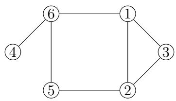  
Figure 3.1: Toy example 1 with weights [1,1,1,1.5,1.5,1.5] for each node. For $\alpha < 2 / 3$ , the solution is the triangle with nodes labeled 1, 2 and 3. For $\alpha > 2 / 3$ , the solution is the subgraph {4,5,6}.

Now let us have a look at the evolution of the different quantities occurring during an anti-crossing to compare two instances, $\alpha \ : = \ : 0$ and $\alpha \ : = \ : 0 . 5$ . First, let us explicitly give the final energies of the different states (Fig. 3.2). We see that in the case of $\alpha = 0$ , the first excited state is degenerate with 8 states whereas, with $\alpha = 0 . 5$ , both the ground and first excited states are non-degenerate.

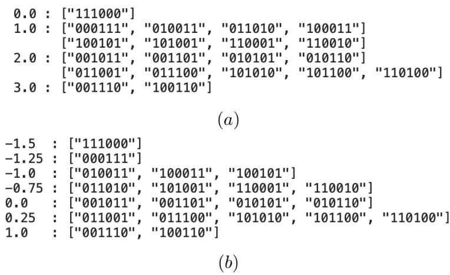  
Figure 3.2: States with energies for toy example 1 for $\alpha = 0$ (a) and $\alpha = 0 . 5$ (b)

In the following analysis, we call anti-crossing the two hyperbola branches described by von Neuman and Wigner (see Sec. 2.4.2) that can happen between any two successive eigenvalues and we denote by $s ^ { * }$ the anti-crossing point between the two lowest eigenvalues. We plot the evolution of the first three eigenvalues for the two cases of interest. On Fig. 3.3 (a), two types of anti-crossings are distinguishable: the one between $E _ { 2 }$ and $E _ { 1 }$ which is quite weak and the one between $E _ { 1 }$ and $E _ { 0 }$ which is strong and of interest in AQC. Here, the slope of $E _ { 0 } ( s )$ before $s ^ { * }$ is the slope of $E _ { 1 } ( s )$ after $s ^ { * }$ . Noticing that $E _ { 1 }$ does not undergo another AC after, we can say that the lowest energy was going toward $E _ { 1 } ( 1 )$ before bouncing against the second lowest energy to redirect toward $E _ { 0 } ( 1 )$ . If we follow the intuition given in the previous section, we can expect to see $a _ { 0 }$ crossing $a _ { 1 }$ .

Now, looking at Fig. 3.3 (b), we see that $E _ { 2 }$ and $E _ { 1 }$ are getting closer before and even more after the anti-crossing between $E _ { 1 }$ and $E _ { 0 }$ . The slope of $E _ { 0 }$ before $s ^ { * }$ is jumping from one level to the other ending in $E _ { 2 } ( 1 )$ . Our intuition says that $a 2$ is becoming dominant before $s ^ { * }$ as the direction of $E _ { 0 }$ is $E _ { 2 } ( 1 )$ , and crosses with $a _ { 0 }$ . The latter case does not follow the parametrization definition 2.6. The plots of $a _ { k }$ ’s and $b _ { k }$ ’s for these two instances on Fig. 3.4 validate our expectations on the behavior of these curves. On the left, figures 3.4(a) and (c) show the evolution as predicted by definition 2.6, however, figures 3.4(b) and (d) show other variations of the quantities $a _ { k }$ and $b _ { k }$ for an anti-crossing. Thus, the toy model we introduced highlights the limitation of Def. 2.6. We further explained the intuition behind this limitation and a thorough example is detailed in Sec. 3.2.3.

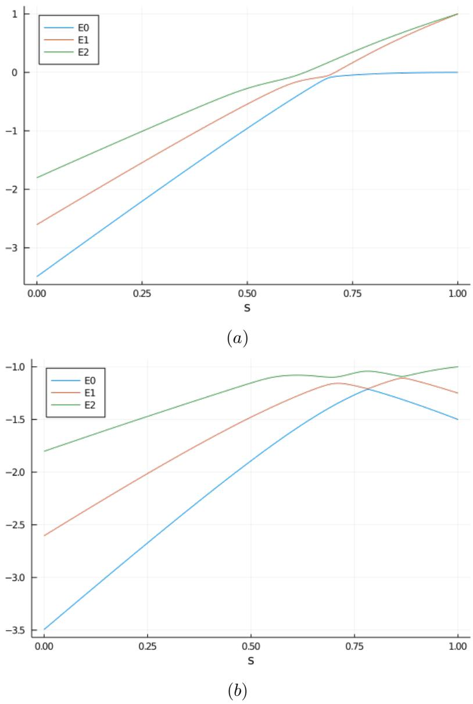  
Figure 3.3: Eigenvalues evolution for toy example 1 with $\alpha = 0$ (a) and $\alpha = 0 . 5$ (b)

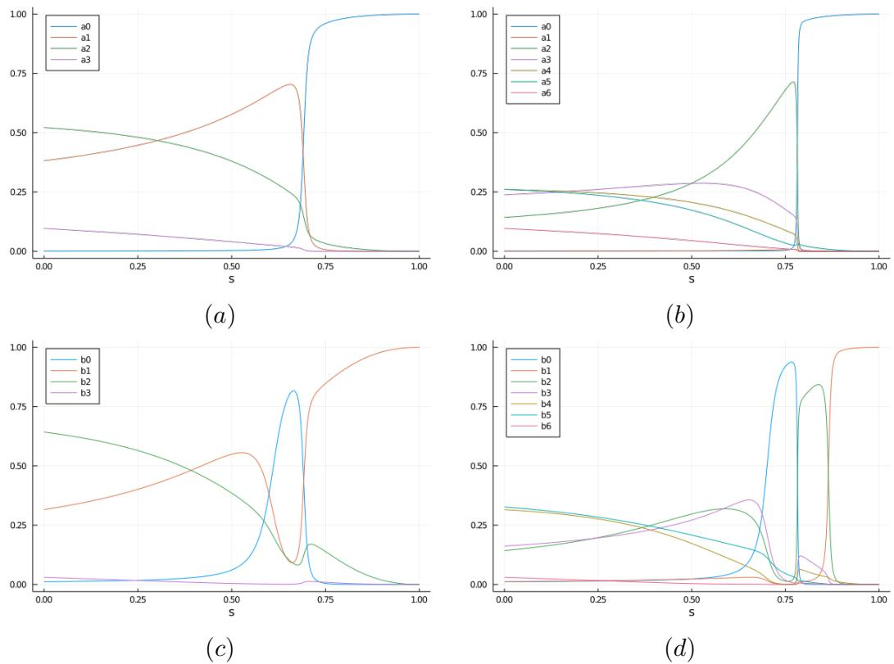  
Figure 3.4: $a _ { k }$ (top) and $b _ { k }$ (bottom) during evolution for toy example 1 with $\alpha = 0$ (left) and $\alpha = 0 . 5$ (right). Values indexed by 0 are in blue, those by 1 in red, 2 in green and 3 in purple.

Here we gave more insights on the quantities introduced in Def. 2.6 to describe an anti-crossing and we explicit the link with the min-gap. A strong anti-crossing will end up in a small min-gap. However, Def. 2.6 is not general enough as the $a _ { k }$ ’s and $b _ { k }$ ’s don’t explain exactly the behavior described by the definition. In the next section, still motivated by [Choi 2020], we give a new parametrization definition of an anti-crossing between the two lowest energies based only on $a _ { 0 } ( s )$ and $b _ { 0 } ( s )$ and derive a result that quantifies the min-gap.

In this section, we studied the anti-crossing of Def. 2.6 and proved that it is indeed related to a minimum gap closing but with a toy model of the maximumweight $k -$ clique we were able to show the limitation of this definition and explained which energy landscape could invalidate Def. 2.6. Based on our observations, in the next section we introduce a relaxed definition of an anti-crossing to encompass more cases.

# 3.2 New characterization of anti-crossing

In this section, we give a new general result on the derivatives of the instantaneous vectors involved in the anti-crossing and then we introduce a more general characterization of an anti-crossing than the one studied in the previous section.

# 3.2.1 Variation of $| \phi _ { 0 } ( s ) \rangle$ at $s ^ { * }$

In AQC, we are interested in the evolution of the ground-state as it encodes the solution of the given problem at the end of the computation. By the adiabatic theorem, the state stays close to the instantaneous ground-state. Why is it hard to follow it sometimes? What is happening to the instantaneous ground-state and first excited state at crossing point? We give one element of answers in Theorem 3.1, proving that the variation of the two states that crossed are symmetrically similar. The amplitude of this variation is inversely proportional to the minimum gap, the direction of the variation is only supported by the other vector state involved in the anti-crossing.

Theorem 3.1. Assuming that around the $s ^ { * }$ anti-crossing point between $E _ { 0 } ( s )$ and $E _ { 1 } ( s )$ , all other higher energy levels are well separated from these two levels, the following relations hold :

$$
\begin{array} { l } { \displaystyle \frac { d } { d s } \vert \phi _ { 0 } ( s ^ { * } ) \rangle \simeq - \beta \vert \phi _ { 1 } ( s ^ { * } ) \rangle } \\ { \displaystyle \frac { d } { d s } \vert \phi _ { 1 } ( s ^ { * } ) \rangle \simeq ~ \beta \vert \phi _ { 0 } ( s ^ { * } ) \rangle } \end{array}
$$

where β = ⟨ϕ0(s∗)|H˙ |ϕ1(s∗)⟩ and the $\simeq$ symbol hides some negligible $\mathcal { O } ( \delta _ { s } ^ { 2 } )$ terms for a small $\delta _ { s }$ around $s ^ { * }$ .

Proof. Let us write the expression we get using Eq. 3.2 of Lemma 3.1, for $i = 0 , 1$

$$
\frac { d } { d s } | \phi _ { i } ( s ) \rangle = ( - 1 ) ^ { i + 1 } \frac { \langle \phi _ { 0 } ( s ) | \dot { H } | \phi _ { 1 } ( s ) \rangle } { E _ { 1 } ( s ) - E _ { 0 } ( s ) } | \phi _ { i \oplus 1 } ( s ) \rangle - \sum _ { j \ge 2 } \frac { \langle \phi _ { j } ( s ) | \dot { H } | \phi _ { i } ( s ) \rangle } { E _ { j } ( s ) - E _ { i } ( s ) } | \phi _ { j } ( s ) \rangle
$$

The right-hand side is composed of a first term that is $\beta$ and a second term which is a sum over energy levels greater than 2. Let us show that the sum is zero. To do so, we will show that for $i = 0 , 1 , \forall j \geq 2 , \langle \phi _ { i } ( s ^ { * } ) | \dot { H } | \phi _ { j } ( s ^ { * } ) \rangle = 0$ . We start from the observation that the slope of $E _ { 0 } ( s )$ before $s ^ { * }$ is the one from $E _ { 1 } ( s )$ after $s ^ { * }$ , meaning that they satisfy $\begin{array} { r } { \frac { d E _ { 0 } } { d s } ( s ^ { * } - \delta _ { s } ) = \frac { d E _ { 1 } } { d s } ( s ^ { * } + \delta _ { s } ) } \end{array}$ for a small $\delta _ { s } > 0$ . The slopes are exchanged. This observation is consistent with the original description in [von Neumann $\&$ Wigner 1929, Wilkinson 1989].

Then we use Taylor expansion at the first order in $\delta _ { s }$ :

$$
\frac { d E _ { 0 } } { d s } ( s ^ { * } ) - \delta _ { s } \frac { d ^ { 2 } E _ { 0 } } { d s ^ { 2 } } ( s ^ { * } ) = \frac { d E _ { 1 } } { d s } ( s ^ { * } ) + \delta _ { s } \frac { d ^ { 2 } E _ { 1 } } { d s ^ { 2 } } ( s ^ { * } ) + \mathcal { O } ( \delta _ { s } ^ { 2 } )
$$

We will neglect the $\mathcal { O } ( \delta _ { s } ^ { 2 } )$ terms in the rest of the proof and we hide them behind the $\simeq$ symbol. In the neighborhood of $s ^ { * }$ , the gap $\Delta ( s )$ is minimal in $s ^ { * }$ , thus $\begin{array} { r } { \frac { d E _ { 1 } } { d s } ( s ^ { * } ) - \frac { d E _ { 0 } } { d s } ( s ^ { * } ) = \frac { d \Delta } { d s } ( s ^ { * } ) = 0 } \end{array}$ . We are left with :

$$
\frac { d ^ { 2 } E _ { 0 } } { d s ^ { 2 } } ( s ^ { * } ) + \frac { d ^ { 2 } E _ { 1 } } { d s ^ { 2 } } ( s ^ { * } ) \simeq 0
$$

We are in a setting with linear interpolation, so $\ddot { H } = 0$ . We can use Eq. 3.3 of Lemma 3.1 to get:

$$
2 \sum _ { j \neq 0 } \frac { | \langle \phi _ { 0 } ( s ^ { * } ) | \dot { H } | \phi _ { j } ( s ^ { * } ) \rangle | ^ { 2 } } { E _ { 0 } ( s ^ { * } ) - E _ { j } ( s ^ { * } ) } + 2 \sum _ { j \neq 1 } \frac { | \langle \phi _ { 1 } ( s ^ { * } ) | \dot { H } | \phi _ { j } ( s ^ { * } ) \rangle | ^ { 2 } } { E _ { 1 } ( s ^ { * } ) - E _ { j } ( s ^ { * } ) } \simeq 0
$$

Pulling out from the first sum the term $j = 1$ and the term $j = 0$ from the second one, they cancel each other and we end up with:

$$
\sum _ { j \geq 2 } \left[ \frac { | \langle \phi _ { 0 } ( s ^ { * } ) | \dot { H } | \phi _ { j } ( s ^ { * } ) \rangle | ^ { 2 } } { E _ { j } ( s ^ { * } ) - E _ { 0 } ( s ^ { * } ) } + \frac { | \langle \phi _ { 1 } ( s ^ { * } ) | \dot { H } | \phi _ { j } ( s ^ { * } ) \rangle | ^ { 2 } } { E _ { j } ( s ^ { * } ) - E _ { 1 } ( s ^ { * } ) } \right] \simeq 0
$$

The sum of positive summands is equal to zero, so each summand is equal to zero. Because the denominators are strictly positives, we obtain:

$$
\forall j \geq 2 , \left\{ \begin{array} { l l } { \langle \phi _ { 0 } ( s ^ { * } ) | \dot { H } | \phi _ { j } ( s ^ { * } ) \rangle \simeq 0 } \\ { \langle \phi _ { 1 } ( s ^ { * } ) | \dot { H } | \phi _ { j } ( s ^ { * } ) \rangle \simeq 0 } \end{array} \right.
$$

This is enough to conclude.

Actually, with some manipulations of the eigen relation like in the proof of Prop. 3.1, we have that for $i \ \ne \ j$ , $\langle \phi _ { i } ( s ) | \dot { H } | \phi _ { j } ( s ) \rangle ~ = ~ { \textstyle \frac { 1 } { s } } \langle \phi _ { i } ( s ) | - H _ { 0 } | \phi _ { j } ( s ) \rangle ~ = ~$ $\begin{array} { r } { \frac { 1 } { 1 - s } \langle \phi _ { i } ( s ) | H _ { 1 } | \phi _ { j } ( s ) \rangle \geq 0 } \end{array}$ . Thus, one can show that:

$$
\forall j \geq 2 , \left\{ \begin{array} { l l } { \langle \phi _ { 0 } ( s ^ { * } ) | H _ { 1 } | \phi _ { j } ( s ^ { * } ) \rangle = \langle \phi _ { 0 } ( s ^ { * } ) | H _ { 0 } | \phi _ { j } ( s ^ { * } ) \rangle \simeq 0 } \\ { \langle \phi _ { 1 } ( s ^ { * } ) | H _ { 1 } | \phi _ { j } ( s ^ { * } ) \rangle = \langle \phi _ { 1 } ( s ^ { * } ) | H _ { 0 } | \phi _ { j } ( s ^ { * } ) \rangle \simeq 0 } \end{array} \right.
$$

Furthermore, if $H _ { 1 }$ is positive semi-definite (which is easy to achieve by adding an identity matrix scaled by the minimum value of $H _ { 1 }$ ), we have $\beta \geq 0$ .

This theorem also fills a blank in Chapter 2, Sec. 2.4.2 in which we assumed the reduced matrix expression of the Hamiltonian around $s ^ { * }$ . The matrix element $\langle \phi _ { 0 } ^ { * } | H _ { \delta _ { s } } | \phi _ { j } ^ { * } \rangle = \langle \phi _ { 0 } ^ { * } | H ( s ^ { * } ) | \phi _ { j } ^ { * } \rangle + \langle \phi _ { 0 } ^ { * } | \dot { H } | \phi _ { j } ^ { * } \rangle \simeq 0$ for $j \geq 2$ , and the same holds with $| \phi _ { 1 } ^ { * } \rangle$ .

Here, we understand that the smaller the minimum gap is, the more brutal the variation of the instantaneous ground-state will be. This result can explain why it is hard to follow the trajectory of the ground-sate vector. Furthermore, the direction of the variation is purely supported by the other vector involved in the anti-crossing meaning that $\vert \phi _ { 0 } ( s ^ { * } ) \rangle$ and $\frac { d } { d s } \vert \phi _ { 0 } ( s ^ { * } ) \rangle$ form the same plane as $\vert \phi _ { 0 } ( s ^ { * } ) \rangle$ and $\left| \phi _ { 1 } ( s ^ { * } ) \right.$ where these two vectors rotate.

# 3.2.2 New anti-crossing definition

During adiabatic evolution, each level of energy will undergo some anti-crossings. We aim to explain the anti-crossings happening to one specific level namely the groundstate. In AQC, the purpose is to find the ground-state of the final Hamiltonian, thus knowing from which higher energy level $| \mathsf { G S } \rangle$ comes, will help to understand if the solution has to jump many levels before ending in the ground-state. This information is present in the coefficient of $| \phi _ { i } ( s ) \rangle$ corresponding to |GS⟩. Therefore, instead of looking at the decomposition of the instantaneous ground-state $| \phi _ { 0 } ( s ) \rangle$ in the computational basis, we can look at the decomposition of the final ground-state $| \mathsf { G S } \rangle$ in the instantaneous basis by introducing :

$$
g _ { k } ( s ) = | \langle { \sf G S } | \phi _ { k } ( s ) \rangle | ^ { 2 }
$$

The value of the $g _ { k }$ during the evolution corresponds to the probability to measure the solution if the system is in the $k ^ { t h }$ energy level. In AQC, generally, we start from the ground-state of the initial Hamiltonian $H _ { 0 }$ , so the state stays close to the instantaneous ground-state according to the adiabatic theorem. Therefore, we hope that $g _ { 0 }$ is dominant at some point.

Notice that $g _ { 0 } = a _ { 0 }$ and $g _ { 1 } = b _ { 0 }$ . The idea is to relax Def. 2.6 to include a better description of an anti-crossing between $E _ { 0 }$ and $E _ { 1 }$ . The intuition behind those variables are quite similar, a dominant $g _ { j }$ during the evolution means that the instantaneous basis vector $| \phi _ { j } ( s ) \rangle$ is in direction toward the solution before $s ^ { * }$ . We can restate the parametrization of an $( \gamma , \varepsilon )$ -anti-crossing based only on $g _ { 0 }$ and $g _ { 1 }$ .

Definition 3.1. For $\gamma \geq 0$ , $\varepsilon \geq 0$ we say there is an $( \gamma , \varepsilon )$ -Anti-crossing if there exists a $\delta _ { s } > 0$ such that

1. For $s \in [ s ^ { * } - \delta _ { s } , s ^ { * } + \delta _ { s } ]$ ,

$$
| G S \rangle \simeq \sqrt { g _ { 0 } ( s ) } | \phi _ { 0 } ( s ) \rangle + \sqrt { g _ { 1 } ( s ) } | \phi _ { 1 } ( s ) \rangle
$$

where $g _ { 0 } ( s ) + g _ { 1 } ( s ) \in [ 1 - \gamma , 1 ]$ . Within the time interval $\left[ s ^ { * } - \delta _ { s } , s ^ { * } + \delta _ { s } \right]$ , $| G S \rangle$ is mainly composed of $| \phi _ { 0 } ( s ) \rangle$ and $| \phi _ { 1 } ( s ) \rangle$ . That is, all other states (eigen states of the Hamiltonian $H ( s ) _ { \cdot }$ ) are negligible (which sums up to at most $\gamma \geq 0$ ).

2. At the avoided crossing point $s = s ^ { * }$ , $g _ { 0 } = g _ { 1 } \in [ 1 / 2 - \varepsilon , 1 / 2 ]$ , for a small $\varepsilon > 0$ . That is, $| G S \rangle \simeq 1 / \sqrt { 2 } ( | \phi _ { 0 } ( s ^ { * } ) \rangle + | \phi _ { 1 } ( s ^ { * } ) \rangle )$ .

3. Within the time interval $\left[ s ^ { * } - \delta _ { s } , s ^ { * } + \delta _ { s } \right]$ , $g _ { 0 } ( s )$ increases from $\leq ~ \gamma$ to $\geq ( 1 - \gamma )$ , while $g _ { 1 } ( s )$ decreases from $\geq ( 1 - \gamma ) \ t o \leq \gamma$ .

Our new definition is quite similar to Def. 2.6 and trivially includes all anti-crossings described by Choi’s definition. We see from point $\mathit { 1 }$ and $\mathcal { J }$ that we can remove point $\boldsymbol { \mathcal { Z } }$ by setting $2 \varepsilon = \gamma$ . Nevertheless, one may want to keep the independence of this two parameters to encompass more potential AC. Additionnaly, we have the following corollary of Theorem 3.1 that links it to the minimum gap and properly characterizes the strength of an anti-crossing.

Corollary 3.2. Still neglecting terms in $\mathcal { O } ( \delta _ { s } ^ { 2 } )$ ,

$$
\begin{array} { l } { \displaystyle \frac { d g _ { 0 } } { d s } ( s ^ { * } ) + \frac { d g _ { 1 } } { d s } ( s ^ { * } ) \simeq 0 } \\ { \displaystyle \frac { d g _ { 0 } } { d s } ( s ^ { * } ) - \frac { d g _ { 1 } } { d s } ( s ^ { * } ) \simeq 4 g _ { 0 , 1 } ( s ^ { * } ) \beta } \end{array}
$$

Proof. We have $\begin{array} { r } { \frac { d g _ { i } } { d s } ( s ) = \langle \mathsf { G S } | \phi _ { i } ( s ) \rangle \langle \mathsf { G S } | \frac { d \phi _ { i } } { d s } ( s ) \rangle + \langle \phi _ { i } ( s ) | \mathsf { G S } \rangle \langle \frac { d \phi _ { i } } { d s } ( s ) | \mathsf { G S } \rangle } \end{array}$ , $g _ { 0 } ( s ^ { * } ) =$ $g _ { 1 } ( s ^ { * } )$ and theorem 3.1.

For a strong anti-crossing, $g _ { 0 } ( s ^ { * } ) = g _ { 1 } ( s ^ { * } ) = g _ { 0 , 1 } ( s ^ { * } ) \simeq 1 / 2$ . Using our definition (Def. 3.1), along with Corollary 3.2, we have that

$$
4 g _ { 0 , 1 } ( s ^ { * } ) \beta = \frac { d g _ { 0 } } { d s } ( s ^ { * } ) - \frac { d g _ { 1 } } { d s } ( s ^ { * } ) \simeq \frac { 1 - 2 \gamma } { \delta _ { s } }
$$

which gives the order of the minimum gap: $\begin{array} { r } { \Delta _ { \mathrm { m i n } } = \mathcal { O } ( 2 \dot { H } _ { 0 1 } \frac { \delta _ { s } } { 1 - 2 \gamma } ) } \end{array}$ . The main property characterizing an avoided-crossing according to our definition is the sharp variation of $g _ { 0 }$ and $g - 1$ around $s ^ { * }$ . We provide numerical evidence on the previous toy model (Fig. 3.1) by plotting the derivative of $g _ { 0 }$ and $g _ { 1 }$ against $\Delta _ { \mathrm { m i n } }$ for $\alpha \in \lfloor 0 , 0 . 6 6 \rfloor$ close to the threshold $2 / 3$ (Fig. 3.5). The numerical result looks consistent with Corollary 3.2. We clearly see that the derivative of $g _ { 0 }$ and $g _ { 1 }$ have similar opposite variation. The plain lines express the tendency of the variations which are clearly inversely proportional to the minimum gap.

In this section, we introduced a new characterization of an anti-crossing which is a relaxed version of Def. 2.6. We supported this definition by an analytical result and numerical evidence on AC that the previous definition (Def. 2.6) does not capture. In the next section, we further detail an example and explain each expected behavior of the $a _ { k }$ , $b _ { k }$ and $g _ { k }$ .

# 3.2.3 Thorough comparison of ACs definitions

In this section, we illustrate how the two definitions (Def. 2.6 and Def. 3.1) differ and interpret this difference through the previous intuitions. We use a new toy model for the maximum-weight $k -$ clique problem with the graph in Fig. 3.6. It is the same structure of the graph Fig. 3.1 where nodes 1 and 3 are swapped as well as nodes 5 and 6. We keep the same weights vector $w =  { \left. 1 , 1 , 1 , 1 . 5 , 1 . 5 , 1 . 5 , 1 . 5 \right. }$ ].

For $\alpha = 0 . 2$ , this produces the following final states according to their energy (Fig. 3.7 (a)) and the eigenvalues evolution (Fig. 3.7 (b)).

With this instance, we observe that the final slope of $E _ { 0 } ( s )$ comes from the slope of $E _ { 2 } ( s )$ , therefore we expect that $g _ { 2 } ( s )$ becomes dominant before transmitting to $g _ { 1 } ( s )$ after the first anti-crossing between $E _ { 2 }$ and $E _ { 1 }$ . Eventually, the anti-crossing of $E _ { 1 }$ and $E _ { 0 }$ will produce a crossing of $g _ { 1 }$ and $g _ { 0 }$ . The latter will become dominant and will become equal to 1 at the end. Now, focusing on the slope of $E _ { 0 } ( s )$ before the anti-crossing, following the different successive anti-crossings, the jumps end up in the $4 ^ { t h }$ energy level. In terms of $a _ { k }$ ’s and $b _ { k }$ ’s, this means that $a _ { 3 } ( s )$ becomes important just before the anti-crossing and crosses $a _ { 0 } ( s )$ at the anti-crossing. The same goes for $b _ { 3 } ( s )$ and $b _ { 0 } ( s )$ . The plots below supports these previous analyses.

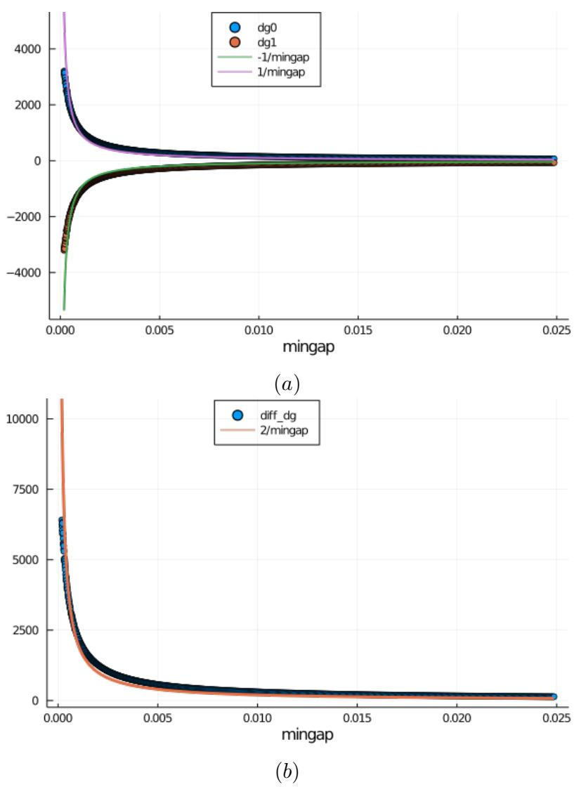  
Figure 3.5: Evolution of the derivative of $g _ { 0 }$ and $g _ { 1 }$ (a) and the difference (b) against the min-gap for $\alpha$ varying from 0 (large gap) to 0.66 close to the threshold $2 / 3$ (small gap).

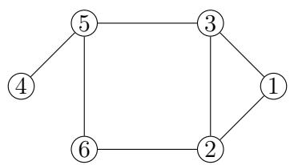  
Figure 3.6: Toy example 2

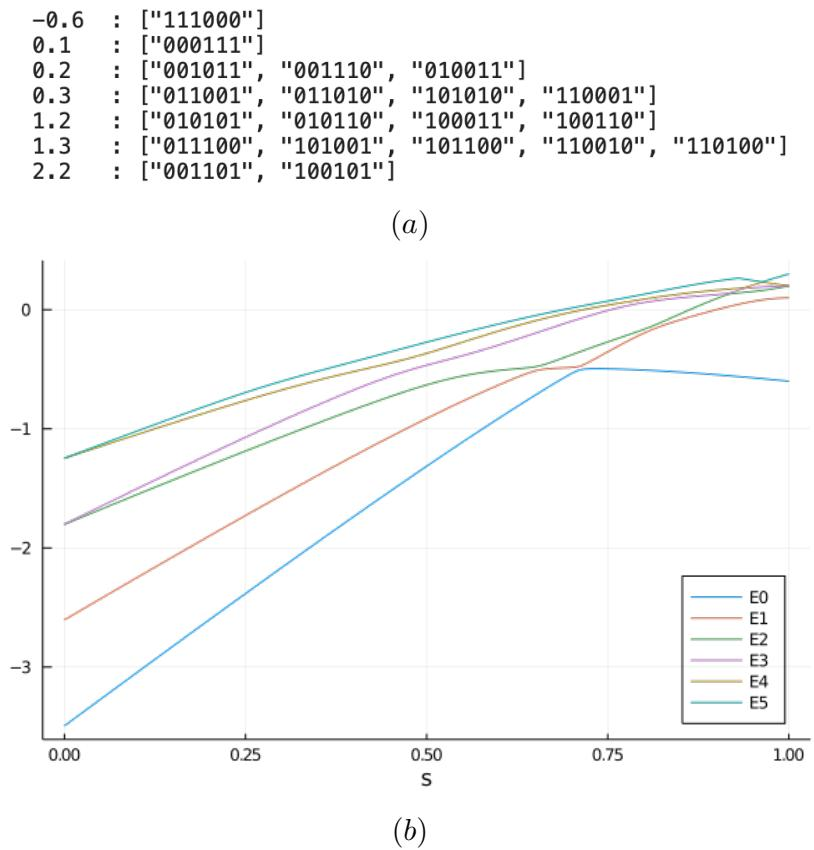  
Figure 3.7: States (a) with their energy and $E _ { i } ( s )$ (b) during evolution for toy example 3.6 with $\alpha = 0 . 2$

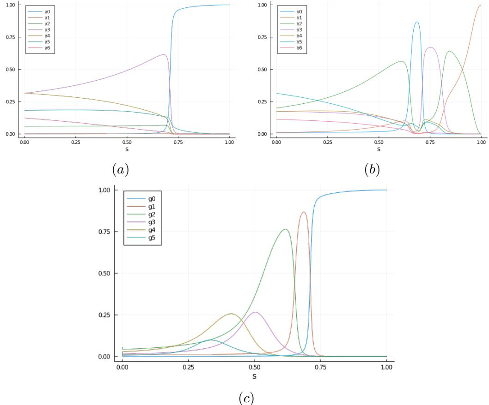  
Figure 3.8: $a _ { k }$ (a), $b _ { k }$ (b) and $g _ { k }$ (c) during evolution for toy example 3.6 with $\alpha = 0 . 2$ . Values indexed by 0 are in blue, those by 1 in red, 2 in green and 3 in purple.

# Remarks:

1. On Fig. 3.8 (a), we only see one specific situation, namely the crossing of $a _ { 3 }$ with $a _ { 0 }$ at the anti-crossing point $s ^ { * }$ between $E _ { 0 }$ and $E _ { 1 }$ . This means that the curve $E _ { 0 } ( s )$ was going toward the $4 ^ { t h }$ energy level in terms of the slope before $s ^ { * }$ and immediately change its slope toward its final direction of the $1 ^ { s t }$ energy level. Hypothetically, we could observe $a _ { 3 }$ crossing $a _ { 1 }$ , which will indicate that $E _ { 0 } ( s )$ change its direction toward the $2 ^ { n d }$ energy level, then $a _ { 1 }$ crossing $a _ { 0 }$ . In this hypothetical case, $E _ { 0 } ( s )$ undergoes two anti-crossings.

2. On Fig. 3.8 (b), we focus on the behavior of $| \phi _ { 1 } ( s ) \rangle$ . Here, we understand that $E _ { 1 } ( s )$ first went toward the $3 ^ { r d }$ energy level before changing direction toward the lowest energy level. This is $b _ { 2 }$ crossing $b _ { 0 }$ when the first anticrossing between $E _ { 1 }$ and $E _ { 2 }$ occurs. Then, it takes the direction of the $4 ^ { t h }$ energy level when $b _ { 0 }$ crosses $b _ { 3 }$ . Indeed, it fetches the direction of $E _ { 0 }$ before anti-crossing (remember it was $a _ { 3 }$ which was dominant at this point). Then again takes back its initial direction with $b _ { 2 }$ becoming dominant at the second anti-crossing between $E _ { 1 }$ and $E _ { 2 }$ . Eventually, smoothly change its direction toward its final goal.

3. On Fig. 3.8 (c), the point of view is quite different as we look from the final lowest energy position $E _ { 0 } ( 1 )$ and see from where it comes. We see in Fig. 3.7 (b) that the final blue slope undergoes two anti-crossing before becoming blue. Indeed, it starts green, then jumps to red and finally blue. These successive anti-crossings appear on the plot of $g _ { k }$ , first, $g _ { 2 }$ is dominant, then at the first anti-crossing between $E _ { 2 }$ and $E _ { 1 }$ , $g _ { 2 }$ crosses with $g _ { 1 }$ . Now, the final slope of $E _ { 0 }$ is transported by $E _ { 1 }$ . Eventually, $E _ { 1 }$ anti-crosses $E _ { 0 }$ so $g _ { 1 }$ crosses $g _ { 0 }$ and the evolution (at least for the ground-state) can finish peacefully.

From this detailed example, we understand that avoided crossings are a place where slopes of eigen energies are swapping. As hinted in the first bullet point of the remarks, the new introduced definition has its own limitation as we see in the next section.

# 3.3 Limitation and other potential type of AC

In this section, we highlight potential limitations in our AC definition. In Definition 3.1, emphasis is placed on the significance of the |GS⟩ coefficient in the instantaneous eigenvectors. As defined, $| \phi _ { 0 } ( s ) \rangle$ will ultimately converge to |GS⟩, and if an AC occurs between $E _ { 1 }$ and $E _ { 0 }$ , then $g _ { 0 }$ will inevitably undergo a noticeable increase. However, this observation holds true only for the final AC in the evolution. Notably, if $E _ { 0 }$ experiences multiple AC events (as in [Somma et al. 2012, Feinstein et al. 2022]), the initial AC may not conform to the behaviors outlined in our definition.

For instance, considering an energy spectrum akin to Fig. 3.9, our definition remains applicable for the second AC of $E _ { 0 } ( s )$ but not for the first one. In this scenario, $g _ { 2 }$ begins to dominate before the first anti-crossing between $E _ { 2 }$ and $E _ { 1 }$ . Subsequently, $g _ { 2 }$ intersects with $g _ { 1 }$ , which then becomes the dominant coefficient. The crossing between $g _ { 1 }$ and $g _ { 0 }$ occurs at the second anti-crossing between $E _ { 1 }$ and $E _ { 0 }$ , aligning with the predictions of our definition.

Now the question is “How can we describe the first AC”. We have two perspectives. Either we take the point of view of looking where $E _ { 0 }$ is going. Here, following the different AC brings the initial slope of $E _ { 0 }$ to $E _ { 3 }$ , so $a _ { 3 }$ is becoming dominant, then after the crossing point, $E _ { 0 }$ is heading toward $E _ { 2 }$ so $a 2$ is becoming dominant.

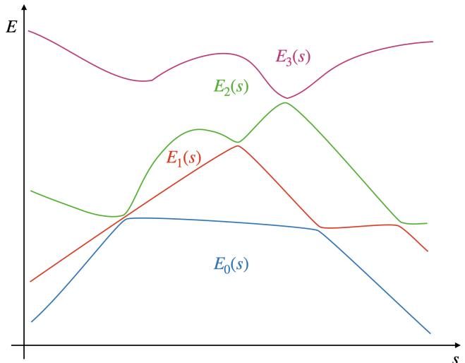  
Figure 3.9: Example of an energy spectrum in which the ground-state undergoes two anti-crossing. In this situation, the first AC does not follow our definition but the second one does.

We can expect a crossing of $a _ { 3 }$ and $a _ { 2 }$ and inversely between $b _ { 2 }$ and $b _ { 3 }$ as well. Or, similarly to our definition, we also expect $a 2$ and $b _ { 2 }$ to cross. We see with this example that it might be more complicated to find a general approach to describe an AC. Another potential AC is one where $E _ { 2 }$ anti-crosses with $E _ { 0 }$ leaving $E _ { 1 }$ in the middle without changing its trajectory.

# Conclusion

In this chapter, we questioned the definition of an AC given by [Choi 2020] and shown a limitation case. Supported by a theoretical approach, we suggested a relaxed definition to encompass more cases. We provided a complete example along with a discussion based on our intuition on the evolution of the different quantities $a _ { k }$ , $b _ { k }$ and $g _ { k }$ . Eventually we suggested further directions to describe even more potential AC. The main ingredient of all these observations are the conservation of the slope at an AC. Is it always verified? We leave this question for future work. Now that we have a better understanding of the phenomenon that can generate exponentially small minimum gap during a quantum evolution, we move on the presence of such closure during a quantum evolution. In the next chapter, we prove a necessary condition on the occurrence of exponentially closing gaps in AQC. As it happens, these gaps do not correspond to the definition we have introduced in this chapter, and we will study their impact on the efficiency of AQC.

# Exponentially closing gaps in AQC

# Contents

# 4.1 Perturbative Analysis to AQC 85

4.1.1 Initial perturbation . . . . 89   
4.1.2 Final perturbation 90   
4.1.3 Energy crossing . . 91

# 4.2 Application to MaxCut over bipartite graphs 93

4.2.1 $d -$ regular bipartite graphs 93   
4.2.2 General bipartite graphs 99   
4.2.3 Numerical study: AC and other observations 103   
4.2.4 Validation of perturbative expansion and limitations . . . . 106

4.3 Higher order perturbative expansion for MaxCut . . . . . . 108

In this chapter, we develop a perturbative first-order expansion at the beginning and end of the adiabatic process to prove a necessary condition for the appearance of first-order quantum phase transitions. In this chapter, we refer to AC as first-order quantum phase transitions that are characterized by the presence of an exponentially closing gap. We apply this result to the MaxCut problem on bipartite graphs. We show that AQC efficiently solves the problem when the graph is also regular. Furthermore, we construct a family of non-regular bipartite graphs that satisfies the AC occurrence condition, and numerically confirm the appearance of an exponentially decreasing gap. This last interesting case leads us to question the correlation between the appearance of an exponentially small gap and the difficulty of solving the problem since, despite the very small gap, AQC efficiently finds the optimal solution with a fairly good probability (Sec. 4.2). Not all exponentially small deviations are equivalent in terms of the efficiency of AQC. Using the definition of AC we proposed in chapter 3 (Def. 3.1), we are able to distinguish the latter case with a first-order quantum phase transition that is a source of failure for AQC. Finally, we suggest a more advanced perturbative expansion for the MaxCut problem (Sec. 4.3).

# 4.1 Perturbative Analysis to AQC

In this section, we apply the perturbative analysis presented in Sec. 2.4.1 to the AQC process. This idea has already been explored by other authors [Altshuler et al. 2010,

Amin $\&$ Choi 2009, Werner et al. 2023] to derive different results and intuitions about the occurrences of an anti-crossings during the evolution. The perturbative analysis can be naturally applied at the beginning ( $s ( 0 ) = 0$ ) and at the end ( $s ( T ) = 1$ ) of the evolution. Typically, we know the eigen basis of $H _ { 0 }$ and $H _ { 1 }$ which allows us to deduce relevant features about the process. Building on the work of [Werner et al. 2023], we develop here an expansion of the energy $E _ { 0 } ^ { I } = E _ { 0 } ( 0 )$ of the initial state $| \psi _ { 0 } \rangle = | \phi _ { 0 } ( 0 ) \rangle$ , i.e. the ground-state of $H _ { 0 }$ and for the energies $E _ { g s } = E _ { 0 } ( 1 )$ of the final ground-state $| \mathsf { G S } \rangle = | \phi _ { 0 } ( 1 ) \rangle$ and $E _ { f s } = E _ { 1 } ( 1 )$ of the final first excited state $| \mathsf { F S } \rangle = | \phi _ { 1 } ( 1 ) \rangle$ of $H _ { 1 }$ . We further assume that the first excited subspace of $H _ { 1 }$ is degenerate, meaning that there are many solutions with second best cost value. We already know from [Amin $\&$ Choi 2009] that the second-order perturbation can be enough to prove the presence of an AC. In Sec. 2.4.3, we also saw that at first-order, without the degeneracy condition, it was impossible to conclude on the crossing of the perturbed final energy. In [Werner et al. 2023], the authors show that adding the condition of a first degenerate excited subspace of $H _ { 1 }$ lifts the degeneracy at first order. We place ourselves in this setting to derive powerful technical results on the occurrence of ACs. Recall that AC refers to the point where the gap is closing exponentially fast, i.e. when the two lowest instantaneous eigen-energies are getting exponentially close to each other. Intuitively, the energy curves almost cross but change directions right before (Sec. 2.4 and 3.2).

Before deriving the different expansions (in the next sections), let us set again the considered time-dependent Hamiltonian $H ( s ) = ( 1 - s ) H _ { 0 } + s H _ { 1 }$ . We need to define $H _ { 0 }$ , $H _ { 1 }$ and the trajectory $s ( t )$ . We choose to stay in the standard setting of AQC for solving classical optimization problems defined over the bit-strings of size $s ( t )$ can be any function from 1 to $0$ (e.g. $\textstyle s ( t ) = { \frac { t } { T } }$ ), $\begin{array} { r } { H _ { 0 } = - \sum _ { i } \sigma _ { x } ^ { ( i ) } } \end{array}$ where $n$ where he sum is over the $n$ qubits of the considered quantum system and $\begin{array} { r } { H _ { 1 } = \sum _ { x \in \{ 0 , 1 \} ^ { n } } E _ { x } | x \rangle \langle x | } \end{array}$ . $E _ { x }$ is the value for a classical $n -$ bit-string $x$ of the function we want to optimize, i.e. if $C$ is a cost function to minimize, $C ( x ) = E _ { x }$ . We refer the reader to Sec. 2.2 for more details on the construction of the Hamiltonians. From this setting, we know that $| \psi _ { 0 } \rangle$ is the uniform superposition over all bit-strings and the associated eigen-space is non-degenerate. We further assume that the ground space of $H _ { 1 }$ is non-degenerate as well, i.e. ∃! $x ^ { * }$ , $E _ { x ^ { * } } = E _ { g s }$ while the first excited subspace is degenerate, i.e. ∃ $x \neq y$ , $E _ { x } = E _ { y } = E _ { f s } > E _ { g s }$ .

We now introduce different graphs that help us to better visualize some quantities. As described in Sec. 2.2.2, $H _ { 0 }$ can be seen as the negative adjacency matrix of an $n -$ regular graph. If each node represents a bit-string $x$ , this state is connected to another one $y$ via $H _ { 0 }$ if $y$ is exactly one bit-flip ( $\sigma _ { x }$ operation) away from $x$ . We express this relation as x ∼ y. For any bit-string of size $n$ , there are exactly $n$ possible bit-flips. $- H _ { 0 }$ represents the search graph which is the hypercube in dimension $n$ among all possible solutions $x$ . We can isolate the nodes that belong to the degenerate first excited subspace of energy $E _ { f s }$ among all $x$ , i.e. $V _ { \mathrm { l o c } } = \{ y \in \{ 0 , 1 \} ^ { n } | E _ { y } = E _ { f s } \}$ and we can define the graph induced by those states $V _ { \mathrm { l o c } }$ in $- H _ { 0 }$ . We call $G _ { l o c }$ this subgraph that corresponds to the local minima of the optimization problem. An example of $G _ { l o c }$ in the 5-cube is shown on Fig. 4.1. We use MaxCut on a cycle to generate this example, we give the details in the next section. To visualize the landscape of such a graph, we draw in Fig. 4.2 a schematic two-dimensional plot of the objective function $C ( x )$ which is also the energy landscape of $H _ { 1 }$ . In the example of Fig. 4.1, we see that the optimal state $x ^ { * } = | 6 5 \rangle$ is only connected to states in $G _ { l o c }$ and there is no component of $G _ { l o c }$ far from it, i.e. with a potential barrier in between. This idea is conveyed in Fig 4.2 by the absence of green parts between the red and blue sections.

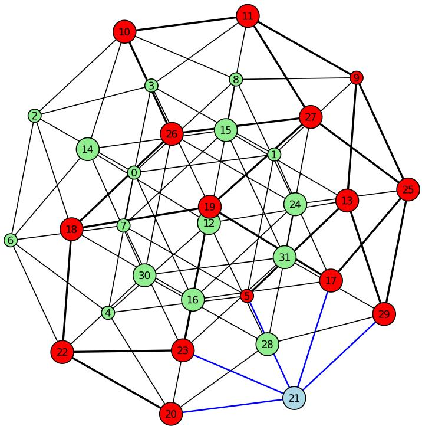  
Figure 4.1: A 5-cube with $G _ { l o c }$ highlighted with red nodes and thick black edges. Light-blue node is the unique ground-state and blue edges show the connection between $G _ { l o c }$ and the ground-state. Green nodes are all the other possible states with higher energies. The labels, once converted in binary, represent the state configuration.

In the rest of the section, we detail the perturbation expansions and how we can articulate them to derive a condition on the occurrence of the anti-crossing during AQC. More precisely, we will prove the following theorem:

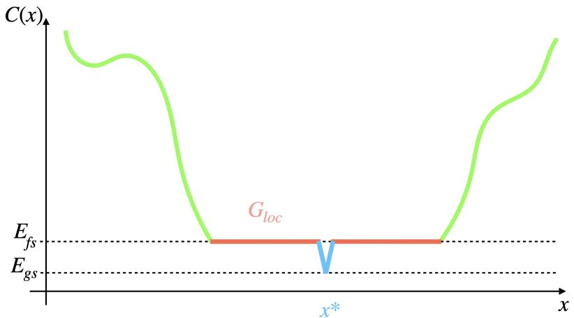  
Figure 4.2: Schematic energy landscape of $H _ { 1 }$ corresponding to Fig. 4.1. $G _ { l o c }$ has only one component and is strongly connected to the optimal state $x ^ { * }$ .

defined above, and by defining

$$
s _ { l g } = \frac { \lambda _ { 0 } ( l o c ) } { \Delta H _ { 1 } + \lambda _ { 0 } ( l o c ) } = \frac { 1 } { 1 + \frac { \Delta H _ { 1 } } { \lambda _ { 0 } ( l o c ) } }
$$

and

$$
\alpha _ { H _ { 1 } } = \frac { \Delta H _ { 1 } } { \langle H _ { 1 } \rangle _ { 0 } - E _ { g s } }
$$

where $\Delta H _ { 1 } = E _ { f s } - E _ { g s }$ and $\langle H _ { 1 } \rangle _ { 0 }$ is the mean of $H _ { 1 }$ ’s eigenvalues, we can say that an anti-crossing happens at $s _ { l g }$ if $\lambda _ { 0 } ( l o c ) > n \alpha _ { H _ { 1 } }$ . No anti-crossing occurs if $\lambda _ { 0 } ( l o c ) < n \alpha _ { H _ { 1 } }$ .

The assumption on $\lambda _ { 0 } ( l o c )$ is always satisfied when $G _ { l o c }$ has a unique major component. This forms a general condition on the occurrence of an anti-crossing during a quantum process with the assumptions of the theorem. We see that the $\alpha _ { H _ { 1 } }$ parameter depends only on the problem $H _ { 1 }$ while $\lambda _ { 0 } ( \mathrm { l o c } )$ is mixing $H _ { 0 }$ and $H _ { 1 }$ . We observe from this result that the potential occurrence time of an AC around $s _ { l g }$ is ruled by the ratio $\frac { \Delta H _ { 1 } } { \lambda _ { 0 } ( \mathrm { l o c } ) }$ . In practice, this result can help computer scientists to design appropriate schedules by slowing the evolution around the AC. However, the $\lambda _ { 0 } ( \mathrm { l o c } )$ parameter can be complicated to compute. It encodes the centrality of $G _ { l o c }$ and can be interpreted as the importance of this graph. To tackle this we use a result from graph theory [Zhang 2021] that bounds the largest eigenvector of a graph by : $\mathbf { d } _ { \mathrm { a v g } } ( \mathrm { l o c } ) \leq \lambda _ { 0 } ( \mathrm { l o c } ) \leq \mathbf { d } _ { \mathrm { m a x } } ( \mathrm { l o c } )$ . Where $\mathbf { d } _ { \mathrm { a v g } } ( \mathrm { l o c } )$ and $\mathbf { d } _ { \mathrm { { m a x } } } ( \mathrm { { l o c } ) }$ denote the average and maximum degree of $G _ { l o c }$ respectively. We can derive the following more practical corollary:

Corollary 4.1. By introducing,

$$
\begin{array} { l } { s _ { l g } ^ { + } = \frac { d _ { a v g } ( l o c ) } { \Delta H _ { 1 } + d _ { a v g } ( l o c ) } } \\ { s _ { l g } ^ { - } = \frac { d _ { \operatorname* { m a x } } ( l o c ) } { \Delta H _ { 1 } + d _ { \operatorname* { m a x } } ( l o c ) } } \end{array}
$$

we can distinguish three regimes :

- AC occurs in the interval $[ s _ { l g } ^ { + } , s _ { l g } ^ { - } ]$ if $d _ { a v g } ( l o c ) > n \alpha _ { H _ { 1 } }$ ;   
- No-A $C$ occurs if $d _ { \operatorname* { m a x } } ( l o c ) < n \alpha _ { H _ { 1 } }$ ;   
- Undefined if $d _ { \operatorname* { m a x } } ( l o c ) > n \alpha _ { H _ { 1 } } > d _ { a v g } ( l o c )$ .

This corollary gives an interval where an AC may occur. Furthermore, it will help anyone who wants to study the different regimes when applied to a specific problem as we do with MaxCut in the next section. In any case, this analytical result is derived from the perturbative theory and the validity of the truncation used needs to be checked. We suggest a validation of this approach applied to MaxCut over bipartite graphs, through analytical and numerical evidence in Sec. 4.2.4. Now let us detail the proof of the theorem.

# 4.1.1 Initial perturbation

At the beginning of the evolution, we know that we start from the ground-state of $H _ { 0 }$ with energy $E _ { 0 } ^ { I }$ , i.e. $H _ { 0 } | \psi _ { 0 } \rangle = E _ { 0 } ^ { I } | \psi _ { 0 } \rangle$ . We are interested in how it changes while perturbing $H _ { 0 }$ with some $H _ { 1 }$ . More formally, let us look at the modified Hamiltonian $\begin{array} { r } { \dot { H } ( \varepsilon ) = H _ { 0 } + \varepsilon H _ { 1 } } \end{array}$ which is obtained by dividing the original Hamiltonian by $( 1 - s )$ and setting $\textstyle { \varepsilon = { \frac { s } { 1 - s } } }$ . If we call $\tilde { E } _ { \mathrm { d e l o c } } ( \varepsilon )$ , “deloc” for delocalized state, the groundstate energy expansion at first-order of $\ddot { H } ( \varepsilon )$ , by perturbative analysis with nondegenerate subspace, the first-order expansion is :

$$
\begin{array} { r l } & { \tilde { E } _ { \mathrm { d e l o c } } ( \varepsilon ) = E _ { 0 } ^ { ( 0 ) } + \varepsilon E _ { 0 } ^ { ( 1 ) } } \\ & { \qquad = \langle \psi _ { 0 } | H _ { 0 } | \psi _ { 0 } \rangle + \varepsilon \langle \psi _ { 0 } | H _ { 1 } | \psi _ { 0 } \rangle } \\ & { \qquad = E _ { 0 } ^ { I } + \varepsilon \langle H _ { 1 } \rangle _ { 0 } } \end{array}
$$

where $E _ { 0 } ^ { I } = - n$ and the associated state $| \psi _ { 0 } \rangle$ is a uniform superposition among all bit-strings. Hence, $\langle H _ { 1 } \rangle _ { 0 }$ represents the mean of all possible values of the optimization problem, encoded in $H _ { 1 }$ . Therefore, in the $s$ frame, we end up with :

$$
E _ { \mathrm { d e l o c } } ( s ) = - ( 1 - s ) n + s \langle H _ { 1 } \rangle _ { 0 }
$$

This change of frame is valid as one could have studied directly $H ( s ) = H ( s _ { \times } ) +$ $( s - s _ { \times } ) \dot { H }$ for $s _ { \times } = 0$ as we do when looking at the AC point $s _ { \times } = s ^ { * }$ in Sec. 2.4.2.

# 4.1.2 Final perturbation

At the end of the evolution, we know that the ideal case is one where the state largely overlaps with the final ground-state. However, the appearance of an anti-crossing can lead to a significant overlap with the first excited state, or even with higher levels (see Sec. 3.3 for ACs cascade). We are therefore interested in the behavior of the energies ending in $E _ { g s }$ and $E _ { f s }$ when perturbed by $H _ { 0 }$ . More formally, consider the modified Hamiltonian $H ( \lambda ) = H _ { 1 } + \lambda H _ { 0 }$ which is obtained by dividing the original Hamiltonian by $s$ and setting $\begin{array} { r } { \lambda = \frac { 1 - s } { s } } \end{array}$ . We choose this point of view because it is more usual when applying perturbation theory, but as the initial case, setting $s _ { \times } = 1$ leads to the same expressions.

First, we focus on the behavior of the ground-state. We know that $H _ { 1 } | { \sf G S } \rangle =$ $E _ { g s } | \mathsf { G S } \rangle$ . If we call $E _ { \mathrm { g l o b } } ( \lambda )$ , where “glob” stands for global minima, the groundstate energy expansion at first-order of $H ( \lambda )$ , by perturbative analysis with a nondegenerate subspace, the first-order expansion is :

$$
\begin{array} { r l } & { \bar { E } _ { \mathrm { g l o b } } ( \lambda ) = E _ { g s } ^ { ( 0 ) } + \lambda E _ { g s } ^ { ( 1 ) } } \\ & { \quad \quad = \langle \mathsf { G S } | H _ { 1 } | \mathsf { G S } \rangle + \lambda \langle \mathsf { G S } | H _ { 0 } | \mathsf { G S } \rangle } \\ & { \quad \quad = E _ { g s } } \end{array}
$$

Recall that $E _ { g s }$ is the optimal value of the optimization problem we are studying and the associated eigenspace is non-degenerate. Thus $| \mathsf { G S } \rangle$ is a quantum state that encodes a classical bit-string, the optimal solution to the problem. In other words, $| \mathsf { G S } \rangle$ is a vector of the canonical basis of the Hilbert space and $\langle \mathsf { G S } | H _ { 0 } | \mathsf { G S } \rangle$ is a diagonal element of $H _ { 0 }$ which are all zero. Therefore in the $s$ frame, we obtain :

$$
E _ { \mathrm { g l o b } } ( s ) = s E _ { g s }
$$

Secondly, we focus on the evolution of the first excited state. However, we supposed that this subspace is degenerate so we need to be more precise about which state we want to study. Let $| \mathsf { F S } , k \rangle$ be the $k ^ { t h }$ eigenstate of the degenerate eigenspace of $H _ { 1 }$ , by definition $H _ { 1 } | \mathsf { F S } , k \rangle = E _ { f s } | \mathsf { F S } , k \rangle$ . If we keep the usual bitstring basis among the degenerate subspace, the first order term $\langle \mathsf { F S } , k | H _ { 0 } | \mathsf { F S } , k \rangle$ will always be zero and the degeneracy is not lifted. The states $| \mathsf { F S } , k \rangle$ can be ordered by continuity of the non-degenerate instantaneous energy landscape of $H ( s )$ and thus $H ( \lambda )$ as well. We therefore focus on the energy evolution of the state $| \mathsf { F S } , 0 \rangle$ . If we call $E _ { \mathrm { l o c } } ( \lambda )$ the first excited state energy expansion at first-order of $H ( \lambda )$ , by perturbative analysis with non-degenerate subspace, the first-order expansion is :

$$
\begin{array} { r l } & { \bar { E } _ { \mathrm { l o c } } ( \lambda ) = E _ { f s , 0 } ^ { ( 0 ) } + \lambda E _ { f s , 0 } ^ { ( 1 ) } } \\ & { \quad \quad = \langle \mathsf { F S } , 0 | H _ { 1 } | \mathsf { F S } , 0 \rangle + \lambda \langle \mathsf { F S } , 0 | H _ { 0 } | \mathsf { F S } , 0 \rangle } \\ & { \quad \quad = E _ { f s } + \lambda \langle \mathsf { F S } , 0 | H _ { 0 } | \mathsf { F S } , 0 \rangle } \end{array}
$$

To lift the degeneracy at first-order, we need to find a “good” basis $| \mathsf { F S } , k \rangle$ for which $\forall k \geq 1 , \langle \mathsf { F S } , 0 | H _ { 0 } | \mathsf { F S } , 0 \rangle < \langle \mathsf { F S } , k | H _ { 0 } | \mathsf { F S } , k \rangle$ . We take as basis vectors $| \mathsf { F S } , k \rangle$ of the degenerate eigenspace the eigenvectors of adjacency matrix $A _ { l o c }$ of $G _ { l o c }$ . With this notation, $A _ { l o c } | \mathsf { F S } , k \rangle = \lambda _ { k } | \mathsf { F S } , k \rangle$ where we order $\lambda _ { 0 } > \lambda _ { 1 } \ge \lambda _ { 2 } \ge$ ... and finally $\langle \mathsf { F S } , k | H _ { 0 } | \mathsf { F S } , k \rangle = - \lambda _ { k }$ by construction. This ensures that the degeneracy is lifted if the largest eigenvalue of $A _ { l o c }$ is unique. This happens if $G _ { l o c }$ has a unique major component, which we assume. Note that if $G _ { l o c }$ consists only of isolated nodes, intuitively they become as difficult as the ground-state to find by AQC unless there are exponentially many of them [Ebadi et al. 2022], we assume from now that this is not the case. Hence, $\lambda _ { 0 }$ is unique and in the $s$ frame, we end up with :

$$
E _ { \mathrm { l o c } } ( s ) = s E _ { f s } - ( 1 - s ) \lambda _ { 0 }
$$

From [Zhang 2021], we can bound the largest eigenvector of a graph by : $\mathbf { d } _ { \mathrm { a v g } } ( \mathrm { l o c } ) \leq$ $\lambda _ { 0 } \leq \mathbf { d } _ { \operatorname* { m a x } } ( \mathrm { l o c } )$ , where $\mathbf { d } _ { \mathrm { a v g } } ( \mathrm { l o c } )$ and $\mathbf { d } _ { \mathrm { { m a x } } } ( \mathrm { { l o c } ) }$ denote the average and maximum degree of $G _ { l o c }$ respectively. Consequently, we can use the following more practical bounds on $E _ { \mathrm { l o c } } ( s )$ :

$$
\begin{array} { r l } & { E _ { \mathrm { l o c } } ( s ) \geq s E _ { f s } - ( 1 - s ) \mathbf { d } _ { \mathrm { m a x } } ( \mathrm { l o c } ) = E _ { \mathrm { l o c } } ^ { - } ( s ) } \\ & { E _ { \mathrm { l o c } } ( s ) \leq s E _ { f s } - ( 1 - s ) \mathbf { d } _ { \mathrm { a v g } } ( \mathrm { l o c } ) = E _ { \mathrm { l o c } } ^ { + } ( s ) } \end{array}
$$

# 4.1.3 Energy crossing

  
Figure 4.3: Schematic behavior of the three energy expansions: (left) a case where the condition of AC is not satisfied and (right) a case where the condition is satisfied.

We are in position to distinguish different regimes during which an avoidedcrossing does or does not occur. The state begins in the delocalized situation, since $| \psi _ { 0 } \rangle$ is the uniform superposition, with energy $E _ { \mathrm { d e l o c } }$ . If it first crosses $E _ { \mathrm { g l o b } }$ , it then follows trajectory of the instantaneous ground-state to “easily” reach the final optimal state. If it crosses $E _ { \mathrm { l o c } }$ first, then it follows the trajectory of the first instantaneous excited state, and at some point it will cross $E _ { \mathrm { g l o b } }$ later and an anti-crossing will occur at that instant. Hence, the two instants of interest in the dynamics are $s _ { d g }$ , defined such that $E _ { \mathrm { d e l o c } } ( s _ { d g } ) = E _ { \mathrm { g l o b } } ( s _ { d g } )$ , and $s _ { d l }$ , defined such that $E _ { \mathrm { d e l o c } } ( s _ { d l } ) = E _ { \mathrm { l o c } } ( s _ { d l } )$ . If $s _ { d l } < s _ { d g }$ , then an anti-crossing occurs at time $s _ { l g }$ verifying that $E _ { \mathrm { l o c } } ( s _ { l g } ) = E _ { \mathrm { g l o b } } ( s _ { l g } )$ . Fig. 4.3 shows the possible behavior of the energy expansions. In this plot, we assume that $E _ { g s } < E _ { f s } < 0$ . The slope of the curve $E _ { \mathrm { l o c } }$ also depends on $\lambda _ { 0 }$ , the largest eigenvalue of $G _ { l o c }$ . A larger $\lambda _ { 0 }$ value shifts the sign of the slope toward positives values, so that $E _ { \mathrm { l o c } }$ crosses $E _ { \mathrm { d e l o c } }$ before $E _ { \mathrm { g l o b } }$ , all else being equal. This situation (right) will create an AC during the annealing. It is important to note that a large value of $\lambda _ { 0 }$ means high connectivity in the graph $G _ { l o c }$ (or at least in its largest component). In other words, this means that the local minima are large in the mixing graph $H _ { 0 }$ making it difficult for AQC to converge toward the global minimum.

We can derive the explicit expression for $s _ { d g } , s _ { d l }$ and $s _ { l g }$ as follows:

$$
\begin{array} { l } { s _ { d g } = \displaystyle \frac { n } { n + \langle H _ { 1 } \rangle _ { 0 } - E _ { g s } } } \\ { s _ { d l } = \displaystyle \frac { n - \lambda _ { 0 } } { n - \lambda _ { 0 } + \langle H _ { 1 } \rangle _ { 0 } - E _ { f s } } } \\ { s _ { l g } = \displaystyle \frac { \lambda _ { 0 } } { \Delta H _ { 1 } + \lambda _ { 0 } } = \displaystyle \frac { 1 } { 1 + \frac { \Delta H _ { 1 } } { \lambda _ { 0 } } } } \end{array}
$$

We note

$$
\alpha _ { H _ { 1 } } = \frac { \Delta H _ { 1 } } { \langle H _ { 1 } \rangle _ { 0 } - E _ { g s } }
$$

where $\Delta H _ { 1 } = E _ { f s } - E _ { g s }$ , a parameter that depends only on the problem $H _ { 1 }$ we want to solve. And so AC occurs at $s _ { l g }$ if $s _ { d l } < s _ { d g }$ i.e. if $\lambda _ { 0 } > n \alpha _ { H _ { 1 } }$ . This concludes the proof of our theorem.

The corollary immediately follows by using $E _ { l o c } ^ { - } ( s )$ and $E _ { l o c } ^ { + } ( s )$ . The undefined regime is then when $s _ { d g } \in [ s _ { d l } ^ { - } , s _ { d l } ^ { + } ]$ because we cannot discriminate which curve the delocalized energy will cross first.

This result is quite general for many targets Hamiltonians, but we still need several conditions: the ground-state must be unique and the first excited subspace is degenerate, the validity of the first-order perturbative expansion and the unique largest component in $G _ { l o c }$ .

Remark. From a physical point of view, as developed in Sec. 2.4.3 and more in [Amin & Choi 2009], we understand that in the AC-case the instantaneous groundstate first localized in the first excited state |FS⟩ (or in the eigen subspace) corresponding to a quantum phase transition of second order generating only a polynomially small gap. The AC happens when the state then experiences a transition from a localized state |FS⟩ to another localized state |GS⟩ related to a first-order quantum phase transition.

In this section, we applied the perturbative analysis to AQC and showed under assumptions about $H _ { 1 }$ , $G _ { l o c }$ and the expansion truncation, that anti-crossings may occur during annealing given a condition to be satisfied that depends on $G _ { l o c }$ and

$H _ { 1 }$ . We have also given a corollary that relaxes the assumptions of the theorem so that it is more useful when applied to a specific problem. In the next section, we show such an application in the case of MaxCut on bipartite graphs.

# 4.2 Application to MaxCut over bipartite graphs

In this section, we apply Corollary 4.1 to the MaxCut problem over bipartite graphs. Given a graph $G ( V , E )$ , recall that the goal of MaxCut is to partition its node set $V$ into two parts $L$ and $R$ in order to maximize the number of cut edges, i.e., of edges with an endpoint in $L$ and the other in $R$ . Such partitions are classically encoded by a bit-string of size $n = | V |$ , the $i ^ { t h }$ bit being set to $0$ if node $i \in L$ , and to 1 if i ∈ R. We define our target Hamiltonian as H1 = − P⟨ij⟩∈E . This Hamiltonian (and the corresponding MaxCut cost function, see Sec. 2.2.2) has a trivial symmetry : any solution can be turned into a solution with the same energy by bit-flipping all its entries. Consequently, $H _ { 1 }$ has a degenerate ground-state. We can break down this symmetry by forcing an arbitrary bit (say the first one) to $0$ and updating $H _ { 1 }$ accordingly. In Sec. 4.2.4, we provide some analytical tools to justify the validation of the perturbation expansion in such cases.

To ensure that the two conditions on $H _ { 1 }$ are met, we need to choose a class of graphs such that the ground-state is non-degenerate (after breaking the trivial symmetry). Connected bipartite graphs obviously respect this property and we focus on them in the rest of the section. We will in particular show that the first excited subspace is degenerate. Also this class allows us to explicitly determine the parameter $\alpha _ { H _ { 1 } }$ and the graph $G _ { l o c }$ . This will help us to determine the existence (or not) of ACs while solving MaxCut on these graphs with AQC.

# 4.2.1 $d$ −regular bipartite graphs

We first restrict the bipartite graphs on being $d$ -regular and we will show that no AC appears during the evolution by using the result from Corollary $4 . 1 : \ \mathbf { d } _ { \mathrm { { m a x } } } ( \mathrm { { l o c } ) < }$ $n \alpha _ { H _ { 1 } }$ . Leading to the following theorem :

Theorem 4.2 (No AC - d-regular bipartite graphs). AQC efficiently solves MaxCut on $d -$ regular bipartite graphs, assuming the validity of the first-order expansion in this case.

First, we show the two following claims to give a value to $n \alpha H _ { 1 }$ , then we show the No-AC conditions with Lemma 4.1 if $d \not \in \{ 2 , 4 \}$ . The latter two cases are tackled separatly where we directly use the technical Theorem 4.1 to prove the desired result.

Claim 1. For $d$ -regular bipartite graphs we have, $\begin{array} { r } { n \alpha _ { H _ { 1 } } = \frac { 4 l } { d } } \end{array}$ , where $l \in [ 1 , d ]$ denotes the number of uncut edges in the first excited state, i.e. $E _ { f s } = E _ { g s } + l$ .

Proof of claim 1. For bipartite graphs we have that $\langle H _ { 1 } \rangle _ { 0 } = - \frac { | E | } { 2 }$ , $E _ { g s } = - | E |$ and $\Delta H _ { 1 } = l \in [ 1 , d ]$ . For regular graphs, we also have that $\begin{array} { r } { | E | = \frac { d n } { 2 } } \end{array}$ dn . This is enough to prove Claim 1. □

So $\begin{array} { l } { n \alpha _ { H _ { 1 } } = ~ \frac { 4 l } { d } } \end{array}$ and we need to look at how $\mathbf { d } _ { \mathrm { { m a x } } } ( \mathrm { { l o c } ) }$ and $\mathbf { d } _ { \mathrm { a v g } } ( \mathrm { l o c } )$ behave compared to $\textstyle { \frac { 4 l } { d } }$ .

Claim 2. There exist graphs with $\mathbf { d } _ { \mathrm { { m a x } } } ( \mathrm { { l o c } ) > 0 }$ only if $l = d$ . Therefore $n \alpha _ { H _ { 1 } } = 4$ . Proof of claim 2. Recall that $G _ { l o c }$ is the subgraph induced by solutions of energy $E _ { f s }$ in the hypercube $- H _ { 0 }$ . In other words, the vertices of $G _ { l o c }$ are configurations (bit-strings) of energy $E _ { f s }$ (so “second best” solutions for MaxCut), and two vertices are adjacent if the corresponding bit-strings differ in exactly one bit, i.e., each one is obtained by bit-flipping a single bit of the other. We denote by $\mathbf { d } _ { \mathrm { { m a x } } } ( \mathrm { { l o c } ) }$ the maximum degree of $G _ { l o c }$ . We know that, in the input graph $G$ , there exists a left/right partition of its vertices such that all edges lie across the partition (by bipartiteness). Looking at one configuration of the first excited subspace, it specifies another bipartition, this time with all but $l$ edges lying across it. We are interested in configurations that are not isolated in $G _ { l o c }$ because these nodes as mentioned in Sec. 4.1 do not play a role in AC occurrence. In such a configuration $x$ , we want that by flipping one node (i.e. moving it to the other side of the partition), the number of uncut edges stays the same, in order to obtain a configuration $y$ that is also a vertex of $G _ { l o c }$ . So this specific node needs to have half of its edges that are uncut and the other half that are cut in this particular configuration $x$ of the first excited subspace. This automatically restricts $l$ to be both even and larger than $d / 2$ .

Case $l = d / 2$ : Let us suppose $l = d / 2$ . We are in a situation similar to Fig. 4.4 (left). By supposing that $l = d / 2$ , it means, in the configuration of one excited state, all other edges must go from left ( $L$ ) to right ( $R$ ). This splits the configuration in the classical L/R partition of a cut. Then we show the following claim that node 1 is a minimal separator of the graph which creates another split up ( $U$ ) and down $( D )$ (Fig 4.4 - right).

Claim 3. Assume that $l = d / 2$ and let us consider a configuration corresponding to a non-isolated vertex of $G _ { l o c }$ . Then there is a node of the input graph $G$ , say node 1, having $d / 2$ neighbors on each side of the configuration. Moreover, this node is a minimal separator of the graph (see Fig. 4.4).

Proof of claim 3. The configuration $x$ is such that all edges but $l = d / 2$ are cut, and this also holds after the bit-flip of one of its bits. Assume without loss of generality that this is the first bit, corresponding to node 1, and that 1 is on the left-hand side of the configuration, i.e., $1 \in L$ . Since flipping node 1 from left to right maintains the number of cut edges, it means that 1 has exactly $d / 2$ neighbors in set $L$ and $d / 2$ in set $R$ . Since $l = d / 2$ , it also means that the $l$ uncut edges are precisely the $d / 2$ ones incident to node 1, from 1 to vertices of $L$ .

Let $N _ { D } ( 1 )$ denote the set of neighbors of $^ 1$ in $L$ , and $N _ { U } ( 1 )$ denote the set of neighbors of $1$ in $R$ . We prove that $N _ { D } ( 1 )$ and $N _ { U } ( 1 )$ are disconnected in graph $G - 1$ , obtained from the input graph $G$ by deleting vertex 1. By contradiction, assume there is a path $P$ from $a \in N _ { U } ( 1 )$ to $b \in N _ { D } ( 1 )$ in $G - 1$ . Path $P$ together with vertex 1 form a cycle in graph $G$ . By bipartiteness, this cycle is even, so at least one edge of the cycle, other than $\{ 1 , b \}$ , is contained in $L$ or $R$ . This is in contradiction with the assumption that $l = d / 2$ and all of of these specific $d / 2$ edges are linked to the same node 1. Therefore, $G - 1$ is disconnected. This proves claim 3. □

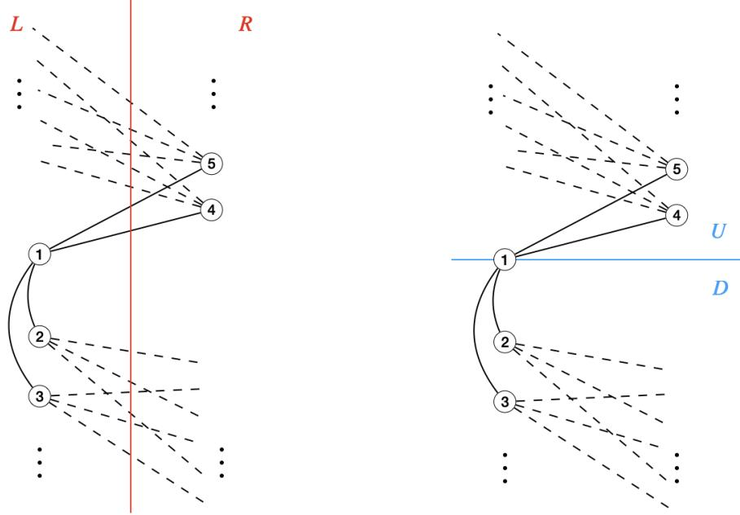  
Figure 4.4: Construction of a specific first excited configuration with $d = 4$ . The L/R partition (left) is natural in MaxCut. The $U / D$ partition (right) is relevant if 1 is a minimal separator.

This creates four quadrants $U L$ , $U R$ , $D L$ and $D R$ as follows: $U$ is the subset of nodes of $G$ formed by the union of connected components of $G - 1$ intersecting $N _ { U } ( 1 )$ , and $D$ is its complement. Then $U L$ , $U R$ , $D L$ and $D R$ are defined as the respective intersections of $U$ and $D$ with $L$ and $R$ ( $U L = U \cap L$ and similar). The above considerations tell us that all edges of $G - 1$ go either from $U L$ to $U R$ or from $D L$ to $D R$ . Now, we call $n D L$ and $n D R$ the numbers of nodes in parts $D L$ and $D R$ (other than the labeled ones, i.e., the neighbors of node 1). By counting the edges from $D L$ to $D R$ , observe that these variables must satisfy the following equation:

$$
\frac { d } { 2 } ( d - 1 ) + d n _ { D L } = d n _ { D R }
$$

Because we know that $d$ is even and, $n D L$ and $n D R$ are integers, the above equation cannot be satisfied.

Case $l > d / 2$ : $l$ must be strictly larger than $d / 2$ , i.e. $l \in [ \frac { d } { 2 } + 1 , d ]$ . All these $l$ uncut edges can be split between $r _ { L }$ and $r _ { R }$ , the ones on the left side and right side respectively and without loss of generality we choose that already $d / 2$ of them are on the left side. So $\boldsymbol { r } _ { L } \in [ \frac { d } { 2 } , d ]$ , $r _ { R } \in [ 0 , \frac { d } { 2 } ]$ and $l = r _ { L } + r _ { R }$ . Again we can count the number of edges that lie across $\mathrm { L }$ and R and we end up with:

$$
d n _ { L } - 2 r _ { L } = d n _ { R } - 2 r _ { R }
$$

where $n _ { L } = | L |$ , $n _ { R } = | R |$ and $n _ { L } + n _ { R } = n$ the total number of nodes. In a $d -$ regular bipartite graph, $n$ is necessarily even, so we have that

$$
r _ { L } - r _ { R } = 2 { \bigl ( } { \frac { n } { 2 } } - n _ { R } { \bigr ) } { \frac { d } { 2 } } = k d \quad { \mathrm { ~ f o r ~ } } k \in \mathbb { Z }
$$

The potential values for $r _ { L }$ and $r _ { R }$ bring the interval for $r _ { L } - r _ { R }$ to $[ 0 , d ]$ . So only $k = 0$ and $k = 1$ are possible. If $k = 0$ , then $r _ { L } = r _ { R } = d / 2$ so $l = d$ . If $k = 1$ , then $r _ { R } = 0$ , $r _ { L } = d$ so $l = d$ . In any case, the only possibility is to have $l = d$ which concludes the proof of claim 2. □

These two claims simplify the expression of the different AC occurrence conditions, as follows:

- AC if $\mathbf { d } _ { \mathrm { a v g } } ( \mathrm { l o c } ) > 4$ ;   
- No-AC if $\mathbf { d } _ { \mathrm { { m a x } } } ( \mathrm { { l o c } ) < 4 }$ ;   
- Undefined if $\mathbf { d } _ { \mathrm { m a x } } ( \mathrm { l o c } ) > 4 > \mathbf { d } _ { \mathrm { a v g } } ( \mathrm { l o c } )$ .

We are left with a last thing to show to ensure that no AC occurs while solving MaxCut on $d -$ regular bipartite graphs with AQC. To this purpose, we show this final lemma:

Lemma 4.1. If $d \not \in \{ 2 , 4 \}$ then $d \mathrm { m a x } ( l o c ) < 4$ .

Proof. Recall that odd values for $d$ are already disregarded as $d$ must be even. Suppose it is possible to have $\mathbf { d } _ { \mathrm { { m a x } } } ( \mathrm { { l o c } ) \geq 4 }$ then it means that we need at least four nodes in a configuration such as Fig. 4.4, where half of their edges are uncut. Let us call $F$ the set of these latter nodes, i.e. $| F | = \mathbf { d } _ { \mathrm { { m a x } } } ( \mathrm { { l o c } ) }$ . It means that there are at least $| F | { \frac { d } { 2 } } \geq 2 d$ outgoing uncut edges from the nodes in $F$ . By outgoing edge from a node, we mean the extremity of the edge that leaves the node (each edge contributes to two outgoing edges, one for each of its nodes). So here we count the number of edges that leave a node in $F$ which are uncut. We are allowed at most $d$ uncut edges to be a local minimum. So all of these $2 d$ outgoing uncut edges need to generate exactly $d$ edges. This remark forces $\mathbf { d } _ { \mathrm { { m a x } } } ( \mathrm { { l o c } ) }$ to be smaller than 4, so suppose $\mathbf { d } _ { \mathrm { { m a x } } } ( \mathrm { { l o c } ) = 4 }$ . One node has only three possible neighbors for its $d / 2$ uncut edges, so it is possible as long as ${ \frac { d } { 2 } } \leq 3$ , i.e., $d \leq 6$ . For $d = 6$ , linking all of these edges creates a triangle which makes the whole graph non-bipartite. □

To finish the demonstration of Theorem 4.2, we still have to handle the cases for which $d \in \{ 2 , 4 \}$ . We treat them separately and show that they fall in the Undefined regime so we directly use Theorem 4.1 to conclude.

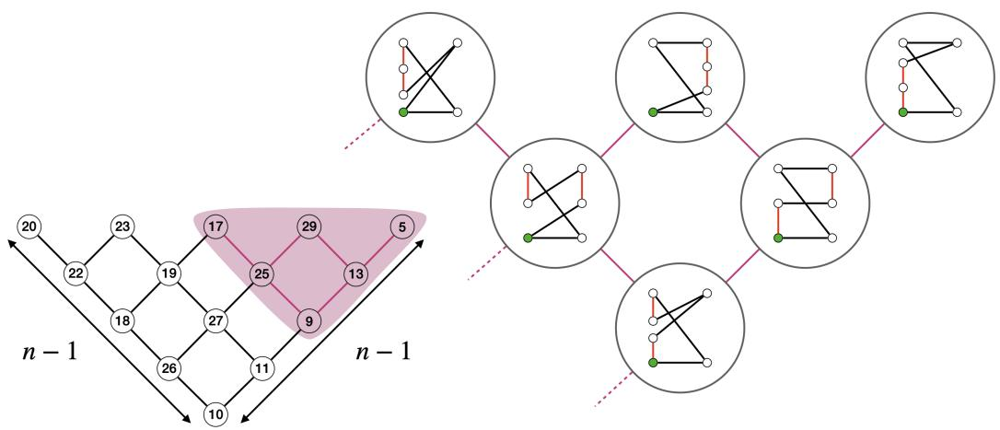  
Figure 4.5: Left: $G _ { l o c }$ of a cycle of size $n = 6$ . Right: a precision of the first excited state configurations from the upper-right part of $G _ { l o c }$ . Red edges are the uncut ones and the green node is the fixed node such that the top right node corresponding to node labeled 5 in $G _ { l o c }$ is 000101. We easily see that nodes in $\{ 2 0 , 2 3 , 1 7 , 2 9 , 5 \}$ are linked to the ground-state.

Case $d = 2$ : As $d$ must be even, we focus on even cycles. We see that it creates a large $G _ { l o c }$ , see Fig. 4.5.

We can easily evaluate the average and maximum degree of this graph as :

$$
\begin{array} { l } { \displaystyle \mathbf { d } _ { \mathrm { m a x } } ( \mathrm { l o c } ) = 4 } \\ { \displaystyle \mathbf { d } _ { \mathrm { a v g } } ( \mathrm { l o c } ) = 4 \frac { n - 2 } { n } = 4 ( 1 - \frac { 2 } { n } ) } \end{array}
$$

These values bring the cycle in the Undefined regime. However, we can expect that AQC will easily work with a MaxCut on an even cycle because its $G _ { l o c }$ is highly connected to the ground state. Fig. 4.1 shows how $G _ { l o c }$ (which is the one in Fig. 4.5) is linked to the ground-state (blue edges). More precisely, there are $n - 1$ connections with the ground state in an $( n - 1 )$ -regular graph. This means that there is no potential barrier to overcome going from states in $G _ { l o c }$ to the $| \mathsf { G S } \rangle$ .

Another justification is to directly use the technical Theorem 4.1 which says that no AC occurs if $\lambda _ { 0 } < 4$ , where $\lambda _ { 0 }$ is the largest eigenvalue of $G _ { l o c }$ . We know that $\lambda _ { 0 } = \mathbf { d } _ { \mathrm { m a x } } ( \mathrm { l o c } )$ if and only if $G _ { l o c }$ is $\mathbf { d } _ { \mathrm { { m a x } } } ( \mathrm { { l o c } ) }$ -regular, otherwise $\lambda _ { 0 } < \mathbf { d } _ { \operatorname* { m a x } } ( \mathrm { l o c } )$ . So we are in the no-AC regime.

Case $d = 4$ : By construction, in the case where $d = 4$ , there is one possible configuration in a 4-regular graph that brings its $G _ { l o c }$ in the Undefined regime. It can be artificially scaled up as shown in Fig. 4.6 :

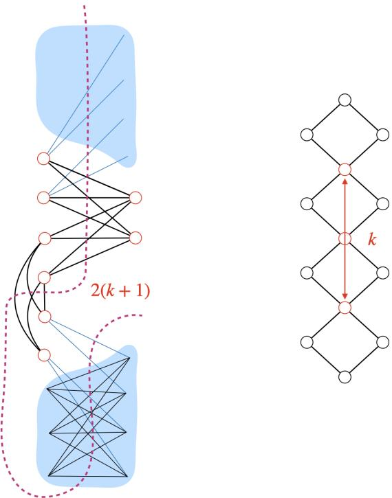  
Figure 4.6: (left) 4-regular bipartite graph in one of its first excited state configurations and (right) $G _ { l o c }$ where we disregarded the isolated node. Written in red, the number of red nodes ( $k = 3$ ). In shaded blue, a part of the graph that completes the graph in a 4-regular one. The purple dashed line shows the bipartition of the graph.

We can easily derive the maximum and average degree of $G _ { l o c }$

$$
\begin{array} { l } { \mathbf { d } _ { \operatorname* { m a x } } ( \mathrm { l o c } ) = 4 } \\ { \mathbf { d } _ { \operatornamearg } ( \mathrm { l o c } ) = \displaystyle \frac { 8 ( k + 1 ) } { 3 k + 4 } = 2 + \frac { 2 k } { 3 k + 4 } } \end{array}
$$

where $k$ is a parameter to construct the graph. $G _ { l o c }$ is not connected to the ground state, so one can imagine that this will produce a potential barrier that creates an AC. But as one can see, the average degree of $G _ { l o c }$ only tends to $2 + 2 / 3 < 4$ , which is far from the AC appearance condition. A similar argument from the case $d = 2$ can be applied here when using directly the technical theorem with $\lambda _ { 0 }$ .

These above results allow us to conclude on the absence of anti-crossing during an adiabatic process to solve MaxCut over $d -$ regular bipartite graphs and show theorem 4.2. One can deduce from this that there is no exponentially closing gap leading to a polynomial runtime to find the optimal cut in regular bipartite graphs via AQC. A natural question arises from this conclusion: Can we draw a similar conclusion for general bipartite graphs? We discuss this in the next section.

# 4.2.2 General bipartite graphs

In this section, we are interested in the behavior of the energies if we look at bipartite graphs in general. We construct a family of bipartite graphs that respect the condition of occurrence of an anti-crossing, meaning that exponentially closing gaps can arise even for MaxCut on bipartite graphs. Let $G ( E , V )$ denote a bipartite graph. Similarly to the previous section, $\langle H _ { 1 } \rangle _ { 0 } = - \frac { | E | } { 2 }$ , $E _ { g s } ~ = ~ - | E |$ and $\Delta H _ { 1 } = l \in [ 1 , \mathbf { d } _ { \operatorname* { m i n } } ( G ) ]$ . Claim 2 is still applicable with the minimum degree $\mathbf { d } _ { \mathrm { m i n } } ( G )$ of $G$ . So $\Delta H _ { 1 } = \mathbf { d } _ { \operatorname* { m i n } } ( G )$ and $n \alpha _ { H _ { 1 } }$ becomes $4 \frac { \mathbf { d } _ { \operatorname* { m i n } } ( G ) } { \mathbf { d } _ { \operatorname* { a v g } } ( G ) }$ . The condition for the different regimes can be written as follows:

We can see that the No-AC case is never verified by adapting the proof of Lemma 4.1. $G _ { l o c }$ is generated by bit-flipping the nodes of $G$ with degree $\mathbf { d } _ { \mathrm { m i n } } ( G )$ . We know that there are $\mathbf { d } _ { \mathrm { m i n } } ( G )$ edges uncut in the first excited state, i.e. $2 \mathbf { d } _ { \mathrm { m i n } } ( G )$ outgoing edges. By calling $\mathbf { d } _ { y } ( \mathrm { l o c } )$ the degree of configuration $y$ in $G _ { l o c }$ , it means that there are $\mathbf { d } _ { y } ( \mathrm { l o c } )$ nodes in $G$ that can be flipped from $y$ to give a configuration also in $G _ { l o c }$ . Those $\mathbf { d } _ { y } ( \mathrm { l o c } )$ nodes are necessarily of degree $\mathbf { d } _ { \mathrm { m i n } } ( G )$ and they count for $\textstyle { \frac { 1 } { 2 } } \mathbf { d } _ { y } ( \log ) \mathbf { d } _ { \operatorname* { m i n } } ( G )$ outgoing edges. So $\mathbf { d } _ { y } ( \mathrm { l o c } )$ must verified the following inequality :

$$
\begin{array} { r l } & { \cfrac { 1 } { 2 } \mathbf { d } _ { y } ( \mathrm { l o c } ) \mathbf { d } _ { \mathrm { m i n } } ( G ) \leq 2 \mathbf { d } _ { \mathrm { m i n } } ( G ) } \\ { \Rightarrow } & { \mathbf { d } _ { y } ( \mathrm { l o c } ) \leq 4 } \end{array}
$$

The maximum of 4 is reached by the configuration where four nodes of $G$ have degree $\mathbf { d } _ { \mathrm { m i n } } ( G )$ and can be flipped. This brings the No-AC condition to $\frac { \mathbf { d } _ { \operatorname* { m i n } } ( G ) } { \mathbf { d } _ { \operatorname* { a v g } } ( G ) } > 1$ which is never verified, with the limit case of regular graphs. So let us focus on the AC condition.

The first point gives us the condition for a graph $G$ that produces an anticrossing under an AQC evolution for the MaxCut problem. First, looking only at the right-hand side, the ratio $\frac { \mathbf { d } _ { \operatorname* { m i n } } ( G ) } { \mathbf { d } _ { \operatorname { a v g } } ( G ) }$ is small for highly irregular graphs. From Eq. (4.6), the average degree for $G _ { l o c }$ is certainly smaller than 4 so we need to play with the degree of $G$ . Even though we remove the regularity hypothesis, we can still use some results from the above cases. Indeed, in that setting, $G _ { l o c }$ arises from the bipartition of a $\mathbf { d } _ { \mathrm { m i n } } ( G )$ -regular induced subgraph of $G$ . We look at graphs $G$ with a large average degree but with also a small minimum degree and a large $\mathbf { d } _ { \mathrm { a v g } } ( \mathrm { l o c } )$ . The cycle produces the densest $G _ { l o c }$ but it is highly connected to the ground-state and the average degree of the cycle is not quite large. The idea is to attach two complete bipartite graphs $( K _ { r r } , K _ { l l } )$ that will increase the average degree of the graph by two parallel sequences of nodes of degree 2 $( P _ { 1 } , P _ { 2 } )$ that will create the dense $G _ { l o c }$ and small $\mathbf { d } _ { \mathrm { m i n } } ( G )$ of value 2. Fig. 4.7 provides an example of a such a graph with $r = l = 3$ and where $P _ { 1 }$ and $P _ { 2 }$ are sequences of $k _ { 1 } = k _ { 2 } = 2$ adjacent nodes of degree 2. $k _ { 1 }$ and $k _ { 2 }$ need to be of the same parity to ensure bipartiteness of the whole graph. Three configurations of the same graph are shown, corresponding to the ground-state (left), and two configurations of the first excited subspace (middle, right), that create the different components in $G _ { l o c }$ (Fig 4.8).

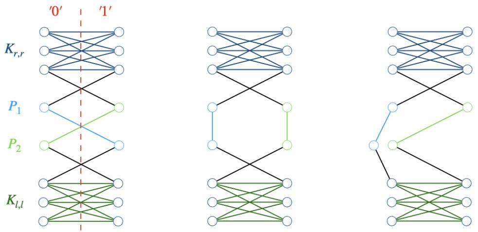  
Figure 4.7: Configurations of $G$ in its ground-state (left) and first excited state. (middle) a configuration far from GS, (right) a configuration neighboring GS.

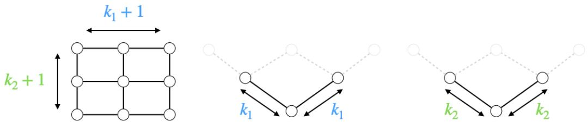  
Figure 4.8: $G _ { l o c }$ of graph $G$ . Three components : (middle) and (right) similarly: components corresponding to states in a configuration close to the one on (Fig 4.7 - right) and (left) component corresponding to states in the configuration of (Fig 4.7 - middle). The light dashed grey edges and nodes show how these two components grow when $k _ { i } > 2$ .

The largest component of $G _ { l o c }$ is a lattice of size $( k _ { 1 } + 1 , k _ { 2 } + 1 )$ if $k _ { i }$ represents the number of nodes in $P _ { i }$ . It is far away from the ground-state as we need to flip at least all the nodes of the $K _ { r , r }$ part. The two other components can be viewed as subgraphs of the large component so they have smaller eigenvalues than the largest one of the lattice; they are also strongly connected to the ground-state. Fig. 4.9 shows the details of the relation between the nodes of $G _ { l o c }$ and graph configurations in a left/right partition. The middle configuration of Fig. 4.7 corresponds to the middle node of the lattice in $G _ { l o c }$ . Then moving each node in blue or green produce another configuration with the same edge penalty.

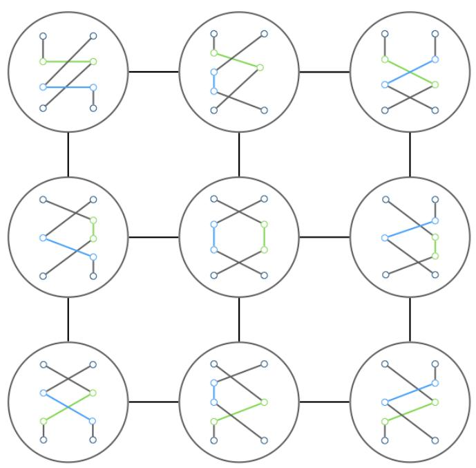  
Figure 4.9: Details of the large component of $G _ { l o c }$ and how each configuration is related by bit-flip. We intentionally omit the drawing of the $K _ { r , r }$ and $K _ { l , l }$ which do not play a role in $G _ { l o c }$ .

We directly have that $\mathbf { d } _ { \operatorname* { m i n } } ( G ) = 2$ . Now, we need to derive the average degree of $G$ and of the largest component of $G _ { l o c }$ (its maximum degree being 4).

$$
\begin{array} { l } { \mathbf { d } _ { \mathrm { a v g } } ( \mathrm { l o c } ) = \frac { 4 * 2 + 2 ( k _ { 1 } - 1 + k _ { 2 } - 1 ) * 3 + ( k _ { 1 } - 1 ) ( k _ { 2 } - 1 ) * 4 } { ( k _ { 1 } + 1 ) ( k _ { 2 } + 1 ) } } \\ { \mathbf { \Phi } = \frac { 4 k _ { 1 } k _ { 2 } + 2 ( k _ { 1 } + k _ { 2 } ) } { ( k _ { 1 } + 1 ) ( k _ { 2 } + 1 ) } } \\ { \mathbf { \Phi } = 4 \left( 1 - \frac { 1 + \frac { 1 } { 2 } ( k _ { 1 } + k _ { 2 } ) } { ( k _ { 1 } + 1 ) ( k _ { 2 } + 1 ) } \right) } \\ { \mathbf { \Phi } = 4 \left( 1 - \frac { 1 } { k + 1 } \right) } \end{array}
$$

for $k = k _ { 1 } = k _ { 2 }$

$$
\begin{array} { l } { \mathbf { d } _ { \mathrm { a v g } } ( G ) = \displaystyle \frac { ( k _ { 1 } + k _ { 2 } ) * 2 + 2 r * r + 2 l * l + 4 } { k _ { 1 } + k _ { 2 } + 2 r + 2 l } } \\ { = \displaystyle \frac { 2 k + r ^ { 2 } + l ^ { 2 } + 2 } { k + r + l } } \end{array}
$$

for $k = k _ { 1 } = k _ { 2 }$

Let us solve the equation davg(loc) > 4 dmin(G)d (G) with $\mathbf { d } _ { \operatorname* { m i n } } ( G ) = 2$ .

$$
\begin{array} { r l r } & { } & { \mathbf { d } _ { \mathrm { a v g } } ( \mathrm { l o c } ) > 4 \frac { \mathbf { d } _ { \mathrm { m i n } } ( G ) } { \mathbf { d } _ { \mathrm { s c g } } ( G ) } } \\ & { } & { \Rightarrow 1 - \frac { 1 } { k + 1 } > \frac { 2 ( k + r + d ) } { 2 k + r ^ { 2 } + l ^ { 2 } + 2 } } \\ & { } & { \Rightarrow \frac { r ^ { 2 } + l ^ { 2 } + 2 - 2 r - 2 l } { 2 k + r ^ { 2 } + l ^ { 2 } + 2 } > \frac { 1 } { k + 1 } } \\ & { } & { \Rightarrow ( k + 1 ) ( r ^ { 2 } + l ^ { 2 } + 2 - 2 r - 2 l ) > 2 k + r ^ { 2 } + l ^ { 2 } + 2 } \\ & { } & { \Rightarrow k ( r ^ { 2 } + l ^ { 2 } - 2 r - 2 l ) > 2 r + 2 l } \\ & { } & { \Rightarrow k > \frac { 2 ( r + l ) } { r ( r - 2 ) + l ( l - 2 ) } } \\ & { } & { \Rightarrow k > \frac { 2 ( r + 3 ) } { r ( r - 2 ) + 3 } } \end{array}
$$

for $l = 3$

We have a limit at $r = 3$ and $k = 2$ for a graph of size 16. Then the smallest graphs that satisfy the condition are for $r = 3$ and $k = 3$ or $r = 4 , l = 3$ and $k = 2$ which bring the size of the smallest graphs satisfying the AC condition to 18 nodes.

This above construction shows that there exist bipartite graphs that exhibit an AC. The presence of an anti-crossing implies an exponentially closing gap bringing the provable runtime to find the optimal cut exponentially large in the size of the graph. This construction can be scaled up easily by growing the parameters $k , r$ and $l$ . In the next section, we numerically investigate the presence of AC on graphs of this family to support this theoretical result.

# 4.2.3 Numerical study: AC and other observations

In this section, we give some numerical evidence of the occurrence of the AC in the particular family we constructed in Sec. 4.2.2. The goal is to observe the behavior of the minimum gap and to confirm the exponentially closing gap. We then discuss whether or not these gaps lead to a computational inefficiency of AQC and moderate the term AC by looking at the more mathematical definition we introduced in Sec. 3.2.

Minimum gap study: Let us first show that the value of the minimum gap supports the theoretical results derived in Secs. 4.1 and 4.2.2. To compute this quantity for large graphs, we use the SciPy library [Jones et al. 01 ] and its optimized method, scipy.sparse.linalg.eigs, for matrices with a sparse representation. Our Hamiltonians have a sparse representation in the Pauli basis, enabling us to compute the minimum gap for graphs with up to 28 nodes.

To satisfy the conditions required for our application, we fix one node of the graph to lift the standard MaxCut symmetry. Specifically, we fix one node of the $K _ { l , l }$ part on the left ( $L$ ) side of the partition. We consider the family of graphs $G _ { r k }$ with the same structure as in the previous section, where we fix $l = 3$ and assume $k _ { 1 } = k _ { 2 } = k$ . Therefore, we can vary two parameters (Fig. 4.10 shows the schematic energy landscape of $H _ { 1 }$ for $G _ { r k }$ ):

- Increasing $r$ increases the distance between $G _ { l o c }$ and the ground-state in the hypercube, as all the $K _ { r , r }$ part needs to be flipped (fixing one node in the $K _ { l , l }$ part blocks the possibility to flip this part entirely),

- Increasing $k$ creates a larger $G _ { l o c }$ , resulting in a larger local minimum that is not linked to the ground-state, but also increases the two other parts of $G _ { l o c }$ connected to it.

We denote $\Delta _ { r k } ( s )$ as the difference between the two lowest instantaneous eigenvalues of $H ( s )$ associated with $G _ { r k }$ , i.e., the spectral gap of the time-dependent Hamiltonian. We plot these gaps in Fig. 4.11 (a) by varying $r$ and $k$ . Specifically, we observe that increasing $r$ by 1 divides the gap by 2. To illustrate this, we also plot Fig. 4.11 (b) the minimum gap of $\Delta _ { r k }$ for $k = 2$ against $r$ . We fit this curve with an exponentially decreasing function of $r$ . When $k$ is fixed, it is straightforward to see that $\begin{array} { r } { r \simeq \frac { n } { 2 } } \end{array}$ .

Fig. 4.11 supports the main theorem in Sec. 4.1 and the construction in Sec. 4.2. The distance to the ground-state appears to play a major role in the minimum gap compared to the size of $G _ { l o c }$ . Remember that $G _ { l o c }$ has three components and two of them are linked to the ground-state while the other one is a lattice far from the ground-state. Increasing $k$ also increases the width around the ground-state, making it easier to reach than if it were isolated while increasing $r$ has no impact on $G _ { l o c }$ .

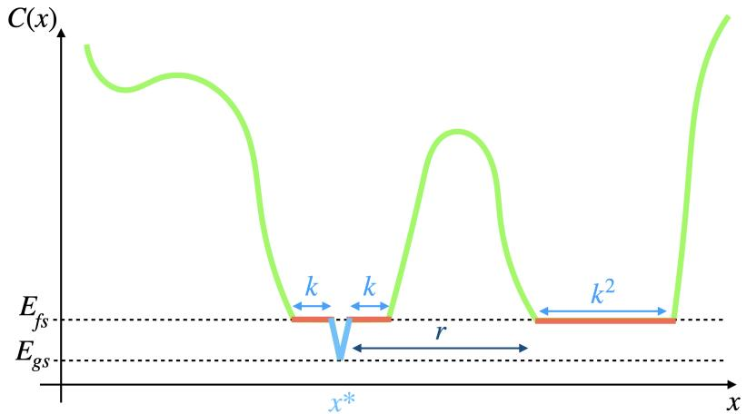  
Figure 4.10: Schematic energy landscape of the MaxCut function on an instance $G _ { r k }$ and how $r$ and $k$ affect it.

Typically, it is assumed that an exponentially closing gap implies the failure of AQC [Altshuler et al. 2010]. In the next paragraph, we investigate the probability of measuring the ground-state at the end of a quantum evolution after a time $t _ { \mathrm { m a x } }$ and discuss about the AC definition, which opens a new question on the computational efficiency of AQC.

Discussions about AC and AQC failure: Now that we have established the exponentially small gaps for the graph $G _ { r k }$ when $r$ is increasing, we can wonder if it can be deduced that AQC is inefficient to solve those instances, as this is the usual deduction from small gaps. In Fig. 4.12, we observe the probability $p _ { r k }$ of measuring the ground-state at the end of a quantum annealing (QA) evolution for different instances of $G _ { r k }$ as a function of $t _ { \mathrm { m a x } }$ . This plot was obtained using the AnalogQPU of the Eviden quantum software. Surprisingly, the probability seems to reach the value around 0.5 faster than expected, meaning in a time $t _ { \mathrm { m a x } }$ that does not appear to depend too much on the size of the graph. This observation is not a contradiction of the adiabatic theorem, as it will certainly converge to 1 in an exponentially long runtime. It could also be just a scale illusion: for much larger graphs, the probability might stay at zero for a longer time than observed here, but this is not what the point below suggests. However, it raises questions about the effectiveness of AQC in practical applications even when exponentially small gaps are present.

The observed gaps in Fig. 4.11 exhibit an exponentially closing behavior, which is a signature of the AC phenomenon we are looking at. However, the computational complexity does not seem to be affected, in the sense that a constant probability to obtain the optimal solution is reached in a time that does not seem to depend too much on the graph size. We can notice in Fig. 4.11 (a) that the trend of the gaps appears to be softer compared to other observed ACs [Bapst & Semerjian 2012], indicating a smoother transition. To address this observation, we use our work and intuition developed in Sec. 3.2 that proposed a more formal definition of anticrossings that involves a new set of quantities. Given that only one AC is observed, Def. 3.1 should apply here. Let $g _ { 0 } ( s ) = | \langle \phi _ { 0 } ( s ) | \mathsf { G S } \rangle | ^ { 2 }$ and $g _ { 1 } ( s ) = | \langle \phi _ { 1 } ( s ) | \mathsf { G S } \rangle | ^ { 2 }$ b e the overlap squared of the instantaneous eigenstates (zeroth and first respectively) of $H ( s )$ with the ground-state $| \mathsf { G S } \rangle$ of $H _ { 1 }$ . Typically, at an anti-crossing point, these curves undergo a harsh exchange of position. If $g _ { 0 } ( s )$ smoothly increases toward 1, it is not an AC according to our definition. For the graph $G _ { r k }$ , the conditions given in this formal definition do not seem to be fully satisfied, as the plots in Fig. 4.13 show. On the left, an example of behavior of $g _ { 0 }$ and $g _ { 1 }$ when AC happens, the curves experience an almost discontinuity at AC point, changing the position of $g _ { 0 }$ and $g _ { 1 }$ (in the middle and right-hand plots, $g _ { 0 }$ and $g _ { 1 }$ for instances $G _ { 3 2 }$ and $G _ { 7 2 }$ respectively). In the $G _ { 3 2 }$ case, $g _ { 1 }$ starts to become bigger than $g _ { 0 }$ but it produces only a little bump and $g _ { 0 }$ has a smooth growth toward 1. One could think that this phenomenon is due to the small size of the instance, and that by considering larger instances but with very small gaps, we would observe a “typical” AC behavior. However, on the $G _ { 7 2 }$ case, where the size increases and the gap decreases, this bump totally disappears and we can only attest to a smooth growth of $g _ { 0 }$ . This observation indicates the opposite of an AC behavior leading to an efficient AQC evolution to solve these instances. This raises the question of whether every exponentially closing gap necessarily leads to a failure of AQC, or if AC is a particular event that creates an exponentially closing gap leading to a complete leak of the probability distribution into higher energy levels.

  
Figure 4.11: (a) Evolution of the spectral gap $\Delta _ { r k } ( s )$ and (b) minimum gap of $\Delta _ { r 2 }$ for $r$ going from 3 to 9 in logarithmic scale. It fits an exponentially decreasing tendency.

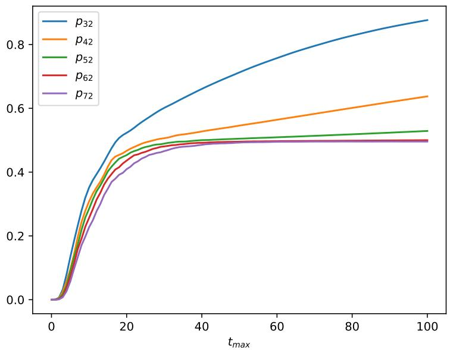  
Figure 4.12: Probability of measuring the ground-state after a time $t _ { \mathrm { m a x } }$ for instances with $k = 2$ and $r \in [ 3 , 7 ]$ .

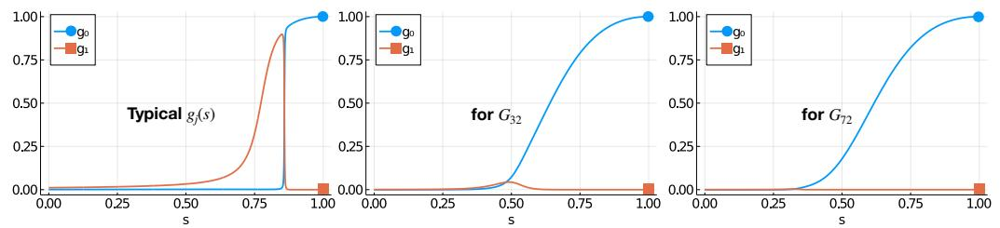  
Figure 4.13: Evolution of $g _ { 0 } ( s )$ in blue and $g _ { 1 } ( s )$ in red for graph $G _ { 7 2 }$ (right), $G _ { 3 2 }$ (middle) and a typical behavior (left) during an AC like in Section 3.2.

# 4.2.4 Validation of perturbative expansion and limitations

We discuss here the validation of this expansion at first-order in the case of MaxCut over $d -$ regular bipartite graphs. We need to look at the second order term and compare it to the first or zeroth order term. Eventually we give a little conclusion of the work developed in Sec. 4.1 and 4.2.

Delocalized state expansion: The eigen-basis of the initial Hamiltonian $H _ { 0 }$ can be written as

$$
| E _ { b } \rangle = { \frac { 1 } { \sqrt { 2 ^ { n } } } } \sum _ { x \in \{ 0 , 1 \} ^ { n } } ( - 1 ) ^ { b \cdot x } | x \rangle ,
$$

where $b$ is an $n -$ bit-string and the centered dot stands for the scalar product over $\mathbb { F } _ { 2 } ^ { n }$ . There are $n + 1$ different eigen-levels where the $k ^ { t h }$ eigen-space has degeneracy

$\binom { n } { k }$ and correspond to eigen-states with bit-string $b$ of Hamming weight $| b | = k$ and eigen-value $E _ { b } ^ { I } = - n + 2 | b |$ (see [Cvetkovic et al. 1980] for more details). With this notation, we can write $| \psi _ { 0 } \rangle$ as $| E _ { 0 0 . . . 0 0 } \rangle$ . We are interested in

$$
E _ { 0 } ^ { ( 2 ) } = \sum _ { b \neq 0 0 . . . 0 } \frac { | \langle E _ { b } | H _ { 1 } | \psi _ { 0 } \rangle | ^ { 2 } } { E _ { 0 } ^ { I } - E _ { b } ^ { I } }
$$

For MaxCut problem on graph $G$ , we know that $\langle E _ { b } | H _ { 1 } | \psi _ { 0 } \rangle = - 1 / 2$ if and only if $G _ { b }$ is exactly one edge (see Appendix B.1). $G _ { b }$ is the graph induced by the node $i$ where $b _ { i } = 1$ . Therefore $\begin{array} { r } { E _ { 0 } ^ { ( 2 ) } = - \frac { | E ( G ) | } { 1 6 } } \end{array}$ . We have $\begin{array} { r } { E _ { 0 } ^ { ( 1 ) } = \langle H _ { 1 } \rangle _ { 0 } \simeq - \frac { | E ( G ) | } { 2 } } \end{array}$ so $\frac { | E _ { 0 } ^ { ( 2 ) } | } { | E _ { 0 } ^ { ( 1 ) } | } = \frac { 1 } { 8 } < 1$ .

Ground-state expansion: The eigen-basis of the final Hamiltonian $H _ { 1 }$ is the canonical basis of the bit-string $| x \rangle$ with energy $E _ { x }$ , and we named |GS⟩ the bit-string corresponding to the ground-state with energy $E _ { g s }$ . It follows that the second-order term is

$$
E _ { g s } ^ { ( 2 ) } = \sum _ { x \in \{ 0 , 1 \} ^ { n } } { \frac { | \langle x | H _ { 0 } | \mathsf { G S } \rangle | ^ { 2 } } { E _ { g s } - E _ { x } } }
$$

where $| \langle x | H _ { 0 } | 6 5 \rangle | = 1$ if and only if the bit-string $x$ is at exactly one bit-flip from the bit-string $G S$ . We can rewrite it like

$$
E _ { g s } ^ { ( 2 ) } = \sum _ { \stackrel { x \sim _ { \stackrel { \sim } { H _ { 0 } } } } { H _ { 0 } } } \frac { 1 } { E _ { g s } - E _ { x } }
$$

For the MaxCut problem on a $d -$ regular bipartite graph, we can further simplify. Indeed, from the ground-state, flipping one bit gives an energy state $E _ { x } = E _ { g s } + d$ . So we end up with $\begin{array} { r } { E _ { g s } ^ { ( 2 ) } = - \frac { n } { d } } \end{array}$ . We have $E _ { g s } ^ { ( 1 ) } = 0$ and $\begin{array} { r } { E _ { g s } ^ { ( 0 ) } = E _ { g s } = \frac { d n } { 2 } } \end{array}$ $| x \rangle$ of exactly which leads to $\begin{array} { r } { \frac { | E _ { g s } ^ { ( 2 ) } | } { | E _ { g s } ^ { ( 0 ) } | } = \frac { 2 } { d ^ { 2 } } < 1 } \end{array}$ . For $d = 4$ we have the same value as for the delocalized state.

Local minima expansion: We work in the same basis as for the latter expansion and we look at

$$
E _ { f s } ^ { ( 2 ) } = \sum _ { x \notin V ( G _ { l o c } ) } \frac { | \langle x | H _ { 0 } | \mathsf { F S } , 0 \rangle | ^ { 2 } } { E _ { f s } - E _ { x } } \leq \sum _ { x \notin V ( G _ { l o c } ) } \sum _ { y _ { H _ { 0 } } ^ { \sim x } } \frac { | \langle y | \mathsf { F S } , 0 \rangle | ^ { 2 } } { E _ { f s } - E _ { x } }
$$

The size of this double sum is the number of connections $G _ { l o c }$ has with the whole hypercube, i.e. $| \partial G _ { l o c } |$ . The term $| \langle y | \mathsf { F S } , 0 \rangle | ^ { 2 }$ is large when the degree of node $y$ in $G _ { l o c }$ is large so with less occurrence in the above double sum. On average, when a graph is regular its vector coordinate value of the largest eigenvalue is $\frac { 1 } { \sqrt { | V ( G _ { l o c } ) | } }$ . By introducing the conductance of the subgraph $G _ { l o c }$ as $\begin{array} { r } { h ( \mathrm { l o c } ) = \frac { | \partial G _ { l o c } | } { | V ( G _ { l o c } ) | } } \end{array}$ , we can upper bound the second-order term with

$$
| E _ { f s } ^ { ( 2 ) } | \leq h ( \mathrm { l o c } ) \frac { 1 } { \mathrm { m i n } _ { x } \left| E _ { f s } - E _ { x } \right| }
$$

We know that $| E _ { f s } ^ { ( 1 ) } | = \lambda _ { 0 } ( \mathrm { l o c } ) \ge d _ { \mathrm { a v g } } ( \mathrm { l o c } ) = n - h ( \mathrm { l o c } )$ . So the ratio we need to check is $\begin{array} { r } { \frac { h ( \mathrm { l o c } ) } { n - h ( \mathrm { l o c } ) } \frac { 1 } { \operatorname* { m i n } _ { x } | E _ { f s } - E _ { x } | } } \end{array}$ which is smaller if $G _ { l o c }$ is neighboring high energy states.

# Conclusion

In this second technical chapter, we studied the occurrences of AC characterized only by exponentially closing gaps in a quantum evolution. We first provided a technical theorem that gives a condition to distinguish between the cases where AC can appear or not. This theorem assumes some conditions on $H _ { 1 }$ and the validity of the perturbation expansion at first-order. We only suggest a validation for the MaxCut problem over $d -$ regular bipartite graphs which allows us to prove the efficiency of AQC in this specific case. Although it is well known that this problem is trivially solvable classically, to the best of our knowledge there was no proof of the efficiency of AQC in this restrictive class of graphs. We also want to draw reader’s attention on the validity we suggested as we only compared to next order term. A more rigorous approach would need to look at any order and show that under some condition on $s _ { l g }$ the expansion is valid. In the next section we give some hints on the higher order of the expansion.

More significantly, the tools we developed allowed us to construct a certain family of irregular bipartite graphs that satisfy the condition for AC occurrence. We did not rigorously validate the perturbative expansion for general bipartite graphs but the numerical computation of the minimum gap showed the exponential closure of the gap with the input size. This suggests that enough irregularity may lead to AQC inefficiency over this class of graphs. However, this is not what the numerical calculation of the probability of measuring the ground-state hints. It appears that a constant probability is reached in a time that does not strongly depend on the input size. Our insights about AC in Sec. 3.2 seems to indicate no localization of the instantaneous ground-state and a smooth evolution leads the quantum state to |GS⟩ “easily”.

The last section is dedicated to a current unfinished work where we develop higher order of the perturbative expansion for the MaxCut problem.

# 4.3 Higher order perturbative expansion for MaxCut

In this section we try to develop higher order of the perturbation theory by using the following proposition due to my supervisor Simon Martiel :

Proposition 4.1 (see Appendix B.1). If $H _ { 1 }$ is the Hamiltonian encoding the Max-Cut problem over a graph of $n$ nodes and $H _ { 0 }$ is the standard bit-flip operator with eigenpairs $( | E _ { b } \rangle , E _ { b } )$ for a bit-string $b$ where $E _ { b } = - n + 2 | b |$ , $| b |$ being the Hamming weight of $b$ , then

$$
\langle E _ { b } | H _ { 1 } | E _ { b ^ { \prime } } \rangle = \frac { 1 } { 2 }
$$

if and only if $G _ { b \oplus b ^ { \prime } }$ is exactly an edge. Where $G _ { b \oplus b ^ { \prime } }$ is the subgraph induced by nodes $i$ such that $( b \oplus b ^ { \prime } ) _ { i } = 1$ .

$\frac { | 0 \rangle + | 1 \rangle } { 2 }$ The eigenvectors if $b _ { i } = 0$ and $\begin{array} { r } { | - \rangle = \frac { | 0 \rangle - | 1 \rangle } { 2 } } \end{array}$ $| E _ { b } \rangle$ of $H _ { 0 }$ correspond to states where qubit if $b _ { i } = 1$ . In the computational basis it is written is in state as:

$$
| E _ { b } \rangle = { \frac { 1 } { \sqrt { 2 ^ { n } } } } \sum _ { x \in \{ 0 , 1 \} ^ { n } } ( - 1 ) ^ { b \cdot x } | x \rangle
$$

The interesting result of Proposition 4.1 will allow us to take the perturbative expansion of the initial state $\left| \psi _ { 0 } \right. = \left| E _ { 0 ^ { n } } \right.$ further. Motivated by the recent result in [Dalzell et al. 2023] where the authors show an algorithm with a super Grover speed-up by essentially approximating the instantaneous ground-state close to the beginning $\left| \phi _ { 0 } ( s ^ { \prime } ) \right.$ for $s ^ { \prime }$ close to zero, we tackle the expansion of the initial state to see if anything relevant comes out. The super Grover speed-up comes as the overlap of the ground-state at $s ^ { \prime }$ with the final ground-state is slightly better than the usual $2 ^ { - { \frac { n } { 2 } } }$ by a factor $c : 2 ^ { - \left( { \frac { n } { 2 } } - c \right) }$ .

We directly look at the time-dependent Hamiltonian $H ( s ) = ( 1 - s ) H _ { 0 } + s H _ { 1 } =$ $H _ { 0 } + s ( H _ { 1 } - H _ { 0 } )$ where $H _ { 0 }$ , the bit-flip operator and $H _ { 1 }$ the MaxCut Hamiltonian (see Sec. 2.2.2). By doing this, the expansion at any time $s$ is the instantaneous ground-state. So we suppose that there exist expansions of the ground-state and its energy like:

$$
\begin{array} { l } { { \bullet \ | \phi _ { 0 } ( s ) \rangle = | E _ { 0 ^ { n } } \rangle + s | E _ { 0 ^ { n } } ^ { ( 1 ) } \rangle + s ^ { 2 } | E _ { 0 ^ { n } } ^ { ( 2 ) } \rangle + . . . } } \\ { { } } \\ { { \bullet \ E _ { 0 } ( s ) = E _ { 0 } ^ { ( 0 ) } + s E _ { 0 } ^ { ( 1 ) } + s ^ { 2 } E _ { 0 } ^ { ( 2 ) } + . . . } } \end{array}
$$

such that $H ( s ) | \phi _ { 0 } ( s ) \rangle = E _ { 0 } ( s ) | \phi _ { 0 } ( s ) \rangle$ with the assumption that $\langle E _ { 0 ^ { n } } ^ { ( i ) } | E _ { 0 ^ { n } } ^ { ( j ) } \rangle = \delta _ { i j }$ .We identify the different terms in $s ^ { j }$ :

$$
\begin{array} { r l } & { s ^ { 0 } \colon { \cal H } _ { 0 } | { \cal E } _ { 0 ^ { n } } \rangle = { \cal E } _ { 0 } ^ { ( 0 ) } | { \cal E } _ { 0 ^ { n } } \rangle } \\ & { s ^ { 1 } \colon ( { \cal H } _ { 1 } - { \cal H } _ { 0 } ) | { \cal E } _ { 0 ^ { n } } \rangle + { \cal H } _ { 0 } | { \cal E } _ { 0 ^ { n } } ^ { ( 1 ) } \rangle = { \cal E } _ { 0 } ^ { ( 0 ) } | { \cal E } _ { 0 ^ { n } } ^ { ( 1 ) } \rangle + { \cal E } _ { 0 } ^ { ( 1 ) } | { \cal E } _ { 0 ^ { n } } \rangle } \\ & { s ^ { 2 } \colon ( { \cal H } _ { 1 } - { \cal H } _ { 0 } ) | { \cal E } _ { 0 ^ { n } } ^ { ( 1 ) } \rangle + { \cal H } _ { 0 } | { \cal E } _ { 0 ^ { n } } ^ { ( 2 ) } \rangle = { \cal E } _ { 0 } ^ { ( 0 ) } | { \cal E } _ { 0 ^ { n } } ^ { ( 2 ) } \rangle + { \cal E } _ { 0 } ^ { ( 1 ) } | { \cal E } _ { 0 ^ { n } } ^ { ( 1 ) } \rangle + { \cal E } _ { 0 } ^ { ( 2 ) } | { \cal E } _ { 0 ^ { n } } \rangle } \\ &  s ^ { 3 } \colon ( { \cal H } _ { 1 } - { \cal H } _ { 0 } ) | { \cal E } _ { 0 ^ { n } } ^ { ( 2 ) } \rangle + { \cal H } _ { 0 } | { \cal E } _ { 0 ^ { n } } ^ { ( 3 ) } \rangle = { \cal E } _ { 0 } ^ { ( 0 ) } | { \cal E } _ { 0 ^ { n } } ^ { ( 3 ) } \rangle + { \cal E } _ { 0 } ^ { ( 1 ) } | { \cal E } _ { 0 ^ { n } } ^ { ( 2 ) } \rangle + { \cal E } _ { 0 } ^ { ( 2 ) } | { \cal E } _ { 0 ^ { n } } ^ { ( 1 ) } \rangle + { \cal E } _ { 0 } ^ { ( 3 ) } \end{array}
$$

$$
\begin{array} { r } { s ^ { k } \colon ( H _ { 1 } - H _ { 0 } ) | E _ { 0 ^ { n } } ^ { ( k - 1 ) } \rangle + H _ { 0 } | E _ { 0 ^ { n } } ^ { ( k ) } \rangle = \sum _ { l = 0 } ^ { k } E _ { 0 } ^ { ( k - l ) } | E _ { 0 ^ { n } } ^ { ( l ) } \rangle } \end{array}
$$

We know that $E _ { 0 } ^ { ( 0 ) } = - n = E _ { 0 }$ , $E _ { b } = - n + 2 | b |$ and to get $E _ { 0 } ^ { ( k ) }$ we project onto $\langle E _ { 0 ^ { n } } |$ and then project onto another state $\langle E _ { b } |$ to get $\langle E _ { b } | E _ { 0 ^ { n } } ^ { ( k ) } \rangle$ . Using Proposition 4.1,

we can explicit the terms as :

$$
E _ { 0 } ^ { ( 1 ) } = \langle E _ { 0 ^ { n } } | ( H _ { 1 } - H _ { 0 } ) | E _ { 0 ^ { n } } \rangle = \langle H _ { 1 } \rangle _ { 0 } + n
$$

$$
| E _ { 0 ^ { n } } ^ { ( 1 ) } \rangle = \sum _ { b \neq 0 ^ { n } } | E _ { b } \rangle { \frac { \langle E _ { b } | H _ { 1 } | E _ { 0 ^ { n } } \rangle } { E _ { 0 } - E _ { b } } } = { \frac { 1 } { 4 * 2 } } \sum _ { b \ \mathrm { s t } \ G _ { b } \equiv \deg \varphi } | E _ { b } \rangle
$$

$$
E _ { 0 } ^ { ( 2 ) } = \langle E _ { 0 ^ { n } } | ( H _ { 1 } - H _ { 0 } ) | E _ { 0 ^ { n } } ^ { ( 1 ) } \rangle = \sum _ { b \ne 0 ^ { n } } \frac { | \langle E _ { b } | H _ { 1 } | E _ { 0 ^ { n } } \rangle | ^ { 2 } } { E _ { 0 } - E _ { b } } = - \frac { | E ( G ) | } { 4 * 2 ^ { 2 } }
$$

$$
\begin{array} { r l } & { \quad | E _ { 0 } ^ { ( s ) } | ^ { 2 } = \displaystyle \sum _ { k \neq 0 } \frac { | E _ { 0 } ^ { ( s ) } | } { \langle E _ { 0 } | - E _ { k } ^ { ( s ) } \rangle } \left( \langle E _ { 0 } | ( H _ { 1 } - B _ { 0 } ) | E _ { 0 } ^ { ( s ) } \rangle - E _ { 0 } ^ { ( s ) } | E _ { k } | E _ { 0 } ^ { ( s ) } \rangle \right) } \\ & { \quad - \displaystyle \sum _ { k \neq 0 } \frac { | E _ { 0 } ^ { ( s ) } | } { \langle E _ { 0 } | - E _ { k } ^ { ( s ) } \rangle } \left( \sum _ { k \neq 0 } \frac { \langle E _ { 0 } | ( H _ { 1 } - B _ { 0 } ) | E _ { 0 } ^ { ( s ) } \rangle | E _ { 0 } ^ { ( s ) } | H _ { 1 } | E _ { 0 } ^ { ( s ) } \rangle } { \langle E _ { 0 } | - E _ { k } ^ { ( s ) } \rangle } - \langle E _ { 0 } ^ { ( s ) } | \frac { \langle E _ { 0 } | ( H _ { 1 } | E _ { 0 } ) | } { \langle E _ { 0 } | - E _ { 0 } ^ { ( s ) } \rangle } \right) } \\ & { \quad - \displaystyle \sum _ { k \neq 0 } \frac { | E _ { k } ^ { ( s ) } | } { \langle E _ { 0 } | - E _ { k } ^ { ( s ) } \rangle } \left( \sum _ { k \neq 0 } \frac { \langle E _ { 0 } | ( H _ { 1 } - B _ { 0 } ) | E _ { 0 } ^ { ( s ) } \rangle | E _ { 0 } ^ { ( s ) } | H _ { 1 } | E _ { 0 } ^ { ( s ) } \rangle } { \langle E _ { 0 } | - E _ { k } ^ { ( s ) } \rangle } - \langle E _ { 0 } ^ { ( s ) } + i \beta _ { 0 } ^ { ( s ) } \rangle \langle E _ { 0 } | \frac { \langle E _ { 0 } | ( H _ { 1 } | E _ { 0 } ) | } { \langle E _ { 0 } | - E _ { k } ^ { ( s ) } \rangle } \right) } \\ &  \quad -  \end{array}
$$

where we used the fact that $\begin{array} { r } { \langle E _ { b } | H _ { 1 } | E _ { b ^ { \prime } } \rangle \langle E _ { b ^ { \prime } } | H _ { 1 } | E _ { 0 ^ { n } } \rangle = \frac { 1 } { 4 } } \end{array}$ if and only if $G _ { b ^ { \prime } }$ is exactly an edge and $G _ { b \oplus b ^ { \prime } }$ as well. This happens when $G _ { b }$ selects a pair of nodes that are the extremities of a path of length 2, $P _ { 2 } = \left\{ G _ { b ^ { \prime } } , G _ { b \oplus b ^ { \prime } } \right\}$ or when $G _ { b }$ is two nonadjacent edges with one of them being $G _ { b ^ { \prime } }$ . Then when looking at the energy it further imposes that $G _ { b }$ is also an edge forming a triangle with $P _ { 2 }$ .

$$
\begin{array} { r l } { \gamma _ { 1 } } & { = \frac { 1 } { \sqrt { \pi } } \frac { \sqrt { \beta _ { 1 } \beta _ { 1 } } } { \sqrt { \pi } } \left( \frac { \beta _ { 1 } \sqrt { \beta _ { 1 } } } { \sqrt { \pi } } + \frac { \alpha \sqrt { \beta _ { 1 } \beta _ { 1 } } } { \sqrt { \pi } } \right) ^ { 2 } , } \\ { \gamma _ { 2 } } & { = \frac { 1 } { \sqrt { \pi } \sqrt { \beta _ { 1 } \alpha _ { 2 } } } \frac { \sqrt { \beta _ { 1 } \beta _ { 1 } } } { \sqrt { \pi } } \left( \frac { \beta _ { 1 } \sqrt { \beta _ { 1 } } } { \sqrt { \pi } } + \frac { \alpha \sqrt { \beta _ { 1 } \beta _ { 1 } } } { \sqrt { \pi } } \right) ^ { 2 } , \quad \sqrt { \pi } \frac { \sqrt { \beta _ { 1 } \beta _ { 1 } } } { \sqrt { \pi } } \frac { \sqrt { \beta _ { 1 } \alpha _ { 2 } } } { \sqrt { \pi } } \frac { \sqrt { \beta _ { 1 } \alpha _ { 2 } } } { \sqrt { \pi } } \frac { \sqrt { \beta _ { 1 } \alpha _ { 2 } } } { \sqrt { \pi } } } \\ &  \frac { \sqrt { \beta _ { 1 } \alpha _ { 2 } } } { \sqrt { \pi } } \frac { \sqrt { \beta _ { 1 } \alpha _ { 2 } } } { \sqrt { \pi } } \Bigg [ \frac { \sqrt { \beta _ { 1 } \alpha _ { 2 } } } { \sqrt { \pi } } \frac { \sqrt { \beta _ { 1 } \alpha _ { 2 } } } { \sqrt { \pi } } \frac { \sqrt { \beta _ { 1 } \alpha _ { 2 } } } { \sqrt { \pi } } \frac { \sqrt { \beta _ { 1 } \alpha _ { 2 } } } { \sqrt { \pi } } \frac { \sqrt { \beta _ { 1 } \alpha _ { 2 } } } { \sqrt { \pi } } \frac { \sqrt { \beta _ { 1 } \alpha _ { 2 } } } { \sqrt { \pi } } \frac { \sqrt { \beta _ { 1 } \alpha _ { 2 } } }  \sqrt  \pi  \end{array}
$$

$$
\begin{array} { l } { { \displaystyle { \cal E } _ { 0 } ^ { ( 4 ) } = - \frac { | E ( G ) | } { 2 ^ { 2 } * 4 ^ { 3 } } \left( ( \langle H _ { 1 } \rangle _ { 0 } + 4 ) ^ { 2 } - \frac { | E ( G ) | } { 2 ^ { 2 } } \right) + 3 | \{ T \in G \} | \frac { \langle H _ { 1 } \rangle _ { 0 } + 4 } { 2 ^ { 2 } * 4 ^ { 2 } } } } \\ { { \displaystyle ~ - 2 | \{ S \in G \} | \left( \frac { 1 } { 2 ^ { 3 } * 4 ^ { 3 } } + \frac { 1 } { 2 ^ { 3 } * 4 ^ { 2 } * 8 } \right) - \frac { | E ( G ) | } { 2 ^ { 4 } * 4 ^ { 2 } * 8 } } } \end{array}
$$

$$
\begin{array}{c} \langle E _ { 0 } ^ { ( k ) } = \langle E _ { 0 ^ { n } } | H _ { 1 } | E _ { 0 } ^ { ( k - 1 ) } \rangle ~  \\ { \langle E _ { b } | E _ { 0 } ^ { ( k ) } \rangle = \frac { 1 } { E _ { 0 } - E _ { b } } \left( \langle E _ { b } | H _ { 1 } | E _ { 0 } ^ { ( k - 1 ) } \rangle - ( E _ { b } + E _ { 0 } ^ { ( 1 ) } ) \langle E _ { b } | E _ { 0 } ^ { ( k - 1 ) } \rangle \right. ~ } \\ { \left. - \sum _ { l = 1 } ^ { k - 2 } E _ { 0 } ^ { ( k - l ) } \langle E _ { b } | E _ { 0 } ^ { ( l ) } \rangle \right) } \end{array}
$$

where $S$ stands for square and $T$ for triangle and the following claim:

Claim 4. For bit-strings, $b , b ^ { \prime }$ and $b ^ { \prime \prime }$ , the product $\langle E _ { b } | H _ { 1 } | E _ { b ^ { \prime } } \rangle \langle E _ { b ^ { \prime } } | H _ { 1 } | E _ { b ^ { \prime \prime } } \rangle \langle E _ { b ^ { \prime \prime } } | H _ { 1 } | E _ { 0 ^ { n } } \rangle$ equals to $\frac { 1 } { 2 ^ { 3 } }$ if $G _ { b ^ { \prime \prime } }$ , $G _ { b ^ { \prime } \oplus b ^ { \prime \prime } }$ and $G _ { b \oplus b ^ { \prime } }$ are exactly an edge. These conditions are reunited in five different situation :

$( a ) \textsuperscript { - } | b ^ { \prime } | = 2$ sharing one bit with $b ^ { \prime \prime }$ and $G _ { b }$ selects a pair of nodes that are the extremities of a path of length three: $P _ { 3 } = G _ { b ^ { \prime \prime } } \cap G _ { b ^ { \prime } \oplus b ^ { \prime \prime } } \cap G _ { b \oplus b ^ { \prime } }$ .

$( b ) - | b ^ { \prime } | = 2$ sharing one bit with $b ^ { \prime \prime }$ and $G _ { b }$ is a graph with four nodes and at least one edge non adjacent to $G _ { b ^ { \prime \prime } }$ , called edge under the hat. The hat being the path $P _ { 2 }$ .

$( c ) \mathrm { ~ - ~ } G _ { b ^ { \prime } }$ is two non-adjacent edges (which include $G _ { b ^ { \prime \prime } }$ ) and $G _ { b }$ selects a pair of nodes that are the extremities of a path of length three: $P _ { 3 } = G _ { b ^ { \prime \prime } } \cap G _ { b ^ { \prime } \oplus b ^ { \prime \prime } } \cap$ $G _ { b \oplus b ^ { \prime } }$ .

$( d ) \texttt { - } G _ { b ^ { \prime } }$ is two non-adjacent edges (which include $G _ { b ^ { \prime \prime } }$ ) and $b = b ^ { \prime \prime }$ or $b =$ $b ^ { \prime \prime } \oplus b ^ { \prime }$ , i.e. $G _ { b }$ is exactly an edge.

$( e ) \mathrm { ~ - ~ } G _ { b ^ { \prime } }$ is two non-adjacent edges (which include $G _ { b ^ { \prime \prime } }$ ) and $G _ { b }$ is three nonadjacent edges, including $G _ { b ^ { \prime } }$ .

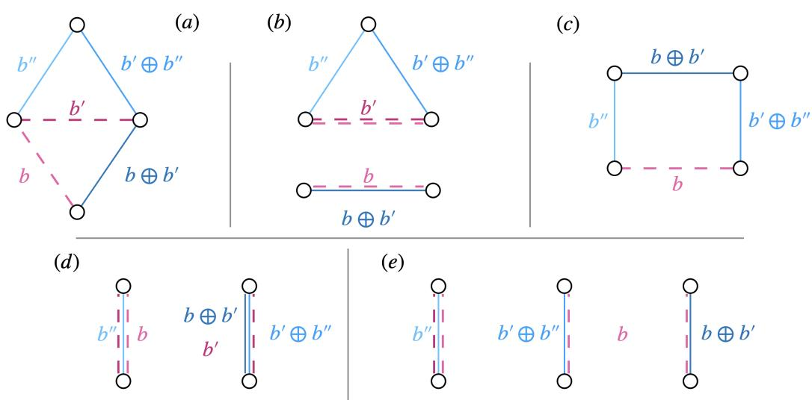  
Figure 4.14: Proof of Claim 4. For clarity, we denoted $G _ { s }$ by $s$ only. In blue the edges imposed by Proposition 4.1 and in pink and purple the possible candidates for a $b$ and $b ^ { \prime }$ respectively. Dash lines mean that they are not necessarily corresponding to an edge in $G$ .

From Fig. 4.14, it is easy to see which structure will appear in the computation of the energy coefficient $E _ { 0 } ^ { ( 4 ) } = \langle E _ { 0 ^ { n } } | H _ { 1 } | E _ { 0 } ^ { ( 3 ) } \rangle$ . Indeed, the composition by $\langle E _ { 0 ^ { n } } | H _ { 1 } |$ forces $G _ { b }$ to be exactly an edge. So only situations $( a ) , ( c )$ and $( d )$ are valid.

Discussion: Now that we have obtained the first three orders for the ground state and the first four orders for the energy, let’s analyze the implications. While I would not put my finger on the accuracy of the prefactor of each term, the structural insights derived from the analysis remain interesting. Regarding the anti-crossing phenomenon, can we discern its presence in this derivation? At a certain time $s ^ { * }$ when an AC occurs, there is a sharp change in the amplitude of the instantaneous ground-state. Examining the first few coefficients, it becomes evident that distinct features of the input graph manifest. The abrupt change in amplitude might be linked to specific combinations of structures within the input graph. In the case of an AC, one can intuit that the information about the graph structure available to the quantum state up to $s ^ { * }$ seems inadequate for guiding it toward the solution; instead, it appears to be misled and localized in an incorrect state. Is it worth exploring the idea that substantial structures within a graph could induce this effect? To address this, a more in-depth exploration of the perturbative coefficient derivation would be necessary.

Can we still infer some intriguing aspect of the quantum evolution with these first few coefficients? First, on the ground-state coefficients, let see how the first-order changes the initial state. Let us write it in the computational basis :

$$
\begin{array} { r l } { \displaystyle \sum _ { G _ { h } \geq \infty \deg } | F _ { h } \rangle = \displaystyle \sum _ { G _ { h } = \infty \deg \textnormal { t h } } \frac { 1 } { \sqrt { 2 ^ { n } } } \displaystyle \sum _ { \boldsymbol { x } \in \{ 0 , 1 \} ^ { n } } \sum _ { \boldsymbol { x } = \infty \atop ( G _ { h } \geq 1 ) ^ { n } } ( - 1 ) ^ { \delta \times \boldsymbol { z } } | \boldsymbol { x } \rangle } \\ & { = \displaystyle \frac { 1 } { \sqrt { 2 ^ { n } } } \displaystyle \sum _ { \boldsymbol { x } \in \{ 0 , 1 \} ^ { n } } | \boldsymbol { x } \rangle \sum _ { \begin{array} { c } { G _ { h } \geq \infty \atop ( G _ { h } \geq 1 ) ^ { n } } ( - 1 ) ^ { \delta \times \boldsymbol { z } } } \\ { \qquad \quad \times \nabla / 2 } \\ { \qquad \quad \times \sqrt { 2 ^ { n } } z \in \{ 0 , 1 \} ^ { n } } \end{array} } \\ & { = \displaystyle \frac { 1 } { \sqrt { 2 ^ { n } } } \sum _ { \boldsymbol { x } \in \{ 0 , 1 \} ^ { n } } | \langle \boldsymbol { u } \rangle \sum _ { \begin{array} { c } { G _ { h } \geq E ( \boldsymbol { G } ) } \\ { \qquad \times \nabla / 2 \sqrt { \pi } } \\ { \qquad \times \sqrt { 2 ^ { n } } } \end{array} } ( - 1 ) ^ { \delta \times \boldsymbol { z } } | \boldsymbol { x } \rangle } \\ & { = \displaystyle \frac { 1 } { \sqrt { 2 ^ { n } } } \sum _ { \boldsymbol { x } \in \{ 0 , 1 \} ^ { n } } ( | \boldsymbol { \xi } | \operatorname { a n c u t } \exp ( \mathrm { d } g \mathrm { e s ~ i n ~ } \boldsymbol { x } ) | - | \{ \operatorname { c u t } \deg \exp \left( \mathrm { i n ~ } \boldsymbol { x } \right) \} | \boldsymbol { x } \rangle } \\ & { = \displaystyle \frac { 1 } { \sqrt { 2 ^ { n } } } \sum _ { \boldsymbol { z } \in \{ 0 , 1 \} ^ { n } } ( | \boldsymbol { F } ( G ) | + 2 C ( \boldsymbol { x } ) ) \left| \boldsymbol { x } \right. } \end{array}
$$

where $C ( x )$ is the classical cost function of MaxCut (see Sec. 2.2.2) which counts (minus) the number edges across the bipartition of $x$ . We observe that this term has little effect on a majority of states as $\begin{array} { r } { \langle H _ { 1 } \rangle _ { 0 } = - \frac { | E ( G ) | } { 2 } } \end{array}$ . It is acting non-trivially on states close to the best and the worst $C ( x )$ has the shape of a Gaussian around solution for MaxCut, but with opposite signs. It is less obvious how the other terms affect the different amplitudes but on the bad solutions (e.g. with lots of zeros) it is always a great influence with a plus sign.

Now, on the energy, we see that the $k ^ { t h }$ coefficient scales like $O ( | E ( G ) | ^ { k - 1 } )$ . Even though it is not exactly the same perturbative expansion as previously used in Sec. 4.1, this observation gives less credits to the validity of the first-order expansion in Sec. 4.2.4. However, it gives us really interesting features on how the quantum evolution works when solving the MaxCut problem. Apparently it treats the edges, then the triangles, then the squares and so on. Also, even cycles and odd cycles have opposite effect on the energy value which is rather expected since odd cycles are not bipartite. We can see that the different size of cycles will appear in the expansion and affecting differently the ground-state energy. It is as if the quantum state is more influenced by small cycles first. Intuitively, AQC is solving MaxCut locally first, with short range structures and little by little starts to see larger structures. In the next part of this thesis, we actually investigate the short constant time Quantum Annealing regime to see if we can prove any analytical bound on the approximation ratio at such runtimes.

# Part II

# Approximation ratio in short-time Quantum Annealing

# Chapter 5

# Direct Lieb-Robinson type approach

# Contents

5.1 Locality in short-time quantum annealing . . . . . . . . 117   
5.1.1 Locality and restriction to regular graph 118   
5.1.2 Lieb-Robinson like bound 121   
5.2 Two different problem applications 124   
5.2.1 QA approximation of MaxCut 124   
5.2.2 QA approximation of MIS 125   
5.3 Toward a better bound for MaxCut? . 127   
5.3.1 (Non) Tightness of our LR bound 128   
5.3.2 Hints for better approximation ratios . . 129

In this chapter, the goal is to prove a non-trivial approximation ratio, i.e. above random guess, using a quantum annealing process in constant time for MaxCut over cubic graphs. We first generalize the construction of [Farhi et al. 2014] where the authors proved the approximation ratio reached by single-layer QAOA. The generalization aims to encapsulate more combinatorial problems like the Maximum Independent Set problem, but still focusing on cubic graphs. Then, driven by the notion of the Lieb-Robinson velocity to recover a notion of locality in a continuous quantum evolution, we use a LR-type bound precise enough to prove that QA reaches a 0.5933-approximation of MaxCut on cubic graphs at constant time. The best available LR bounds in the literature are not suited for this purpose as they are usually asymptotic bounds, so they perform quite badly at really short radius. It will become clearer in the following sections how precise we need the bound to be. Eventually, we provide an analysis of the bound tightness and present arguments for the optimal approximation ratio with an alternative construction.

# 5.1 Locality in short-time quantum annealing

Recall that to evaluate the performance of a non-adiabatic quantum evolution like QA, we use the approximation ratio, which is the ratio of the expected energy of the final state to the value of the optimal cost. In the most general setting, we follow the notations of Sec. 2.2.1. We do not specify an initial Hamiltonian $H _ { 0 }$ for the moment, but assume that the initial state $| \psi _ { 0 } \rangle$ is a uniform product state. Without loss of generality, given a graph $G ( V , E )$ , we seek to find the maximum of a cost function $C ( x , G )$ defined on $x \in \{ 0 , 1 \} ^ { n }$ . $H _ { 1 } ^ { G }$ encodes minus this cost function such that the ground-state encodes the optimal solution $x ^ { * }$ . We restrict ourselves to cost functions decomposed into local cost functions on nodes and edges. In the final Hamiltonian $H _ { 1 } ^ { G }$ , it resolves into local observables on nodes and edges. In the most general framework, $H _ { 1 }$ can be written as :

$$
H _ { 1 } ^ { G } = - \sum _ { v \in V ( G ) } N ^ { ( v ) } - \sum _ { e \in E \left( G \right) } M ^ { ( e ) }
$$

Driving our quantum system according to the Hamiltonian ${ \cal H } ( t , G ) = ( 1 -$ $\begin{array} { r } { \frac { t } { T } ) H _ { 0 } + \frac { t } { T } H _ { 1 } ^ { G } } \end{array}$ over a graph $G$ between times $t _ { 1 } ~ < ~ t$ induces a unitary evolution $U _ { u , t } ^ { G }$ T  . Using this notation, the state of the quantum system after a time $t$ is given by $| \psi ^ { G } ( t ) \rangle = U _ { 0 , t } ^ { G } | \psi _ { 0 } \rangle$ . This evolution operator is defined by $U _ { 0 , 0 } ^ { G } = I$ and respects the Schrodinger equation :

$$
i \frac { \partial } { \partial t } U _ { 0 , t } ^ { G } = H ( t , G ) U _ { 0 , t } ^ { G } \quad \mathrm { ~ f o r ~ } t \in [ 0 , T ]
$$

The approximation ratio for QA to solve $C$ is then written as :

$$
\rho _ { C } = \operatorname* { m a x } _ { T } \operatorname* { m i n } _ { G } \frac { - \langle H _ { 1 } ^ { G } \rangle _ { G , T } } { C _ { o p t } ( G ) }
$$

where $- \langle H _ { 1 } ^ { G } \rangle _ { G , T } = \langle \psi ^ { G } ( T ) | - H _ { 1 } | \psi ^ { G } ( T ) \rangle$ and $C _ { o p t } ( G ) = C ( x ^ { * } , G )$ is the optimal cost value. The goal is to find a lower bound of this ratio. Taking the maximum on $T$ may seem confusing, since in the infinite regime, the ratio converges to 1 by the adiabatic theorem. However, we can either force it to be smaller than a certain constant, or leave it as it is, and this maximum will be more relevant when using the local analysis detailed in the next section. By expectation linearity, we can write :

$$
- \langle H _ { 1 } ^ { G } \rangle _ { G , T } = \sum _ { v \in V } \langle N ^ { ( v ) } \rangle _ { G , T } + \sum _ { e \in E } \langle M ^ { ( e ) } \rangle _ { G , T }
$$

We are ultimately interested in producing lower bounds for each summand in the non-adiabatic regime where $T$ is small. From now on, we will drop the dependence on $T$ when explicit from context.

# 5.1.1 Locality and restriction to regular graph

We denote by $| \psi ^ { G } \rangle$ the state produced by the QA algorithm on the input graph $G$ . This state depends on the whole input, in particular this entails that each term in Eq. 5.2 might depend on the structure of the whole graph $G$ . For a positive integer $p$ , we define the ball of radius $p$ around a subgraph $X$ of $G$ (see Fig. 5.1)

Definition 5.1. We call $B _ { p } ( X )$ the ball of radius $p$ around a subgraph $X$ of $G$ , i.e the subgraph of $G$ containing $X$ and all nodes and edges situated on a path of $G$ of length at most $p$ (i.e., with at most $p$ edges), with an end-point in $X$ .

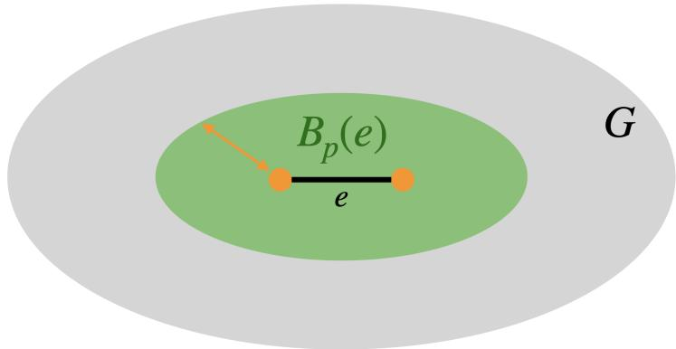  
Figure 5.1: Schematic view of $B _ { p } ( e )$ (shaded green bag) in a graph $G$ (shaded grey bag) for a subgraph $X$ being only an edge $e$ .

Let us assume for a moment that QA is “ $p$ -local” for some constant $p$ in the sense that, for each vertex and edge, it does not create correlations farther than a neighborhood at distance $p$ . Formally, this entails that the expectation value of a local observable $N ^ { ( v ) }$ or $M ^ { ( e ) }$ only depends on the structure of the neighborhood at distance $p$ , i.e. on $B _ { p } ( v )$ and $B _ { p } ( e )$ respectively. We point out that this notion of locality is the classical notion of local algorithm on graphs used in distributed computing, where “the output of a vertex in a local algorithm is a function of the input available within a constant-radius neighborhood of the vertex” [Suomela 2013].) In that particular setting, Eq. 5.2 can be written as:

$$
- \langle H _ { 1 } ^ { G } \rangle _ { G , T } = \sum _ { v \in V } \langle N ^ { ( v ) } \rangle _ { B _ { p } ( v ) } + \sum _ { e \in E } \langle M ^ { ( e ) } \rangle _ { B _ { p } ( e ) }
$$

where $| \psi ^ { B _ { p } ( v ) } \rangle$ (resp. $| \psi ^ { B _ { p } ( e ) } \rangle )$ is the quantum state obtained by running the quantum process Hamiltonian $H ( t , B _ { p } ( v ) )$ (resp. $H ( t , B _ { p } ( e ) ) )$ . With this locality assumption, we recover exactly the same argument as in the QAOA case [Farhi et al. 2014].

However, this locality condition for QA is of course too optimistic at this stage. We shall see in the next subsection that, thanks to Lieb-Robinson type inequalities, we can bound the difference between the actual values of energies on nodes and edges on the whole graph, and those obtained by only considering bounded radius balls around a node or an edge, hence obtaining a lower bound on the final expected value with a very similar expression to Eq. 5.3. Regular graphs have the particularity of having very few distinct small $B _ { p } ( X )$ . For any node, its neighborhood at distance $p = 1$ is a star graph. As for edges, their neighborhoods at distance 1 also form a limited number of configurations, and the number of triangles in such neighborhoods will play a major role. For example, on 3-regular graphs, Fig. 5.2 shows the balls of radius 1 around a node $\boldsymbol { v }$ and an an edge $e$ .

Coming back to Eq. 5.3, all the terms in the first sum will be identical since all nodes have the same distance 1 neighborhood $\Omega _ { 0 }$ . The terms of the second sum can be regrouped into 3 terms, corresponding to edges having $\Omega _ { 1 }$ , $\Omega _ { 2 }$ , and $\Omega _ { 3 }$ for distance 1 neighborhood. We point out the importance of starting from a product state, with the same state on every qubit otherwise, this latter gathering could not work. Thus, the expression of the final expected value becomes:

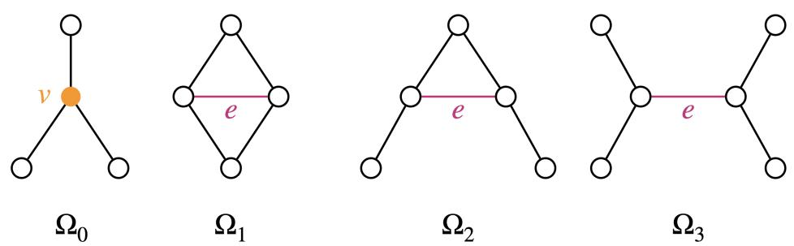  
Figure 5.2: Subgraphs of 3-regular graphs for 1-qubit and 2-qubits neighborhoods at distance 1.

$$
- \langle H _ { 1 } ^ { G } \rangle _ { G } = n \langle N ^ { ( v ) } \rangle _ { \Omega _ { 0 } } + g _ { 1 } \langle M ^ { ( e ) } \rangle _ { \Omega _ { 1 } } + g _ { 2 } \langle M ^ { ( e ) } \rangle _ { \Omega _ { 2 } } + g _ { 3 } \langle M ^ { ( e ) } \rangle _ { \Omega _ { 3 } }
$$

where $g _ { i }$ is the number of edges $e$ having $\Omega _ { i }$ as $B _ { 1 } ( e ) , \forall v , B _ { 1 } ( v ) = \Omega _ { 0 }$ , and $\forall e , B _ { 1 } ( e )$ is one of the $\Omega _ { i }$ . The indices $v$ and $e$ of the observables refer to the labels on the subgraphs in Fig. 5.2. We assume that, for configuration $\Omega _ { 1 }$ , the two nodes unlabeled with degree less than 3 are non-adjacent (if this happens then the four nodes form a connected component of the input graph, which is not critical for our analysis). Lets note $n _ { i }$ the number of configurations $\Omega _ { i }$ in the input $G$ . Hence there are $n _ { 1 } = g _ { 1 }$ edges in configuration 1 and $4 n _ { 1 } + 3 n _ { 2 } = g _ { 2 }$ in configuration 2 because there are four sides of $\Omega _ { 1 }$ and three edges of the triangle in $\Omega _ { 2 }$ , each of them being in a configuration of type $\Omega _ { 2 }$ . The number of edges in configuration $\Omega _ { 3 }$ corresponds to the remaining ones, i.e., $3 n / 2 - 5 n _ { 1 } - 3 n _ { 2 } = g _ { 3 }$ , where we used the fact that the total number of edges in a $d -$ regular graph is $d n / 2$ . Therefore, the final expected energy can be written as

$$
\begin{array} { r l r } { - \langle H _ { 1 } ^ { G } \rangle _ { G } = n \langle N ^ { ( v ) } \rangle _ { \Omega _ { 0 } } + n _ { 1 } \langle M ^ { ( e ) } \rangle _ { \Omega _ { 1 } } + ( 4 n _ { 1 } + 3 n _ { 2 } ) \langle M ^ { ( e ) } \rangle _ { \Omega _ { 2 } } } & { { } } & { ( 5 . 5 / n ) \langle M ^ { ( e ) } \rangle _ { G } } \\ { + } & { { } } & { + ( 3 n / 2 - 5 n _ { 1 } - 3 n _ { 2 } ) \langle M ^ { ( e ) } \rangle _ { \Omega _ { 3 } } . } \end{array}
$$

This construction is the one used to analyze the performances of the QAOA for MaxCut on 3-regular graphs in [Farhi et al. 2014]. The authors used Eq. 5.5 together with an upper bound on the maximum cut in 3-regular graphs in order to derive a worst case lower bound of 0.6925 on the ratio achieved by single-layer QAOA. In our setting of QA, we cannot directly use such construction since the locality condition that allows us to write the final expected cost as in Eq. 5.3 does not hold. To allow a similar combinatorial argument, we thus need to recover some form of locality in the QA framework.

# 5.1.2 Lieb-Robinson like bound

The main tool we use in this work to regain some relaxed notion of locality in QA is a Lieb-Robinson like bound. Recall from Sec. 2.5, the LR bound is an upper limit on the velocity at which information travel in a quantum system. This bounded speed of information entails that, after evolving our system for a short amount of time, a local observation cannot depend too strongly on features lying far from the observed subsystem. In other words, considering an observable $O _ { X }$ localized on subsystem $X$ , the quantity $\langle \psi ^ { G } | O _ { X } | \psi ^ { G } \rangle$ will be close to $ { \langle \psi ^ { \Omega } \vert } O _ { X }  { \vert \psi ^ { \Omega } \rangle }$ for $\Omega$ a $B _ { q } ( X )$ for a certain $q$ (see Fig. 5.3).

Evolution of the support o $\langle O _ { e } \rangle _ { G }$

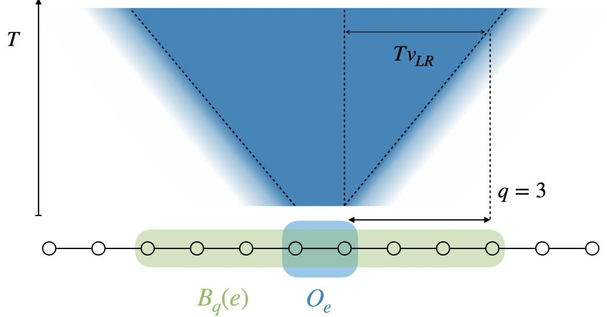  
Figure 5.3: Schematic view of the evolution of the expectation value support of a local observable $O _ { e }$ on an edge $e$ . $v _ { L R }$ indicates the Lieb-Robinson velocity.

More formally, we want to bound the following quantity:

$$
\begin{array} { r l } { | \langle \psi ^ { G } | O _ { X } | \psi ^ { G } \rangle - \langle \psi ^ { \Omega } | O _ { X } | \psi ^ { \Omega } \rangle | = | \langle \psi _ { 0 } | ( U _ { 0 , t } ^ { G } ) ^ { \dag } O _ { X } U _ { 0 , t } ^ { G } | \psi _ { 0 } \rangle - \langle \psi _ { 0 } | ( U _ { 0 , t } ^ { \Omega } ) ^ { \dag } O _ { X } U _ { 0 , t } ^ { \Omega } | \psi _ { 0 } \rangle | } & { } \\ { = | \langle \psi _ { 0 } | \left[ ( U _ { 0 , t } ^ { G } ) ^ { \dag } O _ { X } U _ { 0 , t } ^ { G } - ( U _ { 0 , t } ^ { \Omega } ) ^ { \dag } O _ { X } U _ { 0 , t } ^ { \Omega } \right] | \psi _ { 0 } \rangle | } & { } \end{array}
$$

Since state-dependent LR bounds do not seem to exist to the best of our knowledge and are hard to derive, we first start by neglecting the initial state $| \psi _ { 0 } \rangle$ of unit norm, and write:

$$
| \langle \psi ^ { G } | O _ { X } | \psi ^ { G } \rangle - \langle \psi ^ { \Omega } | O _ { X } | \psi ^ { \Omega } \rangle | \leq \left\| ( U _ { 0 , t } ^ { G } ) ^ { \dagger } O _ { X } U _ { 0 , t } ^ { G } - ( U _ { 0 , t } ^ { \Omega } ) ^ { \dagger } O _ { X } U _ { 0 , t } ^ { \Omega } \right\|
$$

where $\left. . \right.$ denotes the operator norm. The two terms in the norm represent the time evolution of the observable $O _ { X }$ over the whole graph $G$ and over the subgraph $\Omega$ . Lieb-Robinson bounds are explicit, closed expressions upper bounding this quantity [Haah et al. 2021], but they are too loose for our applications on approximation ratios. A numerically tractable expression (not necessarily in a closed form) is enough for our purpose. Although the expression used in this approach is not a LR bound in the strict sense of the concept, it bounds the same quantity, and for simplicity we refer to it as an LR bound. We will use the following result, adapted for time-dependent Hamiltonians from [Tran et al. 2019].

Proposition 5.1. Let $\Omega$ be a subgraph of $G$ , $H _ { \Omega }$ be the terms of the total Hamiltonian $H _ { G }$ supported on the subgraph, and $O _ { X }$ an observable supported on $X$ included in $\Omega$ . The total Hamiltonian $H _ { G }$ is a linear interpolation between $H _ { 0 }$ and $H _ { 1 }$ where only $H _ { 1 }$ has interactions terms. For an evolution during $T$ and $t \in [ 0 , T ]$ , we have that:

$$
\left\| ( U _ { 0 , t } ^ { G } ) ^ { \dagger } O _ { X } U _ { 0 , t } ^ { G } - ( U _ { 0 , t } ^ { \Omega } ) ^ { \dagger } O _ { X } U _ { 0 , t } ^ { \Omega } \right\| \leq \int _ { 0 } ^ { t } d t _ { 1 } \frac { t _ { 1 } } { T } \left\| [ ( U _ { t _ { 1 } , t } ^ { \Omega } ) ^ { \dagger } O _ { X } U _ { t _ { 1 } , t } ^ { \Omega } , H _ { 1 , \partial \Omega } ] \right\| : = L R _ { O _ { X } } ^ { \Omega } ( t )
$$

where $H _ { 1 , \partial \Omega }$ is the final Hamiltonian reduced to the border of $\Omega$ . Notation $[ . , . ]$ corresponds to the commutator operation, i.e. for any operators $A$ and $B$ , $[ A , B ] =$ $A B - B A$ .

Proof. We note $U _ { I } ( t ) ~ = ~ ( U _ { 0 , t } ^ { \Omega } ) ^ { \dag } U _ { 0 , t } ^ { G }$ , the evolution in the interaction picture of $V _ { I } ( t ) = ( U _ { 0 , t } ^ { \{ 2 }  ) ^ { \dag } V ( t ) U _ { 0 , t } ^ { \{ 2 } $ where the perturbation $V$ is $V ( t ) = H _ { G } ( t ) - H _ { \Omega } ( t )$

$$
\begin{array} { r l } { \left\| ( U _ { 0 , t } ^ { G } ) ^ { \dagger } O _ { X } U _ { 0 , t } ^ { G } - ( U _ { 0 , t } ^ { \Omega } ) ^ { \dagger } O _ { X } U _ { 0 , t } ^ { \Omega } \right\| = } & { \left\| \int _ { 0 } ^ { t } d t _ { 1 } \frac { d } { d t _ { 1 } } \left( U _ { I } ( t _ { 1 } ) ^ { \dagger } ( U _ { 0 , t } ^ { \Omega } ) ^ { \dagger } O _ { X } U _ { 0 , t } ^ { \Omega } U _ { I } ( t _ { 1 } ) \right) \right\| } \\ & { = \left\| \int _ { 0 } ^ { t } d t _ { 1 } \left( U _ { I } ( t _ { 1 } ) ^ { \dagger } \left[ ( U _ { 0 , t } ^ { \Omega } ) ^ { \dagger } O _ { X } U _ { 0 , t } ^ { \Omega } , V _ { I } ( t _ { 1 } ) \right] U _ { I } ( t _ { 1 } ) \right) \right\| } \\ & { = \left\| \int _ { 0 } ^ { t } d t _ { 1 } \left( ( U _ { 0 , t _ { 1 } } ^ { G } ) ^ { \dagger } \left[ ( U _ { t _ { 1 } , t } ^ { \Omega } ) ^ { \dagger } O _ { X } U _ { t _ { 1 } , t } ^ { \Omega } , V ( t _ { 1 } ) \right] U _ { 0 , t _ { 1 } } ^ { G } \right) \right\| } \\ & { = \left\| \int _ { 0 } ^ { t } d t _ { 1 } \frac { t _ { 1 } } { T } \left( ( U _ { 0 , t _ { 1 } } ^ { G } ) ^ { \dagger } \left[ ( U _ { t _ { 1 } , t } ^ { \Omega } ) ^ { \dagger } O _ { X } U _ { t _ { 1 } , t } ^ { \Omega } , H _ { 1 , \partial \Omega } \right] U _ { 0 , t _ { 1 } } ^ { G } \right) \right\| } \end{array}
$$

The last equality is true because in $V$ we have every term in $\overline { { \Omega } }$ , all the interactions terms between $\Omega$ and $\Omega$ and the terms between two nodes of $\Omega$ that are not considered in $\Omega$ . The only interactions terms in $\partial \Omega$ lie in $H _ { 1 }$ and we write it $H _ { 1 , \partial \Omega }$ . Thus, $\begin{array} { r } { V ( t _ { 1 } ) = H _ { G } ( t _ { 1 } ) - H _ { \Omega } ( t _ { 1 } ) = H _ { \bar { \Omega } } + \frac { t _ { 1 } } { T } H _ { 1 , \partial \Omega } } \end{array}$ . Because $X \subset \Omega$ , the left term in the commutator is strictly supported by $\Omega$ , so the term with $H _ { \bar { \Omega } }$ cancels out and we are left with the last line. The factor $\frac { t _ { 1 } } { T }$ comes from the linear interpolation we have assumed but we could adapt it to any other schedules. The final result uses the triangular inequality with the norm and integral and the fact that $U _ { 0 , t _ { 1 } } ^ { G }$ is a unitary operator.

On the left-hand side of the inequality of Eq. (5.7), we have the norm of the difference between the time evolution of $O _ { X }$ over a graph $G$ with the time evolution of the same observable over a subsystem $\Omega$ . This value corresponds to the largest noticeable difference in energy one could possibly measure between the evolution on the full graph or restricted to $\Omega$ . Interestingly, the right-hand side of this inequality (i.e. the LR type bound) does not depend on the whole graph $G$ . Potentially, only $H _ { 1 , \partial \Omega }$ could depend on the graph but when working with regular graphs, there are only few possible choices for this term and they all depend on $\Omega$ . Therefore this LR bound only depends on the local shape $\Omega$ of the system around $X$ . Thus, looking at the value of a local observable of an edge or a vertex on the whole graph or only locally on a subgraph is the same up to a small error given by this bound. This LR bound will quickly diverge when letting the evolution run for a large amount of time. In particular, this entails that this result can only be used to analyze the performances of very short time-continuous evolutions. Moreover, the time dependence of the bound is such that considering a larger subsystem $\Omega$ will yield a smaller bound for a fixed $T$ . In other words, if one needs to study some evolution during a longer time (e.g. to get closer to the exact solution), one might need to increase the size of $\Omega$ . In this work, we choose to work with balls $\Omega$ of radius $p = 1$ around each vertex and edge, hence the subgraphs of Fig. 5.2, so we expect that the maximum over the running time to get the approximation ratio yields a very short $T$ .

Now, with this result, we can lower bound the value of $\langle O _ { X } \rangle _ { G }$ that appears in the expression of the final expected energy in Eq. 5.2. By introducing $\langle O _ { X } \rangle _ { \Omega } ^ { * } =$ $\langle O _ { X } \rangle _ { \Omega } - L R _ { O _ { X } } ^ { \Omega }$ , we have that $\langle O _ { X } \rangle _ { G } \geq \langle O _ { X } \rangle _ { \Omega } - L R _ { O _ { X } } ^ { \Omega }$ for any observable $O _ { X }$ and subgraph $\Omega$ . So we can lower bound the final expected value with an expression similar to Eq. (5.5) :

$$
\begin{array} { r l r } { - \langle H _ { 1 } ^ { G } \rangle _ { G , T } \ge n \langle N ^ { ( v ) } \rangle _ { \Omega _ { 0 } } ^ { * } + n _ { 1 } \langle M ^ { ( e ) } \rangle _ { \Omega _ { 1 } } ^ { * } + ( 4 n _ { 1 } + 3 n _ { 2 } ) \langle M ^ { ( e ) } \rangle _ { \Omega _ { 2 } } ^ { * } } & { { } \langle 5 . 8 \rangle } & { } \\ { + ( 3 n / 2 - 5 n _ { 1 } - 3 n _ { 2 } ) \langle M ^ { ( e ) } \rangle _ { \Omega _ { 3 } } ^ { * } } & { { } } & { } \end{array}
$$

The approximation ratio that we defined as

$$
\rho _ { C } = \operatorname* { m a x } _ { T } \operatorname* { m i n } _ { G } \frac { - \langle H _ { 1 } ^ { G } \rangle _ { G , T } } { C _ { o p t } ( G ) }
$$

can be used to derive an approximation ratio of QA as a 1-local algorithm. The numerator is lower bounded by an expression that only depends on $B _ { 1 } ( X )$ , for $X$ being a node or an edge (see Eq. (5.8)). We also need to obtain an upper bound on the optimal cost value that can also depend on $n _ { 1 }$ and $n _ { 2 }$ . The minimization over all graphs $G$ becomes a minimization over $n _ { 1 }$ and $n _ { 2 }$ . In a cubic graph, they must respect $4 n _ { 1 } + 3 n _ { 2 } \leq n$ . The maximization task is ruled by the tightness of the LR-type bound we use.

In this section, we have worked on the construction developed in [Farhi et al. 2014] to derive an approximation ratio expression of QA as a 1-local algorithm. Unlike $p -$ layer QAOA where $\langle O _ { X } \rangle _ { G } = \langle O _ { X } \rangle _ { B _ { p } ( X ) }$ , in QA it is only approximately correct. The difficulty lies in the computation of the error made by this approximation. For $p = 1$ , we suggest to use Proposition 5.1 as it is numerically tractable. In the next section, we apply this method to formally prove non-trivial bound on the approximation ratio reached by QA on MaxCut and MIS over cubic graphs.

# 5.2 Two different problem applications

In this section, we apply the method introduced above to derive approximation ratios for MaxCut and MIS on 3-regular graphs using QA metaheuristic. For each, we first recall the expression of the observable $N ^ { ( v ) }$ and $M ^ { ( e ) }$ that we introduced in Sec.2.2.1. Then we compute the corrected energy $\langle O _ { X } \rangle _ { \Omega } ^ { * }$ for appropriate $O _ { X }$ and $\Omega$ , for different values of $T$ . Eventually, we classically solve the optimization problem $\mathrm { m i n } _ { n _ { 1 } , n 2 } \mathrm { m a x } _ { T }$ to derive the value of the approximation ratio.

# 5.2.1 QA approximation of MaxCut

In Sec. 2.2.2, we introduced the MaxCut problem as well as its encoding in a Hamiltonian. We recall that for an input graph $G ( V , E )$ , the final Hamiltonian is written like $\begin{array} { r } { H _ { 1 } = - \sum _ { e \in E } O _ { e } } \end{array}$ where for $e = \langle a , b \rangle$ , $O _ { e } = { \textstyle \frac { 1 } { 2 } } ( 1 - \sigma _ { z } ^ { ( a ) } \sigma _ { z } ^ { ( b ) } )$ To compute the approximation ratio with the previous developed method, we identify $N ^ { ( v ) } = 0$ and $M ^ { ( e ) } = O _ { e }$ . For the optimal cut, we use the same reasoning as in [Farhi et al. 2014]: the size of the maximum cut is at most the total number of edges $| E |$ and each configuration of type $\Omega _ { 1 }$ and $\Omega _ { 2 }$ (see Figure 5.2) has at least one edge that is not cut (they each contain a triangle that is disjoint from all other triangles). For cubic graph we know that $| E | = 3 n / 2$ . Hence, we have that $C _ { o p t } ( G ) \le 3 n / 2 - n _ { 1 } - n _ { 2 }$ . By normalizing with $n _ { 1 } \gets n _ { 1 } / n$ and $n _ { 2 } \gets n _ { 2 } / n$ , we end up with a global approximation ratio $\rho _ { M C }$ for problem MaxCut that verifies:

$$
\begin{array}{c} \begin{array} { r l r } {  { \rho _ { M C } \geq \operatorname* { m a x } _ { T } \operatorname* { m i n } _ { \begin{array} { l } { n _ { 1 } , n _ { 2 } \leq 1 , } \\ { 4 n _ { 1 } + 3 n _ { 2 } \leq 1 } \end{array} } \frac { n _ { 1 }  O _ { \epsilon }  _ { \Omega _ { 1 } } ^ { * } + ( 4 n _ { 1 } + 3 n _ { 2 } )  O _ { \epsilon }  _ { \Omega _ { 2 } } ^ { * } + ( 3 / 2 - 5 n _ { 1 } - 3 n _ { 2 } )  O _ { \epsilon }  _ { \Omega _ { 3 } } ^ { * } } { 3 / 2 - n _ { 1 } - n _ { 2 } } } } \\ & { } & { \ \mathrm { ( 5 . 9 ~ } } \\ & { \geq \operatorname* { m a x } _ { T }  O _ { \epsilon }  _ { \Omega _ { 3 } } ^ { * } } & { \ \mathrm { ( 5 . 1 0 ~ } } \end{array} )  \end{array}
$$

where we used our technical result of Appendix C.1 which proves that under reasonable conditions, the minimization over $n _ { 1 }$ and $n _ { 2 }$ such that $4 n _ { 1 } + 3 n _ { 2 } \leq 1$ results in $n _ { 1 } = n _ { 2 } = 0$ . We will see in the numerical computation that the necessary conditions are fulfilled to have this value of $n _ { 1 }$ and $n _ { 2 }$ . The worst case for QA is therefore configuration $\Omega _ { 3 }$ , i.e. QA struggles more on triangle-free graphs. Now, it is interesting to mention that the approximation ratio of QA for MaxCut is lower bounded by the edge energy in the middle of configuration $\Omega _ { 3 }$ (see Fig. 5.2) corrected by the LR-type bound. This configuration is bipartite, meaning that in the long time regime, $\langle O _ { e } \rangle _ { \Omega _ { 3 } }$ converges toward 1. Indeed, we remind the reader that for a classical state $| x \rangle$ , $\langle x | O _ { e } | x \rangle = 1$ if and only if edge $e$ lies across the bipartition $x$ and 0 otherwise. This also implies that $\rho _ { M C } \geq 0 . 5$ because at $T = 0$ , the state is a uniform superposition over all possible classical states. We know from Sec. 2.5 that the LR bound increases exponentially with $T$ which is why $\langle O _ { e } \rangle _ { \Omega _ { 3 } } ^ { * }$ reaches a maximum for a finite $T$ .

We numerically evaluate the $\langle O _ { e } \rangle _ { \Omega _ { i } } ^ { * }$ by computing the middle edge energy for each $\Omega _ { i }$ and the corresponding LR-type bound of Proposition 5.7. We found that a maximum is reached at $T _ { m c } = 1 . 6 2$ for which the numerical values for $\langle O _ { e } \rangle _ { \Omega _ { i } } ^ { * }$ are presented in Table 5.1.

Table 5.1: Numerical values to obtain $\langle O _ { e } \rangle _ { \Omega _ { i } } ^ { * }$ at $T = T _ { m c }$   

<table><tr><td>i</td><td>1</td><td>2</td><td>3</td></tr><tr><td>Ω {ei</td><td>0.5951 0.0203</td><td>0.6152 0.0310</td><td>0.6350 0.0417</td></tr></table>

We check that those values are compatible with the conditions of Appendix C.1, to have that $\rho _ { M C } \geq \operatorname* { m a x } _ { T } \langle O _ { e } \rangle _ { \Omega _ { 3 } } ^ { * } = 0 . 5 9 3 3$ .

Details on the computation: For $k \in \{ 1 , 2 , 3 \}$ , to compute the value of $\langle O _ { e } \rangle _ { \Omega _ { i } } ^ { * }$ for $T \in \lfloor 0 , 5 \rfloor$ , we accessed to the value of $\langle O _ { e } \rangle _ { \Omega _ { i } }$ and the LR-like bound $L R _ { O X } ^ { \Omega _ { i } } ( T )$ for appropriate $O _ { X }$ . $\langle O _ { e } \rangle _ { \Omega _ { i } }$ can be computed directly from the quantum state $| \psi ^ { \Omega l _ { i } } ( T ) \rangle$ . This state is computed by numerically solving the Schrödinger equation (2.1) with a relative tolerance of $1 0 ^ { - 9 }$ on $\Omega _ { i }$ . These computations were performed using the AnalogQPU simulator on Eviden Qaptiva using boost. To compute the LR bound, we have to compute the unitary evolution operator $U _ { t _ { 1 } , T } ^ { \Omega _ { i } }$ for all $t _ { 1 } ~ \in ~ [ 0 , T ]$ and compute the integral on the right hand side of Eq. 5.7. We chose a time step of $1 0 ^ { - 3 }$ to compute the integral. We compute the unitary operator for each time step by solving the Schrödinger equation for evolution operator (Eq. 5.1). These computations were carried using the Differential Equations Julia library. Finally, we chose the interaction terms $H _ { 1 , \partial \Omega }$ to be as large as possible for each $\Omega _ { i }$ . This is a sum over all interactions $M ^ { ( e ) }$ for edges $e$ which are not in $\Omega$ but have at least one endpoint in $\Omega$ (see Fig. 5.4).

Here we proved that QA as a one local algorithm achieves a 0.5933 approximation of MaxCut over cubic graphs. The analysis further showed that triangles seems to help the quantum evolution to reach better ratio. In Chapter 7 we investigate more in depth this intuition to analyse the behaviors of larger double binary.

# 5.2.2 QA approximation of MIS

In Sec. 2.2.3, we introduced the Maximum Independent Set problem with its encoding in a Hamiltonian. We recall that for an input graph $G ( V , E )$ , the final Hamiltonian can be written like $\begin{array} { r } { H _ { 1 } = - \sum _ { v \in V } R _ { v } - \sum _ { e \in E } Q _ { e } } \end{array}$ where for a node $v$ ,

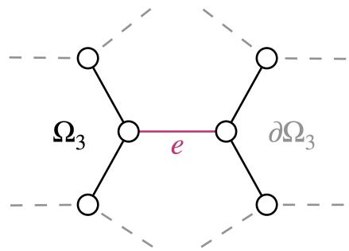  
Figure 5.4: Example of $\partial \Omega$ for $\Omega _ { 3 }$ configuration maximizing the number of interactions with the rest of the graph. Note that an edge between two nodes would also belong to $\partial \Omega$ .

$R _ { v } = \frac { 1 } { 2 } ( 1 - \sigma _ { z } ^ { ( v ) } )$ and for an edge $e = \langle a , b \rangle$ , $\begin{array} { r } { Q _ { e } = - \frac { 1 } { 4 } ( 1 - \sigma _ { z } ^ { ( a ) } ) ( 1 - \sigma _ { z } ^ { ( b ) } ) } \end{array}$ Unlike Max-Cut, we see here that we have a component on the nodes and a component on the edges. We can identify the observables to apply the method of Sec. 5.1 $N ^ { ( v ) } = R _ { v }$ and $M ^ { ( e ) } = Q _ { e }$ . These two components have opposite effects on the cost value of a solution $x$ , $R _ { v }$ tends to increase the size and $Q _ { e }$ tends to minimize the number of edges in $G _ { x }$ . $G _ { x }$ is the graph induced by nodes $v$ such that $x _ { v } = 1$ . Even if the measure of the final state of an annealing process can be a state for which $G _ { x }$ is not an IS, it is easy to correct it to have an IS of the same energy (see Sec. 2.2.3). The energy of $x$ is the size of the $I S$ produced from $x$ . Now, we need to upper bound the size of an MIS in regular graph, we use the following claim :

Claim 5. For a $d$ -regular graph, the size of the MIS is upper bounded by $n / 2$ and this value is reached by bipartite graphs.

Proof. The proof is straightforward once we see that the total number of edges in a $d$ -regular graph is $\textstyle { \frac { d n } { 2 } }$ , and any independent set $I$ has $d | I |$ edges incident to it.

Along with Eq. (5.8), and the fact that $C _ { o p t } ( G ) \leq n / 2$ , the approximation ratio for MIS like the following, where we employed the same normalization as in the previous section with $n _ { 1 } \gets n _ { 1 } / n$ and $n _ { 2 }  n _ { 2 } / n$ :

$$
\begin{array} { r l r } {  { \rho _ { M I S } \geq \operatorname* { m a x } _ { T } \operatorname* { m i n } _ { a _ { 1 } , n _ { 2 } \mathbf { s } , \mathbf { t } . } } \quad 2 [ \langle R _ { v } \rangle _ { \Omega _ { 0 } } ^ { * } + n _ { 1 } \langle Q _ { e } \rangle _ { \Omega _ { 1 } } ^ { * } + ( 4 n _ { 1 } + 3 n _ { 2 } ) \langle Q _ { e } \rangle _ { \Omega _ { 2 } } ^ { * }  }  & { ( 5 . 1 1 ) } \\ & { } & {  + ( 3 / 2 - 5 n _ { 1 } - 3 n _ { 2 } ) \langle Q _ { e } \rangle _ { \Omega _ { 3 } } ^ { * } ] } \\ & { } & { \geq \operatorname* { m a x } _ { T } ( 2 \langle R _ { v } \rangle _ { \Omega _ { 0 } } ^ { * } + 3 \langle Q _ { e } \rangle _ { \Omega _ { 3 } } ^ { * } ) } & { ( 5 . 1 2 ) } \end{array}
$$

where the last inequality comes from the optimization over $n _ { 1 }$ and $n _ { 2 }$ giving $n _ { 1 } =$ $n _ { 2 } = 0$ (see Appendix C.1). Similarly to MaxCut case, triangle-free graphs seem to be worst cases for QA. At $T = 0$ , we have the random guess. For a classical state $x$ , we know that $\langle x | R _ { v } | x \rangle = 1$ if and only if $x _ { v } = 1$ and $0$ otherwise. Also, for an edge $e = \langle a , b \rangle$ , $\langle x | Q _ { e } | x \rangle = - 1$ if and only if $x _ { a } = x _ { b } = 1$ and 0 otherwise. So the random guess has an approximation ratio of $2 \times { \textstyle { \frac { 1 } { 2 } } } - 3 \times { \textstyle { \frac { 1 } { 4 } } } = 0 . 2 5$ . The maximization over $T$ gives at time $T _ { m i s } = 1 . 3 2$ , the numerical values for $\left. O _ { X } \right. _ { \Omega _ { i } } ^ { * }$ presented in Table 5.2.

Table 5.2: Numerical values to obtain $\langle O _ { X } \rangle _ { \Omega _ { i } } ^ { * }$ at time $T = T _ { m i s }$ for the corresponding $O _ { X }$ .   

<table><tr><td rowspan=1 colspan=1>i</td><td rowspan=1 colspan=1>0</td><td rowspan=1 colspan=1>1</td><td rowspan=1 colspan=1>2</td><td rowspan=1 colspan=1>3</td></tr><tr><td rowspan=3 colspan=1>OXΩiLX{0x</td><td rowspan=1 colspan=1>0.4653</td><td rowspan=1 colspan=1>-0.1939</td><td rowspan=1 colspan=1>-0.1920</td><td rowspan=1 colspan=1>-0.1901</td></tr><tr><td rowspan=1 colspan=1>0.0072</td><td rowspan=1 colspan=1>0.0034</td><td rowspan=1 colspan=1>0.0065</td><td rowspan=1 colspan=1>0.0096</td></tr><tr><td rowspan=1 colspan=1>0.4581</td><td rowspan=1 colspan=1>-0.1972</td><td rowspan=1 colspan=1>-0.1985</td><td rowspan=1 colspan=1>-0.1997</td></tr></table>

From the numerical values, we can compute the approximation ratio reached by QA on MIS over cubic graphs, i.e. $\rho _ { M I S } \geq 0 . 3 1 7 1 > 0 . 2 5$ . This proves that constant time QA is better than random guess for solving MIS. By random guess for MIS, we mean the algorithm that chooses uniformly at random in $\{ 0 , 1 \} ^ { n }$ , which also corresponds to QA at $T = 0$ . However, to put it into perspective, a naive greedy algorithm that runs in linear time achieves a 0.5 approximation. Let $I$ be your candidate independent set. Then, for each node, if none of its neighbors is in $I$ yet, put the node in $I$ . On a $d -$ regular graphs, it outputs an independent set of size $n / d$ . Our purpose is to illustrate the generality of the approach based on Lieb-Robinson bounds, which can be used for estimating the energy both on nodes and on edges. We reach with a constant-time local algorithm a ratio that is better than random guess.

In this section, we applied the approach presented in Sec. 5.1 on two combinatorial problems, MaxCut and MIS. The computations showed that constant time QA in both cases is better than random guess. Although it was expected to beat random guess, these numbers provides the first guarantee for short time QA. The numerical values are still not of profound interest in comparison to already known algorithms (see Sec. 2.3). In the next section, motivated by a tightness analysis of the bound and numerical argument, we suggest an alternative approach, which is at this stage not practically tractable.

# 5.3 Toward a better bound for MaxCut?

We believe that the algorithm behaves significantly better than the approximation bounds that we were able to prove. In this section, we first argue this claim with a numerical analysis of our LR bound tightness on MaxCut suggesting some improvement direction. Then, in order to get the best of QA, we provide some hint for a new approach to find a tighter bound on the approximation ratio and conjecture that the actual approximation ratio for MaxCut in cubic graphs with a distance 1 analysis might be of 0.6963, while we only guarantee 0.59.

# 5.3.1 (Non) Tightness of our LR bound

The analysis of the LR bound tightness or non-tightness depends on the runtime $T$ and on the radius $p$ of the ball. The construction we followed to obtain our ratios is for $p = 1$ . So, we study the dependency in $T$ of the LR-type bound we used in the case of MaxCut. We will focus on the bound for $\Omega _ { 3 }$ as it is the most relevant one for deriving the ratios. For this purpose, we construct an example of a ball maximizing the $\partial \Omega _ { 3 }$ as in the case when we compute the LR-type bound from Eq. (5.7). In Fig. 5.4, we see that $\Omega _ { 3 }$ can have up to eight interactions with the rest of the graph. We want to create the “worst” neighborhood $W _ { 3 }$ for $\Omega _ { 3 }$ so that $\delta _ { 1 } ( W _ { 3 } ) = | \langle { \cal O } _ { e } \rangle _ { \Omega _ { 3 } } - \langle { \cal O } _ { e } \rangle _ { W _ { 3 } } |$ is maximal. A quick numerical analysis tells us that interactions between two nodes of $\Omega _ { 3 }$ increase the value of the final expected energy, while an interaction with a node outside $\Omega _ { 3 }$ decreases it. Here, to compare to the LR-type bound, as we said, we need eight interactions with the outside of $\Omega _ { 3 }$ . They will tend to decrease the value of the final energy. So in other word, this “worst” configuration we are looking for should push the energy value toward 0 as fast as possible as the edge energy in $\Omega _ { 3 }$ converges toward 1 progressively. Therefore, $W _ { 3 }$ is a configuration in which the middle edge is necessarily uncut in the optimal state $x ^ { * }$ . This happens when an edge belongs to two odd cycles. Base on the intuition that small cycles have effect on the edge energy faster than large ones, we suggest $W _ { 3 }$ of Fig. 5.5 (left). In this configuration, all edges but $e$ are cut in the optimal solution. In $W _ { 3 }$ , $\langle O _ { e } \rangle _ { W _ { 3 } }$ reaches a maximum at time $T ^ { * } = 3 . 1 5$ .

From the derivation of the LR bound we used, i.e. Eq. (5.7), there are two potential steps where we are losing information. The first one is when we neglect the initial state $| \psi _ { 0 } \rangle$ in Eq. 5.6, i.e. between $\delta _ { 1 } ( G ) = | \langle \psi ^ { G } | O _ { e } | \psi ^ { G } \rangle - \langle \psi ^ { \Omega _ { 3 } } | O _ { e } | \psi ^ { \Omega _ { 3 } } \rangle |$ and $\delta _ { 2 } ( G ) = \Vert ( U _ { 0 , t } ^ { G } ) ^ { \dag } O _ { X } U _ { 0 , t } ^ { G } - ( U _ { 0 , t } ^ { \{ 2 _ { 3 } } \} ) ^ { \dag } O _ { X } U _ { 0 , t } ^ { \{ 2 _ { 3 } } \} \Vert$ where $e$ is an edge in $G$ . The second one is when proving Proposition 5.1 we use the triangular inequality with the operator norm and the integral, i.e., between $\delta _ { 2 } ( G )$ and $L R _ { O _ { X } } ^ { \Omega _ { 3 } }$ . To illustrate this, we plot in Fig. 5.5 these three quantities $\delta _ { 1 } ( G ) \leq \delta _ { 2 } ( G ) \leq L R _ { O _ { X } } ^ { \Omega \lambda _ { 3 } }$ for the non-trivial ball $W _ { 3 }$ we detailed above.

The LR bound used to derive the approximation ratio (i.e. the top red line in the graph) is interesting up to $T _ { m c }$ . It then diverges too quickly away from $\delta _ { 1 }$ (and so does the slightly tighter bound $\delta _ { 2 }$ ). This conveys the intuition that the bound becomes weak because the initial state is ignored. To the best of our knowledge, state-dependent Lieb-Robinson bounds do not exist in the literature as they are difficult to derive. In Chapter 7, we give more intuition on this improvement.

On proving better approximation ratio, this direct approach seems to be limited by the fact it is too complicated to derive state-dependent LR bounds. To circumvent this obstacle, in the next section we suggest another approach to get the best of the LR bound for the derivation of approximation ratios.

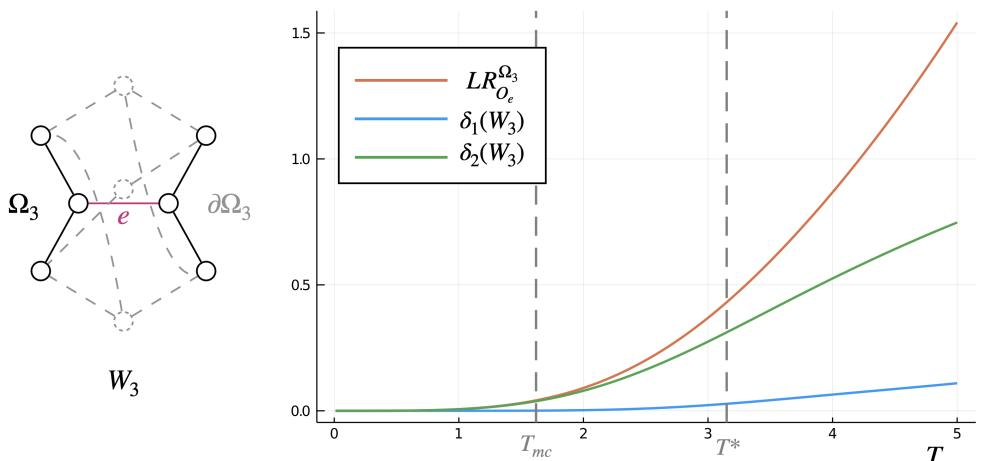  
Figure 5.5: On the left, $W _ { 3 }$ , worst edge configuration for LR bound centered on $e$ . On the right, $\delta _ { 1 }$ and $\delta _ { 2 }$ for $W _ { 3 }$ aside with $L R _ { O _ { e } } ^ { \{ 2 3 } $ . The dashed lines indicate the time $T _ { m c } = 1 . 6 2$ for which we obtain the value of 0.59 and $T ^ { * } = 3 . 1 5$ .

# 5.3.2 Hints for better approximation ratios

To derive a better approximation ratio for a distance 1 analysis of QA applied to MaxCut, i.e. still using Eq. (5.8), we need to grasp the meaning of the star energies $\langle O _ { e } \rangle _ { \Omega } ^ { * }$ . When we substitute the LR bound to the edge energy $\langle O _ { e } \rangle _ { \Omega }$ , we are actually handling any “bad” trajectory of an edge energy in any possible configuration. “Bad” in the sense that the energy is evolving away from the trajectory of $\langle O _ { e } \rangle _ { \Omega }$ caused by the influence of graph structure at distance more than 1. So ideally we should use energies $\langle O _ { e } \rangle _ { \mathcal { G } } ^ { \{ \} }$ , corresponding to the minimum energy of the edge $e$ among all possible cubic graphs $\mathcal { G }$ such that $B _ { 1 } ( e ) = \Omega$ :

$$
\langle O _ { e } \rangle _ { \mathcal { G } } ^ { \Omega } = \operatorname* { m i n } \{ \langle O _ { e } \rangle _ { G } \ | \ G \in \mathcal { G } , e \in E ( G ) \ \mathrm { s . t . } \ B _ { 1 } ( e ) = \Omega \}
$$

That being said, this minimum is obviously intractable as the search space is infinite with infinitely large graphs. However, for short enough runtime, we can restrict ourselves to small configuration around the edge $e$ , extending the $\Omega _ { i }$ . Intuitively, the minimum is reached by edges that are necessarily uncut in the optimal solution. Thus, our strategy is to construct (small) balls $W _ { i }$ for each configuration $\Omega _ { i }$ such that the energy of the observed edge quickly goes to 0 after its expected initial rise, similarly to the construction for the tightness analysis (see Sec. 5.3.1) In order to accelerate the convergence speed to $0$ , we enforced this condition via the adjunction of the smallest possible odd cycles. Indeed, as we already hinted in Sec. 2.5 and 4.3, small cycles converge faster to their target because they are considered first by the quantum evolution. The proposed balls $W _ { i }$ for each configuration $\Omega _ { i }$ are shown in Fig. 5.6. We computed the energy of the edge $e$ in each of these balls for $T \in \left[ 0 , 5 \right]$ and used Eq. 5.9, giving us a ratio of 0.6963 at $T ^ { * } = 3 . 1 5$ . As mentioned above, this is just a numerical estimate and by no mean a formal derivation. However, unless some very non-monotonous behavior arises when growing the radius of these balls, this is most likely an accurate estimate.

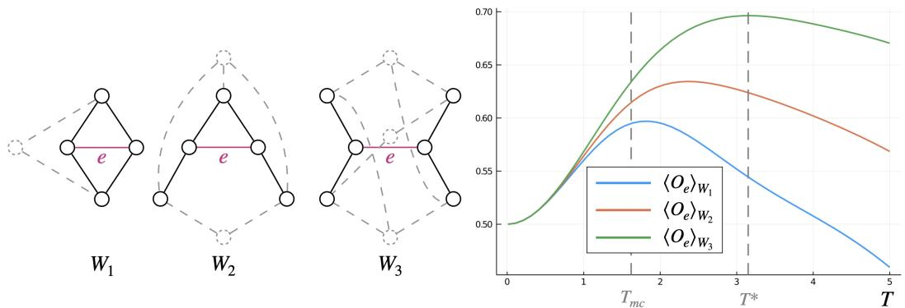  
Figure 5.6: On the left, worst configurations $W _ { i }$ for an edge $e$ that has $B _ { 1 } ( e ) = \Omega _ { i }$ . On the right, evolution of the edge energy against $T$ , $\langle O _ { e } \rangle _ { W _ { 1 } }$ (blue, bottom), $\langle O _ { e } \rangle _ { W _ { 2 } }$ (red, middle) and $\langle O _ { e } \rangle _ { W _ { 3 } }$ (green, top).

This estimation is a truly local (distance 1) analysis of QA as the expression of the approximation we use to compute the ratio depends only on balls of radius 1. It thus seems reasonable to compare this ratio to one obtained for other truly local algorithms. The other known bounds in this setting are single layer QAOA (0.6925) [Farhi et al. 2014] and Hastings’ (classical) local algorithm (0.6980) [Hastings 2019] (see Sec. 2.3 for more details). If our bound is verified, this would show that a QA in time $T ^ { * } = 3 . 1 5$ outperforms single layer QAOA.

As we will develop more formally this construction in Chapter 6, we do not give too much details, but based on already known LR bounds, it seems that one would need to look for any balls of radius up to $q \simeq 7 0$ in order to prove a relevant ratio. The best known LR bound for $d -$ regular graphs is presented in [Chen et al. 2023]:

$$
| \langle O _ { e } \rangle _ { G } - \langle O _ { e } \rangle _ { B _ { q } ( e ) } | \leq \frac { ( 4 ( d - 1 ) t ) ^ { q } } { q ! } \frac { 1 } { 1 - 2 / e }
$$

which achieves a value of 0.014 for $t = T ^ { * } = 3 . 1 5$ and $q = 7 1$ . Unfortunately, this radius is unreachable for the best known classical simulation algorithm of quantum annealing, and neither is it for the largest existing quantum computer. The larger ball $B _ { q } ( e )$ that can be completed in a cubic graph has $2 ( 2 ^ { q + 1 } - 1 )$ nodes. To be able to use this approach one would need to reach a similar bound value for $q = 3$ .

Discussion: The work presented in this chapter can be easily adapted to tackle other bounded degree graphs, e.g. MaxCut over 4 (resp 5)-regular graphs gives a ratio of 0.57 (resp. 0.56), with shorter annealing times. Secondly, we draw readers’ attention to the fact that we only considered linear schedule of the form $s ( t ) = t / T$ . Other types of schedules should be tested to get the best possible ratio. For example, we tested with the optimal schedule of Grover [Roland $\&$ Cerf 2002], i.e. with

$$
f ( s ) = { \frac { 1 } { 2 } } + { \frac { 2 s - 1 } { 2 { \sqrt { 2 ^ { n } - ( 2 ^ { n } - 1 ) ( 2 s - 1 ) ^ { 2 } } } } }
$$

and the total Hamiltonian $H ( s ) = ( 1 - f ( s ) ) H _ { 0 } + f ( s ) H _ { 1 }$ . It is also possible to add a perturbative Hamiltonian so the total Hamiltonian is $H ( s ) = ( 1 - s ) H _ { 0 } + s H _ { 1 } +$ $s ( 1 - s ) H _ { p e r t }$ where $H _ { p e r t } = \frac { | H _ { 0 } , H _ { 1 } | } { 2 }$ . Both initiatives output a ratio of 0.61, slightly improving on the bound presented in Sec. 5.2.1. In any case, the value of the edge energy as well as the LR-type bound value have to be computed again.

# Conclusion

The general method described in this chapter provides tools for deriving approximation ratios for quantum annealing on combinatorial problems, with a very short runtime. The locality of quantum annealing given by the Lieb-Robinson bound allows combinatorial arguments on regular (and in particular cubic) graphs, of the same type as those used for QAOA. We emphasized that the theoretical arguments are valid for regular graphs of any fixed degree. We applied this technique to Max-Cut and MIS to show how it can be used to access numerical values of approximation ratios for cubic graphs. We then discussed the non-tightness of the Lieb-Robinson bound using MaxCut and drew some “worst-case” graphs to argue that QA can probably achieve an approximation ratio for this problem significantly better than we can actually prove. Overall, we have developed tools to recover locality in the standard formulation of quantum annealing and use this relaxed locality to derive lower bounds on QA’s performance for the Maximum Cut and the Maximum Independent Set problem on cubic graphs.

There are two main directions for improving these results and the general issue of short-term QA as an approximation algorithm for graph optimization problems. The first direction would be to improve the algorithm itself by choosing a better schedule. In our analysis, we focused on a linear interpolation scheme, whereas QAOA, which can be considered a special case of QA, relies on a parameterized bang-bang scheme. There is, however, numerical evidence to suggest that some other schedules produce better energies (see [Brady et al. 2021, Guéry-Odelin et al. 2019]). We have proposed two types of schedule modification that give slightly better ratios. We believe that our tools would enable us to study this wider variety of QAs and obtain analytical guarantees of their performance.

The other direction would be to refine the analysis of constant-time QA using less restrictive locality arguments such as the one we introduced informally in Sec. 5.3.2. In the next chapter, we choose to formally apply this alternative method.

# Tight Lieb-Robinson bound for approximation ratio

# Contents

# 6.1 Local analysis of QA and Lieb-Robinson Bound . . . . . . . 134

6.1.1 Parametrized QA . 134   
6.1.2 $p -$ local analysis 135   
6.1.3 Lieb-Robinson bound reduction 137

# 6.2 Tight LR bound on regular graphs for MaxCut approximation . . 139

6.2.1 Tight LR bound on regular graphs in QA 139   
6.2.2 Global LR bound . 144   
6.2.3 Application to approximation ratio of MaxCut . . . 146

# 6.3 Discussion . 149

6.3.1 Tightness of the analysis method 149   
6.3.2 Toward better ratios 151   
6.3.3 Directions for generalizing the construction 152

In this chapter, we pursue the alternative construction suggested in the previous chapter (Sec. 5.3.2) to prove the following theorem.

Theorem. With a 1-local analysis, the approximation ratio reached by QA to solve MaxCut over cubic graphs is above 0.7020.

This result is to be compared with the previous one obtained in Chapter 5, where we proved a lower bound of 0.5933. We manage to increase the numerical value using a slightly different approach. First we formally define a $p -$ local analysis of QA and introduce a new parameter, $\alpha$ , in the standard QA setting. Then we explain how a Lieb-Robinson bound helps to tract the minimization over all possible cubic graphs by reducing the total space search $\mathcal { G }$ to the family of radius $q$ balls $B _ { q }$ . To find the minimum among all those balls, we filter out most balls with a global LR bound $\varepsilon$ and to get the best possible ratio, we employ a local bound $\varepsilon _ { l o c }$ , adapted to the considered ball. Eventually, an optimization over $T$ and $\alpha$ allows us to prove the theorem. An overview of the different steps of the proof are sum-up in Fig. 6.1.

We first go through the formal construction of the method that we introduced in Sec. 5.3.2 and we detail where the parameter $\alpha$ affect the annealing process. We focus on the MaxCut problem only but as we developed in Sec. 5.1, it is possible to consider other combinatorial problems. Then, we derive our tight LR bound that allows us to compute the approximation ratio promised by the theorem.

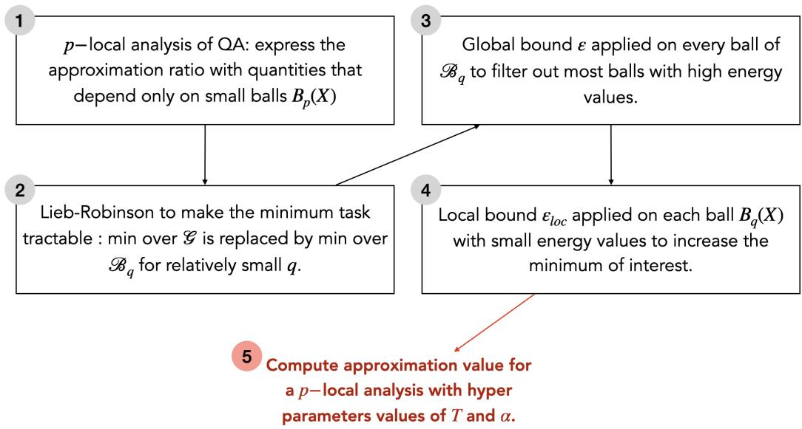  
Figure 6.1: Overview of the different steps of the Theorem proof.

# 6.1 Local analysis of QA and Lieb-Robinson Bound

In this section, we formally develop the construction hinted in Sec. 5.3.2. More exactly, we introduce a parametrized version of QA and write down the associated approximation ratio. Then we define properly the meaning of a $p -$ local analysis of QA with example for $p = 0$ and $p = 1$ . Eventually, we show how the Lieb-Robinson bound can be used to tract the desired approximation ratio.

# 6.1.1 Parametrized QA

Recall that for a given graph $G ( V , E )$ in $\mathcal { G }$ , a family of graphs, on which we want to solve MaxCut, the target Hamiltonian is HG1 = − PX∈E OX where OX = 1−σ(a)z σ(b)z2 for the edge $X = \langle a , b \rangle$ . The difference of this new setting is the introduction of a hyper-parameter $\alpha$ in the initial Hamiltonian as

$$
H _ { 0 } ( \alpha ) = - \sum _ { v \in V } { \frac { \sigma _ { x } ^ { ( v ) } } { \alpha } }
$$

The initial state is still the uniform superposition $| \psi _ { 0 } \rangle$ , as for the final state, it is now depending on $\alpha$ , i.e. $| \psi ^ { G } ( T , \alpha ) \rangle = U _ { T , \alpha } ^ { G } | \psi _ { 0 } \rangle$ . Here, $U _ { T , \alpha } ^ { G }$ denotes the unitary evolution operator under the time-dependent Hamiltonian ${ \cal H } ( t , G ) = ( 1 -$ $\begin{array} { r } { \frac { t } { T } ) H _ { 0 } ( \alpha ) + \frac { t } { T } H _ { 1 } ^ { G } } \end{array}$ and $T$ the total annealing time. This operator $U _ { T , \alpha } ^ { G }$ , corresponds to a Schrödinger evolution, i.e. is a solution of:

$$
\forall t \in [ 0 , T ] , \quad i \hbar \frac { d U _ { t , \alpha } ^ { G } } { d t } = H ( t , G ) U _ { t , \alpha } ^ { G }
$$

The expected value at the end of the annealing process is $\begin{array} { r l } { \langle H _ { 1 } ^ { G } \rangle _ { G , \alpha } } & { { } = } \end{array}$ $\langle \psi ^ { G } ( T , \alpha ) | H _ { 1 } ^ { G } | \psi ^ { G } ( T , \alpha ) \rangle$ and thus, our metric of interest is

$$
\rho _ { M C } = \operatorname* { m a x } _ { T , \alpha } \operatorname* { m i n } _ { G \in \mathcal { G } } \frac { - \langle H _ { 1 } ^ { G } \rangle _ { G , \alpha } } { C _ { o p t } ( G ) } .
$$

Since we are interested in using local arguments to bound this quantity, as in Chapter 5, we will restrict the family of graphs $\mathcal { G }$ to the set of 3-regular graphs. The goal is to find a good lower bound for this ratio. This can be achieved by separately upper bounding the denominator and lower bounding the numerator. By linearity, the numerator can be written as a sum over the edges $\sum { _ { X \in E } \langle O _ { X } \rangle _ { G , \alpha } }$ .

Influence of $\alpha$ : To give a brief idea on the effect of the parameter on the quantum evolution, let us plot in Fig. 6.2, the edge energy value of the middle edge of $W _ { 3 }$ that we introduced in Fig. 5.5 for different values of $\alpha$ . We know that in the standard QA, i.e. for $\alpha = 1$ (green curve), it starts at 0.5 at $T = 0$ , it increases up to 0.6963 at time $T ^ { * } = 3 . 1 5$ , and then decreases toward 0 its final value. Here, to some extent, $\alpha$ modulates the weight of $H _ { 0 }$ compared to $H _ { 1 }$ . As it will become clearer when deriving the LR bound in Sec. 6.2, increasing $\alpha$ slows down the evolution. Informally, the information travels at smaller speed in the quantum system. By consequence, for $\alpha > 1$ , it takes more time to reach a similar value and it corrects its trajectory toward the target value later in time. In some sense, QA is “fooled” for longer times when $\alpha$ is large. This allows the edge energy to reach a higher maximum later.

From now on, we will drop the dependency in $\alpha$ in the edge energy notation, like for $T$ , when it is clear from context. It will only appear when optimizing the approximation ratio.

# 6.1.2 $p$ −local analysis

As we mention, due to its analog nature, QA is non local, so to compare it to other optimization solver like QAOA or to local classical algorithms, we need to define a way to analyze it as a local algorithm. In Chapter 5, we suggest an approach for a $1 -$ local analysis. Here we define the notion for any $p$ .

Definition 6.1 ( $p -$ local analysis of QA). We call a $p -$ local analysis of $Q A$ , an analysis that produces an approximation ratio that depends only on balls in $B _ { p }$ . In other words, the expression used to compute the ratio only considered balls in $B _ { p }$ .

In Sec. 5.1, we expanded on one possibility to analyze QA at distance 1, but it was rather a restrictive version. Let us develop the construction of a 0-local and

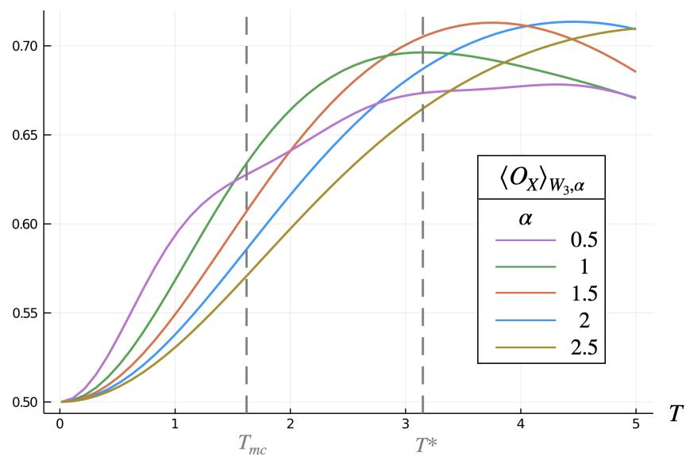  
Figure 6.2: Edge energy in the middle of $W _ { 3 }$ graph $\left. 0 _ { X } \right. _ { W _ { 3 } , \alpha }$ for $\alpha$ ∈ [0.5, 1, 1.5, 2, 2.5]

1-local analysis in the more general case.

$\boldsymbol { \mathit { 0 } }$ -local: For any $X \ \in \ E$ , a trivial lower bound of $\langle O _ { X } \rangle _ { G }$ is to assume that all edges are in the worst possible configuration. It means that it is lower bounded by $\operatorname* { m i n } _ { G \in { \mathcal G } } \langle O _ { X } \rangle _ { G } = \langle O _ { X } \rangle _ { \mathcal G }$ , where we note $\mathcal { G }$ the set of all cubic graphs. With the trivial bound on $C _ { o p t } ( G ) ~ < ~ | E |$ , it gives the following lower bound on the approximation ratio:

$$
\rho _ { M C } \geq \operatorname* { m a x } _ { T , \alpha } \langle O _ { X } \rangle _ { \mathcal { G } } .
$$

Finding the latter value constitutes the approximation ratio of QA with 0-local analysis.

1-local: Now, we are allowed to use the knowledge at distance 1 from the edge $X$ . Like in Sec. 5.1, for cubic graphs there are only three possible $B _ { 1 } ( X )$ . We are refering to the $\Omega _ { i }$ of Fig. 5.2. Therefore the edge energies $\langle O _ { X } \rangle _ { G }$ can be bounded by one of the following quantities $\langle O _ { X } \rangle _ { \mathcal { G } } ^ { \Omega _ { i } } = \operatorname* { m i n } \{ \langle O _ { X } \rangle _ { G } \ | \ G \in \mathcal { G } , X \in$ $E ( G )$ s.t. $B _ { 1 } ( X ) = \Omega _ { i } \}$ . And with a similar combinatorial argument, $n _ { i }$ being the number of $\Omega _ { i }$ in $G$ , the final expected energy can thus be lower bounded as:

$$
- \langle H _ { 1 } ^ { G } \rangle _ { G } \geq n _ { 1 } \langle O _ { X } \rangle _ { \mathcal { G } } ^ { \Omega _ { 1 } } + ( 4 n _ { 1 } + 3 n _ { 2 } ) \langle O _ { X } \rangle _ { \mathcal { G } } ^ { \Omega _ { 2 } } + ( | E | - 5 n _ { 1 } - 3 n _ { 2 } ) \langle O _ { X } \rangle _ { \mathcal { G } } ^ { \Omega _ { 3 } }
$$

We remind that this expression still depends on the input graph through the variables $n _ { i }$ , and thus, still needs to be minimized over the positive integers $n _ { i }$ ’s with the constraint that $4 n _ { 1 } + 3 n _ { 2 } \leq | V |$ . We also use the same upper bound on the optimal value, i.e. $C _ { o p t } \leq | E | - n _ { 1 } - n _ { 2 }$ , where $| E | = 3 | V | / 2$ . We recover the lower

bound for the approximation ratio:

$$
\rho _ { M C } \geq \operatorname* { m a x } _ { T , \alpha } \operatorname* { m i n } _ { \substack { n 1 , n 2 \mathrm { ~ s t } } } \frac { n _ { 1 } \langle O _ { X } \rangle _ { g } ^ { \Omega _ { 1 } } + ( 4 n _ { 1 } + 3 n _ { 2 } ) \langle O _ { X } \rangle _ { g } ^ { \Omega _ { 2 } } + ( | E | - 5 n _ { 1 } - 3 n _ { 2 } ) \langle O _ { X } \rangle _ { g } ^ { \Omega _ { 3 } } } { | E | - n _ { 1 } - n _ { 2 } }
$$

The result from Appendix C.1 still applies and under reasonable conditions the minimization gives $n _ { 1 } = n _ { 2 } = 0$ so the approximation ratio becomes

$$
\rho _ { M C } \geq \operatorname* { m a x } _ { T , \alpha } \langle O _ { X } \rangle _ { \mathcal { G } } ^ { \Omega _ { 3 } }
$$

We see that this lower bound is very similar to the 0-local analysis case where we added the fact that edge $X$ must have $\Omega _ { 3 }$ as its $B _ { 1 } ( X )$ . We are really using more knowledge of the neighboring structure of $X$ .

$p$ -local: For a larger $p$ , one would need to enumerate every possible $B _ { p } ( X )$ balls that can be completed in a cubic graphs and comes up with a linear combination of the edge energy in each of these $B _ { p } ( X )$ . In [Wurtz & Love 2021], the authors undertook this approach to prove that $p = 2$ QAOA achieves a ratio of 0.7559, value conjectured originally in [Farhi et al. 2014]. It appears that the double binary tree $T _ { p }$ of depth $p$ is also the worst case for $p = 2$ and it is widely believed in the community that $T _ { p }$ is a great candidate to be the ball $B _ { p } ( X )$ such that :

$$
\rho _ { M C } \geq \operatorname* { m a x } _ { T , \alpha } \langle O _ { X } \rangle _ { \mathcal { G } } ^ { T _ { p } }
$$

Motivated by this conjectured, the authors of [Basso et al. 2022] cleverly develop an iterative procedure to access the final energy of an edge in the middle of a $T _ { p }$ with a $p$ layer QAOA. They were able to compute the exact value up to $p = 1 7$ . No similar results exist for QA but in Chapter 7 we suggest an idea to derive this value.

With this in mind, to access to the approximation ratio reached by QA, we still need to compute the minimum over an infinite family of graphs. This minimum is obviously intractable. So to overcome this difficulty, as we mentioned at the end of Chapter 5, we will use the Lieb-Robinson bound presented in the next section.

# 6.1.3 Lieb-Robinson bound reduction

This idea of this section is to introduce two types of LR bounds that will help us in the computation of the minimization over all the cubic graphs. We already know that with a finite short runtime, the trajectory of an edge energy mostly depends on the neighboring structure. Consequently, when computing the minimum of interest, we can stop at a finite radius of the graph around the edge, with a penalty $\varepsilon$ on the minimum. In other words, for a given time $q ( T , \varepsilon )$ uch that is an ed $| \langle O _ { X } \rangle _ { \mathcal { G } } ^ { \{ \lambda 2 }  - \langle O _ { X } \rangle _ { \mathcal { B } _ { q } ( \underline { { T } } , \varepsilon ) } ^ { \{ \lambda 2 }  | \leq \varepsilon$ where . Thi $T$ and a desired error $B _ { q }$ is the set of al basically the $\varepsilon$ , there exists a possible ain idea $B _ { q } ( X )$ $X$ $G \in { \mathcal { G } }$   
Lieb-Robinson velocity. Now, to get the best of the LR bound, we will describe a local bound, that is adapted to the considered ball $B _ { q } ( X )$ and a global one that is maximizing the local bounds.

Local bound. Suppose that for any graph $G$ , and any edge $X$ of $G$ , there exists a $\varepsilon _ { l o c } ( B _ { q } ( X ) , T , \alpha ) > 0$ that upper bounds the absolute difference: $| \langle O _ { X } \rangle _ { G } -$ $\langle O _ { X } \rangle _ { B _ { q } ( X ) } | \ < \ \varepsilon _ { l o c } ( B _ { q } ( X ) , T , \alpha )$ . The local aspect lies in the fact that $\varepsilon _ { l o c }$ depends on the ball $B _ { q } ( X )$ . If such a bound exists, we have that $\langle O _ { X } \rangle _ { G } \geq$ $\langle O _ { X } \rangle _ { B _ { q } ( X ) } - \varepsilon _ { l o c } ( B _ { q } ( X ) , T , \alpha )$ . This lower bound is satisfied for all graphs $G \in { \mathcal { G } }$ . The only dependence on the input graph now lies in $B _ { q } ( X )$ . We can rewrite the minimization over $\mathcal { G }$ as:

$$
\begin{array} { r l } & { \quad \underset { G \in \mathcal { G } } { \mathrm { m i n } } \langle O _ { X } \rangle _ { G } \geq \underset { B _ { q } ( X ) \in B _ { q } } { \mathrm { m i n } } \left( \langle O _ { X } \rangle _ { B _ { q } ( X ) } - \varepsilon _ { l o c } ( B _ { q } ( X ) , T , \alpha ) \right) } \\ & { \Rightarrow \langle O _ { X } \rangle _ { \mathcal { G } } \geq \langle O _ { X } \rangle _ { B _ { q } } ^ { * } } \end{array}
$$

where $\begin{array} { r } { \langle O _ { X } \rangle _ { \mathcal B _ { q } } ^ { * } = \operatorname* { m i n } _ { B _ { q } ( X ) \in \mathcal B _ { q } } \left( \langle O _ { X } \rangle _ { B _ { q } ( X ) } - \varepsilon _ { l o c } ( B _ { q } ( X ) , T , \alpha ) \right) } \end{array}$ . Therefore, the approximation ratio becomes, for QA as a $0$ -local algorithm,

$$
\rho _ { M C } \geq \operatorname* { m a x } _ { T , \alpha } \langle O _ { X } \rangle _ { B _ { q } } ^ { * }
$$

We can do the same for the 1-local analysis, when taking advantage of the neighborhood at radius 1 around the edge $X$ . So we have that

$$
\langle { \cal O } _ { X } \rangle _ { \mathcal { G } } ^ { \Omega _ { i } } \geq \operatorname* { m i n } _ { B _ { q } ( X ) \in \mathcal { B } _ { q } } \left( \langle { \cal O } _ { X } \rangle _ { B _ { q } ( X ) } ^ { \Omega _ { i } } - \varepsilon _ { l o c } ( B _ { q } ( X ) , T , \alpha ) \right) = \langle { \cal O } _ { X } \rangle _ { B _ { q } , i } ^ { * }
$$

where $B _ { q , i }$ is the family of graphs $B _ { q } ( X ) \in B _ { q }$ restricted to balls $B _ { q } ( X )$ for which $B _ { 1 } ( X ) = \Omega _ { i }$ . Still assuming $n _ { 1 } = n _ { 2 } = 0$ , the approximation ratio can be written as a new equation that depends only on these epsilons and worst edge energy among “small” ball of radius $q$ :

$$
\rho _ { M C } \geq \operatorname* { m a x } _ { T , \alpha } \langle O _ { X } \rangle _ { B _ { q , 3 } } ^ { * }
$$

It could be costly to compute the local bound for each ball $B _ { q } ( X )$ . In particular it seems pointless to calculate them for those with high edge energy values. An upper bound would suffice to handle several cases at once.

Global bound. To avoid having to develop too many bounds $\varepsilon _ { l o c }$ as the number of $B _ { q } ( X )$ explodes exponentially, it can be useful to apply a global bound for most of the balls in the minimization task. We define it as

$$
\varepsilon ( q , T , \alpha ) = \operatorname* { m a x } _ { B _ { q } ( X ) \in B _ { q } } \varepsilon _ { l o c } ( B _ { q } ( X ) , T , \alpha )
$$

We will see in Section 6.2 that this maximum is easy to derive from the analytical expression of the local bound. The global bound is used as follows:

$$
\begin{array} { c } { { \displaystyle \left( \langle O _ { X } \rangle _ { B _ { q } ( X ) } - \varepsilon _ { l o c } ( B _ { q } ( X ) , T , \alpha ) \right) \geq \langle O _ { X } \rangle _ { B _ { q } ( X ) } - \displaystyle \operatorname* { m a x } _ { B _ { p } ( X ) \in B _ { q } } \varepsilon _ { l o c } ( B _ { q } ( X ) , T , \alpha ) } } \\ { { \mathrm { } } } \\ { { = \langle O _ { X } \rangle _ { B _ { q } ( X ) } - \varepsilon ( q , T , \alpha ) } } \\ { { \Rightarrow \langle O _ { X } \rangle _ { B _ { q } } ^ { * } \geq \langle O _ { X } \rangle _ { B _ { q } } - \varepsilon ( q , T , \alpha ) } } \end{array}
$$

Then for balls $B _ { q } ( X )$ for which $\langle O _ { X } \rangle _ { B _ { q } ( X ) }$ is large enough, the global bound is sufficient in the minimization task over $B _ { q }$ .

Now, we have reduced the problem of finding a minimum among an infinite number of graphs to a finite number of graphs. We point out that the finite size of $B _ { q }$ is only true if the maximum degree of the graphs we are looking at is fixed. Thus, for cubic graphs, the minimum is tractable. However, it might not be practically tractable if $q$ is too large. As we mentioned in Sec. 5.3.2, the state-of-the-art LR bound achieves a value of 0.014 at $T = 3 . 1 5$ for $q = 7 1$ . Recall that we need to solve the Schrödinger equation on each ball. Today’s quantum computers are not precise enough to compute the edge energy, so this task is to be handled by a classical simulator. This highly limits the size of the balls that can be considered. The largest ball of $B _ { q }$ is the double binary tree $T _ { q }$ which has $2 ( 2 ^ { q + 1 } - 1 )$ nodes. At already 30 nodes for $q = 3$ , this defines the limit of classical resources we can use. Any known bound does better than the trivial bound of 2 (on the commutator) at this radius. Sec. 6.2 is dedicated to the derivation of a tighter LR bound tailored exactly for the purpose of having reasonable LR bound values for $q = 3$ .

# 6.2 Tight LR bound on regular graphs for MaxCut approximation

The statement of our main result of the chapter is the following:

Theorem 6.1. With a 1-local analysis, the approximation ratio reached by QA to solve MaxCut over cubic graphs is above 0.7020.

In this section we prove Theorem 6.1 in two steps. First we develop a tight enough LR bound using the commutativity graph structure introduced in [Wang & Hazzard 2020] and by computing the exact values of the schedule’s nested integrals. This determines the required value of $q$ to achieve the best provable ratio. The second step is purely numerical and requires to enumerate each ball $B _ { q } ( X )$ and get the minimum of the final expected energy of the edge $X$ inside these balls for each $\Omega _ { i }$ , corrected by the LR bound. This new approach follows the idea presented in the last section of Chapter 5.

# 6.2.1 Tight LR bound on regular graphs in QA

As mentioned in section 6.1, the minimization to obtain the approximation ratio is intractable when performed over the entire graph family. However, the LR bound helps to reduce the size of the set on which we have to minimize to a finite subfamily of graphs, namely $B _ { q }$ (see Equation 6.3).

First we seek to develop a local bound $\varepsilon _ { l o c } ( B _ { q } ( X ) , T , \alpha )$ such that $| \langle O _ { X } \rangle _ { G } \ -$ $\langle O _ { X } \rangle _ { B _ { q } ( X ) } | \ < \ \varepsilon _ { l o c } ( B _ { q } ( X ) , T , \alpha )$ for all $d$ -regular graphs $G$ such that the ball at distance $q$ around edge $X$ corresponds to $B _ { q } ( X )$ . Let $G$ be such a graph. Recall that it is rather difficult to manipulate this expression considering the initial state $| \psi _ { 0 } \rangle$ so the first step (however costly in terms of tightness) is to get rid of this dependency by working directly with the evolution operator:

$$
| \langle O _ { X } \rangle _ { G } - \langle O _ { X } \rangle _ { B _ { q } ( X ) } | \leq \left\| O _ { X } ^ { G } ( T ) - O _ { X } ^ { B _ { q } ( X ) } ( T ) \right\|
$$

where we introduce the evolved observable under unitary operators $U _ { T } ^ { G }$ and $U _ { T } ^ { B _ { q } ( X ) }$ respectively, once again dropping the $\alpha$ from the notation. They are defined as:

$$
\begin{array} { c } { { O _ { X } ^ { G } ( T ) = ( U _ { T } ^ { G } ) ^ { \dagger } O _ { X } U _ { T } ^ { G } } } \\ { { O _ { X } ^ { B _ { q } ( X ) } ( T ) = ( U _ { T } ^ { B _ { q } ( X ) } ) ^ { \dagger } O _ { X } U _ { T } ^ { B _ { q } ( X ) } } } \end{array}
$$

In [Bravyi et al. 2006], the authors demonstrate that the evolution over a subset of nodes can also be expressed as :

$$
{ \cal O } _ { X } ^ { B _ { q } ( X ) } ( T ) = \int d \mu ( U ) U { \cal O } _ { X } ^ { G } ( T ) U ^ { \dagger }
$$

where $\mu ( U )$ denotes the Haar measure over unitary operator $U$ supported on $S =$ $V \backslash V ( B _ { p } ( X ) )$ . Noticing that $U O _ { X } ^ { G } ( T ) U ^ { \dagger } = O _ { X } ^ { G } ( T ) + U [ O _ { X } ^ { G } ( T ) , U ^ { \dagger } ]$ , we can bound the quantity of interest $\begin{array} { r } { \left\| O _ { X } ^ { G } ( T ) - O _ { X } ^ { B _ { q } ( X ) } ( T ) \right\| \le \int d \mu ( U ) \left\| [ O _ { X } ^ { G } ( T ) , U ^ { \dag } ] \right\| } \end{array}$ for any unitary $U$ supported on $\dot { S }$ . We are then left to bound the norm of this commutator.

Commutativity graph: Let us introduce a helpful tool presented in [Wang $\&$ Hazzard 2020] (see also [Chen $\&$ Lucas 2021]): the commutativity graph ${ \bf G } ( { \bf V } , { \bf E } )$ associated to a Hamiltonian $H ( t , G )$ having local interactions. In general, we can write $\begin{array} { r } { H ( t ) = \sum _ { j } h _ { j } ( t ) \gamma _ { j } } \end{array}$ where $\gamma _ { j }$ are hermitian operators with norm less than unity and $h _ { j } ( t )$ are time-dependent scalars. The commutativity graph of $H ( t )$ is constructed such that each operator $\gamma _ { j }$ is represented by a node $j$ and two nodes $j$ and $k$ are connected if and only if $[ \gamma _ { j } , \gamma _ { k } ] \neq 0$ . The structure of the graph captures the commutative and non-commutative relationships between the operators in the Hamiltonian.

In the case of MaxCut, the total time-dependent Hamiltonian writes

$$
H ( t , G ) = \sum _ { v \in V } ( 1 - \frac { t } { T } ) \frac { \sigma _ { x } ^ { ( v ) } } { \alpha } + \sum _ { ( a , b ) \in E } \frac { t } { T } \frac { 1 - \sigma _ { z } ^ { ( a ) } \sigma _ { z } ^ { ( b ) } } { 2 }
$$

As described, the terms $\gamma _ { j }$ of the Hamiltonian are represented as nodes in the commutativity graph $\mathbf { G }$ . We can distinguish two types of nodes in $\mathbf { V }$ : those corresponding to interaction operators over the edges $E$ of the original input graph, and those corresponding to local operators over nodes of $V$ . This means that we have for $e = \langle a , b \rangle \in E$ , $\begin{array} { r } { \gamma _ { e } = \frac { 1 - \sigma _ { z } ^ { ( a ) } \sigma _ { z } ^ { ( b ) } } { 2 } } \end{array}$ and for $v \in V$ , $\begin{array} { r } { \gamma _ { v } = \frac { \sigma _ { x } ^ { ( v ) } } { \alpha } } \end{array}$ . We can rewrite the total Hamiltonian as:

$$
H ( t , G ) = \sum _ { v \in V } h _ { v } ( t ) \gamma _ { v } + \sum _ { e \in E } h _ { e } ( t ) \gamma _ { e }
$$

Our notation fixes the time-dependent scalars as $\begin{array} { r } { h _ { e } ( t ) ~ = ~ \frac { t } { T } } \end{array}$ for $\textit { e } \in \textit { E }$ and $\begin{array} { r } { h _ { v } ( t ) = 1 - \frac { t } { T } } \end{array}$ for $v \in V$ . Also, it is obvious to see that the commutativity graph is bipartite. The only pairs that do not commute are pairs $( \gamma _ { v } , \gamma _ { e } ) _ { v , e }$ , where node $v$ is incident to edge $e$ in $G$ . An example of commutativity graph is shown in Fig. 6.3.

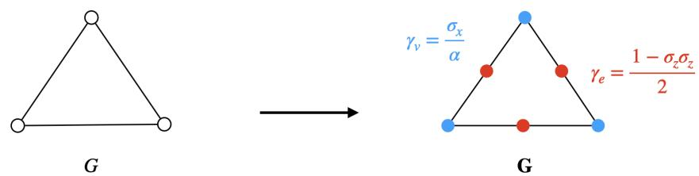  
Figure 6.3: Example of a commutativity graph for the following Hamilonian: $\begin{array} { r } { H ( t , G ) = \sum _ { i = 1 } ^ { 3 } ( 1 - \frac { t } { T } ) \frac { \sigma _ { x } ^ { ( i ) } } { \alpha } + \frac { t } { T } \frac { 1 - \sigma _ { z } ^ { ( i ) } \sigma _ { z } ^ { ( i + 1 ) } } { 2 } } \end{array}$ where index $i$ is taken modulo 3. Blue nodes represent 1-local operators and red nodes represent 2-interaction terms. In particular, blue nodes of $\mathbf { G }$ correspond to nodes of the original graph $G$ , and red nodes correspond to its edges.

For a unitary $A$ supported on $S$ , we want to upper bound the quantity $\| [ O _ { X } ^ { G } ( T ) , A ] \|$ . This edge $X$ can be identified with a specific interaction term in the commutativity graph. Let us define $X$ to be the node in $\mathbf { G }$ corresponding to the edge $X$ and consider the operator $\gamma _ { X } ^ { A } ( T ) = [ \gamma _ { X } ( T ) , A ]$ with $\gamma _ { X } ( t ) = ( U _ { T } ^ { G } ) ^ { \dagger } \gamma _ { X } U _ { T } ^ { G }$ , dropping the dependency on $G$ . Still following the first steps in [Wang $\&$ Hazzard 2020], we can arrive at a similar expression in the time-dependent regime (see Appendix C.2 for details):

$$
\begin{array} { r l } & { \| \gamma _ { X } ^ { A } ( T ) \| - \| \gamma _ { X } ^ { A } ( 0 ) \| \le \displaystyle \sum _ { v : \langle X v \rangle \in { \bf G } } \int _ { 0 } ^ { T } h _ { v } ( t ) \left\| \left[ \gamma _ { X } ( t ) , \gamma _ { v } ^ { A } ( t ) \right] \right\| d t } \\ & { \qquad \le \displaystyle \sum _ { v : \langle X v \rangle \in { \bf G } } \int _ { 0 } ^ { T } ( 1 - \frac { t } { T } ) \left\| \gamma _ { v } ^ { A } ( t ) \right\| d t } \end{array}
$$

Now, we see on the right hand side of Eq. (6.10) that we have the norm of $\gamma _ { v } ( t )$ for some node $v$ adjacent to $X$ in $\mathbf { G }$ . We can derive two update rules which we will use alternately depending on the considered node of $\mathbf { G }$ , i.e. depending on whether it corresponds to an edge $e$ of $G$ or to a node $v$ of $G$ . These two rules are as follows:

$$
\begin{array} { r l } & { \| \gamma _ { e } ^ { A } ( t ) \| - \| \gamma _ { e } ^ { A } ( 0 ) \| \le \displaystyle \sum _ { v : \langle e v \rangle \in \mathbf { G } } \int _ { 0 } ^ { t } ( 1 - \frac { t ^ { \prime } } { T } ) \left\| \gamma _ { v } ^ { A } ( t ^ { \prime } ) \right\| d t ^ { \prime } } \\ & { \| \gamma _ { v } ^ { A } ( t ) \| - \| \gamma _ { v } ^ { A } ( 0 ) \| \le \displaystyle \frac { 2 } { \alpha } \displaystyle \sum _ { e : \langle v e \rangle \in \mathbf { G } } \int _ { 0 } ^ { t } \frac { t ^ { \prime } } { T } \| \gamma _ { e } ^ { A } ( t ^ { \prime } ) \| d t ^ { \prime } } \end{array}
$$

where we used two inequalities that for any $t$ and any $U$ :

$$
\begin{array} { l } { \displaystyle \| \gamma _ { e } ^ { U } ( t ) \| = \| [ \gamma _ { e } ( t ) , U ] \| \leq \frac { 1 } { 2 } 2 \| \sigma _ { z } ^ { ( a ) } \sigma _ { z } ^ { ( b ) } \| \| U \| \leq \| U \| } \\ { \| \gamma _ { v } ^ { U } ( t ) \| = \| [ \gamma _ { v } ( t ) , U ] \| \leq \frac { 1 } { \alpha } 2 \| \sigma _ { x } \| \| U \| \leq \frac { 2 } { \alpha } \| U \| } \end{array}
$$

where $\langle a , b \rangle$ is the edge on which $\gamma _ { e }$ is applied and we used the trivial commutation of the identity with any matrix. Note that $\| \gamma _ { j } ^ { A } ( 0 ) \| = 0$ as long as $j$ is inside $B _ { q = k - 1 } ( X )$ , so we can iterate up to $2 k$ steps as the first node outside $B _ { q } ( X )$ is a red node corresponding to an interaction term (see Fig. 6.4):

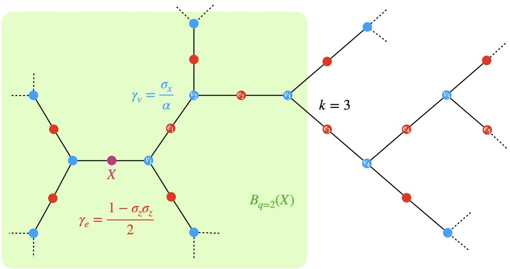  
Figure 6.4: Commutativity graph of the cubic graph that maximizes the LR bound. The shaded area shows an example for $q = 2 = k - 1$ .

$$
\| \gamma _ { X } ^ { A } ( t ) \| \leq \biggl ( \frac { 2 } { \alpha } \biggr ) ^ { k } \sum _ { \substack { v _ { 1 } : \langle X v _ { 1 } \rangle \in \mathbf E _ { e 1 } : \langle v _ { 1 } e _ { 1 } \rangle \in \mathbf E } } \cdots \sum _ { \substack { e _ { k } : \langle v _ { k } e _ { k } \rangle \in \mathbf E } } \int _ { 0 } ^ { t } h _ { v _ { 1 } } ( t _ { 1 } )  ( 6 . 1 ; \omega _ { 1 } ) d t _ { 2 k } \omega _ { 1 } \omega _ { 2 } \omega _ { 2 } \omega _ { 1 } ,
$$

Now, let us introduce the following nested integral $I _ { 2 k }$ and $I _ { 2 k + 1 }$ that appears in Equation 6.13 where we replace each $h _ { j } ( t _ { i } )$ by its expression and we pull out of the

integral the factor $T ^ { 2 k }$ and $T ^ { 2 k + 1 }$ respectively so that the integrals depend only on $k$ :

$$
\begin{array} { c } { { I _ { 2 k } = \displaystyle \int _ { 0 } ^ { 1 } 1 - u _ { 1 } \int _ { 0 } ^ { u _ { 1 } } u _ { 2 } . . . \int _ { 0 } ^ { u _ { 2 k - 1 } } u _ { 2 k } d u _ { 2 k } . . . d u _ { 2 } d u _ { 1 } } } \\ { { I _ { 2 k + 1 } = \displaystyle \int _ { 0 } ^ { 1 } 1 - u _ { 1 } \int _ { 0 } ^ { u _ { 1 } } u _ { 2 } . . . \int _ { 0 } ^ { u _ { 2 k } } 1 - u _ { 2 k + 1 } d u _ { 2 k + 1 } . . . d u _ { 2 } d u _ { 1 } } } \end{array}
$$

There is no known closed form for these integrals but we can easily have the exact numerical values for at least the first 100 points and we can upper bound it as we show in Appendix C.3. We can then write, following Eq. 6.13:

$$
\| \gamma _ { X } ^ { A } ( T ) \| \leq T ^ { 2 k } \left( \frac { 2 } { \alpha } \right) ^ { k } I _ { 2 k } \sum _ { v _ { 1 } : \langle X v _ { 1 } \rangle \in \mathbf { E } } \sum _ { e _ { 1 } : \langle v _ { 1 } e _ { 1 } \rangle \in \mathbf { E } } . . . \sum _ { e _ { k } : \langle v _ { k } e _ { k } \rangle \in \mathbf { E } } \operatorname* { m a x } _ { t } \| \gamma _ { e _ { k } } ^ { A } ( t ) \|
$$

where $\gamma _ { e _ { k } } ^ { A } ( t )$ corresponds to an interaction node of the commutativity graph (i.e. red node) because we are at an even step. We used the fact that $A$ is unitary and the dependence on $B _ { q } ( X )$ lies in computing the size of the nested sum. This bound can be improved by applying the update rule of Equation 6.10 and noticing that the first terms such that $\| \gamma _ { e _ { k } } ^ { A } ( 0 ) \| \neq 0$ only include all paths in $\mathcal { P } _ { 2 k } ( X , q )$ . Where we define ${ \mathcal { P } } _ { l } ( X , q )$ to be the set of paths of length $l$ in $\mathbf { G }$ starting at $X$ and ending in a node outside $B _ { q = k - 1 } ( X )$ (the green area in Fig. 6.4). After iterating several times, we get:

$$
\begin{array} { r l r l } & { \ v _ { \delta } ^ { \star \star } ( T ) \| \leq \mathcal { T } ^ { \theta \star } ( \frac { 2 } { \alpha } ) ^ { \theta } \ ^ { \star \theta } \nabla _ { \alpha } \psi \cdot \nabla _ { 2 } \phi ( X , \phi ) \| r _ { \alpha } ^ { \theta } \epsilon _ { \theta } \| } & & { \qquad \mathrm { ( 6 . 1 4 ) } } \\ & { \qquad + \mathcal { T } ^ { \theta \star \theta } ( \frac { 2 } { \alpha } ) ^ { \theta } \epsilon _ { \theta  \infty } \ \cdot \| X _ { 2 , \theta  \infty } \| X _ { 2 , \theta  \infty } \| \exp ( \mathrm { L _ { \alpha } ^ { \theta } } \epsilon _ { \theta } ) \| } \\ & { \qquad + \mathcal { T } ^ { \theta \star \theta } ( \frac { 2 } { \alpha } ) ^ { \theta } \epsilon _ { \theta  \infty } \ \cdot \| X _ { 2 , \theta  \infty } \| X _ { 3 , \theta  \infty } \| X _ { 2 , \theta  \infty } \| \exp ( \mathrm { L _ { \alpha } ^ { \theta } } \epsilon _ { \theta } ) \| } \\ & { \qquad + \mathcal { T } ^ { \theta \star \theta } ( \frac { 2 } { \alpha } ) ^ { \theta } \epsilon _ { \theta  \infty } \ \cdot \| X _ { 2 , \theta  \infty } \times \nabla _ { \alpha } \phi \cdot \nabla _ { \alpha } \phi \| r _ { \alpha } \epsilon _ { \theta } \| } \\ & { \qquad + \mathcal { T } ^ { \theta \star \theta } ( \frac { 2 } { \alpha } ) ^ { \theta } \epsilon _ { \theta  \infty } \ \cdot \| X _ { 2 , \theta  \infty } \times \nabla _ { \alpha } \phi \cdot \nabla _ { \alpha } \phi \| r _ { \alpha } \epsilon _ { \theta } \| } \\ &  \qquad + \mathcal { T } ^ { \theta \star \theta } ( \frac { 2 } { \alpha } ) ^ { \theta } \ \cdot \ \int _ { \alpha } \sin ( \nabla _ { \alpha } \phi ) \| X _ { 2 , \theta  \infty } \| \exp ( \mathrm  L _   \end{array}
$$

We stop at the seventh iteration because numerically it appears that the bound reaches a minimum before increasing again. This is due to the fact that the number of paths in $| \mathcal { P } _ { l } ( X , q ) |$ also increases exponentially with $l$ . Each path considered above ends outside $B _ { q } ( X )$ , because for the others we have $\| \gamma _ { j } ^ { A } ( 0 ) \| \neq 0$ for $j \in [ e _ { k } , v _ { k + 1 } , e _ { k + 1 } , v _ { k + 2 } , e _ { k + 2 } , v _ { k + 3 } ]$ . To define paths that go beyond $B _ { q } ( X )$ , we implicitly extend the balls to maximize the number of paths in ${ \mathcal { P } } _ { l } ( X , q )$ for $l \geq 2 k$ . Thanks to the upper bound of the integrals detailed in Appendix C.3, it is easy to see that the derived bound is decreasing with $k$ and thus with $q$ meaning that we have the following corollary:

Corollary 6.1. For any $q > 0$ and any edge $X$ inside a $d -$ regular graph,

$$
\forall j > 0 , \varepsilon _ { l o c } ( B _ { q + j } ( X ) , T , \alpha ) \leq \varepsilon _ { l o c } ( B _ { q } ( X ) , T , \alpha )
$$

the same goes for the global bound as taking the max preserves the inequality:

$$
\forall j > 0 , \varepsilon ( q + j , T , \alpha ) \leq \varepsilon ( q , T , \alpha )
$$

For the local bound, we need to compute for each ball $B _ { q } ( X )$ the number of paths. In practice, a subroutine counting the number of paths of a given size is used to compute the local bound. The last term with the multiple sums is counting for $( 2 d ) ^ { k + 3 }$ as at each interaction term there are $d$ possible choices of nodes and only 2 at the others. In this subsection we detailed the derivation of the LR local bound Eq. 6.14. In the next subsection, we pursue the derivation to get the global bound by taking the maximal number of paths.

# 6.2.2 Global LR bound

In this subsection, we use Eq. 6.14 to derive the global LR bound. As defined in Section 6.1, the global bound is obtained by considering the maximum of the local bound Eq. 6.14 over all balls in $B _ { q }$ . To this end, we consider the worst-case scenario, i.e. the ball maximizing the possible number of paths. It’s trivial to see that this corresponds to the cycle-free ball (Fig. 6.4).

In this cycle-free ball, we can count the number of paths corresponding to each term in LR bound’s equation. In Fig. 6.5, we depict example paths for each of the necessary cases that we detail below.

For the first two terms, only direct simple paths reach the outside of $B _ { q } ( X )$ , and there are $2 ( d - 1 ) ^ { k }$ of them. The factor 2 comes from the initial choice at node $X$ , you can go either left or right on Fig. 6.4. Once the side has been chosen, at each blue node (node $v _ { r }$ ), there are $d - 1$ possibilities, as the path can’t go backwards by definition of direct single paths. In a path from $X$ to the first node outside $B _ { q = k - 1 } ( X )$ , i.e. of length $2 k$ , there are $k$ blue nodes, bringing the total number of direct simple paths to $2 ( d - 1 ) ^ { k }$ (path Fig. 6.5 $( a )$ ). The same number of paths is found for direct paths of length $2 k + 1$ .

Then, for the third and fourth terms, we can distinguish simple direct paths that go one step further in $\mathbf { G }$ , i.e. of length $2 k + 2$ and $2 k + 3$ respectively, from non-direct paths, i.e. passing several times through the same node or edge. For the third term counting paths of length $2 k + 2$ , similarly to above, there are $2 ( d - 1 ) ^ { k + 1 }$ direct paths. For the non-direct ones, we need to count every edge that can be used at least twice in the path (path Fig. 6.5 $( b$ ). At first, there are the two edges that start from $X$ , then $( d - 1 )$ at each blue node on the path and $+ 1$ at each red node, making a total of $2 + ( ( d - 1 ) + 1 ) * k$ edges that can be used twice in the $2 ( d - 1 ) ^ { k }$ possible paths. Therefore, the total number of paths in the third term is $2 ( d - 1 ) ^ { k + 1 } + ( 2 + d k ) * 2 ( d - 1 ) ^ { k }$ . For the fourth term, we use similar reasoning to arrive at $2 ( d - 1 ) ^ { k + 1 } + ( d k + 2 + d - 1 ) * 2 ( d - 1 ) ^ { k }$ paths.

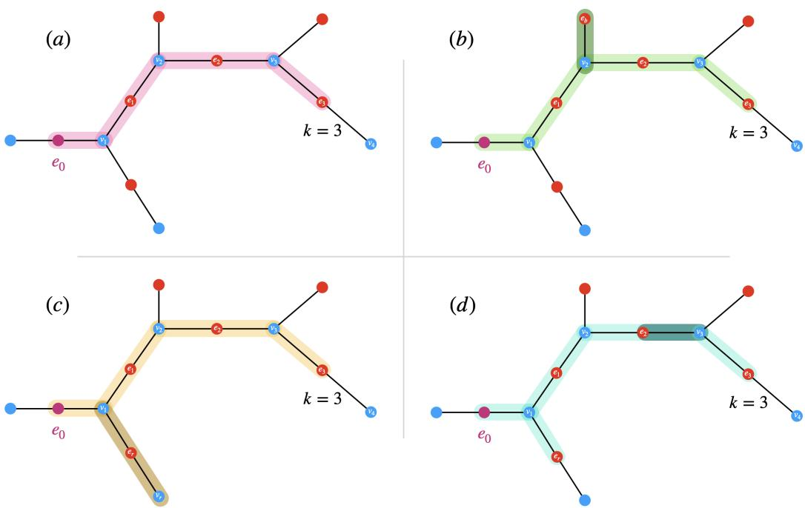  
Figure 6.5: Example of different paths starting at $X$ on the commutativity graph for the global bound with $k = 3$ . $( a )$ a simple path $( X v _ { 1 } e _ { 1 } v _ { 2 } e _ { 2 } v _ { 3 } e _ { 3 } )$ in pink of length $2 k$ , $( b$ ) a green path $X v _ { 1 } e _ { 1 } v _ { 2 } e _ { b } v _ { 2 } e _ { 2 } v _ { 3 } e _ { 3 } )$ of length $2 k + 2$ with a back-and-forth on one edge, $( c )$ in orange a path $( X v _ { 1 } e _ { r } v _ { r } e _ { r } v _ { 1 } e _ { 1 } v _ { 2 } e _ { 2 } v _ { 3 } e _ { 3 } )$ of length $2 k + 4$ with a backand-forth on a branch of two edges and $( d )$ in blue a path $( X v _ { 1 } e _ { r } v _ { 1 } e _ { 1 } v _ { 2 } e _ { 2 } v _ { 3 } e _ { 2 } v _ { 3 } e _ { 3 } )$ b of length $2 k + 4$ with two back-and-forth on two edges at distance at most one from the simple path.

Let us see how the last two terms are derived. For the fifth term, we need to count all paths of length $2 k + 4$ that lead to a red node outside the shaded area. There are three types of path: direct paths up to $e _ { k + 2 }$ counting for $2 ( d - 1 ) ^ { k + 2 }$ , those with exactly one edge taking two or three times, i.e. reaching $e _ { k + 1 }$ counting for $( d ( k + 1 ) + 2 ) * 2 ( d - 1 ) ^ { k + 1 }$ and those reaching $e _ { k }$ counting for $\begin{array} { r } { \left\lfloor ( d k + 2 ) + { \binom { d k + 2 } { 2 } } + 2 ( d - 1 ) + k \right\rfloor * 2 ( d - 1 ) ^ { k } } \end{array}$ . In the latter, a distinction is made: either an edge is used 4 or 5 times, or 2 different edges at a distance at most one from the direct path can be used 2 or 3 times (path Fig. 6.5 $( d )$ ), or finally choose a branch of length 2 far from the direct path (path Fig. 6.5 ( $c )$ ). Similar reasoning is used for the sixth term.

We can then substitute the path counting in Eq. (6.14) to derive the following closed-form:

$$
\begin{array} { r l } & { \left| \gamma _ { \mathcal M } ^ { A } ( \delta ) \right| \leq 7 ^ { 2 k } \left( \frac 2 \alpha \right) ^ { k } J _ { 2 k } \mathbf { x } _ { 2 } ( 2 \bar { u } - 1 ) ^ { k } + 7 ^ { 2 k / 1 } \left( \frac 2 \alpha \right) ^ { k + 1 } I _ { 2 k + 1 } \mathbf { x } _ { 2 } ( \bar { u } - 1 ) ^ { k } \quad ( 6 . 1 ! } \\ & { \qquad + 7 ^ { 2 6 k / 2 } \left( \frac 2 \alpha \right) ^ { k + 1 } I _ { 2 k + 1 } \mathbf { x } _ { 2 } ( 2 \bar { u } - 1 ) ^ { k } \left[ \bar { u } ( k + 1 ) + 1 \right] } \\ & { \qquad + T ^ { 2 k + 3 } \left( \frac 2 \alpha \right) ^ { k + 1 } I _ { 2 k + 3 } \mathbf { x } _ { 2 } ( 2 \bar { u } - 1 ) ^ { k } \left[ \bar { u } ( k + 2 ) \right] } \\ & { \qquad + T ^ { 2 k + 4 } \left( \frac 2 \alpha \right) ^ { k + 2 } I _ { 2 k + 4 } \mathbf { x } _ { 2 } ( \bar { u } - 1 ) ^ { k } \left[ \alpha \underline { { f } } ( \frac { \bar { u } - 1 + 1 } { 2 } ) + 3 \frac { 3 k + 1 } { 2 } + k \right] } \\ & { \qquad + T ^ { 2 k + 5 } \left( \frac 2 \alpha \right) ^ { k + 3 } I _ { 2 k + 5 } \mathbf { x } _ { 2 } ( \bar { u } - 1 ) ^ { k } \left[ \underline { { d } } ( \frac { \bar { u } + 2 } { \bar { u } } ^ { k } + \frac { 3 } { 2 } + \underline { { d } } \frac { \bar { u } + 1 } { \bar { u } - 1 } \right] } \\ &  \qquad + T ^ { 2 k + 5 } \left( \frac 2 \alpha \right) ^ { k + 3 } I _ { 2 k + 5 } \mathbf { x } _ { 2 } ( 2 \bar { u } - 1 ) ^ { k } \left[ \alpha \underline { { f } } ( \frac { \bar { u } - 1 + 3 } { 2 } + \underline { { d } } \frac { \bar { u } + 1 } { 2 } + k - 1 \right]  \end{array}
$$

In this subsection, we developed the proof of our LR bound for any $d -$ regular graph on which we want to solve MaxCut with a quantum annealing process. This bound achieves the best numerical value compared to the state-of-the-art of LR bounds. This is due to the fact that we have finely evaluated the nested integral with the standard schedule and used the commutativity graph of the Hamiltonian to tighten the bound. Here the free parameter $\alpha$ plays an important role: optimizing over its value will allow us to control the tightness of the bound (6.15). This point is further discussed in Section 6.3. In the next subsection, we apply the derived bounds (global and local) to obtain a numerical value of the approximation ratio for a 1-local analysis of QA.

# 6.2.3 Application to approximation ratio of MaxCut

In this subsection, we use the previously derived LR bounds to determine the approximation ratio of MaxCut over cubic graph with QA analyzed as a $1 -$ local algorithm. The proof of the Theorem 6.1 proceeds with step 3, 4 and eventually 5, as illustrated in the overview of Fig. 6.1. We will use Eq. 6.6 to derive the approximation ratio with the $1 -$ local analysis. For reproducibility, the code is available on GitHub 1.

For this purpose, after rigorous errors and trials, we set specific values $T = 3 . 3 3$ , $\alpha = 1 . 5 3$ and $q = 3$ , that establish the global bound $\varepsilon ( q , T , \alpha ) < 0 . 0 1 6$ . In order to compute the required minimums of Eq. 6.5, $\langle O _ { X } \rangle _ { B _ { 3 , i } } ^ { * }$ , we need to enumerate all balls in $B _ { 3 }$ and all cubic graphs in $B _ { 2 }$ . We follow a smart hash-based iterative algorithm detailed in next paragraph 6.2.3. The algorithm generates 930449 balls. Employing the AnalogQPU simulator of Eviden Qaptiva (see next paragraph 6.2.3), we solve the Schrödinger equation to get the final state $| \psi ^ { B _ { 3 } ( X ) } ( T , \alpha ) \rangle$ as described in the

Sec. 6.1.1. This allows to explicitly evaluate the value of $\langle O _ { X } \rangle _ { B _ { 3 } ( X ) }$ for each ball in $B _ { 3 }$ . We subtract the value of the global LR bound to the expected edge energy for each balls. To narrow down our selection, we retain only those balls for which $| \langle O _ { X } \rangle _ { B _ { 3 } ( X ) } - \varepsilon ( q , T , \alpha ) | < 0 . 7 0 2 0$ . This initial step corresponds to step 3 of Fig. 6.1 and leads to the values for satisfy the condition (see A $\langle O _ { X } \rangle _ { B _ { 3 , 1 } } ^ { * } = 0 . 5 5 0 2$ and e the $\langle O _ { X } \rangle _ { B _ { 3 , 2 } } ^ { * } = 0 . 6 2 6 5$ $\rho _ { M C } \geq \langle O _ { X } \rangle _ { B _ { 3 , 3 } } ^ { * }$ Consequently, our goal is to maximize this minimum for the remaining balls that have a corrected energy above 0.7020.

We are left with 7071 balls $B _ { 3 } ( X )$ with configuration $\Omega _ { 3 }$ at distance 1 around $X$ , to which we apply the local bound. To compute the local bound we have access to a path counting algorithm as there is no closed form like the global bound. To find the maximum over parameters $T$ and $\alpha$ , on Fig. 6.6, we plot the evolution of (a) $\mathrm { m a x } _ { T } \left( \langle O _ { X } \rangle _ { B _ { 3 } ( X ) } - \varepsilon ( 3 , T , \alpha ) \right)$ and (b) $\mathrm { m a x } _ { T }$ $r \left( \langle O _ { X } \rangle _ { B _ { 3 } ( X ) } - \varepsilon _ { l o c } ( B _ { 3 } ( X ) , T , \alpha ) \right)$ against $\alpha$ for the 18 worst balls $B _ { 3 } ( X )$ according to the global and local bounds respectively.

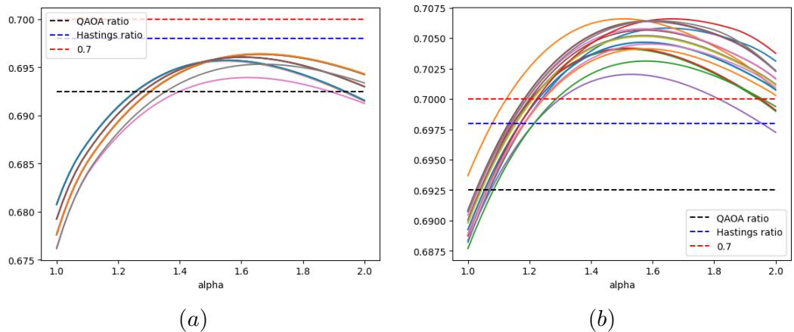  
Figure 6.6: Evolution of $( a )$ ma $\mathfrak { c } _ { T } \left( \langle O _ { X } \rangle _ { B _ { 3 } ( X ) } - \varepsilon ( 3 , T , \alpha ) \right)$ and (b) maxT $\left( \langle O _ { X } \rangle _ { B _ { 3 } ( X ) } - \varepsilon _ { l o c } ( B _ { 3 } ( X ) , T , \alpha ) \right)$ against $\alpha$ for the 18 worst balls for which it goes under 0.7020 with the global bound.

The analysis reveals that around $\alpha = 1 . 5$ all these balls surpass the threshold of 0.7020, with the worst ball $g$ depicted in Fig. 6.7. This plot finally fixes the value of $\langle { \cal O } _ { X } \rangle _ { B _ { 3 , 3 } } ^ { * } = 0 . 7 0 2 0 8 . .$ . which proves Theorem 6.1.

To sum up, the constant-time analysis of Quantum Annealing (QA) for MaxCut over cubic graphs, analyzed as a 1-local algorithm, achieves an approximation ratio exceeding 0.7020. This result goes beyond any known ratio of 1-local algorithms, whether quantum or classical.

Let us take some lines to discuss the intriguing worst configuration we found. Note that the ball $g$ in Fig. 6.7 is not the configuration we intuit in Sec. 5.3.1. Indeed this ball is bipartite and at first glance, the middle edge has no reason to converge toward 0. First we point out that $W _ { 3 }$ (Fig. 5.6) is in fact the worst configuration for $\alpha \in \left[ 1 , 1 . 2 \right]$ (green curve Fig. 6.6 (b)), then $g$ has the smallest edge energy. This can be explained by the fact that on these plots we subtract the LR bound of the edge energy. It happens that $W _ { 3 }$ has only one interaction with the rest of the graph while $g$ has four which increase the local LR bound value. Secondly, the diameter of the ball seems to play a role here, $W _ { 3 }$ has a diameter of 3 whereas the diameter of $g$ is 5. Informally, left and right parts of $g$ are still evolving independently for such short runtime pushing toward uncutting the middle edge.

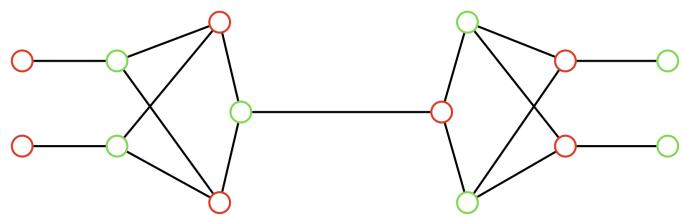  
Figure 6.7: Ball $g = B _ { 3 } ( X )$ achieving the minimum $\langle O _ { X } \rangle _ { B _ { 3 , 3 } } ^ { * } = 0 . 7 0 2 0 8 . .$

Balls enumeration and numerical simulation: Here, we detail the specificity of our balls enumeration algorithm. We use the same idea as that developed in [Wurtz & Love 2021], i.e. an iterative algorithm. We first enumerate all the balls in $B _ { 1 }$ which are those on Fig. 5.2. Then, starting from $B _ { p - 1 }$ , we enumerate $B _ { p }$ by completing the nodes on the boundary whose degree is less than $d$ of the balls in $B _ { p - 1 }$ . There are different ways of completing a node: either we link it to another existing node of degree less than $d$ , or we create a new node and link it. By doing this on all nodes of degree less than $d$ of a ball in $B _ { p - 1 }$ , you get a ball in $B _ { p }$ . You then apply an isomorphism test to check that the algorithm has not already generated isomorphic balls. The isomorphism test must also take into account the fact that there is a “marked” edge $X$ in the balls $B _ { p } ( X )$ . The edge_match argument in the Networkx [Hagberg et al. 2008], a Python library, isomorphism test takes this into consideration. On Fig. 6.8, we show the first iterations of the enumeration.

A naive approach could take more than one year to enumerate all the balls in $B _ { 3 }$ . The isomorphism test is quite expensive as we do not have an efficient algorithm for it. Our idea is to hash the generated balls into a dictionary. The prerequisite for the hash function $h$ to be useful is that for any two graphs $G _ { 1 }$ and $G _ { 2 }$ , $h ( G _ { 1 } ) \neq h ( G _ { 2 } )$ implies that $G _ { 1 }$ is not isomorphic to $G _ { 2 }$ . If the hash is fast to generate and creates small enough bags of balls, then it greatly speeds up the enumeration task. For example a common hash function to quickly evaluate if two graphs might be isomorphic is the sorted list of degrees, if they are not equal it is certain that the two graphs are not isomorphic. This hash function however still evaluates equally for too many non isomorphic graphs, requiring too many calls to the isomorphic test. Instead, we used the tuple of the diameter and the sorted eigenvector centrality of the graph adjacency matrix to hash our balls. We manage to enumerate the 930449 balls of $B _ { 3 }$ and the regular ones in $B _ { 2 }$ in less than a day.

In order to compute each value $\langle O _ { X } \rangle _ { B }$ , we relied on a full state vector representation using on a standard integrator (Boost’s ODEINT solver [Boost C++ Libraries 2022] used inside a proprietary code). The simulation were performed on a Eviden Qaptiva appliance using a mix of CPUs and GPUs. The simulations of the 930449 balls took approximately one month. The github code offers an alternative Qutip implementation of the same numerical simulations, for reproducibility.

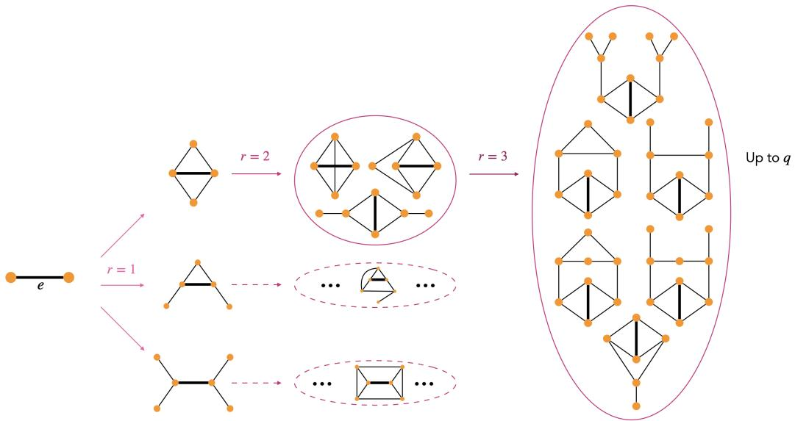  
Figure 6.8: Iterative process to enumerate all balls of $B _ { q }$ . There are 3 balls at $r = 1$ , 123 balls at $r = 2$ and more than 900000 at $r = 3$ .

# 6.3 Discussion

In this section, we discuss the result and the tightness of Theorem 6.1. In addition to the use of the commutativity graph, the exact value of the nested integrals alone would not have brought the ratio above the targeted numerical values of QAOA and Hastings local algorithm as we see on Fig. 6.6 (b) at $\alpha = 1$ . Then we suggest other types of schedule to again make the most out of short time QA. Finally, we discuss about the generalization of the construction.

# 6.3.1 Tightness of the analysis method

The introduction of a new “hyperparameter” $\alpha$ significantly enhances the precision of the analysis. To attest this point, on Fig. 6.9, we plot the evolution of both the local $\varepsilon _ { l o c } ( g , T , \alpha )$ and global $\varepsilon ( q , T , \alpha )$ bounds against $\alpha$ for pairs $( T , \alpha )$ for which $\langle { \cal O } _ { X } \rangle _ { g } = 0 . 7 0 9 2$ and $g$ denotes the ball of Fig. 6.7. The value of 0.7092 is totally arbitrary and similar plots are achieved with different values. So we clearly see on Fig. 6.9 that the LR bound is minimal around $\alpha = 1 . 5$ which means that the analysis of QA is tighter around this point. The trade-off between increasing $\alpha$ to have a smaller LR bound also decrease the speed of the edge energy. We saw in Fig. 6.2 that increasing $\alpha$ slows down the evolution, needing more time to reach a similar value. This larger time increases in turn the LR bound.

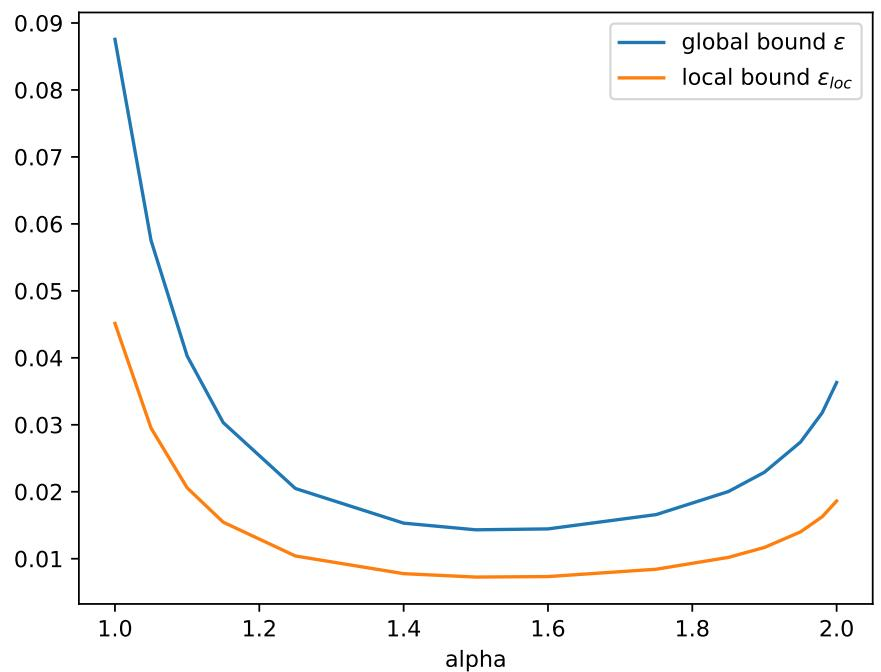  
Figure 6.9: Evolution of $\varepsilon _ { l o c } ( g , T , \alpha )$ and $\varepsilon ( q = 3 , T , \alpha )$ against $\alpha$ for pairs $( T , \alpha )$ for which $\langle { \cal O } _ { X } \rangle _ { g } = 0 . 7 0 9 2$ and $g$ being the ball of Fig. 6.7.

We would like to draw readers’ attention to the fact that both the Hastings algorithm and QAOA also include one or two hyperparameters for obtaining their best ratio value. In this sense, our parameterized QA analysis is nothing more complex. However, although these two other algorithms produce a tight ratio value, QA’s is not tight simply because it is impossible to construct a graph such that every edge $X$ has the $g$ from Fig. 6.7 as its $B _ { 3 } ( X )$ .

On the LR bound itself, we can see from Fig. 6.6 ( $a$ ) that for many of the balls, the curves of the edge energy are indistinguishable. Indeed, at the pair $( T , \alpha )$ looked at, there’s no visible difference in the value of the average edge energy. Even two balls in $B _ { 2 }$ can have the same trajectory. Informally, this suggests that LR bound is not yet tight, as for some ball the layer at distance 3 from the edge $X$ does not impact the edge energy. As mentioned in Chapter 5, neglecting the initial state greatly affects the accuracy of the bound. In order to strongly improve the analysis it would be crucial to be able to take into consideration the initial state; unfortunately, at this stage we lack of mathematical tools for this purpose. Path counting is another lead suggested in [Chen et al. 2023]. In fact, it seems that only direct paths contribute to the LR bound. We explored this idea and the bound would reach 0.7041. However the result of [Chen et al. 2023] cannot be adapted as is to our framework, so we cannot claim this approximation ratio at this stage.

# 6.3.2 Toward better ratios

An important field of research in the improvement of QA’s performance is the optimization of the schedule. Indeed, all the construction above works for a linear interpolation with no specific optimization but one can look at the Hamiltonian

$$
H ( t , G ) = ( 1 - f ( t / T ) ) H _ { 0 } ( \alpha ) + f ( t / T ) H _ { 1 } ^ { G }
$$

with $f ( t )$ such that $f ( 0 ) = 0$ and $f ( 1 ) = 1$ . It is important to note that it also modifies the LR bound in the nested integrals. In commutativity graph notation, we have the $h _ { v } ( t ) = 1 - f ( t / T )$ and $h _ { e } ( t ) = f ( t / T )$ . The challenge of this optimization is that one has to evaluate the energy on each of the 930449 balls for each new schedule to formally prove an improvement of the ratio. However, a good insight can be reached by looking only at the 123 balls in $B _ { 2 }$ . In the linear case, we would obtain the same ratio if we only looked at $B _ { 2 }$ but using LR bounds of $q = 3$ . For instance, we tried few cubic functions to already see that with $f ( s ) = 3 . 2 s ^ { 3 } - 4 . 8 s ^ { 2 } + 2 . 6 s$ , we should obtain a ratio above 0.7165 at $T = 2 . 7 7$ and $\alpha = 1 . 6$ .

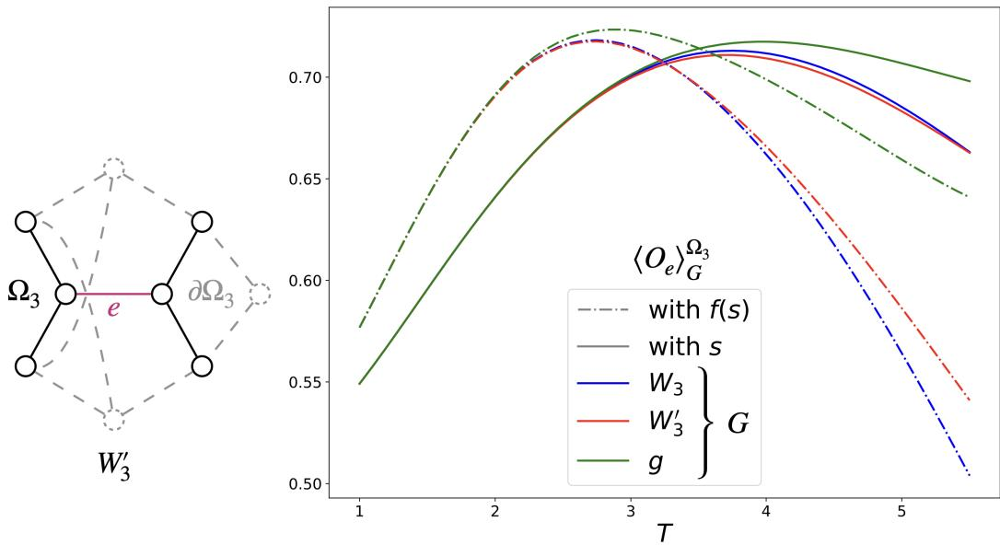  
Figure 6.10: Effect of the schedule when computing the edge energy. Apart from balls $g$ in Fig. 6.7 and $W _ { 3 }$ in Fig. 5.5, $W _ { 3 } ^ { \prime }$ also have a low energy value. It has a similar structure to $W _ { 3 }$ . In dash lines, the curve when using the cubic schedule $f ( s )$ . Those values are obtain without considering the LR bound. $\alpha$ is fixed to 1.5.

In Fig. 6.10, we plot the edge energy value inside three different balls : $g$ , $W _ { 3 }$ and $W _ { 3 } ^ { \prime }$ where $W _ { 3 } ^ { \prime }$ has a quite similar structure than $W _ { 3 }$ , i.e. it is the other choice of $\partial \Omega _ { 3 }$ that forces the middle edge to be uncut is the optimal state. Plain curves are obtained with the linear interpolation and dashed ones with the schedule $f ( s )$ . It appears that this schedule speeds up the evolution, and the edge energies are reaching a slightly higher maximum at shorter times than the linear case. These two observations are aligned with improving the approximation ratio. A shorter runtime means a smaller LR bound. With the new schedule, $W _ { 3 } ^ { \prime }$ becomes the worst candidate and without LR correction its maximum over $T$ and $\alpha$ is 0.7180. If the 0.7165 approximation ratio is correct, it would mean that we almost reached the tightest possible bound on the ratio with this approach.

# 6.3.3 Directions for generalizing the construction

We developed a LR bound for $d -$ regular graphs applied to MaxCut on cubic graphs.   
We believe that our tools can be extended in several directions.

1. This work can be directly adapted to look for other $d -$ regular graphs. A formal derivation of this bound for any $d -$ regular graphs requires to enumerate all the balls in $B _ { 3 }$ that can be completed in a $d -$ regular graphs. The code can be easily edited for this purpose. However large balls are certainly too big to solve Schrodinger equation for $d \geq 4$ . It is still possible to get an intuition extrapolating the worst ball for $d = 3$ (Fig. 6.7). For example, the $1 -$ local approximation ratio for MaxCut over 4-regular graphs may be close to 0.67.

2. For $p - .$ local analysis of QA with $p \geq 2$ , the method developed here runs short as the time at which the best approximation ratio is achieved is certainly too large for the LR bound at $q = 3$ . For a $p = 2 -$ local analysis, our estimation gives that we would need to go up to $q = 5$ to achieve sufficiently small LR bound at time $T \simeq 6 . 1$ , time for which the expected edge energy value seems to maximize. Nevertheless, by extrapolating at $p = 2$ the worst-case balls for $p = 1$ and by numerical experiments on these cases, we believe that the approximation ratio for MaxCut over cubic graphs is close to 0.77.

3. As discussed in the previous paragraph, the schedule can also be changed, the main work remains in the computation of the nested integrals of the schedule. Analytical bounds on these integrals are certainly too difficult to derive, but only numerical values are required to prove the bound. For any polynomial schedule, those integrals are easy to evaluate.

4. This construction can be applied to other combinatorial graph problems as we showed in Chapter 5 Sec. 5.1. With the approach taken in this chapter, more work is needed to adapt an ad hoc analytical formula for LR bound for the new problem Hamiltonian.

# Conclusion

To conclude, in this work we developed a much tighter Lieb-Robinson bound compared to [Haah et al. 2021, Chen et al. 2023] by carefully manipulating the commutativity graph and the nested integral of the QA schedule. Despite the continuous aspect of QA, we defined the notion of $p -$ local analysis of the metaheuristic by approximating the full algorithm using its restriction to bounded radius subgraphs. Our 1-local analysis of QA allows us to analytically compare its performances with the performances of single-layer QAOA for MaxCut over cubic graphs. The tightness of the LR bound we have derived enables us to reduce the exhaustive numerical simulation to a tractable task that can be completed in a few weeks. Finally, we introduced a new parameter in the standard QA, enabling us to optimize the value of the ratio obtained and thus pass the 0.7 mark with a ratio going beyond 0.7020. This puts us ahead of single-layer QAOA and Hastings’ $1 -$ local algorithm for Max-Cut over cubic graphs. The comparison has its limits, as the process we are studying is continuous and not intrinsically local, unlike the two algorithms mentioned. This work should be seen as a step forward in the study of quantum annealing, bringing more analytical tools to assess its algorithmic performances.

Also, as mentioned in Sec. 6.3.1, a slight improvement can be made on paths counting. Then, the remarkable small numerical value of our LR bound might be applied for a practical implementation of some Hamiltonian simulation schemes, e.g. [Haah et al. 2021].

As we hinted in Sec. 6.3.2, the bounds on the approximation ratio reached by this method are almost tight in the sense that even if we had considered that QA is strictly local, it would not significantly increase the proven ratio. However, the proven ratio is not tight for QA in the sense that no graph will reach this ratio because it would mean that every edge $X$ of this graph has the worst candidate as their $B _ { 3 } ( X )$ . For any of the “bad” configurations $g$ , $W _ { 3 }$ or $W _ { 3 } ^ { \prime }$ , it is impossible to construct such a graph. In the next chapter, we argue that the double binary tree is certainly a limiting case and we give an algorithm that efficiently computes the edge energy in the middle of the tree.

Chapter 7

# Effective approximation of MaxCut

# Contents

7.1 Toward a state-dependent LR bound . . . 155

7.1.1 Exact expansion of an edge energy 156   
7.1.2 State-dependent LR bound 159

7.2 Double binary tree simulation and optimal approximation ratio . . 161 7.2.1 Symmetry in $T _ { p }$ for dimensional reduction . . . . . 161 7.2.2 Optimal approximation ratio for QA? 165

In this chapter, we develop some incomplete work around the Lieb-Robinson bound and the effective approximation ratio for MaxCut on cubic graphs. We express the exact expansion of the energy of an edge within a graph, where each coefficient represents the influence of the graph structure at distance $k$ from the edge. This expansion seems suitable for accessing the first state-dependent bound LR. Here, we bound the tail of the expansion by the bound developed in the previous chapter. The first terms are computable by evaluating the energy of the edges inside a double binary tree $T _ { p }$ of radius $p$ . This approach for a state-dependent LR bound should compute the first terms for $p$ up to six. Motivated by [Basso et al. 2022], we found a reduction of the Hilbert space thanks to the symmetry of the graph and were able to compute efficiently up to $p = 3$ . With more advanced computational techniques, it is reasonable to assume that $p = 4$ is numerically accessible. Finally, we construct graphs that achieve the potential tight approximation ratio of QA.

# 7.1 Toward a state-dependent LR bound

In this section, we demonstrate an expansion of the energy of an edge $X$ where the order coefficient $k ^ { t h }$ represents the influence of edges on the boundary of $B _ { k } ( X )$ , i.e. edges at distance $k + 1$ from $X$ . We then propose a way to use it with the bound developed in chapter 6 to derive a state-dependent LR bound.

First, we provide a technical lemma which is the main tool for the expansion. Let $G ( V , E )$ be a graph on which we solve a combinatorial problem with the usual Hamiltonians of Sec. 2.2.1. The complete Hamiltonian is then written $H ( t , G ) =$ $\begin{array} { r } { ( 1 - \frac { t } { T } ) H _ { 0 } + \frac { t } { T } H _ { 1 } ^ { G } } \end{array}$ for $t \in [ 0 , T ]$ . $H _ { 0 }$ is purely a 1-local Hamiltonian and $H _ { 1 } ^ { G }$ can have one- or two-local observables. The starting state is the uniform superposition $| \psi _ { 0 } \rangle$ . As in Chapter 5, for a subgraph $\Omega$ of $G$ , we call $\partial \Omega$ the boundary of $\Omega$ , i.e. the edges outside $\Omega$ that have at least one end in $\Omega$ . We also denote by $U _ { t _ { 1 } , t } ^ { G }$ the solution of the Schrödinger equation between times $t _ { 1 }$ and $t$ :

$$
i \frac { d U _ { 0 , t } ^ { G } } { d t } = H ( t , G ) U _ { 0 , t } ^ { G }
$$

We write the final state $| \psi ^ { G } ( t ) \rangle = U _ { 0 , t } ^ { G } | \psi _ { 0 } \rangle$ and for an edge $X$ the edge expected energy $\langle { \cal O } _ { X } \rangle _ { \cal G } = \langle \psi ^ { G } ( t ) | { \cal O } _ { X } | \psi ^ { G } ( t ) \rangle$ . By adapting the proof of Proposition 5.1, we can have the following lemma:

Lemma 7.1. For any edge $X$ of $G$ and any subgraph $\Omega$ such that $X \in E ( \Omega )$ , the following is true :

$$
\langle O _ { X } \rangle _ { G } - \langle O _ { X } \rangle _ { \Omega } = i \int _ { 0 } ^ { t } d t _ { 1 } \frac { t _ { 1 } } { T } \langle [ H _ { 1 , \partial \Omega } , ( U _ { t _ { 1 } , t } ^ { \Omega } ) ^ { \dagger } O _ { X } U _ { t _ { 1 } , t } ^ { \Omega } ] \rangle _ { G }
$$

where the expectation value inside the integral $\langle . . . \rangle _ { G } = \langle \psi ^ { G } ( t _ { 1 } ) | . . . | \psi ^ { G } ( t _ { 1 } ) \rangle$ depends on the integrated variable $t _ { 1 }$ .

Proof. We note $U _ { I } ( t ) ~ = ~ ( U _ { 0 , t } ^ { \Omega } ) ^ { \dag } U _ { 0 , t } ^ { G }$ , the evolution in the interaction picture of $V _ { I } ( t ) = ( U _ { 0 , t } ^ { \Omega } ) ^ { \dag } V ( t ) U _ { 0 , t } ^ { \Omega }$ where the perturbation $V$ is $V ( t ) = H _ { G } ( t ) - H _ { \Omega } ( t )$ . The state that evolves under $U _ { I } ( t )$ is written $| \psi _ { I } ( t ) \rangle$ .

$$
\begin{array} { l } { \langle O _ { X } \rangle _ { G } - \langle O _ { X } \rangle _ { \Omega } = \displaystyle \int _ { 0 } ^ { t } d t _ { 1 } \frac { d } { d t _ { 1 } } \left( \langle \psi _ { I } ( t _ { 1 } ) | ( U _ { 0 , t } ^ { \Omega } ) ^ { \dagger } O _ { X } U _ { 0 , t } ^ { \Omega } | \psi _ { I } ( t _ { 1 } ) \rangle \right) } \\ { = i \displaystyle \int _ { 0 } ^ { t } d t _ { 1 } \left( \langle \psi _ { I } ( t _ { 1 } ) | \left[ V _ { I } ( t _ { 1 } ) , ( U _ { 0 , t } ^ { \Omega } ) ^ { \dagger } O _ { X } U _ { 0 , t } ^ { \Omega } \right] | \psi _ { I } ( t _ { 1 } ) \rangle \right) } \\ { = i \displaystyle \int _ { 0 } ^ { t } d t _ { 1 } \left( \langle \psi ^ { G } ( t _ { 1 } ) | \left[ V ( t _ { 1 } ) , ( U _ { t _ { 1 } , t } ^ { \Omega } ) ^ { \dagger } O _ { X } U _ { t _ { 1 } , t } ^ { \Omega } \right] | \psi ^ { G } ( t _ { 1 } ) \rangle \right) } \\ { = i \displaystyle \int _ { 0 } ^ { t } d t _ { 1 } \frac { t _ { 1 } } { T } \left. \left[ H _ { 1 } ^ { \partial \Omega } , ( U _ { t _ { 1 } , t } ^ { \Omega } ) ^ { \dagger } O _ { X } U _ { t _ { 1 } , t } ^ { \Omega } \right] \right. _ { G } } \end{array}
$$

# 7.1.1 Exact expansion of an edge energy

By iteratively using Lemma 7.1, we shall prove the following theorem :

Theorem 7.1. For any graph $G$ , and any edge $X$ in $G$ , there exists $r$ such that $B _ { r + 1 } ( X ) = G$ . For each edge, such $r$ is bounded by the diameter of $G$ . Let $O _ { X }$ be an observable supported on $X$ , the quantity $\langle O _ { X } \rangle _ { G }$ can be expressed into the following expansions :

• By introducing O(1)Y (t1) = i[H∂B1(X)1 , $O _ { Y } ^ { ( 1 ) } ( t _ { 1 } ) = i [ H _ { 1 } ^ { \partial B _ { 1 } ( X ) } , ( U _ { t _ { 1 } , t } ^ { B _ { 1 } ( X ) } ) ^ { \dagger } O _ { X } U _ { t _ { 1 } , t } ^ { B _ { 1 } ( X ) } ]$ and $O _ { Y } ^ { ( k ) } ( t _ { k } ) =$ i[H ∂Bk(X)1 , ( $i [ H _ { 1 } ^ { \partial B _ { k } ( X ) } , ( U _ { t _ { k } , t _ { k - 1 } } ^ { B _ { k } ( X ) } ) ^ { \dagger } O _ { Y } ^ { ( k - 1 ) } ( t _ { k - 1 } ) U _ { t _ { k } , t _ { k - 1 } } ^ { B _ { k } ( X ) } ]$ 1w e have:

$$
\langle O _ { X } \rangle _ { G } = \langle O _ { X } \rangle _ { B _ { 1 } ( X ) } + \sum _ { k = 1 } ^ { r } \int _ { 0 } ^ { t } d t _ { 1 } \frac { t _ { 1 } } { T } \cdots \int _ { 0 } ^ { t _ { k - 1 } } d t _ { k } \frac { t _ { k } } { T } \langle O _ { Y } ^ { ( k ) } \rangle _ { B _ { k + 1 } ( X ) }
$$

• Also, the expectation of $O _ { X }$ can be expanded like :

$$
\langle O _ { X } \rangle _ { G } = \langle O _ { X } \rangle _ { B _ { 1 } ( X ) } + i \sum _ { k = 1 } ^ { r } \int _ { 0 } ^ { t } d t _ { 1 } \frac { t _ { 1 } } { T } \langle [ H _ { 1 } ^ { \partial B _ { k } ( X ) } , ( U _ { t _ { 1 } , t } ^ { B _ { k } ( X ) } ) ^ { \dagger } O _ { X } U _ { t _ { 1 } , t } ^ { B _ { k } ( X ) } ] \rangle _ { B _ { k + 1 } ( X ) }
$$

Note that $V ( B _ { r } ( X ) ) = V ( G )$ and only some edges between two nodes of $B _ { r } ( X )$ are missing to have the full graph. In this sense, in some case we have $B _ { r } ( X ) = G$ and the above equations adapt easily by noting that $H _ { 1 } ^ { \partial B _ { r } ( X ) } = 0$ .

To prove Eq. 7.1, we apply Lemma 7.1 with $\Omega = B _ { 1 } ( X )$ . Then we iterate with $\Omega = B _ { k } ( X )$ and the observable $O _ { Y } ^ { ( k ) }$

$$
\begin{array} { l } { \langle O _ { X } \rangle _ { G } = \underbrace { \langle O _ { X } \rangle _ { B _ { 1 } ( X ) } + \displaystyle \int _ { 0 } ^ { t } \frac { t _ { 1 } } { T } \langle O _ { Y } ^ { ( 1 ) } \rangle _ { B _ { 2 } ( X ) } } _ { \langle O _ { X } \rangle _ { B _ { 2 } ( X ) } } + \displaystyle \int _ { 0 } ^ { t } d t _ { 1 } \frac { t _ { 1 } } { T } \int _ { 0 } ^ { t _ { 1 } } d t _ { 2 } \frac { t _ { 2 } } { T } \langle O _ { Y } ^ { ( 2 ) } \rangle _ { B _ { 3 } ( X ) } + \dots } \\ { \qquad \quad + \displaystyle \int _ { 0 } ^ { t } d t _ { 1 } \frac { t _ { 1 } } { T } \cdots \int _ { 0 } ^ { t _ { r - 1 } } d t _ { r } \frac { t _ { r } } { T } \langle O _ { Y } ^ { ( r ) } \rangle _ { B _ { r + 1 } ( X ) } } \\ { \displaystyle = \langle O _ { X } \rangle _ { B _ { 1 } ( X ) } + \sum _ { k = 1 } ^ { r } \int _ { 0 } ^ { t } d t _ { 1 } \frac { t _ { 1 } } { T } \cdots \int _ { 0 } ^ { t _ { k - 1 } } d t _ { k } \frac { t _ { k } } { T } \langle O _ { Y } ^ { ( k ) } \rangle _ { B _ { k + 1 } ( X ) } } \end{array}
$$

To prove Eq. 7.2, we first observe that :

$$
\begin{array} { r } { \langle O _ { X } \rangle _ { G } = \langle O _ { X } \rangle _ { B _ { 1 } ( X ) } + \big ( \langle O _ { X } \rangle _ { B _ { 2 } ( X ) } - \langle O _ { X } \rangle _ { B _ { 1 } ( X ) } \big ) } \\ { + \big ( \langle O _ { X } \rangle _ { B _ { 3 } ( X ) } - \langle O _ { X } \rangle _ { B _ { 2 } ( X ) } \big ) } \\ { \vdots } \\ { + \big ( \langle O _ { X } \rangle _ { G } - \langle O _ { X } \rangle _ { B _ { r } ( X ) } \big ) } \end{array}
$$

For each term $\langle O _ { X } \rangle _ { B _ { k + 1 } ( X ) } - \langle O _ { X } \rangle _ { B _ { k } ( X ) }$ , we apply Lemma 7.1. It is valid because $B _ { k } ( X )$ is trivially a subgraph of $B _ { k + 1 } ( X )$ and so we have:

$$
\langle O _ { X } \rangle _ { B _ { k + 1 } ( X ) } - \langle O _ { X } \rangle _ { B _ { k } ( X ) } = i \int _ { 0 } ^ { t } d t _ { 1 } \frac { t _ { 1 } } { T } \langle [ H _ { 1 } ^ { \partial B _ { k } ( X ) } , ( U _ { t _ { 1 } , t } ^ { B _ { k } ( X ) } ) ^ { \dagger } O _ { X } U _ { t _ { 1 } , t } ^ { B _ { k } ( X ) } ] \rangle _ { B _ { k + 1 } ( X ) }
$$

To see the equivalence identity between Eq. (7.1) and (7.2), we observe that the $k$ first terms of the expansions correspond to the final expectation $\langle O _ { X } \rangle _ { B _ { k } ( X ) }$ and so for $t _ { 1 } \in [ 0 , t ]$ , we have that :

$$
\int _ { 0 } ^ { t _ { 1 } } d t _ { 2 } \frac { t _ { 2 } } { T } \cdots \int _ { 0 } ^ { t _ { k - 1 } } d t _ { k } \frac { t _ { k } } { T } \langle O _ { Y } ^ { ( k ) } \rangle _ { B _ { k + 1 } ( X ) } = i \langle [ H _ { 1 } ^ { \partial B _ { k } ( X ) } , ( U _ { t _ { 1 } , t } ^ { B _ { k } ( X ) } ) ^ { \dagger } O _ { X } U _ { t _ { 1 } , t } ^ { B _ { k } ( X ) } ] \rangle _ { B _ { k + 1 } ( X ) }
$$

These expansions reveal how an edge at distance $k$ from $X$ can affect the observed edge $X$ . This theorem can be easily adapted for more complex Hamiltonian as long as $H _ { 0 }$ is 1-local and there are interaction terms in $H _ { 1 }$ only.

Now, we understand that the larger the border of $B _ { k } ( X )$ , the greater the influence at distance $k$ . Therefore, on a regular graph, edges of $\partial B _ { k } ( X )$ that link two nodes of $B _ { k } ( X )$ decrease the influence from the rest of the graph. This observation goes along with our intuition that small cycles are recognized first by the quantum annealing process. For the MaxCut problem, we recover that large girth graphs are the worst for the LR bound making the double binary tree the worst configuration for an edge. Thus it needs more time for QA to solve the problem on these graphs as far edges can greatly impact the expectation value of $O _ { X }$ .

⟨[H ∂Bk(X)1 , To bettequantity $\langle [ H _ { 1 } ^ { \partial B _ { k } ( X ) } , ( U _ { t _ { 1 } , t } ^ { B _ { k } ( X ) } ) ^ { \dagger } O _ { X } U _ { t _ { 1 } , t } ^ { B _ { k } ( X ) } ] \rangle _ { B _ { k + 1 } ( X ) }$ nsion, let us look closely at the. We see that we can apply our LR bound of Sec. 6.2 to see that these terms are exponentially small in assume that H∂Bk(X)1 = $\begin{array} { r } { H _ { 1 } ^ { \partial B _ { k } ( X ) } = - \sum _ { e \in \partial B _ { k } ( X ) } O _ { e } } \end{array}$ where each $e$ has exactly one endpoint in $B _ { k } ( X )$ . Let $e _ { k }$ be such edge labeled $\langle 0 , 1 \rangle$ in the graph with node 0 being outside $B _ { k } ( X )$ , the corresponding observable is given by :

$$
O _ { e _ { k } } = \left( \begin{array} { c c c c } { { { \bf 0 } } } & { { } } & { { } } & { { ( 0 ) } } \\ { { } } & { { { \bf 1 } } } & { { } } & { { } } \\ { { } } & { { } } & { { { \bf 1 } } } & { { } } \\ { { ( 0 ) } } & { { } } & { { } } & { { { \bf 0 } } } \end{array} \right)
$$

where $\mathbf { 0 }$ and $\mathbf { 1 }$ are respectively the full zero square matrix and the identity matrix.   
Let $A , B$ and $D$ be the block matrices of $( U _ { t _ { 1 } , t } ^ { B _ { k } ( X ) } ) ^ { \dagger } O _ { X } U _ { t _ { 1 } , t } ^ { B _ { k } ( X ) }$ , i.e.

$$
( U _ { t _ { 1 } , t } ^ { B _ { k } ( X ) } ) ^ { \dagger } O _ { X } U _ { t _ { 1 } , t } ^ { B _ { k } ( X ) } = \left( \begin{array} { l l l l } { { A } } & { { B } } & { { } } & { { ( 0 ) } } \\ { { B ^ { \dagger } } } & { { D } } & { { } } & { { } } \\ { { } } & { { } } & { { A } } & { { B } } \\ { { ( 0 ) } } & { { B ^ { \dagger } } } & { { D } } \end{array} \right)
$$

where we added the dimension coming from the node $0$ of the edge $e _ { k }$ . With these notations, the commutator becomes :

$$
[ O _ { e _ { k } } , ( U _ { t _ { 1 } , t } ^ { B _ { k } ( X ) } ) ^ { \dagger } O _ { X } U _ { t _ { 1 } , t } ^ { B _ { k } ( X ) } ] = \left( \begin{array} { c c c c } { { { \bf 0 } } } & { { - B } } & { { } } & { { ( 0 ) } } \\ { { B ^ { \dagger } } } & { { { \bf 0 } } } & { { } } & { { } } \\ { { } } & { { } } & { { { \bf 0 } } } & { { B } } \\ { { ( 0 ) } } & { { } } & { { - B ^ { \dagger } } } & { { { \bf 0 } } } \end{array} \right)
$$

So the value for $[ O _ { e _ { k } } , ( U _ { t _ { 1 } , t } ^ { B _ { k } ( X ) } ) ^ { \dagger } O _ { X } U _ { t _ { 1 } , t } ^ { B _ { k } ( X ) } ] = [ O _ { e _ { k } } , O _ { X } ] = 0$ $t _ { 1 } = 0$ , $\langle \psi _ { 0 } | [ O _ { e _ { k } } , ( U _ { t _ { 1 } , t } ^ { B _ { k } ( X ) } ) ^ { \dagger } O _ { X } U _ { t _ { 1 } , t } ^ { B _ { k } ( X ) } ] | \psi _ { 0 } \rangle = 0$ t1,t  . In general, by decomposing the state and for

$$
| \psi ^ { B _ { k + 1 } ( X ) } ( t _ { 1 } ) \rangle = \left( \begin{array} { l } { \psi _ { 0 0 } } \\ { \psi _ { 0 1 } } \\ { \psi _ { 1 0 } } \\ { \psi _ { 1 1 } } \end{array} \right)
$$

where $\psi _ { x _ { 0 } x _ { 1 } }$ is the reduced state to the subspace span by vectors $x = x _ { 0 } x _ { 1 } x _ { 2 } . . .$ with $x _ { i }$ the bit value of node $i$ . Recall that we assume that edge $e _ { k } = \langle 0 , 1 \rangle$ . Consequently,

$$
\langle [ O _ { e _ { k } } , ( U _ { t _ { 1 } , t } ^ { B _ { k } ( X ) } ) ^ { \dagger } O _ { X } U _ { t _ { 1 } , t } ^ { B _ { k } ( X ) } ] \rangle _ { B _ { k + 1 } ( X ) } = 2 i \mathcal { T } m \left( \langle \psi _ { 1 0 } | B | \psi _ { 1 1 } \rangle - \langle \psi _ { 0 0 } | B | \psi _ { 0 1 } \rangle \right) ~
$$

where $\mathcal { I } m ( z )$ calls the imaginary part of the scalar $z$ . Given the $\mathbb { Z } _ { 2 }$ symmetry of the MaxCut problem, we have that $| \psi _ { 1 1 } \rangle = | \psi _ { 0 0 } \rangle$ and $| \psi _ { 1 0 } \rangle = | \psi _ { 0 1 } \rangle$ . We are left with :

$$
2 i \mathcal { T } m \left( \langle \psi _ { 0 1 } \vert B \vert \psi _ { 0 0 } \rangle - \langle \psi _ { 0 0 } \vert B \vert \psi _ { 0 1 } \rangle \right) )
$$

Further works need to be done on the understanding of the final distribution $| \psi ^ { B _ { k + 1 } ( X ) } ( t _ { 1 } ) \rangle$ and the matrix $B$ to grasp fully the meaning of the coefficient terms in the expansion.

In this section, we prove two equivalent expansions of an observable expectation on $X$ by adding information away from $X$ in the graph. We argue that for the MaxCut problem, large girth graphs are more influenced by the outside. We started an analysis of the derived coefficients to understand the influence of an interaction at distance $k$ of $X$ . In the next section, we investigate how these expansions could help to derive a state-dependent LR bound.

# 7.1.2 State-dependent LR bound

In this section, we use the expansions of Theorem 7.1 to see the work we still need to do in order to derive a state-dependent LR bound.

With Eq. (7.1). Finding an upper bound $M _ { k } ( t )$ and a lower bound $m _ { k } ( t )$ on $\langle O _ { Y } ^ { ( k ) } \rangle _ { B _ { k + 1 } ( X ) }$ gives at $t = T$ ,

$$
\sum _ { k = 1 } ^ { r } { \frac { ( T / 2 ) ^ { k } } { k ! } } m _ { k } ( T ) \leq \langle O _ { X } \rangle _ { G } - \langle O _ { X } \rangle _ { B _ { 1 } ( X ) } \leq \sum _ { k = 1 } ^ { r } { \frac { ( T / 2 ) ^ { k } } { k ! } } M _ { k } ( T )
$$

We see that the exponential time dependence of the LR bound is in . By noticing that $\textstyle \sum _ { k = 1 0 } ^ { \infty } { \frac { ( T / 2 ) ^ { k } } { k ! } } \simeq 3 . 1 0 ^ { - 5 }$ and that it would be rather unexpected that $M _ { k } ( t )$ is not decreasing with $k$ we have :

$$
\langle O _ { X } \rangle _ { G } - \langle O _ { X } \rangle _ { B _ { 1 } ( X ) } \leq \sum _ { k = 1 } ^ { 9 } { \frac { ( T / 2 ) ^ { k } } { k ! } } M _ { k } ( T ) + 3 . 1 0 ^ { - 5 } M _ { 1 0 } ( T )
$$

There is still some work to do on the first nine terms to derive a state dependent LR bound.

With Eq. (7.2). First, we apply Lemma 7.1 with $\Omega = B _ { p } ( X )$ for some finite $p$

$$
\langle O _ { X } \rangle _ { G } = \langle O _ { X } \rangle _ { B _ { p } ( X ) } + i \int _ { 0 } ^ { T } d t _ { 1 } \frac { t _ { 1 } } { T } \langle [ H _ { 1 } ^ { \partial B _ { p } ( X ) } , ( U _ { t _ { 1 } , T } ^ { B _ { p } ( X ) } ) ^ { \dagger } O _ { X } U _ { t _ { 1 } , T } ^ { B _ { p } ( X ) } ] \rangle _ { G }
$$

The last term can be bounded by the norm of the commutator to get rid of uncontrolled dependence in the input graph $G$ to obtain :

$$
\langle O _ { X } \rangle _ { G } \leq \langle O _ { X } \rangle _ { B _ { p } ( X ) } + \int _ { 0 } ^ { T } d t _ { 1 } \frac { t _ { 1 } } { T } \left. [ H _ { 1 } ^ { \partial B _ { p } ( X ) } , ( U _ { t _ { 1 } , T } ^ { B _ { p } ( X ) } ) ^ { \dagger } O _ { X } U _ { t _ { 1 } , T } ^ { B _ { p } ( X ) } ] \right.
$$

We know that $| \partial B _ { p } ( X ) | \le 2 ^ { p + 2 }$ with equality for $B _ { p } ( X )$ the double binary tree. Let $e _ { p }$ denote an edge that belongs to the border $\partial B _ { p } ( X )$ . From our LR bound $\varepsilon _ { l o c } ( B _ { p } ( X ) , T , \alpha )$ developed in Chapter 6 Sec. 6.2, we have :

$$
\langle O _ { X } \rangle _ { G } \leq \langle O _ { X } \rangle _ { B _ { p } ( X ) } + \frac { T } { 2 } | \partial B _ { p } ( X ) | \varepsilon _ { l o c } ( B _ { p } ( X ) , T , \alpha )
$$

For a runtime and parameter $\alpha$ that achieved the best approximation ratio in Sec. 6.2, i.e. $T = 3 . 3 3$ and $\alpha = 1 . 5 3$ , it appears that $p = 6$ is enough to bound the tail of the expansion. We know that $\varepsilon _ { l o c } ( B _ { p } ( X ) , T , \alpha ) \leq \varepsilon ( p , T , \alpha )$ , the global bound is achieved for the double binary tree $T _ { p }$ of depth $p$ . We have that $\begin{array} { r l } { \frac { T } { 2 } 2 ^ { p + 2 } \varepsilon ( p , T , \alpha ) \simeq } & { { } } \end{array}$ $1 . 8 \times 1 0 ^ { - 4 }$ . This choice also fixes all $B _ { k } ( X )$ to be $T _ { k }$ :

$$
\langle O _ { X } \rangle _ { G } - \langle O _ { X } \rangle _ { T _ { 1 } } \leq i \sum _ { k = 1 } ^ { 5 } \int _ { 0 } ^ { t } d t _ { 1 } \frac { t _ { 1 } } { T } \langle [ H _ { 1 } ^ { \partial T _ { k } } , ( U _ { t _ { 1 } , t } ^ { T _ { k } } ) ^ { \dagger } O _ { X } U _ { t _ { 1 } , t } ^ { T _ { k } } ] \rangle _ { T _ { k + 1 } } + 1 . 8 \times 1 0 ^ { - 4 }
$$

where each term in the sum is a difference $\langle O _ { X } \rangle _ { T _ { k + 1 } } - \langle O _ { X } \rangle _ { T _ { k } }$ for $k \in \left[ 1 , 5 \right]$ . In next Sec. 7.2, we provide an algorithm that allows us to compute $\langle O _ { X } \rangle _ { T _ { k } }$ more efficiently than directly solving the Schrödinger equation. This method is still limited by the classical computational resources and runs easily up to $p = 3$ , $p = 4$ seems accessible with more advanced programming code. We find that

$$
\begin{array} { l c l } { { | \langle { \cal O } _ { X } \rangle _ { T _ { 2 } } - \langle { \cal O } _ { X } \rangle _ { T _ { 1 } } | \simeq 3 . 5 \times 1 0 ^ { - 3 } } } \\ { { | \langle { \cal O } _ { X } \rangle _ { T _ { 3 } } - \langle { \cal O } _ { X } \rangle _ { T _ { 2 } } | \simeq 0 . 1 \times 1 0 ^ { - 4 } } } \end{array}
$$

By assuming that $| \langle O _ { X } \rangle _ { T _ { k + 1 } } - \langle O _ { X } \rangle _ { T _ { k } } | \leq | \langle O _ { X } \rangle _ { T _ { 3 } } - \langle O _ { X } \rangle _ { T _ { 2 } } |$ for $k \in \left[ 3 , 5 \right]$ , we finally obtain :

$$
\langle O _ { X } \rangle _ { G } - \langle O _ { X } \rangle _ { T _ { 1 } } \leq 3 . 7 2 \times 1 0 ^ { - 3 }
$$

Of course there might exist some ball $B _ { 6 } ( X ) \neq T _ { 6 }$ such that the bound is larger than for the binary tree but it is also most likely that we can bound the tail of the expansion for $p$ less than 6. Indeed, these balls have at least one close loop that decreases the size of $\partial B _ { p } ( X )$ and $\varepsilon _ { l o c } ( B _ { p } ( X ) , T , \alpha )$ . Nevertheless, as highlighted in [Basso et al. 2022], an edge in a random regular graph has a high probability to have a $T _ { k }$ as a neighborhood at distance $k$ , which motivates the work of next section.

# 7.2 Double binary tree simulation and optimal approximation ratio

In this section, we first provide an algorithm to decrease the dimension of the Hilbert space to compute more efficiently the edge energy in the middle of a $T _ { p }$ . This approach is motivated by the recent work of [Basso et al. 2022] where the authors managed to compute this latter energy with a QAOA circuit for $p$ up to 17. The last section is dedicated to a discussion on the optimal approximation ratio QA reaches in short time by constructing cubic graphs where each edge $X$ has a $T _ { p }$ as their $B _ { p } ( X )$ .

# 7.2.1 Symmetry in $T _ { p }$ for dimensional reduction

The objective of this section is to leverage the symmetry present in $T _ { p }$ to reduce the dimensionality of the Hilbert space, which typically grows exponentially with the number of nodes $n _ { p }$ , where $n _ { p } = 2 ( 2 ^ { p + 1 } - 1 )$ . The classical computational cost begins to increase noticeably around $n _ { 3 } = 3 0$ . Initially, we label the binary tree in a manner such that a bipartition $x = x _ { L } x _ { R }$ encodes the bipartition $x _ { L }$ (or $x _ { R }$ ) of the left (or right) part. Left and right parts are defined when putting the edge root at the top horizontally. This labeling process can be iteratively applied, where $x _ { L } = x _ { L } [ 1 ] x _ { L L } x _ { L R }$ , and $x _ { L } [ i ]$ corresponds to the $i ^ { t h }$ bit of $x _ { L }$ . An illustration for the case $p = 2$ is shown in Fig. 7.1. Furthermore, following this iterative process, we can represent $x = x _ { L } x _ { R } = x _ { L } [ 1 ] x _ { L L } x _ { L R } x _ { R } [ 1 ] x _ { R L } x _ { R R }$ , and so forth. In addition to the usual $\mathbb { Z } _ { 2 }$ symmetry, $T _ { p }$ exhibits a left/right symmetry at each “level” as it locally looks like a binary tree. This symmetry implies that the ordering $\boldsymbol { x } . . . L \boldsymbol { x } _ { . . . R }$ can always be rearranged as $x _ { \dots R } x _ { \dots L }$ without altering the resulting bipartition. We can then define equivalence classes among of the $2 ^ { n _ { p } }$ bit-strings.

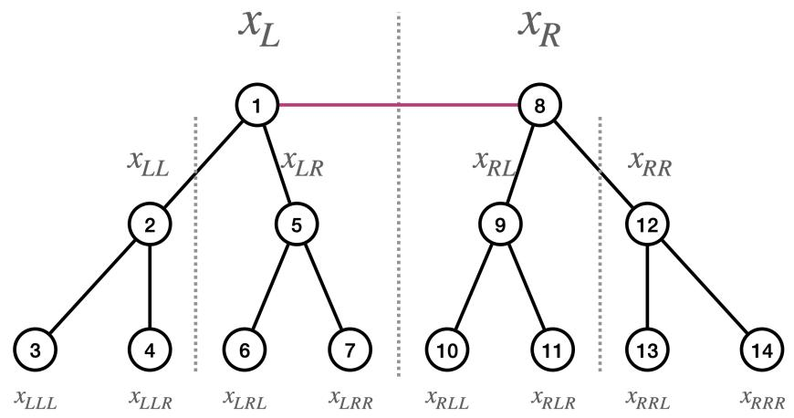  
Figure 7.1: Example of a labeling for $T _ { 2 }$ with the notation.

Hence, for every equivalence class of bipartition, we can designate a unique representative bit-string. We choose to select one of minimal Hamming weight among all potential bit-strings within the equivalence class. Additionally, we ensure that the representative has its left part smaller than the right part at every level of the tree. Algorithm 1 outlines the routines needed to compute such a representative bipartition. The \* operation signifies string concatenation, and |.| denotes the computation of the Hamming weight. Furthermore, $x _ { L }$ and $x _ { R }$ represent the left and right parts, respectively, of a given $x$ split in half.

Algorithm 1 Computation of the representative bit-string given any input string $x$ . LR_norm deals with the left/right symmetry at each level and repr_bs deals with the $\mathbb { Z } _ { 2 }$ symmetry above the LR_norm subroutine

LR_norm (x, at_root $=$ false): if length(x) ≤ 1: return X end if at root: root else root ← x[1] x ← x[2:end] end left LR norm(XL, false) right LR norm(XR, false) if left $<$ right: return root\*left\*right end return root\*right\*left   
end   
repr_bs (x): x ← bitflip(x) if |X| < |x|: return LR norm(x, true) end if $| \overline { { \mathbf { x } } } | = | \mathbf { x } |$ : return min(LR_norm(x, true), LR_norm(x, true)) end return LR norm(x, true)   
end

Now that we define a way to uniquely represents an equivalence class, we can solve the modified Schrödinger equation on the new Hilbert space composed only by the representatives. If $N _ { \mathrm { e f f } }$ is the new size of the Hilbert space, i.e. the total number of representative bit-strings, the initial state $| \tilde { \psi _ { 0 } } \rangle$ is a vector of size $N _ { \mathrm { e f f } }$ with all entries equal to $2 ^ { - { \frac { n p } { 2 } } }$ . The current state $| \tilde { \psi } ( t ) \rangle$ is ruled by the following equation :

$$
i \frac { d } { d s } | \tilde { \psi } ( s ) \rangle = T \tilde { H } ( s ) | \tilde { \psi } ( s ) \rangle
$$

where $\tilde { H } ( s ) = ( 1 - s ) \tilde { H } _ { 0 } + s \tilde { H } _ { 1 }$ . For two representatives $x$ and $y$ , $\tilde { H _ { 1 } }$ is a diagonal matrix of size $N _ { \mathrm { e f f } } \times N _ { \mathrm { e f f } }$ with entries $\langle \tilde { x } | \tilde { H _ { 1 } } | \tilde { x } \rangle = \langle x | H _ { 1 } ^ { T _ { p } } | x \rangle$ and $\langle \tilde { y } | \tilde { H } _ { 0 } | \tilde { x } \rangle =$ ${ \textstyle \sum _ { z , \mathsf { r e p r \_ b s } ( z ) = x } } \langle y | H _ { 0 } | z \rangle$ . We denoted by $| \tilde { x } \rangle$ the vector in the reduced Hilbert space corresponding to bipartition $x$ and by $H _ { 0 }$ and $H _ { 1 } ^ { T _ { p } }$ the usual Hamiltonians for the MaxCut problem (see Sec. 2.2.2). $\tilde { H _ { 1 } }$ is trivial to compute. Then, we follow Algorithm 2 to enumerate all representatives stored in the set total and to compute the values to complete $\tilde { H _ { 0 } }$ . The subroutine $\mathsf { f l i p } ( \mathsf { x } , \mathsf { i } )$ returns a bit-string $y$ equals to $x$ with bit $x _ { i }$ flipped. label is an iterator from 1 to $2 ^ { n _ { p } }$ which attributes the new label to a representative, namely the $\tilde { x }$ , so for a bipartition $x$ , label_dict[x]=˜x. For two bipartitions $x$ and $y$ , the dictionary count_neigh is constructed suh that count_neigh[x][y] $= - \langle \tilde { y } | \tilde { H } _ { 0 } | \tilde { x } \rangle$ . We use two operators on sets, \ for the difference and $^ +$ for the union.

Algorithm 2 Enumeration of all representative bit-strings at a given $p$ stored in the set total and the relation between them in the dictionary count_neigh.

# Initialization:

repr set Set $( 0 ^ { n _ { p } } )$   
total Set $( 0 ^ { n _ { p } } )$   
count neigh Dict()   
label_dict Dict ()   
label iterator $( 2 ^ { n _ { p } } )$   
while repr_set is not empty: new_repr_set Set( ) for repr in repr _set: if repr not in label_dict: label_dict[repr] $=$ next(label) end count_neigh[repr] $=$ Dict( ) for i in i ... $n _ { p }$ : new_x flip(repr, i) new_repr repr_bs(new_x) if new_repr not in label_dict: label_dict[new_repr] next(label) end if new_repr not in count_neigh[repr]: count neigh[repr] [new repr] $ 0$ end count_neigh[repr] [new_repr] ← +1 if |new_x| ≥ |repr|: append(new_repr, new_repr_set) end end

# end

new_repr_set new_repr_set\total total total $^ +$ new_repr_set repr_set new_repr_set

# end

This approach cleverly uses all symmetries in a double binary tree to reduce the Hilbert space as much as possible. We still guarantee an exact computation of the final quantum state. Indeed, it is rather direct to reconstruct the state $| \psi ( s ) \rangle$ given $| \tilde { \psi } ( s ) \rangle$ , each amplitude $\langle x | \psi ( s ) \rangle = \langle \tilde { x } | \tilde { \psi } ( s ) \rangle$ . The final step is to compute the value of the edge $X$ energy in the middle of the double binary tree $\langle O _ { X } \rangle _ { T _ { p } }$ . With the same labeling as Fig. 7.1, for a bipartition $x$ , edge $X = \langle a , b \rangle$ bit value is given by $x _ { a } = x _ { L } \vert 1 \vert$ and $x _ { b } = x _ { R }$ [1]. Consequently, by calling $| \psi _ { T } \rangle$ (resp. $| \tilde { \psi _ { T } } \rangle$ ) the state $| \psi ( s ) \rangle$ (resp. $| \tilde { \psi } ( s ) \rangle$ ) at the end of the annealing and $N _ { x }$ the number of bipartitions

that have $x$ as a representative, we have :

$$
\begin{array} { c } { { \langle { \cal O } _ { X } \rangle _ { T _ { p } } = \displaystyle \sum _ { x \in \{ 0 , 1 \} ^ { n _ { p } } , x _ { a } \neq x _ { b } } | \langle x | \psi _ { T } \rangle | ^ { 2 } } } \\ { { = \displaystyle \sum _ { x \in \mathrm { t o t a l } , x _ { a } \neq x _ { b } } N _ { x } | \langle \tilde { x } | \tilde { \psi _ { T } } \rangle | ^ { 2 } } } \end{array}
$$

We ran the different procedures for $p \in \{ 1 , 2 , 3 \}$ and we obtained Table 7.1 and Fig. 7.2. $p \ = \ 4$ seems doable with a very powerful Ordinary Differential Equation (ODE) solver.

<table><tr><td>p</td><td>np</td><td>Neff</td></tr><tr><td>1</td><td>6</td><td>12  23.6</td></tr><tr><td>2</td><td>14</td><td>462 ~ 28.85</td></tr><tr><td>3</td><td>30</td><td>816312 ~ 219.64</td></tr><tr><td>4</td><td>62</td><td>~ 241</td></tr></table>

Table 7.1: Results from the reduction of the Hilbert space on $T _ { p }$ . The lightgrey row is a guess for $N _ { \mathrm { e f f } }$ inferred from the first three where the power is approximately just below ${ \frac { 2 } { 3 } } n _ { p }$ .

  
Figure 7.2: Edge energy in a double binary tree $T _ { p }$ for $p$ ranging from 1 to 3 and $\alpha = 1$ . $t _ { 1 } = 3$ points out the runtime for which $\langle O _ { X } \rangle _ { T _ { 1 } }$ differs by 0.0035 from $\langle O _ { X } \rangle _ { T _ { 2 } } \simeq 0 . 7 1 5 1$ , similarly $t _ { 2 } = 7$ between $\langle O _ { X } \rangle _ { T _ { 2 } }$ and $\langle O _ { X } \rangle _ { T _ { 3 } } \simeq 0 . 8 0 2 8$ .

This method is still limited by the size of the Hilbert space $N _ { \mathrm { e f f } }$ which seems to grow exponentially fast with $n _ { p }$ . For the standard QA regime ( $\alpha = 1$ and linear schedule), Fig. 7.2 points out the arbitrary chosen runtimes $t _ { p }$ that are playing the role of the number $p$ of layers in QAOA. As mentioned in [Basso et al. 2022], random regular graphs generally have large girth, so they locally look like tree $T _ { p }$ . This observation would bring the effective optimal approximation ratio of QA with a 1-local analysis to 0.7151 and with a 2-local analysis above 0.8. To assess the tightness of those values, in the next section we construct such cubic graphs.

# 7.2.2 Optimal approximation ratio for QA?

In this section, we construct 3-regular graphs that achieve the value of the double binary tree middle edge energy as their approximation ratio. The property of these graphs is that each edge has exactly the same neighborhood at a given distance. They are denoted $G _ { 6 }$ , $G _ { 1 4 }$ and $G _ { 3 0 }$ , the index corresponding to the number of their vertices (Fig. 7.3).

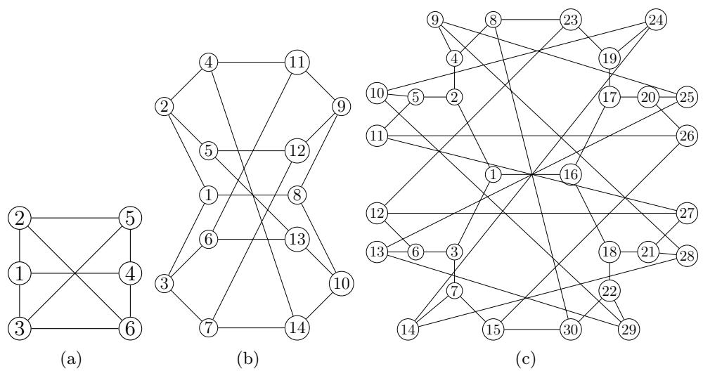  
Figure 7.3: Worst graphs from a QA point of view in short running time. (a) $G _ { 6 }$ with minimum cycle $\mathrm { s i z e } = 4$ . (b) $G _ { 1 4 }$ with minimum cycle $\mathrm { s i z e } = 6$ . (c) $G _ { 3 0 }$ with minimum cycle size $= 8$ . Each edge has exactly the same neighborhood.

In Fig. 7.4, we plot the approximation ratio reached by the graphs of Fig. 7.3 as a function of $T$ . For $G _ { 3 0 }$ , each data points took more than 15 hours to compute. We observe that for an edge $X$ , $\begin{array} { r } { \langle O _ { X } \rangle _ { T _ { 1 } } \simeq \frac { - \langle H _ { 1 } ^ { G _ { 1 4 } } \rangle _ { G _ { 1 4 } } } { C _ { o p t } ( G _ { 1 4 } ) } } \end{array}$ and $\begin{array} { r } { \langle { \cal O } _ { X } \rangle _ { { \cal T } _ { 2 } } \simeq \frac { - \langle H _ { 1 } ^ { G _ { 3 0 } } \rangle _ { G _ { 3 0 } } } { { \cal C } _ { \underline { o } p t } ( G _ { 3 0 } ) } } \end{array}$ . These graphs do reach the announced value as their approximation ratio. In graph theory, these graphs are known as a cage. A cage is a regular graph that has as few nodes as possible for its girth, the smallest induced cycle of the graph. A cage is parametrized by two parameter $( d , g )$ , $d$ being the regularity of the graph and $g$ the size of the girth. $G _ { 6 }$ is a $( 3 , 4 )$ -cage, $G _ { 1 4 }$ a $( 3 , 6 )$ -cage and $G _ { 3 0 }$ a $( 3 , 8 )$ -cage. For $d = 3$ , the largest cage is a $( 3 , 1 2 )$ graph with 126 nodes. These graphs have an even greater number of symmetry than the double binary tree, and it would be quite interesting to take advantage of it to compute their approximation ratio for large cages.

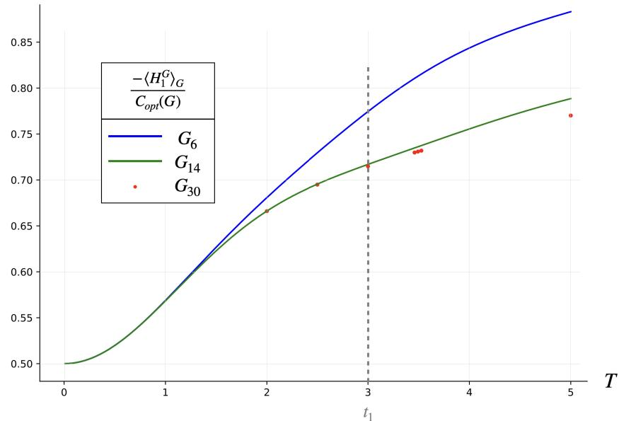  
Figure 7.4: Approximation ratio reached by $G _ { 6 }$ (blue line), $G _ { 1 4 }$ (orange line) and $G _ { 3 0 }$ (red dots) against running time $T$ . The grey dotted lines points out time $t _ { 1 } = 3$ .

To complete this analysis, we also perform a benchmark over thousands cubic graphs and compute their approximation ratio. All of the tested graphs have a higher ratio than $G _ { 3 0 }$ . Non-bipartite graphs start at $T = 0$ with an offset because the random guess already does better than 0.5. Bipartite graphs have a greater ratios if there are small closed loops. Small cycles are considered faster by the quantum process.

# Conclusion

In conclusion to this exploratory chapter, we initiated the development of a statedependent LR bound and highlighted areas requiring further investigation to achieve a significant improvement over usual LR bounds. The aim behind this approach is to establish a tighter approximation ratio of QA on MaxCut problems, particularly on regular graphs. We believe that the worst-case scenario occurs on the double binary tree. Consequently, we devised a more efficient procedure for computing edge energies within a binary tree’s midpoint, surpassing the direct solving of the Schrödinger equation. Our approach leverages every symmetry present in $T _ { p }$ , resulting in a reduction of the Hilbert space by a factor of $2 ^ { n _ { p } / 3 }$ . This allows us to speculate that the optimal approximation ratio achievable by QA, analyzed as a local algorithm on MaxCut over cubic graphs, is 0.715 for $\alpha = 1$ . To validate the tightness of this value, we constructed regular graphs, known as cages, that attain this optimal ratio.

# Conclusion & Outlooks

# Conclusion

In this thesis, we mainly tackled the analysis of the computational complexity of analog quantum computing by borrowing some well-known analytical results from theoretical physics and by introducing and developing new theoretical tools.

In the first part, we focused on the analysis of exponentially closing gaps, which are the signature of avoided level crossings. These phenomena are of important interest in the complexity analysis of Adiabatic Quantum Computing, as the main theoretical foundation is the adiabatic theorem, that guarantees the optimal final solution if the running time is inversely proportional to the minimum gap squared. This latter result puts the analysis of the minimum gap scaling as the principal candidate to prove any efficiency or inefficiency of the AQC framework. In Chapter 3, we first explored the limitation of the most recent characterization by [Choi 2020] of an AC (Def. 2.6) by explaining in which situations the definition fails to classify an AC. Supported by theoretical results we proved, we introduced a new definition of an AC to capture more possible cases (Def. 3.1) that could be labeled as AC. We illustrated the intuition that guided us to our definition with a toy model of the $k -$ clique problem. This example exhibits an AC that is not captured by Def. 2.6, but is by ours (Def. 3.1). The main difference between this two definitions is the point of view adopted, Def. 2.6 crossings focus on examining “the direction of the ground-state” whereas our definition of AC examines “the provenance of the ground-state”. Our main observation is that at crossing point, the derivative of a certain spectral quantity is inversely proportional to the minimum gap, making the derivative almost undefined as the gap reduces at an exponential rate. Our characterization also has its own limitations, which we have highlighted.

After developing our intuition on the AC phenomenon, in Chapter 4, we employed perturbation theory at the beginning and end of the quantum evolution to derive a condition on the occurrence of an exponentially closing gap via first-order quantum phase transition. This condition is valid under certain assumptions concerning local minima as well as the validity of the first-order perturbative expansion. We apply our result on the MaxCut problem. In particular, we succeeded in proving the hypotheses in the case of regular bipartite graphs to show that the gap does not shrink exponentially fast with the input size, making AQC efficient in these cases. We further investigated arbitrary bipartite graphs and constructed a family of graphs satisfying the occurrence condition of exponentially decreasing gap. High irregularity, which is a property of the graphs constructed, seems to make efficient MaxCut solving difficult for AQC. To complete our work, we provided a numerical gap analysis of the graphs in question, as well as for the performance of AQC on this class of graphs. The gap study validated the theory, however, it appears that the quantum evolution still achieves a constant probability of measuring the optimal state without depending too much on the input size. The application of our AC definition (Chapter 3) also pointed out that the evolution does not undergo an anti-crossing; on the contrary, increasing the size smoothes then evolution. Eventually, in a last section, we developed higher-order coefficients of the perturbation theory for the MaxCut problem. We observe in the first orders that small cycles seem to affect the quantum evolution faster than large ones, and even and odd cycles have opposite effects on the energy. This leads us to believe that a quantum evolution is initially more affected by small local structures.

In the second part, we turn to the study of quantum annealing complexity. In QA, the running time is an arbitrary parameter, making it a good candidate for an approximation metaheuristic. In fact, on of the most famous variational quantum circuit for approximate optimization, QAOA, is inspired by analog evolution. These metaheuristics have recently received increasing attention as they are suitable for NISQ computers thanks to their finite runtime. In the original work of QAOA, the authors used the MaxCut problem on cubic graphs to assess the performance of single-layer QAOA and proved that it reaches an approximation ratio of 0.6925. The number of layers is the analog of the running time in QA. A question arises: How does QA behave at finite short time compared to QAOA? Prior to this thesis, it had not even been proven that its performance was strictly superior to that of the random guess. That is why, in Chapter 5, we developed new theoretical tools to answer this question. To use combinatorial arguments similar to the proof of QAOA, we needed a relaxed notion of locality in the continuous setting. To this purpose, we developed a Lieb-Robinson like bound that allows us to study QA locally. Our method can be applied to a wide range of combinatorial graph problems as long as the input is regular. We numerically evaluated the LR-type bound for the MaxCut and Maximum Independent Set problems over 3-regular graphs. It resulted that QA as a local algorithm achieves a 0.5933 approximation ratio for MaxCut and 0.31 for MIS. Both performances exceed the random guess value of 0.5 and 0.25 respectively. To put this into perspective, we analyzed the tightness of our LR bound to conclude that QA probably performs even better and hinted a new approach that could improve approximation ratios.

In Chapter 6, we formalized the idea suggested at the end of the previous chapter and developed it in the case of the MaxCut problem over cubic graphs. We introduced a parametrized version of QA to give us a degree of freedom that allowed us to tighten the analysis. The previously known LR bounds reach a sufficiently low numerical value for the approximation ratio if the local structure considered has a radius of around 70. With the available classical computational power, only a radius of 3 seems reasonable in practice. To meet this constraint and make the most of the new approach developed, we have derived a new LR bound tailored to the problem, which achieves unprecedented small numerical values. A careful enumeration of all balls of radius 3 around an edge of a cubic graph combined with an optimization of the introduced parameter yielded a proven new ratio of 0.7020 with a 1-local analysis of QA. This ratio outperforms all known local algorithms of MaxCut over cubic graphs. In addition, we also argued that this value is almost tight for this approach. Eventually, we suggested some directions for improving the ratio by optimizing the schedule and some directions for generalizing the approach.

Lastly, we ended our work with the exploratory Chapter 7, which gathers attempts at a state-dependent LR bound that could improved the scope of our method. It also provides arguments on the worst-case neighborhood for an edge, namely the double binary tree. Indeed, this configuration maximizes the number of connections with the rest of the graph. Moreover, in random regular graph, all edges have a local neighborhood that is tree-like. Therefore, evaluating the edge energy inside a double binary tree would give a good insight into the optimal performance of QA for MaxCut on random regular graphs. We developed an algorithm to reduce the size of the Hilbert space thanks to the numerous symmetries of the double binary tree. This allows us to efficiently access edge energy values for tree of depth 1,2 and 3. To finally confirm that the values reached by the binary tree is tight for QA, we constructed 3-regular graphs that reach this value as an approximation ratio.

# Further work

The work we have undertaken in this thesis opens new doors for further results. As mentioned, direct applications of the tools developed to other combinatorial problems are potential direct directions.

With regard to the LR bound, to improve numerical results, we have suggested that the main difficulty is now to derive a state-dependent LR bound. Neglecting the initial state is costly. In Chapter 7, we developed our first ideas in this direction, but some ingredients are still missing to finalize the construction. Furthermore, with the exception of an attempt with a cubic scheduling function, the approximation ratio in this thesis are developed with a linear schedule. It would be interesting to investigate this further to see the potential of short time QA. For example, work on optimal control of [Brady et al. 2021] could help derive more advanced schedules. A reverse annealing approach also seems promising and would deserve more analytical study to support it [Crosson & Lidar 2021]. Regarding the application of the LR limit we derived, we could consider a practical implementation of the quantum circuit for Hamiltonian simulation proposed in [Haah et al. 2021].

As far as avoided level crossings are concerned, there are still some misunderstandings about the definition. We define it by a large derivative of the instantaneous eigenstates at stake at the crossing point. However, it seems that there are Hamiltonians for which the gap reduces exponentially fast with the size of the input without degrading too much the performance of adiabatic quantum evolution, in the sense that the probability of obtaining the optimum remains reasonable. This striking observation leads us to consider an adapted version of the adiabatic theorem for combinatorial optimization that relaxes the dependence on the minimum gap for other spectral quantities. The idea would be to design a more restrictive condition on execution time to achieve a constant probability of measuring the optimal solution.

Finally, the ideal result would be to prove a certain guarantee on the quality of the solution derived from a continuous quantum evolution in polynomial time. By allowing an execution time that scales polynomially with the size of the input, we expect a fraction of the evolved state to transition to higher-energy states. Can we quantify which fraction jumps to which energy level? We could certainly start by studying the probability of a non-adiabatic Landau-Zener transition in polynomial time.

# Appendices

Appendix A

# Some interesting features of the k−clique problem

# Contents

A.1 Influence of the driver graph . . . 173   
A.2 Some property of $H _ { 0 }$ 175   
A.3 Lower bound on the minimum gap . . 176

In this appendix, we provide results on the maximum-weight $k -$ clique problem. Some of them were derived during the internship preceding the thesis.

# A.1 Influence of the driver graph

In this section, we want to observe the influence of the driver graph. Recall from Sec. 2.2.4 that we are restricting the Hilbert space to bit-strings of Hamming weight k. The mixing Hamiltonian H0 = − P⟨a,b⟩∈G ) stabilizes this reduced space by performing only swaps between qubits. For a bit-string $x$ , we call $G _ { x }$ the graph induced by nodes $i$ such that $x _ { i } = 1$ . $H _ { 1 } | x \rangle = C ( x ) | x \rangle$ , where $C ( x )$ counts the number of missing edge in $G _ { x }$ . This encoding is the one suggested in [Childs et al. 2002]. The authors provided a numerical analysis of the median running time needed to achieve a ground-state probability above $\frac { 1 } { 8 }$ . They ran the analysis over 500 random graphs for size ranging from 7 to 18. They observed a quadratic scaling of the median runtime when using a complete driver graph $K _ { n }$ .

We tackle here the influence of the driver graph on the median runtime. For example, we look at the star graph $S _ { n }$ and the path graph $P _ { n }$ . In Fig. A.1, we plot the result obtain in each case. It is rather impressive how the driver graph seems to play a significant role in the median efficiency of the continuous evolution. We recover the result from the original work in $( a )$ . For the star graph $( b )$ , we observe a linear tendency with the input size and for the path graph we need a logarithmic scale to plot the data. The main observation is the spectacular efficiency of the star graph as a driver over the complete graph. One could expect that a more dense mixing Hamiltonian would help the evolution and here we observe the contrary. The path graph however seems to be a quite poor choice as a driver graph.

To run the evolution, we need to start from the ground-state of $H _ { 0 }$ . For the complete driver graph and the star graph they have the following expressions re-

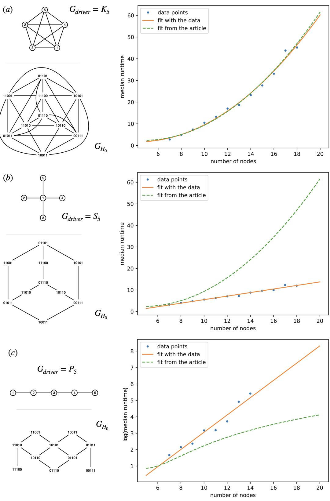  
Figure A.1: On the left, $G _ { d r i v e r }$ with the corresponding graph $G _ { H _ { 0 } }$ with adjacency matrix $- H _ { 0 }$ with $n = 5$ and $k = 3$ and on the right the median time to reach a ground-state probability of $\frac { 1 } { 8 }$ over 500 random graphs with size from 7 to 18. (a) for the complete graph, (b) for the star graph and $( c )$ the path graph in log scale. Green doted curve is the fit from [Childs et al. 2002], in orange our data fit.

spectively :

$$
| \psi _ { 0 } ^ { K } \rangle = { \binom { n } { k } } ^ { - { \frac { 1 } { 2 } } } \sum _ { x , | x | = k } | x \rangle
$$

$$
| \psi _ { 0 } ^ { S } \rangle = \frac { 1 } { \sqrt { 2 } } \left( \begin{array} { c } { \cdots } \\ { \frac { 1 } { \sqrt { \binom { n - 1 } { k } } } } \\ { \cdots } \\ { \cdots } \\ { \frac { 1 } { \sqrt { \binom { n - 1 } { k - 1 } } } } \\ { \cdots } \end{array} \right)
$$

For the path graph, we do not have a closed form and we need to compute it at the beginning of the algorithm. This is why the data in Fig. A.1 for the path graph stops at $n = 1 4$ .

To explain these main differences in the median runtime scaling, in the next section we derive some of the spectral quantity that can play a role in the efficiency of AQC.

# A.2 Some property of $H _ { 0 }$

We call $G _ { H _ { 0 } }$ the graph induced by the adjacency matrix $- H _ { 0 }$ , i.e. the one in Fig. A.1 on the left below the driver graph. $G _ { H _ { 0 } }$ represents the graph of the search space and the relation between the possible solution. At first glance, it would be natural to prefer the complete driver graph as it generates the most dense $G _ { H _ { 0 } }$ so it should be easier to amplify the amplitude of the optimal solution, i.e. the clique. However, it numerically appears that the star driver generates a better $G _ { H _ { 0 } }$ for solving the problem. Let us introduce two spectral quantities of a graph :

• $\lambda _ { H _ { 0 } }$ is the principal eigenvector of $G _ { H _ { 0 } }$ • $\gamma _ { H _ { 0 } }$ is the principal ratio of $G _ { H _ { 0 } }$ , it is the ratio of the largest component of $| \psi _ { 0 } \rangle$ with the smallest. It reflects the regularity of the graph (=1 if $G _ { H _ { 0 } }$ is regular to $= e ^ { n }$ if highly irregular like the kite graph [Zhang 2021]);

We suppose also that $k < n / 2$ , otherwise in the rest of this appendix, many $k$ must be replaced by $n - k$ . In Table A.1, we sum up some usual characterization about the graph $G _ { H _ { 0 } }$ along with the two previously introduced spectral properties.

Conjecture : The median running time scales like the product $\lambda _ { H _ { 0 } } \gamma _ { H _ { 0 } }$ . $H _ { 0 }$ needs a high regularity but not too dense. The star seems to have the better scaling, namely linear while the path is the worst with an exponential tendency. For the complete graph, it scales like $k n$ , which for small instances is quadratic in $n$ since $k \simeq n / 2$ at small $n$ .

<table><tr><td>Gdriver</td><td>Complete</td><td>Star</td><td>Path</td></tr><tr><td>λH0</td><td>k(n − k)</td><td>√k(n − k)</td><td>sin( kπ 2 cos( k+1 π ) 2(n+1) ∼ 2k n+1 2 ) sin( (2(n+1) ) π n→∞</td></tr><tr><td>γH0</td><td>1</td><td>n−k V k</td><td>10−2k−1 (n+k)k k)</td></tr><tr><td>diameter</td><td>k</td><td>2k</td><td>k(n − k)</td></tr><tr><td>|E(GH0)|</td><td>k(n−k)</td><td>k(n−k)</td><td>k(n−k)</td></tr><tr><td>|V (GH0 )|</td><td>2</td><td>n</td><td>n</td></tr><tr><td>degree</td><td>k(n − k)</td><td>k and n − k</td><td>from 1 to 2k</td></tr></table>

Table A.1: Quantities about graph $G _ { H _ { 0 } }$ . For the path driver, the value of $\gamma _ { H _ { 0 } }$ is only an estimation.

# A.3 Lower bound on the minimum gap

Let $\mathbf { d } _ { \mathrm { m a x } } ( H _ { 0 } )$ and $d$ be respectively the maximal degree and the diameter of $G _ { H _ { 0 } }$ . Inspired by the Appendix D in [Altshuler et al. 2010], one can derive a lower bound of the gap that depends on $\mathbf { d } _ { \mathrm { m a x } } ( H _ { 0 } )$ and $d$ .

Lemma A.1. For a given $H _ { 0 }$ with its associated $d _ { \mathrm { m a x } } ( H _ { 0 } )$ and $d$ as defined above, a unique solution such that $E _ { 0 } ( 1 ) = 0$ and $\begin{array} { r } { 1 \leq E _ { i } ( 1 ) \leq \binom { k } { 2 } } \end{array}$ for all $i > 0$ on average, the minimum gap is lower bounded as: $\Delta _ { m i n } \geq O ( ( d _ { \operatorname* { m a x } } ( H _ { 0 } ) k ^ { 2 } ) ^ { - d } )$

Proof. Let us first consider the case s ≥ 2dmax(H0)+12dmax(H0)+2 . The diagonal elements of $H ( s )$ are given by $H _ { i i } ~ = ~ s E _ { i }$ and the non-diagonal elements satisfy $\begin{array} { r } { \sum _ { j \neq i } H _ { i j } \ \leq \ - ( 1 - s ) \mathbf { d } _ { \operatorname* { m a x } } ( H _ { 0 } ) } \end{array}$ . Therefore, the Gershgorin circles have a radius of at most $( 1 - s ) \mathbf { d } _ { \operatorname* { m a x } } ( H _ { 0 } )$ and the circle around the solution centered in $0$ , because $E _ { 0 } ~ = ~ 0$ , is disjoint from the other circles around $s E _ { i } ~ \geq ~ s$ if $s > 2 ( 1 - s ) \mathbf { d } _ { \operatorname* { m a x } } ( H _ { 0 } )$ . Thus, the eigenvalue gap between the two lowest is lower bounded as: $\begin{array} { r } { \Delta ( s ) > s - 2 ( 1 - s ) \mathbf { d } _ { \operatorname* { m a x } } ( H _ { 0 } ) \geq \frac { 1 } { 2 \mathbf { d } _ { \operatorname* { m a x } } ( H _ { 0 } ) + 2 } \geq \Omega ( \frac { 1 } { \mathbf { d } _ { \operatorname* { m a x } } ( H _ { 0 } ) } ) } \end{array}$ .

Let us now consider the case $s \leq \frac { 2 \mathbf { d } _ { \operatorname* { m a x } } ( H _ { 0 } ) + 1 } { 2 \mathbf { d } _ { \operatorname* { m a x } } ( H _ { 0 } ) + 2 }$ . Let $\begin{array} { r } { Q = \frac { - H ( s ) + s \binom { k } { 2 } \mathbb { I } } { 1 - s } = A + } \end{array}$ $\lambda ( { \binom { k } { 2 } } \mathbb { I } - H _ { 1 } )$ , where $A = - H _ { 0 }$ is the adjacency matrix of $G _ { H _ { 0 } }$ and $\begin{array} { r } { \lambda = \frac { s } { 1 - s } \le } \end{array}$ $2 \mathbf { d } _ { \operatorname* { m a x } } ( H _ { 0 } ) + 1$ . Since every $E _ { i } \leq { \binom { k } { 2 } }$ , all elements of $Q$ are positives. By the mixing properties of $G _ { H _ { 0 } }$ , $A ^ { d }$ has all elements above 1, thus this is also true for Q. Therefore, $\mu _ { 0 } ^ { d } - \mu _ { 1 } ^ { d } \geq 1$ , where $\mu _ { 0 }$ and $\mu _ { 1 }$ are the 2 largest eigenvalues of $Q$ . The eigenvalues of $Q$ are upper bounded by the spectral radius which is upper bounded by the norm $\parallel Q \parallel _ { 1 } = \mathrm { m a x } _ { i } \sum _ { j } | Q _ { i j } |$ so that for all $i$ , $\mu _ { i } \le \lambda \binom { k } { 2 } + { \bf d } _ { \operatorname* { m a x } } ( H _ { 0 } )$ . Furthermore we have $\mu _ { 0 } ^ { d } - \mu _ { 1 } ^ { d } \leq ( \mu _ { 0 } - \mu _ { 1 } ) ( \mu _ { 0 } + \mu _ { 1 } ) ^ { d - 1 }$ so that

$$
\begin{array} { r l } {  { \mu _ { 0 } - \mu _ { 1 } \geq \frac { 1 } { ( \mu _ { 0 } + \mu _ { 1 } ) ^ { d - 1 } } } } \\ & { \geq \frac { 1 } { ( \lambda k ( k - 1 ) + 2 \mathbf { d } _ { \operatorname* { m a x } } ( H _ { 0 } ) ) ^ { d - 1 } } } \\ & { \geq \frac { 1 } { ( 2 \mathbf { d } _ { \operatorname* { m a x } } ( H _ { 0 } ) \times k ( k - 1 ) + k ( k - 1 ) + 2 \mathbf { d } _ { \operatorname* { m a x } } ( H _ { 0 } ) ) ^ { d - 1 } } } \end{array}
$$

Finally, we have

$$
\begin{array} { l } { \Delta ( s ) = ( 1 - s ) ( \mu _ { 0 } - \mu _ { 1 } ) } \\ { \displaystyle \geq \frac { 1 } { ( 2 { \bf d } _ { \operatorname* { m a x } } ( H _ { 0 } ) + 2 ) ( 2 { \bf d } _ { \operatorname* { m a x } } ( H _ { 0 } ) \times k ( k - 1 ) + k ( k - 1 ) + 2 { \bf d } _ { \operatorname* { m a x } } ( H _ { 0 } ) ) ^ { d - 1 } } } \end{array}
$$

i.e. $\Delta ( s ) \geq O ( ( \mathbf { d } _ { \operatorname* { m a x } } ( H _ { 0 } ) k ^ { 2 } ) ^ { - d } )$

From Lemma 3, we can only conclude that the algorithm has a run time upper bounded by a superpolynomial in the size of the problem for $k = O ( p o l y ( \log ( n ) ) )$ which is no improvement compare to classical algorithms that find $k$ -clique. Also given Table A.1, we see that the path graph clearly has the worst scaling with a diameter that grows with ${ \mathcal { O } } ( n )$ , while the complete and star driver have a diameter in ${ \mathcal { O } } ( k )$ only

# MaxCut $H _ { 1 }$ on $H _ { 0 }$ eigenvectors

# Contents

# B.1 Proof of Proposition 4.1

In this appendix, we prove the proposition due to my supervisor Simon Martiel. Let restate it.

Proposition B.1. If $H _ { 1 }$ is the Hamiltonian encoding the MaxCut problem over a graph $G ( V , E )$ of $n$ nodes and $H _ { 0 }$ is the standard bit-flip operator with eigenpairs $( | E _ { b } \rangle , E _ { b } )$ for a bit-string $b$ where $E _ { b } = - n + 2 | b |$ , $| b |$ being the Hamming weight of $b$ , then

$$
\langle E _ { b } | H _ { 1 } | E _ { b ^ { \prime } } \rangle = \frac { 1 } { 2 }
$$

if and only if $G _ { b \oplus b ^ { \prime } }$ is exactly an edge. Where $G _ { b \oplus b ^ { \prime } }$ is the subgraph induced by nodes $i$ such that $( b \oplus b ^ { \prime } ) _ { i } = 1$ .

The eigenvectors $| E _ { b } \rangle$ of $H _ { 0 }$ correspond to states where qubit $i$ is in state $| + \rangle =$ $\frac { | 0 \rangle + | 1 \rangle } { 2 }$ if $b _ { i } = 0$ and $\begin{array} { r } { | - \rangle = \frac { | 0 \rangle - | 1 \rangle } { 2 } } \end{array}$ |0⟩−|1⟩2 if bi = 1. In the computational basis it is written as:

$$
| E _ { b } \rangle = { \frac { 1 } { \sqrt { 2 ^ { n } } } } \sum _ { x \in \{ 0 , 1 \} ^ { n } } ( - 1 ) ^ { b \cdot x } | x \rangle
$$

Let $b$ and $b ^ { \prime }$ be two bit-strings, we have that $H _ { 1 } | x \rangle = C ( x ) | x \rangle$ for any classical state $| x \rangle$ where $C ( x )$ is the classical cost function for the MaxCut problem, counting minus the number of edges across the bipartition $x$ . Recall that we are in the minimization setting so there is a minus absorbed by the cost value, i.e. $C ( x ) \in$ $[ - | E ( G ) | , 0 ]$ . We can then write :

$$
\begin{array} { l } { \langle E _ { b } | H _ { 1 } | E _ { b ^ { \prime } } \rangle = \displaystyle \frac { 1 } { 2 ^ { n } } \displaystyle \sum _ { x \in \{ 0 , 1 \} ^ { n } } \displaystyle \sum _ { y \in \{ 0 , 1 \} ^ { n } } ( - 1 ) ^ { b \cdot x } ( - 1 ) ^ { b ^ { \prime } \cdot y } \langle x | H _ { 1 } | y \rangle } \\ { = \displaystyle \frac { 1 } { 2 ^ { n } } \displaystyle \sum _ { x \in \{ 0 , 1 \} ^ { n } } ( - 1 ) ^ { ( b \oplus b ^ { \prime } ) \cdot x } C ( x ) } \\ { = \langle E _ { b \oplus b ^ { \prime } } | H _ { 1 } | E _ { 0 ^ { n } } \rangle } \end{array}
$$

where we recognize the ground-state $\left| E _ { 0 ^ { n } } \right.$ of $H _ { 0 }$ . Therefore we can focus on proving that $\begin{array} { r } { \langle E _ { b } | H _ { 1 } | E _ { 0 ^ { n } } \rangle = \frac { 1 } { 2 } } \end{array}$ if and only if $G _ { b }$ is exactly an edge and 0 otherwise. Let consider a bit-string $b$ of Hamming weight $k$ , we can write :

$$
\begin{array} { l } { { \langle E _ { b } | H _ { 1 } | E _ { 0 ^ { n } } \rangle = \displaystyle \frac { 1 } { 2 ^ { n } } \sum _ { x \in \{ 0 , 1 \} ^ { n } } ( - 1 ) ^ { b \cdot x } C ( x ) } } \\ { { = \displaystyle \frac { 1 } { 2 ^ { n } } \sum _ { y \in \{ 0 , 1 \} ^ { n - k } } \sum _ { x \in \{ 0 , 1 \} ^ { k } } ( - 1 ) ^ { | x | } \left( C _ { G _ { \overline { { b } } } } ( y ) + C _ { G _ { b } } ( x ) + D _ { G , b } ( x , y ) \right) } } \end{array}
$$

where $b$ is the bit-string obtained by bit-flipping every bits in $b$ , $C _ { G }$ is the MaxCut cost function associated to graph $G$ and $D _ { G , b } ( x , y )$ is (minus) the number of edges cut across $G _ { b }$ and $G _ { \overline { { b } } }$ given bipartition $x$ of $G _ { b }$ and $y$ of $G _ { \overline { { b } } }$ . In the two sums above, the sum over $y$ ranges over all possible bipartitions of $G _ { \bar { b } }$ , while the sum over $x$ ranges over all possible bipartitions of $G _ { b }$ .

Since $\begin{array} { r } { \sum _ { x \in \{ 0 , 1 \} ^ { * } } ( - 1 ) ^ { | x | } = 0 } \end{array}$ , the term $C _ { G _ { \overline { { b } } } } ( \boldsymbol { y } )$ vanishes. Then for each edge $\left. i , j \right.$ between $G _ { b }$ and $G _ { \bar { b } }$ cut by bipartition $x$ and $y$ , i.e. without loss of generality, if $i$ belongs to $G _ { b }$ and $j$ to $G _ { \overline { { b } } }$ , it means that $x _ { i } \neq y _ { j }$ , it exists another bipartition $x ^ { \prime }$ and $y ^ { \prime }$ that also cuts edge $\langle i , j \rangle$ with $| x ^ { \prime } | = | x | \pm 1$ . For example, $x ^ { \prime }$ is $x$ with $x _ { i } ^ { \prime } = \overline { { x _ { i } } }$ and $y ^ { \prime }$ is $y$ with $y _ { j } ^ { \prime } = { \overline { { y _ { j } } } }$ . So the term $D _ { G , b } ( x , y )$ also vanishes. We are left with :

$$
\begin{array} { l } { { \langle E _ { b } | H _ { 1 } | E _ { 0 ^ { n } } \rangle = \displaystyle \frac { 1 } { 2 ^ { n } } \sum _ { y \in \{ 0 , 1 \} ^ { n - k } } \sum _ { x \in \{ 0 , 1 \} ^ { k } } ( - 1 ) ^ { | x | } C _ { G _ { b } } ( x ) } } \\ { { = \displaystyle \frac { 1 } { 2 ^ { k } } \sum _ { x \in \{ 0 , 1 \} ^ { k } } ( - 1 ) ^ { | x | } C _ { G _ { b } } ( x ) } } \end{array}
$$

Now if $k = 0$ or $k = 1$ , $C _ { G _ { b } } ( x ) = 0$ . Assume that $k \geq 3$ . For all edges $\left. i , j \right.$ in $G _ { b }$ , only half of the bit-strings $x \in \{ 0 , 1 \} ^ { k }$ will contribute to the sum over $x$ , in fact every time $x _ { i } \neq x _ { j }$ . Among them, half has a positive contribution and the other half a negative contribution, bringing the total sum to zero (see Table B.1)

<table><tr><td rowspan=1 colspan=1>x = x1xixj</td><td rowspan=1 colspan=1>(-1)|x|</td><td rowspan=1 colspan=1>CGb(x)</td></tr><tr><td rowspan=1 colspan=1>000</td><td rowspan=1 colspan=1>+1</td><td rowspan=1 colspan=1>0</td></tr><tr><td rowspan=1 colspan=1>001010</td><td rowspan=1 colspan=1>-1-1</td><td rowspan=1 colspan=1>-1-1</td></tr><tr><td rowspan=1 colspan=1>011100</td><td rowspan=1 colspan=1>+1-1</td><td rowspan=1 colspan=1>00</td></tr><tr><td rowspan=1 colspan=1>101110</td><td rowspan=1 colspan=1>+1+1</td><td rowspan=1 colspan=1>-1-1</td></tr><tr><td rowspan=1 colspan=1>111</td><td rowspan=1 colspan=1>-1</td><td rowspan=1 colspan=1>0</td></tr></table>

Table B.1: Example of the values in the sum over $x$ for $k = 3$ . Only rows shaded in light grey have a contribution in the sum.

For the case $k = 2$ , the above argument does not work anymore. $G _ { b }$ is either two isolated nodes or exactly an edge of $G$ . In the first case $C _ { G _ { b } } ( x ) = 0$ for any $x$ .

In the second one, as the sum in $x$ is over the set $\{ 0 0 , 0 1 , 1 0 , 1 1 \}$ , only terms 01 and 10 has a non-zero value of $C _ { G _ { b } } ( x ) = - 1$ , and they contribute positively to the sum because the Hamming weight is odd. Thus, we obtain :

$$
\begin{array} { l } { { \displaystyle \langle E _ { b } | H _ { 1 } | E _ { 0 ^ { n } } \rangle = \frac { 1 } { 2 ^ { k } } \sum _ { x \in \{ 0 , 1 \} ^ { k } } ( - 1 ) ^ { | x | } C _ { G _ { b } } ( x ) } } \\ { { \mathrm { ~ } = \frac { 1 } { 2 ^ { k } } \times ( - 2 ) \times ( - 1 ) } } \\ { { \mathrm { ~ } = \frac { 1 } { 2 } } } \end{array}
$$

if and only if $G _ { b }$ is exactly an edge. If not, the quantity is zero.

By adapting the proof, a similar result can be proved for the asymmetric $H _ { 1 }$ :

Claim 6. If $H _ { 1 }$ is the Hamiltonian encoding the MaxCut problem over a graph $G ( V , E )$ of $n$ nodes where node labeled 1 is fixed to remove the symmetry and $H _ { 0 }$ is the standard bit-flip operator over $n - 1$ qubits with eigenpairs $( | E _ { b } \rangle , E _ { b } )$ , then

$$
\langle E _ { b } | H _ { 1 } | E _ { 0 ^ { n } } \rangle = \frac { 1 } { 2 }
$$

if and only if $( G - 1 ) _ { b }$ is exactly an edge or exactly one of node 1 neighbors. Where $( G - 1 ) _ { b }$ is the subgraph of $G$ induced by nodes $i$ such that $b _ { i } = 1$ after deleting node 1.

We can see that there are exactly the same amount of bit-string $b$ for which the quantity equals $1 / 2$ , which is the total number of edges in the input graph $| E ( G ) |$ .

Appendix C

# Technical results for the LR bound based ratio

# Contents

C.1 Minimization of Equation 6.6 . . 183   
C.2 Proof of Equation 6.10 184   
C.3 Nested integrals 184

# C.1 Minimization of Equation 6.6

Let us study the following function with two variables:

$$
\forall x \geq 0 , y \geq 0 | 4 x + 3 y \leq 1 , f ( x , y ) = { \frac { a x + b ( 4 x + 3 y ) + c ( { \frac { 3 } { 2 } } - 5 x - 3 y ) } { { \frac { 3 } { 2 } } - x - y } }
$$

where $a = \langle O _ { X } \rangle _ { \mathcal { G } } ^ { \Omega _ { 1 } }$ , $b = \left. O _ { X } \right. _ { \mathcal { G } } ^ { \Omega _ { 2 } }$ and $c = { \langle O _ { X } \rangle } _ { \mathcal { G } } ^ { \Omega _ { 3 } }$ . Empirically we suppose that $a \leq b \leq c$ and we will see later that this assumption is verified. Let $x , y$ be positive number such that $4 x + 3 y \leq 1$ . Then we have that $x + y \leq \textstyle { \frac { 1 } { 3 } }$ and $x \leq \textstyle { \frac { 1 } { 4 } }$ . The function $f$ can be rewritten in three parts:

$$
f ( x , y ) = { \frac { { \frac { 3 } { 2 } } c } { { \frac { 3 } { 2 } } - ( x + y ) } } - { \frac { 3 ( c - b ) ( x + y ) } { { \frac { 3 } { 2 } } - ( x + y ) } } - { \frac { ( 2 c - a - b ) x } { { \frac { 3 } { 2 } } - ( x + y ) } }
$$

If $x = y = 0$ , then $f ( 0 , 0 ) = c$ . Let us see the condition on which $f$ can only increase if $x + y > 0$ . The first term can increase at most by $c - c { \frac { \frac { 3 } { 2 } } { \frac { 3 } { 2 } - \frac { 1 } { 3 } } } = { \frac { 2 } { 7 } } c$ The second term can decrease at most by ${ \frac { c - b } { \frac { 3 } { 2 } - \frac { 1 } { 3 } } } \ = \ ( c - b ) { \frac { 6 } { 7 } }$ . The last term can $\begin{array} { r } { \frac { \frac 1 4 ( 2 c - a - b ) } { \frac 3 2 - \frac 1 3 } = ( 2 c - a - b ) \frac { 3 } { 1 4 } } \end{array}$ . Thus n derive $f ( 0 , 0 )$ is the minimum iflowing condition to $\begin{array} { r } { \frac { 2 } { 7 } c \geq ( c - b ) \frac { 6 } { 7 } + ( 2 c - a - b ) \frac { 3 } { 1 4 } } \end{array}$   
satisfy to have $f ( 0 , 0 )$ as the minimum:

$$
\begin{array} { c } { c \geq 3 ( c - b ) + \displaystyle \frac { 3 } { 4 } ( 2 c - a - b ) } \\ { \Rightarrow 3 . 5 c \leq 3 . 7 5 b + 0 . 7 5 a } \end{array}
$$

For example with $a \ge 0 . 5$ , $b \geq 0 . 5 7$ and $c \leq 0 . 7 1$ the assumption and the condition are satisfied.

# C.2 Proof of Equation 6.10

We are working with a Hamiltonian of general form $\begin{array} { r } { H ( t ) = \sum _ { j \in V ( \mathbf { G } ) } h _ { j } ( t ) \gamma _ { j } } \end{array}$ and for any unitary $A$ supported on $S$ (outside a certain region around one node $X$ ), we want to show Equation 6.10 in the time-dependent regime. We follow exactly the same steps of [Wang $\&$ Hazzard 2020] but with function $h _ { j }$ that depends on the time. First let us look at the derivative of $\gamma _ { X } ^ { A } ( t )$ :

$$
\frac { d [ \gamma _ { X } ( t ) , A ] } { d t } = - i \sum _ { v : \langle X v \rangle \in { \bf G } } h _ { v } ( t ) [ ( U _ { T } ^ { G } ) ^ { \dagger } [ \gamma _ { X } , \gamma _ { v } ] U _ { T } ^ { G } , A ]
$$

Then we define $\tau _ { A } ( t ) = \hat { U } ^ { \dagger } \gamma _ { X } ^ { A } ( t ) \hat { U }$ where $\hat { U }$ is the unitary that is solution of $\begin{array} { r } { i \frac { d \hat { U } } { d t } = } \end{array}$ $\begin{array} { r } { - \sum _ { v : \langle X v \rangle \in \mathbf { G } } h _ { v } ( t ) \gamma _ { v } ( t ) \hat { U } } \end{array}$ . That way, we have $\| \tau _ { A } ( T ) \| = \| \gamma _ { X } ^ { A } ( T ) \|$ and the derivative of $\tau _ { A }$ is given by:

$$
\dot { \tau _ { A } } ( t ) = - i \sum _ { v : \langle X v \rangle \in { \bf G } } h _ { v } ( t ) \hat { U } ^ { \dag } \left[ \gamma _ { X } ( t ) , [ \gamma _ { v } ( t ) , A ] \right] \hat { U }
$$

Now we can proceed as follow:

$$
\begin{array} { r l } { \| \gamma _ { X } ^ { A } ( T ) \| - \| \gamma _ { X } ^ { A } ( 0 ) \| = \| \tau _ { A } ( T ) \| - \| \tau _ { A } ( 0 ) \| } & { { } } \\ { \ } & { { } \leq \int _ { 0 } ^ { T } \| \dot { \tau _ { A } } ( t ^ { \prime } ) \| d t ^ { \prime } } \\ { \ } & { { } \leq \displaystyle \sum _ { v : \langle X v \rangle \in { \bf G } } \int _ { 0 } ^ { T } h _ { v } ( t ) \| [ \gamma _ { X } ( t ) , [ \gamma _ { v } ( t ) , A ] ] \| d t } \end{array}
$$

# C.3 Nested integrals

In this appendix, we detail the computation of the nested integrals that play an important role in the LR-bound. To tackle this derivation, we introduce for all $k \in \mathbb { N } ^ { * }$ :

$$
I _ { 2 k } ( x ) = \int _ { 0 } ^ { x } 1 - u _ { 1 } \int _ { 0 } ^ { u _ { 1 } } u _ { 2 } . . . \int _ { 0 } ^ { u _ { 2 k - 1 } } u _ { 2 k } d u _ { 2 k } . . . d u _ { 2 } d u _ { 1 }
$$

and

$$
I _ { 2 k + 1 } ( x ) = \int _ { 0 } ^ { x } 1 - u _ { 1 } \int _ { 0 } ^ { u _ { 1 } } u _ { 2 } . . . \int _ { 0 } ^ { u _ { 2 k } } 1 - u _ { 2 k + 1 } d u _ { 2 k + 1 } . . . d u _ { 2 } d u _ { 1 }
$$

polynomials in $x$ define in $[ - 1 , 1 ]$ . The goal is to compute these polynomials at $x = 1$ , which is nothing else than the sum of the polynomial coefficients.

Even case $I _ { 2 k } ( x )$ : The highest degree of this polynomial is $4 k$ as there are $2 k$ integrals and there is always a way to choose a $u _ { j }$ to integrate so the $2 k \ u _ { j }$ bring the total degree to $4 k$ . The highest order coefficient is straightforward $\frac { ( - 1 ) ^ { k } } { 2 ^ { 2 k } ( 2 k ) ! }$ . The

least order term is the one where we choose the minimum number of $u _ { j }$ to integrate coefficient which is $k$ . This observation brings the least order term to be of degree $\scriptstyle \prod _ { l = 2 } ^ { k } { \frac { 1 } { 3 l ( 3 l - 1 ) } }$ . In general, there exist positive coefficients $a _ { j } ( k )$ to express $3 k$ with as a polynomial:

$$
\begin{array} { c } { { I _ { 2 k } ( x ) = \displaystyle \sum _ { j = 0 } ^ { k } a _ { j } ( k ) ( - 1 ) ^ { j } x ^ { 3 k + j } } } \\ { { = \displaystyle x ^ { 3 k } \sum _ { j = 0 } ^ { k } a _ { j } ( k ) ( - x ) ^ { j } } } \end{array}
$$

and we define $a _ { 0 } ( 0 ) = 1$ . With these notations, the quantity of interest is $I _ { 2 k } ( 1 ) =$ $\textstyle \sum _ { j = 0 } ^ { k } ( - 1 ) ^ { j } a _ { j } ( k )$ . To find a recurrence relation first notice that $\begin{array} { r } { I _ { 2 k } ( x ) = \int _ { 0 } ^ { x } 1 - } \end{array}$ $\begin{array} { r } { u _ { 1 } \int _ { 0 } ^ { u _ { 1 } } u _ { 2 } I _ { 2 k - 2 } ( u _ { 2 } ) d u _ { 2 } d u _ { 1 } } \end{array}$ and develop:

$$
\begin{array} { r l } { \sum _ { j = 1 } ^ { n } - \sum _ { j = 1 } ^ { n } \int _ { 0 } ^ { \infty } \exp _ { j } \exp _ { j } \exp _ { j } \exp _ { j } \exp _ { j } } \\ { = } & { - \frac { 1 } { 2 \sqrt { 2 } } \sum _ { j = 1 } ^ { n } \mathbb { E } _ { j } \exp _ { j } \Biggl [ \int _ { 0 } ^ { \infty } \log ( \frac { \theta _ { j } } { \theta _ { j } } ) ^ { 2 } \log ( 1 - \frac { \theta _ { j } } { \theta _ { j } } ) ^ { 2 } \log ( 1 - \frac { \theta _ { j } } { \theta _ { j } } ) ^ { 2 } \log ( 1 - \frac { \theta _ { j } } { \theta _ { j } } ) } \\ { = } & { - \frac { 1 } { 2 \sqrt { 2 } } \sum _ { j = 1 } ^ { n } \mathbb { E } _ { j } \exp _ { j } \Biggl [ \int _ { 0 } ^ { \infty } \log ( 1 - \frac { \theta _ { j } } { \theta _ { j } } ) ^ { 2 } \log ( 1 - \frac { \theta _ { j } } { \theta _ { j } } ) ^ { 2 } \log ( 1 - \frac { \theta _ { j } } { \theta _ { j } } ) } \\ { = } & { \frac { \sum _ { j = 1 } ^ { n } \alpha _ { j } ( 1 - \alpha _ { j } ( 1 - \alpha _ { j } ( 1 - \alpha _ { j } ( 1 - \alpha _ { j } ) ) ) } [ \frac { \alpha _ { j } ( 1 - \alpha _ { j } ) } { 1 ( 1 - \alpha _ { j } ( 1 - \alpha _ { j } ) ) } - \frac { \alpha _ { j } ( 1 - \alpha _ { j } ) } { 1 ( 1 - \alpha _ { j } ) ( 1 - \alpha _ { j } ) ( 1 - \alpha _ { j } ) } ] } \\ { = } &  \alpha _ { j } ^ { 2 } \sum _ { j = 1 } ^ { n } \exp _ { j } \exp _ { j } [ \frac { \alpha _ { j } ( 1 - \alpha _ { j } ) }  1 ( 1 - \alpha _ { j } ) ( 1 - \end{array}
$$

In the last line we can identify the $a _ { j } ( k )$ coefficients:

$$
\begin{array} { l } { { a _ { 0 } ( k ) = \displaystyle \frac { a _ { 0 } ( k - 1 ) } { 3 k ( 3 k - 1 ) } } } \\ { { a _ { j } ( k ) = \displaystyle \frac { a _ { j } ( k - 1 ) } { ( 3 k + j - 1 ) ( 3 k + j ) } + \frac { a _ { j - 1 } ( k - 1 ) } { ( 3 k + j - 2 ) ( 3 k + j ) } \mathrm { ~ f o r ~ } j \in [ 1 , . . . , k - 1 ] } } \\ { { a _ { k } ( k ) = \displaystyle \frac { a _ { k - 1 } ( k - 1 ) } { 4 k ( 4 k - 2 ) } } } \end{array}
$$

We recover the higher and least order coefficients mentioned above. So we can try to compute $I _ { 2 k } ( 1 )$ :

$$
\begin{array} { r l } { I _ { 2 3 } ( 1 ) - \displaystyle \sum _ { s = 0 } ^ { K - 1 } ( - 1 ) ^ { \theta } \alpha _ { 3 } ( k ) } & { } \\ & { = \displaystyle \sum _ { s = 1 } ^ { K - 1 } ( - 1 ) ^ { \theta } \left[ \frac { \alpha _ { 3 } ( k - 1 ) } { ( 3 k + \hat { j } - 1 ) ( 3 k + \hat { j } ) } + \frac { \alpha _ { 3 } ( k - 1 ) } { ( 3 k + \hat { j } - 2 ) ( 3 k + \hat { j } ) } \right] } \\ & { \quad \quad \quad \quad \quad \quad \quad \quad \quad \quad \quad \quad \quad \quad \quad \quad \quad \quad \quad \quad \quad \quad \quad \quad \quad \quad \quad \quad \quad \quad \quad \quad \quad \quad \quad \quad } \\ & { = \displaystyle \sum _ { s = 1 } ^ { K - 1 } ( - 1 ) ^ { \theta } \frac { \alpha _ { 2 } ( k - 1 ) } { ( 3 k + \hat { j } - 1 ) ( 3 k + \hat { j } ) } + \frac { k ^ { 2 } } { \hat { j } - ( - 1 ) ^ { \theta - 1 } ( 3 k + \hat { j } - 1 ) ( 3 k + \hat { j } + 1 ) } } \\ & { \quad \quad \quad \quad \quad \quad \quad \quad \quad \quad \quad \quad \quad \quad \quad \quad \quad \quad \quad \quad \quad \quad \quad \quad \quad \quad \quad \quad \quad \quad \quad \quad \quad \quad \quad \quad \quad \quad \quad \quad \quad \quad } \\ & { = \displaystyle \sum _ { s = 1 } ^ { K - 1 } \frac { 1 } { ( 3 k + \hat { j } - 1 ) ( 3 k + \hat { j } ) ( \hat { j } ( k - 1 ) ) } + \frac { k ^ { 2 } } { 3 k ( 3 k + \hat { j } ) ( k + \hat { j } + 1 ) } + ( - 1 ) ^ { \theta - 1 } \frac { \alpha _ { 2 } ( k - 1 ) } { ( 3 k + \hat { j } + 1 ) ( 3 k + \hat { j } + 1 ) } } \\ &  \quad \quad \quad \quad \quad \quad \quad \quad \quad \quad \quad \quad \quad \quad \quad \quad \quad \quad \quad \quad \quad \quad \quad \quad \quad \quad \quad \quad \quad \quad \quad \quad \quad \quad \quad \end{array}
$$

Computing recursively the coefficients $( a _ { j } ( k ) ) _ { j }$ allows us to evaluate the nested integrals of interest. At the end of this appendix, we develop the numerical analysis of it.

We can still have a loose upper bound (sufficient for Corollary 6.1) because the

$a _ { j } ( k )$ are positives, by looking at $I _ { 2 k } ( - 1 )$ :

$$
\begin{array} { r l } & { \begin{array} { r l r } { \operatorname* { l i m } _ { \mathrm { { { i } ^ { c } \to \{ \frac { 1 } { 2 } \leq i \leq \frac 1 } { 2 } } } } } & { \operatorname* { l i m } _ { \mathrm { { i } ^ { c } \to \frac { 1 } { 2 } \leq i \leq \frac 1 } { 2 } } } \\ & { - \frac { 1 } { \mathrm { { K } } ^ { ( 2 ) / 2 } \leq i \leq \frac 1 } { 2 } } &  \frac { 1 } { \mathrm { K } } \frac { 1 } { \mathrm { K } } \frac { 1 } { \mathrm { K } } \frac { 1 } { \mathrm { K } } \frac { 1 } { \mathrm { K } } \frac { 1 } { \mathrm { K } } \frac { 1 } { \mathrm { K } } \frac { 1 } { \mathrm { K } } \frac { 1 } { \mathrm { K } } \frac { 1 } { \mathrm { K } } \frac { 1 } { \mathrm { K } } \frac { 1 } { \mathrm { K } } \frac { 1 } { \mathrm { K } } \frac { 1 } { \mathrm { K } } \frac { 1 } { \mathrm { K } } \frac { 1 } { \mathrm { K } } \frac { 1 } { \mathrm { K } } \frac { 1 } { \mathrm { K } } \frac { 1 } { \mathrm { K } } \frac { 1 } { \mathrm { K } } \frac { 1 } { \mathrm { K } } \frac { 1 } { K } \frac { 1 } { K } \frac { 1 } { K } \frac { 1 } { K } \frac { K } { K } \frac { 1 } { K } \mathrm { K } \frac { K } { K } \frac { K } { K } \frac { K } { K } \mathrm { K } \frac { K } { K } \frac { K } { K } \frac { K } { K } \mathrm { K } \frac { K } { K } \frac { K } { K } \mathrm { K } \frac { K } { K } \frac { K } { K } \frac { K } { K } \mathrm { K } \frac { K } { K } \frac { K } { K } \mathrm { K } \frac { K } { K } \frac { K } { K } \frac { K } { K } \frac { K } { K } \frac { K } { K } \frac { K } { K } \frac { K } { K } \frac { K } { K } \frac { K } { K } \frac { K } { K } \frac { K } { K } \frac \end{array} \end{array}
$$

Odd case $I _ { 2 k + 1 } ( x )$ : The higher degree of this polynomial is $4 k + 2$ as there are $2 k + 1$ integrals and there is a way to always choose a $u _ { j }$ to integrate so the $2 k + 1$ $u _ { j }$ bring the total degree to $4 k + 2$ . The least order term is the one where we choose the minimum number of $u _ { j }$ to integrate which is $k$ . This observation brings the least order term to be of degree $3 k + 1$ . In general, there exist positive coefficients $b _ { j } ( k + 1 )$ to express $I _ { 2 k + 1 } ( x )$ as a polynomial:

$$
\begin{array} { c } { { I _ { 2 k + 1 } ( x ) = \displaystyle \sum _ { j = 0 } ^ { k + 1 } b _ { j } ( k + 1 ) ( - 1 ) ^ { j } x ^ { 3 k + j + 1 } } } \\ { { = x ^ { 3 k + 1 } \displaystyle \sum _ { j = 0 } ^ { k + 1 } b _ { j } ( k + 1 ) ( - x ) ^ { j } } } \end{array}
$$

$$
\begin{array} { l } { { \displaystyle I _ { 2 k + 1 } ( x ) = \int _ { 0 } ^ { x } 1 - u _ { 1 } \int _ { 0 } ^ { u _ { 1 } } u _ { 2 } * I _ { 2 k - 1 } ( u _ { 2 } ) d u _ { 2 } d u _ { 1 } } } \\ { { \displaystyle \quad = \ldots } } \\ { { \displaystyle b _ { 0 } ( k ) \ } } \\ { { \displaystyle \quad = \frac { b _ { 0 } ( k ) } { 3 k ( 3 k + 1 ) } x ^ { 3 k + 1 } + x ^ { 3 k + 1 } \sum _ { j = 1 } ^ { k } \frac { ( 3 k + j - 1 ) b _ { j } ( k ) + ( 3 k + j ) b _ { j - 1 } ( k ) } { ( 3 k + j + 1 ) ( 3 k + j - 1 ) ( 3 k + j ) } ( - x ) ^ { j } } } \\ { { \displaystyle \qquad + \frac { ( - 1 ) ^ { k + 1 } b _ { k } ( k ) } { 4 k ( 4 k + 2 ) } x ^ { 4 k + 2 } \qquad ( \mathrm { C . 1 2 } ) } } \end{array}
$$

We can identify the $b _ { j } ( k )$ coefficients:

$$
{ \begin{array} { l } { { b } _ { 0 } ( k + 1 ) = { \frac { b _ { 0 } ( k ) } { 3 k ( 3 k + 1 ) } } \qquad { \mathrm { ( C . 1 3 ) } } } \\ { { b _ { j } ( k + 1 ) = { \frac { b _ { j } ( k ) } { ( 3 k + j + 1 ) ( 3 k + j ) } } + { \frac { b _ { j - 1 } ( k ) } { ( 3 k + j + 1 ) ( 3 k + j - 1 ) } } \quad { \mathrm { f o r ~ } } j \in [ 1 , . . . , k ] } } \\ { \qquad { \mathrm { ( C . 1 4 ~ } } } \\ { { \mathfrak { s } \mathrm { + 1 } } { \mathrm { ( } k + 1 { ) } } = { \frac { b _ { k } ( k ) } { 4 k ( 4 k + 2 ) } } \qquad { \mathrm { ( C . 1 5 ~ } } j \in \mathbf { U } { \mathrm { ~ , ~ } } } \end{array} }
$$

Those coefficients allows us to compute the exact value of the nested integral. Similarly to the even case, we can upper bound the integral of interest like this:

$$
\begin{array} { l } { \displaystyle I _ { 2 k + 1 } \big ( 1 \big ) = \sum _ { j = 0 } ^ { k + 1 } ( - 1 ) ^ { j } b _ { j } \big ( k + 1 \big ) } \\ { \displaystyle \qquad = \sum _ { j = 0 } ^ { k } \frac { ( - 1 ) ^ { j } b _ { j } \big ( k \big ) } { \big ( 3 k + j \big ) \big ( 3 k + j + 1 \big ) \big ( 3 k + j + 2 \big ) } } \\ { \displaystyle I _ { 2 k + 1 } \big ( 1 \big ) \leq I _ { 2 k + 1 } \big ( - 1 \big ) \leq \frac { 6 ^ { k + 2 } \big ( k + 1 \big ) ! } { \big ( 3 k + 2 \big ) ! } } \end{array}
$$

In practice, a numerical study is enough as we are interested in the numerical value. Using the derived coefficients above, it appears that it follows something like $\begin{array} { r } { I _ { 2 k } \simeq \frac { \mathrm { n u m } ( I _ { 2 k } ) } { ( 4 k ) ! } } \end{array}$ and $\begin{array} { r } { I _ { 2 k + 1 } \simeq \frac { \mathrm { n u m } ( I _ { 2 k + 1 } ) } { ( 4 k + 2 ) ! } } \end{array}$ num(I2k+1)(4k+2)! where both num(I2k+1) and num(I2k) grow like $e ^ { \mathcal { O } ( k ^ { 2 } ) }$ . A numerical fit gives a tendency function with an almost $1$ correlation factor, see Fig. C.1.

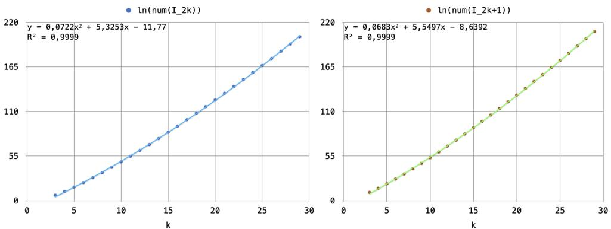  
Figure C.1: Fit curves for the numerator logarithm of the nested integral for even (left) and odd (right) iteration step.

# Bibliography

[Aharonov et al. 2004] D. Aharonov, W. van Dam, J. Kempe, Z. Landau, S. Lloyd and O. Regev. Adiabatic quantum computation is equivalent to standard quantum computation. In 45th Annual IEEE Symposium on Foundations of Computer Science, pages 42–51, 2004. (Cited on pages 22 and 35.)

[Al-Jazari 1974] Ibn al-Razzaz Al-Jazari. The book of knowledge of ingenious mechanical devices. D. Reidel Publishing Company, 1974. (Cited on pages 1 and 14.)

[Albash & Lidar 2018] Tameem Albash and Daniel A. Lidar. Adiabatic quantum computation. Rev. Mod. Phys., vol. 90, page 015002, Jan 2018. (Cited on pages 23, 31, 32 and 69.)

[Alimonti & Kann 2000] Paola Alimonti and Viggo Kann. Some APX-completeness results for cubic graphs. Theoretical Computer Science, vol. 237, no. 1, pages 123–134, 2000. (Cited on page 50.)

[Altshuler et al. 2010] Boris Altshuler, Hari Krovi and Jérémie Roland. Anderson localization makes adiabatic quantum optimization fail. Proceedings of the National Academy of Sciences, vol. 107, no. 28, pages 12446–12450, 2010. (Cited on pages 23, 52, 57, 86, 104 and 176.)

[Amin & Choi 2009] M. H. S. Amin and V. Choi. First-order quantum phase transition in adiabatic quantum computation. Phys. Rev. A, vol. 80, page 062326, Dec 2009. (Cited on pages 23, 52, 58, 86 and 92.)

[Anderson 1958] P. W. Anderson. Absence of Diffusion in Certain Random Lattices. Phys. Rev., vol. 109, pages 1492–1505, Mar 1958. (Cited on pages 5, 17, 36 and 51.)

[Andrist et al. 2023] Ruben S. Andrist, Martin J. A. Schuetz, Pierre Minssen, Romina Yalovetzky, Shouvanik Chakrabarti, Dylan Herman, Niraj Kumar, Grant Salton, Ruslan Shaydulin, Yue Sun, Marco Pistoia and Helmut G. Katzgraber. Hardness of the maximum-independent-set problem on unit-disk graphs and prospects for quantum speedups. Phys. Rev. Res., vol. 5, page 043277, Dec 2023. (Cited on page 38.)

[Apers et al. 2022] Simon Apers, Shantanav Chakraborty, Leonardo Novo and Jérémie Roland. Quadratic Speedup for Spatial Search by Continuous-Time Quantum Walk. Phys. Rev. Lett., vol. 129, page 160502, Oct 2022. (Cited on page 23.)

[Apolloni et al. 1989] B. Apolloni, C. Carvalho and D. de Falco. Quantum stochastic optimization. Stochastic Processes and their Applications, vol. 33, no. 2, pages 233–244, 1989. (Cited on pages 8, 19 and 36.)

[Arai et al. 2023] Shunta Arai, Hiroki Oshiyama and Hidetoshi Nishimori. Effectiveness of quantum annealing for continuous-variable optimization. Phys. Rev. A, vol. 108, page 042403, Oct 2023. (Cited on page 23.)

[Ausiello et al. 1999] Giorgio Ausiello, M. Protasi, A. Marchetti-Spaccamela, G. Gambosi, P. Crescenzi and V. Kann. Complexity and approximation: Combinatorial optimization problems and their approximability properties. Springer-Verlag, Berlin, Heidelberg, 1st édition, 1999. (Cited on page 31.)

[Banks et al. 2024] Robert J. Banks, Dan E. Browne and P.A. Warburton. Rapid quantum approaches for combinatorial optimisation inspired by optimal statetransfer. Quantum, vol. 8, page 1253, February 2024. (Cited on page 23.)

[Bapst & Semerjian 2012] Victor Bapst and Guilhem Semerjian. On quantum mean-field models and their quantum annealing. Journal of Statistical Mechanics: Theory and Experiment, vol. 2012, no. 06, page P06007, 2012. (Cited on page 104.)

[Barahona et al. 1988] Francisco Barahona, Martin Grötschel, Michael Jünger and Gerhard Reinelt. An Application of Combinatorial Optimization to Statistical Physics and Circuit Layout Design. Oper. Res., vol. 36, no. 3, page 493–513, jun 1988. (Cited on pages 7 and 19.)

[Basso et al. 2022] Joao Basso, Edward Farhi, Kunal Marwaha, Benjamin Villalonga and Leo Zhou. The Quantum Approximate Optimization Algorithm at High Depth for MaxCut on Large-Girth Regular Graphs and the Sherrington-Kirkpatrick Model. In François Le Gall and Tomoyuki Morimae, editors, 17th Conference on the Theory of Quantum Computation, Communication and Cryptography (TQC 2022), volume 232 of Leibniz International Proceedings in Informatics (LIPIcs), pages 7:1–7:21, Dagstuhl, Germany, 2022. Schloss Dagstuhl – Leibniz-Zentrum für Informatik. (Cited on pages 137, 155, 160, 161 and 165.)

[Baynes 1875] Thomas Spencer Baynes. Encyclopedia britannica, volume 1. Charles Scribner’s Sons, 9 édition, 1875. (Cited on pages 2 and 14.)

[Benioff 1980] Paul Benioff. The computer as a physical system: A microscopic quantum mechanical Hamiltonian model of computers as represented by Turing machines. Journal of statistical physics, vol. 22, pages 563–591, 1980. (Cited on pages 3, 15 and 19.)

[Berman & Karpinski 1999] Piotr Berman and Marek Karpinski. On Some Tighter Inapproximability Results (Extended Abstract). In Jirí Wiedermann, Peter van Emde Boas and Mogens Nielsen, editors, Automata, Languages and Programming, pages 200–209, Berlin, Heidelberg, 1999. Springer Berlin Heidelberg. (Cited on page 50.)

[Bernstein & Vazirani 1997] Ethan Bernstein and Umesh Vazirani. Quantum Complexity Theory. SIAM Journal on Computing, vol. 26, no. 5, pages 1411–1473, 1997. (Cited on pages 9, 20 and 31.)

[Berry et al. 2006] Dominic W. Berry, Graeme Ahokas, Richard Cleve and Barry C. Sanders. Efficient Quantum Algorithms for Simulating Sparse Hamiltonians. Communications in Mathematical Physics, vol. 270, no. 2, page 359–371, December 2006. (Cited on page 64.)

[Blekos et al. 2023] Kostas Blekos, Dean Brand, Andrea Ceschini, Chiao-Hui Chou, Rui-Hao Li, Komal Pandya and Alessandro Summer. A Review on Quantum Approximate Optimization Algorithm and its Variants. Preprint at https: //arxiv.org/abs/2306.09198, 2023. (Cited on page 23.)

[Boost C++ Libraries 2022] Boost C++ Libraries. Boost ODEINT: Ordinary Differential Equation Integration Library. Boost, 2022. (Cited on page 149.)

[Born & Fock 1928] M. Born and V. Fock. Beweis des Adiabatensatzes. Zeitschrift fur Physik, vol. 51, no. 3-4, pages 165–180, March 1928. (Cited on pages 4, 16 and 54.)

[Brady et al. 2021] Lucas T. Brady, Christopher L. Baldwin, Aniruddha Bapat, Yaroslav Kharkov and Alexey V. Gorshkov. Optimal Protocols in Quantum Annealing and Quantum Approximate Optimization Algorithm Problems. Phys. Rev. Lett., vol. 126, page 070505, Feb 2021. (Cited on pages 24, 40, 131 and 169.)

[Braida & Martiel 2021] Arthur Braida and Simon Martiel. Anti-crossings and spectral gap during quantum adiabatic evolution. Quantum Information Processing, vol. 20, no. 8, aug 2021. (Cited on pages 9 and 25.)

[Braida et al. 2022] Arthur Braida, Simon Martiel and Ioan Todinca. On constanttime quantum annealing and guaranteed approximations for graph optimization problems. Quantum Science and Technology, vol. 7, no. 4, page 045030, 2022. (Cited on pages 9 and 25.)

[Braida et al. 2024a] Arthur Braida, Simon Martiel and Ioan Todinca. Avoided level crossings with exponentially closing gaps in quantum annealing. Phys. Rev. A, vol. 109, page 022415, Feb 2024. (Cited on pages 9, 25 and 52.)

[Braida et al. 2024b] Arthur Braida, Simon Martiel and Ioan Todinca. Tight Lieb-Robinson Bound for approximation ratio in Quantum Annealing. Accepted at npj Quantum Information, page “to appear”, 2024. (Cited on pages 9 and 25.)

[Bravyi et al. 2006] S. Bravyi, M. B. Hastings and F. Verstraete. Lieb-Robinson Bounds and the Generation of Correlations and Topological Quantum Order. Phys. Rev. Lett., vol. 97, page 050401, Jul 2006. (Cited on page 140.)

[Chen & Lucas 2021] Chi-Fang Chen and Andrew Lucas. Operator Growth Bounds from Graph Theory. Communications in Mathematical Physics, vol. 385, no. 3, page 1273–1323, July 2021. (Cited on page 140.)

[Chen et al. 2023] Chi-Fang (Anthony) Chen, Andrew Lucas and Chao Yin. Speed limits and locality in many-body quantum dynamics. Reports on Progress in Physics, vol. 86, no. 11, page 116001, sep 2023. (Cited on pages 64, 130, 150, 151 and 152.)

[Childs et al. 2002] A. Childs, E. Farhi, J. Goldstone and S. Gutmann. Finding cliques by quantum adiabatic evolution. Quantum Information and Computation, vol. 2, no. 3, Apr 2002. (Cited on pages 22, 44, 45, 173 and 174.)

[Choi 2011] Vicky Choi. Different adiabatic quantum optimization algorithms for the NP-complete exact cover and 3SAT problems. Quantum Info. Comput., vol. 11, no. 7–8, page 638–648, jul 2011. (Cited on pages 23 and 40.)

[Choi 2020] Vicky Choi. The effects of the problem Hamiltonian parameters on the minimum spectral gap in adiabatic quantum optimization. Quantum Information Processing, vol. 19, no. 3, page 90, 2020. (Cited on pages 9, 24, 25, 58, 67, 69, 74, 83 and 167.)

[Cook 1971] Stephen A. Cook. The complexity of theorem-proving procedures. In Proceedings of the Third Annual ACM Symposium on Theory of Computing, STOC ’71, page 151–158, New York, NY, USA, 1971. Association for Computing Machinery. (Cited on pages 6, 18, 30 and 31.)

[Crosson & Lidar 2021] E. J. Crosson and D. A. Lidar. Prospects for quantum enhancement with diabatic quantum annealing. Nature Reviews Physics, vol. 3, no. 7, page 466–489, May 2021. (Cited on page 169.)

[Cubitt & Montanaro 2016] Toby Cubitt and Ashley Montanaro. Complexity Classification of Local Hamiltonian Problems. SIAM Journal on Computing, vol. 45, no. 2, pages 268–316, 2016. (Cited on page 22.)

[Cvetkovic et al. 1980] D.M. Cvetkovic, D.M. Cvetković, M. Doob and H. Sachs. Spectra of graphs: Theory and application. Pure and applied mathematics : a series of monographs and textbooks. Academic Press, 1980. (Cited on page 107.)

[Dalzell et al. 2023] Alexander M. Dalzell, Nicola Pancotti, Earl T. Campbell and Fernando G.S.L. Brandão. Mind the Gap: Achieving a Super-Grover Quantum Speedup by Jumping to the End. In Proceedings of the 55th Annual ACM Symposium on Theory of Computing, STOC ’23. ACM, June 2023. (Cited on pages 52 and 109.)

[de Broglie 1924] Louis de Broglie. Recherches sur la théorie des Quanta. Theses, Migration - université en cours d’affectation, November 1924. (Cited on pages 3 and 15.)

[de Falco et al. 1988] Diego de Falco, B. Apolloni and Nicolò Cesa-Bianchi. A numerical implementation of quantum annealing, 07 1988. (Cited on pages 8, 19, 36 and 52.)

[Deutsch & Jozsa 1992] David Deutsch and Richard Jozsa. Rapid solution of problems by quantum computation. Proceedings of the Royal Society of London. Series A: Mathematical and Physical Sciences, vol. 439, no. 1907, pages 553– 558, 1992. (Cited on pages 9 and 20.)

[Deutsch & Penrose 1985] David Deutsch and Roger Penrose. Quantum theory, the Church–Turing principle and the universal quantum computer. Proceedings of the Royal Society of London. A. Mathematical and Physical Sciences, vol. 400, no. 1818, pages 97–117, 1985. (Cited on pages 8 and 19.)

[Ebadi et al. 2022] S. Ebadi, A. Keesling, M. Cain, T. T. Wang, H. Levine, D. Bluvstein, G. Semeghini, A. Omran, J.-G. Liu, R. Samajdar, X.-Z. Luo, B. Nash, X. Gao, B. Barak, E. Farhi, S. Sachdev, N. Gemelke, L. Zhou, S. Choi, H. Pichler, S.-T. Wang, M. Greiner, V. Vuletić and M. D. Lukin. Quantum optimization of maximum independent set using Rydberg atom arrays. Science, vol. 376, no. 6598, pages 1209–1215, 2022. (Cited on pages 38 and 91.)

[Efstathiou & Efstathiou 2018] Kyriakos Efstathiou and Marianna Efstathiou. Celestial Gearbox. Mechanical Engineering, vol. 140, no. 09, pages 31–35, 09 2018. (Cited on pages 1 and 13.)

[Elgart & Hagedorn 2012] Alexander Elgart and George A. Hagedorn. A note on the switching adiabatic theorem. Journal of Mathematical Physics, vol. 53, no. 10, page 102202, 09 2012. (Cited on page 34.)

[Farhi & Harrow 2019] Edward Farhi and Aram W Harrow. Quantum Supremacy through the Quantum Approximate Optimization Algorithm, 2019. (Cited on page 48.)

[Farhi et al. 2000] Edward Farhi, Jeffrey Goldstone, Sam Gutmann and Michael Sipser. Quantum computation by adiabatic evolution. Preprint at https: //arxiv.org/abs/quant-ph/0001106, 2000. (Cited on page 52.)

[Farhi et al. 2001] E. Farhi, J. Goldstone, S. Gutmann, J. Lapan, A. Lundgren and D. Preda. A Quantum Adiabatic Evolution Algorithm Applied to Random Instances of an NP-Complete Problem. Science, vol. 292, no. 5516, page 472–475, Apr 2001. (Cited on pages 20 and 38.)

[Farhi et al. 2014] Edward Farhi, Jeffrey Goldstone and Sam Gutmann. A Quantum Approximate Optimization Algorithm. Preprint at https://arxiv.org/abs/

1411.4028, 2014. (Cited on pages 10, 23, 46, 48, 51, 117, 119, 120, 123, 124,   
130 and 137.)

[Farhi et al. 2020] Edward Farhi, David Gamarnik and Sam Gutmann. The Quantum Approximate Optimization Algorithm Needs to See the Whole Graph: Worst Case Examples, 2020. (Cited on pages 51 and 64.)

[Farhi et al. 2022] Edward Farhi, Jeffrey Goldstone, Sam Gutmann and Leo Zhou. The Quantum Approximate Optimization Algorithm and the Sherrington-Kirkpatrick Model at Infinite Size. Quantum, vol. 6, page 759, July 2022. (Cited on page 23.)

[Feinstein et al. 2022] Natasha Feinstein, Louis Fry-Bouriaux, Sougato Bose and PA Warburton. Effects of XX-catalysts on quantum annealing spectra with perturbative crossings. arXiv preprint arXiv:2203.06779, 2022. (Cited on pages 24 and 82.)

[Feynman 1982] Richard P. Feynman. Simulating Physics with Computers. International Journal of Theoretical Physics, vol. 21, pages 467–488, 1982. (Cited on pages 3, 8, 15 and 19.)

[Goemans & Williamson 1995] Michel X. Goemans and David P. Williamson. Improved approximation algorithms for maximum cut and satisfiability problems using semidefinite programming. J. ACM, vol. 42, no. 6, page 1115–1145, nov 1995. (Cited on pages 8, 19 and 50.)

[Grover 1996] Lov K. Grover. A Fast Quantum Mechanical Algorithm for Database Search. In Proceedings of the Twenty-Eighth Annual ACM Symposium on Theory of Computing, STOC ’96, page 212–219, New York, NY, USA, 1996. Association for Computing Machinery. (Cited on pages 9 and 20.)

[Guéry-Odelin et al. 2019] D. Guéry-Odelin, A. Ruschhaupt, A. Kiely, E. Torrontegui, S. Martínez-Garaot and J. G. Muga. Shortcuts to adiabaticity: Concepts, methods, and applications. Rev. Mod. Phys., vol. 91, page 045001, Oct 2019. (Cited on pages 24 and 131.)

[Haah et al. 2021] Jeongwan Haah, Matthew B. Hastings, Robin Kothari and Guang Hao Low. Quantum Algorithm for Simulating Real Time Evolution of Lattice Hamiltonians. SIAM Journal on Computing, Jan 2021. Published online. Special issue FOCS 2018. (Cited on pages 24, 64, 122, 152, 153 and 169.)

[Hagberg et al. 2008] Aric Hagberg, Pieter Swart and Daniel S Chult. Exploring network structure, dynamics, and function using NetworkX. Technical report, Los Alamos National Lab.(LANL), Los Alamos, NM (United States), 2008. (Cited on page 148.)

[Halperin et al. 2002] Eran Halperin, Dror Livnat and Uri Zwick. MAX CUT in cubic graphs. J. Algorithms, vol. 53, pages 169–185, 2002. (Cited on pages 8, 19 and 50.)

[Hammer & Rudeanu 1968] Peter L Hammer and Sergiu Rudeanu. Boolean methods in operations research and related areas. Springer Berlin, Heidelberg, 1968. (Cited on page 22.)

[Hastings 2004] M. B. Hastings. Lieb-Schultz-Mattis in higher dimensions. Phys. Rev. B, vol. 69, page 104431, Mar 2004. (Cited on pages 60 and 64.)

[Hastings 2010] M. B. Hastings. Locality in Quantum Systems. In J. Frohlich, M. Salmhofer, V. Mastropietro, W. De Roeck and L. Cugliandolo, editors, Quantum Theory from Small to Large Scales: Lecture Notes of the Les Houches Summer School, chapter 3. Oxford University Press, Oxford, 2010. (Cited on page 62.)

[Hastings 2019] Matthew B. Hastings. Classical and quantum bounded depth approximation algorithms. Quantum Inf. Comput., vol. 19, no. 13&14, pages 1116–1140, 2019. (Cited on pages 49, 51 and 130.)

[Hauke et al. 2020] Philipp Hauke, Helmut G Katzgraber, Wolfgang Lechner, Hidetoshi Nishimori and William D Oliver. Perspectives of quantum annealing: Methods and implementations. Reports on Progress in Physics, vol. 83, no. 5, page 054401, 2020. (Cited on page 39.)

[Henriet et al. 2020] Loïc Henriet, Lucas Beguin, Adrien Signoles, Thierry Lahaye, Antoine Browaeys, Georges-Olivier Reymond and Christophe Jurczak. Quantum computing with neutral atoms. Quantum, vol. 4, page 327, September 2020. (Cited on page 38.)

[Herrman et al. 2021] Rebekah Herrman, Phillip C. Lotshaw, James Ostrowski, T. Humble and George Siopsis. Multi-angle quantum approximate optimization algorithm. Scientific Reports, vol. 12, 2021. (Cited on page 23.)

[Hirvonen et al. 2017] Juho Hirvonen, Joel Rybicki, Stefan Schmid and Jukka Suomela. Large Cuts with Local Algorithms on Triangle-Free Graphs. The Electronic Journal of Combinatorics, pages P4–21, 2017. (Cited on page 49.)

[Håstad 2001] Johan Håstad. Some optimal inapproximability results. J. ACM, vol. 48, no. 4, page 798–859, jul 2001. (Cited on page 50.)

[James et al. 2017] Conrad D. James, James B. Aimone, Nadine E. Miner, Craig M. Vineyard, Fredrick H. Rothganger, Kristofor D. Carlson, Samuel A. Mulder, Timothy J. Draelos, Aleksandra Faust, Matthew J. Marinella, John H. Naegle and Steven J. Plimpton. A historical survey of algorithms and hardware architectures for neural-inspired and neuromorphic computing applications.

Biologically Inspired Cognitive Architectures, vol. 19, pages 49–64, 2017. (Cited on pages 3 and 15.)

[Jansen et al. 2007] Sabine Jansen, Mary-Beth Ruskai and Ruedi Seiler. Bounds for the adiabatic approximation with applications to quantum computation. Journal of Mathematical Physics, vol. 48, no. 10, page 102111, 10 2007. (Cited on page 34.)

[Jones et al. 01 ] Eric Jones, Travis Oliphant, Pearu Petersonet al. SciPy: Open source scientific tools for Python, 2001–. (Cited on page 103.)

[Kadian et al. 2021] Karuna Kadian, Sunita Garhwal and Ajay Kumar. Quantum walk and its application domains: A systematic review. Computer Science Review, vol. 41, page 100419, 2021. (Cited on page 23.)

[Kadowaki & Nishimori 1998] Tadashi Kadowaki and Hidetoshi Nishimori. Quantum annealing in the transverse Ising model. Phys. Rev. E, vol. 58, pages 5355–5363, Nov 1998. (Cited on pages 8, 20 and 36.)

[Karp 1972] Richard M. Karp. Reducibility among combinatorial problems, pages 85–103. Springer US, Boston, MA, 1972. (Cited on pages 6, 18 and 31.)

[Kato 1950] Tosio Kato. On the Adiabatic Theorem of Quantum Mechanics. Journal of the Physical Society of Japan, vol. 5, no. 6, pages 435–439, 1950. (Cited on pages 5 and 17.)

[Khot et al. 2007] Subhash Khot, Guy Kindler, Elchanan Mossel and Ryan O’Donnell. Optimal Inapproximability Results for MAX-CUT and Other 2- Variable CSPs? SIAM Journal on Computing, vol. 37, no. 1, pages 319–357, 2007. (Cited on page 50.)

[Knysh & Smelyanskiy 2006] S. Knysh and V. N. Smelyanskiy. Quantum Adiabatic Evolution Algorithm and Quantum Phase Transition in 3-Satisfiability Problem, 2006. (Cited on page 22.)

[Landau 1932] Lev Landau. Zur theorie der energieubertragung. II. Physikalische Zeitschrift der Sowjetunion, vol. 2, page 46, 1932. (Cited on pages 5 and 17.)

[Larousse 2023] Larousse. calculus, 2023. (Cited on pages 1 and 13.)

[Laumann et al. 2015] C R Laumann, R Moessner, A Scardicchio and S L Sondhi. Quantum annealing: The fastest route to quantum computation? The European Physical Journal Special Topics, vol. 224, no. 1, pages 75–88, 2015. (Cited on pages 23 and 58.)

[Levin 1973] Leonid Anatolevich Levin. Universal sequential search problems. Problemy peredachi informatsii, vol. 9, no. 3, pages 115–116, 1973. (Cited on pages 6, 18, 30 and 31.)

[Lieb & Robinson 1972] Elliott H. Lieb and Derek W. Robinson. The finite group velocity of quantum spin systems. Communications in Mathematical Physics, vol. 28, no. 3, pages 251 – 257, 1972. (Cited on pages 5, 18 and 60.)

[Lieb et al. 1961] Elliott Lieb, Theodore Schultz and Daniel Mattis. Two soluble models of an antiferromagnetic chain. Annals of Physics, vol. 16, no. 3, pages 407–466, 1961. (Cited on page 64.)

[Low & Chuang 2017] Guang Hao Low and Isaac L. Chuang. Optimal Hamiltonian Simulation by Quantum Signal Processing. Phys. Rev. Lett., vol. 118, page 010501, Jan 2017. (Cited on page 64.)

[Lucas 2014] Andrew Lucas. Ising formulations of many NP problems. Frontiers in Physics, vol. 2, page 5, 2014. (Cited on pages 33 and 38.)

[Lykov et al. 2023] Danylo Lykov, Jonathan Wurtz, Cody Poole, Mark Saffman, Tom Noel and Yuri Alexeev. Sampling frequency thresholds for the quantum advantage of the quantum approximate optimization algorithm. npj Quantum Information, vol. 9, no. 1, page 73, 2023. (Cited on page 23.)

[Manin 1980] Yuri Manin. Computable and Uncomputable. Sovetskoye Radio, vol. 128, page 15, 1980. (Cited on pages 3, 15 and 19.)

[Marwaha 2021] Kunal Marwaha. Local classical MAX-CUT algorithm outperforms $p = 2$ QAOA on high-girth regular graphs. Quantum, vol. 5, page 437, April 2021. (Cited on page 51.)

[Moosavian et al. 2022] Ali Hamed Moosavian, Seyed Sajad Kahani and Salman Beigi. Limits of Short-Time Evolution of Local Hamiltonians. Quantum, vol. 6, page 744, June 2022. (Cited on pages 25, 51 and 64.)

[Morita & Nishimori 2008] Satoshi Morita and Hidetoshi Nishimori. Mathematical foundation of quantum annealing. Journal of Mathematical Physics, vol. 49, no. 12, page 125210, 12 2008. (Cited on page 34.)

[Nielsen & Chuang 2002] Michael A Nielsen and Isaac Chuang. Quantum computation and quantum information, 2002. (Cited on pages 17 and 32.)

[Pelofske et al. 2024] Elijah Pelofske, Andreas Bärtschi and Stephan Eidenbenz. Short-depth QAOA circuits and quantum annealing on higher-order ising models. npj Quantum Information, vol. 10, no. 1, page 30, 2024. (Cited on page 23.)

[Planck 1903] Planck. Treatise on thermodynamics. Longmans, Green, and Co., 1903. (Cited on pages 3 and 15.)

[Preskill 2018] John Preskill. Quantum Computing in the NISQ era and beyond. Quantum, vol. 2, page 79, August 2018. (Cited on page 23.)

[Roland & Cerf 2002] Jérémie Roland and Nicolas J. Cerf. Quantum search by local adiabatic evolution. Phys. Rev. A, vol. 65, page 042308, Mar 2002. (Cited on pages 22, 25, 40, 52 and 131.)

[Sachdev 1999] Subir Sachdev. Quantum phase transitions. Physics world, vol. 12, no. 4, page 33, 1999. (Cited on pages 5, 17, 36 and 51.)

[Saffman et al. 2010] M. Saffman, T. G. Walker and K. Mølmer. Quantum information with Rydberg atoms. Rev. Mod. Phys., vol. 82, pages 2313–2363, Aug 2010. (Cited on page 38.)

[Schrödinger 1926] E. Schrödinger. An Undulatory Theory of the Mechanics of Atoms and Molecules. Phys. Rev., vol. 28, pages 1049–1070, Dec 1926. (Cited on pages 3 and 15.)

[Schützhold & Schaller 2006] Ralf Schützhold and Gernot Schaller. Adiabatic quantum algorithms as quantum phase transitions: First versus second order. Phys. Rev. A, vol. 74, page 060304, Dec 2006. (Cited on page 22.)

[Seki & Nishimori 2012] Yuya Seki and Hidetoshi Nishimori. Quantum annealing with antiferromagnetic fluctuations. Phys. Rev. E, vol. 85, page 051112, May 2012. (Cited on page 24.)

[Serret et al. 2020] Michel Fabrice Serret, Bertrand Marchand and Thomas Ayral. Solving optimization problems with Rydberg analog quantum computers: Realistic requirements for quantum advantage using noisy simulation and classical benchmarks. Phys. Rev. A, vol. 102, page 052617, Nov 2020. (Cited on page 38.)

[Shaydulin & Alexeev 2019] R. Shaydulin and Y. Alexeev. Evaluating Quantum Approximate Optimization Algorithm: A Case Study. In 2019 Tenth International Green and Sustainable Computing Conference (IGSC), pages 1–6, Los Alamitos, CA, USA, oct 2019. IEEE Computer Society. (Cited on page 23.)

[Shor 1994] P.W. Shor. Algorithms for quantum computation: discrete logarithms and factoring. In Proceedings 35th Annual Symposium on Foundations of Computer Science, pages 124–134, 1994. (Cited on pages 9 and 20.)

[Somma et al. 2012] Rolando D. Somma, Daniel Nagaj and Mária Kieferová. Quantum Speedup by Quantum Annealing. Phys. Rev. Lett., vol. 109, page 050501, Jul 2012. (Cited on page 82.)

[Suomela 2013] Jukka Suomela. Survey of local algorithms. ACM Comput. Surv., vol. 45, no. 2, pages 24:1–24:40, 2013. (Cited on pages 49 and 119.)

[Suzuki 1976] Masuo Suzuki. Generalized Trotter’s formula and systematic approximants of exponential operators and inner derivations with applications to many-body problems. Communications in Mathematical Physics, vol. 51, no. 2, pages 183–190, 1976. (Cited on page 46.)

[Tran et al. 2019] Minh C. Tran, Andrew Y. Guo, Yuan Su, James R. Garrison, Zachary Eldredge, Michael Foss-Feig, Andrew M. Childs and Alexey V. Gorshkov. Locality and Digital Quantum Simulation of Power-Law Interactions. Phys. Rev. X, vol. 9, page 031006, Jul 2019. (Cited on pages 25, 64 and 122.)

[Trotter 1959] Hale F Trotter. On the product of semi-groups of operators. Proceedings of the American Mathematical Society, vol. 10, no. 4, pages 545–551, 1959. (Cited on page 46.)

[Tsuda et al. 2013] Junichi Tsuda, Yuuki Yamanaka and Hidetoshi Nishimori. Energy Gap at First-Order Quantum Phase Transitions: An Anomalous Case. Journal of the Physical Society of Japan, vol. 82, no. 11, page 114004, 2013. (Cited on page 23.)

[Ulmann 2008] Bernd Ulmann. Simulating a car suspension system. Website at https://www.analogmuseum.org/english/examples/vehicle_ simulation/, 2008. (Cited on pages 2 and 14.)

[von Neumann & Wigner 1929] J. von Neumann and E. P. Wigner. Über das Verhalten von Eigenwerten bei adiabatischen Prozessen. Physikalische Zeitschrift, vol. 30, pages 467–470, January 1929. (Cited on pages 52, 54 and 75.)

[Wang & Hazzard 2020] Zhiyuan Wang and Kaden R.A. Hazzard. Tightening the Lieb-Robinson Bound in Locally Interacting Systems. PRX Quantum, vol. 1, page 010303, Sep 2020. (Cited on pages 25, 139, 140, 141 and 184.)

[Werner et al. 2023] Matthias Werner, Artur García-Sáez and Marta P. Estarellas. Bounding first-order quantum phase transitions in adiabatic quantum computing. Phys. Rev. Res., vol. 5, page 043236, Dec 2023. (Cited on page 86.)

[Wikipedia 2005] Wikipedia. Antikythera Mechanism, 2005. (Cited on pages 2 and 14.)

[Wikipedia 2024] Wikipedia. Analog Computer, 2024. (Cited on pages 2 and 14.)

[Wilkinson 1987] M Wilkinson. Narrowly avoided crossings. Journal of Physics A: Mathematical and General, vol. 20, no. 3, page 635, feb 1987. (Cited on pages 5, 17 and 52.)

[Wilkinson 1989] Michael Wilkinson. Statistics of multiple avoided crossings. Journal of Physics A: Mathematical and General, vol. 22, no. 14, page 2795, 1989. (Cited on pages 5, 17, 52, 54 and 75.)

[Wurtz & Love 2021] Jonathan Wurtz and Peter Love. MaxCut quantum approximate optimization algorithm performance guarantees for p greater than 1. Phys. Rev. A, vol. 103, page 042612, Apr 2021. (Cited on pages 137 and 148.)

[Yang et al. 2017] Zhi-Cheng Yang, Armin Rahmani, Alireza Shabani, Hartmut Neven and Claudio Chamon. Optimizing Variational Quantum Algorithms Using Pontryagin’s Minimum Principle. Phys. Rev. X, vol. 7, page 021027, May 2017. (Cited on page 24.)

[Yarkoni et al. 2022] Sheir Yarkoni, Elena Raponi, Thomas Bäck and Sebastian Schmitt. Quantum annealing for industry applications: introduction and review. Reports on Progress in Physics, vol. 85, no. 10, page 104001, sep 2022. (Cited on page 23.)

[Zener 1932] Clarence Zener. Non-Adiabatic Crossing of Energy Levels. Proceedings of the Royal Society of London. Series A, Containing Papers of a Mathematical and Physical Character, vol. 137, no. 833, pages 696–702, 1932. (Cited on pages 5 and 17.)

[Zhang 2021] Yueheng Zhang. On the principal eigenvector of a graph. arXiv preprint arXiv:2107.14421, 2021. (Cited on pages 88, 91 and 175.)

[Zwiebach 2018] Barton Zwiebach. Chapter 1: Non-degenerate and degenerate Perturbation Theory. In Quantum Physics III —MIT Course. MIT OpenCourse-Ware, 2018. (Cited on page 53.)

# Arthur BRAIDA

# Calcul Analogique Quantique pour des Problèmes Combinatoires sur Graphes NP-difficile

# Résumé :

L’objectif principal de cette thèse est de fournir un éclairage théorique de la complexité du calcul quantique en temps continu (QA et AQC), de la compréhension du phénomène physique (AC) qui conduit à l’échec de l’AQC jusqu’à des preuves de performance de QA en temps court et constant.

Pour atteindre cet objectif, nous utilisons différents outils analytiques empruntés à la physique théorique, comme l’analyse perturbative des systèmes quantiques et la borne de Lieb-Robinson sur la vitesse de corrélation dans les systèmes quantiques. La manipulation des graphes et la théorie spectrale des graphes sont nécessaires pour obtenir des résultats sur des classes spécifiques de graphes. Nous avons également introduit une nouvelle version paramétrée du QA standard afin d’affiner l’analyse.

Tout d’abord, nous souhaitons obtenir une définition mathématique d’un AC afin d’en faciliter la compréhension lors de l’étude d’une classe spécifique de graphes sur lesquels nous souhaitons résoudre le problème de Maximum Cut. En plus de l’appui analytique que nous développons, nous apportons une étude numérique pour justifier la nature plus générale de notre définition par rapport à la précédente. Grâce à une analyse perturbative, nous parvenons à montrer que sur les graphes bipartis, un gap de fermeture exponentielle peut apparaître si le graphe est suffisamment irrégulier. Notre nouvelle définition de l’AC nous permet de remettre en question l’efficacité de l’AQC pour le résoudre malgré le temps d’exécution exponentiellement long que le théorème adiabatique impose pour garantir la solution optimale.

Le deuxième axe est consacré à la performance du QA en temps constant court. Bien que le QA soit intrinsèquement non-locale, la borne de LR nous permet de l’approximer avec une évolution locale. Une première approche est utilisée pour développer la méthode et montrer la non trivialité du résultat, c’est-à-dire au-dessus du choix aléatoire. Ensuite, nous définissons une notion d’analyse locale en exprimant le ratio d’approximation avec la seule connaissance de la structure locale. Une borne LR fine et adaptative est développée, nous permettant de trouver une valeur numérique du ratio d’approximation surpassant les algorithmes quantiques et classiques (strictement) locaux.

Tous ces travaux de recherche ont été poursuivis entre l’équipe QuantumLab d’Eviden et l’équipe Graphe, Algorithme et Modèle de Calcul (GAMOC) du Laboratoire d’Informatique Fondamentale d’Orléans (LIFO). Le travail numérique a été implémenté en utilisant le langage de programmation Julia ainsi que Python avec le logiciel QAPTIVA d’Eviden pour simuler efficacement l’équation de Schrödinger.

Mots clés : Recuit quantique, Calcul quantique adiabatique, ratio d’approxima-tion, MaxCut, problèmes combinatoires, borne de Lieb-Robinson, théorie perturbative, théorie spectrale des graphes

# Arthur BRAIDA

# Analog Quantum Computing for NP-Hard Combinatorial Graph Problems

# Abstract :

The main objective of this thesis is to provide theoretical insight into the computational complexity of continuous-time quantum computing (QA and AQC), from understanding the physical phenomenon (AC) that leads to AQC failure to proving short constant-time QA efficiency.

To achieve this goal, we use different analytical tools borrowed from theoretical physics like perturbative analysis of quantum systems and the Lieb-Robinson bound on the velocity of correlation in quantum systems. Graph manipulation and spectral graph theory are necessary to derive results on a specific class of graph. We also introduced a new parametrized version of the standard QA to tighten the analysis

First, we want to obtain a mathematical definition of an AC to be easier to grasp when studying a specific class of graph on which we want to solve the Maximum Cut problem. We support our new definition with a proven theorem that links it to exponentially small minimum gap and numerical evidence is brought to justify its more general nature compared to the previous one. With a perturbative analysis, we manage to show that on bipartite graphs, exponentially closing gap can arise if the graph is irregular enough. Our new definition of AC allows us to question the efficiency of AQC to solve it despite the exponentially long runtime the adiabatic theorem imposes to guarantee the optimal solution.

The second axis is dedicated to the performance of QA at short constant times. Even though QA is inherently non-local, the LR bound allows us to approximate it with a local evolution. A first approach is used to develop the method and to show the non-triviality of the result, i.e. above random guess. Then we define a notion of local analysis by expressing the approximation ratio with only knowledge of the local structure. A tight and adaptive LR bound is developed allowing us to find a numerical value outperforming quantum and classical (strictly) local algorithms.

All this research work has been pursue between Eviden QuantumLab team and the Graphe, Algorithme et Modèle de Calcul (GAMOC) team at the Laboratoire d’Informatique Fondamentale d’Orléans (LIFO). The numerical work has been implemented using Julia programming Language as well as Python with the QAPTIVA software of Eviden to efficiently simulate the Schrödinger equation.

Keywords : Quantum Annealing, Adiabatic Quantum Computing, approximation ratio, MaxCut, combinatorial problems, Lieb-Robinson bound, perturbative theory, spectral graph theory