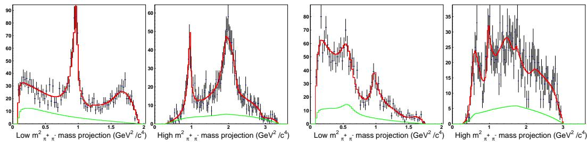
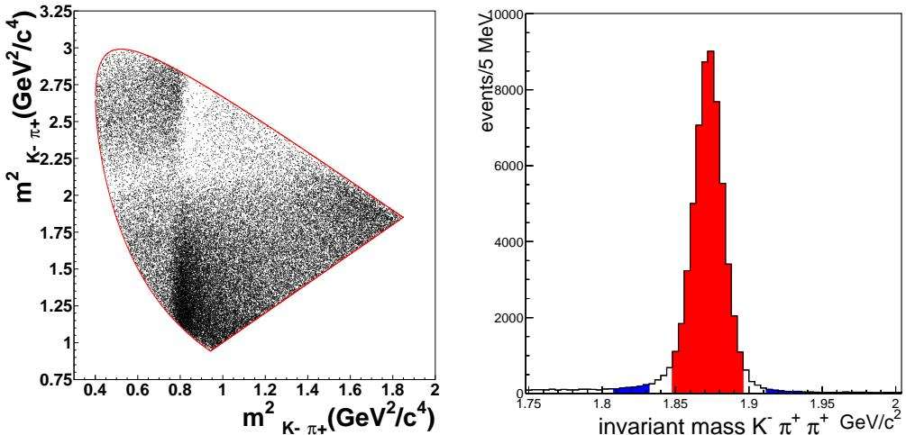
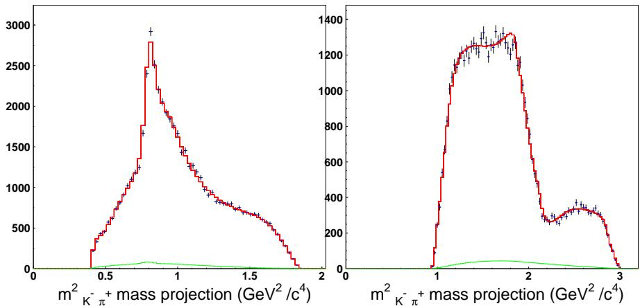
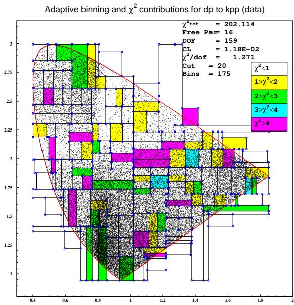
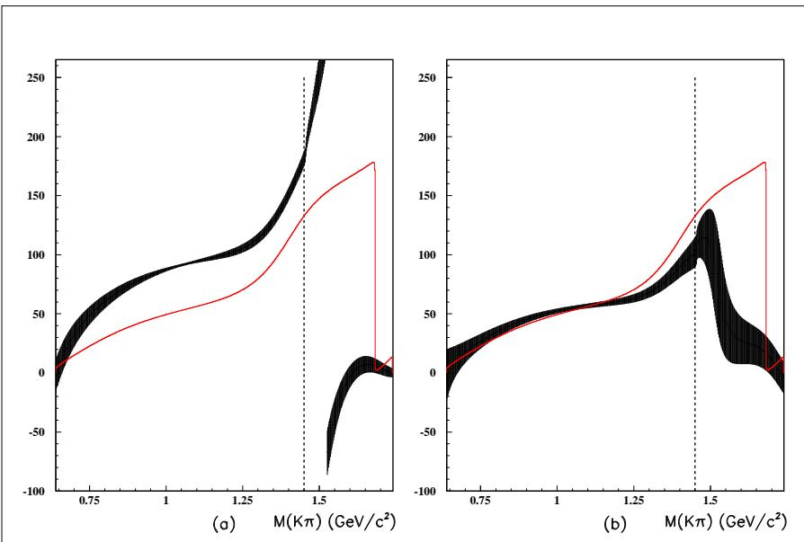
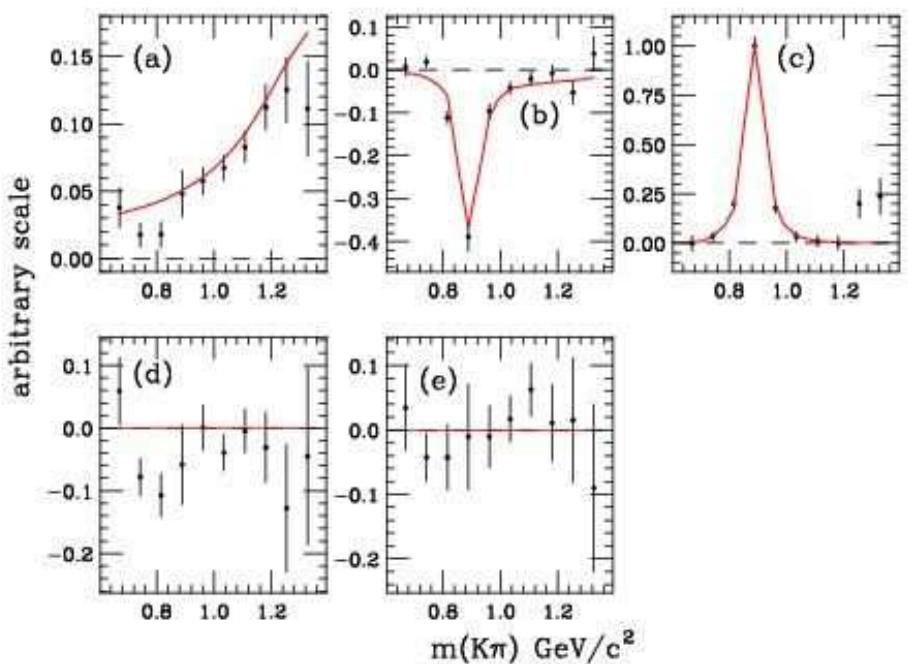

# HEAVY FLAVOR DECAYS AND LIGHTHADRONS IN THE FOCUS EXPERIMENT:RECENT RESULTS

Sandra Malvezzi1

INFN Sezione di Milano Bicocca,P.za della Scienza 3, 20126 Milano Italy

Abstract. Interpretation of $D$ -meson decay-dynamics has revealed itself to be strongly dependent on our understanding of the light-meson sector. The interplay becomes particularly evident in Dalitz plot analyses to study physics within and beyond the Standard Model. Experience and results from FOCUS are presented and discussed. A brief update of the pentaquark search in the experiment is also reported.

Keywords: Charm meson decays, Dalitz plot analysis PACS: 13.25.Ft,13.30.Eg,11.80.Gw

# INTRODUCTION

Dalitz analyses are largely applied in modern high-energy experiments to study Heavy Flavor hadronic decays, but also to perform precise measurements of the CKM matrix elements and search for new physics. Paradigmatic examples are $B \to \rho \pi$ and $B $ $D ^ { ( * ) } K ^ { ( * ) }$ for the extraction of the $\alpha$ and $\gamma$ angles of the Unitarity Triangle. The extraction of $\alpha$ in $B \to \rho \pi$ requires filtering the desired intermediate states among all the possible $( \pi \pi ) \pi$ combinations, e.g. $\sigma \pi$ , $f _ { 0 } ( 9 8 0 ) \pi$ etc. The extraction of $\gamma$ in $B \to \bar { D } ^ { ( * ) } K ^ { ( * ) }$ requires, in turn, modeling the $D$ amplitudes. The $\pi \pi$ and $K \pi$ S-wave are characterized by broad, overlapping states: unitarity is not explicitly guaranteed by a simple sum of Breit–Wigner functions. In addition, independently of the nature of the $\sigma$ , it is not a simple Breit–Wigner. The $f _ { 0 } ( 9 8 0 )$ is a Flatté-like function, and its lineshape parametrization needs precise determination of $K K$ and $\pi \pi$ couplings. Recent analyses of CP violation in the $B  D K$ channel from the beauty factories needed two ad hoc resonances to reproduce the excess of events in the $\pi \pi$ spectrum, one at the low-mass threshold, the other at $1 . 1 \mathrm { G e V } ^ { 2 }$ [1, 2]. This procedure of “effectively” fitting data invites a word of caution on estimating the systematics of these measurements. A question then naturally arises: in the era of precise measurements, do we know sufficiently well how to deal with strong-dynamics effects in the analyses? We have faced parametrization problems in FOCUS and learnt that many difficulties are already known and studied in different fields, such as nuclear and intermediate-energy physics, where broad, multichannel, overlapping resonances are treated in the $K \cdot$ -matrix formalism [3, 4, 5]. The effort we have made consisted mainly in building a bridge of knowledge and language to reach the high-energy community; our pioneering work in the charm sector might inspire future accurate studies in the beauty sector. FOCUS Dalitz plot analyses of the $D \mathrm { + } , D _ { s }  \pi ^ { + } \pi ^ { - } \pi ^ { + }$ and of the $D ^ { + } \to K ^ { - } \pi ^ { + } \pi ^ { + }$ will be discussed.

The collaboration has also taken a complementary non-parametric approach to measuring the $K ^ { - } \pi ^ { + }$ amplitude in the $D ^ { + } \to K ^ { - } K ^ { + } \pi ^ { + }$ decay using a projective weighting technique. Results will be presented.

# THE $D ^ { + }$ AND $D _ { s } \to \pi ^ { + } \pi ^ { - } \pi ^ { + }$ AMPLITUDE ANALYSIS

The FOCUS collaboration has implemented the $K \cdot$ -matrix approach in the $D _ { s }$ and $D ^ { + } $ $\pi ^ { + } \pi ^ { - } \pi ^ { + }$ analyses. Results and details can be found in [6]. It was the first application of this formalism in the charm sector. In this model [5], the production process, i.e, the D decay, can be viewed as consisting of an initial preparation of states, described by the $P$ -vector, which then propagates according to $( I - i K \rho ) ^ { - 1 }$ into the final one. The $K$ -matrix here is the scattering matrix and is used as fixed input in our analysis. Its form was inferred by the global fit to a rich set of data performed in [7]. It is interesting to note that this formalism, beside restoring the proper dynamical features of the resonances, allows for the inclusion in $D$ decays of the knowledge coming from scattering experiments, i.e, an enormous amount of results and science. No re-tuning of the $K$ -matrix parameters was needed. The confidence levels of the final fits are $3 . 0 \%$ and $7 . 7 \%$ for the $D _ { s }$ and $D ^ { + }$ respectively. The results were extremely encouraging since the same $K$ -matrix description gave a coherent picture of both two-body scattering measurements in light-quark experiments as well as charm-meson decay. This result was not obvious beforehand. Furthermore, the same model was able to reproduce features of the $D ^ { + } \to \pi ^ { + } \pi ^ { - } \pi ^ { + }$ Dalitz plot, shown in fig.1, that would otherwise require an ad hoc $\sigma$ resonance. The better treatment of the $S \mathrm { \cdot }$ -wave contribution provided by the $K \cdot$ -matrix model was able reproduce the low-mass $\pi ^ { + } \pi ^ { - }$ structure of the $D ^ { + }$ Dalitz plot. This suggests that any $\sigma$ -like object in the $D$ decay should be consistent with the same $\sigma$ -like object measured in $\pi ^ { + } \pi ^ { - }$ scattering.

  
FIGURE 1. FOCUS Dalitz-plot projections for $D _ { s }$ and $D ^ { + }$ to three pions with fit results superimposed. The background shape under the signal is also shown.

Further considerations and conclusions from the FOCUS three-pion analysis were limited by the sample statistics, i.e. $1 4 7 5 \pm 5 0$ and $1 5 2 7 \pm 5 1$ events for $D _ { s }$ and $D ^ { + }$ respectively.

We considered imperative to test the formalism at higher statistics. This was accomplished by the $D ^ { + } \to K ^ { - } \pi ^ { + } \pi ^ { + }$ analysis.

# THE $D ^ { + } \to K ^ { - } \pi ^ { + } \pi ^ { + }$ AMPLITUDE ANALYSIS

The recent FOCUS study of the $D ^ { + } \to K ^ { - } \pi ^ { + } \pi ^ { + }$ channel uses 53653 Dalitz-plot events with a signal fraction of $\sim 9 7 \%$ , and represents the highest statistics, most complete Dalitz plot published analysis for this channel. Invariant mass and Dalitz plots are shown in fig.2. Details of the analysis may be found in [8].

  
FIGURE 2. The $D ^ { + } \to K ^ { - } \pi ^ { + } \pi ^ { + }$ Dalitz plot (left) and mass distribution (right). Signal and sideband regions are indicated: sidebands are at $\pm ( 6 { - } 8 ) \sigma$ from the peak.

An additional complication in the $K \pi$ system comes from the presence in the Swave of the two isospin states, $I = 1 / 2$ and $I = 3 / 2$ . Although only the $I = 1 / 2$ is dominated by resonances, both isospin components are involved in the decay of the $D ^ { + }$ meson into $K ^ { - } \pi ^ { + } \pi ^ { + }$ . A model for the decay amplitudes of the two isospin states can be constructed from the $2 \times 2$ $K \cdot$ -matrix describing the $I = 1 / 2 S$ -wave scattering in $( K \pi ) _ { 1 }$ and $( K \eta ^ { \prime } ) _ { 2 }$ (with the subscripts 1 and 2, respectively, labelling these two channels), and the single-channel $K$ -matrix describing the $\bar { I } = { 3 / 2 } \ K ^ { - } \pi ^ { + }  K ^ { - } \pi ^ { + }$ scattering. The $K \cdot$ - matrix form we use as input describes the $S$ -wave $K ^ { - } \pi ^ { + }  K ^ { - } \pi ^ { + }$ scattering from the LASS experiment [9] for energy above $8 2 5 \mathrm { M e V }$ and $K ^ { - } \pi ^ { - }  K ^ { - } \pi ^ { - }$ scattering from Estabrooks et al. [10]. The $K$ -matrix form follows the extrapolation down to the $K \pi$ threshold for both $I = 1 / 2$ and $I = 3 / 2$ $S$ -wave components by the dispersive analysis by Büttiker et al. [11], consistent with Chiral Perturbation Theory [12]. The total $D$ - decay amplitude can be written as

$$
\mathcal { M } = { ( F _ { 1 / 2 } ) } _ { 1 } ( s ) + F _ { 3 / 2 } ( s ) + \sum _ { j } a _ { j } e ^ { i \delta _ { j } } B ( a b c | r ) ,
$$

where $s = M ^ { 2 } ( K \pi ) , \left( F _ { 1 / 2 } \right) _ { 1 }$ and $F _ { 3 / 2 }$ represent the $I { = } 1 / 2$ and $I { = } 3 / 2$ decay amplitudes in the $K \pi$ channel, $j$ runs over vector and spin-2 tensor resonances and $B ( a b c | r )$ are Breit–Wigner forms. The $J > 0$ resonances should, in principle, be treated in the same $K$ -matrix formalism. However, the contribution from the vector wave comes mainly from the $K ^ { * } ( 8 9 2 )$ state, which is well separated from the higher mass $K ^ { * } ( 1 4 1 0 )$ and $K ^ { * } ( 1 6 8 0 )$ , and the contribution from the spin-2 wave comes from $K _ { 2 } ^ { * } ( 1 4 3 0 )$ alone. Their contributions are limited to small percentages, and, as a first approximation, they can be reasonably described by a simple sum of Breit–Wigners. More precise results would require a better treatment of the overlapping $K ^ { * } ( 1 4 1 0 )$ and $K ^ { * } ( 1 6 8 0 )$ resonances as well. In accordance with SU(3) expectations, the coupling of the $K \pi$ system to $K \eta$ is supposed to be suppressed. Indeed we find little evidence that it is required. Thus the $F _ { 1 / 2 }$ form for the $K \pi$ channel is

$$
( F _ { 1 / 2 } ) _ { 1 } = ( I - i K _ { 1 / 2 } \rho ) _ { 1 j } ^ { - 1 } ( P _ { 1 / 2 } ) _ { j } ,
$$

where $I$ is the identity matrix, $K _ { 1 / 2 }$ is the $K$ -matrix for the $I = 1 / 2 S$ -wave scattering in $K \pi$ and $K \eta ^ { \prime } , \rho$ is the corresponding phase-space matrix for the two channels [4] and $( P _ { 1 / 2 } ) _ { j }$ is the production vector in the channel $j$ .

The form for $F _ { 3 / 2 }$ is

$$
F _ { 3 / 2 } = ( I - i K _ { 3 / 2 } \rho ) ^ { - 1 } P _ { 3 / 2 } ,
$$

where $K _ { 3 / 2 }$ is the single-channel scalar function describing the $I = 3 / 2 K ^ { - } \pi ^ { + }  K ^ { - } \pi ^ { + }$ scattering, and $P _ { 3 / 2 }$ is the production function into $K \pi$ .

The $P$ -vectors are in general complex reflecting the fact that the initial coupling $D ^ { + } \to ( K ^ { - } \pi ^ { + } ) \pi _ { s p e c t a t o r } ^ { + }$ need not be real. Their functional forms are:

$$
( P _ { 1 / 2 } ) _ { 1 } = \frac { \beta g _ { 1 } e ^ { i \theta } } { s _ { 1 } - s } + ( c _ { 1 0 } + c _ { 1 1 } \widehat { s } + c _ { 1 2 } \widehat { s } ^ { 2 } ) e ^ { i \gamma _ { 1 } }
$$

$$
( P _ { 1 / 2 } ) _ { 2 } = \frac { \beta g _ { 2 } e ^ { i \theta } } { s _ { 1 } - s } + ( c _ { 2 0 } + c _ { 2 1 } \widehat { s } + c _ { 2 2 } \widehat { s } ^ { 2 } ) e ^ { i \gamma _ { 2 } }
$$

$$
P _ { 3 / 2 } = \big ( c _ { 3 0 } + c _ { 3 1 } \widehat { s } + c _ { 3 2 } \widehat { s } ^ { 2 } \big ) e ^ { i \gamma _ { 3 } } .
$$

$\beta e ^ { i \theta }$ is the complex coupling to the pole in the ‘initial’ production process, $g _ { 1 }$ and $g _ { 2 } , \ s _ { 1 }$ and $s _ { 2 }$ are the $K$ -matrix couplings and poles. The polynomials are expanded about $\widehat { s } = s - s _ { c }$ , with $s _ { c } = 2 \mathrm { G e V } ^ { 2 }$ corresponding to the center of the Dalitz plot. The polynomial terms in each channel are chosen to have a common phase $\gamma _ { i }$ to limit the number of free parameters in the fit and avoid uncontrolled interference among the physical background terms. Coefficients and phases of the $P$ -vectors are the only free parameters of the fit determining the scalar components. $K \pi$ scattering determines the parameters of the $K$ -matrix elements and these are fixed inputs to this $D$ -decay analysis. Free parameters for vectors and tensors are amplitudes and phases ( $\left( { a _ { i } } \right)$ and $\delta _ { i }$ ). Table 1 reports our $K$ -matrix fit results. It shows that quadratic terms in $( P _ { 1 / 2 } ) _ { 1 }$ are significant in fitting data, while in both $( P _ { 1 / 2 } ) _ { 2 }$ and $P _ { 3 / 2 }$ constants are sufficient. The $J > 0$ states required by the fit are listed in table 2.

The $S \mathrm { \cdot }$ -wave component accounts for the dominant portion of the decay $( 8 3 . 2 3 \pm$ $1 . 5 0 ) \%$ . A significant fraction, $1 3 . 6 1 \pm 0 . 9 8 \%$ , comes, as expected, from $K ^ { * } ( 8 9 2 )$ ; smaller contributions come from two vectors $K ^ { * } ( 1 4 1 0 )$ and $K ^ { * } ( 1 6 8 0 )$ and from the tensor $K _ { 2 } ^ { * } ( 1 4 3 0 )$ . It is conventional to quote fit fractions for each component and this is what we do. Care should be taken in interpreting some of these since strong interference can occur. This is particularly apparent between contributions in the same-spin partial wave. While the total $S \mathrm { \cdot }$ -wave fraction is a sensitive measure of its contribution to the Dalitz plot, the separate fit fractions for $I = 1 / 2$ and $I = 3 / 2$ must be treated with care. The broad $I = 1 / 2$ $S$ -wave component inevitably interferes strongly with the slowly varying $I = 3 / 2$ $S$ -wave, as seen for instance in [13]. Fit results on the projections are shown in fig. 3.

TABLE 1. S-wave parameters from the $K$ -matrix fit to the FOCUS $D ^ { + } \to K ^ { - } \pi ^ { + } \pi ^ { + }$ data. The first error is statistic, the second error is systematic from the experiment, and the third is systematic induced by model input parameters for higher resonances. Coefficients are for the unnormalized S-wave.   

<table><tr><td>coefficient</td><td>phase (deg)</td></tr><tr><td>β = 3.389 ± 0.152 ± 0.002 ± 0.068 c10 = 1.655 ±0.156±0.010±0.101 c11 = 0.780 ± 0.096 ±0.003 ± 0.090 c12 = −0.954 ± 0.058 ± 0.0015 ± 0.025 c20 = 17.182 ± 1.036 ± 0.023 ± 0.362 c30 = 0.734 ± 0.080 ± 0.005 ± 0.030</td><td>θ = 286± 4 ±0.3 ±3.0 γ1 = 304 ± 6 ±0.4 ± 5.8 γ2 = 126 ±3 ±0.1 ± 1.2 γ3 = 211 ± 10 ± 0.7 ± 7.8</td></tr><tr><td>Total S-wave fit fraction = 83.23 ± 1.50 ± 0.04 ± 0.07 % Isospin 1/2 fraction = 207.25 ± 25.45 ± 1.81 ± 12.23 % Isospin 3/2 fraction = 40.50 ± 9.63 ± 0.55 ± 3.15 %</td><td></td></tr></table>

TABLE 2. Fit fractions, phases, and coefficients for the $J > 0$ components from the $K$ -matrix fit to the FOCUS $D ^ { + } \to K ^ { - } \pi ^ { + } \pi ^ { + }$ data. The first error is statistic, the second error is systematic from the experiment, and the third error is systematic induced by model input parameters for higher resonances.   

<table><tr><td>component</td><td>fit fraction (%)</td><td>phase δj (deg)</td><td>coefficient</td></tr><tr><td>K*(892)+</td><td>13.61 ± 0.98</td><td>0 (fixed)</td><td>1 (fixed)</td></tr><tr><td rowspan="2">K*(1680)π+</td><td>± 0.01 ± 0.30</td><td></td><td></td></tr><tr><td>1.90 ± 0.63</td><td>1±7</td><td>0.373 ± 0.067</td></tr><tr><td rowspan="2">K2 (1430)+</td><td>± 0.009 ± 0.43</td><td>±0.1±6</td><td>± 0.009 ±0.047</td></tr><tr><td>0.39 ± 0.09</td><td>296 ± 7</td><td>0.169±0.017</td></tr><tr><td rowspan="2">K*(1410)+</td><td>± 0.004 ± 0.05</td><td>± 0.3 ± 1</td><td>± 0.010 ±0.012</td></tr><tr><td>0.48±0.21 ± 0.012 ±0.17</td><td>293 ± 17 ± 0.4 ± 7</td><td>0.188±0.041 ± 0.002 ± 0.030</td></tr></table>

The fit $\chi ^ { 2 } / \mathrm { d . o . f }$ is 1.27 corresponding to a confidence level of $1 . 2 \%$ . Our adaptive binning scheme is shown is fig 4 If the $I = 3 / 2$ component is removed from the fit, the $\chi ^ { 2 } / \mathrm { d . o . f }$ worsens to 1.54, corresponding to a confidence level of $1 0 ^ { - 5 }$ .

These results can be compared with those obtained in the effective isobar model, consisting in a sum of Breit Wigners, which can serve as the standard for fit quality. Two ad hoc scalar resonances are required, of mass $8 5 6 \pm 1 7$ and $1 4 6 1 \pm 4$ and width $4 6 4 \pm 2 8$ and $1 7 7 \pm 8 \ \mathrm { M e V } / c ^ { 2 }$ respectively to reproduce the data and reach a $\chi ^ { 2 } / \mathrm { d . o . f }$ is 1.17, corresponding to a C.L of $6 . 8 \%$ . A detailed discussion of the results and the systematics can be found in [8]. A feature of the $K \cdot$ -matrix amplitude analysis is that it allows an indirect phase measurement of the separate isospin components: it is this phase variation with isospin $I = 1 / 2$ that should be compared with the same $I = 1 / 2$ LASS phase, extrapolated from $8 2 5 \mathrm { \ G e V }$ down to threshold according to Chiral Perturbation Theory. This is done in the right plot of fig. 5. In this model [5] the $P$ -vector allows for a phase variation accounting for the interaction with the third particle in the process of resonance formation. It so happens that the Dalitz fit gives a nearly constant production phase. The two phases in fig. 5b) have the same behaviour up to $\sim 1 . 1 \mathrm { G e V } .$ However, approaching $K \eta ^ { \prime }$ threshold, effects of inelasticity and differing final state interactions start to appear. The difference between the phases in fig. 5a) is due to the $I = 3 / 2$ component.

  
FIGURE 3. The Dalitz plot projections with the $K$ -matrix fit superimposed. The background shape under the signal is also shown.

  
FIGURE 4. The adaptive binning scheme.

  
FIGURE 5. Comparison between the LASS $I = 1 / 2$ phase $^ +$ ChPT (continous line) and the $F$ -vector phases (with $\pm 1 \sigma$ statical error bars); a) total $F$ -vector phase; b) $I = 1 / 2$ $F .$ -vector phase. The vertical dashed line shows the location of the $K \eta ^ { \prime }$ .

These results are consistent with $K \pi$ scattering data, and consequently with Watson’s theorem predictions for two-body $K \pi$ interactions in the low $K \pi$ mass region, up to $\sim 1 . 1$ GeV, where elastic processes dominate. This means that possible three-body interaction effects, not accounted for in the $K \cdot$ -matrix parametrization, play a marginal role. The $K \cdot$ - matrix form used in this analysis generates the $S$ -matrix pole ${ \cal E } = { \cal M } - i \Gamma / 2 = 1 . 4 0 8 -$ $i 0 . 1 1 0 \mathrm { \ G e V . }$ Any more distant pole than $K _ { 0 } ^ { * } ( 1 4 3 0 )$ is not reliably determined as this simple $K \cdot$ -matrix expression does not have the required analyticity properties. However, our $K$ -matrix representation fits along the real energy axis inputs on scattering data and Chiral Perturbation Theory in close agreement with those used in [14], which locates the $\kappa$ with a mass of $( 6 5 8 \pm 1 3 )$ MeV and a width of $( 5 5 7 \pm 2 4 )$ MeV by careful continuation. These pole parameters are quite different from those implied by the simple isobar fits. We have thus shown that whatever $\kappa$ is revealed by our $D ^ { + } \to K ^ { - } \pi ^ { + } \pi ^ { + }$ results, it is the same as that found in scattering data.

# A NON-PARAMETRIC APPROACH TO DETERMINE THE $K ^ { - } \pi ^ { + }$ AMPLITUDE IN $D ^ { + } \to K ^ { - } K ^ { + } \pi ^ { + }$ DECAY

While making the effort of refining the amplitude formalism, FOCUS identified the $D ^ { + } \to K ^ { - } K ^ { + } \bar { \pi } ^ { + }$ as an ideal case to apply the projective weighting technique developed in the semi-leptonic sector [15] to the hadronic decays, with no need to assume specific Breit-Wigner resonances, forms for mass dependent widths, hadronic form factors or Zemach momentum factors. Details can be found in [16]. The old E687 Dalitz plot analysis [17] concluded that the observed $D ^ { + } \to K ^ { - } K ^ { + } \pi ^ { + }$ Dalitz plot could be adequately described by just three resonant contributions: $\phi \pi ^ { + } , K ^ { + } \bar { K } ^ { * } ( 8 9 2 )$ and $K ^ { + } \bar { K } ^ { * } { } _ { 0 } \big ( 1 4 3 \bar { 0 } \big )$ . Although $\phi \pi ^ { + }$ is an important contribution, the $\phi$ is a very narrow resonance that can be substantially removed through a cut on $m _ { K ^ { + } K ^ { - } }$ , i.e $m _ { K ^ { + } K ^ { - } } ^ { \bullet } > 1 0 5 0 \mathrm { M e V / c } ^ { 2 }$ . Since there is no overlap of the $\phi$ band with the ${ \bar { K } } ^ { * }$ and most of the kinematically allowed $\bar { K } ^ { * } { } _ { 0 } \big ( 1 4 3 0 \big )$ region, there is a relatively small loss of information from the anti- $\phi$ cut; of course careful systematic evaluation for residual $K ^ { + } K ^ { - }$ contributions and bias are performed. In the absence of the $K ^ { - } K ^ { + }$ resonances, we can write the decay amplitude in terms of $m _ { K ^ { - } \pi ^ { + } } = m$ and the helicity decay angle $\theta$ Thus

$$
A = \sum _ { l } ^ { s , p . d . . . } A _ { l } ( m ) d _ { 0 0 } ^ { l } ( \cos \theta ) ,
$$

where $d _ { 0 0 } ^ { l } ( c o s \theta )$ are the Wigner d-matrices describing the amplitude for a $K ^ { - } \pi ^ { + }$ system of angular momentum $l$ to simultaneously have 0 angular momentum along its helicity axis and the $K ^ { - } \pi ^ { + }$ decay axis. This technique is an intrinsically one-dimensional analysis. The decay intensity assuming, for simplicity, that only S and $\mathrm { P }$ -waves are present, is

$$
\begin{array} { r } { | A | ^ { 2 } = | S ( m ) + P ( m ) \cos \theta | ^ { 2 } = | S ( m ) | ^ { 2 } + 2 \mathrm { R e } \{ S ^ { \ast } ( m ) P ( m ) \} \cos \theta + | P ( m ) | ^ { 2 } \cos ^ { 2 } \theta , } \end{array}
$$

The approach is to divide cos $\theta$ into twenty evenly spaced angular bins. Let

$$
\vec { D } = ( ^ { i } n _ { 1 } , ^ { i } n _ { 2 } . . . ^ { i } n _ { 2 0 } )
$$

be a vector whose 20 components give the population in data for each of the $2 0 \cos \theta$ bins. Here $i$ specifies the $i ^ { t h } m _ { K ^ { - } \pi ^ { + } }$ bin. Our goal is to represent the $\vec { D }$ vector in eq. 9 as a sum over the expected populations for each of the three partial waves. For this simplified case there are three such vectors computed for each $m _ { K ^ { - } \pi ^ { + } }$ bin, $\{ { ^ { i } \vec { m } _ { \alpha } } \} =$ $( { } ^ { i } \overrightarrow { m } _ { S S } ^ { \bullet } , { } ^ { i } \overrightarrow { m } _ { S P } , { } ^ { i } \overrightarrow { m } _ { P P } )$ .

Each $i \overrightarrow { m } \alpha$ is generated using a phase-space and full detector simulation for $D ^ { + } $ $K ^ { - } K ^ { + } \pi ^ { + }$ decay with one amplitude turned on, and all the others turned off. We then use a weighting technique to fit the bin populations in the data to the form $i \overrightarrow { D } =$ $F _ { S S } ( m _ { i } ) ^ { i } \overrightarrow { m } _ { S S } + \overrightarrow { F } _ { S P } ( m _ { i } ) ^ { i } \overrightarrow { m } _ { S P } + F _ { P P } ( m _ { i } ) ^ { i } \overrightarrow { m } _ { P P }$ . When including the D-wave as well, the results appear just as five weighted histograms in the $m _ { K ^ { - } \pi ^ { + } }$ mass, as in fig. 6, for the five independent amplitude contributions.

The curves in fig. 6 are the model used in E687 but with a $\bar { K } ^ { * } { } _ { 0 } \big ( 1 4 3 0 \big )$ ad hoc arranged to fit the data, i.e represented as a Breit Wigner with a pole at $\scriptstyle { \dot { m } } _ { 0 } = 1 4 1 2 { \mathrm { ~ M e V } } / c ^ { 2 }$ and a width of $\Gamma = \dot { 5 } 0 0 ~ \mathrm { M e V } / c ^ { 2 }$ , not consistent with the standard PDG $\bar { K } ^ { * } { } _ { 0 } \big ( 1 4 3 0 \big )$ parametrization used by E687. This analysis reveals once more, how subtle the inclusion of the broad S-wave resonances in charm Dalitz analysis can be. Although the $D ^ { + } $ $K ^ { - } K ^ { + } \pi ^ { + }$ is an ideal case, it might be possible to extend the analysis to the $D _ { s } $ $K ^ { - } K ^ { + } \pi ^ { + }$ decay, as well as $D ^ { 0 } \stackrel { - } { \to } K ^ { + } K ^ { - } \bar { K } ^ { 0 }$ and hadronic four body decays such as $D ^ { 0 }  K ^ { - } K ^ { + } \pi ^ { + } \pi ^ { - }  \phi \pi ^ { + } \pi ^ { - }$ .

  
FIGURE 6. This figure compares the five projected amplitudes obtained according to their angular dependence (error bars) with the E687 model properly corrected, as explained in the text, to match the data (red curves). The plots are: a) $S ^ { 2 }$ direct term, b) $2 \ : \mathrm { S } \times \mathrm { P }$ interference term, c) $\mathrm { P } ^ { 2 }$ direct term, d)2 $\mathbf { P } { \times } \mathbf { D }$ interference term and e) $\mathrm { D } ^ { 2 }$ direct term.

# SEARCH FOR PENTAQUARK CANDIDATES

The FOCUS collaboration searched for the charmed $\Theta _ { c } ^ { 0 } ( \bar { c } u u d d )$ pentaquark candidate in the decay modes $\Theta _ { c } ^ { 0 } \to D ^ { * - } p$ and $\Theta _ { c } ^ { 0 } \to D ^ { - } p$ [18]. No evidence for a pentaquark at 3.1 $\mathrm { G e V } / c ^ { 2 }$ or at any mass less than $4 \mathrm { G e V } / c ^ { 2 }$ was observed. More recently the search was extended to two other candidates: $\Theta ^ { + } ( \bar { s } u u d d ) \to p K _ { s } ^ { 0 }$ [19] and $\phi ^ { -- } ( 1 8 6 0 ) ( s s d d u ) $ $\Xi ^ { - } \pi ^ { - }$ [20]. Having found no evidence, limits were calculated. The $\Theta ^ { + }$ production cross section was normalized to $\Sigma ^ { * } ( 1 3 8 5 ) ^ { \pm }$ and $K ^ { * } ( 8 9 2 ) ^ { + }$ because the reconstructed decay modes of the particles $\Sigma ^ { * } ( 1 3 8 5 ) ^ { \pm }  \Lambda ^ { 0 } \pi ^ { \pm }$ and $\Dot { K ^ { * } } ( 8 9 2 ) ^ { + } \to K _ { S } ^ { 0 } \pi ^ { + }$ are very similar, in terms of topology and energy release, to the signal. The $9 5 \ \%$ C.L upper limits of $\frac { \sigma ( \Theta ^ { + } ) { \cdot } B R ( \Theta ^ { + } \to p K _ { S } ^ { 0 } ) } { \sigma ( K ^ { * } ( 8 9 2 ) ^ { + } ) } < 0 . 0 0 0 1 2 ( 0 . 0 0 0 2 9 )$ and $\frac { \sigma ( \Theta ^ { + } ) { \cdot } B R ( \Theta ^ { + } \to p K _ { S } ^ { 0 } ) } { \sigma ( \Sigma ^ { * } ( 1 3 8 5 ) ^ { \pm } ) } < 0 . 0 0 4 2$ (0.0099) were estimated for a natural width of 0 and $1 5 \ \mathrm { M e V } / c ^ { 2 }$ in the good acceptance region of the detector , i.e. for parent particles with momenta above $2 5 \mathrm { \ G e V / c }$ . Analogously the upper limit was calculated for the $\Xi _ { 5 } ^ { -- } ( \phi ^ { -- } ( 1 8 6 0 ) )$ candidate with respect to the $\Xi ^ { * } ( 1 5 3 0 ) ^ { 0 } \to \Xi ^ { - } \pi ^ { + }$ obtaining $\frac { \sigma ( \Xi _ { 5 } ^ { -- } ) { \cdot } B R ( \Xi _ { 5 } ^ { -- } \to \Xi ^ { - } \pi ^ { - } ) } { \sigma ( \Xi ^ { * } ( 1 5 3 0 ) ^ { 0 } } < 0 . 0 0 7$ (0.019) for a natural width of 0 (15) $\mathbf { M e V } / c ^ { 2 }$ .

# CONCLUSIONS

Dalitz-plot analysis represents a unique, powerful and promising tool for physics studies within and beyond the Standard Model; however to perform such sophisticate analyses, we need to model the strong interaction effects. FOCUS has performed pilot studies in the charm sector through the $K \cdot$ -matrix formalism and has started an effort to identify channels where non-parametric approaches can be undertaken. What has been learnt from charm will be beneficial for future accurate beauty measurements.

# REFERENCES

1. B. Aubert et al.,Phys. Rev. Lett. 95, 121802 (2005).   
2. A. Poluektov et al., Phys. Rev.D73, 112009 (2006) .   
3. E. P. Wigner, Phys. Rev.70, 15 (1946).   
4. S. U. Chung et al., Annalen Phys.4, 404 (1995).   
5. I. J. R. Aitchison, Nucl. Phys. A189, 417 (1972) .   
6. J. M. Link et al., Phys. Lett. B585, 200 (2004).   
7. V. V. Anisovich and A. V. Sarantsev, Eur. Phys. J A16, 229 (2003).   
8. J. M. Link et al., Phys. Lett. B653, 1 (2007).   
9. D. Aston et al., Nucl. Phys. B296, 493 (1988).   
10. P. Estabrooks et al., Nucl. Phys. B133, 490 (1978).   
11. P. Büttiker, S. Descotes-Genon and B. Moussallam, Nucl. Phys. Proc. Suppl. 133 (2004) 223; Eur.   
Phys. J. C33, 409 (2004).   
12. V. Bernard, N. Kaiser and U. G. Meißner, Phys. Rev. D43, 2757 (1991); Nucl. Phys. B357, 129   
(1991).   
13. L. Edera, M. R. Pennington, Phys. Lett. B623, 55 (2005).   
14. S. Descotes-Genon and B. Moussallam, Eur. Phys. J. C48, 553 (2006).   
15. J. M. Link et al., Phys. Lett.B633, 183 (2006).   
16. J. M. Link et al., Phys. Lett. B648, 156 (2007).   
17. P. L. Frabettiet al., Phys. Lett. B351, 591 (2007).   
18. J. M. Link et al., Phys. Lett. B622, 229 (2005).   
19. J. M. Link et al., Phys. Lett. B639, 604 (2007).   
20. J. M. Link et al. , Phys. Lett. B661, 14 (2008).