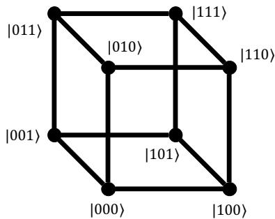
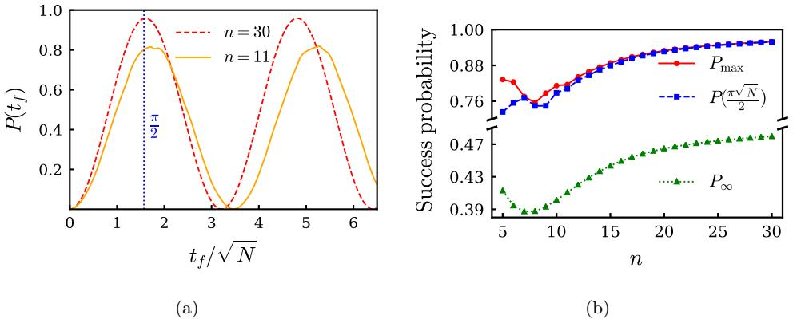
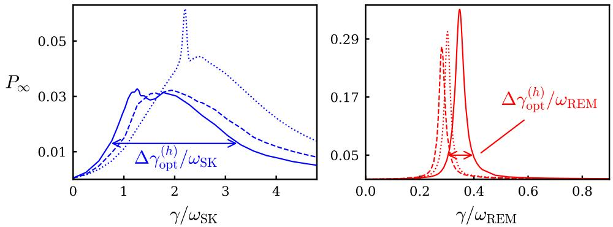
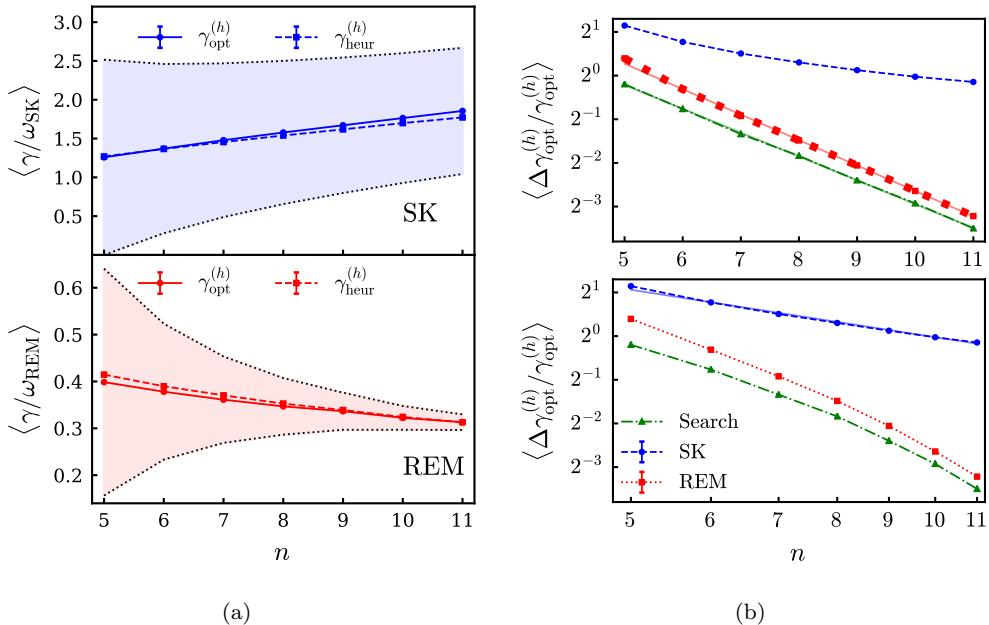
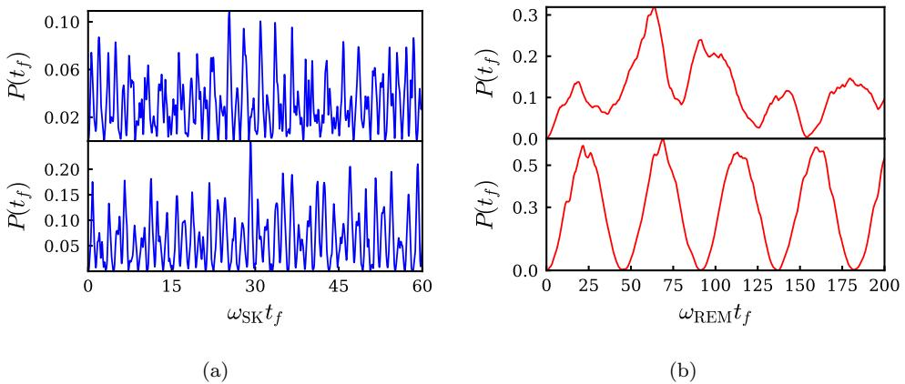
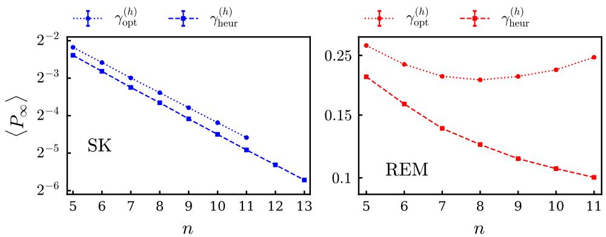
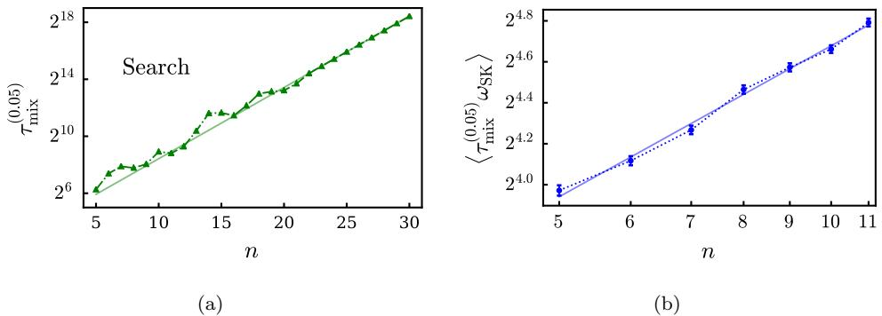
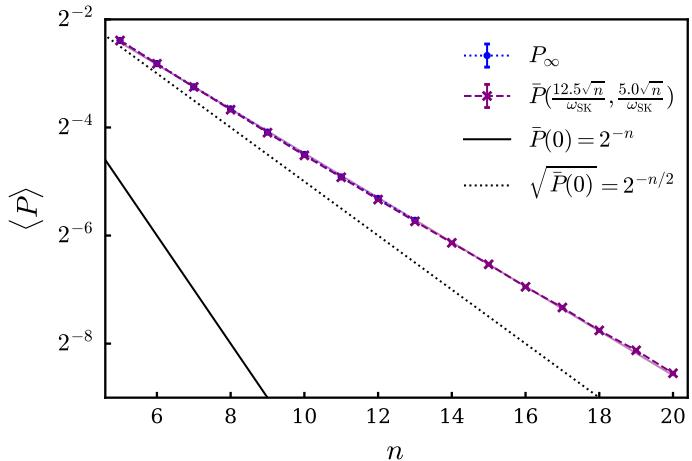
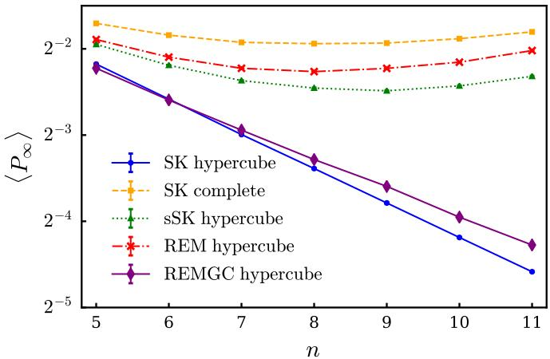
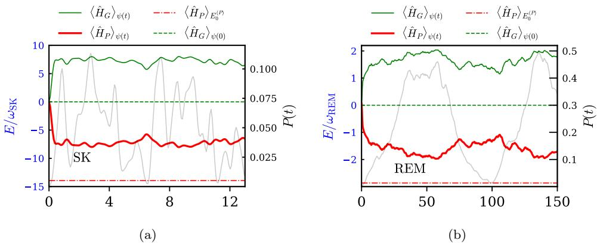

# Finding spin glass ground states using quantum walks

Adam Callison1, Nicholas Chancellor $^ 2$ , Florian Mintert $\bot$ and Viv Kendon2

1 Blackett Laboratory, Imperial College London, London SW7 2BW, UK   
2 Physics Department, Durham University, South Road, Durham, DH1 3LE, UK

E-mail: viv.kendon@durham.ac.uk, a.callison16@ic.ac.uk

Abstract. Quantum computation using continuous-time evolution under a natural hardware Hamiltonian is a promising near- and mid-term direction toward powerful quantum computing hardware. We investigate the performance of continuous-time quantum walks as a tool for finding spin glass ground states, a problem that serves as a useful model for realistic optimization problems. By performing detailed numerics, we uncover significant ways in which solving spin glass problems differs from applying quantum walks to the search problem. Importantly, unlike for the search problem, parameters such as the hopping rate of the quantum walk do not need to be set precisely for the spin glass ground state problem. Heuristic values of the hopping rate determined from the energy scales in the problem Hamiltonian are sufficient for obtaining a better quantum advantage than for search. We uncover two general mechanisms that provide the quantum advantage: matching the driver Hamiltonian to the encoding in the problem Hamiltonian, and an energy redistribution principle that ensures a quantum walk will find a lower energy state in a short timescale. This makes it practical to use quantum walks for solving hard problems, and opens the door for a range of applications on suitable quantum hardware.

Keywords: quantum computing, quantum walks, spin glasses

Quantum walk spin glass ground states 2

Contents

1 Introduction 2

# 2 Computing with quantum walks 5

2.1 Continuous-time quantum walks 5   
2.2 Computing using a quantum walk 6   
2.3 Graph choice for quantum walk computing 7   
2.4 Solving the search problem using quantum walks . 8

# 3 Spin glass problem definitions 10

3.1 Sherrington-Kirkpatrick spin glass 1112   
3.2 Random energy model . .

# 4 Numerical methods 12

# 5 Quantum walks with spin glasses 13

5.1 Setting the hopping rate 13   
5.2 Success probability 16   
5.3 Mixing times 19

# 6 Computational mechanisms 21

6.1 Role of correlations in SK 21   
6.2 Energy conservation dynamics . . 23

7 Summary and outlook 24

# 1. Introduction

Optimization problems need to be solved in a broad range of areas, such as scheduling, route planning, supply chains, finance. This is often computationally intensive, so the prospect of quantum enhanced solution methods is an important research direction for practical quantum computing. One way to tackle optimization in a quantum setting is to use a device which realises an Ising Hamiltonian with a transverse field. Computing using the Ising Hamiltonian works as follows: The optimization problem is encoded into the Ising Hamiltonian $\hat { H } _ { I }$

$$
\hat { H } _ { I } = - \sum _ { ( j \neq k ) = 0 } ^ { n - 1 } J _ { j k } \hat { Z } _ { j } \hat { Z } _ { k } - \sum _ { j = 0 } ^ { n - 1 } h _ { j } \hat { Z } _ { j } ,
$$

on $n$ qubits, such that the solution corresponds to the ground state of $\hat { H } _ { I }$ . In our notation, the operator $\hat { Z } _ { j }$ on the full Hilbert space applies the single qubit Pauli- $Z$ operator $\hat { Z }$ to the $j$ th qubit,

$$
\hat { Z } _ { j } = \left( \bigotimes _ { r = 0 } ^ { j - 1 } \hat { \mathbb { 1 } } _ { 2 } \right) \otimes \hat { Z } \otimes \left( \bigotimes _ { r = j + 1 } ^ { n - 1 } \hat { \mathbb { 1 } } _ { 2 } \right) ,
$$

where $\hat { \mathbb { 1 } } _ { 2 }$ is the identity operator on a single qubit. The (real) values of the coupling strengths $J _ { j k }$ and fields $h _ { j }$ define the optimization problem, and efficient methods

are known for expressing optimization problems in terms of these coupling and field strengths (e.g., Choi, 2010). The transverse field term $\hat { H } _ { T }$

$$
{ \hat { H } } _ { T } = - \Gamma \sum _ { j = 0 } ^ { n - 1 } { \hat { X } } _ { j } ,
$$

drives transitions between states, where $\Gamma$ is a real-valued transverse field strength, and $\hat { X _ { j } }$ is the operator on the full Hilbert space that applies the single qubit Pauli- $X$ operator to the $j$ th qubit, defined by analogy with $\hat { Z } _ { j }$ in (2). The qubits are initialised in the ground state of $\hat { H } _ { T }$ , this is easy to do by applying a strong transverse field to align all the qubits in the state $| + \rangle = 2 ^ { - 1 / 2 } ( | 0 \rangle + | 1 \rangle )$ . Then, the computation is carried out by applying the full transverse Ising Hamiltonian

$$
\hat { H } _ { \mathrm { T I } } ( t ) = A ( t ) \hat { H } _ { T } + B ( t ) \hat { H } _ { I } ,
$$

where $t$ is time and $A ( t )$ , $B ( t )$ are real-valued control functions. To obtain a candidate solution to the optimization problem, the qubit register is measured after a time $t _ { f }$ . For some problems, sampling from the distribution of low energy states provides the required solution – this can be done by repeating the computation, which will in general not produce the lowest energy state with certainty.

The Ising Hamiltonian is a natural choice for encoding problems for two reasons. First, it is proven to be universal for classical problems (De las Cuevas and Cubitt, 2016). There are efficient methods for mapping NP-hard optimization problems to the Ising model (Lucas, 2014; Choi, 2010), providing a practical route to quantum algorithms. Since many optimization problems are NP-hard, an exponential speed up is not expected, but even modest polynomial improvements are useful for practical applications. There is increasing interest in how to obtain polynomial advantages through quantum algorithms (Moylett et al., 2017; Montanaro, 2018; Ambainis et al., 2019). Interesting results have been presented for a wide range of applications, such as mathematics (Bian et al., 2013; Li et al., 2017), computer science (Chancellor et al., 2016), computational biology (Perdomo-Ortiz et al., 2012), finance (Marzec, 2016), and aerospace (Coxson et al., 2014). Second, the Ising Hamiltonian can be implemented in a range of different physical systems. The quantum Ising Hamiltonian is the basic interaction Hamiltonian in the D-Wave Systems Inc. programmable superconducting devices (D-Wave, 1999–; Boixo et al., 2013; Johnson et al., 2011). Implementations in other promising architectures include Rydberg systems (Bernien et al., 2017) and trapped ions (Kim et al., 2011). The Ising Hamiltonian is also the basic tool for specialised optimization hardware, such as coherent Ising machines (Inagaki et al., 2016; McMahon et al., 2016). Optimization using the Ising Hamiltonian can be implemented in digital quantum architectures by using the quantum approximate optimization algorithm (QAOA) (Farhi et al., 2014a,b; Marsh and Wang, 2019) or quantum alternating operator ansatz (Hadfield et al., 2019). Studies by Zhou et al. (2018) show how to exploit non-adiabatic effects in QAOA on early quantum hardware.

There are several known methods for driving the quantum system from its initial state into the ground state of a Hamiltonian defining the problem to be solved. These methods correspond to different choices for the control functions $A ( t )$ and $B ( t )$ in (4). Adiabatic quantum computing (Kadowaki and Nishimori, 1998; Farhi et al., 2000, 2001) keeps the quantum system in the ground state while the initial Hamiltonian is slowly changed into the problem Hamiltonian. Quantum annealing (Finnila et al., 1994) takes advantage of open quantum systems effects to cool the system towards the ground state. Continuous-time quantum walks evolve the system under a timeindependent Hamiltonian for a suitable time before measurement of the final state. Computation by continuous-time quantum walk and adiabatic quantum computing are end points of a family of continuous-time protocols that use the same Hamiltonian terms but are applied with different time dependent modulation (Morley et al., 2019). In this work, we focus on computation by quantum walk using time-independent transverse Ising Hamiltonians.

Quantum walks can solve the search problem (Childs and Goldstone, 2004), achieving the same quadratic $O ( N ^ { 1 / 2 } )$ quantum speed up as is obtained by Grover’s algorithm (Grover, 1996). We describe the search problem further in Subsection 2.4. For particular graphs, quantum walks can solve problems exponentially faster (e.g., Childs et al., 2003), and quantum walks are now widely used as subroutines in more complex quantum algorithms. However, in the continuous-time setting, the application of quantum walks to optimization problems has not been studied in detail. There is increasing interest in quenches (Amin et al., 2018) or pauses (Marshall et al., 2019; Passarelli et al., 2019) in quantum annealing, which effectively run an open-system version of a quantum walk during part of the computation. Thermal relaxation effects dominate in the regime currently accessible by flux qubit quantum annealers, which is the focus of these works. An algorithm which is essentially a quantum walk on a spin glass, although presented using different terminology, has been analysed by Hastings (2019). Along with the same energy conservation arguments we describe in section 6.2, Hastings’ findings suggest that quantum walks on spin glasses will be interesting to explore. Given that quantum walks provide a better performance for searching than adiabatic quantum computing, especially when limited coherence time and other practical factors, such as precision of control settings, are considered (Morley et al., 2019), it is important to understand how they perform for a wider range of problems.

In this work, we tackle the question of if, and how, a quantum walk can be useful for practical quantum optimization. We present a detailed numerical investigation of continuous-time quantum walks applied to solving combinatorial optimization problems, using the Sherrington-Kirkpatrick spin glass ground state problem as a prototypical example. Finding the ground state of a frustrated Sherrington-Kirkpatrick spin glass (Sherrington and Kirkpatrick, 1975) is known to be not only NP-hard, but also uniformly-hard, as suggested by its finite-temperature spin glass transition. Without a finite temperature spin glass transition, a problem cannot be uniformly hard, since the lack of a transition implies that typical cases will be easy for the Monte Carlo family of algorithms, as discussed in (Katzgraber et al., 2014). As has been shown for a random problem type used in early benchmarks of quantum annealing hardware (Katzgraber et al., 2014), uniform hardness is crucial: without this property, randomly generated instances of NP-hard problems are not necessarily hard to solve (Beier and V¨ocking, 2004; Krivelevich and Vilenchik, 2006; Lucas, 2014).

We use a random energy model (Derrida, 1980) for comparisons, to draw out the effects of the correlations between energy difference and Hamming distance in the spin glass. A problem with perfect correlations is easy to solve, like finding the ground state of a spin system with only local fields, no couplings. A completely random problem, such as finding the ground state of a random energy model instance, has no correlation to exploit and so is very hard to solve, essentially requiring random guessing. However, a completely random model is fully characterised by average values of its properties, and finding exact ground states of specific instances is typically not interesting. Intermediate problems with some correlations are both hard and interesting, with complex behaviour and phase diagrams, like spin models with frustration and spin glass phases. Real optimization problems typically have correlations; they are often hard to solve but also produce interesting solutions. The inherent complexity of a problem comes from the structures of the problem and its correlations, not the structure of the solution itself. One illustration of this is the construction of hard benchmarking problems with ‘planted’ solutions defined at the time of construction, which therefore have no special structure related to the problem’s hardness, see for example (Hen, 2019; Hamze et al., 2019).

The paper is structured as follows: In section 2, we review the setting for computation by continuous-time quantum walk encoded into qubits, including application to the search problem. In section 3, we introduce the Sherrington-Kirkpatrick spin glass model, and the random energy model we use for comparison. In section 4, we describe the numerical methods used in this investigation. In section 5, we present the main results showing how quantum walks can find spin glass ground states more effectively than a quantum search algorithm. In section 6, we identify the computational mechanisms and important aspects of the problem structure that contribute to the effectiveness of quantum walk computation. Finally, in section 7, we summarize and conclude.

# 2. Computing with quantum walks

Both discrete (coined) quantum walks (Aharonov et al., 2001; Shenvi et al., 2003) and continuous-time quantum walks (Farhi and Gutmann, 1998; Childs et al., 2003) are used for computation. This work only uses the continuous-time quantum walk, and also only as an encoded quantum walk, in which qubits are used to store the binary labels of the positions of the quantum walker (see figure 1 for a simple example).

# 2.1. Continuous-time quantum walks

A continuous-time quantum walk is defined on an undirected graph $G ( V , E )$ , with V = {j}N−1j=0 the set of $N$ vertex labels and $E$ the set of label-pairs $( j , k )$ associated with edges. The vertices correspond to the positions of the walker, and the edges indicate the allowed transitions between vertices. This is conveniently encoded in the adjacency matrix $A$ of the graph, which has entries $A _ { j k } = 1$ for $( j , k ) \in E$ and $A _ { j k } = 0$ otherwise. The Laplacian of $G$ is $L = A - D$ , where $D$ is a diagonal matrix formed from the degree of each vertex, $D _ { j j } = \deg ( j )$ , where $\deg ( j )$ is the number of edges connected to vertex $j$ . Both the adjacency matrix $A$ and Laplacian $L$ are symmetric matrices which can thus be used to define a quantum Hamiltonian for the dynamics of the continuous-time quantum walk on the graph. In this work, we only need regular graphs, for which $\deg ( j )$ is constant with respect to $j$ . For regular graphs, the only difference between using the adjacency matrix $A$ or Laplacian $L$ is an irrelevant global phase (Childs and Goldstone, 2004). We use the Laplacian form of the Hamiltonian for consistency with prior work. We thus define the quantum walk Hamiltonian $\hat { H } _ { G }$ for a quantum walk on graph $G$ by

$$
\left. j \right| \hat { H } _ { G } \left| k \right. = - \gamma L _ { j k } ,
$$

where $\gamma$ is the hopping rate between connected vertices per unit time. The states $| j \rangle , | k \rangle$ for $j , k \in V$ are associated with the vertices of $G$ and form a basis for a Hilbert space of dimension $N$ . In the Ising model context, the dimension of the Hilbert space

$N = 2 ^ { n }$ where ntum w $n$ is the number of qk starting in state and , the $\{ | j \rangle \} _ { j = 0 } ^ { N - 1 }$ is the computational basis. he walker evolves according $| \psi ( 0 ) \rangle$   
to the Schr¨odinger equation, with formal solution

$$
\left. \psi ( t ) \right. = \exp \{ - \mathrm { i } \hat { H } _ { G } t \} \left. \psi ( 0 ) \right. ,
$$

using units in which $\hbar = 1$ .

# 2.2. Computing using a quantum walk

The task is to solve an optimization problem whose $N = 2 ^ { n }$ candidate solutions $j$ are represented in the computational basis $\{ | j \rangle \} _ { j = 0 } ^ { N - 1 }$ , where $j$ is a bit string corresponding to the state of $n$ qubits. The problem is encoded in an Ising Hamiltonian $\hat { H } _ { P }$ , of the form described by $\hat { H } _ { I }$ in (1) and whose eigenbasis is the computational basis. We write the basis state with eigenvalue $E _ { a } ^ { ( P ) }$ as $\left| E _ { a } ^ { ( P ) } \right.$ , with $a \in \{ 0 \ldots N - 1 \}$ , and adopt the convention that $E _ { a } ^ { ( P ) } \leq E _ { a + 1 } ^ { ( P ) }$ . In other words, $\left\{ \left| E _ { a } ^ { ( P ) } \right. \right\} _ { a = 0 } ^ { N - 1 }$ is a reordering of $\{ | j \rangle \} _ { j = 0 } ^ { N - 1 }$ based on the corresponding eigenenergies of $\hat { H } _ { P }$ a=0. The encoding is chosen such that the solution corresponds to the ground state $\left| E _ { 0 } ^ { ( P ) } \right.$ of the problem Hamiltonian $\hat { H } _ { P }$ .

To use a quantum walk to solve the problem, we must first choose a suitable state in which to initialize the system. With no prior knowledge of the solution, the equal superposition of all basis states

$$
\left| \psi ( 0 ) \right. = N ^ { - 1 / 2 } \sum _ { j = 0 } ^ { N - 1 } \left| j \right. ,
$$

is a sensible choice that avoids bias. More generally, the initial state can be prepared as weighted or biased superposition, to incorporate prior knowledge about the solution (Perdomo-Ortiz et al., 2011; Duan et al., 2013; Chancellor, 2017; Graß and Lewenstein, 2017; Baldwin and Laumann, 2018; Kechedzhi et al., 2018; Graß, 2019). Next, we choose a suitable walk graph $G$ . The main requirement is that the ground state of the quantum walk Hamiltonian $\hat { H } _ { G }$ coincides with the initial state, either biased or unbiased (see section 6.2). A simple way to achieve a biased starting state would be to ‘tilt’ the driver fields so they are no longer completely transverse. We only treat the unbiased case in this work, so our initial state will be $| \psi ( 0 ) \rangle$ throughout. The full Hamiltonian $\hat { H } ( \gamma )$ is defined by adding the quantum walk Hamiltonian $\hat { H } _ { G }$ to the problem Hamiltonian $\hat { H } _ { P }$

$$
\hat { H } ( \gamma ) \equiv \hat { H } _ { G } + \hat { H } _ { P } ,
$$

where the key parameter is the hopping rate $\gamma$ in $\hat { H } _ { G }$ , see (5). The computation is performed by evolving the initial state (7) under the full Hamiltonian $\hat { H } ( \gamma )$ for a time $t _ { f }$ , then measuring the qubit register in the computational basis. The intuition, based on the faster spreading of quantum walks over classical found in prior work (Farhi and Gutmann, 1998), is that the quantum walk dynamics provide rapid exploration of the basis states, while the energy structure of the problem Hamiltonian $\hat { H } _ { P }$ causes localisation around low-energy states.

The success probability $P ( t _ { f } ) = \left| \left. E _ { 0 } ^ { ( P ) } \middle | \psi ( t _ { f } ) \right. \right| ^ { 2 }$ of finding the solution state when measuring will not in general be unity. It will typically be necessary to repeat the protocol multiple times to obtain a high probability of success over all the repeats. In general, it will be best to use different measurement times $t _ { f }$ for each repeat. Different measurement times will produce different success probabilities $P ( t _ { f } )$ , and varying the measurement time avoids repeatedly measuring at a time for which the probability $P ( t _ { f } )$ happens to be atypically small. More precisely, we choose the measurement time $t _ { f }$ uniformly at random in an interval $[ t , t + \Delta t ]$ , and define an average single run success probability

$$
\bar { P } ( t , \Delta t ) \equiv \frac { 1 } { \Delta t } \int \mathop { } \mathrm { d } t _ { f } P ( t _ { f } ) .
$$

Operationally, choosing the measurement time $t _ { f }$ randomly in the interval $[ t , t + \Delta t ]$ samples success probabilities from the distribution with $P ( t , \Delta t )$ as its mean. Sampling measurement times in this way means that the protocol typically needs to be repeated $M _ { \mathrm { r e p } } \sim 1 / \bar { P } ( t , \Delta t )$ times to achieve an overall $O ( 1 )$ success probability. Note that it is not generally possible to check whether the state measured is indeed the ground state of $\hat { H } _ { P }$ . However, it is easy to calculate the energy of the state measured in each repeat. If only the lowest energy state is accepted, it is only necessary for the ground state of $\hat { H } _ { P }$ to be measured once out of all the repeats. The more repeats, the more confidence is gained that the lowest energy state found is the ground state. And studying the distribution of the sampled energies can provide more information about the problem.

The procedure described in this subsection does not in general provide an optimal quantum algorithm, because the repeats do not use information gained from the outcomes of previous runs. We will discuss this further in section 7; for most of this paper we are concerned with understanding the average single run success probability, as an essential prerequisite to building optimal algorithms.

In the limit of small interval width $\Delta t$ , the average success probability defined in (9) reduces to the single time probability $P ( t _ { f } ) = \mathrm { l i m } _ { \Delta t  0 } \bar { P } ( t _ { f } , \Delta t )$ . The long time limit of this average,

$$
P _ { \infty } \equiv \bar { P } ( 0 , \infty ) \equiv \operatorname* { l i m } _ { \Delta t \to \infty } \bar { P } ( 0 , \Delta t ) ,
$$

is particularly useful, because it can be calculated via a numerical diagonalization of the Hamiltonian (see section 4) and it predicts the short time average well (see subsection 5.3). In this paper, we will often use the long time average $P _ { \infty }$ as an indication of the success probability achievable in a single run, and thus the number of repeats required to achieve $O ( 1 )$ success probability overall. We will separately address the timescale required to reach this probability in each run.

# 2.3. Graph choice for quantum walk computing

There are many graph-based Hamiltonians with the initial state $| \psi ( 0 ) \rangle$ defined in (7) as the ground state. A common choice is the complete graph $K$ , in which every vertex is connected to every other. This graph has the quantum walk Hamiltonian $\hat { H } _ { K }$ that couples every computational basis state $| j \rangle$ state to every other,

$$
\begin{array} { r l r } {  { \hat { H } _ { K } = \gamma [ N \mathbb { 1 } - \sum _ { j , k = 0 } ^ { N - 1 } | k   j | ] } } \\ & { } & { = \gamma N [ \mathbb { 1 } - | \psi ( 0 )   \psi ( 0 ) | ] . } \end{array}
$$

  
Figure 1. A 3-dimensional hypercube (a cube) graph in which the vertices are labeled by the $2 ^ { 3 } = 8$ computational basis states of 3-qubits, and the edges connect the states with Hamming distance 1 (single spin flips).

The complete graph is useful because it makes some algorithms analytically tractable (see, e.g., Childs and Goldstone, 2004). However, for implementation on qubitbased hardware, the complete graph is not in general practical, requiring higher order interaction terms than the transverse Ising term (3). In this qubit setting, an implementation of the complete graph requires a sum over every one-body term (e.g ${ \hat { X } } _ { j }$ ), every two-body term (e.g $\hat { X } _ { j } \hat { X } _ { k }$ ), every three-body term (e.g $\hat { X } _ { j } \hat { X } _ { k } \hat { X } _ { l }$ ) ... up to the $n$ -body term $\textstyle \prod _ { j = 0 } ^ { n - 1 } { \hat { X } } _ { j }$ , a total of $N$ terms. One- and two-body terms are relatively easy to implement, since they correspond to Hamiltonians found naturally. Terms in three or more Pauli- $X$ operators are much more difficult and generally require extra qubits to engineer in real physical systems.

A more natural choice of graph for qubits is the hypercube. The $n$ -bit labels are associated with the vertices of the graph such that the edges correspond to flipping one bit, as illustrated in figure $^ { 1 }$ . The hypercube quantum walk Hamiltonian $\hat { H } _ { h }$ on $n$ qubits is composed of single-body terms

$$
{ \hat { H } } _ { h } = \gamma \left[ n \mathbb { 1 } - \sum _ { j = 0 } ^ { n - 1 } { \hat { X } } _ { j } \right] .
$$

With $\hat { H } _ { h }$ as the graph Hamiltonian, the full quantum walk computational Hamiltonian $\hat { H } ( \gamma )$ defined in (8) is a transverse Ising Hamiltonian in the form of $\hat { H } _ { \mathrm { T I } }$ in (4), with the control functions $A ( t )$ and $B ( t )$ kept constant throughout the computation. In this work, we predominantly use the hypercube graph, with some comparisons made with the same problems on the complete graph.

# 2.4. Solving the search problem using quantum walks

The simplest example of an algorithm in this continuous-time quantum walk setting is the search problem. The problem is to find the marked state, a single bit-string $m \in \{ 0 , 1 \} ^ { n }$ out of $N = 2 ^ { n }$ possible bit strings. Finding a marked state was shown to have a quantum algorithm with a speed up over classical algorithms by Grover (1996). To map this problem to the continuous-time Hamiltonian setting, the marked basis state $| m \rangle$ is given one less unit of energy than all the rest of the basis states, by defining the problem Hamiltonian $\hat { H } _ { \mathrm { S } }$ as

$$
\hat { H } _ { \mathrm { S } } = - | m \rangle \langle m | .
$$

By construction, the problem Hamiltonian $\hat { H } _ { \mathrm { S } }$ has the marked state $| m \rangle$ as its ground state.

The continuous-time quantum walk search problem has been analytically solved (Childs and Goldstone, 2004) for several different walk graphs. For the complete graph and the hypercube graph, a quantum speed up is obtained for carefully chosen optimal values of the hopping rate $\gamma$ . For the complete graph Hamiltonian $\hat { H } _ { K }$ , the optimal value is γ(K)opt $\gamma _ { \mathrm { o p t } } ^ { ( K ) } = 1 / N$ , while for the hypercube Hamiltonian, $\hat { H } _ { h }$ , the optimal hopping rate γopt is given by

$$
2 \gamma _ { \mathrm { o p t } } ^ { ( h ) } = \frac { 1 } { N } \sum _ { r = 1 } ^ { n } { \binom { n } { r } } \frac { 1 } { r } ,
$$

where $\textstyle { \binom { n } { r } } = { \frac { n ! } { r ! ( n - r ! ) } }$ is the binomial coefficient. For a quantum speed up, the hopping rate must be set to $\gamma _ { \mathrm { o p t } } ^ { ( h ) }$ as defined by (14) with high precision. It has been shown (Morley et al., 2019) that the fractional tolerance to misspecification of the optimal hopping rate γ(h)opt falls as $O ( N ^ { - 1 / 2 } )$ .

The measurement time must also be chosen appropriately. In the limit of large problem size $N$ , the marked state can be found with unit success probability, $\mathrm { l i m } _ { N \to \infty } \left[ P ( t _ { f } ^ { ( \mathrm { o p t } ) } ) \right] = 1$ , by measuring in the computational basis at an optimal measurement time $t _ { f } ^ { ( \mathrm { o p t } ) }$ . For both the hypercube and complete graphs, the optimal time $t _ { f } ^ { ( \mathrm { o p t } ) }$ scales with the square-root of the problem size $N$ as $t _ { f } ^ { ( \mathrm { o p t } ) } \simeq \frac { \pi } { 2 } N ^ { 1 / 2 }$ . This corresponds to a quadratic speed up compared to the best classical algorithm. Due to the absence of structure in the search problem specifically, such a quadratic speed up has been proven to the best possible quantum speed up (Bennett et al., 1997).

The variation of $P ( t _ { f } )$ with $t _ { f }$ is shown in figure $2 ( \mathrm { a } )$ for search on hypercube graphs of size $N = 2 ^ { 3 0 }$ (i.e., $n = 3 0$ qubits) and $N = 2 ^ { 1 1 }$ (i.e., $n = 1 1$ qubits), using the optimal hopping rate γ(h)opt. The sinusoidal oscillations of the probability $P ( t _ { f } )$ occur because the quantum walk is performing Rabi oscillations between the initial state and the marked state. The two lowest energy levels of the full Hamiltonian $\hat { H } ( \gamma )$ with varying $\gamma$ undergo an avoided level crossing at $\gamma _ { \mathrm { o p t } } ^ { ( h ) }$ and the associated eigenstates $\left| E _ { 0 } ( \gamma _ { \mathrm { o p t } } ^ { ( h ) } \rangle ) \right.$ and $\left| E _ { 1 } ( \gamma _ { \mathrm { o p t } } ^ { ( h ) } \rangle ) \right.$ are approximately the orthogonal equal superpositions of the starting state and marked state, $\left| E _ { 0 , 1 } ( \gamma _ { \mathrm { o p t } } ^ { ( h ) } \big \rangle ) \ : \simeq \ : ( | \psi ( 0 ) \rangle \pm | m \rangle ) / 2 ^ { \frac { 1 } { 2 } } \right.$ . The gap $E _ { 1 } ( \gamma _ { \mathrm { o p t } } ^ { ( h ) } ) - E _ { 0 } ( \gamma _ { \mathrm { o p t } } ^ { ( h ) } )$ scales with the problem size $N$ as $O ( N ^ { - 1 / 2 } )$ (Childs and Goldstone, 2004).

These simple, two-level dynamics describe the quantum walk solution to the search problem well for large problem size $N$ : the oscillations in the $N = 2 ^ { 3 0 }$ case have no visible irregularities. For smaller sizes, finite-size effects due to population of higher energy levels are apparent: the oscillations in the $N = 2 ^ { 1 1 }$ case have lower probability peaks and show some irregular behaviour, such as the small dip on the first peak. These finite-size effects are further illustrated in figure $2 ( \mathrm { b } )$ , which shows the instantaneous success probability $P ( t _ { f } )$ at the asymptotically optimal and numerically determined best times, as well as the infinite-time average success probability $P _ { \infty }$ defined in (10). All three probabilities show a pronounced dip around $n = 8$ qubits, with smooth behaviour only settling in for $n > 1 2$ qubits. Figure 2(b) also shows that the infinite-time probability $P _ { \infty }$ asymptotes to a half. Hence, a quantum walk search with a random measurement time should on average only need to be repeated twice to locate the marked state; knowing the exact time to measure for the optimal success probability is not necessary for the success of the algorithm. Fixed point quantum search algorithms (Yoder et al., 2014; Dalzell et al., 2017) are another approach that avoids the need to know how long to run the algorithm for.

  
Figure 2. The search problem solved using a continuous-time quantum walk on the hypercube using the optimal hopping rate $\gamma _ { \mathrm { o p t } } ^ { ( h ) }$ given by (14). (a) The probability $P ( t _ { f } )$ that a measurement at time $t _ { f }$ results in successfully finding the marked state $| m \rangle$ for two different numbers $n = 3 0$ (red, dashed line) and $n = 1 1$ (orange, solid line) of qubits (i.e problem sizes $N = 2 ^ { 3 0 }$ and $N = 2 ^ { 1 1 }$ respectively). (b) Comparison of instantaneous success probabilities $P ( t _ { f } )$ , at the asymptotically optimal (blue squares, dashed line) and numerically determined best (red circles, solid line) measurement times $t _ { f }$ , and the infinite time average success probability $P _ { \infty }$ (green triangles, dotted line) defined in (10).

The search problem in the continuous-time quantum computing setting has two important drawbacks. Firstly, implementing the problem Hamiltonian $\hat { H } _ { S }$ directly on $n$ qubits requires $O ( 2 ^ { n } )$ terms of products of up to $n$ Pauli- $Z$ operators, similar to the problem with implementing the complete-graph Hamiltonian $\hat { H } _ { K }$ , defined in (11), on qubits. Implementing higher order Pauli- $Z$ terms can be done using extra qubits as “gadgets”, e.g., (Jordan and Farhi, 2008). An alternative type of gadget, specifically for permutation-symmetric problems like search, is given in (Dodds et al., 2019), building on classical problem mapping techniques in (Chancellor et al., 2016, 2017). Secondly, it is impossible to map the problem Hamiltonian to qubits without specifying the solution outright. Hence, the search problem serves as a useful toy problem, especially in contexts where having analytic, computational, and physical implementations available for comparisons facilitates benchmarking and other testbed procedures.

# 3. Spin glass problem definitions

In this work we focus on spin glass problems that have features in common with real life hard optimizations problems and, unlike the search problem, do not admit analytic solutions. The search problem solved by quantum walk provides useful comparisons with these spin glass problems.

3.1. Sherrington-Kirkpatrick spin glass

The Sherrington-Kirkpatrick (SK) spin glass Hamiltonian $H _ { \mathrm { S K } }$ (Sherrington and Kirkpatrick, 1975) is defined on $n$ spins as

$$
H _ { \mathrm { S K } } = - \frac { 1 } { 2 } \sum _ { ( j \neq k ) = 0 } ^ { n - 1 } J _ { j k } S _ { j } S _ { k }
$$

where $S _ { j }$ are the classical spins $\langle S _ { j } \in \{ - 1 , 1 \} ,$ ) and the couplings $J _ { j k }$ are drawn independently from the normal distribution $\mathcal N ( \mu , \sigma _ { \mathrm { S K } } ^ { 2 } )$ with mean $\mu$ and variance $\sigma _ { \mathrm { S K } } ^ { 2 }$ . Finding the ground state of this Hamiltonian is NP-hard (Choi, 2010), and uniformly hard, due to its finite-temperature phase transition (Sherrington and Kirkpatrick, 1975).

It is computationally conveniesingle-body field terms of the form $\textstyle \sum _ { j = 0 } ^ { n - 1 } h _ { j } S _ { k }$ the spin, where $h _ { j }$ nversion symmetry by adding are the field strength values. Like the couplings $J _ { j k }$ , the fields $h _ { j }$ are also drawn independently from $\mathcal { N } ( \mu , \sigma _ { \mathrm { S K } } ^ { 2 } )$ . When the fields strengths $h _ { j }$ are drawn from the same distribution as the coupling strengths $J _ { j k }$ , the hardness of finding the ground state follows directly from the hardness of the $h _ { j } = 0$ case. The SK spin glass with such fields is mathematically equivalent to a zero field spin glass with one more spin which is “fixed” in one orientation. This is not true in general for different distributions of field strength $h _ { j }$ . There are known examples in which fields can destroy spin glass behaviour (see, e.g., Young and Katzgraber, 2004; Feng et al., 2014). In particular, if the field strengths are much larger than the coupling strengths ( $| h _ { j } | \gg | J _ { j k } |$ for all $j , k$ ), then the energy is minimized trivially when all the spins each minimize the energy with respect to their individual fields. While the distribution of field strengths could be used to tune the problem hardness, we do not use it in this way here, and only consider cases where the field and coupling strengths are drawn from the same distribution.

An astute reader will notice that if one effectively un-fixes the spin which corresponds to the fields (thus making all states two fold degenerate and converting the system to a double cover of the orignal system), these couplings will effectively be√ on average stronger by a factor of $\sqrt { 2 }$ . As this increase in coupling strength does not scale with the number of spins, it is going to become less and less significant as the size of the system is scaled up the hardness will be preserved.

The mapping into the quantum Ising model is almost trivial: the classical spin variables $S _ { j }$ are simply mapped to Pauli- $Z$ operators. Thus, the problem Hamiltonian $\hat { H } _ { \mathrm { S K } }$ becomes

$$
\hat { H } _ { \mathrm { S K } } = - \frac { 1 } { 2 } \sum _ { ( j \neq k ) = 0 } ^ { n - 1 } J _ { j k } \hat { Z } _ { j } \hat { Z } _ { k } - \sum _ { j = 0 } ^ { n - 1 } h _ { j } \hat { Z } _ { j } ,
$$

The SK problem Hamiltonian differs from the search problem by having structure, produced by the $\hat { Z } _ { j } \hat { Z } _ { k }$ terms. As a result, the covariances between the energies of two basis states depends on the Hamming-distance between them (Baldwin and Laumann, 2018). Knowing the energy of one state gives some information about the energy of states that differ by a small number of bit-flips. This results in a distribution of the eigenenergies that is almost normal (as can be seen by plotting the distributions and numerically calculating moments), but which deviates from normal in the tails of the distribution.

# 3.2. Random energy model

To isolate the effect of the correlations in the SK problem, we compare it with the random energy model (REM) (Derrida, 1980), in which the eigenenergies themselves are independently drawn from a normal distribution. The problem Hamiltonian $\hat { H } _ { \mathrm { R E M } }$ for REM is

$$
\hat { H } _ { \mathrm { R E M } } = \sum _ { j = 0 } ^ { N - 1 } F _ { j } \left| j \right. \left. j \right| ,
$$

with $\{ | j \rangle \} _ { j = 0 } ^ { N - 1 }$ the computational ( $Z$ ) basis and the energies $F _ { j }$ drawn independently from the normal distribution $\mathcal { N } ( 0 , \sigma _ { \mathrm { R E M } } ^ { 2 } )$ .

REM has a similar energy level distribution to that of SK, apart from the tails. By definition it lacks the correlations: knowing the energy of one state gives no information about the energies of other states. Comparison between these two models highlights the effect of the pairwise structure in the SK model.

# 4. Numerical methods

The main tool used for the investigations in this work is numerical simulation. We are studying computationally hard problems for which there are no tractable analytical solutions except in special cases.

For each number of qubits $5 \leq n \leq 2 0$ we generated 10,000 random instances of the SK spin glass Hamiltonian, defined in (16), with the couplings $J _ { j k }$ and fields $h _ { j }$ drawn with a standard deviation $\sigma _ { \mathrm { S K } } = \omega _ { \mathrm { S K } }$ , where $\omega _ { \mathrm { S K } }$ is an arbitrary energy unit. The value $\omega _ { \mathrm { S K } } = 5$ was used for computational convenience. We also generated 10,000 random instances of the REM Hamiltonian, defined in (17), for each number of qubits $5 \leq n \leq 1 5$ , with normally-distributed energies $F _ { j }$ drawn with a standard deviation $\sigma _ { \mathrm { R E M } } = \omega _ { \mathrm { R E M } }$ . The value $\omega _ { \mathrm { R E M } } = 1$ was used for computational convenience. Note that choosing any arbitrary constant for $\omega$ will only affect overall time and energy scales by a constant factor, and the energy unit $\omega _ { \mathrm { S K } }$ has been scaled out of the plots where relevant.

The key quantity to determine numerically is the probability that the ground state is found by running a quantum walk computation on each spin glass instance. It is particularly convenient to compute the infinite-time probability $P _ { \infty }$ given by (20), for sizes where full diagonalization is possible. Writing the spectral expansion of the full computational quantum walk Hamiltonian as

$$
\hat { H } ( \gamma ) = \sum _ { a = 0 } ^ { N - 1 } E _ { a } ( \gamma ) \left| E _ { a } ( \gamma ) \right. \left. E _ { a } ( \gamma ) \right| ,
$$

with indices ordered such that $E _ { a } ( \gamma ) \ \leq \ E _ { a + 1 } ( \gamma )$ and $| E _ { a } ( \gamma ) \rangle$ the eigenstate with eigenvalue $E _ { a } ( \gamma )$ , we can write the instantaneous probability in terms of the spectral expansions as

$$
\begin{array} { l } { { P ( t ) = |  E _ { 0 } ^ { ( P ) } | \exp ( - i t \hat { H } ( \gamma ) ) | \psi ( 0 )  | ^ { 2 } } } \\ { { = \displaystyle | \sum _ { a = 0 } ^ { N - 1 } \exp ( - i t E _ { a } )  E _ { 0 } ^ { ( P ) } | E _ { a } ( \gamma )   E _ { a } ( \gamma ) | \psi ( 0 )  ^ { 2 } } } \end{array}
$$

$$
\begin{array} { r l } {  { = \sum _ { a = 0 } ^ { N - 1 } |  E _ { 0 } ^ { ( P ) } \big | E _ { a } ( \gamma )  | ^ { 2 } | \langle E _ { a } ( \gamma ) | \psi ( 0 ) \rangle | ^ { 2 } } } \\ & { + \sum _ { a \not = b = 0 } ^ { N - 1 } \Bigg [ \exp { ( - i t ( E _ { a } - E _ { b } ) ) }  E _ { 0 } ^ { ( P ) } \big | E _ { a } ( \gamma )  \times } \\ & { \langle E _ { a } ( \gamma ) | \psi ( 0 ) \rangle  E _ { b } ( \gamma ) \big | E _ { 0 } ^ { ( P ) }  \langle \psi ( 0 ) | E _ { b } ( \gamma ) \rangle \Bigg ] . } \end{array}
$$

Assuming no degeneracy (that is, all gaps $E _ { a } - E _ { b }$ are nonzero), which is justified for the randomized nature of the SK and REM problems, the oscillatory terms cancel in the infinite limit (because $\begin{array} { r } { \int _ { 0 } ^ { \infty } \mathrm { d } t \exp \left( - i t \theta \right) = 0 } \end{array}$ for nonzero $\theta$ ) to leave the infinite-time average probability $P _ { \infty }$ given by

$$
P _ { \infty } = \sum _ { a = 0 } ^ { N - 1 } \left| \left. E _ { 0 } ^ { ( P ) } \Big | E _ { a } ( \gamma ) \right. \right| ^ { 2 } | \langle E _ { a } ( \gamma ) | \psi ( 0 ) \rangle | ^ { 2 } .
$$

All of the numerical simulation in this work has been performed using the Python3 language (Van Rossum and Drake, 2003), aided extensively by the IPython (Perez and Granger, 2007) interpreter and the Jupyter Notebook (Kluyver et al., 2016) system. The numerical heavy-lifting has been done using NumPy (Oliphant, 2006), SciPy (Jones et al., 2001–), and pandas (McKinney, 2010), and the plotting has been done using matplotlib (Hunter, 2007). The dynamical simulations have been performed by computing the action of the propagator $\exp \left( - i t { \hat { H } } ( \gamma ) \right)$ on the initial state $| \psi ( 0 ) \rangle$ , using the sparse matrix functions within SciPy when possible. For the more computationally demanding analyses, we were limited to $n ~ \leq ~ 1 1$ by the computational resources available. Where relevant, figures in this paper have error bars included. However, in most cases the error bars are much smaller than the size of the marker symbols used and so are not visible. This is due to the size of the data sets (10k instances per value of $n$ ), which provides a good level of accuracy for the average quantities.

Simulations were run on the Imperial and Durham University high performance computing facilities. The data for all the instances used is available on a permanent data archive (Chancellor et al., 2019).

# 5. Quantum walks with spin glasses

In order to implement a quantum walk algorithm for finding the ground states of the spin glasses defined in section 3, we follow the procedure described in section 2.2: Choose a quantum walk graph $G$ and associated Hamiltonian $\hat { H } _ { G }$ , and add the spin glass Hamiltonian to get the full computational quantum walk Hamiltonian $\hat { H } ( \gamma ) = \hat { H } _ { G } + \hat { H } _ { P }$ , where $\hat { H } _ { P }$ refers to $\hat { H } _ { \mathrm { S K } }$ or $\hat { H } _ { \mathrm { R E M } }$ as appropriate. Since the hypercube is the natural choice of graph for qubit implementations, we use this graph, with quantum walk Hamiltonian $\hat { H } _ { h }$ defined in (12), unless otherwise indicated. For the initial state $| \psi ( 0 ) \rangle$ , we use the equal superposition (7), which is the ground state of the hypercube Hamiltonian $\hat { H } _ { h }$ .

# 5.1. Setting the hopping rate

In contrast to the search problem, for SK and REM it is impossible to efficiently calculate the optimal hopping rate $\gamma _ { \mathrm { o p t } } ^ { ( h ) }$ that maximizes the success probability.

  
Figure 3. Infinite-time success probability $P _ { \infty }$ against hopping rate $\gamma$ scaled by the energy unit $\omega _ { P }$ for 3 typical 11-qubit examples of SK (left) and REM (right). Also indicated (for one example in each plot) is the width $\Delta \gamma _ { \mathrm { o p t } } ^ { ( h ) }$ of the peak (also scaled by $\omega _ { P }$ ).

It is not even clear which measure of success probability should be maximized because, unlike the search problem, there will be no efficient way to find the optimal measurement time $t _ { f } ^ { ( \mathrm { o p t } ) }$ for any choice of hopping rate $\gamma$ . To bootstrap the investigation, we choose to define the optimal hopping-rate $\gamma _ { \mathrm { o p t } } ^ { ( h ) }$ with respect to one of the average probabilities defined in (9); in particular, we choose the hopping rate that maximizes the infinite-time average probability $P _ { \infty }$ defined in (10). We make this choice because the infinite-time average probability $P _ { \infty }$ is numerically convenient to calculate, and because it has been seen to be a relevant measure of probability in the search example, see figure 2(b). We will see in Subsection 5.3 that the probability $P _ { \infty }$ typically agrees well with probabilities averaged over shorter and more practical time windows.

Some plots of the infinite-time probability $P _ { \infty }$ against hopping rate $\gamma$ for typical 11-qubit examples of the SK and REM are shown in figure 3. Note that the maximal success probability varies by an order of magnitude between the two problem-types, with REM highest and SK lowest. While the optimal hopping rate $\gamma _ { \mathrm { o p t } } ^ { ( h ) }$ is instancedependent, these plots show that the dependence of infinite-time probability $P _ { \infty }$ on hopping rate $\gamma$ is typically characterised by broad, bumpy peaks for SK, and by narrow, well-defined peaks for REM. This implies that a precise value of the hopping rate $\gamma$ is needed for REM, while there is some tolerance to non-optimal values of the hopping rate $\gamma$ for SK for the sizes that we have studied.

To investigate the success probability more systematically, we performed a bruteforce numerical search to find the optimal hopping rate γ(h)opt that maximizes the success probability $P _ { \infty }$ for each spin glass instance from the data sets of 10k random instances for $5 \leq n \leq 1 1$ . This gives a baseline maximum average single run success probability for the quantum walk algorithm.

The optimal hopping rates $\gamma _ { \mathrm { o p t } } ^ { ( h ) }$ correspond to the best a quantum walk algorithm on the hypercube can possibly do in a single run. For practical algorithms, we need a heuristic method for choosing the hopping rate that can be calculated from the known parameters. For the quantum walk search algorithm, the optimal hopping rate balances the energy between the two components of the Hamiltonian, $\hat { H } _ { P }$ and $\hat { H } _ { G }$ .

  
Figure 4. Histograms (relative frequency $p ( \gamma _ { \mathrm { o p t } } ^ { ( h ) } / \omega _ { P } )$ ) of the numericallyfound optimal hopping rates $\gamma _ { \mathrm { o p t } } ^ { ( h ) }$ scaled by the energy unit $\omega _ { P }$ for the 10,000 11-qubit instances of SK (blue) and REM (red). The dashed and dotted lines show the heuristic hopping rate γ(h)heur, calculated according to (21), for SK and REM respectively (also scaled by $\omega _ { P }$ ).

Guided by this, we define the heuristic hopping rate γ(h)heur for SK and REM such that it balances these overall energy-scales on average. We match the energy-spread $E _ { N - 1 } ^ { ( h ) } - E _ { 0 } ^ { ( h ) }$ percube quantum walk Ha of the problem Hamiltoniae have the energy spread $\hat { H } _ { h }$ he average energy-cube Hamiltonian; hence, we define $\langle E _ { N - 1 } ^ { ( P ) } - E _ { 0 } ^ { ( P ) } \rangle$ $\hat { H } _ { P }$   
$\hat { H } _ { h }$ $E _ { N - 1 } ^ { ( h ) } - E _ { 0 } ^ { ( h ) } = 2 n \gamma$   
the heuristic hopping rate γ(h)heur by

$$
\gamma _ { \mathrm { h e u r } } ^ { ( h ) } \equiv \frac { 1 } { 2 n } \left. E _ { N - 1 } ^ { ( P ) } - E _ { 0 } ^ { ( P ) } \right. .
$$

To demonstrate that this heuristic is sensible, we compare in figure 4 the distributions of optimal hopping rates γ(h)opt for SK (blue) and REM (red), as well as the heuristic hopping rates (black, dashed and dotted lines for SK and REM respectively) calculated according to (21), for the 11-qubit data set. For both SK and REM, the heuristic hopping rate γ(h)heur falls in the centre of the γ(h)opt distributions. Note that the SK distribution is much broader than for REM: not only are the individual peaks for γ(h)opt for SK much broader than for REM (figure 3), but the distribution of the maxima of those peaks is also much broader (figure 4). This may seem to be a problem for specifying a heuristic value for $\gamma$ for SK from average energies, but as we will show, it is actually REM that fails for the heuristic $\gamma$ , while SK works well.

For a normal distribution of energy levels, the average problem energy spread can be estimated as

$$
\Big \langle E _ { N - 1 } ^ { ( P ) } - E _ { 0 } ^ { ( P ) } \Big \rangle \simeq - ( 2 ^ { \frac { 3 } { 2 } } \sigma _ { P } ^ { ( \mathrm { e n e r g y } ) } ) \mathrm { e r f } ^ { - 1 } \Big ( \frac { 1 } { N } - 1 \Big ) ,
$$

where $\sigma _ { P } ^ { ( \mathrm { e n e r g y } ) }$ is the standard deviation of the energy eigenvalues of the problem Hamiltonian. For REM, the standard deviation σ(energREM is equal to the energy unit $\omega _ { \mathrm { R E M } }$ by definition (see section 3.2). For SK, the standard deviation $\sigma _ { \mathrm { S K } } ^ { \mathrm { ( e n e r g y ) } }$ can be shown to be equal to $\textstyle { \frac { \omega _ { \mathrm { S K } } } { 2 } } [ n ( n + 3 ) ] ^ { \frac { 1 } { 2 } }$ . Equation (22) is accurate for REM (which has normally-distributed energy levels by definition) but, as already noted, the distribution of the eigenenergies in SK deviates from normal, especially in the tails. Numerically, we find that there is a multiplicative constant factor of approximately 0.887 that corrects the formula in (22) for SK for the effects of the non-normal tails. For the numerical analysis, we use the numerically calculated average energy-spread at each number of qubits $n$ .

Figure 5(a) compares the heuristic hopping rate $\gamma _ { \mathrm { h e u r } } ^ { ( h ) }$ and average optimal hopping rate hγ(h)opti at different numbers of qubits $5 ~ \leq ~ n ~ \leq ~ 1 1$ . The full width at half maximum (FWHM) has also been calculated for each instance, to estimate the tolerance $\Delta \gamma _ { \mathrm { o p t } } ^ { ( h ) }$ to deviations from the optimal hopping rate $\gamma _ { \mathrm { o p t } } ^ { ( h ) }$ (illustrated in figure 3). The wtolerance range $\langle \Delta \gamma _ { \mathrm { o p t } } ^ { ( h ) } \rangle$ the shaded region at each number $n$ in figure 5(a) corresponds to the average of qubits. While the heuristic hopping rate differs slightly from the the average optimal hopping rate for SK, the average tolerance range $\langle \Delta \gamma _ { \mathrm { o p t } } ^ { ( h ) } \rangle$ is much broader, and does not shrink with increasing number of qubits $n$ . For REM, however, while we see close agreement on average, the tolerance range shrinks quickly with the number of qubits $n$ as the peaks (as in figure 3, right) become narrower. This means that the heuristic hopping rate $\gamma _ { \mathrm { h e u r } } ^ { ( h ) }$ is more likely to lie further than $2 \Delta \gamma _ { \mathrm { o p t } } ^ { ( h ) }$ outside of the actual probability peak for each instance, even though it agrees well with the average optimal hopping rate $\langle \gamma _ { \mathrm { o p t } } ^ { ( h ) } \rangle$ . Consequently, a quantum walk with the heuristic hopping rate $\gamma _ { \mathrm { h e u r } } ^ { ( h ) }$ does not perform well for most REM instances.

It is instructive to quantify this sensitivity to deviations from the optimal hopping rate γopt. (h) Figure $5 ( \mathrm { b } )$ shows log-linear and log-log plots of the average fractional tolerance range $\langle \Delta \gamma _ { \mathrm { o p t } } ^ { ( h ) } / \gamma _ { \mathrm { o p t } } ^ { ( h ) } \rangle$ against number $n$ of qubits for SK (blue circles), REM (red squares) and search (green triangles) on the hypercube. For SK, the fractional tolerance range h∆γ(h)opt/γ(h)opti decreases as approximately $1 / n$ , while for REM and search the decrease is approximately $N ^ { - 0 . 5 }$ . This decrease is expected theoretically for search (Childs and Goldstone, 2004). The fitted lines do not show exactly a squareroot dependence (exponent of $- 0 . 5$ ) due to the finite size effects for small numbers of qubits $n \leq 1 2$ .

Thus, we see that REM behaves like the search problem in a quantum walk setting. For a precisely optimal hopping rate $\gamma _ { \mathrm { o p t } } ^ { ( h ) }$ , the success probability is high, but this instance-dependent hopping rate is hard to predict, unlike for the analytically tractable quantum walk search algorithm. Without this precise hopping rate, quantum walks perform no better than guessing for the search problem and for REM. In contrast, quantum walks applied to SK give a better-than-guessing success probability $P _ { \infty } > 1 / N$ for the heuristic hopping rate $\gamma _ { \mathrm { h e u r } } ^ { ( h ) }$ calculated according to (21).

With the conditions under which we can achieve a better-than-guessing success probability characterised for the three problem types, SK, REM, and search, we turn to the scaling of this success probability with problem size $N$ .

# 5.2. Success probability

Figure 6 shows how the single-time success probability $P ( t _ { f } )$ varies with the measurement time $t _ { f }$ for two typical 11-qubit examples of SK and REM. In the REM case, the behaviour is similar to that shown in figure $2 ( \mathrm { a } )$ for search: an oscillatory nature indicating the dominance of a two-level avoided-crossing feature, but with evidence of the population of other energy-levels that lead to finite-size effects in search. For REM, these finite-size effects are more pronounced, and are instancedependent. The random nature of the REM problems means there is not such a clear cut off size, as there is for the search problem, above which finite size effects are negligible. In any case, based on search, we expect finite size effects to be significant at $n = 1 1$ . For SK, the behaviour is quite different from search or REM. There is no indication of dominant oscillatory behaviour; instead, these plots show unpredictable, highly instance-dependent fluctuating dynamics for all the sizes we are using. This indicates that for SK, the behaviour is determined by the excitation of many energy levels.

  
Figure 5. (a) Average optimal (circles, solid line) and heuristic (squares, dashed line) hopping rates, $\langle \gamma _ { \mathrm { o p t } } ^ { ( h ) } \rangle$ and $\gamma _ { \mathrm { h e u r } } ^ { ( h ) }$ , against number $_ { n }$ of qubits for SK (top, blue) and REM (bottom, red). The shaded regions bordered by dotted lines indicate the average tolerance range $\langle \Delta \gamma _ { \mathrm { o p t } } ^ { ( h ) } \rangle$ to non-optimal hopping rates, defined as full width at half maximum (FWHM) of the probability peak surrounding $\gamma _ { \mathrm { o p t } } ^ { ( h ) }$ , as illustrated in figure 3. (b) Log-liaverage fractional tolerance range $\langle \Delta \gamma _ { \mathrm { o p t } } ^ { ( h ) } / \gamma _ { \mathrm { o p t } } ^ { ( h ) } \rangle$ p) and log-log plot (bottom) of. REM (red squares, dotted line) shows an exponential decrease, fitting to a line (red, solid line) with a gradient of $- 0 . 5 8 3 \pm 0 . 0 0 6$ in the log-linear plot. SK (blue circles, dotted line) shows a polynomial decrease, fitting to a line (solid blue) in the log-log plot with a gradient of $- 1 . 0 9 \pm 0 . 0 4$ . The same quantity for the search problem calculated the same way is also shown (green triangles, dash-dotted line), and it fits well to a line (solid green) in the log-linear plot with a gradient of $- 0 . 5 4 6 \pm 0 . 0 0 4$ .

As with finding a suitable hopping-rate $\gamma$ , both REM and SK differ from the search problem in that there is no practical way to find the optimal measurement time $t _ { f } ^ { ( \mathrm { o p t } ) }$ ; a different approach must be taken instead. As already noted for the search problem, this can be handled by using the time averaged probabilities defined in (9). We first consider the infinite-time probability $P _ { \infty }$ , as defined in (10), since it is easy to calculate (see section 4). Figure 7 shows the average infinite-time success probability $\langle P _ { \infty } \rangle$ against the number $n$ of qubits for the two problems using both the optimal $\gamma _ { \mathrm { o p t } } ^ { ( h ) }$ and heuristic $\gamma _ { \mathrm { h e u r } } ^ { ( h ) }$ hopping rates. For SK, this gives exponential decay with the number of qubits $n$ in both cases: the average probability $\langle P _ { \infty } \rangle$ changes with $n$ according to

  
Figure 6. Instantaneous success probability $P ( t _ { f } )$ against dimensionless measurement time $\omega _ { P } t _ { f }$ for quantum walk on 2 typical 11-qubit SK examples (a) and for 2 typical 11-qubit REM examples (b), using $\gamma _ { \mathrm { o p t } } ^ { ( h ) }$ .

  
Figure 7. Blue, left: Log-linear plot of average infinite time success probability $\langle P _ { \infty } \rangle$ against number of qubits $_ n$ for SK, using optimal (circles, dotted line) and heuristic (squares, dashed line) hopping rates $\gamma _ { \mathrm { o p t } } ^ { ( h ) }$ and γ(h)heur. The data fit $\log _ { 2 } \langle P _ { \infty } \rangle = ( - 0 . 4 0 2 \pm 0 . 0 0 1 ) n + ( - 0 . 1 7 4 \pm 0 . 0 0 8 )$ and $\log _ { 2 } \langle P _ { \infty } \rangle = ( - 0 . 4 1 7 \pm$ $0 . 0 0 2 ) n + ( - 0 . 3 2 \pm 0 . 0 1 )$ respectively. Red, right: Log-linear plot of the same quantities for REM. In this case, the probability stays at constant order for the optimal rate and decays for the heuristic rate.

$$
\langle P _ { \infty } \rangle = \begin{array} { l } { { \tilde { O } ( N ^ { - 0 . 4 0 2 \pm 0 . 0 0 1 } ) \quad \mathrm { w i t h } \ \gamma _ { \mathrm { o p t } } ^ { ( h ) } } } \\ { { \tilde { O } ( N ^ { - 0 . 4 1 7 \pm 0 . 0 0 2 } ) \quad \mathrm { w i t h } \ \gamma _ { \mathrm { h e u r } } ^ { ( h ) } } } \end{array} ,
$$

where $\tilde { O }$ may neglect factors logarithmic in its argument. That is, using the heuristic hopping rate γ(h)heur instead of the optimal hopping rate γ(h)opt has only a minor impact on the average success probability $\langle P _ { \infty } \rangle$ .

For REM, the behaviour is quite different. With the optimal hopping rate γ(h)opt we see a success probability $P _ { \infty }$ of constant order but with a pronounced dip. This behaviour is similar to that seen for the search problem, where the dip seen in figure 2(b) is a finite-size effect. This similarity is expected, given the similarity between the dynamical behaviour shown in figure $2 ( \mathrm { a } )$ for search and in figure 6(b) for REM. With the heuristic hopping rate γ(h)heur for REM, we see a significantly reduced success probability $P _ { \infty }$ compared to the optimal case. That is, the heuristic is performing poorly, despite the good agreement shown in figure 5(a).

The clear differdifferent tolerances $\Delta \gamma _ { \mathrm { o p t } } ^ { ( h ) }$ n behaviour between SK and REM can be expla to deviations from the optimal hopping rate by theshown in figure $\mathrm { 5 ( a ) }$ and figure 5(b). For SK, the tolerance range is broad enough for the heuristic to lie within it, while for REM the heuristic hopping rate γ(h)heur almost always misses this range entirely even though it is close to the average optimal hopping rate $\left. \gamma _ { \mathrm { o p t } } ^ { ( h ) } \right.$ .

# 5.3. Mixing times

We have thus numerically determined an average success probability scaling with problem size of $\sim \tilde { O } ( N ^ { - 0 . 4 2 } )$ for a quantum walk finding SK spin glass ground states, using the heuristic hopping rate γ(h)heur. This is based on the infinite time-success probability $P _ { \infty }$ , i.e., uniform sampling from the distribution of all possible run times. We now investigate the time dependence in more detail: can we sample from a finite run time and still obtain the same speed up? Since $P ( 0 ) = 1 / N$ corresponds to random guessing, there must be a minimum time before which it is not effective to measure.

We define a mixing-time τ ()mix to be the latest time, $t$ , for which the time averaged probabilities $P ( 0 , t )$ and $P ( 0 , 2 t )$ at the two times $t$ and $2 t$ differ by a fraction greater than the fluctuation parameter $\epsilon$ ,

$$
\tau _ { \mathrm { m i x } } ^ { ( \epsilon ) } = \operatorname* { m a x } \{ t : \left| \frac { \bar { P } ( 0 , t ) - \bar { P } ( 0 , 2 t ) } { \bar { P } ( 0 , t ) } \right| > \epsilon \} .
$$

This definition of $\tau _ { \mathrm { m i x } } ^ { ( \epsilon ) }$ is based on similar definitions found in prior work (Aharonov et al., 2001), with modifications for computational convenience. We numerically estimated the mixing-time τmix $\tau _ { \mathrm { m i x } } ^ { ( 0 . 0 5 ) }$ for each SK instance up to $n = 1 1$ qubits, using the optimal hopping rate γopt for each instance. We simulated the quantum walk computation dynamics for a successively-doubling duration until a time at which the condition is met was reached. The fluctuation parameter $\epsilon = 0 . 0 5$ corresponds to a deviation of 5%. To verify that the mixing-time τ (0.05mix correctly captures the relevant dynamical timescale, we also numerically estimated it for the search problem at each system size from $n = 5$ to $n = 3 0$ qubits. The search problem using continuous-time quantum walks can be mapped to the symmetric subspace, allowing larger sizes to be analysed. The mixing-time τmix (0.05) for search exhibits the expected exponential timescale: the solid green line of best fit in figure $\mathrm { 8 ( a ) }$ has the expected scaling with problem size $N$ of $\tau _ { \mathrm { m i x } } ^ { ( 0 . 0 5 ) } = \tilde { \cal O } ( N ^ { 1 / 2 } )$ .

For search, the scaling is dominated by the run time, the success probability is $O ( 1 )$ . However, this behaviour only emerges clearly above $n \sim 2 0$ . Below this, the behaviour is influenced by the finite-size effects that arise due to population of higher energy levels. This means it is not useful to analyse the behaviour of the REM time scaling, finite size effects mask the scaling behaviour for computationally tractable sizes. However, unlike search and REM, the SK behaviour is influenced by higher energy levels at all sizes, through the frustration provided by the random couplings between the spins. Hence, we do not expect to see such finite-size effects in SK; the behaviour is already dominated by the frustration at small sizes. Figure 8(b) shows a log-log plot of the mixing-time (scaled by $\omega _ { \mathrm { S K } }$ ) averaged over the ensemble $\langle \tau _ { \mathrm { m i x } } ^ { ( 0 . 0 5 ) } \omega _ { \mathrm { S K } } \rangle$ . The solid blue line of best fit has a logarithmic scaling with problem size $N$ of

  
Figure 8. (a) Log-linear plot of the mixing time $\tau _ { \mathrm { m i x } } ^ { ( 0 . 0 5 ) }$ for search, using γ(h)opt. The solid line of best fit is log2 τ (0.0mix $\log _ { 2 } \tau _ { \mathrm { m i x } } ^ { ( 0 . 0 5 ) } = ( 0 . 5 0 0 0 \pm 0 . 0 0 0 2 ) n + ( 3 . 4 2 4 \pm 0 . 0 0 6 )$ , with finite-size effects dominating at small numbers of qubits $n \lesssim 2 0$ . (b) Log-log plot of the average mixing time scaled by $\omega _ { \mathrm { S K } }$ to give a dimensionless quantity hτ (0.0mix $\langle \tau _ { \mathrm { m i x } } ^ { ( 0 . 0 5 ) } \omega _ { \mathrm { S K } } \rangle$ against system-size $_ n$ for SK, using $\gamma _ { \mathrm { o p t } } ^ { ( h ) }$ . The solid line of best fit is $\log _ { 2 } \langle \tau _ { \mathrm { m i x } } ^ { ( 0 . 0 5 ) } \omega _ { \mathrm { S K } } \rangle = ( 0 . 7 4 \pm 0 . 0 3 ) \log _ { 2 } n + ( 2 . 2 3 \pm 0 . 0 8 ) .$

$$
\langle \tau _ { \mathrm { m i x } } ^ { ( 0 . 0 5 ) } \omega _ { \mathrm { S K } } \rangle = { \cal O } ( n ^ { 0 . 7 4 \pm 0 . 0 3 } ) \simeq { \cal O } ( [ \log _ { 2 } N ] ^ { 0 . 7 5 } ) .
$$

Thus it contributes a logarithmic factor to the overall scaling. We emphasise that while this single-run timescale is polynomial in the number of spins $n$ , the overall timescale is still exponential in $n$ due to the exponential number of repeats required to achieve $O ( 1 )$ success probability.

To confirm the subsidiary nature of the time scaling for each SK run, we show in figure $^ { 9 }$ a log-plot comparing, for the heuristic hopping rate $\gamma _ { \mathrm { h e u r } } ^ { ( h ) }$ , the success probability $P _ { \infty }$ in the infinite-time case (as in figure 7) and in the case of an early, logarithmically-scaling (with respect to $N$ ) measurement window $1 2 . 5 n ^ { \frac { 1 } { 2 } } / \omega _ { \mathrm { S K } } \leq t \leq$ $1 7 . 5 n ^ { \frac { 1 } { 2 } } / \omega _ { \mathrm { S K } } \equiv ( t _ { \mathrm { s h o r t } } , \Delta t _ { \mathrm { s h o r t } } )$ . This $n ^ { 0 . 5 }$ scaling of the window is even shorter than the fitted scaling of $n ^ { 0 . 7 5 }$ , although at these sizes the difference is not significant. This finite-time probability $\bar { P } ( t _ { \mathrm { s h o r t } } , \Delta t _ { \mathrm { s h o r t } } )$ is similar to the infinite-time probability $P _ { \infty }$ : the solid purple line of best fit in figure 9 has a scaling with problem size $N$ of

$$
\left. \bar { P } ( t _ { \mathrm { s h o r t } } , \Delta t _ { \mathrm { s h o r t } } ) \right. = \tilde { O } ( N ^ { - 0 . 4 1 0 \pm 0 . 0 0 2 } ) .
$$

This should be compared with (23), where the value of the exponent for the average infinite time success probability $P _ { \infty }$ with the heuristic hopping rate $\gamma _ { \mathrm { h e u r } } ^ { ( h ) }$ is given by $- 0 . 4 1 7 \pm 0 . 0 0 2$ .

As the dominant factor in the total runtime comes from the required number of repeats, and because the single-run timescale contributes only a logarithmic factor, these results constitute good numerical evidence for an average total runtime which scales with problem size $N$ as $\sim \tilde { O } ( N ^ { 0 . 4 1 } )$ for using quantum walks to find spin glass ground states, over the range of $N$ in our data sets. This scaling is a better than the best possible (quadratic) speed up achievable for quantum walk search algorithms. Moreover, it comes without the requirement for exponential precision in setting the hopping rate that renders practical use of quantum walk searching difficult for large problems. We now present some insights into where the improvement over search comes from.

  
Figure 9. Log-plot of average success probability using $\gamma _ { \mathrm { h e u r } } ^ { ( h ) }$ against number of qubits for infinite-time (blue circles and dotted line) as in figure 7, and averaged over the short time window $1 2 . 5 n ^ { \frac { 1 } { 2 } } \leq t \omega _ { \mathrm { S K } } \leq 1 7 . 5 n ^ { \frac { 1 } { 2 } }$ (purple crosses and dashed line). The short time data are fit by $\log _ { 2 } \langle P \rangle = ( - 0 . 4 1 0 \pm 0 . 0 0 2 ) n + ( - 0 . 3 7 \pm 0 . 0 2 )$ (solid purple line). The $2 ^ { - n }$ probability when measuring at $t = 0$ , equivalent to randomly guessing (solid black line), and its square-root $2 ^ { - n / 2 }$ (dotted black line) are also shown for comparison.

# 6. Computational mechanisms

# 6.1. Role of correlations in $S K$

To investigate whether the energy correlations with Hamming distance in SK play a significant role in the computational process of finding the ground state with a quantum walk, we performed three additional sets of numerical tests.

Firstly, we used the same SK instances but performed the quantum walk using a complete graph Hamiltonian $\hat { H } _ { K }$ , defined in (11), instead of the hypercube graph Hamiltonian $\hat { H } _ { h }$ . This removes the correspondence of Hamming-distance between classical states with the distance between those states on the graph – for the complete graph, every state is one unit (edge) away from every other state. In terms of the Hamiltonian, the transverse Ising term is replaced by sums of products of up to $n$ Pauli-$X$ operators that flip up to $n$ qubits at the same time, in all possible combinations. For each SK instance up to $n = 1 1$ , we estimated the optimal hopping rate $\gamma _ { \mathrm { o p t } } ^ { ( K ) }$ for the complete graph, and then used it to calculate the infinite-time probability $P _ { \infty }$ .

Secondly, we constructed ‘scrambled SK’ instances, denoted sSK, by randomizing which state corresponds to which energy in the SK instances. In doing so, we arrive at Hamiltonians with identical energy spectra to the SK instances, but without the correlations between energy difference and Hamming distance on the hypercube graph. This approach has similarities with previous work (Farhi et al., 2008, 2011; Hen, 2014). For each sSK instance, we estimated the optimal hopping rate $\gamma _ { \mathrm { o p t } } ^ { ( h ) }$ , which is different from that used for the ordinary SK versions. This hopping rate was then used to calculate $P _ { \infty }$ .

  
Figure 10. Log-linear plot showing the dependence on number of qubits $_ n$ of the average success probability $P \infty$ for SK on hypercube (blue circles, thick solid line), REM on hypercube (red crosses, dash-dotted line), sSK on hypercube (green triangles, dotted line), SK on complete-graph (orange squares, dashed line) and REMGC on hypercube (purple diamonds, thin solid line). The optimal hopping rates γ opt are used in all cases.

Thirdly, we sorted the eigenenergies of each REM instance in increasing size and assigned them to the computational basis states in the order of a binary-reflected Gray code on their bitstrings, to arrive at a problem denoted REMGC. In doing so, we added some amount of Hamming-distance structure by ensuring that the closest energies are assigned to states that differ by only a single bit-flip. For each REMGC instance, we estimated an optimal hopping rate $\gamma _ { \mathrm { o p t } } ^ { ( h ) }$ , which is different from that used for the ordinary REM problem. This was used to calculate the infinite-time probability $P _ { \infty }$ . While REMGC is not a hard problem as defined, it provides a useful example to compare with how the quantum walk finds the ground state of a SK spin glass.

These three variants provide separate tests of the influence of the graph structure (choice of quantum walk Hamiltonian) and problem structure (pairwise correlations in SK). Figure 10 shows how the infinite-time probability $P _ { \infty }$ varies with the number of qubits $n$ for these three variants, alongside SK and REM on a hypercube graph from figure 7. The variation of $P _ { \infty }$ with the number of qubits $n$ for the five variants is clearly split into two groups, behaviour like REM and search on the one hand, and behaviour like SK on the other. Removing the correlations from SK by scrambling the energies (sSK) results in behaviour like REM and search. Moreover, removing the correspondence between distance and Hamming weight by using the complete graph instead of the hypercube also changes the SK problem behaviour to be like REM and search. In the opposite direction, inserting pairwise correlations into REM via a Gray code (REMGC) results in problems that are much more like SK than like the REM problems on a hypercube graph.

From this, we infer that the problem structure – in this case the pairwise correlations in SK – needs to be matched by a compatible driver Hamiltonian – in this case the hypercube/transverse Ising – to obtain better than quadratic scaling. This type of local structure in the solution space is exploited in many classical algorithms. For example, classical Monte Carlo optimizations that use a single bit flip update rule are naturally using this hypercube structure. Using a complete graph instead would correspond to flipping a random number of bits, which is equivalent to guessing at each step.

# 6.2. Energy conservation dynamics

Continuous-time quantum walk time evolution is unitary, and there is no time dependence in the Hamiltonian that can lead to energy gain or loss by the system. Hence, it is important to consider how it can find a lower energy state than it starts in (with respect to $\hat { H } _ { P }$ ) with any better-than-guessing probability. For the search problem, this happens through an analog of Rabi flopping (see figure 2), cycling between the initial and solution states. However, the dominant avoided level crossing structure is not present in the spin glasses to provide this mechanism.

We now show that there is a very generic mechanism (also described independently by Hastings (2019)) that relies on starting in the ground state of the quantum walk part of Hamiltonian ${ \hat { H } } _ { G }$ . Let $\langle \hat { O } \rangle _ { \psi ( t ) }$ for operator $\hat { O }$ be defined by $\langle \psi ( t ) | \hat { O } | \psi ( t ) \rangle = \langle \hat { O } \rangle _ { \psi ( t ) }$ . Then, by linearity, and the definition of $\hat { H } ( \gamma )$ in (8), the energy expectation at time $t$ is

$$
\langle \hat { H } ( \gamma ) \rangle _ { \psi ( t ) } = \langle \hat { H } _ { G } \rangle _ { \psi ( t ) } + \langle \hat { H } _ { P } \rangle _ { \psi ( t ) } .
$$

Due to the unitarity of the evolution under a time-independent Hamiltonian, this expectation energy will not change over time, giving

$$
\langle \hat { H } ( \gamma ) \rangle _ { \psi ( t ) } = \langle \hat { H } ( \gamma ) \rangle _ { \psi ( 0 ) } .
$$

which yields

$$
\langle \hat { H } _ { G } \rangle _ { \psi ( t ) } - \langle \hat { H } _ { G } \rangle _ { \psi ( 0 ) } = \langle \hat { H } _ { P } \rangle _ { \psi ( 0 ) } - \langle \hat { H } _ { P } \rangle _ { \psi ( t ) } .
$$

As $| \psi ( 0 ) \rangle$ is chosen to be the ground state of $\hat { H } _ { G }$ , the LHS must be non-negative. Furthermore, as $| \psi ( 0 ) \rangle$ is not an eigenstate of $\hat { H } ( \gamma )$ , some dynamics are guaranteed to occur and so the LHS must become positive at early times. Therefore, the RHS must also be non-negative always and positive at early times. Thus, taking any final time $t _ { f }$ , we get the inequality

$$
\frac { 1 } { t _ { f } } \int _ { t = 0 } ^ { t _ { f } } \mathrm { d } t \langle \hat { H } _ { P } \rangle _ { \psi ( t ) } < \langle \hat { H } _ { P } \rangle _ { \psi ( 0 ) } .
$$

Equation (30) shows that performing time evolution under the computational quantum walk Hamiltonian from the initial state $| \psi ( 0 ) \rangle$ is guaranteed to lower the energy of the system with respect to $\hat { H } _ { P }$ (the expectation value $\langle \hat { H } _ { P } \rangle _ { \psi ( t ) }$ ). This implies that the overlap with low energy eigenstates of $\hat { H } _ { P }$ will increase, at least for short times. A measurement in the computational basis will thus be on average more likely than a random guess to produce a low energy state.

Starting in a low energy state is thus important for the success of the quantum walk algorithm (we have checked this numerically). It also implies that encoding prior information into the initial state will help, provided this is given in the form of a lower energy state than the uniform superposition state. This could be the final state from a previous run, for example, which will be explored further in Nita et al. (2020). It is also necessary to bias the quantum walk Hamiltonian so that its ground state matches this biased initial state. Since this starting state is a known computational basis state, it is possible to do this biasing for suitably designed hardware.

For many optimization problem applications, it is helpful to find a low energy state, even if it is not actually the true ground state. From this point of view, that quantum walks necessarily lower the expectation energy with respect to the problem Hamiltonian is very appealing as a computational mechanism. This argument by itself does not provide a guaranteed scaling or quantum speed up, but it does explain how the quantum walk dynamics work in this setting, where there is no way to lose (or gain) energy. It is possible to generalise these arguments beyond time-independent Hamiltonians (Callison et al., 2020b), to include monotonic functions $A ( t )$ and $B ( t )$ in (4).

To illustrate this energy redistribution mechanism, the plots in figure 11 show how the expectation value $\langle \hat { H } _ { G } \rangle _ { \psi ( t ) }$ of the quantum walk Hamiltonian (green solid-line) and the expectation value $\langle \hat { H } _ { P } \rangle _ { \psi ( t ) }$ of the problem Hamiltonian (red solid-line) vary during a quantum walk. We have included the instantaneous success probability $P ( t )$ (faint grey) to show that the timescale used is long enough for significant dynamics to take place. A typical 10-qubit SK example is shown in figure $\mathrm { 1 1 ( a ) }$ and a typical 10-qubit REM example is shown in figure 11(b), both on the hypercube using their respective optimal hopping rates $\gamma _ { \mathrm { o p t } } ^ { ( h ) }$ . Also shown is the ground state eigenvalue $\left. \hat { H } _ { P } \right. _ { E _ { 0 } ^ { ( P ) } }$ of the problem Hamiltonian (red, dash-dotted line) and the ground state eigenvalue $\langle \hat { H } _ { G } \rangle _ { \psi ( 0 ) }$ of the quantum walk Hamiltonian (green, dashed line). In both SK and REM, the initial evolution takes the state away from the $\hat { H } _ { G }$ ground state, raising the $\hat { H } _ { G }$ expectation value, and thereby lowering the $\hat { H } _ { P }$ expectation value to a point around which it fluctuates for the duration simulated. This clearly shows the energy redistribution mechanism at work, and the short time scale over which it appears.

# 7. Summary and outlook

In this work, we have shown numerically that continuous-time quantum walks are a viable computational method for finding ground states of hard spin glass problems. We have produced strong numerical evidence for a better-than-search polynomial quantum speed up over random guessing, with a scaling of the average single run success probability $\sim { \tilde { O } } ( N ^ { - 0 . 4 1 } )$ , using data sets of size $5 ~ \leq ~ n ~ \leq ~ 2 0$ spins ( $3 2 \ \leq$ $N \leq 1 , 0 4 8 , 5 7 6$ ). Moreover, and importantly, this is obtained without the need to set parameters exponentially precisely, as is required for quantum walk search algorithms. The hopping rate $\gamma$ , that determines the relative strengths of the quantum walk and problem Hamiltonians, can be estimated from the overall energy scales, which are determined by the hardware and encoding of the problem.

To explain why quantum walks are able to do better than quantum searching in this case, we compared variants on the spin glass problems that remove or add pairwise correlations, and compared the hypercube graph quantum walk Hamiltonian with the complete graph quantum walk Hamiltonian. This showed that the combination of pairwise correlations in the encoding of the problem and a matching single spin flip quantum walk Hamiltonian is required to exploit the correlations. The single spin-flips driven by the transverse field terms $\hat { X _ { j } }$ in the hypercube quantum walk Hamiltonian are the correct operators for the pairwise interaction terms $\hat { Z } _ { j } \hat { Z } _ { k }$ in the spin glass Hamiltonian. A single spin flip on either qubit $j$ or $k$ changes the energy for that term from high to low, or vice versa. Since we can choose how to encode the problems into the Hamiltonians, and there are known methods to convert higher order terms to pairwise terms (Bremner et al., 2002; Dattani, 2019), we can arrange to use this mechanism both for its computational advantages and practicality for hardware implementation as the transverse Ising Hamiltonian.

  
Figure 11. The expectation value $\langle \hat { H } _ { G } \rangle _ { \psi ( \mathbf { t } ) }$ of the quantum walk Hamiltonian (green, thin solid line) and the expectation value $\langle \hat { H } _ { P } \rangle _ { \psi ( \mathrm { t } ) }$ of the problem Hamiltonian (red, thick solid line) for a typical 10 qubit (a) SK and (b) REM instance. The ground state energy eigenvalues of the quantum walk Hamiltonian (green, dashed line) and problem Hamiltonians (red, dash-dotted line) are also shown. To illustrate that significant dynamics take place over the timescales used, the instantaneous probabilities $P ( t )$ are also shown (grey, faint line). The energy values are on the left axes, while probability values are on the right axes.

To explain how quantum walks are able to find low energy states when the closed quantum dynamics have no mechanism for losing energy, we showed how starting in the ground state of the quantum walk part of the Hamiltonian guarantees dynamics that decrease the expectation value of the energy with respect to the problem Hamiltonian. This also ensures that prior information can be provided by starting in lower energy states, from which improved solutions can be found. Exploiting this process will allow an optimal quantum algorithm to be built from multiple quantum walk runs that use the information gained from prior runs. Performing multiple quantum walk runs in early, noisy quantum hardware is a more viable approach than maintaining coherence for sufficiently accurate adiabatic algorithms. Quantum walks may also be simpler to implement since they do not require time dependent controls. This work thus provides a significant advance in understanding how to exploit quantum walks in practical hardware for optimization problems.

It is likely that further insights into the computational effectiveness of quantum walks in this transverse Ising Hamiltonian setting are to be found in current knowledge of spin glass phases in the presence of transverse fields. The spin glass transition itself is not fully understood, in neither the quantum nor classical case (see, e.g., Parisi, 1980; Fisher and Huse, 1987, 1988; Thirumalai et al., 1989; Larson et al., 2013; Young, 2017; Magalhaes et al., 2017). However, the phases of interest for computation are not the spin glass phases themselves, but the phases where transitions between states are still occurring at a rapid enough rate to find solution states. Extremely long equilibration timescales are a defining property of all glass phases, including spin glasses (Bouchaud et al., 1998; Cugliandolo, 2002). Since the equilibration (mixing) times τ mix we find in section 5.3 for the SK spin glass only scale polynomially with the number of spins, it is most likely that at the optimal hopping rates $\gamma _ { \mathrm { o p t } } ^ { ( h ) }$ , our quantum walks are not in a finite size precursor to a spin glass phase, but rather in a precursor to a paramagnetic phase, for which equilibration times can be fast. Given that the system should localize more in lower energy states for smaller transverse fields, it is reasonable that our optimal hopping rates γ(h)opt occur near the edge of the precursor to the spin glass phase. Furthermore, the mild scaling of the width $\Delta \gamma _ { \mathrm { o p t } } ^ { ( h ) }$ of the peak around the optimal hopping rate $\gamma _ { \mathrm { o p t } } ^ { ( h ) }$ suggests that the regime where quantum walks performs well may correspond to the second paramagnetic phase observed in Magalhaes et al. (2017). Polynomial gaps have been found around the spin glass–paramagnetic phase transition in a related model in (Knysh, 2016).

A numerical study such as this inevitably leaves open questions regarding the asymptotic scaling of the problems. In particular, we observed a range of hardness in the SK data sets and future work will investigate what fraction of the instances are actually hard for classical algorithms. Forthcoming work applying similar techniques to Max2SAT (Callison et al., 2020a) will characterise the hardness of small random instances in more detail, and establish quantum walks as an effective tool for hard optimization problems more generally. While general methods are known to speed up the best classical algorithms (Hartwig et al., 1984) for this type of problem (Montanaro, 2018, 2019), further work is required to determine whether an optimal continuous-time quantum walk algorithm can be devised that fully leverages the advantage from the correlations. Nonetheless, our work represents a significant advance in developing continuous-time quantum walk computation for hard optimization problems, and provides key insights into the computational mechanisms that can be exploited over short timescales, well-suited to the limited coherence times of noisy, intermediate scale quantum hardware.

# Acknowledgments

VK and NC funded by UK EPSRC fellowship EP/L022303/1 and NC funded by EPSRC grant EP/S00114X/1. AC funded by EPSRC grant EP/L016524/1 via the Imperial College London CDT in Controlled Quantum Dynamics. We thank Prof. Ifan G. Hughes and Dr Ashley Montanaro for helpful discussions.

# References

Dorit Aharonov, Andris Ambainis, Julia Kempe, and Umesh Vazirani. Quantum walks on graphs. In Proceedings of the Thirty-third Annual ACM Symposium on Theory of Computing, STOC ’01, pages 50–59, New York, NY, USA, 2001. ACM. ISBN

1-58113-349-9. doi: 10.1145/380752.380758. URL http://doi.acm.org/10.1145/ 380752.380758.   
Andris Ambainis, Kaspars Balodis, J¯anis Iraids, Martins Kokainis, Kriˇsj¯anis Pr¯usis, and Jevg¯enijs Vihrovs. Quantum Speedups for Exponential-Time Dynamic Programming Algorithms, pages 1783–1793. Assoc. for Comp. Machinery, New York, 2019. doi: 10.1137/1.9781611975482.107. URL https://epubs.siam.org/ doi/abs/10.1137/1.9781611975482.107.   
Mohammad H. Amin, Evgeny Andriyash, Jason Rolfe, Bohdan Kulchytskyy, and Roger Melko. Quantum Boltzmann machine. Phys. Rev. X, 8:021050, May 2018. doi: 10.1103/PhysRevX.8.021050. URL https://link.aps.org/doi/10.1103/ PhysRevX.8.021050.   
C. L. Baldwin and C. R. Laumann. Quantum algorithm for energy matching in hard optimization problems. Phys. Rev. B, 97:224201, Jun 2018. doi: 10.1103/PhysRevB. 97.224201. URL https://link.aps.org/doi/10.1103/PhysRevB.97.224201.   
Rene Beier and Berthold V¨ocking. Random knapsack in expected polynomial time. Journal of Computer and System Sciences, 69(3):306 – 329, 2004. ISSN 0022-0000. doi: https://doi.org/10.1016/j.jcss.2004.04.004. URL http://www. sciencedirect.com/science/article/pii/S0022000004000431. Special Issue on STOC 2003.   
C. Bennett, E. Bernstein, G. Brassard, and U. Vazirani. Strengths and Weaknesses of Quantum Computing. SIAM Journal on Computing, 26(5):1510– 1523, 1997. doi: 10.1137/S0097539796300933. URL https://doi.org/10.1137/ S0097539796300933.   
Hannes Bernien, Sylvain Schwartz, Alexander Keesling, Harry Levine, Ahmed Omran, Hannes Pichler, Soonwon Choi, Alexander S. Zibrov, Manuel Endres, Markus Greiner, Vladan Vuleti´c, and Mikhail D. Lukin. Probing many-body dynamics on a 51-atom quantum simulator. Nature, 551:579 EP –, 11 2017. URL https: //doi.org/10.1038/nature24622.   
Zhengbing Bian, Fabian Chudak, William G. Macready, Lane Clark, and Frank Gaitan. Experimental Determination of Ramsey Numbers. Phys. Rev. Lett., 111: 130505, Sep 2013. doi: 10.1103/PhysRevLett.111.130505. URL https://link. aps.org/doi/10.1103/PhysRevLett.111.130505.   
Sergio Boixo, Tameem Albash, Federico M. Spedalieri, Nicholas Chancellor, and Daniel A. Lidar. Experimental signature of programmable quantum annealing. Nature Communications, 4:2067 EP –, 06 2013. URL https://doi.org/10.1038/ ncomms3067.   
Jean-Philippe Bouchaud, Leticia F Cugliandolo, Jorge Kurchan, and Marc Mezard. Out of equilibrium dynamics in spin-glasses and other glassy systems, pages 161– 223. World Scientific, Singapore, 1998. doi: 10.1142/9789812819437 0006. URL https://www.worldscientific.com/doi/abs/10.1142/9789812819437_0006.   
Michael J. Bremner, Christopher M. Dawson, Jennifer L. Dodd, Alexei Gilchrist, Aram W. Harrow, Duncan Mortimer, Michael A. Nielsen, and Tobias J. Osborne. Practical Scheme for Quantum Computation with Any Two-Qubit Entangling Gate. Phys. Rev. Lett., 89:247902, Nov 2002. doi: 10.1103/PhysRevLett.89.247902. URL https://link.aps.org/doi/10.1103/PhysRevLett.89.247902.   
Adam Callison, Max Festenstein, Lewis Light, Nicholas Chancellor, and Viv Kendon. Hybrid adiabatic-quantum-walk algorithms applied to Max2SAT, in preparation., 2020a. in preparation.   
Adam Callison, Viv Kendon, and Nicholas Chancellor. Tools for practical quantum annealing, 2020b. in preparation.   
N. Chancellor, S. Zohren, P. A. Warburton, S. C. Benjamin, and S. Roberts. A direct mapping of Max k-SAT and high order parity checks to a chimera graph. Scientific Reports, 6:37107 EP –, 11 2016. URL https://doi.org/10.1038/srep37107.   
N Chancellor, A Callison, V Kendon, and F Mintert. Finding spin-glass ground states using quantum walks [dataset], 2019. URL https://doi.org/10.15128/ r21544bp097. Data archive at Durham University, UK, for spin glass instances used in this work.   
Nicholas Chancellor. Modernizing quantum annealing using local searches. New Journal of Physics, 19(2):023024, feb 2017. doi: 10.1088/1367-2630/aa59c4. URL https://doi.org/10.1088/1367-2630/aa59c4.   
Nicholas Chancellor, Stefan Zohren, and Paul A. Warburton. Circuit design for multi-body interactions in superconducting quantum annealing systems with applications to a scalable architecture. npj Quantum Information, 3(21), 2017. doi: 10.1038/s41534-017-0022-6. URL https://www.nature.com/articles/ s41534-017-0022-6.   
Andrew M. Childs and Jeffrey Goldstone. Spatial search by quantum walk. Phys. Rev. A, 70:022314, Aug 2004. doi: 10.1103/PhysRevA.70.022314. URL https: //link.aps.org/doi/10.1103/PhysRevA.70.022314.   
Andrew M. Childs, Richard Cleve, Enrico Deotto, Edward Farhi, Sam Gutmann, and Daniel A. Spielman. Exponential Algorithmic Speedup by a Quantum Walk. In Proceedings of the Thirty-fifth Annual ACM Symposium on Theory of Computing, STOC ’03, pages 59–68, New York, NY, USA, 2003. ACM. ISBN 1-58113-674-9. doi: 10.1145/780542.780552. URL http://doi.acm.org/10.1145/780542.780552.   
Vicky Choi. Adiabatic quantum algorithms for the NP-complete Maximum-Weight Independent set, Exact Cover and 3SAT problems, 2010. URL https://arxiv. org/abs/1004.2226. arXiv:1004.2226.   
G. E. Coxson, C. R. Hill, and J. C. Russo. Adiabatic quantum computing for finding low-peak-sidelobe codes. In 2014 IEEE High Performance Extreme Computing Conference (HPEC), pages 1–6, Sep. 2014. doi: 10.1109/HPEC.2014.7040953. URL https://ieeexplore.ieee.org/abstract/document/7040953.   
Leticia F Cugliandolo. Dynamics of glassy systems, 2002. URL https://arxiv.org/ abs/cond-mat/0210312. arXiv preprint cond-mat/0210312.   
D-Wave. D-Wave Systems Inc. website, 1999–. URL http://www.dwavesys.com/. [Online; accessed Tuesday $2 4 ^ { \mathrm { t h } }$ December, 2019].   
Alexander M. Dalzell, Theodore J. Yoder, and Isaac L. Chuang. Fixed-point adiabatic quantum search. Phys. Rev. A, 95:012311, Jan 2017. doi: 10.1103/PhysRevA.95. 012311. URL https://link.aps.org/doi/10.1103/PhysRevA.95.012311.   
Nike Dattani. Quadratization in discrete optimization and quantum mechanics, 2019. URL http://arxiv.org/abs/1901.04405. arXiv:1901.04405.   
Gemma De las Cuevas and Toby S. Cubitt. Simple universal models capture all classical spin physics. Science, 351(6278):1180–1183, 2016. ISSN 0036-8075. doi: 10.1126/science.aab3326. URL http://science.sciencemag.org/content/351/ 6278/1180.   
B. Derrida. Random-Energy Model: Limit of a Family of Disordered Models. Phys. Rev. Lett., 45:79–82, Jul 1980. doi: 10.1103/PhysRevLett.45.79. URL https://link.aps.org/doi/10.1103/PhysRevLett.45.79.   
A. Ben Dodds, Viv Kendon, Charles S. Adams, and Nicholas Chancellor. Practical designs for permutation-symmetric problem hamiltonians on hypercubes, Sep 2019. URL https://link.aps.org/doi/10.1103/PhysRevA.100.032320.   
Qian-Heng Duan, Shuo Zhang, Wei Wu, and Ping-Xing Chen. An alternative approach to construct the initial hamiltonian of the adiabatic quantum computation. Chinese Physics Letters, 30(1):010302, Jan 2013. doi: 10.1088/0256-307x/30/1/010302. URL https://doi.org/10.1088/0256-307x/30/1/010302.   
Edward Farhi and Sam Gutmann. Quantum computation and decision trees. Phys. Rev. A, 58:915–928, Aug 1998. doi: 10.1103/PhysRevA.58.915. URL http: //link.aps.org/doi/10.1103/PhysRevA.58.915.   
Edward Farhi, Jeffrey Goldstone, Sam Gutmann, and Michael Sipser. Quantum computation by adiabatic evolution, 2000. URL https://arxiv.org/abs/ quant-ph/0001106. arXiv preprint quant-ph/0001106.   
Edward Farhi, Jeffrey Goldstone, Sam Gutmann, Joshua Lapan, Andrew Lundgren, and Daniel Preda. A Quantum Adiabatic Evolution Algorithm Applied to Random Instances of an NP-Complete Problem. Science, 292(5516):472–475, 2001. ISSN 0036-8075. doi: 10.1126/science.1057726. URL http://science.sciencemag.org/ content/292/5516/472.   
Edward Farhi, Jeffrey Goldstone, Sam Gutmann, and Daniel Nagaj. How to make the quantum adiabatic algorithm fail. International Journal of Quantum Information, 06(03):503–516, 2008. doi: 10.1142/S021974990800358X. URL https://doi.org/ 10.1142/S021974990800358X.   
Edward Farhi, Jeffrey Goldstone, David Gosset, Sam Gutmann, and Peter Shor. Unstructured randomness, small gaps and localization. Quantum Information $\boldsymbol { \mathcal { E } }$ Computation, 11(9-10):840–854, Sep 2011. URL http://www.rintonpress.com/ xxqic11/qic-11-910/0840-0854.pdf.   
Edward Farhi, Jeffrey Goldstone, and Sam Gutmann. A quantum approximate optimization algorithm, 2014a. URL https://arxiv.org/abs/1411.4028. arXiv:1411.4028.   
Edward Farhi, Jeffrey Goldstone, and Sam Gutmann. A quantum approximate optimization algorithm applied to a bounded occurrence constraint problem, 2014b. URL https://arxiv.org/abs/1412.6062. arXiv:1412.6062.   
Sheng Feng, Ye Fang, Ka-Ming Tam, Zhifeng Yun, J Ramanujam, Juana Moreno, and Mark Jarrell. Three Dimensional Edwards-Anderson Spin Glass Model in an External Field, 2014. URL https://arxiv.org/abs/1403.4560. arXiv:1403.4560.   
A.B. Finnila, M.A. Gomez, C. Sebenik, C. Stenson, and J.D. Doll. Quantum annealing: A new method for minimizing multidimensional functions. Chemical Physics Letters, 219(5):343 – 348, 1994. ISSN 0009-2614. doi: https://doi.org/ 10.1016/0009-2614(94)00117-0. URL http://www.sciencedirect.com/science/ article/pii/0009261494001170.   
D S Fisher and D A Huse. Absence of many states in realistic spin glasses. Journal of Physics A: Mathematical and General, 20(15):L1005–L1010, oct 1987. doi: 10.1088/ 0305-4470/20/15/013. URL https://doi.org/10.1088/0305-4470/20/15/013.   
Daniel S. Fisher and David A. Huse. Equilibrium behavior of the spin-glass ordered phase. Phys. Rev. B, 38:386–411, Jul 1988. doi: 10.1103/PhysRevB.38.386. URL https://link.aps.org/doi/10.1103/PhysRevB.38.386.   
Tobias Graß. Quantum annealing with longitudinal bias fields. Phys. Rev. Lett., 123: 120501, Sep 2019. doi: 10.1103/PhysRevLett.123.120501. URL https://link. aps.org/doi/10.1103/PhysRevLett.123.120501.   
Tobias Graß and Maciej Lewenstein. Hybrid annealing: Coupling a quantum simulator to a classical computer. Phys. Rev. A, 95:052309, May 2017. doi: 10.1103/ PhysRevA.95.052309. URL https://link.aps.org/doi/10.1103/PhysRevA.95. 052309.   
Lov K. Grover. A fast quantum mechanical algorithm for database search. In Proceedings of the Twenty-eighth Annual ACM Symposium on Theory of Computing, STOC ’96, pages 212–219, New York, NY, USA, 1996. ACM. ISBN 0-89791- 785-5. doi: 10.1145/237814.237866. URL http://doi.acm.org/10.1145/237814. 237866.   
Stuart Hadfield, Zhihui Wang, Bryan O’Gorman, Eleanor G. Rieffel, Davide Venturelli, and Rupak Biswas. From the quantum approximate optimization algorithm to a quantum alternating operator ansatz. Algorithms, 12(2), 2019. ISSN 1999-4893. doi: 10.3390/a12020034. URL http://www.mdpi.com/1999-4893/12/2/34.   
Firas Hamze, Jack Raymond, Christopher A. Pattison, Katja Biswas, and Helmut G. Katzgraber. The wishart planted ensemble: A tunably-rugged pairwise ising model with a first-order phase transition, 2019. URL https://arxiv.org/abs/1906. 00275. arXiv preprint arXiv:1906.00275.   
A. Hartwig, F. Daske, and S. Kobe. A recursive branch-and-bound algorithm for the exact ground state of ising spin-glass models. Computer Physics Communications, 32(2):133 – 138, 1984. ISSN 0010-4655. doi: https://doi.org/ 10.1016/0010-4655(84)90066-3. URL http://www.sciencedirect.com/science/ article/pii/0010465584900663.   
Matthew B. Hastings. Duality in Quantum Quenches and Classical Approximation Algorithms: Pretty Good or Very Bad, November 2019. ISSN 2521-327X. URL https://doi.org/10.22331/q-2019-11-11-201.   
Itay Hen. Continuous-time quantum algorithms for unstructured problems. Journal of Physics A: Mathematical and Theoretical, 47(4):045305, Jan 2014. doi: 10. 1088/1751-8113/47/4/045305. URL https://doi.org/10.1088/1751-8113/47/ 4/045305.   
Itay Hen. Equation planting: A tool for benchmarking ising machines. Phys. Rev. Applied, 12:011003, Jul 2019. doi: 10.1103/PhysRevApplied.12.011003. URL https://link.aps.org/doi/10.1103/PhysRevApplied.12.011003.   
John D Hunter. Matplotlib: A 2D graphics environment. Computing in science & engineering, 9(3):90, 2007.   
Takahiro Inagaki, Yoshitaka Haribara, Koji Igarashi, Tomohiro Sonobe, Shuhei Tamate, Toshimori Honjo, Alireza Marandi, Peter L. McMahon, Takeshi Umeki, Koji Enbutsu, Osamu Tadanaga, Hirokazu Takenouchi, Kazuyuki Aihara, Ken-ichi Kawarabayashi, Kyo Inoue, Shoko Utsunomiya, and Hiroki Takesue. A coherent Ising machine for 2000-node optimization problems. Science, 354(6312):603–606, 2016. ISSN 0036-8075. URL http://science.sciencemag.org/content/354/ 6312/603.   
M. W. Johnson, M. H. S. Amin, S. Gildert, T. Lanting, F. Hamze, N. Dickson, R. Harris, A. J. Berkley, J. Johansson, P. Bunyk, E. M. Chapple, C. Enderud, J. P. Hilton, K. Karimi, E. Ladizinsky, N. Ladizinsky, T. Oh, I. Perminov, C. Rich, M. C. Thom, E. Tolkacheva, C. J. S. Truncik, S. Uchaikin, J. Wang, B. Wilson, and G. Rose. Quantum annealing with manufactured spins. Nature, 473:194 EP –, 05 2011. URL https://doi.org/10.1038/nature10012.   
Eric Jones, Travis Oliphant, Pearu Peterson, et al. SciPy: Open source scientific tools for Python, 2001–. URL http://www.scipy.org/. [Online; accessed Tuesday 24 $^ \mathrm { t h }$ December, 2019].   
Stephen Jordan and Edward Farhi. Perturbative gadgets at arbitrary orders. Physical Review A, 77, 02 2008. URL https://link.aps.org/doi/10.1103/PhysRevA.77. 062329.   
Tadashi Kadowaki and Hidetoshi Nishimori. Quantum annealing in the transverse Ising model. Phys. Rev. E, 58:5355–5363, Nov 1998. doi: 10.1103/PhysRevE.58. 5355. URL https://link.aps.org/doi/10.1103/PhysRevE.58.5355.   
Helmut G. Katzgraber, Firas Hamze, and Ruben S. Andrist. Glassy chimeras could be blind to quantum speedup: Designing better benchmarks for quantum annealing machines. Phys. Rev. X, 4:021008, Apr 2014. doi: 10.1103/PhysRevX.4.021008. URL https://link.aps.org/doi/10.1103/PhysRevX.4.021008.   
Kostyantyn Kechedzhi, Vadim Smelyanskiy, Jarrod R. McClean, Vasil S. Denchev, Masoud Mohseni, Sergei Isakov, Sergio Boixo, Boris Altshuler, and Hartmut Neven. Efficient Population Transfer via Non-Ergodic Extended States in Quantum Spin Glass. In Stacey Jeffery, editor, 13th Conference on the Theory of Quantum Computation, Communication and Cryptography (TQC 2018), volume 111 of Leibniz International Proceedings in Informatics (LIPIcs), pages 9:1–9:16, Dagstuhl, Germany, 2018. Schloss Dagstuhl–Leibniz-Zentrum fuer Informatik. ISBN 978-3- 95977-080-4. doi: 10.4230/LIPIcs.TQC.2018.9. URL http://drops.dagstuhl.de/ opus/volltexte/2018/9256.   
K Kim, S Korenblit, R Islam, E E Edwards, M-S Chang, C Noh, H Carmichael, G-D Lin, L-M Duan, C C Joseph Wang, J K Freericks, and C Monroe. Quantum simulation of the transverse ising model with trapped ions. New Journal of Physics, 13(10):105003, oct 2011. doi: 10.1088/1367-2630/13/10/105003. URL https://doi.org/10.1088/1367-2630/13/10/105003.   
Thomas Kluyver, Benjamin Ragan-Kelley, Fernando P´erez, Brian Granger, Matthias Bussonnier, Jonathan Frederic, Kyle Kelley, Jessica Hamrick, Jason Grout, Sylvain Corlay, Paul Ivanov, Dami´an Avila, Safia Abdalla, and Carol Willing. Jupyter Notebooks – a publishing format for reproducible computational workflows. In F. Loizides and B. Schmidt, editors, Positioning and Power in Academic Publishing: Players, Agents and Agendas, pages 87 – 90. IOS Press, 2016.   
Sergey Knysh. Zero-temperature quantum annealing bottlenecks in the spin-glass phase. Nature Communications, 7:12370 EP –, 08 2016. URL https://doi.org/ 10.1038/ncomms12370.   
REFERENCES 32   
Michael Krivelevich and Dan Vilenchik. Solving random satisfiable 3CNF formulas in expected polynomial time. In Proceedings of the Seventeenth Annual ACM-SIAM Symposium on Discrete Algorithm, SODA ’06, pages 454–463, Philadelphia, PA, USA, 2006. Society for Industrial and Applied Mathematics. ISBN 0-89871-605-5. URL http://dl.acm.org/citation.cfm?id=1109557.1109608.   
Derek Larson, Helmut G. Katzgraber, M. A. Moore, and A. P. Young. Spin glasses in a field: Three and four dimensions as seen from one space dimension. Phys. Rev. B, 87:024414, Jan 2013. doi: 10.1103/PhysRevB.87.024414. URL https://link.aps.org/doi/10.1103/PhysRevB.87.024414.   
Zhaokai Li, Nikesh S Dattani, Xi Chen, Xiaomei Liu, Hengyan Wang, Richard Tanburn, Hongwei Chen, Xinhua Peng, and Jiangfeng Du. High-fidelity adiabatic quantum computation using the intrinsic Hamiltonian of a spin system: Application to the experimental factorization of 291311, 2017. URL https://arxiv.org/abs/ 1706.08061. arXiv preprint arXiv:1706.08061.   
Andrew Lucas. Ising formulations of many NP problems. Frontiers in Physics, 2: 5, 2014. ISSN 2296-424X. doi: 10.3389/fphy.2014.00005. URL https://www. frontiersin.org/article/10.3389/fphy.2014.00005.   
S. G. Magalhaes, C. V. Morais, F. M. Zimmer, M. J. Lazo, and F. D. Nobre. Nonlinear susceptibility of a quantum spin glass under uniform transverse and random longitudinal magnetic fields. Phys. Rev. B, 95:064201, Feb 2017. doi: 10.1103/ PhysRevB.95.064201. URL https://link.aps.org/doi/10.1103/PhysRevB.95. 064201.   
S. Marsh and J. B. Wang. A quantum walk-assisted approximate algorithm for bounded NP optimisation problems. Quantum Information Processing, 18(3): 61, Jan 2019. ISSN 1573-1332. doi: 10.1007/s11128-019-2171-3. URL https: //doi.org/10.1007/s11128-019-2171-3.   
Jeffrey Marshall, Davide Venturelli, Itay Hen, and Eleanor G. Rieffel. Power of pausing: Advancing understanding of thermalization in experimental quantum annealers. Phys. Rev. Applied, 11:044083, Apr 2019. doi: 10.1103/PhysRevApplied. 11.044083. URL https://link.aps.org/doi/10.1103/PhysRevApplied.11. 044083.   
Michael Marzec. Portfolio Optimization: Applications in Quantum Computing, chapter 4, pages 73–106. John Wiley & Sons, Ltd, 2016. ISBN 9781118593486. doi: 10.1002/9781118593486.ch4. URL https://onlinelibrary.wiley.com/doi/ abs/10.1002/9781118593486.ch4.   
Wes McKinney. Data structures for statistical computing in python. In Proceedings of the 9th Python in Science Conference, volume 445, pages 51–56. Austin, TX, 2010.   
Peter L. McMahon, Alireza Marandi, Yoshitaka Haribara, Ryan Hamerly, Carsten Langrock, Shuhei Tamate, Takahiro Inagaki, Hiroki Takesue, Shoko Utsunomiya, Kazuyuki Aihara, Robert L. Byer, M. M. Fejer, Hideo Mabuchi, and Yoshihisa Yamamoto. A fully programmable 100-spin coherent Ising machine with allto-all connections. Science, 354(6312):614–617, 2016. ISSN 0036-8075. doi: 10.1126/science.aah5178. URL http://science.sciencemag.org/content/354/ 6312/614.   
Ashley Montanaro. Quantum-walk speedup of backtracking algorithms. Theory of Computing, 14(15):1–24, 2018. doi: 10.4086/toc.2018.v014a015. URL http: //www.theoryofcomputing.org/articles/v014a015. arXiv:1509.02374.   
Ashley Montanaro. Quantum speedup of branch-and-bound algorithms, 2019. arXiv:1906.10375.   
James G. Morley, Nicholas Chancellor, Sougato Bose, and Viv Kendon. Quantum search with hybrid adiabatic–quantum-walk algorithms and realistic noise. Phys. Rev. A, 99:022339, Feb 2019. doi: 10.1103/PhysRevA.99.022339. URL https: //link.aps.org/doi/10.1103/PhysRevA.99.022339.   
Dominic J. Moylett, Noah Linden, and Ashley Montanaro. Quantum speedup of the traveling-salesman problem for bounded-degree graphs. Phys. Rev. A, 95:032323, Mar 2017. doi: 10.1103/PhysRevA.95.032323. URL https://link.aps.org/doi/ 10.1103/PhysRevA.95.032323.   
Laur Nita, Matthew Walsh, Jie Chen, Adam Callison, Viv Kendon, and Nicholas Chancellor. Effectiveness of a general continuous time subroutine for hybrid quantum/classical optimisation, 2020. in preparation.   
Travis E Oliphant. A guide to NumPy, volume 1. Trelgol Publishing USA, 2006.   
G Parisi. The order parameter for spin glasses: a function on the interval 0-1. Journal of Physics A: Mathematical and General, 13(3):1101–1112, mar 1980. doi: 10.1088/ 0305-4470/13/3/042. URL https://doi.org/10.1088/0305-4470/13/3/042.   
G. Passarelli, V. Cataudella, and P. Lucignano. Improving quantum annealing of the ferromagnetic $p$ -spin model through pausing. Phys. Rev. B, 100:024302, Jul 2019. doi: 10.1103/PhysRevB.100.024302. URL https://link.aps.org/doi/10.1103/ PhysRevB.100.024302.   
Alejandro Perdomo-Ortiz, Salvador E. Venegas-Andraca, and Al´an Aspuru-Guzik. A study of heuristic guesses for adiabatic quantum computation. Quantum Information Processing, 10(1):33–52, Feb 2011. ISSN 1573-1332. doi: 10.1007/ s11128-010-0168-z. URL https://doi.org/10.1007/s11128-010-0168-z.   
Alejandro Perdomo-Ortiz, Neil Dickson, Marshall Drew-Brook, Geordie Rose, and Al´an Aspuru-Guzik. Finding low-energy conformations of lattice protein models by quantum annealing. Scientific Reports, 2:571 EP –, 08 2012. URL https: //doi.org/10.1038/srep00571.   
F. Perez and B. E. Granger. IPython: A System for Interactive Scientific Computing. Computing in Science Engineering, 9(3):21–29, May 2007. ISSN 1521-9615. doi: 10.1109/MCSE.2007.53.   
Neil Shenvi, Julia Kempe, and K. Birgitta Whaley. Quantum random-walk search algorithm. Phys. Rev. A, 67:052307, May 2003. doi: 10.1103/PhysRevA.67.052307. URL https://link.aps.org/doi/10.1103/PhysRevA.67.052307.   
David Sherrington and Scott Kirkpatrick. Solvable model of a spin-glass. Phys. Rev. Lett., 35:1792–1796, Dec 1975. doi: 10.1103/PhysRevLett.35.1792. URL https://link.aps.org/doi/10.1103/PhysRevLett.35.1792.   
D Thirumalai, Qiang Li, and T R Kirkpatrick. Infinite-range Ising spin glass in a transverse field. Journal of Physics A: Mathematical and General, 22(16):3339– 3349, aug 1989. doi: 10.1088/0305-4470/22/16/023. URL https://doi.org/10. 1088/0305-4470/22/16/023.   
Guido Van Rossum and Fred L Drake. Python language reference manual. Network Theory United Kingdom, 2003.   
Theodore J. Yoder, Guang Hao Low, and Isaac L. Chuang. Fixed-point quantum search with an optimal number of queries. Phys. Rev. Lett., 113:210501, Nov 2014. doi: 10.1103/PhysRevLett.113.210501. URL https://link.aps.org/doi/ 10.1103/PhysRevLett.113.210501.   
A. P. Young. Stability of the quantum Sherrington-Kirkpatrick spin glass model. Phys. Rev. E, 96:032112, Sep 2017. doi: 10.1103/PhysRevE.96.032112. URL https://link.aps.org/doi/10.1103/PhysRevE.96.032112.   
A. P. Young and Helmut G. Katzgraber. Absence of an Almeida-Thouless line in three-dimensional spin glasses. Phys. Rev. Lett., 93:207203, Nov 2004. doi: 10.1103/PhysRevLett.93.207203. URL https://link.aps.org/doi/10.1103/ PhysRevLett.93.207203.   
Leo Zhou, Sheng-Tao Wang, Soonwon Choi, Hannes Pichler, and Mikhail D. Lukin. Quantum approximate optimization algorithm: Performance, mechanism, and implementation on near-term devices, 2018. URL https://arxiv.org/abs/1812. 01041. arXiv preprint arXiv:1812.01041.