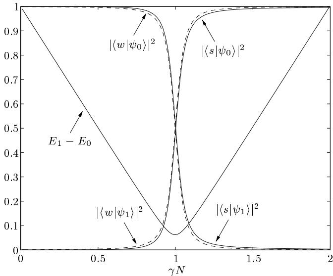
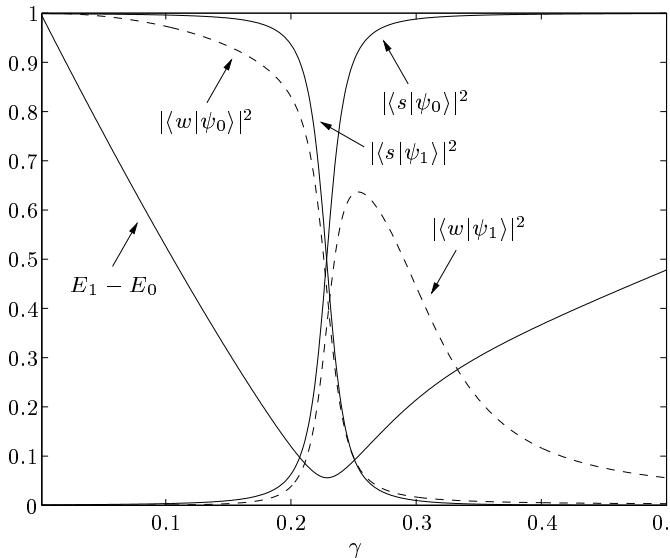
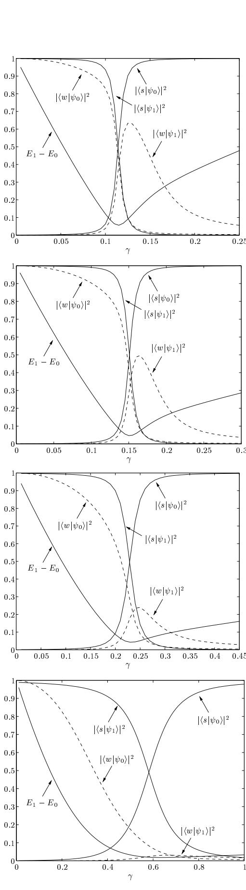
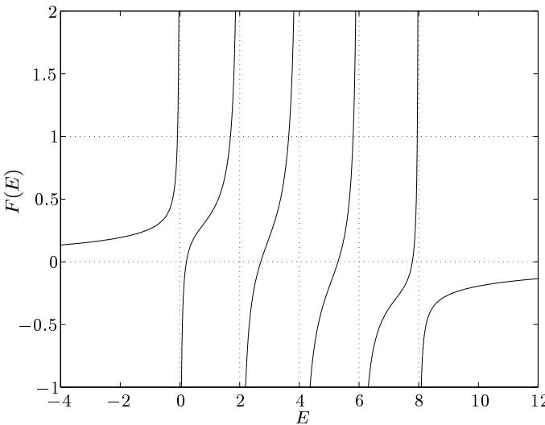

# Spatial search by quantum walk

Andrew M. Childs∗ and Jeffrey Goldstone† Center for Theoretical Physics Massachusetts Institute of Technology Cambridge, MA 02139, USA

Grover’s quantum search algorithm provides a way to speed up combinatorial search, but is not directly applicable to searching a physical database. Nevertheless, Aaronson and Ambainis showed that a database of $N$ items laid out in $d$ spatial dimensions can be searched in time of order $\sqrt { N }$ for $d > 2$ , and in time of order ${ \sqrt { N } } \operatorname { p o l y } ( \log N )$ for $d = 2$ . We consider an alternative search algorithm based on a continuous time quantum walk on a graph. The case of the complete graph gives the continuous time search algorithm of Farhi and Gutmann, and other previously known results can be used to show that $\sqrt { N }$ speedup can also be achieved on the hypercube. We show that full $\sqrt { N }$ speedup can be achieved on a $d$ -dimensional periodic lattice for $d > 4$ . In $d = 4$ , the quantum walk search algorithm takes time of order ${ \sqrt { N } } \operatorname { p o l y } ( \log N )$ , and in $d < 4$ , the algorithm does not provide substantial speedup.

# I. INTRODUCTION

Grover’s quantum search algorithm [1] is one of the main applications of quantum computation. Given a black box function $f ( x ) : \{ 1 , \dots , N \} \to \{ 0 , 1 \}$ satisfying

$$
f ( x ) = { \left\{ \begin{array} { l l } { 0 } & { x \neq w } \\ { 1 } & { x = w , } \end{array} \right. }
$$

Grover’s algorithm can find the value of $w$ using of order $\sqrt { N }$ queries, which is optimal [2]. On the other hand, no classical algorithm can do better than exhaustive search, which takes of order $N$ queries. Therefore Grover’s algorithm can be used to speed up brute force combinatorial search. It can also be used as a subroutine in a variety of other quantum algorithms.

Grover’s algorithm is sometimes described as a way to search an unsorted database of $N$ items in time $O ( { \sqrt { N } } )$ . But the algorithm as originally proposed is not designed to search a physical database. Suppose we had $N$ items stored in a $d$ -dimensional physical space, and that these items could be explored in superposition by a quantum computer making local moves (a “quantum robot” [3]). Naively, it would seem that each step of the Grover algorithm should take time of order $N ^ { 1 / d }$ , since this is the time required to cross the database. Performing $\sqrt { N }$ iterations, we find that the search takes time of order $N ^ { \frac { 1 } { 2 } + \frac { 1 } { d } }$ , so no speedup is achieved in $d = 2$ , and full speedup is achieved only in the limit of large $d$ .

However, it is possible to do better than this naive approach suggests. In [4], Aaronson and Ambainis present a model of query complexity on graphs. Within this model, they give a recursive algorithm for the search problem that achieves full $\sqrt { N }$ speedup for a $d \geq 3$ dimensional lattice, and runs in time ${ \sqrt { N } } \log ^ { 2 } N$ in $d \ : = \ : 2$ . (It is obvious that no algorithm can get speedup in $d = 1$ .)

In this paper we approach the spatial search problem using quantum walks. Since random walks are commonly used in classical algorithms, it is natural to consider a quantum analogue of a classical random walk as an algorithmic tool. Here we consider the continuous time quantum walk [5]. On certain graphs, this quantum walk can yield exponentially faster hitting times than its classical counterpart [5, 6]. Indeed, a recent result shows that the continuous time quantum walk can solve a certain black box problem exponentially faster than any classical algorithm [7].

Quantum walks provide a natural framework for the spatial search problem because the graph can be used to model the locality of the database. We present a simple quantum walk search algorithm that can be applied to any graph. Our algorithm could be implemented within the model of [4], but is actually much simpler because it uses no auxiliary storage space. For the case of the complete graph, the resulting algorithm is simply the continuous time search algorithm of Farhi and Gutmann [8]. On the hypercube, previous results can be used to show that the algorithm also provides quadratic speedup [9, 10]. However, in both of these cases, the graph is highly connected. Here, we consider the case of a $d$ -dimensional cubic periodic lattice, where $d$ is fixed independent of $N$ . We find full $\sqrt { N }$ speedup in $d > 4$ and running time $O ( \sqrt { N } \log ^ { 3 / 2 } N )$ in $d = 4$ . In $d < 4$ , we find that quadratic speedup is impossible, so the continuous time quantum walk algorithm is never faster than the Aaronson-Ambainis algorithm.

We note that it is also possible to construct a quantum analogue of a discrete time random walk [11, 12] (although the walk cannot take place directly on the vertices of the graph [13]). This type of walk has been used to construct a fast search algorithm on the hypercube [14], and more recently, on a $d$ -dimensional lattice with $d \geq 2$ [15]. The latter result outperforms our continuoustime walk algorithm for $d = 2 , 3 , 4$ . However, similar performance can be achieved by a modification of the continuous-time algorithm [16].

This paper is organized as follows. In Section II we review the continuous time quantum walk and show how it can be used to approach the search problem. In Section III we review the results in the high dimensional cases (the complete graph and the hypercube), casting them in the language of continuous time quantum walks. In Section IV we present the results for finite dimensional lattices, and in Section V, we conclude with a discussion of our results.

# II. QUANTUM WALK

The continuous time quantum walk on a graph is defined in direct analogy to a continuous time classical random walk [5]. Given an undirected graph $G$ with $N$ vertices and no self loops, we define the adjacency matrix

$$
A _ { j k } = { \left\{ \begin{array} { l l } { 1 } & { ( j , k ) \in G } \\ { 0 } & { { \mathrm { o t h e r w i s e } } } \end{array} \right. }
$$

which describes the connectivity of $G$ . In terms of this matrix, we can also define the Laplacian $L = A - D$ , where $D$ is the diagonal matrix with $D _ { j j } = \deg ( j )$ , the degree of vertex $j$ . The continuous time random walk on $G$ is a Markov process with a fixed probability per unit time $\gamma$ of jumping to an adjacent vertex. In other words, the probability of jumping to any connected vertex in a time $\epsilon$ is $\gamma \epsilon$ (in the limit $\epsilon  0$ ). This walk can be described by the first-order, linear differential equation

$$
\frac { \mathrm { d } p _ { j } ( t ) } { \mathrm { d } t } = \gamma \sum _ { k } L _ { j k } p _ { k } ( t ) ,
$$

where $p _ { j } ( t )$ is the probability of being at vertex $j$ at time $t$ . Since the columns of $L$ sum to zero, probability is conserved.

The continuous time quantum walk on a graph takes place in an $N$ -dimensional Hilbert space spanned by states $| j \rangle$ , where $j$ is a vertex in $G$ . In terms of these basis states, we can write a general state $| \psi ( t ) \rangle$ in terms of the $N$ complex amplitudes $q _ { j } ( t ) \ = \ \langle j | \psi ( t ) \rangle$ . If the Hamiltonian is $H$ , then the dynamics of the system are determined by the Schr¨odinger equation,1

$$
i \frac { \mathrm { d } q _ { j } ( t ) } { \mathrm { d } t } = \sum _ { k } H _ { j k } q _ { k } ( t ) .
$$

Note the similarity between (3) and (4). The continuous time quantum walk is defined by simply letting $H =$ $- \gamma L$ .2 Then the only difference between (3) and (4) is a factor of $_ i$ , which nevertheless can result in radically different behavior.

As an aside, we note that the Laplacian does not provide the only possible Hamiltonian for a quantum walk. Whereas (3) requires $\textstyle \sum _ { j } L _ { j k } = 0$ to be a valid probability-conserving classical Markov process, (4) requires $H = H ^ { \dagger }$ to be a valid unitary quantum process. Therefore we could also choose, for example, $H = - \gamma A$ . All of the graphs we consider in this paper are regular (i.e., $\deg ( j )$ is independent of $j$ ), so these two choices give rise to the same quantum dynamics. However, for non-regular graphs the two choices will give different results.

To approach the Grover problem with a quantum walk, we need to modify the Hamiltonian so that the vertex $w$ is special. Following [8], we introduce the oracle Hamiltonian3

$$
H _ { w } = - | w \rangle \langle w |
$$

which has energy zero for all states except $| w \rangle$ , which is the ground state, with energy $^ { - 1 }$ . Solving the Grover problem is equivalent to finding the ground state of this Hamiltonian. In this paper we assume that this Hamiltonian is given, and we want to use it for as little time as possible to find the value of $w$ . Note that this Hamiltonian could be simulated in the circuit model using the standard Grover oracle

$$
U _ { w } | j \rangle = ( - 1 ) ^ { \delta _ { j w } } | j \rangle .
$$

However, in this paper we focus on the continuous time description.

To construct an algorithm with the locality of a particular graph $G$ , we consider the time-independent Hamiltonian

$$
\begin{array} { r } { H = - \gamma L + H _ { w } = - \gamma L - | w \rangle \langle w | } \end{array}
$$

where $L$ is the Laplacian of $G$ . We begin in a uniform superposition over all vertices of the graph,

$$
| s \rangle = { \frac { 1 } { \sqrt { N } } } \sum _ { j } | j \rangle ,
$$

and run the quantum walk for time $T$ . We then measure in the vertex basis. Our objective is to choose the parameter $\gamma$ so that the success probability $| \langle w | \psi ( T ) \rangle | ^ { 2 }$ is as close to $^ { 1 }$ as possible for as small a $T$ as possible. Note that the coefficient of $H _ { w }$ is held fixed at $1$ to make the problem fair (e.g., so that evolution for time $T$ could be simulated with $O ( T )$ queries of the standard Grover oracle (6)).

One might ask why we should expect this algorithm to give a substantial success probability for some values of $\gamma , T$ . We motivate this possibility in terms of the spectrum of $H$ . Note that regardless of the graph, $| s \rangle$ is the ground state of the Laplacian, with $L | s \rangle = 0$ . As $\gamma \longrightarrow \infty$ , the contribution of $H _ { w }$ to $H$ is negligible, so the ground state of $H$ is close to $| s \rangle$ . On the other hand, as $\gamma \to 0$ , the contribution of $L$ to $H$ disappears, so the ground state of $H$ is close to $| w \rangle$ . Furthermore, since $| s \rangle$ is nearly orthogonal to $| w \rangle$ , degenerate perturbation theory shows that the first excited state of $H$ will be close to $| s \rangle$ as $\gamma \to 0$ for large $N$ . We might expect that over some intermediate range of $\gamma$ , the ground state will switch from $| w \rangle$ to $| s \rangle$ , and could have substantial overlap on both for a certain range of $\gamma$ . If the first excited state also has substantial overlap on both $| w \rangle$ and $| s \rangle$ at such values of $\gamma$ , then the Hamiltonian will drive transitions between the two states, and thus will rotate the state from $| s \rangle$ to a state with substantial overlap with $| w \rangle$ in a time of order $1 / ( E _ { 1 } - E _ { 0 } )$ , where $E _ { 0 }$ is the ground state energy and $E _ { 1 }$ is the first excited state energy.

Indeed, we will see that this is a good description of the algorithm if the dimension of the graph is sufficiently high. The simplest example is the complete graph (the “analog analogue” of the Grover algorithm [8]) which can be thought of roughly as having dimension proportional to $N$ . A similar picture holds for the $( \log N )$ -dimensional hypercube. When we consider a $d$ -dimensional lattice with $d$ independent of $N$ , we will see that the state $| s \rangle$ still switches from ground state to first excited state at some critical value of $\gamma$ . However, the $| w \rangle$ state does not have substantial overlap on the ground and first excited states unless $d > 4$ , so the algorithm will not work for $d < 4$ (and $d = 4$ will be a marginal case).

# III. HIGH DIMENSIONS

In this section, we describe the quantum walk algorithm on “high dimensional” graphs, namely the complete graph and the hypercube. These cases have been analyzed in previous works [8–10]. Here, we reinterpret them as quantum walk algorithms, which provides motivation for the case of a lattice in $d$ spatial dimensions.

# A. Complete graph

Letting $L$ be the Laplacian of the complete graph, we find exactly the continuous time search algorithm proposed in [8]. Adding a multiple of the identity matrix to the Laplacian gives

$$
L + N I = N | s \rangle \langle s | = \left( \begin{array} { l l l } { 1 } & { \cdots } & { 1 } \\ { \vdots } & { \ddots } & { \vdots } \\ { 1 } & { \cdots } & { 1 } \end{array} \right) .
$$

  
FIG. 1: Energy gap and overlaps for the complete graph with $N = 1 0 2 4$ .

Therefore we consider the Hamiltonian

$$
\begin{array} { r } { H = - \gamma N | s \rangle \langle s | - | w \rangle \langle w | . } \end{array}
$$

Since this Hamiltonian acts nontrivially only on a twodimensional subspace, it is straightforward to compute its spectrum exactly for any value of $\gamma$ . For $\gamma N \ll 1$ , the ground state is close to $| w \rangle$ , and for $\gamma N \gg 1$ , the ground state is close to $| s \rangle$ . In fact, for large $N$ , there is a sharp change in the ground state from $| w \rangle$ to $| s \rangle$ as $\gamma N$ is varied from slightly less than 1 to slightly greater than 1. Correspondingly, the gap between the ground and first excited state energies is smallest for $\gamma N \sim 1$ , as shown in Figure 1. At $\gamma N = 1$ , for $N$ large, the eigenstates are $\textstyle { \frac { 1 } { \sqrt { 2 } } } ( \left| w \right. \pm \left| s \right. )$ (up to terms of order $N ^ { - 1 / 2 }$ ), with a gap of $2 / \sqrt { N }$ . Thus the walk rotates the state from $| s \rangle$ to $| w \rangle$ in time $\pi \sqrt { N } / 2$ .

# B. Hypercube

Now consider the $n$ -dimensional hypercube with $N =$ $2 ^ { n }$ vertices. The vertices of the graph are labeled by $n$ -bit strings, and two vertices are connected if and only if they differ in a single bit. Therefore the adjacency matrix can be written as

$$
A = \sum _ { j = 1 } ^ { n } \sigma _ { x } ^ { ( j ) }
$$

where $\sigma _ { x } ^ { \left( j \right) }$ is the Pauli sigma $x$ operator on the $j$ th bit.

In this case, we again find a sharp transition in the eigenstates at a certain critical value of $\gamma$ , as shown in Figure 2. The Hamiltonian can be analyzed using essentially the same method we will apply in the next section, together with facts about spin operators. The energy gap is analyzed in Section 4.2 of [9], and the energy eigenstates are analyzed in Appendix B of [10]. The critical value of $\gamma$ is

  
FIG. 2: Energy gap and overlaps for the hypercube with $N =$ $2 ^ { 1 0 } = 1 0 2 4$ .

$$
\gamma = \frac { 1 } { 2 ^ { n } } \sum _ { r = 1 } ^ { n } \binom { n } { r } \frac { 1 } { r } = \frac { 2 } { n } + O ( n ^ { - 2 } ) ,
$$

at which the energy gap is

$$
\frac { 2 } { \sqrt { N } } [ 1 + O ( n ^ { - 1 } ) ]
$$

and the ground and first excited states are $\textstyle { \frac { 1 } { \sqrt { 2 } } } ( \left| w \right. \pm \left| s \right. )$ up to terms of order $1 / n$ . Again, we find that after a time of order $\sqrt { N }$ , the probability of finding $w$ is of order $1$ .

# IV. FINITE DIMENSIONS

Having seen that the algorithm works in two cases where the dimension of the graph grows with $N$ , we now consider the case of a $d$ dimensional cubic periodic lattice, where $d$ is fixed independent of $N$ . The minimum gap and overlaps of $| s \rangle , | w \rangle$ with the ground and first excited states are shown in Figure 3 for $d = 2 , 3 , 4 , 5$ and $N \approx 1 0 0 0$ . In all of these plots, there is a critical value of $\gamma$ where the energy gap is a minimum, and in the vicinity of this value, the state $| s \rangle$ changes from being the first excited state to being the ground state. In large enough $d$ , the $| w \rangle$ state changes from being the ground state to having large overlap on the first excited state in the same region of . However, for smaller $d$ , the range of over $\gamma$ $\gamma$ which the change occurs is wider, and the overlap of the $| w \rangle$ state on the lowest two eigenstates is smaller. Note that in all cases, $| s \rangle$ is supported almost entirely on the subspace of the two lowest energy states. Therefore, if the algorithm starting in the state $| s \rangle$ is to work at all, it must work essentially in a two dimensional subspace.

In the rest of this section, we will make this picture quantitative. We begin with some general techniques for analyzing the spectrum of $H$ using knowledge of the spectrum of the graph. We then show the existence of a phase transition in , and we show that for any $d$ , the $\gamma$ algorithm fails if $\gamma$ is not close to a certain critical value. Next we consider what happens when $\gamma$ is close to its critical value. In $d > 4$ , we show that the algorithm gives a success probability of order 1 in time of order $\sqrt { N }$ , and in $d = 4$ , we find a success probability of order $1 / \log N$ in time of order $\sqrt { N \log N }$ . Finally, we investigate the critical point in $d < 4$ and show that the algorithm does not provide substantial speedup.

# A. Preliminaries

In this section, we show how the spectrum of $H$ can be understood in terms of the spectrum of $L$ . An eigenvector of $H$ , denoted $\left| { \psi _ { a } } \right.$ , with eigenvalue $E _ { a }$ , satisfies

$$
\begin{array} { r } { H | \psi _ { a } \rangle = ( - \gamma L - | w \rangle \langle w | ) | \psi _ { a } \rangle = E _ { a } | \psi _ { a } \rangle , } \end{array}
$$

i.e.,

$$
\begin{array} { r } { \left( - \gamma L - E _ { a } \right) | \psi _ { a } \rangle = | w \rangle \langle w | \psi _ { a } \rangle . } \end{array}
$$

The state $\left| { \psi _ { a } } \right.$ is normalized, so $| \langle \psi _ { a } | \psi _ { a } \rangle | ^ { 2 } = 1$ . Define

$$
R _ { a } = | \langle w | \psi _ { a } \rangle | ^ { 2 }
$$

and choose the phase of $\left| { \psi _ { a } } \right.$ so that

$$
\langle w | \psi _ { a } \rangle = \sqrt { R _ { a } } .
$$

We wish to calculate the amplitude for success,

$$
\langle w | e ^ { - i H t } | s \rangle = \sum _ { a } \langle w | \psi _ { a } \rangle \langle \psi _ { a } | s \rangle e ^ { - i E _ { a } t } ,
$$

so we only need those $\left| { \psi _ { a } } \right.$ with $R _ { a } > 0$ .

$L$ is the Laplacian of a lattice in $d$ dimensions, periodic in each direction with period $N ^ { 1 / d }$ , with a total of $N$ vertices. Each vertex of the lattice corresponds to a basis state $| x \rangle$ , where $x$ is a $d$ -component vector with components $x _ { j } \in \{ 0 , 1 , \ldots , N ^ { 1 / d } - 1 \}$ . The eigenvectors of $- L$ are $| \phi ( k ) \rangle$ with

$$
\langle x | \phi ( k ) \rangle = { \frac { 1 } { \sqrt { N } } } e ^ { i k \cdot x } ,
$$

where

$$
\begin{array} { l } { { k _ { j } = \displaystyle \frac { 2 \pi m _ { j } } { N ^ { 1 / d } } \qquad \quad \mathrm { ( 2 0 } } } \\ { { m _ { j } = \left\{ \begin{array} { l l } { { 0 , \pm 1 , . . . , \pm \frac { 1 } { 2 } \big ( N ^ { 1 / d } - 1 \big ) } } & { { N ^ { 1 / d } \mathrm { ~ o d d } } } \\ { { 0 , \pm 1 , . . . , \pm \frac { 1 } { 2 } \big ( N ^ { 1 / d } - 2 \big ) , + \frac { 1 } { 2 } N ^ { 1 / d } } } & { { N ^ { 1 / d } \mathrm { ~ e v e n } , } } \end{array} \right. } } \end{array}
$$

  
FIG. 3: Energy gap and overlaps for $d$ -dimensional lattices with $N \approx 1 0 0 0$ . From top to bottom, $d = 5$ , $N = 4 ^ { 5 } = 1 0 2 4$ ; $d = 4$ , $N = 6 ^ { 4 } = 1 2 9 6$ ; $d = 3$ , $N = 1 0 ^ { 3 } = 1 0 0 0$ ; $d = 2$ , $N = 3 2 ^ { 2 } = 1 0 2 4$ .

  
FIG. 4: The function $F ( E )$ for a $d = 2$ dimensional periodic lattice with $N = 1 6$ vertices, at $\gamma = 1$ .

and the corresponding eigenvalues are

$$
\mathcal { E } ( k ) = 2 \left( d - \sum _ { j = 1 } ^ { d } \cos \left( k _ { j } \right) \right) .
$$

Since $\langle \phi ( k ) | w \rangle \neq 0$ , from (15) we have

$$
( \gamma \mathcal { E } ( k ) - E _ { a } ) \langle \phi ( k ) | \psi _ { a } \rangle \neq 0
$$

for any $k$ . We can therefore rewrite (15), using (17), as

$$
| \psi _ { a } \rangle = \frac { \sqrt { R } _ { a } } { - \gamma L - E _ { a } } | w \rangle .
$$

Consistency with (17) then gives the eigenvalue condition

$$
\langle w | \frac { 1 } { - \gamma L - E _ { a } } | w \rangle = 1 .
$$

Using (19), this can be expressed as

$$
F ( E _ { a } ) = 1 , \quad F ( E ) = \frac { 1 } { N } \sum _ { k } \frac { 1 } { \gamma \mathcal { E } ( k ) - E } .
$$

A typical function $F ( E )$ is shown in Figure 4. This function has poles where $E = \gamma \mathcal { E } ( k )$ . For $E \neq \gamma \mathcal { E } ( k )$ , (26) shows that $F ^ { \prime } ( E ) > 0$ , so there is an eigenvalue of $H$ between every adjacent pair of eigenvalues of $- \gamma L$ . Since $F ( E ) \to 0$ as $E  \pm \infty$ , there is also one negative eigenvalue of $H$ (corresponding to the ground state). Note that in the case shown in Figure 4, the eigenvalues $\mathcal { E } = 2 , 4 , 6$ of $- \gamma L$ have degeneracies $4 , 6 , 4$ because of the symmetry of the lattice. It follows that there are $3 , 5 , 3$ eigenvectors of $H$ with eigenvalues $E _ { a } = 2 , 4 , 6$ , all with $\langle w | \psi _ { a } \rangle = 0$ and thus not relevant to our purpose. These 11 eigenvectors, together with the 5 relevant ones, make up the necessary total of 16.

The normalization condition on $\left| { \psi _ { a } } \right.$ gives

$$
R _ { a } \langle w | \frac { 1 } { ( - \gamma L - E _ { a } ) ^ { 2 } } | w \rangle = 1 ,
$$

i.e.

$$
R _ { a } = { \frac { 1 } { F ^ { \prime } ( E _ { a } ) } } .
$$

We also need the overlap of $\left| { \psi _ { a } } \right.$ with $| s \rangle$ . Since $L | s \rangle = 0$ , from (24) we have

$$
\langle s | \psi _ { a } \rangle = - \frac { \sqrt { R _ { a } } } { E _ { a } } \langle s | w \rangle ,
$$

so that

$$
| \langle s | \psi _ { a } \rangle | ^ { 2 } = \frac { 1 } { N } \frac { 1 } { E _ { a } ^ { 2 } F ^ { \prime } ( E _ { a } ) } .
$$

Using (18), (24), and (25),

$$
\langle w | e ^ { - i H t } | s \rangle = - { \frac { 1 } { \sqrt { N } } } \sum _ { a } { \frac { e ^ { - i E _ { a } t } } { E _ { a } F ^ { \prime } ( E _ { a } ) } } .
$$

At $t = 0$ , this gives the sum rule

$$
\sum _ { a } \frac { 1 } { E _ { a } F ^ { \prime } ( E _ { a } ) } = - 1 .
$$

We will see that the spectrum of $H$ depends significantly on the behavior of the sums

$$
S _ { j , d } = \frac { 1 } { N } \sum _ { k \neq 0 } \frac { 1 } { [ \mathcal { E } ( k ) ] ^ { j } } .
$$

If $d > 2 j$ , then $S _ { j , d }$ can be approximated by an integral as4

$$
S _ { j , d } = I _ { j , d } + o ( 1 )
$$

where

$$
I _ { j , d } = \frac { 1 } { ( 2 \pi ) ^ { d } } \int _ { - \pi } ^ { \pi } \frac { \mathrm { d } ^ { d } k } { [ { \mathcal { E } } ( k ) ] ^ { j } } .
$$

The condition $d > 2 j$ is necessary for $I _ { j , d }$ to converge at $k = 0$ . The numerical values of $I _ { 1 , d }$ and $I _ { 2 , d }$ for $d \leq 1 0$ are given in Table I. Note that $I _ { j , d }$ can also be calculated using the formula [17]

$$
I _ { j , d } = \frac { 1 } { ( 2 d ) ^ { j } } \int _ { 0 } ^ { \infty } \mathrm { d } \alpha \frac { \alpha ^ { j - 1 } e ^ { - \alpha } } { ( j - 1 ) ! } [ \mathbb { Z } _ { 0 } ( \alpha / d ) ] ^ { d }
$$

<table><tr><td>d</td><td>I1,d</td><td>I2,d</td></tr><tr><td>3</td><td>0.253</td><td></td></tr><tr><td>4</td><td>0.155</td><td></td></tr><tr><td>5</td><td>0.116</td><td>0.0184</td></tr><tr><td>6</td><td>0.0931</td><td>0.0105</td></tr><tr><td>7</td><td>0.0781</td><td>0.00697</td></tr><tr><td>8</td><td>0.0674</td><td>0.00504</td></tr><tr><td>9</td><td>0.0593</td><td>0.00383</td></tr><tr><td>10</td><td>0.0530</td><td>0.00301</td></tr></table>

where $\mathcal { I } _ { 0 }$ is a modified Bessel function of the first kind.

On the other hand, if $d < 2 j$ , then $S _ { j , d }$ can be well approximated by the contribution from values of $k$ small enough that $\mathcal { E } ( k )$ is approximately

$$
\mathcal { E } ( k ) \approx k ^ { 2 } = \frac { ( 2 \pi m ) ^ { 2 } } { N ^ { 2 / d } }
$$

(where we have used the notation $k ^ { 2 } = k _ { 1 } ^ { 2 } + \cdot \cdot \cdot + k _ { d } ^ { 2 } .$ ). Then

$$
S _ { j , d } \sim c _ { j , d } N ^ { \frac { 2 j } { d } - 1 }
$$

where

$$
c _ { j , d } = \frac { 1 } { ( 2 \pi ) ^ { 2 j } } \sum _ { m \neq 0 } \frac { 1 } { ( m ^ { 2 } ) ^ { j } } .
$$

Here the sum is over all values of the $d$ -component vector of integers $m$ other than $m = 0$ , and converges for large $m ^ { 2 }$ . Numerically, we find

$$
c _ { 2 , 2 } = 0 . 0 0 6 6 4 , \quad c _ { 2 , 3 } = 0 . 0 2 6 5 .
$$

In the borderline case $d = 2 j$ , $I _ { j , d }$ diverges logarithmically at $k ^ { 2 }$ small and $c _ { j , d }$ diverges logarithmically at $m ^ { 2 }$ large. In this case

$$
S _ { j , 2 j } = \frac { 1 } { ( 4 \pi ) ^ { j } j ! } \ln N + O ( 1 ) .
$$

We will need

$$
\begin{array} { l } { { S _ { 1 , 2 } = \displaystyle \frac { 1 } { 4 \pi } \ln N + A + O ( N ^ { - 1 } ) } } \\ { { S _ { 2 , 4 } = \displaystyle \frac { 1 } { 3 2 \pi ^ { 2 } } \ln N + O ( 1 ) } } \end{array}
$$

where $A = 0 . 0 4 8 8$ (the case $j = 1$ , $d = 2$ is treated in greater detail in [19]).

# B. Phase transition

In this section, we show that the overlap of the state $| s \rangle$ on the ground or first excited state of $H$ exhibits a phase transition at a critical value of $\gamma$ for any dimension $d$ . In fact, away from the critical value, $| s \rangle$ is approximately an eigenstate of $H$ , so Schr¨odinger evolution according to $H$ does not change the state very much. In the next section, we will show that the algorithm indeed fails away from the critical value of $\gamma$ , and in the following sections we will consider what happens near the critical point.

For $\gamma$ larger than the critical value (which will be determined below), the ground state energy is very close to $0$ . This can be seen as follows. The eigenvalue condition (26) for the ground state energy $E _ { 0 }$ , which is negative, gives

$$
\begin{array} { l } { { 1 = F ( E _ { 0 } ) = \displaystyle \frac { 1 } { N | E _ { 0 } | } + \frac { 1 } { N } \sum _ { k \neq 0 } \frac { 1 } { \gamma \mathcal { E } ( k ) + | E _ { 0 } | } } } \\ { { < \displaystyle \frac { 1 } { N | E _ { 0 } | } + \frac { 1 } { N } \sum _ { k \neq 0 } \frac { 1 } { \gamma \mathcal { E } ( k ) } } } \\ { { ~ \approx \displaystyle \frac { 1 } { N | E _ { 0 } | } + \frac { I _ { 1 , d } } { \gamma } } } \end{array}
$$

where in the last line we have assumed $d > 2$ . In this case, for $\gamma > I _ { 1 , d }$ (which will turn out to be the critical value), up to small terms,

$$
\vert E _ { 0 } \vert < \frac { 1 } { N } \frac { \gamma } { \gamma - I _ { 1 , d } } .
$$

Using (30), we have

$$
\begin{array} { l } { { \displaystyle | \langle s | \psi _ { 0 } \rangle | ^ { 2 } = \left[ 1 + E _ { 0 } ^ { 2 } \sum _ { k \ne 0 } ( \gamma { \mathcal E } ( k ) + | E _ { 0 } | ) ^ { - 2 } \right] ^ { - 1 } } } \\ { ~ } \\ { { \displaystyle > \left[ 1 + \frac { E _ { 0 } ^ { 2 } } { \gamma ^ { 2 } } \sum _ { k \ne 0 } \frac { 1 } { [ { \mathcal E } ( k ) ] ^ { 2 } } \right] ^ { - 1 } } } \\ { { \displaystyle > 1 - \frac { E _ { 0 } ^ { 2 } } { \gamma ^ { 2 } } \sum _ { k \ne 0 } \frac { 1 } { [ { \mathcal E } ( k ) ] ^ { 2 } } . } } \end{array}
$$

Inserting the behavior of $S _ { 2 , d }$ from (33), (38), and (41) and using the bound (47), we find

$$
1 - | \langle s | \psi _ { 0 } \rangle | ^ { 2 } < { \frac { 1 } { ( \gamma - I _ { 1 , d } ) ^ { 2 } } } \times \left\{ \begin{array} { l l } { { O ( N ^ { - 1 } ) } } & { { d > 4 } } \\ { { O ( N ^ { - 1 } \log N ) } } & { { d = 4 } } \\ { { O ( N ^ { - 2 / 3 } ) } } & { { d = 3 . } } \end{array} \right.
$$

This shows that if $\gamma = I _ { 1 , d } + \epsilon$ for any $\epsilon > 0$ , then $1 -$ $| \langle s | \psi _ { 0 } \rangle | ^ { 2 }$ approaches zero as $N \to \infty$ .

If $d = 2$ , then $I _ { 1 , 2 }$ is logarithmically divergent, but using (42) in (45) we can apply a similar argument whenever $\begin{array} { r } { \gamma > \frac { 1 } { 4 \pi } \ln N + A } \end{array}$ , in which case we have

$$
\vert E _ { 0 } \vert < { \frac { 1 } { N } } { \frac { \gamma } { \gamma - { \frac { 1 } { 4 \pi } } \ln { N } - A } }
$$

and

$$
1 - | \langle s | \psi _ { 0 } \rangle | ^ { 2 } < { \frac { 1 } { ( \gamma - { \frac { 1 } { 4 \pi } } \ln N - A ) ^ { 2 } } } \times O ( 1 ) .
$$

This shows that if $\begin{array} { r } { \gamma > ( \frac { 1 } { 4 \pi } + \epsilon ) \ln N } \end{array}$ , then $1 - | \langle s | \psi _ { 0 } \rangle | ^ { 2 } \leq$ $1 / ( \epsilon \ln N ) ^ { 2 }$ , which approaches zero as $N  \infty$ .

Similarly, for $d > 2$ and for $\gamma < I _ { 1 , d }$ , the first excited state $| \psi _ { 1 } \rangle$ , with energy $E _ { 1 } > 0$ , is essentially $| s \rangle$ . Here we find

$$
\begin{array} { l } { { 1 = F ( E _ { 1 } ) = - \displaystyle \frac { 1 } { N E _ { 1 } } + \frac { 1 } { N } \sum _ { k \neq 0 } \frac { 1 } { \gamma \mathcal { E } ( k ) - E _ { 1 } } } } \\ { { > - \displaystyle \frac { 1 } { N E _ { 1 } } + \frac { 1 } { N } \sum _ { k \neq 0 } \frac { 1 } { \gamma \mathcal { E } ( k ) } } } \\ { { ~ \approx - \displaystyle \frac { 1 } { N E _ { 1 } } + \frac { I _ { 1 , d } } { \gamma } , } } \end{array}
$$

so that, up to small terms,

$$
E _ { 1 } < \frac { 1 } { N } \frac { \gamma } { I _ { 1 , d } - \gamma } .
$$

Again applying (30), we find

$$
1 - | \langle s | \psi _ { 1 } \rangle | ^ { 2 } < { \frac { 1 } { ( I _ { 1 , d } - \gamma ) ^ { 2 } } } \times \left\{ \begin{array} { l l } { O ( N ^ { - 1 } ) } & { d > 4 } \\ { O ( N ^ { - 1 } \log N ) } & { d = 4 } \\ { O ( N ^ { - 2 / 3 } ) } & { d = 3 . } \end{array} \right.
$$

We see that $\gamma = I _ { 1 , d }$ is the critical point. In $d \ : = \ : 2$ we can apply similar reasoning to obtain that for $\gamma \ <$ $\textstyle { \frac { 1 } { 4 \pi } } \ln N + A$ ,

$$
1 - | \langle s | \psi _ { 1 } \rangle | ^ { 2 } < \frac { 1 } { ( \frac { 1 } { 4 \pi } \ln N - \gamma ) ^ { 2 } } \times { \cal O } ( 1 ) .
$$

In this case $\begin{array} { r } { \gamma = \frac { 1 } { 4 \pi } \ln N + A } \end{array}$ is the critical point.

# C. Failure of the algorithm away from the critical point

In this section we will show that the algorithm fails away from the critical point, regardless of dimension. The results (51) and (58) are actually sufficient to show that away from the critical point in $d > 4$ , the algorithm can be no better than classical search, but we will give a different argument for consistency of presentation.

First we consider the regime where $\gamma$ is larger than the critical value. In the previous section, we saw that in this case, the ground state energy $E _ { 0 }$ is small. This is sufficient to imply that the success probability is small at all times. Combining (31) and (32), we see that the amplitude at an arbitrary time must satisfy

$$
\begin{array} { r l } & { | \langle w | e ^ { - i H t } | s \rangle | \leq \displaystyle \frac { 1 } { \sqrt { N } } \left( \frac { 2 } { | E _ { 0 } | F ^ { \prime } ( E _ { 0 } ) } - 1 \right) } \\ & { \qquad \leq \displaystyle \frac { 2 } { \sqrt { N } | E _ { 0 } | F ^ { \prime } ( E _ { 0 } ) } . } \end{array}
$$

Furthermore it is clear from the definition of $F ( E )$ that

$$
F ^ { \prime } ( E _ { 0 } ) \geq \frac { 1 } { N E _ { 0 } ^ { 2 } } ,
$$

so

$$
| \langle w | e ^ { - i H t } | s \rangle | \leq 2 { \sqrt { N } } | E _ { 0 } | .
$$

Using (47), we find that for $d > 2$ ,

$$
| \langle w | e ^ { - i H t } | s \rangle | \leq { \frac { 2 } { \sqrt { N } } } { \frac { \gamma } { \gamma - I _ { 1 , d } } } .
$$

This shows that if $\gamma = I _ { 1 , d } + \epsilon$ for any $\epsilon > 0$ , the success probability is never more than a constant factor larger than its initial value, no matter how long we run the algorithm. If $d = 2$ , then $I _ { 1 , 2 }$ is logarithmically divergent, but using (52) we find

$$
| \langle w | e ^ { - i H t } | s \rangle | \leq \frac { 2 } { \sqrt { N } } \frac { \gamma } { \gamma - \frac { 1 } { 4 \pi } \ln N - A } .
$$

This shows that the algorithm fails if $\begin{array} { r } { \gamma > ( \frac { 1 } { 4 \pi } + \epsilon ) \ln N } \end{array}$ for any $\epsilon > 0$ .

Now we consider the case where $\gamma$ is smaller than the critical value. For $d > 4$ and $E < 0$ , we have

$$
\begin{array} { l } { { F ( E ) \approx \frac { 1 } { ( 2 \pi ) ^ { d } } \int \frac { \mathrm { d } ^ { d } k } { \gamma \mathcal { E } ( k ) + | E | } } } & { { \mathrm { ( 6 6 } } } \\ { { \mathrm { = } \frac { 1 } { ( 2 \pi ) ^ { d } } \int \frac { \mathrm { d } ^ { d } k } { \gamma \mathcal { E } ( k ) } - \frac { | E | } { ( 2 \pi ) ^ { d } } \int \frac { \mathrm { d } ^ { d } k } { \gamma \mathcal { E } ( k ) [ \gamma \mathcal { E } ( k ) + | E | ] } } } \\ { { \mathrm { > } \frac { I _ { 1 , d } } { \gamma } - \frac { | E | } { \gamma ^ { 2 } ( 2 \pi ) ^ { d } } \int \frac { \mathrm { d } ^ { d } k } { [ \mathcal { E } ( k ) ] ^ { 2 } } } } \\ { { \mathrm { = } \frac { I _ { 1 , d } } { \gamma } - \frac { I _ { 2 , d } } { \gamma ^ { 2 } } | E | . } } \end{array}
$$

Using the fact that $F ( E _ { 0 } ) = 1$ , this shows that

$$
| E _ { 0 } | > \frac { \gamma ( I _ { 1 , d } - \gamma ) } { I _ { 2 , d } } .
$$

From (16) and (28), it is clear that $F ^ { \prime } ( E ) > 1$ , so using (61) gives

$$
| \langle w | e ^ { - i H t } | s \rangle | < \frac { 1 } { \sqrt { N } } \frac { 2 I _ { 2 , d } } { \gamma ( I _ { 1 , d } - \gamma ) } .
$$

A similar argument can be used for $d = 3 , 4$ . With $d = 4$ , we have

$$
\begin{array} { r l r } { F ( E ) \approx \displaystyle \frac { 1 } { ( 2 \pi ) ^ { 4 } } \int \frac { \mathrm { d } ^ { 4 } k } { \gamma \mathcal { E } ( k ) + | E | } } & { } & { ( 7 2 ) } \\ { \displaystyle } & { = \frac { 1 } { ( 2 \pi ) ^ { 4 } } \int \frac { \mathrm { d } ^ { 4 } k } { \gamma \mathcal { E } ( k ) } - \frac { | E | } { ( 2 \pi ) ^ { 4 } } \int \frac { \mathrm { d } ^ { 4 } k } { \gamma \mathcal { E } ( k ) [ \gamma \mathcal { E } ( k ) + | E | ] } } \\ { \displaystyle } & { > \frac { I _ { 1 , 4 } } { \gamma } - \frac { | E | } { 3 2 \gamma } \int _ { 0 } ^ { 2 \pi } \frac { k \mathrm { d } k } { \frac { 4 \gamma } { \pi ^ { 2 } } k ^ { 2 } + | E | } } & { ( 7 4 ) } \\ { \displaystyle } & { = \frac { I _ { 1 , 4 } } { \gamma } - \frac { \pi ^ { 2 } | E | } { 2 5 6 \gamma ^ { 2 } } \ln \left( 1 + \frac { 1 6 \gamma } { | E | } \right) , } & { ( 7 5 ) } \end{array}
$$

where the third line follows because $\cos { k } \leq 1 - 2 ( k / \pi ) ^ { 2 }$ for $| k | \le \pi$ , which implies $\begin{array} { r } { \mathcal { E } ( k ) \geq \frac { 4 } { \pi ^ { 2 } } k ^ { 2 } } \end{array}$ ≤ −. We have also used the fact that $k ^ { 2 } \leq d \pi ^ { 2 }$ to place an upper limit on the integral. This shows that for any $\epsilon > 0$ (with $\epsilon \leq 1$ ), there exists a $c > 0$ such that

$$
F ( E ) > \frac { I _ { 1 , 4 } } { \gamma } - \frac { c | E | ^ { 1 - \epsilon } } { \gamma ^ { 2 - \epsilon } } ,
$$

so that

$$
| E _ { 0 } | > c ^ { \prime } \gamma ( I _ { 1 , d } - \gamma ) ^ { 1 / ( 1 - \epsilon ) }
$$

for some $c ^ { \prime } > 0$ , and therefore

$$
| \langle w | e ^ { - i H t } | s \rangle | < { \frac { 1 } { \sqrt { N } } } { \frac { 2 } { c ^ { \prime } \gamma ( I _ { 1 , 4 } - \gamma ) ^ { 1 / ( 1 + \epsilon ) } } } .
$$

With $d = 3$ , we have

$$
\begin{array} { l } { { F ( E ) \approx { \frac { 1 } { ( 2 \pi ) ^ { 3 } } } \int { \frac { \mathrm { d } ^ { 3 } k } { \gamma \mathcal { E } ( k ) + | E | } } } \quad } & { { ( 7 9 } } \\ { { \displaystyle \quad = { \frac { 1 } { ( 2 \pi ) ^ { 3 } } } \int { \frac { \mathrm { d } ^ { 3 } k } { \gamma \mathcal { E } ( k ) } } - { \frac { | E | } { ( 2 \pi ) ^ { 3 } } } \int { \frac { \mathrm { d } ^ { 3 } k } { \gamma \mathcal { E } ( k ) [ \gamma \mathcal { E } ( k ) + | E | ] } } \quad } } \\ { { \displaystyle > { \frac { I _ { 1 , 3 } } { \gamma } } - { \frac { | E | } { 8 \gamma } } \int _ { 0 } ^ { \infty } { \frac { \mathrm { d } k } { \frac { 4 \gamma } { \pi ^ { 2 } } k ^ { 2 } + | E | } } \quad } } \\ { { \displaystyle \quad = { \frac { I _ { 1 , 3 } } { \gamma } } - { \frac { \pi ^ { 2 } } { 3 2 \gamma ^ { 3 / 2 } } } { \sqrt { | E | } } } \quad } & { { ( 8 2 } } \end{array}
$$

where in the third line we have again used $\begin{array} { r } { \mathcal { E } ( k ) \geq \frac { 4 } { \pi ^ { 2 } } k ^ { 2 } } \end{array}$ . In this case we find

$$
| E _ { 0 } | > \frac { 1 0 2 4 } { \pi ^ { 4 } } \gamma ( I _ { 1 , 3 } - \gamma ) ^ { 2 }
$$

which shows that

$$
| \langle s | e ^ { - i H t } | w \rangle | < { \frac { 1 } { \sqrt { N } } } { \frac { 2 \pi ^ { 4 } } { 1 0 2 4 \gamma ( I _ { 1 , 3 } - \gamma ) ^ { 2 } } } .
$$

Finally, with $d = 2$ we use a different argument. Here we have

$$
\begin{array} { l } { { \displaystyle F ^ { \prime } ( E ) \approx \frac { 1 } { ( 2 \pi ) ^ { 2 } } \int \frac { \mathrm { d } ^ { 2 } k } { [ \gamma { \mathcal E } ( k ) + | E | ] ^ { 2 } } } } \\ { { \displaystyle > \frac { 1 } { 2 \pi } \int _ { 0 } ^ { \pi } \frac { k \mathrm { d } k } { ( \gamma k ^ { 2 } + | E | ) ^ { 2 } } } } \\ { { \displaystyle = \frac { \pi } { 4 | E | ( | E | + \pi ^ { 2 } \gamma ) } } } \end{array}
$$

where the second line follows since $\cos { k } \geq 1 - \textstyle { \frac { 1 } { 2 } } k ^ { 2 }$ , which implies $\mathcal { E } ( k ) \leq k ^ { 2 }$ . In the second line we have also used the fact that the entire disk $| k | \le \pi$ is included in the region of integration. Equation (87) shows that

$$
| E | F ^ { \prime } ( E ) > \frac { \pi } { 4 ( | E | + \pi ^ { 2 } \gamma ) } ,
$$

so that

$$
| \langle w | e ^ { - i H t } | s \rangle | < \frac { 1 } { \sqrt { N } } \frac { 8 ( | E _ { 0 } | + \pi ^ { 2 } \gamma ) } { \pi } ,
$$

which is $O ( 1 / \sqrt { N } )$ for $\gamma = O ( 1 )$ , and $O ( ( \log N ) / \sqrt { N } )$ for any $\begin{array} { r } { \gamma < \frac { 1 } { 4 \pi } \ln N + A } \end{array}$ .

The arguments for the case where $\gamma$ is smaller than the critical value can be made tighter by a more refined analysis. For example, by considering the behavior of $F ^ { \prime } ( E )$ , one can give a bound whose dependence on $I _ { 1 , d } - \gamma$ is linear for all $d > 2$ , not just for $d > 4$ . Futhermore, the careful reader will note that our bounds for $d > 2$ all become useless as $\gamma  0$ , but it is easy to see that the algorithm cannot be successful for small values of $\gamma$ .

Altogether, we see that the algorithm cannot work any better than classical search if $\gamma$ is not chosen close to its critical value. It remains to investigate what happens near the critical point.

# D. The critical point in $d \geq 4$

In this section we investigate the region of the critical point in the cases where the algorithm provides speedup. First we consider the case $d > 4$ . Separating out the $k = 0$ term in (26), we have

$$
F ( E ) = - \frac { 1 } { N E } + \frac { 1 } { N } \sum _ { k \neq 0 } \frac { 1 } { \gamma \mathcal { E } ( k ) - E } .
$$

If $| E | \ll \gamma \mathcal { E } ( k )$ for all $k \neq 0$ , then for large $N$ , we can Taylor expand the second term to obtain

$$
F ( E ) \approx - \frac { 1 } { N E } + \frac { 1 } { \gamma } I _ { 1 , d } + \frac { E } { \gamma ^ { 2 } } I _ { 2 , d }
$$

which gives

$$
F ^ { \prime } ( E ) \approx \frac { 1 } { N E ^ { 2 } } + \frac { I _ { 2 , d } } { \gamma ^ { 2 } } .
$$

The critical point corresponds to the condition $\gamma = I _ { 1 , d }$ At this point, setting (91) equal to 1 gives two eigenvalues,

$$
E _ { 0 } \approx - \frac { I _ { 1 , d } } { \sqrt { I _ { 2 , d } N } } , \quad E _ { 1 } \approx + \frac { I _ { 1 , d } } { \sqrt { I _ { 2 , d } N } } ,
$$

which correspond to the ground and first excited state, with a gap of order $N ^ { - 1 / 2 }$ . Since $\mathcal { E } ( k ) \approx ( 2 \pi ) ^ { 2 } N ^ { - 2 / d }$ for $m ^ { 2 } = 1$ , we see that the assumption $E _ { 0 } , E _ { 1 } \ll \gamma \mathcal { E } ( k )$ holds for all $k \neq 0$ . Furthermore, for the ground and first excited states at $\gamma = I _ { 1 , d }$ , (92) gives

$$
F ^ { \prime } ( E _ { 0 } ) \approx F ^ { \prime } ( E _ { 1 } ) \approx \frac { 2 I _ { 2 , d } } { I _ { 1 , d } ^ { 2 } } .
$$

Now we want to use (31) to compute the time evolution of the algorithm. The contribution from all states above

the first excited state is small, since as can be seen using (32) we have

$$
\begin{array} { c } { { \displaystyle - \frac { 1 } { \sqrt { N } } \sum _ { E _ { a } > E _ { 1 } } \frac { 1 } { E _ { a } F ^ { \prime } ( E _ { a } ) } } } \\ { { \displaystyle ~ = \frac { 1 } { \sqrt { N } } \left( 1 + \frac { 1 } { E _ { 0 } F ^ { \prime } ( E _ { 0 } ) } + \frac { 1 } { E _ { 1 } F ^ { \prime } ( E _ { 1 } ) } \right) . } } \end{array}
$$

Using (93) and (94), we see that the $O ( { \sqrt { N } } )$ contributions from $1 / E _ { 0 } F ^ { \prime } ( E _ { 0 } )$ and $1 / E _ { 1 } F ^ { \prime } ( E _ { 1 } )$ cancel, so the right hand side of (95) is $o ( 1 )$ . Thus, using (31), we find

$$
| \langle w | e ^ { - i H t } | s \rangle | \approx \frac { I _ { 1 , d } } { \sqrt { I _ { 2 , d } } } \left| \sin \left( \frac { I _ { 1 , d } t } { \sqrt { I _ { 2 , d } N } } \right) \right| .
$$

The success probability is of order $1$ at $t = \sqrt { I _ { 2 , d } N } / I _ { 1 , d }$ . Straightforward analysis shows that a similar condition holds so long as $\gamma = I _ { 1 , d } \pm O ( N ^ { - 1 / 2 } )$ , exactly the width of the region that cannot be excluded based on the arguments of Section IV C.

In $d = 4$ , $I _ { 2 , d }$ does not converge, so the result is modified slightly. In this case (91) holds with $\scriptstyle { \frac { 1 } { 3 2 \pi ^ { 2 } } } \ln N$ , so the ground and first excited state energies by replaced by

$$
E _ { 0 } \approx - \frac { I _ { 1 , 4 } } { \sqrt { \frac { 1 } { 3 2 \pi ^ { 2 } } N \ln N } } , \quad E _ { 1 } \approx + \frac { I _ { 1 , 4 } } { \sqrt { \frac { 1 } { 3 2 \pi ^ { 2 } } N \ln N } } ,
$$

and we find

$$
F ^ { \prime } ( E _ { 0 } ) \approx F ^ { \prime } ( E _ { 1 } ) \approx \frac { \ln N } { 1 6 \pi ^ { 2 } I _ { 1 , 4 } ^ { 2 } } .
$$

Therefore

$$
\left| \langle w | e ^ { - i H t } | s \rangle \right| \approx \frac { I _ { 1 , 4 } } { \sqrt { \frac { 1 } { 3 2 \pi ^ { 2 } } \ln N } } \left| \sin \left( \frac { I _ { 1 , 4 } t } { \sqrt { \frac { 1 } { 3 2 \pi ^ { 2 } } N \ln N } } \right) \right| ,
$$

which shows that running for a time of order $\sqrt { N \log N }$ gives a success probability of order $1 / \log N$ . Using ${ \cal O } ( \log N )$ repetitions to boost the success probability close to $1$ , we find a total run time $O ( \sqrt { N } \log ^ { 3 / 2 } N )$ .5 One can show that similar conditions hold so long as $\gamma = I _ { 1 , 4 } \pm O ( \sqrt { ( \log N ) / N } )$ .

For $d < 4$ , the expansion (91) fails to find states whose energies satisfy $E \ll \gamma \mathcal { E } ( k )$ . Indeed, we will see in the next section that the algorithm provides no substantial speedup in these cases.

# E. The critical point in $d < 4$

To handle the case $d < 4$ , we rearrange the eigenvalue condition to extract the $O ( 1 )$ contribution to $F ( E )$ :

$$
F ( E ) = - \frac { 1 } { N E } + \frac { 1 } { N } \sum _ { k \neq 0 } \frac { 1 } { \gamma \mathcal { E } ( k ) } + \frac { 1 } { N } \sum _ { k \neq 0 } \frac { E } { \gamma \mathcal { E } ( k ) [ \gamma \mathcal { E } ( k ) - E ] } .
$$

In $d = 3$ , we can replace the middle term by $I _ { 1 , 3 } / \gamma$ for large $N$ . To explore the neighborhood of the critical point in $d = 3$ , we introduce rescaled variables $a , x$ via

$$
\begin{array} { l } { { \displaystyle \gamma = I _ { 1 , 3 } + \frac { a } { N ^ { 1 / 3 } } } } \\ { { \displaystyle E = \frac { 4 \pi ^ { 2 } I _ { 1 , 3 } } { N ^ { 2 / 3 } } x . } } \end{array}
$$

Since the sum in the third term of (100) only gets significant contributions from small energies, we use (37) to give the approximation

$$
\gamma \mathcal { E } ( k ) \approx \frac { 4 \pi ^ { 2 } I _ { 1 , 3 } m ^ { 2 } } { N ^ { 2 / 3 } } ,
$$

and we can analyze the sum using the same techniques we applied to calculate $S _ { j , d }$ in the case $d < 2 j$ . Then we have, for large $N$ ,

$$
F ( E ) \approx 1 + \frac { G _ { 3 } ( x ) - a } { I _ { 1 , 3 } N ^ { 1 / 3 } }
$$

where

$$
G _ { 3 } ( x ) = \frac { 1 } { 4 \pi ^ { 2 } } \left( \sum _ { m \neq 0 } \frac { x } { m ^ { 2 } ( m ^ { 2 } - x ) } - \frac { 1 } { x } \right) .
$$

Here the sum is over all integer values of $m$ , as in (39), and similarly converges for large $m ^ { 2 }$ . The eigenvalue condition in terms of $x$ is $G _ { 3 } ( x ) = a$ , which has one negative solution $x _ { 0 }$ . Since $G _ { 3 } ( x )$ is independent of $N$ , $x _ { 0 }$ is independent of $N$ , and the ground state energy $E _ { 0 }$ is proportional to N −2/3.

As we saw in Section IV C, a very small ground state energy implies that the success probability is small at all times. Using (63), we find

$$
| \langle w | e ^ { - i H t } | s \rangle | \leq \frac { 8 \pi ^ { 2 } I _ { 1 , 3 } | x _ { 0 } | } { N ^ { 1 / 6 } } .
$$

Therefore the success probability is small no matter how long we run the algorithm. This fact is sufficient to imply that the algorithm cannot produce full square root speedup. Taking the time derivative of (31), we see that

$$
\frac { \mathrm { d } } { \mathrm { d } t } | \langle w | e ^ { - i H t } | s \rangle | \leq \left| \frac { \mathrm { d } } { \mathrm { d } t } \langle w | e ^ { - i H t } | s \rangle | \right| \leq \frac { 1 } { \sqrt { N } } ,
$$

which implies that

$$
t \geq | \langle w | e ^ { - i H t } | s \rangle | { \sqrt { N } } .
$$

Thus the time required to find $w$ using classical repetition of the evolution for time $t$ is of order

$$
\begin{array} { r l r } & { } & { \frac { t } { | \langle w | e ^ { - i H t } | s \rangle | ^ { 2 } } \geq \frac { \sqrt { N } } { | \langle w | e ^ { - i H t } | s \rangle | } } \\ & { } & { \geq \frac { N ^ { 2 / 3 } } { 8 \pi ^ { 2 } I _ { 1 , 3 } | x _ { 0 } | } } \end{array}
$$

regardless of $t$ . In other words, the algorithm cannot produce full speedup.

Similar considerations hold in the case $d = 2$ . In this case, the critical point is at $\begin{array} { r } { \gamma = \frac { 1 } { 4 \pi } \ln N + A } \end{array}$ , so we choose

$$
\begin{array} { l } { { \gamma = \displaystyle \frac { 1 } { 4 \pi } \ln N + A + a } } \\ { { E = \displaystyle \frac { 2 \pi \ln N } { N } x . } } \end{array}
$$

In this case, we find

$$
{ \cal F } ( E ) \approx 1 + \frac { G _ { 2 } ( x ) - a } { \frac { 1 } { 4 \pi } \ln N } ,
$$

where $G _ { 2 } ( x )$ is defined as in (105), but with $m$ having two components instead of three. Again we find a solution $x _ { 0 } < 0$ that is independent of $N$ , and applying (63) gives

$$
| \langle w | e ^ { - i H t } | s \rangle | \leq { \frac { 4 \pi | x _ { 0 } | \ln N } { \sqrt { N } } } .
$$

(Note that we could have reached a similar conclusion using (89).) Using (109), we find

$$
\frac { t } { | \langle w | e ^ { - i H t } | s \rangle | ^ { 2 } } \geq \frac { N } { 4 \pi | x _ { 0 } | \log N } ,
$$

so the algorithm also fails near the critical point in $d = 2$

# V. DISCUSSION

In this paper we have presented a general approach to the Grover problem using a continuous time quantum walk on a graph. We showed that quadratic speedup can be achieved if the graph is a lattice of sufficiently high dimension ( $d > 4$ ). Although we had originally hoped to find a fast algorithm in $d \ : = \ : 2$ , we found that our approach does not offer substantial speedup in this case.

Our algorithm begins in the state $| s \rangle$ , which is delocalized over the entire graph. One might demand instead that we start at a particular vertex of the graph. However, it is clear that $| s \rangle$ can be prepared from a localized state using $O ( N ^ { 1 / d } )$ local operations. In fact, we could also prepare $| s \rangle$ by running the quantum walk search algorithm backward from a known localized state for the same amount of time it would take to find $| w \rangle$ starting from $| s \rangle$ .

The quantum walk search algorithm is related to a search algorithm using quantum computation by adiabatic evolution. Adiabatic quantum computation is a way of solving minimization problems by keeping the quantum computer near the ground state of a timevarying Hamiltonian [9]. In the adiabatic version of the search algorithm, the quantum computer is prepared in the state $| s \rangle$ (the ground state of $H$ with $\gamma$ large), and $\gamma$ is slowly lowered from a large value to 0. If $\gamma$ is changed sufficiently slowly, then the adiabatic theorem ensures that the quantum computer ends up near the final ground state $| w \rangle$ , thus solving the problem. The time required to achieve a success probability of order 1 is inversely proportional to the square of the gap between the ground and first excited state energies. On the complete graph, the fact that the gap is only small (of order $N ^ { - 1 / 2 }$ ) for a narrow range of $\gamma$ (of order $N ^ { - 1 / 2 }$ ) means that $\gamma$ can be changed in such a way that time $O ( { \sqrt { N } } )$ is sufficient to solve the problem [21, 22]. Since the gap has similar behavior for the hypercube and for $d$ -dimensional lattices with $d > 4$ , quadratic speedup can also be achieved adiabatically in these cases. In $d = 4$ the gap is of order $1 / \sqrt { N \log N }$ for a range of $\gamma$ of order $\sqrt { ( \log N ) / N }$ , so the run time is again $O ( \sqrt { N } \log ^ { 3 / 2 } N )$ . In $d < 4$ , no speedup can be achieved adiabatically.

Yet another way to solve the Grover problem uses a sequence of measurements of $H$ . For any adiabatic algorithm, there is a related algorithm that uses only a sequence of measurements to remain in the ground state of a slowly changing Hamiltonian [10]. The case of a hypercube was presented in [10], and our present results show that this algorithm can also be used when the graph is a lattice with $d > 4$ . However, to realize the measurement dynamically, the Hamiltonian $H$ must be coupled to a pointer variable, which must be represented using auxiliary space.

Although the quantum walk algorithm does not perform as well as the Aaronson-Ambainis algorithm in $d = 2 , 3 , 4$ , it does have certain advantages. The quantum walk algorithm uses simple, time-independent dynamics rather than a recursive procedure. Furthermore, the quantum walk algorithm uses only a single basis state for each vertex of the graph, whereas the algorithm of [4] needs substantial auxiliary space.

The actual complexity of the search problem in $d = 2$ remains an open question. It would be interesting either to improve on the algorithms of [15, 16] or to prove a lower bound showing that full speedup cannot be achieved.

# Acknowledgments

We thank Scott Aaronson for discussing his results on quantum search of spatial regions and for encouraging us to pursue a quantum walk approach. We also thank Edward Farhi and Sam Gutmann for numerous helpful discussions. AMC received support from the Fannie and John Hertz Foundation. This work was also supported in part by the Cambridge–MIT Institute, by the Department of Energy under cooperative research agreement DE-FC02-94ER40818, and by the National Security Agency and Advanced Research and Development Activity under Army Research Office contract DAAD19- 01-1-0656.

spaces, especially on periodic lattices, J. Soc. Indust. Appl. Math. 4, 241 (1956).   
[18] G. N. Watson, Three triple integrals, Quart. J. Math. Oxford Scr. 10, 266 (1939).   
[19] E. W. Montroll, Random walks on lattices. III. Calculation of first-passage times with applications to exciton trapping on photosynthetic units, J. Math. Phys. 10, 753 (1969).   
[20] G. Brassard, P. Høyer, M. Mosca, and A. Tapp, Quantum amplitude amplification and estimation, quantph/0005055, in Quantum Computation and Information, eds. S. J. Lomonaco and H. E. Brandt (AMS, 2002).   
[21] J. Roland and N. J. Cerf, Quantum search by local adiabatic evolution, quant-ph/0107015, Phys. Rev. A 65, 042308 (2002).   
[22] W. van Dam, M. Mosca, and U. Vazirani, How powerful is adiabatic quantum computation?, quant-ph/0206003, Proc. 42nd Symposium on Foundations of Computer Science, 279 (2001).