# Quantum Computation by Adiabatic Evolution

Edward Farhi, Jeffrey Goldstone∗ Center for Theoretical Physics   
Massachusetts Institute of Technology Cambridge, MA 02139   
Sam Gutmann†   
Department of Mathematics   
Northeastern University   
Boston, MA 02115

Michael Sipser‡ Department of Mathematics Massachusetts Institute of Technology Cambridge, MA 02139

MIT CTP # 2936 quant-ph/0001106

# Abstract

We give a quantum algorithm for solving instances of the satisfiability problem, based on adiabatic evolution. The evolution of the quantum state is governed by a time-dependent Hamiltonian that interpolates between an initial Hamiltonian, whose ground state is easy to construct, and a final Hamiltonian, whose ground state encodes the satisfying assignment. To ensure that the system evolves to the desired final ground state, the evolution time must be big enough. The time required depends on the minimum energy difference between the two lowest states of the interpolating Hamiltonian. We are unable to estimate this gap in general. We give some special symmetric cases of the satisfiability problem where the symmetry allows us to estimate the gap and we show that, in these cases, our algorithm runs in polynomial time.

# 1 Introduction

We present a quantum algorithm for the satisfiability problem (and other combinatorial search problems) that works on the principle of quantum adiabatic evolution.

An $n$ -bit instance of satisfiability is a formula

$$
C _ { 1 } \wedge C _ { 2 } \wedge \cdots \wedge C _ { M }
$$

where each clause $C _ { a }$ is True or False depending on the values of some subset of the bits. For a single clause, involving only a few bits, it is easy to imagine constructing a quantum device that evolves to a state that encodes the satisfying assignments of the clause. The real difficulty, of course, lies in constructing a device that produces an assignment that satisfies all $M$ clauses.

Our algorithm is specified by an initial state in an $n$ -qubit Hilbert space and a time-dependent Hamiltonian $H ( t )$ that governs the state’s evolution according to the Schr¨odinger equation. The Hamiltonian takes the form

$$
H ( t ) = H _ { C _ { 1 } } ( t ) + H _ { C _ { 2 } } ( t ) + \cdot \cdot \cdot + H _ { C _ { M } } ( t )
$$

where each $H _ { C _ { a } }$ depends only on clause $C _ { a }$ and acts only on the bits in $C _ { a }$ . $H ( t )$ is defined for $t$ between $0$ and $T$ and is slowly varying. The initial state, which is always the same and easy to construct, is the ground state of $H ( 0 )$ . For each $a$ , the ground state of $H _ { C _ { a } } ( T )$ encodes the satisfying assignments of clause $C _ { a }$ . The ground state of $H ( T )$ encodes the satisfying assignments of the intersection of all the clauses. According to the adiabatic theorem, if the evolution time $T$ is big enough, the state of the system at time $T$ will be very close to the ground state of $H ( T )$ , thus producing the desired solution. For this algorithm to be considered successful we require that $T$ grow only polynomially in $n$ , the number of bits. In this paper we analyze three examples where $T$ grows only polynomially in $n$ . We are unable to estimate the required running time $T$ in general.

The quantum adiabatic evolution that we are using should not be confused with cooling. For example, simulated annealing is a classical algorithm that attempts to find the lowest energy configuration of what we have called $H ( T )$ by generating the stochastic distribution proportional to $e ^ { - \beta H ( T ) }$ , where $\beta$ is the inverse temperature, and gradually lowering the temperature to zero. In contrast, quantum adiabatic evolution forces the state of the system to remain in the ground state of the slowly varying $H ( t )$ .

In Section 2 we present the building blocks of our algorithm in detail. This includes some discussion of the adiabatic theorem and level crossings. In Section 3 we illustrate the method on a small example that has three clauses, each acting on 2 bits. Each 2-bit clause has more than one satisfying assignment but adiabatic evolution using $H ( t )$ of the form (1.2) produces the unique common satisfying assignment. In Section 4 we look at examples that grow with the number of bits in order to study the dependence of the required running time on the number of bits. We give three examples of 2-SAT problems, each of which has a regular structure, which allows us to analyze the quantum evolution. In these three cases the required evolution time $T$ is only polynomially big in the number of bits. We also look at a version of the Grover problem that can be viewed as a relativized satisfiability problem. In this case our algorithm requires exponential time to produce a solution. This had to be so, as explained in Section 4.2.

In Section 5 we show that our algorithm can be recast within the conventional paradigm of quantum computing, involving sequences of few-bit unitary operators.

# 2 Adiabatic Evolution for Solving Satisfiability

In this section we present a quantum algorithm for solving satisfiability problems.

# 2.1 The Adiabatic Theorem

A quantum system evolves according to the Schr¨odinger equation

$$
i { \frac { \mathrm { d } } { \mathrm { d } t } } \left| \psi ( t ) \right. = H ( t ) \left| \psi ( t ) \right.
$$

and the adiabatic theorem [1] tells us how to follow this evolution in the case that $H ( t )$ is slowly varying. Consider a smooth one-parameter family of Hamiltonians $\begin{array} { r } { \tilde { H } ( s ) , 0 \leq s \leq 1 } \end{array}$ , and take

$$
H ( t ) = \widetilde { H } ( t / T )
$$

so that $T$ controls the rate at which $H ( t )$ varies. Define the instantaneous eigenstates and eigenvalues of $\tilde { H } ( s )$ by

$$
H ( s ) | \ell ; s \rangle = E _ { \ell } ( s ) | \ell ; s \rangle
$$

with

$$
E _ { 0 } ( s ) \leq E _ { 1 } ( s ) \leq \cdots \leq E _ { N - 1 } ( s )
$$

where $N$ is the dimension of the Hilbert space. Suppose $| \psi ( 0 ) \rangle$ is the ground state of $\widetilde { H } ( 0 )$ , that is,

$$
| \psi ( 0 ) \rangle = | \ell = 0 ; s = 0 \rangle .
$$

According to the adiabatic theorem, if the gap between the two lowest levels, $E _ { 1 } ( s ) - E _ { 0 } ( s )$ , is strictly greater than zero for all $0 \leq s \leq 1$ , then

$$
\operatorname * { l i m } _ { T \to \infty } \left| \langle \ell = 0 ; s = 1 | \psi ( T ) \rangle \right| = 1 .
$$

This means that the existence of a nonzero gap guarantees that $| \psi ( t ) \rangle$ obeying (2.1) remains very close to the instantaneous ground state of $H ( t )$ of the form (2.2) for all $t$ from $0$ to $T$ if $T$ is big enough. Let us define the minimum gap by

$$
g _ { \mathrm { m i n } } = \operatorname* { m i n } _ { 0 \leq s \leq 1 } \bigl ( E _ { 1 } ( s ) - E _ { 0 } ( s ) \bigr ) \ .
$$

A closer look at the adiabatic theorem tells us that taking

$$
T \gg \frac { \mathcal { E } } { g _ { \mathrm { m i n } } ^ { 2 } }
$$

where

$$
\mathcal { E } = \operatorname* { m a x } _ { 0 \leq s \leq 1 } \Bigl | \Bigl \langle \ell = 1 ; s \Bigr | \frac { \mathrm { d } \widetilde { H } } { \mathrm { d } s } \Bigr | \ell = 0 ; s \Bigr \rangle \Bigr |
$$

can make

$$
{ \big | } \langle \ell = 0 ; s = 1 | \psi ( T ) \rangle { \big | }
$$

arbitrarily close to 1. For all of the problems that we study $\varepsilon$ is of order a typical eigenvalue of $H$ and is not too big, so the size of $T$ is governed by $g _ { \mathrm { m i n } } ^ { - 2 }$ .

# 2.2 The Satisfiability Problem

Many computationally interesting problems can be recast into an equivalent problem of finding a variable assignment that minimizes an “energy” function. As a specific example, consider 3-SAT. An $n$ -bit instance of 3-SAT is a Boolean formula, (1.1), that is specified by a collection of Boolean clauses, each of which involves (at most) 3 of the $n$ bits. Each bit $z _ { i }$ can take the value $0$ or 1 and the $_ i$ label runs from 1 to $n$ . Clause $C$ is associated with the 3 bits labeled $i _ { C } , j _ { C }$ , and $k _ { C }$ . For each clause $C$ we define an energy function

$$
h _ { C } ( z _ { i _ { C } } , z _ { j _ { C } } , z _ { k _ { C } } ) = \left\{ \begin{array} { l l } { { 0 , } } & { { \mathrm { i f } ( z _ { i _ { C } } , z _ { j _ { C } } , z _ { k _ { C } } ) \ \mathrm { s a t i s f i e s \ c l a u s e } \ C } } \\ { { 1 , } } & { { \mathrm { i f } ( z _ { i _ { C } } , z _ { j _ { C } } , z _ { k _ { C } } ) \ \mathrm { v i o l a t e s \ c l a u s e } \ C . } } \end{array} \right.
$$

We then define the total energy $h$ as the sum of the individual $h _ { C }$ ’s,

$$
h = \sum _ { C } h _ { C } \ .
$$

Clearly $h \geq 0$ and $h ( z _ { 1 } , z _ { 2 } , . . . , z _ { n } ) = 0$ if and only if $( z _ { 1 } , z _ { 2 } , \ldots , z _ { n } )$ satisfies all of the clauses. Thus finding the minimum energy configuration of $h$ tells us if the formula has a satisfying assignment.

We will not distinguish between conventional clauses, which compute the OR function of each constituent variable or negated variable, and generalized clauses, which are permitted to compute an arbitrary Boolean function of the constituent variables. In some of our examples it will be more convenient to consider generalized clauses.

# 2.3 The Problem Hamiltonian $H _ { \mathrm { P } }$

If we go from classical to quantum computation we replace the bit $z _ { i }$ by a spin- $\textstyle { \frac { 1 } { 2 } }$ qubit labeled by $| z _ { i } \rangle$ where $z _ { i } = 0 , 1$ . The states $| z _ { i } \rangle$ are eigenstates of the $z$ component of the $i$ -th spin,

$$
| 0 \rangle = { \left( \begin{array} { l } { 1 } \\ { 0 } \end{array} \right) } \quad { \mathrm { ~ a n d ~ } } \quad | 1 \rangle = { \left( \begin{array} { l } { 0 } \\ { 1 } \end{array} \right) }
$$

so

$$
\begin{array} { r } { \frac { 1 } { 2 } \big ( 1 - \sigma _ { z } ^ { ( i ) } \big ) \big | z _ { i } \big \rangle = z _ { i } \big | z _ { i } \big \rangle \quad \mathrm { ~ w h e r e ~ } \quad \sigma _ { z } ^ { ( i ) } = \left( \begin{array} { l l } { 1 } & { 0 } \\ { 0 } & { - 1 } \end{array} \right) . } \end{array}
$$

The Hilbert space is spanned by the $N = 2 ^ { n }$ basis vectors $\left| z _ { 1 } \right. \left| z _ { 2 } \right. \cdots \left| z _ { n } \right.$ . Clause $C$ is now associated with the operator $H _ { \mathrm { P } , C }$ ,

$$
H _ { \mathrm { P } , C } ( | z _ { 1 } \rangle | z _ { 2 } \rangle \cdot \cdot \cdot | z _ { n } \rangle ) = h _ { C } ( z _ { i _ { C } } , z _ { j _ { C } } , z _ { k _ { C } } ) | z _ { 1 } \rangle | z _ { 2 } \rangle \cdot \cdot \cdot | z _ { n } \rangle .
$$

The Hamiltonian associated with all of the clauses, which we call $H _ { \mathrm { P } }$ ,

$$
H _ { \mathrm { P } } = \sum _ { C } H _ { \mathrm { P } , C }
$$

is the sum of Hamiltonians each of which acts on a fixed number of bits. By construction, $H _ { \mathrm { P } }$ is nonnegative, that is, $\langle \psi | \ : H _ { \mathrm { P } } \ : | \psi \rangle \geq 0$ for all $| \psi \rangle$ and $H _ { \mathrm { P } } \left| \psi \right. = 0$ if and only if $| \psi \rangle$ is a superposition of states of the form $\left| z _ { 1 } \right. \left| z _ { 2 } \right. \cdots \left| z _ { n } \right.$ where $z _ { 1 } , z _ { 2 } , \ldots , z _ { n }$ satisfy all of the clauses. In this context, solving a 3-SAT problem is equivalent to finding the ground state of a Hamiltonian. Clearly many other computationally interesting problems can be recast in this form.

# 2.4 The Initial Hamiltonian $H _ { \mathrm { B } }$

For a given problem, specifying $H _ { \mathrm { P } }$ is straightforward but finding its ground state may be difficult. We now consider an $n$ -bit Hamiltonian $H _ { \mathrm { B } }$ that is also straightforward to construct but whose ground state is simple to find. Let $H _ { \mathrm { B } } ^ { ( i ) }$ be the 1-bit Hamiltonian acting on the $i$ -th bit

$$
H _ { \mathrm { B } } ^ { ( i ) } = \textstyle { \frac { 1 } { 2 } } ( 1 - \sigma _ { x } ^ { ( i ) } ) \quad { \mathrm { ~ w i t h ~ } } \quad \sigma _ { x } ^ { ( i ) } = { \left( \begin{array} { l l } { 0 } & { 1 } \\ { 1 } & { 0 } \end{array} \right) }
$$

so

$$
H _ { \mathrm { B } } ^ { ( i ) } \left| x _ { i } = x \right. = x \left| x _ { i } = x \right.
$$

where

$$
| x _ { i } = 0 \rangle = \frac { 1 } { \sqrt { 2 } } \left( \begin{array} { c } { 1 } \\ { 1 } \end{array} \right) \quad \mathrm { a n d } \quad | x _ { i } = 1 \rangle = \frac { 1 } { \sqrt { 2 } } \left( \begin{array} { c } { 1 } \\ { - 1 } \end{array} \right) .
$$

Continuing to take 3-SAT as our working example, clause $C$ is associated with the bits $i _ { C }$ , $j _ { C }$ , and $k _ { C }$ . Now define

$$
H _ { \mathrm { B } , C } = H _ { \mathrm { B } } ^ { ( i _ { C } ) } + H _ { \mathrm { B } } ^ { ( j _ { C } ) } + H _ { \mathrm { B } } ^ { ( k _ { C } ) }
$$

and

$$
H _ { \mathrm { B } } = \sum _ { C } H _ { \mathrm { B } , C } \ .
$$

The ground state of $H _ { \mathrm { B } }$ is $| x _ { 1 } = 0 \rangle | x _ { 2 } = 0 \rangle \cdots | x _ { n } = 0 \rangle$ . This state, written in the $z$ basis, is a superposition of all $2 ^ { n }$ basis vectors $\left| z _ { 1 } \right. \left| z _ { 2 } \right. \cdots \left| z _ { n } \right.$ ,

$$
\left| x _ { 1 } = 0 \right. \left| x _ { 2 } = 0 \right. \cdots \left| x _ { n } = 0 \right. = { \frac { 1 } { 2 ^ { n / 2 } } } \sum _ { z _ { 1 } } \sum _ { z _ { 2 } } \cdots \sum _ { z _ { n } } \left| z _ { 1 } \right. \left| z _ { 2 } \right. \cdots \left| z _ { n } \right. ~ .
$$

Note that we can also write

$$
H _ { \mathrm { B } } = \sum _ { i = 1 } ^ { n } d _ { i } H _ { \mathrm { B } } ^ { ( i ) }
$$

where $d _ { i }$ is the number of clauses in which bit $i$ appears in the instance of 3-SAT being considered.

The key feature of $H _ { \mathrm { B } }$ is that its ground state is easy to construct. The choice we made here will lead to an $H ( t )$ that is of the form (1.2), that is, a sum of Hamiltonians associated with each clause.

# 2.5 Adiabatic Evolution

We will now use adiabatic evolution to go from the known ground state of $H _ { \mathrm { B } }$ to the unknown ground state of $H _ { \mathrm { P } }$ . Assume for now that the ground state of $H _ { \mathrm { P } }$ is unique. Consider

$$
H ( t ) = ( 1 - t / T ) H _ { \mathrm { B } } + ( t / T ) H _ { \mathrm { P } }
$$

so from (2.2),

$$
\begin{array} { r } { \widetilde { H } ( s ) = ( 1 - s ) H _ { \mathrm { B } } + s H _ { \mathrm { P } } \ . } \end{array}
$$

Prepare the system so that it begins at $t = 0$ in the ground state of $H ( 0 ) = H _ { \mathrm { B } }$ . According to the adiabatic theorem, if $g _ { \mathrm { m i n } }$ is not zero and the system evolves according to (2.1), then for $T$ big enough $| \psi ( T ) \rangle$ will be very close to the ground state of $H _ { \mathrm { P } }$ , that is, the solution to the computational problem.

Using the explicit form of (2.16) and (2.20) we see that $H ( t )$ and $\tilde { H } ( s )$ are sums of individual terms associated with each clause. For each clause $C$ let

$$
H _ { C } ( t ) = ( 1 - t / T ) H _ { \mathrm { B } , C } + ( t / T ) H _ { \mathrm { P } , C }
$$

and accordingly

$$
\widetilde { \cal H } _ { C } ( s ) = ( 1 - s ) { \cal H } _ { \mathrm { B } , C } + s { \cal H } _ { \mathrm { P } , C } \ .
$$

Then we have

$$
H ( t ) = \sum _ { C } H _ { C } ( t )
$$

and

$$
\widetilde H ( s ) = \sum _ { C } \widetilde H _ { C } ( s ) \ .
$$

This gives the explicit form of $H ( t )$ described in the Introduction as a sum of Hamiltonians associated with individual clauses.

# 2.6 The Size of the Minimum Gap and the Required Evolution Time

Typically $g _ { \mathrm { m i n } }$ is not zero. To see this, note from (2.7) that vanishing $g _ { \mathrm { m i n } }$ is equivalent to there being some value of $s$ for which $E _ { 1 } ( s ) = E _ { 0 } ( s )$ . Consider a general $2 \times 2$ Hamiltonian whose coefficients are functions of $s$

$$
\begin{array} { r } { \left( \begin{array} { c c } { a ( s ) } & { c ( s ) + i d ( s ) } \\ { c ( s ) - i d ( s ) } & { b ( s ) } \end{array} \right) } \end{array}
$$

where $a , \ b$ , $c$ , and $d$ are all real. The two eigenvalues of this matrix are equal for some $s$ if and only if $a ( s ) = b ( s )$ , $c ( s ) = 0$ , and $d ( s ) = 0$ . The curve $( a ( s ) , b ( s ) , c ( s ) , d ( s ) )$ in $\mathbb { R } ^ { 4 }$ will typically not intersect the line $( y , y , 0 , 0 )$ unless the Hamiltonian has special symmetry properties. For example, suppose the Hamiltonian (2.29) commutes with some operator, say for concreteness $\sigma _ { x }$ . This implies that $a ( s ) = b ( s )$ and $d ( s ) = 0$ . Now for the two eigenvalues to be equal at some $s$ we only require $c$ to vanish at some $s$ . As $s$ varies from $0$ to $1$ it would not be surprising to find $c ( s )$ cross zero so we see that the existence of a symmetry, that is, an operator which commutes with the Hamiltonian makes level crossing more commonplace. These arguments can be generalized to $N \times N$ Hamiltonians and we conclude that in the absence of symmetry, levels typically do not cross. We will expand on this point after we do some examples.

In order for our method to be conceivably useful, it is not enough for $g _ { \mathrm { m i n } }$ to be nonzero. We must be sure that $g _ { \mathrm { m i n } }$ is not so small that the evolution time $T$ is impractically large; see (2.8). For an $n$ -bit problem we would say that adiabatic evolution can be used to solve the problem if $T$ is less than $n ^ { p }$ for some fixed $p$ whereas the method does not work if $T$ is of order $a ^ { \pi }$ for some $a > 1$ . Returning to (2.8) we see that the required running time $T$ also depends on $\varepsilon$ given in (2.9). Using (2.24) we have $\mathrm { d } \widetilde { H } / \mathrm { d } s = H _ { \mathrm { P } } - H _ { \mathrm { B } }$ . Therefore $\varepsilon$ can be no larger than the maximum eigenvalue of $H _ { \mathrm { P } } \mathrm { ~ - ~ } H _ { \mathrm { B } }$ . From (2.16) we see that the spectrum of $H _ { \mathrm { P } }$ is contained in $\{ 0 , 1 , 2 , \ldots , M \}$ where $M$ is the number of terms in (2.16), that is, the number of clauses in the problem. From (2.22) we see that the spectrum of $H _ { \mathrm { B } }$ is contained in $\{ 0 , 1 , 2 , \ldots , d \}$ where $d = \sum d _ { i }$ . For 3-SAT, $d$ is no bigger than $3 M$ . We are interested in problems for which the number of clauses grows only as a polynomial in $n$ , the number of bits. Thus $\varepsilon$ grows at most like a polynomial in $n$ and the distinction between polynomial and exponential running time depends entirely on $g _ { \mathrm { m i n } }$ .

We make no claims about the size of $g _ { \mathrm { m i n } }$ for any problems other than the examples given in Section 4. We will give three examples where $g _ { \mathrm { m i n } }$ is of order $1 / n ^ { p }$ so the evolution time $T$ is polynomial in $n$ . Each of these problems has a regular structure that made calculating $g _ { \mathrm { m i n } }$ possible. However, the regularity of these problems also makes them classically computationally simple. The question of whether there are computationally difficult problems that could be solved by quantum adiabatic evolution we must leave to future investigation.

# 2.7 The Quantum Algorithm

We have presented a general quantum algorithm for solving SAT problems. It consists of:

1. An easily constructible initial state (2.21), which is the ground state of $H _ { \mathrm { B } }$ in (2.20).   
2. A time-dependent Hamiltonian, $H ( t )$ , given by (2.23) that is easily constructible from the given   
instance of the problem; see (2.16) and (2.20).   
3. An evolution time $T$ that also appears in (2.23).   
4. Schr¨odinger evolution according to (2.1) for time $T$ .

5. The final state $| \psi ( T ) \rangle$ that for $T$ big enough will be (very nearly) the ground state of $H _ { \mathrm { P } }$ .

6. A measurement of $z _ { 1 } , z _ { 2 } , \ldots , z _ { n }$ in the state $| \psi ( T ) \rangle$ . The result of this measurement will be a satisfying assignment of formula (1.1), if it has one (or more). If the formula (1.1) has no satisfying assignment, the result will still minimize the number of violated clauses.

Again, the crucial question about this quantum algorithm is how big must $T$ be in order to solve an interesting problem. It is not clear what the relationship is, if any, between the required size of $T$ and the classical complexity of the underlying problem. The best we have been able to do is explore examples, which is the main subject of the rest of this paper.

# 3 One-, Two-, and Three-Qubit Examples

Here we give some one-, two-, and three-qubit examples that illustrate some of the ideas of the introduction. The two-qubit examples have clauses with more than one satisfying assignment and serve as building blocks for the three-qubit example and for the more complicated examples of the next section.

# 3.1 One Qubit

Consider a one-bit problem where the single clause is satisfied if and only if $z _ { 1 } = 1$ . We then take

$$
\begin{array} { r } { H _ { \mathrm { P } } = \frac { 1 } { 2 } + \frac { 1 } { 2 } \sigma _ { z } ^ { ( 1 ) } } \end{array}
$$

which has $| z _ { 1 } = 1 \rangle$ as its ground state. For the beginning Hamiltonian we take (2.22) with $n = 1$ and $d _ { 1 } = 1$ ,

$$
\begin{array} { r } { H _ { \mathrm { B } } = H _ { \mathrm { B } } ^ { ( 1 ) } = \frac { 1 } { 2 } - \frac { 1 } { 2 } \sigma _ { x } ^ { ( 1 ) } \ . } \end{array}
$$

The smooth interpolating Hamiltonian $\tilde { H } ( s )$ given by (2.24) has eigenvalues $\textstyle { \frac { 1 } { 2 } } ( 1 \pm { \sqrt { 1 - 2 s + 2 s ^ { 2 } } } )$ , which are plotted in Fig. 1. We see that $g _ { \mathrm { m i n } }$ is not small and we could adiabatically evolve from $| x _ { 1 } = 0 \rangle$ to $| z _ { 1 } = 1 \rangle$ with a modest value of $T$ .

At this point we can illustrate why we picked the beginning Hamiltonian, $H _ { \mathrm { B } }$ , to be diagonal in a basis that is not the basis that diagonalizes the final problem Hamiltonian $H _ { \mathrm { P } }$ . Suppose we replace $H _ { \mathrm { B } }$ by $H _ { \mathrm { B } } ^ { \prime }$

$$
\begin{array} { r } { H _ { \mathrm { B } } ^ { \prime } = \frac { 1 } { 2 } - \frac { 1 } { 2 } \sigma _ { z } ^ { ( 1 ) } } \end{array}
$$

keeping $H _ { \mathrm { P } }$ as in (3.1). Now $\widetilde { H } ( s )$ is diagonal in the $z$ -basis for all values of $s$ . The two eigenvalues are $s$ and $( 1 - s )$ , which are plotted in Fig. 2. The levels cross so $g _ { \mathrm { m i n } }$ is zero. In fact there is a symmetry, $\tilde { H } ( s )$ commutes with $\sigma _ { z }$ for all $s$ , so the appearance of the level cross is not surprising. Adiabatically evolving, starting at $| z _ { 1 } = 0 \rangle$ , we would end up at $| z _ { 1 } = 0 \rangle$ , which is not the ground state of $H _ { \mathrm { P } }$ . However, if we add to $H _ { \mathrm { B } }$ any small term that is not diagonal in the $z$ basis, we break the symmetry, and $\tilde { H } ( s )$ will have a nonzero gap for all $s$ . For example, the Hamiltonian

$$
\begin{array} { r } { \left[ \begin{array} { c c } { s } & { \varepsilon ( 1 - s ) } \\ { \varepsilon ( 1 - s ) } & { 1 - s } \end{array} \right] } \end{array}
$$

has $y _ { \operatorname* { m i n } } = \varepsilon$ for $\varepsilon$ small and the eigenvalues are plotted in Fig. 3 for a small value of $\varepsilon$ . This “level repulsion” is typically seen in more complicated systems whereas level crossing is not.

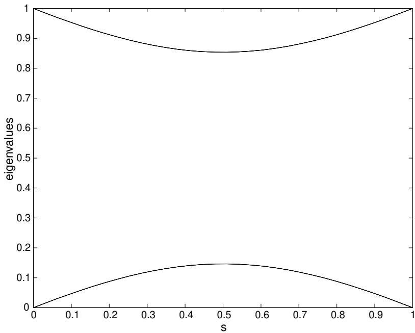  
Figure 1: The two eigenvalues of $\tilde { H } ( s )$ for a one-qubit example.

# 3.2 Two Qubits

A simple two-qubit example has a single two-bit clause that allows the bit values 01 and 10 but not 00 and 11. We call this clause “2-bit disagree.” We take $H _ { \mathrm { B } }$ of the form (2.22) with $n = 2$ and $d _ { 1 } = d _ { 2 } = 1$ , and we take $H _ { \mathrm { P } }$ of the form (2.16) with the single 2-bit disagree clause. The instantaneous eigenvalues of $\tilde { H } ( s )$ of the form (2.24) are shown in Fig. 4. There are two ground states of $H _ { \mathrm { P } }$ , $\left| z _ { 1 } = 0 \right. \left| z _ { 2 } = 1 \right.$ and $\left| z _ { 1 } = 1 \right. \left| z _ { 2 } = 0 \right.$ . The starting state $| \psi ( 0 ) \rangle$ , which is the ground state of $H _ { \mathrm { B } }$ , is (2.21) with $n = 2$ . There is a bit-exchange operation $| z _ { 1 }  | z _ { 2 }   | z _ { 2 }  | z _ { 1 } $ that commutes with $\tilde { H } ( s )$ . Since the starting state $| \psi ( 0 ) \rangle$ is invariant under the bit-exchange operation, the state corresponding to the $s = 1$ end of the lowest level in Fig. 4 is the symmetric state $\begin{array} { r } { \frac { 1 } { \sqrt { 2 } } \big ( | z _ { 1 } = 0 \rangle | z _ { 2 } = 1 \rangle + | z _ { 1 } = 1 \rangle | z _ { 2 } = 0 \rangle } \end{array}$ . The next level, $E _ { 1 } ( s )$ , begins at the antisymmetric state $\begin{array} { r } { \frac { 1 } { \sqrt { 2 } } \big ( \vert x _ { 1 } = 0 \rangle \vert x _ { 2 } = 1 \rangle - \vert x _ { 1 } = 1 \rangle \vert x _ { 2 } = 0 \rangle \big ) } \end{array}$  and ends at the antisymmetric state $\begin{array} { r } { \frac { 1 } { \sqrt { 2 } } \big ( | z _ { 1 } = 0 \rangle | z _ { 2 } = 1 \rangle - | z _ { 1 } = 1 \rangle | z _ { 2 } = 0 \rangle } \end{array}$ . Because $\tilde { H } ( s )$ commutes with the bit-exchange operation there can be no transitions from the symmetric to the antisymmetric states. Therefore the $E _ { 1 } ( s )$ curve in Fig. 4 is irrelevant to the adiabatic evolution of the ground state and the relevant gap is $E _ { 2 } ( s ) - E _ { 0 } ( s )$ .

Closely related to 2-bit disagree is the “2-bit agree clause,” which has 00 and 11 as satisfying assignments. We can obtain $H _ { \mathrm { P } }$ for this problem by taking $H _ { \mathrm { P } }$ for 2-bit disagree and acting with the operator that takes $| z _ { 1 }  | z _ { 2 }   | \overline { { { z } } } _ { 1 }  | z _ { 2 } $ . Note that $H _ { \mathrm { B } } = H _ { \mathrm { B } } ^ { ( 1 ) } + H _ { \mathrm { B } } ^ { ( 2 ) }$ is invariant under this transformation as is the starting state $| \psi ( 0 ) \rangle$ given in (2.21). This implies that the levels of $\tilde { H } ( s )$ corresponding to 2-bit agree are the same as those for 2-bit disagree and that beginning with the ground state of $H _ { \mathrm { B } }$ , adiabatic evolution brings you to $\begin{array} { r } { \frac { 1 } { \sqrt { 2 } } \big ( | z _ { 1 } = 0 \rangle | z _ { 2 } = 0 \rangle + | z _ { 1 } = 1 \rangle | z _ { 2 } = 1 \rangle } \end{array}$ .

Another two-bit example that we will use later is the clause “imply”. Here the satisfying assignments are 00, 01, and 11. The relevant level diagram is shown in Fig. 5.

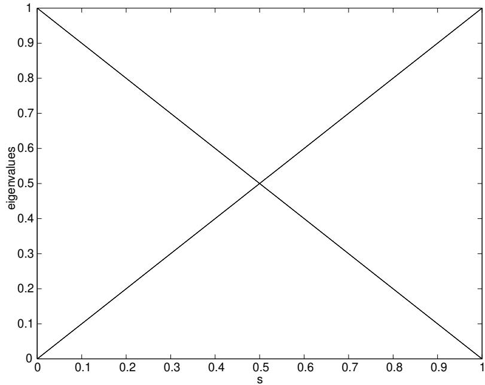  
Figure 2: The two eigenvalues of $\tilde { H } ( s )$ for a one-qubit example where $H _ { \mathrm { B } }$ and $H _ { \mathrm { P } }$ are diagonal in the same basis. The levels cross so $g _ { \mathrm { m i n } } = 0$ .

# 3.3 Three Qubits

Next we present a three-bit example that is built up from two-bit clauses so we have an instance of 2-SAT with three bits. We take the 2-bit imply clause acting on bits 1 and 2, the 2-bit disagree clause acting on bits 1 and 3, and the 2-bit agree clause acting on bits 2 and 3. Although each two-bit clause has more than one satisfying assignment, the full problem has the unique satisfying assignment 011.

The corresponding quantum Hamiltonian, ${ \widetilde H } ( s ) = ( 1 - s ) H _ { \mathrm { B } } + s H _ { \mathrm { P } }$ , we write as the sum of Hamiltonians each of which acts on two bits,

$$
\begin{array} { r l } & { H _ { \mathrm { P } } = H _ { \mathrm { i m p l y } } ^ { 1 2 } + H _ { \mathrm { d i s a g r e e } } ^ { 1 3 } + H _ { \mathrm { a g r e e } } ^ { 2 3 } } \\ & { H _ { \mathrm { B } } = ( H _ { \mathrm { B } } ^ { ( 1 ) } + H _ { \mathrm { B } } ^ { ( 2 ) } ) + ( H _ { \mathrm { B } } ^ { ( 1 ) } + H _ { \mathrm { B } } ^ { ( 3 ) } ) + ( H _ { \mathrm { B } } ^ { ( 2 ) } + H _ { \mathrm { B } } ^ { ( 3 ) } ) \ . } \end{array}
$$

The eigenvalues of $\tilde { H } ( s )$ are shown in Fig. 6. We see that $g _ { \mathrm { m i n } }$ is not zero. Starting in the ground state of $H _ { \mathrm { B } }$ , and evolving according to (2.1) with $H ( t ) = \tilde { H } ( t / T )$ the system will end up in the ground state of $H _ { \mathrm { P } }$ for $T \gg 1 / g _ { \mathrm { m i n } } ^ { 2 }$ . This example illustrates how our algorithm evolves to the unique satisfying assignment of several overlapping clauses even when each separate clause has more than one satisfying assignment.

The alert reader may have noticed that two of the levels in Fig. 6 cross. This can be understood in terms of a symmetry. The Hamiltonian $H _ { \mathrm { P } }$ of (3.5) is invariant under the unitary transformation $V { \big ( } | z _ { 1 } \rangle | z _ { 2 } \rangle | z _ { 3 } \rangle { \big ) } = | { \overline { { z } } } _ { 2 } \rangle | { \overline { { z } } } _ { 1 } \rangle | z _ { 3 } \rangle$ , as is $H _ { \mathrm { B } }$ . Now the three states with energy equal to 4 at $s = 0$ are $\left| x _ { 1 } = 1 \right. \left| x _ { 2 } = 1 \right. \left| x _ { 3 } = 0 \right.$ , $\left| x _ { 1 } = 0 \right. \left| x _ { 2 } = 1 \right. \left| x _ { 3 } = 1 \right.$ , and $\left| x _ { 1 } = 1 \right. \left| x _ { 2 } = 0 \right. \left| x _ { 3 } = 1 \right.$ . The transformation $| z \rangle \to | { \overline { { z } } } \rangle$ in the $| x \rangle$ basis is $| x   ( - 1 ) ^ { x } | x $ , so the states

$$
\left| x _ { 1 } = 1 \right. \left| x _ { 2 } = 1 \right. \left| x _ { 3 } = 0 \right. { \mathrm { ~ a n d ~ } } \left| x _ { 1 } = 0 \right. \left| x _ { 2 } = 1 \right. \left| x _ { 3 } = 1 \right. - \left| x _ { 1 } = 1 \right. \left| x _ { 2 } = 0 \right. \left| x _ { 3 } = 1 \right.
$$

are invariant under $V$ , whereas

$$
\left| x _ { 1 } = 0 \right. \left| x _ { 2 } = 1 \right. \left| x _ { 3 } = 1 \right. + \left| x _ { 1 } = 1 \right. \left| x _ { 2 } = 0 \right. \left| x _ { 3 } = 1 \right.
$$

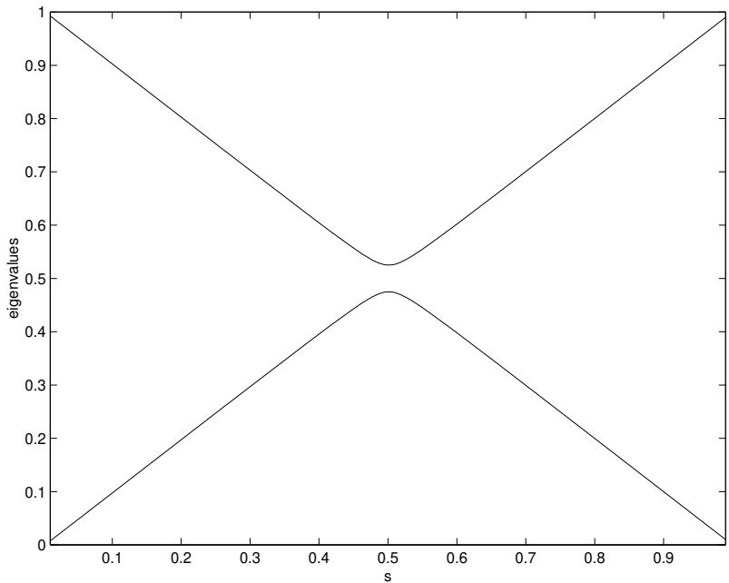  
Figure 3: A small perturbation is added to the Hamiltonian associated with Fig. 2 and we see that the levels no longer cross.

goes to minus itself. We call these two different transformation properties “invariant” and “odd”. Thus at $s = 0$ there are two invariant states and one odd state with energy 4. We see from Fig. 6 that one combination of these states ends up at energy 2 when $s = 1$ . The energy-2 state at $s = 1$ is $\left| z _ { 1 } = 0 \right. \left| z _ { 2 } = 1 \right. \left| z _ { 3 } = 0 \right.$ , which is invariant so the level moving across from energy 4 to energy 2 is invariant. This means that one of the two levels that start at energy 4 and end at energy 1 is invariant and the other is odd. Since the Hilbert space can be decomposed into a direct sum of the invariant and odd subspaces and accordingly $H ( t )$ is block diagonal, the invariant and odd states are decoupled, and their crossing is not an unlikely occurrence.

Since, in this simple 3-bit example, we do see levels cross you may wonder if we should expect to sometimes see the two lowest levels cross in more complicated examples. We now argue that we do not expect this to happen and even if it does occur it will not effect the evolution of the ground state. First note that the transformation which is a symmetry of (3.5) is not a symmetry of the individual terms in the sum. Thus it is unlikely that such symmetries will typically be present in more complicated $n$ -bit examples. However, it is inevitable that certain instances of problems will give rise to Hamiltonians that are invariant under some transformation. Imagine that the transformation consists of bit interchange and negation (in the $z$ basis) as in the example just discussed. Then the starting state $| x = 0 \rangle$ given by (2.21) is invariant. Assume that $H _ { \mathrm { P } }$ has a unique ground state $| z _ { 1 } = w _ { 1 } \rangle | z _ { 2 } = w _ { 2 } \rangle \cdot \cdot \cdot | z _ { n } = w _ { n } \rangle$ . Since $H _ { \mathrm { P } }$ is invariant this state must transform into itself, up to a phase. However, from the explicit form of the ground state we see that it transforms without a phase, that is, it is invariant. Thus, following the evolution of the ground state we can restrict our attention to invariant states. The gap that matters is the smallest energy difference between the two lowest invariant states.

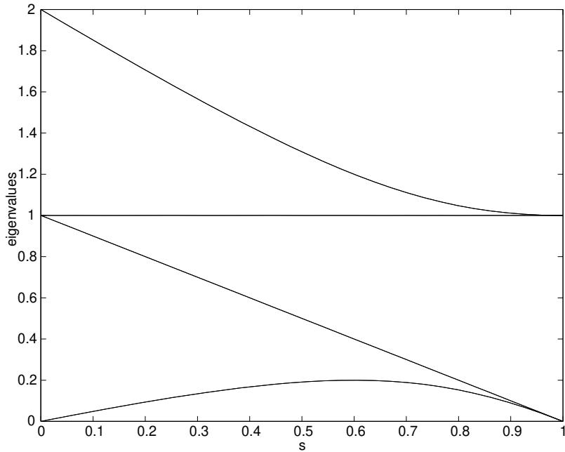  
Figure 4: The four eigenvalues of $\widetilde H ( s )$ associated with “2-bit disagree”. The same levels are associated with “2-bit agree”.

# 4 Examples with an Arbitrary Number of Bits

Here we discuss four examples of $n$ -bit instances of satisfiability. In three of the examples the problems are classically computationally simple to solve. These problems also have structure that we exploit to calculate $g _ { \mathrm { m i n } }$ in the corresponding quantum version. In each case $g _ { \mathrm { m i n } }$ goes like $1 / n ^ { p }$ , so these problems can be solved in polynomial time by adiabatic quantum evolution. The other example is the “Grover problem” [2], which has a single (generalized) $n$ -bit clause with a unique satisfying assignment. If we assume that we treat the clause as an oracle, which may be queried but not analyzed, it takes $2 ^ { n }$ classical queries to find the satisfying assignment. Our quantum version has $g _ { \mathrm { m i n } }$ of order $2 ^ { - n / 2 }$ , so the time required for quantum adiabatic evolution scales like $2 ^ { n }$ , which means that there is no quantum speedup. Nonetheless, it is instructive to see how it is possible to evaluate $g _ { \mathrm { m i n } }$ for the Grover problem.

# 4.1 2-SAT on a Ring: Agree and Disagree

Consider an $n$ -bit problem with $n$ clauses, each of which acts only on adjacent bits, that is, clause $C _ { j }$ acts on bits $j$ and $j + 1$ where $j$ runs from 1 to $n$ and bit $n + 1$ is identified with bit 1. Furthermore we restrict each clause to be either “agree”, which means that 00 and 11 are satisfying assignments or “disagree”, which means that 01 and 10 are satisfying assignments. Suppose there are an even number of disagree clauses so that a satisfying assignment on the ring exists. Clearly given the list of clauses it is trivial to construct the satisfying assignment. Also, if $w _ { 1 } , w _ { 2 } , \ldots , w _ { n }$ is a satisfying assignment, so is $\overline { { w } } _ { 1 } , \overline { { w } } _ { 2 } , \ldots , \overline { { w } } _ { n }$ , so there are always exactly two satisfying assignments.

The quantum version of the problem has

$$
H _ { \mathrm { P } } = H _ { C _ { 1 } } ^ { 1 2 } + H _ { C _ { 2 } } ^ { 2 3 } + \cdot \cdot \cdot + H _ { C _ { n } } ^ { n n + 1 }
$$

where each $C _ { j }$ is either agree or disagree. The ground states of $H _ { \mathrm { P } }$ are $\left| w _ { 1 } \right. \left| w _ { 2 } \right. \cdots \left| w _ { n } \right.$ and $| \overline { { w } } _ { 1 } \rangle \times$

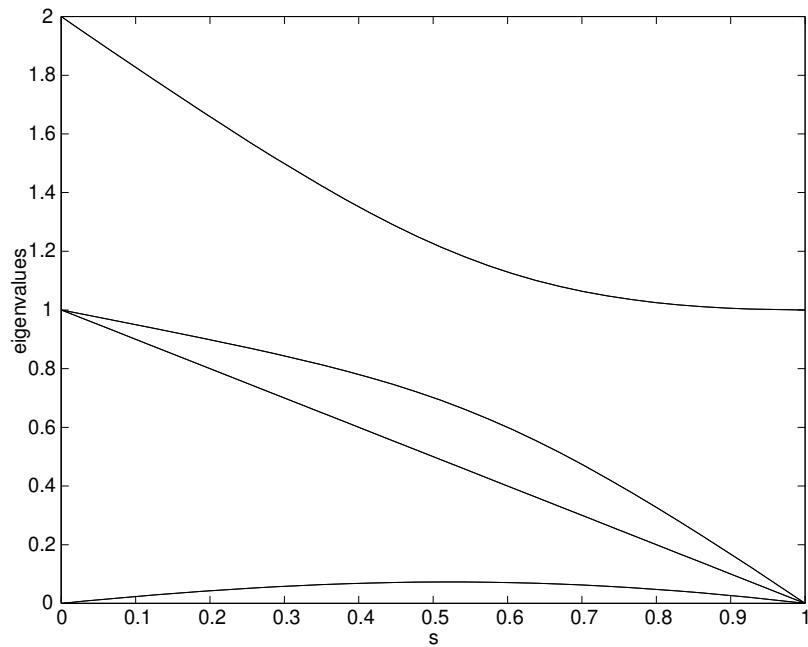  
Figure 5: The four eigenvalues of $\tilde { H } ( s )$ associated with the 2-bit imply clause.

$\left| \overline { { w } } _ { 2 } \right. \cdots \left| \overline { { w } } _ { n } \right.$ all in the $z$ basis. Define the unitary transformation

$$
\left| z _ { 1 } \right. \left| z _ { 2 } \right. \cdots \left| z _ { n } \right. \longrightarrow \left| z _ { 1 } ^ { \prime } \right. \left| z _ { 2 } ^ { \prime } \right. \cdots \left| z _ { n } ^ { \prime } \right. \qquad \left\{ \begin{array} { l l } { { z _ { j } ^ { \prime } = \overline { { { z } } } _ { j } \ , } } & { { \mathrm { i f } \ w _ { j } = 1 } } \\ { { z _ { j } ^ { \prime } = z _ { j } \ , } } & { { \mathrm { i f } \ w _ { j } = 0 \ . } } \end{array} \right.
$$

Under this transformation $H _ { \mathrm { P } }$ becomes

$$
H _ { \mathrm { P } } = H _ { \mathrm { a g r e e } } ^ { 1 2 } + H _ { \mathrm { a g r e e } } ^ { 2 3 } + \cdot \cdot \cdot + H _ { \mathrm { a g r e e } } ^ { n n + 1 }
$$

and the symmetric ground state of $H _ { \mathrm { P } }$ is

$$
| w \rangle = \frac { 1 } { \sqrt { 2 } } \big ( | z _ { 1 } = 0 \rangle | z _ { 2 } = 0 \rangle \cdots | z _ { n } = 0 \rangle + | z _ { 1 } = 1 \rangle | z _ { 2 } = 1 \rangle \cdots | z _ { n } = 1 \rangle \big ) \ .
$$

We take $H _ { \mathrm { B } }$ to be (2.22) with $n$ bits and each $d _ { i } = 2$ . $H _ { \mathrm { B } }$ is invariant under the transformation just given. This implies that the spectrum of $\begin{array} { r } { \widetilde { H } ( s ) = ( 1 - s ) H _ { \mathrm { B } } + s H _ { \mathrm { P } } } \end{array}$ , with $H _ { \mathrm { P } }$ given by (4.1), is identical to the spectrum of $\tilde { H } ( s )$ with $H _ { \mathrm { P } }$ given by (4.3). Thus when we find $g _ { \mathrm { m i n } }$ using (4.3) we will have found $g _ { \mathrm { m i n } }$ for all of the $n$ -bit agree-disagree problems initially described.

We can write $\tilde { H } ( s )$ using (4.3) for $H _ { \mathrm { P } }$ a s

$$
\widetilde { H } ( s ) = ( 1 - s ) \sum _ { j = 1 } ^ { n } ( 1 - \sigma _ { x } ^ { ( j ) } ) + s \sum _ { j = 1 } ^ { n } \frac { 1 } { 2 } ( 1 - \sigma _ { z } ^ { ( j ) } \sigma _ { z } ^ { ( j + 1 ) } ) ~ .
$$

We denote the $s = 0$ ground state given by (2.21) as $| x = 0 \rangle$ . Define the operator $G$ that negates the value of each bit in the $z$ basis, that is, $G \left| z _ { 1 } \right. \left| z _ { 2 } \right. \cdot \cdot \cdot \left| z _ { n } \right. = \left| { \overline { { z } } } _ { 1 } \right. \left| { \overline { { z } } } _ { 2 } \right. \cdot \cdot \cdot \left| { \overline { { z } } } _ { n } \right.$ . This can be written as

$$
G = \prod _ { j = 1 } ^ { n } \sigma _ { x } ^ { ( j ) } ~ .
$$

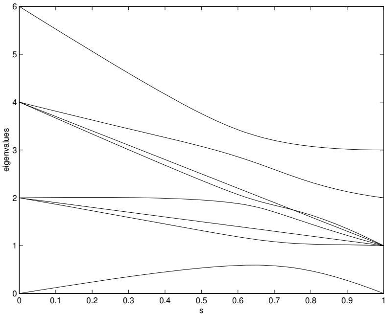  
Figure 6: The eight levels of $\tilde { H } ( s )$ for the 3-bit problem with $H _ { \mathrm { P } }$ and $H _ { \mathrm { B } }$ given by (3.5).

Since $G \left| x = 0 \right. = \left| x = 0 \right.$ and $\left[ G , \widetilde { H } ( s ) \right] = 0$ , we can restrict our attention to states that are invariant under $G$ such as (4.4).

We now write (4.5) in the invariant sector as a sum of $n / 2$ commuting $2 \times 2$ Hamiltonians that we can diagonalize. First we make a standard transformation to fermion operators. To this end we define for $j = 1 , \dotsc , n$ ,

$$
\begin{array} { r l } & { b _ { j } = \sigma _ { x } ^ { ( 1 ) } \sigma _ { x } ^ { ( 2 ) } \cdot \cdot \cdot \sigma _ { x } ^ { ( j - 1 ) } \sigma _ { - } ^ { ( j ) } 1 ^ { ( j + 1 ) } \cdot \cdot \cdot 1 ^ { ( n ) } } \\ & { b _ { j } ^ { \dagger } = \sigma _ { x } ^ { ( 1 ) } \sigma _ { x } ^ { ( 2 ) } \cdot \cdot \cdot \sigma _ { x } ^ { ( j - 1 ) } \sigma _ { + } ^ { ( j ) } 1 ^ { ( j + 1 ) } \cdot \cdot \cdot 1 ^ { ( n ) } } \end{array}
$$

where

$$
\begin{array} { r } { \sigma _ { - } = \frac { 1 } { 2 } \left( \begin{array} { c c } { 1 } & { - 1 } \\ { 1 } & { - 1 } \end{array} \right) \quad \mathrm { a n d } \quad \sigma _ { + } = \frac { 1 } { 2 } \left( \begin{array} { c c } { 1 } & { 1 } \\ { - 1 } & { - 1 } \end{array} \right) . } \end{array}
$$

It is straightforward to verify that

$$
\begin{array} { l } { { \{ b _ { j } , b _ { k } \} = 0 } } \\ { { { \{ b _ { j } , b _ { k } ^ { \dagger } \} = \delta _ { j k } } } } \end{array}
$$

where $\{ A , B \} = A B + B A$ . Furthermore

$$
\begin{array} { r } { b _ { j } ^ { \dagger } b _ { j } = \frac { 1 } { 2 } ( 1 - \sigma _ { x } ^ { ( j ) } ) } \end{array}
$$

for $j = 1 , \dotsc , n$ and

$$
( b _ { j } ^ { \dagger } - b _ { j } ) ( b _ { j + 1 } ^ { \dagger } + b _ { j + 1 } ) = \sigma _ { z } ^ { ( j ) } \sigma _ { z } ^ { ( j + 1 ) }
$$

for $j = 1 , \ldots , n - 1$ . We need a bit more care to make sense of (4.10) for $j = n$ . An explicit calculation shows that

$$
( b _ { n } ^ { \dagger } - b _ { n } ) ( b _ { 1 } ^ { \dagger } + b _ { 1 } ) = - G \sigma _ { z } ^ { ( n ) } \sigma _ { z } ^ { ( 1 ) }
$$

where $G$ is given by (4.6). Since we will restrict ourselves to the $G = 1$ sector, (4.10) and (4.11) are only consistent if $b _ { n + 1 } = - b _ { 1 }$ , so we take this as the definition of $b _ { n + 1 }$ .

We can now reexpress $\tilde { H } ( s )$ of (4.5) in terms of the $b$ ’s:

$$
\widetilde { H } ( s ) = \sum _ { j = 1 } ^ { n } \Bigl \{ 2 ( 1 - s ) b _ { j } ^ { \dagger } b _ { j } + \frac { s } { 2 } \bigl ( 1 - ( b _ { j } ^ { \dagger } - b _ { j } ) ( b _ { j + 1 } ^ { \dagger } + b _ { j + 1 } ) \bigr ) \Bigr \} .
$$

Because this is invariant under the translation, $b _ { j } ~ \to ~ b _ { j + 1 }$ , and is quadratic in the $b _ { j }$ and $b _ { j } ^ { \dagger }$ , a transformation to fermion operators associated with waves running round the ring will achieve the desired reduction of $\tilde { H } ( s )$ . Let

$$
\beta _ { p } = \frac { 1 } { \sqrt { n } } \sum _ { j = 1 } ^ { n } e ^ { i \pi p j / n } b _ { j } \quad \mathrm { f o r } \ p = \pm 1 , \pm 3 , . . . , \pm ( n - 1 )
$$

which is equivalent to

$$
b _ { j } = \frac { 1 } { \sqrt { n } } \sum _ { p = \pm 1 , \pm 3 , . . . , \pm ( n - 1 ) } e ^ { - i \pi p j / n } \beta _ { p }
$$

and is consistent with $b _ { n + 1 } = - b _ { 1 }$ . (We assume for simplicity that $n$ is even.) Furthermore

$$
\big \{ \beta _ { p } , \beta _ { q } \big \} = 0
$$

and

$$
\big \{ \beta _ { p } , \beta _ { q } ^ { \dagger } \big \} = \delta _ { p q }
$$

which follows from (4.8). Substituting (4.14) into (4.12) gives

$$
\widetilde { H } ( s ) = \sum _ { p = 1 , 3 , . . . , ( n - 1 ) } A _ { p } ( s )
$$

where

$$
\begin{array} { l } { { A _ { p } ( s ) = 2 ( 1 - s ) \bigl [ \beta _ { p } ^ { \dagger } \beta _ { p } + \beta _ { - p } ^ { \dagger } \beta _ { - p } \bigr ] } } \\ { { \qquad + s \Bigl \{ 1 - \cos { \frac { \pi p } { n } } \bigl [ \beta _ { p } ^ { \dagger } \beta _ { p } - \beta _ { - p } \beta _ { - p } ^ { \dagger } \bigr ] + i \sin { \frac { \pi p } { n } } \bigl [ \beta _ { - p } ^ { \dagger } \beta _ { p } ^ { \dagger } - \beta _ { p } \beta _ { - p } \bigr ] \Bigr \} . } } \end{array}
$$

The $A _ { p }$ ’s commute for different values of $p$ so we can diagonalize each $A _ { p }$ separately.

For each $p > 0$ let $| \Omega _ { p } \rangle$ be the state annihilated by both $\beta _ { p }$ and $\beta _ { - p }$ , that is, $\beta _ { p } \left| \Omega _ { p } \right. = \beta _ { - p } \left| \Omega _ { p } \right. = 0$ . When $s = 0$ , $| \Omega _ { p } \rangle$ is the ground state of $A _ { p }$ . Now $A _ { p } ( s )$ only connects $| \Omega _ { p } \rangle$ to $| \Sigma _ { p } \rangle = \beta _ { - p } ^ { \intercal } \beta _ { p } ^ { \dagger } \left| \Omega _ { p } \right.$ . In the $| \Omega _ { p } \rangle$ , $\left| \Sigma _ { p } \right.$ basis $A _ { p } ( s )$ is

$$
A _ { p } ( s ) = \left[ \begin{array} { l l l } { s + s \cos \pi p / n } & { } & { i s ( \sin \pi p / n ) } \\ { - i s ( \sin \pi p / n ) } & { } & { 4 - 3 s - s \cos \pi p / n } \end{array} \right] ~ .
$$

For each $p$ the two eigenvalues of $A _ { p } ( s )$ are

$$
E _ { p } ^ { \pm } ( s ) = 2 - s \pm \left\{ ( 2 - 3 s ) ^ { 2 } + 4 s ( 1 - s ) ( 1 - \cos \pi p / n ) \right\} ^ { \frac 1 2 } .
$$

The ground state energy of (4.16) is $\sum _ { p } E _ { p } ^ { - } ( s )$ . The next highest energy level is $E _ { 1 } ^ { + } ( s ) + \sum _ { p = 3 \ldots } E _ { p } ^ { - } ( s )$ . The minimum gap occurs very close to $\begin{array} { r } { s = \frac { 2 } { 3 } } \end{array}$ and is

$$
g _ { \mathrm { m i n } } \approx E _ { 1 } ^ { + } ( \frac { 2 } { 3 } ) - E _ { 1 } ^ { - } ( \frac { 2 } { 3 } ) \approx \frac { 4 \pi } { 3 n }
$$

for $n$ large.

Referring back to (2.8) we see that the required evolution time $T$ must be much greater than $\mathcal { E } / g _ { \mathrm { m i n } } ^ { 2 }$ where for this problem $\varepsilon$ scales like $n$ so $T \gg c n ^ { 3 }$ where $c$ is a constant. We have shown that for any set of agree and disagree clauses on an $n$ -bit ring, quantum adiabatic evolution will find the satisfying assignment in a time which grows as a fixed power of $n$ .

# 4.2 The Grover Problem

Here we consider the Grover problem [2], which we recast for the present context. We have a single (generalized) clause, $h _ { G }$ , which depends on all $n$ bits with a unique (but unknown) satisfying assignment $w = w _ { 1 } , w _ { 2 } , \ldots , w _ { n }$ . Corresponding to $h _ { G }$ is a problem Hamiltonian

$$
\begin{array} { c } { { H _ { \mathrm { P } } \left| z \right. = \left\{ \begin{array} { c l } { { \left| z \right. , } } & { { z \neq w } } \\ { { 0 , } } & { { z = w } } \end{array} \right. } } \\ { { = 1 - \left| z = w \right. \left. z = w \right| } } \end{array}
$$

where we use the shorthand $| z \rangle = | z _ { 1 } \rangle | z _ { 2 } \rangle \dots , | z _ { n } \rangle$ . We imagine that we can construct $H ( t ) = \tilde { H } ( t / T )$ of the form (2.23) with $H _ { \mathrm { B } }$ given by (2.22) with $d _ { i } = 1$ for all $i$ from $^ { 1 }$ to $n$ . Since we are evolving using $H ( t )$ the problem is “oracular,” that is, we use no knowledge about the structure of $H _ { \mathrm { P } }$ which could aid us in finding $w$ other than (4.21).

We can write $\tilde { H } ( s )$ explicitly as

$$
\widetilde { H } ( s ) = ( 1 - s ) \sum _ { j = 1 } ^ { n } { \textstyle \frac { 1 } { 2 } } \big ( 1 - \sigma _ { x } ^ { ( j ) } \big ) + s \big ( 1 - | z = w \rangle \langle z = w | \big ) \ .
$$

Consider the transformation given by (4.2). Under this transformation $\tilde { H } ( s )$ becomes

$$
\widetilde { H } ( s ) = ( 1 - s ) \sum _ { j = 1 } ^ { n } { \textstyle \frac { 1 } { 2 } } ( 1 - \sigma _ { x } ^ { ( j ) } ) + s \big ( 1 - | z = 0 \rangle \langle z = 0 | \big ) \ .
$$

Because the two Hamiltonians (4.22) and (4.23) are unitarily equivalent they have the same spectra and accordingly the same $g _ { \mathrm { m i n } }$ . Thus it suffices to study (4.23).

The ground state of $\widetilde { H } ( 0 )$ is $| x = 0 \rangle$ , which is symmetric under the interchange of any two bits. Also the operator (4.23) is symmetric under the interchange of any two bits. Instead of working in the $2 ^ { n }$ -dimensional space we can work in the $( n + 1 )$ -dimensional subspace of symmetrized states. It is convenient (and perhaps more familiar to physicists) to define these states in terms of the total spin. Define $\vec { S } = ( S _ { x } , S _ { y } , S _ { z } )$ by

$$
S _ { a } = \textstyle { \frac { 1 } { 2 } } \sum _ { j = 1 } ^ { n } \sigma _ { a } ^ { ( j ) }
$$

for $a = x , y , z$ . The symmetrical states have $\vec { S } ^ { 2 }$ equal to $\textstyle { \frac { n } { 2 } } { \bigl ( } { \frac { n } { 2 } } + 1 { \bigr ) }$ , where $\vec { S } ^ { 2 } = S _ { x } ^ { 2 } + S _ { y } ^ { 2 } + S _ { z } ^ { 2 }$ . We can characterize these states as either eigenstates of $S _ { x }$ or $S _ { z }$

$$
{ \begin{array} { r l } { S _ { x } \left| m _ { x } = m \right. = m \left| m _ { x } = m \right. \quad } & { m = - { \frac { n } { 2 } } , - { \frac { n } { 2 } } + 1 , \ldots , { \frac { n } { 2 } } } \\ { S _ { z } \left| m _ { z } = m \right. = m \left| m _ { z } = m \right. \quad } & { m = - { \frac { n } { 2 } } , - { \frac { n } { 2 } } + 1 , \ldots , { \frac { n } { 2 } } } \end{array} }
$$

where we have suppressed the total spin label since it never changes. In terms of the $z$ basis states previously introduced,

$$
{ \big | } m _ { z } = { \textstyle { \frac { n } { 2 } } } - k { \big \rangle } = { \binom { n } { k } } ^ { - { \frac { 1 } { 2 } } } \sum _ { \substack { z _ { 1 } + z _ { 2 } + \cdots + z _ { n } = k } } { \big | } z _ { 1 } { \big \rangle } { \big | } z _ { 2 } { \big \rangle } \cdots { \big | } z _ { n } { \big \rangle }
$$

for $k = 0 , 1 , \ldots , n$ . In particular

$$
\begin{array} { r } { \left| m _ { z } = \frac { n } { 2 } \right. = \left| z = 0 \right. \ . } \end{array}
$$

Now we can write $\tilde { H } ( s )$ in (4.23) as

$$
\begin{array} { r } { \widetilde { H } ( s ) = ( 1 - s ) \left[ \frac { n } { 2 } - S _ { x } \right] + s \left[ 1 - \left| m _ { z } = \frac { n } { 2 } \right. \left. m _ { z } = \frac { n } { 2 } \right| \right] . } \end{array}
$$

We have reduced the problem, since $\tilde { H } ( s )$ is now an $( n + 1 )$ -dimensional matrix whose elements we can simply evaluate.

We wish to solve

$$
{ \widetilde { H } } ( s ) \left| \psi \right. = E \left| \psi \right.
$$

for the lowest two eigenvalues at the value of $s$ at which they are closest. Hitting (4.29) with $\begin{array} { r } { \left. m _ { x } = \frac { n } { 2 } - r \right. } \end{array}$ we get

$$
\begin{array} { r l } & { [ s + ( 1 - s ) r ]  m _ { x } = \frac { n } { 2 } - r  \psi  - s  m _ { x } = \frac { n } { 2 } - r  m _ { z } = \frac { n } { 2 }   m _ { z } = \frac { n } { 2 }  \psi  } \\ & { \qquad = E  m _ { x } = \frac { n } { 2 } - r  \psi  . } \end{array}
$$

We replace $E$ by the variable $\lambda$ where $E = s + ( 1 - s ) \lambda$ and obtain

$$
{ \frac { ( 1 - s ) } { s } }  m _ { x } = { \frac { n } { 2 } } - r | \psi  = { \frac { 1 } { r - \lambda } }  m _ { x } = { \frac { n } { 2 } } - r | m _ { z } = { \frac { n } { 2 } }   m _ { z } = { \frac { n } { 2 } } | \psi  .
$$

Multiply by $\begin{array} { r } {  m _ { z } = \frac { n } { 2 } | m _ { x } = \frac { n } { 2 } - r  } \end{array}$ and sum over $r$ to get

$$
{ \frac { ( 1 - s ) } { s } } = \sum _ { r = 0 } ^ { n } { \frac { 1 } { r - \lambda } } P _ { r }
$$

where

$$
P _ { r } = |  m _ { z } = \frac { n } { 2 } | m _ { x } = \frac { n } { 2 } - r  | ^ { 2 } .
$$

Using (4.26) with $k = 0$ and also the identical formula with $z$ replaced by $x$ we have

$$
P _ { r } = \frac { 1 } { 2 ^ { n } } \Big ( { n \atop r } \Big ) \ .
$$

The eigenvalue equation (4.32) has $n + 1$ roots. By graphing the right-hand side of (4.32) and keeping $0 < s < 1$ we see that there is one root for $\lambda < 0$ , one root between 0 and $1$ , one root between 1 and 2, $\cdot \cdot \cdot$ , and one root between $n - 1$ and $n$ . The two lowest eigenvalues of $E = s + ( 1 - s ) \lambda$ correspond to the root with $\lambda < 0$ and the root with $0 < \lambda < 1$ . We will now show that there is a value of $s$ for which these two roots are both very close to zero.

The left-hand side of (4.32) ranges over all positive values as $s$ varies from $0$ to $^ { 1 }$ . Pick $s = s ^ { * }$ such that

$$
\frac { ( 1 - s ^ { * } ) } { s ^ { * } } = \sum _ { r = 1 } ^ { n } \frac { P _ { r } } { r } .
$$

At $s = s ^ { * }$ the eigenvalue equation (4.32) becomes

$$
{ \frac { P _ { 0 } } { \lambda } } = \sum _ { r = 1 } ^ { n } P _ { r } { \frac { \lambda } { r ( r - \lambda ) } } \ .
$$

From (4.34) we know that $P _ { 0 } = 2 ^ { - n }$ . Define $u$ by $\lambda = 2 ^ { - n / 2 } u$ . Then (4.36) becomes

$$
{ \frac { 1 } { u } } = \sum _ { r = 1 } ^ { n } P _ { r } { \frac { u } { r ( r - 2 ^ { - n / 2 } u ) } } \ .
$$

Because of the $2 ^ { - n / 2 }$ we can neglect the $u$ piece in the denominator and we get

$$
{ \frac { 1 } { u ^ { 2 } } } \approx \sum _ { r = 1 } ^ { n } { \frac { P _ { r } } { r ^ { 2 } } }
$$

which gives

$$
\lambda \approx \pm \Big ( \sum _ { r = 1 } ^ { n } \frac { P _ { r } } { r ^ { 2 } } \Big ) ^ { - \frac { 1 } { 2 } } 2 ^ { - n / 2 }
$$

and we have

$$
g _ { \mathrm { m i n } } \approx 2 ( 1 - s ^ { * } ) \Big ( \sum _ { r = 1 } ^ { n } \frac { P _ { r } } { r ^ { 2 } } \Big ) ^ { - \frac { 1 } { 2 } } 2 ^ { - n / 2 } \ .
$$

Now

$$
\sum _ { r = 1 } ^ { n } { \frac { P _ { r } } { r } } = { \frac { 2 } { n } } + O \left( { \frac { 1 } { n ^ { 2 } } } \right)
$$

and

$$
\sum _ { r = 1 } ^ { n } \frac { P _ { r } } { r ^ { 2 } } = \frac { 4 } { n ^ { 2 } } + O \Big ( \frac { 1 } { n ^ { 3 } } \Big ) \ .
$$

So using (4.35) and (4.40) we have

$$
g _ { \mathrm { m i n } } \simeq 2 \cdot 2 ^ { - \frac { n } { 2 } }
$$

which is exponentially small.

In Fig. 7 we show the two lowest eigenvalues of $\widetilde { H } ( s )$ for the case of 12 bits. If you evolve too quickly the system jumps across the gap and you do not end up in the ground state of $\widetilde H ( 1 )$ .

That $g _ { \mathrm { m i n } }$ goes like $2 ^ { - n / 2 }$ means that the required time for finding the satisfying assignment grows like $2 ^ { n }$ and quantum adiabatic evolution is doing no better than the classical algorithm which checks all $2 ^ { n }$ variable assignments. In reference [3] a Hamiltonian version of the Grover problem was studied with a time dependent Hamiltonian of the form

$$
\begin{array} { r } { H ( t ) = H _ { D } ( t ) + ( 1 - | z = w \rangle \langle z = w | ) ~ . } \end{array}
$$

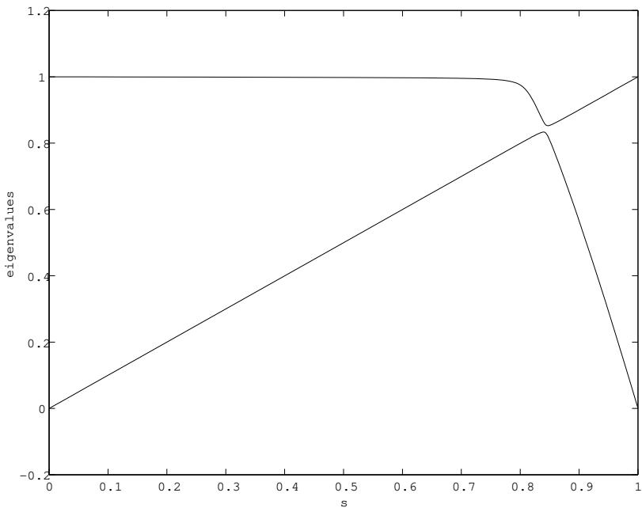  
Figure 7: The two lowest eigenvalues of $\tilde { H } ( s )$ for the Grover problem with 12 bits.

The goal was to choose $H _ { D } ( t )$ without knowing $w$ so that Schr¨odinger evolution from a $w \mathrm { . }$ -independent initial state would bring the system to $| z = w \rangle$ in time $T$ . There it was shown how to choose $H _ { D }$ so that the required running time $T$ grows as $2 ^ { \frac { n } { 2 } }$ , which is then interpreted as the square-root speedup found by Grover. It was also shown that for any $H _ { D } ( t )$ , $T$ must be at least of order $2 ^ { \frac { \pi } { 2 } }$ for the quantum evolution to succeed for all $w$ . (The continuous time bound found in [3] is closely related to the query bound found first in [4].) A slight modification of the argument which gives this lower bound can be made for quantum evolution with

$$
H ( t ) = H _ { D } ( t ) + \frac { t } { T } ( 1 - | z = w \rangle \langle z = w | )
$$

and again $T$ must be at least of order $2 ^ { \frac { \pi } { 2 } }$ . The adiabatic evolution we studied in this section corresponds to $H _ { D } ( t ) = ( 1 - t / T ) H _ { \mathrm { B } }$ with $H _ { \mathrm { B } }$ as described above. The lower bound just discussed shows that no choice of $H _ { \mathrm { B } }$ can achieve better than square-root speedup.

# 4.3 The Bush of Implications

Ultimately we would like to know if there are general (and identifiable) features of problems which can tell us about the size of $g _ { \mathrm { m i n } }$ . For the 2-SAT example of Section 4.1, $g _ { \mathrm { m i n } }$ is of order $1 / n$ whereas for the Grover problem it is of order $2 ^ { - n / 2 }$ . In the Grover case $H _ { \mathrm { P } }$ has the property that $2 ^ { n } - 1$ states have energy 1, that is, there are an exponential number of states just above the ground state. For the ring problem this is not so. With $H _ { \mathrm { P } }$ of the form (4.3) there are no states with energy 1 and (roughly) $n ^ { 2 }$ states with energy 2. Here we present an example with an exponential number of states with energy 1 but for which the gap is of order $1 / n ^ { p }$ . This tells us that we cannot judge the size of the minimum gap just from knowledge of the degeneracy of the first level above the ground state of $H _ { \mathrm { P } }$ .

The example we consider has $n + 1$ bits labeled $0 , 1 , 2 \ldots , n$ . There are $n$ 2-bit imply clauses, each of which involves bit 0 and one of the other $n$ bits. Recall that the imply clause is satisfied by the bit values $0 0 , 0 1$ and 11 but not by 10. Furthermore we have a one-bit clause that is satisfied only if bit 0 has the value 1. The unique satisfying assignment of all clauses is $z _ { 0 } = 1 , z _ { 1 } = 1 , z _ { 2 } = 1 , . . . , z _ { n } = 1$ .

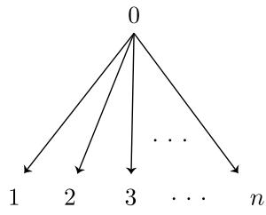

Figure 8: The bush of implications. There is a one-bit clause that is satisfied if bit $\boldsymbol { 0 }$ has a value of $\boldsymbol { { \mathit { 1 } } }$ . There are $n$ imply clauses. The $j ^ { \mathrm { t h } }$ imply clause is satisfied unless bit $\boldsymbol { 0 }$ has the value 1 and bit $j$ has the value $\boldsymbol { 0 }$ .

Suppose that $z _ { 0 } = 0$ . Any of the $2 ^ { n }$ values of $z _ { 1 } , z _ { 2 } , \ldots , z _ { n }$ satisfy all of the imply clauses. Only the one bit clause is not satisfied, so these $2 ^ { n }$ variable assignments violate only one clause. There are $n$ other variable assignments that violate only one clause. These have all bits set to 1 except for the $k$ th bit where $1 \leq k \leq n$ . In total there are $2 ^ { n } + n$ assignments that violate only one clause and accordingly there are an exponential number of states with energy 1.

We can write $H _ { \mathrm { P } }$ explicitly as

$$
H _ { \mathrm { P } } = { \textstyle \frac { 1 } { 2 } } ( 1 + \sigma _ { z } ^ { ( 0 ) } ) + { \textstyle \frac { 1 } { 4 } } \sum _ { j = 1 } ^ { n } ( 1 - \sigma _ { z } ^ { ( 0 ) } ) ( 1 + \sigma _ { z } ^ { ( j ) } ) ~ .
$$

To evaluate $H _ { \mathrm { B } }$ from (2.22) note that bit $0$ is involved in $n + 1$ clauses whereas bits 1 through $n$ are each involved in only one clause, so

$$
H _ { \mathrm { B } } = ( n + 1 ) { \textstyle \frac { 1 } { 2 } } ( 1 - \sigma _ { x } ^ { ( 0 ) } ) + \sum _ { i = 1 } ^ { n } { \textstyle \frac { 1 } { 2 } } ( 1 - \sigma _ { x } ^ { ( i ) } ) ~ .
$$

Then $\tilde { H } ( s )$ in terms of the spin operators (4.24) is

$$
\widetilde { H } ( s ) = ( 1 - s ) \Big [ { \frac { n + 1 } { 2 } } ( 1 - \sigma _ { x } ^ { ( 0 ) } ) + { \frac { n } { 2 } } - S _ { x } \Big ] + s \Big [ { \frac { 1 } { 2 } } ( 1 + \sigma _ { z } ^ { ( 0 ) } ) + { \frac { 1 } { 2 } } ( 1 - \sigma _ { z } ^ { ( 0 ) } ) \Big ( { \frac { n } { 2 } } + S _ { z } \Big ) \Big ] \ .
$$

We need only consider states that are symmetrized in the bits $^ { 1 }$ to $n$ . We can label the relevant states as $| z _ { 0 } \rangle | m _ { z } \rangle$ where $z _ { 0 }$ gives the value of bit $0$ and $m _ { z }$ labels the $z$ component of the total spin as in (4.25). We need to know the matrix elements of $S _ { x }$ in the $| m _ { z } \rangle$ basis. These are

$$
\begin{array} { c } { { \langle m _ { z } ^ { \prime } \mid S _ { x } \mid m _ { z } \rangle = \frac 1 2 \Bigl [ \Bigl ( \displaystyle \frac { n } { 2 } \Bigl ( \frac { n } { 2 } + 1 \Bigr ) - m _ { z } ^ { 2 } - m _ { z } \Bigr ) ^ { \frac { 1 } { 2 } } \delta _ { m _ { z } , m _ { z } ^ { \prime } - 1 } } } \\ { { + \Bigl ( \displaystyle \frac { n } { 2 } \Bigl ( \frac { n } { 2 } + 1 \Bigr ) - m _ { z } ^ { \prime 2 } - m _ { z } ^ { \prime } \Bigr ) ^ { \frac { 1 } { 2 } } \delta _ { m _ { z } ^ { \prime } , m _ { z } - 1 } \Bigr ] \ . } } \end{array}
$$

Given (4.49) we have numerically evaluated the eigenvalues of the $2 ( n + 1 )$ -dimensional matrix with elements

$$
\left( \left. z _ { 0 } ^ { \prime } \right| \left. m _ { z } ^ { \prime } \right| \right) \widetilde H ( s ) \left( \left| z _ { 0 } \right. \left| m _ { z } \right. \right)
$$

for values of $n$ in the range from 20 to 120. The two lowest eigenvalues are shown in Fig. 9 for $n = 5 0$ . The gap is clearly visible. In Fig. 10 we plot $\log ( g _ { \mathrm { m i n } } )$ versus $\log ( n )$ and a power law dependence is

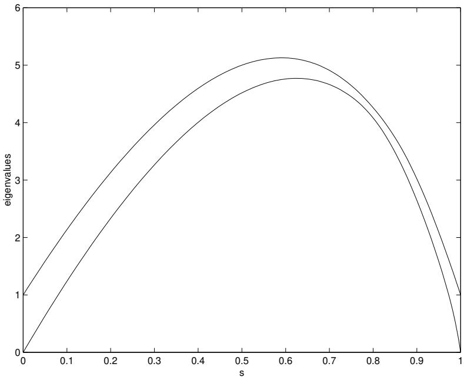  
Figure 9: The two lowest eigenvalues of $\tilde { H } ( s )$ for the bush of implications with $n = 5 0$ . The visible gap indicates that $g _ { \mathrm { m i n } }$ is not exponentially small.

clearly visible. We conclude that $g _ { \mathrm { m i n } } \sim n ^ { - p }$ with $\textstyle p \simeq { \frac { 3 } { 8 } }$ . For this problem the maximum eigenvalue of $H _ { \mathrm { B } }$ is $2 n + 1$ and the maximum eigenvalue of $H _ { \mathrm { P } }$ is $n + 1$ , so $\varepsilon$ , which appears in (2.8), at most grows linearly with $n$ . Therefore we have that with $T$ of order $n ^ { ( 1 + 2 p ) }$ adiabatic evolution is assured.

We also analyzed adiabatic evolution for the bush of implications using a different prescription for the initial Hamiltonian. We tried

$$
H _ { \mathrm { B } } ^ { \prime } = \sum _ { i = 1 } ^ { n } H _ { \mathrm { B } } ^ { ( i ) }
$$

as opposed to (2.22). This has the effect of replacing the factor of $( n + 1 )$ in (4.47) with a 1. The effect on $g _ { \mathrm { m i n } }$ is dramatic. It now appears to be exponentially small as a function of $n$ . This means that with the choice of $H _ { \mathrm { B } } ^ { \prime }$ above, quantum adiabatic evolution fails to solve the bush of implications in polynomial time. This sensitivity to the distinction between $H _ { \mathrm { B } }$ and $H _ { \mathrm { B } } ^ { \prime }$ presumably arises because bit $0$ is involved in $( n + 1 )$ clauses. This suggests to us that if we restrict attention to problems where no bit is involved in more than, say, 3 clauses, there will be no such dramatic difference between using $H _ { \mathrm { B } }$ or $H _ { \mathrm { B } } ^ { \prime }$ .

# 4.4 Overconstrained 2-SAT

In this section we present another 2-SAT problem consisting entirely of agree and disagree clauses. This time every pair of bits is involved in a clause. We suppose the clauses are consistent, so there are exactly 2 satisfying assignments, as in Section 4.1. In an $n$ -bit instance of this problem, there are $\left( { \begin{array} { l } { n } \\ { 2 } \end{array} } \right)$ clauses, and obviously the collection of clauses is highly redundant in determining the satisfying assignments. We chose this example to explore whether this redundancy could lead to an extremely small $g _ { \mathrm { m i n } }$ . In fact, we will give numerical evidence that $g _ { \mathrm { m i n } }$ goes like $1 / n ^ { p }$ for this problem, whose symmetry simplifies the analysis.

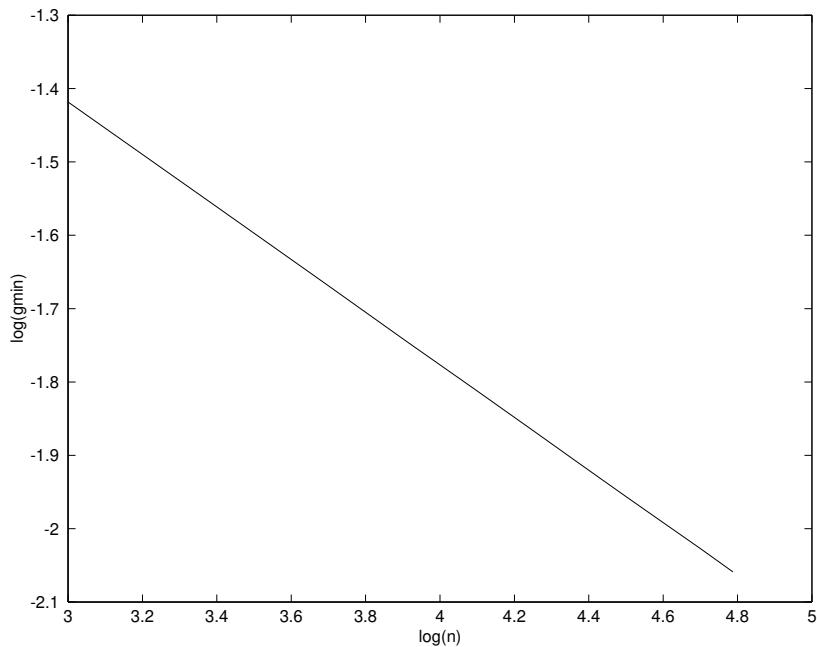  
Figure 10: The bush of implications; $\log ( g _ { \mathrm { m i n } } )$ versus $\log ( n )$ with $n$ ranging from $2 0$ to 120. The straight line indicates that $g _ { \mathrm { m i n } } \sim n ^ { - p }$ .

As with the problem discussed in Section 4.1, at the quantum level we can restrict our attention to the case of all agree clauses, and we have

$$
H _ { \mathrm { P } } = \sum _ { j < k } H _ { \mathrm { a g r e e } } ^ { j k } \ .
$$

Each bit participates in $( n - 1 )$ clauses, so when constructing $H _ { \mathrm { B } }$ using (2.22) we take $d _ { i } = n - 1$ for all $i$ . We can write $\tilde { H } ( s )$ explicitly for this problem

$$
\widetilde { H } ( s ) = ( 1 - s ) ( n - 1 ) \sum _ { j = 1 } ^ { n } \frac { 1 } { 2 } ( 1 - \sigma _ { x } ^ { ( j ) } ) + s \sum _ { j < k } \frac { 1 } { 2 } ( 1 - \sigma _ { z } ^ { ( j ) } \sigma _ { z } ^ { ( k ) } )
$$

which in terms of the total spin operators $S _ { x }$ and $S _ { z }$ is

$$
\widetilde { H } ( s ) = ( 1 - s ) ( n - 1 ) \Big [ \frac { n } { 2 } - S _ { x } \Big ] + s \Big [ \frac { n ^ { 2 } } { 4 } - S _ { z } S _ { z } \Big ] \ .
$$

As in Section 4.3, it is enough to consider the symmetric states $| m _ { z } \rangle$ . Using (4.49), we can find the matrix elements

$$
\langle m _ { z } ^ { \prime } | \widetilde { H } ( s ) | m _ { z } \rangle
$$

and numerically find the eigenvalues of this $( n + 1 ) \times ( n + 1 )$ -dimensional matrix.

Actually there are two ground states of $\widetilde H ( 1 )$ , $\begin{array} { r } { | m _ { z } = \frac { n } { 2 } \rangle } \end{array}$ and $\begin{array} { r } { | m _ { z } = - \frac { n } { 2 } \rangle } \end{array}$ , corresponding to all bits having the value 0 or all bits having the value 1. The Hamiltonian $\tilde { H } ( s )$ is invariant under the operation of negating all bits (in the $z$ basis) as is the initial state given by (2.21). Therefore we can restrict our attention to invariant states. In Fig. 11 we show the two lowest invariant states for 33 bits. The gap is clearly visible. $[ E _ { 1 } ( 0 ) = 6 4 = 2 ( 3 3 - 1 )$ because the invariant states all have an even number of $^ { 1 }$ ’s in the $x$ -basis.) In Fig. 12 we plot $\log ( g _ { \mathrm { m i n } } )$ against $\log ( n )$ . The straight line shows that $g _ { \mathrm { m i n } } \sim n ^ { p }$ with $p \simeq 0 . 7$ . For this problem the maximum eigenvalues of $H _ { \mathrm { B } }$ and $H _ { \mathrm { P } }$ are both of order $n ^ { 2 }$ so $\varepsilon$ appearing in (2.8) is no larger than $n ^ { 2 }$ . Adiabatic evolution with $T$ only as big as $n ^ { ( 2 - 2 p ) }$ will succeed in finding the satisfying assignment for this set of problems.

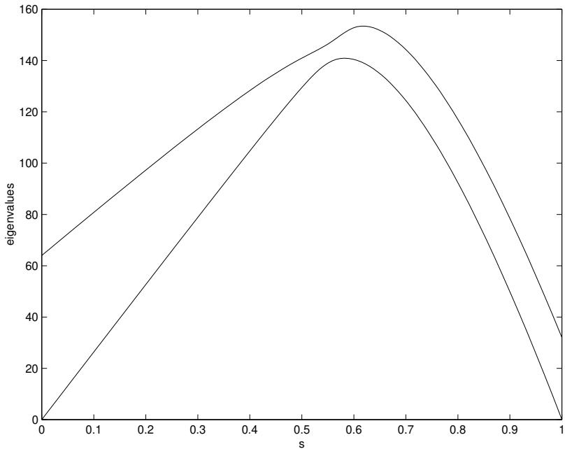  
Figure 11: The two lowest eigenvalues of $\tilde { H } ( s )$ , restricted to the invariant subspace, for overconstrained 2-SAT with $n = 3 3$ . The visible gap indicates that $g _ { \mathrm { m i n } }$ is not exponentially small.

# 5 The Conventional Quantum Computing Paradigm

The algorithm described in this paper envisages continuous-time evolution of a quantum system, governed by a smoothly-varying time-dependent Hamiltonian. Without further development of quantum computing hardware, it is not clear whether this is more or less realistic than conventional quantum algorithms, which are described as sequences of unitary operators each acting on a small number of qubits. In any case, our algorithm can be recast within the conventional quantum computing paradigm using the technique introduced by Lloyd [5].

The Schr¨odinger equation (2.1) can be rewritten for the unitary time evolution operator $U ( t , t _ { 0 } )$

$$
i \frac { \mathrm { d } } { \mathrm { d } t } U ( t , t _ { 0 } ) = H ( t ) U ( t , t _ { 0 } )
$$

and then

$$
\left| \psi ( T ) \right. = U ( T , 0 ) \left| \psi ( 0 ) \right. .
$$

To bring our algorithm within the conventional quantum computing paradigm we need to approximate $U ( T , 0 )$ by a product of few-qubit unitary operators. We do this by first discretizing the interval $[ 0 , T ]$ and then applying the Trotter formula at each discrete time.

The unitary operator $U ( T , 0 )$ can be written as a product of $M$ factors

$$
U ( T , 0 ) = U ( T , T - \Delta ) U ( T - \Delta , T - 2 \Delta ) \cdots U ( \Delta , 0 )
$$

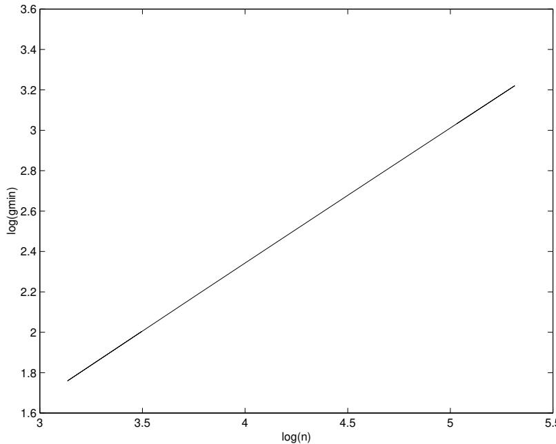  
Figure 12: Overconstrained 2-SAT; $\log ( g _ { \mathrm { m i n } } )$ versus $\log ( n )$ with $n$ ranging from 33 to 203. The straight line indicates that $g _ { \mathrm { m i n } } \sim n ^ { p }$ .

where $\Delta = T / M$ . We use the approximation

$$
U ( ( \ell + 1 ) \Delta , \ell \Delta ) \simeq e ^ { - i \Delta H ( \ell \Delta ) }
$$

which is valid in (5.3) if

$$
\left\| \Delta H ( t _ { 1 } ) - \Delta H ( t _ { 2 } ) \right\| \ll \frac { 1 } { M } \quad \mathrm { f o r ~ a l l } \quad t _ { 1 } , t _ { 2 } \in [ \ell \Delta , ( \ell + 1 ) \Delta ] .
$$

Using (2.23) this becomes

$$
\Delta \big | \big | H _ { \mathrm { P } } - H _ { \mathrm { B } } \big | \big | \ll 1 \ .
$$

We previously showed (in the paragraph after Eq. (2.29)) that $\| H _ { \mathrm { P } } - H _ { \mathrm { B } } \|$ grows no faster than the number of clauses, which we always take to be at most polynomial in $n$ . Thus we conclude that the number of factors $M = T / \Delta$ must be of order $T$ times a polynomial in $n$ .

Each of the $M$ terms in (5.3) we approximate as in (5.4). Now $H ( \ell \Delta ) = u H _ { \mathrm { B } } + v H _ { \mathrm { P } }$ where $u = 1 - ( \ell \Delta / T )$ and $v = \ell \Delta / T$ are numerical coefficients each of which is between $0$ and $^ { 1 }$ . To use the Trotter formula

$$
e ^ { - i \Delta H ( \ell \Delta ) } \simeq ( e ^ { - i \Delta u H _ { \mathrm { B } } / K } e ^ { - i \Delta v H _ { \mathrm { P } } / K } ) ^ { K }
$$

for each $\ell$ , $\ell = 0 , 1 , \dots , M - 1$ , we need $K \gg M \big ( 1 + \Delta \| H _ { \mathrm { B } } \| + \Delta \| H _ { \mathrm { P } } \| \big ) ^ { 2 }$ . Since $\| H _ { \mathrm { B } } \|$ and $\| H _ { \mathrm { P } } \|$ are at most a small multiple of the number of clauses, we see that $K$ need not be larger than $M$ times a polynomial in $n$ .

Now (5.7) is a product of $2 K$ terms each of which is $e ^ { - i \Delta u H _ { \mathrm { B } } / K }$ or $e ^ { - i \Delta v H _ { \mathrm { P } } / K }$ . From (2.22) we see that $H _ { \mathrm { B } }$ is a sum of $n$ commuting one-bit operators. Therefore $e ^ { - i \Delta u H _ { \mathrm { B } } / K }$ can be written (exactly) as a product of $n$ one-qubit unitary operators. The operator $H _ { \mathrm { P } }$ is a sum of commuting operators, one for each clause. Therefore $e ^ { - i \Delta v H _ { \mathrm { P } } / K }$ can be written (exactly) as a product of unitary operators, one for each clause acting only on the qubits involved in the clause.

All together $U ( T , 0 )$ can be well approximated as a product of unitary operators each of which acts on a few qubits. The number of factors in the product is proportional to $T ^ { 2 }$ times a polynomial in $n$ . Thus if the required $T$ for adiabatic evolution is polynomial in $n$ , so is the number of few-qubit unitary operators in the associated conventional quantum computing version of the algorithm.

# 6 Outlook

We have presented a continuous-time quantum algorithm for solving satisfiability problems, though we are unable to determine, in general, the required running time. The Hamiltonian that governs the system’s evolution is constructed directly from the clauses of the formula. Each clause corresponds to a single term in the operator sum that is $H ( t )$ . We have given several examples of special cases of the satisfiability problem where our algorithm runs in polynomial time. Even though these cases are easily seen to be classically solvable in polynomial time, our algorithm operates in an entirely different way from the classical one, and these examples may provide a small bit of evidence that our algorithm may run quickly on other, more interesting cases.

# References

[1] A. Messiah, Quantum Mechanics, Vol. II, Amsterdam: North Holland; New York: Wiley (1976).   
[2] L.K. Grover, “A Fast Quantum Mechanical Algorithm for Database Search”, quant-ph/9605043; Phys. Rev. Lett. 78, 325 (1997).   
[3] E. Farhi, S. Gutmann, “An Analog Analogue of a Digital Quantum Computation”, quantph/9612026; Phys. Rev. A 57, 2403 (1998).   
[4] C.H. Bennett, E. Bernstein, G. Brassard and U.V. Vazirani, “Strengths and Weaknesses of Quantum Computing”, quant-ph/9701001.   
[5] S. Lloyd, “Universal Quantum Simulators”, Science 273, 1073 (1996).