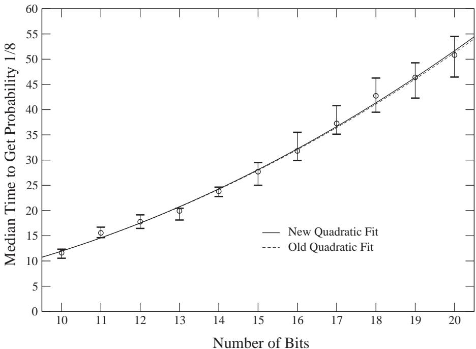
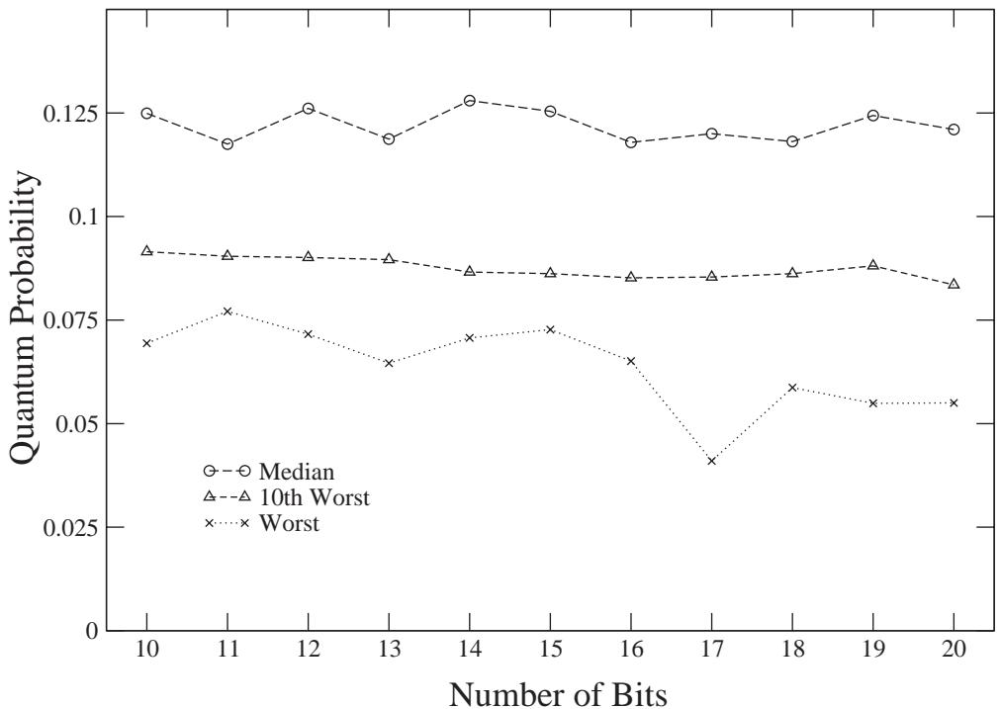
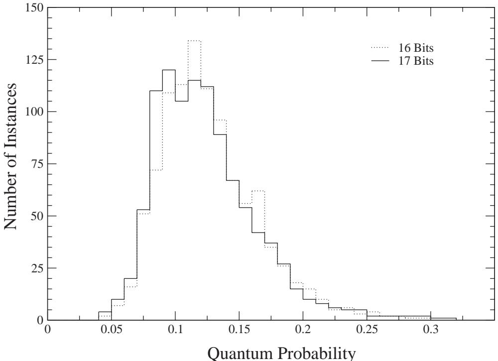
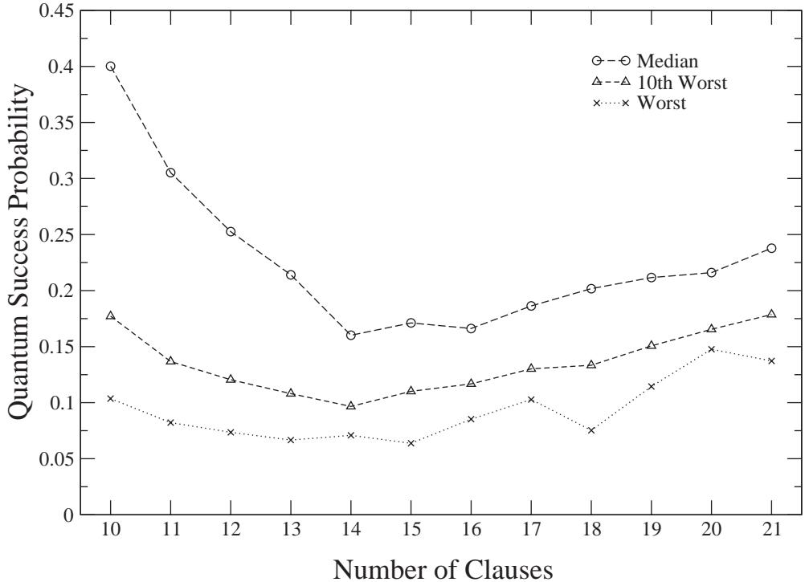
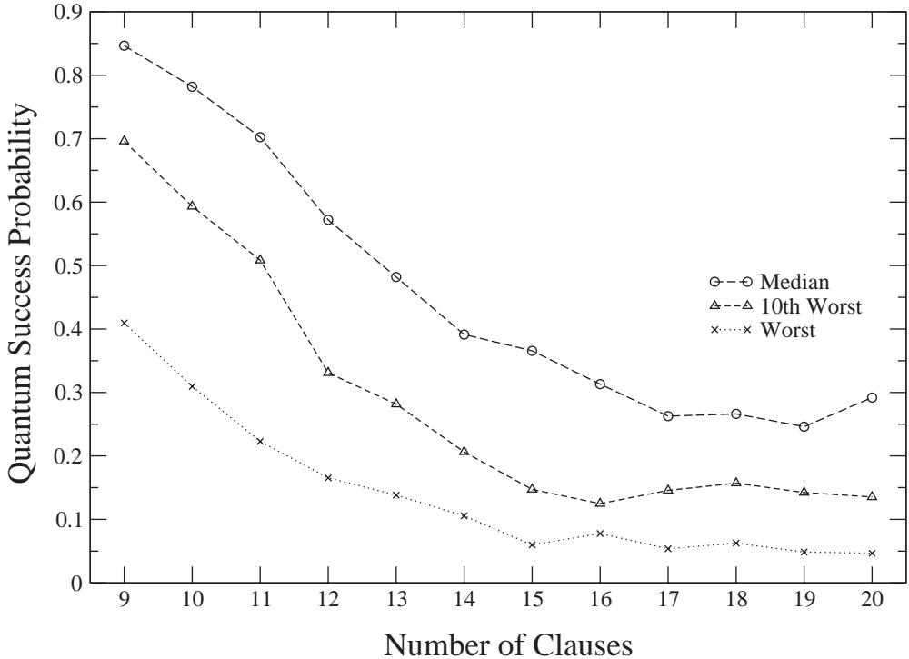
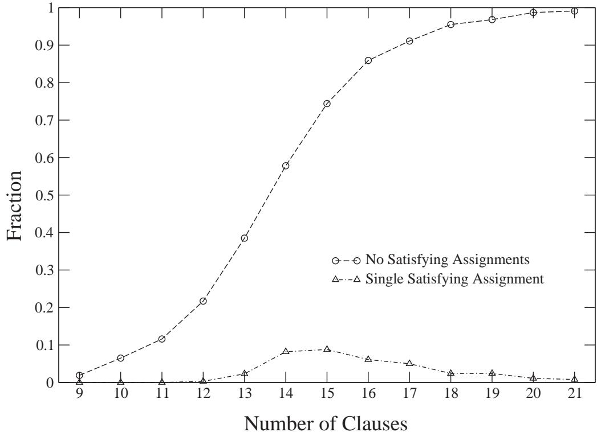

# A Quantum Adiabatic Evolution Algorithm Applied to Random Instances of an NP-Complete Problem

Edward Farhi, Jeffrey Goldstone∗ Center for Theoretical Physics, Massachusetts Institute of Technology, Cambridge, MA 02139 Sam Gutmann† Department of Mathematics, Northeastern University, Boston, MA 02115 Joshua Lapan, Andrew Lundgren, Daniel Preda‡ Massachusetts Institute of Technology, Cambridge, MA 02139 MIT-CTP #3035 A shorter version of this article appeared in the April 20, 2001 issue of Science.

# Abstract

A quantum system will stay near its instantaneous ground state if the Hamiltonian that governs its evolution varies slowly enough. This quantum adiabatic behavior is the basis of a new class of algorithms for quantum computing. We test one such algorithm by applying it to randomly generated, hard, instances of an NP-complete problem. For the small examples that we can simulate, the quantum adiabatic algorithm works well, and provides evidence that quantum computers (if large ones can be built) may be able to outperform ordinary computers on hard sets of instances of NP-complete problems.

# 1 Introduction

A large quantum computer has yet to be built, but the rules for programming such a device, which are derived from the laws of quantum mechanics, are well established. It is already known that quantum computers could solve problems believed to be intractable on classical computers. (Throughout, “classical” means non-quantum.) An intractable problem is one that necessarily takes too long to solve when the input gets too big. More precisely, a classically intractable problem is one that cannot be solved using any classical algorithm whose running time grows only polynomially as a function of the length of the input. For example, all known classical factoring algorithms require more than polynomial time as a function of the number of digits in the integer to be factored. Shor’s quantum algorithm for the factoring problem [1] can factor an integer in a time that grows (roughly) as the square of the number of digits. This raises the question of whether quantum computers could solve other classically difficult problems faster than classical computers.

Beyond factoring there is a famous class of problems called NP-complete; see, for example, [2]. Hundreds of problems are known to be in this class, ranging from the practical (variants of the Traveling Salesman problem) to the whimsical (a problem derived from the game of Go). The original NP-complete problem, Satisfiability, involves answering whether or not a Boolean formula (made up of variables connected by the operators or, and, and not) is true for some choice of truth values for each variable. All NP-complete problems are related in the following sense: if someone finds a polynomial-time algorithm for one NPcomplete problem, then this algorithm could be used as a subroutine in programs that would then solve all other NP-complete problems in polynomial time. That no one has succeeded in finding a classical polynomial-time algorithm for any of these problems is strong evidence for the intractability of the whole class. On the other hand, no one has been able to prove that a polynomial-time algorithm cannot be constructed for any NP-complete problem.

It is also an open question whether an NP-complete problem could be solved in polynomial time on a quantum computer. Here we describe a recently developed approach to quantum computation based on quantum adiabatic evolution [3]; for related ideas, see [4, 5]. We apply the quantum adiabatic algorithm to a specific NP-complete problem, Exact Cover (which is a restricted form of Satisfiability). A decisive mathematical analysis of this quantum adiabatic evolution algorithm has not been possible. Instead we resort to numerical simulation of the running of the quantum algorithm [6]. Each time we do the simulation we use as input a randomly generated instance of Exact Cover. The lengths of these inputs are necessarily small because simulating a quantum computer on a classical computer requires memory that grows exponentially in the length of the input. On these small inputs our data looks promising. For our randomly generated instances of Exact Cover we find that the quantum algorithm succeeds in a time that grows only quadratically in the length of the input.

Saying that an algorithm solves a problem in polynomial time means that the running time of the algorithm is bounded by a polynomial function of the length of the input, and also that the algorithm succeeds on every possible input. On the other hand, an algorithm may succeed in polynomial time on a large set of inputs but not on all. (For many applications, this kind of almost-solution to the problem may suffice.) This has led to efforts to identify sets of instances that are hard for particular classical algorithms. In the last ten years, researchers working on the NP-complete problem 3-SAT (another restriction of Satisfiability) have identified a set of instances that are hard for standard classical search algorithms [7] (see also [9] and references therein).

While the quantum adiabatic evolution algorithm could be applied to 3-SAT, we find it more convenient to study Exact Cover. Our instances of Exact Cover are generated from a set that we believe to be classically intractable for large enough inputs. (This set of Exact Cover instances has similar properties to the set of 3-SAT instances that are identified as hard in [7].) Using a running time that grows only quadratically in the length of the input, the quantum adiabatic algorithm solves the Exact Cover instances we randomly generated. Again, because of the space requirements inherent in simulating a quantum computer, these instances are necessarily small. Imagine that this quadratic behavior actually persists for almost all arbitrarily large instances generated from the same hard set. This would not be enough to imply that the quantum adiabatic algorithm solves an NP-complete problem because an algorithm that solves a problem must work on all instances. However, if classical algorithms indeed require exponential time on this set and the quantum quadratic behavior persists, then we would have found a new way in which quantum computers could outperform classical computers.

# 2 Quantum adiabatic evolution as a computational tool

All quantum systems evolve in time according to the Schr¨odinger equation

$$
i \frac { \mathrm { d } } { \mathrm { d } t } | \psi ( t ) \rangle = H ( t ) | \psi ( t ) \rangle
$$

where $| \psi ( t ) \rangle$ is the time-dependent state vector and $H ( t )$ is the time-dependent Hamiltonian operator. (Here units have been chosen so that Planck’s constant $\hbar$ equals 1.) A quantum computer algorithm can be viewed as a specification of a Hamiltonian $H ( t )$ and an initial state $\left| \psi ( 0 ) \right.$ . These are chosen so that the state at time $T$ , $\left| \psi ( T ) \right.$ , encodes the answer to the problem at hand.

In designing our quantum algorithm we take advantage of the quantum adiabatic theorem, which we now explain. At time $t$ , the Hamiltonian $H ( t )$ has an instantaneous ground state $| \psi _ { g } ( t ) \rangle$ , which is the eigenstate of $H ( t )$ with the lowest energy. Adiabatic evolution refers to the situation where $H ( t )$ is slowly varying. Suppose our quantum system starts at $t = 0$ in the ground state of $H ( 0 )$ , that is, $| \psi _ { g } ( 0 ) \rangle$ . The adiabatic theorem says that if $H ( t )$ varies slowly enough, then the evolving state vector $| \psi ( t ) \rangle$ will remain close to the instantaneous ground state $| \psi _ { g } ( t ) \rangle$ . (For a more precise discussion of the adiabatic theorem as it applies to our situation, see [3].)

To specify our algorithm we must give $H ( t )$ for $0 \leq t \leq T$ , where $T$ is the running time of the algorithm. We choose $H ( t )$ so that the ground state of $H ( 0 )$ is known in advance and is easy to construct. For any instance of the problem under study, there is a Hamiltonian, $H _ { P }$ , whose ground state encodes the solution. Although it is straightforward to construct $H _ { P }$ , finding its ground state is computationally difficult. We take $H ( T ) = H _ { P }$ , which means that $| \psi _ { g } ( T ) \rangle$ encodes the solution. For intermediate times, $H ( t )$ smoothly interpolates between $H ( 0 )$ and $H ( T ) = H _ { P }$ . We start with the quantum state in the known ground state of $H ( 0 )$ . If the running time $T$ is large enough, $H ( t )$ will indeed be slowly varying, and by the adiabatic theorem the final state reached, $\left| \psi ( T ) \right.$ , will be close to $| \psi _ { g } ( T ) \rangle$ , which encodes the solution to our problem.

# 3 Exact Cover

We focus on the NP-complete problem Exact Cover (see, for example, [2]). Consider $n$ bits $z _ { 1 } , z _ { 2 } , \ldots , z _ { n }$ each of which can take the value 0 or 1. An $n$ -bit instance of Exact Cover is built up from clauses, each of which is a constraint imposed on the values of three of the bits. If a given clause involves the three bits labeled $i$ , $j$ , and $k$ , then the constraint is $z _ { i } + z _ { j } + z _ { k } = 1$ , which means that one of the three bits must have the value 1 and the other two must have the value 0. Without the constraint there are 8 possible assignments for the values of $z _ { i }$ , $z _ { j }$ , and $z _ { k }$ , but only 3 out of the 8 satisfy the constraint.

An $n$ -bit instance of Exact Cover is a list of triples $( i , j , k )$ indicating which groups of three bits are involved in clauses. The problem is to determine whether or not there is some assignment of the $n$ bit values that satisfies all of the clauses. Given an assignment of values for $z _ { 1 } , z _ { 2 } , \ldots , z _ { n }$ we can easily check whether the assignment satisfies all of the clauses. But attempting to determine whether or not at least one of the $2 ^ { n }$ assignments of $z _ { 1 } , z _ { 2 } , \ldots , z _ { n }$ satisfies all the clauses is in fact an NP-complete problem. No known algorithm will answer this question in general in a time that grows only as a polynomial in $n$ , the number of bits. This dichotomy – that it is easy to verify a solution if one is presented but hard to determine if a solution exists – typifies NP-complete problems.

# 4 Constructing the Hamiltonian

To specify our quantum algorithm we must give the Hamiltonian $H ( t )$ that governs the evolution of the quantum system via (1). The state vector evolves in a Hilbert space of dimension $2 ^ { n }$ . We take as a basis the $2 ^ { n }$ vectors

$$
\left| z _ { 1 } \right. \left| z _ { 2 } \right. \cdots \left| z _ { n } \right.
$$

where each $z _ { i } = 0$ or $1$ . This $n$ -qubit Hilbert space can be realized as a system of $n$ spin- $1 / 2$ particles where $| z _ { i } = 0 \rangle$ corresponds to the $i ^ { \mathrm { t h } }$ spin being up in the $z$ -direction and $\left| z _ { i } = 1 \right.$ corresponds to spin down in the $z$ -direction.

For $H ( 0 )$ we couple a magnetic field in the $x$ -direction to each quantum spin. (Specifically, the strength of the field at each site is equal to the number of clauses that contain the bit. Thus $H ( 0 )$ is instance dependent; see [3].) The ground state of the $i ^ { \mathrm { t h } }$ qubit corresponding to spin aligned in the $x$ -direction is

$$
\frac { 1 } { \sqrt { 2 } } \Big ( \big | z _ { i } = 0 \big > + \big | z _ { i } = 1 \big > \Big ) \ .
$$

The ground state of $H ( 0 )$ for the $n$ -qubit quantum system is therefore

$$
\left| \psi _ { g } ( 0 ) \right. = { \frac { 1 } { 2 ^ { n / 2 } } } \sum \left| z _ { 1 } \right. \left| z _ { 2 } \right. \cdots \left| z _ { n } \right.
$$

where the sum is over all $2 ^ { n }$ basis vectors. This means that $| \psi _ { g } ( 0 ) \rangle$ , which we take to be the starting state of our algorithm, is a uniform superposition of states corresponding to all possible assignments of bit values.

Recall that $H ( T )$ is to be chosen so that its ground state, $| \psi _ { g } ( T ) \rangle$ , encodes the solution to the instance of Exact Cover under consideration. To accomplish this we first define a classical energy function $h ( z _ { 1 } , z _ { 2 } , \ldots , z _ { n } )$ that is a sum of energy functions $h _ { C } ( z _ { i } , z _ { j } , z _ { k } )$ where $i$ , $j$ , and $k$ are the labels of the bits involved in clause $C$ . It costs energy to violate clause $C$ :

$$
h _ { C } ( z _ { i } , z _ { j } , z _ { k } ) = \left\{ 0 \quad \mathrm { c l a u s e } \ : C \ : \mathrm { s a t i s f i e d } ; \right.
$$

Now let

$$
h = \sum _ { C } h _ { C }
$$

which means that the energy cost of any bit assignment $z _ { 1 } , z _ { 2 } , \ldots , z _ { n }$ is equal to the number of clauses that the assignment violates. We turn this classical energy function into a quantum operator, diagonal in the $z$ -basis:

$$
H _ { P } { \left| z _ { 1 } \right. } { \left| z _ { 2 } \right. } \cdot \cdot \cdot { \left| z _ { n } \right. } = h ( z _ { 1 } , z _ { 2 } , . . . , z _ { n } ) { \left| z _ { 1 } \right. } { \left| z _ { 2 } \right. } \cdot \cdot \cdot { \left| z _ { n } \right. } ~ .
$$

This means that the ground state of $H _ { P }$ corresponds to the bit assignment that violates the minimal number of clauses. (If more than one assignment minimizes the number of violations then there will be more than one ground state of $H _ { P }$ .) Recall that the problem of Exact Cover is to determine if a given instance (specified by a set of clauses) has a satisfying assignment. If we could use our quantum computer to produce the ground state of $H _ { P }$ we would then be able to determine if there is a satisfying assignment.

We define the time-dependent Hamiltonian by the linear interpolation

$$
H ( t ) = \Big ( 1 - \frac { t } { T } \Big ) H ( 0 ) + \frac { t } { T } H _ { P }
$$

so that the final Hamiltonian $H ( T )$ is $H _ { P }$ . Note that as $T$ gets bigger $H ( t )$ becomes more slowly varying and by the adiabatic theorem $| \psi ( t ) \rangle$ , which obeys (1) and begins in $| \psi _ { g } ( 0 ) \rangle$ , will stay close to $| \psi _ { g } ( t ) \rangle$ . Therefore $\left| \psi ( T ) \right.$ will be close to $| \psi _ { g } ( T ) \rangle$ , the ground state of $H _ { P }$ . Since the ground state of $H _ { P }$ encodes the desired solution, a measurement (as described next) of the quantum state at time $T$ will with high probability determine if the instance has a satisfying assignment.

While (8) is the obvious path from $H ( 0 )$ to $H _ { P }$ , other paths are worth exploring and may have algorithmic advantages. For example, any term of the form $\begin{array} { r } { \big ( \frac { t } { T } \big ) \big ( 1 - \frac { t } { T } \big ) H _ { \mathrm { e x t r a } } } \end{array}$ can be added to $H ( t )$ and adiabatic evolution will be maintained. We imagine $H _ { \mathrm { e x t r a } }$ as an instance-independent Hamiltonian that is the sum of terms coupling only a few qubits. In this paper, however, we only use the linear interpolation (8).

# 5 Measurement

At time T, we measure the $z$ -component of each of the $n$ spins in the state $| \psi ( T ) \rangle$ . This will produce a string $z _ { 1 } , z _ { 2 } , \ldots , z _ { n }$ of 0s and 1s that corresponds to one of the $2 ^ { n }$ bit assignments. This string can be quickly checked to see if it satisfies all of the clauses.

For simplicity, suppose that the instance of Exact Cover has a satisfying assignment and that it is unique, $z _ { 1 } , z _ { 2 } , \ldots , z _ { n } = w _ { 1 } , w _ { 2 } , \ldots , w _ { n }$ . We can write

$$
{ \big | } \psi ( T ) { \big \rangle } = c _ { w } { \big | } w _ { 1 } { \big \rangle } { \big | } w _ { 2 } { \big \rangle } \cdots { \big | } w _ { n } { \big \rangle } + \sum _ { z } { ' } c _ { z } { \big | } z _ { 1 } { \big \rangle } { \big | } z _ { 2 } { \big \rangle } \cdots { \big | } z _ { n } { \big \rangle }
$$

where the sum $\sum ^ { \prime }$ is over all $z = z _ { 1 } , z _ { 2 } , \ldots , z _ { n }$ other than $w _ { 1 } , w _ { 2 } , \ldots , w _ { n }$ . The probability that the measurement produces $w _ { 1 } , w _ { 2 } , \ldots , w _ { n }$ is $| c _ { w } | ^ { 2 }$ . Note that if we run the quantum algorithm again (with the same instance, starting state $\left| \psi ( 0 ) \right.$ and running time $T$ ) we end up in the same quantum state $| \psi ( T ) \rangle$ . However, the results of subsequent measurements are all independent. The expected number of repetitions needed to produce $w _ { 1 } , w _ { 2 } , \ldots , w _ { n }$ is $1 / | c _ { w } | ^ { 2 }$ .

# 6 The running time $\mathbf { \nabla } T$

The adiabatic theorem ensures that the quantum adiabatic evolution algorithm will produce the desired state that encodes the solution to the instance of Exact Cover if the running time $T$ is long enough. This means that the success probability $| c _ { w } | ^ { 2 }$ , with $c _ { w }$ given in (9), goes to 1 as $T$ goes to infinity. Determining how long is long enough to produce a reasonably large success probability is the key to determining the potential usefulness of the algorithm. For certain specialized examples we know that the required running time grows only as a polynomial in the number of bits [3]. But addressing the general case of all instances of Exact Cover is beyond our analytical abilities. In this paper we study numerically the running time needed to solve a randomly generated set of Exact Cover instances.

# 7 Simulating a quantum computer

The ingredients of the quantum adiabatic evolution algorithm are

(i) an instance-dependent, time-dependent Hamiltonian $H ( t )$ given by (8) (ii) an initial state $\left| \psi ( 0 ) \right. = \left| \psi _ { g } ( 0 ) \right.$ given by (4)   
(iii) evolution from 0 to $T$ according to the Schr¨odinger equation (1) (iv) a measurement of $\left| \psi ( T ) \right.$ .

In order to simulate this quantum computer we numerically integrate the Schr¨odinger equation in (iii). For an $n$ -qubit quantum system the state vector $| \psi ( t ) \rangle$ has $2 ^ { n }$ complex components. For $n = 2 0$ this means numerically integrating a differential equation with 2,097,152 real variables. This is as large a system as we could handle with our computer resources in a few months of running.

Because the number of bits in our instances of Exact Cover is never more than 20, we can always determine if the instance has satisfying assignments and what they are. We do this by exhaustively checking, at 20 bits, all $2 ^ { 2 0 }$ bit assignments, which takes virtually no time on a classical computer. Admittedly we are only able to study the performance of the quantum computer on instances that are easy for a classical computer. The classical simulation of a quantum computer is itself a classical algorithm but not a good one.

Ingredient (iv) of the quantum algorithm is the measurement. However, in our numerical simulation we do not simulate the measurement. Rather, since we have already computed the $2 ^ { n }$ coefficients of $| \psi ( T ) \rangle$ , we simply read off the coefficients corresponding to satisfying assignments, if there are any. The sum of the squared magnitudes of these coefficients gives the probability that the actual measurement would produce a satisfying assignment.

# 8 Generating random instances

We begin by studying instances of Exact Cover with a unique satisfying assignment (usa). We believe that instances with only one satisfying assignment are the most difficult for the quantum algorithm. In fact, as we will see later, the quantum algorithm runs faster on instances with more than one satisfying assignment. We will also see that the quantum algorithm works well on instances with no satisfying assignment by producing an assignment that violates the minimal number of clauses. Thus the restriction to a usa appears to restrict us to the most difficult cases for the quantum algorithm.

With the number of bits fixed to be $n$ , we generate usa instances of Exact Cover as follows. We pick three distinct bits at random, uniformly over the integers from 1 to $n$ . We then have a formula with one Exact Cover clause. We add clauses one at a time by picking new sets of three bits. After each clause is added we calculate the number of satisfying assignments, which always decreases (or stays the same). If the number of satisfying assignments is reduced to just one, we stop and accept the instance. If the number of satisfying assignments drops from more than one to zero without hitting one, we reject the instance and start again. Using this procedure, the number of clauses is not a fixed function of the number of bits but rather varies from instance to instance.

We have just described the procedure for randomly generating usa instances on which we test the quantum algorithm. Technically, we have thereby defined a probability distribution on the set of usa instances. We refer to instances generated by this procedure as gusa instances. The procedure that generates gusa instances does not produce each usa instance with equal probability. gusa instances, on the average, have about as many clauses as bits, which is fewer clauses than typical usa instances.

# 9 The median time to achieve probability 1/8

By the adiabatic theorem the probability of finding the satisfying assignment goes to 1 as the running time goes to infinity. We are of course forced to settle for a finite running time and a probability less than 1. We have (somewhat arbitrarily) picked a success probability of $1 / 8$ which, for $n \geq 1 0$ , is much larger than $1 / 2 ^ { n }$ , the probability that a random bit assignment is the satisfying assignment. For each number of bits $n$ between 10 and 20 we generate 75 gusa instances of Exact Cover. For each $n$ we determine the median time required to achieve success probability of $1 / 8$ . (Since this is a numerical study we actually hunt for a time that gives a probability between 0.12 and 0.13.)

In Figure 1 the circles represent the median time to achieve probability $1 / 8$ for $1 0 \leq n \leq$ 20. The error bars give 95% confidence limits on the medians. The solid line is a quadratic fit to the data. In [6] corresponding data was obtained for $7 \leq n \leq 1 5$ . The dashed line in Figure 1 is the quadratic fit to the data in [6]. The limited power of classical computers makes it impractical to go even a few bits beyond 20, so further numerical study will not decisively determine how the median running time grows with the number of bits. However, it is possible that the data up to 20 bits already reveals the asymptotic performance of the algorithm.

# 10 Probabilities of success at a proposed running time

To implement the algorithm we want a running time that depends only on the number of bits and not on the specific instance being considered. As a test we propose running the quantum algorithm for a time $T = T ( n )$ that is equal to the quadratic fit to the median time required to achieve probability $1 / 8$ , the solid curve shown in Figure 1. For each $n$ between 10 and 20 we generate 100 new gusa instances of Exact Cover and run the simulation on each instance with $T = T ( n )$ . In Figure 2 the circles show the median probability of success at each $n$ . Not surprisingly, these are all close to $1 / 8$ . We also show the tenth-worst and worst probability for each $n$ . The good news for the quantum algorithm is that these do not appear to decrease appreciably with $n$ .

  
Figure 1: Each circle is the median time to achieve a success probability of $1 / 8$ for 75 gusa instances. The error bars give $9 5 \%$ confidence limits for each median. The solid line is a quadratic fit to the data. The broken line, which lies just below the solid line, is the quadratic fit obtained in [6] for an independent data set up to 15 bits.

To further explore this we generate 1000 new gusa instances of Exact Cover at both 16 and 17 bits. In Figure 3 we show the histograms of the success probability when the instances are run at $T ( 1 6 )$ and $T ( 1 7 )$ , respectively. The histograms indicate that a gusa instance with success probability at or below 0.04 is very unlikely.

If an algorithm (classical or quantum) succeeds with probability at least $p$ , then running the algorithm $k$ times gives a success probability of at least $1 - ( 1 - p ) ^ { k }$ . For example, if $p = 0 . 0 4$ , then 200 repetitions of the algorithm gives a success probability of better than 0.9997. Suppose that as the number of bits increases it remains true that almost all gusa instances have a success probability of at least 0.04 at the quadratic run time $T ( n )$ . Then any $n$ -independent desired probability of success can be achieved with a fixed number of repetitions.

# 11 Instances with the number of clauses fixed in advance

To study the performance of the quantum algorithm on instances that do not necessarily have a usa, we generate new instances now by fixing the number of clauses in advance. Instances are generated with a fixed number of randomly chosen clauses and then separated into two categories, those with at least one satisfying assignment and those with none. Both for instances with and without satisfying assignments we run the quantum algorithm at the quadratic run time $T ( n )$ .

  
Figure 2: Each circle is the median probability of success for 100 gusa instances with the algorithm run at the solid line quadratic fit shown in Figure 1. Each triangle is the tenth-lowest probability and each cross is the lowest probability. Note that the lowest probabilities do not decrease much with $n$ .

In Figure 4 we show the success probability of the quantum algorithm at 17 bits for instances with one or more satisfying assignments. The number of clauses varies from 10 to 21 and at each number of clauses there are 100 instances. The circles show the median probability of success at each number of clauses. Note that these medians are well above $1 / 8$ . Also note that the worst probabilities are never below 0.04. Very similar results were obtained at 16 bits. Thus using the data from gusa instances gives a running time that is apparently adequate for all instances with satisfying assignments. Instances with a usa appear to be more difficult for our algorithm than instances with multiple satisfying assignments.

If an instance has no satisfying assignment then the minimum of the energy cost (6) occurs at those bit assignments that violate the fewest number of clauses. Correspondingly, quantum adiabatic evolution leads to a quantum state that encodes these assignments (in the limit that $T$ goes to infinity). We say that the quantum algorithm succeeds if after the quadratic run time $T ( n )$ , a measurement produces a bit assignment that has the minimum number of violated clauses.

In Figure 5 we show the success probability of the quantum algorithm at 16 bits for instances with no satisfying assignment. There are 100 instances at each number of clauses from 9 to 20. The median probability of success is consistently above $1 / 8$ and the worst probability is never below 0.04. Similar results were established at 17 bits.

The quantum adiabatic algorithm is designed to find the ground state of $H _ { P }$ , which corresponds to the minimum of the classical energy cost $h$ , whether the instance has satisfying assignments or not. The data in Figures 4 and 5 show that the algorithm does at least as well on the general problem of minimizing the number of unsatisfied clauses as it does on finding a usa.

  
Figure 3: Histograms of success probability for 1000 gusa instances at 16 bits and another 1000 at 17 bits. The running times are given by the solid line quadratic fit in Figure 1 at $n = 1 6$ and $n = 1 7$ .

# 12 Classically difficult sets of instances

In this section we present evidence that usa instances are closely related to sets of Satisfiability instances that recent empirical work has shown to be hard for classical algorithms.

Empirical studies of the performance of classical algorithms on 3-SAT have focused on finding the number of clauses, as a function of the number of bits, that makes randomly generated instances hard to solve. (Again, solving an instance means determining if it has at least one satisfying assignment.) For 3-SAT there is a “phase transition” ([8]; also see [9]). For a fixed number of bits, as the number of clauses increases, the probability that a randomly generated instance will have a satisfying assignment decreases abruptly. If the ratio of the number of clauses to the number of bits is $c$ , then there is a number $\alpha \approx 4 . 2 5$ such that for $c < \alpha$ almost all instances have satisfying assignments, and for $c > \alpha$ almost none do. At $c = \alpha$ , about half of the instances have satisfying assignments, and this is where the hard instances are believed to be found. Though these studies are necessarily carried out using particular classical algorithms, it is believed that the easy/hard distinction is independent of the algorithm used.

Even at our small number of bits, we begin to see phase transition behavior for Exact

  
Figure 4: Success probabilities for instances with one or more satisfying assignments. Each circle is the median of 100 instances with the number of clauses fixed. Each triangle is the tenth-worst probability and each cross is the worst. All instances have 17 bits and the algorithm is run at the solid line quadratic fit in Figure 1 at $n = 1 7$ .

Cover instances. The circles in Figure 6 are for 17 bits and show the fraction of Exact Cover instances with no satisfying assignment as a function of the number of clauses. The steep rise is characteristic of the phase transition. The triangles show the fraction of all instances at a given number of clauses that are usa instances. Importantly, this is peaked in the hard region where the curve representing the fraction of unsatisfied instances is rising from $\approx 0$ to $\approx 1$ . Thus we have some empirical support for the intuitive notion that usa instances will be hard for classical algorithms. (usa instances are not usually used in numerical studies of classical algorithms because for higher numbers of bits there is no simple way to generate instances known to be in the usa class.)

When restricted to instances with no more than 20 bits, for which we are able to simulate the quantum algorithm, classical search algorithms like GSAT [10] perform well on usa instances, or on instances with the number of clauses selected in the phase transition region. In fact we ran GSAT on gusa instances up to 20 bits and saw that the run time grows rather slowly as the number of bits increases. It is believed that this behavior does not persist, and that for larger $n$ the time required by GSAT on the average to solve instances randomly generated from hard sets grows exponentially in the number of bits $n$ .

Since we cannot run quantum simulations much past $n = 2 0$ , we cannot tell whether a similar fate befalls the quantum algorithm. However, it is possible that the asymptotic behavior of the quantum algorithm is already visible in the performance up to $n = 2 0$ . It is conceivable that we can see the large- $n$ behavior of the algorithm as soon as $2 ^ { n }$ (rather than $n$ ) is large.

  
Figure 5: Probability of obtaining an assignment violating the minimal number of clauses for instances with no satisfying assignment. Each circle is the median of 100 instances with the number of clauses fixed. Each triangle is the tenth-worst probability and each cross is the worst. All instances have 16 bits and the algorithm is run at the solid line quadratic fit in Figure 1 at $n = 1 6$ .

# 13 Instances with structure

In this article our focus is on randomly generated instances of Exact Cover. In [3] quantum adiabatic evolution was studied analytically on certain sequences of instances of Satisfiability where the clauses involve at most two bits. Each of these sequences has enough structure to make it possible to determine the required running time for any number of bits. For each case considered the quantum adiabatic algorithm succeeds in a time that grows only polynomially in the number of bits. Of course, the structure of those instances makes it possible to determine the satisfying assignment by inspection, so these instances are certainly easy for some classical algorithms. However, it is encouraging that in the few cases where it is possible to analyze the quantum algorithm asymptotically it does perform well.

In [3] and [6] the quantum adiabatic algorithm was also applied to the problem of unstructured search [11]. This problem can be cast as a restricted form of Satisfiability where each instance has a single clause that involves all of the bits and determines a unique satisfying assignment. In this case the required running time must grow exponentially in the number of bits [12]. This exponential behavior is already clearly seen in the data out to 14 bits in the numerical simulation of quantum adiabatic evolution presented in [6].

We have also been looking for a structured sequence of instances of Exact Cover that may be difficult for the quantum adiabatic algorithm. We now have a candidate sequence where the bits can be viewed as arranged in a line with clauses connecting close-by bits. The success probabilities drop sharply as a function of the number of bits when the algorithm is run at the quadratic fit shown in Figure 1. We have also experimented with ad hoc modifications of the quantum algorithm that do increase the success probability for this sequence. These involve adding a term to $H ( t )$ as described at the end of Section 4. The $H _ { \mathrm { e x t r a } }$ used involves random couplings between the qubits. In any case, sequences of structured instances have little bearing on the performance of the quantum algorithm on randomly generated sets, but are relevant to discussions of whether this algorithm (or a modified version) could solve an NP-complete problem outright. Whether or not a quantum adiabatic algorithm could solve an NP-complete problem remains an open question.

  
Figure 6: The circles give the fraction of instances with no satisfying assignment as a function of the number of clauses at 17 bits for Exact Cover. The triangles give the fraction of instances at each number of clauses that have a unique satisfying assignment.

# 14 A novel approach to quantum computing

The quantum adiabatic evolution algorithm operates in continuous time by evolving a quantum state according to the Schr¨odinger equation (1). In the conventional quantum computing paradigm an algorithm consists of a sequence of discrete unitary transformations. Although the adiabatic time evolution can be well approximated by a sequence of discrete unitary steps we see no advantage in this reformulation. In fact, continuous time evolution may offer an alternative model for the design of a quantum computer.

Quantum computation by adiabatic evolution works by keeping the quantum state close to the instantaneous ground state of the Hamiltonian that governs the evolution. This suggests that a device running the quantum adiabatic algorithm should be kept at a low temperature in order to reduce unwanted transitions out of the ground state. Conventional quantum computing does not take place in the ground state and decohering transitions caused by interactions with the environment are a major impediment to current efforts to build a large-scale quantum computer. The quantum adiabatic algorithm running on a cold device may be more fault tolerant than the implementations of discrete step quantum computation usually envisioned.

Quantum computation by adiabatic evolution applied to a Satisfiability problem will succeed if the running time is long enough. This follows from the quantum adiabatic theorem. The quantum adiabatic algorithm is in a form that allows it to be applied to a wide variety of combinatorial search problems; for example, see [13]. We have seen evidence that for our randomly generated small instances of Exact Cover the required running time grows slowly as a function of the number of bits. It is possible that the slow growth we have already seen indicates the true asymptotic behavior of the algorithm when applied to randomly generated hard instances of Exact Cover. If this quantum adiabatic algorithm does actually outperform known classical algorithms, we would have reason to eagerly await the construction of a quantum computer capable of running it.

# Acknowledgments

This work was supported in part by the Department of Energy under cooperative agreement DE–FC02–94ER40818 and also by MIT’s Undergraduate Research Opportunities Program. We thank the MIT Laboratory for Nuclear Science’s Computer Facility for extensive use of the computer Abacus. We benefited greatly from conversations with Andrew Childs, Bart Selman, and Leslie Valiant. We also thank Daniel Fisher, Bert Halperin, Mehran Kardar, and Patrick Lee for useful discussions about the connection of our work to statistical mechanics systems.

# References

[1] P.W. Shor, SIAM J. Comput. 26(5), 1484 (1997).   
[2] D.S. Johnson and C.H. Papadimitriou, “Computational Complexity”, in The Traveling Salesman Problem, E.L. Lawler, J.K. Lenstra, A.H.G. Rinnooykan, D.B. Shmays, eds. (John Wiley & Sons, 1985), p. 37.   
[3] E. Farhi, J. Goldstone, S. Gutmann, M. Sipser, “Quantum Computation by Adiabatic Evolution”, quant-ph/0001106.   
[4] T. Kadowaki and H. Nishimori, “Quantum Annealing in the Transverse Ising Model”, cond-mat/9804280; Phys. Rev. E 58(5), 5355 (1998).   
[5] J. Brooke, D. Bitko, T.F. Rosenbaum, and G. Aeppli, “Quantum Annealing of a Disordered Magnet”, Science 284, 779 (1999).   
[6] E. Farhi, J. Goldstone, S. Gutmann, “A Numerical Study of the Performance of a Quantum Adiabatic Evolution Algorithm for Satisfiability”, quant-ph/0007071.   
[7] D.G. Mitchell, B. Selman, and H.J. Levesque, in Proc. 10th Natl. Conf. Artif. Intell. (AAAI-92), 459 (1992).   
[8] E. Friedgut and J. Bourgain, “Sharp Thresholds of Graph Properties and the k-SAT Problem”, J. Am. Math. Soc. 12, 1017 (1999).   
[9] S. Kirkpatrick and B. Selman, Science 264, 1297 (1994).   
[10] B. Selman, H.J. Levesque, and D.G. Mitchell, in Proc. 10th Natl. Conf. Artif. Intell. (AAAI-92), 440 (1992).   
[11] L.K. Grover, “A Fast Quantum Mechanical Algorithm for Database Search”, quantph/9605043; Phys. Rev. Lett. 78, 325 (1997).   
[12] E. Farhi and S. Gutmann, “An Analog Analogue of a Digital Quantum Computation”, quant-ph/9612026, Phys. Rev. A 57, 2403 (1998); C.H. Bennett, E. Bernstein, G. Brassard, and U.V. Vazirani, quant-ph/9701001.   
[13] A.M. Childs, E. Farhi, J. Goldstone, and S. Gutmann, “Finding Cliques by Quantum Adiabatic Evolution”, quant-ph/0012104, submitted to Algorithmica.