# A New Non-Iterative Decoding Algorithm for the Erasure Channel : Comparisons with Enhanced Iterative Methods

J. Cai, C. Tjhai, M. Tomlinson, M. Ambroze and M. Ahmed Fixed and Mobile Communications Research University of Plymouth PL4 8AA, United Kingdom email: {jcai,ctjhai,mtomlinson,mambroze,mahmed}@plymouth.ac.uk

Abstract— This paper investigates decoding of binary linear block codes over the binary erasure channel (BEC). Of the current iterative decoding algorithms on this channel, we review the Recovery Algorithm and the Guess Algorithm. We then present a Multi-Guess Algorithm extended from the Guess Algorithm and a new algorithm – the In-place Algorithm. The Multi-Guess Algorithm can push the limit to break the stopping sets. However, the performance of the Guess and the Multi-Guess Algorithm depend on the parity-check matrix of the code. Simulations show that we can decrease the frame error rate by several orders of magnitude using the Guess and the Multi-Guess Algorithms when the parity-check matrix of the code is sparse. The In-place Algorithm can obtain better performance even if the parity check matrix is dense. We consider the application of these algorithms in the implementation of multicast and broadcast techniques on the Internet. Using these algorithms, a user does not have to wait until the entire transmission has been received.

codes on the BEC. The algorithm can be applied to any linear block code and is not limited to LDPC codes. Starting with superposition of the erased bits on the parity-check matrix, we review the performance of the iterative decoding algorithms, described in the literature, for the BEC, principally the Recovery Algorithm and the Guess Algorithm [10]. In Section III, we propose an improvement to the Guess Algorithm based on multiple guesses: the Multi-Guess Algorithm and give a method to calculate the minimum number of guesses required in the decoding procedure. In this section, we also describe a new, non iterative decoding algorithm based on a Gaussian-Reduction method [11] by processing the paritycheck matrix. In Section IV, we compare the performance of these algorithms for different codes using computer simulation. In Section V, we discuss the application of these decoding algorithms for the Internet. Section VI concludes the paper.

# I. INTRODUCTION

The Binary Erasure Channel (BEC) was introduced by Elias [1] in 1955. It counts lost information bits as being “erased” with probabilities equal to 0.5. Currently, the BEC is widely used to model the Internet transmission systems, in particular multicasting and broadcasting.

As a milestone, Luby et. al. [2] proposed the first realization of a class of erasure codes – LT codes, which are rateless and are generated on the fly as needed. However, LT-codes cannot be encoded with constant cost if the number of collected output symbols is close to the number of input symbols. In [3], Shokrollahi introduced the idea of Raptor codes which adds an outer code to LT codes. Raptor codes have been established in order to solve the error floors exhibited by the LT codes.

On the other hand, low-density parity-check (LDPC) codes have been studied [5] to [8] for application to the BEC. The iterative decoding algorithm, which is the same as Gallager’s soft-decoding algorithm [9], was implemented [5]. Capacityachieving degree distributions for the binary erasure channel have been introduced in [5], [6] and [7]. Finite-length analysis of LDPC codes over the BEC was accomplished in [8]. In that paper, the authors have proposed to use finite-length analysis to find good finite-length codes for the BEC.

In this paper, we show the derivation of a new decoding algorithm to improve the performance of binary linear block

# II. PRELIMINARIES

# A. Matrix Representations of the Erased Bits

Let $H$ denote the parity-check matrix. Considering an $L \times N$ binary linear block code, we assume that the encoded sequence is $\textbf { x } = ~ \{ x _ { 1 } , x _ { 2 } , . . . , x _ { N } \}$ . After being transmitted over the erasure channel with erasure probability $\epsilon$ , the encoded sequence can be divided into the transmitted sub-sequence and the erased sub-sequence, denoted as $\mathbf { y } = \{ y _ { 1 } , y _ { 2 } , \dots , y _ { l _ { 1 } } \}$ and $\mathbf { y } _ { \epsilon } = \{ y _ { \epsilon 1 } , y _ { \epsilon 2 } , \dots , y _ { \epsilon l _ { 2 } } \}$ respectively, where $l _ { 1 } + l _ { 2 } = N$ .

Corresponding to the parity check matrix of the code, we can generate an erasure matrix $M _ { \epsilon }$ $( L _ { \epsilon } \times N )$ which contains the positions of the erased bits in $H$ . Then we denote the set of erased bits $i$ that participate in each parity check row by $E _ { i } ^ { h } = \{ j : M _ { \epsilon ( i j ) } = 1 \}$ with $h$ standing for “horizontal” and the number of erased bits in $E _ { i } ^ { h }$ is denoted by $| E _ { i } ^ { h } |$ . Similarly we define the set of checks in which bit $j$ participates, $E _ { j } ^ { v } = \{ i : M _ { \epsilon ( i j ) } = 1 \}$ with $v$ standing for “vertical”, and the number of erased bits in $E _ { j } ^ { v }$ is denoted by $| E _ { j } ^ { v } |$ . Let $\mathbf { E ^ { h } } \ = \ \{ E _ { i } ^ { h } \ | \ i \ \in \ \{ 1 , 2 , . . . , L _ { \epsilon } \} \}$ and ${ \bf E } ^ { \bf v } \ = \ \{ E _ { j } ^ { v ^ { \ } } \vert \ j \ \in$ $\{ 1 , 2 , \ldots , N \} \}$ . The matrix representation is shown in Fig. 1, where an “x” represents an erasure.

# B. Current Iterative Decoding Algorithms for the BEC

In [5], the message-passing algorithm was used for reliable communication over the BEC at transmission rates arbitrarily

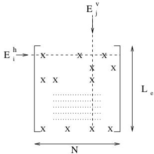  
Fig. 1. A matrix representation of the erased bits

close to channel capacity. The decoding algorithm succeeds if and only if the set of erasures do not cause stopping sets [8]. For completeness, this algorithm is briefly outlined below:

# Recovery Algorithm

• step $^ { l }$ Generate the $M _ { \epsilon }$ and obtain the $\mathbf { E } ^ { \mathbf { h } }$ . • step 2 For $i \in \{ 1 , 2 , \ldots , L _ { \epsilon } \}$ , if $| E _ { i } ^ { h } | = 1$ , we replace the value in the bit position $i$ with the XOR of the unerased bits in that check equation. Then we remove the erasure from the erasure matrix. • step 3 Continue from step 2 until all the erased bits are solved or the decoding cannot continue further.

The decoder will fail if stopping sets exist.

We can break the stopping sets by performing several “guesses” of the unsolved erased bits. This algorithm is called the Guess Algorithm [10].

# Guess Algorithm

• Step 1 Run the decoder with Recovery Algorithm until it fails due to stopping set(s).   
• Step 2 In order to break the stopping set, when $| E _ { i } ^ { h } | =$ 2, we guess one of the erased symbols and update the erasure matrix $M _ { \epsilon }$ and $\mathbf { E ^ { h } }$ .   
• Step 3 Continue from step 1 until all the erased symbols are solved or the decoding cannot continue further. If the decoder cannot continue, declare a decoder failure and exit.   
• Step 4 Creat a list of $2 ^ { g }$ solutions, where $g$ is the number of guesses made. From thpick the one that satisfies $c _ { \mathrm { o u t } _ { k } }$ $k \in \{ 1 , 2 , \dots , 2 ^ { g } \}$ $H c _ { \mathrm { o u t } _ { k } } ^ { T } = \mathbf { 0 }$

Obviously, compared to the Recovery Algorithm, the complexity of this algorithm increases with $g$ . Usually, we limit the number of guesses to a small number $g _ { \mathrm { s } }$ . If after $g _ { \mathrm { s } }$ guesses, the decoding still cannot be finished, a decoding failure is declared. For sparse codes with low-density $H$ , e. g. LDPC codes, the Guess Algorithm can improve the performance with $g < 3$ guesses as shown in Section IV.

The decoding algorithm is more efficient when the bits to be guessed are carefully chosen. These are termed “crucial”bits. The crucial bits are chosen on the basis of the highest value of $| E _ { j } ^ { v } |$ with the value of $| E _ { j } ^ { h } | = 2$ .

# III. IMPROVED DECODING ALGORITHMS FOR NON-SPARSE LINEAR BLOCK CODES FOR THE BEC

For non-sparse linear codes, it is common to encounter more than 2 unsolved symbols in each row of $M _ { \epsilon }$ after running the

Guess Algorithm, due to the high-density of their parity check matrix. In these cases, we cannot break the stopping set by guessing one erased symbol in a row only. More than 1 erased symbols at one time need to be guessed. We can calculate the minimum number of guesses before the decoding.

Lemma 3.1: Consider the chosen erased symbols in each row as an erased group. Let $\omega _ { \delta }$ denote the set of rows with $\delta$ erasures, that is, $\omega _ { \delta } = \{ i \mid \lvert E _ { i } ^ { h } \rvert = \delta \}$ . And $x _ { \delta }$ is the set of rows which satisfies:

$$
\begin{array} { r } { x _ { \delta } = \{ i \in \omega _ { \delta } \mid \exists k , p \in E _ { i } ^ { h } , \mathrm { s u c h ~ a s ~ } k \neq p , | E _ { k } ^ { v } | = | E _ { p } ^ { v } | = 1 \} . } \end{array}
$$

Then

$$
\operatorname* { m i n } g = | x _ { \delta } | + 1
$$

where 1 accounts for the need for at least one “crucial” row.

Proof: When the guessing process stops, there are more than 2 erased symbols in each erased row. The rows that have more than two bits $( k , p )$ which do not participate in any other row (i. e. $| E _ { k } ^ { v } | = | E _ { p } ^ { v } | = 1 ;$ ) cannot be solved by other rows, and so at least one of these bits has to be guessed. So the minimum number of guesses equals to the number of all the independent guesses plus one more “crucial” guess to solve the other rows.

For the Multi-Guess Algorithm, a whole row is guessed. A crucial row $c$ is defined as follows:

1) $c \in \omega _ { \delta }$ 2) $\textstyle \sum _ { j \in E _ { c } ^ { h } } | E _ { j } ^ { v } |$ is maximized over $c$ in $\omega _ { \delta }$ The Multi-Guess Algorithm is given below:

# Multi-Guess Algorithm

• step $^ { l }$ Run the decoder with Guess Algorithm until $| E _ { i } ^ { h } | > 2$ for $i = 1 , \ldots , L _ { \epsilon }$ .   
• step 2 Evaluate the value of $\operatorname* { m i n } ( g )$ . If $\operatorname* { m i n } ( g ) > g _ { \mathrm { s } }$ , the decoding declares a failure and exits.   
• step 3 Group the rows with $| E _ { i } ^ { h } | = \delta$ as $\omega _ { \delta }$ , where $i \in$ $\{ 1 , 2 , \ldots , L _ { \epsilon } \}$ .   
• step 4 Find the “crucial” row and guess all erased bits in that row. (There will be at most $2 ^ { \delta - 1 }$ guesses.)   
• step 5 Guess one bit $p$ with $| E _ { p } ^ { v } | = 1$ in each of the independent rows, i.e. the rows in $x _ { g }$ .   
step $6$ Update $M _ { \epsilon }$ , $\mathbf { E ^ { h } }$ and $\mathbf { E } ^ { \mathbf { v } }$ . Continue the decoding from step 3 to step 5 until all the erased bits are solved or the decoding cannot continue further.

The disadvantages of Guess and Multi-Guess Algorithms include the decoding complexity and the correctness of the results. The decoding complexity grows exponentially with the number of guesses. It is possible that the group guess declares a wrong value as the result of the decoder. Although this kind of situation happens only when the value of $\epsilon$ is very small, it is still undesirable.

Let $\mathbf { x } ^ { \prime }$ denote the received vector, where $\mathbf { x } ^ { \prime } = \mathbf { y } \cup \mathbf { y } _ { \epsilon }$ . We now devise a reduced complexity algorithm to decode the erased bits by solving the equation 3 using the Gaussian Reduction method [11].

$$
H \mathbf { x } ^ { \prime \mathbf { T } } = \mathbf { 0 } .
$$

According to [8], the optimal decoding is equivalent to solving the linear system, shown in the equation 3. If the equation

3 has a unique solution, the optimal algorithm is possible. Guassian Reduction algorithm is considered as the optimal algorithm over the BEC. We propose a reduced complexity Guassian Reduction algorithm – In-place Algorithm [4] by elimilating the column-permutations required. This algorithm is stated as follows:

# In-place Algorithm

• step $I$ The codeword is received and $y _ { \epsilon }$ are substituted in positions of erased bits in $H$ . Starting with one of the erased symbols, $y _ { \epsilon _ { s } }$ , the first equation containing this symbol is flagged that it will be used for the solution of $y _ { \epsilon _ { s } }$ . This equation is subtracted from all other equations containing $y _ { \epsilon _ { s } }$ and not yet flagged to produce a new set of equations. The procedure repeats until either non flagged equations remain containing $y _ { \epsilon _ { s } }$ (in which case a decoder failure is declared) or no erased symbols remain that are not in flagged equations.

• step 2 Let $y _ { \mathrm { \epsilon _ { l a s t } } }$ be the erased symbols at the last flagged equations. In the latter case, starting with $y _ { \mathrm { { \epsilon _ { l a s t } } } }$ this equation is solved to find $y _ { \mathrm { l a s t } }$ and this equation is unflagged. This coefficient is substituted back into the remaining flagged equations containing $y _ { \mathrm { l a s t } }$ . The procedure now repeats with the second from last flagged eqaution now being solved for $y _ { \mathrm { \epsilon l a s t - 1 } }$ . This equation is unflagged and followed by back substitution of $y _ { \mathrm { l a s t - 1 } }$ for $y _ { \mathrm { \epsilon l a s t - 1 } }$ in the remaining flagged equations.

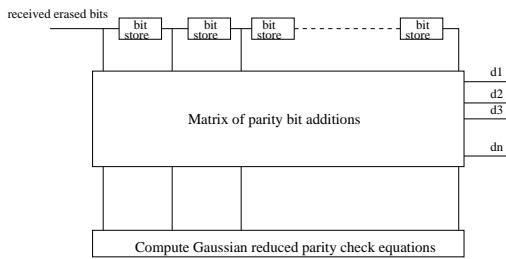  
Fig. 2. Erasure Correction Using In-place Algorithm

A block schematic of the decoder is shown in Fig.2. The received bits are stored in the shift register with the erased bits being replaced by the unknown $y _ { \epsilon }$ . The Gaussian reduced equations are computed and used to define the connection of bit adders from the respective shift register stage to compute the outputs $d _ { 1 }$ to $d _ { n }$ . The non erased symbols contained in the shift register are switched directly through to the respective output so that the decoded codeword with no erased bits is present at the outputs $d _ { 1 }$ through to $d _ { n }$ .

# IV. RESULTS

We evaluated the performance of the Recovery Algorithm with the LT codes with Soliton distribution as described in [2] and irregular LDPC codes. As shown in Fig. 3, the performance of irregular LDPC codes is significantly better than that of the LT codes for the same block length. As a consequance, we use LDPC codes to benchmark the remaining algorithms.

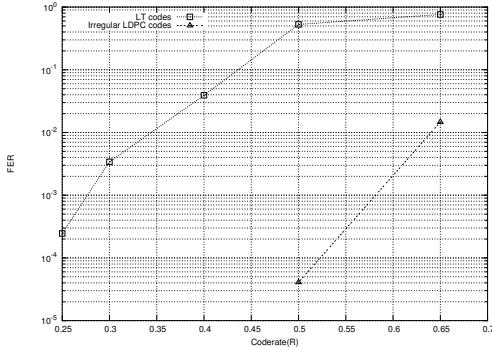  
Fig. 3. Performance of the LT codes and irregular LDPC codes with erasure probability $= 0 . 2$

A particularly strong binary code and which has a sparse $H$ is the cyclic LDPC code (255,175), which has a length of 255 bits after encoding of 175 information bits. Since the paritycheck polynomial of the (255,175) 1 code is orthogonal on every bit position, the minimum Hamming distance is $1 + w$ , where $w$ denotes the number of ones per row in $H$ [12].

The applicability of the decoding methods above depends on the error correcting code being used and specifically on the parity check matrix being used. The performance of this code for the Recovery, the Guess and the In-place Algorithms is shown in Fig. 4 in terms of the probability of decoder error (FER) as a function of the erasure probability for every transmitted bit.

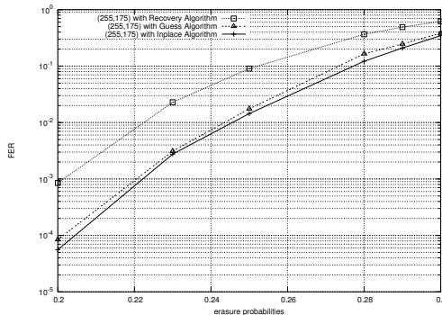  
Fig. 4. Performance of the Cyclic LDPC (255,175) with the Guess , the Multi-Guess and the In-place Algorithms

Due to its sparse parity check matrix, Guess algorithm with less than 3 guesses can achieve more than 1 order of magnitude improvement compared to that of Recovery Algorithm. In addition, from Fig. 4, we also can see that the curve of Guess Algorithm is very close to the curve of In-place Algorithm, which means Guess Algorithm is a “near optimal decoding” algorithm when it has a sparse parity check matrix.

Fig. 5 shows the performance of the (341,205) LDPC code 2 with the Recovery, the Guess, the Multi-Guess and the Inplace Algorithms. Comparing these results of the Recovery and Guess Algorithms, the Multi-Guess Algorithm can obtain the results by several orders of magnitude better. For example, when the erasure probability equals to 0.3, the Multi-Guess Algorithm with $g _ { \mathrm { m a x } } \ : = \ : 3$ is one order of magnitude better than the Recovery and Guess Algorithms, when $g _ { \mathrm { m a x } } ~ = ~ 5$ the Multi-Guess Algorithm is 2 order2 of magnitude better than the Recovery and the Guess Algorithms. As an optimal decoding algorithm, the In-place Algorithm can achieve 4 orders of magnitude better than the Recovery and the Guess Algorithm.

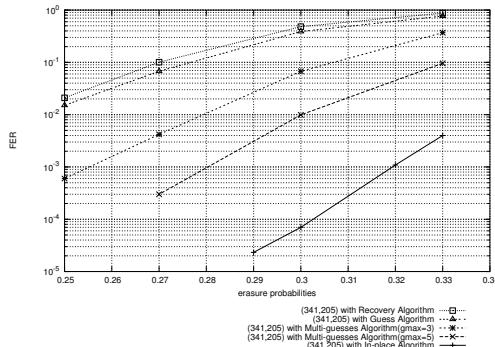  
Fig. 5. Performance of the Cyclic LDPC (341,205) with the Recovery, the Guess, the Multi-Guess and the In-place Algorithms

The ultimate performance of the In-place Algorithm as a function of error correcting code is shown in Fig. 6 for the example (255,175) code which can correct a maximum of 80 erased bits. Fig. 6 shows the probability density function of the number of erased bits short of the maximum correctable which is $N - L$ . The results were obtained by computer simulations. The probability of being able to correct only 68 bits, a shortfall of 12 bits, is $1 . 1 \times 1 0 ^ { - 3 }$ . Simulations indicate that on average 77.6 erased bits may be corrected for this code. In comparison the BCH (255,178) code having similar rate is also shown in Fig. 6. The BCH code has a similar rate but a higher minimum Hamming distance of 22 (compared to 17). It can be seen that it has better performance than the (255,175) code but it has a less sparse parity check matrix and consequently it is less suitable for Recovery Algorithm and Guess Algorithm. Moreover the average shortfall in erasures not corrected is virtually identical for the two codes.

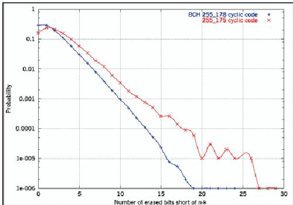  
Fig. 6. Comparison of Probability Distribution of Number of Erased Bits not Corrected from Maximum Correctible (N-L) for (255,175) code and BCH (255,178) code

The simulation results of using In-place Algorithm for the (103,52) quadratic residue binary code [13] are shown in Fig. 7. The minimum Hamming distance for this code is 19 and the results are similar to that of the (255,178) BCH code above. It is found from the simulations that on average 49.1 erasure bits are corrected (out of a maximum of 51) and the average shortfall from the maximum is 1.59 bits.

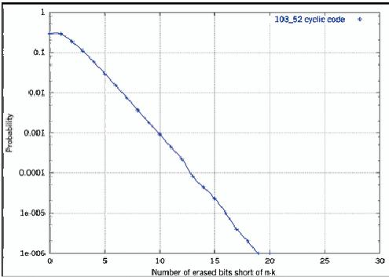  
Fig. 7. Probability Distribution of Number of Erased Bits not Corrected from Maximum Correctible (N-L) for (103,52) code quadratic redisue code

Similarly the results for the extended BCH (128,64) code is shown in Fig. 8. This code has a minimum Hamming distance of 22 and has a similar probability density function to the other BCH codes above. On average 62.39 erasure bits are corrected (out of a maximum of 64) and the average shortfall is 1.61 bits from the maximum.

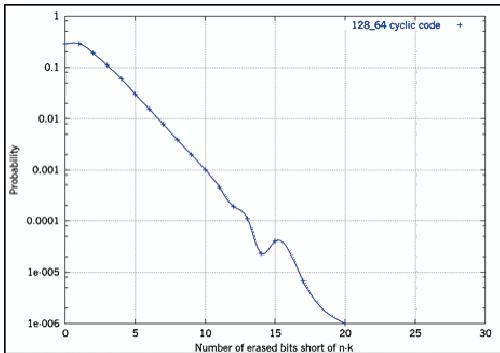  
Fig. 8. Probability Distribution of Number of Erased Bits not Corrected from Maximum Correctible (N-L) for (128,64) extended BCH code

# V. APPLICATION

In multicast and broadcast information is transmitted in data packets with typical lengths from 30 bits to 1000 bits. These packets could define a symbol from a Galois field [12], viz $G F ( 2 ^ { m } )$ but with $m$ equal to 30 or more up to and beyond 1000 bits this is impracticable and it is more convenient to use a matrix approach with the packets forming the rows of the matrix and columns of bits encoded using an error correcting code. Usually, but not essentially the same code would be used to encode each column of symbols. The matrix of symbols may be defined as:

There are a total of $( s + 1 ) \cdot k$ information symbols which encoded using the parity check equations of a selected code into a total number of transmitted symbols equal to $( s + 1 ) \cdot$ $n$ . The symbols are transmitted in a series of packets with each packet corresponding to a row as indicated above. For example the row: $b _ { 2 0 } b _ { 2 1 } b _ { 2 2 } b _ { 2 3 } \dots \dots \dots b _ { 2 s }$ is transmitted as a single packet.

Self contained codewords are encoded from each column of symbols. For example $b _ { 0 0 } b _ { 1 0 } b _ { 2 0 } \dots \dots \dots b _ { k - 1 0 }$ form the information symbols of one codeword and the remaining symbols, $b _ { k + 0 } b _ { k + 1 0 } b _ { k + 2 0 } \dotsb \dots b _ { n - 1 0 }$ are the parity symbols of that codeword. As a result of network congestion, drop outs, loss of radio links or other multifarious reasons not all of the transmitted packets are received. The effect is that some rows above are erased. The decoding procedure is that codewords are assemble from the received packets with missing symbols corresponding to missing packets marked as $z _ { i j }$ . For example, if the second packet only is missing above:

• The first received codeword corresponds to the first column above and is $b _ { 0 0 } z _ { 1 0 } b _ { 2 0 } \dots \dots \dots b _ { n - 1 0 }$ • The second codeword corresponding to the first column above and is $b _ { 0 1 } z _ { 1 1 } b _ { 2 1 } \dots z \dots b _ { n - 1 1 }$ and so on.

All the algorithms stated in Section 2 may be used to solve for the erased symbols $z _ { 1 0 }$ in the first received codeword, and for the erased symbol $z _ { 1 1 }$ in the second received codeword and so on up to the $s ^ { \prime }$ th codeword (column) solving for $z _ { 1 s - 1 }$ .

As an example, the binary, extended (128, 64) BCH code could be used to encode the information data. The packet length is chosen to be 100 bits, and the total transmission could consist of 128 transmitted packets (12,800 bits total) containing 6,400 bits of information. On average as soon as any 66 packets from the original 128 packets have been received, the remaining 62 packets are treated as if they are erased. 100 codewords are assembled, decoded with the erasures solved and the 6,400 bits of information retrieved. One advantage is that a user does not have to wait until the entire transmission has been received.

# VI. CONCLUSIONS

In this paper, we presented different decoding algorithms of LDPC codes over the BEC: Recovery, Guess, Multi-Guess and In-place Algorithms. The Multi-Guess Algorithm is an extension to Guess Algorithm, which can push the limit to break the stopping sets. We show that Guess and Multi-Guess Algorithms are parity-check matrix dependent. For the codes with sparse parity-check matrix, Guess and Multi-Guess Algorithms can be considered as “Near-optimal Decoding Methods”. On the other hand, In-place Algorithm is not. It’s an optimal method for the BEC and able to correct $N - L - \rho$ erasures, where $\rho$ is a small positive integer.

We also considered these algorithms in the implementation of multicast and broadcast. Using these algorithms, a user does not have to wait until the entire transmission has been received.

# REFERENCES

[1] P. Elias, “Coding for two noisy channels,” in Proc. 3rd London Symp. Information Theory, 1955, pp.61 – 76.   
[2] M. Luby, “LT-Code,”Proceeding of the 43rd Annual IEEE Symposum on the Foundations of Computer Science, pp. 271 – 280, 2002.   
[3] M. A. Shokrollahi, S. Lassen and M. Luby, “Multi-stage code generator and decoder for communication systems,” U.S. Patent application number 20030058958, Dec. 2001.   
[4] M. Tomlinson, J. Cai, Cj Tjhai, M. Ambroze and M. Z. Ahmed, “System for correcting deleted or missing symbols,” U. K. Patent application number 0428042.6, Dec. 2004.   
[5] M. Luby, M. Mitzenmacher, M. Shokrollahi, and D. Spielman, “Efficient erasure correcting codes,” IEEE Trans. Inform. Theory, vol. 47, pp. 569 – 584, Feb. 2001.   
[6] M. A. Shokrollahi, “Capacity-achieving sequences,” IMA Volumes in Mathematics and its Applications, vol.123, pp.153 – 166, 2000.   
[7] P. Oswald and M. A. Shokrollahi, “Capacity-achieving sequences for the erasure channel,” IEEE Trans. Inform. Theory, vol. 48, pp.3019 – 3028, Dec. 2002.   
[8] C. Di, D. Proietti, I. E. Telatar, T. Richardson, and R. Urbanke, “Finitelength analysis of low-density parity-check codes on the binary erasure channel,” IEEE Tran. Inform. Theory, vol. 48, pp. 1570 – 1579, June 2002.   
[9] R. G. Gallager,“ Low Density Parity Check Codes,” Cambridge, MA: MIT Press, 1963.   
[10] H. Pishro-Nik and Faramarz Fekri, “On decoding of low-density paritycheck codes over the binary erasure channel,” IEEE Trans. Inform. Theory, vol. 20, pp. 439 – 454, March 2004.   
[11] A. M. Odlyzko, “Discrete logarithms in finite fields and their cyptographic significance,” in Advances in Cyptology: Proceeding of Eurocrypt’84, T. Beth, N. Cot, and I. Ingemarssen, Eds. Berlin, Germany: Springer-Verlag, 1985, vol. 209, pp. 224 – 314.   
[12] W. W. Peterson, “Error Correcting Codes,” The MIT Press 1961.   
[13] F. J. MacWilliams and N. J. A. Sloane, “The Theory of Arror Correcting Codes,” North-Holland 1977.

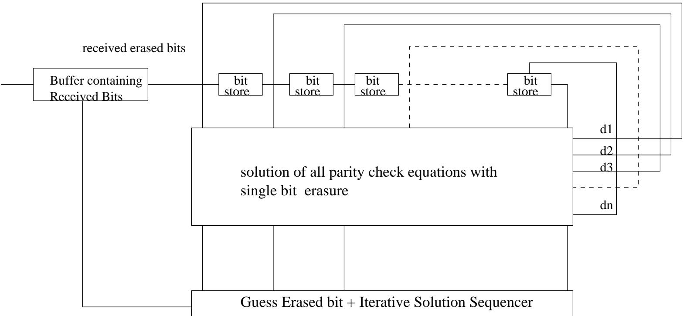

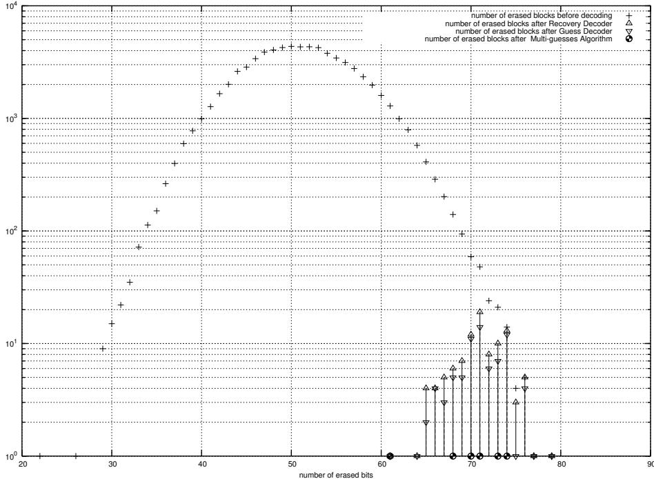

  
peg codes vs . LT codes with so l ito n d i stri buti o n i n B EC , $\mathsf { k } { = } 1 0 0$ , p=0 . 2 , 0 . 1 8 , 0 . 1 5 , Recove ry Algo rith m

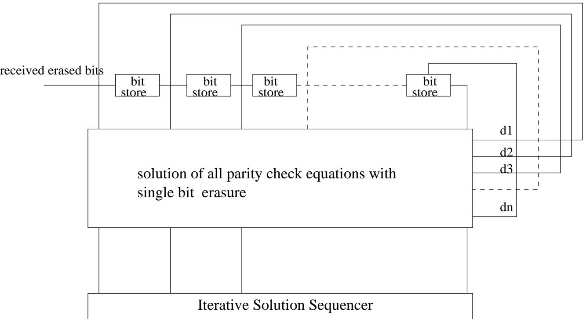