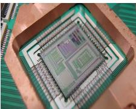
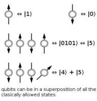
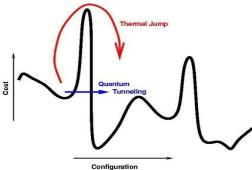
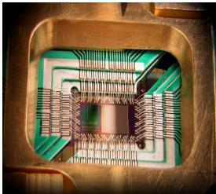
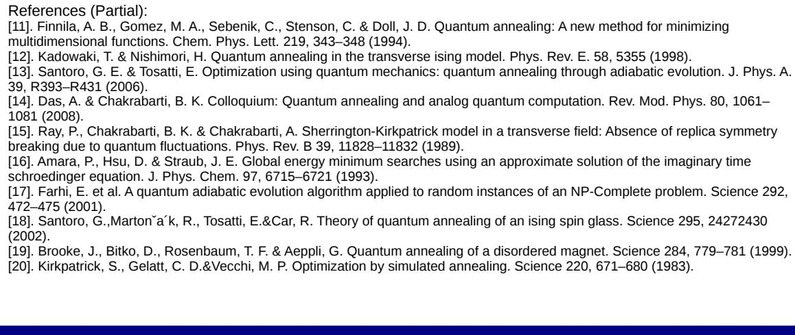
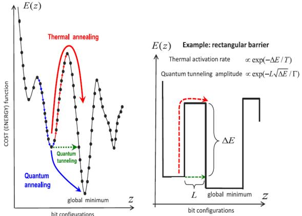
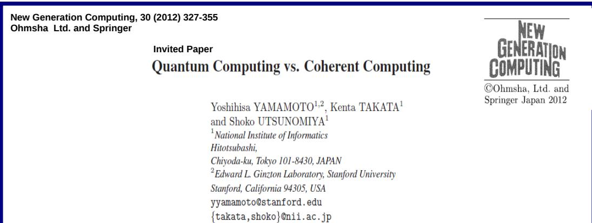
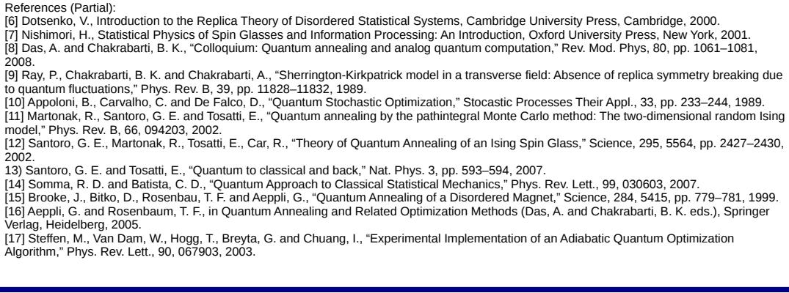
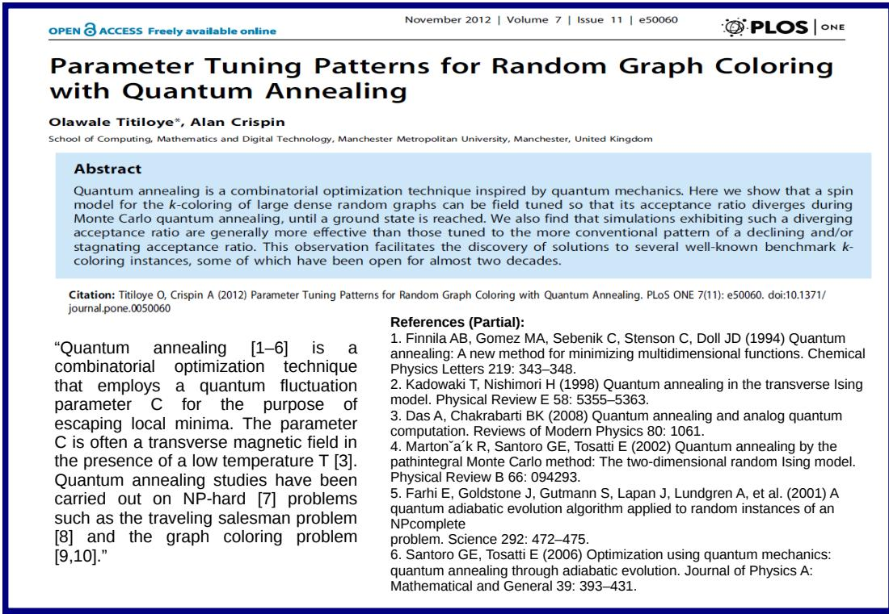
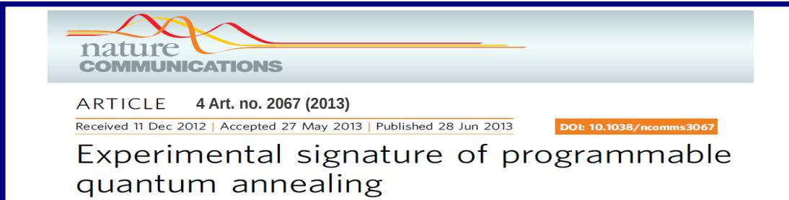

# Quantum Annealing and Computation: A Brief Documentary Note∗

Asim Ghosh†and Sudip Mukherjee‡

Condensed Matter Physics Division Saha Institute of Nuclear Physics 1/AF Bidhannagar, Kolkata 700 064, India.

December 2, 2013

# Abstract

Major breakthrough in quantum computation has recently been achieved using quantum annealing to develop analog quantum computers instead of gate based computers. After a short introduction to quantum computation, we retrace very briefly the history of these developments and discuss the Indian researches in this connection and provide some interesting documents (in the Figs.) obtained from a chosen set of high impact papers (and also some recent news etc. blogs appearing in the Internet). This note is also designed to supplement an earlier note by Bose (Science and Culture, 79, pp. 337-378, 2013).

# 1 Introduction

Quantum computers are actively being sought for the last couple of decades. Basic hope being that quantum mechanics promises several features to help faster computations if quantum features are properly implemented in the hardware architecture of such computers. Traditional architecture of classical computers is logical gatebased ones. The linear superposition processing of the wave functions in quantum mechanics helps simultaneous (probabilistic) processing of the binary bits or qubits (of information). Quantum mechanics also promises major advantages of parallel operation of these gates in appropriate architectures. The problem of decoherence has not allowed so far any gate-based quantum computer which is able to handle more than a couple of qubits. Even in classical computers, in order to solve computationally hard problems, like the traveling salesman problem, one artificially generates stochastic algorithms, like the simulated annealing techniques (in the so-called ‘Boltzmann Machine’) for practical and efficient searches. The essential problem in such searches is that the system gets locked in some local minimum separated from the other deeper minimum by (cost function or free energy) barriers. Noting that quantum tunneling feature across such barriers can help [1] searching for the minimum (optimal solution), quantum annealing techniques have been developed recently [1-29] (see Figs. 1-28). In the last couple of years, such techniques have been efficiently implemented in the computer architectures and such quantum annealing computers have already arrived in the market (see Fig. 1) and major successes are being demonstrated [18, 20, 21, 22, 23, 24, 25, 26, 28]. These exciting developments are also being captured in several recent notes (e.g., [30]), reviews (e.g., [25, 29]) and books (e.g., [31, 32]).

# 2 A brief history

Ray et al. [1] and Thirumalai et al. [2] suggested (in 1989; see Figs. 4 and 5) that quantum tunneling from local trap states across the (narrow) free energy barriers of macroscopic height (of order $N$ ; coming from the requirement of the flips of finite fraction of all $N$ spins) in a Sherrington-Kirppatrick spin glass (in transverse field) can help evolving such a complex system towards its (degenerate) ground state(s). Although the idea was criticized heavily in the subsequent literature, essentially on the ground that the incoherent phase overlaps of the tunneling states (waves) will localized the system and will not allow evolution towards the ground state(s). Later, theoretical investigations ([5, 7, 9, 10]) and the experimental demonstrations ([8]) lead to a very promising development resulting in the quantum annealing technique [12, 13, 14, 15, 23] with the hardware implementation by D-Wave system [18]. Successful checking and applications [20, 24, 26, 28] led to the emergence of a new era in quantum computing (see e.g., the comments by Bose [30], Fig. 27).

In May this year (2013), there have been several news posts and blogs in popular science journals as well as newspapers informing about the successful tests of a quantum computer with about 100 qubits (order of magnitude higher than those available otherwise), based on quantum annealing technique and marketed by the D-Wave Systems Inc. Interestingly, the NASA group of Consortium had already placed an order to them for a 512 qubit quantum annealing computer. Fig. 1 shows the BBC news blog on the purchase deal with D-Wave Inc. by the NASA-Google consortium. In an attempt to explain in a popular way how quantum tunneling can help such analog computers to get out of the “local” solutions and anneal down quantum mechanically to the “global” or “optimal” solutions with proper tuning of the tunneling term, a Scientific American news blog appeared last May (see Fig. 2). It explains in brief the working principle involved, using the Wikipedia entry on quantum annealing (partly reproduced in Fig. 3).

The rugged nature of the (free) energy landscape (energy versus spin configurations) of a classical (Ising) spin glass does not allow searches for the global energy minima by simple rolling down the landscape (say, using an energy dissipative dynamics). Essentially the system gets trapped in the local minima, separated from the global minima often by macroscopically high (free) energy barriers. Ray et al. [1] first pointed out that if such barriers are narrow, quantum mechanical tunneling (as in a transverse Ising spin glass model) can help such searches (see Fig. 4). As mentioned already, this indication was criticized heavily in the following literatures. However, some crucial features of such tunneling effects were immediately checked, with positive results in some solid-state samples discovered by Wu et al. (see Fig. 7). The possibility of tuning the quantum tunneling term to achieve the minimization of a multi-variable optimization problem was pointed out by Finnila et al. [5] (see Fig. 8). However, the use of this annealing (of the tunneling field) in the well-characterized ground state search problems of (frustrated) spin systems were convincingly demonstrated, using numerical techniques, by Kadwaki and Nishimori [7] (see also Fig. 9) and the reported success in this paper made a major impact on the following developments. Soon, Brook et al. [8] extended their earlier experimental investigations (see Fig. 7) and with suitable tuning of the tunneling field, observed clear advantages of the quantum annealing in the search for ground state(s) for such samples (see Fig. 10). This experimental demonstration of the clear advantages of quantum annealing established the field. Soon major investigations by several groups from all over the world started. Farhi et al. [9] (see Fig. 11) indicated that such an adiabatic evolution (zero temperature annealing) algorithm may help solving the computationally (NP-) hard problems. The estimate of the growth of errors in the optimal search, with the decrease in the annealing time, was made first by Santoro et al. [10] (see Fig. 12) and the extensions (and some clarifications) of the experimental investigations by Ancona-Torres et al. (see Fig. 13) enthused the community to explore further in much more meaningful way. Soon (during 2006-2008), some important reviews on quantum annealing techniques were written (see Figs. 14, 15 and 16): Santoro and Tosatti [13] and Morita and Nishimori [15] reviewd the mathematical structures of the quantum annealing techniques, while Das and Chakrabarti [14] reviewed the physical structure of quantum annealing and discussed its possible implications for analog quantum computations.1

In 2011, D-wave system announced [18] the arrival of “World’s first commercially available quantum computer, operating on a 128 qubit chip-set using quantum annealing” (see Figs. 17, 18). As indicated already, this news created huge enthusiasms as well as a lot of criticisms in the community of scientists. However, soon some leading research groups came forward to test the performances of these machines with remarkably positive results (see e.g., Figs. 19, 20, 24 and 26). There were parallel investigations on the possible performances of the quantum annealing technique in the context of various computationally hard problems (see e.g., Figs. 21, 22 and 23).2

16 May 2013

BBCNEWS SCIENCE & ENVIRONMENT

# Nasa buys into 'quantum' computer By Alex Mansfield BBC Radio Science Unit

A \$15m computer that uses "quantum physics" effects to boost its speed is to be installed at a Nasa facility. It will be shared by Google, Nasa, and other scientists, providing access to a machine said to be up to 3,600 times faster than conventional computers. Unlike standard machines, the D-Wave Two processor appears to make use of an effect called quantum tunnelling. This allows it to reach solutions to certain types of mathematical problems in fractions of a second. Effectively, it can try all possible solutions at the same time and then select the best. Google wants to use the facility at Nasa's Ames Research Center in in California to find out how quantum computing might advance techniques of machine learning and artificial intelligence, including voice recognition. University researchers will also get $2 0 \%$ of the time on the machine via the Universities Space Research Agency (USRA) Nasa will likely use the commercially available machine for scheduling problems and planning. Canadian company D-Wave Systems, which makes the machine, has drawn scepticism over the years from quantum computing experts around the world. Until research outlined earlier this year, some even suggested its machines showed no evidence of using specifically quantum effects. Quantum computing is based around exploiting the strange behaviour of matter at quantum scales. Most work on this type of computing has focused on building quantum logic gates similar to the gate devices at the basis of conventional computing. But physicists have repeatedly found that the problem with a gatebased approach is keeping the quantum bits, or qubits (the basic units of quantum information), in their quantum state. "You get drop out… decoherence, where the qubits lapse into being simple 1s and 0s instead of the entangled quantum states you need. Errors creep in," says Prof Alan Woodward of Surrey University. One gate opens... nstead, D-Wave Systems has been focused on building machines that exploit a technique called quantum annealing - a way of distilling the optimal mathematical solutions from all the possibilities. Annealing is made possible by an effect in physics known as quantum tunnelling, which can endow each qubit with an awareness of every other one. "The gate model... is the single worst thing that ever happened to quantum computing", Geordie Rose, chief technology officer for D-Wave, told BBC Radio 4's Material World programme. "And when we look back 20 years from now, at the history of this field, we'll wonder why anyone ever thought that was a good idea." Dr Rose's approach entails a completely different way of posing your question, and it only works for certain questions. But according to a paper presented this week (the result of benchmarking tests required by Nasa and Google), it is very fast indeed at finding the optimal solution to a problem that potentially has many different combinations of answers. In one case it took less than half a second to do something that took conventional software 30 minutes. A classic example of one of these "combinatorial optimisation" problems is that of the travelling sales rep, who needs to visit several cities in one day, and wants to know the shortest path that connects them all together in order to minimise their mileage. The D-Wave Two chip can compare all the possible itineraries at once, rather than having to work through each in turn. Reportedly costing up to \$15m, housed in a garden shed-sized box that cools the chip to near absolute zero, it should be installed at Nasa and available for research by autumn 2013. US giant Lockheed Martin earlier this year upgraded its own D-Wave machine to the 512 qubit D-Wave Two.

Figure 1: BBC news blog on the purchase deal of the latest 512 qubit quantum annealer of D-Wave Inc. by the NASA-Google consortium (website: http://www.bbc.co.uk/news/science-environment-22554494).

# SCIENTIFIC AMERICAN

# Is It Quantum Computing or Not? By Alan Woodward | May 17, 2013

This week I had a fascinating discussion on BBC Radio 4 with Dr Geordie Rose, the CTO of DWave, triggered by the news that NASA and Google are investing in DWave’s “quantum computer”. The idea is to set up a facility that is used by both NASA and Google but also allows academics to book time on the system to try out new ideas. Our radio conversation brought out an important issue that has dogged this subject for several years: when is a quantum computer not a quantum computer?

I began by explaining the theory behind quantum computing and why they hold the promise of significantly faster processing. In essence, it relies upon the fact that whilst conventional “bits” can be 0 or 1, quantum bits (so called qubits) can be both 0 and 1 at the same time (known as superposition). If you can combine qubits (known as entanglement) you can have a system that can process values that expand exponentially with the number of qubits you entangle. As with conventional programming, these qubits are passed through various logic gates to achieve the desired results. Hence, this is known as the “gate theory” of quantum computing.

Many academics, and increasingly large corporations such as IBM and Microsoft, have spent years working on the algorithms, error correction and a variety of techniques for creating qubits, ranging from photons to ion traps to braided anyons. To date, we have found it extremely difficult to maintain these qubits in superposition and to ensure they are truly entangled. “Decoherence”, where the qubits drop out of superposition and become just a 0 or a 1, is the bane of all quantum computer engineers.

This decoherence problem has spurred many to look for methods that are naturally immune from the effect. DWave were one such group. They have based their processor on an effect called quantum annealing, also sometimes referred to as adiabatic quantum computing, which was first discussed in 2000 as a possible means of conducting certain calculations.

The quantum annealing process is, as the name suggests, a quantum level effect. At the scale of a qubit, you can use the effect to determine the lowest “energy” state of a system. Hence, if you can describe a problem in terms of a function that has a “cost” of “energy” versus some other parameter, you can find the configuration that represents the optimal state. So, for example, think of the classic travelling salesman problem where one tries to find the shortest path when travelling between a number of cities. If you did this using simple trial and error on a conventional computer it would take longer than the age of the universe by the time you were up to 30 cities. Using quantum annealing you can define the problem as an optimisation task which means you can programme a DWave system to calculate it.

An obvious question is how much faster is quantum annealing than conventional computers? Based upon solving specific problems, that question was addressed in a paper just published, where academics compared conventional computers with a DWave system when solving optimisation problems which were known to be computationally hard. The DWave system is reported as being many thousands of times faster in some cases.

Thus, we have a system that can do useful computations based on quantum effects. It may not be a quantum computer as some purists might define it, but it does have one huge advantage: it exists and is available to do meaningful work. For all the theory, quantum computers based upon gate theory are still very experimental and can muster only a handful of qubits. Gate based quantum computing will come eventually; the money being invested and the screaming need for the technology as we head towards the end of Moore’s law mean that it’s a question of when not if. But, on the journey, which is currently of uncertain length, we should not be blind to opportunities on the way. It may prove to be a detour, but many interesting developments have arisen in computing by those who spotted just such an opportunity.

So, is DWave’s system a quantum computer? I think that’s the wrong question. Better to ask if the DWave system can help with some computations that were previously impractical, in which case the answer is yes.

Reference: Quantum Annealing: Wikipidia Images: D-Wave Systems, Inc., Arnab Das, WhiteTimberwolf, Saurabh.harsh

Figure 2: A Scientific American news blog on the NASA-Google investment in D-Wave quantum (annealing) computer. It explains briefly the working principle involved, using the Wikipedia entry on quantum annealing (Fig. 3; website: http://blogs.scientificamerican.com/guest-blog/2013/05/17/is-it-quantum-computing-ornot/).

“In quantum annealing, a "current state" (the current candidate solution) is randomly replaced by a randomly selected neighbor state if the latter has a lower "energy" (value of the objective function). The process is controlled by the "tunneling field strength", a parameter that determines the extent of the neighborhood of states explored by the method (Kadowaki and Nishimori, 1998). The tunneling field starts high, so that the neighborhood extends over the whole search space; and is slowly reduced through the computation (adiabatically; Farhi et al., 2001), until the neighborhood shrinks to those few states that differ minimally from the current states. By that time, the system finds a very deep (hopefully, the global one) minimum and settles there. At the end, we are left with the classical system at its global minimum. Indeed, the possibility of this quantum tunneling across the width of the barriers, instead of scaling their heights (as in classical or simulated annealing), was first pointed out by Ray et al. (1989) in the context of the search of replica symmetry restoration and the consequent advantage in the search of ground state(s) inK quantum spin glasses. An experimental demonstration of the success of quantum annealing for random magnets was first reported by Brooke et al. (1999).”

# Quantum mechanics: Analogy & advantage

“It has been demonstrated experimentally as well as theoretically, that quantum annealing can indeed outperform thermal annealing in certain cases, especially where the potential energy (cost) landscape consists of very high but thin barriers surrounding shallow local minima. Since thermal transition probabilities $\ P \exp \left( - \Delta / k _ { B } T \right) ; \mathsf { T } = >$ Temperature, $k _ { B }$ $= >$ Boltzmann constant) depend only on the height of the barriers, for very high barriers,  B it is extremely difficult for thermal fluctuations to get the system out from such local minima. However, as argued earlier in Ray et al. (1989), the quantum tunneling probability through the same barrier dependapproximately given by e $\arg \left( - \Delta ^ { 1 / 2 } \omega / \bar { T } \right) ; \bar { C } \quad \Rightarrow$ $^ { 4 }$ e barrier, but also on its width w and is Tunneling field.[1][2] If the barriers are thin enough $\stackrel { } { ( } \omega \ll \stackrel { \cdot } { \Delta } ^ { 1 / 2 } \stackrel { } { ) } ,$ quantum fluctuations can surely bring the system out of the shallow local minima. This classical effort growing linearly with $\dot { \boldsymbol { O } } ( \boldsymbol { N } ^ { 1 / 2 } )$ $N _ { \lambda } ^ { 1 / 2 } )$ advantage in quantum search (compared to the or N , the problem size) is well established.[3]”

aling   
References   
● P. Ray, B. K. Chakrabarti and A. Chakrabarti, "Sherrington-Kirkpatrick model in a transverse field: Absence of replica symmetry breaking due to quantum fluctuations", Phys. Rev. B 39 11828 (1989) ●B. Apolloni, C. Caravalho, D. De Falco, "Quantum stochastic optimization", Stochastic Processes and their Applications, 33, 233-244 (1989).   
●P. Amara, D. Hsu and J. E. Straub, "Global energy minimum searches using an approximate solution of the imaginary time Schroedinger equation", J. Phys. Chem. 97 6715 (1993)   
●A. B. Finnila, M. A. Gomez, C. Sebenik, C. Stenson and D. J. Doll, "Quantum annealing: A new method for minimizing multidimensional functions", Chem. Phys. Lett. 219 343 (1994)   
●T. Kadowaki and H. Nishimori, "Quantum annealing in the transverse Ising model", Phys. Rev. E 58 5355 (1998)   
●J. Brooke, D. Bitko, T. F. Rosenbaum and G. Aeppli, "Quantum annealing of a disordered magnet", Science 284 779 (1999)   
●E. Farhi, J. Goldstone, S. Gutmann, J. Lapan, A. Ludgren and D. Preda, "A Quantum adiabatic evolution algorithm applied to random instances of an NP-Complete problem", Science 292 472 (2001)   
●G. E. Santoro and E. Tosatti, "Optimization using quantum mechanics: Quantum annealing through adiabatic evolution", J. Phys. A 39 R393 (2006)   
●A. Das and B. K. Chakrabarti, "Quantum annealing and analog quantum computation", Rev. Mod. Phys. 80 1061 (2008)   
●M. W. Johnson et al. (D-Wave Group), "Quantum annealing with manufactured spins", Nature 473 194 (2011)   
●Y. Seki and H. Nishimori, "Quantum annealing with antiferromagnetic fluctuations", Phys. Rev. E85 051112 (2012)   
●For a recent review, see Quantum Ising Phases & Transitions in Transverse Ising Models, S. Suzuki, J.-i. Inoue & B. K. Chakrabarti, Springer, Heidelberg (2013)   
●For a collection of reviews on the pioneering early developments, see: Arnab Das and Bikas K Chakrabarti (Eds.), Quantum Annealing and Related Optimization Methods, Lecture Note in Physics, Vol. 679, Springer, Heidelberg (2005); Anjan K. Chandra, Arnab Das and Bikas K Chakrabarti (Eds.),Quantum Quenching, Annealing and Computation, Lecture Note in Physics, Vol. 802, Springer, Heidelberg (2010

1. A. Das, B.K. Chakrabarti, and R.B. Stinchcombe (2005), Phys. Rev. E 72, art. 026701   
2. V.N. Smelyanskiy, E.G. Rieffel, S.I. Knysh, C.P. Williams, M.W. Johnson, M.C. Thom, and   
K.L.P.W. G. Macready (2012), arXiv:1204.2821   
3. L. K. Grover (1996), Proc. 28th Ann. ACM Symp. Theory of Comp., p. 212   
4. "Learning to program the D-Wave One". Retrieved 11 May 2011.   
5. "D-Wave Systems sells its first Quantum Computing System to Lockheed Martin Corporation".   
2011-05-25. Retrieved 2011-05-30.   
6."USC To Establish First Operational Quantum Computing System at an Academic Institution".   
2011-10-28. Retrieved 2011-10-30.   
7.N. Jones, Google and NASA snap up quantum computer, Nature (2013), doi:   
10.1038/nature.2013.12999, http://www.nature.com/news/google-and-nasa-snap-up-quantum  
computer-1.12999.

Figure 3: Part of the entry on quantum annealing in Wikipedia (as in September 2013; website: http://en.wikipedia.org/wiki/Quantum-annealing ).

# Sherrington-Kirkpatrick model in a transverse field: Absence of replica symmetry breaking due to quantum fluctuations

P. Ray, B. K. Chakrabarti, and Arunava Chakrabarti Saha Institute of Nuclear Physics, 92 Acharya Praffula Chandra Road, Calcutta 700 O09, India (Received 14 October 1988)

The Sherrington-Kirkpatrick model under a transverse field is studied here employing the Suzuki-Trotter formula to map the model to an equivalent classical one. The effective Thouless-Anderson-Palmer free energy is used to study the stability of the system, and Monte Carlo computer simulations of the effective classical model are performed to obtain the phase diagram and the magnetization overlap distribution. Our results indicate a trivial overlap distribution due to quantum fuctuations. The phase diagram shows a slight initial increase in the glass transition temperature $T _ { g }$ as the transverse field is switched on, confirming that obtained by Yokota.

# DISCUSSIONS

simulation results are only for $N = 1 6$ , 24, and 32. We attribute the ergodicity of the transverse SK model to the quantum fluctuations due to the transverse field. Quantum tunneling between the classical "trap" states, separated by infinite (but narrow) barriers in the freeenergy surface,² is possible, as quantum tunneling probability is proportional to the barrier area which is finite. We expect that any amount of transverse field $\Gamma$ would lead to the collapse of the distribution $W ( q )$ to a delta function; only the relaxation time depends on $\Gamma$ , such that with smaller I the system would take more time to relax to the equilibrium state. Detailed study is needed to find the effect of transverse field $\Gamma$ on relaxation time and the equilibrium state thus attained.,

Figure 4: Title, abstract and some excerpts from the first published paper arguing that quantum tunneling across the free energy barriers in Sherrienton-Kirkpatrick spin glass model can lead to efficient search possibilities for its ground state(s). It may be noted that computationally hard problems can often be mapped into such longrange spin glass models and the advantage of quantum tunneling in such quantum spin glass models has lead ultimately to the development of the quantum annealer/computer discussed here.

# Infinite-range Ising spin glass in a transverse field

D Thirumalai, Qiang Li‡ and T R Kirkpatrick‡ + Department of Chemistry and Biochemistry and Institute for Physical Science and Technology. University of Maryland, College Park, MD 20742, USA ‡ Department of Physics and Astronomy and Institute for Physical Science and Technology, University of Maryland, College Park, MD 20742, USA

Received 15 November 1988, in final form 18 April 1989

Abstract. The infinite-range Ising spin glass in the presence of a transverse field is considered. Using the generalised Trotter formula and replica methods, the free energy for the system with quenched random bond interactions is evaluated using the static approximation. It is shown that, when the strength of the transverse field equals the largest eigenvalue of the random bond interaction matrix, the spin glass transition is destroyed. e also show tht a replica-symetic spin glass phase is sable in a certain regon o th temperature-field phase diagram. Finally we present suggestive arguments which indicate that, when the time dependence of the dynamic susceptibility is included, then the stability of the replica-symmetric phase is enhanced.

# “Conclusions

A plausible physical reason for the stability of the replica-symmetric solution can be given in terms of the pure state picture that is suggested by the Parisi solution to the $\textsf { s } \mathsf { K }$ model. The ordered phase of the SK model is thought to consist of many pure states, ail with the same free energy per spin. The pure states are separated by barrier and the timescale for crossing the barrier scales as and hence becomes infinite as $N \to \infty$ The transverse field essentially induces tunnelling between the pure states and we suggest that the diverging barriers are somehow renormalised to finite values as r becomes large enough, i.e. when $\Gamma / J { \sim } \mathbf { O } ( 1 )$ Under these circumstances, the systems coherently tunnels between what were originally ‘pure’ states and this leads to the overlap distribution given by (4.1). This hypothesis can be verified by quantum Monte Carlo simulations. ”

Figure 5: Title, abstract and some excerpts from [2], arguing (in almost the same language as in ref. [1]; see Fig. 4) for the possible advantage of quantum tunneling between well characterised (classically) localized states in the same long-range transverse Ising spin glass model.

# QUANTUM STOCHASTIC OPTIMIZATION

B. APOLLONI Dipartimento di Scienze dell' Informazione, Università di Milano, I-20133 Milano, Italy

C. CARVALHO\* Universität Bielefeld, 4800 Bielefeld 1, FR Germany

D. de FALCO Dipartimento di Scienze dell Informazione, Università di Milano, I-20133 Milano, Italy, and Research Center Bielefeld-Bochum-Stochastic, Universität Bielefeld, 4800 Bielefeld 1, FR Germany

Received 3 June 1988   
Revised 23 January 1989

# From Classical to Quantum Glass

Wenhao Wu, B. Ellman, and T. F. Rosenbaum

The James Franck Institute and Department of Physics, The University of Chicago, Chicago, Illinois 60637

G. Aeppli and D. H. Reich (a) AT& T Bell Laboratories, Murray Hill, New Jersey 07974 (Received 11 March 1991)

We study the effects of a transverse magnetic field on the dynamics of the randomly diluted, dipolar coupled, Ising magnet LiHo.167Yo.833FThe transverse field mixes the eigenfunctions of the groundsa Ising doublet with the otherwis naccesible excited-state levels.We obsrve a rapid decrein the characteristic elaxation times, larg changes i the spectral form f the relaxation, and a depresion of the spin-glass transition temperature with the introduction of quantum fuctuations.

“Various authors [2-4] have considered spin glasses in transverse fields, with predictions ranging from the destruction of the spin-glass state [3] to an enhancement in the transition temperature [4] with the introduction of quantum fluctuations. We report here static and dynamic measurements on a physical realization of the Ising spin glass in a transverse magnetic field.”

# References (Partial):

[2] A. J. Bray and M. A. Moore, 3. Phys. C 13, L655 (1980); H. Ishii and T. Yamamoto, J. Phys. C 18, 6225 (1985); T. K. Kopec, K. D. Usadel, and G. Buttner, Phys. Rev. B 39, 12418 (1989); D. Thirumalai, Q. Li, and T. R. Kirkpatrick, J. Phys. A 22, 3339 (1989); G. Biittner and K. D. Usadil, Phys. Rev. B 41, 428 (1990); Y. Y. Goldschmidt and P.-Y. Lai, Phys. Rev. Lett. 64, 2467 (1990).   
[3] R. A. Klemm, J. Phys. C 12, L735 (1979).   
[4] T. Yokota, Phys. Lett. A 125, 482 (1987); P. Ray, B. K. Chakrabarti, and A. Chakrabarti, Phys. Rev. B 39, 1182 (1989).

# Quantum annealing: a new method for minimizing multidimensional functions

A.B. Finnila, M.A. Gomez, C. Sebenik, C. Stenson, J.D. Doll Department of Chemistry, Brown University, Providence, RI 02912, USA

Received 29 November 1993

# Abstract

Qululs  t configurations of Lennard-Jones clusters of up to 19 particles (roughly $1 0 ^ { 5 }$ local minima). This early success suggests that this method may complement the widely implemented technique of simulated annealing.

Figure 8: Title and abstract of the first published paper demonstrating the ground state cluster search for a Lennard-Jones system with ‘quantum annealing’ [in the title; Of course, the first claim for $\mathrm { { ^ 6 A } }$ numerical implementation of quantum annealing’ in a single particle Hamiltonian for minimizing a real function of Boolean variables was published by B. Apolloni, C. Carvalho and D. De Falco in a conference (held in July 1988) proceedings, ‘Stochastic Processes, Physics & Geometry’, Eds. S. Albeverio et al., World Scientific, Singapore, 1990, pp. 97-111].

# Quantum annealing in the transverse Ising model

Tadashi Kadowaki and Hidetoshi Nishimori eTuTo (Received 30 April 1998)

W T l various exchange interactions. Comparison with the results of the corresponding classicl (thermal) method we use the same annealing schedule. [S1063-651X(98)02910-9]

# Quantum Annealing of a Disordered Magnet

Brooke, D. Bitko,1 T. F. Rosenbaum,1\* G. Aeppl

Traditional simulated annealing uses thermal fluctuations for convergence in optimization problems. Quantum tunneling provides a different mechanism for moving between states, with the potential for reduced time scales. Thermal and quantum annealing are compared in a model disordered magnet, where the effects of quantum mechanics can be tuned by varying an applied magnetic field. The results indicate that quantum annealing hastens convergence to the optimum state.

1The James Franck Institute and Department of Physics, The University of Chicago, Chicago, IL 60637, USA.   
2NEC Research Institute, 4 Independence Way, Princeton, NJ 08540, USA.

# Science 292, 472 (2001)

# A Quantum Adiabatic Evolution Algorithm Applied to Random Instances of an NP-Complete Problem

Edward Farhi,1\* Jeffrey Goldstone,' Sam Gutmann,²   
Joshua Lapan,³ Andrew Lundgren,³ Daniel Preda³3

A quantum system will stay near its instantaneous ground state if the Hamiltonian that governs its evolution varies slowly enough. This quantum adiabatic behavior is the basis of a new class of algorithms for quantum computing. We tested one such algorithm by applying it to randomly generated hard instances of an NP-complete problem. For the small examples that we could simulate, the quantum adiabatic algorithm worked well, providing evidence that quantum coputers  large ones can be built) may be able to outperform orary computers on hard sets of instances of NP-complete problems.

1Center for Theoretical Physics, Massachusetts Institute of Technology, Cambridge, MA 02139, USA.   
2Department of Mathematics, Northeastern University, Boston, MA 02115, USA.   
3Massachusetts Institute of Technology, Cambridge, MA 02139, USA.

# Theory of Quantum Annealing of an Ising Spin Glass

Giuseppe E. Santoro,1 Roman Martoñák,2,3 Erio Tosatti, 1,4\* Roberto Car5

  
Figure 11: Title and abstract of zero temperature quantum annealing algorithm for NP-hard problems.

Probing the lowest energy configuration of a complex system by quantum annealing was recently found to be more effective than ts classical, thermal counterpart. By comparing classical and quantum Monte Carlo annealing protocols on the two-dimensional random Ising model (a prototype spin glass), we confirm the superiority of quantum annealing relative to classical annealing. We also propose a theory of quantum annealing based on a cascade of Landau-Zener tunneling events. For both classical and quantum annealing, the residual energy after annealing is inversely proportional to a power of the logarithm of the annealing time, but the quantum case has a larger power that makes it faster.

Figure 12: Title and abstract of a paper on application of quantum annealing in estimating the remaining fraction of undesired solutions in some optimization searches in Ising spin-glasses.

# Quantu and Classical Gla Transitionsin $\mathbf { L i H _ { 0 } } _ { x } \mathbf { Y _ { 1 - { x } } } \mathbf { F _ { 4 } }$

CAncoa-Torres, D.M. Silevitch, G. Aeppli,andT.F. Roseb

yT C D y L (Received 14 January 2008; revised manuscript received 2 April 2008; published 30 July 2008)

When performed in the proper low-field, low-frequency limits, measurements of the dynamics and the nonlinear susceptibility in the model Ising magnet in a transverse field $\mathrm { L i H o } _ { x } \mathrm { Y } _ { 1 - x } \mathrm { F } _ { 4 }$ prove the existence of a spin-glass transition for $x = 0 . 1 6 7$ References bu the behavor n the quantu rgim  are ransver el diff becu  the copetngefets of quantum entanglement and random fields.

“Research on spin glasses [1] has not only led to deep insights into disordered materials and the glassy state but has generated novel approaches to problems ranging from computer architecture through protein folding to economics. The rugged free energy landscape characteristic of such systems defies usual equilibrium analyses, with pronounced nonlinear responses and history dependence. At low temperatures, and in cases where barriers to relaxation are tall and narrow, quantum mechanics can enhance the ability to traverse the free energy surface [2]. The LiHoxY1xF4 family of materials represents the simplest quantum spin model, the Ising magnet in a transverse field, and it has been an especially useful system to probe the interplay of disorder, glassiness, random magnetic fields, and quantum entanglement [3–10].”

# References (Partial):

[1] V. Cannella and J. A. Mydosh, Phys. Rev. B 6, 4220 (1972).   
[2] P. Ray et al., Phys. Rev. B 39, 11 828 (1989); J. Brooke et al., Science 284, 779 (1999); G. E. Santoro et al., Science 295, 2427 (2002).   
[3] W. Wu et al., Phys. Rev. Lett. 67, 2076 (1991). [4] W. Wu et al., Phys. Rev. Lett. 71, 1919 (1993). [5] D. H. Reich, T. F. Rosenbaum, and G. Aeppli, Phys. Rev. Lett. 59, 1969 (1987); S. Ghosh et al., Science 296, 2195 (2002).   
[6] S. Ghosh et al., Nature (London) 425, 48   
(2003).   
[7] M. Schechter and P. C. E. Stamp, Phys. Rev. Lett. 95, 267208 (2005); M. Schechter and N. Laflorencie, Phys. Rev. Lett. 97, 137204 (2006); M. Schechter, Phys. Rev. B 77, 020401(R) (2008). [8] S. M. A. Tabei et al., Phys. Rev. Lett. 97,   
237203 (2006); S. M. A. Tabei, F. Vernay, and M. J. P. Gingras, Phys. Rev. B 77, 014432 (2008). [9] A. Biltmo and P. Henelius, Phys. Rev. B 76, 054423   
(2007).   
[10] R. N. Bhatt and A. P Young, Phys. Rev. Lett. 54, 924 (1985); M.Y. Guo, R. N. Bhatt, and D. A. Huse, Phys. Rev. Lett. 72, 4137 (1994); C. Pich et al., Phys. Rev. Lett. 81, 5916 (1998).

  
Figure 13: Title, abstract and some excerpts from a paper extending and clarifying the method used in ref. [8] (see fig. 10) for quantum glasses.

# Optimization using quantum mechanics: quantum annealing through adiabatic evolution

Giuseppe E Santoro1,2 and Erio Tosatti1,2

1 International School for Advanced Studies (SISSA) and CNR-INFM Democritos National Simulation Center, Via Beirut 2-4, I-34014 Trieste, Italy

Abstract We review here some recent work in the field of quantum annealing, alias adiabatic quantum computation. The idea of quantum annealing is to perform optimization by a quantum adiabatic evolution which tracks the ground state of a suitable timedependent Hamiltonian, where ‘h’ is slowly switched off. We illustrate several applications of quantum annealing strategies, starting from textbook toy-models—double-well potentials and other one-dimensional examples, with and without disorder. These examples display in a clear way the crucial differences between classical and quantum annealing. We then discuss applications of quantum annealing to challenging hard optimization problems, such as the random Ising model, the travelling salesman problem and Boolean satisfiability problems. The techniques used to implement quantum annealing are either deterministic Schr¨odinger’s evolutions, for the toy models, or pathintegral MonteCarlo and Green’s functionMonteCarlo approaches, for the hard optimization problems. The crucial role played by disorder and the associated non-trivial Landau–Zener tunnelling phenomena is discussed and emphasized.

“The idea of quantum annealing (QA) is an elegant and fascinating alternative to classical thermal simulated annealing (CA); it consists in helping the system escape the local minima using quantum mechanics—by tunnelling through the barriers rather than thermally overcoming them—with an artificial and appropriate source of quantum fluctuations (the counterpart of the temperature) initially present and slowly (adiabatically) switched off. To the best of our knowledge, this idea was first explicitly formulated, and tested in numerical simulations, in the early 1990s [9–11]. In the Ising spin glass context—more precisely, for the infinite range Sherrington–Kirkpatrick model [12]—the idea that the addition of a transverse field quantum term - $T \mathcal { Z } _ { \mathrm { i } } \mathfrak { O } _ { \mathrm { i } } ^ { \times }$ $\boldsymbol { \cdot } ^ { \mathrm { { s } } } ,$ being Pauli matrices at site i) might help the system in tunnelling through the infinitely high classical barriers separating the infinitely many metastable states was indeed put forward even earlier, in [13, 14]. More recently, experimental evidence in the disordered Ising ferromagnet $\mathsf { L i H O } _ { _ { 0 . 4 4 } } \mathsf { Y } _ { _ { 0 . 5 6 } } \mathsf { F } _ { _ { 4 } }$ in a transverse magnetic field showed that the QA strategy is not only feasible but presumably winning in certain cases [15, 16].”

References (Partial):   
[9] Amara P, Hsu D and Straub J E 1993 J. Phys. Chem. 97 6715 [10] Finnila A B, Gomez M A, Sebenik C, Stenson C and Doll J D 1994 Chem. Phys. Lett. 219 343   
[11] Kadowaki T and Nishimori H 1998 Phys. Rev. E 58 5355   
[12] Sherrington D and Kirkpatrick S 1975 Phys. Rev. Lett. 35 1792 [13] Ray P, Chakrabarti B K and Chakrabarti A 1989 Phys. Rev. B 39 11828   
[14] Thirumalai D, Li Q and Kirkpatrick T R 1989 J. Phys. A: Math. Gen. 22 3339   
[15] Brooke J, Bitko D, Rosenbaum T F and Aeppli G 1999 Science 284 779   
[16] Aeppli G and Rosenbaum T F 2005 Quantum Annealing and Related Optimization Methods ed A Das and B K Chakrabarti (Berlin: Springer) p 159

[43] Das A and Chakrabarti B K 2005 Quantum Annealing and Related Optimization Methods (Lecture Notes in Physics) (Berlin: Springer)

Figure 14: Title, abstract and some excerpts for the first review on adiabatic quantum computation/annealing.

# Colloquium: Quantum annealing and analog quantum computation

Arnab Das\* and Bikas K. Chakrabartit

Theoretical Condensed Matter Physics Division and Centre for Applied Mathematics and Computational Science, Saha Institute of Nuclear Physics, 1/AF, Bidhannagar, Kolkata-700064, India

(Published 5 September 2008)

Therecent success in quantum annealing, i.e., optimization of thecost or energy functions of complex ssts utilizig quantu fuctuations s reviw here. The concet is inroduce in sucessiv steps through studying the mapping of such computationally hard problems to classical spin-glass problems, quantum spin-glass problems arising with the introduction of quantum fluctuations, and the annealing behavior of the systems as these fluctuations are reduced slowly to zero. This provides a general framework for realizing analog quantum computation.

# “SUMMARY AND DISCUSSIONS

References (partial):

Unlike gate-based quantum computers see, e.g., Ekert and Jozsa, 1996; Nielsen and Chuang, 2000; Galindo and Martin-Delgado, 2002, annealing of a physical system toward the optimal state encoded in the ground state of the final Hamiltonian in the classical limit naturally achieves analog quantum computation. As discussed here, utilization of quantum-mechanical tunneling through classically localized states in annealing of glasses has opened up this new paradigm for analog quantum computation of hard optimization problems through adiabatic reduction of quantum fluctuations. We reviewed the recent success in annealing, or optimizing, the cost functions of complex systems, utilizing quantum fluctuations rather than thermal fluctuations (see Santoro and Tosatti, 2006, for a more technical review). As mentioned, following the early indication by Ray et al. 1989 and the pioneering demonstrations, theoretically by Amara et al. 1993, Finnila et al. 1994, Kadowaki and Nishimori 1998, Farhi, Goldstone, Gutmann, et al. 2001, and Santoro et al. 2002, and experimentally by Brooke et al. 1999, the quantum annealing technique has now emerged as a successful technique for optimization of complex cost functions. The literature exploring its success and also its limitations is also considerably developed at present.”

Amara, P., D. Hsu, and J. E. Straub,   
1993, J. Phys. Chem. 97, 6715.   
Brooke, J., D. Bitko, T. F. Rosenbaum, and G. Aeppli, 1999, Science 284, 779. Ekert, A., and R. Jozsa, 1996, Rev. Mod. Phys. 68, 733.   
Farhi, E., J. Goldstone, S. Gutmann, J. Lapan, A. Ludgren, and D. Preda, 2001, Science 292, 472.   
Galindo, A., and M. A. Martin-Delgado, 2002, Rev. Mod. Phys. 74, 347.   
Kadowaki, T., and H. Nishimori, 1998, Phys. Rev. E 58, 5355.   
Nielsen, M. A., and I. L. Chuang, 2000, Quantum Computation and Quantum Information Cambridge University Press, Cambridge, UK.   
Ray, P., B. K. Chakrabarti, and A.   
Chakrabarti, 1989, Phys. Rev. B 39,   
11828.   
Santoro, G. E., R. Martonˇ ák, E. Tosatti, and R. Car, 2002, Science 295, 2427. Santoro, G. E., and E. Tosatti, 2006, J. Phys. A 39, R393.

Figure 15: Title, abstract and some excerpts from a review on quantum annealing and quantum computation.

# JOURNAL OF MATHEMATICAL PHYSICS 49, 125210 (2008)

# Mathematical foundation of quantum annealing

Satoshi Morita1,a) and Hidetoshi Nishimori2   
Inenational School for Advance Studies (SISSA) Via Beirut -, 1-34014 Trieste, Italy   
epartment f Physis Tokyo Institute f Technology, Oh-okayama Meguroku   
Tokyo 152-8551, Japan

(Received 4 June 2008; accepted 10 September 2008; published online 15 December 2008)

Quantum annealing is a generic name of quantum algorithms that use quantummechanical fluctuations to search for the solution of an optimization problem. It shares the basic idea with quantum adiabatic evolution studied actively in quantum computation. The present paper reviews the mathematical and theoretical foundations of quantum annealing. In particular, theorems are presented for convergence conditions of quantum annealing to the target optimal state after an infinite-time evolution following the Schrödinger or stochastic Monte Carlo dynamics. It is proved that the same asymptotic behavior of the control parameter guarantees convergence for both the Schrödinger dynamics and the stochastic dynamics in spite of the essential difference of these two types of dynamics. Also described are the prescriptions to reduce errors in the final approximate solution obtained after a long but finite dynamical evolution of quantum annealing. It is shown there that we can reduce errors significantly by an ingenious choice of annealing schedule time dependence of the control parameter without compromising computational complexity qualitatively. A review is given on the derivation of the convergence condition for classical simulated annealing from the view point of quantum adiabaticity using a classical-quantum mapping.

“Let us now turn our attention to QA see Refs. [6–11] In SA, we make use of thermal classical fluctuations to let the system hop from state to state over intermediate energy barriers to search for the desired lowest-energy state. Why then not try quantum-mechanical fluctuations quantum tunneling for state transitions if such may lead to better performance? In QA we introduce artificial degrees of freedom of quantum nature, noncommutative operators, which induce quantum fluctuations. We then ingeniously control the strength of these quantum fluctuations so that the system finally reaches the ground state, just like SA in which we slowly reduce the temperature.”

References (Partial):   
[6] A. B. Finnila, M. A. Gomez, C. Sebenik, S.   
Stenson, and J. D. Doll, Chem. Phys. Lett. 219, 343 1994.   
[7] T. Kadowaki and H. Nishimori, Phys. Rev. E 58, 5355 1998.   
[8] T. Kadowaki, “Study of optimization problems by quantum annealing,” PhD thesis, Tokyo Institute of Technology, 1999; e-print arXiv:quant-ph/0205020. [9] A. Das and B. K. Charkrabarti, Quantum   
Annealing and Related Optimization Methods,   
Lecture Notes in Physics Vol. 679 Springer, Berlin, 2005.   
[10] G. E. Santoro and E. Tosatti, J. Phys. A 39, R393 2006.   
[11] A. Das and B. K. Chakrabarti, e-print   
arXiv:0801.2193; “Quantum Annealing and Analog Quantum Computation,” Rev. Mod. Phys. to be published.

# D-Wave Systems

# WIKIPEDIA

“D-Wave Systems, Inc. is a quantum computing company, based in Burnaby, British Columbia. On May 11, 2011, D-Wave System announced D-Wave One, labeled "the world's first commercially available quantum computer," operating on a 128 qubit chip-set[1] using quantum annealing [2][3][4][5] to solve optimization problems. In May 2013 it was announced that a collaboration between NASA, Google and the Universities Space Research Association (USRA) launched a Quantum Artificial Intelligence Lab using a 512 qubit D-Wave Two that would be used for research into machine learning, among other fields of study.[6]”

# History

“D-Wave was founded by Haig Farris (former chair of board), Geordie Rose (CTO and former CEO), Bob Wiens (former CFO), and Alexandre Zagoskin (former VP Research and Chief Scientist). Farris taught an entrepreneurship course at UBC (University of British Columbia), where Rose obtained his Ph.D. and Zagoskin was a postdoctoral fellow. The company name refers to their first qubit designs, which used d-wave superconductors.

D-Wave operated as an offshoot from UBC[citation needed], while maintaining ties with the Department of Physics and Astronomy. It funded academic research in quantum computing, thus building a collaborative network of research scientists. The company collaborated with several universities and institutions, including UBC[citation needed], IPHT Jena[citation needed], Université de Sherbrooke[citation needed], University of Toronto[citation needed], University of Twente[citation needed], Chalmers University of Technology[citation needed], University of Erlangen[citation needed], and Jet Propulsion Laboratory[citation needed]. These researchers worked with D-Wave scientists and engineers. Some of D-Wave's peer-reviewed technical publications come from this period. Some publications have D-Wave employees as authors, while others include employees of their partners as well or only. As of 2005, these partnerships were no longer listed on D-Wave's website.[18][19]

D-Wave operated from various locations in Vancouver, Canada, and laboratory spaces at UBC before moving to its current location in the neighboring suburb of Burnaby.”

Photograph of a chip constructed by D-Wave Systems Inc., designed to operate as a 128-qubit superconducting adiabatic quantum optimization processor, mounted in a sample holder.

References (partial):

1.M. W. Johnson et al (2011), Quantum annealing with manufactured spins (Nature)   
2."T. Kadowaki and H. Nishimori, "Quantum annealing in the transverse Ising model", Phys. Rev. E 58, 5355 (1998) 3."A. B. Finilla, M. A. Gomez, C. Sebenik and D. J. Doll, "Quantum annealing: A new method for minimizing   
multidimensional functions", Chem. Phys. Lett. 219, 343 (1994)"   
4.G. E. Santoro and E. Tosatti, "Optimization using   
quantum mechanics: quantum annealing through adiabatic evolution", J. Phys. A 39, R393 (2006)   
5. "A. Das and B. K. Chakrabarti, "Colloquium: Quantum annealing and analog quantum computation" Rev. Mod. Phys. 80, 1061 (2008)"   
6.Choi, Charles (May 16, 2013). "Google and NASA   
Launch Quantum Computing AI Lab". MIT Technology Review.   
7."Quantum Computing Demo Announcement". 2007-01- 19. Retrieved 2007-02-11   
48. "Department staff | Dr Alexandre Zagoskin | Physics | Loughborough University". Lboro.ac.uk. Retrieved 2013- 05-16.

Figure 17: From the Wikipedia entry on ‘D-Wave Systems Inc.’ (as in September 2013; website: http://en.wikipedia.org/wiki/D-Wave-Systems).

# Quantum annealing with manufactured spins

M. W. Johnson1 , M. H. S. Amin1 , S. Gildert1 , T. Lanting1 , F. Hamze1 , N. Dickson1 , R.Harris1 , A. J. Berkley1 , J. Johansson2 , P. Bunyk1 , E. M. Chapple1 , C. Enderud1 , J. P. Hilton1 , K. Karimi1 , E. Ladizinsky1 , N. Ladizinsky1 , T. Oh1 , I. Perminov1 , C. Rich1 , M. C. Thom1 , E. Tolkacheva1 , C. J. S. Truncik3 , S. Uchaikin1 , J.Wang1 , B.Wilson1  & G. Rose1

Many interesting but practically intractable problemscan be reduced to that of finding the ground state of a system of interacting spins; however, finding such a ground state remains computationally difficult1. It is believed that the ground state of somenaturally occurring spin systems can be effectively attained through a process called quantum annealing [2,3]. If it could be harnessed, quantum annealing might improve on known methods for solving certain types of problem [4,5]. However, physical investigation of quantum annealing has been largely confined tomicroscopic spins in condensed-matter systems [6–12]. Here we use quantum annealing to find the ground state of an artificial Ising spin system comprising an array of eight superconducting flux quantum bits with programmable spin–spin couplings. We observe a clear signature of quantum annealing, distinguishable from classical thermal annealing through the temperature dependence of the time at which the system dynamics freezes. Our implementation can be configured in situ to realize a wide variety of different spin networks, each of which can be monitored as it moves towards a low-energy configuration [13,14].

This programmable artificial spin network bridges the gap between the theoretical study of ideal isolated spin networks and the experimental investigation of bulk magnetic samples. Moreover, with an increased number of spins, such a system may provide a practical physical means to implement a quantum algorithm, possibly allowing more-effective approaches to solving certain classes of hard combinatorial optimization problems.

  
Figure 18: Title and abstract of the first paper by D-Wave group giving the basic architecture of their quantum annealing precessor.

# Scientific Reports 2, Article number: 571 Finding lattice eioels y qan annealing

Published 13 August 2012

AlrrNeiDickson Marhal DrerookG $\mathsf { R o s e } ^ { 2 } \&$ Alán Aspuru-Guzik'

1Department of Chemistry and Chemical Biology, Harvard University, Cambridge, MA 02138, USA,   
2D-Wave Systems, Inc., 100-4401 Still Creek Drive, Burnaby, British Columbia V5C 6G9, Canada.

Lattice protein folding models are a cornerstone of computational biophysics. Although these models are a coarse grained representation, they provide useful insight into the energy landscape of natural proteins. Finding low-energy threedimensional structures is an intractable problem even in the simplest model, the Hydrophobic-Polar (HP) model. Description of protein-like properties are more accurately described by generalized models, such as the one proposed by Miyazawa and Jernigan (MJ), which explicitly take into acnt the unique interactions mong all 20aminoacids. There is theoreticaland experimentalvidnc the advantage of solving classical optimization problems using quantum annealing over its classical analogue (simulated annealing). In this report, we present a benchmark implementation of quantum annealing for lattice protein folding problems (ix different experiments up to 81 superconducting quantum bits). This first implementation of a biophysical problem paves the way towards studying optimization problems in biophysics and statistical mechanics using quantum devices.

“Harnessing quantum-mechanical effects to speed up the solving of classical optimization problems is at the heart of quantum annealing algorithms (QA) [11–15]. There is theoretical [11,12,16–18] and experimental [19] evidence of the advantage of solving classical optimization problems using QA [11–14] over its classical analogue (simulated annealing [20]). In QA, quantum mechanical tunneling allows for more efficient exploration of difficult potential energy landscapes such as that of classical spin-glass problems. In our implementation of lattice folding, quantum fluctuations (tunneling) occurs between states representing different model protein conformations or folds.”

  
Figure 19: Title, abstract and excerpts from the first major paper supporting the claim of D-Wave quantum computer used in searching the low energy conformations of lattice protein model, reported by the Harvard University group.

# A Near-Term Quantum Computing Approach for Hard Computational Problems in Space Exploration

Vadim N. Smelyanskiy, Eleanor G. Rieffel, and Sergey I. Knysh NASA Ames Research Center, Mail Stop 269-3, Moffett Field, CA 94035 Colin P. Williams Jet Propulsion Laboratory, California Institute of Technology,Pasadena, CA 91109-8099 Mark W. Johnson, Murray C. Thom, William G. Macready D-Wave Systems Inc., 100-4401 Still Creek Drive, Burnaby, BC, Canada V5C 6G9 Kristen L. Pudenzy Ming Hsieh Department of Electrical Engineering, Center for Quantum Information Science and Technology, and Information Sciences Institute, University of Southern California, Los Angeles, CA 90089

Advances in quantum hardware mean that empirical testing of one particular family of quantum algorithms, Quantum Annealing algorithms, may be possible in the near term. Theoretical studies and classical simulations suggest that Quantum Annealing [9–12] can provide dramatic improvements, both in the algorithmic runtime and quality of the solutions, to many instances of hard optimization problems where stateof-the-art classical approaches fail.

“ $2 ( \mathrm { b } )$ i  r of height $\Delta E$ and length $L$ $\alpha$ $\mathrm { ~ x ~ e x p } \left( - L { \sqrt { \Delta E } } / \Gamma \right)$ , where $\Gamma$ is a quantu anealing constant analogous to the temperature in SA.Unlike the classical thermal activation rate for SA to cross the barrier, $\exp ( - \Delta E / T )$ , qn ot  arhe u $\sqrt { \Delta E }$ , whereas the classical activation rate exponent displays a faster linear growth with $\Delta E$ . Therefore, QA will have a tendency to beat SA in landscapes dominated by hiah narrow barriers. with $L \ll \sqrt { \Delta E }$ for typical values [18].↑1

  
Fig. 2   
An example $\Delta \mathit { { E } }$ Thigoh the barrier is ${ \sf x } \exp ( - L \sqrt { \Delta E } / \Gamma ) ,$ ,where $\Gamma = \Gamma ( t )$ is $\textrm { a } 0 \mathrm { A }$ constant h i al $\propto \exp ( - \Delta E / T ) ,$ where $T = T ( t )$

References (Partial):

[9] J. Brooke, D. Bitko, T. F. Rosenbaum, and G. Aeppli. Quantum annealing of a disordered magnet. Science, 284:779–781, 1999.   
[10] G. E. Santoro, R. Martonák, E. Tosatti, and R. Car. Theory of Quantum Annealing of an Ising Spin Glass. Science, 295:2427–2430, March 2002.   
[11] Arnab Das and Bikas K. Chakrabarti, editors. Quantum Annealing and Related Optimization Methods, volume 679 of Lecture Notes in Physics. Springer-Verlag Berlin Heidelberg, 2005.   
[12] Arnab Das and Bikas K. Chakrabarti. Colloquium: Quantum annealing and analog quantum   
compu-tation. Rev. Mod. Phys., 80:1061U1081, 2008.   
...   
[18] Edward Farhi, Jeffrey Goldstone, and Sam Gutmann. Quantum adiabatic evolution algorithms versus simulated annealing. Technical report, 2002. Available at http://arxiv.org/abs/quant-ph/   
0201031.   
[19] Arnab Das, Bikas K. Chakrabarti, and Robin B. Stinchcombe. Quantum annealing in a kinetically constrained system. Physical Review E,, 72:026701, 2005.

Figure 20: Title, abstract and some excerpts of a paper (from NASA Ames Research centre, Jet Propulsion Lab, CALTECH and University of Southern California) explaining the basic principle of quantum annealing, D-Wave computers and the possibilities of searching solutions of hard computational problems in space science and technology (website: http://arxiv.org/abs/1204.2821).

  
“An Ising model also provides a prototype framework for studying various magnetic orders in frustrated spin lattice and random spin glasses.[6, 7] Hence, an Ising machine that can find a ground state of Eq. (1) efficiently has been extensively searched in both classical and quantum domains [8]. Quantum annealing is proposed to solve Ising models by utilizing quantum uncertainty, more specifically quantum mechanical tunneling across a potential energy landscape (PEL) [9-14.] Experimental realization of quantum annealing employed either a sample of real magnetic crystal[15, 16] or molecular NMR technique [17]. “

  
Figure 21: Title and some excerpts of a paper (from National Institute of Informatics, Tokyo and Stanford University, California) comparing different quantum algorithms (including quantum annealing) in hardware platforms.

  
Figure 22: Title, abstract and some excerpts of a paper discussing possible speed-ups in quantum annealing computers.

Figure 23: Title, abstract and some excerpts from a paper discussing successes of quantum annealing algorithms for graph-coloring problems.

Quantum annealing is a general strategy for solving difficult optimization problems with the aid of quantum adiabatic evolution. Both analytical and numerical evidence suggests that under idealized, closed system conditions, quantum annealing can outperform classical thermalization-based algorithms such as simulated annealing. Current engineered quantum annealing devices have a decoherence timescale which is orders of magnitude shorter than the adiabatic evolution time. Do they effectively perform classical thermalization when coupled to a decohering thermal environment? Here we present an experimental signature which is consistent with quantum annealing, and at the same time inconsistent with classical thermalization. Our experiment uses groups of eight superconducting flux qubits with programmable spin–spin couplings, embedded on a commercially available chip with 4100 functional qubits. This suggests that programmable quantum devices, scalable with current superconducting technology, implement quantum annealing with a surprising robustness against noise and imperfections.

erico M. Spedalieri1,3, Nicholas Chancellor4   
References (Partial):   
1. Barahona, F. On the computational complexity of Ising spin glass models. J. Phys. A: Math. Gen. 15, 3241–3253 (1982).   
2. Nishimori, H. Statistical Physics of Spin Glasses and Information Processing: an Introduction (Oxford University Press, Oxford, UK, 2001).   
3. Kirkpatrick, S., Gelatt, C. D. & Vecchi, M. P. Optimization by simulated   
annealing. Science 220, 671–680 (1983).   
4. Finnila, A. B., Gomez, M. A., Sebenik, C., Stenson, C. & Doll, J. D. Quantum annealing: a new method for minimizing multidimensional functions. Chem. Phys. Lett. 219, 343–348 (1994). 5. Kadowaki, T. & Nishimori, H. Quantum annealing in the transverse Ising model. Phys. Rev. E 58, 5355 (1998).   
6. Farhi, E., Goldstone, J., Gutmann, S. & Sipser, M. Quantum computation by adiabatic evolution, Preprint at http://arXiv:quant-ph/0001106 (2000).   
7. Santoro, G. E., Martonak, R., Tosatti, E. & Car, R. Theory of quantum annealing of an Ising spin glass. Science 295, 2427–2430 (2002).   
8. Morita, S. & Nishimori, H. Mathematical foundation of quantum annealing. J. Math. Phys. 49, 125210 (2008).   
9. Brooke, J., Bitko, D., Rosenbaum, T. F. & Aeppli, G. Quantum annealing of a disordered magnet. Science 284, 779–781 (1999).   
10. Brooke, J., Rosenbaum, T. F. & Aeppli, G. Tunable quantum tunnelling of magnetic domain walls. Nature 413, 610–613 (2001).   
11. Das, A. & Chakrabarti, B. K. Colloquium: quantum annealing and analog quantum computation. Rev. Mod. Phys. 80, 1061–1081 (2008).   
12. Farhi, E. et al. A quantum adiabatic evolution algorithm applied to random instances of an NPcomplete problem. Science 292, 472–475 (2001).

Figure 24: Title and abstract of a paper reporting on quantum signatures in D-Wave machines and on their ‘surprising robustness against noise and imperfections’.

# Experimental Determination of Ramsey Numbers

Zhengbing Bian,' Fabian Chudak,1 William G. Macready,' Lane Clark,2 and Frank Gaitan3 I 0 ieiu h o epartment of Mathematics, Souhern Illinois University, Carbondale, Illinois 6001 USA Labtory  Physicl Science, 8 Greed Drive, Collee ark arylan USA (Received 2 June 2012; revised manuscript received 31 July 2013; published 25 September 2013)

Ramsey theory is a highly active research area in mathematics that studies the emergence of order in large disordered structures. Ramsey numbers mark the threshold at which order first appears and are extremely difficult to calculate due to their explosive rate of growth. Recently, an algorithm that can be implemented using adiabatic quantum evolution has been proposed that calculates the two-color Ramsey numbers $R ( m , n )$ Here we present results of an experimental implementation of this algorithm and show that it correctly determines the Ramsey numbers $R ( 3 , 3 )$ and $R ( m , 2 )$ for $4 \leq m \leq 8 ,$ The $R ( 8 , 2 )$ computation used 84 qubits of which 28 were computational qubits. This computation is the largest experimental implementation of a scientifically meaningful adiabatic evolution algorithm that has been done to date.

# Quantum annealing with more than one hundred qubit

Sergio ng, Wecker,3  Daniel A. Lidar,1John M. Martinis,4  and Matthias Troyer2 1University of Southern California, Los Angeles, CA 90089, USA 2Theoretische Physik, ETH Zurich, 8093 Zurich, Switzerland 3Quantum Architectures and Computation Group, Microsoft Research, Redmond, WA 98052, USA 4  University of California, Santa Barbara, CA 93106-9530, USA

Quantum technology is maturing to the point where quantum devices, such as quantum communication systems, quantum random number gen-erators and quantum simulators, may be built with capabilities exceeding classical computers. A quantum annealer, in particular, solves hard optimisation problems by evolving a known initial conguration at non-zero temperature towards the ground state of a Hamiltonian encoding a given problem. Here, we present results from experiments on a 108 qubit D-Wave One device based on superconducting flux qubits. The strong correlations between the device and a simulated quantum annealer, in contrast with weak correla-tions between the device and classical annealing or classical spin dynamics, demonstrate that the device performs quantum annealing. We find additional evidence for quantum annealing in the form of small-gap avoided level crossings characterizing the hard problems. To assess the computational power of the device we compare it to optimised classical algorithms.

“Annealing a material by slow cooling is an ancient technique to improve the properties of glasses, metals and steel that has been used for more than seven millennia [1]. Mimicking this process in computer simulations is the idea behind simulated annealing as an optimisation method [2], which views the cost function of an opimisation problem as the energy of a physical system. Its congurations are sampled in a Monte Carlo simulation using the Metropolis algorithm [3], escaping from local minima by thermal uctuations to nd lower energy congurations. The goal is to find the global energy minimum (or at least a close approximation) by slowly lowering the temperature and thus obtain the solution to the optimisation problem. The phenomenon of quantum tunneling suggests that it can be more efficient to explore the state space quantum mechanically in a quantum annealer [4-6]. In simulated quantum annealing [7, 8], one makes use of this effect by adding quantum fluctuations, which are slowly reduced while keeping the temperature constant and positive ultimately ending up in a low energy conguration of the optimisation problem.

Unlike adiabatic quantum computing [16], which has a similar schedule but assumes fully coherent adiabatic ground state evolution at zero temperature, quantum annealing [4-6, 10] is a positive temperature method involving an open quantum system coupled to a thermal Bath.”

# References (Partial):

[1] Muhly, J. The beginnings of metallurgy in the old world. In Maddin, R. (ed.) The beginning of the use of metals and alloys, 2-20 (Cambridge, MA: MIT Press., 1988).

[2] Kirkpatrick, S., Gelatt, C. D. & Vecchi, M. P. Optimization by simulated annealing. Science 220, 671-680 (1983).

[3] Metropolis, N., Rosenbluth, A. W., Rosenbluth, M. N., Teller, A. H. & Teller, E. Equation of state calculations by fast computing machines. The Journal of Chemical Physics 21, 1087-1092 (1953).

[4] Ray, P., Chakrabarti, B. K. & Chakrabarti, A. Sherrington-Kirkpatrick model in a transverse eld: Absence of replica symmetry breaking due to quantum uctuations. Phys. Rev. B 39, 11828- 11832 (1989).

[10] Brooke, J., Bitko, D., F., T., Rosenbaum & Aeppli,G. Quantum annealing of a disordered magnet. Science 284, 779-781 (1999).

[16] Farhi, E. et al. A quantum adiabatic evolution algorithm applied to random instances of an NP-complete problem. Science 292, 472- 475 (2001).

Figure 26: Title, abstract and some excerpts from a paper by scientists from University of Southern California, University of California, ETH Zurich and Microsoft Research, reporting on the precise quantum nature of the performance of the D-Wave computer, compared with that of classical or conventional computers (website: http://arxiv.org/abs/1304.4595).

# Breakthrough in Quantum Computation

Indrani Bose

Department of Physics, Bose Institute, Kolkata-700009 , India

In disciplines ranging over the social, physical and biological sciences, one sometimes encounters processes or phenomena involving a search for the global minimum of an appropriately defined function over a set of candidate states or configurations. The search problem acquires complexity when the function (may be free energy or a cost function) has a highly rugged structure consisting of several local minima (valleys) separated by barriers (hills). In this case, the problem of locating the global minimum becomes non-trivial.

A well-known procedure for finding the global minimum, termed simulated annealing, allows a system to escape the traps set by the local minima , thus facilitating the system’s journey to the global minimum. This is achieved via progressive changes in the temperature from high to low values. In 1989, P. Ray, B. K. Chakrabarti and A. Chakrabarti proposed [Physical Review B 39, 11828 (1989), see also A. Das and B. K. Chakrabarti, Rev. Mod. Phys. 80, 1061 (2008)] a new and more efficient method, now known as quantum annealing, to locate the global minimum in a rugged landscape utilizing the principle of quantum mechanical tunneling. In simulated annealing, the system utilizes thermal energy to cross a barrier separating neighbouring minima whereas quantum tunneling allows the system to tunnel through a barrier rather than cross over it. The seminal proposal of Ray et al. was taken up by other groups in the world including an experimental demonstration by Brooke et al. [Science 284, 779 (1999)] that quantum annealing is superior to simulated annealing in finding the lowest energy state, the ground state, of a disordered magnet.

In 2011, a Canadian company, D-wave Systems, introduced the first commercial quantum annealer to the market under the tag D-Wave One. The system was an impressive achievement in quantum computation with a 128 qubit (quantum bit ) processor chipset. In 2011 itself, the Lockheed Martin Corporation, USA purchased a D-Wave One system for its operations. In May 2013, a consortium of Google, NASA AMES and the non-profit Universities Space Research Association has purchased a quantum computer from the D-Wave Systems with 512 qubits. The Academia are also not far behind in the use of the quantum computer based on quantum annealing. The power of the quantum computer has already been demonstrated in finding the ground state of an engineered spin system [Johnson et al., Nature 473, 194 (2011)] and a study by a group of Harvard University scientists on finding low-energy conformations of lattice protein models by quantum annealing [Perdomo-Ortiz et al., Scientific Reports 2: 571 (2012)]. This has been followed by other important studies in the last few months presaging a significant surge in research activity on quantum annealing based quantum computation [see e.g., Boixo, et al, Nature Comm. 4, 3067 (2013), and arXiv:1304.4595 from Universities of California and ETH, Zurich].

Physicists have been trying since the last few decades to come up with practical realizations of quantum computers utilizing quantum mechanical principles. The usual route in this endeavour has been to utilize quantum correlations in the form of a quantity called entanglement and logic gate operations via specific quantum mechanical transformations. The quantum computers which could be constructed following this route are few-qubit systems. The quantum annealer, on the other hand, adopts a different strategy, namely, quantum tunneling for the purpose of computation and is now operational with the number of qubits of the order of a few hundreds. The annealer is, however, designed to address only a specific class of problems but lays open the possibility of exploring unconventional routes towards quantum computation.

Research activity on quantum computation is of significant importance considering the fact that quantum computers are expected to be more efficient and versatile than classical computers. Prof. Bikas K. Chakrabarti of the Saha Institute of Nuclear Physics, Calcutta (the idea of quantum annealing based computation was first mooted by his group) has the following to say on the origin and prospects of quantum annealing based computation: “The essential reason for the NP hardness of computational problems seems to be the inability to get out of a local minimum past a barrier (of height N in time less than exponential in N, using classical mechanics). Noting that even an “infinitely high” (but narrow) delta function like barrier is penetrable (in finite time; generally perhaps in polynomial in N time!) due to quantum tunneling, it was fun for us (in 1989) to suggest possible success in such computational problems using quantum tunneling mechanics, instead of classical mechanics. It was shocking to see the criticisms in the subsequent literature claiming that the decoherence among the phases of the tunneling waves from such random barriers will lead to localization and total failure of any such idea! It is great fun again to see in the last decade that such an idea is indeed working and quantum annealing computers, based on it are already in the market. Distinguished universities and research centres are now reporting major successes of such quantum computers in solving well characterized computational problems and also often acknowledging our original idea!” .

22 Apr 2013 | 20:00 BST | Posted by nicola jones | Category: Business, Physics & Mathematics, Technology

# Nature News Blog

# Further proof for controversial quantum computer

Is the world’s only commercial quantum computer really a quantum device, or a just regular computer in disguise? Controversy has long swirled around the computer produced by D-Wave, a company based near Vancouver, Canada. Now a paper published on the arXiv preprint server takes a step forward in showing that it really does operate on a quantum level. D-Wave’s computer is a special type of quantum device: its quantum bits (or qubits) seek out a lowenergy state that represents the answer to a given problem. Unlike a universal computer, this kind of computer, called an annealer, cannot answer any question thrown at it. Instead, it can only answer ‘discrete optimization’ problems. This is a type of problem where a set of criteria are all fighting to be simultaneously met, and there is one best solution that meets the most of them — one example being the simulation of protein folding, in which the system seeks a state of minimal free energy. The hope is that a quantum annealer should be able to solve these problems much more quickly than a classical one. The company’s current top-line computer has 512 qubits. In some ways, this is miles ahead of work in universal quantum computers, where academics struggle to get just a handful of qubits to operate usefully. But even D-Wave admits that it doesn’t know exactly how its computer works, and critics have complained that it might not be quantum at all. Instead, it could be using classical physics to crunch calculations. In 2011, a group led by scientists working with D-Wave published a paper in Nature with evidence that their 8-qubit system was working on a quantum level: it responded to temperature changes as expected for a quantum device. Now, a group of independent scientists follows that up by showing that the 128-qubit version of the D-Wave computer (or at least the 108 functioning qubits in the specific computer that they analysed) also seems to be behaving quantumly. Simulations of quantum versus classical annealers show that a classical one has a fairly uniform probability of solving a problem correctly; a quantum device should instead have a low probability of success at solving hard problems, and a high probability of success solving easy ones. This is what they see with the D-Wave computer. Scott Aaronson, a theoretical computer scientist at the Massachusetts Institute of Technology in Cambridge who has historically been sceptical of D-Wave’s claims, says that he is fairly convinced by the data, but that there are plenty of important questions remaining — including whether the current or future versions of the D-Wave computer will actually be any faster than classical machines. The new paper, Aaronson notes, shows that a quantum annealer is actually expected to be slower than a classical one in many circumstances. “It may be that they really have built a quantum annealing device, which is academically very interesting, but that it provides no [speed] advantage. That may be the case,” says Aaronson. The paper’s authors include several researchers from the University of Southern California in Los Angeles, which has a deal to use and experiment with the D-Wave computer recently purchased by aerospace company Lockheed Martin. The co-author contacted by this reporter declined to comment on the work until it appears in a peer-reviewed publication. As of March, that group now has a 512-qubit version of the D-Wave to play with, which could start to show a speed advantage over classical annealers.

# 4 Summary and conclusions

Approximate solutions of computationally hard problems were obtained more easily in Boltzmann-like machines which employ stochastic searches and (classical or thermal) annealing rather than employing sequential search methods. It was noted that for NP-hard problems, the effective cost function landscape (in the solution state or configuration space) becomes extremely rugged as discussed in the text. Even with classical annealing tricks the probability of escape from a local minimum to another lower one separated by a barrier of height of order $N$ (the problem size) decreases as $\exp ( - N )$ , implying that the time to arrive at the solution in not bounded by any polynomial in $N$ . Noting that the quantum tunneling probability across such a barrier decreases with width of the barrier (becoming finite in the delta function barrier limit), Ray et al. [1] proposed in 1989 that quantum tunneling might help solving NP-hard problems in polynomial (in $N$ ) time! Subsequently, the researches by Finnila et al. [5], Kadowaki and Nishimori [7], Brooke et al. [8] and Ferhi et al. [9] led to the robust development of quantum annealing technique, indicating clearly the possible development of analog quantum computers with such tricks (cf. Santoro and Tosatti [13], Das and Chakrabarti [14]). With the major breakthrough achieved by D-Wave computers [18] (with indications [28] of search time $\sim \exp ( N ^ { \alpha } )$ ; $\alpha < 1$ ), a new era in quantum computing has started: See e.g., [19, 22, 23, 25, 26] etc. as a few chosen examples only of the rapidly growing publications which (as shown in Figs. 19, 20, 21, 24, 26) indicate also the role of the original papers in this remarkable development. We note that the initial contributions by our Indian colleagues had indeed been pioneering, though the follow-up researches and contributions have been rather slow.

# Acknowledgements

This documentary note was tentatively planned during the International Conference “Diversity and Complexity: Realm of Today’s Statistical Physics” held in Saha Institute of Nuclear Physics, during 14-17 January, 2013 to commemorate sixty year of Prof. Bikas K. Chakrabarti. We are also grateful to Prof. Indrani Bose for exciting us with her note on “Breakthrough in Quantum Computation” [30] (see Fig. 27) and to Dr. Arnab Das for many important comments and suggestions. We are thankful to Dr. Masayuki Ohzeki for his comments and suggestions and to Dr. Diego de Falco for sending us some useful documents.

# References

[2] D. Thirumalai, Q. Li and T. R. Kirkpatrick, Infinite-range Ising spin glass in a transverse field, Journal of Physics A: Mathematical and General 22, 3339 (1989).   
[3] B. Apolloni, C. Carvalho, D. De Falco,Quantum stochastic optimization, Stochastic Processes and their Applications, 33, 233-244 (1989).   
[4] P. Amara, D. Hsu and J. E. Straub, Global energy minimum searches using an approximate solution of the imaginary time Schroedinger equation, The Journal of Physical Chemistry 97, 6715 (1993).   
[5] A. B. Finnila, M. A. Gomez, C. Sebenik, C. Stenson and D. J. Doll, Quantum annealing: A new method for minimizing multidimensional functions, Chemical Physics Letters 219, 343 (1994).   
[6] B. K. Chakrabarti, A. Dutta and P. Sen, Quantum Ising Phases and Transitions in Transverse Ising Models, (see chapter 6 on Transverse Ising spin glass and random field systems, pp. 118-161), Springer, Heidelberg (1996).   
[7] T. Kadowaki and H. Nishimori, Quantum annealing in the transverse Ising model, Physical Review E 58, 5355 (1998).   
[8] J. Brooke, D. Bitko, T. F. Rosenbaum and G. Aeppli, Quantum annealing of a disordered magnet, Science 284, 779 (1999).   
[9] E. Farhi, J. Goldstone, S. Gutmann, J. Lapan, A. Ludgren and D. Preda, A Quantum adiabatic evolution algorithm applied to random instances of an NP-Complete problem, Science 292, 472 (2001).   
[10] G. E. Santoro, R. Martonak, E. Tosatti and R. Car, Theory of quantum annealing of an Ising spin glass, Science 295, 2427 (2002).   
[11] A. Das, B. K. Chakrabarti, and R. B. Stinchcombe, Quantum annealing in a kinetically constrained system, Physical Review 72, 026701 (2005).   
[12] A. Das and B. K. Chakrabarti (Eds.), Quantum Annealing and Related Optimization Methods, Springer, Heidelberg (2005).   
[13] G. E. Santoro and E. Tosatti, Optimization using quantum mechanics: Quantum annealing through adiabatic evolution, Journal of Physics A 39, R393 (2006).   
[14] A. Das and B. K. Chakrabarti, Quantum annealing and analog quantum computation, Reviews of Modern Physics 80, 1061 (2008).   
[15] S. Morita and H. Nishimori, Mathematical foundation of quantum annealing, Journal of Mathematical Physics 49, 125210 (2008).   
[16] C. A.-Torres, D. M. Silevitch, G. Aeppli and T. F. Rosenbaum, Quantum and classical glass transitions in $L i H o _ { x } Y _ { 1 - x } F _ { 4 }$ , Physical Review Letters 101, 057201 (2008).   
[17] A. K. Chandra, A. Das and B. K. Chakrabarti (Eds.), Quantum Quenching, Annealing and Computation, Springer, Heidelberg (2010).   
[18] M. W. Johnson, M. W. Johnson, M. H. S. Amin, S. Gildert,T. Lanting,F. Hamze, N. Dickson,R. Harris, A. J. Berkley, J. Johansson, P. Bunyk, E. M. Chapple, C. Enderud, J. P. Hilton, K. Karimi, E. Ladizinsky, N. Ladizinsky, T. Oh, I. Perminov, C. Rich, M. C. Thom, E. Tolkacheva, C. J. S. Truncik, S. Uchaikin, J. Wang, B. Wilson and G. Rose, Quantum annealing with manufactured spins, Nature 473, 194 (2011).   
[19] Y. Seki and H. Nishimori, Quantum annealing with antiferromagnetic fluctuations, Physical Review E 85, 051112 (2012).   
[20] V. N. Smelyanskiy, E. G. Rieffel, S. I. Knysh, C. P. Williams, M. W. Johnson, M. C. Thom, and K. L. P. W. G. Macready, A near-term quantum computing approach for hard computational problems in space exploration, arXiv:1204.2821 (2012).   
[21] D. Nagaj, R. D. Somma, M. Kieferova, Quantum speed up by quantum annealing, Physical Review Letters 109, 050501 (2012).   
[22] O. Titiloye, A. Crispin, Parameter tuning patterns for random graph coloring with quantum annealing, PLoS ONE 7(11), e50060 (2012).   
[23] Y. Yamamoto, K. Takata and S. Utsunomiya, Quantum computing vs. coherent computing, New Generation Computing 30, 327 (2012).   
[24] A. P.-Ortiz, N. Dickson, M. Drew-Brook, G. Rose and A. A.-Guzik, Finding low-energy conformations of lattice protein models by quantum annealing, Scientific Reports 2, 571 (2012).   
[25] V. Bapst, L. Foini, F. Krzakala, G. Semerjian and F. Zamponi, The quantum adiabatic algorithm applied to random optimization problems: The quantum spin glass perspective, Physics Reports 523, 127 (2013).   
[26] S. Boixo, T. Albash, F. M. Spedalieri, N. Chancellor and D. A. Lidar, Experimental signature of programmable quantum annealing, Nature Communications 4, 2067 (2013).   
[27] Z. Bian, F. Chudak, W. G. Macready, L. Clark and F. Gaitan, Experimental determination of Ramsey numbers, Physical Review Letters 111, 130505 (2013).   
[28] S. Boixo, T. F. Rnnow, S. V. Isakov, Z. Wang, D. Wecker, D. A. Lidar, J. M. Martinis, M. Troyer, Quantum annealing with more than one hundred qubits, arXiv:1304.4595 (2013).   
[29] S. Suzuki, J.-i. Inoue and B. K. Chakrabarti, Quantum Ising Phases & Transitions in Transverse Ising Models, (see chapter 8 on Quantum annealing, pp. 225-290), Springer, Heidelberg (2013).   
[30] I. Bose, Breakthrough in quantum computation, Science and Culture 79, 377 (2013).   
[31] A. Dutta, G. Aeppli, B. K. Chakrabarti, U. Divakaran, T. Rosenbaum and D. Sen, Quantum Phase Transitions in Transverse Field Models: From Statical Physics to Quantum Information, Cambridge University Press (forthcoming book, 2014).   
[32] B. K. Chakrabarti, J.-i. Inoue, R. Tamura, and S. Tanaka, Quantum Spin Glasses, Annealing and Computation, Cambridge University Press (forthcoming book, 2015).