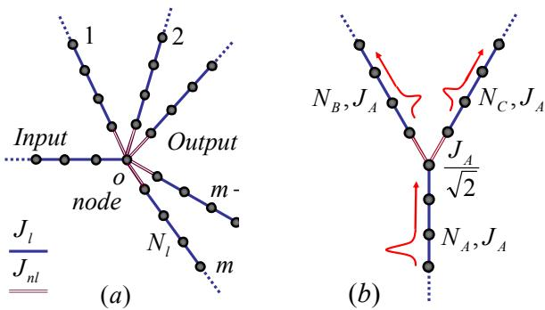
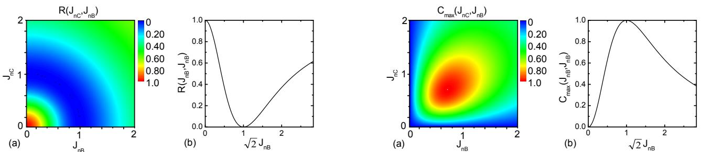
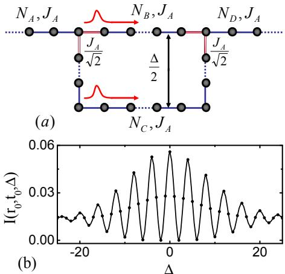

# Beam Splitter for Spin Waves in Quantum Spin Network

S. Yang $^ { 1 }$ , Z. Song $^ { 1 , a }$ and C.P. Sun1,2, $^ { a }$ ,b $^ { 1 }$ Department of Physics, Nankai University, Tianjin 300071, China and $^ 2$ Institute of Theoretical Physics, Chinese Academy of Sciences, Beijing, 100080, China

We theoretically design and analytically study a controllable beam splitter for the spin wave propagating in a star-shaped (e.g., a $Y$ -shaped beam) spin network. Such a solid state beam splitter can display quantum interference and quantum entanglement by the well-aimed controls of interaction on nodes. It will enable an elementary interferometric device for scalable quantum information processing based on the solid system.

PACS numbers: 03.65.Ud, 75.10.Jm, 03.67.Lx

# I. INTRODUCTION

Beam splitters are the elementary optical devices frequently used in classical and quantum optics [1], which can even work well in the level of single photon quanta [2] and are applied to generate quantum entanglement [3]. For matter waves, an early beam splitter can be referred to the experiments of neutron interference based on a perfect crystal interferometer with wavefront and amplitude division [4]; and now an atomic beam splitter has been experimentally implemented on the atom chip [5]. The theoretical protocols have been suggested to realize the beam splitter for the Bose-Einstein condensate [6].

In this paper, we propose and study the implementation of beam splitter for the spin wave propagations in the star-shaped spin networks (SSSNs) with $m + 1$ weighted legs (see the Fig. 1a), where each leg is a one-dimensional (1-D) spin chain with $X Y$ couplings. This investigation is mostly motivated by our recent researches on the perfect transfer of quantum states along a single quantum spin chain [7] and for a 1-D Bloch electron system [8, 9]. The similar quantum networks have been considered for a coupled many harmonic oscillator system [10] and for quantum cloning via spin networks [11].

A basic SSSN is a $Y$ -shaped network or called $Y$ -beam [5] for $m = 2$ , which can be regarded as an elementary block, in principle, to the architecture of complicated networks (such as a solid state interferometer) for quantum information processing. It can function to transfer quantum state coherently in multi-channel and to generate entanglement between two spins which are a long distance apart. Furthermore, we will show that the quantum coherence of spin waves propagating in two legs can be well controlled by adjusting the coupling strengths only at the node; and then a controllable solid state interferometer is built based on this crucial function.

The basic element of an arbitrary spin network is the coupling between spins, which is usually described by the $X Y$ Hamiltonianin

$$
H ^ { X Y } = J _ { i j } \sum _ { i , j } ( S _ { i } ^ { + } S _ { j } ^ { - } + H . c . ) ,
$$

where $S _ { i } ^ { \pm }$ are the Pauli spin operators acting on the internal space of electron on the $_ i$ th site. One can apply magnetic field $B _ { z }$ beforehand and then switch off it, to prepare a polarized initial states with all spins down for the quantum network. The dynamics of the lower excitations (magnons) from this polarized state is attractive because of their relevance to quantum information applications. In the low-temperature and low magnon density limit, the magnon can be regarded as boson by the Holstein-Primakoff transformation $S _ { j } ^ { + } \simeq b _ { j } ^ { \dagger }$ . Then one can translates a $X Y$ spin network into the bosonic system with the Hamiltonian $b _ { a , j } ^ { \dagger } b _ { a , j + 1 } + h . c$ , approximately. Note that such map is exact for the case of single magnon.

  
FIG. 1: (Color on line) (a) The star-shaped spin network with an input spin chain $A$ and m output spin chain. (b) $Y$ - shaped network or called $Y$ -beam, a special star-shaped spin network, serves as the fundamental block for the architecture of complicated quantum spin networks

# II. STAR-SHAPED BEAM SPLITTER AND ITS REDUCTION

We consider a spin network of a star shape (we call the SSSN ) as shown in Fig. 1a. Under the Holstein-Primakoff transformation the Hamiltonian of leg $\it { \Delta } l$ consisting of $N _ { l }$ spins with $X Y$ interactions can be written as

$$
H _ { l } = H _ { l } ( J _ { l } , N _ { l } ) \stackrel { \circ } { = } J _ { l } \sum _ { j = 1 } ^ { N _ { l } - 1 } ( b _ { l , j } ^ { \dagger } b _ { l , j + 1 } + H . c . ) ,
$$

where $b _ { l , j } ^ { \dagger } , b _ { l , j }$ are the boson operators on the $j$ th site of the $\it l$ th leg. Here we have assumed that the couplings $J _ { l }$ are the same for a given bosonic chain $\it { \Delta } l$ . We uniquely denote the Hamiltonian by $H _ { l } ( J _ { l } , N _ { l } )$ for the bosonic chain hereafter. The SSSN is constructed by linking the $m$ output bosonic chains to the one end (or the node) $O$ of the input $\log A$ by the couplings $J _ { n l }$ . The Hamiltonian of an SSSN is of the form as the same as Eq. (2) except for the part around the node $O$ .

We will show that, due to the quantum interference mechanism, by some constrain for the coupling constants $J _ { l }$ and $J _ { n l }$ , an SSSN can be reduced into an imaginary linear bosonic chain with homogeneous coupling plus a smaller complicated network if only the single-magnon case is concerned. The fact that the input chain $A$ is a part of this virtual linear chain implies that the bosonic wave packet can perfectly propagate in this virtual linear chain without the reflection by the node. This indicates that there is a coherent split of the input bosonic wave packet because the magnon excitation in this virtual chain actually is just a superposition of magnon excitations in the $m$ bosonic chains.

To sketch the central idea, we first consider a special SSSN, which consists of $m$ identical “output” chains $B _ { 1 } , B _ { 2 } , \cdots$ , $B _ { m }$ with homogeneous coupling $J _ { l } ~ = ~ J$ , $J _ { n l } \ = \ J _ { n }$ and the same length $N$ , while the length of chain $A$ is $M$ . The Hamiltonian

$$
H = \sum _ { p = 1 } ^ { m } H _ { B _ { p } } ( J , N ) + H _ { A } ( J , M ) + H _ { n o d }
$$

can be explicitly written in terms of the leg Hamiltonians $H _ { B _ { p } } ( J , N )$ and $H _ { A } ( J , M )$ defined by Eq. (1) and the interactions around the node $O$

$$
H _ { n o d } = - J _ { n } ( b _ { A , M } ^ { \dagger } \sum _ { p = 1 } ^ { m } b _ { B _ { p } , 1 } + H . c . ) .
$$

Now we construct the virtual bosonic chain $a$ of length $M + N$ with the boson operators $b _ { a , j } ^ { \dagger } ~ = ~ b _ { A , j } ^ { \dagger }$ $( j { \bf \sigma } = { \bf \sigma }$ $1 , 2 , \cdots , M )$ in the real chain $A$ and the collective operator

$$
b _ { a , M + j } ^ { \dagger } = \frac { 1 } { \sqrt { m } } \sum _ { p = 1 } ^ { m } b _ { B _ { p } , j } ^ { \dagger }
$$

for the virtual part, where $j = 1 , 2 , \cdots , N$ . There exist $m - 1$ complementary linear bosonic chains with the collective operators

$$
b _ { b _ { q } , j } ^ { \dagger } = ( 1 / \sqrt { m } ) \sum _ { p = 1 } ^ { m } \exp ( - i 2 \pi p q / m ) b _ { B _ { p } , j } ^ { \dagger }
$$

where $p = 1 , 2 , \cdots , m$ , $q = 1 , 2 , \cdots$ , $m - 1$ . It can be tive operators checked that, together with $b _ { a , M + j } ^ { \dagger }$ and $b _ { b _ { q } , j } ^ { \dagger }$ $b _ { a , j } ^ { \dagger }$ , the above defined collec- $\mathbf { \chi } ^ { \prime } q = 1 , 2 , \cdots , m - 1 )$ and boson operators.

Using operators b†a,M +j and b†bq ,j , we divide the total Hamiltonian into two commutative parts

$$
H _ { b } = \sum _ { q = 1 } ^ { m - 1 } H _ { b _ { q } } ( J , N )
$$

and

$$
H _ { a } = H _ { a } ( J , M + N ) + H _ { v n } ,
$$

where

$$
H _ { v n } = ( J - \sqrt { m } J _ { n } ) b _ { a , M } ^ { \dagger } b _ { a , M + 1 } + H . c .
$$

The first Hamiltonian $H _ { b }$ describes $m - 1$ independent virtual bosonic chains without input from $H _ { A }$ while the second one describes a linear bosonic chain with an impurity at the $M$ th site. In usual it can reflect the bosonic wave packet from the input leg.

Only when the coupling matching conation $\begin{array} { r l } { J _ { n } } & { { } = } \end{array}$ $J / \sqrt { m }$ is satisfied, the virtual bosonic chain described by $H _ { a }$ is just a standard bosonic chain since $H _ { v n } = 0$ . In this case no reflection occurs at the node. With this matched $m$ coherent outputr combination of ce each operator . Then it can cre $b _ { a , M + j } ^ { \dagger }$ is a lin-perposi-$b _ { B _ { p } , j } ^ { \dagger }$ tion from the vacuum state with bosons excitation. Each component of this superposition represents a magnon or boson excitation in a leg. The detailed analysis will be done with the special SSSN of $m = 2$ in the next section.

# III. Y-SHAPED BEAM SPLITTER DECOUPLING

Actually, we need not require the two output legs to be identical. To be convenient, we consider the asymmetric $Y$ -beam consisting of three legs $A$ , $B$ and $C$ with three hopping integrals $J _ { F }$ for $F = A , B , C$ and the node interactions $J _ { n F }$ for $F = B , C$ . The total Hamiltonian reads

$$
H = \sum _ { F = A , B , C } H _ { F } - \sum _ { F = B , C } ( J _ { n F } b _ { A , M } ^ { \dagger } b _ { F , 1 } + H . c . )
$$

where ${ \cal H } _ { F } = { \cal H } _ { F } ( J _ { F } , N _ { F } )$ and $N _ { A } = M$ , $N _ { B } = N _ { C } = N$ .

In order to decouple this $Y$ -beam as two virtual linear bosonic chains, we need to optimize the asymmetric couplings so that the perfect transmission can occur in the decoupled linear bosonic chains. To this end we introduce two sets of operators by

$$
\begin{array} { r l } & { b _ { a , M + j } ^ { \dagger } = \cos \theta b _ { B , j } ^ { \dagger } + \sin \theta b _ { C , j } ^ { \dagger } ; } \\ & { b _ { b , j } ^ { \dagger } = \sin \theta b _ { B , j } ^ { \dagger } - \cos \theta b _ { C , j } ^ { \dagger } , } \end{array}
$$

for $j = 1 , 2 , \cdots , N$ . A straight forward calculation shows that the two sets of operator act as boson operators and commutative. Here, the mixing angle $\theta$ is to be determined as follows by the optimization for quantum information transmission. In comparison with the optical beam splitter, the above equation can be regarded as a fundamental issue for the boson beam splitter.

  
FIG. 2: (Color on line) (a) The contour map of the reflection factor $R ( J _ { n C } , J _ { n B } )$ as a function of $J _ { n C } , J _ { n B }$ for the $G W P$ with $\alpha = 0 . 3$ and momentum $\pi / 2$ in a finite system with $N _ { A } = N _ { B } = N _ { C } = 5 0$ . It shows that around the matching condition, i.e, the circle $J _ { n C } ^ { 2 } + J _ { n B } ^ { 2 } = J _ { A } ^ { 2 }$ , the reflection factor approaches zero. (b) The profile of $R ( J _ { n C } , J _ { n B } )$ along $J _ { n C } = J _ { n B }$ .   
FIG. 3: (Color on line) (a) The contour map of maximal concurrence of two $G W P s$ at two legs $A$ and $B$ , $C _ { \mathrm { m a x } } ( J _ { n C } , J _ { n B } )$ for the same setup as that in Fig. 2. $I t$ is found that two $G W P s$ yield the maximal entanglement at the point $J _ { n C } = J _ { n B } = J _ { A } / \sqrt { 2 }$ . (b) The profile of $C _ { \mathrm { m a x } } ( J _ { n C } , J _ { n B } )$ along $J _ { n C } = J _ { n B }$ .

Together with the original boson operator $b _ { a , j } ^ { \dagger } = b _ { A , j } ^ { \dagger }$ for the input leg, the set with b†a,M+j defines a new linear chain $a$ with the effective couplings $J _ { a j } = J _ { A }$ $( j \in [ 1 , M -$ 1]), $J _ { a M } = J _ { n B } \cos \theta + J _ { n C } \sin \theta$ and $J _ { a , M + j } = J _ { B } \cos ^ { 2 } \theta$ $+ J _ { C } \sin ^ { 2 } \theta$ , for $j \in [ 1 , N - 1 ]$ . Another virtual linear chain $b$ is defined by $b _ { b , j } ^ { \dagger }$ with homogeneous couplings $J _ { b j } = J _ { B } \sin ^ { 2 } \theta + J _ { C } \cos ^ { 2 } \theta$ for $j \in [ 1 , N - 1 ]$ .

In general, these two linear chains do not decouple with each other since there exists a connection interaction around the node

$$
\begin{array} { l } { { H _ { c o n } ~ = ~ g ( b _ { b , j } ^ { \dagger } b _ { a , M + j + 1 } + b _ { a , M + j } ^ { \dagger } b _ { b , j + 1 } + H . c ) } } \\ { { ~ - ~ J _ { A B } ( b _ { a , M } ^ { \dagger } b _ { b , 1 } + H . c . ) } } \end{array}
$$

where $g ~ = ~ ( J _ { B } ~ - ~ J _ { C } ) \sin 2 \theta / 2$ and $J _ { A B } ~ = ~ J _ { n B } \sin \theta$ $- J _ { n C } \cos \theta$ . Fortunately, the two bosonic chains decouple with each other when we optimize the mixing angle $\theta$ and the inter-chain coupling by setting them as $\tan { \theta } = J _ { n C } / J _ { n B }$ , $J _ { B } = J _ { C }$ and then $J _ { a M } = J _ { n B } / \cos \theta$ . Thus when we set $J _ { n B } = J _ { A } \cos \theta$ , the coupling matching condition

$$
J _ { A } = \sqrt { J _ { n C } ^ { 2 } + J _ { n B } ^ { 2 } } = J _ { B } = J _ { C }
$$

holds. Especially, the virtual bosonic chain $a$ becomes homogenous when condition (13) is satisfied. Then it can be employed to transfer the quantum state without reflection on the node in the transformed picture. By transforming back to the original picture, the quantum state transfer is shown to be a perfect beam splitting. Similar to the point of view of linear optics, such beam splitting process can generate entanglement. We will show that the values of $J _ { n B }$ and $J _ { { n C } }$ can determine the amplitudes of the bosonic wave packet on legs $B$ and $C$ .

Now we apply the beam splitter to a special spin wave packet, a Gaussian wave packet (GWP) with momentum $\pi / 2$ , which has the form

$$
\left| \psi _ { A { \frac { \pi } { 2 } } } ( N _ { 0 } ) \right. = { \frac { 1 } { \sqrt { \Omega _ { 1 } } } } \sum _ { j } e ^ { - { \frac { \alpha ^ { 2 } } { 2 } } ( j - N _ { 0 } ) ^ { 2 } } e ^ { i { \frac { \pi } { 2 } } j } \left| j \right.
$$

at $t = 0$ , where $\Omega _ { 1 }$ is the normalization factor and $N _ { 0 }$ is the initial central position of the GWP at the input chain $A$ . The single excitation basis vector $| j \rangle = S _ { A , j } ^ { + } | d \rangle$ is defined by the polarized state $| d \rangle$ with all spins aligned down. As mentioned in the introduction, the conclusion we obtained for bosonic system is exact for the singlemagnon case. It is known from the previous work [9] that such GWP can approximately propagate along a homogenous chain without spreading. Then at a certain time $t$ , such GWP evolves into

$$
\left| \Phi ( t ) \right. = \cos \theta \left| \psi _ { B _ { 2 } ^ { \pi } } ( N _ { t } ) \right. + \sin \theta \left| \psi _ { C _ { 2 } ^ { \pi } } ( N _ { t } ) \right.
$$

where $N _ { t } = N _ { 0 } + 2 t J _ { A } - M$ , i.e., the beam splitter can split the GWP into two cloned GWPs completely.

In order to verify the above analysis, a numerical simulation is performed for a GWP with $\alpha = 0 . 3$ in a finite system with $N _ { A } = N _ { B } = N _ { C } = 5 0$ . Let $\left| \Phi ( 0 ) \right.$ be a normalized initial state. Then the reflection factor at time $t$ can be defined as

$$
R ( J _ { n C } , J _ { n B } , t ) = \sum _ { j \in D ^ { \prime } } \left| \left. j \right| e ^ { - i H t } \left| \Phi ( 0 ) \right. \right| ^ { 2 }
$$

to depict the reflection at the node where $D ^ { \prime = } [ 1 , M -$ 1]. At an appropriate instant $t _ { 0 }$ , $\begin{array} { r l } { R ( J _ { n C } , J _ { n B } ) } & { { } = } \end{array}$ $R ( J _ { n C } , J _ { n B } , t _ { 0 } )$ as a function of $J _ { { n C } }$ and $J _ { n B }$ is plotted in Fig. 2. It shows that around the coupling matching condition (13), the reflection factor vanishes, which is just in agreement with our analytical result.

# IV. DYNAMIC OF BEAM SPLITTER ASENTANGLER

Now we consider how the SSSN can behave as an entangler to produce spin entanglement with the $Y$ -beam as an illustration. Let the input state $| \phi ( 0 ) \rangle$ to be a single magnon excitation state in the leg $A$ (e.g., $= S _ { A , j } ^ { + } | d \rangle$ o r $\left| \psi _ { A \frac { \pi } { 2 } } ( N _ { 0 } ) \right.$ introduced by E.q. (14)). It can propagate into the legs $B$ and $C$ through the node with some reflection. On the other hand, the spin wave can be regarded as being transferred along the virtual legs $a$ and $b$ . Once we manipulate the coupling constants to satisfy the coupling matching condition, the spin wave can only enter the leg $a$ rather than $b$ without any reflection. Then the final state is of the magnon excitation only in the leg $a$ . As an illustration thedescribed by the state $| \phi ( t ) \rangle = S _ { a , M + j } ^ { + } | d \rangle$ itation can beor

$$
\langle d _ { A } | \phi ( t ) \rangle = \cos \theta | u _ { j B } \rangle \otimes | d _ { C } \rangle + \sin \theta | d _ { B } \rangle \otimes | u _ { j C } \rangle
$$

where $| u _ { j F } \rangle ~ = ~ S _ { F , j } ^ { + } | d _ { F } \rangle$ ( ${ \cal F } ~ = ~ B , C )$ represents onemagnon excitation from the polarized state $| d _ { F } \rangle$ of the chain $F$ with all spin down. This is just an entangled state and then the $Y$ -beam acts as an entangler similar to that in quantum optical systems.

To quantitatively characterize entanglement of two separated waves $\left| \psi _ { B , C \frac \pi 2 } ( N _ { t } ) \right.$ obtained by the beam splitter, the total concurrence with respect to the two wave packets located at the ends of legs $B$ and $C$ can be calculated as

$$
C ( t ) = \sum _ { i \in D } \left| \langle \Phi ( t ) | \left( S _ { B , i } ^ { + } S _ { C , i } ^ { - } + S _ { B , i } ^ { - } S _ { C , i } ^ { + } \right) | \Phi ( t ) \rangle \right|
$$

according to refs.[17, 18]. Here the domain $D \ = \ [ N$ $- W , N ]$ and $W =  { 4 \sqrt { \ln 2 } } / \alpha$ is the width of the wave packet. On the other hand, the concurrence is also the function of $J _ { { n C } }$ and $J _ { n B }$ . Numerical simulation is performed for a GWP with $\alpha = 0 . 3$ and momentum $\pi / 2$ in a finite system with $N _ { A } = 5 0$ , $N _ { B } = 5 0$ , and $N _ { C } = 5 0$ . The maximal concurrence $C _ { \operatorname* { m a x } } ( J _ { n C } , J _ { n B } ) = \operatorname* { m a x } \{ C ( t ) \}$ as a function of $J _ { { n C } }$ and $J _ { n B }$ is plotted in Fig. 3. It shows that two split wave packets yield the maximal entanglement just at the coupling matching point $J _ { n C } \ = \ J _ { n B }$ $= J _ { A } / \sqrt { 2 }$ .

# V. QUANTUM INTERFEROMETER FOR SPIN WAVE

Finally, we consider in details a more complicated SSSN than the $Y$ -beam, the quantum interferometer for spin wave, which consists of two $Y$ -beams (see Fig. 4a). Similar to the optical interferometer, where the polarization of photon is utilized to encode information, the SSSN uses the spin down and up to encode the quantum information.

We still use the evolution of GWP to demonstrate the physical mechanism of such setup. Firstly, we consider the simplest case with the path difference (defined in Fig. 4a) $\Delta \ : = \ : 0$ . It is easy to show that such network is equivalent to two independent virtual chains with lengths

$N _ { A } + N$ matchin

  
FIG. 4: (Color on line) (a) The interferometric network with an input chain $A$ and output chain $D$ , which consists of two $Y$ -beams. $\Delta$ is the “optical path difference” which determines the interference pattern of output spin wave. (b) The interference pattern of output wave in the leg $D$ ( $\mathit { r } _ { 0 } ~ = ~ 5 0 $ , $t _ { 0 } = 1 0 0 / J _ { A }$ ) for the $G W P$ with $\alpha = 0 . 3$ in the interferometric network with $N _ { A } = N _ { B } = N _ { D } = 5 0$ , $N _ { C } = N _ { B } + \Delta$ .

will be transmitted into the leg $D$ without any reflection. This fact can be understood according to the interference of two split GWPs. It means that the nonzero $\Delta$ should affect the shape of the pattern of output wave.

Actually, from the above analysis about the GWP propagating in the $Y$ -beam, we note that the conclusion can be extended to the $Y$ -beam consisting of two different length legs $N _ { B } \ne N _ { C }$ . It is due to the locality of the GWP and the fact that the speed of the GWP only depends on the coupling constant. Thus the interference pattern at site $r _ { 0 }$ and time $t _ { 0 }$ in leg $D$ can be presented as $I ( r _ { 0 } , t _ { 0 } , \Delta ) = | \langle r _ { 0 } | \exp ( - i H t _ { 0 } ) | \Phi ( 0 ) \rangle | ^ { 2 }$ . Numerical simulation of $I ( r _ { 0 } , t _ { 0 } , \Delta )$ for the input GWP in the interferometric network with $N _ { A } = N _ { B } = N _ { D } = 5 0$ , $N _ { C } = N _ { B } + \Delta$ is performed. For $r _ { 0 } = 5 0$ , $t _ { 0 } = 1 0 0 / J _ { A }$ , a perfect interference phenomenon by $I ( r _ { 0 } , t _ { 0 } , \Delta )$ is observed for the range $\Delta \in [ - 2 5 , 2 5 ]$ in Fig. 4b.

In summary, we point out that our coherent quantum network for spin wave can be implemented by an array of quantum dots or other artificial atoms. It will enable an elementary quantum device for scalable quantum computation, which can coherently transfer quantum information among the qubits to be integrated. The observable effects for spin wave interference may be discovered in the dynamics of magnetic domain in some artificial quantum material.

This work is supported by the NSFC with grant Nos. 90203018, 10474104 and 60433050; and by the National Fundamental Research Program of China with Nos. 2001CB309310 and 2005CB724508.

[a] emails: songtc@nankai.edu.cn and suncp@itp.ac.cn   
[b] Internet www site: http://www.itp.ac.cn/˜suncp   
[1] R. Loudon, The quantum theory of light, (Oxford, 2000); M.O. Scully and M.S. Zubairy, Quantum Optics, (Oxford, 1997).   
[2] J.D. Franson; Phys. Rev. A 56, 1800-1805 (1997); K. Jacobs and P.L. Knight; Phys. Rev. A 54, R3738(1996); T. Wang, M. Kostrun, and S.F. Yelin; Phys. Rev. A 70, 053822 (2004).   
[3] M. Zukowski, A. Zeilinger, and M.A. Horne, Phys. Rev. A 55, 2564(1997); J.L. van Velsen, Phys. Rev. A 72, 012334 (2005).   
[4] H. Rauch, W. Treimer, and U. Bonse, Phys. Lett. A 47, 369 (1974).   
[5] D. Cassettari, B. Hessmo, R. Folman, T. Maier, and J. Schmiedmayer, Phys. Rev. Lett. 85, 5483(2000); U. V. Poulsen and K. Momer, Phys. Rev. A 65, 033613 (2002); D. C. E. Bortolotti and J.L. Bohn;Phys. Rev. A 69, 033607 (2004).   
[6] F. Burgbacher and J. Audretsch; Phys. Rev. A 60, R3385(1999); N.M. Bogoliubov, A. G. Izergin, N.A. Kitanine, A.G. Pronko, and J. Timonen; Phys. Rev. Lett. 86, 4439 (2001)   
[7] Y. Li, T. Shi, B. Chen, Z. Song, C.P. Sun, Phys. Rev. A 71, 022301 (2005); Z. Song, C. P. Sun, Low Temperature Physics 31, 686 (2005).   
[8] T. Shi, Y. Li, Z. Song, and C.P. Sun, Phys. Rev. A 71, 032309 (2005); Y.Li, Z.Song, and C.P. Sun, e-print quant-ph/0504175.   
[9] S. Yang, Z. Song, and C.P. Sun, Phys. Rev. A 73, 022317 (2006).   
[10] M.B. Plenio, J. Hartley and J. Eisert, New J. Phys. 6, 36 (2004); A Perales, M B. Plenio, quant-ph/0510105.   
[11] Q. Chen, J. Cheng, K-L. Wang, J. Du, quant-ph/0510147.   
[12] D. P. DiVincenzo, Fortsch. Phys. 48, 771 (2000) (in special issue on Experimental Proposals for Quantum Computation).   
[13] S. Bose, Phys. Rev. Lett. 91, 207901 (2003).   
[14] M-H. Yung and S. Bose, Phys. Rev. A. 71, 032310 (2005).   
[15] M. Christandl, N. Datta, A. Ekert, and A. J. Landahl, Phys. Rev. Lett. 92, 187902 (2004).   
[16] C. Albanese, M. Christandl, N. Datta, and A. Ekert, Phys. Rev. Lett. 93, 230502 (2004).   
[17] X. Wang and P. Zanardi, Phys. Lett. A 301, 1 (2002); X. Wang, Phys. Rev. A 66, 034302 (2002).   
[18] X-F. Qian, Y. Li, Y. Li, Z. Song, and C.P. Sun, Phys. Rev. A 72, 062329 (2005).