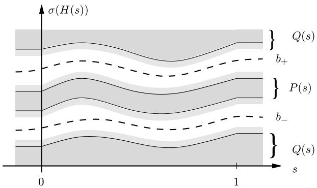

# Bounds for the adiabatic approximation with applications to quantum computation

Sabine Jansen∗ and Ruedi Seiler† Institut f¨ur Mathematik, MA 7-2, TU Berlin, Straße des 17. Juni 136, D-10623 Berlin, Germany

Mary-Beth Ruskai‡ Department of Mathematics, Tufts University, Medford, MA 02155, USA Dedicated to Barry Simon on the occasion of his 60th birthday

We present straightforward proofs of estimates used in the adiabatic approximation. The gap dependence is analyzed explicitly. We apply the result to interpolating Hamiltonians of interest in quantum computing.

# I. INTRODUCTION

The quantum adiabatic approximation has a long history, going back to Born and Fock [1] early in the development of quantum theory. Recently, the realization that the adiabatic approximation could be used as the basis for a method of quantum computation [2] has generated a resurgence of interest in this topic.

Despite the existence of an extensive literature [3, 4, 5, 6, 7] on rigorous proofs of estimates needed to justify the adiabatic approximation, doubts have been raised about its validity [8] leading to confusion about the precise conditions needed to use it [9, 10, 11]. In part, this is because some papers emphasize different aspects, such as the asymptotic expansion, the replacement of the requirement of a nondegenerate ground state by a spectral projection separated from the rest of the spectrum, dependence of first order estimates on the spectral gap, and even extensions to systems without a gap [12]. Moreover, the qualitative gap conditions frequently presented in elementary texts [13, 14] are known to be insufficient.

In this paper, we present a straightforward, yet rigorous, proof of the asymptotic estimates in a form which makes explicit the relevance of the gap. The proof given here is based on the one in Ref. 3 with the modifications introduced in Refs. 15 and 16. The main idea is to consider the physical time evolution as a perturbation of the adiabatic time evolution. This leads naturally to an integration by parts formula which is the main technical tool.

Roughly speaking, the adiabatic approximation says that when a Hamiltonian changes slowly in time, the corresponding time evolution approximately preserves spectral subspaces. In particular an eigenstate $\psi ( 0 )$ evolves with high probability to the eigenstate $\psi ( t )$ of the instantaneous Hamiltonian $H ( t )$ if the energy curve $E ( t )$ does not come too close to any other energy level of $H ( t )$ . To make this precise, one considers the family of Hamiltonians $H ( t / \tau )$ , where $t$ should be thought of as the “external” clock time and the parameter $\tau$ defines a time scale which allows tuning of the speed of change of the Hamiltonian. It gives rise to a scaled time $s = t / \tau$ . Using this notation time evolution is defined in terms of the family of time dependent Schr¨odinger equations

$$
i \partial _ { t } \phi _ { \tau } ( t ) = H ( t / \tau ) \phi _ { \tau } ( t )
$$

  
Figure 1: Energy band bordered by gaps. Shaded areas correspond to spectrum of $H ( s )$ . The projection $P ( s )$ is associated with $\sigma ( H ( s ) ) \cap [ b _ { - } ( s ) , b _ { + } ( s ) ]$ , and $Q ( s ) = 1 - P ( s )$ .

or equivalently

$$
i \partial _ { s } \psi _ { \tau } ( s ) = \tau H ( s ) \psi _ { \tau } ( s ) .
$$

In the most common scenario, the adiabatic theorem is an asymptotic expansion in $1 / \tau$ for the error involved in estimating the time-evolved ground state of $H ( 0 )$ by the ground state of $H ( s )$ .

Remark: Allowed time dependence. The adiabatic theorems give results when the time dependence of the Hamiltonian in the unscaled time $t$ is of the form $H ( t / \tau )$ for some $\tau$ -independent family of operators $H ( \cdot )$ .

It is important to understand that this excludes Hamiltonians with several independent time scales. In particular, the example by Marzlin and Sanders [8] which involves a Hamiltonian $H ( t / \tau , \omega _ { 0 } t )$ with fixed frequency $\omega _ { 0 }$ and big time scale $\tau$ does not belong to this class. To see this, notice that in terms of the dimensionless time $s = t / \tau$ , the Hamiltonian is $H ( s , \omega _ { 0 } \tau s )$ which is $\tau$ -dependent unless $\omega _ { 0 } \tau$ is taken to be constant.

In adiabatic quantum computation [2, 17], the Hamiltonians of interest are usually interpolating Hamiltonians of the form

$$
H ( s ) = [ 1 - f ( s ) ] H _ { 0 } + f ( s ) H _ { 1 } .
$$

Generalizations of the form

$$
H ( s ) = [ 1 - f ( s ) ] H _ { 0 } + f ( s ) H _ { 1 } + k ( s ) H _ { 2 }
$$

with $k ( 0 ) = k ( 1 ) = 0$ have also been considered [18]. In most applications of the adiabatic theorem to quantum computation, there is another parameter, $n$ , which describes the size of the system, and one is interested in the behavior of a family of quantum systems when $n$ is large. In particular, one is often interested how certain quantities, such as the running time of a computer program, grow (or decrease) with $n$ . This brings a new element into the discussion of the adiabatic approximation and requires a careful analysis of the error bound in terms of the gap of a family of quantum systems. We present such estimates in Theorems 3 and 4 of this paper.

The essential assumption in the adiabatic theorem as it is presented here is that the spectrum $\sigma ( H ( s ) )$ has a band associated with the spectral projection $P ( s )$ , which is separated by a gap $g ( s )$ from the rest.

This setting leads to an adiabatic approximation where the error terms are ${ \cal O } ( 1 / \tau ^ { q } )$ for some $q \geq 1$ . There is a weaker form of the adiabatic theorem, where one does not require a spectral gap due to

Avron and Elgart [12] and Bornemann [19]. In this case the estimate on the error term is $o ( 1 )$ as $\tau$ goes to infinity.

There are several different viewpoints for a discussion of the quantum adiabatic theorem. Each one offers interesting insight. We shall only mention them briefly, since the main objective of this note is to give a short and concise proof of the adiabatic theorem in a setting which seems natural.

Berry [20] pointed out that time evolution of a quantum system in the adiabatic limit becomes geometric. Simon [21] noted that Berry’s discovery can be interpreted as a parallel transport in a vector bundle with Berry’s phase as the corresponding holonomy. Kato [5] used the adiabatic time evolution as a powerful tool in his perturbation theory of linear operators. Born and Oppenheimer [22] used the adiabatic approximation in order to separate fast and slow motion in molecules thereby explaining the qualitative picture of their spectra. Niu and Thouless [23] and Avron and Seiler [3] showed that conductance in quantum Hall systems is defined in the adiabatic limit and is a topological number.

# II. STATEMENT OF RESULTS

In the following, we will use the following notational conventions: The letter $P$ denotes an orthogonal projection and at the same time its range. $[ A , B ]$ is the commutator $A B - B A$ of the operators $A$ and $B$ . The adjoint of $A$ is denoted as $A ^ { \dagger }$ . Furthermore, we shall use regularly the following well known facts.

• Let $\Gamma$ be a positively oriented loop in the complex plane circling the spectrum associated with an orthogonal eigenprojection $P$ of a self-adjoint operator $H$ . Then $P = - ( 2 \pi i ) ^ { - 1 } \oint _ { \Gamma } ( H -$ $z ) ^ { - 1 } d z$ .

• Let $P ( s )$ be a smooth family of orthogonal projections and $Q ( s ) = 1 - P ( s )$ the projection on the orthogonal complement. Differentiating the relation $P ^ { 2 } ( s ) = P ( s )$ gives

$$
\dot { P } ( s ) = P ( s ) \dot { P } ( s ) Q ( s ) + Q ( s ) \dot { P } ( s ) P ( s ) .
$$

An operator of this type is called “off-diagonal.”

A summary of notation is given at the end of the paper (Table I).

Let $I \subset \mathbb { R }$ be an interval with $0 \in { \mathfrak { I } }$ and $H ( s ) , s \in I$ , a family of Hamiltonians. We are interested in the time-dependent Schr¨odinger equations (1), where $\tau > 0$ defines a time scale. A change of variables converts the family of equations (1) to the equivalent family (2). We will denote the unitary time evolution associated with Eq. (2) by $U _ { \tau } ( s )$ .

Throughout the article, $H$ is assumed to fulfill the following conditions.

(i) $H ( s )$ , $s \in { I }$ , are self-adjoint operators on a Hilbert space $\mathcal { H }$ , with an $s$ -independent domain $D$ .   
(ii) $H ( s )$ is a $k \geq 2$ times continuously differentiable map from $I$ to the space $B ( D , { \mathcal { H } } )$ of bounded linear operators from $D$ to $\mathcal { H }$ equipped with the graph norm of $H ( 0 )$ .   
(iii) $H ( s )$ has gaps in the spectrum, and $P ( s )$ is the spectral projection on a band bordered by gaps, i.e., there are two real-valued, continuous functions $b _ { + }$ and $b _ { - }$ , and a number $g > 0$ such that

$$
\mathrm { d i s t } \Big ( \{ b _ { + } ( s ) , ~ b _ { - } ( s ) \} , \sigma \big ( H ( s ) \big ) \Big ) > g \quad ( s \in I ) ,
$$

and $P ( s )$ is associated with the nonempty band $\sigma ( H ( s ) ) \cap [ b _ { - } ( s ) , b _ { + } ( s ) ]$ , $s \in { I }$ .

Conditions (i) and (ii) imply that the resolvent $s \mapsto ( H ( s ) - z ) ^ { - 1 }$ as a map from $I$ to $B ( \mathcal { H } )$ is $k$ times continuously differentiable and ensure the existence and uniqueness of the propagator $U _ { \tau } ( s )$ if $k \geq 1$ (see, e.g., Ref. 24): $U _ { \tau } ( s )$ is unitary, strongly continuous in $s$ , maps $D$ onto $D$ , $U _ { \tau } ( 0 ) = \mathrm { i d } _ { \mathcal { H } }$ , and for each $\psi \in D$ , $\psi _ { \tau } ( s ) : = U _ { \tau } ( s ) \psi \in C ^ { 1 } ( I , \mathcal { H } )$ and satisfies Eq. (2). Condition (iii) is illustrated by Fig. 1.

The first two adiabatic theorems give an estimate of the probability of finding a state $\psi$ initially in $P ( 0 )$ outside $P ( s )$ at time $s$ and compare $P _ { \tau } ( s ) : = U _ { \tau } ( s ) P ( 0 ) U _ { \tau } ( s ) ^ { \dagger }$ to $P ( s )$ for large time scales $\tau$ . $P _ { \tau } ( s )$ is the time-evolved projection, whereas $P ( s )$ is the instantaneous spectral projection associated with the band of the spectrum of interest.

Let us remark that although bounds on the transition probability follow directly from bounds on $\vert \vert P _ { \tau } ( s ) - P ( s ) \vert \vert$ , as can be seen from relations (8) and (9) below, they are of sufficient importance that we state them separately in the theorems that follow.

Theorem 1 (First adiabatic theorem). Assuming that the general conditions on $H$ stated above are fulfilled, the following holds. For $\psi \in P ( 0 )$ the transition probability is of order $O ( 1 / \tau ^ { 2 } )$ , i.e.,

$$
\left( U _ { \tau } ( s ) \psi , [ 1 - P ( s ) ] U _ { \tau } ( s ) \psi \right) = O \left( 1 / \tau ^ { 2 } \right)
$$

and

$$
| | P _ { \tau } ( s ) - P ( s ) | | = O ( 1 / \tau ) .
$$

Both estimates hold uniformly on compact subsets of $I$ .

Theorem 2 (Second adiabatic theorem / switching theorem). If in addition to the general conditions we assume that $\dot { H }$ is compactly supported in an interval $\textstyle | 0 , 1 | \subset I$ , the above estimates can be improved to

$$
\begin{array} { c } { { \left( U _ { \tau } ( s ) \psi , \left[ 1 - P ( s ) \right] U _ { \tau } ( s ) \psi \right) = { \cal O } ( 1 / \tau ^ { 2 ( k - 1 ) } ) , } } \\ { { | | P _ { \tau } ( s ) - P ( s ) | | = { \cal O } ( 1 / \tau ^ { k - 1 } ) , } } \end{array}
$$

uniformly in $I \backslash \lvert 0 , 1 \rvert$ .

Remarks concerning Theorem $\boldsymbol { \mathcal { Z } }$ : If $\dot { H }$ is compactly supported in an interval $] \alpha , \omega [ \subset I$ , the previous estimates change into the following: For $\psi \in P ( \alpha )$ ,

$$
\begin{array} { l } { { \displaystyle \left( U _ { \tau } ( s ; \alpha ) \psi , [ 1 - P ( s ) ] U _ { \tau } ( s ; \alpha ) \psi \right) = O ( 1 / \tau ^ { 2 ( k - 1 ) } ) , } } \\ { { \displaystyle | | U _ { \tau } ( s ; \alpha ) P _ { \tau } ( s ) U _ { \tau } ( s ; \alpha ) ^ { \dagger } - P ( s ) | | = O ( 1 / \tau ^ { k - 1 } ) , } } \end{array}
$$

uniformly in $I \backslash \left| \alpha , \omega \right[$ [. The unitary $U _ { \tau } ( s ; \alpha )$ denotes the propagator of the Schr¨odinger equation for the inital value $\alpha$ .

For even more regular Hamiltonians, different methods of proof can be used to show that the transition amplitude in Theorem 2 becomes exponentially small in $\tau$ . For example, when the family of Hamiltonians $H ( s )$ is in a Gevrey class, one can apply methods of phase space tunneling [25], or use Nenciu’s technique [26], exponentially small bounds are also given in Refs. 4 and 7.

Theorem 3. Suppose that the spectrum of $H ( s )$ restricted to $P ( s )$ consists of $m ( s )$ eigenvalues (each possibly degenerate, crossing permitted) separated by a gap $g ( s )$ from the rest of the spectrum of $H ( s )$ , and $H$ , $\dot { H }$ , and $\ddot { H }$ are bounded operators. (This assumption is always fulfilled in finitedimensional spaces.) Then for $\psi \in P ( 0 )$ and any $s \in { I }$ ,

$$
\left| \left( U _ { \tau } ( s ) \psi , \ : [ 1 - P ( s ) ] U _ { \tau } ( s ) \psi \right) \right| \leq A ( s ) ^ { 2 } , \quad \left| | P _ { \tau } ( s ) - P ( s ) | \right| \leq A ( s ) ,
$$

where

$$
\begin{array} { r l r } {  { A ( s ) = \frac { 1 } { \tau } \frac { \sqrt { m } | | \dot { \cal P } | | } { g } \Big | _ { \mathrm { u . b . } } + \frac { 1 } { \tau } \int _ { 0 } ^ { s } ( \sqrt { m } \frac { | | Q \ddot { \cal P } \cal P | | + | | \dot { \cal P } | | ^ { 2 } } { g } + 2 m \frac { | | \dot { \cal H } | | | | \dot { \cal P } | | } { g ^ { 2 } } ) } } \\ & { } & { \leq \frac { 1 } { \tau } \frac { m | | \dot { \cal H } | | } { g ^ { 2 } } \Big | _ { \mathrm { u . b . } } + \frac { 1 } { \tau } \int _ { 0 } ^ { s } ( \frac { m | | \dot { \cal H } | | } { g ^ { 2 } } + 7 m \sqrt { m } \frac { | | \dot { \cal H } | | ^ { 2 } } { g ^ { 3 } } ) , } \end{array}
$$

and $f | _ { \mathrm { u . b } }$ . is a shorthand for $f ( 0 ) + f ( s )$ .

Theorem 4. Suppose that the assumptions of Theorem $\it 4$ are satisfied and $H$ is three times differentiable. Let $h ( s ) : = \operatorname* { m a x } ( | | \dot { H } ( s ) | | , | | \ddot { H } ( s ) | | , | | ( d ^ { 3 } / d s ^ { 3 } ) H ( s ) | | )$ . Then there is a constant $C$ (possibly depending on $m$ ) such that Eq. (6) holds with

$$
A ( s ) = \frac { m h } { \tau g ^ { 2 } } \Big | _ { \mathrm { u . b . } } + \frac { C } { \tau ^ { 2 } } \left( \frac { h ^ { 2 } } { g ^ { 4 } } \Big | _ { \mathrm { u . b . } } + \frac { h } { g ^ { 2 } } ( 0 ) \int _ { 0 } ^ { s } \frac { h ^ { 2 } } { g ^ { 3 } } + \int _ { 0 } ^ { s } \frac { h ^ { 2 } } { g ^ { 5 } } + \int _ { 0 } ^ { s } d s ^ { \prime } \frac { h ^ { 2 } } { g ^ { 3 } } ( s ^ { \prime } ) \int _ { 0 } ^ { s ^ { \prime } } d s ^ { \prime \prime } \frac { h ^ { 2 } } { g ^ { 3 } } ( s ^ { \prime \prime } ) \right) .
$$

# III. NOTATION AND IDENTITIES

# A. Adiabatic time evolution and wave operator

The proof of the adiabatic theorems is most easily accomplished with the aid of an idealized time evolution, the adiabatic time evolution introduced in Ref. 3, mapping the spectral subspace $P ( 0 )$ onto $P ( s )$ . This is an adaptation of an idea by Kato to the present situation [5].

From the gap condition (iii) and $( H ( \cdot ) - z ) ^ { - 1 } \in C ^ { k } ( I , B ( \mathcal { H } ) )$ , it follows that $P ( s )$ is in $C ^ { k } ( I , B ( { \mathcal { H } } ) )$ as well. Define the adiabatic Hamiltonian associated with $P$ and the time scale $\tau$ by

$$
H _ { \tau } ^ { A } ( s ) : = H ( s ) + \frac { i } { \tau } [ \dot { P } ( s ) , P ( s ) ] , \quad s \in I .
$$

$H _ { \tau } ^ { A }$ satisfies the conditions (i) and (ii) with differentiability of order $k - 1$ . Existence of the corresponding time evolution $U _ { \tau } ^ { A } ( \cdot )$ is ensured for $k - 1 \geq 1$ .

The adiabatic time evolution generated by $\tau H _ { \tau } ^ { A } ( s )$ is ideal in the following sense.

Lemma 1. $U _ { \tau } ^ { A } ( \cdot )$ satisfies the intertwining property

$$
U _ { \tau } ^ { A } ( s ) P ( 0 ) = P ( s ) U _ { \tau } ^ { A } ( s ) , \quad s \in I .
$$

Sketch of proof. The strategy of the proof is to show that both sides satisfy the same initial value problem $X ( 0 ) = P ( 0 )$ , $\dot { X } ( s ) = - i \tau H _ { \tau } ^ { A } ( s ) X ( s )$ using that $\dot { P }$ is off-diagonal, see identity (5) (see also Ref. 3, p. 38). $|$

In the following, we will omit the $s$ -dependence and use the notation $Q = 1 - P$ , $P _ { 0 }$ , $Q _ { 0 }$ as a shorthand for $Q ( s ) = 1 - P ( s )$ , $P ( 0 )$ and $Q ( 0 )$ .

We prove the theorems by comparing the real time evolution $U _ { \tau } ( s )$ with the idealized time evolution $U _ { \tau } ^ { A } ( s )$ . The wave operator $\Omega _ { \tau } ( s ) : = U _ { \tau } ^ { A } ( s ) ^ { \dagger } U _ { \tau } ( s )$ is a standard tool used in scattering theory to compare dynamics, here, $U _ { \tau }$ and $U _ { \tau } ^ { A }$ . We expect that adiabatic and real time evolutions are close, i.e., $\Omega _ { \tau }$ is close to the identity, for big $\tau$ . The proof of the adiabatic theorems reduces to the estimation of the off-diagonal blocks of the wave operator since for $\psi \in P _ { 0 } , \ | | \psi | | = 1$ ,

$$
( U _ { \tau } \psi , Q U _ { \tau } \psi ) = | | Q U _ { \tau } P _ { 0 } \psi | | ^ { 2 } = | | Q U _ { \tau } ^ { A } \Omega _ { \tau } P _ { 0 } \psi | | ^ { 2 } \leq | | Q _ { 0 } \Omega _ { \tau } P _ { 0 } | | ^ { 2 }
$$

and

$$
| | P _ { \tau } - P | | = | | U _ { \tau } P _ { 0 } { U _ { \tau } } ^ { \dagger } - { U _ { \tau } } ^ { A } P _ { 0 } ( { U _ { \tau } ^ { A } } ) ^ { \dagger } | | = | | \Omega _ { \tau } P _ { 0 } - P _ { 0 } \Omega _ { \tau } | | = | | Q _ { 0 } \Omega _ { \tau } P _ { 0 } - P _ { 0 } \Omega _ { \tau } Q _ { 0 } | | .
$$

By a straightforward calculation $\Omega _ { \tau }$ satisfies the Volterra integral equation

$$
\Omega _ { \tau } ( s ) = 1 - \int _ { 0 } ^ { s } K _ { \tau } ( s ^ { \prime } ) \Omega _ { \tau } ( s ^ { \prime } ) d s ^ { \prime } ,
$$

where the kernel $K _ { \tau }$ is defined by

$$
K _ { \tau } ( s ) : = U _ { \tau } ^ { A } ( s ) ^ { \dagger } [ \dot { P } ( s ) , P ( s ) ] U _ { \tau } ^ { A } ( s ) ,
$$

and the integral here and in the following is the Riemann integral in the strong sense.

# B. Integration by parts lemma

With a map $X$ from $I$ to $B ( \mathcal { H } )$ , we associate another map $X [ \cdot ]$ defined by

$$
X [ s ] : = U _ { \tau } ^ { A } ( s ) ^ { \dagger } X ( s ) U _ { \tau } ^ { A } ( s ) .
$$

With this notation the integral kernel $K _ { \tau }$ of the Volterra equation (10) introduced in the last section is just $[ { \dot { P } } , P ] [ \cdot ]$ and the Volterra equation gives rise to integrals of the form $\textstyle \int X [ t ] Y ( t ) d t$ . Such integrals can be integrated by parts.

In the integral by parts formula (Lemma 3), the twiddle operation plays a crucial role. It can be understood as a partial inverse of the add operation $A \mapsto [ H , A ]$ as follows.

Lemma 2 (Twiddle operation). Let $X$ be a map from $I$ to $B ( \mathcal { H } )$ and $\Gamma ( s )$ a contour in $\mathbb { C }$ such that ${ \cal P } ( s ) = - ( 2 \pi i ) ^ { - 1 } \oint _ { \Gamma ( s ) } [ H ( s ) - z ] ^ { - 1 } d z$ . Define

$$
\tilde { X } ( s ) : = \frac { 1 } { 2 \pi i } \oint _ { \Gamma ( s ) } [ H ( s ) - z ] ^ { - 1 } X ( s ) [ H ( s ) - z ] ^ { - 1 } d z .
$$

Then $P \tilde { X } P = Q \tilde { X } Q = 0$ and on $D$

$$
\begin{array} { c } { { { [ H , \tilde { X } ] = P X - X P } } } \\ { { { } } } \\ { { { P [ H _ { \tau } ^ { A } , \tilde { X } ] Q = P X Q , ~ Q [ H _ { \tau } ^ { A } , \tilde { X } ] P = - Q X P . } } } \end{array}
$$

Proof. We drop the $s$ -dependence. Let $\Gamma ^ { \prime }$ be a contour in $\mathbb { C }$ lying outside the domain delimited by $\Gamma$ and such that $P$ and $\tilde { X }$ can be written as integrals over $\Gamma ^ { \prime }$ instead of $\Gamma$ . Then

$$
\begin{array} { l } { { \displaystyle \tilde { X } Q = - \frac { 1 } { ( 2 \pi i ) ^ { 2 } } \oint _ { \Gamma } ( H - z ) ^ { - 1 } X ( H - z ) ^ { - 1 } \oint _ { \Gamma ^ { \prime } } [ \frac { 1 } { z - z ^ { \prime } } - ( H - z ^ { \prime } ) ^ { - 1 } ] d z ^ { \prime } d z } } \\ { { \displaystyle \qquad = - \frac { 1 } { ( 2 \pi i ) ^ { 2 } } \oint _ { \Gamma } ( H - z ) ^ { - 1 } X ( H - z ) ^ { - 1 } \oint _ { \Gamma ^ { \prime } } \frac { 1 } { z - z ^ { \prime } } ( H - z ) ^ { - 1 } ( H - z ^ { \prime } ) ^ { - 1 } d z ^ { \prime } d z } } \\ { { \displaystyle \qquad = - \frac { 1 } { ( 2 \pi i ) ^ { 2 } } \oint _ { \Gamma ^ { \prime } } \oint _ { \Gamma } \frac { 1 } { z - z ^ { \prime } } ( H - z ) ^ { - 1 } d z X ( H - z ^ { \prime } ) ^ { - 1 } d z ^ { \prime } } } \\ { { \displaystyle \qquad = \frac { 1 } { 2 \pi i } \oint _ { \Gamma ^ { \prime } } P ( H - z ^ { \prime } ) ^ { - 1 } X ( H - z ^ { \prime } ) ^ { - 1 } d z ^ { \prime } = P \tilde { X } . } } \end{array}
$$

This implies $P \tilde { X } P = 0 = Q \tilde { X } Q$ . The commutator $[ H , \dot { X } ]$ can be computed on $D \supset \mathcal { R } ( { \tilde { X } } )$ ,

$$
\begin{array} { l } { { [ H , \tilde { X } ] = \displaystyle \frac { 1 } { 2 \pi i } \oint _ { \Gamma } [ H - z , ( H - z ) ^ { - 1 } X ( H - z ) ^ { - 1 } ] d z } } \\ { { \mathrm { } = \displaystyle \frac { 1 } { 2 \pi i } \oint _ { \Gamma } \{ X ( H - z ) ^ { - 1 } - ( H - z ) ^ { - 1 } X \} d z = - X P + P X . } } \end{array}
$$

The second pair of identities follows with

$$
P [ [ \dot { P } , P ] , \tilde { X } ] Q = ( P [ \dot { P } , P ] P ) \tilde { X } Q - P \tilde { X } ( Q [ \dot { P } , P ] Q ) = 0 ,
$$

and similarly $Q [ [ \dot { P } , P ] , \tilde { X } ] P = 0$ .

Lemma 3 (Partial integration). Let $X \in C ^ { 1 } ( I , B ( \mathcal { H } ) )$ , ${ Y } \in \thinspace { C ^ { 0 } ( I , B ( \mathcal { H } ) ) }$ . Then $\tilde { X }$ defined as above is in $C ^ { 1 } ( I , B ( { \mathcal { H } } ) )$ and for $s \in { I }$ ,

$$
\begin{array} { r l r } {  { \int _ { 0 } ^ { s } P _ { 0 } X [ s ^ { \prime } ] Q _ { 0 } Y ( s ^ { \prime } ) d s ^ { \prime } = - \frac { i } { \tau } \bigg ( P _ { 0 } \tilde { X } [ s ^ { \prime } ] Q _ { 0 } Y ( s ^ { \prime } ) \bigg | _ { 0 } ^ { s } - \int _ { 0 } ^ { s } P _ { 0 } \dot { \tilde { X } } [ s ^ { \prime } ] Q _ { 0 } Y ( s ^ { \prime } ) d s ^ { \prime } } } \\ & { } & { \mathrm - \int _ { 0 } ^ { s } P _ { 0 } \tilde { X } [ s ^ { \prime } ] Q _ { 0 } \dot { Y } ( s ^ { \prime } ) d s ^ { \prime } \bigg ) . } \end{array}
$$

A similar equality holds with $P _ { 0 }$ and $Q _ { 0 }$ interchanged and an overall change of sign on the righthand side.

Remark. The notation $X [ s ]$ is a shorthand for adjoining $\left( U _ { \tau } ^ { A } \right) ^ { \dagger }$ and $U _ { \tau } ^ { A }$ after taking into account other symbols on $X$ , e.g. $\dot { \tilde { X } } [ s ] = U _ { \tau } ^ { A } ( s ) ^ { \dagger } \dot { \tilde { X } } ( s ) U _ { \tau } ^ { A } ( s )$ .

Proof. It suffices to notice that ${ \tilde { X } } [ \cdot ]$ is strongly differentiable and

$$
\begin{array} { l } { { { \displaystyle \frac { d } { d s } P _ { 0 } \tilde { X } [ s ] Q _ { 0 } = P _ { 0 } ( i \tau [ H _ { \tau } ^ { A } , \tilde { X } ] [ s ] + \dot { \tilde { X } } [ s ] ) Q _ { 0 } = ( i \tau P [ H _ { \tau } ^ { A } , \tilde { X } ] Q ) [ s ] + P _ { 0 } \dot { \tilde { X } } [ s ] Q _ { 0 } } } } \\ { { { } } } \\ { { { } = P _ { 0 } ( i \tau X [ s ] + \dot { \tilde { X } } [ s ] ) Q _ { 0 } , } } \end{array}
$$

where the intertwining property has been used in the form

$$
( P Z Q ) [ s ] = P [ s ] Z [ s ] Q [ s ] = P _ { 0 } Z [ s ] Q _ { 0 }
$$

for $Z : \ I \to B ( { \mathcal { H } } )$ .

# IV. PROOF OF THEOREM 1 AND THEOREM 2

Using the intertwining property, we see that the integral kernel of the Volterra equation (10) can be written as

$$
K _ { \tau } ( s ) = ( \dot { P } P - P \dot { P } ) [ s ] = ( Q \dot { P } P - P \dot { P } Q ) [ s ] = Q _ { 0 } \dot { P } [ s ] P _ { 0 } - P _ { 0 } \dot { P } [ s ] Q _ { 0 } .
$$

As a consequence, the Volterra equation (10) written for $Q _ { 0 } \Omega _ { \tau } P _ { 0 }$ becomes

$$
Q _ { 0 } \Omega _ { \tau } ( s ) P _ { 0 } = - \int _ { 0 } ^ { s } Q _ { 0 } \dot { P } [ s ^ { \prime } ] P _ { 0 } \Omega _ { \tau } ( s ^ { \prime } ) P _ { 0 } d s ^ { \prime } .
$$

We can apply Lemma 3 and integrate by parts

$$
\begin{array} { l } { { \displaystyle Q _ { 0 } \Omega _ { \tau } ( s ) P _ { 0 } = - \frac { i } { \tau } \Big ( Q _ { 0 } \tilde { \bar { P } } [ s ^ { \prime } ] P _ { 0 } \Omega _ { \tau } ( s ^ { \prime } ) P _ { 0 } \big | _ { 0 } ^ { s } - \int _ { 0 } ^ { s } Q _ { 0 } \dot { \bar { P } } [ s ^ { \prime } ] P _ { 0 } \Omega _ { \tau } ( s ^ { \prime } ) P _ { 0 } d s ^ { \prime } } } \\ { { \displaystyle ~ - \int _ { 0 } ^ { s } Q _ { 0 } \tilde { \bar { P } } [ s ^ { \prime } ] P _ { 0 } \dot { P } [ s ^ { \prime } ] Q _ { 0 } \Omega _ { \tau } ( s ^ { \prime } ) P _ { 0 } d s ^ { \prime } \Big ) . } } \end{array}
$$

Therefore $| | Q _ { 0 } \Omega _ { \tau } P _ { 0 } | | = O ( 1 / \tau )$ . The same method gives the bound $| | P _ { 0 } \Omega _ { \tau } Q _ { 0 } | | = O ( 1 / \tau )$ , so that Theorem 1 follows with Eqs. (8) and (9).

Now, suppose that $\dot { H }$ is compactly supported in $| 0 , 1 |$ . The Volterra equation (10) shows $\Omega _ { \tau } ( s ) = 1$ for $s \leq 0$ and $\Omega _ { \tau } ( s ) = \Omega _ { \tau } ( 1 )$ for $s \geq 1$ ; hence, it is enough to prove the statement for $s = 1$ . In Eq. (11), for $s \geq 1$ , the boundary terms vanish. The basic idea to prove Theorem 2 is to estimate the two remaining integrals by iterating the integration by parts. However, doing so naively for the second integral with $X ( s ) = { \tilde { \dot { P } } } ( s )$ and $Y ( s ) = P [ s ] Q _ { 0 } \Omega _ { \tau } ( s ) P _ { 0 }$ leads to derivatives of $P [ s ] = U _ { \tau } ^ { A } ( s ) ^ { \dagger } P ( s ) U _ { \tau } ^ { A } ( s )$ and thus to powers of $\tau$ . This can be avoided by inserting the expression for $Q _ { 0 } \Omega _ { \tau } P _ { 0 }$ recursively into the second integral. As a price to pay, we have to consider multiple integrals.

Lemma 4. Let $0 \leq m \leq k$ . Then for all $j \in \mathbb N$ and $X _ { 1 } , . . . , X _ { j } \in C _ { 0 } ^ { m } \big ( \vert 0 , 1 \vert , B ( \mathcal { H } ) \big )$ the integral

$$
A _ { j } ( X _ { 1 } , . . . , X _ { j } ) = Q _ { 0 } \int _ { 0 } ^ { 1 } d s _ { 1 } X _ { 1 } [ s _ { 1 } ] Q _ { 0 } . . . . Q _ { 0 } \int _ { 0 } ^ { s _ { j - 1 } } d s _ { j } X _ { j } [ s _ { j } ] P _ { 0 } \Omega _ { \tau } ( s _ { j } ) P _ { 0 }
$$

is of order $O ( 1 / \tau ^ { m } )$ .

Remark. In this notation, $Q _ { 0 } \Omega _ { \tau } ( 1 ) P _ { 0 } = - A _ { 1 } ( \dot { P } )$ .

Proof. By induction over $m$ . The statement for $m \ = \ 0$ is obvious since all $A _ { j }$ are bounded as functions of $\tau$ . For the induction step $m \le k - 1 \to m + 1$ assume that $X _ { 1 } , . . , X _ { j }$ are in $C _ { 0 } ^ { m + 1 } ( ] 0 , 1 [ , B ( \mathcal { H } ) )$ . Suppose first that $j \geq 2$ . We integrate by parts with respect to the variable $s _ { j }$ and use the vanishing of boundary terms,

$$
\begin{array} { r l } & { \int _ { 0 } ^ { s _ { j - 1 } } Q _ { 0 } X _ { j } [ s _ { j } ] P _ { 0 } \Omega _ { \tau } ( s _ { j } ) P _ { 0 } d s _ { j } } \\ & { \quad = \cfrac { i } { \tau } \left( Q _ { 0 } \tilde { X } _ { j } [ s _ { j - 1 } ] P _ { 0 } \Omega _ { \tau } ( s _ { j - 1 } ) P _ { 0 } - \int _ { 0 } ^ { s _ { j - 1 } } Q _ { 0 } \dot { \tilde { X } } _ { j } [ s _ { j } ] P _ { 0 } \Omega _ { \tau } ( s _ { j } ) P _ { 0 } d s _ { j } \right. } \\ & { \qquad \left. - \int _ { 0 } ^ { s _ { j - 1 } } Q _ { 0 } \hat { X } _ { j } [ s _ { j } ] P _ { 0 } \hat { P } [ s _ { j } ] Q _ { 0 } \Omega _ { \tau } ( s _ { j } ) P _ { 0 } d s _ { j } \right) } \\ & { \quad = \cfrac { i } { \tau } \left( Q _ { 0 } \tilde { X } _ { j } [ s _ { j - 1 } ] P _ { 0 } \Omega _ { \tau } ( s _ { j - 1 } ) P _ { 0 } - \int _ { 0 } ^ { s _ { j - 1 } } Q _ { 0 } \dot { \tilde { X } } _ { j } [ s _ { j } ] P _ { 0 } \Omega _ { \tau } ( s _ { j } ) P _ { 0 } d s _ { j } \right. } \\ & { \qquad \left. + \int _ { 0 } ^ { s _ { j - 1 } } d s _ { j } Q _ { 0 } ( \tilde { X } _ { j } P \hat { P } ) [ s _ { j } ] Q _ { 0 } \int _ { 0 } ^ { s _ { j } } d s _ { j + 1 } \dot { P } [ s _ { j + 1 } ] P _ { 0 } \Omega _ { \tau } ( s _ { j + 1 } ) P _ { 0 } \right) . } \end{array}
$$

Inserting this into the definition of $A _ { j }$ , we get

$$
\begin{array} { l } { { A _ { j } ( X _ { 1 } , . . . , X _ { j } ) = \displaystyle \frac { i } { \tau } \biggl ( A _ { j - 1 } ( X _ { 1 } , . . . , X _ { j - 2 } , X _ { j - 1 } Q \tilde { X } _ { j } ) - A _ { j } ( X _ { 1 } , . . . , X _ { j - 1 } , \dot { \tilde { X } } _ { j } ) } } \\ { { { } } } \\ { { { } - A _ { j + 1 } ( X _ { 1 } , . . . , X _ { j - 1 } , \tilde { X } _ { j } P \dot { P } , \dot { P } ) \biggr ) . } } \end{array}
$$

This remains valid for $j = 1$ if we set $A _ { 0 } : = 0$ . The new variables $X _ { j - 1 } Q { { \tilde { X } } _ { j } }$ , $\dot { \tilde { X _ { j } } }$ , ${ \tilde { X } } _ { j } P { \dot { P } }$ , and $\dot { P }$ are in $C _ { 0 } ^ { m } \big ( \mathrm { l } 0 , 1 [ , B ( \mathcal { H } ) \big )$ (here we use $m \leq k - 1$ ). Hence,

$$
A _ { j } ( X _ { 1 } , . . , X _ { j } ) = \frac { i } { \tau } O \left( \frac { 1 } { \tau ^ { m } } \right) = O \left( \frac { 1 } { \tau ^ { m + 1 } } \right) .
$$

Proof of Theorem 2. Suppose that $\dot { H }$ is compactly supported in $| 0 , 1 [$ [. Then $\dot { P }$ belongs to $C _ { 0 } ^ { k - 1 } ( \left] 0 , 1 \right[ , B ( \mathcal { H } ) )$ . Lemma 4 implies $Q _ { 0 } \Omega _ { \tau } ( 1 ) P _ { 0 } = - A _ { 1 } ( \dot { P } ) = O ( 1 / \tau ^ { k - 1 } )$ . The lemma still holds with $Q$ and $P$ interchanged so $P _ { 0 } \Omega _ { \tau } ( 1 ) Q _ { 0 } = O ( 1 / \tau ^ { k - 1 } )$ . Together with Eqs. (8) and (9), this concludes the proof. 

# V. DEPENDENCE ON THE GAP

Up to now, we have examined the dependence of the error terms on the time scale $\tau$ only. In order to give error bounds with explicit gap dependence, we need to know how $P$ decorated with dots and tildes behaves. The aim of the following series of lemmas is to generalize the bounds given in Ref. 27, pp. 8–9, to the case where $P$ projects on more than one eigenvalue. These allow to prove Theorems 3 and 4. The reader interested in projections $P ( s )$ associated with a single (possibly degenerate) eigenvalue can find a simpler proof of the inequalities stated in Lemma 8, up to a constant factor, in Ref. 27.

We will assume throughout this section that all operators are bounded and that $P H P$ has discrete spectrum. This is always fulfilled in finite-dimensional spaces. We write

$$
P ( s ) = \sum _ { j = 1 } ^ { m ( s ) } P _ { j } ( s ) , \qquad H ( s ) P _ { j } ( s ) = \lambda _ { j } ( s ) P _ { j } ( s ) ,
$$

where $P _ { j } ( s )$ are the projections associated with the $m ( s )$ eigenvalues $\lambda _ { 1 } ( s )$ , ... , $\lambda _ { m ( s ) } ( s )$ . Note that each eigenvalue might be degenerate and the eigenvalues are allowed to cross. Furthermore, let

$$
g ( s ) : = \mathrm { d i s t } \Big ( \{ \lambda _ { 1 } ( s ) , . . . , \lambda _ { m ( s ) } \} , \ \sigma \big ( H ( s ) \big ) \backslash \{ \lambda _ { 1 } ( s ) , . . . , \lambda _ { m ( s ) } ( s ) \} \Big )
$$

denote the gap in $s$ . In the following, we will drop the $s$ dependence and use the notation

$$
R _ { z } = [ H ( s ) - z ] ^ { - 1 } , \qquad \hat { R } _ { z } = Q \{ [ H ( s ) - z ] \uparrow _ { Q } \} ^ { - 1 } Q .
$$

Note that the reduced resolvent $\hat { R } _ { z }$ is well defined even if $z$ is one of the eigenvalues $\lambda _ { j }$ and $| | \hat { R } _ { \lambda _ { j } } | | \leq 1 / g$ .

Lemma 5. Let $X , A , B$ be bounded operators. Then

$$
\begin{array} { c } { { \displaystyle \tilde { X } = - \sum _ { j = 1 } ^ { m } ( P _ { j } X \hat { R } _ { \lambda _ { j } } + \hat { R } _ { \lambda _ { j } } X P _ { j } ) , } } \\ { { \displaystyle \frac { 1 } { 2 \pi i } \oint _ { \Gamma } R _ { z } A R _ { z } B R _ { z } d z = ( P - Q ) ( \tilde { A } \tilde { B } + \widetilde { A } \tilde { B } - \widetilde { A } B ) . } } \end{array}
$$

Proof. By Lemma 2, $[ H , X ] = [ P , X ]$ . This implies

$$
P _ { j } [ H , X ] Q = \lambda _ { j } P _ { j } X Q - P _ { j } X Q H Q = P _ { j } X Q .
$$

Hence,

$$
P X Q = \sum _ { j } P _ { j } X Q = - \sum _ { j } P _ { j } X \hat { R } _ { \lambda _ { j } } .
$$

Similarly, $\begin{array} { r } { Q X P { } = - \sum _ { j } \hat { R } _ { \lambda _ { j } } X P _ { j } } \end{array}$ . Since by Lemma 2 $\ddot { X }$ is off-diagonal, Eq. (12) follows. Now, let

$$
G ( A , B ) : = \frac { 1 } { 2 \pi i } \oint _ { \Gamma } R _ { z } A R _ { z } B R _ { z } d z .
$$

Then

$$
[ H , G ( A , B ) ] = \frac { 1 } { 2 \pi i } \oint _ { \Gamma } [ H - z , R _ { z } A R _ { z } B R _ { z } ] d z = A \tilde { B } - \tilde { A } B .
$$

An argument similar to the reasoning above fixes the off-diagonal part of $G ( A , B )$ ,

$$
{ \cal P } { \cal G } ( A , B ) { \cal Q } = { \cal P } ( \widetilde { A B } - \widetilde { A B } ) { \cal Q } , \qquad { \cal Q } { \cal G } ( A , B ) { \cal P } = - { \cal Q } ( \widetilde { A B } - \widetilde { A B } ) { \cal P } .
$$

The diagonal blocks of $G ( A , B )$ can be computed, using that $z \mapsto \hat { R } _ { z }$ is holomorphic in the domain enclosed by $\Gamma$ and has $\hat { R } _ { z } ^ { 2 }$ as its derivative with respect to $z$ ,

$$
\begin{array} { l } { { Q G ( A , B ) Q = \displaystyle \sum _ { j } \frac { 1 } { 2 \pi i } \oint _ { \Gamma } \frac { 1 } { \lambda _ { j } - z } \hat { R } _ { z } A P _ { j } B \hat { R } _ { z } d z + \frac { 1 } { 2 \pi i } \oint _ { \Gamma } \hat { R } _ { z } A \hat { R } _ { z } B \hat { R } _ { z } d z } } \\ { { \ ~ = - \displaystyle \sum _ { j } \hat { R } _ { \lambda _ { j } } A P _ { j } B \hat { R } _ { \lambda _ { j } } + 0 = - Q \tilde { A } \tilde { B } Q . } } \end{array}
$$

Similarly,

$$
\begin{array} { l } { { P G ( A , B ) P = \displaystyle \sum _ { j , k } \frac { 1 } { 2 \pi i } \oint _ { \Gamma } \frac { 1 } { \lambda _ { j } - z } \frac { 1 } { \lambda _ { k } - z } P _ { j } A \hat { R } _ { z } B P _ { k } d z } } \\ { { \displaystyle \quad \quad + \sum _ { j , k , l } \frac { 1 } { 2 \pi i } \oint _ { \Gamma } \frac { 1 } { ( \lambda _ { j } - z ) ( \lambda _ { k } - z ) ( \lambda _ { l } - z ) } d z P _ { j } A P _ { k } B P _ { l } . } } \end{array}
$$

Now,

$$
\frac { 1 } { 2 \pi i } \oint _ { \Gamma } \frac { 1 } { ( \lambda _ { j } - z ) ^ { 2 } } \hat { R } _ { z } = R _ { \lambda _ { j } } ^ { 2 } .
$$

For $j \neq k$ ,

$$
\frac { 1 } { 2 \pi i } \oint _ { \Gamma } \frac { 1 } { ( \lambda _ { j } - z ) ( \lambda _ { k } - z ) } R _ { z } = \frac { 1 } { \lambda _ { j } - \lambda _ { k } } ( \hat { R } _ { \lambda _ { j } } - \hat { R } _ { \lambda _ { k } } ) = \hat { R } _ { \lambda _ { j } } \hat { R } _ { \lambda _ { k } } ,
$$

and $\oint _ { \Gamma } [ ( \lambda _ { j } - z ) ( \lambda _ { k } - z ) ( \lambda _ { l } - z ) ] ^ { - 1 } d z = 0$ for any $j , k , l \in \{ 1 , . . . , m ( s ) \}$ , so that

$$
P G ( A , B ) P = \sum _ { j , k } P _ { j } A \hat { R } _ { \lambda _ { j } } \hat { R } _ { \lambda _ { k } } B P _ { k } = P \tilde { A } \tilde { B } P .
$$

Putting together Eqs. (14)–(16) and making use of the off-diagonal character of any “twiddled” operator $\tilde { A }$ , $\tilde { B }$ , etc., gives Eq. (13).

Lemma 6. We have ${ \dot { P } } = { \tilde { \dot { H } } }$ . Let $X$ be a continuously differentiable map from $I$ to $B ( \mathcal { H } )$ . Then

$$
\dot { \tilde { X } } = \tilde { \dot { X } } + ( Q - P ) ( \dot { P } \tilde { X } + \tilde { X } \dot { P } + \widetilde { [ \dot { H } , \tilde { X } ] } - \widetilde { [ \dot { P } , X ] } ) .
$$

In particular,

$$
Q \dot { \tilde { P } } P = Q ( \tilde { \dot { P } } + \widetilde { \dot { H } \tilde { P } } - \widetilde { \dot { P } \dot { H } } ) P .
$$

Proof. First notice

$$
\dot { P } = - \frac { d } { d s } \frac { 1 } { 2 \pi i } \oint _ { \Gamma } R _ { z } d z = \frac { 1 } { 2 \pi i } \oint R _ { z } \dot { H } R _ { z } d z = \tilde { \dot { H } } .
$$

Identity (17) then follows with

$$
\dot { \tilde { X } } = \frac { d } { d s } \frac { 1 } { 2 \pi i } \oint _ { \Gamma } R _ { z } X R _ { z } d z = \frac { 1 } { 2 \pi i } \oint _ { \Gamma } ( R _ { z } \dot { X } R _ { z } - R _ { z } \dot { H } R _ { z } X R _ { z } - R _ { z } X R _ { z } \dot { H } R _ { z } ) d z
$$

and Lemma 5. Since ${ \dot { P } } { \ddot { X } }$ and $\tilde { X } \dot { P }$ are diagonal operators and $[ \dot { P } , \dot { P } ] = 0$ , Eq. (18) follows from Eq. (17) applied to $X = { \dot { P } }$ .

Lemma 7. Let $X : [ 0 , 1 ] \to B ( { \mathcal { H } } )$ . Then

$$
\lvert \lvert \tilde { X } ( s ) \rvert \rvert \leq \sqrt { m ( s ) } \frac { \lvert \lvert X ( s ) \rvert \rvert } { g ( s ) } .
$$

Proof. Let $\phi \in { \mathcal { H } }$ .

$$
\begin{array} { r l } & { | | \tilde { X } \phi | | = | | ( P \tilde { X } Q + Q \tilde { X } P ) \phi | | ^ { 2 } = | | P \tilde { X } Q \phi | | ^ { 2 } + | | Q \tilde { X } P \phi | | ^ { 2 } } \\ & { \qquad \leq \operatorname* { m a x } ( | | P \tilde { X } Q | | ^ { 2 } , | | Q \tilde { X } P | | ^ { 2 } ) | | \phi | | ^ { 2 } . } \end{array}
$$

Moreover,

$$
Q { \tilde { X } } P = - \sum _ { j = 1 } ^ { m } { \hat { R } } _ { \lambda _ { j } } X P _ { j } = \left( P { \tilde { X ^ { \dagger } } } Q \right) ^ { \dagger }
$$

and for bounded operators $| | A | | = | | A ^ { \dagger } | |$ , hence it is enough to prove

$$
| | P X Q | | \leq { \sqrt { m } } { \frac { | | X | | } { g } } .
$$

But this follows from $| | P X Q | | = | | ( P X Q ) ^ { \dagger } ( P X Q ) | | ^ { 1 / 2 }$ and

$$
\begin{array} { l } { { | | P X Q | | ^ { 2 } = | \displaystyle | ( P X Q ) ^ { \dagger } ( P X Q ) | | = | | \sum _ { j = 1 } ^ { m } \hat { R } _ { \lambda _ { j } } X ^ { \dagger } P _ { j } X \hat { R } _ { \lambda _ { j } } | | } } \\ { { \le m \displaystyle \frac { 1 } { g ^ { 2 } } | | X | | | X ^ { \dagger } | | = m \displaystyle \frac { | | X | | ^ { 2 } } { g ^ { 2 } } . } } \end{array}
$$

Lemma 8. The following series of bounds holds:

$$
\begin{array} { r l } & { | | \dot { P } | | \le \sqrt { m } \frac { | | \dot { H } | | } { g } } \\ & { | | \dot { \tilde { P } } | | \le \sqrt { m } \frac { | | \dot { P } | | } { g } \le m \frac { | | \dot { H } | | } { g ^ { 2 } } } \\ & { | | Q \ddot { P } P | | \le \sqrt { m } \frac { | | \dot { H } | | } { g } + \frac { 4 m | | \dot { H } | | ^ { 2 } } { g ^ { 2 } } } \\ & { | | Q \dot { \tilde { P } } P | | \le \sqrt { m } \frac { | | Q \ddot { P } P | | } { g } + \frac { 2 m | | \dot { H } | | | | \dot { P } | | } { g ^ { 2 } } \le \frac { m | | \dot { H } | | } { g ^ { 2 } } + 6 \frac { m \sqrt { m } | | \dot { H } | | ^ { 2 } } { g ^ { 3 } } . } \end{array}
$$

More generally, let $\Gamma X : = { \tilde { X } }$ , $D X : = { \dot { X } }$ , then if $H$ is $( l + 1 )$ -times differentiable and $h ( s ) : =$ $\begin{array} { r } { \operatorname* { m a x } _ { 1 \leq j \leq l + 1 } | | ( \frac { d } { d s } ) ^ { j } H ( s ) | | } \end{array}$ , there exists a constant $C _ { l }$ , possibly depending on the number $_ { I I }$ of eigenvalues, such that

$$
\left| | ( D \Gamma ) ^ { l } D P | \right| \leq \frac { C _ { l } } { g ^ { l } } \operatorname * { s u p } _ { \substack { k , \alpha _ { 1 } , \ldots \alpha _ { l } \geq 1 ; } \atop \alpha _ { 1 } + \ldots + \alpha _ { k } = l + 1 } \prod _ { 1 \leq j \leq k } \frac { 1 } { g } | | \frac { d ^ { \alpha _ { j } } H } { d s ^ { \alpha _ { j } } } | | \leq \frac { C _ { l } } { g ^ { l } } ( \frac { h } { g } ) ^ { l + 1 } ,
$$

i.e., every tilde pulls out a $1 / g$ and every dot an $h / g$ .

The proof of the series of bounds is straightforward with Lemma 6 and Eq. (7). The estimate (20) is shown with an induction over $\it { \Delta } l$ .

Theorem 3 now is a simple consequence of Eq. (11) and Lemma 7. If $H$ is three times differentiable, iterating the integration by parts gives the expansion

$$
\begin{array} { l } { { Q _ { 0 } \Omega _ { \tau } ( s ) P _ { 0 } } } \\ { { \displaystyle = \frac { i } { \tau } Q _ { 0 } \tilde { \bar { P } } [ s ^ { \prime } ] \Omega _ { \tau } ( s ^ { \prime } ) P _ { 0 } | _ { 0 } ^ { s } + \frac { 1 } { \tau ^ { 2 } } Q _ { 0 } \tilde { \bar { P } } [ s ^ { \prime } ] \Omega _ { \tau } ( s ^ { \prime } ) P _ { 0 } | _ { 0 } ^ { s } } } \\ { { \displaystyle ~ - \frac { 1 } { \tau ^ { 2 } } \int _ { 0 } ^ { s } Q _ { 0 } ( \tilde { \bar { P } } \dot { P } ) [ s ^ { \prime } ] d s ^ { \prime } ) \tilde { \bar { P } } [ 0 ] P _ { 0 } - \frac { 1 } { \tau ^ { 2 } } \int _ { 0 } ^ { s } Q _ { 0 } ( \dot { \bar { P } } P + \tilde { \bar { P } } \dot { P } - \tilde { \bar { P } } \dot { P } \tilde { \bar { P } } ) [ s ^ { \prime } ] \Omega _ { \tau } ( s ^ { \prime } ) P _ { 0 } d s ^ { \prime } } } \\ { { \displaystyle ~ + \frac { 1 } { \tau ^ { 2 } } \int _ { 0 } ^ { s } Q _ { 0 } ( \tilde { \bar { P } } \dot { P } ) [ s ^ { \prime } ] \int _ { 0 } ^ { s ^ { \prime } } ( \dot { \tilde { P } } P + \tilde { \bar { P } } \dot { P } ) [ s ^ { \prime \prime } ] \Omega _ { \tau } ( s ^ { \prime \prime } ) P _ { 0 } d s ^ { \prime \prime } d s ^ { \prime } } . } \end{array}
$$

Theorem 4 follows from this expansion and Lemma 8.

Comment on the traditional “adiabatic criterion.” How big must $\tau$ be in order to ensure that the error $| | Q _ { 0 } \Omega _ { \tau } P _ { 0 } | |$ remains smaller than some constant $\epsilon < 1 ^ { \cdot }$ ? A frequently given answer [14] is

$$
\tau \geq \mathrm { c o n s t } \operatorname* { s u p } _ { 0 \leq s \leq 1 } \frac { | | \dot { H } ( s ) | | } { g ( s ) ^ { 2 } } .
$$

This criterion comes from the first order term in the expansion (21) which we rewrite as

$$
| | Q _ { 0 } \Omega _ { \tau } ( s ) P _ { 0 } | | \leq \frac { 1 } { \tau } \biggl ( \frac { m | | \dot { H } | | } { g ^ { 2 } } ( 0 ) + \frac { m | | \dot { H } | | } { g ^ { 2 } } ( s ) \biggr ) + \frac { C ( H ) } { \tau ^ { 2 } } .
$$

However, $C ( H )$ in the second order term may depend on the gap. For a fixed Hamiltonian, one can always justify neglecting higher order times by taking $\tau$ sufficiently large. However, in applications to quantum computation one is often interested in a family of Hamiltonians in which the gap may change. Indeed, in the situations considered in Theorems 3 and 4, the second order coefficient $C ( H )$ can be $O ( 1 / g ^ { 6 } )$ . In such a case, this term is unbounded for vanishing $g$ unless $\tau = { \cal O } ( 1 / g ^ { 3 } )$ .

There have been attempts toward a rigorous criterion based on an estimate of the form

$$
\vert \vert Q _ { 0 } \Omega _ { \tau } ( s ) P _ { 0 } \vert \vert \leq C \bigl ( \frac { h } { \tau g ^ { 2 } } \Bigl \vert _ { \mathrm { u . b . } } + \operatorname* { s u p } _ { 0 \leq s ^ { \prime } \leq s } \frac { 1 } { \tau ^ { k } } \frac { h ^ { k + 1 } } { g ^ { 2 k + 1 } } \bigr )
$$

for $( k + 1 )$ -times differentiable Hamiltonians (Ref. 27, p. 2), where $\begin{array} { r } { h ( s ) = \underset { 0 \leq l \leq k + 1 } { \operatorname* { m a x } } | | \frac { d ^ { l } H } { d s ^ { l } } ( s ) | | } \end{array}$ . This bound suggests that the transition amplitude can be kept small by choosing $\tau$ of the order of $g ^ { 2 + 1 / k }$ . For large $k$ , this is very close to the traditional choice $\tau \sim g ^ { 2 }$ and much better than the scaling $\tau \sim g ^ { 3 }$ obtained from Theorem 4.

The methods presented here do not allow to prove the bound (22) when $k \geq 2$ (compare to Theorem 4). Trying to prove it by iterating the integration by parts fails; as we saw in Sec. IV, a direct iteration of the integration by parts generates powers of $\tau$ (see p. 8). This was overlooked in Ref. 3 and later on corrected in Refs. 15 and 16. However, it seems that a bound of type (22) can be proved using Nenciu’s expansion, as sketched in Ref. 28.

# VI. APPLICATION TO INTERPOLATING HAMILTONIANS

In adiabatic quantum computation, the Hamiltonians of interest are interpolations between an initial Hamiltonian $H _ { 0 }$ with an easily computable ground state and a final Hamiltonian $H _ { 1 }$ whose ground state encodes the solution to some problem. The running time of an “adiabatic algorithm” is closely related to the time $\tau$ required to ensure a good agreement between real and adiabatic time evolutions and depends crucially on the minimal gap $g _ { \mathrm { m i n } }$ .

At first glance, Theorem 3 does not imply the general wisdom that $\tau$ should be of order $1 / g _ { \mathrm { m i n } } ^ { 2 }$ : $1 / g _ { \mathrm { m i n } } ^ { 3 }$ stimate the integrals by the maximum of the integrand, we get a worst c. A closer look at the following example however shows that it is not a g dependence in idea to bound $g ( s )$ extract the $1 / g _ { \mathrm { m i n } } ^ { 2 }$ behavior from Theorem 3. Moreover, as suggested in Refs. 29, 30, it is possible to improve the error dependence on the minimal gap by adapting the interpolation between $H _ { 0 }$ and $H _ { 1 }$ .

Example: (See also Ref. 29) Let $| 0 \rangle , | 1 \rangle$ denote an orthonormal basis of $\mathbb { C } ^ { 2 }$ . For $w \in \{ 0 , 1 \} ^ { n }$ , let $| w \rangle = | w _ { 1 } \rangle \otimes \dots \otimes | w _ { n } \rangle$ , $\mathcal { H } : = ( \mathbb { C } ^ { 2 } ) ^ { \otimes n }$ ,

$$
H _ { 0 } : = 1 - | \hat { 0 } \rangle \langle \hat { 0 } | , \quad H _ { 1 } : = 1 - | u \rangle \langle u | ,
$$

where $\begin{array} { r } { | \hat { 0 } \rangle \ = \ 2 ^ { - n / 2 } \sum _ { w \in \{ 0 , 1 \} ^ { n } } | w \rangle } \end{array}$ and $u \in \{ 0 , 1 \} ^ { n }$ . The element $u$ is regarded as an unknown element to be searched for in a list of length $2 ^ { n }$ . We claim the following.

(1) Let $H ( s ) = ( 1 - s ) H _ { 0 } + s H _ { 1 }$ . Then $g _ { \mathrm { m i n } } = 2 ^ { - n / 2 }$ , and there is a constant $C > 0$ such that $| | Q _ { 0 } \Omega _ { \tau } ( 1 ) P _ { 0 } | | \leq C / ( \tau g _ { \mathrm { m i n } } ^ { 2 } )$ .   
(2) Let $H ( s ) = ( 1 - f ( s ) ) H _ { 0 } + f ( s ) H _ { 1 }$ . It is possible to choose $f : [ 0 , 1 ] \to [ 0 , 1 ]$ onto, monotone strictly increasing, such that $| | Q _ { 0 } \Omega _ { \tau } ( 1 ) P _ { 0 } | | \leq C / ( \tau g _ { \mathrm { m i n } } )$ for some constant $C > 0$ .

Proof. $H ( s ) = ( 1 - s ) H _ { 0 } + s H _ { 1 }$ has a nondegenerate ground state separated from the first excited state by the gap

$$
g ( s ) = { \sqrt { 2 ^ { - n } + 4 ( 1 - 2 ^ { - n } ) ( s - { \frac { 1 } { 2 } } ) ^ { 2 } } } .
$$

$^ { 1 }$ oundaries . The first $s = 0 , 1$ . We notice that for  ow follows from The $p > 1$ ,  3. $\begin{array} { r } { \int _ { 0 } ^ { 1 } g ^ { - p } ( s ) d s = O ( g _ { \mathrm { m i n } } ^ { 1 - p } ) } \end{array}$ and $| | \dot { H } | | =$ $| | H _ { 1 } - H _ { 0 } | | \leq 2$

Next, $H ( s ) = [ 1 - f ( s ) ] H _ { 0 } + f ( s ) H _ { 1 }$ has gap $g { \big ( } f ( s ) { \big ) }$ with $g$ defined in Eq. (23). Let $f : [ 0 , 1 ] \to [ 0 , 1 ]$ be the solution of

$$
f ( 0 ) = 0 , \quad \dot { f } ( s ) = k g ^ { p } \{ f ( s ) \} , \quad k = \int _ { 0 } ^ { 1 } g ^ { - p } ( u ) d u .
$$

Then $f ( 1 ) = 1$ . If $p > 1$ , $k = { \cal O } ( g _ { \mathrm { m i n } } ^ { 1 - p } )$ . Since

$$
\dot { H } ( s ) = k g ^ { p } \big ( f ( s ) \big ) ( H _ { 1 } - H _ { 0 } ) , \quad \ddot { H } ( s ) = k ^ { 2 } g ^ { 2 p - 1 } \big ( f ( s ) \big ) \dot { g } \big ( f ( s ) \big ) ( H _ { 1 } - H _ { 0 } ) ,
$$

Theorem 3 gives

$$
\begin{array} { r l r } {  { \vert \vert Q _ { 0 } \Omega _ { \tau } ( s ) P _ { 0 } \vert \vert \le \frac { 1 } { \tau } \Big ( 4 k + k ^ { 2 } \int _ { 0 } ^ { 1 } \big [ 2 g ^ { 2 p - 3 } \big ( f ( s ) \big ) \big | \dot { g } \big ( f ( s ) \big ) \big | + 2 8 g ^ { 2 p - 3 } \big ( f ( s ) \big ) \big ] d s \Big ) } } \\ & { } & { \quad \le \frac { k } { \tau } \Big ( 4 + \int _ { 0 } ^ { 1 } \big [ 2 g ^ { p - 3 } ( u ) | \dot { g } ( u ) | + 2 8 g ^ { p - 3 } ( u ) \big ] d u \Big ) } \end{array}
$$

(we used the change of variables $u = f ( s )$ ). For $p < 2$ , $\textstyle \int g ^ { p - 3 } = O ( g _ { \mathrm { m i n } } ^ { p - 2 } )$ . The function $g$ decreasing on $[ 0 , 1 / 2 ]$ and increasing on $[ 1 / 2 , 1 ]$ ; therefore for $p < 2$

$$
\int _ { 0 } ^ { 1 } g ^ { p - 3 } | \dot { g } | = \frac { 2 } { p - 2 } ( 1 - g _ { \mathrm { m i n } } ^ { p - 2 } ) = O ( g _ { \mathrm { m i n } } ^ { p - 2 } ) .
$$

Hence, for $1 < p < 2$ , $| | Q _ { 0 } \Omega _ { \tau } ( 1 ) P _ { 0 } | | = O ( \tau ^ { - 1 } g _ { \mathrm { m i n } } ^ { 1 - p } g _ { \mathrm { m i n } } ^ { p - 2 } ) = O ( ( \tau g _ { \mathrm { m i n } } ) ^ { - 1 } )$ . This concludes the

More generally, the previous considerations concerning the gap dependence will apply provided that the gap function $g ( s )$ has the three following properties:

- The gap at the boundaries $( s = 0 , ~ s = 1$ ) is of order 1.   
- The gap decreases strictly towards its minimal value $g _ { \mathrm { m i n } }$ and then increases strictly.   
- If $p > 1$ , then $\begin{array} { r } { \int _ { 0 } ^ { 1 } g ^ { - p } ( s ) d s = O ( g _ { \mathrm { m i n } } ^ { 1 - p } ) } \end{array}$ .

The first two features are shared by most examples studied so far [27, 31]. The third one needs to be checked more carefully, but it is reasonable to expect that $\int g ^ { - p }$ behaves better than $g _ { \mathrm { m i n } } ^ { - p }$ .

Table I: Summary of notation.   

<table><tr><td>Symbol</td><td>Meaning</td></tr><tr><td>Uτ(s)</td><td>real time evolution</td></tr><tr><td>UA(s)</td><td>adiabatic time evolution</td></tr><tr><td>X [s]</td><td>UA(s)†X(s)UA(s)</td></tr><tr><td>x(s)</td><td>(2πi)−1 $Γ(s)[H(s) − z]−1X[H(s) − z]−1dz</td></tr><tr><td>Ωτ(s)</td><td>UA(s)†Uτ(s) (wave operator)</td></tr><tr><td>Rz</td><td>[H(s) − z]−1 (resolvent)</td></tr><tr><td>Rz</td><td>Q{[H(s) − z] [q}−1Q (reduced resolvent)</td></tr></table>

# Acknowledgments

M.-B. R. was partially supported by the National Security Agency (NSA) and Advanced Research and Development Activity (ARDA) under Army Research Office (ARO) contract number DAAD19- 02-1-0065, and by the National Science Foundation under Grant DMS-0314228. R. S. and S. J. were supported by the Deutsche Forschungsgemeinschaft (DFG).

[1] M. Born and V. Fock, “Beweis des Adiabatensatzes”, Z. Phys. 51, 165 (1928).   
[2] E. Farhi, J. Goldstone, S. Gutmann, and M. Sipser, “Quantum Computation by Adiabatic Evolution”, Report no. MIT-CTP-2936, arXiv:quant-ph/0001106.   
[3] J. E. Avron, R. Seiler, and L. G. Yaffe, “Adiabatic Theorems and Applications to the Quantum Hall Effect”, Commun. Math. Phys. 110, 33 (1987).   
[4] G. A. Hagedorn and A. Joye, “Elementary exponential error estimates for the adiabatic approximation”, J. Math. Anal. Appl. 267, 235 (2002).   
[5] T. Kato, “On the adiabatic theorem of quantum mechanics”, J. Phys. Soc. Japan 5, 435 (1950).   
[6] G. Nenciu, “On the adiabatic theorem of quantum mechanics”, J. Phys. A 13, L15 (1980).   
[7] A. Joye and C. Pfister, “Full asymptotic expansion of transition probabilities in the adiabatic limit”, J. Phys. A 24, 753 (1991).   
[8] K.-P. Marzlin and B. C. Sanders, “Inconsistency in the application of the adiabatic theorem”, Phys. Rev. Lett. 93, 160408 (2004).   
[9] A. Ambainis and O. Regev, “An Elementary Proof of the Quantum Adiabatic Theorem”, arXiv:quantph/0411152.   
[10] D. M. Tong, K. Singh, L. C. Kwek, and C. H. Oh, “Quantitative conditions do not guarantee the validity of the adiabatic approximation”, Phys. Rev. Lett. 95, 110407 (2005).   
[11] R. MacKenzie, E. Marcotte, and H. Paquette, “Perturbative approach to the adiabatic approximation”, Phys. Rev. A 73, 042104 (2006).   
[12] J. E. Avron and A. Elgart, “Adiabatic Theorem without a Gap Condition”, Commun. Math. Phys. 203, 445 (1999).   
[13] L. Landau and L. Lifshitz, Quantum Mechanics, Pergamon Press, 2 edition, 1965.   
[14] A. Messiah, Quantum Mechanics, volume 2, North-Holland Publishing Company, 1962.   
[15] J. E. Avron, R. Seiler, and L. G. Yaffe, “Adiabatic Theorems and Applications to the Quantum Hall Effect: Erratum”, Commun. Math. Phys. 156, 649 (1993).   
[16] M. Klein and R. Seiler, “Power-Law Corrections to the Kubo Formula Vanish in Quantum Hall Systems”, Commun. Math. Phys. 128, 141 (1990).   
[17] E. Farhi, J. Goldstone, S. Gutmann, J. Lapan, A. Lundgren, and D. Preda, “A Quantum Adiabatic Evolution Algorithm Applied to Random Instances of an NP-complete Problem”, Science 292, 472 (2001).   
[18] E. Farhi, J. Goldstone, and S. Gutmann, “Quantum Adiabatic Evolution Algorithms with Different Paths”, Report no. MIT-CTP-3297, arXiv: quant-ph/0208135.   
[19] V. Bornemann, Homogenization in Time of Singular Perturbed Mechanical Systems, volume 1687 of Lecture Notes in Mathematics, Springer Verlag, 1998.   
[20] M. V. Berry, “Quantal phase factors accompanying adiabatic changes”, Proc. R. Soc. Lond. A 392, 45 (1964).   
[21] B. Simon, “Holonomy, the Quantum Adiabatic Theorem, and Berry’s Phase”, Phys. Rev. Lett. 51, 2167 (1983).   
[22] M. Born and R. Oppenheimer, “Zur Quantentheorie der Molekeln”, Ann. Phys. 84, 457 (1927).   
[23] Q. Niu and D. J. Thouless, “Quantised adiabatic charge transport in the presence of substrate disorder and many body interactions”, J. Phys. A 17, 30 (1984).   
[24] M. Reed and B. Simon, Methods of Modern Mathematical Physics, volume 2, Academic, New York, 1975.   
[25] K. Jung, “Adiabatic Theorem for Switching Processes with Gevrey Class Regularity”, Technical University of Berlin Sfb 288 Preprint No. 442 and Dissertation, 1997.   
[26] G. Nenciu, “Linear Adiabatic Theory. Exponential Estimates”, Commun. Math. Phys. 152, 479 (1993).   
[27] B. Reichardt, “The quantum adiabatic optimization algorithm and local minima”, in STOC ’04: Proceedings of the thirty-sixth annual ACM symposium on Theory of computing, ACM, Chicago, 2004.   
[28] A. Elgart, “Deviations from adiabatic approximation”, talk presented at Workshop on Mathematical Aspects of Quantum Adiabatic Approximation, Perimeter Institute, Waterloo, Canada (2006). The talk is available at http://streamer.perimeterinstitute.ca/mediasite/viewer.   
[29] W. van Dam, M. Mosca, and U. Vazirani, “How powerful is adiabatic quantum computation?”, in 42nd IEEE Symposium on Foundations of Computer Science, (IEEE Computer Soc., Los Alamitos, CA, 2001), pages 279–287.   
[30] J. Roland and N. Cerf, “Quantum search by local adiabatic evolution”, Phys. Rev. A 65, 042308 (2002).   
[31] G. Schaller, S. Mostame, and R. Sch¨utzhold, “General error estimate for adiabatic quantum computing”, Phys. Rev. A 73, 062307 (2006).