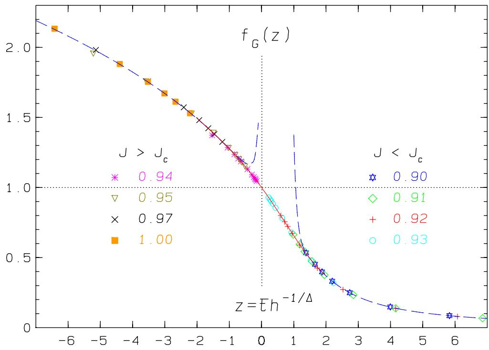
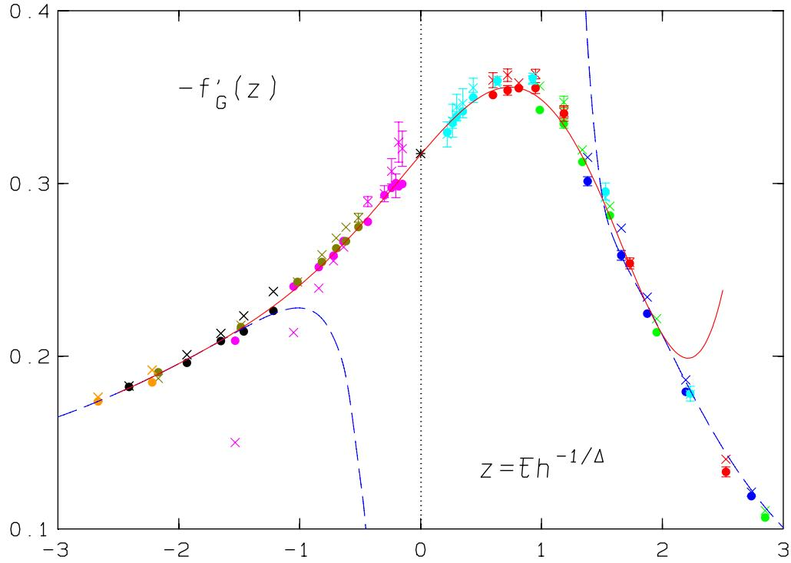
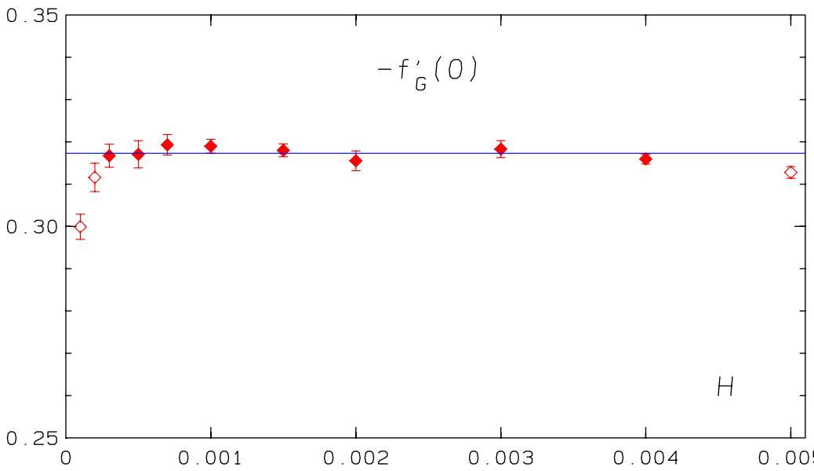
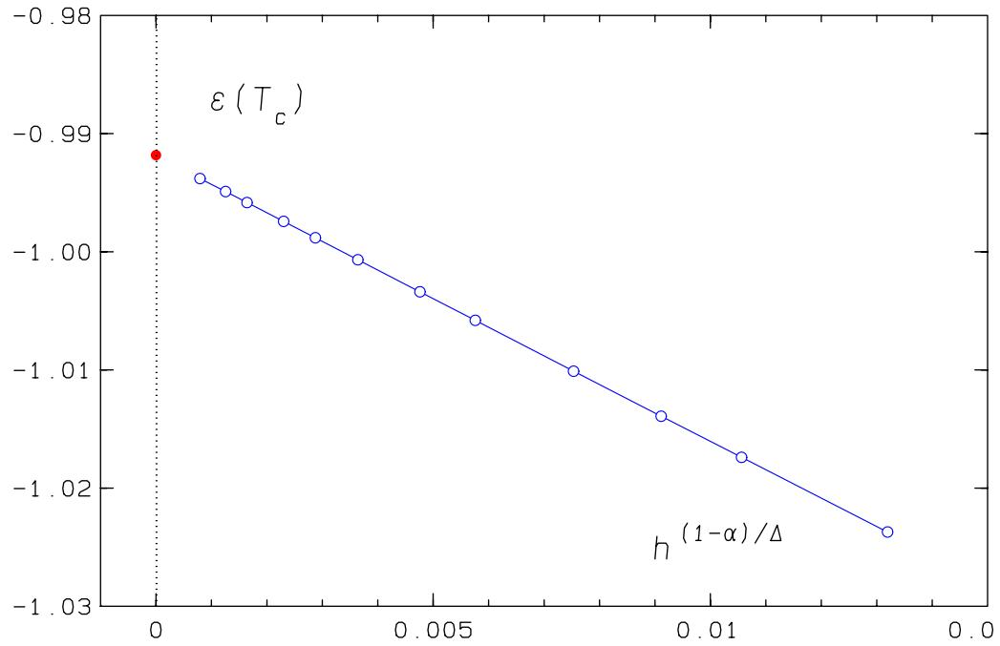
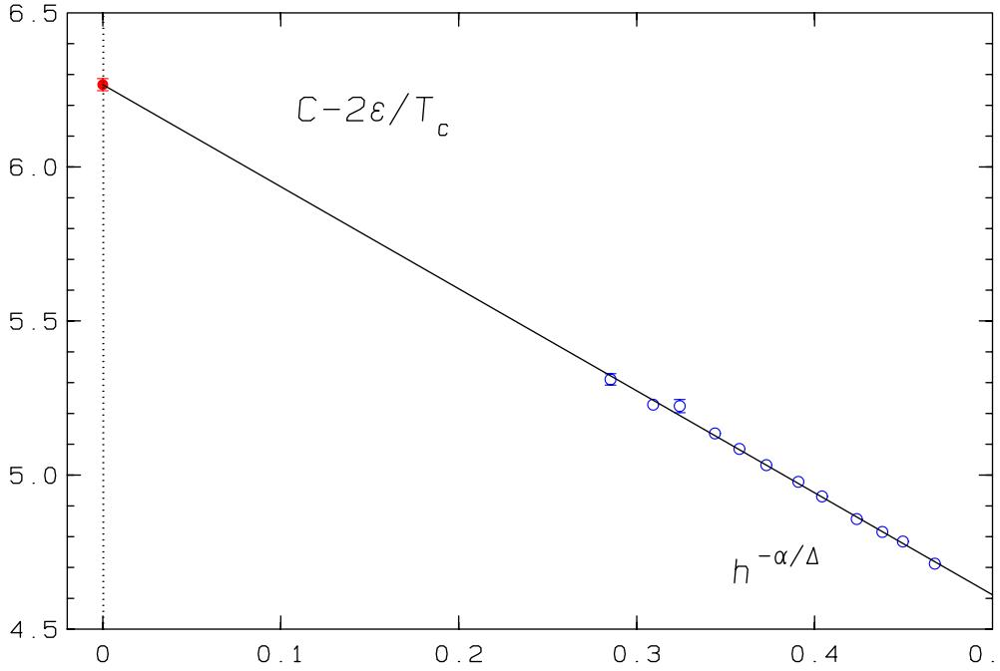
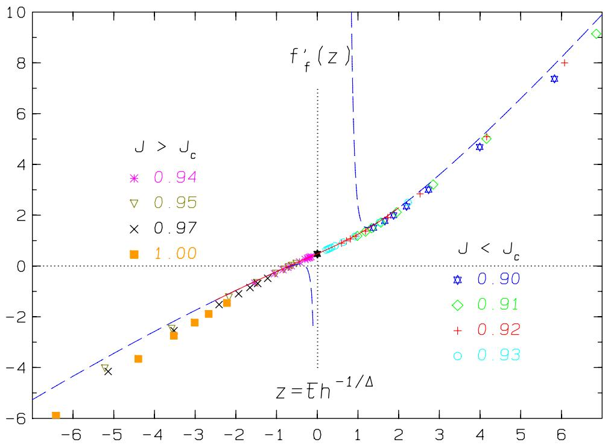
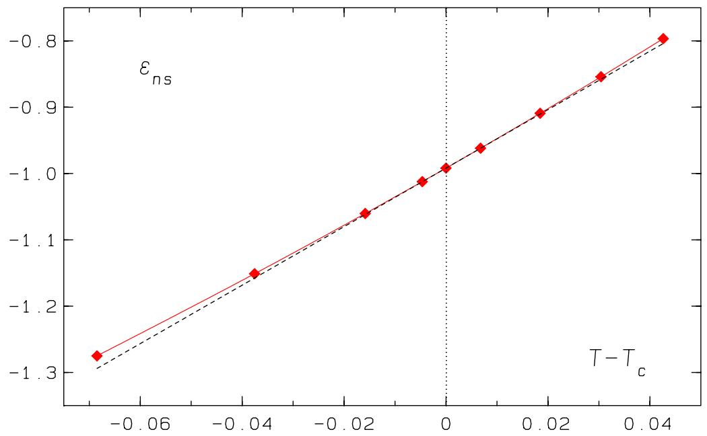
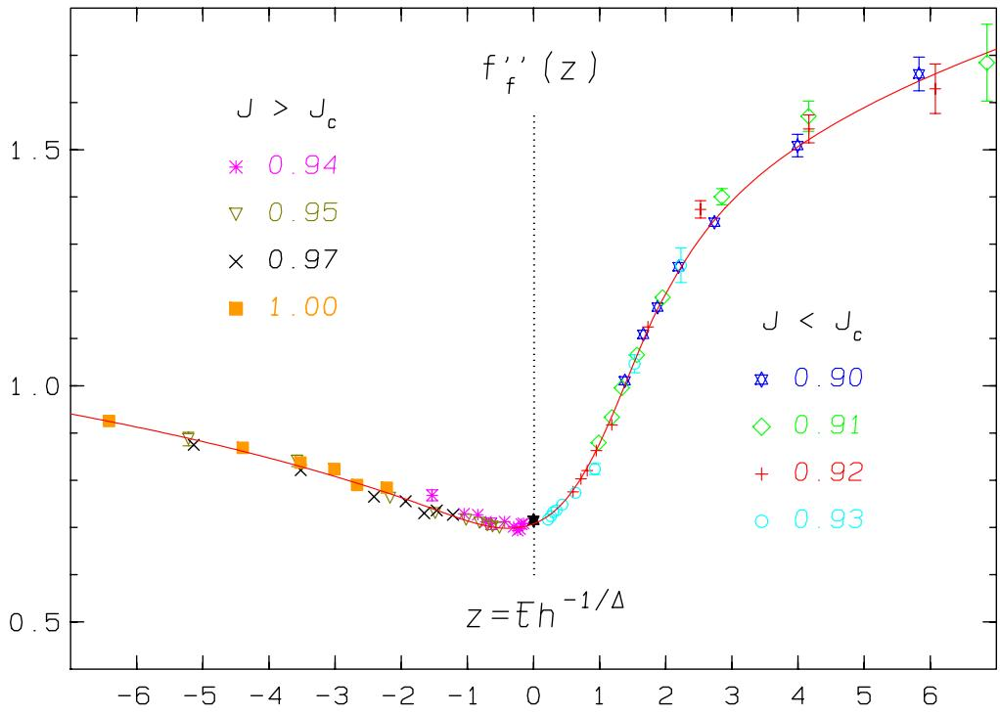
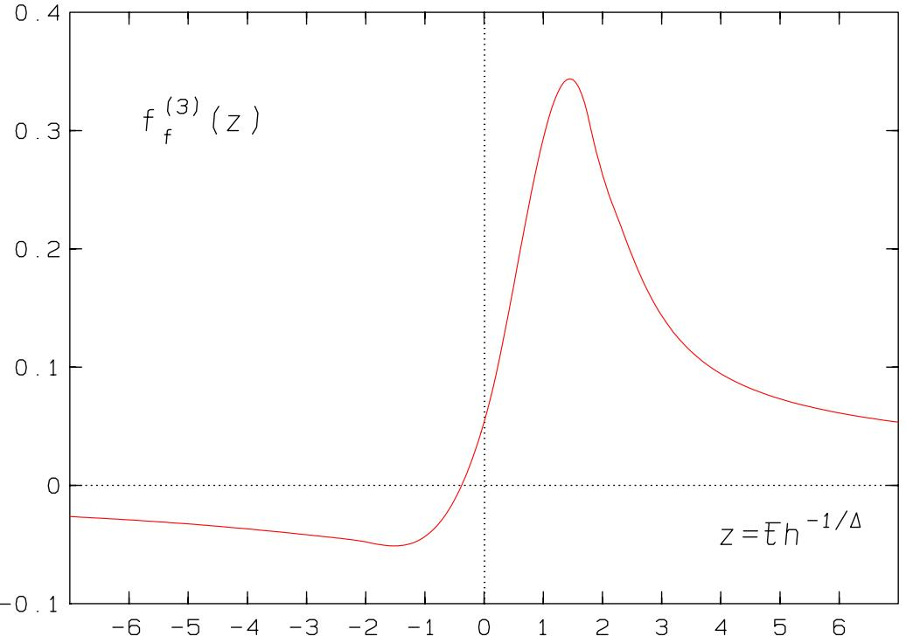

# The scaling functions of the free energy density and its derivatives for the 3d O(4) model

J. Engels $1$ and F. Karsch 1,2

$^ { 1 }$ Fakult¨at f¨ur Physik, Universit¨at Bielefeld, D-33615 Bielefeld, Germany

$2$ Physics Department Brookhaven National Laboratory, Upton, NY 11973

# Abstract

We derive direct representations of the scaling functions of the 3d $O ( 4 )$ model which are relevant for comparisons to other models, in particular QCD. This is done in terms of expansions in the scaling variable $z = \bar { t } / h ^ { 1 / \Delta }$ . The expansions around $z ~ = ~ 0$ and the corresponding asymptotic ones for $z ~  ~ \pm \infty$ overlap such that no interpolation is needed. The expansion coefficients are determined numerically from the data of a previous high statistics simulation of the $O ( 4 )$ model on a threedimensional lattice of linear extension $L = 1 2 0$ . From the scaling function of the magnetization we calculate the leading asymptotic coefficients of the scaling function of the free energy density. As a result we obtain the universal amplitude ratio $A ^ { + } / A ^ { - } = 1 . 8 4 ( 4 )$ for the specific heat. Comparing the scaling function of the energy density to the data we find the non-singular part of the energy density $\epsilon _ { n s } ( T )$ with high precision and at the same time excellent scaling properties.

# 1 Introduction

The aim of the paper is to provide representations of the scaling functions of the three-dimensional $O ( 4 )$ model which can be used in tests of other models on their membership of the corresponding universality class. This is especially of importance for quantum chromodynamics (QCD) with two degenerate light-quark flavours at finite temperature, because it is believed [1]-[6] to belong to the $O ( 4 )$ universality class at its chiral transition in the continuum limit. There exist already many parametrizations [7]-[12] of the magnetic equation of state. They differ essentially in the following aspects:

a) The form of the magnetic equation of state which is initially parametrized. The most used form is the Widom-Griffiths (WG) form [13, 14], where both the scaling function and the scaling variable depend on the magnetization $M$ . A second form has the advantage that the scaling variable is independent of $M$ . It is therefore more appropriate for the comparison to $M .$ -data with errors. The two forms are completely equivalent in describing the critical behaviour of the model and they can be derived from each other. In principle, it is then only necessary to parametrize one form.   
b) The type of parametrization which is used. The parametrization has to describe the correct general scaling laws as deduced from renormalization group (RG) theory, it must satisfy Griffiths’s analyticity conditions [14] and take into account the Goldstone singularities in the low temperature phase.   
c) The input from which the parameters are determined. There are two main sources of information: from field-theory methods, for example $\epsilon$ -expansions, small-field expansions or high temperature series etc. , and secondly, from Monte Carlo (MC) data.

Our paper is inspired by the pioneering work of Toussaint [7]. In his paper the scaling function (of the second kind) for the order parameter was calculated based only on MC data and moreover these data were simulated at finite external field $H$ . The main purpose of the paper was, like ours, to provide the scaling function for the QCD analysis. The parametrization was carried out in a third, unusual form, which has not been used since then, yet the Goldstone effects had still not been taken into account. Like the WG form, this third form has the drawback, that the calculation of the second form of the scaling function and in particular its derivatives with respect to its scaling variable is an indirect one and it is therefore unhandy. Moreover, scaling functions of the second kind determine via the location of their extrema the important pseudocritical lines. In Refs. [8] and [10] the WG form was used and parametrized with a combination of a low and a high temperature ansatz in accord with the requirements of b). The two parts were subsequently connected by an interpolation. The parameters were deduced exclusively from MC data with finite external fields. In Refs. [9, 11] and [12] the WG form was used. All three papers discuss and use variants of the classical parametric representation of the equation of state introduced by Schofield and Josephson [15]-[17] in 1969, which is valid in the whole critical region. Refs. [9] and [11] differ in details of the parametrization and in the input: whereas [9] relies essentially on field theory input and uses the data for testing, Ref. [11] determines its parameters directly from fits to the data. In Ref. [12] the functional RG method is used to calculate the scaling functions. The classical representation had been invented for the WG form, at a time where only few MC data on small lattices were available. Today it is still used for all kind of calculations of universal quantities from field theory. However, as we shall demonstrate, it is not necessary to work with this representation. Instead we parametrize directly the scaling functions of the second kind, which is the preferred choice of the QCD community in their tests on the universality class of the $O ( 4 )$ model. In addition, this allows us not only to make use of the magnetization data in the determination of the parameters, but also of the data for the susceptibilities.

In order to broaden the tests on the universality class we calculate as well the scaling functions connected to the energy density and the specific heat. Here however, the initially unknown regular or non-singular part of the energy density and/or specific heat is contained in the data and has to be subtracted correctly. We show how this can be done in principle, when the critical exponent $\alpha$ is negative. The inadequate estimate of the regular parts in a former test for 2-flavour QCD [18] prevented a successful outcome of the test from the beginning and led to unjustified conclusions. Yet, there is a derivative of the energy density, the thermal susceptibility or covariance between the energy density and the magnetization, which does not require a subtraction of the non-singular term. We shall use also this quantity for our parametrization.

The specific model which we study here is the standard $O ( 4 )$ -invariant nonlinear $\sigma$ -model, which is defined by

$$
\beta \mathcal { H } = - J \sum _ { < \vec { x } , \vec { y } > } \vec { \phi } _ { \vec { x } } \cdot \vec { \phi } _ { \vec { y } } - \vec { H } \cdot \sum _ { \vec { x } } \vec { \phi } _ { \vec { x } } ,
$$

where $\vec { x }$ and $\vec { y }$ are nearest-neighbour sites on a three-dimensional hypercubic lattice, and $\vec { \phi } _ { \vec { x } }$ is a four-component unit vector at site $\vec { x }$ . The coupling $J$ and the external magnetic field $\vec { H }$ are reduced quantities, that is they contain already a factor $\beta = 1 / T$ . In fact, we consider in the following the coupling directly as the inverse temperature, $J \equiv 1 / T$ .

It is useful to decompose the spin vector $\vec { \phi } _ { \vec { x } }$ into longitudinal (parallel to the magnetic field $\vec { H }$ ) and transverse components

$$
\vec { \phi } _ { \vec { x } } = \phi _ { \vec { x } } ^ { \parallel } \vec { e } _ { H } + \vec { \phi } _ { \vec { x } } ^ { \perp } , \quad \mathrm { w i t h } \quad \vec { e } _ { H } = \vec { H } / H ~ ,
$$

where $H$ is the magnitude of the magnetic field. We define the energy of a spin configuration as

$$
E = - \sum _ { < \vec { x } , \vec { y } > } \vec { \phi } _ { \vec { x } } \cdot \vec { \phi } _ { \vec { y } } .
$$

The lattice average $\phi ^ { \parallel }$ of the longitudinal spin components is

$$
\phi ^ { \parallel } = \frac { 1 } { V } \sum _ { \vec { x } } \phi _ { \vec { x } } ^ { \parallel } ,
$$

where $V = L ^ { 3 }$ and $L$ is the number of lattice points per direction. The partition function is then

$$
Z ( T , H ) \ = \ \int \prod _ { \vec { x } } d ^ { 4 } \phi _ { \vec { x } } \delta ( \vec { \phi } _ { \vec { x } } ^ { 2 } - 1 ) \exp ( - \beta E + H V \phi ^ { \| } ) \ .
$$

We introduce the (reduced) free energy density as usual by

$$
f ( T , H ) = - \frac { 1 } { V } \ln Z ,
$$

from which one obtains the order parameter of the system, the magnetization $M$ , as

$$
{ \cal M } = - { \frac { \partial f } { \partial H } } = \langle \phi ^ { \parallel } \rangle .
$$

The longitudinal susceptibility is the second derivative of $- f$ with respect to the field

$$
\chi _ { L } \ = \ \frac { \partial M } { \partial H } \ = \ V ( \langle \phi ^ { \parallel 2 } \rangle - M ^ { 2 } ) ~ .
$$

The energy density is

$$
\epsilon = \frac { \partial f } { \partial \beta } = \frac { \langle E \rangle } { V } ,
$$

and the specific heat

$$
C = \frac { \partial \epsilon } { \partial T } = \frac { \beta ^ { 2 } } { V } ( \langle E ^ { 2 } \rangle - \langle E \rangle ^ { 2 } ) .
$$

Finally we define the thermal susceptibility $\chi _ { t }$ as the mixed second derivative of $f$

$$
\chi _ { t } = \frac { \partial M } { \partial \beta } = \langle E \rangle \langle \phi ^ { \parallel } \rangle - \langle E \phi ^ { \parallel } \rangle .
$$

The rest of the paper is organized as follows. First we discuss the critical behaviour of the observables and the universal scaling functions, which we want to calculate. In Section 3 we describe the expansions with which we parametrize the scaling functions. Some details of the used simulations and the parametrizations resulting from the data are presented in Section 4. Here we also investigate the rˆole of the non-singular terms for the scaling of the data. We close with a summary and the conclusions.

# 2 Critical behaviour and scaling functions

In the thermodynamic limit ( $V  \infty$ ) the above defined observables show power law behaviour close to $T _ { c }$ . It is described by critical amplitudes and exponents of the reduced temperature $t = ( T - T _ { c } ) / T _ { c }$ for $H = 0$ and the magnetic field $H$ for $t = 0$ , respectively. According to RG theory the non-analytic or singular part $f _ { s }$ of the free energy density is responsible for critical behaviour. Besides $f _ { s }$ , the free energy density contains a regular or non-singular part $f _ { n s }$ . Correspondingly, the derivatives of $f _ { n s }$ contribute regular terms to the scaling laws, which apart from the cases of the energy density and the specific heat (for $\alpha < 0$ ) are sub-leading. In the two-dimensional Ising model such an analytic contribution to the magnetic susceptibility was established [19, 20]. In Ref. [7], Toussaint makes a corresponding ansatz $f _ { n s } = c _ { H 2 } H ^ { 2 } + c _ { J 1 } t + c _ { J 2 } t ^ { 2 } + c _ { J 3 } t ^ { 3 }$ , which leads to an additional constant in $\chi _ { L }$ , a term $\sim H$ in $M$ and an $H$ -independent $\epsilon _ { n s } ( T )$ . Since in our former scaling fits to $M$ at $T _ { c }$ , e. g. in Refs. [10] and [21], we never discovered such a regular term we follow Privman et al. [22] and assume the non-singular part $f _ { n s }$ to have no field dependence, that is

$$
f ( T , H ) = f _ { s } ( T , H ) + f _ { n s } ( T ) , \mathrm { a n d }
$$

$$
\epsilon = \epsilon _ { s } + \epsilon _ { n s } ( T ) , C = C _ { s } + C _ { n s } ( T ) .
$$

The regular parts do not disappear at $T = T _ { c }$ . We may expand $\epsilon _ { n s } ( T )$ in $T$ at $T _ { c }$

$$
\epsilon _ { n s } ( T ) = \epsilon _ { n s } ( T _ { c } ) + ( T - T _ { c } ) \cdot C _ { n s } ( T _ { c } ) + \frac { 1 } { 2 } ( T - T _ { c } ) ^ { 2 } \cdot C _ { n s } ^ { \prime } ( T _ { c } ) + \ldots .
$$

The scaling laws at $H = 0$ are then for the magnetization (from now on $\beta$ denotes a critical exponent)

$$
M = B ( - t ) ^ { \beta } \quad \mathrm { f o r } t < 0 ,
$$

the longitudinal susceptibility

$$
\chi _ { L } = C ^ { + } t ^ { - \gamma } \quad \mathrm { f o r } t > 0 \ ,
$$

and the energy density and the specfic heat both for $t < 0$ and $t > 0$

$$
\epsilon = \epsilon _ { n s } ( T ) + \frac { A ^ { \pm } } { \alpha ( 1 - \alpha ) } T _ { c } t | t | ^ { - \alpha } \ ,
$$

$$
C = C _ { n s } ( T ) + \frac { A ^ { \pm } } { \alpha } | t | ^ { - \alpha } .
$$

For the thermal susceptibility we have for $t < 0$

$$
\chi _ { t } ~ = ~ \beta B T _ { c } ( - t ) ^ { \beta - 1 } ~ .
$$

On the critical line $T ' = T _ { c }$ or $t = 0$ we have for $H > 0$ the scaling laws

$$
M = B ^ { c } H ^ { 1 / \delta } \quad \mathrm { o r } \quad H = D _ { c } M ^ { \delta } ,
$$

$$
\chi _ { L } \ = \ C ^ { c } H ^ { 1 / \delta - 1 } \quad \mathrm { w i t h } \quad C ^ { c } \ = \ B ^ { c } / \delta \ .
$$

The remaining observables scale as follows

$$
\epsilon = \epsilon _ { n s } ( T _ { c } ) + E _ { c } H ^ { ( 1 - \alpha ) / \Delta } \ ,
$$

$$
C _ { s } - \frac { 2 \epsilon _ { s } } { T _ { c } } = \frac { A _ { c } } { \alpha _ { c } } H ^ { - \alpha _ { c } } ,
$$

$$
\begin{array} { r } { \chi _ { t } \ = \ { \cal X } _ { c } H ^ { ( \beta - 1 ) / \Delta } \ , } \end{array}
$$

where $\alpha _ { c } = \alpha / \Delta$ and $\Delta = \beta \delta$ is the so-called ”gap exponent”.

Generalizations of these scaling laws to both non-zero $t$ and $H$ -values may be derived from the RG scaling equation for $f _ { s }$

$$
f _ { s } ( u _ { 1 } , u _ { 2 } , u _ { 3 } , . . . ) \ = \ b ^ { - d } f _ { s } ( b ^ { y _ { 1 } } u _ { 1 } , b ^ { y _ { 2 } } u _ { 2 } , b ^ { y _ { 3 } } u _ { 3 } , . . . ) \ .
$$

Here, the $u _ { j }$ with $j = 1 , 2 , . . .$ are the scaling fields, $b$ is a positive scale factor and the $y _ { j }$ are the RG eigenvalues. The class of our model has two relevant scaling fields $u _ { 1 } = u _ { t } , ~ u _ { 2 } = u _ { h }$ with $y _ { t } , y _ { h } > 0$ and infinitely many irrelevant ones with negative $y _ { j }$ . The relevant scaling fields depend analytically on $t$ and $H$ and

$$
u _ { t } \ = \ c _ { t } t + O ( t ^ { 2 } , H ^ { 2 } ) \ , \quad u _ { h } \ = \ c _ { h } H + O ( t H ) \ .
$$

The $c _ { t } , c _ { h }$ are two model-dependent (positive) metric scale factors. Choosing $b =$ $u _ { h } ^ { - 1 / y _ { h } }$ −1/yh for $H > 0$ one obtains from Eq. (25) the second form of scaling functions from

$$
f _ { s } ( u _ { t } , u _ { h } , u _ { j > 2 } ) = u _ { h } ^ { d / y _ { h } } f _ { s } ( u _ { t } u _ { h } ^ { - y _ { t } / y _ { h } } , 1 , u _ { j } u _ { h } ^ { - y _ { j } / y _ { h } } ) \ .
$$

Close to the critical point, for $t , H$ small, $u _ { t } = c _ { t } t , \ u _ { h } = c _ { h } H$ , and the dependence on the irrelevant scaling fields becomes negligible, $f _ { s }$ is a universal scaling function of $u _ { t }$ and $u _ { h }$ and

$$
f _ { s } \ = \ ( c _ { h } H ) ^ { d / y _ { h } } \Psi _ { 2 } \big ( c _ { t } c _ { h } ^ { - y _ { t } / y _ { h } } t H ^ { - y _ { t } / y _ { h } } \big ) \ ,
$$

where $\Psi _ { 2 }$ is again a universal function. By comparison with the scaling laws one obtains

$$
y _ { t } = 1 / \nu , y _ { h } = 1 / \nu _ { c } = \Delta / \nu , \mathrm { o r } \Delta = y _ { h } / y _ { t } ,
$$

and the hyperscaling relations

$$
2 - \alpha = d \nu , \gamma = \beta ( \delta - 1 ) , d \nu = \beta ( 1 + \delta ) .
$$

Instead of working with two metric scale factors one usually introduces new temperature and field variables $t = t T _ { c } / T _ { 0 }$ and $h = H / H _ { 0 }$ which are chosen such that the scaling laws for the magnetization simplify to

$$
M ( t = 0 ) = h ^ { 1 / \delta } \quad \mathrm { a n d } \quad H _ { 0 } = D _ { c } \ ,
$$

$$
M ( h = 0 ) = ( - \bar { t } ) ^ { \beta } \quad \mathrm { a n d } \quad T _ { 0 } = B ^ { - 1 / \beta } T _ { c } .
$$

The magnetic equation of state as derived from Eqs. (7) and (28) becomes then

$$
M = h ^ { 1 / \delta } f _ { G } ( z ) ,
$$

where $f _ { G }$ is a universal scaling function with the argument

$$
z = \bar { t } / h ^ { 1 / \Delta } .
$$

It fulfills the normalization conditions

$$
f _ { G } ( 0 ) = 1 , \quad \mathrm { a n d } \quad f _ { G } ( z ) _ { z  - \infty } ( - z ) ^ { \beta } .
$$

Due to Eq. (7), the corresponding scaling equation of the free energy density must then be

$$
f _ { s } = H _ { 0 } h ^ { 1 + 1 / \delta } f _ { f } ( z ) ,
$$

where $f _ { f } ( z )$ is again a universal scaling function, and

$$
f _ { G } ( z ) = - \left( 1 + \frac { 1 } { \delta } \right) f _ { f } ( z ) + \frac { z } { \Delta } f _ { f } ^ { \prime } ( z ) .
$$

Since the susceptibility $\chi _ { L }$ is the derivative of $M$ with respect to $H$ we obtain from Eq. (33)

$$
\chi _ { L } = \frac { \partial M } { \partial H } = \frac { h ^ { 1 / \delta - 1 } } { H _ { 0 } } f _ { \chi } ( z ) ~ ,
$$

with

$$
f _ { \chi } ( z ) = { \frac { 1 } { \delta } } \left( f _ { G } ( z ) - { \frac { z } { \beta } } f _ { G } ^ { \prime } ( z ) \right) \ .
$$

For $H  0$ at fixed $t > 0$ , that is for $z  \infty$ , the leading asymptotic term of $f _ { \chi }$ is determined by Eq. (16)

$$
f _ { \chi } ( z ) \mathop { = } _ { z \to \infty } C ^ { + } D _ { c } B ^ { \delta - 1 } z ^ { - \gamma } = R _ { \chi } z ^ { - \gamma } ,
$$

where $R _ { \chi }$ is a universal amplitude product. For $z  \infty$ the leading terms of $f _ { G }$ and $f _ { \chi }$ are identical, because for $T > T _ { c }$ and small magnetic field $M \propto H$ . The rest of our observables are related to $f _ { f } ( z )$ and $f _ { G } ( z )$ as follows

$$
\begin{array} { r c l } { { \epsilon _ { s } } } & { { = } } & { { \displaystyle - \frac { T ^ { 2 } } { T _ { 0 } } H _ { 0 } h ^ { ( 1 - \alpha ) / \Delta } f _ { f } ^ { \prime } ( z ) ~ , } } \\ { { } } & { { } } & { { } } \\ { { C _ { s } - \displaystyle \frac { 2 } { T } \epsilon _ { s } } } & { { = } } & { { \displaystyle - \left( \frac { T } { T _ { 0 } } \right) ^ { 2 } H _ { 0 } h ^ { - \alpha / \Delta } f _ { f } ^ { \prime \prime } ( z ) ~ , } } \\ { { } } & { { } } & { { } } \\ { { \chi _ { t } } } & { { = } } & { { \displaystyle - \frac { T ^ { 2 } } { T _ { 0 } } h ^ { ( \beta - 1 ) / \Delta } f _ { G } ^ { \prime } ( z ) ~ . } } \end{array}
$$

# 3 Expansions of the scaling functions

In principle we have to parametrize only one scaling function, either $f _ { f } ( z )$ or $f _ { G } ( z ) ,$ because they are related by the differential equation (37). We choose as usual $f _ { G } ( z )$ , because it is directly calculable from the magnetization data. Our representation of the scaling function is composed of three expansions: one around $z = 0$ and two for $z  \pm \infty$ . In the following we derive relations between the expansion coefficients of $f _ { f } ( z )$ and $f _ { G } ( z ) ~ .$ . We start with the expansions for small $z$

$$
f _ { f } ( z ) \ = \ \sum _ { n = 0 } ^ { \infty } a _ { n } z ^ { n } \ , \quad f _ { G } ( z ) \ = \ \sum _ { n = 0 } ^ { \infty } b _ { n } z ^ { n } \ .
$$

From Eq. (37) we obtain

$$
b _ { n } = \left[ - \left( 1 + \frac { 1 } { \delta } \right) + \frac { n } { \Delta } \right] a _ { n } , \mathrm { o r } a _ { n } = \frac { \Delta b _ { n } } { \alpha + n - 2 } .
$$

The last equation connects the derivatives of the two scaling functions at $z = 0$

$$
f _ { f } ^ { ( n ) } ( 0 ) = \frac { \Delta } { \alpha + n - 2 } \cdot f _ { G } ^ { ( n ) } ( 0 ) ,
$$

and because of the first of the normalization conditions, Eq. (35)

$$
f _ { G } ( 0 ) = b _ { 0 } \equiv 1 ~ , \quad \mathrm { a n d } \quad f _ { f } ( 0 ) = a _ { 0 } = \frac { \Delta } { \alpha - 2 } ~ .
$$

Next we consider the asymptotic expansion in the high temperature region, that is for $z  \infty$ , or for $t > 0$ and $h  0$ . Since $M$ is an odd function of $H$ for $t > 0$ (Griffiths’s condition), we must have

$$
f _ { G } ( z ) = z ^ { - \gamma } \cdot \sum _ { n = 0 } ^ { \infty } d _ { n } ^ { + } z ^ { - 2 n \Delta } ,
$$

The prefactor is the leading term of $f _ { G }$ and $d _ { 0 } ^ { + } = R _ { \chi }$ (see Eq. (40) and the remark after it). The corresponding ansatz for $f _ { f } ( z )$ is

$$
f _ { f } ( z ) \ = \ z ^ { 2 - \alpha } \cdot \sum _ { n = 0 } ^ { \infty } c _ { n } ^ { + } z ^ { - 2 n \Delta } \ ,
$$

Using again Eq. (37) we are led to the relation

$$
c _ { n + 1 } ^ { + } = \frac { - d _ { n } ^ { + } } { 2 ( n + 1 ) } , \quad \mathrm { w i t h } \quad c _ { 1 } ^ { + } = - \frac { R _ { \chi } } { 2 } ,
$$

however, the coefficient $c _ { 0 } ^ { + }$ is not specified by the last equation.

In the low temperature region, for $t < 0$ and $h  0$ , that is for $z  - \infty$ , massless Goldstone modes appear. They lead to a divergence of the transverse susceptibility $\chi _ { T } \sim H ^ { - 1 }$ . In addition also the longitudinal susceptibility $\chi _ { L }$ is diverging on the coexistence curve. Here, the predicted divergence in three dimensions is [23]-[25]

$$
\chi _ { L } ( T < T _ { c } , H ) \sim H ^ { - 1 / 2 } ~ .
$$

This is equivalent to a dependence of the magnetization on $H ^ { 1 / 2 }$ near the coexistence curve [8]. Therefore we make the following ansatz for $f _ { G } ( z )$ in this region

$$
f _ { G } ( z ) = ( - z ) ^ { \beta } \cdot \sum _ { n = 0 } ^ { \infty } d _ { n } ^ { - } ( - z ) ^ { - n \Delta / 2 } ,
$$

where due to the second normalization condition in Eq. (35), $d _ { 0 } ^ { - } = 1$ . The corresponding ansatz for $f _ { f } ( z )$ is

$$
f _ { f } ( z ) \ = \ ( - z ) ^ { 2 - \alpha } \cdot \sum _ { n = 0 } ^ { \infty } c _ { n } ^ { - } ( - z ) ^ { - n \Delta / 2 } \ .
$$

Inserting the two expansions into the differential equation (37) we find

$$
c _ { n + 2 } ^ { - } \ = \ - \frac { 2 d _ { n } ^ { - } } { n + 2 } \ .
$$

As in the high temperature phase the coefficient of the leading term, $c _ { 0 } ^ { - }$ , is not fixed, moreover $c _ { 1 } ^ { - } \equiv 0$ , and $c _ { 2 } ^ { - } = - 1$ . In order to completely solve Eq. (37) for $f _ { f } ( z )$ we still have to find the coefficients $c _ { 0 } ^ { \pm }$ . Since $\alpha < 0$ for the $O ( 4 )$ model we may proceed in the following way. First we consider the small $z$ -expansions for $z > 0$

$$
\begin{array} { r c l } { { \displaystyle \sum _ { n = 3 } ^ { \infty } a _ { n } z ^ { n } } } & { { = } } & { { \Delta \displaystyle \sum _ { n = 3 } ^ { \infty } \frac { b _ { n } z ^ { n } } { \alpha + n - 2 } = \Delta z ^ { 2 - \alpha } \displaystyle \int _ { 0 } ^ { z } d y y ^ { \alpha - 3 } \displaystyle \sum _ { n = 3 } ^ { \infty } b _ { n } y ^ { n } } } \\ { { } } & { { = } } & { { \Delta z ^ { 2 - \alpha } \displaystyle \int _ { 0 } ^ { z } d y y ^ { \alpha - 3 } \left[ f _ { G } ( y ) - 1 - b _ { 1 } y - b _ { 2 } y ^ { 2 } \right] } } \\ { { } } & { { = } } & { { f _ { f } ( z ) - a _ { 0 } - a _ { 1 } z - a _ { 2 } z ^ { 2 } . } } \end{array}
$$

That enables us to calculate $c _ { 0 } ^ { + }$

$$
c _ { 0 } ^ { + } = \operatorname * { l i m } _ { z \to \infty } f _ { f } ( z ) z ^ { \alpha - 2 } = \Delta \int _ { 0 } ^ { \infty } d y y ^ { \alpha - 3 } \left[ f _ { G } ( y ) - 1 - b _ { 1 } y - b _ { 2 } y ^ { 2 } \right] ,
$$

or, by partial integration

$$
c _ { 0 } ^ { + } = \frac { \Delta } { 2 - \alpha } \int _ { 0 } ^ { \infty } d y y ^ { \alpha - 2 } [ f _ { G } ^ { \prime } ( y ) - f _ { G } ^ { \prime } ( 0 ) - y f _ { G } ^ { \prime \prime } ( 0 ) ] .
$$

In the same manner we can calculate $c _ { 0 } ^ { - }$ from an integral over negative $z$ by starting from

$$
f _ { f } ( z ) = a _ { 0 } + a _ { 1 } z + a _ { 2 } z ^ { 2 } + \Delta ( - z ) ^ { 2 - \alpha } \int _ { z } ^ { 0 } d y ( - y ) ^ { \alpha - 3 } \left[ f _ { G } ( y ) - 1 - b _ { 1 } y - b _ { 2 } y ^ { 2 } \right] ,
$$

and taking the limit $z  - \infty$

$$
c _ { 0 } ^ { - } ~ = ~ \operatorname * { l i m } _ { z  - \infty } f _ { f } ( z ) ( - z ) ^ { \alpha - 2 } ~ = ~ \Delta \int _ { - \infty } ^ { 0 } d y ( - y ) ^ { \alpha - 3 } [ f _ { G } ( y ) - 1 - b _ { 1 } y - b _ { 2 } y ^ { 2 } ] ~ ,
$$

or

$$
c _ { 0 } ^ { - } = \frac { - \Delta } { 2 - \alpha } \int _ { - \infty } ^ { 0 } d y ( - y ) ^ { \alpha - 2 } \left[ f _ { G } ^ { \prime } ( y ) - f _ { G } ^ { \prime } ( 0 ) - y f _ { G } ^ { \prime \prime } ( 0 ) \right] .
$$

The function $f _ { f } ( z )$ is universal as a whole and so are each of its expansion coefficients, that is $c _ { 0 } ^ { + }$ and $c _ { 0 } ^ { - }$ are universal. In fact, it can be shown, that these coefficients are the universal products of critical amplitudes

$$
c _ { 0 } ^ { \pm } \ = \ f _ { s } ^ { \pm } ( B ^ { c } ) ^ { \delta } B ^ { - ( 1 + \delta ) } \ ,
$$

where

$$
f _ { s } ^ { \pm } = { \frac { A ^ { \pm } } { - \alpha ( 1 - \alpha ) ( 2 - \alpha ) } } ,
$$

are the critical amplitudes of the free energy density for $H = 0$ and $t \neq 0$

$$
f = f _ { n s } ( T ) + f _ { s } ^ { \pm } | t | ^ { 2 - \alpha } .
$$

Because of Eqs. (63) and (64) we can now calculate the universal ratio

$$
\frac { A ^ { + } } { A ^ { - } } = \frac { c _ { 0 } ^ { + } } { c _ { 0 } ^ { - } } 
$$

from the two integrals in Eqs. (59) and (62). A similar formula is known for the magnetic equation of state in the Widom-Griffiths form [26]. It was for example used to determine the ratio $A ^ { + } / A ^ { - }$ in the case of the $O ( 2 )$ model [27].

# 4 The parametrizations

The data we use in the following to parametrize the scaling functions were all obtained from simulations described in detail in Ref. [21]. We repeat here only the main features of these simulations. They were performed on three-dimensional lattices with periodic boundary conditions and linear extension $L = 1 2 0$ . The coupling constant region which was explored is $0 . 9 0 \leq J \leq 1 . 2$ , the magnetic field was varied from $H = 0 . 0 0 0 1$ to $H = 0 . 0 0 7$ . In general 100000 measurements were done at each fixed $H$ and $J$ . We have reevaluated the raw data to obtain the magnetization, the longitudinal and the thermal susceptibilities, the energy density and the specific heat. Due to the large spatial volume of the lattice, most of the finite size effects have disappeared from the data. This is in particular true for the energy density and the magnetization, to a smaller extent also for the susceptibilities and the specific heat. We shall discuss the remaining effects when the scaling of the respective observables is analyzed. A further source of difficulties is, at larger $| t |$ and $H$ -values, the possible appearance of corrections to scaling because of the influence of irrelevant scaling fields. These violations of scaling should be visible in the scaling plots for the data. However, as we shall show below, we find perfect scaling properties without any sign of these corrections to scaling for our values of $t$ and $H$ for the energy density and the magnetization. This not the case for the corresponding non-linear $O ( 2 )$ model, see e. g. Fig. 5 of Ref. [28], where strong scaling violations were found for $T < T _ { c }$ . An explanation for this striking difference can be inferred from two papers, by Hasenbusch and T¨or¨ok [29] for $N = 2$ and by Hasenbusch [30] for $N = 4$ . In these papers the leading corrections to scaling could be eliminated by using instead of the non-linear $O ( N )$ invariant models the corresponding $O ( N )$ symmetric $\phi ^ { 4 }$ models and the tuning of the additional parameter $\lambda$ . It turned out that the optimal parameter value is 2.1 for $N = 2$ and 12.5(4.0) for $N = 4$ . The non-linear case corresponds to $\lambda = \infty$ . One expects therefore to find significantly weaker corrections for $N = 4$ as compared to $N = 2$ . The remarkable lack of scaling corrections had already been noted in Ref. [8], where for the first time the critical exponents for the $3 d$ $O ( 4 )$ model were determined from magnetization data at finite external fields. Later, in Ref. [10], the result for the exponent $\delta$ could be improved with better data and fits where correction-to-scaling terms had been taken into account. Yet, these terms were contributing at best marginally and could as well be neglected.

In order to define our variables $t , t , h$ and $z$ we use the same critical amplitudes, temperature and exponent values as in Ref. [10] and [21]. These are

$$
J _ { c } = T _ { c } ^ { - 1 } = 0 . 9 3 5 9 0 \ , \quad T _ { 0 } = 1 . 0 9 3 \ , \quad H _ { 0 } = 4 . 8 4 5 \ ,
$$

$$
\beta = 0 . 3 8 0 ~ , ~ \delta = 4 . 8 2 4 ~ , ~ \Delta = 1 . 8 3 3 1 2 ~ ,
$$

and from the hyperscaling relations

$$
\alpha = - 0 . 2 1 3 1 \ , \quad \nu = 0 . 7 3 7 7 \ , \quad \gamma = 1 . 4 5 3 1 \ .
$$

We have compared the exponents from Eqs. (68) and (69) to the field theory results of Guida and Zinn-Justin [31], displayed in their Table 3. Apart from the value for $\delta = 4 . 8 2 4 ( 9 )$ (from [10]) which corresponds to the value $\eta = 0 . 0 3 0 2 ( 1 6 )$ via the hyperscaling relation $\eta = ( 5 - \delta ) / ( 1 + \delta )$ our numbers are always close to the respective central values of Guida and Zinn-Justin and they are always inside their error bars.

We procede in the following way. First we calulate $f _ { G } ( z )$ from the magnetization data and fit the large $z$ parts to the asymptotic expansions. The small $z$ region is more intricate, because the derivative $- f _ { G } ^ { \prime } ( z )$ has a peak for $z > 0$ , which determines the pseudocritical line. In order to model the corresponding variation properly we fit directly the derivative for small $z$ . It can be obtained either from the data for $\chi _ { t }$ , Eq. (43), or from $\chi _ { L }$ and $M$ , using Eqs. (33), (38) and (39). After completion of the parametrization of $f _ { G } ( z )$ we compute the leading asymptotic coefficients $c _ { 0 } ^ { \pm }$ o f $f _ { f } ( z )$ . The scaling function of the free energy density is then also entirely known. In the next step we determine the non-singular contributions to the energy density and the specific heat, first at $T _ { c }$ and then at all our $T$ -values. We show that the results for $\epsilon _ { n s }$ shape a smooth function of $T$ , where $T _ { c }$ is not a distinguished point. With this function $\epsilon _ { n s } ( T )$ it is then possible to compare the scaling functions to the data for the energy density and specific heat.

  
Figure 1: The scaling function $f _ { G } = M h ^ { - 1 / \delta }$ as a function of $z = \bar { t } h ^ { - 1 / \Delta }$ . The dashed lines show the asymptotic expansions, the solid line the Taylor expansion at $z = 0$ . The numbers refer to the different $J = 1 / T$ -values of the data.

In Fig. 1 we show the data obtained from the magnetization for the scaling function $f _ { G } ( z )$ and our parametrizations. Obviously the data scale very well, apart from the data for $H = 0 . 0 0 0 1$ and $z < 0$ , which show some finite size effect (in the figure at $z = - 1 . 5 3 4$ and $- 5 . 2 1 9$ ). We have fitted $f _ { G }$ in the asymptotic regions with the first three terms of the respective expansions from Eqs. (48) and (52). For the positive $z$ -range [1.5, 15] we found the coefficients

$$
d _ { 0 } ^ { + } = 1 . 1 0 5 9 9 \pm 0 . 0 0 5 5 5 , d _ { 1 } ^ { + } = - 1 . 3 1 8 2 9 \pm 0 . 1 0 8 7 , d _ { 2 } ^ { + } = 1 . 5 8 8 4 \pm 0 . 4 6 4 6 .
$$

In the negative $z$ -range $[ - 1 0 , - 1 ]$ we discarded the data with $H \ = \ 0 . 0 0 0 1$ and obtained

$$
d _ { 0 } ^ { - } \equiv 1 ~ , ~ d _ { 1 } ^ { - } = 0 . 2 7 3 6 5 1 \pm 0 . 0 0 2 9 3 3 ~ , ~ d _ { 2 } ^ { - } = 0 . 0 0 3 6 0 5 8 \pm 0 . 0 0 4 8 7 5 ~ .
$$

  
Figure 2: The derivative $- f _ { G } ^ { \prime } ( z )$ as a function of $z = \bar { t } h ^ { - 1 / \Delta }$ . The filled circles denote the data calculated from $\chi _ { t }$ , the crosses the data obtained from $\chi _ { L }$ and $M$ . The dashed lines show the asymptotic expansions, the solid line the Taylor expansion around $z = 0$ .

Since $d _ { 0 } ^ { + } = R _ { \chi }$ we have a new value for this quantity, which is compatible with the old values $R _ { \chi } = 1 . 0 8 4 ( 1 8 )$ from Ref. [10] and $R _ { \chi } = 1 . 1 2 ( 1 1 )$ from Ref. [9] but somewhat more accurate. Astonishingly, the asymptotic expansions describe the function $f _ { G } ( z )$ very well down to rather small $| z |$ -values, and as can be seen in Fig. 1 they overlap with our approximation to the Taylor expansion at $z = 0$ . As mentioned already, we use the derivative $- f _ { G } ^ { \prime } ( z )$ to determine the coefficients of the Taylor expansion. In Fig. 2 we show the data which we obtained from $\chi _ { t }$ (filled circles) and $\chi _ { L }$ and $M$ (crosses) for the derivative. Obviously, the data involving $\chi _ { L }$ suffer from large finite size effects in the whole low temperature region ( $z < 0$ ) for already moderately small $H$ -values. This behaviour is known and a consequence of Eq. (51), the divergence of $\chi _ { L }$ near the coexistence line. In contrast to that, the data from $\chi _ { t }$ show a consistent scaling behaviour for $z ~ < ~ 0$ (apart from the $H = 0 . 0 0 0 1$ point for $J = 0 . 9 4$ at $z = - 1 . 5 3 4$ ). For $z > 0$ but close to the critical point we find still larger finite size effects for the $\chi _ { L }$ -data as compared to the ones for the $\chi _ { t }$ -data, because of the stronger divergence of $\chi _ { L }$ on the critical line. At larger positive $z$ -values beyond the peak region we observe however, that the $\chi _ { t }$ - data are systematically smaller than the $\chi _ { L }$ -data. The reason for this lies in the cluster update [32] which was used to produce the data. That update diminishes very efficiently the autocorrelation time for the order parameter, but is less efficient for the energy density. For increasing temperature and/or decreasing $H$ the cluster size drops and if the number of cluster updates is not correspondingly increased the autocorrelation times for the energy density data increase faster than those for the magnetization data. An increasing decorrelation of $\epsilon$ and $M$ takes then place with increasing $z$ , that is the $\chi _ { t }$ -data become too small. In view of all these considerations we use in our Taylor fits only $\chi _ { t }$ -data for $z < 1 . 3$ and in the $z$ -interval [1.3, 2] both types of data.

  
Figure 3: The quantity $- f _ { G } ^ { \prime } ( 0 )$ as a function of the magnetic field $H$ . The filled data points were used for the fit, the solid line shows the fit result.

From our data at $T _ { c }$ we have calculated an additional data point at $z ~ = ~ 0$ denoted by a star in Fig. 2. To this end we have used Eq. (43) at $T _ { c }$

$$
- f _ { G } ^ { \prime } ( 0 ) = { \frac { T _ { 0 } } { T _ { c } ^ { 2 } } } h ^ { - ( \beta - 1 ) / \Delta } \chi _ { t } ( T _ { c } ) \ .
$$

The corresponding data are shown in Fig. 3. At small $H$ we have again finite size effects, at large $H$ corrections to scaling set in. A fit to the remaining data points leads to the result $- f _ { G } ^ { \prime } ( 0 ) = 0 . 3 1 7 3 ( 5 )$ . We have approximated the Taylor series with polynomials. Instead of using a single very high order polynomial, we started with two fits to 6. order polynomials, that is for $f _ { G } ^ { \prime } ( z )$ with the ansatz

$$
f _ { G } ^ { \prime } ( z ) = b _ { 1 } + 2 b _ { 2 } z + 3 b _ { 3 } z ^ { 2 } + 4 b _ { 4 } z ^ { 3 } + 5 b _ { 5 } z ^ { 4 } + 6 b _ { 6 } z ^ { 5 } \ ,
$$

in the overlapping $z$ -intervals $[ - 2 . 5 , 0 . 7 5 ]$ and $[ - 0 . 7 5 , 2 ]$ . The lowest coefficients of the two polynomials should, at the end of the process, coincide to generate a smooth parametrization close to $z = 0$ . In the second step we took therefore the arithmetic averages of the results of the two fits for $b _ { 1 }$ and $b _ { 2 }$ , fixed them and repeated the two fits to determine the remaining coefficients. In step three $b _ { 3 }$ was fixed by averaging the corresponding means of the first and the second step. The last fits were performed with fixed $b _ { 1 } , b _ { 2 }$ and $b _ { 3 }$ in the intervals $[ - 2 . 5 , 0 . 7 5 ]$ and $[ - 0 . 5 , 2 ]$ , including some points from the fits to the asymptotic regions. Our final result is

$$
\begin{array} { c } { b _ { 0 } \equiv 1 \ , b _ { 1 } = - 0 . 3 1 6 6 1 2 5 \pm 0 . 0 0 0 5 3 4 \ , } \\ { b _ { 2 } = - 0 . 0 4 1 1 2 5 5 3 \pm 0 . 0 0 1 2 9 0 \ , b _ { 3 } = \ 0 . 0 0 3 8 4 0 1 9 \pm 0 . 0 0 0 6 6 7 \ . } \end{array}
$$

The remaining coefficients are different for $z < 0$ and $z > 0$ . We find for $z > 0$

$$
\begin{array} { r l r } { { b _ { 4 } ^ { + } = 0 . 0 0 6 7 0 5 4 7 5 \pm 0 . 0 0 1 7 0 4 ~ , } } & { { b _ { 5 } ^ { + } = ~ 0 . 0 0 4 7 3 4 2 \pm 0 . 0 0 1 4 2 9 ~ , } } & { { } } \\ { { b _ { 6 } ^ { + } = - 0 . 0 0 1 9 3 1 2 6 7 \pm 0 . 0 0 0 3 1 2 ~ , } } & { { } } & { { } } \end{array}
$$

and for $z < 0$

$$
\begin{array} { c } { { b _ { 4 } ^ { - } = { 0 . 0 0 7 1 0 0 4 5 0 \pm 0 . 0 0 0 1 6 0 } , { b _ { 5 } ^ { - } = { 0 . 0 0 2 3 7 2 9 \pm 0 . 0 0 0 0 9 5 } , } } } \\ { { b _ { 6 } ^ { - } = { 0 . 0 0 0 2 7 2 3 1 2 \pm 0 . 0 0 0 0 2 1 } . } } \end{array}
$$

We note that $b _ { 4 } ^ { - }$ and $b _ { 4 } ^ { + }$ still coincide inside their error bars. In Fig. 2 we have plotted the respective approximations to $- f _ { G } ^ { \prime } ( z )$ in the $z$ -ranges $[ - 2 . 5 , 0 ]$ and [0, 2.5]. Obviously, there is a large range for $z < 0$ and a shorter range for $z > 0$ where the approximations overlap and coincide with the respective asymptotic expansions. In the rest of the paper we use therefore the Taylor expansions in the $z$ -range $[ - 2 , 1 . 9 5 ]$ and outside the asymptotic expressions.

It is now straightforward to calculate the coefficients of the leading asymptotic terms of $f _ { f } ( z )$ from Eqs. (59) and (62). We find

$$
c _ { 0 } ^ { + } = 0 . 4 2 2 0 5 9 8 8 6 \pm 0 . 0 1 0 5 9 5 , c _ { 0 } ^ { - } = 0 . 2 2 9 1 7 6 1 9 4 \pm 0 . 0 1 0 6 6 9 .
$$

The errors of $c _ { 0 } ^ { \pm }$ have been determined using the complete correlation matrix of the contributing parameters. The main contributions to $c _ { 0 } ^ { \pm }$ are coming from the two terms proportional to $b _ { 1 }$ and $b _ { 2 }$ . The second, larger term is the same for both coefficients, the first only changes the sign, that is for $c _ { 0 } ^ { + }$ we have the sum, for $c _ { 0 } ^ { - }$ the difference of these terms and as a consequence the $c _ { 0 } ^ { \pm }$ are strongly correlated. That allows us to estimate the correlation between $c _ { 0 } ^ { + }$ and $c _ { 0 } ^ { - }$ to $C _ { + - } = - \sigma _ { 1 } ^ { 2 } + \sigma _ { 2 } ^ { 2 }$ , where the $\sigma _ { 1 , 2 }$ are the errors of the two terms. From Eqs. (66) and (80) we obtain then the universal ratio

$$
\frac { A ^ { + } } { A ^ { - } } = 1 . 8 4 2 \pm 0 . 0 4 3 \ .
$$

Our value for the ratio is in agreement with the final estimates found in Refs. [9], 1.91(10), and [11], 1.8(2) . We note however, that our error estimate does not include a possible variation of the critical exponents used.

With the results from Eq. (80) we have completely specified the parametrizations of $f _ { G } ( z )$ and of $f _ { f } ( z )$ . In order to test the scaling function of the free energy density and/or its temperature derivatives we still need the regular contributions. Quite generally, the exponent $\alpha$ must be always less than 1 for continuous transitions, because the energy density at $T _ { c }$ is finite and there is no latent heat (which would be possible for $\alpha = 1$ ). From Eqs. (17) and (22) we know therefore that

$$
\epsilon _ { s } ( T _ { c } , H = 0 ) = 0 \ , \quad \mathrm { o r } \quad \epsilon ( T _ { c } , H = 0 ) = \epsilon _ { n s } ( T _ { c } ) \ .
$$

We may then determine $\epsilon _ { n s } ( T _ { c } )$ from our data for the energy density at $T _ { c }$ . In Fig. 4 we see that the data at $T : = T _ { c }$ fulfill the expected scaling law, Eq. (22) and Eq. (41) accordingly

$$
\epsilon _ { s } ( T _ { c } ) = - \frac { T _ { c } ^ { 2 } } { T _ { 0 } } H _ { 0 } h ^ { ( 1 - \alpha ) / \Delta } f _ { f } ^ { \prime } ( 0 ) \ .
$$

Moreover, there is no sign of a finite size dependence at small external fields. We have fitted the data directly with Eq. (22) and find

$$
\epsilon _ { n s } ( T _ { c } ) = - 0 . 9 9 1 8 8 8 ( 1 3 ) ~ , ~ E _ { c } = - 0 . 8 5 0 0 ( 0 6 ) ~ , ~ f _ { f } ^ { \prime } ( 0 ) = 0 . 4 7 7 2 3 ( 3 2 ) ~ .
$$

Evidently we have a very precise result for the non-singular part of the energy density at $T _ { c }$ . The derivative $f _ { f } ^ { \prime } ( 0 )$ can also be calculated from $b _ { 1 } = f _ { G } ^ { \prime } ( 0 )$ and Eq. (46). That leads to $f _ { f } ^ { \prime } ( 0 ) = 0 . 4 7 8 4 3 ( 8 1 )$ and is consistent with the previous result.

For positive $\alpha$ the specific heat is diverging and it is therefore unclear how to determine the regular term $C _ { n s } ( T _ { c } )$ . If however $\alpha$ is negative, then $C _ { s } \mathrm { ~ - ~ } 2 \epsilon _ { s } / T$ disappears at $T _ { c }$ for $h = 0$ , because of Eq. (23), the finite regular term remains and we can calculate $C _ { n s } ( T _ { c } )$ . Usually, the specific heat has nevertheless a sharp peak at $T _ { c }$ and $H = 0$ , which just means that the critical amplitudes are negative. That sign is taken care of by the factors $1 / \alpha$ and $1 / \alpha _ { c }$ , respectively in our amplitude definitions, so that $A ^ { \pm }$ and $A _ { c }$ are positive. In Fig. 5 we show our data for $C - 2 \epsilon / T$ at $T _ { c }$ and the corresponding fit to Eqs. (23) and (42). We find

  
Figure 4: The energy density at $T _ { c }$ (open circles) as a function of $h ^ { ( 1 - \alpha ) / \Delta }$ . The filled circle shows the extrapolation to $h = 0$ , that is $\epsilon _ { n s } ( T _ { c } )$ , the points are connected by straight lines.

  
Figure 5: The quantity $C - 2 \epsilon / T$ at $T _ { c }$ (open circles) as a function of $h ^ { - \alpha / \Delta }$ . The filled circle shows the extrapolation to $h = 0$ , the straight line the fit, Eq. (42).

$$
\left( C _ { n s } - \frac { 2 \epsilon _ { n s } } { T } \right) ( T _ { c } ) = 6 . 2 6 6 9 ( 1 9 5 ) \ , \ \mathrm { a n d } C _ { n s } ( T _ { c } ) = 4 . 4 1 0 3 ( 1 9 5 ) \ ,
$$

$$
A _ { c } = 0 . 3 2 0 4 1 ( 4 6 8 ) , \mathrm { o r } f _ { f } ^ { \prime \prime } ( 0 ) = 0 . 7 1 5 1 ( 1 0 4 ) ,
$$

which is compatible to the value $f _ { f } ^ { \prime \prime } ( 0 ) = 0 . 7 0 7 5 ( 2 2 1 )$ calculated from $b _ { 2 }$ .

In Fig. 6 we show the scaling function $f _ { f } ^ { \prime } ( z )$ which is obtained from our parametrization. We plot the asymptotic expansions and the Taylor expansion separately and find that they are overlapping in the same regions as for $f _ { G } ( z )$ , that is our calculation of the $c _ { 0 } ^ { \pm }$ is consistent. The data which we also show have been calculated assuming that

$$
\epsilon _ { n s } ( T ) = \epsilon _ { n s } ( T _ { c } ) + ( T - T _ { c } ) \cdot C _ { n s } ( T _ { c } ) ~ ,
$$

where the numbers are from our fits at $T = T _ { c }$ . We note here, that without the term proportional to $C _ { n s } ( T _ { c } )$ the data would scale nowhere apart from the point $z = 0$ . In Fig. 6 we observe scaling for small $| z |$ and coincidence with the predicted scaling function, but not at larger values. The reason for that is the assumption, Eq. (87), for the function $\epsilon _ { n s } ( T )$ , which leads to inaccurate $\epsilon _ { n s }$ -values for larger $| T - T _ { c } |$ . We can test this and the scaling behaviour at fixed $T$ and varying $H$ at the same time.

  
Figure 6: The scaling function $f _ { f } ^ { \prime } ( z )$ as a function of $z = \bar { t } h ^ { - 1 / \Delta }$ . The dashed lines show the asymptotic expansions, the solid line the polynomial approximations for small $z$ . The star at $z = 0$ is the result from Eq. (84).

If we have scaling then Eq. (41) must hold and

$$
\epsilon _ { n s } ( T ) = \epsilon ( T , H ) + T ^ { 2 } \frac { H _ { 0 } } { T _ { 0 } } h ^ { ( 1 - \alpha ) / \Delta } f _ { f } ^ { \prime } ( z ) \ ,
$$

where the $\epsilon ( T , H )$ are the energy density data at fixed $T$ and $f _ { f } ^ { \prime } ( z )$ is the predicted scaling function. The test is successful, if we obtain the same value $\epsilon _ { n s } ( T )$ for all $H$ inside the error bars. This is indeed the case. The errors of the averages are tiny. They vary for $T \le T _ { c }$ between $6 \cdot 1 0 ^ { - 6 }$ and $1 . 4 \cdot 1 0 ^ { - 5 }$ , and in the hot phase they increase to $3 . 5 \cdot 1 0 ^ { - 5 }$ . In Fig. 7 we compare the found values for $\epsilon _ { n s } ( T )$ with the approximation from Eq. (87), where we have used our previously calculated numbers from Eqs. (84) and (85). Though the differences in Fig. 7 do not seem to be large, they are the reason for the deviation of the data from the scaling function $f _ { f } ^ { \prime } ( z )$ in Fig. 6 . We have fitted our results for $\epsilon _ { n s } ( T )$ with the Taylor expansion, Eq. (14), up to the third derivative of $\epsilon _ { n s }$ and find

$$
\begin{array} { r l r } { \epsilon _ { n s } ( T _ { c } ) } & { = } & { - 0 . 9 9 1 7 9 2 ( 2 8 ) , \quad C _ { n s } ( T _ { c } ) = 4 . 3 9 1 0 ( 1 4 ) , } \\ { C _ { n s } ^ { \prime } ( T _ { c } ) } & { = } & { 8 . 4 4 8 ( 1 0 8 ) , \quad \quad C _ { n s } ^ { \prime \prime } ( T _ { c } ) = 4 2 . 7 9 \pm 5 . 1 3 . } \end{array}
$$

The new result for $C _ { n s } ( T _ { c } )$ is in agreement with the one we obtained from our admittedly far extrapolation of $C - 2 \epsilon / T$ in $h$ at $T _ { c }$ . We have used the results from the Taylor expansion fit to approximate the functions $\epsilon _ { n s } ( T )$ and $C _ { n s } ( T )$ in the calculation of the scaling functions $f _ { f } ^ { \prime }$ and $f _ { f } ^ { \prime \prime }$ from our data. As can be seen from Fig. 8 we find now perfect scaling for the energy density, even for relatively large $| T - T _ { c } |$ -values. In Fig. 9 we compare our parametrization for $f _ { f } ^ { \prime \prime }$ with the data. Since the specific heat is proportional to the fluctuation of the energy density, the data are not as precise as for $f _ { f } ^ { \prime }$ , especially for high temperatures. Nevertheless we observe satisfactory scaling and a further confirmation for our parametrization.

  
Figure 7: The non-singular part of the energy density $\epsilon _ { n s } ( T )$ as a function of $T ^ { \prime } - T _ { c } ^ { \prime }$ (filled diamonds). The dashed line shows the approximation from Eq. (87).

  
Figure 8: The scaling function $f _ { f } ^ { \prime } ( z )$ as a function of $z = \bar { t } h ^ { - 1 / \Delta }$ . The line shows our parametrization, the data have been calculated using Eqs. (89) and (90).

  
Figure 9: The scaling function $f _ { f } ^ { \prime \prime } ( z )$ as a function of $z = \bar { t } h ^ { - 1 / \Delta }$ . The line shows our parametrization, the data have been calculated using Eqs. (89) and (90), the star at $z = 0$ is the result from Eq. (86).

Finally we show in Fig. 10 the third derivative of the scaling function $f _ { f } ( z )$ with respect to $z$ . It controls the singular behaviour of the third derivative of the free energy density with respect to temperature,

$$
\frac { \partial ^ { 3 } f } { \partial T ^ { 3 } } \quad \sim \quad \frac { \partial ^ { 3 } f _ { s } } { \partial T ^ { 3 } } = \frac { H _ { 0 } } { T _ { 0 } ^ { 3 } } h ^ { - ( 1 + \alpha ) / \Delta } f _ { f } ^ { \prime \prime \prime } ( z ) \ ,
$$

and is the first thermal derivative of the free energy density that diverges at $T _ { c }$ in the limit $H  0$ . It thus allows a discussion of critical behaviour resulting from the structure of the singular part of the free energy density without the need of determining non-singular contributions to the free energy density. This property of the three-dimensional $O ( 4 )$ model has been exploited in the discussion of critical behaviour in the vicinity of the chiral phase transition of 2-flavor QCD [33, 34].

  
Figure 10: The scaling function $f _ { f } ^ { ( 3 ) } ( z )$ as a function of $z = \bar { t } h ^ { - 1 / \Delta }$ . The line shows our parametrization.

# 5 Summary and conclusions

In this paper we have investigated the scaling functions of the three-dimensional $O ( 4 )$ model, which can be derived from the singular part of the free energy density. In contrast to other papers [8]-[12] where the scaling functions are parametrized in the Widom-Griffiths form, we have chosen a form which is preferred in tests of other models such as QCD. Here the scaling variable $z$ is independent of the magnetization. These scaling functions can of course be derived from those of the other type, however the explicit functional dependence on $z$ is of value. The major advantages of our parametrization are

1) derivatives with respect to the variable $z$ can be taken directly and not implicitly, the positions of extrema are easily calculable.   
2) the parameters are determined from direct fits to the data, one can immediately judge how well the data are represented.

In order to carry out the parametrization we have used the best presently available data set for finite magnetic fields [21]. Furthermore, we have tackled the problem of the scaling of the energy density and the specific heat in the 3d $O ( 4 )$ model, to our knowledge for the first time at all, and we were able to clarify the rˆole of the non-singular part of the energy density for scaling. This is very important for all corresponding checks of QCD with two light flavours (see for example Ref. [18]). Our approach in some more detail was the following:

We have parametrized the scaling function $f _ { G } ( z )$ of the magnetization with asymptotic expansions for $z  \pm \infty$ and Taylor expansions around $z = 0$ . The knowledge of the expansion coefficients of $f _ { G } ( z )$ enabled us to derive the corresponding coefficients for the scaling function $f _ { f } ( z )$ of the singular part of the free energy density. In particular, we could calculate the leading asymptotic coeffcients $c _ { 0 } ^ { \pm }$ of $f _ { f } ( z )$ and thereby determine the universal amplitude ratio for the specific heat to $A ^ { + } / A ^ { - } = 1 . 8 4 2 ( 4 3 )$ . In the following we have tested our data for the energy density and the specific heat with the respective scaling functions. To this end we have determined the non-singular parts of the two observables at $T _ { c }$ . Whereas this is always possible for the energy density, we could do that for the specific heat only, because in the three-dimensional $O ( 4 )$ model the exponent $\alpha$ is negative. With these results we found scaling for the energy density in the neighbourhood of $T _ { c }$ or small $| z |$ but not outside. As it turned out, we can achieve scaling for all our $T$ or $J .$ -values, if we use the correct values of $\epsilon _ { n s } ( T )$ . The latter can be calculated from our function $f _ { f } ^ { \prime } ( z )$ if the data show scaling in $h$ . We found indeed perfect scaling in $h$ and very accurate $\epsilon _ { n s } ( T )$ -values. They form a smooth function of $T$ in accord with the results from $T _ { c }$ . As expected, $T _ { c }$ is not a distinguished point of this function. For other models the regular parts of the energy density are of course different and may be not so easy calculable, if for example correction-to-scaling terms spoil $h$ -scaling. A test of the energy density and/or specific heat on scaling may then be problematic.

As a last result of our parametrization we quote the peak positions of scaling functions which are relevant for the definition of pseudocritical lines. In all cases the value the peaks are very flat and symmetric around the peak positions $z _ { p } ^ { 0 , 2 } = 1 . 3 7 4 ( 3 0 )$ for $f _ { \chi }$ , in $- f _ { G } ^ { \prime }$ the value $z _ { p } ^ { 1 , 1 } = 0 . 7 4 ( 4 )$ an $z _ { p }$ . We found for $- f _ { f } ^ { \prime \prime }$ the value $z _ { p } ^ { 2 , 0 } = - 0 . 3 8 ( 8 )$ . The corresponding observables are $\chi _ { L }$ , $\chi _ { t }$ , and $C - 2 \epsilon / T$ , the upper index of $z _ { p }$ denotes the number of derivatives of the free energy density with respect to $T$ and $H$ . Evidently, the pseudocritical lines can be rather different. If, for example, the peak position of $\chi _ { t }$ is used to define the pseudocritical temperature, it will be closer to $T _ { c }$ as in the case of $\chi _ { L }$ .

# Acknowledgments

This work has been supported in part by contracts DE-AC02-98CH10886 with the U.S. Department of Energy, the BMBF under grant 06BI401 and the Deutsche Forschungsgemeinschaft under grant GRK 881.

# References

[1] R. D. Pisarski and F. Wilczek, Phys. Rev. D 29 (1984) 338.   
[2] F. Wilczek, Int. J. Mod. Phys. A 7 (1992) 3911 [Erratum-ibid. A 7 (1992) 6951].   
[3] K. Rajagopal and F. Wilczek, Nucl. Phys. B 399 (1993) 395 [hep-ph/9210253].   
[4] J. Engels, S. Holtmann and T. Schulze, PoS LAT2005 (2006) 148 [arXiv:heplat/0509010].   
[5] F. Basile, A. Pelissetto and E. Vicari, PoS LAT2005 (2006) 199 [arXiv:heplat/0509018].   
[6] S. Ejiri et al., Phys. Rev. D 80 (2009) 094505 [arXiv:0909.5122 [hep-lat]].   
[7] D. Toussaint, Phys. Rev. D 55 (1997) 362 [hep-lat/9607084].   
[8] J. Engels and T. Mendes, Nucl. Phys. B 572 (2000) 289 [hep-lat/9911028].   
[9] F. Parisen Toldin, A. Pelissetto and E. Vicari, JHEP 07 (2003) 029 [arXiv:hepph/0305264].   
[10] J. Engels, L. Fromme and M. Seniuch, Nucl. Phys. B 675 (2003) 533 [arXiv:heplat/0307032].   
[11] A. Cucchieri and T. Mendes, J. Phys. A 38 (2005) 4561 [hep-lat/0406005].   
[12] J. Braun and B. Klein, Phys. Rev. D 77 (2008) 096008 [arXiv:0712.3574 [hepth]].   
[13] B. Widom, J. Chem. Phys. 43 (1965) 3898.   
[14] R. B. Griffiths, Phys. Rev. 158 (1967) 176.   
[15] P. Schofield, Phys. Rev. Lett. 22 (1969) 606.   
[16] B. D. Josephson, J. Phys. C 2 (1969) 1113.   
[17] P. Schofield, J. D. Litster and J. T. Ho, Phys. Rev. Lett. 23 (1969) 1098.   
[18] M. D’Elia, A. Di Giacomo and C. Pica, Phys. Rev. D72 (2005) 114510 [arXiv: hep-lat/0503030].   
[19] M. Caselle, M. Hasenbusch, A. Pelissetto and E. Vicari, J. Phys. A 35 (2002) 4861 [arXiv:cond-mat/0106372].   
[20] W. P. Orrick, B. Nickel, A. J. Guttmann and J. H. H. Perk, J. Statist. Phys. 102 (2001) 795.   
[21] J. Engels and O. Vogt, Nucl. Phys. B 832 (2010) 538 [arXiv:911.1939[hep-lat]].   
[22] V. Privman, P. C. Hohenberg, A. Aharony, in Phase Transitions and Critical Phenomena, Vol. 14, C. Domb and J. L. Lebowitz Eds. , Academic Press, New York, 1991.   
[23] D. J. Wallace and R. K. P. Zia, Phys. Rev. B 12 (1975) 5340.   
[24] J. Zinn-Justin, Quantum Field Theory and Critical Phenomena, 4th Edition, Clarendon Press, Oxford, 2002.   
[25] R. Anishetty, R. Basu, N. D. Hari Dass and H. S. Sharatchandra, Int. J. Mod. Phys. A 14 (1999) 3467 [hep-th/9502003].   
[26] A. Aharony and A. D. Bruce, Phys. Rev. B 10 (1974) 2973.   
[27] A. Cucchieri, J. Engels, S. Holtmann, T. Mendes and T. Schulze, J. Phys. A 35 (2002) 6517 [cond-mat/0202017].   
[28] J. Engels, S. Holtmann, T. Mendes and T. Schulze, Phys. Lett. B 492 (2000) 219 [hep-lat/0006023].   
[29] M. Hasenbusch and T. T¨or¨ok, J. Phys. A32 (1999) 6361 [cond-mat/9904408].   
[30] M. Hasenbusch, J. Phys. A 34 (2001) 8221 [arXiv:cond-mat/0010463].   
[31] R. Guida and J. Zinn-Justin, J. Phys. A 31 (1998) 8103 [cond-mat/9803240].   
[32] U. Wolff, Phys. Rev. Lett. 62 (1989) 361.   
[33] M. Asakawa, S. Ejiri and M. Kitazawa, Phys. Rev. Lett. 103 (2009) 262301 [arXiv:0904.2089 [nucl-th]].   
[34] B. Friman, F. Karsch, K. Redlich, V. Skokov, Eur. Phys. J. C 71 (2011) 1694 [arXiv:1103.3511 [hep-ph]].