# Methods for Classically Simulating Noisy Networked Quantum Architectures

Iskren Vankov $^ { 1 , 2 }$ , $^ *$ Daniel Mills 1, Petros Wallden $^ { - 1 }$ , and Elham Kashefi $^ { 1 , 3 }$

$^ { 1 }$ School of Informatics, University of Edinburgh, 10 Crichton Street, Edinburgh EH8 9AB, UK $^ 2$ Department of Computer Science, University of Oxford, Parks Road, Oxford OX1 3PH, UK $^ 3$ Laboratoire d’Informatique de Paris 6, CNRS, UPMC - Sorbonne Universit´es, 4 place Jussieu, 75005 Paris

November 18, 2019

# Abstract

As research on building scalable quantum computers advances, it is important to be able to certify their correctness. Due to the exponential hardness of classically simulating quantum computation, straight-forward verification through classical simulation fails. However, we can classically simulate small scale quantum computations and hence we are able to test that devices behave as expected in this domain. This constitutes the first step towards obtaining confidence in the anticipated quantum-advantage when we extend to scales that can no longer be simulated.

Realistic devices have restrictions due to their architecture and limitations due to physical imperfections and noise. Here we extend the usual ideal simulations by considering those effects. We provide a general methodology for constructing realistic simulations emulating the physical system which will both provide a benchmark for realistic devices, and guide experimental research in the quest for quantum-advantage.

We exemplify our methodology by simulating a networked architecture and corresponding noise-model; in particular that of the device developed in the Networked Quantum Information Technologies Hub (NQIT) [1, 2]. For our simulations we use, with suitable modification, the classical simulator of [3]. The specific problems considered belong to the class of Instantaneous Quantum Polynomial-time (IQP) problems [4], a class believed to be hard for classical computing devices, and to be a promising candidate for the first demonstration of quantum-advantage. We first consider a subclass of IQP, defined in [5], involving two-dimensional dynamical quantum simulators, before moving to more general instances of IQP, but which are still restricted to the architecture of NQIT.

# Contents

1 Introduction 3

2 Methodology 5   
2.1 Problem, Architecture and Simulator Selection 5   
2.2 Numerical Experiment Design . 6

# 3 Exemplifying the Problem, Architecture, and Simulator Selection Methodology

3.1 Step 1 : The Instantaneous Quantum Polytime Machine 8   
3.1.1 Formal Definitions 8   
3.1.2 Hardness Results and Their Robustness to Noise 9   
3.1.3 IQP-MBQC: A Measurement Based Implementation 10   
3.1.4 Using the 2D-DQS Protocol to Demonstrate Quantum-Advantage 11   
3.2 Step 2 : NQIT Architecture . 12   
3.3 Step 3 : NQIT Noise . 14   
3.4 Step 4 : Clifford + T simulator of Bravyi and Gosset . 15

# 4 Exemplifying the Numerical Experiment Design Methodology 16

4.1 Part 1 : Simulator Benchmarking . .   
4.2 Part 2 : Device Benchmarking 4.2.1 NQIT Noise Restricted 2D-DQS 4.2.2 NQIT Noise and Architecture Restricted IQP-MBQC   
4.3 Part 3 : Guiding Future Experiments Using NQIT Noise Restricted 2D-DQS 27 4.3.1 Operation-Based Verses Time-Based Noise 27 4.3.2 Depolarising Verses Dephasing Noise . 29 4.3.3 The Impact of Noise Reduction by Error Correction 31 4.3.4 The Impact of Continuous Noise Reduction 32

# 5 Discussion 34

Bibliography

37

A Expanded Circuit Descriptions 48   
A.1 IQP-MBQC Circuit in NQIT Gate Set 48   
A.2 NQIT Noise Functions 49

# B Numerical Experiment Details 51

B.1 IQP-MBQC Experiments 51   
B.1.1 Simulator Benchmarking Experiment of Section 4.1 . 51   
B.1.2 NQIT Noise and Architecture Restricted Experiment of Section 4.2.2 . 51   
B.2 2D-DQS Experiments of Section 4.2.1 and Section 4.3 51

# 1 Introduction

Arguably the most significant developments in quantum technology would be that of devices for universal quantum computation, quantum simulation, or more bespoke tasks. These are likely to be disruptive innovations as they can, theoretically, provide an exponential speedup in solving certain problems, as well as smaller advantages in other areas [6]. The first implementation of these protocols will likely be quite some time in the future. Before then a first important milestone is to provide examples and proof-of-principle demonstrations of some advantage being achieved with existing technologies [7, 8]. This area of research has been termed the quantum-advantage problem1 [11, 12].

The goal when demonstrating quantum-advantage is to prove one gains an advantage in solving a set of problems by using a device which utilises quantum mechanics. This advantage is measured relative to solving the same set of problems using any available purely classical machine, implicitly ensuring that a device with this property utilises some quantum capabilities. Given a device, one may therefore say that it has demonstrated quantum-advantage by disproving the following hypothesis.

For any problem, there is a classical machine performing as well or better at solving the problem than the given device.

Providing a means of certifying an advantage has been achieved is of the utmost importance. This is a sub case of the more general problem of verifying a quantum computation has been implemented as expected [13, 14]. The general problem is solved if one allows either for the verifier $^ 2$ to have a small quantum computer [15–18], the verifier to interact classically with two non-communicating quantum devices (either both universal quantum provers [19] or one a universal quantum computer and one a measuring device [20]), or for computational complexity conjectures to be made [21, 22]. While these are remarkable results, they require either, or both, many more qubits than are required by an unverified implementation of a computation, or for the verifier to have quantum capabilities and a quantum communication channel to and from the prover. These requirements are not met by many of the most promising current technologies attempting to demonstrate a quantum-advantage.

In the absence of the general verification schemes, classical simulation can be invaluable. While it cannot reproduce large quantum computations, the technique can reproduce the behaviour of small instances. We can then compare these simulations with experimental results to confirm that the behaviour matches our predictions. By scaling our simulations beyond what is experimentally possible, and towards the regime of quantum-advantage, we can predict and prepare for the device’s behaviour in this domain and understand how near term devices perform when implementing quantum-advantage protocols [23]. Indeed by pushing our simulations to their limit we understand what is classically possible, giving a lower bound on the scale at which we would expect to observe a quantum-advantage for a given computation [24–31]. Ultimately, we hope to address the following question.

Can we expect to observe a quantum-advantage using a given computation and architecture?

In quantum mechanics ‘the total is greater than the sum of it’s parts’ so testing small components of a quantum system is not sufficient to make precise predictions about it’s behaviour at larger scales. This applies to testing small problem instances too. That being said, by simulating systems of size as close as possible to the classical limit we may more assuredly extrapolate that the device functions as modelled in the quantum-advantage regime. This is firstly because by testing, for example, modules 20-qubits in size, we are more confident that the phenomena we identify will manifest in larger systems than if we had tested single or two qubit modules. Secondly, since the regime of quantum-advantage is by definition just beyond the realm of classical simulation it is reasonable to assume phenomena in the realm where classical simulation is possible, but close to the quantumadvantage realm, exist in some form in the quantum-advantage domain.

For us to make reasonable predictions, our simulations must mimic the limitations of physical implementations. Arguably, chief among these limitations is noise. Currently the cost of fault tolerance [32–34] is high so early demonstrations of quantum-advantage will likely involve imperfect logical qubits1. The quantum-advantage problem then becomes more subtle as the noise could destroy the advantage expected in a perfect run. A trade-off between the cost of removing the noise and, if it is not removed, the possible diminishing of the advantage of using a quantum computer, must be evaluated.

Here we explore the impact of noise on the shape of distributions produced by quantum computers, but not if the noisy distributions are hard to reproduce classically. Indeed, in some cases it is known a small amount of noise can destroy the quantum-advantage [35]. Even in this case, classical simulation can be valuable. By varying noise levels in the simulations we can determine which types of imperfections lead to the greatest deviation from the perfect output. We can then suggest experimental groups prioritise improvements on those imperfections.

While we find classical simulation to be an invaluable tool, other complementary benchmarking techniques have been explored. For example, randomised benchmarking [36] and benchmarking using specific applications [37–39] utilise the quantum technology directly. Other supremacy focused metrics utilising bespoke protocols [23, 40] have also been introduced, as well as metrics which consider a series of measures of error rate, qubit count, possible circuit depth etc to enable comparison between quantum devices [41]. In line with the work of this paper, a recent pre-print utilises classical simulation to explore a selection of these methods by using the Summit supercomputer, the most powerful supercomputer at the time of writing [30].

In this work we give a methodology to follow when using classical simulation to benchmark quantum devices against the performance required for a demonstration of quantumadvantage and when guiding experiments pursuing a demonstration of quantum-advantage. We exemplify the methodology by considering IQP problems implemented on the NQIT quantum device and show that the current size and noise-levels of the NQIT device make a demonstration of quantum-advantage unlikely. We further show that dephasing errors are the main source of degradation so recommend experimental labs prioritise reducing this type of error. We suggest, and simulate, an error-correction code, which corrects for these errors. Our results indicate that this approach improves performance considerably and makes a demonstration of quantum-advantage by implementing IQP instances on the NQIT device more likely.

amples in the following sections. In particular, in Section 3 we illustrate the technique, discussed in Section 2.1, for choosing the problems, architecture and simulator for our purposes. In Section 4 we illustrate the principles for numerical experiment design presented in Section 2.2 and: present simulations which can be used to benchmark the NQIT device, vary the noise levels in order to identify the main sources of error, and suggest steps to reduce these errors. We conclude in Section 5.

# 2 Methodology

Here we detail the methodology followed, addressing two areas. First, in Section 2.1, we give principles to follow when choosing a computational problem, experimental system, and classical simulator for the purpose of exploring quantum-advantage in near term devices. Second, in Section 2.2, we give a methodology for designing numerical experiments, specifically when trying to assess the plausibility of a quantum-advantage demonstration. The methodology we introduce is sufficiently general as to be followed by other similar but original works. We will keep two desired outcomes in mind:

Outcome 1 - Benchmark Device: By choosing parameters such as noise and problem size to be comparable with an actual experiment, we use the simulation to certify the experiment/device and to predict it’s performance as a demonstrator of quantumadvantage.

Outcome 2 - Feedback to Experimentalists: By altering the parameters we determine which imperfections have the greatest negative impact and provide advice about which are the most urgent and beneficial hardware improvements.

# 2.1 Problem, Architecture and Simulator Selection

Here we give the method utilised in selecting the problem, experimental setup, and classical simulator used in achieving the above outcomes. We represent this methodology schematically in Figure 1.

Step 1 - Hard Problem: Select a set of problems which: we know, or conjecture, to be classically hard; despite their hardness, need not be BQP-complete (i.e. do not exhibit the full power of quantum computation) and are easier to implement than a universal quantum device; and show indications of the advantage in the quantum case persisting in the presence of noise.

It is reasonable to assume that the problem which first demonstrates quantum-advantage will fit the above description.

Step 2 - Experimental Setup: Select an experimental set-up for which there exists reason to believing it could be built in the near term. Examine architecture restrictions including the quantum computation model (circuit, adiabatic, measurement-based, etc), the connectivity of the qubits, and the operations which are natural to the setting.

Step 3 - Abstract Noise Model: Decide on a noise model to use, which should depend on the experimental implementation studied $^ { 1 }$ and on experimental measurements of the noise. For the quantum computation being considered, translate the noise into abstract operations appropriate for simulation.

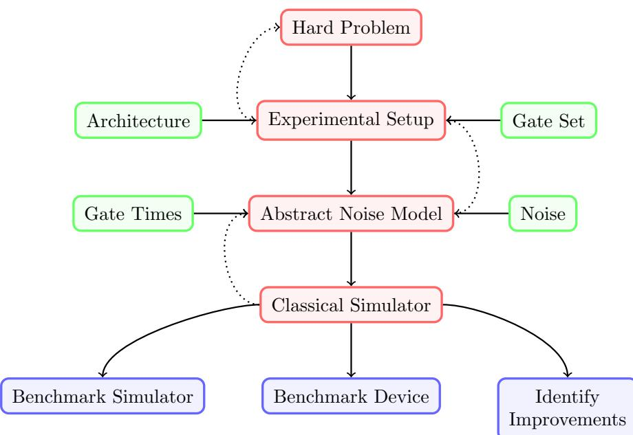  
Figure 1: The methodology proposed in this paper. The consideration of each step is preceded by its ancestor in the diagram, with feedback (dotted arrows) between steps, and contributing factors indicated from the sides. Outcomes are detailed at the base of the figure.

Step 4 - Classical Simulator : Select a classical simulator that is best suited for the problem under consideration. This is not, in general, a brute-force simulation and the specific choice can be such that it performs better for the problem, or instances there of, being considered.

While we consider each step in turn, we encourage feed-back between them. From the conclusions drawn at each step we “tailor-make” the construction of others.

# 2.2 Numerical Experiment Design

Our analysis consists of three parts for each numerical experiment. In the first we test the suitability of the classical simulator we plan to use, while in the second we use the simulator and take into account realistic or projected noise. While the first part benchmarks the simulator, the second allows us to achieve Outcome 1 listed in the introduction to this section. The third part of the experiment involves altering the parameters to achieve Outcome 2.

Part 1 - Simulator Benchmarking: Typically, the best classical simulators are probabilistic with errors which scale with the size of the computation. Therefore one must test the simulator chosen works as expected, specifically for the problem considered.

Do this by running smaller instances of the problem and comparing the resulting distributions to a less efficient brute-force simulation. In particular:

Generate random small instances of the problem.1 Complete a brute-force simulation of the generated problem. Adapt our chosen simulator to solve those instances, and solve many times. Compare the brute-force and aggregated simulator outcomes.2

In this way we establish the simulator’s accuracy.

Part 2 - Device Benchmarking: To address Outcome 1, impose constraints reflecting the implementation. Where possible, compare these simulations with experiments to determine the accuracy of any predictions made. Use the following steps:

• Generate random instances of the problem, restricted to the architecture.   
• Generate many random instances of noise to generate many noisy circuits.   
• Solve each noisy circuit and the original perfect circuit many times.   
c Compare the aggregated simulations in the perfect case and the average of the aggregated noisy simulations.   
Use suitable parameters and compare with actual experimental realisations.

In this way one can estimate the noise’s influence.

Part 3 - Guiding Future Experiments: Impose constraints coming from the realistic setting to the simulation and compare results with exploratory simulations with varying noise levels. This comparison is done to obtain an indication of the speed at which the noise “corrupts” the computation. Use this as a tool to provide feedback to experimental groups about which aspects of their devices they should prioritise improving. In so doing, we address Outcome 2.

Proceed as in Part 2 but with a varied noise model.   
• Compare these results with simulations using the original noise model to understands the impact of the new noise model.   
• If some change to the noise model is shown to result in a large improvement of the quality of the computation: 1. Feed this information back to experimentalists so that they can prioritise reducing this type of noise 2. Consider theoretical methods to mitigate this specific type of error and test the performance in simulations. For example, introducing partial errorcorrection to deal with the single most important source of error.

While each part builds on from its predecessor, and so should follow it in the order of experiments, we may stop at some part if proceeding would not be advantageous.

We will not compare our results to those of experimentalists, as we describe above. However we recognise this as an important step and hope to do so in future work. Here we focus on using classical simulation to make predictions about the impact of noise.

# 3 Exemplifying the Problem, Architecture, and Simulator Selection Methodology

Following the methodology for selecting a problem, architecture and simulator, discussed in Section 2.1: in Section 3.1 we present the class of problems considered; in Section 3.2 and Section 3.3, the physical system investigated; and in Section 3.4, the classical simulation technique used.

# 3.1 Step 1 : The Instantaneous Quantum Polytime Machine

Step 1 of Section 2.1 concerns the problems to consider during our simulations, which in our case will belong to the IQP (Instantaneous Quantum Polynomial time) class [4, 42]. IQP is a non-universal class of quantum computations which, like the one clean qubit model [43, 44], the boson sampling model [45–47], the Ising model [48, 49], etc, is thought to be able to demonstrate quantum-advantage, while also being designed with the goal of early implementation in mind. Indeed, current predictions [50] put the number of qubits one expects to require for a demonstration of quantum-advantage using IQP within the realm of what is thought to be possible in the near future.

IQP circuits consist of commuting gates, a property which could theoretically be used to parallelise the computation and reduce the, physically hard to achieve, requirement for quantum memory1. As well as being easier to implement, IQP is believed to be hard to simulate classically [51], even in some relaxed settings. It remains hard in the approximate case [52], when one imposes extra restrictions on the circuits [53], or even in the presence of noise [35, 54]. There also exists efficient methods for verifying some IQP computations without classical simulation [4, 55, 56].

The existence of a possible demonstration of quantum-advantage under these very restrictive settings makes the IQP class an exciting one to explore. We defined the class formally in Section 3.1.1, explore related hardness results in Section 3.1.2, derive a concrete implementation in Section 3.1.3 and explore an example of a particular set of problems that meet the hard problem selection conditions of Step 1 of Section 2.1 in Section 3.1.4.

# 3.1.1 Formal Definitions

An IQP machine is defined by its capacity to implement $X$ -programs and sample from the output distribution.

Definition 3.1 ( $X$ -program) An $X$ -program consists of a Hamiltonian comprised of $a$ sum of products of $X$ operators on different qubits, and $\theta \in [ 0 , 2 \pi ]$ describing the time for which it is applied. The $h ^ { \mathrm { t h } }$ term of the sum has a corresponding vector $\mathbf { q } _ { h } \in \{ 0 , 1 \} ^ { n _ { a } }$ , called $a$ program element, which defines on which of the $n _ { a }$ input qubits, the product of $X$ operators which constitute that term, acts. The vector $\mathbf q _ { h }$ has $\mathit { 1 }$ in the $j ^ { \mathrm { t h } }$ position when $X$ is applied on the $j ^ { \mathrm { t h } }$ qubit. As such, we can describe the $X$ -program using $\theta$ and the matrix $\mathbf { Q } = ( \mathbf { Q } _ { h j } ) \in \{ 0 , 1 \} ^ { n _ { g } \times n _ { a } }$ which has as rows the program elements $\mathbf q _ { h }$ , $h = 1 , \ldots , n _ { g }$ .

Applying the $X$ -program defined above to the state $| 0 ^ { n _ { a } } \rangle$ and measuring the result in the $Z$ basis produces the following probability distribution, ${ \tt X }$ , of outcomes:

$$
\mathbb { P } \left( \mathbf { X } = \widetilde { x } \right) = \left. \langle \widetilde { x } \vert \exp \left( \sum _ { h = 1 } ^ { n _ { g } } i \theta \bigotimes _ { j : \mathbf { Q } _ { h j } = 1 } X _ { j } \right) \vert 0 ^ { n _ { a } } \rangle \right. ^ { 2 } , \quad \widetilde { x } \in \{ 0 , 1 \} ^ { n _ { a } }
$$

Definition 3.2 (The IQP machine) Given an $X$ -program, an IQP machine is any computational method capable of efficiently returning a sample $\widetilde { x }$ from the probability distribution of equation (1).

# 3.1.2 Hardness Results and Their Robustness to Noise

IQP involves only gates which are diagonal in the Pauli- $X$ basis so does not achieve the full power of quantum computation. However, it is believed to be hard to classically simulate. Below we consider weak simulation of a circuit family which is when, given a circuit’s description, its output distribution can be sampled from by a polynomial time classical computer.

Theorem 3.1 (informal from [51]) If the output probability distributions generated by uniform families of IQP circuits could be weakly classically simulated then the polynomial hierarchy (PH) [57] would collapse to its third level.

A collapse of PH is thought to be unlikely, giving us confidence in the hardness of IQP.

While Theorem 3.1 is a worst case hardness result, we can trim some instances form the set of problems we would expect to demonstrate quantum-advantage. For example [4] when $\theta \in \left\{ { \frac { \pi n } { 4 } } : n \in \mathbb { Z } \right\}$ the result of the computation is classically computable. In the protocols we set $\textstyle \theta = { \frac { \pi } { 8 } }$ , giving us the necessary hardness.

Theorem 3.1 and similar results in [53] are remarkable in their demonstration that quantum computers which are very much weaker than a universal BQP machine are impossible to classically simulate. These results are, however, proven in the setting where one demands a classical simulator produce samples which are within a multiplicative error, which depends on the probability of the sample, of the ideal quantum distribution. It is more realistic, and closer to the true capabilities of noisy quantum computers, to allow the classical simulator to be wrong up to an additive error. That is to say that the device need not necessarily sample from the ideal distribution $P$ , but any distribution $\widetilde { P }$ with the property

$$
\sum _ { x \in \{ 0 , 1 \} ^ { n _ { a } } } \left| \widetilde { P } \left( x \right) - P \left( x \right) \right| \le \epsilon
$$

for some constant $\epsilon$ . This measure of distance between distributions is also called the $\ell _ { 1 }$ - norm distance. In this case too, hardness results exists.

Theorem 3.2 (informal from [52]) Assume either one of two conjectures, relating to the hardness of Ising partition function and the gap of degree 3 polynomials, and the stability of the PH, it is impossible to classically sample from the output probability distribution of any IQP circuit in polynomial time, up to an additive error of ǫ = 1192 .

We will take the hardness of weak simulation up to additive error as an indication that a class of problems is promising for an early demonstration of quantum-advantage. This is justified because it seems plausible that noise will have a similar impact on average case problems, which we simulate, and worst case problems, for which hardness results exist. Thus we can draw conclusions about the impact of noise on the hard cases from its impact on average cases.

Ideally, we would like for our class to demonstrate an advantage in the average case as proofs of these results are often constructive, and would present us with schemes to implement. Such results, of which the following is an example, are harder to obtain, especially if one requires noise tolerance and architectural restrictions.

Theorem 3.3 (informal from [35]) Assuming the integrity of PH and the difficulty of approximating an Ising model partition function; there is a family of IQP circuits, implemented in depth $O ( { \sqrt { n } } \log n )$ on a ${ \it 2 D }$ square lattice and containing $O ( n \log n )$ 2-qubit gates, for which a constant fraction of circuits cannot be simulated classically.

Here the simulation is understood as a simulation up to an additive error. This 2D square lattice architecture is favoured by many quantum computers today [58, 59] and while we hope to be impartial to the architecture [60–62], for early devices it is important to engineer our tests with this in mind. However, it is likely that the qubit routing used to implement the circuit of Theorem 3.3 on a square lattice requires many swap gates. These would not commute with the rest of the circuit, destroying the instantaneous nature which, as we will see, we prefer for our purposes.

Theoretical studies of quantum-advantage in the presence of noise have also explored the following, arguably more realistic, settings. The first considers independent depolarising noise which is added to all qubits at the end of the circuit. In this case the noise per qubit does not, as in the additive case, depend on the number of qubits. It is shown [35] that the circuit family of Theorem 3.3 are classically simulable in this noise model but that classical hardness can be recovered by modifying the circuits to include some classical error correction technique. Second, the more general case of independent noise being applied to each gate also leads to a wide family of circuits becoming classically simulable [63].

In our work, we do not explore the impact of noise on the quantum-advantage at a theoretical level, as was done in the aforementioned works, but suggest that numerical exploration should be done in parallel with the theoretical analysis. This would guide us in understanding which realistic experimental setting is best to demonstrate quantumadvantage with IQP problems.

# 3.1.3 IQP-MBQC: A Measurement Based Implementation

A common framework for studying quantum computation is the Measurement-Based Quantum Computation (MBQC) model [64–66]. Problems in the IQP class admits a realisation, using MBQC, which is particularly useful since it explicitly parallelises the computation.

The MBQC implementation of a given $X$ -program uses a graph state defined by a corresponding bipartite graph.

Definition 3.3 (Bipartite graph) We define the bipartite graph of an $X$ -program $( \mathbf { Q } , \theta )$ , as the graph with biadjacency matrix $\mathbf { Q } = ( \mathbf { Q } _ { h j } ) \in \{ 0 , 1 \} ^ { n _ { g } \times n _ { a } }$ . This means that there is a bipartition of vertices into two sets $A$ and $G$ of cardinality $n _ { a }$ and $n _ { g }$ and that an edge exists in the graph between vertex $g _ { h }$ of set $G$ and vertex $a _ { j }$ of set $A$ when $\mathbf Q _ { h j } = 1$ . The sets of vertices $G = \{ g _ { 1 } , . . . , g _ { n _ { g } } \}$ and $A = \{ a _ { 1 } , . . . , a _ { n _ { a } } \}$ will be called gate and application vertices respectively. See Figure $\mathcal { Q }$ for an example.

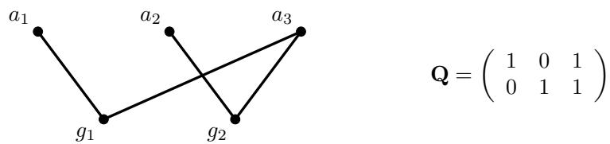  
Figure 2: An example of an bipartite graph described by matrix $\mathbf { Q }$ . Here, $n _ { a } = 3$ and $n _ { g } = 2$ while the partition used is $A = [ a _ { 1 } , a _ { 2 } , a _ { 3 } ]$ and $G = \lfloor g _ { 1 } , g _ { 2 } \rfloor$ .

One can prove [4] that the distribution of equation (1) can be achieved by initialising $\scriptstyle n _ { a }$ application qubits in the states $| a _ { j } \rangle = | + \rangle$ , $n _ { g }$ gate qubits in the states $| g _ { h } \rangle = | + \rangle$ , applying Controlled- $Z$ operations between qubits when there is an edge in the bipartite graph described by the $X$ -program matrix $\mathbf { Q }$ and measuring the resulting state. The measurement of the application qubits is in the Hadamard basis, and of the gate qubits is in the basis of equation (2).

$$
\left\{ \left| 0 _ { \theta } \right. , \left| 1 _ { \theta } \right. \right\} = \left\{ { \frac { 1 } { \sqrt { 2 } } } \left( e ^ { - i \theta } \left| + \right. + e ^ { i \theta } \left| - \right. \right) , { \frac { 1 } { \sqrt { 2 } } } \left( e ^ { - i \theta } \left| + \right. - e ^ { i \theta } \left| - \right. \right) \right\}
$$

The measurement bases do not depend on the outcomes of other measurements and therefore can be parallelised to one round of entanglement and measurement.

Importantly the distribution of equation (1) is achieved via this implementation in polynomial time. As such the complexity results of Section 3.1.2 apply here.

# 3.1.4 Using the 2D-DQS Protocol to Demonstrate Quantum-Advantage

In [5] a subclass of IQP problems called 2-dimensional dynamical quantum simulators (2D-DQS) are defined. The name references the 2D square lattice architecture involved and that they could be realised with sub-universal quantum simulators. Architecture I from [5] is seen in Protocol 1.

Protocol 1 A description of an instance of the 2D-DQS problem introduced by [5]. $E$ and $V$ are the edge and vertex set respectively of a $N _ { x } \times N _ { y }$ 2D square lattice.

1: Choose $\tau \in \left\{ 0 , 1 \right\} ^ { N _ { x } \times N _ { y } }$ uniformly at random.   
2: Initialise the product state:

$$
\left| \phi _ { \tau } \right. = \bigotimes _ { i = 1 } ^ { N = N _ { x } \times N _ { y } } \left( \left| 0 \right. + e ^ { i \tau _ { i } \frac { \pi } { 4 } } \left| 1 \right. \right)
$$

3: Allow system to evolve for time $t = 1$ according to the nearest neighbour, translation invariant, Ising Hamiltonian:

$$
H : = \sum _ { ( i , j ) \in E } \frac { \pi } { 4 } Z _ { i } Z _ { j } - \sum _ { i \in V } \frac { \pi } { 4 } Z _ { i }
$$

This is equivalent to applying controlled $Z$ operations on each edge. 4: Measure all qubits in the $X$ basis.

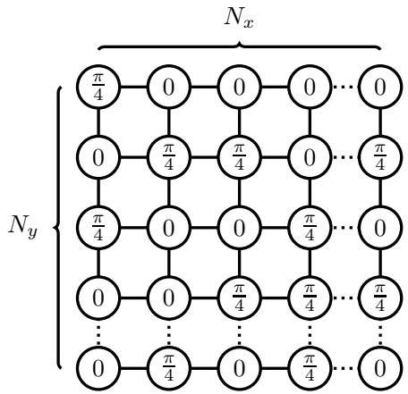  
Figure 3: An example of an instance of the 2D-DQS problem for quantum-advantage, detailed in Protocol 1 and introduced in [5]. The value in each qubit describes the state of initialisation while the lines connecting them indicate the application of a controlled $Z$ gates between those qubits. Each qubit of the resulting state is measured in the Pauli $X$ basis.

The construction is summarised in Figure 3. One realises that this is within IQP by noting either that it is simply a Bloch sphere rotation of the definition in Section 3.1.1 or that it is a constant depth commuting circuit on a 2D lattice. The related hardness result for this architecture is seen in Theorem 3.4.

Theorem 3.4 (informal from [5]) Assuming three conjectures (one being the noncollapse of PH), a classical computer cannot sample from the outcome distribution of the architecture of Protocol 1 up to an additive error of $\textstyle { \frac { 1 } { 2 2 } }$ in time polynomial in $N _ { x } , N _ { y }$ .

We note that this problem seems a good candidate for our purposes, as described in the hard problem selection methodology of Step 1 in Section 2.1, since it is hard to simulate classically and is experimentally realisable in the near term. A further advantage of this scheme is that the authors of [5] provide an explicit means for a client with a simple measurement device to verify the protocol. This is an important feature for extending the analysis beyond the limits were classical simulation is possible.

# 3.2 Step 2 : NQIT Architecture

The second choice to make is the physical system that we consider (Step 2 of Section 2.1). We chose the Q20:20 device being developed by the Networked Quantum Information Technologies Hub NQIT [1]. In fact we will model this device as closely as possible so it will also determine our choice of the noise model, as discussed in Step 3 of Section 3.3.

Networked architectures like NQIT, which combine matter degrees of freedom in modules which are entangled via photonic degrees of freedom, have two important advantages. Firstly, once the implementation of connections between modules is perfected, this architecture can easily scale without significant extra challenges. The second advantage is that this architecture can be combined easily with communication tasks. Many applications of quantum computation are likely to involve multiple parties, a setting to which networked architectures are best suited.

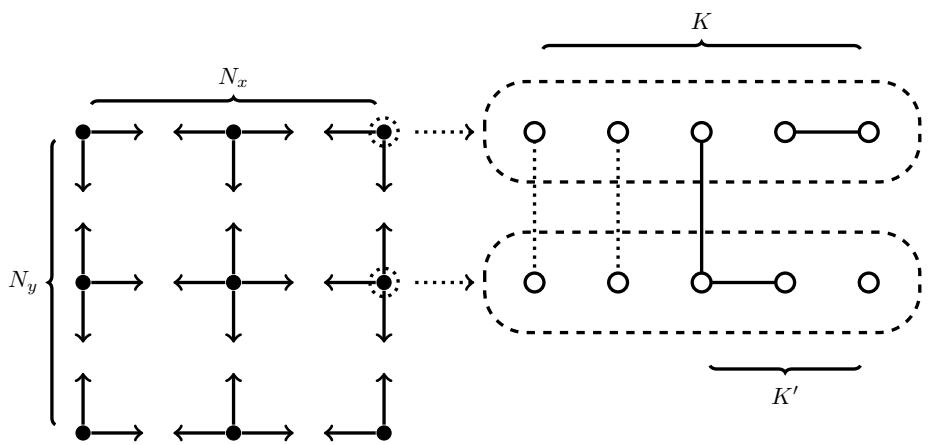  
Figure 4: Architecture of the NQIT device. We see on the left the connectivity between ion traps, and on the right an expanded view of individual ion traps and their internal and external connectivity. Dotted lines between ions in different ion traps in the expanded view indicate lower fidelity entanglement which is used to distil a higher fidelity entanglement indicated by the solid line. Note that $N = N _ { x } N _ { y }$ .

The device that NQIT is developing1 is called Q20:20. It consists of $N = 2 0$ ion traps [67] with $K = 2 0$ ions (physical qubits) in each. Traps are arranged on a 2D grid with only nearest-neighbour interactions allowed, giving a maximum number of connections $D = 4$ . Different ion-traps are connected via high-fidelity entanglement between dedicated linking qubits. This high-fidelity entanglement is realised through entanglement distillation [68, 69] and consumes some of the physical qubits of each ion-trap, leaving $K ^ { \prime } < K$ available qubits, before considering the cost of potential error-correction. Two-qubit gates between ion-traps can be applied by teleporting the qubits into the same cell. Single and two-qubit gates within a single ion-trap take place in special gate zones. A summary of this information can be seen in Figure 4.

These details are based on information obtained early in the NQIT project [2]. Since the project is still underway, the system parameters $N$ , $K$ , $K ^ { \prime }$ , $D$ , and others, may change [69] and so we let them vary in our simulation toolbox.

Like the architecture itself, the operations that are possible on the NQIT device may vary. We select to use the following set:

Preparation and measurement: It is possible to prepare qubits in the Hadamard basis and measure qubits in the computational basis.

Single qubit operations: The possible single qubit operations consist of the Hadamard gate and rotations by arbitrary angles, about arbitrary axes in the $X - Z$ plane. For practical reasons the axes will likely be restricted to integer multiples of fractions of $\pi$ . Here we will choose $\textstyle { \frac { \pi } { 4 } }$ giving us access to $T$ gates.

Two qubit operations: Here the controlled $Z$ gate, $C Z$ , is permitted.

Operations between traps: It is possible to create a bell pair $| \phi \rangle ~ = ~ \frac { 1 } { \sqrt { 2 } } \left( | 0 1 \rangle + | 1 0 \rangle \right)$ between traps.

The gate set used by the NQIT device may change but this set is a plausible one. It will at least result in compilation to circuits with a comparable gate count and execution time to the final choice; both key factors in determining the effect of noise.

# 3.3 Step 3 : NQIT Noise

Following Step 3 of Section 2.1, we give a brief summary of all types of noise, the degree to which they impact computations in the case of NQIT, and how we will model them. We divide the noise into time-based, which we model as occurring randomly in time on each physical qubit independently, and operation-based, which we model as occurring when an operator is applied, and is only applied to the qubits on which the gate acts. The values listed below are acquired through measurements of the NQIT device [2].

# Time-based Noise

Depolarising Caused by scattering of amplitudes of the electron’s wave-function between different energy levels of the ion. Modelled by a random single-qubit Pauli on each qubit at a rate of $\approx 9 \times 1 0 ^ { - 4 } s ^ { - 1 }$ .

Dephasing Entanglement reduction that destroys data not stored in the standard basis. Modelled by $Z$ gate on each qubit at a rate of $\approx ( 7 . 2 \pm 1 . 4 ) \times 1 0 ^ { - 3 } s ^ { - 1 }$ .

To simulate these noise channels we need the execution times of different operations:

• Preparation - $1 - 1 . 5$ ms   
• Measurement - $2 - 2 . 5$ ms   
• Single or two-qubit operation within a trap - 0.5ms   
Linking between traps - $1 - 2 \mathsf { s }$ s 2

# Operation-based Noise

Preparation Error probability in preparing a state. Modelled by Pauli $X$ at rate of $\approx$ $2 \times 1 0 ^ { - 4 }$ .

Measurement Similarly to preparation, measurement is also noisy. Rate of $\approx 5 \times 1 0 ^ { - 4 }$ to measure incorrectly any qubit, which corresponds to an $X$ gate.

Single-qubit gates Random Pauli operator applied in addition to the single-qubit gate with probability $\approx ( 1 . 5 \pm 0 . 4 5 ) \times 1 0 ^ { - 6 }$ .

Two-qubit gates Modelled by independent single-qubit random Pauli errors on both qubits, each with probability $\approx ( 5 . 5 \pm 3 . 5 ) \times 1 0 ^ { - 4 }$ and a further two-qubit error $Z \otimes Z$ with probability $\approx 6 \times 1 0 ^ { - 5 }$ .

Linking operations Depending on the amount of entanglement distillation used [69], this error varies since it is determined by the fidelity of the entanglement. If 10-qubits are used for distillation, then the effect is approximately the same as the regular (same ion-trap) two-qubit gate [2]. Moreover, using more qubits for distillation would not improve the computation since the same ion-trap qubit gates will still have higher errors.

This noise description is specific to the NQIT Q20:20 device. However, the structure is general and other versions of the NQIT device or other quantum devices are likely to have similar “specifications”. Therefore the toolbox developed should be adaptable to other quantum computation devices. The reader may refer to A.2 for a systematic description of the noise.

# 3.4 Step 4 : Clifford $+$ T simulator of Bravyi and Gosset

The last choice is to determine the classical simulator we use (Step 4). We use the improved Clifford $^ +$ T simulator of [3], which we introduce here. As we will discuss, for the IQP-MBQC and 2D-DQS problems in Section 3.1, this appears to be the most promising classical simulator.

While it is thought that classical simulation of universal quantum computation comes at the cost of exponential complexity [45, 51], compared to naive brute-force simulations there exist more efficient ways to classically simulate quantum systems. These techniques extend the domain of applicability of classical simulations, and for specific problems, enables simulations even for large instances. For example, by employing tensor networks [70, 71] the simulation of low entanglement computation becomes accessible while low amounts of interference gives the same result [72]. Using the positivity of the Wigner function [73] or the quasi probability representation [74] one can also obtain more efficient classical simulations. Monte Carlo simulations [75–79] have been developed to simulate noisy systems.

The Gottesman-Knill theorem [80] states that a Clifford circuit, built from the gate from the set $\{ S , H , C N O T \}$ acting on computational basis states and measurements in the computational basis, can be efficiently simulated on a classical computer. This result has since been greatly extended and improved [81–85]. While the Clifford gate set is not universal even for classical computations [81], adding just the $T$ -gate to the set makes it universal for quantum computation. In [3], a classical simulator for the Clifford $\textsuperscript { + } T$ gate set, with run time exponential in the number of $T$ -gates1 but polynomial in the number of qubits and Clifford gates, is developed. This allows efficient simulation of circuits with a logarithmic number of $T$ -gates. Furthermore, because of the small exponent, it enables the classical simulation of larger instances than regular “brute-force” simulators. Hence by restricting the frequency of T-gates in the instances of the IQP problem we consider, we can simulate even larger numbers of qubits/circuits than we would otherwise be able to.

The details are given in [3], but here we give an outline of the idea. First all $T$ gates are replaced by the gadget of Figure 5. The measurement is replaced by postselection onto the 0 outcome and the magic state is replaced by a decomposition into exponentially many stabiliser states. These steps result in a purely stabiliser circuit and measurements of exponentially (in the $T$ count) many stabiliser states. The nature of the simulation means that Clifford gates can be simulated exactly, while the simulation of non-Clifford gates is probabilistic. Using this method the authors are able to simulate about 40 qubits and 50

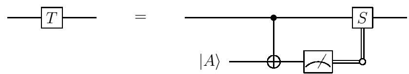  
Figure 5: The gadget used to replace a T-gate [86]. $\begin{array} { r } { | A \rangle = \frac { 1 } { \sqrt { 2 } } ( | 0 \rangle + e ^ { i \pi / 4 } | 1 \rangle ) } \end{array}$ are magic states [87].

$T$ gates in what they quote as ‘several hours’. Here we require the simulation of several thousand circuits and so we simulate fewer $T$ gates to allow this to be done in a reasonable time.

The instantiation of the simulator we use is a Clifford + $T$ gate set simulator from [3] which produces the probability of measuring a single outcome. In [3] a more general simulator was also introduced which samples from the output distribution. The 2D-DQS problem chosen in Section 3.1.4 is highly entangled, beyond stabiliser simulation and conveniently represented in the Clifford $\textsuperscript { + } T$ gate set without the need for costly (in gate count) gate decomposition [88, 89]1. This makes the simulator of [3] perfect for our purposes, and others mentioned above less useful. There are many implementations of simulators available [91] but they are either more general purposes solutions [85, 92–100], which can mean a large overhead for our specific set of circuits, or bespoke for tasks other than the one we require here [101–103].

# 4 Exemplifying the Numerical Experiment Design Methodology

We present the results of two sets of numerical experiments, in accordance with the numerical experiment design methodology introduced in Section 2.2, utilising discussions, in Section 3, regarding the problem, architecture and simulator to be used. The first considers the 2D-DQS problem, the restricted class of IQP computations presented in Section 3.1.4, and is used to demonstrate the potential of classical simulators as a tool to guide experimental research. In Section 4.2.1 and Section 4.3, where we present results for this problem, we simplify NQIT architectural constraints to focus on the impact of noise.

We embrace the full complexity of the NQIT architecture in a second numerical experiment presented in Section 4.2.2. We restrict a general IQP-MBQC problem seen in Section 3.1.3 to the NQIT architecture. The hardness of the IQP problem could, in principle, be destroyed by these restrictions and thus further theoretical investigation is required. Here we focus on the effect of architectural constraints on simulations, while the proof of hardness and detailed noise analysis is left for future works.

While we will reference the simulation details, architectural constraints and figures of merit used in each of the experiments, we note some traits which will be common in all of our experiments.

Simulation To introduce some terminology, each numerical experiment consists of several trials which are simulations of several different but related circuits. Often a trial will consist of many runs, themselves involving several simulations of the same circuit. For example, an experiment might have many trials, each containing a run simulating a probability amplitude for an output of a perfect circuit and several runs each simulating the same output probability amplitude, but with different noisy versions of that circuit.

Indeed, each trial will compare a perfect run and possibly several noisy runs, which we will identify in each numerical experiment. In particular, in the case of numerical experiments benchmarking the simulator itself the perfect run will be conducted using a brute force simulator while the noisy run will utilise the simulator of our choice. In this case, the noisy simulation is noisy in the sense that the outcomes of the chosen simulator are probabilistic. In the cases where the device is being benchmarked, the perfect run will not consider the architectural noise model, while each noisy runs will.

Constraints Within each numerical experiment we must identify the constraints on the family of circuits we are considering in order to ensure that it is consistent with the philosophy of this paper. In particular, we must ensure that the perfect runs have the necessary theoretical support, for which we will fall back on the IQP hardness results detailed in Section 3.1. Indeed, in that section we justified considering additive error worst case hardness to be a sufficient support when a demonstration of quantum-advantage is being considered.

A general restriction which is pervasive in our work concerns the degree to which operations can be parallelised in the circuits we consider. While, in theory, IQP circuits are parallel by construction, qubits are physical systems and, in the circuit model, one may be required to apply multiple gates on the same systems. Experimentally it may not be possible to perform these gates simultaneously, even if the gates commute with each other. However, to increase parallelisation of the computation, in our numerical experiments we consider cases of IQP-MBQC where all measurements can be made simultaneously, allowing us to neglect the impact of time based noise during measurement. If we used a less parallel realisation of IQP circuits, it would be prone to the same type and size of noise as a general universal quantum computation and would not be a better candidate for demonstrating quantum-advantage than a universal quantum computation.

Similarly, as discussed in Section 3.2, while the NQIT Q20:20 device is universal, to apply a 2-qubit gate on qubits which belong to ion-traps that are far apart on the 2D lattice, would require many swap gates, each consuming linking qubits. This can result in a large overhead [62, 104–106] and so a high noise level. Thus, we aim to minimise the number of such gates when deriving our restrictions and we will see that very few swap gates are required for our choices of problems.

Figures of Merit To compare perfect runs, which will be justified in their use by the discussion on constraints, with noisy runs, we must consider what figures of merit we will use to judge the quality of those noisy runs. When quantum-advantage is not of concern, for example when benchmarking the classical simulator we use, as is demanded by Part 1 of the numerical experiment design methodology of Section 2.2, and as we do in Section 4.1, the figure of merit will relate to its reliability in producing accurate outcomes.

Statistical test for model closeness In this case, the output of the simulations are single values of probability amplitudes. A statistical test will be necessary to compare the probability amplitudes from perfect runs to those of the noisy runs. We will use the coefficient of determination to measure the quality of the noisy runs as a model for the perfect runs. This is detailed further in Section 4.1.

In the case of simulator benchmarking we compare the probability amplitudes from a brute force simulation to those of the probabilistic simulator, which can be seen as a model of the brute force simulator. We use the same statistical test in Section 4.2.2 when we simulate restricted instances of the detailed NQIT architecture as we are less concerned by exploring quantum-advantage when the theoretical foundations has been weakened by this restriction. There we will focus on the application of our work to restricted architectures, and study the implications for more general architectures, but find the quantum-advantage motivated figures of merit discussed below to be inappropriate there.

By comparison, when considering the prospect of a device demonstrating a quantumadvantage, the figure of merit will relate to the anticipated usefulness of a larger scale real world implementation of the circuits we are simulating in demonstrating said quantumadvantage. Such a consideration is demanded by Part 2, device benchmarking, and Part 3, guiding future experiments, of the numerical experiment design methodology of Section 2.2, and is performed in Section 4.2 and Section 4.3.

In the case of the simulations of noisy circuits in Section 4.2 and Section 4.3, while we do not formally consider their hardness, our measure will be the closeness of the simulated probability amplitudes to the perfect simulations, for which the hardness results of Section 3.1 apply. The theoretical results regarding the hardness of noisy distributions typically concern its $\ell _ { 1 }$ -norm distance from the perfect distribution. In our case we do not have access to this information because, as discussed in Section 3.4 where the simulator we use is introduced, we access only the amplitudes of a single output, rather than fully characterising the distribution. As such we will often use proxy measures of the $\ell _ { 1 }$ -norm distance between perfect and noisy distributions.

While there are classical simulations which would give us access to a full characterisation of the distribution, here we forgo this option. This is because our aim is to explore the impact of noise at the boundary between what can be simulated classically and what cannot. To do so we have chosen to use a simulator which allows us access to a higher number of qubits than can be implemented experimentally on the NQIT architecture, and than could be implemented using simulators which characterise the full probability distribution. Indeed, the challenge of fully characterising all $2 ^ { n }$ probabilities of and $n$ qubit probability distribution quickly becomes insurmountable as the number of qubits grows, and certainly becomes increasingly hard as the circuits considered approach the regime of quantum-advantage.

With this in mind, we note the following figure of merit which will be used in Section 4.2 and Section 4.3.

Accuracy and far from uniformity of noisy runs: We will consider a numerical experiment to have demonstrated that the current noise values are likely to bring implementations within the reach of classical simulation if trials show either; the noisy probability amplitudes to be within a standard deviation of a uniform distribution amplitude, or greater than one standard deviation from the perfect amplitude.

This condition is reasonable as it asserts that for it to be considered possible for a distribution to demonstrate quantum-advantage it must both have outcomes with probabilities which are far from the uniform distribution value, and that the values of these probabilities are close to the ideal ones.

These far from uniform points are of great importance for several theoretical reasons. Their existence is shown to be indicative of quantum-advantage [23, 47] while their accuracy is also shown to be vital. For example, studies of the heavy outputs of random circuits [40] show that a device could demonstrate quantum-advantage by preserving those probabilities with higher than median value. Indeed other benchmarks of a quantum device’s ability to demonstrate quantum-advantage have been build around this realisation [41]. In addition, measures such as multiplicative error, on which many quantum-advantage statements are based, as discussed in Section 3.1.2, and cross entropy difference, which has also been used to benchmark quantum devices and their demonstration of quantum-advantage [23], are particularly sensitive to the effect noise has on outcomes with small probabilities. In the extreme case, they consider a noisy distribution which does not preserve the probability of outcomes which are not in the support of the ideal distribution to be infinitely far from the ideal distribution.

Contradicting this accuracy and far from uniformity statement can therefore be seen as an indication, but not proof, of the ability to demonstrate quantum-advantage in the setting being considered. Indeed we will consider a demonstration of quantum-advantage to be more likely if the noisy distribution more often contradict the statement, which is to say that there are more outcomes with probability both far from the uniform value, and close to the ideal value. While there is an upper bound to the number of such outputs, namely the number of outputs with probability far from the uniform value in the ideal distribution, this figure of merit provides a lower bound on what must be achieved for a demonstration of quantum-advantage to be deemed likely.

This accuracy and far from uniformity measure also implies that values close to uniform ones in the ideal distribution remain so in the noisy distribution. This follows as such values would otherwise be ‘far from the perfect amplitude’. However, in many cases noise has the effect of bringing probability values close to the uniform distribution and so little information about the effect of noise can be obtained from these outputs as they will be little changed. For the noise types listed for the NQIT device in Section 3.3 it is the case that they result in a convergence of the output distribution to the uniform one. While this is not the case for noise channels such as amplitude damping, these errors would also be captured by this figure of merit as it would have the effect of decreasing the probability of likely outputs towards the uniform distribution value. Further, it would be impossible to distinguish close to uniform values which have been achieved through accurate reproduction of the ideal distribution and those which have been achieved through a naive approximation by a uniform distribution. While it is true that these points are of value to the form of the distribution as discussed in Section 3.1.2, as we cannot make this distinction we do not include them in our analysis. By isolating outcomes which have far from the uniform probability in the ideal distribution we obtain the additional advantage of being able to limit the outputs which we must study in our experiments, allowing us to run larger circuits as a trade off.

Due to the anticoncentration property of IQP distributions [52], this might result in considerable filtering of our simulations. However, while results about the quantum-advantage of IQP circuits, seen in Section 3.1 and utilised in the constraints section of each numerical experiment, assure us that the circuits we consider cannot, in general, be simulated classically, this filtering removes output amplitudes which could trivially be simulated using a uniform distribution.

That contradicting this condition implies there are points which are further than one standard deviation from the uniform distribution is valuable in that it ensures points which are far from uniform in the ideal distribution reliably remain this way in the noisy one. This is vital for the reasons stated above. That they be within one standard deviation of the ideal is not strictly necessary as quantum-advantage statements typically allow for a constant deviation of the whole distribution. However, as we are unable calculate the deviation of the whole distribution, this again seems like a reasonable proxy. In fact, as we will see, in Section 4.3.4 there is a relationship between this measure and more direct proxies for the $\ell _ { 1 }$ -norm distance.

However, as we focus on single amplitudes, it may be that this is a strong metric. While it is shown to be hard for a classical device to sample from the output distribution of arbitrary IQP circuits, which are subject to noise, up to a small relative error in each probability [54], this is possible up to $\ell _ { 1 }$ -norm distance [35].

The previous two figures of merit have the advantage that they are the best utilisation of the simulator that we have chosen to use. In particular, they extract a significant amount of information from the single probability values which we have access to. That being said, as we mentioned before, theoretical results often refer to global properties of the probability distributions. The following figure of merit addresses this disparity.

Close in $\ell _ { 1 }$ -norm distance: When the circuit considered in a numerical experiment is considered to not be unlikely to demonstrate quantum-advantage, as defined in the above condition, we will consider the closeness of the noisy and perfect runs using proxies for the $\ell _ { 1 }$ -norm distance.

Because of the relationship between this figure of merit and the theoretical results about IQP in Section 3.1.2 and, in particular, 2D-DQS in Section 3.1.4, this figure of merit can more reasonably be expected to be a predictor of demonstrations of quantum-advantage than in the previous case. Once again we will often refer to the relative likelihood of a demonstration of quantum advantage between noise settings as measured by the degree of improvement in the $\ell _ { 1 }$ -norm distance. In this case we have the additional benefit of being able to study the closeness of the measured value of the $\ell _ { 1 }$ -norm distance to the value specified in the relevant theoretical results of Section 3, although this proxy of the $\ell _ { 1 }$ -norm distance does not allow us to make formal claims.

By encapsulating results related to those far from uniform outcome probability values and proxies for the $\ell _ { 1 }$ -norm distance we cover a diverse set of theoretical results. We believe there is great value in this diversified approach and as such we will combine both the accuracy and far from uniformity condition and the close in $\ell _ { 1 }$ -norm distance condition throughout our work.

For each numerical experiment we will use considerations of the simulation method, the constraints of the architecture, and the appropriate figures of merit to draw conclusions pertaining to the goals of this paper.

# 4.1 Part 1 : Simulator Benchmarking

As we outlined in Section 2.2, Part 1 of the numerical experiment builds confidence in our simulator by comparing the outputs to a brute-force simulation. Here we detail the numerical experiment used to do so.

Constraints Here we will not consider the specifics of the architectural noise as we are measuring the impact of using a probabilistic simulator as compared to a brute-force one.

Moreover, it is sufficient to benchmark the probabilistic simulator by comparing the outputs to those of a brute-force simulation for a general IQP-MBQC problem of Section 3.1.3. We do not restrict to a particular architecture here but the generality we utilise ensures the functioning of the simulator for restricted instances which we explore later.

Simulation As described in B.1.1, during each trial we will generate a random instance of the general IQP-MBQC problem of Section 3.1.3, and simulate the circuit to obtain the probability of measuring the $| 0 ^ { n } \rangle$ state. The randomly generated circuits will have between 5 and 12 qubits, and between 5 and 15 $T$ gates. In the case of the perfect run, the solution will be obtained by using the brute force simulator, while in the case of a noisy run it will be solved by taking the mean of several simulations using the probabilistic simulator of Section 3.4. Together these two runs constitute a trial. The resulting values for the runs in each trial are then compared to calculate the coefficient of determination as described in the figures of merit section.

As discussed, while the brute-force simulation is deterministic, the simulator of Section 3.4 which we are testing against it is probabilistic. As such, each noisy run will consist of calculating the given probability distribution many times, and averaging. The mean and standard deviation are plotted in Figure 6.

Here it is sufficient to consider only the probability of measuring the state $\left| 0 ^ { n } \right.$ as no additional error is added by measuring other states. As measuring other basis states requires only the appropriate $X$ gates, which can be applied deterministically by the simulator of Section 3.4, unlike $T$ gates which are applied probabilistically, no additional error will result from considering only the $\left| 0 ^ { n } \right.$ state.

Figures of Merit The measure we will use to compare the perfect and noisy runs is the coefficient of determination, which can be said to measure the correlation between the outputs of a model and those from its target. Given outputs $m _ { i }$ from a model, and the corresponding target outputs $d _ { i }$ , with mean $d$ , the coefficient of determination is calculated using equation (5). In equation (5), $\begin{array} { r } { r = \sum _ { i } \left( d _ { i } - m _ { i } \right) ^ { 2 } } \end{array}$ is the residual sum of squares and $\begin{array} { r } { v = \sum _ { i } \left( d _ { i } - \bar { d } \right) ^ { 2 } } \end{array}$ is the total sum of squares.

$$
R ^ { 2 } = 1 - \frac { r } { v }
$$

In our case the model is the simulator of Section 3.4 and the target is the brute force simulation. The data, $d _ { i }$ and $m _ { i }$ , are the values for the amplitudes of the $\left| 0 ^ { n } \right.$ state produced by the brute-force and probabilistic simulator, respectively, during the $i ^ { \mathrm { t h } }$ trial.

Conclusion Results in Figure 6 show that the average of the simulator outputs exhibit strong correlation with the true values from a brute force simulation, giving a coefficient of determination $R ^ { 2 } = 0 . 9 6 1 9$ . As such we can have confidence in our choice of simulator for the problems we will tackle in the following sections.

# 4.2 Part 2 : Device Benchmarking

Continuing to follow the method of Section 2.2, Part 2 of each numerical experiment is to impose the constraints that come from the experimental system used. In the following we restrict, with differing degrees of strictness, problems previously mentioned, to the NQIT architecture.

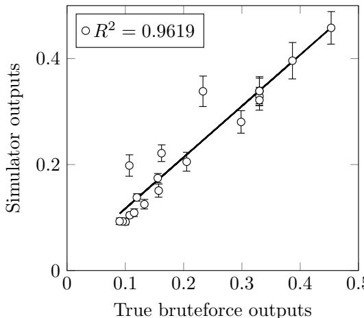  
Figure 6: Comparison between brute-force outputs and probabilistic simulator outputs when calculating the probability of measuring the $\left| 0 \right. ^ { \pi }$ state for 20 random $X$ -programs. Each point indicates the mean probability of measuring the $\left| 0 \right. ^ { \pi }$ state for one fixed $X$ -program according to the simulator, with the error bars indicating one standard deviation in the probabilistic simulator’s output. The number of qubits is in the range [5,12] and the $T$ - gate count is in the range [5,15]. Details of this simulation can be found in B.1. Strong correlation is observed with $R ^ { 2 } = 0 . 9 6 1 9$ . Here, unlike in later plots, the axis are not scaled as the probabilities are of a reasonable magnitude due to the smaller circuit sizes.

# 4.2.1 NQIT Noise Restricted 2D-DQS

We consider Architecture I from [5] as discussed in Section 3.1.4 and constrain it according to the noise of the NQIT machine as listed in Section 3.3. For simplicity, we will use a modified version of the NQIT architectural restraints of Section 3.2.

Constraints The 2D-DQS problem has been designed for networked architectures and, with some simple adaptations, it can coincide with NQIT’s device. In particular, by making the simplifying assumption that we use a single logical qubit per ion-trap1 we can map every grid vertex onto a single ion trap. One may then look to Figure 3 and Figure 4 to understand that the 2D-DQS problem can be easily overlaid onto the NQIT architecture, which also permits the necessary measurements, state preparations, and single and 2-qubit gates.

As the adapted NQIT architectural restrains, detailed above, adhere to those required for the 2D-DQS problem seen in Protocol 1, the worst case additive error hardness result of the 2D-DQS problem, as seen in Theorem 3.4, applies. While we have agreed that this setting constitutes one that is worthy of investigation, as the noise levels are independent for each qubit and not dependent on the problem size, the additive error permitted by Theorem 3.4 is likely exceeded. Hence, we would expect that in the noisy case the distribution becomes far from the perfect one and for the advantage to diminish.

Simulation We consider $4 \times 5$ grids, modelling 20 ion traps in total, and use them to perform Protocol 1. Protocol 1 requires, on average, half as many $T$ gates as qubits; in this case 10 and 20 respectively. Details of the numerical specifics of the experiments can be found in B.2. Here it suffices to say that we use four steps to generate the entangled 2D cluster. The number of steps plays a role in the amount of noise as it determines the duration of the computation and thus the decoherence time we consider.

We perform 20 trials, each concerning one perfect circuit and a random output string. For each trial there are 20 noisy runs, each with their own random noisy version of the trial’s circuit. This random noisy version of the perfect circuit is generated by considering the noise type and strength of the experiment as described in B.2. We simulate all 21 circuits 20 times, calculating the mean probability of measuring the corresponding bit string in each case. We will then take the mean and standard deviation of the noisy runs.

While, as noted in [3], simulations of up to 40 qubits and 50 $T$ gates is possible using this simulator, as is also noted in that work, doing so takes several hours. In our case we simulate 20 trials, each with 21 runs and 20 simulations per run and so we restrict the number of qubits and $T$ gates to a more manageable amount. Later in this work we go further and perform many thousands of simulations in each numerical experiment, justifying our restriction.

Figure of Merit For this numerical experiment we will utilise the ‘accuracy and far from uniformity of noisy runs’ condition from the introduction to Section 4. In particular, we will consider a perfect run to be far from uniform when it is either greater than twice the uniform value, or less than half. In this way we will identify if the noise level reveals that, as we expect, the potential for a demonstration of quantum-advantage should be dismissed, rather than if one could be achieved.

Conclusion The results are shown in Figure 7 where we have plotted the value for the perfect run, and the mean value for the noisy runs. As expected, including noise at the levels of the NQIT device leads to an outcome probability that is between the ideal and the totally random output. However in most cases the noise that we include leads to a result within one standard deviation of the uniform distribution, or greater than one standard deviation from the perfect run. Referring to our figures of merit, we regard this to be a sign that the scheme is unsatisfactory for demonstrating quantum-advantage with NQIT noise at its current levels.

In Section 4.3 we use the simulator as a tool to investigate which of the aspects of our noise model are the main sources of this failure. Our intention is to direct subsequent experimental and theoretical research towards diminishing this source, potentially leading to a quicker implementation of quantum-advantage experiments.

To form a complete picture, and to benchmark the device’s performance when implementing these problems, we must compare our numerical experiments with actual experiments. This work concerns only numerical experiments, while in the future we plan to collaborate with experimental groups to provide these benchmarks.

# 4.2.2 NQIT Noise and Architecture Restricted IQP-MBQC

The second numerical experiment we perform takes the general IQP-MBQC of Section 3.1.3 and imposes constraints equivalent to the architecture of NQIT. We consider the case where each ion-trap has multiple logical qubits, as discussed in Section 3.2. Moreover, we restrict to IQP instances involving gates acting on qubits belonging to neighbouring ion-traps so as to lower the circuit depth as much as possible.

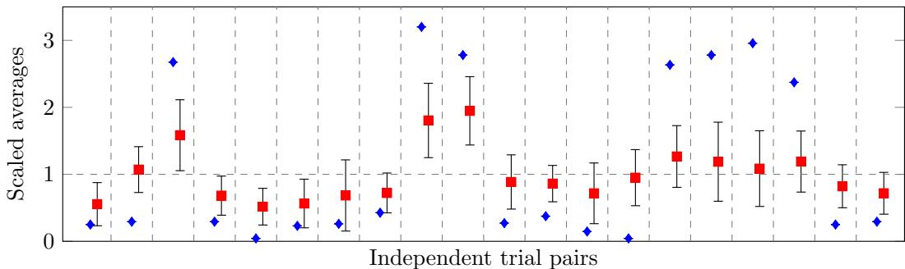  
Figure 7: Comparison between ideal and noisy circuit results for a $4 \times 5$ ion trap grid. The results referenced by this plot are the probability of measuring a randomly chosen output string, where each trial has a different initial 2D-DQS circuit, and different output string. Every consecutive pair is one trial and contains the perfect run (blue diamond), and the mean of the noisy runs (red square). The error bars indicate one standard deviation of the noisy runs. The means and standard deviations for each trial have been normalised by the uniform distribution (dotted horizontal line).

Constraints In principle different gates of an $X$ -program may act on any subset of qubits, or in the MBQC model, the gate qubits may be entangled with any subset of the application qubits. This is not realistically achieved in the NQIT setting, where qubits belonging in different ion-traps cannot be connected arbitrarily with qubits of other ion-traps. Since NQIT admits universal quantum computation, one could achieve arbitrary connectivity by using swaps between the qubits. However, by doing these swaps the advantage of smaller waiting times offered by IQP is destroyed. We will thus impose conditions on the connectivity, limiting the class of problems we use.

We have assumed that each ion-trap has $K \ = \ 2 0$ physical qubits, of which 10 are dedicated to entanglement distillation, leaving $K ^ { \prime } = 1 0$ for use in computation. As discussed in Section 3.3, this allows us to fix the noise of two-qubits gates to be constant, whether it involves qubits in the same or neighbouring ion-traps. This does not apply to the waiting time, and thus decoherence, which is greater in the case of gates involving qubits in different ion-traps.

We will choose the minimum links between different ion-traps (while maintaining full connectivity within each trap). This means a 1 dimensional configuration of ion-traps1. This, in itself, might not be a big restriction, since even considering two-qubit gates that act on nearest neighbour qubits only, as shown by Theorem 3.3, is still believed to be a hard problem. However, this configuration, while it is not 1 dimensional as far as the qubits are concerned, is still likely to admit a classical efficient simulation based on tensor networks and matrix product states [107]. Since our purpose in this section is to illustrate how to implement architecture constraints, the issue of classical hardness in comparison to the best classical methods, is not crucial. Indeed it is likely that reasonable predictions can be made about the impact of noise on the 2 dimensional architecture designed by NQIT, outputs from which are less likely to be reproducible on a classical computer, using results from these 1 dimensional simulations. In contrast, in the first numerical experiment, there is a complexity-theoretic proof of hardness.

In IQP-MBQC, applying gates between application qubits corresponds to entangling them with the same gate qubit. In the case that the application qubits belong to different ion-traps, the gate is applied using teleportation, with the help of entanglement links distilled between neighbouring ion-traps. Protocol 2 shows how to achieve this using only one entanglement link between the two ion-traps. Distilling entanglement between multiple traps takes a longer time, which is why we restricted our attention to $X$ -programs that involve gates with qubits in at most two ion-traps.

Protocol 2 This algorithm constructs part of the resource state for a given gate qubit $g$ in trap 1 according to its corresponding row $p$ of the $X$ -program Q. $Q _ { 1 }$ is the set of all qubits in cell 1 with $g , l _ { 1 } \in Q _ { 1 }$ . Analogously, $c , l _ { 2 } \in Q _ { 2 }$ . $c$ is the qubit that will eventually be used for measurement after $g$ ’s value is teleported there.

1: function $\operatorname { E N T A N G L E T W O T R A P S } ( p , g , c , l _ { 1 } , l _ { 2 } , Q _ { 1 } , Q _ { 2 } )$   
2: for all $q \in Q _ { 1 } : p ( q ) = 1$ d o   
3: $C Z \ ( g , q )$   
4: end for   
5: $C Z \left( g , l _ { 1 } \right)$   
6: Distil a Bell pair between $l _ { 1 }$ and $l _ { 2 }$   
7: Bell measurement on $\left( g , l _ { 1 } \right)$ which teleports g to $l _ { 2 }$   
8: SWAP $( c , l _ { 2 } )$   
9: for all $q \in Q _ { 2 } : p ( q ) = 1$ d o   
10: $C Z \ ( c , q )$   
11: end for   
12: end function

In this setting, we have each ion-trap being connected by entanglement links to two neighbouring ion-traps. Each ion-trap has one gate qubit ( $_ { g }$ in Protocol 2) and one qubit reserved to receive the gate qubit coming from it’s neighbour ( $c$ in Protocol 2). This leaves 8 application qubits. This entanglement structure can be achieved in two time-steps. First, all ion-traps at odd positions use their entanglement links to teleport the qubit required using Protocol 2. This is repeated for all even positions. This two-step process is shown schematically in equation (6).

$$
\begin{array} { c c c c c c c c c } { { 1 } } & { { 2 } } & { { 3 } } & { { 4 } } & { {  } } & { { 1 - 2 } } & { { 3 - 4 } } & { {  } } & { { 1 - 2 - 3 - 4 } } \\ { { \lfloor } } & { { \uparrow } } & { { \lfloor } } & { { \uparrow } } & { { } } & { { } } & { { \lfloor } } & { { \uparrow } } & { { } } & { { } } \end{array}
$$

With these restrictions $X$ -programs can be mapped to NQIT’s architecture. An example of an MBQC graph for such restricted instances is given in Figure 8.

Simulations A full description of the simulation procedure can be seen in B.1.2. In summary, we let each gate qubit act on a random subset of the application qubits in its own ion-trap before, after being teleported, acting on a random subset of the qubits in the next ion-trap. We performed 20 trial, each involving a randomly generated circuit of the form described above, along with a random output string. Each trial has one noisy and one perfect run. A perfect run involves simulating the perfect circuit several times and calculating the mean probability of measuring the selected output string. A noisy run is equivalent but with a random noisy instance of the circuit.

In this case, at their largest, we simulate significantly more qubits than in the previous and following sections. The largest circuit we simulate has $1 2 \times 8$ qubits but still only 10 $T$ gates on average. This is because we have limited the probability that a $T$ gate will be required, which corresponds, as discussed in B.1.2, to limiting the probability of creating connections between the gate and application qubits. As the computation time grows exponentially with the number of $T$ gates, and polynomially in the number of qubits, we can afford this increase in the qubit count.

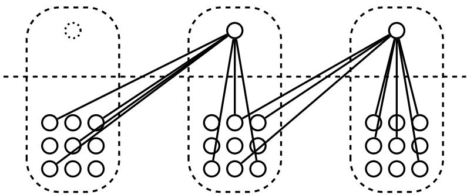  
Figure 8: An example of a restricted MBQC pattern for 3 traps, where application qubits are on the bottom and gate qubits are on the top. Gate qubits are still physically in the cells with the application ones, although they are separated by a dotted line here for clarity. We have one gate qubit for every two neighbouring cells, with considerations made for boundary cases. Once a gate qubit is entangled in its native trap it is moved. There is one less gate qubit than the number of traps so that each is entangled to two traps. The dotted gate qubit indicates a location which has been vacated when the gate qubits move between traps. The reader may wish to return to Figure 4 where, like here, the dashed bubbles indicate individual ion traps with a single qubit in each acting between them.

Figure of Merit In this case, as we expect that the architectural restrictions used will make a demonstration of quantum-advantage using this scheme unlikely, we will not consider the figures of merit as in Section 4.2.1. Instead we again consider the coefficient of determination as in Section 4.1 to establish the impact of noise models more broadly. Here the model outputs $m _ { i }$ are the probability amplitudes from the noisy run, while the target outputs $d _ { i }$ are those from the perfect run.

Conclusion We compared the two means of each run to calculate the coefficient of determination. In the case of the maximum system (12 ion-traps, with 8 application qubits each) we noticed that, with the existing level of noise, the results corrupt fully the output leading to $R ^ { 2 } \approx 0$ . We then ran similar experiments for smaller instances. Lowering the number of qubits, we observed that the $R ^ { 2 }$ value was increasing but still remained extremely low with NQIT noise level. Decreasing the size yielded the following results ( $a \times b$ means $a$ ion-traps with $b$ application qubits per trap):

<table><tr><td>a× b</td><td>12 × 8</td><td>9 × 8</td><td>4 × 8</td><td>4 × 2</td></tr><tr><td>R2</td><td>0.0086</td><td>0.0237</td><td>0.0333</td><td>0.5561</td></tr></table>

These $R ^ { 2 }$ values, far below one, indicate that even for small system sizes, the noise is too high and there is little correlation between the perfect and noisy runs. For this reason, and because theoretical results about quantum-advantage in this case are not as strong, in the subsequent section where we examine the effects of varying noise, we restricted attention to the numerical experiment of Section 4.1 only and do not proceed to Part 3 of the numerical experiments in this case.

# 4.3 Part 3 : Guiding Future Experiments Using NQIT Noise Restricted 2D-DQS

To identify the main sources of error in the numerical experiment of Section 4.2.1 we run experiments with varying noise levels. In this section, the protocol we implement will be the 2D-DQS of Section 3.1.4 as detailed in B.2. We group the different noise types of Section 3.3 together and identify which contributes most to the corruption of the perfect output. We then “fine-grain” further by considering the different types of noise within that group. Once we have identified the main source of error, we will explore how the potential for a demonstration of quantum-advantage is affected by reducing this noise, both by known error correction techniques, and hypothetical proposals.

In these numerical experiments will use the same constraints and simulation design as in the first 2D-DQS simulations of Section 4.2.1. The difference here is the noise model used. In particular, we will be comparing random single output probabilities. We will also use the same ‘accuracy and far from uniformity of noisy runs’ figure of merit as in Section 4.2.1 in order to identify when a demonstration of quantum-advantage is unlikely. As we identify cases where such a demonstration is not unlikely, we will explore proxy measures for the $\ell _ { 1 }$ -norm distance and relate these measures back to the theoretical results, in Section 3.1.4, on the conditions for a demonstration of quantum-advantage using the 2D-DQS protocol.

# 4.3.1 Operation-Based Verses Time-Based Noise

At the coarsest level of detail, we group time-based noise (depolarising and dephasing) together, and operation-based noise (preparation, measurement, single and two qubit gates, including the noise during distillation) together. In each run we eliminate either the timebased noise or operation-based noise, while keeping the other at the same level as in NQIT’s device. Result for the behaviour of outputs with far from uniform probability in the ideal output distribution can be seen in Figure 9.

We can see that the largest contribution to the corruption of the output appears to be from the time-based noise. When we were exploring candidates for demonstrating quantumadvantage, we mentioned that time based noise is frequently a major issue. This motivated us to consider IQP and here our results justify this choice.

With reference to our figures of merit, including only time-based noise almost always brings the output probability of the bit string in noisy runs to within one standard deviation of the uniform value, or greater than one standard deviation away from the perfect run amplitude value. As such we conclude that it is a significant obstacle to demonstrating quantum-advantage. On the other hand, as the randomly selected bit string amplitude, when only gate based noise is considered, is in all but one case within one standard deviation of the perfect run, and further than one standard deviation from the uniform distribution value, we do not immediately conclude that it is a significant obstacle.

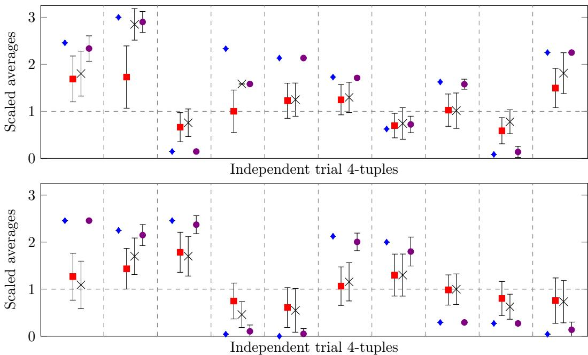  
Figure 9: Results including either only gate based noise or only time based noise rates for a $4 \times 5$ ion trap grid. The results referenced by this plot are the probability of measuring a randomly chosen output string, where each trial has a different initial 2D-DQS circuit, and different output string. Every independent trial is described by a 4-tuple of a perfect run (no noise) (blue diamond), the mean of 20 noisy runs (red square), the mean of 20 only time-based rates noisy runs (grey cross) and the mean of 20 only gate rates noisy runs (violet circle). The error bars show one standard deviation. The means and standard deviations have been normalised by the respective uniform distribution (dotted horizontal line).

Below the reader can see values for a proxy for the $\ell _ { 1 }$ -norm distance between the ideal and noisy distributions for the noise levels discussed above, calculated as follows. Here a trial consists of an ideal run, measuring the probability of a random output of a random 2D-DQS circuit of the form discussed in Section 3.1.4, and 20 noisy runs for each noise type, considering noisy versions of the ideal circuit. The average difference between the noisy and ideal runs within each trial are themselves averaged to give a proxy for the $\ell _ { 1 }$ -norm distance, once scaled by the uniform distribution. Each run is itself the average of 20 simulations of the same circuit.

A similar pattern is seen in this data as was identified in the study of single outputs; namely that the largest contribution to the deviation of the noisy distribution from the ideal is a result of the time based noise.

<table><tr><td rowspan=1 colspan=1>full noise levels</td><td rowspan=1 colspan=1>only time base noise</td><td rowspan=1 colspan=1>only gate based noise</td></tr><tr><td rowspan=1 colspan=1>0.286316488</td><td rowspan=1 colspan=1>0.276119941</td><td rowspan=1 colspan=1>0.033008605</td></tr></table>

As discussed in Section 4 our analysis of both far from uniform outputs and the $\ell _ { 1 }$ -norm distance lead us to regard a system with reduced time-based noise as relatively more likely to demonstrate quantum advantage than a system with reduced gate-based noise. In this case, removing the time based noise results in a value below the $\textstyle { \frac { 1 } { 2 2 } }$ specified in Theorem 3.4 suggesting that a demonstration of quantum-advantage may be possible here. However, we hope to identify the main source of error more precisely, and as such we continue to explore the reduction of time-based noise.

# 4.3.2 Depolarising Verses Dephasing Noise

We now look more closely at the time-based noise and consider separately the contribution from dephasing noise and from depolarising noise. The results for outputs with far from uniform probability in the ideal output distribution are seen in Figure 10.

In this case, the amplitudes produced by runs considering only dephasing noise are always either within one standard deviation of the uniform distribution, or greater than one standard deviation from the perfect run. By comparison the runs considering only depolarising errors are always within one standard deviation of the the perfect run, and greater than one standard deviation from the uniform distribution output.

Below the reader will again find the same proxy for the $\ell _ { 1 }$ -norm distance between the ideal and noisy distributions as discussed in Section 4.3.1, but for the noise levels considered in this section. A similar pattern is seen in this data as was identified when considering the accuracy and far from uniformity figure of merit above; namely that the largest contribution to the deviation of the noisy distribution from the ideal is a result of the dephasing noise.

<table><tr><td rowspan=1 colspan=1>full noise levels</td><td rowspan=1 colspan=1>only depolarising noise</td><td rowspan=1 colspan=1>only dephasing noise</td></tr><tr><td rowspan=1 colspan=1>0.433746955</td><td rowspan=1 colspan=1>0.111777366</td><td rowspan=1 colspan=1>0.4555678</td></tr></table>

As as a result of the analysis of these two figures of merit, we identify dephasing error as a relatively larger obstacle to a demonstration of quantum-advantage than depolarising noise.

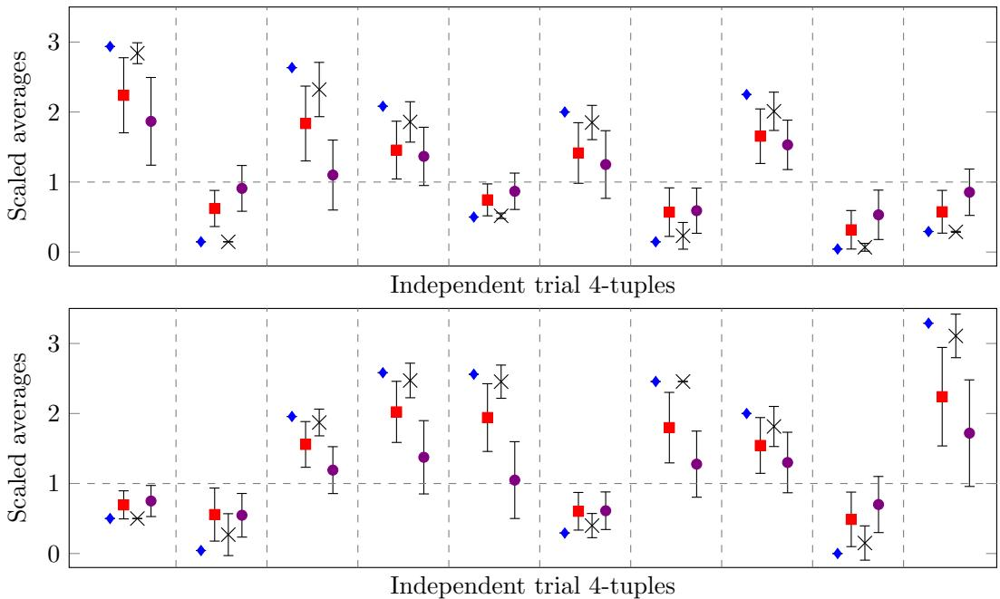  
Figure 10: Results including either only dephasing or only depolarising noise rates for a $4 \times 5$ ion trap grid. The results referenced by this plot are the probability of measuring a randomly chosen output string, where each trial has a different initial 2D-DQS circuit, and different output string. Every independent trial is described by a 4-tuple of a perfect run (no noise) (blue diamond), the mean of 20 noisy runs (red square), the mean of 20 only depolarising rates noisy runs (grey cross) and the mean of 20 only dephasing rates noisy runs (violet circle). The error bars show one standard deviation. The means and standard deviations have been normalised by the respective uniform distribution (dotted horizontal line).

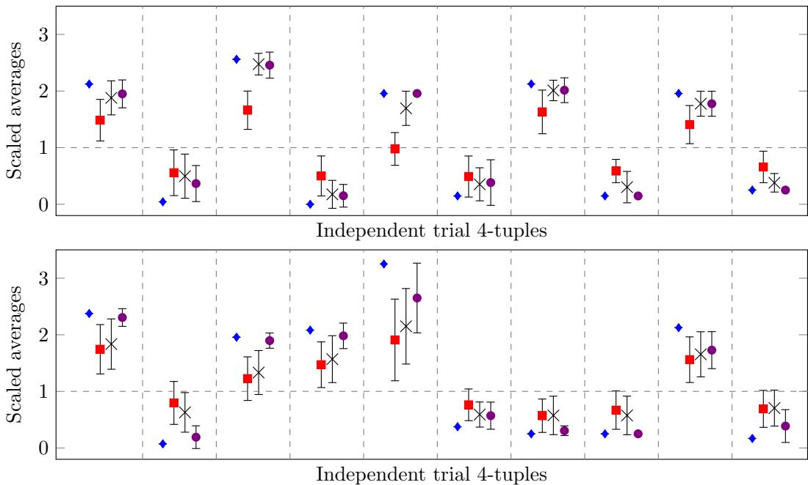  
Figure 11: Results including reduced dephasing noise rates for a $4 \times 5$ ion trap grid. The results referenced by this plot are the probability of measuring a randomly chosen output string, where each trial has a different initial 2D-DQS circuit, and different output string. Every independent trial is described by a 4-tuple of a perfect run (no noise) (blue diamond), the mean of 20 noisy runs (red square), the mean of 20 dephasing rates reduced by repetition code noisy runs (grey cross) and the mean of 20 no dephasing rates noisy runs (violet circle). The error bars show one standard deviation while. The means and standard deviations have been normalised by the respective uniform distribution (dotted horizontal line).

# 4.3.3 The Impact of Noise Reduction by Error Correction

Having identified the main obstacle to a demonstration of quantum-advantage to be dephasing errors, we examine the effect that reducing this type of noise would have. Concretely, one could introduce a phase-flip code1 [108]. Recall that in the numerical experiments of Section 4.1, we only used a single qubit from each ion-trap. This means that we could use three qubits from the ion-trap to implement one round of phase-flip code, which would reduce the dephasing noise. By using such a simple phase-flip code we obtained an effective improved dephasing rate of $\approx 2 . 3 \times 1 0 ^ { - 4 }$ per second from the one of NQIT noise-level $\approx 7 . 2 \times 1 0 ^ { - 3 }$ per second. The results for outputs with far from uniform probabilities are found in Figure 11.

In this case, roughly half of the runs considering the error corrected dephasing pass our test that the probabilities should be at least within one standard deviation of the perfect run, and greater than one standard deviation of the uniform distribution. This demonstrates partial improvement while being inconclusive as a demonstration of the potential for quantum advantage. In this case an analysis of the $\ell _ { 1 }$ -norm distance is particularly valuable.

The readers will find the data required for such an analysis below. In this case, as in the case of the previous figure of merit, a large improvement can be achieved by utilising a simple repetition code. However this improvement might not be as significant as one might expect having seen the results of Figure 11 with the $\ell _ { 1 }$ -norm distance still being significantly far from the $\textstyle { \frac { 1 } { 2 2 } }$ value required by Theorem 3.4. Indeed even without dephasing noise the $\ell _ { 1 }$ -norm distance its too high to expect a demonstration of quantum-advantage. As such we expect both improved error correction codes and error correction applied to other noise channels are required for a demonstration of quantum-advantage.

<table><tr><td rowspan=1 colspan=1>full noise levels</td><td rowspan=1 colspan=1>with repetition code</td><td rowspan=1 colspan=1>without dephasing noise</td></tr><tr><td rowspan=1 colspan=1>0.321564704</td><td rowspan=1 colspan=1>0.270893212</td><td rowspan=1 colspan=1>0.0656717</td></tr></table>

This is a partial improvement relative to the uncorrected results, and so we find a demonstration of quantum-advantage using this error correction scheme as more likely than in the uncorrected case. However, further improvements are required for such a demonstration.

# 4.3.4 The Impact of Continuous Noise Reduction

More generally than testing a single error correction code, we can understand how the likelihood of a demonstration of quantum-advantage is affected with a continuously varying noise parameter. Here we will consider dephasing errors, which we have identified as the most damaging form of error. This continuous variation corresponds to, for example, reductions in the gate application time, improvements in the compilation methods or the improved storage of quantum states. The results of this experiment are shown in Figure 12.

While Figure 12 appears to demonstrate the continuous improvement which can be achieved by reducing the dephasing error, it seems that it cannot be said that the amplitudes are regularly within one standard deviation of the perfect run until the dephasing rate is reduced to 0. We do however see that, with regards to our accurate and far from uniform condition, a demonstration of quantum supremacy does become continuously more likely as the dephasing error rate is reduced.

This fact is reinforced by Figure 13 which shows the average difference between the perfect and noisy runs for each of the values of dephasing error rate. We can use this as a proxy measure for the $\ell _ { 1 }$ -norm distance, as discussed in the experimental design methodology introduced in Section 4, and as was done earlier in Section 4.3. In this case we can say that an experiment has a reasonable chance of demonstrating quantum-advantage if we can be convinced that the $\ell _ { 1 }$ -norm distance between the noisy and perfect implementations is bounded by $\textstyle { \frac { 1 } { 2 2 } }$ which is demanded by the hardness result for the 2D-DQS algorithm as seen in Theorem 3.4. As we do not have access to the full characterisation of the probability distributions, here we will approximate the $\ell _ { 1 }$ -norm distance by taking the average difference and proposing that it is representative of the full distribution by scaling it by the uniform distribution.

We see that even in the case of 0 dephasing error, the $\ell _ { 1 }$ -norm distance is not brought within the $\textstyle { \frac { 1 } { 2 2 } }$ value. Instead The average difference in that case is approximately 0.155 which is significantly higher. However, by our figure of merit, a demonstration of quantumadvantage is made continuously more likely by this fall in dephasing error, showing the advantage in endeavouring to achieve such a fall.

An alternate proxy measure for the $\ell _ { 1 }$ -norm distance is to explore the differences between the noisy and perfect amplitudes for a selection of different output bit strings of the same circuit. In Figure 14, every trial considers the same 2D-DQS circuit, but measures the probability amplitude of a different output bit string.

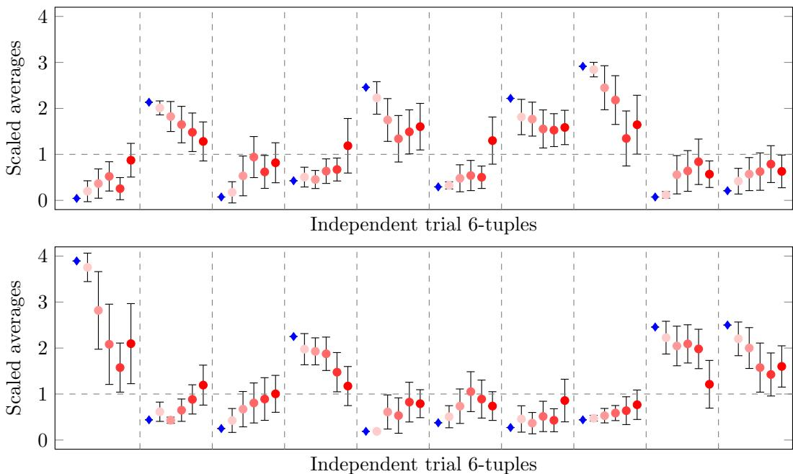  
Figure 12: Results including reduced dephasing noise rates for a $4 \times 5$ ion trap grid. The results referenced by this plot are the probability of measuring a randomly chosen output string, where each trial has a different initial 2D-DQS circuit, and different output string. Every independent trial is described by a 6-tuple, from left to right, of a perfect run (no noise) (blue diamond), the mean of 20 noisy runs with no dephasing errors, the mean of 20 noisy runs with $\textstyle { \frac { 1 } { 4 } }$ of the NQIT dephasing rate, the mean of 20 noisy runs with $\textstyle { \frac { 1 } { 2 } }$ of the NQIT dephasing rate, the mean of 20 noisy runs with $\frac { 3 } { 4 }$ of the NQIT dephasing rate, the mean of 20 noisy runs with the NQIT dephasing rate. The error bars show one standard deviation. The means and standard deviations have been normalised by the respective uniform distribution (dotted horizontal line).

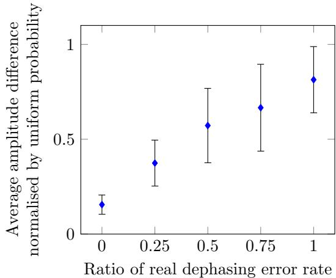  
Figure 13: Results for varying dephasing noise rates for a $4 \times 5$ ion trap grid. The results referenced by this plot are the difference between the probability amplitudes in noisy and perfect runs when measuring a randomly chosen output string of a random 2D-DQS circuit. The error bars show one standard deviation. The means and standard deviations have been normalised by the uniform distribution.

Once again, this plot can be examined further by directly studying the average difference between the noisy and perfect runs. This proxy measure for the $\ell _ { 1 }$ -norm distance is plotted in Figure 15 but once again the value of 0.135 is more than twice the $\textstyle { \frac { 1 } { 2 2 } }$ which is demanded by the hardness result for the 2D-DQS algorithm as seen in Theorem 3.4.

In conclusion, while it seems that reducing dephasing error alone will not be enough to bring a demonstration of quantum-advantage using this scheme within reach, we have seen that utilising a simple 3 qubit correction code would result in a significant improvement on the noise levels. As such we recommend that this error correction technique is used in conjunction with other techniques, correcting for other error types.

We expect, however, that as the system size grows the $\ell _ { 1 }$ -norm distance between the perfect and noisy circuits will grow as the noise modelled is constant for each gate and qubit. This would push a demonstration of quantum-advantage further away, which is consistent with the theoretical results in [35]. There the authors demonstrate that samples can be efficiently drawn by a classical computer from a distribution produced by an IQP circuits subject to independent depolarising noise on each qubit at the end of the circuit. In that case, however, they show that error correction can be used to recover classical impossibility, if one allows for more complex connectivity, or several rounds of swap gates. While we have restricted the connectivity and circuit depth in our case, there may be gains to be made by removing these restrictions.

# 5 Discussion

We have examined classical simulation of small instances of realistic quantum-advantage computations. The motivation is not to obtain solutions to the problems considered, but to faithfully model the physical system and computation device.

Having achieved a faithful modelling of the system, classical simulations can be used as a tool in two ways. Firstly, we can use them to benchmark a given device by confirming that the effect of the modelled noise scales correctly. Then, if instances increase in size and continue to match outcomes of real experiments, we extrapolate that the same is true for the, non classically simulatable, quantum-advantage regime.

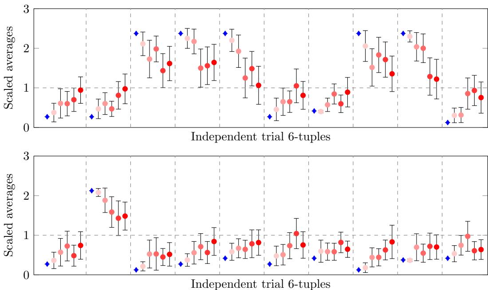  
Figure 14: Results including reduced dephasing noise rates for a $4 \times 5$ ion trap grid. The results referenced by this plot are the probability of measuring a randomly chosen output string, where each trial has the same initial 2D-DQS circuit, and different output string. Every independent trial is described by a 6-tuple, from left to right, of a perfect run (no noise) (blue diamond), the mean of 20 noisy runs with no dephasing errors, the mean of 20 noisy runs with $\textstyle { \frac { 1 } { 4 } }$ of the NQIT dephasing rate, the mean of 20 noisy runs with $\textstyle { \frac { 1 } { 2 } }$ of the NQIT dephasing rate, the mean of 20 noisy runs with $\textstyle { \frac { 3 } { 4 } }$ of the NQIT dephasing rate, the mean of 20 noisy runs with the NQIT dephasing rate. The error bars show one standard deviation while. The means and standard deviations have been normalised by the respective uniform distribution (dotted horizontal line).

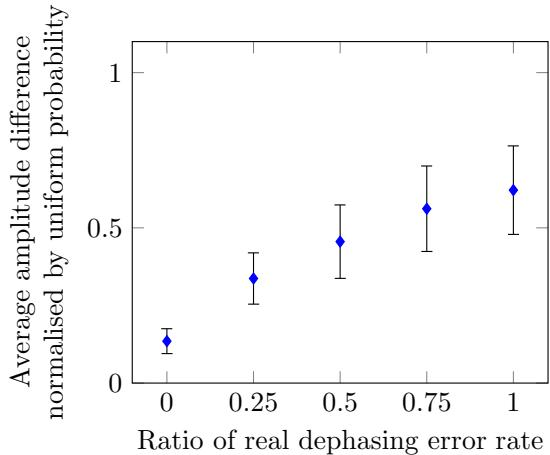  
Figure 15: Results for varying dephasing noise rates for a $4 \times 5$ ion trap grid. The results referenced by this plot are the difference between the probability amplitudes in noisy and perfect runs when measuring a randomly chosen output string from a single 2D-DQS circuit. The error bars show one standard deviation. The means and standard deviations have been normalised by the uniform distribution.

The second use is to examine the impact of varying the noise and other constraints and imperfections. By doing so one can identify which limitations contribute most to the degradation of the results, compared to the perfect case. We can then provide feedback to experimentalists as to which aspects of their system they should prioritise in improving, in order to achieve the best results in the specific problem considered.

We gave a methodology for using classical simulations in the way described above, and exemplified this methodology with two examples, without performing exhaustive explorations of either. In both cases, we considered IQP problems, one of the prominent candidates for demonstrating quantum-advantage. The constraints we imposed were those from the NQIT Q20:20 device [1, 2], while the classical simulator used was the one developed by Bravyi and Gosset in [3].

The first example used was a subclass of IQP instances, called the 2D-DQS problem and defined in [5], with the main focus being the effect of noise. While current NQIT levels of noise are too high, by using our technique we identified that dephasing noise is the most significant source of errors. This led us to a potential solution to improve such computations, namely to use a small phase-flip code to protect from precisely this type of errors, which we showed provided improvements. We also showed that a continuous improvement in the likelihood of a demonstration of quantum-advantage can be achieved by a continuous improvement in the dephasing noise levels. However, we also showed that correcting dephasing error alone would not be sufficient to demonstrate a quantum-advantage using the 2D-DQS protocol on NQIT hardware.

In the second example, we considered a generic IQP-MBQC problem with constraints coming, this time, from architectural limitations. This example was to illustrate how to model different architectures in our framework. We noticed that the current level of noise of NQIT was even more destructive than in the first example.

We give several directions for future research, both specific to the examples considered and more general involving the methodology developed. In Section 4 we provide a tool for benchmarking the Q20:20, but to do such benchmarking, one needs to run these examples on the NQIT Q20:20 and compare with the modelling we obtained. This is naturally the first next step complementing our work. A second direction is to derive theoretical prediction for the effect of noise on our examples, for our problems and with our constraints. This continues the work of Bremner et al [35] and lets us consider what is required to achieve a demonstration of quantum-advantage.

We should use the methodology developed for using classical simulations in the quantumadvantage problem, in different physical systems and for different problems. For example, it may be beneficial to run though the same benchmarking and prediction process for more general gate and state preparation fidelity estimations [109, 110]. Moreover, the use of these simulations as a tool for guiding future experiments should be made more systematic. In Section 4.3 we varied the noise starting from coarser grouping of the noise-sources and going to a ‘finer-graining’ in order to identifying the major source of errors. We recommend modelling the reduction of a mixture different noise sources as we have shown that removing only one, namely dephasing, would not be sufficient. This could also be enhanced with other techniques, which may also vary the architecture. We envision, that one could use machinelearning techniques to identify, for a given system and problem, the settings that provide the best results with small (to be quantified) improvements.

Acknowledgements: We are grateful to Niel de Beaudrap for sharing with us their initial work on the effectiveness of small error correcting codes for NQIT device and the details of Q20:20 noise model [2]. D.M. would also like to thank the Atos quantum computing R&D team of Les Clayes-sous-Bois, Paris, for a bountiful supply of expertise in classical simulation of quantum computers. The authors would also like to thank the anonymous reviewers of this work who, though their suggestions, contributed significantly. This work was supported by EPSRC grants EP/N003829/1 and EP/M013243/1, and EP/L01503X/1 for the University of Edinburgh, School of Informatics, Centre for Doctoral Training in Pervasive Parallelism.

# Bibliography

[1] Networked quantum information technologies hub, 2018. URL https://nqit.ox.ac.uk/.   
[2] Private communication, 2016. The error model was based on communication with Chris Balance and Tom Harty, mediated through Niel de Beaudrap, early on the NQIT project. Continued collaboration and communication with experimentalists could lead in refinement of the error model, which could be subject for future work.   
[3] Sergey Bravyi and David Gosset. Improved classical simulation of quantum circuits dominated by clifford gates. Phys. Rev. Lett., 116:250501, Jun 2016. doi:10.1103/PhysRevLett.116.250501. URL https://link.aps.org/doi/10.1103/PhysRevLett.116.250501.   
[4] Dan J. Shepherd and Michael J. Bremner. Temporally unstructured quantum computation. Proceedings of the Royal Society A: Mathematical, Physical and Engineering Sciences, 465(2105):1413–1439, 2009. ISSN 1364-5021. doi:10.1098/rspa.2008.0443. URL https://royalsocietypublishing.org/doi/abs/10.1098/rspa.2008.0443.   
[5] Juan Bermejo-Vega, Dominik Hangleiter, Martin Schwarz, Robert Raussendorf, and Jens Eisert. Architectures for quantum simulation showing a quantum speedup. Phys. Rev. X, 8:021010, Apr 2018. doi:10.1103/PhysRevX.8.021010. URL https://link.aps.org/doi/10.1103/PhysRevX.8.021010.   
[6] Ashley Montanaro. Quantum algorithms: an overview. npj Quantum Information, 2(1):15023, 2016. ISSN 2056-6387. doi:10.1038/npjqi.2015.23. URL https://doi.org/10.1038/npjqi.2015.23.   
[7] John Preskill. Quantum Computing in the NISQ era and beyond. Quantum, 2:79, August 2018. ISSN 2521-327X. doi:10.22331/q-2018-08-06-79. URL https://doi.org/10.22331/q-2018-08-06-79.   
[8] Frank Arute, Kunal Arya, Ryan Babbush, Dave Bacon, Joseph C. Bardin, Rami Barends, Rupak Biswas, Sergio Boixo, Fernando G. S. L. Brandao, David A. Buell, Brian Burkett, Yu Chen, Zijun Chen, Ben Chiaro, Roberto Collins, William Courtney, Andrew Dunsworth, Edward Farhi, Brooks Foxen, Austin Fowler, Craig Gidney, Marissa Giustina, Rob Graff, Keith Guerin, Steve Habegger, Matthew P. Harrigan, Michael J. Hartmann, Alan Ho, Markus Hoffmann, Trent Huang, Travis S. Humble, Sergei V. Isakov, Evan Jeffrey, Zhang Jiang, Dvir Kafri, Kostyantyn Kechedzhi, Julian Kelly, Paul V. Klimov, Sergey Knysh, Alexander Korotkov, Fedor Kostritsa, David Landhuis, Mike Lindmark, Erik Lucero, Dmitry Lyakh, Salvatore Mandr\`a, Jarrod R. McClean, Matthew McEwen, Anthony Megrant, Xiao Mi, Kristel Michielsen, Masoud Mohseni, Josh Mutus, Ofer Naaman, Matthew Neeley, Charles Neill, Murphy Yuezhen Niu, Eric Ostby, Andre Petukhov, John C. Platt, Chris Quintana, Eleanor G. Rieffel, Pedram Roushan, Nicholas C. Rubin, Daniel Sank, Kevin J. Satzinger, Vadim Smelyanskiy, Kevin J. Sung, Matthew D. Trevithick, Amit Vainsencher, Benjamin Villalonga, Theodore White, Z. Jamie Yao, Ping Yeh, Adam Zalcman, Hartmut Neven, and John M. Martinis. Quantum supremacy using a programmable superconducting processor. Nature, 574 (7779):505–510, 2019. ISSN 1476-4687. doi:10.1038/s41586-019-1666-5. URL https://doi.org/10.1038/s41586-019-1666-5.

[9] Steve Flammia. Quantum advantage. http://dabacon.org/pontiff/, April 2017.

[10] Will Zeng. Clarifying quantum supremacy: better terms for milestones in quantum computation. https://medium.com/@wjzeng/clarifying-quantum-supremacy-better-terms-for-milestones-in-January 2019.

[11] Aram W. Harrow and Ashley Montanaro. Quantum computational supremacy. Nature, 549:203, Sep 2017. URL https://doi.org/10.1038/nature23458.

[12] John Preskill. Quantum computing and the entanglement frontier. arXiv preprint arXiv:1203.5813, 2012. URL https://arxiv.org/abs/1203.5813.

[13] Alexandru Gheorghiu, Theodoros Kapourniotis, and Elham Kashefi. Verification of quantum computation: An overview of existing approaches. Theory of Computing Systems, Jul 2018. ISSN 1433-0490. doi:10.1007/s00224-018-9872-3. URL https://doi.org/10.1007/s00224-018-9872-3.   
[14] Joseph F. Fitzsimons. Private quantum computation: an introduction to blind quantum computing and related protocols. npj Quantum Information, 3(1):23, 2017. ISSN 2056-6387. doi:10.1038/s41534-017-0025-3. URL https://doi.org/10.1038/s41534-017-0025-3.   
[15] Anne Broadbent. How to verify a quantum computation. Theory of Computing, 14(11):1–37, 2018. doi:10.4086/toc.2018.v014a011. URL http://www.theoryofcomputing.org/articles/v014a011.   
[16] Joseph F. Fitzsimons and Elham Kashefi. Unconditionally verifiable blind quantum computation. Phys. Rev. A, 96:012303, Jul 2017. doi:10.1103/PhysRevA.96.012303. URL https://link.aps.org/doi/10.1103/PhysRevA.96.012303.   
[17] Joseph F. Fitzsimons, Michal Hajduˇsek, and Tomoyuki Morimae. Post hoc verification of quantum computation. Phys. Rev. Lett., 120:040501, Jan 2018. doi:10.1103/PhysRevLett.120.040501. URL https://link.aps.org/doi/10.1103/PhysRevLett.120.040501.   
[18] Dorit Aharonov, Michael Ben-Or, Elad Eban, and Urmila Mahadev. Interactive proofs for quantum computations. arXiv preprint arXiv:1704.04487, 2017. URL https://arxiv.org/abs/1704.04487.   
[19] Ben W. Reichardt, Falk Unger, and Umesh Vazirani. A classical leash for a quantum system: Command of quantum systems via rigidity of chsh games. In Proceedings of the 4th Conference on Innovations in Theoretical Computer Science, ITCS ’13, pages 321–322, New York, NY, USA, 2013. ACM. ISBN 978-1-4503-1859-4. doi:10.1145/2422436.2422473. URL http://doi.acm.org/10.1145/2422436.2422473.   
[20] Alexandru Gheorghiu, Elham Kashefi, and Petros Wallden. Robustness and device independence of verifiable blind quantum computing. New Journal of Physics, 17(8):083040, aug 2015. doi:10.1088/1367-2630/17/8/083040. URL https://doi.org/10.1088%2F1367-2630%2F17%2F8%2F083040.   
[21] U. Mahadev. Classical verification of quantum computations. In 2018 IEEE 59th Annual Symposium on Foundations of Computer Science (FOCS), pages 259–267, Oct 2018. doi:10.1109/FOCS.2018.00033. URL https://doi.org/10.1109/FOCS.2018.00033.   
[22] Alexandru Cojocaru, L´eo Colisson, Elham Kashefi, and Petros Wallden. On the possibility of classical client blind quantum computing. arXiv preprint arXiv:1802.08759, 2018. URL https://arxiv.org/abs/1802.08759v2.   
[23] Sergio Boixo, Sergei V. Isakov, Vadim N. Smelyanskiy, Ryan Babbush, Nan Ding, Zhang Jiang, Michael J. Bremner, John M. Martinis, and Hartmut Neven. Characterizing quantum supremacy in near-term devices. Nature Physics, 14 (6):595–600, 2018. ISSN 1745-2481. doi:10.1038/s41567-018-0124-x. URL https://doi.org/10.1038/s41567-018-0124-x.   
[24] Alex Neville, Chris Sparrow, Rapha¨el Clifford, Eric Johnston, Patrick M. Birchall, Ashley Montanaro, and Anthony Laing. Classical boson sampling algorithms with superior performance to near-term experiments. Nature Physics, 13:1153 EP –, Oct 2017. doi:10.1038/nphys4270. URL https://doi.org/10.1038/nphys4270.   
[25] Edwin Pednault, John A Gunnels, Giacomo Nannicini, Lior Horesh, Thomas Magerlein, Edgar Solomonik, Erik W Draeger, Eric T Holland, and Robert Wisnieff. Breaking the 49-qubit barrier in the simulation of quantum circuits. arXiv preprint arXiv:1710.05867, 2017. URL https://arxiv.org/abs/1710.05867.   
[26] Peter Clifford and Rapha¨el Clifford. The classical complexity of boson sampling. In Proceedings of the Twenty-Ninth Annual ACM-SIAM Symposium on Discrete Algorithms, SODA ’18, pages 146–155, Philadelphia, PA, USA, 2018. Society for Industrial and Applied Mathematics. ISBN 978-1-6119-7503-1. doi:10.1137/1.9781611975031.10. URL https://epubs.siam.org/doi/abs/10.1137/1.9781611975031.10.   
[27] Jianxin Chen, Fang Zhang, Cupjin Huang, Michael Newman, and Yaoyun Shi. Classical simulation of intermediate-size quantum circuits. arXiv preprint arXiv:1805.01450, 2018. URL https://arxiv.org/abs/1805.01450.   
[28] G. G. Guerreschi and A. Y. Matsuura. Qaoa for max-cut requires hundreds of qubits for quantum speed-up. Scientific Reports, 9(1): 6903, 2019. ISSN 2045-2322. doi:10.1038/s41598-019-43176-9. URL https://doi.org/10.1038/s41598-019-43176-9.   
[29] Igor L Markov, Aneeqa Fatima, Sergei V Isakov, and Sergio Boixo. Quantum supremacy is both closer and farther than it appears. arXiv preprint arXiv:1807.10749, 2018. URL https://arxiv.org/abs/1807.10749.   
[30] Benjamin Villalonga, Dmitry Lyakh, Sergio Boixo, Hartmut Neven, Travis S Humble, Rupak Biswas, Eleanor G Rieffel, Alan Ho, and Salvatore Mandr\`a. Establishing the quantum supremacy frontier with a 281 pflop/s simulation. arXiv preprint arXiv:1905.00444, 2019. URL https://arxiv.org/abs/1905.00444.   
[31] Edwin Pednault, John A. Gunnels, Giacomo Nannicini, Lior Horesh, and Robert Wisnieff. Leveraging secondary storage to simulate deep 54-qubit sycamore circuits, 2019. URL https://arxiv.org/abs/1910.09534.   
[32] John Preskill. Reliable quantum computers. Proceedings of the Royal Society of London A: Mathematical, Physical and Engineering Sciences, 454 (1969):385–410, 1998. ISSN 1364-5021. doi:10.1098/rspa.1998.0167. URL http://rspa.royalsocietypublishing.org/content/454/1969/385.   
[33] Barbara M. Terhal. Quantum error correction for quantum memories. Rev. Mod. Phys., 87:307–346, Apr 2015. doi:10.1103/RevModPhys.87.307. URL https://link.aps.org/doi/10.1103/RevModPhys.87.307.   
[34] Earl T. Campbell, Barbara M. Terhal, and Christophe Vuillot. Roads towards faulttolerant universal quantum computation. Nature, 549:172, Sep 2017. doi:10.1038/nature23460. URL https://doi.org/10.1038/nature23460.   
[35] Michael J. Bremner, Ashley Montanaro, and Dan J. Shepherd. Achieving quantum supremacy with sparse and noisy commuting quantum computations. Quantum, 1:8, April 2017. ISSN 2521-327X. doi:10.22331/q-2017-04-25-8. URL https://doi.org/10.22331/q-2017-04-25-8.   
[36] E. Knill, D. Leibfried, R. Reichle, J. Britton, R. B. Blakestad, J. D. Jost, C. Langer, R. Ozeri, S. Seidelin, and D. J. Wineland. Randomized benchmarking of quantum gates. Phys. Rev. A, 77:012307, Jan 2008. doi:10.1103/PhysRevA.77.012307. URL https://link.aps.org/doi/10.1103/PhysRevA.77.012307.   
[37] K¨ubra Yeter-Aydeniz, Eugene F. Dumitrescu, Alex J. McCaskey, Ryan S. Bennink, Raphael C. Pooser, and George Siopsis. Scalar quantum field theories as a benchmark for near-term quantum computers. Phys. Rev. A, 99:032306, Mar 2019. doi:10.1103/PhysRevA.99.032306. URL https://link.aps.org/doi/10.1103/PhysRevA.99.032306.   
[38] Alexander J. McCaskey, Zachary P. Parks, Jacek Jakowski, Shirley V. Moore, T. Morris, Travis S. Humble, and Raphael C. Pooser. Quantum chemistry as a benchmark for near-term quantum computers. arXiv preprint 1905.01534, 2019. URL https://arxiv.org/abs/1905.01534.   
[39] Alba Cervera-Lierta, Jos´e Ignacio Latorre, and Dardo Goyeneche. Quantum circuits for maximally entangled states. Phys. Rev. A, 100:022342, Aug 2019. doi:10.1103/PhysRevA.100.022342. URL https://link.aps.org/doi/10.1103/PhysRevA.100.022342.   
[40] Scott Aaronson and Lijie Chen. Complexity-Theoretic Foundations of Quantum Supremacy Experiments. In Ryan O’Donnell, editor, 32nd Computational Complexity Conference (CCC 2017), volume 79 of Leibniz International Proceedings in Informatics (LIPIcs), pages 22:1–22:67, Dagstuhl, Germany, 2017. Schloss Dagstuhl–Leibniz-Zentrum fuer Informatik. ISBN 978-3-95977-040-8. doi:10.4230/LIPIcs.CCC.2017.22. URL http://drops.dagstuhl.de/opus/volltexte/2017/7527.   
[41] Andrew W. Cross, Lev S. Bishop, Sarah Sheldon, Paul D. Nation, and Jay M. Gambetta. Validating quantum computers using randomized model circuits. Phys. Rev. A, 100:032328, Sep 2019. doi:10.1103/PhysRevA.100.032328. URL https://link.aps.org/doi/10.1103/PhysRevA.100.032328.   
[42] Daniel James Shepherd. Quantum complexity: restrictions on algorithms and architectures. arXiv preprint arXiv:1005.1425, 2010. URL https://arxiv.org/abs/1005.1425.   
[43] E. Knill and R. Laflamme. Power of one bit of quantum information. Phys. Rev. Lett., 81:5672–5675, Dec 1998. doi:10.1103/PhysRevLett.81.5672. URL https://link.aps.org/doi/10.1103/PhysRevLett.81.5672.   
[44] Tomoyuki Morimae, Keisuke Fujii, and Joseph F. Fitzsimons. Hardness of classically simulating the one-clean-qubit model. Phys. Rev. Lett., 112:130502, Apr 2014. doi:10.1103/PhysRevLett.112.130502. URL https://link.aps.org/doi/10.1103/PhysRevLett.112.130502.   
[45] Scott Aaronson and Alex Arkhipov. The computational complexity of linear optics. In Proceedings of the Forty-third Annual ACM Symposium on Theory of Computing, STOC ’11, pages 333–342, New York, NY, USA, 2011. ACM. ISBN 978-1-4503-0691-1. doi:10.1145/1993636.1993682. URL http://doi.acm.org/10.1145/1993636.1993682.   
[46] Bryan T. Gard, Keith R. Motes, Jonathan P. Olson, Peter P. Rohde, and Jonathan P. Dowling. An Introduction to Boson-Sampling. WORLD SCIENTIFIC, 2015. doi:10.1142/9789814678704 0008. URL http://www.worldscientific.com/doi/abs/10.1142/9789814678704_0008.   
[47] Scott Aaronson and Alex Arkhipov. Bosonsampling is far from uniform. Quantum Info. Comput., 14(15-16):1383–1423, November 2014. ISSN 1533-7146. URL http://dl.acm.org/citation.cfm?id=2685179.2685186.   
[48] Xun Gao, Sheng-Tao Wang, and L.-M. Duan. Quantum supremacy for simulating a translation-invariant ising spin model. Phys. Rev. Lett., 118:040502, Jan 2017. doi:10.1103/PhysRevLett.118.040502. URL https://link.aps.org/doi/10.1103/PhysRevLett.118.040502.   
[49] M. Van den Nest, W. D¨ur, and H. J. Briegel. Completeness of the classical 2d ising model and universal quantum computation. Phys. Rev. Lett., 100:110501, Mar 2008. doi:10.1103/PhysRevLett.100.110501. URL https://link.aps.org/doi/10.1103/PhysRevLett.100.110501.   
[50] Alexander M. Dalzell, Aram W. Harrow, Dax Enshan Koh, and Rolando L. La Placa. How many qubits are needed for quantum computational supremacy? arXiv:1805.05224, 2018. URL https://arxiv.org/abs/1805.05224.   
[51] Michael J. Bremner, Richard Jozsa, and Dan J. Shepherd. Classical simulation of commuting quantum computations implies collapse of the polynomial hierarchy. Proceedings of the Royal Society of London A: Mathematical, Physical and Engineering Sciences, 467(2126):459–472, 2011. ISSN 1364-5021. doi:10.1098/rspa.2010.0301. URL http://rspa.royalsocietypublishing.org/content/467/2126/459.   
[52] Michael J. Bremner, Ashley Montanaro, and Dan J. Shepherd. Average-case complexity versus approximate simulation of commuting quantum computations. Phys. Rev. Lett., 117:080501, Aug 2016. doi:10.1103/PhysRevLett.117.080501. URL https://link.aps.org/doi/10.1103/PhysRevLett.117.080501.   
[53] Matty J. Hoban, Joel J. Wallman, Hussain Anwar, Na¨ıri Usher, Robert Raussendorf, and Dan E. Browne. Measurement-based classical computation. Phys. Rev. Lett., 112:140505, Apr 2014. doi:10.1103/PhysRevLett.112.140505. URL https://link.aps.org/doi/10.1103/PhysRevLett.112.140505.   
[54] Keisuke Fujii and Shuhei Tamate. Computational quantum-classical boundary of noisy commuting quantum circuits. Scientific reports, 6:25598, 2016. doi:10.1038/srep25598. URL http://dx.doi.org/10.1038/srep25598.   
[55] Daniel Mills, Anna Pappa, Theodoros Kapourniotis, and Elham Kashefi. In-

formation theoretically secure hypothesis test for temporally unstructured quantum computation. In Proceedings 14th International Conference on Quantum Physics and Logic, Nijmegen, The Netherlands, 3-7 July 2017, volume 266 of Electronic Proceedings in Theoretical Computer Science, pages 209– 221. Open Publishing Association, 2018. doi:10.4204/EPTCS.266.14. URL https://arxiv.org/ct?url=https%3A%2F%2Fdx.doi.org%2F10.4204%2FEPTCS.266.14&v $=$ 3028594f.

[56] D Hangleiter, M Kliesch, M Schwarz, and J Eisert. Direct certification of a class of quantum simulations. Quantum Science and Technology, 2(1):015004, feb 2017. doi:10.1088/2058-9565/2/1/015004. URL https://doi.org/10.1088%2F2058-9565%2F2%2F1%2F015004.   
[57] Larry J. Stockmeyer. The polynomial-time hierarchy. Theoretical Computer Science, 3 (1):1 – 22, 1976. ISSN 0304-3975. doi:https://doi.org/10.1016/0304-3975(76)90061-X. URL http://www.sciencedirect.com/science/article/pii/030439757690061X.   
[58] Annual report 2016 - uk national quantum technologies programme, 2016. URL http://nqit.ox.ac.uk/content/nqit-annual-report-2016.   
[59] E. A. Sete, W. J. Zeng, and C. T. Rigetti. A functional architecture for scalable quantum computing. In 2016 IEEE International Conference on Rebooting Computing (ICRC), pages 1–6, Oct 2016. doi:10.1109/ICRC.2016.7738703. URL https://doi.org/10.1109/ICRC.2016.7738703.   
[60] Robert Beals, Stephen Brierley, Oliver Gray, Aram W. Harrow, Samuel Kutin, Noah Linden, Dan Shepherd, and Mark Stather. Efficient distributed quantum computing. Proceedings of the Royal Society of London A: Mathematical, Physical and Engineering Sciences, 469(2153), 2013. ISSN 1364-5021. doi:10.1098/rspa.2012.0686. URL http://rspa.royalsocietypublishing.org/content/469/2153/20120686.   
[61] Steven Herbert and Akash Sengupta. Using reinforcement learning to find efficient qubit routing policies for deployment in near-term quantum computers. arXiv preprint arXiv:1812.11619, 2018. URL https://arxiv.org/abs/1812.11619.   
[62] Alexander Cowtan, Silas Dilkes, Ross Duncan, Alexandre Krajenbrink, Will Simmons, and Seyon Sivarajah. On the Qubit Routing Problem. In Wim van Dam and Laura Mancinska, editors, 14th Conference on the Theory of Quantum Computation, Communication and Cryptography (TQC 2019), volume 135 of Leibniz International Proceedings in Informatics (LIPIcs), pages 5:1–5:32, Dagstuhl, Germany, 2019. Schloss Dagstuhl–Leibniz-Zentrum fuer Informatik. ISBN 978-3-95977-112-2. doi:10.4230/LIPIcs.TQC.2019.5. URL http://drops.dagstuhl.de/opus/volltexte/2019/10397.   
[63] Xun Gao and Luming Duan. Efficient classical simulation of noisy quantum computation. arXiv preprint arXiv:1810.03176, 2018. URL https://arxiv.org/abs/1810.03176.   
[64] Robert Raussendorf and Hans J Briegel. A one-way quantum computer. Physical Review Letters, 86(22):5188, 2001. doi:10.1103/PhysRevLett.86.5188. URL https://link.aps.org/doi/10.1103/PhysRevLett.86.5188.   
[65] Robert Raussendorf, Daniel E Browne, and Hans J Briegel. Measurementbased quantum computation on cluster states. Physical review A, 68(2):022312, 2003. doi:10.1103/PhysRevA.68.022312. URL https://link.aps.org/doi/10.1103/PhysRevA.68.022312.   
[66] R. Raussendorf, J. Harrington, and K. Goyal. A fault-tolerant one-way quantum computer. Annals of Physics, 321(9):2242 2270, 2006. ISSN 0003-4916. doi:10.1016/j.aop.2006.01.012. URL http://www.sciencedirect.com/science/article/pii/S0003491606000236.   
[67] Colin D. Bruzewicz, John Chiaverini, Robert McConnell, and Jeremy M. Sage. Trapped-ion quantum computing: Progress and challenges. Applied Physics Reviews, 6(2):021314, 2019. doi:10.1063/1.5088164. URL https://doi.org/10.1063/1.5088164.   
[68] Charles H. Bennett, Herbert J. Bernstein, Sandu Popescu, and Benjamin Schumacher. Concentrating partial entanglement by local operations. Physical Review A, 53(4):2046–2052, 1996. ISSN 1050-2947. doi:10.1103/PhysRevA.53.2046. URL https://link.aps.org/doi/10.1103/PhysRevA.53.2046.   
[69] Ramil Nigmatullin, Christopher J Ballance, Niel De Beaudrap, and Simon C Benjamin. Minimally complex ion traps as modules for quantum communication and computing. New Journal of Physics, 18(10), 2016. ISSN 13672630. doi:10.1088/1367-2630/18/10/103028. URL http://stacks.iop.org/1367-2630/18/i=10/a=103028.   
[70] Guifr´e Vidal. Efficient classical simulation of slightly entangled quantum computations. Phys. Rev. Lett., 91:147902, Oct 2003. doi:10.1103/PhysRevLett.91.147902. URL https://link.aps.org/doi/10.1103/PhysRevLett.91.147902.   
[71] E. Schuyler Fried, Nicolas P. D. Sawaya, Yudong Cao, Ian D. Kivlichan, Jhonathan Romero, and Aln Aspuru-Guzik. qtorch: The quantum tensor contraction handler. PLOS ONE, 13(12):1–20, 12 2018. doi:10.1371/journal.pone.0208510. URL https://doi.org/10.1371/journal.pone.0208510.   
[72] Dan Stahlke. Quantum interference as a resource for quantum speedup. Phys. Rev. A, 90:022302, Aug 2014. doi:10.1103/PhysRevA.90.022302. URL https://link.aps.org/doi/10.1103/PhysRevA.90.022302.   
[73] A. Mari and J. Eisert. Positive wigner functions render classical simulation of quantum computation efficient. Phys. Rev. Lett., 109:230503, Dec 2012. doi:10.1103/PhysRevLett.109.230503. URL https://link.aps.org/doi/10.1103/PhysRevLett.109.230503.   
[74] Victor Veitch, Christopher Ferrie, David Gross, and Joseph Emerson. Negative quasiprobability as a resource for quantum computation. New Journal of Physics, 14(11): 113011, 2012. URL http://stacks.iop.org/1367-2630/14/i=11/a=113011.   
[75] Easwar Magesan, Daniel Puzzuoli, Christopher E. Granade, and David G. Cory. Modeling quantum noise for efficient testing of fault-tolerant circuits. Phys. Rev. A, 87:012324, Jan 2013. doi:10.1103/PhysRevA.87.012324. URL https://link.aps.org/doi/10.1103/PhysRevA.87.012324.   
[76] Mauricio Guti´errez and Kenneth R. Brown. Comparison of a quantum error-correction threshold for exact and approximate errors. Phys. Rev. A, 91:022335, Feb 2015. doi:10.1103/PhysRevA.91.022335. URL https://link.aps.org/doi/10.1103/PhysRevA.91.022335.   
[77] Daniel Puzzuoli, Christopher Granade, Holger Haas, Ben Criger, Easwar Magesan, and D. G. Cory. Tractable simulation of error correction with honest approximations to realistic fault models. Phys. Rev. A, 89:022306, Feb 2014. doi:10.1103/Phys-RevA.89.022306. URL https://link.aps.org/doi/10.1103/PhysRevA.89.022306.   
[78] Ryan S. Bennink, Erik M. Ferragut, Travis S. Humble, Jason A. Laska, James J. Nutaro, Mark G. Pleszkoch, and Raphael C. Pooser. Unbiased simulation of nearclifford quantum circuits. Phys. Rev. A, 95:062337, Jun 2017. doi:10.1103/Phys-RevA.95.062337. URL https://link.aps.org/doi/10.1103/PhysRevA.95.062337.   
[79] Hakop Pashayan, Joel J. Wallman, and Stephen D. Bartlett. Estimating outcome probabilities of quantum circuits using quasiprobabilities. Phys. Rev. Lett., 115:070501, Aug 2015. doi:10.1103/PhysRevLett.115.070501. URL https://link.aps.org/doi/10.1103/PhysRevLett.115.070501.   
[80] Daniel Gottesman. The heisenberg representation of quantum computers. arXiv preprint quant-ph/9807006, 1998. URL https://arxiv.org/abs/quant-ph/9807006.   
[81] Scott Aaronson and Daniel Gottesman. Improved simulation of stabilizer circuits. Phys. Rev. A, 70:052328, Nov 2004. doi:10.1103/PhysRevA.70.052328. URL https://link.aps.org/doi/10.1103/PhysRevA.70.052328.   
[82] Stephen D. Bartlett, Barry C. Sanders, Samuel L. Braunstein, and Kae Nemoto. Efficient classical simulation of continuous variable quantum information processes. Phys. Rev. Lett., 88:097904, Feb 2002. doi:10.1103/PhysRevLett.88.097904. URL https://link.aps.org/doi/10.1103/PhysRevLett.88.097904.   
[83] Simon Anders and Hans J. Briegel. Fast simulation of stabilizer circuits using a graph-state representation. Phys. Rev. A, 73:022334, Feb 2006. doi:10.1103/Phys-RevA.73.022334. URL https://link.aps.org/doi/10.1103/PhysRevA.73.022334.   
[84] Theodore J Yoder. A generalization of the stabilizer formalism for simulating arbitrary quantum circuits. Citeseer, 2012. URL https://www.scottaaronson.com/showcase2/report/ted-yoder.pdf.   
[85] H. J. Garca and I. L. Markov. Simulation of quantum circuits via stabilizer frames. IEEE Transactions on Computers, 64(8):2323–2336, Aug 2015. doi:10.1109/TC.2014.2360532. URL https://doi.org/10.1109/TC.2014.2360532.   
[86] Xinlan Zhou, Debbie W. Leung, and Isaac L. Chuang. Methodology for quantum logic gate construction. Phys. Rev. A, 62:052316, Oct 2000. doi:10.1103/Phys-RevA.62.052316. URL https://link.aps.org/doi/10.1103/PhysRevA.62.052316.   
[87] Sergey Bravyi and Alexei Kitaev. Universal quantum computation with ideal clifford gates and noisy ancillas. Phys. Rev. A, 71:022316, Feb 2005. doi:10.1103/Phys-RevA.71.022316. URL https://link.aps.org/doi/10.1103/PhysRevA.71.022316.   
[88] Peter Selinger. Efficient clifford+t approximation of single-qubit operators. Quantum Info. Comput., 15(1-2):159–180, January 2015. ISSN 1533-7146. URL http://dl.acm.org/citation.cfm?id=2685188.2685198.   
[89] Brett Giles and Peter Selinger. Exact synthesis of multiqubit clifford+t circuits. Phys. Rev. A, 87:032332, Mar 2013. doi:10.1103/PhysRevA.87.032332. URL https://link.aps.org/doi/10.1103/PhysRevA.87.032332.   
[90] Sergey Bravyi, Dan Browne, Padraic Calpin, Earl Campbell, David Gosset, and Mark Howard. Simulation of quantum circuits by low-rank stabilizer decompositions. Quantum, 3:181, September 2019. ISSN 2521-327X. doi:10.22331/q-2019-09-02-181. URL https://doi.org/10.22331/q-2019-09-02-181.   
[91] Ryan LaRose. Overview and Comparison of Gate Level Quantum Software Platforms. Quantum, 3:130, March 2019. ISSN 2521-327X. doi:10.22331/q-2019-03-25-130. URL https://doi.org/10.22331/q-2019-03-25-130.   
[92] Mikhail Smelyanskiy, Nicolas PD Sawaya, and Al´an Aspuru-Guzik. qhipster: The quantum high performance software testing environment. arXiv preprint arXiv:1601.07195, 2016. URL https://arxiv.org/abs/1601.07195.   
[93] Damian S. Steiger, Thomas H¨aner, and Matthias Troyer. ProjectQ: an open source software framework for quantum computing. Quantum, 2: 49, January 2018. ISSN 2521-327X. doi:10.22331/q-2018-01-31-49. URL https://doi.org/10.22331/q-2018-01-31-49.   
[94] Dave Wecker and Krysta M Svore. Liquid: A software design architecture and domainspecific language for quantum computing. arXiv preprint arXiv:1402.4467, 2014. URL https://arxiv.org/abs/1402.4467.   
[95] Gadi Aleksandrowicz, Thomas Alexander, Panagiotis Barkoutsos, Luciano Bello, Yael Ben-Haim, David Bucher, Francisco Jose Cabrera-Hernndez, Jorge Carballo-Franquis, Adrian Chen, Chun-Fu Chen, Jerry M. Chow, Antonio D. Crcoles-Gonzales, Abigail J. Cross, Andrew Cross, Juan Cruz-Benito, Chris Culver, Salvador De La Puente Gonzlez, Enrique De La Torre, Delton Ding, Eugene Dumitrescu, Ivan Duran, Pieter Eendebak, Mark Everitt, Ismael Faro Sertage, Albert Frisch, Andreas Fuhrer, Jay Gambetta, Borja Godoy Gago, Juan Gomez-Mosquera, Donny Greenberg, Ikko Hamamura, Vojtech Havlicek, Joe Hellmers, ukasz Herok, Hiroshi Horii, Shaohan Hu, Takashi Imamichi, Toshinari Itoko, Ali Javadi-Abhari, Naoki Kanazawa, Anton Karazeev, Kevin Krsulich, Peng Liu, Yang Luh, Yunho Maeng, Manoel Marques, Francisco Jose Martn-Fernndez, Douglas T. McClure, David McKay, Srujan Meesala, Antonio Mezzacapo, Nikolaj Moll, Diego Moreda Rodrguez, Giacomo Nannicini, Paul Nation, Pauline Ollitrault, Lee James O’Riordan, Hanhee Paik, Jess Prez, Anna Phan, Marco Pistoia, Viktor Prutyanov, Max Reuter, Julia Rice, Abdn Rodrguez Davila, Raymond Harry Putra Rudy, Mingi Ryu, Ninad Sathaye, Chris Schnabel, Eddie Schoute, Kanav Setia, Yunong Shi, Adenilton Silva, Yukio Siraichi, Seyon Sivarajah, John A. Smolin, Mathias Soeken, Hitomi Takahashi, Ivano Tavernelli, Charles Taylor, Pete Taylour, Kenso Trabing, Matthew Treinish, Wes Turner, Desiree Vogt-Lee, Christophe Vuillot, Jonathan A. Wildstrom, Jessica Wilson, Erick Winston, Christopher Wood, Stephen Wood, Stefan Wrner, Ismail Yunus Akhalwaya, and Christa Zoufal. Qiskit: An Open-source Framework for Quantum Computing, January 2019. URL https://qiskit.org/.   
[96] Robert S Smith, Michael J Curtis, and William J Zeng. A practical quantum instruction set architecture. arXiv preprint arXiv:1608.03355, 2016. URL https://arxiv.org/abs/1608.03355.   
[97] Krysta Svore, Alan Geller, Matthias Troyer, John Azariah, Christopher Granade, Bettina Heim, Vadym Kliuchnikov, Mariia Mykhailova, Andres Paz, and Martin Roetteler. Q#: Enabling scalable quantum computing and development with a high-level dsl. In Proceedings of the Real World Domain Specific Languages Workshop 2018, RWDSL2018, pages 7:1–7:10, New York, NY, USA, 2018. ACM. ISBN 978-1-4503-6355-6. doi:10.1145/3183895.3183901. URL http://doi.acm.org/10.1145/3183895.3183901.   
[98] Tyson Jones, Anna Brown, Ian Bush, and Simon C. Benjamin. Quest and high performance simulation of quantum computers. Scientific Reports, 9 (1):10736, 2019. ISSN 2045-2322. doi:10.1038/s41598-019-47174-9. URL https://doi.org/10.1038/s41598-019-47174-9.   
[99] Benjamin Villalonga, Sergio Boixo, Bron Nelson, Christopher Henze, Eleanor Rieffel, Rupak Biswas, and Salvatore Mandr\`a. A flexible high-performance simulator for verifying and benchmarking quantum circuits implemented on real hardware. npj Quantum Information, 5(1):86, 2019. ISSN 2056-6387. doi:10.1038/s41534-019-0196-1. URL https://doi.org/10.1038/s41534-019-0196-1.   
[100] Vlad Gheorghiu. Quantum++: A modern c++ quantum computing library. PLOS ONE, 13(12):1–27, 12 2018. doi:10.1371/journal.pone.0208073. URL https://doi.org/10.1371/journal.pone.0208073.   
[101] Jarrod R McClean, Ian D Kivlichan, Damian S Steiger, Yudong Cao, E Schuyler Fried, Craig Gidney, Thomas H¨aner, Vojt˘ech Havl´ıˇcek, Zhang Jiang, Matthew Neeley, et al. Openfermion: The electronic structure package for quantum computers. arXiv preprint arXiv:1710.07629, 2017. URL https://arxiv.org/abs/1710.07629.   
[102] Axel Dahlberg and Stephanie Wehner. SimulaQron—a simulator for developing quantum internet software. Quantum Science and Technology, 4(1):015001, sep 2018. doi:10.1088/2058-9565/aad56e. URL https://doi.org/10.1088%2F2058-9565%2Faad56e.   
[103] J.J. Srensen, J.H.M. Jensen, T. Heinzel, and J.F. Sherson. Qengine: A c++ library for quantum optimal control of ultracold atoms. Computer Physics Communications, 243: 135 – 150, 2019. ISSN 0010-4655. doi:https://doi.org/10.1016/j.cpc.2019.04.020. URL http://www.sciencedirect.com/science/article/pii/S0010465519301377.   
[104] Steven Herbert. On the depth overhead incurred running quantum circuits on near-term quantum computers with limited qubit connectivity. arXiv preprint arXiv:1805.12570, 2018. URL https://arxiv.org/abs/1805.12570.   
[105] Stephen Brierley. Efficient implementation of quantum circuits with limited qubit interactions. arXiv preprint arXiv:1507.04263, 2015. URL https://arxiv.org/abs/1507.04263.   
[106] Andrew M. Childs, Eddie Schoute, and Cem M. Unsal. Circuit Transformations for Quantum Architectures. In Wim van Dam and Laura Mancinska, editors, 14th Conference on the Theory of Quantum Computation, Communication and Cryptography (TQC 2019), volume 135 of Leibniz International Proceedings in Informatics (LIPIcs), pages 3:1–3:24, Dagstuhl, Germany, 2019. Schloss Dagstuhl–Leibniz-Zentrum fuer Informatik. ISBN 978-3-95977-112-2. doi:10.4230/LIPIcs.TQC.2019.3. URL http://drops.dagstuhl.de/opus/volltexte/2019/10395.   
[107] David Perez-Garcia, Frank Verstraete, Michael M Wolf, and J Ignacio Cirac. Matrix product state representations. arXiv preprint quant-ph/0608197, 2006. URL https://arxiv.org/abs/quant-ph/0608197.   
[108] Michael A. Nielsen and Isaac Chuang. Quantum Computation and Quantum Information. Cambridge University Press, 2000. ISBN 9781107002173.   
[109] Joseph Emerson, Robert Alicki, and Karol Zyczkowski. Scalable noise estimation ˙ with random unitary operators. Journal of Optics B: Quantum and Semiclassical Optics, 7(10):S347–S352, sep 2005. doi:10.1088/1464-4266/7/10/021. URL https://doi.org/10.1088%2F1464-4266%2F7%2F10%2F021.   
[110] Steven T. Flammia and Yi-Kai Liu. Direct fidelity estimation from few pauli measurements. Phys. Rev. Lett., 106:230501, Jun 2011. doi:10.1103/PhysRevLett.106.230501. URL https://link.aps.org/doi/10.1103/PhysRevLett.106.230501.   
[111] Anne Broadbent and Elham Kashefi. Parallelizing quantum circuits. Theoretical Computer Science, 410(26):2489–2510, 2009. ISSN 03043975. doi:10.1016/j.tcs.2008.12.046. URL http://www.sciencedirect.com/science/article/pii/S0304397508009377.

# A Expanded Circuit Descriptions

# A.1 IQP-MBQC Circuit in NQIT Gate Set

binary matrix As discussed in Section 3.1.3, for constant $\mathbf { Q } \in \mathbb { F } _ { 2 } ^ { n _ { g } \times n _ { a } }$ . For example, $\mathbf { Q }$ $\theta = \pi / 8$ of Figure 2 corresponds to the circuit , each IQP instance is fully defined by a

$$
C _ { X } = e x p \left( i \frac { \pi } { 8 } X _ { 1 } X _ { 3 } \right) e x p \left( i \frac { \pi } { 8 } X _ { 2 } X _ { 3 } \right) .
$$

To sample from $\left. 0 ^ { \otimes n } | C _ { X } | 0 ^ { \otimes n } \right.$ , as is the definition of IQP in Definition 3.2, we must measure the gate qubits in the $\left\{ \left. 0 _ { \pi / 8 } \right. , \left. 1 _ { \pi / 8 } \right. \right\}$ basis of equation (2). The correct rotation for the $\left\{ \left| 0 _ { \theta } \right. , \left| 1 _ { \theta } \right. \right\}$ basis is given by $H R _ { - \theta } X R _ { \theta } H$ . However, we notice:

$$
R _ { - \theta } X R _ { \theta } = e ^ { - i \theta } X R _ { 2 \theta }
$$

where the global phase can be dropped. Hence the correct rotation for $\theta = \pi / 8$ is:

$$
H X R _ { 2 \pi / 8 } H = H X R _ { \pi / 4 } H = H X T H
$$

As shown in [111], we can incorporate the corrections into the circuit by adding $C X$ s according to the same pattern used to produce the resource state initially. Since those corrections do not need to be physically executed, because of their equivalence to classical post-processing, we consider them as perfect, i.e. do not add any noise to them. We conclude that the corresponding MBQC pattern, also in Figure 2, can be written in circuit form as in Figure 16. This describes an implementation of IQP using the gate set which is available to the NQIT device as discussed in Section 3.2 and is the circuit we will implement in our simulator.

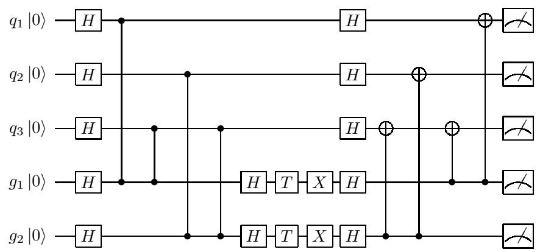  
Figure 16: Circuit which implements the MBQC pattern of Figure 2. Measurements have been delayed until the end. The final $C X$ gates perform the necessary adaptive corrections.

# A.2 NQIT Noise Functions

In Protocol 3 we give the implementation of the NQIT noise model of Section 3.3 in the gate based model, which may be understood by the simulator.

<table><tr><td>Protocol 3 Gate based description of the NQIT noise to be used by the simulator. Here P (λ) is a Poisson distribution with mean λ. The variables listed here assume the current NQIT noise levels but are altered in our experiments of Section 4.3 and can be set to 0 in the perfect case.</td></tr><tr><td>1: TimeInTrapOperation = 0.5ms</td></tr><tr><td>2: TimeLinkingOperation = 1.5s</td></tr><tr><td>3: TimePreparation = 1.25ms</td></tr><tr><td>4: TimeMeasurement = 2.25ms</td></tr><tr><td>5: ProbTwoQubitOperationSingleQubit = 5.5 × 10−5</td></tr><tr><td>6: 7: ProbTwoQubitOperationTwoQubit = 6 × 10−5</td></tr><tr><td>8: ProbSingleQubitOperation = 1.5 × 10−6</td></tr><tr><td>9: ProbMeasurement = 5 × 10−4</td></tr><tr><td>10: ProbPreparation = 2 × 10−4</td></tr><tr><td>11: ProbDephasing = 7.2 × 10−3</td></tr><tr><td>12: ProbDepolarising = 9 × 10−3</td></tr><tr><td>Protocol continues below...</td></tr></table>

# Protocol 3 Continued

13: function RandomPauli $( i , p )$   
14: Act a Pauli gate, selected uniformly at random, on qubit $i$ with probability $p$   
15: end function   
16:   
17: function DephasingNoise( $t$ , q )   
18: Act $Z \left( q \right)$ with probability P (tProbDephasing)   
19: end function   
20:   
21: function DepolarisingNoise(t, q)   
22: RandomPauli(q, $P$ (tProbDepolarising))   
23: end function   
24:   
25: function TimeBaseNoise $\mathbf { \rho } ( t )$   
26: for all $q \in$ qibits do ⊲ Noise acts on all qubits   
27: DephasingNoise $( t , q )$   
28: DepolarisingNoise(t, q)   
29: end for   
30: end function   
31:   
32: function TwoQubitNoise $( i , j )$   
33: RandomPauli(i, ProbTwoQubitOperationSingleQubit)   
34: RandomPauli( $j$ , ProbTwoQubitOperationSingleQubit)   
35: Act $Z \left( i \right) \otimes Z \left( j \right)$ with probability ProbTwoQubitOperationTwoQubit   
36: end function   
37:   
38: function SingleQubitNoise(q)   
39: RandomPauli( $q$ , ProbSingleQubitOperation)   
40: end function   
41:   
42: function PreparationNoise(q)   
43: Act $X ( q )$ with probability ProbPreparation   
44: end function   
45:   
46: function MeasurementNoise(q)   
47: Act $X ( q )$ with probability ProbMeasurement   
48: end function

Noise is added to a circuit in the following way. All operations are considered independently. Noise gates corresponding to operation based errors are inserted at an operation’s position in the circuit at random, with type and probability according to the rates of Section 3.3. For each of those operations, a nested loop iterates over all qubits in the system and randomly applies the two time-based errors. First the execution time needed for the current operation is calculated by considering the times given in Section 3.3. Then, at each qubit in the loop, an appropriate noise gate is added according to a Poisson process with the rates listed, again, in Section 3.3.

# B Numerical Experiment Details

# B.1 IQP-MBQC Experiments

# B.1.1 Simulator Benchmarking Experiment of Section 4.1

Generating random unrestricted IQP instances is equivalent to randomly populating $\mathbf { Q }$ with zeros and ones. The description in A.1 of how to convert a given X-program $\mathbf { Q }$ to a particular circuit lets us control the T-gates count $t$ . We saw that every individual exponential (row in $\mathbf { Q }$ ) corresponds exactly to $t = 1$ , and the number of application qubits has no effect on $t$ . We want T-gate counts of no more than 20 in order to achieve feasible run-times.

One trial consists of generating a random IQP instance, obtaining the true probability of measuring the $\left| 0 \right. ^ { n }$ using brute-force, and solving them with the simulator of [3] 20 times. Each instance is created by randomly populating with binary values a matrix $\mathbf { Q }$ of randomly picked dimensions in $[ 5 , 1 5 ] \times [ 5 , 1 2 ]$ . This corresponds to $n \in [ 5 , 1 2 ]$ and $t \in [ 5 , 1 5 ]$ where the complexity in the brute-force case is determined by $n$ , and in the simulator’s, by $t$ .

The experiment consists of 20 trials, with the mean of the simulator output in each trial compared to the brute force case to give the coefficient of determination.

# B.1.2 NQIT Noise and Architecture Restricted Experiment of Section 4.2.2

We again generate random IQP-MBQC circuits, but under the restrictions described in Section 4.2.2. Rather than a full matrix, $\mathbf { Q }$ , it is now sufficient for each gate qubit, $g _ { i }$ , in an ion trap, $_ i$ , to have corresponding bit strings, $i ^ { 0 }$ and $i ^ { 1 }$ , indicating the entanglement patterns between itself and qubits in it and its neighbouring ion trap.

Details of the circuit simulated can be seen in Protocol 4. Once the circuit is simulated, we calculate the probability that an NQIT implementation would measure a random bit string $b$ . One noisy run consists of simulating the circuit produced from Protocol 4, using fixed $i ^ { 0 } , i ^ { 1 } , b$ , 20 times to calculate the mean and standard deviation. Then a new tuple $i ^ { 0 } , i ^ { 1 } , b$ is generated and the process is repeated for the next trial. A perfect run is equivalent but with the noise values set to $0$ , with the perfect and noisy pair forming one trial. In total the experiment consists of 20 trials.

Notice that we are being pessimistic in Protocol 4 by assuming that there is no parallelism in the gate applications. As such we apply time based noise after each gate. We have also simplified the operation of swapping to a single operation, rather than a protocol as seen in Protocol 2. This reduces the simulation time while roughly maintaining the noise impact, as the time based noise should dominate here.

# B.2 2D-DQS Experiments of Section 4.2.1 and Section 4.3

When entangling the traps to form the resource state, we extend the procedure shown in equation (6). Instead of only 2-steps, as it is in the 1D case, we need 4 steps for a 2D grid resource state. We achieve this by entangling sequentially:

• Even-indexed columns’ qubits to their right neighbours • Odd-indexed columns’ qubits to their right neighbours • Even-indexed rows’ qubits to their bottom neighbours • Odd-indexed rows’ qubits to their bottom neighbours

Protocol 4 Code producing a noisy IQP-MBQC circuit, to be implemented by the simulator, as discussed in Section 4.2.2. We use $i$ to index the ion traps, and to represent the set of $K ^ { \prime } - 2$ available application qubits which each trap contains ( $K ^ { \prime }$ minus 1 qubit $c _ { i }$ to receive the gate qubit from it’s neighbour, minus one gate qubit $g _ { i }$ ).

Input: For every ion trap, i, two strings, $i ^ { 0 }$ , $i ^ { 1 }$ . Bit string $b$ .   
Output: Noisy circuit.   
1: for all $q \in$ qubits do   
2: Initialise(q) ⊲ Recall, initialisation is in the $| + \rangle$ state   
3: PreparationNoise(q)   
4: end for   
5:   
6: for all $i \in$ ion traps, except the last do   
7: for all $q \in i$ do   
8: if $i _ { q } ^ { 0 } = 1$ then   
9: Act $C Z \left( g _ { i } , q \right)$   
10: $\mathrm { T w o Q u B I T N O I S E } ( g _ { i } , q )$   
11: TimeBasedNoise(TimeInTrapOperation)   
12: end if   
13: end for   
14: end for   
15:   
16: for all $i \in$ ion traps, except the last, such that $_ i$ is even do   
17: $\operatorname { S w a p } ( g _ { i } , c _ { i + 1 } )$ $\triangleright$ Move gate qubits to neighbouring ion trap   
18: end for   
19: TimeBasedNoise(TimeLinkingOperation $^ +$ TimeMeasurement)   
20:   
21: for all $i \in$ ion traps, except the last, such that $_ i$ is odd do   
22: $\operatorname { S w a p } ( g _ { i } , c _ { i + 1 } )$   
23: end for   
24: TimeBasedNoise(TimeLinkingOperation $^ +$ TimeMeasurement)   
25:   
26: for all $i \in$ ion traps, except the first do   
27: for all $q \in i$ do   
28: if $\left( i - 1 \right) _ { q } ^ { 1 } = 1$ then   
29: Act $\dot { C Z } \left( g _ { i - 1 } , q \right)$   
30: $\mathrm { T w o Q u p s I T N O I S E } ( g _ { i - 1 } , q )$   
31: TimeBasedNoise(TimeInTrapOperation)   
32: end if   
33: end for   
34: end for   
Protocol continues below...

# Protocol 4 Continued

<table><tr><td></td><td>35: for all i  ion traps, except the first do</td></tr><tr><td>36:</td><td>Act H (gi−1)</td></tr><tr><td>37:</td><td>SINGLEQUBITNoISE(gi−1)</td></tr><tr><td></td><td>38: end for</td></tr><tr><td></td><td>39: TIMEBASEDNoISE(TimeInTrapOperation)</td></tr><tr><td></td><td>40: for all i  ion traps, except the first do</td></tr><tr><td>41:</td><td>Act T (gi−1)</td></tr><tr><td>42:</td><td>SInGLEQUBITNoIsE(gi−1)</td></tr><tr><td></td><td>43: end for</td></tr><tr><td></td><td>44: TIMEBASEDNoISE(TimeInTrapOperation)</td></tr><tr><td></td><td>45: for all i  ion traps, except the first do</td></tr><tr><td>46:</td><td>Act X (gi−1)</td></tr><tr><td>47:</td><td>SIngLEQuBITNoISE(gi−1)</td></tr><tr><td></td><td>48: end for</td></tr><tr><td></td><td>49: TIMEBASEDNoISE(TimeInTrapOperation)</td></tr><tr><td>50:</td><td></td></tr><tr><td></td><td>51: for all q  qubits do</td></tr><tr><td>52:</td><td>Act H (q)</td></tr><tr><td>53:</td><td>SingLEQuBITNoise(q)</td></tr><tr><td></td><td>54: end for</td></tr><tr><td></td><td>55: TIMEBASEDNoISE(TimeInTrapOperation)</td></tr><tr><td>56:</td><td></td></tr><tr><td></td><td>57: for all i  ion traps, except the last do</td></tr><tr><td>58:</td><td>for all q  i do</td></tr><tr><td>59:</td><td>if iq = 1 then</td></tr><tr><td>60:</td><td>Act CX (gi, q)</td></tr><tr><td>61:</td><td>end if</td></tr><tr><td>62:</td><td>end for</td></tr><tr><td></td><td>63: end for</td></tr><tr><td>64:</td><td></td></tr><tr><td></td><td>65: for all i  ion traps, except the first do</td></tr><tr><td>66:</td><td>for all q  i do</td></tr><tr><td>67:</td><td>if (i − 1)1 = 1 then</td></tr><tr><td>68:</td><td>Act CX (gi−1, q)</td></tr><tr><td>69:</td><td>end if</td></tr><tr><td>70:</td><td>end for</td></tr><tr><td>71: end for</td><td></td></tr><tr><td>72:</td><td></td></tr><tr><td></td><td>73: for all i  ion traps do</td></tr><tr><td>74:</td><td>for all q  i and gi−1 for all but the first ion trap do</td></tr><tr><td>75:</td><td>MEASUrEMENTNoISE(q)</td></tr><tr><td>76:</td><td>end for</td></tr><tr><td>77: end for</td><td> Give the probability of measuring b in the Computational basis</td></tr><tr><td>78: MEASURE(b)</td><td></td></tr></table>

Having performed the entanglement we are left to apply the $T$ -gates and measure. We track the qubits on which we apply the $T$ gates using the bit string $\tau$ which takes the value 1 at the locations where a $T$ gate is applied.

We calculate the amplitude of a randomly selected output, $b$ , for each instance in order to simulate sampling. We calculate several trials where for each we:

• Generate a uniformly random $\tau \in [ 0 , 1 ] ^ { 2 0 }$ to give a 4x5 circuit as in Section 3.1.4.   
• Generate a random bit string, $b$ , to calculate the amplitude of.   
Solve 20 times and take the mean and standard deviation. This is a perfect run.   
• Generate 20 random noisy circuits, one per noisy run, based on the perfect one by inputting $\tau$ into Protocol 5. In the case of Section 4.3 we will use different values for the variables of Protocol 3, as discussed there.   
For each noisy run, solve the circuit 20 times and calculate the mean. The result is a vector of length 20 containing these mean values.

Attempts to reduce the standard deviation of the noisy runs by increasing the number of times the computation is performed during each run were not effective, suggesting the deviation is a result of the noise.

Protocol 5 Code producing a noisy 2D-DQS circuit, to be implemented by the simulator, as discussed in Section 4.2.1 and Section 4.3. We will index traps (and equivalently, in this case, qubits) by the row, $n$ , and column, $m$ , where then appear in the square grid.

Input: Bit strings $^ { \prime }$ and $b$ .   
Output: Noisy circuit.   
1: for all $q \in$ qubits do $\triangleright$ This and the following loop initialise $| + \rangle$ states   
2: Initialise(q)   
3: PreparationNoise(q)   
4: end for   
5:   
6: for $p \in \{ o d d , e v e n \}$ do ⊲ Entangle columns of lattice   
7: for $\{ n , m : n \in p \}$ d o   
8: $C Z \left( \left( n , m \right) , \left( n + 1 , m \right) \right)$   
9: $\mathrm { T w o Q U B I T N O I S E } ( ( n , m ) , ( n + 1 , m ) )$   
10: TimeBasedNoise(TimeInTrapOperation)   
11: end for   
12: end for   
13:   
14: for $p \in \{ o d d , e v e n \}$ do ⊲ Entangle rows of lattice   
15: for $\{ n , m : m \in p \}$ d o   
16: $C Z \left( \left( n , m \right) , \left( n , m + 1 \right) \right)$   
17: TwoQubitNoise $( ( n , m ) , ( n , m + 1 ) )$   
18: TimeBasedNoise(TimeInTrapOperation)   
19: end for   
20: end for   
21:   
22: for $q \in$ qubits do ⊲ Act $T$ gate according to original circuit   
23: if $\tau _ { i } = 1$ then   
24: Act $T ( i )$   
25: SingleQubitNoise(i)   
26: TimeBasedNoise(TimeInTrapOperation)   
27: end if   
28: end for   
29:   
30: for $q \in$ qubits do   
31: Act $H \left( q \right)$ $\triangleright$ Ajust to measure in the Hadamard basis   
32: SingleQubitNoise(q)   
33: TimeBasedNoise(TimeInTrapOperation)   
34: end for   
35:   
36: for q  qubits do   
37: MeasurementNoise(q)   
38: end for   
39: Measure(b)