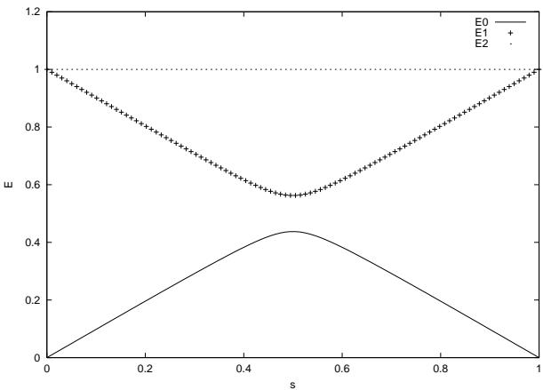
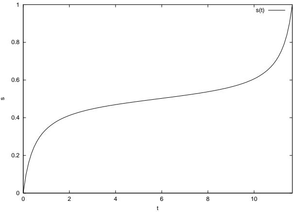

# Quantum Search by Local Adiabatic Evolution

J´er´emie Roland1 and Nicolas J. Cerf1 $, 2$ $^ { 1 }$ Ecole Polytechnique, CP 165, Universit´e Libre de Bruxelles, 1050 Brussels, Belgium $^ 2$ Jet Propulsion Laboratory, California Institute of Technology, Pasadena, California 91109 (July 2001)

The adiabatic theorem has been recently used to design quantum algorithms of a new kind, where the quantum computer evolves slowly enough so that it remains near its instantaneous ground state which tends to the solution [1]. We apply this time-dependent Hamiltonian approach to the Grover’s problem, i. e., searching a marked item in an unstructured database. We find that, by adjusting the evolution rate of the Hamiltonian so as to keep the evolution adiabatic on each infinitesimal time interval, the total running time is of order $\sqrt { N }$ , where $N$ is the number of items in the database. We thus recover the advantage of Grover’s standard algorithm as compared to a classical search, scaling as $N$ . This is in contrast with the constant-rate adiabatic approach developed in [1], where the requirement of adiabaticity is expressed only globally, resulting in a time of order $N$ .

PACS numbers: 03.67.Lx, 89.70.+c

# Introduction

Although quantum computation is mostly a theoretical concept today, several quantum algorithms have already been designed and shown to outperform all known classical algorithms, thereby giving a strong motivation to the development of quantum computers. Probably the most spectacular result is Shor’s algorithm [2], which can factor a large number with a computation time polynomial in the size of the number, whereas all known classical algorithms require a (sub-)exponential time. Another remarkable algorithm, due to Grover, concerns the problem of searching in an unsorted database [3]. Suppose we have a database of $N$ items, one of which is marked. The goal is to find this unknown marked item by accessing the database a minimum number of times. Classically, $N / 2$ items must be tested, on average, before finding the right one. Grover’s quantum algorithm performs the same task with a complexity of order $\sqrt { N }$ , giving rise to a quadratic speed up.

While Grover’s algorithm was originally presented within the standard paradigm for quantum computation, that is using a discrete sequence of unitary logic gates, we will turn here to another type of quantum computation where the state of the quantum register evolves continuously under the influence of some driving Hamiltonian. This concept of quantum computation viewed as a continuous time evolution was pioneered by E. Farhi and S. Gutmann in [4], where they proposed an “analog” version of Grover’s algorithm based on a time-independent Hamiltonian applied for a time $T$ . Their algorithm required $T$ to be of order $\sqrt { N }$ , which gives thus the same complexity as Grover’s algorithm. In a more recent article with other coworkers, they considered an alternative class of continuous-time quantum algorithms based on a time-dependent Hamiltonian that effects an adiabatic evolution of the quantum register [1]. If the evolution of a quantum system is governed by a Hamiltonian that varies slowly enough, this system will stay near its instantaneous ground state. This adiabatic evolution can be used to switch gradually from an initial Hamiltonian, whose ground state is known, to a final Hamiltonian, whose ground state encodes the unknown solution. The time required for this switching to remain globally adiabatic determines the computation time. Farhi et al. have solved Grover’s search problem using this adiabatic evolution approach, but this unfortunately resulted in a complexity of order $N$ , that is no better than a classical algorithm that checks all possible solutions [1].

In the present article, we show that one can recover the quadratic speed-up of Grover’s original algorithm by continuously adjusting the rate with which the initial Hamiltonian is switched to the final Hamiltonian so as to fulfill the condition of adiabaticity locally, i. e. at each time. Interestingly, this local adiabatic evolution approach makes it thus possible to improve the scaling law of the complexity of the quantum search algorithm simply by varying the evolution rate of the driving Hamiltonian. This offers the perspective of speeding up more sophisticated adiabatic evolution algorithms, such as those applied to NPcomplete problems [5]. It might also be used to design an adiabatic evolution version of the nested quantum search technique proposed in [6] for solving structured problems.

# Adiabatic theorem

Consider a quantum system in a state $| \psi ( t ) \rangle$ , which evolves according to the Schr¨odinger equation

$$
i \frac { d } { d t } | \psi ( t ) \rangle = H ( t ) | \psi ( t ) \rangle
$$

where $H ( t )$ is the Hamiltonian of the system (we let $\hbar \mathit { \Theta } = \mathit { \Theta } 1$ ). If this Hamiltonian is time-independent and the system is initially in its ground state, then it will remain in this state. The Adiabatic Theorem (see e. g. [7]) expresses that if the Hamiltonian varies slowly enough, roughly speaking, the state of the system will stay close to the instantaneous ground state of the Hamiltonian at each time $t$ . More specifically, let $| E _ { k } ; t \rangle$ be the eigenstates of $H ( t )$ , satisfying

$$
H ( t ) | E _ { k } ; t \rangle = E _ { k } ( t ) | E _ { k } ; t \rangle
$$

where $E _ { k } ( t )$ are the corresponding eigenvalues and $k$ labels the eigenstates ( $k = 0$ labels the ground state). We define the minimum gap between the lowest two eigenvalues as

$$
g _ { \mathrm { m i n } } = \operatorname* { m i n } _ { 0 \leq t \leq T } \left[ E _ { 1 } ( t ) - E _ { 0 } ( t ) \right]
$$

and the matrix element of $d H / d t$ between the two corresponding eigenstates as

$$
\langle { \frac { d H } { d t } } \rangle _ { 1 , 0 } = \langle E _ { 1 } ; t | { \frac { d H } { d t } } | E _ { 0 } ; t \rangle
$$

The Adiabatic Theorem states that if we prepare the system at time $t = 0$ in its ground state $| E _ { 0 } ; 0 \rangle$ and let it evolve under the Hamiltonian $H ( t )$ , then

$$
| \langle E _ { 0 } ; T | \psi ( T ) \rangle | ^ { 2 } \geq 1 - \varepsilon ^ { 2 }
$$

provided that

$$
\frac { \left| \langle \frac { d H } { d t } \rangle _ { 1 , 0 } \right| } { g _ { \mathrm { m i n } } ^ { 2 } } \leq \varepsilon
$$

where $\varepsilon < < 1$ . In particular, this implies that the minimum gap cannot be lower than a certain value if we require the state at time $t$ to differ from the instantaneous ground state by a negligible amount (a smaller gap implies a higher transition probability to the first excited state). This result can be used to design a new type of quantum algorithm based on a time-dependent Hamiltonian [1]. Assume we can build a Hamiltonian for which we know that the ground state encodes the solution of a problem. Then, it suffices to prepare the system in the ground state of another Hamiltonian, easy to build, and change progressively this Hamiltonian into the other one in order to get, after measurement, the sought solution with large probability. The Adiabatic Theorem imposes the minimum time it takes for this switching to be adiabatic, and this time can be thought of as the algorithm complexity.

# Global vs local adiabatic evolution for solving the quantum search problem

We now apply this adiabatic evolution method to the problem of finding an item in an unsorted database. Before describing our local adiabatic search algorithm, we first summarize the method of [1], based on a global adiabatic evolution. Consider a set of $N$ items among which one is marked, the goal being to find it in a minimum time. We use $n$ qubits to label the items, so that the Hilbert space is of dimension $N \ = \ 2 ^ { \pi }$ . In this space, the basis states are written $| i \rangle$ , with $i = 0 , \ldots , N - 1$ , while the marked state is denoted by $| m \rangle$ . As we do not know $| m \rangle$ a priori, we use as an initial state an equal superposition of all basis states:

$$
| \psi _ { 0 } \rangle = \frac { 1 } { \sqrt { N } } \sum _ { i = 1 } ^ { N - 1 } | i \rangle
$$

We define two Hamiltonians:

$$
\begin{array} { c } { { H _ { 0 } ~ = ~ I - | \psi _ { 0 } \rangle \langle \psi _ { 0 } | } } \\ { { H _ { m } ~ = ~ I - | m \rangle \langle m | } } \end{array}
$$

whose ground states are $| \psi _ { 0 } \rangle$ and $| m \rangle$ , respectively, each with eigenvalue 0. The time-dependent Hamiltonian underlying the algorithm is a linear interpolation between these Hamiltonians, that is

$$
H ( t ) = ( 1 - t / T ) H _ { 0 } + t / T H _ { m }
$$

or, with $s = t / T$

$$
\tilde { H } ( s ) = ( 1 - s ) H _ { 0 } + s H _ { m }
$$

The algorithm consists in preparing the system in the state $| \psi ( 0 ) \rangle = | \psi _ { 0 } \rangle$ and then applying the Hamiltonian $H ( t )$ during a time $T$ . First, we notice that

$$
\langle \frac { d H } { d t } \rangle _ { 1 , 0 } = \frac { d s } { d t } \langle \frac { d \tilde { H } } { d s } \rangle _ { 1 , 0 } = \frac { 1 } { T } \langle \frac { d \tilde { H } } { d s } \rangle _ { 1 , 0 }
$$

Using Eq. (10) or (11), we can solve the eigenproblem (2) and evaluate (3) and (4). The eigenvalues of $\ddot { H } ( s )$ are plotted as a function of $s$ in Fig. 1. The highest eigenvalue $E _ { 2 } = 1$ is $N - 2$ times degenerated, while the two lowest ones $E _ { 0 }$ and $E _ { 1 }$ have a degeneracy one. The difference between these lowest two eigenvalues defines the gap $g$ . We find

$$
\begin{array} { l } { \displaystyle { g = \sqrt { 1 - 4 \frac { N - 1 } { N } s \left( 1 - s \right) } } } \\ { \displaystyle { \left. \langle \frac { d \tilde { H } } { d s } \rangle _ { 1 , 0 } \right. \leq 1 } } \end{array}
$$

  
FIG. 1. Eigenvalues of the time-dependent Hamiltonian $\tilde { H } ( s )$ as a function of the reduced time $s$ , for $N = 6 4$ .

We see that the minimum gap $g _ { m i n } = 1 / \sqrt { N }$ is attained for $s = 1 / 2$ , so that the adiabatic condition (6) is verified provided that

$$
T \geq { \frac { N } { \varepsilon } }
$$

Thus, the computation time is of order $N$ , and there is no advantage of this method compared to a classical search.

Now, let us see how to improve on this adiabatic evolution method. One should note that by applying Eq. (6) globally, i. e. to the entire time interval $T$ , we impose a limit on the evolution rate during the whole computation while this limit is only severe for the times around $s = 1 / 2$ , where the gap $g$ is minimum. Thus, by dividing $T$ into infinitesimal time intervals $d t$ and applying the adiabaticity condition locally to each of these intervals, we can vary the evolution rate continuously in time, thereby speeding up the computation. In other words, we do not use a linear evolution function $s ( t )$ any more, but we adapt the evolution rate $d s / d t$ to the local adiabaticity condition. Let us find the optimum $s ( t )$ with the boundary conditions $s ( 0 ) = 0$ and $s ( T ) = 1$ . Applying Eq. (6) to each infinitesimal time interval, we get the new condition

$$
\left| \frac { d s } { d t } \right| \leq \varepsilon ~ \frac { g ^ { 2 } ( t ) } { \left| \langle \frac { d \tilde { H } } { d s } \rangle _ { 1 , 0 } \right| }
$$

for all times $t$ . Using Eqs. (13) and (14), we choose to make the Hamiltonian evolve at a rate that is solution of

$$
\frac { d s } { d t } = \varepsilon g ^ { 2 } ( t ) = \varepsilon \left[ 1 - 4 \frac { N - 1 } { N } s ( 1 - s ) \right]
$$

where $\varepsilon < < 1$ . After integration, we find

$$
\begin{array} { l } { { t \ = \ \displaystyle \frac { 1 } { 2 \varepsilon } \frac { N } { \sqrt { N - 1 } } \left[ \arctan \left( \sqrt { N - 1 } ( 2 s - 1 ) \right) \right. \nonumber } } \\ { { \left. \qquad + \arctan \sqrt { N - 1 } \right] } } \end{array}
$$

By inverting this function, we obtain $s ( t )$ as plotted in Fig. 2, which shows the gradual change in the switching between $H _ { 0 }$ and $H _ { m }$ . We see that $H ( t )$ is changing faster when the gap $g ( s )$ is large while it evolves slower when $s$ is close to $1 / 2$ , that is where the gap is minimum. We may now evaluate the computation time of our new algorithm by taking $s = 1$ . With the approximation $N > > 1$ , we obtain

$$
T = \frac { \pi } { 2 \varepsilon } \sqrt { N }
$$

improving upon Eq. (15). As a consequence, we thus have a quadratic speed-up compared to a classical search, and this algorithm can be viewed as the adiabatic evolution version of Grover’s algorithm. In the Appendix, we show that this algorithm is optimal, that is the computation time cannot be shorter than $O ( { \sqrt { N } } )$ using any other evolution function $s ( t )$ .

  
FIG. 2. Dynamic evolution of the Hamiltonian that drives the initial ground state to the solution state: plot of the evolution function $s ( t )$ for $N = 6 4$ . The global adiabatic evolution method of [1] would appear here as a straight line between $s ( 0 ) = 0$ and $s ( 1 ) = 1$ .

# Conclusion

In this article, we have applied the adiabatic evolution technique of [1] to design a quantum algorithm for solving Grover’s problem, i. e., the search for a marked item in an unstructured database. We have shown that applying the Adiabatic Theorem globally (as in [1]) imposes a running time of order $N$ , where $N$ is the number of items in the database, whereas adjusting the evolution rate of the Hamiltonian continuously in time so as to fulfill the adiabaticity condition locally results in a time of order $\sqrt { N }$ . We therefore recover the advantage of Grover’s usual algorithm compared to a classical search [3]. We should notice that this speed up was achieved by switching the Hamiltonian according to Eq. (18), which is only possible because here the gap $g ( s )$ can be derived analytically and does not depend on the solution of the problem (in our case, $| m \rangle$ ). As long as these conditions are satisfied, such a local adiabatic evolution method could be applied to more complicated – and more realistic – problems such as NP-complete problems, treated using either a quantum adiabatic evolution algorithm [5] or a nested version of Grover’s algorithm exploiting the problem structure [6].

J. R. acknowledges support from the Belgian FRIA. N. C. is funded in part by the project EQUIP under the IST-FET-QJPC European programme.

# Appendix: Proof of optimality

In this Appendix, we show that using our algorithm, no other choice of the evolution function $s ( t )$ could lead to a better complexity than Eq. (19). This proof follows closely the lines of the optimality proof of the “analog”

Grover’s algorithm based on a time-independent Hamiltonian [4].

Let $\vert \psi _ { m } , t \rangle$ be the state of our quantum register during the computation when the solution state is $| m \rangle$ . After the computation time $T$ , the states corresponding to different solutions ( $_ { \mathbf { \nabla } ^ { \prime } \mathbf { \nabla } ^ { \prime } } \psi _ { \mathbf { \nabla } ^ { \prime } }$ and $m ^ { \prime }$ ) must be sufficiently different:

$$
1 - | \langle \psi _ { m } , T | \psi _ { m ^ { \prime } } , T \rangle | ^ { 2 } \geq \varepsilon \forall m \neq m ^ { \prime }
$$

Let us decompose the Hamiltonian $\tilde { H } ( s )$ in two parts:

$$
\tilde { H } ( s ) = \tilde { H } _ { 1 } ( s ) + \tilde { H } _ { 2 m } ( s )
$$

where

$$
\begin{array} { r c l } { { \tilde { H } _ { 1 } ( s ) ~ = ~ I - ( 1 - s ) | \psi _ { 0 } \rangle \langle \psi _ { 0 } | } } & { { } } & { { } } \\ { { \tilde { H } _ { 2 m } ( s ) ~ = ~ - s | m \rangle \langle m | } } & { { } } & { { } } \end{array}
$$

$| \psi _ { m } \rangle$ and $\left| { \psi _ { m ^ { \prime } } } \right.$ are solution of the Schr¨odinger equations

$$
\begin{array} { l } { { i \displaystyle { \frac { d } { d t } } | \psi _ { m } , t \rangle = ( H _ { 1 } + H _ { 2 m } ) | \psi _ { m } , t \rangle } } \\ { { i \displaystyle { \frac { d } { d t } } | \psi _ { m ^ { \prime } } , t \rangle = ( H _ { 1 } + H _ { 2 m ^ { \prime } } ) | \psi _ { m ^ { \prime } } , t \rangle } } \end{array}
$$

with initial conditions

$$
\vert \psi _ { m } , 0 \rangle = \vert \psi _ { m ^ { \prime } } , 0 \rangle = \vert \psi _ { 0 } \rangle
$$

We will now derive a necessary condition on $T$ for Eq. (20) to be satisfied. Using Eqs. (24) and (25), we have

$$
\begin{array} { r l } & { \frac { d } { d t } [ 1 - | \langle \psi _ { m } , t | \psi _ { m ^ { \prime } } , t \rangle | ^ { 2 } ] } \\ & { = \ 2 \ \operatorname { I m } \left[ \langle \psi _ { m } , t | H _ { 2 m } - H _ { 2 m ^ { \prime } } | \psi _ { m ^ { \prime } } , t \rangle \langle \psi _ { m ^ { \prime } } , t | \psi _ { m } , t \rangle \right] } \\ & { \leq \ 2 \ | \langle \psi _ { m } , t | H _ { 2 m } - H _ { 2 m ^ { \prime } } | \psi _ { m ^ { \prime } } , t \rangle | \ | \langle \psi _ { m ^ { \prime } } , t | \psi _ { m } , t \rangle | } \\ & { \leq \ 2 \ \left[ | \langle \psi _ { m } , t | H _ { 2 m } | \psi _ { m ^ { \prime } } , t \rangle | + | \langle \psi _ { m } , t | H _ { 2 m ^ { \prime } } | \psi _ { m ^ { \prime } } , t \rangle | \right] } \end{array}
$$

Summing over $m$ and $m ^ { \prime }$ , we get:

$$
\begin{array} { r l r } {  { \frac { d } { d t } \sum _ { m , m ^ { \prime } } [ 1 - | \langle \psi _ { m } , t | \psi _ { m ^ { \prime } } , t \rangle | ^ { 2 } ] } } \\ & { \le \ 4 \sum _ { m , m ^ { \prime } } | \langle \psi _ { m } , t | H _ { 2 m } | \psi _ { m ^ { \prime } } , t \rangle | } \\ & { \le \ 4 \displaystyle \sum _ { m , m ^ { \prime } } \| H _ { 2 m } | \psi _ { m } , t \rangle \| \ \| | \psi _ { m ^ { \prime } } , t \rangle | } \\ & { \le \ 4 N \displaystyle \sum _ { m } \| H _ { 2 m } | \psi _ { m } , t \rangle \| } & \end{array}
$$

where we used the Cauchy-Schwartz inequality along with the fact that $| \psi _ { m ^ { \prime } } , t \rangle$ is normalized. The property

$$
\sum _ { m } \| H _ { 2 m } | \psi , t \rangle \| ^ { 2 } = s ^ { 2 } \Rightarrow \sum _ { m } \| H _ { 2 m } | \psi , t \rangle \| \leq \sqrt { N } s
$$

then leads to

$$
\frac { d } { d t } \sum _ { m , m ^ { \prime } } [ 1 - | \langle \psi _ { m } , t | \psi _ { m ^ { \prime } } , t \rangle | ^ { 2 } ] \leq 4 N \sqrt { N } s
$$

We may now integrate this inequality using the initial conditions (26):

$$
\sum _ { m , m ^ { \prime } } [ 1 - | \langle \psi _ { m } , t | \psi _ { m ^ { \prime } } , t \rangle | ^ { 2 } ] \leq 4 N \sqrt { N } \int _ { 0 } ^ { T } s ( t ) d t
$$

Finally, using condition (20) and $0 \leq s ( t ) \leq 1$ , we find

$$
T \geq \frac { \varepsilon } { 4 } \frac { N - 1 } { \sqrt { N } }
$$

or, with $N > > 1$ ,

$$
T \geq \frac { \varepsilon } { 4 } \sqrt { N }
$$

We conclude that, in order to be able to distinguish between states corresponding to different solutions ( $\varepsilon > 0$ ), the computation must last a minimum time of order $\sqrt { N }$ , which is what we found in Eq. (19). Our choice of $s ( t )$ is thus optimal.

[1] E. Farhi, J. Goldstone, S. Gutmann, and M. Sipser, “Quantum Computation by Adiabatic Evolution”, quantph/0001106.   
[2] P. W. Shor, in Proceedings of the 35th Annual Symposium on the Foundations of Computer Science, 1994, Los Alamitos, California, edited by S. Goldwasser (IEEE Computer Society Press, New York, 1994), pp. 124-134.   
[3] L. K. Grover, “Quantum mechanics helps in searching for a needle in a haystack”, Phys. Rev. Lett. 79, 325 (1997).   
[4] E. Farhi and S. Gutmann, “An Analog Analogue of a Digital Quantum Computation”, quant-ph/9612026; Phys. Rev. A 57, 2403 (1998).   
[5] E. Farhi, J. Goldstone, S. Gutmann, J. Lapan, A. Lundgren and D. Preda, “A Quantum Adiabatic Evolution Algorithm Applied to an NP-complete Problem”, quantph/0104129.   
[6] N. J. Cerf, L. K. Grover, and C. P. Williams, “Nested quantum search and structured problems”, quant-ph/9806078; Phys. Rev. A 61, 032303 (2000).   
[7] B. H. Bransden and C. J. Joachain, Quantum Mechanics, (Pearson Education, 2000).