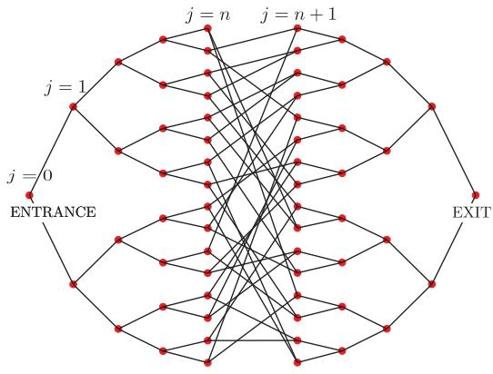
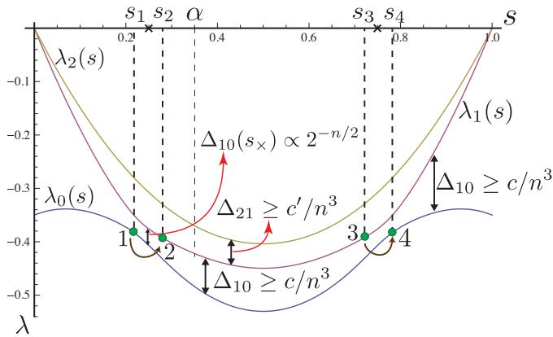
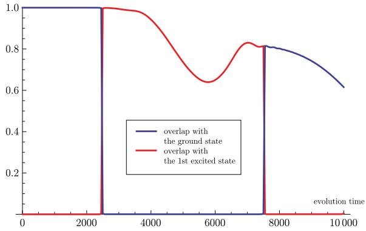

# Quantum Speedup by Quantum Annealing

Daniel Nagaj,1 Rolando D. Somma,2 and M´aria Kieferov´a $\cdot ^ { 1 }$ $^ { 1 }$ Research Center for Quantum Information, Slovak Academy of Sciences, Bratislava, Slovakia ${ \mathcal { Z } }$ Los Alamos National Laboratory, Los Alamos, NM 87545, USA (Dated: November 27, 2024)

We study the glued-trees problem of Childs, et. al. [1] in the adiabatic model of quantum computing and provide an annealing schedule to solve an oracular problem exponentially faster than classically possible. The Hamiltonians involved in the quantum annealing do not suffer from the socalled sign problem. Unlike the typical scenario, our schedule is efficient even though the minimum energy gap of the Hamiltonians is exponentially small in the problem size. We discuss generalizations based on initial-state randomization to avoid some slowdowns in adiabatic quantum computing due to small gaps.

PACS numbers: 03.67.Ac, 03.67.Lx, 03.65.-w, 42.50.Lc

Quantum annealing is a powerful heuristic to solve problems in optimization [2, 3]. In quantum computing, the method consists of preparing a low-energy or ground state $| \psi \rangle$ of a quantum system such that, after a simple measurement, the optimal solution is obtained with large probability. $| \psi \rangle$ is prepared by following a particular annealing schedule, with a parametrized Hamiltonian path subject to initial and final conditions. A ground state of the initial Hamiltonian is then transformed to $| \psi \rangle$ by varying the parameter adiabatically. In contrast to more general quantum adiabatic state transformations, the Hamiltonians along the path in quantum annealing are termed stoquastic and do not suffer from the so-called numerical sign problem [4]: for a specified basis, the offdiagonal Hamiltonian-matrix entries are nonpositive [5]. This property is useful for classical simulations [3].

A sufficient condition for convergence of the quantum method is given by the quantum adiabatic approximation. It asserts that, if the rate of change of the Hamiltonian scales with the energy gap $\Delta$ between their two lowest-energy states, $| \psi \rangle$ can be prepared with controlled accuracy [6, 7]. Such an approximation may also be necessary [8]. However, it could result in undesired overheads if $\Delta$ is small but transitions between the lowestenergy states are forbidden due to selection rules, or if transitions between lowest-energy states can be exploited to prepare $| \psi \rangle$ . The latter case corresponds to the annealing schedule in this Letter. It turns out that the relevant energy gap for the adiabatic approximation in these cases is not $\Delta$ and can be much bigger.

Because of the properties of the Hamiltonians, the annealing can also be simulated using probabilistic classical methods such as quantum Monte-Carlo (QMC) [9]. The goal in QMC is to sample according to the distribution of the ground state, i.e. with probabilities coming from amplitudes squared. While we lack of necessary conditions that guarantee convergence, the power of QMC is widely recognized [3, 9, 10]. In fact, if the Hamiltonians satisfy an additional frustration-free property, efficient QMC simulations for quantum annealing exist [11, 12]. This places a doubt on whether a quantum-computer simulation of general quantum annealing processes can ever be done using substantially less resources than QMC or any other classical simulation.

Towards answering this question, we provide an oracular problem and give a quantum-annealing schedule that, on a quantum computer, prepares a quantum state $| \psi \rangle$ encoding the solution. The time required to prepare $| \psi \rangle$ is polynomial in the problem size, herein $\mathrm { p o l y } ( n )$ . The oracular problem was first introduced in Ref. [1] in the context of quantum walks, where it was also shown that no classical method can give the solution using $\mathrm { p o l y } ( n )$ number of oracle calls. Our result thus places limits on the power of classical methods that simulate quantum annealing, even when the sign-problem is not present.

We remark that the general question of existence of efficient classical simulations when $\Delta$ is $1 / \mathrm { p o l y } ( n )$ is not answered in this Letter. The annealing schedule we provide is not intended to follow the ground state in the path; transitions to the closest (first-excited) eigenstate are allowed. Nevertheless, the system (almost) remains in the subspace spanned by these two states at all times. There are regions in the path where $\Delta \propto \exp ( - n )$ . We induce transitions in that subspace by choosing an annealing rate that is much larger than $\Delta$ , i.e. at $1 / \mathrm { p o l y } ( n )$ rates. Contrary to the typical case, such transitions are useful here. They guarantee that $| \psi \rangle$ is prepared after the annealing due to a symmetry argument: The same type of transition that transforms the ground to the firstexcited state, later transforms the first-excited state back to the final ground state $| \psi \rangle$ .

In more detail, we consider the oracular problem from Ref. [1] that is defined as follows. We are given an oracle that consists of the adjacency matrix $A$ of two binary trees that are randomly glued (by a random cycle) as in Fig 1. Specifically, there are $N \in { \mathcal { O } } ( 2 ^ { n } )$ vertices named with randomly chosen $2 n$ -bit strings. The oracle outputs the names of the adjacent vertices on any given input vertex name. There are two special vertices, ENTRANCE and EXIT – the roots of the binary trees. They can be identified because they are the only vertices of degree two in the graph. The problem is: Given an oracle $A$ for the graph and the name of the ENTRANCE, find the name of the EXIT. As mentioned, no classical algorithm can output the name of the EXIT, with high probability, using less than a subexponential (in $n$ ) number of oracles. A quantum walk-based algorithm can solve this problem efficiently with bounded probability [1]. However, a quantum annealing method to solve this problem efficiently using simple (stoquastic) Hamiltonians remained unknown. In this Letter, we present a new quantum annealing approach for this problem that provides the solution with arbitrarily high probability, c.f. Refs. [7, 13].

  
FIG. 1: Two binary trees of depth $n = 4$ glued randomly. The number of vertices is $N = 2 ^ { n + 2 } - 2$ . Each vertex is labeled with a randomly chosen $2 n$ -bit string. $j$ is the column number.

We assume a Hamiltonian version of the oracle so that evolutions under $A$ can be implemented. We also allow for evolutions under $H _ { 0 }$ and $H _ { 1 }$ , these being the diagonal Hamiltonians that distinguish the ENTRANCE and EXIT, respectively. Such evolutions can be realized efficiently [14, 15], i.e. using $\mathcal { O } ( T )$ oracles for evolution time $T > 0$ . We let $a ( V ) \in \{ 0 , 1 \} ^ { 2 n }$ be the name of vertex $V$ . Then, $H _ { 0 } | a ^ { \prime } \rangle _ { . . } = - \delta _ { a ( \mathrm { E N T R A N C E } ) , a ^ { \prime } } | a ^ { \prime } \rangle$ and $H _ { 1 } \left| a ^ { \prime } \right. = - \delta _ { a \left( \mathrm { E X I T } \right) , a ^ { \prime } } \left| a ^ { \prime } \right.$ , so that their ground states encode $a ( \mathrm { E N T R A N C E } )$ and $a \mathrm { ( E X I T ) }$ , respectively. The Hamiltonian path for the annealing will consist of a specific interpolation involving $H _ { 0 }$ , $A$ , and $H _ { 1 }$ .

As in Ref. [1], we find it useful to define the (orthonormal) states

$$
| \mathrm { c o l } _ { j } \rangle = { \frac { 1 } { \sqrt { N _ { j } } } } \sum _ { i \in j \mathrm { t h ~ c o l u m n } } | a ( i ) \rangle \ .
$$

These are uniform-superposition states over all states labeled by the names of vertices at the $j -$ th column. $N _ { j } =$ $2 ^ { j }$ for $0 \leq j \leq n$ and $N _ { j } = 2 ^ { 2 n + 1 - j }$ for $n + 1 \leq j \leq 2 n + 1$ ; see Fig. 1. In particular, $| \mathrm { c o l } _ { 0 } \rangle = | a ( \mathrm { E N T R A N C E } ) \rangle$ and $| \mathrm { c o l } _ { 2 n + 1 } \rangle = | a ( \mathrm { E X I T } ) \rangle$ . We observe that the subspace spanned by $\{ | { \mathrm { c o l } } _ { j } \rangle \} _ { 0 \leq j \leq 2 n + 1 }$ is invariant under the action of $A$ , $H _ { 0 }$ , and $H _ { 1 }$ . In the basis determined by Eqs. (1), $A$ has non-zero matrix elements in its first off-diagonals only. For simplicity, we redefine $A  \sqrt { 2 } A$ so that the matrix elements are

$$
\langle \mathrm { c o l } _ { j } | A | \mathrm { c o l } _ { j + 1 } \rangle = \left\{ \sqrt { 2 } \begin{array} { c } { { j = n } } \\ { { 1 \ \mathrm { ~ o t h e r w i s e } . } } \end{array} \right.
$$

Also,

$$
\begin{array} { l } { { \langle \mathrm { c o l } _ { j } | H _ { 0 } | \mathrm { c o l } _ { j } \rangle ~ = ~ - \delta _ { j , 0 } ~ , } } \\ { { \langle \mathrm { c o l } _ { j } | H _ { 1 } | \mathrm { c o l } _ { j } \rangle ~ = ~ - \delta _ { j , 2 n + 1 } ~ . } } \end{array}
$$

We choose the Hamiltonian path

$$
H ( s ) = ( 1 - s ) \alpha H _ { 0 } - s ( 1 - s ) A + s \alpha H _ { 1 }
$$

that interpolates between $H _ { 0 }$ and $H _ { 1 }$ for $0 \leq s \leq 1$ . The parameter $\alpha$ is independent of $n$ and satisfies $0 ~ <$ $\alpha < 1 / 2$ . We will show that using the Hamiltonian path of Eq. (4), and annealing at a rate $\dot { s } ( t ) \propto 1 / \mathrm { p o l y } ( n )$ , the resulting evolution transforms $| a ( \mathrm { E N T R A N C E } ) \rangle$ to a state that has arbitrarily high overlap with $| a ( \mathrm { E X I T } ) \rangle$ . Spectral properties— To prove the efficiency of the quantum method we utilize the spectral properties of $H ( s )$ ; particularly relevant are the spectral gaps. The following analysis is valid if we restrict to the invariant subspace spanned by Eqs. (1). Figure 2 shows the three lowest eigenvalues of $H ( s )$ , obtained numerically, in this subspace. This suggests a particular eigenvalue behavior. We can analytically study the Hamiltonians by proposing the ansatz $\begin{array} { r } { \left| \phi \right. = \sum _ { j } \gamma _ { j } \left| \mathrm { c o l } _ { j } \right. } \end{array}$ , with

$$
\begin{array} { c } { { \gamma _ { j } = a e ^ { i p j } + b e ^ { - i p j } ~ , 0 \leq j \leq n ~ , } } \\ { { \gamma _ { j } = c e ^ { i p ( 2 n + 1 - j ) } + d e ^ { - i p ( 2 n + 1 - j ) } ~ , n + 1 \leq j \leq 2 n + 1 ~ , } } \end{array}
$$

and $p \in \mathbb { C }$ . The eigenvalue condition $H \left| \phi \right. = \lambda \left| \phi \right.$ and $\langle \phi | \phi \rangle = 1$ allow us to find expressions for $\boldsymbol { a }$ , $b$ , $c$ , $d$ , and $\lambda$ . In particular, the eigenvalues are $\lambda = - 2 s ( 1 - s ) \cos p$ . We provide a more detailed analysis of the spectrum in the supplemental online material (Supp. Mat.) and present only the relevant results here. Because of the $s  ( 1 - s )$ symmetry, it suffices to analyze the parameter region $0 \leq s \leq 1 / 2$ .

In the following, $x \approx _ { \epsilon } y$ if $| x - y | \le \epsilon$ and $\epsilon \in { \mathcal { O } } ( 2 ^ { - n / 2 } )$ . When $n  \infty$ , the two lowest eigenvalues cross, or be-√ come equal, at $s = s _ { \times } = \alpha / \sqrt { 2 }$ . Different eigenvalue behavior is obtained at both sides of $s _ { \times }$ . For $n < \infty$ and $0 \le s \le s _ { \times }$ , the spectral gap between the two lowest eigenvalues is

$$
\begin{array} { l } { { \Delta _ { 1 0 } ( s ) = \lambda _ { 1 } ( s ) - \lambda _ { 0 } ( s ) } } \\ { { \approx _ { \epsilon } - ( 1 - s ) \left( \displaystyle \frac { 3 s } { \sqrt { 2 } } - \displaystyle \frac { \alpha ^ { 2 } + s ^ { 2 } } { \alpha } \right) ~ . } } \end{array}
$$

The eigenvalue crossing is avoided for $n < \infty$ but the spectral gap $\Delta _ { 1 0 } ( s )$ is exponentially small in $n$ near $s _ { \times }$ . Also, $\Delta _ { 1 0 } ( s ) \geq c / n ^ { 3 }$ for $0 \leq s \leq s _ { 1 } = s _ { \times } - \delta$ , with $\delta \in \Omega ( 1 / n ^ { 3 } )$ . Because the ordering of the two lowest eigenvalues swaps for $s > s _ { \times }$ , $\Delta _ { 1 0 } ( s ) \geq c / n ^ { 3 }$ in the region $s _ { 2 } = s _ { \times } + \delta \leq s \leq 1 / 2$ .

The second excited state has an eigenvalue that corresponds to $p \approx _ { \nu } \pi / ( n + 1 )$ , with $\nu \in \mathcal { O } ( 1 / ( n + 1 ) ^ { 2 } )$ . The spectral gap with the first excited state for $0 \leq s \leq \alpha$ is

$$
\begin{array} { l } { { \Delta _ { 2 1 } ( s ) = \lambda _ { 2 } ( s ) - \lambda _ { 1 } ( s ) } } \\ { { \approx _ { \epsilon / 2 + \nu } - s ( 1 - s ) \left( \cos \left( \frac { \pi } { n + 1 } \right) - \frac { 3 } { \sqrt { 2 } } \right) . } } \end{array}
$$

  
FIG. 2: The three lowest eigenvalues of $H ( s )$ in the subspace√ spanned by the states of Eqs. (1), for $\alpha = 1 / \sqrt { 8 }$ and $n = 1 0$ . $\Delta _ { j k } = \lambda _ { j } - \lambda _ { k }$ is the gap between $\lambda _ { j }$ and $\lambda _ { k }$ , the eigenvalues corresponding to the $j$ -th and $k$ -th excited states, respectively. We divide the evolution in five stages according to √ $s _ { 1 }$ , $s _ { 2 }$ , $s _ { 3 }$ , and $s 4$ (see text), with $s _ { 1 } < s _ { \times } = \alpha / \sqrt { 2 } = 0 . 2 5 < s _ { 2 }$ and $s _ { 3 } = 1 - s _ { 2 } < 1 - s _ { \times } < s _ { 4 } = 1 - s _ { 1 }$ . Inside $[ s _ { 1 } , s _ { 2 } ]$ and $[ s _ { 3 } , s _ { 4 } ]$ , the gap $\Delta _ { 1 0 } ( s )$ becomes exponentially small in $n$ . Elsewhere, $\Delta _ { 1 0 }$ is only polynomially small in $n$ . Brown arrows depict level transitions for an annealing rate in which $\dot { s } ( t ) \propto 1 / \mathrm { p o l y } ( n )$ . Other gap scalings are also shown.

In particular, $\Delta _ { 2 1 } ( s ) \in \Omega ( 1 )$ in the region $s _ { 1 } \leq s \leq \alpha$

For $\alpha \leq s \leq 1 / 2$ , the second eigenvalue also corresponds to $p \approx _ { \nu } \pi / ( n + 1 )$ . To bound the gap with the third eigenvalue, a more detailed analysis that approximates $p$ at order $1 / ( n + 1 ) ^ { 2 }$ is carried in the Supp. Mat.. It results in $\Delta _ { 2 1 } ( s ) \geq c ^ { \prime } / n ^ { 3 }$ , for some $c ^ { \prime } > 0$ (see Fig. 2). Annealing schedules— We use the following adiabatic approximation from Refs. [6]. Let the initial state be an eigenstate of $H ( s _ { 0 } )$ and $\Delta ( s )$ the spectral gap to the nearest (non-degenerate) eigenstate in some region $s _ { 0 } \leq s \leq s _ { f }$ . Then, an annealing rate of $\dot { s } ( t ) \propto \varepsilon \Delta ^ { 2 } ( s )$ or smaller suffices to prepare the eigenstate of $H ( s _ { f } )$ at error amplitude smaller than $\sqrt { \varepsilon ( s _ { f } - s _ { 0 } ) }$ ; i.e. the overlap between the evolved state and the eigenstate is at least $\sqrt { 1 - \varepsilon ( s _ { f } - s _ { 0 } ) }$ . (Better error scaling is possible [7, 13].)

To prove that $\begin{array} { r l r } { \dot { s } ( t ) } & { { } \propto } & { \varepsilon / n ^ { 6 } } \end{array}$ suffices to transform $| a ( \mathrm { E N T R A N C E } ) \rangle$ to $| a ( \mathrm { E X I T } ) \rangle$ with large overlap, we split the evolution according to $[ 0 , 1 ] \ = \ \bigcup _ { i = 1 } ^ { 5 } V _ { i }$ , with $V _ { 1 } = [ 0 , s _ { 1 } )$ , $V _ { 2 } = [ s _ { 1 } , s _ { 2 } )$ , $V _ { 3 } = [ s _ { 2 } , s _ { 3 } )$ , $V _ { 4 } = [ s _ { 3 } , s _ { 4 } )$ , and $V _ { 5 } = [ s _ { 4 } , 1 ]$ . The values of $s _ { i }$ were determined previously; see Fig. 2. We write $| \phi _ { 0 } ( s ) \rangle$ and $| \phi _ { 1 } ( s ) \rangle$ for the ground and first excited states, respectively. Note that $| \phi _ { 0 } ( 0 ) \rangle = | a ( \mathrm { E N T R A N C E } ) \rangle$ and $| \phi _ { 0 } ( 1 ) \rangle \ : = \ : | a ( \mathrm { E X I T } ) \rangle$ . Then, due to the gap bounds and the adiabatic approximation, the following transformations occur:

$$
\begin{array} { c } { { \vert \phi _ { 0 } ( 0 ) \rangle  _ { \sqrt { \varepsilon s _ { 1 } } } \vert \phi _ { 0 } ( s _ { 1 } ) \rangle , } } \\ { { \vert \phi _ { 1 } ( s _ { 2 } ) \rangle  _ { \sqrt { \varepsilon ( s _ { 3 } - s _ { 2 } ) } } \vert \phi _ { 1 } ( s _ { 3 } ) \rangle , } } \\ { { \vert \phi _ { 0 } ( s _ { 4 } ) \rangle  _ { \sqrt { \varepsilon ( 1 - s _ { 4 } ) } } \vert \phi _ { 0 } ( 1 ) \rangle . } } \end{array}
$$

$ _ { x }$ indicates that the transformation occurred at error

amplitude of order $x$

Because $\Delta _ { 2 1 } ( s ) \in \Omega ( 1 )$ for $s \ \in \ V _ { 2 }$ , transformations between the ground or first-excited state and the second excited state occur with amplitude smaller than $\sqrt { \varepsilon }$ . Thus, all relevant transitions in $V _ { 2 }$ occur in the manifold spanned by $\{ | \phi _ { 0 } ( s ) \rangle , | \phi _ { 1 } ( s ) \rangle \}$ . For our annealing rate, the following transformations occur with large amplitude (see below):

$$
\begin{array} { c } { { | \phi _ { 0 } ( s _ { 1 } )   | \phi _ { 1 } ( s _ { 2 } )  ~ , } } \\ { { | \phi _ { 1 } ( s _ { 3 } )   | \phi _ { 0 } ( s _ { 4 } )  ~ . } } \end{array}
$$

To obtain the approximation errors for Eqs. (9), we introduce the state $| u \rangle$ that is a uniform superposition over all vertex names:

$$
| u \rangle = \frac { 1 } { \sqrt { N } } \sum _ { i \in \mathrm { g r a p h } } | a ( i ) \rangle = \sum _ { j = 0 } ^ { 2 n + 1 } \sqrt { \frac { N _ { j } } { N } } | \mathrm { c o l } _ { j } \rangle \ .
$$

Here, $N _ { j } ~ = ~ 2 ^ { j }$ for $0 \leq j \leq n$ and $N _ { j } ~ = ~ 2 ^ { 2 n + 1 - j }$ for $n + 1 \leq j \leq 2 n + 1$ . Interestingly, $| u \rangle$ is almost an eigenstate for all $s$ : $H ( s ) \left| u \right. \approx _ { \epsilon / 2 } - ( s ( 1 - s ) 3 / \sqrt { 2 } ) \left| u \right.$ and $\epsilon \in { \mathcal { O } } ( 2 ^ { - n / 2 } )$ (see Supp. Mat.). We define $f ( t ) =$ $\mid \left. u \right| U ( t ) \left| u \right. \mid ^ { 2 }$ , where $U ( t )$ is the evolution operator and $f ( 0 ) = 1$ . Schr¨odinger’s equation yields

$$
\begin{array} { c } { { { \dot { f } } ( t ) = - i \left. u \right| H ( s ( t ) ) U ( t ) \left| u \right. \left. u \right| U ^ { \dagger } ( t ) \left| u \right. + c . c . } } \\ { { \approx _ { \epsilon } 0 . } } \end{array}
$$

If $T \in { \mathcal { O } } ( n ^ { 3 } )$ is the evolution time to change $s$ from $s _ { 1 }$ to $s _ { 2 }$ with our annealing schedule $\left| s _ { 2 } - s _ { 1 } \right| \in \Omega ( 1 / n ^ { 3 } ) )$ , we have $f ( T ) \approx _ { \epsilon ^ { \prime } } 1$ for $\epsilon ^ { \prime } \in \mathcal { O } ( \epsilon n ^ { 3 } )$ . In addition (Supp. Mat.),

$$
|  u | \phi _ { 1 } ( s _ { 1 } )  | \approx _ { \epsilon ^ { \prime } } 1 , |  u | \phi _ { 0 } ( s _ { 2 } )  | \approx _ { \epsilon ^ { \prime } } 1 ,
$$

resulting in

$$
| \left. \phi _ { 1 } ( s _ { 1 } ) \right| U ( T ) \left| \phi _ { 0 } ( s _ { 2 } ) \right. | ^ { 2 } \approx _ { 5 \epsilon ^ { \prime } } 1 \ .
$$

The transformation $\begin{array}{c} \begin{array} { r l } { | \phi _ { 1 } ( s _ { 1 } ) \rangle } & { { } \to \sqrt { 5 \epsilon ^ { \prime } } } \end{array} \ \left| \phi _ { 0 } ( s _ { 2 } ) \right.  \end{array}$ then occurs. Moreover, because $U ( t )$ is unitary, we also have $\vert \phi _ { 0 } ( s _ { 1 } ) \rangle  \sqrt { { 5 } \epsilon ^ { \prime } } \ \vert \phi _ { 1 } ( s _ { 2 } ) \rangle$ , and from symmetry arguments, $\begin{array} { r l } { \vert \phi _ { 1 } ( s _ { 3 } ) \rangle } & {  \sqrt { 5 \epsilon ^ { \prime } } \vert \phi _ { 0 } ( s _ { 4 } ) \rangle } \\ { . } \end{array}$ . These level transitions are shown in Fig. 2. Together with the transformations in Eqs. (8), they prove the success of our quantum annealing method. Because $\epsilon ^ { \prime } \ll 1$ for large $n$ , the overall amplitude error is dominated by that of the adiabatic approximation. This is of order $\sqrt { \varepsilon }$ , with $\varepsilon$ arbitrary.

In Fig. 3 we show the overlaps of $U ( t ) \left| \phi _ { 0 } ( 0 ) \right.$ with the ground and first excited states as a function of the evolution time, using our ${ \dot { s } } ( t )$ , showing evidence for the transition among the two low energy levels.

Initial state randomization: a generalization— A method that guarantees a successful final state preparation with probability $1 / 2$ in this case is possible if we randomize the initial state preparation: randomly prepare $| a ( \mathrm { E N T R A N C E } ) \rangle$ or $| u \rangle$ that is almost the first excited state. Both states can be prepared efficiently. If we choose an annealing rate $\dot { s } ( t ) \propto \epsilon / n ^ { 6 }$ that forbids transitions to the second excited level, we are guaranteed, from unitarity, that the final state is prepared with probability $1 / 2$ . This method takes advantage of the fact that the gaps with the third eigenvalue are of order $1 / n ^ { 3 }$ in the region of interest.

  
FIG. 3: Overlap of the evolved state $U ( t ) \left| a ( { \mathrm { E N T R A N C E } } ) \right.$ with the ground and first excited states as a function of time. In this case, $n = 4 0$ , $\alpha = 1 / \sqrt { 8 }$ , and $s ( t ) = t / 1 0 0 0 0$ . The simulation was performed in the column subspace.

This randomized method can be carried to those cases in which the $k$ lowest eigenvalues are at gaps $1 / \mathrm { p o l y } ( n )$ with the remaining ones. Then, any eigenstate in this manifold can be prepared with probability of order $1 / k$ by randomizing the initial state preparation and choosing an adequate annealing schedule. If $k$ is not too big, the method may be efficient regardless of whether the $k$ lowest eigenvalues have small gaps or cross. It assumes the efficient preparation of any of the $k$ initial states.

General Hamiltonians do not satisfy the assumptions;

however, some Hamiltonians of physical systems satisfy them. An example is the one-dimensional spin-$1 / 2$ $J \sum _ { i } \sigma _ { z } ^ { i } \sigma _ { z } ^ { i + 1 } + \sigma _ { x } ^ { i }$ Ising model in a constant transverse field: , with $\sigma _ { \alpha } ^ { i }$ being the Pauli operator on $H ( J ) =$ spin $i$ . As the Ising coupling $| J | \gg 1$ , the two lowest eigenvalues have a spectral gap that decreases exponentially with the system size $n$ . However, the third eigenvalue is always at a distance $1 / \mathrm { p o l y } ( n )$ from the two lowest ones. This is a common property for systems that have conformal invariance.

Conclusion— We provided an example of an oracular problem for which a quantum adiabatic evolution can find the solution efficiently whereas exponential time is required for any classical method. The Hamiltonians in the evolution do not suffer from the sign problem. Our result is a step towards proving the power of quantum methods for quantum annealing. We discussed the details of why our algorithm works and how it can be generalized, under some assumptions on the spectrum, by randomizing the initial state preparation.

Acknowledgements— We thank S. Jordan, A. Childs, and A. Landahl for insightful discussions. DN acknowledges support from the European project Q-ESSENCE, the Slovak Research and Development Agency under the contract No. LPP-0430-09, and APVV COQI. RS acknowledges partial support from the National Science Foundation through the CCF program, and the Laboratory Directed Research and Development Program at Los Alamos National Laboratory and Sandia National Laboratories. Sandia National Laboratories is a multiprogram laboratory managed and operated by Sandia corporation, a wholly owner subsidiary of Lockheed Martin corporation, for the US DOE NNSA, under contract DE-AC04-94AL85000.

[15] R. Cleve, D. Gottesman, M. Mosca, R.D. Somma, and D.L. Yonge-Mallo, Proc. 41st Annual ACM Symposium on the Theory of Computing, 409–416 (2009).

# I. SUPPLEMENTARY ONLINE MATERIAL

We analyze the spectrum of

$$
H ( s ) = \alpha ( 1 - s ) H _ { 0 } - s ( 1 - s ) A + \alpha s H _ { 1 }
$$

for $0 \leq s \leq 1$ and $\alpha = 1 / \sqrt { 8 } \approx 0 . 3 5$ for simplicity (see below). The matrix elements of $A$ are in Eq. (2). We rescale the Hamiltonian and study $H ^ { \prime } ( s ) = H ( s ) / ( s ( 1 -$ $s ) ) = \alpha ^ { \prime } H _ { 0 } - A + \beta ^ { \prime } H _ { 1 }$ , with $\alpha ^ { \prime } = \alpha / s$ and $\beta ^ { \prime } = \alpha / ( 1 - s )$ . We let $| \phi _ { p } ( s ) \rangle$ be an eigenstate and propose the ansatz $\begin{array} { r } { | \phi _ { p } ( s ) \rangle = \sum _ { j = 0 } ^ { 2 n - 1 } \gamma _ { j } \left| \mathrm { c o l } _ { j } \right. } \end{array}$ given by

$$
\begin{array} { l } { { \gamma _ { j } = a e ^ { i p j } + b e ^ { - i p j } \mathrm { ~ , ~ } 0 \leq j \leq n \mathrm { ~ , ~ } } } \\ { { \gamma _ { j } = c e ^ { i p j ^ { \prime } } + d e ^ { - i p j ^ { \prime } } \mathrm { ~ , ~ } n + 1 \leq j \leq 2 n + 1 \mathrm { ~ , ~ } } } \end{array}
$$

with $j ^ { \prime } = 2 n + 1 - j$ . The constants $a , b , c , d$ are determined below. $p \in \mathbb { C }$ so that different solution behavior is obtained for real or imaginary p.

From the eigenvalue equation $\begin{array} { r l } { H ^ { \prime } ( s ) \left| \phi _ { p } ( s ) \right. } & { { } = } \end{array}$ $\lambda ^ { \prime } ( s ) \left| \phi _ { p } ( s ) \right.$ , we obtain

$$
\lambda ^ { \prime } = - 2 \cos p ,
$$

and the conditions

$$
\begin{array} { c } { { \alpha ^ { \prime } ( a + b ) = a e ^ { - i p } + b e ^ { i p } \ , } } \\ { { \beta ^ { \prime } ( c + d ) = c e ^ { - i p } + d e ^ { i p } \ , } } \\ { { a e ^ { i p ( n + 1 ) } + b e ^ { - i p ( n + 1 ) } = \sqrt { 2 } ( c e ^ { i p n } + d e ^ { - i p n } ) \ , } } \\ { { c e ^ { i p ( n + 1 ) } + d e ^ { - i p ( n + 1 ) } = \sqrt { 2 } ( a e ^ { i p n } + b e ^ { - i p n } ) \ . } } \end{array}
$$

Together with the normalization condition $1 = \langle \phi | \phi \rangle$ , these determine the unknown parameters $p , \lambda , a , b , c , d$ . Simple inspection of Eqs. (17),(18) implies that $p$ must obey the quantization condition

$$
f ( p , n , \alpha ^ { \prime } ) f ( p , n , \beta ^ { \prime } ) = 2 ,
$$

with

$$
f ( p , n , \theta ) = \frac { \sin ( ( n + 2 ) p ) - \theta \sin ( ( n + 1 ) p ) } { \sin ( ( n + 1 ) p ) - \theta \sin ( n p ) } .
$$

The symmetry $\alpha ^ { \prime }  \beta ^ { \prime }$ is evident in Eq. (19) and thus it suffices to consider $\alpha ^ { \prime } , \beta ^ { \prime }$ for which $0 < s \le 1 / 2$ . The nature of the solutions depends on whether $\alpha \ge 1 / 2$ or $\alpha < 1 / 2$ . Our choice of $\alpha = 1 / \sqrt { 8 } < 1 / 2$ will produce an efficient annealing method. In the following, we use the condition of Eq. (19) to understand the behavior of the three lowest eigenvalues and to estimate the scaling of relevant energy gaps.

# 1. Hyperbolic solutions

We consider first the case where $p = - i q$ is purely imaginary, so that $\sin p  \sinh q$ and $\cos p  \cosh q$ in

Eq. (20). We write $f _ { h } ( q , n , \theta ) = f ( - i q , n , \theta )$ . The behavior of the lowest eigenvalues for $n < \infty$ will be understood by considering the large- $n$ limit. In particular, $\begin{array} { r } { \operatorname* { l i m } _ { n \to \infty } \sinh ( ( n + 1 ) \bar { q } _ { 0 } ) - \alpha ^ { \prime } \sinh ( n \bar { q } _ { 0 } ) = 0 } \end{array}$ for $\bar { q } _ { 0 } = \ln ( \alpha ^ { \prime } )$ . Also, $\begin{array} { r } { \operatorname* { l i m } _ { n \to \infty } f _ { h } ( \bar { q } _ { 0 } , n , \beta ^ { \prime } ) ~ = ~ \alpha ^ { \prime } } \end{array}$ if $s ~ \leq ~ \alpha ~ < ~ 1 / 2$ (or $\alpha ^ { \prime } \geq 1$ ), which implies $\beta ^ { \prime } < \alpha ^ { \prime }$ . Both limiting Eqs. imply that $q _ { 0 }$ determines an eigenvalue in the large- $n$ limit. Another eigenvalue can be obtained by noticing that

$$
\operatorname * { l i m } _ { n  \infty } f _ { h } ( \bar { q } _ { 1 } , n , \alpha ^ { \prime } ) f _ { h } ( \bar { q } _ { 1 } , n , \beta ^ { \prime } ) = 2
$$

if $\bar { q } _ { 1 } = \ln \sqrt { 2 }$ . The eigenvalues of the original Hamiltonian of Eq. (14) are ( $s < 1 / 2$ )

$$
\begin{array} { l } { { F ( s ) = - 2 s ( 1 - s ) \cosh \bar { q } _ { 0 } = - ( 1 - s ) ( \alpha + s ^ { 2 } / \alpha ) , \hfill } } \\ { { \left. G ( s ) = - 2 s ( 1 - s ) \cosh \bar { q } _ { 1 } = - s ( 1 - s ) 3 / \sqrt { 2 } \right. , \hfill } } \end{array}
$$

respectively. Note that $F ( s ) = G ( s )$ if $s = s _ { \times } = \alpha / \sqrt { 2 }$ , where a level crossing for $n \to \infty$ occurs.

The eigenvalues for $n < \infty$ are slightly different from those for $n < \infty$ . We are particularly interested in the energy gap around $s _ { \times }$ . For $n = \infty$ , a solution to Eq. (19) is obtained if we let $\bar { q } = \ln \sqrt { 2 } + \epsilon ( s )$ and do a secondorder Taylor series approximation; i.e. we approximate√ $2 \sinh ( n \bar { q } ) \approx ( \sqrt { 2 } ) ^ { n } ( 1 { + } n \epsilon ( s ) { + } n ^ { 2 } \epsilon ^ { 2 } ( s ) / 2 { - } 2 ^ { - n } )$ . Plugging the approximation in Eq. (19), we obtain two solutions with $\epsilon ( s ) \le \epsilon \in { \mathcal O } ( 2 ^ { - n / 2 } )$ . This finite size correction also carries to the eigenvalues, proving an exponentially small gap of order $\epsilon$ near $s _ { \times }$ . Away from $s _ { \times }$ , finite size corrections can be shown to be of smaller order, if $s < \alpha$ , by using a first-order Taylor series approximation.

We write $x \approx _ { \epsilon } y$ if $| x - y | \le \epsilon$ . Then, for $s \leq s _ { \times }$ , the lowest eigenvalue for $n < \infty$ is

$$
\lambda _ { 0 } ( s ) \approx _ { \epsilon / 2 } F ( s ) = - ( 1 - s ) ( \alpha + s ^ { 2 } / \alpha ) .
$$

Similarly, the eigenvalue for the first excited state in that region is

$$
\lambda _ { 1 } ( s ) \approx _ { \epsilon / 2 } G ( s ) = - s ( 1 - s ) 3 / \sqrt { 2 } .
$$

These two eigenvalues are swapped for $s \geq s _ { \times }$ (a level crossing in $n \to \infty$ ). It implies that the lowest eigenvalue for $1 / 2 \geq s \geq s _ { \times }$ is

$$
\lambda _ { 0 } ( s ) \approx _ { \epsilon / 2 } G ( s ) = - s ( 1 - s ) 3 / \sqrt { 2 } .
$$

The eigenvalue for the first excited state in $\alpha > s \ge s _ { \times }$ is

$$
\lambda _ { 1 } ( s ) \approx _ { \epsilon / 2 } F ( s ) = - ( 1 - s ) ( \alpha + s ^ { 2 } / \alpha ) .
$$

The solution corresponding to $\bar { q } = \ln \sqrt { 2 } + \epsilon ( s )$ is valid for all $s$ , i.e. it is the first excited state for $\textit { s } < \textit { s } _ { \times }$ and the ground state for $s > s _ { \times }$ . Using Eqs. (17) and (18), the corresponding eigenstate $| \phi _ { \bar { q } } ( s ) \rangle$ does not depend on $s$ if $n \to \infty$ (and thus $\epsilon  0$ ):

$| u \rangle$ is the uniform superposition state over all vertex names, i.e.

$$
| u \rangle = \frac { 1 } { \sqrt { N } } \sum _ { i \in \mathrm { g r a p h } } | a ( i ) \rangle = \sum _ { j = 0 } ^ { 2 n + 1 } \sqrt { \frac { N _ { j } } { 2 ^ { n + 2 } - 2 } } | \mathrm { c o l } _ { j } \rangle \ ,
$$

$$
\operatorname * { l i m } _ { n  \infty } | \phi _ { \bar { q } } ( s ) \rangle = | u \rangle .
$$

with $N _ { j } ~ = ~ 2 ^ { j }$ for $0 ~ \leq ~ j ~ \leq ~ n$ and $N _ { j } ~ = ~ 2 ^ { 2 n + 1 - j }$ for $n + 1 \leq j \leq 2 n + 1$ . Finite size corrections to $| \phi _ { \bar { q } } ( s ) \rangle$ can be obtained from Eqs. (17) and (18). By simple matrix multiplication we obtain $( \alpha < 1 / 2$ )

$$
H ( s ) \left| u \right. \approx _ { \epsilon / 2 } G ( s ) \left| u \right. ~ ,
$$

showing that $| u \rangle$ is almost an eigenstate for all $s$ . Also,

$$
| \langle u | \phi _ { \bar { q } } ( 0 ) \rangle | = | \langle u | \phi _ { \bar { q } } ( 1 ) \rangle | \approx _ { 2 \epsilon } 1 ,
$$

which follows from the spectrum of $H _ { 0 }$ and $H _ { 1 }$ , and the orthogonality condition. For other values of $s$ , there is an energy gap $\Delta ( s )$ between $| \phi _ { \bar { q } } ( s ) \rangle$ and any other eigenstate. Recall that the eigenvalue is ${ \approx } _ { \epsilon / 2 } G ( s )$ . With no loss of generality, $| u \rangle = o | \phi _ { \bar { q } } ( s ) \rangle + \sqrt { 1 - o ^ { 2 } | \bot \rangle }$ , where $\langle \perp | \phi _ { \bar { q } } ( s ) \rangle = 0$ . We rescale the Hamiltonian by $- G ( s )$ so that $H ( s ) \left| u \right. \approx _ { \epsilon / 2 } 0$ and $H ( s ) | \phi _ { \bar { q } } ( s ) \rangle \approx _ { \epsilon / 2 } 0$ . This implies that $\sqrt { 1 - o ^ { 2 } } \Delta ( s ) \approx _ { \epsilon } 0$ or, equivalently,

$$
\mid \langle u \vert \phi _ { \bar { q } } ( s ) \rangle \vert \approx _ { \epsilon ^ { 2 } / \Delta ^ { 2 } ( s ) } 1 \ .
$$

# 2. Goniometric solutions

For a full characterization of the three lowest eigenvalues, we investigate the second excited state for $0 \leq s \leq$ $1 / 2$ as well as the first excited state for $\alpha \leq s \leq 1 / 2$ . To this end, we consider the eigenvectors of the goniometric type, i.e. those for which $p \in \mathbb R$ , and consider the large- $n$ limit first. Equation (20) is singular for $\begin{array} { r l } { p  } & { { } \frac { k \pi } { n + 1 } } \end{array}$ . Finite size corrections can be obtained by allowing $\begin{array} { r } { p ( s ) = \frac { k \pi } { n + 1 } + \frac { \pi x ( s ) } { ( n + 1 ) ^ { 2 } } } \end{array}$ and using Eq. (20) to solve for $x ( s )$ . By inspection, solutions for $k = 1$ correspond to the first and second excited eigenstates. We are ultimately interested in spectral gaps as they guarantee the convergence of the quantum annealing method. If $\lambda _ { 2 } ( s )$ is the eigenvalue of the second excited state, it follows that, for $0 \leq s \leq \alpha$ ,

$$
\Delta _ { 2 1 } ( s ) \approx _ { \epsilon / 2 + \nu } s ( 1 - s ) \left[ - 2 \cos \left( \frac { \pi } { n + 1 } \right) + \frac { 3 } { \sqrt { 2 } } \right] \ .
$$

Here, $\Delta _ { 2 1 } ( s ) = \lambda _ { 2 } ( s ) - \lambda _ { 1 } ( s )$ and $\nu \in \mathcal { O } ( 1 / ( n + 1 ) ^ { 2 } )$ .

Also by inspection of Eq. (20), $\Delta _ { 2 1 } ( s )$ takes its minimum value at $s = 1 / 2$ in the region $\alpha \leq s \leq 1 / 2$ . In this case $\alpha ^ { \prime } = \beta ^ { \prime } = 2 \alpha$ and the solutions for $p$ at $s = 1 / 2$ satisfy

$$
\frac { \sin ( ( n + 2 ) p ) - 2 \alpha \sin ( ( n + 1 ) p ) } { \sin ( ( n + 1 ) p ) - 2 \alpha \sin ( n p ) } = \pm { \sqrt { 2 } } .
$$

This is satisfied if $p = \pi / ( n + 1 )$ for $\alpha = 1 / \sqrt { 8 }$ , which corresponds to the eigenvalue of the second excited state:

$$
\lambda _ { 2 } ( 1 / 2 ) = - \frac { 1 } { 2 } \cos \left( \frac { \pi } { n + 1 } \right) ,
$$

or, equivalently, $x ( 1 / 2 ) ~ = ~ 0$ for this solution. The eigenvalue $\lambda _ { 1 } ( 1 / 2 )$ can be well approximated if we let $\sin ( ( n + 1 + r ) p ) \approx - \pi ( r + x ( s ) ) / ( n + 1 )$ in Eq. (31) and using the minus sign in its rhs. With this approximation, the equation becomes linear in $x ( s )$ and we obtain $x ( 1 / 2 ) = - 2 . 8 2$ . It means that

$$
\lambda _ { 1 } ( 1 / 2 ) \approx _ { \mu } - \frac { 1 } { 2 } \cos \left[ \frac { \pi } { n + 1 } \left( 1 - \frac { 2 . 8 2 } { n + 1 } \right) \right] ,
$$

with $\mu \in \mathcal { O } ( 1 / ( n + 1 ) ^ { 3 } )$ ).

Therefore, the spectral gap between the second and first excited states, for $\alpha \leq s \leq 1 / 2$ , satisfies

$$
\begin{array} { c } { { \Delta _ { 2 1 } ( s ) \geq \lambda _ { 2 } ( 1 / 2 ) - \lambda _ { 1 } ( 1 / 2 ) } } \\ { { \ } } \\ { { \geq c ^ { \prime } / n ^ { 3 } ~ , } } \end{array}
$$

for a constant $c ^ { \prime } \approx 2 . 8 2 \pi$