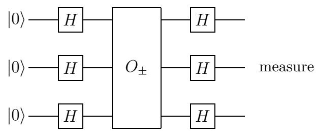
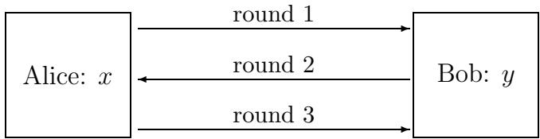
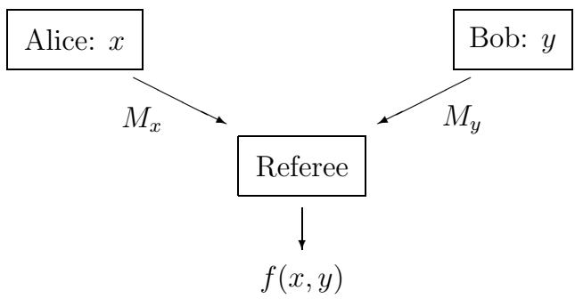
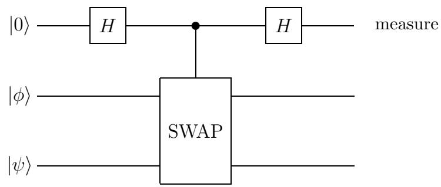

# Quantum Computing and

# Communication Complexity

# Ronald de Wolf

# Quantum Computing and

Communication Complexity

For further information about ILLC-publications, please contact

Institute for Logic, Language and Computation   
Universiteit van Amsterdam   
Plantage Muidergracht 24   
1018 TV Amsterdam   
phone: +31-20-525 6051   
fax: +31-20-525 5206   
e-mail: illc@wins.uva.nl   
homepage: http://www.illc.uva.nl/

# Quantum Computing and

# Communication Complexity

# Academisch Proefschrift

ter verkrijging van de graad van doctor aan de   
Universiteit van Amsterdam   
op gezag van de Rector Magnificus   
prof.dr. J.J.M. Franse   
ten overstaan van een door het college voor   
promoties ingestelde commissie, in het openbaar   
te verdedigen in de Aula der Universiteit   
op donderdag 6 september 2001, te 12.00 uur

door

# Ronald Michiel de Wolf

geboren te Zaandam.

Promotiecommissie:

Promotores: Prof.dr. H.M. Buhrman Prof.dr.ir. P.M.B. Vit´anyi   
Overige leden: Prof.dr. R.E. Cleve Dr. M. Santha Prof.dr. A. Schrijver Dr. L. Torenvliet

Faculteit der Natuurwetenschappen, Wiskunde en Informatica

Se non \`e vero, \`e ben trovato.

# Acknowledgments

# 1 Quantum Computing 1

# 1.1 Introduction . . 1

1.2 Quantum Mechanics 2   
1.2.1 Superposition 3   
1.2.2 Measurement 3   
1.2.3 Unitary evolution 4   
1.3 Quantum Memory 5   
1.4 Quantum Computation . 7   
1.4.1 Classical circuits 7   
1.4.2 Quantum circuits 8   
1.5 The Early Algorithms 10   
1.5.1 Deutsch-Jozsa . . 11   
1.5.2 Bernstein-Vazirani 13   
1.5.3 Simon 13   
1.6 Shor’s Factoring Algorithm . 15   
1.6.1 Reduction from factoring to period-finding 15   
1.6.2 The quantum Fourier transform 16   
1.6.3 Period-finding, easy case: $r$ divides $q$ . . 17   
1.6.4 Period-finding, hard case: $r$ does not divide $q$ 19   
1.7 Grover’s Search Algorithm . 19

1.8 Summary 21

# I Query Complexity

23

2 Lower Bounds by Polynomials 25

# 2.1 Introduction . 25

2.2 Boolean Functions and Polynomials 27   
2.2.1 Boolean functions . . 27   
2.2.2 Multilinear polynomials 27   
2.2.3 Representing and approximating functions 28   
2.3 Query Complexity 31   
2.3.1 Deterministic 31   
2.3.2 Randomized . 31   
2.3.3 Quantum 33   
2.4 Degree Lower Bounds on Query Complexity 34   
2.5 Polynomial Relation for All Total Functions 36   
2.5.1 Certificate complexity and block sensitivity . 36   
2.5.2 Polynomial bound for $Q _ { E } ( f )$ and $Q _ { 0 } ( f )$ 39   
2.5.3 Polynomial bound for $Q _ { 2 } ( f )$ 41   
2.6 Symmetric Functions 42   
2.6.1 Tight bounds 43   
2.6.2 OR . 44   
2.6.3 PARITY . 45   
2.6.4 MAJORITY 46   
2.7 Monotone Functions 46   
2.7.1 Improvements of the general bounds 46   
2.7.2 Tight bounds for zero-error 47   
2.7.3 Monotone graph properties . 49   
2.8 Summary 51

# 3 Bounds for Quantum Search 53

3.1 Introduction . . . . 53   
3.2 Tight Bounds for Unordered Search 55   
3.3 Application to Success Amplification 60   
3.4 Lower Bound for Ordered Searching . 61   
3.4.1 Intuition . 61   
3.4.2 Simulating queries to an ordered input 62   
3.4.3 Lower bound for ordered search 65   
3.5 Summary . . 66

# 4 Element Distinctness and Related Problems 67

4.1 Introduction . . . . 67   
4.2 Finding Claws if $f$ and $g$ Are not Ordered 69   
4.3 Finding Claws if $f$ is Ordered . 72   
4.4 Finding Claws if both $f$ and $g$ Are Ordered 72   
4.5 Finding a Triangle in a Graph . 74   
4.6 Summary . . 75

# 5 Average-Case and Non-Deterministic Query Complexity 77

5.1 Introduction . . . 77   
5.2 Average-Case Complexity: Definitions 78   
5.3 Average-Case: Deterministic vs. Bounded-Error 80   
5.4 Average-Case: Randomized vs. Quantum 81   
5.4.1 The function 81   
5.4.2 Quantum upper bound . . 82   
5.4.3 Classical lower bound . 84   
5.4.4 Worst-case quantum complexity of $f$ 85   
5.5 Further Average-Case Results . 86   
5.5.1 Super-exponential gap for non-uniform $\mu$ 86   
5.5.2 General bounds . . 86   
5.5.3 MAJORITY . 87   
5.5.4 PARITY . . 90   
5.6 Non-Deterministic Complexity: Definitions . 90   
5.7 Non-Deterministic Complexity: Characterization and Separation . 92   
5.7.1 Non-deterministic polynomials . 93   
5.7.2 Characterization of $N ( f )$ and $N Q ( f )$ 94   
5.7.3 Separations . 95   
5.7.4 Relation of $N Q ( f )$ to other complexities 96   
5.8 Summary 97

# II Communication and Complexity 99

# 6 Quantum Communication Complexity 101

6.1 Introduction . 101   
6.2 Quantum Communication 102   
6.3 The Model of Communication Complexity 104   
6.3.1 Classical . 104   
6.3.2 Quantum 106   
6.4 Quantum Upper Bounds 108   
6.4.1 Initial steps 108   
6.4.2 Buhrman, Cleve, and Wigderson 108   
6.4.3 Raz 110   
6.5 Some Applications 111   
6.6 Other Developments 112   
6.7 Summary . . . . 113

# 7 Lower Bounds for Quantum Communication Complexity 115

7.1 Introduction 115   
7.2 Lower Bounds for Exact Protocols . 117   
7.3 A Lower Bound Technique via Polynomials . . . 121   
7.3.1 Decompositions and polynomials 121   
7.3.2 Symmetric functions 123   
7.3.3 Monotone functions . 126   
7.4 Lower Bounds for Bounded-Error Protocols 127   
7.5 Non-Deterministic Complexity . 133   
7.5.1 Some definitions . . 133   
7.5.2 Equality to non-deterministic rank 134   
7.5.3 Exponential quantum-classical separation . 135   
7.6 Open Problems 136   
7.7 Summary . 137

# 8 Quantum Fingerprinting 139

8.1 Introduction . 139   
8.2 Simultaneous Message Passing . 141   
8.3 Short Near-Orthogonal Quantum States 145   
8.4 The State Distinguishing Problem . 146   
8.5 Exactly Orthogonal Quantum States 148   
8.6 Exact Fingerprinting with a Quantum Key 150   
8.7 Quantum Data Structures 151   
8.7.1 The quantum case 151   
8.7.2 Comparison with the classical case 153   
8.8 Summary . . . 154

# 9 Private Quantum Channels 155

# 9.1 Introduction . . 155

9.2 Preliminaries 157   
9.2.1 Mixed states and superoperators 157   
9.2.2 Von Neumann entropy 158   
9.3 Definition of Private Quantum Channel 159   
9.4 Examples and Properties of PQCs . 160   
9.5 Lower Bound on the Entropy of PQCs 164   
9.6 Summary . . . 167

# A Some Useful Linear Algebra 169

A.1 Some Terminology and Notation . 169   
A.2 Unitary Matrices . 170   
A.3 Diagonalization and Singular Values . . 170   
A.4 Trace . . 172   
A.5 Tensor Products . . 172   
A.6 Rank . . 173   
A.7 Dirac Notation 173

# Bibliography

Samenvatting 189

Abstract 193

List of Symbols 197

Index 199

First and foremost I want to thank Harry Buhrman, who in the last four years has been a very creative and interminable source of interesting problems, as well as of clever ideas for solving those problems. Most of this thesis is owed to him, either directly or indirectly. Secondly I want to thank Paul Vit´anyi, who gave me the PhD position that resulted in this thesis and who has been a source of good advice during these years, scientific and otherwise. I also thank him for a very careful reading of this thesis. I further want to thank Shan-Hwei Nienhuys-Cheng for making me a scientist and for gently pushing me towards the area of complexity theory after the work we did together on Inductive Logic Programming during my undergraduate years in Rotterdam. Thanks also to the people who were willing to take place in the thesis committee: Richard Cleve, Miklos Santha, Lex Schrijver, and Leen Torenvliet. I thank the University of Amsterdam (ILLC) for hiring me and the Centre for Mathematics and Computer Science (CWI) for hosting me.

I also thank the co-authors of the various papers that make up this thesis: Harry Buhrman (7 x), Richard Cleve (3 x), Andris Ambainis (2 x), Michele Mosca (2 x), Robert Beals, Christoph D¨urr, Mark Heiligman, Peter Høyer, Fr´ed´eric Magniez, Miklos Santha, Alain Tapp, John Watrous, and Christof Zalka.

Furthermore I want to thank the following people for many pleasant, interesting, and useful scientific discussions throughout the period of my PhD-ship, many of which contributed to the papers on which this thesis is based: Dorit Aharonov, Krzysztof Apt, Johan van Benthem, P. Oscar Boykin, Wim van Dam, Jordi Delgado, David Deutsch, David DiVincenzo, Yevgeniy Dodis, Lance Fortnow, P´eter G´acs, Mart de Graaf, Lov Grover, Vesa Halava, Edith and Lane Hemaspaandra, Mika Hirvensalo, Hoi-Kwong Lo, Rashindra Manniesing, Dieter van Melkebeek, Ashwin Nayak, Noam Nisan, Michael Nielsen, Ramamohan Paturi, John Preskill, Hein R¨ohrig, John Smolin, Mario Szegedy, Barbara Terhal, John Tromp, Umesh Vazirani, and Louis Wingers. Special thanks to Peter Gr¨unwald and Hartmut Klauck for a close reading of parts of the thesis. Thanks to Marco Vervoort for his user-friendly ILLC style files.

Finally, I want to thank my parents, family, and friends for many things beyond the scope of this thesis.

Ronald de Wolf July 2001, Amsterdam

# Quantum Computing

# 1.1 Introduction

Today’s computers—both in theory (Turing machines) and practice (PCs)—are based on classical physics. However, modern quantum physics tells us that the world behaves quite differently. A quantum system can be in a superposition of many different states at the same time, and can exhibit interference effects during the course of its evolution. Moreover, spatially separated quantum systems may be entangled with each other and operations may have “non-local” effects because of this.

Quantum computation is the field that investigates the computational power and other properties of computers based on quantum-mechanical principles. An important objective is to find quantum algorithms that are significantly faster than any classical algorithm solving the same problem. The field started in the early 1980s with suggestions for analog quantum computers by Paul Benioff [22] and Richard Feynman [74, 75], and reached more digital ground when in 1985 David Deutsch defined the universal quantum Turing machine [61]. The following years saw only sparse activity, notably the development of the first algorithms by Deutsch and Jozsa [63] and by Simon [152], and the development of quantum complexity theory by Bernstein and Vazirani [28]. However, interest in the field increased tremendously after Peter Shor’s very surprising discovery of efficient quantum algorithms for the problems of integer factorization and discrete logarithms in 1994 [151]. Since most of current classical cryptography is based on the assumption that these two problems are computationally hard, the ability to actually build and use a quantum computer would allow us to break most current classical cryptographic systems, notably the RSA system [140, 142]. (In contrast, a quantum form of cryptography due to Bennett and Brassard [26] is unbreakable even for quantum computers.)

This chapter is intended to be an introduction to the model of quantum computation and to the main quantum algorithms that have been found so far, all of which are conveniently named after their inventors: Deutsch-Jozsa, Bernstein-Vazirani, Simon, Shor, and Grover. Some familiarity with computational complexity theory will be useful, but is not necessary for understanding the chapter. We start with an abstract explanation of quantum mechanics in Section 1.2. Section 1.3 explains what quantum bits and quantum memory look like, and Section 1.4 shows how we can compute with quantum memory. In the last three sections we explain the above-mentioned quantum algorithms in detail.

Before limiting ourselves to theory, let us say a few words about practice: to what extent will quantum computers ever be built? At this point in time, it is just too early to tell. The first small 2-qubit quantum computer was built in 1997 and at the time of writing (early 2001), the largest implemented quantum algorithm uses a mere 5 qubits [156]. The practical problems facing physical realizations of quantum computers seem formidable. The problems of noise and decoherence have to some extent been solved in theory by the discovery of quantum errorcorrecting codes and fault-tolerant computing (see e.g. [130, Chapter 10]), but these problems are by no means solved in practice. On the other hand, we should realize that the field of physical realization of quantum computing is still in its infancy and that classical computing had to face and solve many formidable technical problems as well—interestingly, often these problems were even of the same nature as those now faced by quantum computing (e.g., noise-reduction and error-correction). Moreover, the difficulties facing the implementation of a full quantum computer may seem daunting, but more limited things involving quantum communication have already been implemented with some success, for example quantum cryptography and teleportation (which is the process of sending qubits using entanglement and classical communication).

Even if the theory of quantum computing never materializes to a real physical computer, quantum-mechanical computers are still an extremely interesting idea which will bear fruit in other areas than practical fast computing. On the physics side, it may improve our understanding of quantum mechanics. The emerging theory of entanglement has already done this to some extent. On the computer science side, the theory of quantum computation generalizes and enriches classical complexity theory and may help resolve some of its problems. This explains the motto of the present thesis: se non \`e vero, \`e ben trovato, which roughly translates as “even if it is not true, it’s still a nice idea”.

# 1.2 Quantum Mechanics

Here we give a brief and abstract introduction to quantum mechanics. In short: a quantum state is a superposition of classical states, to which we can apply either a measurement or a unitary operation. For the required linear algebra and Dirac notation we refer to Appendix A.

# 1.2.1 Superposition

Consider some physical system that can be in $N$ different, mutually exclusive classical states. Call these states $\vert 1 \rangle , \vert 2 \rangle , \dots , \vert N \rangle$ . Roughly, by a “classical” state we mean a state in which the system can be found if we observe it. A pure quantum state (usually just called state) $| \phi \rangle$ is a superposition of classical states, written

$$
| \phi \rangle = \alpha _ { 1 } | 1 \rangle + \alpha _ { 2 } | 2 \rangle + \cdot \cdot \cdot + \alpha _ { N } | N \rangle .
$$

Here $\alpha _ { i }$ is a complex number that is called the amplitude of $| i \rangle$ in $| \phi \rangle$ . Intuitively, a system in quantum state $| \phi \rangle$ is in all classical states at the same time! It is in state $| 1 \rangle$ with amplitude $\alpha _ { 1 }$ , in state $\left| 2 \right.$ with amplitude $\alpha _ { 2 }$ , and so on. Mathematically, the states $| 1 \rangle , \ldots , | N \rangle$ form an orthonormal basis of an $N$ -dimensional Hilbert space (i.e., an $N$ -dimensional vector space equipped with an inner product) of dimension $N$ , and a quantum state $| \phi \rangle$ is a vector in this space.

# 1.2.2 Measurement

There are two things we can do with a quantum state: measure it or let it evolve unitarily without measuring it. We will deal with measurement first.

# Measurement in the computational basis

Suppose we measure state $| \phi \rangle$ . We cannot “see” a superposition itself, but only classical states. Accordingly, if we measure state $| \phi \rangle$ we will see one and only one classical state $| j \rangle$ . Which specific $| j \rangle$ will we see? This is not determined in advance; the only thing we can say is that we will see state $| j \rangle$ with probability $| \alpha _ { j } | ^ { 2 }$ , which is the squared norm of the corresponding amplitude $\alpha _ { j }$ ( $| a + i b | =$ $\sqrt { a ^ { 2 } + b ^ { 2 } } )$ . Thus observing a quantum state induces a probability distribution on $\begin{array} { r } { \sum _ { j = 1 } ^ { N } | \alpha _ { j } | ^ { 2 } = 1 } \end{array}$ ates, given by the squared norms of the amplitudes. This implies, so the vector of amplitudes has (Euclidean) norm 1. If we measure $| \phi \rangle$ and see classical state $| j \rangle$ as a result, then $| \phi \rangle$ itself has “disappeared”, and all that is left is $| j \rangle$ . In other words, observing $| \phi \rangle$ “collapses” the quantum superposition $| \phi \rangle$ to the classical state $| j \rangle$ that we saw, and all “information” that might have been contained in the amplitudes $\alpha _ { i }$ is gone.

# Orthogonal measurement

A somewhat more general kind of measurement than the above “measurement in the computational (or standard) basis” is possible. This will be used only sparsely in the thesis, and not not at all in this chapter, so it may be skipped on a first reading. Such an orthogonal measurement is described by projectors $P _ { 1 } , \dots , P _ { M }$ ( $M \leq N$ ) which sum to identity. These projectors are orthogonal, meaning that $P _ { i } P _ { j } = 0$ if $i \neq j$ . The projector $P _ { j }$ projects on some subspace $V _ { j }$ of the total Hilbert space $V$ , and every state $| \phi \rangle \in V$ can be decomposed in a unique way as $\begin{array} { r } { | \phi \rangle = \sum _ { j = 1 } ^ { M } | \phi _ { j } \rangle } \end{array}$ , with $| \phi _ { j } \rangle = P _ { j } | \phi \rangle \in V _ { j }$ . Because the projectors are orthogonal, the subspaces $V _ { j }$ are orthogonal as well, as are the states $| \phi _ { j } \rangle$ . When we apply this measurement to the pure state $| \phi \rangle$ , then we will get outcome $j$ with probability $\parallel | \phi _ { j } \rangle \parallel ^ { 2 } = \mathrm { T r } ( P _ { j } | \phi \rangle \langle \phi | )$ and the state will then “collapse” to the new state $\vert \phi _ { j } \rangle / \parallel \vert \phi _ { j } \rangle \parallel = P _ { j } \vert \phi \rangle / \parallel P _ { j } \vert \phi \rangle \parallel$ .

For example, a measurement in the standard basis is the specific orthogonal   
measurement where $M \ = \ N$ and $P _ { j } = \vert j \rangle \langle j \vert$ . That is, $P _ { j }$ projects onto the   
by standard basis state $| j \rangle$ | i. Consider the state and the corresponding subspace $\begin{array} { r } { | \phi \rangle = \sum _ { j = 1 } ^ { N } \alpha _ { j } | j \rangle } \end{array}$ . Note that $P _ { j } | \phi \rangle = \alpha _ { j } | j \rangle$ $V _ { j }$ is the space spanned , so applying   
our measurement to $| \phi \rangle$ will give outcome $j$ with probability $\parallel \alpha _ { j } \lvert j \rangle \parallel ^ { 2 } = \lvert \alpha _ { j } \rvert ^ { 2 }$ ,   
and in that case the state collapses to $\frac { \alpha _ { j } } { | \alpha _ { j } | }$ may b | j |disregarded because it has no physical significance, so we end up with $\begin{array} { r } { \alpha _ { j } | j \rangle / \left| | \alpha _ { j } | j \rangle \right| | = \frac { \alpha _ { j } } { | \alpha _ { j } | } | j \rangle } \end{array}$ . The norm-1 factor $| j \rangle$

As another example, a measurement that distinguishes between $| j \rangle$ with $j \le$ $N / 2$ and $| j \rangle$ with $j > N / 2$ corresponds to the two projectors $\begin{array} { r } { P _ { 1 } = \sum _ { j \leq N / 2 } | j \rangle \langle j | } \end{array}$ and $\begin{array} { r } { P _ { 2 } = \sum _ { j > N / 2 } | j \rangle \langle j | } \end{array}$ . Applying this measurement to the state $\begin{array} { r } { | \phi \rangle = \frac { 1 } { \sqrt { 3 } } | 1 \rangle + } \end{array}$ ${ \sqrt { \frac { 2 } { 3 } } } | N \rangle$ will give outcome 1 with probability $\parallel P _ { 1 } | \phi \rangle \parallel ^ { 2 } = 1 / 3$ , in which case the state collapses to $| 1 \rangle$ , and will give outcome 2 with probability $\| \ P _ { 2 } | \phi \rangle \| ^ { 2 } = 2 / 3$ , in which case the state collapses to $| N \rangle$ . We refer to the book of Nielsen and Chuang [130] for the even more general but not really more powerful POVMformalism of measurement, which we will not need in this thesis.

# 1.2.3 Unitary evolution

Instead of measuring $| \phi \rangle$ , we can also apply some operation to it, i.e., change the state to some

$$
| \psi \rangle = \beta _ { 1 } | 1 \rangle + \beta _ { 2 } | 2 \rangle + \dotsb + \beta _ { N } | N \rangle .
$$

Quantum mechanics only allows linear operations to be applied to quantum states. What this means is: if we view a state like $| \phi \rangle$ as an $N$ -dimensional vector $( \alpha _ { 1 } , \ldots , \alpha _ { N } ) ^ { T }$ , then applying an operation that changes $| \phi \rangle$ to $| \psi \rangle$ corresponds to multiplying $| \phi \rangle$ with an $N \times N$ complex-valued matrix $U$ :

$$
U \left( \begin{array} { c } { { \alpha _ { 1 } } } \\ { { \vdots } } \\ { { \alpha _ { N } } } \end{array} \right) = \left( \begin{array} { c } { { \beta _ { 1 } } } \\ { { \vdots } } \\ { { \beta _ { N } } } \end{array} \right) .
$$

Note that by linearity we have $\begin{array} { r } { | \psi \rangle = U | \phi \rangle = U ( \sum _ { i } \alpha _ { i } | i \rangle ) = \sum _ { i } \alpha _ { i } U | i \rangle } \end{array}$

Because mthe constraint $| \psi \rangle$ ould also give a probability distr. This implies that the operation ution, we havemust preserve $\begin{array} { r } { \sum _ { j = 1 } ^ { N } | \beta _ { j } | ^ { 2 } = 1 } \end{array}$ $U$ the norm of vectors, and hence must be a unitary transformation. A matrix $U$ is unitary if its inverse $U ^ { - 1 }$ equals its conjugate transpose $U ^ { * }$ . This is equivalent to saying that $U$ always maps a vector of norm 1 to a vector of norm 1. Because a unitary transformation always has an inverse, it follows that any (non-measuring) operation on quantum states must be reversible: by applying $U ^ { - 1 }$ we can always “undo” the action of $U$ , and nothing is lost in the process. On the other hand, a measurement is clearly non-reversible, because we cannot reconstruct $| \phi \rangle$ from the observed classical state $| j \rangle$ .

# 1.3 Quantum Memory

In classical computation, the unit of information is a $b i t$ , which can be $0$ or $1$ . In quantum computation, this unit is a quantum bit $( q u b i t )$ , which is a superposition of 0 and 1. Consider a system with 2 basis states, call them $| 0 \rangle$ and $| 1 \rangle$ . We identify these basis states with the vectors $\left( \begin{array} { l } { 1 } \\ { 0 } \end{array} \right)$ and $\left( \begin{array} { l } { 0 } \\ { 1 } \end{array} \right)$ , respectively. A single qubit can be in any superposition

$$
\alpha _ { 0 } | 0 \rangle + \alpha _ { 1 } | 1 \rangle , | \alpha _ { 0 } | ^ { 2 } + | \alpha _ { 1 } | ^ { 2 } = 1 .
$$

Accordingly, a single qubit “lives” in the vector space $\mathbb { C } ^ { 2 }$ . Similarly we can think of systems of more than 1 qubit, which “live” in the tensor product space of several qubit systems. For instance, a 2-qubit system has 4 basis states: $\left| 0 \right. \otimes \left| 0 \right.$ , $\left| 0 \right. \otimes \left| 1 \right.$ , $\left| 1 \right. \otimes \left| 0 \right.$ , $| 1 \rangle \otimes | 1 \rangle$ . Here for instance $\left| 1 \right. \otimes \left| 0 \right.$ means that the first qubit is in its basis state $| 1 \rangle$ and the second qubit is in its basis state $| 0 \rangle$ . We will often abbreviate this to $| 1 \rangle | 0 \rangle$ , $| 1 , 0 \rangle$ , or even $| 1 0 \rangle$ .

More generally, a register of $n$ qubits has $2 ^ { n }$ basis states, each of the form $\left| b _ { 1 } \right. \otimes \left| b _ { 2 } \right. \otimes . . . \otimes \left| b _ { n } \right.$ , with $b _ { i } \in \{ 0 , 1 \}$ . We can abbreviate this to $\left| b _ { 1 } b _ { 2 } \ldots b _ { n } \right.$ . We will often abbreviate $0 \ldots 0$ to $\vec { 0 }$ . Since bitstrings of length $n$ can be viewed as numbers between 0 and $2 ^ { n } - 1$ , we can also write the basis states as numbers $| 0 \rangle , | 1 \rangle , | 2 \rangle , \ldots , | 2 ^ { n } - 1 \rangle$ . A quantum register of $n$ qubits can be in any superposition

$$
\alpha _ { 0 } | 0 \rangle + \alpha _ { 1 } | 1 \rangle + \cdots + \alpha _ { 2 ^ { n } - 1 } | 2 ^ { n } - 1 \rangle , \sum _ { j = 0 } ^ { 2 ^ { n } - 1 } | \alpha _ { j } | ^ { 2 } = 1 .
$$

If we measure this in the standard basis, we obtain the $n$ -bit state state $| j \rangle$ with probability $| \alpha _ { j } | ^ { 2 }$ .

Measuring just the first qubit of a state would correspond to the orthogonal measurement that has the two projectors $P _ { 0 } = \vert 0 \rangle \langle 0 \vert \otimes I _ { 2 ^ { n - 1 } }$ and $P _ { 1 } = | 1 \rangle \langle 1 | \otimes$ $I _ { 2 ^ { n - 1 } }$ . For example, applying this measurement to the state ${ \scriptstyle { \frac { 1 } { \sqrt { 3 } } } } | 0 \rangle | \phi \rangle + { \sqrt { \frac { 2 } { 3 } } } | 1 \rangle | \psi \rangle$ will give outcome 0 with probability $1 / 3$ (the state then becomes $| 0 \rangle | \phi \rangle$ ) and outcome 1 with probability $2 / 3$ (the state then becomes $| 1 \rangle | \psi \rangle$ ). Similarly, measuring the first $n$ qubits of an $( n + m )$ -qubit state in the standard basis corresponds to the orthogonal measurement that has $2 ^ { n }$ projectors $P _ { i } = | i \rangle \langle i | \otimes I _ { 2 ^ { m } }$ for $i \in \{ 0 , 1 \} ^ { n }$ .

An important property that deserves to be mentioned is entanglement, which refers to quantum correlations between different qubits. For instance, consider a 2-qubit register that is in the state

$$
{ \frac { 1 } { \sqrt { 2 } } } | 0 0 \rangle + { \frac { 1 } { \sqrt { 2 } } } | 1 1 \rangle .
$$

Such 2-qubit states are sometimes called EPR-pairs in honor of Einstein, Podolsky, and Rosen [67], who first examined such states and their seemingly paradoxical properties. Initially neither of the two qubits has a classical value $| 0 \rangle$ or $| 1 \rangle$ . However, if we measure the first qubit and observe, say, a $| 0 \rangle$ , then the whole state collapses to 00 . Thus observing only the first qubit immediately fixes also the second, unobserved qubit to a classical value. Therefore this system is called entangled. Since the two qubits that make up the register may be far apart, this example illustrates some of the non-local effects that quantum systems can exhibit. In general, a bipartite state $| \phi \rangle$ is called entangled if it cannot be written as a tensor product $\left| \phi _ { A } \right. \otimes \left| \phi _ { B } \right.$ where $| \phi _ { A } \rangle$ lives in the first space and $| \phi _ { B } \rangle$ lives in the second.

At this point, a comparison with classical probability distributions may be helpful. Suppose we have two probability spaces, $A$ and $B$ , the first with $2 ^ { n }$ possible outcomes, the second with $2 ^ { m }$ possible outcomes. A distribution on the first space can be described by $2 ^ { n }$ numbers (non-negative reals summing to 1; actually there are only $2 ^ { n } - 1$ degrees of freedom here) and a distribution on the second by $2 ^ { m }$ numbers. Accordingly, a product distribution on the joint space can be described by $2 ^ { n } + 2 ^ { m }$ numbers. However, an arbitrary (non-product) distribution on the joint space takes $2 ^ { n + m }$ real numbers, since there are $2 ^ { n + m }$ possible outcomes in total. Analogously, an $n$ -qubit state $| \phi _ { A } \rangle$ can be described by $2 ^ { n }$ numbers (complex numbers whose squared moduli sum to $1$ ), an $m$ -qubit state $| \phi _ { B } \rangle$ by $2 ^ { m }$ numbers, and their tensor product $\left| \phi _ { A } \right. \otimes \left| \phi _ { B } \right.$ by $2 ^ { n } + 2 ^ { m }$ numbers. However, an arbitrary (possibly entangled) state in the joint space takes $2 ^ { n + m }$ numbers, since it lives in a $2 ^ { n + m }$ -dimensional space. We see that the number of parameters required to describe quantum states is the same as the number of parameters needed to describe probability distributions. Also note the analogy between statistical independence of two random variables $A$ and $B$ and non-entanglement of the product state $\left| \phi _ { A } \right. \otimes \left| \phi _ { B } \right.$ . However, despite the similarities between probabilities and amplitudes, quantum states are much more powerful than distributions, because amplitudes may have negative parts which can lead to interference effects. Amplitudes only become probabilities when we square them. The art of quantum computing is to use these special properties for interesting computational purposes.

# 1.4 Quantum Computation

Below we explain how a quantum computer can apply computational steps to its register of qubits. Two models exist for this: the quantum Turing machine [61, 28] and the quantum circuit model [62, 165]. These models are equivalent, in the sense that they can simulate each other in polynomial time, assuming the circuits are appropriately “uniform”. We only explain the circuit model here, which is more popular among researchers.

# 1.4.1 Classical circuits

In classical complexity theory, a Boolean circuit is a finite directed acyclic graph with AND, OR, and NOT gates. It has $n$ input nodes, which contain the $n$ input bits ( $n \geq 0$ ). The internal nodes are AND, OR, and NOT gates, and there are one or more designated output nodes. The initial input bits are fed into AND, OR, and NOT gates according to the circuit, and eventually the output nodes assume some value. We say that a circuit computes some Boolean function $f : \{ 0 , 1 \} ^ { n }  \{ 0 , 1 \} ^ { m }$ if the output nodes get the right value $f ( x )$ for every input $x \in \{ 0 , 1 \} ^ { n }$ .

A circuit family is a set ${ \mathcal C } \ = \ \{ C _ { n } \}$ of circuits, one for each input size $n$ . Each circuit has one output bit. Such a family recognizes or decides a language $L \subseteq \{ 0 , 1 \} ^ { * }$ if, for every $n$ and every input $x \in \{ 0 , 1 \} ^ { n }$ , the circuit $C _ { n }$ outputs 1 if $x \in L$ and outputs 0 otherwise. Such a circuit family is uniformly polynomial if there is a deterministic Turing machine that outputs $C _ { n }$ given $n$ as input, using space logarithmic in $n$ (this implies time polynomial in $n$ , because such a machine will have only $p o l y ( n )$ different internal states, so it either halts after $p o l y ( n )$ steps or cycles forever). Note that the size (number of gates) of the circuits $C _ { n }$ can then grow at most polynomially with $n$ . It is known that uniformly polynomial circuit families are equal in power to polynomial-time deterministic Turing machines: a language $L$ can be decided by a uniformly polynomial circuit family iff $L \in \mathbf { P }$ [135, Theorem 11.5], where $\mathbf { P }$ is the class of languages decidable by polynomial-time Turing machines.

Similarly we can consider randomized circuits. These receive, in addition to the $n$ input bits, also some random bits (“coin flips”) as input. A randomized circuit computes a function $f$ if it successfully outputs the right answer $f ( x )$ with probability at least $2 / 3$ for every $x$ (probability taken over the values of the random bits; the $2 / 3$ may be replaced by any $1 / 2 + \varepsilon$ ). Randomized circuits are equal in power to randomized Turing machines: a language $L$ can be decided by a uniformly polynomial randomized circuit family iff $L \in \mathbf { B P P }$ , where BPP (“Bounded-error Probabilistic Polynomial time”) is the class of languages that can efficiently be recognized by randomized Turing machines with success probability at least 2/3. Clearly $\mathbf { P } \subseteq \mathbf { B P P }$ . It is unknown whether this inclusion is strict.

# 1.4.2 Quantum circuits

A quantum circuit (also called quantum network or quantum gate array) generalizes the idea of classical circuit families, replacing the AND, OR, and NOT gates by elementary quantum gates. A quantum gate is a unitary transformation on a small (usually 1, 2, or 3) number of qubits. Mathematically, these gates can be composed by taking tensor products (if gates are applied in parallel to different parts of the register) and ordinary products (if gates are applied sequentially). Simple examples of such circuits of elementary gates are given in the next section.

A widely used example of a 1-qubit gate is the Hadamard transform, specified by:

$$
\begin{array} { c } { { H | 0 \rangle = \displaystyle \frac { 1 } { \sqrt { 2 } } | 0 \rangle + \displaystyle \frac { 1 } { \sqrt { 2 } } | 1 \rangle } } \\ { { H | 1 \rangle = \displaystyle \frac { 1 } { \sqrt { 2 } } | 0 \rangle - \displaystyle \frac { 1 } { \sqrt { 2 } } | 1 \rangle } } \end{array}
$$

As a unitary matrix, this is represented as

$$
H = \frac { 1 } { \sqrt { 2 } } \left( \begin{array} { r r } { 1 } & { 1 } \\ { 1 } & { - 1 } \end{array} \right) .
$$

If we apply $H$ to initial state $| 0 \rangle$ and then measure, we have equal probability of observing $| 0 \rangle$ or $| 1 \rangle$ . Similarly, applying $H$ to $| 1 \rangle$ and observing gives equal probability of $| 0 \rangle$ or $| 1 \rangle$ . However, if we apply $H$ to the superposition $\textstyle { \frac { 1 } { \sqrt { 2 } } } | 0 \rangle + { \frac { 1 } { \sqrt { 2 } } } | 1 \rangle$ then we obtain $| 0 \rangle$ : the positive and negative amplitudes for $| 1 \rangle$ cancel out! This effect is called interference, and is analogous to interference patterns between light or sound waves. Note that if we apply $H$ to each bit in a register of $n$ zeroes, we obtain $\textstyle { \frac { 1 } { \sqrt { 2 ^ { n } } } } \sum _ { j \in \{ 0 , 1 \} ^ { n } } | j \rangle$ , which is a superposition of all $n$ -bit strings. More generally, if we apply $H ^ { \otimes n }$ to an initial state $| i \rangle$ , with $i \in \{ 0 , 1 \} ^ { n }$ , we obtain

$$
H ^ { \otimes n } | i \rangle = \frac { 1 } { \sqrt { 2 ^ { n } } } \sum _ { j \in \{ 0 , 1 \} ^ { n } } ( - 1 ) ^ { i \cdot j } | j \rangle ,
$$

where $\begin{array} { r } { i { \cdot } j = \sum _ { k = 1 } ^ { n } i _ { k } j _ { k } } \end{array}$ denotes the inner product of the $n$ -bit strings $i , j \in \{ 0 , 1 \} ^ { n }$ . For example:

$$
H ^ { \otimes 2 } | 0 1 \rangle = \frac { 1 } { \sqrt { 2 } } ( | 0 \rangle + | 1 \rangle ) \otimes \frac { 1 } { \sqrt { 2 } } ( | 0 \rangle - | 1 \rangle ) = \frac { 1 } { 2 } \sum _ { j \in \{ 0 , 1 \} ^ { 2 } } ( - 1 ) ^ { 0 1 \cdot j } | j \rangle .
$$

The $n$ -fold Hadamard transform will be very useful for the quantum algorithms explained in the next section.

Another important 1-qubit gate is the phase gate $R _ { \phi }$ , which merely rotates the phase of the $| 1 \rangle$ -state by an angle $\phi$ :

$$
\begin{array} { l } { { R _ { \phi } | 0 \rangle = | 0 \rangle } } \\ { { R _ { \phi } | 1 \rangle = e ^ { i \phi } | 1 \rangle } } \end{array}
$$

This corresponds to the unitary matrix

$$
R = \left( \begin{array} { c c } { { 1 } } & { { 0 } } \\ { { 0 } } & { { e ^ { i \phi } } } \end{array} \right) .
$$

An example of a 2-qubit gate is the controlled-not gate CNOT. It negates the second bit of its input if the first bit is 1, and does nothing if the first bit is 0:

$$
\begin{array} { l l } { \operatorname { C N O T } | 0 \rangle | b \rangle = | 0 \rangle | b \rangle } \\ { \operatorname { C N O T } | 1 \rangle | b \rangle = | 1 \rangle | 1 - b \rangle } \end{array}
$$

In matrix form, this is

$$
\mathrm { C N O T } = \left( \begin{array} { l l l l } { 1 } & { 0 } & { 0 } & { 0 } \\ { 0 } & { 1 } & { 0 } & { 0 } \\ { 0 } & { 0 } & { 0 } & { 1 } \\ { 0 } & { 0 } & { 1 } & { 0 } \end{array} \right) .
$$

As in the classical case, a quantum circuit is a finite directed acyclic graph of input nodes, gates, and output nodes. There are $n$ nodes that contain the input (as classical bits); in addition we may have some more input nodes that are initially $| 0 \rangle$ (“workspace”). The internal nodes of the quantum circuit are quantum gates that each operate on at most 2 qubits of the state. The gates in the circuit transform the initial state vector into a final state, which will generally be a superposition. We measure some dedicated output bits of this final state to (probabilistically) obtain an answer. It is known that the set of all 1-qubit operations together with the 2-qubit CNOT gate is universal, meaning that any other unitary transformation can be built from these gates. Allowing all 1-qubit gates is not very realistic from an implementational point of view, as there are uncountably many of them. However, the model is usually restricted, only allowing a small finite set of 1-qubit gates from which all other 1-qubit gates can be efficiently approximated. For example, it is known that the set consisting of CNOT, Hadamard, and the phase-gate $R _ { \pi / 4 }$ is universal in the sense of approximation. In the main part of this thesis we will not be much concerned with the actual gate-complexity of our unitary transformations, so we refer to [16, 130] for more details.

The classical classes $\mathbf { P }$ and BPP can now be generalized as follows. EQP (“Exact Quantum Polynomial time”) is the class of languages that can be recognized with success probability 1 by uniformly polynomial quantum circuits. BQP (“Bounded-error Quantum Polynomial time”) is the class of languages that can be recognized with success probability at least $2 / 3$ by uniformly polynomial quantum circuits. Since classical computations can be made reversible at a small cost, and every reversible classical computation is a quantum computation, it follows that $\mathbf { P } \subseteq \mathbf { E Q P }$ and $\mathbf { B P P \subseteq B Q P }$ . One of the main open question of quantum complexity theory is whether these inclusions are strict, and more generally what is the power of BQP. The main candidate to separate BPP and BQP is the factoring problem, to be explained below when we come to Shor’s factoring algorithm. The inclusion $\mathbf { B Q P \subseteq P S P A C E }$ was proven in [28], where PSPACE denotes the class of all problems that can be solved by classical Turing machines using space polynomial in the input length. A stronger inclusion for BQP was shown in [76].

One uniquely quantum-mechanical effect that we can use for building quantum algorithms is quantum parallelism. Suppose we have a classical algorithm that computes some function $f : \{ 0 , 1 \} ^ { n }  \{ 0 , 1 \} ^ { m }$ . Then we can build a quantum circuit $U$ that maps $| x \rangle | 0 \rangle \to | x \rangle | f ( x ) \rangle$ for every $x \in \{ 0 , 1 \} ^ { n }$ . Now suppose we apply $U$ to a superposition of all inputs $x$ (which is easy to build using $n$ Hadamard transforms):

$$
U \left( { \frac { 1 } { \sqrt { 2 ^ { n } } } } \sum _ { x \in \{ 0 , 1 \} ^ { n } } | x \rangle | 0 \rangle \right) = { \frac { 1 } { \sqrt { 2 ^ { n } } } } \sum _ { x \in \{ 0 , 1 \} ^ { n } } | x \rangle | f ( x ) \rangle .
$$

We applied $U$ just once, but the final superposition contains $f ( x )$ for all $2 ^ { n }$ input values $x$ ! However, by itself this is not very useful and does not give more than classical randomization, since observing the final superposition will give just one random $| x \rangle | f ( x ) \rangle$ and all other information will be lost. As we will see below, quantum parallelism needs to be combined with the effects of interference and entanglement in order to get something that is better than classical.

# 1.5 The Early Algorithms

The two main successes of quantum algorithm so far are Shor’s factoring algorithm from 1994 [151] and Grover’s search algorithm from 1996 [83], which will be discussed in the following sections. In this section we describe the sequence of earlier quantum algorithms that preceded Shor’s and Grover’s.

Virtually all quantum algorithms work with queries in some form or other. We will explain this model here. It may look contrived at first, but eventually will lead smoothly to Shor’s and Grover’s algorithm. We should, however, emphasize that the query complexity model differs from the standard model described above, because the input is now given as a “black-box”. This means that the exponential quantum-classical separations that we describe below (like Simon’s) do not by themselves give exponential quantum-classical separations in the standard model. In particular, they do not imply $\mathbf { B P P } \neq \mathbf { B Q P }$ .

To explain the query setting, consider an $N$ -bit input $x = ( x _ { 1 } , \ldots , x _ { N } ) \in$ $\{ 0 , 1 \} ^ { N }$ . Usually we will have $N = 2 ^ { n }$ , so that we can address bit $x _ { i }$ using an $n$ -bit index $i$ . One can think of the input as an $N$ -bit memory which we can access at any point of our choice (a Random Access Memory). A memory access is via a so-called “black-box”, which is equipped to output the bit $x _ { i }$ on input $i$ .

As a quantum operation, this would be the following unitary mapping on $n + 1$ qubits:

$$
O : | i , 0 \rangle  | i , x _ { i } \rangle .
$$

The $( n + 1 ) \mathrm { s t }$ qubit of the state is called the target bit. Since this operation must be unitary, we also have to specify what happens if the initial value of the target bit is 1. Therefore we actually let $O$ be the following unitary transformation:

$$
O : | i , b \rangle \to | i , b \oplus x _ { i } \rangle ,
$$

here $i \in \{ 0 , 1 \} ^ { n }$ , $b \in \{ 0 , 1 \}$ , and $\bigoplus$ denotes exclusive-or (addition modulo 2). In matrix representation, $O$ is now a permutation matrix and hence unitary. Note also that a quantum computer can apply $O$ on a superposition of various $i$ , something a classical computer cannot do. One application of this black-box is called a query, and counting the required number of queries to compute this or that function of $x$ is something we will do a lot in the first half of this thesis.

Given the ability to make a query of the above type, we can also make a query of the form $\begin{array} { r } { | i \rangle  ( - 1 ) ^ { x _ { i } } | i \rangle } \end{array}$ by setting the target bit to the state $| \Delta \rangle =$ $\textstyle { \frac { 1 } { \sqrt { 2 } } } ( \left| 0 \right. - \left| 1 \right. )$ :

$$
O \left( | i \rangle | \Delta \rangle \right) = | i \rangle { \frac { 1 } { \sqrt { 2 } } } { \big ( } | x _ { i } \rangle - | 1 - x _ { i } \rangle { \big ) } = ( - 1 ) ^ { x _ { i } } | i \rangle | \Delta \rangle .
$$

This $\pm .$ -kind of query puts the output variable in the phase of the state: if $x _ { i }$ is $1$ then we get a $- 1$ in the phase; if $x _ { i } = 0$ nothing happens. This is sometimes more convenient than the standard type of query. We denote the corresponding $n$ -qubit unitary transformation by $O _ { \pm }$ .

# 1.5.1 Deutsch-Jozsa

# Deutsch-Jozsa problem [63]:

For $N = 2 ^ { n }$ , we are given $x \in \{ 0 , 1 \} ^ { N }$ such that either (1) all $x _ { i }$ have the same value (“constant”), or (2) $N / 2$ of the $x _ { i }$ are $0$ and $N / 2$ are 1 (“balanced”). The goal is to find out whether $x$ is constant or balanced.

The algorithm of Deutsch and Jozsa is as follows. We start in the $n$ -qubit zero state $\mathinner { | { \vec { 0 } } \rangle }$ , apply a Hadamard transform to each qubit, apply a query (in its $\pm$ -form), apply another Hadamard to each qubit, and then measure the final state. As a unitary transformation, the algorithm would be $H ^ { \otimes n } O _ { \pm } H ^ { \otimes n }$ . We have drawn the corresponding quantum circuit in Figure 1.1 (where time progresses from left to right).

Let us follow the state through these operations. Initially we have the state $| 0 ^ { n } \rangle$ . By Equation 1.1 on page 8, after the first Hadamard transforms we have obtained the uniform superposition of all $i$ :

  
Figure 1.1: The Deutsch-Jozsa algorithm for $n = 3$

$$
{ \frac { 1 } { \sqrt { 2 ^ { n } } } } \sum _ { i \in \{ 0 , 1 \} ^ { n } } | i \rangle .
$$

The $O _ { \pm }$ -query turns this into

$$
{ \frac { 1 } { \sqrt { 2 ^ { n } } } } \sum _ { i \in \{ 0 , 1 \} ^ { n } } ( - 1 ) ^ { x _ { i } } | i \rangle .
$$

Applying another Hadamard gives (again by Equation 1.1) the final superposition

$$
{ \frac { 1 } { 2 ^ { n } } } \sum _ { i \in \{ 0 , 1 \} ^ { n } } ( - 1 ) ^ { x _ { i } } \sum _ { j \in \{ 0 , 1 \} ^ { n } } ( - 1 ) ^ { i \cdot j } | j \rangle ,
$$

where $\begin{array} { r } { i \cdot j = \sum _ { k = 1 } ^ { n } i _ { k } j _ { k } } \end{array}$ as before. Since $i \cdot \vec { 0 } = 0$ for all $i \in \{ 0 , 1 \} ^ { n }$ , we see that the amplitude of the $\mathinner { | { \vec { 0 } } \rangle }$ -state in the final superposition is

$$
{ \frac { 1 } { 2 ^ { n } } } \sum _ { i \in \{ 0 , 1 \} ^ { n } } ( - 1 ) ^ { x _ { i } } = { \left\{ \begin{array} { l l } { \ 1 } & { { \mathrm { ~ i f ~ } } x _ { i } = 0 { \mathrm { ~ f o r ~ a l l ~ } } i , } \\ { - 1 } & { { \mathrm { ~ i f ~ } } x _ { i } = 1 { \mathrm { ~ f o r ~ a l l ~ } } i , } \\ { \ 0 } & { { \mathrm { ~ i f ~ } } x { \mathrm { ~ i s ~ b a l a n c e d . } } } \end{array} \right. }
$$

Hence the final observation will yield $\mathinner { | { \vec { 0 } } \rangle }$ if $x$ is constant and will yield some other state if $x$ is balanced. Accordingly, the Deutsch-Jozsa problem can be solved with certainty using only 1 quantum query and $O ( n )$ other operations (the original solution of Deutsch and Jozsa used 2 queries, the 1-query solution is from [55]).

In contrast, it is easy to see that any classical deterministic algorithm needs at least $N / 2 + 1$ queries: if it has made only $N / 2$ queries and seen only 0s, the correct output is still undetermined. However, a classical algorithm can solve this problem efficiently if we allow a small error probability: just query $x$ at two random positions, output “constant” if those bits are the same and “balanced” if they are different. This algorithm outputs the correct answer with probability 1 if $x$ is constant and outputs the correct answer with probability $1 / 2$ if $x$ is balanced. Thus the quantum-classical separation of this problem only holds if we consider algorithms without error probability.

# 1.5.2 Bernstein-Vazirani

# Bernstein-Vazirani problem [28]:

For $N \ = \ 2 ^ { n }$ , we are given $x \in \{ 0 , 1 \} ^ { N }$ with the property that there is some unknown $a \in \{ 0 , 1 \} ^ { n }$ such that $x _ { i } = ( i \cdot a )$ mod 2. The goal is to find $a$ .

The Bernstein-Vazirani algorithm is exactly the same as the Deutsch-Jozsa algorithm, but now the final observation miraculously yields $a$ . Since $( - 1 ) ^ { x _ { i } } =$ $( - 1 ) ^ { ( i \cdot a ) }$ mod $^ 2 = ( - 1 ) ^ { i \cdot a }$ , we can write the state obtained after the query as:

$$
{ \frac { 1 } { \sqrt { 2 ^ { n } } } } \sum _ { i \in \{ 0 , 1 \} ^ { n } } ( - 1 ) ^ { x _ { i } } | i \rangle = { \frac { 1 } { \sqrt { 2 ^ { n } } } } \sum _ { i \in \{ 0 , 1 \} ^ { n } } ( - 1 ) ^ { i \cdot a } | i \rangle .
$$

Applying a Hadamard to each qubit will turn this into the classical state $| a \rangle$ and hence solves the problem with 1 query and $O ( n )$ other operations. In contrast, any classical algorithm (even a randomized one with small error probability) needs to ask $n$ queries for information-theoretic reasons: the final answer consists of $n$ bits and one classical query gives at most 1 bit of information.

Bernstein and Vazirani also defined a recursive version of this problem, which can be solved exactly by a quantum algorithm in $p o l y ( n )$ steps, but for which any classical randomized algorithm needs $n ^ { \Omega ( \log n ) }$ steps.

# 1.5.3 Simon

Let $N = 2 ^ { n }$ , and $[ N ] = \{ 1 , \dots , N \}$ , which we can identify with $\{ 0 , 1 \} ^ { n }$ . Let $j \oplus s$ be the $n$ -bit string obtained by bitwise adding the $n$ -bit strings $j$ and $s$ mod 2.

# Simon’s problem [152]:

For $N = 2 ^ { n }$ , we are given ${ \boldsymbol x } = ( x _ { 1 } , \dots , x _ { N } )$ , with $x _ { i } \in \{ 0 , 1 \} ^ { n }$ , with the property that there is some unknown non-zero $s \in \{ 0 , 1 \} ^ { n }$ such that $x _ { i } = x _ { j }$ iff $i = j \oplus s$ . The goal is to find $s$ .

Note that $x$ , viewed as a function from $[ N ]$ to $[ N ]$ is a 2-to-1 function, where the 2-to-1-ness is determined by the unknown mask $s$ . The queries to the input here are slightly different from before: the input ${ \boldsymbol x } = ( x _ { 1 } , \dots , x _ { N } )$ now has variables $x _ { i }$ that themselves are $n$ -bit strings, and one query gives such a string completely $( | i , \vec { 0 } \rangle  | i , x _ { i } \rangle ) ^ { \cdot }$ ). However, we can also view this problem as having $n 2 ^ { n }$ binary variables that we can query individually. Since we can simulate one $x _ { i }$ -query using only $n$ binary queries (just query all $n$ bits of $x _ { i }$ ), this alternative view will not affect the number of queries very much.

Simon’s algorithm starts out very similar to Deutsch-Jozsa: start in a state of $2 n$ zero qubits $\mathinner { | { \vec { 0 } } \rangle }$ and apply Hadamard transforms to the first $n$ qubits, giving

$$
{ \frac { 1 } { \sqrt { 2 ^ { n } } } } \sum _ { i \in \{ 0 , 1 \} ^ { n } } | i \rangle | \vec { 0 } \rangle .
$$

At this point, the second $n$ -qubit register still holds only zeroes. A query turns this into

$$
{ \frac { 1 } { \sqrt { 2 ^ { n } } } } \sum _ { i \in \{ 0 , 1 \} ^ { n } } | i \rangle | x _ { i } \rangle .
$$

Now the algorithm measures the second $n$ -bit register (this measurement is actually not necessary, but it facilitates analysis). The measurement outcome will be some value $x _ { i }$ and the first register will collapse to the superposition of the two indices having that $x _ { i }$ -value:

$$
{ \frac { 1 } { \sqrt { 2 } } } ( | i \rangle + | i \oplus s \rangle ) | x _ { i } \rangle .
$$

We will now ignore the second register and apply Hadamard transforms to the first $n$ qubits. Using Equation 1.1 and the fact that $( i \oplus s ) \cdot j = ( i \cdot j ) \oplus ( s \cdot j )$ , we can write the resulting state as

$$
\begin{array} { c } { { \displaystyle { \frac { 1 } { \sqrt { 2 ^ { n + 1 } } } \left( \sum _ { j \in \{ 0 , 1 \} ^ { n } } ( - 1 ) ^ { i \cdot j } \vert j \rangle + \sum _ { j \in \{ 0 , 1 \} ^ { n } } ( - 1 ) ^ { ( i \Phi s ) \cdot j } \vert j \rangle \right) = } } } \\ { { { \displaystyle { \frac { 1 } { \sqrt { 2 ^ { n + 1 } } } \left( \sum _ { j \in \{ 0 , 1 \} ^ { n } } ( - 1 ) ^ { i \cdot j } \left( 1 + ( - 1 ) ^ { s \cdot j } \right) \vert j \rangle \right) . } } } } \end{array}
$$

Note that $| j \rangle$ has non-zero amplitude iff $s \cdot j = 0$ mod 2. Accordingly, if we measure the final state we get a linear equation that gives information about $s$ . Repeating this algorithm an expected number of $O ( n )$ times, we obtain $n$ independent linear equations involving $s$ , from which we can extract $s$ efficiently by a classical algorithm (Gaussian elimination over $G F ( 2 )$ ). Simon’s algorithm thus finds $s$ using an expected number of $O ( n )$ $x _ { i }$ -queries and polynomially many other operations. Later, Brassard and Høyer [34] gave a variant of Simon’s algorithm that solves the problem using only polynomial (in $n$ ) quantum operations even in the worst-case.

Simon [152] proved that any classical randomized algorithm that finds $s$ with high probability needs to make $\Omega ( { \sqrt { 2 ^ { n } } } )$ queries.1 This was the first proven exponential separation between quantum algorithms and classical bounded-error algorithms (let us stress again that this does not prove $\mathbf { B P P } \neq \mathbf { B Q P }$ , because we are counting queries rather than ordinary operations here). Simon’s algorithm inspired Shor to his factoring algorithm, which we describe below.

# 1.6 Shor’s Factoring Algorithm

Probably the most important quantum algorithm so far is Shor’s factoring algorithm [151]. It can find a factor of a composite number $N$ in roughly $( \log N ) ^ { 2 }$ steps, which is polynomial in the length $\log N$ of the input. On the other hand, there is no known classical (deterministic or randomized) algorithm that can factor $N$ in polynomial time. The best known classical randomized algorithms run in time roughly

$$
2 ^ { ( \log N ) ^ { \alpha } } ,
$$

where $\alpha = 1 / 3$ for a heuristic upper bound [110] and $\alpha = 1 / 2$ for a rigorous upper bound [111]. In fact, much of modern cryptography is based on the conjecture that no fast classical factoring algorithm exists [142]. All this cryptography (for example RSA) would be broken if Shor’s algorithm could be physically realized. In terms of complexity classes: factoring (rather, the decision problem equivalent to it) is provably in BQP but is not known to be in BPP. If indeed factoring is not in BPP, then the quantum computer would be the first counterexample to the “strong” Church-Turing thesis, which states that all “reasonable” models of computation are polynomially equivalent (see [68] and [135, p.31,36]).

Shor also gave a similar algorithm for solving the discrete logarithm problem. His algorithm was subsequently generalized to solve the so-called Abelian hidden subgroup problem and phase-estimation problem [99, 55, 124]. We will not go into those issues here, and restrict to an explanation of the quantum factoring algorithm.

# 1.6.1 Reduction from factoring to period-finding

The crucial observation of Shor was that there is an efficient quantum algorithm for the problem of period-finding and that factoring can be reduced to this. We first explain the reduction. Suppose we want to find factors of the composite number $N > 1$ . Randomly choose some integer $x \in \{ 2 , \ldots , N - 1 \}$ which is coprime to $N$ (if $x$ is not coprime to $N$ , then the greatest common divisor of $x$ and $N$ is a factor of $N$ , so then we are already done). Now consider the sequence

$$
1 = x ^ { 0 } { \bmod { N } } , x ^ { 1 } { \bmod { N } } , x ^ { 2 } { \bmod { N } } , \ldots .
$$

This sequence will cycle after a while: there is a least $0 \textless r \leq N$ such that $x ^ { r } = 1$ mod $N$ . This $r$ is called the period of the sequence. It can be shown that with probability $\geq 1 / 4$ , $r$ is even and $x ^ { r / 2 } + 1$ and $x ^ { r / 2 } - 1$ are not multiples of $N$ . In that case we have:

$$
\begin{array} { r l r } { x ^ { r } } & { \equiv } & { 1 \mathrm { m o d } N \quad \Longleftrightarrow } \\ { ( x ^ { r / 2 } ) ^ { 2 } } & { \equiv } & { 1 \mathrm { m o d } N \quad \Longleftrightarrow } \\ { ( x ^ { r / 2 } + 1 ) ( x ^ { r / 2 } - 1 ) } & { \equiv } & { 0 \mathrm { m o d } N \quad \Longleftrightarrow } \\ { ( x ^ { r / 2 } + 1 ) ( x ^ { r / 2 } - 1 ) } & { = } & { k N \mathrm { f o r } \mathrm { s o m e } k . } \end{array}
$$

Note that $k > 0$ because both $x ^ { r / 2 } + 1 > 0$ and $x ^ { r / 2 } - 1 > 0$ ( $x > 1$ ). Hence $x ^ { r / 2 } + 1$ or $x ^ { r / 2 } - 1$ will share a factor with $N$ . Because $x ^ { r / 2 } + 1$ and $x ^ { r / 2 } - 1$ are not multiples of $N$ this factor will be $< N$ , and in fact both these numbers will share a non-trivial factor with $N$ . Accordingly, if we have $r$ then we can efficiently (in roughly $\log N$ steps) compute the greatest common divisors $g c d ( x ^ { r / 2 } + 1 , N )$ and $g c d ( x ^ { r / 2 } - 1 , N )$ , and both of these two numbers will be non-trivial factors of $N$ . If we are unlucky we might have chosen an $x$ that does not give a factor (which we can detect efficiently), but trying a few different random $x$ gives a high probability of finding a factor.

Thus the problem of factoring reduces to finding the period $r$ of the function given by modular exponentiation $f ( a ) \ = \ x ^ { a }$ mod $N$ . In general, the periodfinding problem can be stated as follows:

# The period-finding problem:

We are given some function $f : \mathbb { N } \to \lfloor N \rfloor$ with the property that there is some unknown $r \in [ N ]$ such that $f ( a ) = f ( b )$ iff $a = b$ mod $r$ . The goal is to find $r$ .

We will show below how we can solve this problem efficiently, using $O ( \log \log N )$ evaluations of $f$ and $O ( \log \log N )$ quantum Fourier transforms. An evaluation of $f$ can be viewed as analogous to the application of a query in the previous algorithms. Even a somewhat more general kind of period-finding can be solved by Shor’s algorithm with very few $f$ -evaluations, whereas any classical boundederror algorithm would need to evaluate the function $\Omega ( N ^ { 1 / 3 } / \sqrt { \log N } )$ times in order to find the period [52].

How many steps (elementary gates) will the algorithm take? For $a = N ^ { O ( 1 ) }$ , we can compute $f ( a ) \ = \ x ^ { a }$ mod $N$ in $O ( ( \log N ) ^ { 2 } \log \log N \log \log \log N )$ steps: compute $x ^ { 2 }$ mod $N , x ^ { 4 }$ mod $N , x ^ { 8 }$ mod $N , \ldots$ by repeated squaring (using the Sch¨onhage-Strassen algorithm for fast multiplication [106]) and take an appropriate product of these to get $x ^ { a }$ mod $N$ . Moreover, as explained below, the quantum Fourier transform can be implemented using $O ( ( \log N ) ^ { 2 } )$ steps. Accordingly, Shor’s algorithm finds a factor of $N$ using an expected number of roughly $( \log N ) ^ { 2 } ( \log \log N ) ^ { 2 } \log \log \log N$ steps, which is only slightly worse than quadratic in the length of the input.

# 1.6.2 The quantum Fourier transform

For some number $q$ , let $Z _ { q } = \{ 0 , \ldots , q - 1 \}$ . For each $a \in Z _ { q }$ define a function $\chi _ { a } : Z _ { q } \to \mathbb { C }$ by

$$
\chi _ { a } ( b ) = e ^ { 2 \pi i \frac { a b } { q } } .
$$

The set of basis states $\{ | a \rangle | a \in Z _ { q } \}$ is called the standard basis. An alternative orthonormal basis, called the Fourier basis, is the set $\{ | \chi _ { a } \rangle | a \in Z _ { q } \}$ defined by

$$
| \chi _ { a } \rangle = \frac { 1 } { \sqrt { q } } \sum _ { b \in Z _ { q } } \chi _ { a } ( b ) | b \rangle .
$$

The quantum Fourier transform (QFT) is the unitary transformation that maps the standard basis to the Fourier basis:

$$
\mathrm { Q F T } \colon | a \rangle  | \chi _ { a } \rangle .
$$

It is known that if $q = 2 ^ { m }$ for some $m$ , then the QFT can be implemented on a quantum computer using $O ( ( \log q ) ^ { 2 } )$ elementary gates. We will here present the construction from [55]; somewhat more efficient constructions can be found in [57, 85, 56]. It may be verified (with some effort) that applying QFT to an $m$ -bit basis state $| a \rangle = | a _ { 1 } \dots a _ { m } \rangle$ gives an unentangled state:

$$
\vert \chi _ { a } \rangle = \frac { 1 } { \sqrt { 2 ^ { m } } } \left( \vert 0 \rangle + e ^ { 2 \pi i ( 0 . a _ { m } ) } \vert 1 \rangle \right) ( \vert 0 \rangle + e ^ { 2 \pi i ( 0 . a _ { m - 1 } a _ { m } ) } \vert 1 \rangle ) \cdot \cdot \cdot ( \vert 0 \rangle + e ^ { 2 \pi i ( 0 . a _ { 1 } . . . a _ { m } ) } \vert 1 \rangle ) ,
$$

with $0 . a _ { j } \ldots a _ { m }$ interpreted as a fraction in binary digits. This means that we can just restrict attention to single-qubit operations controlled by the values of the $a _ { i }$ -bits, as follows. To the rightmost qubit of the initial state, which is initially $\left| a _ { m } \right.$ , we apply a Hadamard gate, obtaining ${ \frac { 1 } { \sqrt { 2 } } } ( | 0 \rangle + e ^ { 2 \pi i ( 0 . a _ { m } ) } | 1 \rangle )$ . This is the leftmost qubit of $\left| \chi _ { a } \right.$ . To the second qubit from the right in the initial state, which is initially $\left| a _ { m - 1 } \right.$ , we apply a Hadamard, and if $a _ { m } = 1$ we also apply the phase gate $R _ { 2 \pi i ( 1 / 4 ) }$ , obtaining $\textstyle { \frac { 1 } { \sqrt { 2 } } } { \bigl ( } | 0 \rangle + e ^ { 2 \pi i ( 0 . a _ { m - 1 } a _ { m } ) } | 1 \rangle { \bigr ) }$ . This is the second qubit from the left of $\left| \chi _ { a } \right.$ . We also do this for $\left| a _ { m - 2 } \right.$ , $\left| a _ { m - 3 } \right.$ , “rotating in” smaller and smaller angles etc., and eventually generating all qubits of $\left| \chi _ { a } \right.$ in the wrong order. Applying some swap gates to change the order, we have constructed $\left| \chi _ { a } \right.$ using $O ( m ^ { 2 } )$ operations. But if we have a circuit that works for basis states $| a \rangle$ , then by linearity it also works on all superpositions of basis states, so we have constructed the full quantum Fourier transform. Graphical representations of this circuit may be found in [55, 130].

# 1.6.3 Period-finding, easy case: $r$ divides $q$

Now we will show how we can find the period of the function $f$ , given a “blackbox” that maps $| a \rangle | 0 \rangle  | a \rangle | f ( a ) \rangle$ . We can always efficiently pick some $q = 2 ^ { m }$ such that $N ^ { 2 } < q \leq 2 N ^ { 2 }$ and we can implement the Fourier transform over $Z _ { q }$ using $O ( ( \log N ) ^ { 2 } )$ gates.

For didactical reasons, we will first assume that the unknown $r$ divides $q$ , in which case everything works out smoothly. We now find $r$ as follows. Start with $| 0 \rangle | 0 \rangle$ , two registers of $\lceil \log q \rceil$ and $\lceil \log N \rceil$ zeroes, respectively. Apply the QFT to the first register to build the uniform superposition

$$
{ \frac { 1 } { \sqrt { q } } } \sum _ { a = 0 } ^ { q - 1 } | a \rangle | \vec { 0 } \rangle .
$$

(Actually the $m$ -qubit Hadamard transform would have the same effect here.) The second register still consists of zeroes. Now use the “black-box” to compute

$f ( a )$ in quantum parallel:

$$
{ \frac { 1 } { \sqrt { q } } } \sum _ { a = 0 } ^ { q - 1 } | a \rangle | f ( a ) \rangle .
$$

Observing the second register gives some value $f ( s )$ , with $s < r$ . Because $f ( a ) =$ $f ( s )$ iff $a = s$ mod $r$ , and $r$ divides $q$ , the $a$ of the form $a = j r + s$ $0 \leq j < q / r$ ) are exactly the $a$ for which $f ( a ) = f ( s )$ . Thus the first register collapses to a superposition of $| s \rangle , | r + s \rangle$ , $, | 2 r + s \rangle , \ldots , | q - r + s \rangle$ and the second register collapses to the classical state $| f ( s ) \rangle$ . We can now ignore the second register, and have in the first:

$$
\sqrt { \frac { r } { q } } \sum _ { j = 0 } ^ { q / r - 1 } | j r + s \rangle .
$$

Applying the QFT again gives

$$
\sqrt { \frac { r } { q } } \sum _ { j = 0 } ^ { q / r - 1 } \sum _ { b = 0 } ^ { q - 1 } e ^ { 2 \pi i \frac { ( j r + s ) b } { q } } | b \rangle = \sqrt { \frac { r } { q } } \sum _ { b = 0 } ^ { q - 1 } e ^ { 2 \pi i \frac { s b } { q } } \left( \sum _ { j = 0 } ^ { q / r - 1 } e ^ { 2 \pi i \frac { j r b } { q } } \right) | b \rangle .
$$

Using that $\textstyle \sum _ { j = 0 } ^ { n - 1 } a ^ { j } = ( 1 - a ^ { n } ) / ( 1 - a )$ for $a \neq 1$ , we compute:

$$
\sum _ { j = 0 } ^ { q / r - 1 } e ^ { 2 \pi i { \frac { j r b } { q } } } = \sum _ { j = 0 } ^ { q / r - 1 } \left( e ^ { 2 \pi i { \frac { r b } { q } } } \right) ^ { j } = { \left\{ \begin{array} { l l } { q / r } & { { \mathrm { i f ~ } } e ^ { 2 \pi i { \frac { r b } { q } } } = 1 } \\ { \frac { 1 - \left( e ^ { 2 \pi i { \frac { r b } { q } } } \right) ^ { q / r } } { 1 - e ^ { 2 \pi i { \frac { r b } { q } } } } = { \frac { 1 - e ^ { 2 \pi i b } } { 1 - e ^ { 2 \pi i { \frac { r b } { q } } } } } = 0 } & { { \mathrm { i f ~ } } e ^ { 2 \pi i { \frac { r b } { q } } } \neq 1 } \end{array} \right. }
$$

Note that $e ^ { 2 \pi i r b / q } = 1 $ iff $r b / q$ is an integer iff $b$ is a multiple of $q / r$ . Accordingly, we are left with a superposition where only the multiples of $q / r$ have non-zero amplitude. Observing this final superposition gives some random multiple $b =$ $c q / r$ , with $c$ a random number $0 \leq c < r$ . Thus we get a $b$ such that

$$
{ \frac { b } { q } } = { \frac { c } { r } } ,
$$

where $b$ and $q$ are known and $c$ and $r$ are not. There are $\phi ( \boldsymbol { r } ) \in \Omega ( r / \log \log r )$ numbers smaller than $r$ that are coprime to $r$ [86, Theorem 328], so $c$ will be coprime to $r$ with probability $\Omega ( 1 / \log \log r )$ . Accordingly, an expected number of $O ( \log \log N )$ repetitions of the procedure of this section suffices to obtain a $b = c q / r$ with $c$ coprime to $r$ . Once we have such a $b$ , we can obtain $r$ as the denominator by writing $b / q$ in lowest terms.

Before continuing with the harder case, notice the resemblance of the basic subroutine of Shor’s algorithm (Fourier, $f$ -evaluation, Fourier) with the basic subroutine of Simon’s algorithm (Hadamard, query, Hadamard). The number of required $f$ -evaluations for period-finding can actually be reduced from $O ( \log \log N )$ to $O ( 1 )$ , see Shor’s paper [151] for details.

# 1.6.4 Period-finding, hard case: $r$ does not divide $q$

In case $r$ does not divide $q$ (which is actually very likely), it can be shown that applying exactly the same algorithm will still yield with high probability a $b$ such that

$$
\left| { \frac { b } { q } } - { \frac { c } { r } } \right| \leq { \frac { 1 } { 2 q } } ,
$$

with $b , q$ known and $c , r$ unknown. Two distinct fractions, each with denominator $\leq N$ , must be at least $1 / N ^ { 2 } > 1 / q$ apart.2 Therefore $c / r$ is the only fraction with denominator $\leq N$ at distance $\leq 1 / 2 q$ from $b / q$ . Applying continued-fraction expansion (see [86, Chapter X]) to $b / q$ efficiently gives us the fraction with denominator $\leq N$ that is closest to $b / q$ . This fraction must be $c / r$ . Again, with good probability $c$ and $r$ will be coprime, in which case writing $c / r$ in lowest terms gives us $r$ .

# 1.7 Grover’s Search Algorithm

# The search problem:

For $N = 2 ^ { n }$ , we are given an arbitrary $x \in \{ 0 , 1 \} ^ { N }$ . The goal is to find an $i$ such that $x _ { i } = 1$ (and to output ‘no solutions’ if there are no such $\imath$ ).

This problem may be viewed as a simplification of the problem of searching an $N$ -slot unordered database. Classically, a randomized algorithm would need $\Theta ( N )$ queries to solve the search problem. Grover’s algorithm solves it in $O ( { \sqrt { N } } )$ queries.

Let $\begin{array} { r } { O _ { x } | i \rangle = ( - 1 ) ^ { x _ { i } } | i \rangle } \end{array}$ denote the $\pm$ -type oracle for the input $x$ and $O _ { G }$ be the unitary transformation that puts a $- 1$ in front of $\mathinner { | { \vec { 0 } } \rangle }$ and does nothing to the other basis states. The Grover iterate is $G = - H ^ { \otimes n } O _ { G } H ^ { \otimes n } O _ { x }$ . Note that 1 Grover iterate corresponds to 1 query.

Grover’s algorithm starts in the $n$ -bit state $\mathinner { | { \vec { 0 } } \rangle }$ , applies a Hadamard transformation to each qubit to get the uniform superposition $\begin{array} { r } { \frac { 1 } { \sqrt { N } } \sum _ { i } \left| i \right. } \end{array}$ of all $N$ indices, applies $G$ to this state $k$ times (for some $k$ to be chosen later), and then measures the final state. Intuitively, what happens is that in each iteration some amplitude is moved from the indices of the 0-bits to the indices of the 1-bits. The algorithm stops when almost all of the amplitude is on the 1-bits, in which case a measurement of the final state will probably give the index of a 1-bit.

More precisely, suppose that $t$ of the $N$ input bits are 1. Let $a _ { k }$ denote the amplitude of the indices of the $t$ $1$ -bits after $k$ Grover iterates and $b _ { k }$ the amplitude of the indices of the 0-bits. Initially, for the uniform superposition we have $a _ { 0 } = b _ { 0 } = 1 / \sqrt { N }$ . Using that $H ^ { \otimes n } O _ { G } H ^ { \otimes n } = I - [ 2 / N ]$ , where $[ 2 / N ]$ is the matrix in which all entries are $2 / N$ , we find the following recursion:

$$
\begin{array} { r c l } { { a _ { k + 1 } } } & { { = } } & { { \displaystyle \frac { N - 2 t } { N } a _ { k } + \frac { 2 ( N - t ) } { N } b _ { k } } } \\ { { } } & { { } } & { { } } \\ { { b _ { k + 1 } } } & { { = } } & { { \displaystyle \frac { - 2 t } { N } a _ { k } + \frac { N - 2 t } { N } b _ { k } } } \end{array}
$$

The following formulas, due to Boyer et al. [30], provide a closed form for $a _ { k }$ and $b _ { k }$ (which may be verified by filling them into the recursion).

$$
\begin{array} { l l l } { { a _ { k } } } & { { = } } & { { \displaystyle \frac { 1 } { \sqrt t } \sin ( ( 2 k + 1 ) \theta ) \nonumber } } \\ { { b _ { k } } } & { { = } } & { { \displaystyle \frac { 1 } { \sqrt N - t } \cos ( ( 2 k + 1 ) \theta ) \nonumber } } \\ { { } } & { { } } & { { \mathrm { w h e r e ~ } \theta = \arcsin ( \sqrt { t / N } ) } } \end{array}
$$

Accordingly, after $k$ iterations the failure probability (the sum of squares of the amplitudes of the $N - t$ 0-bits) is

$$
P _ { k } = ( N - t ) \cdot b _ { k } ^ { 2 } = ( \cos ( ( 2 k + 1 ) \theta ) ) ^ { 2 } .
$$

We want $P _ { k }$ to be as close to $0$ as possible. Note that if we can choose $\tilde { k } =$ $\pi / 4 \theta - 1 / 2$ , then $( 2 \tilde { k } + 1 ) \theta = \pi / 2$ and hence $P _ { \tilde { k } } = \cos ( \pi / 2 ) ^ { 2 } = 0$ . An example where this works is if $t = N / 4$ , for then $\theta = \pi / 6$ and $\tilde { k } = 1$ .

Unfortunately, $\tilde { k }$ will usually not be an integer. However, if we choose $k$ t o be the integer closest to $\tilde { k }$ , then the failure probability will still be small (using $| k - \tilde { k } | \leq 1 / 2$ and assuming $t \le N / 2$ ):

$$
P _ { k } \le ( \cos ( \pi / 2 + \theta ) ) ^ { 2 } = ( \sin ( \theta ) ) ^ { 2 } = \frac { t } { N } .
$$

Since $\arcsin \phi \geq \phi$ , the number of queries is $\textstyle k \leq \pi / 4 \theta \leq { \frac { \pi } { 4 } } { \sqrt { \frac { N } { t } } }$ . Thus we have a bounded-error quantum search algorithm with $O ( \sqrt { N / t } )$ queries, assuming we know $t$ . If we do not know $t$ , then we do not know which $k$ to use, but a slightly more complicated algorithm due to [30] (basically running the above algorithm with systematic different guesses for $k$ ) shows that $O ( \sqrt { N / t } )$ queries still suffice to find a solution with high probability. If there is no solution ( $t = 0$ ) we can easily detect that by checking $x _ { i }$ for the $i$ that the algorithm outputs.

In Chapter 3 we will make a much more detailed analysis of upper and lower bounds on quantum searching. Before we continue, we mention two general results that can be obtained by techniques similar to Grover’s.

1.7.1. Theorem (Amplitude amplification, BHMT [35]). There exists a quantum algorithm QSearch with the following property. Let A be any quantum algorithm that uses no measurements, and let $\chi : \mathbb { Z } \to \{ 0 , 1 \}$ be any Boolean function. Let $p$ denote the initial success probability of $\mathcal { A }$ of finding a solution (i.e., the probability that a measurement of the final state of $A$ gives a $z$ such that $\chi ( z ) = 1$ ). Algorithm QSearch finds a solution using an expected number of $O ( 1 / { \sqrt { p } } )$ applications of $\mathcal { A }$ and $\boldsymbol { A } ^ { - 1 }$ if $p > 0$ , and otherwise runs forever.

Very briefly, QSearch works very much like Grover’s algorithm: it iterates the unitary transformation $Q = - A S _ { G } A ^ { - 1 } S _ { \chi }$ a number of times, starting with initial state $\boldsymbol { \mathcal { A } } | \vec { 0 } \rangle$ . Here $S _ { \chi } | z \rangle = ( - 1 ) ^ { \chi ( z ) } | z \rangle$ , and $S _ { G } | \vec { 0 } \rangle = - | \vec { 0 } \rangle$ and $S _ { G } | z \rangle = | z \rangle$ for all $z \neq \vec { 0 }$ . The analysis of [35] shows that doing a measurement after $O ( 1 / { \sqrt { p } } )$ iterations of QSearch will yield a solution with probability close to 1. The algorithm QSearch does not need to know the value of $p$ in advance, but if $p$ is known, then a slightly modified QSearch can find a solution with certainty using $O ( 1 / { \sqrt { p } } )$ applications of $\boldsymbol { A }$ and $\boldsymbol { A } ^ { - 1 }$ .

Grover’s algorithm is a special case of amplitude amplification, where $\mathcal { A }$ is the Hadamard transform on each qubit, which can be viewed as an algorithm with success probability $t / N$ . The exact case of amplitude amplification in fact implies an exact quantum search algorithm for the case where $t$ is known. In this case we can find a solution with probability 1 using $O ( \sqrt { N / t } )$ steps.

Combining Grover’s algorithm with the Fourier transform leads to an algorithm that can quickly count the number $t = | x |$ of solutions in the input [35, Theorem 13].

1.7.2. Theorem (Quantum counting, BHMT [35]). There exists a quantum algorithm QCount with the following property. For every $N$ -bit input $x$ (with $t = | x | )$ and number of queries $T$ , and any integer $k \geq 1$ , QCount uses $T$ queries and outputs a number $\tilde { t }$ such that

$$
| t - \tilde { t } | \leq 2 \pi k \frac { \sqrt { t ( N - t ) } } { T } + \pi ^ { 2 } k ^ { 2 } \frac { N } { T ^ { 2 } }
$$

with probability at least $8 / \pi ^ { 2 }$ i f $k = 1$ and probability $\geq 1 - 1 / 2 ( k - 1 )$ if $k > 1$

Roughly speaking, with high probability we will get an estimate $\tilde { t }$ that is close to the real unknown $t$ . For example, if we set $T = 1 0 \sqrt { N }$ , then with high probability we will have $| t - \tilde { t } | \leq \sqrt { t }$ .

# 1.8 Summary

Quantum computing starts from the observation that a computer is a physical device and hence should follow the laws of physics. As it is currently believed that nature is quantum-mechanical at the most fundamental level, it makes sense to consider computers based on the laws of quantum mechanics. A state of such a quantum computer is a superposition of classical states, to which we can apply a measurement or some unitary operation. Quantum algorithms can solve certain problems much faster than classical algorithms. We sketched the early quantum algorithms due to Deutsch & Jozsa, Bernstein & Vazirani, and Simon, as well as the two main quantum algorithms known today: Shor’s algorithm for factoring large integers in polynomial time and Grover’s algorithm for searching a space of $N$ elements in about $\sqrt { N }$ steps.

# Part I

# Query Complexity

# Lower Bounds by Polynomials

This chapter is based on the papers

• R. Beals, H. Buhrman, R. Cleve, M. Mosca, and R. de Wolf. Quantum Lower Bounds by Polynomials. In Proceedings of 39th IEEE FOCS, pages 352–361, 1998. Journal version to appear in the Journal of the ACM. • H. Buhrman, R. Cleve, R. de Wolf, and Ch. Zalka. Bounds for Small-Error and Zero-Error Quantum Algorithms. In Proceedings of 40th IEEE FOCS, pages 358–368, 1999. • H. Buhrman and R. de Wolf. Complexity Measures and Decision Tree Complexity: A Survey. To appear in Theoretical Computer Science, 2001.

# 2.1 Introduction

All quantum algorithms that we described in the previous chapter can be written in the following form: they start in some classical initial state, do a unitary transformation $U _ { 0 }$ on that state, make a query to the input, do another unitary transformation $U _ { 1 }$ , make another query to the input, and so on. Here the transformations $U _ { j }$ are independent of the input. At the end, the output of the algorithm is obtained by applying an appropriate measurement to the final state. Sometimes 1 query suffices, as in the Deutsch-Jozsa case, and sometimes more queries are needed, as in the Simon, Shor, and Grover cases. The reason that the quantum algorithms work fast is twofold: (1) few queries suffice for them and (2) the intermediate unitary transformations $U _ { j }$ are efficiently implementable. The reason that classical algorithms are provably worse than quantum algorithms is that they need many queries to solve the problem. For example, Simon’s algorithm makes $O ( n )$ queries to the input while any classical algorithm requires $\Omega ( { \sqrt { 2 ^ { n } } } )$ queries. Similarly, Grover’s algorithm makes $O ( { \sqrt { N } } )$ queries while any classical algorithm for the same problem needs $\Omega ( N )$ queries.

Since virtually all existing quantum algorithms work in this query model and achieve a provable speed-up there, it seems that the model of query complexity captures a significant part of the power of quantum computers, and it is worth studying the required number of queries in isolation. In contrast, analyzing reason (2) above will be fairly difficult. Classical circuit complexity is already an exceedingly hard field having close ties to the main open problems in complexity theory. For example, superpolynomial circuit lower bounds for an NP-complete problem would imply $\mathbf { P } \neq \mathbf { N P }$ , but the best bounds known are only linear. Since quantum generalizes classical, analyzing quantum circuit complexity (i.e., how many elementary quantum gates are needed to implement some unitary transformation?) will be very hard as well, at least with respect to lower bounds.

In this chapter we will analyze quantum query complexity in detail, contrasting it with classical query complexity, which is also known as decision tree complexity. In order to capture the essentials and to facilitate analysis, we will simplify the model to the following: the input consists of $N$ bits and the output of only 1 bit. For example, Simon’s setting fits in this model by setting $N = n 2 ^ { n }$ , redefining the output to be 0 if the input is 1-to-1 and 1 if the input is 2-to-1 (with an appropriate non-zero mask $s$ ), and querying individual bits of the input rather than $n$ bits at a time. This boosts the query complexity of Simon’s algorithm to $O ( n ^ { 2 } )$ queries, but this is still exponentially smaller than the classical lower bound. Something similar holds for Shor’s period-finding (Cleve [52] proved an exponential classical lower bound on the query complexity of period-finding).

In our analysis, the distinction between total problems and promise problems will be important. A total function or problem is defined on all $2 ^ { N }$ $N$ -bit inputs. A promise problem is restricted to inputs satisfying some specific property, called the “promise”, and is undefined on the inputs that do not satisfy the promise. Looking at the main quantum algorithms, we can divide them in two groups: quantum algorithms that achieve an exponential speed-up for promise problems (Deutsch-Jozsa, Simon, Shor’s period-finding) and quantum algorithms that achieve a polynomial speed-up for total problems (Grover and its applications). An obvious question is then: are there total problems for which a quantum computer can achieve an exponential—or at least superpolynomial—speedup over classical algorithms. The main result of this chapter is a negative answer to this question: for all total functions, quantum query complexity is at most polynomially better than classical deterministic query complexity.

Our main tool in proving this result (as well as many others) will be the degrees of multivariate polynomials that represent or approximate the function $f$ at hand. These we introduce in the next section. In Section 2.3 we define deterministic, randomized, and quantum query complexity, and in Section 2.4 we show how degrees lower bound query complexity. In Section 2.5 we then use those lower bounds to prove the result that quantum and classical query complexity are polynomially related. In the last sections we tighten the proven bounds for the special classes of symmetric and monotone functions.

# 2.2 Boolean Functions and Polynomials

# 2.2.1 Boolean functions

A Boolean function on $N$ bits is a function $f : \mathcal { D }  \{ 0 , 1 \}$ where $\mathcal { D } \subseteq \{ 0 , 1 \} ^ { N }$ . If the domain $\mathcal { D }$ equals $\{ 0 , 1 \} ^ { N }$ then $f$ is called a total function, otherwise it is a promise function (where the promise is that no $N$ -bit strings outside of $\mathcal { D }$ will be presented as input). In this chapter we will restrict attention to total functions. use For an input $\begin{array} { r } { | x | = \sum _ { i = 1 } ^ { N } x _ { i } } \end{array}$ $x \in \{ 0 , 1 \} ^ { N }$ to denote the Hamming weight of , we use $x _ { i }$ to denote its $i$ th bit, so $x$ (its number of 1s), and $x = x _ { 1 } \ldots x _ { N }$ . We $\vec { 0 }$ for the all-zero input. If $S$ is a set of (indices of) variables, then we use $x ^ { S }$ to denote the input obtained by complementing (negating) in $x$ the bit positions in $S$ . We abbreviate $x ^ { \{ i \} }$ to $x ^ { i }$ . For example, if $x = 0 0 1 1$ , then $x ^ { \{ 2 , 3 \} } = 0 1 0 1$ and $x ^ { 4 } = 0 0 1 0$ . We call $f$ symmetric if $f ( x )$ only depends on $| x |$ . Some common $N$ -bit symmetric functions that we will refer to are:

• $\operatorname { O R } _ { N } ( x ) = 1 { \mathrm { ~ i f f ~ } } | x | \geq 1$ • ANDN (x) = 1 iff |x| = N• PARITY $\dot { \mathbf { \rho } } _ { N } ( x ) = 1$ iff $| x |$ is odd• $\mathrm { M A J } _ { N } ( x ) = 1 { \mathrm { ~ i f f ~ } } | x | > N / 2$

We call $f$ monotone (increasing) if $f ( x )$ cannot decrease if we set more variables of $x$ to $1$ . The above $\mathrm { O R } _ { N }$ , $\mathrm { A N D } _ { N }$ , and MAJ $N$ are examples of this.

# 2.2.2 Multilinear polynomials

If $S$ is a set of (indices of) variables, then the monomial $x _ { S }$ is defined as the product of the $S$ -variables: $x _ { S } = \Pi _ { i \in S } x _ { i }$ . The degree of this monomial is the cardinality of $S$ . A multilinear polynomial on $N$ variables is a function $p : \mathbb { R } ^ { N } \to \mathbb { C }$ that can be written as $\begin{array} { r } { p ( x ) = \sum _ { S \subseteq [ N ] } a _ { S } x _ { S } } \end{array}$ for some complex numbers $a _ { S }$ . We call $a _ { S }$ the coefficient of the monomial $x _ { S }$ in $p$ . The degree $d e g ( p )$ of $p$ is the degree of its largest monomial: $d e g ( p ) = \operatorname* { m a x } \{ | S | \ | \ a _ { S } \neq 0 \}$ . Note that if we restrict attention to the Boolean domain $\{ 0 , 1 \} ^ { N }$ , then $x _ { i } = x _ { i } ^ { k }$ for all $k > 1$ , so we can change all higher exponents to 1 without affecting the value of the polynomial on Boolean inputs. This shows that considering only multilinear polynomials is no restriction when dealing with Boolean inputs.

The next lemma implies that if multilinear polynomials $p$ and $q$ are equal on all Boolean inputs, then they are identical:

2.2.1. Lemma. Let $p , q : \mathbb { R } ^ { N } \longrightarrow \mathbb { R }$ be multilinear polynomials of degree at most $d$ . If $p ( x ) = q ( x )$ for all $x \in \{ 0 , 1 \} ^ { N }$ with $| x | \leq d$ , then $p = q$ .

Proof. Define $r ( x ) = p ( x ) - q ( x )$ . Suppose $r$ is not identically zero. Let $x _ { S }$ be a minimal-degree monomial in $r$ with non-zero coefficient $a _ { S }$ , and $x$ be the input where $x _ { j } = 1$ iff $x _ { j }$ occurs in $S$ . Then $| x | \leq d$ , and hence $p ( x ) = q ( x )$ . However, since all monomials in $r$ except for $x _ { S }$ evaluate to $0$ on $x$ , we have $r ( x ) = a _ { S } \neq 0 = p ( x ) - q ( x )$ , which is a contradiction. It follows that $r$ is identically zero and $p = q$ . ✷

Below we sketch the method of symmetrization, due to Minsky and Papert [122] (see also [19, Section 4]). Let $p : \mathbb { R } ^ { N } \to \mathbb { R }$ be a polynomial. If $\pi$ is some permutation and $x = x _ { 1 } \ldots x _ { N }$ , then $\pi ( x ) = ( x _ { \pi ( 1 ) } , \ldots , x _ { \pi ( N ) } )$ . Let $\Sigma _ { N }$ be the set of all $N$ ! permutations. The symmetrization $p ^ { s y m }$ of $p$ averages over all permutations of the input, and is defined as:

$$
p ^ { s y m } ( x ) = \frac { \sum _ { \pi \in \Sigma _ { N } } p ( \pi ( x ) ) } { N ! } .
$$

Note that $p ^ { s y m }$ is a polynomial of degree at most the degree of $p$ . Symmetrizing may actually lower the degree: if $p ( x ) = x _ { 1 } - x _ { 2 }$ , then $p ^ { s y m } ( x ) = 0$ . The following lemma allows us to reduce an $N$ -variate polynomial to a single-variate one.

2.2.2. Lemma (Minsky & Papert [122]). If $p : \mathbb { R } ^ { N } \to \mathbb { R }$ is a multilinear polynomial, then there exists a single-variate polynomial $q : \mathbb { R }  \mathbb { R }$ , of degree at most the degree of $p$ , such that $p ^ { s y m } ( x ) = q ( | x | )$ for all $x \in \{ 0 , 1 \} ^ { N }$ .

Proof. Let $d$ be the degree of $p ^ { s y m }$ , which is at most the degree of $p$ . Let $V _ { j }$ denote the sum of all $\binom { N } { j }$ products of $j$ different variables, so $V _ { 1 } = x _ { 1 } + \cdot \cdot \cdot + x _ { N }$ , $V _ { 2 } = x _ { 1 } x _ { 2 } + x _ { 1 } x _ { 3 } + \cdot \cdot \cdot + x _ { N - 1 } x _ { N }$ , etc. Since $p ^ { s y m }$ is symmetrical, it is easily shown by induction that it can be written as

$$
p ^ { s y m } ( x ) = b _ { 0 } + b _ { 1 } V _ { 1 } + b _ { 2 } V _ { 2 } + \cdot \cdot \cdot + b _ { d } V _ { d } ,
$$

with $b _ { i } \in \mathbb { R }$ . Note that $V _ { j }$ assumes value $\binom { | x | } { j } = | x | ( | x | - 1 ) ( | x | - 2 ) \cdot \cdot \cdot ( | x | - j +$ $1 ) / j !$ on $x$ , which is a polynomial of degree $j$ of $| x |$ . Therefore the single-variate polynomial $q$ defined by

$$
q ( | x | ) = b _ { 0 } + b _ { 1 } { \binom { | x | } { 1 } } + b _ { 2 } { \binom { | x | } { 2 } } + \cdot \cdot \cdot + b _ { d } { \binom { | x | } { d } }
$$

satisfies the lemma.

# 2.2.3 Representing and approximating functions

We can use multilinear polynomials to represent Boolean functions:

2.2.3. Definition. A polynomial $p : \mathbb { R } ^ { N }  \mathbb { R }$ represents $f$ if $p ( x ) = f ( x )$ for all $x \in \{ 0 , 1 \} ^ { N }$ .

Note that since $x ^ { 2 } = x$ for $x \in \{ 0 , 1 \}$ , we can restrict attention to multilinear polynomials for representing $f$ . In the remainder of this chapter, we will usually omit the word “multilinear”. It is easy to see that each $f : \{ 0 , 1 \} ^ { N } \to$ $\{ 0 , 1 \}$ can be represented by a polynomial $p$ . For $z \in \{ 0 , 1 \} ^ { N }$ , define $p _ { z } ( x ) =$ $\textstyle \prod _ { i : z _ { i } = 1 } x _ { i } \prod _ { i : z _ { i } = 0 } ( 1 - x _ { i } )$ . The polynomial $p _ { z } ( x )$ is $1$ for $x = z$ and $0$ for all other $x \in \{ 0 , 1 \} ^ { N }$ . Hence the polynomial $\begin{array} { r } { p ( x ) = \sum _ { z : f ( z ) = 1 } p _ { z } ( x ) } \end{array}$ will equal $f$ on all inputs $x$ . Lemma 2.2.1 implies that this polynomial is actually the unique polynomial that equals $f$ on all $x$ . This allows us to identify $f$ with its representing polynomial and to define:

2.2.4. Definition. The degree $d e g ( f )$ of $f$ is the degree of the multilinear polynomial that represents $f$ .

For example, $d e g ( \mathrm { A N D } _ { N } ) = N$ , because the representing polynomial is the monomial $x _ { 1 } \ldots . x _ { N }$ .

Apart from representing a function $f$ exactly by means of a polynomial, we may also only approximate it with a polynomial, which can sometimes be of a smaller degree:

2.2.5. Definition. A polynomial $p : \mathbb { R } ^ { N } \to \mathbb { R }$ approximates $f$ if $| p ( x ) - f ( x ) | \leq$ $1 / 3$ for all $x \in \{ 0 , 1 \} ^ { N }$ . The approximate degree $\widetilde { d e g } ( f )$ of $f$ is the minimum degree among all multilinear polynomials that approximate $f$ .

As a simple example: ${ \begin{array} { l } { { \frac { 2 } { 3 } } x _ { 1 } + { \frac { 2 } { 3 } } x _ { 2 } } \end{array} }$ approximates $\mathrm { O R _ { 2 } }$ , so $\widetilde { d e g } ( \mathrm { O R } _ { 2 } ) = 1$ . In contrast, $\mathrm { O R } _ { 2 } ( x _ { 1 } , x _ { 2 } ) = x _ { 1 } + x _ { 2 } - x _ { 1 } x _ { 2 }$ hence $d e g ( \mathrm { O R _ { 2 } } ) = 2$ . Note that there may be many different minimal-degree polynomials that approximate $f$ , whereas there is only one polynomial that represents $f$ .

A third, more elaborate polynomial is the “zero-error polynomial”. It is actually a pair of polynomials:

2.2.6. Definition. A pair of polynomials $( p _ { 0 } , p _ { 1 } )$ is called a zero-error polynomial for $f$ if both of the following conditions hold

• if $f ( x ) = 0$ then $p _ { 0 } ( x ) = 0$ and $p _ { 1 } ( x ) \in [ 1 / 2 , 1 ]$ , • if $f ( x ) = 1$ then $p _ { 0 } ( x ) \in [ 1 / 2 , 1 ]$ and $p _ { 1 } ( x ) = 0$ .

The degree of this zero-error polynomial is the largest of $d e g ( p _ { 0 } )$ and $d e g ( p _ { 1 } )$ . The zero-error degree $d e g _ { 0 } ( f )$ of $f$ is the minimum degree among all zero-error polynomials for $f$ .

On the hand, if $p$ represents $f$ , then $( p , p )$ is a zero-error polynomial for $f$ , hence $d e g _ { 0 } ( f ) \leq d e g ( f )$ . On the other hand, if $( p _ { 0 } , p _ { 1 } )$ is a zero-error polynomial for $f$ , then $p _ { 0 } ( x ) + 1 / 6$ and $5 / 6 - p _ { 1 } ( x )$ approximate $f$ , hence $\widetilde { d e g } ( f ) \leq d e g _ { 0 } ( f )$ .

To end this section we prove that almost all functions have degree $N$ , meaning that the fraction of functions with $d e g ( f ) < N$ goes to $0$ with $N$ . Define $X _ { 1 } ^ { e v e n } =$ $\{ x \mid \mid x \mid$ is even and $f ( x ) = 1 \}$ , and similarly for $X _ { 1 } ^ { o d d }$ . Let $X _ { 1 } = X _ { 1 } ^ { e v e n } \cup X _ { 1 } ^ { o d d }$ . Let $\begin{array} { r } { p ( x ) \ = \ \sum _ { S } a _ { S } x _ { S } } \end{array}$ be the unique polynomial representing $f$ . The Moebius inversion formula (see [19]) says:

$$
a _ { S } = \sum _ { T \subseteq S } ( - 1 ) ^ { | S | - | T | } f ( T ) ,
$$

where $f ( T )$ is the value of $f$ on the input where exactly the variables in $T$ are $1$ . We learned about the next lemma via personal communication with Yaoyun Shi:

2.2.7. Lemma $\begin{array} { r } { \left( \mathrm { S H I } ~ \& ~ \mathrm { Y A O } \right) . ~ d e g ( f ) = N ~ i f f | X _ { 1 } ^ { e v e n } | \neq | X _ { 1 } ^ { o d d } | . } \end{array}$

Proof. Applying the Moebius formula to $S = [ N ] = \{ 1 , \dots , N \}$ , we get

$$
a _ { [ N ] } = \sum _ { T \subseteq [ N ] } ( - 1 ) ^ { N - | T | } f ( T ) = ( - 1 ) ^ { N } \sum _ { x \in X _ { 1 } } ( - 1 ) ^ { | x | } = ( - 1 ) ^ { N } \left( | X _ { 1 } ^ { e v e n } | - | X _ { 1 } ^ { o d d } | \right) .
$$

By this formula we now have $d e g ( f ) = N$ iff the monomial $x _ { 1 } \ldots x _ { N }$ has non-zero coefficient iff $a _ { [ N ] } \neq 0$ iff $| X _ { 1 } ^ { e v e n } | \neq | X _ { 1 } ^ { o d d } |$ . ✷

As a consequence, we can exactly count the number of functions that have less than full degree:

2.2.8. Theorem (Buhrman $\&$ de Wolf [49]). There are $\binom { 2 ^ { N } } { 2 ^ { N - 1 } }$ functions $f$ : $\{ 0 , 1 \} ^ { N } \to \{ 0 , 1 \}$ with $d e g ( f ) < N$ .

Proof. We count the number $E$ of $f$ for which $| X _ { 1 } ^ { e v e n } | = | X _ { 1 } ^ { o d d } |$ ; by Lemma 2.2.7 these are exactly the $f$ satisfying $d e g ( f ) < N$ . Suppose we want to assign $f$ -value $1$ to exactly $i$ of the $2 ^ { N - 1 }$ inputs for which $| x |$ is even. There are ¡2N −1 ¢ $\binom { 2 ^ { N - 1 } } { i }$ ways to do this. If we want $| X _ { 1 } ^ { e v e n } | = | X _ { 1 } ^ { o d d } |$ , then there are only ¡2N −1 ¢ $\binom { 2 ^ { N - 1 } } { i }$ ways to choose the $f$ -values of the odd $x$ . Hence

$$
E = \sum _ { i = 0 } ^ { 2 ^ { N - 1 } } { \binom { 2 ^ { N - 1 } } { i } } { \binom { 2 ^ { N - 1 } } { i } } = { \binom { 2 ^ { N } } { 2 ^ { N - 1 } } } .
$$

The second equality is Vandermonde’s convolution [80, p.174].

Note that $\binom { 2 ^ { N } } { 2 ^ { N - 1 } } \ \in \ \Theta ( 2 ^ { 2 ^ { N } } / \sqrt { 2 ^ { N } } )$ by Stirling’s formula $n ! \approx { \sqrt { 2 \pi n } } ( n / e ) ^ { n }$ . Since there are 22N B oolean functions on $N$ variables, we see that the fraction of functions with degree $< N$ is $o ( 1 )$ . Thus almost all functions have $d e g ( f ) = N$ .

Ambainis showed that almost all functions even have high approximate degree:

2.2.9. Theorem (Ambainis [9]). $\begin{array} { r } { \widetilde { d e g } ( f ) \ge \frac { N } { 2 } - O ( \sqrt { N } \log N ) } \end{array}$ for almost all $f$ .

A much weaker (but essentially tight) result which holds for all functions is the following:

2.2.10. Theorem (Nisan & Szegedy [133]). If $f$ depends on all $N$ variables, then $d e g ( f ) \geq \log N - O ( \log \log N )$ .

# 2.3 Query Complexity

Below we define query complexity for three different kinds of algorithms for computing a function $f$ : deterministic, randomized, and quantum algorithms. Of the quantum query complexity, there are three flavors, depending on the errorrequirements of the algorithm: we have exact, zero-error, and bounded-error quantum algorithms. In the section after that, we will relate these three complexities to the three polynomial degrees $d e g ( f )$ , $d e g _ { 0 } ( f )$ , and $\widetilde { d e g } ( f )$ defined above. But first we start by defining classical query complexity.

# 2.3.1 Deterministic

A deterministic decision tree is a rooted ordered binary tree $T$ . Each internal node of $T$ is labeled with a variable $x _ { i }$ and each leaf is labeled with a value 0 or 1. Given an input $x \in \{ 0 , 1 \} ^ { N }$ , the tree is evaluated as follows. Start at the root. If this is a leaf then stop. Otherwise, query the variable $x _ { i }$ that labels the root. If $x _ { i } = 0$ , then recursively evaluate the left subtree, if $x _ { i } = 1$ then recursively evaluate the right subtree. The output of the tree is the value ( $0$ or 1) of the leaf that is reached eventually. Note that an input $x$ deterministically determines the leaf, and thus the output, that the procedure ends up in. We say that the tree accepts input $x$ if it outputs 1 on that input.

We say that a decision tree computes $f$ if its output equals $f ( x )$ , for every $x \in \{ 0 , 1 \} ^ { N }$ . Clearly there are many different decision trees that compute the same $f$ . The complexity of such a tree is its depth, i.e., the number of queries made on the worst-case input. We define $D ( f )$ , the decision tree complexity of $f$ , as the depth of an optimal ( $=$ minimal-depth) decision tree that computes $f$ . Note that $D ( f ) \leq N$ for every $f$ , because a decision tree can be made to have sufficient information for computing $f ( x )$ if it has queried all $N$ input bits.

# 2.3.2 Randomized

As in many other models of computation, we can add the power of randomization to decision trees. There are two ways to randomize a decision tree. Firstly, we can add (possibly biased) coin flips as internal nodes to the tree. That is, the tree may contain internal nodes labeled by a bias $p \in \left\lfloor 0 , 1 \right\rfloor$ , and when the evaluation procedure reaches such a node, it will flip a coin with bias $p$ and will go to the left child on outcome ‘heads’ and to the right child on ‘tails’. Now an input $x$ no longer determines with certainty which leaf of the tree will be reached, but instead induces a probability distribution over the set of all leaves. Thus the tree outputs 0 or 1 with a certain probability. The probability of output 1 on input $x$ is called the acceptance probability of $x$ . The complexity of the tree is the number of queries on the worst-case input and worst-case outcome of the coin flips. A second way to define a randomized decision tree is as a probability distribution $\mu$ over deterministic decision trees. The tree is evaluated by choosing a deterministic decision tree according to $\mu$ , which is then evaluated as before. The complexity of the randomized tree in this second definition is the depth of the deepest tree $T$ that has $\mu ( T ) > 0$ .

It is not hard to see that these two definitions are equivalent. To turn a tree of the first type into one of the second type, we can make all coin flips precede all queries, without increasing the number of queries on the worst-case path. These coin flips now clearly induce a probability distribution on the forest of deterministic decision trees that follow the coin flips, which gives a tree of the second type. To turn a tree of the second type into one of the first type, observe that only finitely many deterministic trees $T$ can have $\mu ( T ) > 0$ , since there are only finitely many $T$ of a given depth. Therefore we can build a finite binary tree of (biased) coin flips, such that for every $T$ for which $\mu ( T ) > 0$ , there is a leaf in the coin-flip-tree that is reached with probability $\mu ( T )$ . Attaching the trees $T$ to the corresponding leaves in the coin-flip-tree gives a tree of the first type.

We say that a randomized decision tree computes $f$ with bounded-error if its output equals $f ( x )$ with probability at least $2 / 3$ , for every $x \in \{ 0 , 1 \} ^ { N }$ . We use $R _ { 2 } ( f )$ to denote the complexity of the optimal randomized decision tree that computes $f$ with bounded error.1 The specific error probability $1 / 3$ adopted here is not essential; it can be reduced to $\varepsilon$ by running an error- $1 / 3$ algorithm $O ( \log ( 1 / \varepsilon ) )$ times and outputting the majority answer of those runs.

We will sometimes consider a third error model, which lies between deterministic and bounded-error complexity. We say that a randomized decision tree computes $f$ with zero error if it never ends up in a leaf labeled with the incorrect output, but it may, with probability $\leq 1 / 2$ for every $x$ , end up in a third kind of leaf, labeled “don’t know”. In other words, zero-error algorithms never give an incorrect output, but they may sometimes give no output at all. We use $R _ { 0 } ( f )$ for the optimal complexity of such algorithms.

Note that it immediately follows from these definitions that $R _ { 2 } ( f ) \leq R _ { 0 } ( f ) \leq$ $D ( f ) \leq N$ .

# 2.3.3 Quantum

In the quantum case, the queries have to correspond to unitary transformations, in particular they have to be reversible. We formalize a query to an input $x \in \{ 0 , 1 \} ^ { N }$ as in Section 1.5: as a unitary transformation $O$ that maps $| i , b , z \rangle$ to $| i , b \oplus x _ { i } , z \rangle$ . Here $| i , b , z \rangle$ is some $m$ -qubit basis state, where $i$ takes $\lceil \log N \rceil$ bits, $b$ is one bit, $z$ denotes the $( m - \lceil \log N \rceil - 1 )$ -bit “workspace” of the quantum computer, which is not affected by the query, and $\bigoplus$ denotes exclusive-or. This clearly generalizes the classical setting where a query inputs an $i$ into a “black-box”, which returns the bit $x _ { i }$ : if we apply $O$ to the basis state $| i , 0 , z \rangle$ we get $| i , x _ { i } , z \rangle$ , from which the $i$ th bit of the input can be read. Because $O$ has to be unitary, we specify that it maps $| i , 1 , z \rangle$ to $\vert i , 1 - x _ { i } , z \rangle$ . This ensures that $O$ is a permutation matrix, and therefore unitary. Note that a quantum computer can make queries in superposition: applying $O$ once to the state $\begin{array} { r } { \frac { 1 } { \sqrt { N } } \sum _ { i = 1 } ^ { N } | i , 0 , z \rangle } \end{array}$ gives $\begin{array} { r } { \frac { 1 } { \sqrt { N } } \sum _ { i = 1 } ^ { N } \left| i , x _ { i } , z \right. } \end{array}$ , which in some sense contains all $N$ bits of the input.

A quantum decision tree has the following form: we start with an $m$ -qubit state $\mathinner { | { \vec { 0 } } \rangle }$ where every bit is $0$ . Then we apply a unitary transformation $U _ { 0 }$ to the state, then we apply a query $O$ , then another unitary transformation $U _ { 1 }$ , etc. A $T$ -query quantum decision tree thus corresponds to a big unitary transformation $A = U _ { T } O U _ { T - 1 } \cdot \cdot \cdot O U _ { 1 } O U _ { 0 }$ . Here the $U _ { i }$ are fixed unitary transformations, independent of the input $x$ . The final state $A | \vec { 0 } \rangle$ depends on the input $x$ only via the $T$ applications of $O$ . The output is obtained by measuring the final state and outputting the rightmost bit of the observed basis state.

Without loss of generality, we can assume there are no intermediate measurements, because such measurements can always be pushed to the end of the computation at the cost of some extra workspace but no extra queries, as follows. Referring to Section 1.2.2, suppose the first intermediate measurement has projectors $P _ { 1 } , \dots , P _ { M }$ and corresponding orthogonal subspaces $V _ { 1 } , \dots , V _ { M }$ . Instead of actually measuring the state, we can also add $\lceil \log M \rceil$ extra zero qubits, and apply the transformation that maps $| \phi \rangle | 0 \rangle  | \phi \rangle | i \rangle$ for $| \phi \rangle \in V _ { i }$ (this is unitary because the corresponding subspaces are orthogonal). In the rest of the algorithm we do not touch these extra $\lceil \log M \rceil$ qubits anymore, which ensures that they will not give undesired interference effects. It can be shown that applying this idea to all intermediate measurements and measuring only the output bit at the end gives the same acceptance probability as the original algorithm.

We say that a quantum decision tree computes $f$ exactly if its output equals $f ( x )$ with probability 1, for every $x \in \{ 0 , 1 \} ^ { N }$ . The tree computes $f$ with boundederror if the output equals $f ( x )$ with probability at least $2 / 3$ , for every $x \in \{ 0 , 1 \} ^ { N }$ . To define the zero-error setting, the output is obtained by observing the two rightmost bits of the final state. If the first of these bits is $0$ , the quantum decision tree claims ignorance (“don’t know”), otherwise the second bit should contain $f ( x )$ with certainty. For every $x$ , the probability of getting output “don’t know” should be less than $1 / 2$ . We let $Q _ { E } ( f )$ denote the number of queries of an optimal quantum decision tree that computes $f$ exactly, and $Q _ { 0 } ( f )$ and $Q _ { 2 } ( f )$ denote the minimal complexity of zero-error and bounded-error quantum algorithms for $f$ , respectively. Note that we just count the number of queries, not the complexity of the intermediate $U _ { i }$ .

Unlike the classical deterministic or randomized decision trees, the quantum algorithms are not really trees anymore, and we will usually refer to them as “quantum algorithms” or “quantum query algorithms”. Such quantum algorithms generalize classical trees in the sense that they can simulate them, as sketched below. Consider a $T$ -query deterministic decision tree. It first determines which variable it will query initially; then it determines the next query depending upon its history, and so on for $T$ queries. Eventually it outputs an output-bit depending on its total history. The basis states of the corresponding quantum algorithm have the form $| i , b , h , a \rangle$ , where $i , b$ is the query-part, $h$ ranges over all possible histories of the classical computation (this history includes all previous queries and their answers), and $a$ is the rightmost qubit, which will eventually contain the output. Let $U _ { 0 }$ map the initial state $| \vec { 0 } , 0 , \vec { 0 } , 0 \rangle$ to $| i , 0 , \vec { 0 } , 0 \rangle$ , where $x _ { i }$ is the first variable that the classical tree would query. Now the quantum algorithm applies $O$ , which turns the state into $\left| i , x _ { i } , \vec { 0 } , 0 \right.$ . Then the algorithm applies a transformation $U _ { 1 }$ that maps $\left| i , x _ { i } , \vec { 0 } , 0 \right.$ to $| j , 0 , h , 0 \rangle$ , where $h$ is the new history (which includes $i$ and $x _ { i }$ ) and $x _ { j }$ is the variable that the classical tree would query given the outcome of the previous query. Then the quantum tree applies $O$ for the second time, it applies a transformation $U _ { 2 }$ that updates the history and determines the next query, etc. Finally, after $T$ queries the quantum tree sets the answer bit to 0 or 1 depending on its total history. All operations $U _ { i }$ performed here are injective mappings from basis states to basis states, hence they can be extended to permutations of basis states, which are unitary transformations. Thus a $T$ -query deterministic decision tree can be simulated by an exact $T$ -query quantum algorithm. Similarly a $T$ -query randomized decision tree can be simulated by a $T$ -query quantum decision tree with the same error probability (basically because a superposition can “simulate” a probability distribution). Accordingly, we have $Q _ { 2 } ( f ) \leq R _ { 2 } ( f ) \leq R _ { 0 } ( f ) \leq D ( f ) \leq N$ and $Q _ { 2 } ( f ) \leq Q _ { 0 } ( f ) \leq Q _ { E } ( f ) \leq D ( f ) \leq N$ for every $f$ . The fact that quantum algorithms can simulate classical algorithms will also allow us to be somewhat sloppy in our description of quantum algorithms: since we know that classical algorithms can manipulate and compare numbers, combine subroutines, sort lists, etc., we can assume that quantum algorithms can perform these tasks too, without having to spell out completely the corresponding quantum circuit.

# 2.4 Degree Lower Bounds on Query Complexity

In this section we show that $d e g ( f )$ , $d e g _ { 0 } ( f )$ , and $\widetilde { d e g } ( f )$ give lower bounds on quantum query complexity. The next lemma from [17] is also implicit in the

combination of some proofs of Fortnow et al. in [72, 76].

2.4.1. Lemma. Let $A$ be a quantum algorithm that makes $T$ queries to its $N$ -bit input $x$ . Then there exist complex-valued $N$ -variate multilinear polynomials $\alpha _ { i }$ of degree at most $T$ , such that the final state of $A$ i s

$$
\sum _ { i \in \{ 0 , 1 \} ^ { m } } \alpha _ { i } ( x ) | i \rangle ,
$$

for every input $x \in \{ 0 , 1 \} ^ { N }$ .

Proof. Let $| \phi _ { k } \rangle$ be the state of quantum decision tree (on input $x$ ) just before the $k$ th query. Note that $| \phi _ { k + 1 } \rangle = U _ { k } O | \phi _ { k } \rangle$ . The amplitudes in $\left| \phi _ { 0 } \right.$ depend on the initial state and on $U _ { 0 }$ but not on $x$ , so they are polynomials of $x$ of degree $0$ . A query maps basis state $| i , b , z \rangle$ to $| i , b \oplus x _ { i } , z \rangle$ , so if the amplitude of $| i , 0 , z \rangle$ in $| \phi _ { 0 } \rangle$ is $\alpha$ and the amplitude of $| i , 1 , z \rangle$ is $\beta$ , then the amplitude of $| i , 0 , z \rangle$ after the query becomes $( 1 - x _ { i } ) \alpha + x _ { i } \beta$ and the amplitude of $| i , 1 , z \rangle$ becomes $x _ { i } \alpha + ( 1 - x _ { i } ) \beta$ , which are polynomials of degree 1. Between the first and the second query lies the unitary transformation $U _ { 1 }$ . However, the amplitudes after applying $U _ { 1 }$ are just linear combinations of the amplitudes before applying $U _ { 1 }$ , so the amplitudes in $\left| \phi _ { 1 } \right.$ are polynomials of degree at most 1. (In general, if the amplitudes before a query are polynomials of degree $\leq j$ , then the amplitudes before the next query will be polynomials of degree $\leq j + 1$ .) Continuing inductively, the amplitudes of the final state are found to be polynomials of degree at most $T$ . We can make these polynomials multilinear without affecting their values on $x \in \{ 0 , 1 \} ^ { N }$ by replacing all higher powers $\boldsymbol { x } _ { i } ^ { k }$ by $x _ { i }$ . ✷

Note that we have not used the assumption that the $U _ { j }$ are unitary, but only their linearity.

The main consequence of this lemma is that we can write the acceptance probability of a $T$ -query algorithm as a multilinear polynomial of degree at most $2 I ^ { \prime }$ , since the acceptance probability is just the sum of squared norms of the final amplitudes of the basis states whose rightmost bit is 1. This fact almost immediately implies the following lower bounds, which are the key to most results in this chapter and some of the following chapters:

2.4.2. Theorem (BBCMW [17]). If $f$ is a total Boolean function, then

$$
\begin{array} { l } { \displaystyle { \bullet \begin{array} { l } { Q _ { E } \left( f \right) \geq \frac { d e g \left( f \right) } { 2 } } } \\ { \displaystyle { \bullet \begin{array} { l } { Q _ { 0 } \left( f \right) \geq \frac { d e g _ { 0 } \left( f \right) } { 2 } } } \\ { \displaystyle { \bullet \ Q _ { 2 } \left( f \right) \geq \frac { \widetilde { d e g } \left( f \right) } { 2 } } } \end{array} } } \end{array} \end{array}
$$

Proof. Consider an exact quantum algorithm for $f$ with $Q _ { E } ( f )$ queries. Let $S$ be the set of basis states corresponding to a 1-output. Then the acceptance probability is $\begin{array} { r } { P ( x ) = \sum _ { k \in S } | \alpha _ { k } ( x ) | ^ { 2 } } \end{array}$ . By the previous lemma, the $\alpha _ { k }$ are polynomials of degree $\leq Q _ { E } ( f )$ , so $P ( x )$ is a polynomial of degree $\leq 2 Q _ { E } ( f )$ . But $P$ represents $f$ , so it has degree $d e g ( f )$ and hence $d e g ( f ) \leq 2 Q _ { E } ( f )$ .

Similarly, the acceptance probability and rejecting probability of a $Q _ { 0 } ( f )$ - query zero-error algorithm for $f$ together form a zero-error polynomial for $f$ of degree $\leq 2 Q _ { 0 } ( f )$ , giving the second part of the theorem. Finally, the acceptance probability of a $Q _ { 2 } ( f )$ -query bounded-error algorithm for $f$ is an approximating polynomial for $f$ of degree $\leq 2 Q _ { 2 } ( f )$ , giving the third part of the theorem. ✷

It can also be shown that the three parts of Theorem 2.4.2 hold without the factor of 2 for the classical complexities $D ( f )$ , $R _ { 0 } ( f )$ , and $R _ { 2 } ( f )$ , respectively.

Theorem 2.4.2 is tight for $f = \mathrm { P A R I T Y } _ { N }$ , where $d e g ( f ) = d e g _ { 0 } ( f ) = \widetilde { d e g } ( f ) =$ $N$ and $Q _ { E } ( f ) = Q _ { 0 } ( f ) = Q _ { 2 } ( f ) = \lceil N / 2 \rceil$ , as we will see in Section 2.6.3. Together with the fact that almost all $f$ have high degree (Theorems 2.2.8 and 2.2.9), it also follows that almost all functions have high quantum query complexity, even in the bounded-error model. A general upper bound for bounded-error quantum algorithms is $Q _ { 2 } ( f ) \le N / 2 + \sqrt { N }$ for all $f$ , which follows from a result of van Dam [60]. Combining Theorem 2.4.2 with Theorem 2.2.10 gives the lower bound $Q _ { E } ( f ) \geq ( \log N ) / 2 - O ( \log \log N )$ for all functions that depend on $N$ variables

# 2.5 Polynomial Relation for All Total Functions

In this section we show that the quantum query complexity of total functions cannot be more than polynomially smaller than their classical query complexity. Apart from polynomial degrees, our main tools in proving this result are the notions of certificate complexity and block sensitivity.

# 2.5.1 Certificate complexity and block sensitivity

Certificate complexity measures how many of the $N$ variables have to be given a value in order to fix the value of $f$ .

2.5.1. Definition. Let $C$ be an assignment $C : S  \{ 0 , 1 \}$ of values to some subset $S$ of the $N$ variables. We say that $C$ is consistent with $x \in \{ 0 , 1 \} ^ { N }$ if $x _ { i } = C ( i )$ for all $i \in S$ .

For $b \in \{ 0 , 1 \}$ , a $b$ -certificate for $f$ is an assignment $C$ such that $f ( x ) = b$ whenever $x$ is consistent with $C$ . The size of $C$ is $| S |$ , the cardinality of $S$ .

The certificate complexity $C _ { x } ( f )$ of $f$ on $x$ is the size of a smallest $f ( x )$ - certificate that is consistent with $x$ . The certificate complexity of $f$ is $C ( f ) =$ $\operatorname* { m a x } _ { x } C _ { x } ( f )$ . The 1-certificate complexity of $f$ is $C ^ { ( 1 ) } ( f ) = \operatorname* { m a x } _ { \{ x | f ( x ) = 1 \} } C _ { x } ( f )$ , and similarly we define $C ^ { ( 0 ) } ( f ) = \operatorname* { m a x } _ { \{ x | f ( x ) = 0 \} } C _ { x } ( f )$ .

For example, ${ \cal C } ^ { ( 1 ) } ( \mathrm { O R } _ { N } ) = 1$ since it suffices to set one variable $x _ { i } = 1$ to force the OR-function to 1. On the other hand, $C ( { \mathrm { O R } } _ { N } ) = C ^ { ( 0 ) } ( { \mathrm { O R } } _ { N } ) = N$ .

Sensitivity and block sensitivity measure how sensitive the value of $f$ is to changes in the input.

2.5.2. Definition. The sensitivity $s _ { x } ( f )$ of $f$ on $x$ is the number of variables $x _ { i }$ for which $f ( x ) \neq f ( x ^ { \ i } )$ (i.e., changing the bit $x _ { i }$ changes the function value). The sensitivity of $f$ is $s ( f ) = \operatorname* { m a x } _ { x } s _ { x } ( f )$ .

The block sensitivity $b s _ { x } ( f )$ of $f$ on $x$ is the maximum number $b$ such that there are disjoint sets $B _ { 1 } , \ldots , B _ { b }$ for which $f ( x ) \neq f ( x ^ { B _ { i } } )$ (i.e., complementing the $B _ { i }$ -variables in $x$ changes the function value). We will call those sets the sensitive blocks for $x$ . The block sensitivity of $f$ is $b s ( f ) = \operatorname* { m a x } _ { x } b s _ { x } ( f )$ . (If $f$ is constant, we define $s ( f ) = b s ( f ) = 0$ .)

Note that sensitivity is the special case of block sensitivity where the size of the blocks $B _ { i }$ is restricted to 1. Also note that $s _ { x } ( f ) \leq b s _ { x } ( f ) \leq C _ { x } ( f )$ for all $f$ and $x$ , hence $s ( f ) \leq b s ( f ) \leq C ( f )$ .

We proceed to give Nisan’s proof [131] that $C ( f )$ is upper bounded by the product of $s ( f )$ and $b s ( f )$ .

2.5.3. Lemma. If $B$ is a minimal-size sensitive block for $x$ , then $| B | \leq s ( f )$ .

Proof. If we complement one of the $B$ -variables in $x ^ { B }$ , then the function value must flip from $f ( x ^ { B } )$ to $f ( x )$ (otherwise $B$ would not be minimal), so every $B$ - variable is sensitive for $f$ on input $x ^ { B }$ . Hence $| B | \leq s _ { x ^ { B } } ( f ) \leq s ( f )$ . ✷

# 2.5.4. Theorem (Nisan [131]). $C ( f ) \le s ( f ) b s ( f )$ .

Proof. Consider an input $x \in \{ 0 , 1 \} ^ { N }$ and let $B _ { 1 } , \ldots , B _ { b }$ be disjoint minimal sets of variables that achieve the block sensitivity $b = b s _ { x } ( f ) \leq b s ( f )$ . We will show that the function $C : \cup _ { i } B _ { i } \to \{ 0 , 1 \}$ that sets variables according to $x$ is a sufficiently small certificate for $f ( x )$ .

If $C$ is not an $f ( x )$ -certificate, then let $x ^ { \prime }$ be an input that is consistent with $C$ , such that $f ( x ^ { \prime } ) \neq f ( x )$ . Define $B _ { b + 1 }$ by $x ^ { B _ { b + 1 } } = x ^ { \prime }$ . Now $f$ is sensitive to $B _ { b + 1 }$ on $x$ and $B _ { b + 1 }$ is disjoint from $B _ { 1 } , \ldots , B _ { b }$ , which contradicts $b = b s _ { x } ( f )$ . Hence $C$ is an $f ( x )$ -certificate. By the previous lemma we have $| B _ { i } | \leq s ( f )$ for all $i$ , hence the size of this certificate is $| \cup _ { i } B _ { i } | \le s ( f ) b s ( f )$ . ✷

Nisan and Szegedy related block sensitivity to the exact and approximate degree, using the following theorem:

2.5.5. Theorem (Ehlich & Zeller [66]; Rivlin & Cheney [144]). Let p : $\mathbb { R } \to \mathbb { R }$ be a polynomial such that $b _ { 1 } \leq p ( i ) \leq b _ { 2 }$ for every integer $0 \leq i \leq N$ , and its derivative has $| p ^ { \prime } ( x ) | \geq c$ for some real $0 \leq x \leq N$ . Then $d e g ( p ) \geq$ $\sqrt { c N / ( c + b _ { 2 } - b _ { 1 } ) }$ .

2.5.6. Theorem (Nisan $\&$ Szegedy [133]). If $f$ is a total Boolean function, then

$$
\begin{array} { l } { \displaystyle { \bullet \ d e g ( f ) \geq \sqrt { \frac { b s ( f ) } { 2 } } } } \\ { \displaystyle { \bullet \ d e g _ { 0 } ( f ) \geq \sqrt { \frac { b s ( f ) } { 3 } } } } \\ { \displaystyle { \bullet \ \widetilde { d e g } ( f ) \geq \sqrt { \frac { b s ( f ) } { 6 } } } } \end{array}
$$

Proof. We prove the first part, the other parts are similar. Let polynomial $p$ of degree $d$ represent $f$ . Let $b = b s ( f )$ , and $a$ and $B _ { 1 } , \ldots , B _ { b }$ be the input and sets that achieve the block sensitivity. We assume without loss of generality that $f ( a ) = 0$ . We transform $p ( x _ { 1 } , \ldots , x _ { N } )$ into a polynomial $q ( y _ { 1 } , \ldots , y _ { b } )$ by replacing every $x _ { j }$ in $p$ as follows:

1. $x _ { j } = y _ { i }$ if $a _ { j } = 0$ and $j \in B _ { i }$   
2. $x _ { j } = 1 - y _ { i }$ if $a _ { j } = 1$ and $j \in B _ { i }$   
3. $x _ { j } = a _ { j }$ if $j \notin B _ { i }$ for every $i$

We make the resulting polynomial multilinear by replacing any higher powers $\boldsymbol { x } _ { i } ^ { k }$ by $x _ { i }$ , which will not change the value of the polynomial on inputs $x \in \{ 0 , 1 \} ^ { N }$ . Now it is easy to see that $q$ has the following properties:

1. $q$ is a multilinear polynomial of degree $\leq d$   
2. $q ( y ) \in \{ 0 , 1 \}$ for all $y \in \{ 0 , 1 \} ^ { b }$   
3. $q ( { \vec { 0 } } ) = p ( x ) = f ( x ) = 0$   
4. $q ( e _ { i } ) = p ( x ^ { B _ { i } } ) = f ( x ^ { B _ { i } } ) = 1$ for all unit vectors $e _ { i } \in \{ 0 , 1 \} ^ { b }$

Let $r$ be the single-variate polynomial of degree $\leq d$ obtained from symmetrizing $q$ over $\{ 0 , 1 \} ^ { b }$ . Note that $0 \leq r ( i ) \leq 1$ for every integer $0 \leq i \leq b$ , and for some $x \in [ 0 , 1 ]$ we have $r ^ { \prime } ( x ) \geq 1$ because $r ( 0 ) = 0$ and $r ( 1 ) = 1$ . Applying Theorem 2.5.5 we get $d \geq \sqrt { b / 2 }$ . ✷

Since the acceptance probability of a $T$ -query quantum algorithm can be written as a degree- $2 T$ multivariate polynomial, we can also prove:

2.5.7. Theorem (BBCMW [17]). If $f$ is a total Boolean function, then

$$
\begin{array} { l } { \displaystyle { \bullet \begin{array} { l } { Q _ { E } \left( f \right) \geq \sqrt { \frac { b s \left( f \right) } { 8 } } } \\ { \bullet \quad Q _ { 0 } \left( f \right) \geq \sqrt { \frac { b s \left( f \right) } { 1 2 } } } \end{array} } } \\ { \displaystyle { \bullet \begin{array} { l } { Q _ { 2 } \left( f \right) \geq \sqrt { \frac { b s \left( f \right) } { 1 6 } } } \end{array} } } \end{array}
$$

Note that the constant $1 / \sqrt { 1 6 } = 1 / 4$ in the above bound for $Q _ { 2 } ( f )$ is slightly stronger than the constant $1 / \sqrt { 2 4 }$ that we would get from combining Theorems 2.4.2 and 2.5.6. We get the better constant here because the specific approximating polynomial for $f$ induced by a bounded-error quantum algorithm represents a probability, and hence lies in the interval $[ 0 , 1 ]$ for all inputs $x \in \{ 0 , 1 \} ^ { N }$ . In contrast, in general an approximating polynomial is only required to lie in the interval $[ - 1 / 3 , 4 / 3 ]$ for all $x \in \{ 0 , 1 \} ^ { N }$ .

The square root in the above theorem is tight for $Q _ { 2 } ( f )$ , since $b s ( \mathrm { O R } _ { N } ) = N$ , while $Q _ { 2 } \mathrm { ( O R } _ { N } ) \in O ( \sqrt { N } )$ because of Grover’s algorithm. The square root is not needed in the corresponding classical lower bound of Nisan:

# 2.5.8. Theorem (Nisan [131]).

Proof. Consider an algorithm with $R _ { 2 } ( f )$ queries, and an input $x$ that achieves the block sensitivity. For every set $S$ such that $f ( x ) \neq f ( x ^ { S } )$ , the probability that the algorithm queries a variable in $S$ must $\mathrm { b e } \geq 1 / 3$ , otherwise the algorithm could not “see” the difference between $x$ and $x ^ { S }$ with sufficient probability. Hence on input $x$ the algorithm has to make an expected number of at least $1 / 3$ queries in each of the $b s ( f )$ sensitive blocks, so the total expected number of queries on input $x$ must be at least $b s ( f ) / 3$ . Since the worst-case number of queries on input $x$ is at the least the expected number of queries on $x$ , the theorem follows. ✷

# 2.5.2 Polynomial bound for $Q _ { E } ( f )$ and $Q _ { 0 } ( f )$

The first result in this section is due to Nisan and Smolensky, and improves the earlier result $D ( f ) \in O ( d e g ( f ) ^ { \mathrm { s } } )$ of Nisan and Szegedy [133]. Nisan and Smolensky never published their proof (dated around 1995), but allowed it to be included in [49]. In the proof, a maxonomial of $f$ is a monomial in $f$ ’s representing polynomial $p$ that has maximal degree.

2.5.9. Lemma (Nisan & Smolensky [132]). For every maxonomial $M$ of $f$ , there is a set $B$ of variables in $M$ such that $f ( \vec { 0 } ^ { B } ) \neq f ( \vec { 0 } )$ .

Proof. Obtain a restricted function $g$ from $f$ by setting all variables outside of $M$ to $0$ . This $g$ cannot be constant 0 or $_ 1$ , because its unique polynomial representation (as obtained from $p$ ) contains $M$ . Thus there is some subset $B$ of the variables in $M$ that makes $g ( \vec { 0 } ^ { B } ) \neq g ( \vec { 0 } )$ and hence $f ( \vec { 0 } ^ { B } ) \neq f ( \vec { 0 } )$ . ✷

2.5.10. Lemma (Nisan & Smolensky [132]). There is a set of ${ d e g ( f ) b s ( f ) }$ variables that intersects each maxonomial of $f$ .

Proof. Greedily take all variables in maxonomials of $f$ , as long as there is a maxonomial that is still disjoint from those taken so far. Since each such maxonomial will contain a sensitive block for $\vec { 0 }$ , and there can be at most $b s ( f )$ disjoint sensitive blocks, this procedure can go on for at most $b s ( f )$ maxonomials. Since each maxonomial contains $d e g ( f )$ variables, the lemma follows. ✷

2.5.11. Theorem (Nisan $\&$ Smolensky [132]).   
$D ( f ) \leq d e g ( f ) ^ { 2 } b s ( f ) \leq 2 d e g ( f ) ^ { 4 }$ .

Proof. We construct a deterministic algorithm as follows. By the previous lemma, there is a set of ${ d e g ( f ) b s ( f ) }$ variables that intersects each maxonomial of $f$ . Query all these variables. This induces a restriction $g$ of $f$ on the remaining variables, such that $d e g ( g ) < d e g ( f )$ (because the degree of each maxonomial in the representation of $f$ drops at least one) and $b s ( g ) \leq b s ( f )$ . Repeating this inductively for at most $d e g ( f )$ times, we reach a constant function and learn the value of $f$ . This algorithm uses at most ${ d e g ( f ) ^ { 2 } b s ( f ) }$ queries, hence $D ( f ) \ \leq$ ${ d e g ( f ) ^ { 2 } b s ( f ) }$ . Theorem 2.5.6 gives the second inequality of the theorem. ✷

In fact, almost the same proof works to show a fourth-power relation between $D ( f )$ and the degree of a zero-error polynomial $( p _ { 0 } , p _ { 1 } )$ for $f$ . The only change in the proof is that now we have to reduce the degrees of both $p _ { 0 }$ and $p _ { 1 }$ . This costs a factor of 2, giving $D ( f ) \leq 2 \ d e g _ { 0 } ( f ) ^ { 2 } b s ( f ) \leq 6 \ d e g _ { 0 } ( f ) ^ { 4 }$ .

The main consequence of the proven bounds between $D ( f )$ and the degrees is a polynomial relation between the classical complexity $D ( f )$ on the one hand and the quantum complexities $Q _ { E } ( f )$ and $Q _ { 0 } ( f )$ on the other:

2.5.12. Theorem (BBCMW [17]; BCWZ [43]). $D ( f ) \leq 3 2 \ Q _ { E } ( f ) ^ { 4 }$ and $D ( f ) \le 9 6$ $Q _ { 0 } ( f ) ^ { 4 }$ .

It is quite likely that the fourth power in the above relations is not tight. The biggest separation we know between $D ( f )$ and $Q _ { E } ( f )$ is only a factor of 2 (for PARITY, see Section 2.6), while the biggest gap we know between $D ( f )$ and $Q _ { 0 } ( f )$ is near-quadratic (for AND-OR trees, see Section 2.7).

A function which may throw some light on the relations between $D ( f )$ , $d e g ( f )$ , and $Q _ { E } ( f )$ is the following from [133]. Consider $E _ { 1 2 }$ defined by $E _ { 1 2 } ( x _ { 1 } , x _ { 2 } , x _ { 3 } ) = 1$ iff $| x | \in \{ 1 , 2 \}$ . This is represented by the following degree-2 polynomial:

$$
E _ { 1 2 } ( x _ { 1 } , x _ { 2 } , x _ { 3 } ) = x _ { 1 } + x _ { 2 } + x _ { 3 } - x _ { 1 } x _ { 2 } - x _ { 1 } x _ { 3 } - x _ { 2 } x _ { 3 } .
$$

Define $E _ { 1 2 } ^ { k }$ as the function on $N = 3 ^ { k }$ variables obtained by building a complete recursive ternary tree of depth $k$ , where the $3 ^ { k }$ leaves are the variables and each node is the $E _ { 1 2 }$ -function of its three children. For $k > 1$ , the representing polynomial for $E _ { 1 2 } ^ { k }$ is obtained by substituting independent copies of the $E _ { 1 2 } ^ { k - 1 }$ -polynomial in the above polynomial for $E _ { 1 2 }$ . This shows that $d e g ( f ) = 2 ^ { k } = N ^ { 1 / \log 3 } \approx N ^ { 0 . 6 3 . . . }$ . On the other hand, it is easy to see that complementing any variable in the input $\vec { 0 }$ flips the function value from 0 to $1$ , hence $D ( f ) = s ( f ) = N = d e g ( f ) ^ { \log 3 }$ . The exact quantum complexity $Q _ { E } ( f )$ of this function is unknown; it must lie between $N ^ { 1 / \log 3 } / 2$ and $N$ . Hence either $E _ { 1 2 } ^ { k }$ satisfies $Q _ { E } ( f ) \ll D ( f )$ or it satisfies $d e g ( f ) \ll Q _ { E } ( f )$ . Both results would be interesting.

# 2.5.3 Polynomial bound for $Q _ { 2 } ( f )$

Since $Q _ { 2 } ( f )$ can be much lower than $Q _ { 0 } ( f )$ , the results of the previous section do not yet imply that $D ( f )$ and $Q _ { 2 } ( f )$ are polynomially close. This we prove here, using the following theorem:

Proof. The following describes an algorithm to compute $f ( x )$ , querying at most $C ^ { ( 1 ) } ( f ) b s ( f )$ variables of $x$ (in the algorithm, by a “consistent” certificate $C$ or input $y$ at some point we mean a $C$ or $y$ that agrees with the values of all variables queried up to that point).

1. Repeat the following at most $b s ( f )$ times:

Pick a consistent 1-certificate $C$ and query those of its variables whose $x$ -values are still unknown (if there is no such $C$ , then return 0 and stop); if the queried values agree with $C$ then return 1 and stop.

2. Pick a consistent $y \in \{ 0 , 1 \} ^ { N }$ and return $f ( y )$

The nondeterministic “pick a $\boldsymbol { C }$ and “pick a $y '$ can easily be made deterministic by choosing the first $C$ and $y$ in some fixed order. Call this algorithm $A$ . Since $A$ runs for at most $b s ( f )$ stages and each stage queries at most $C ^ { ( 1 ) } ( f )$ variables, $A$ queries at most $C ^ { ( 1 ) } ( f ) b s ( f )$ variables.

It remains to show that $A$ always returns the right answer. If it returns an answer in step (1), this is either because there are no consistent 1-certificates left (and hence $f ( x )$ must be 0) or because $x$ is found to agree with a particular 1-certificate $C$ . In both cases $A$ gives the right answer.

Now consider the case where $A$ returns an answer in step (2). We will show that all consistent $y$ must have the same $f$ -value. Suppose not. Then there are consistent $y , y ^ { \prime }$ with $f ( y ) = 0$ and $f ( y ^ { \prime } ) = 1$ . $A$ has queried $b = b s ( f )$ 1-certificates $C _ { 1 } , C _ { 2 } , \ldots , C _ { b }$ . Furthermore, $y ^ { \prime }$ contains a consistent 1-certificate $C _ { b + 1 }$ . We will derive from these $C _ { i }$ disjoint sets $B _ { i }$ such that $f$ is sensitive to each $B _ { i }$ on $y$ . For every $1 \leq i \leq b + 1$ , define $B _ { i }$ as the set of variables on which $y$ and $C _ { i }$ disagree. Clearly, each $B _ { i }$ is non-empty, for otherwise the procedure would have returned $_ 1$ in step (1). Note that $y ^ { B _ { i } }$ agrees with $C _ { i }$ , so $f ( y ^ { B _ { i } } ) = 1$ , which shows that $f$ is sensitive to each $B _ { i }$ on $y$ . Suppose the $k$ th variable occurs in some $B _ { i }$ ( $1 \leq i \leq b$ ), then $x _ { k } = y _ { k } \neq C _ { i } ( k )$ . If $j > i$ , then $C _ { j }$ has been chosen consistent with all variables queried up to that point (including $x _ { k }$ ), so we cannot have $x _ { k } = y _ { k } \neq C _ { j } ( k )$ . This shows that $k \notin B _ { j }$ , hence all $B _ { i }$ and $B _ { j }$ are disjoint. But then $f$ is sensitive to $b s ( f ) + 1$ disjoint sets on $y$ , which is a contradiction. Accordingly, all consistent $y$ in step 2 must have the same $f$ -value, and $A$ returns the right value $f ( y ) = f ( x )$ in step 2, because $x$ is one of those consistent $y$ . ✷

Combining with Theorem 2.5.4 we obtain:

# 2.5.14. Corollary (BBCMW [17]). $D ( f ) \leq s ( f ) b s ( f ) ^ { 2 } \leq b s ( f ) ^ { 3 } .$

Combining Corollary 2.5.14 with Theorem 2.5.7, we have proven the main result of this section: for query complexity of total functions, bounded-error quantum algorithms can be at most polynomially faster than exact classical algorithms.

# 2.5.15. Theorem (BBCMW [17]). $D ( f ) \leq 4 0 9 6 \ Q _ { 2 } ( f ) ^ { 6 }$

We do not know whether our general bounds ${ \cal D } ( f ) \in { \cal O } ( Q _ { 0 } ( f ) ^ { 4 } )$ and $D ( f ) \in$ $O ( Q _ { 2 } ( f ) ^ { 6 } )$ are tight, and suspect that they are not. In the following two sections we will tighten these bounds for special classes of functions.

Finally, combining Corollary 2.5.14 and Theorem 2.5.6 we obtain the following result, which improved the earlier ${ \cal D } ( f ) \in { \cal O } ( d e g ( f ) ^ { 8 } )$ result of Nisan and Szegedy [133]:

2.5.16. Theorem (BBCMW [17]). $D ( f ) \leq 2 1 6 \ { \widetilde { d e g } } ( f ) ^ { 6 }$ .

# 2.6 Symmetric Functions

Recall that a function $f$ is symmetric if $f ( x )$ only depends on the Hamming weight $| x |$ of its input, so permuting the input does not change the value of the function.

# 2.6.1 Tight bounds

A symmetric $f$ is fully described by giving a vector $( f _ { 0 } , f _ { 1 } , \ldots , f _ { N } ) \in \{ 0 , 1 \} ^ { N + 1 }$ , where $f _ { k }$ is the value of $f ( x )$ for $| x | = k$ . Because of this and Lemma 2.2.2, there is a close relationship between polynomials that represent symmetric functions and single-variate polynomials that assume values 0 or $1$ on $\{ 0 , 1 , \ldots , N \}$ . Using this relationship, von zur Gathen and Roche [79] proved $d e g ( f ) = ( 1 - o ( 1 ) ) N$ for all symmetric $f$ :

2.6.1. Theorem (von zur Gathen & Roche [79]). If $f$ is non-constant and symmetric, then $d e g ( f ) = N - O ( N ^ { 0 . 5 4 8 } )$ . If, furthermore, $N + 1$ is prime, then $d e g ( f ) = N$ .

In fact, von zur Gathen and Roche conjecture that $d e g ( f ) = N - O ( 1 )$ for every symmetric $f$ . The biggest gap they found is $d e g ( f ) = N - 3$ for some specific $f$ and $N$ . Since $D ( f ) \geq d e g ( f )$ and $Q _ { E } ( f ) \geq d e g ( f ) / 2$ (Theorem 2.4.2), the above degree lower bounds give strong lower bounds on $D ( f )$ and $Q _ { E } ( f )$ .

For the case of approximate degrees of symmetric $f$ , Paturi [136] gave the following tight characterization. Define $\Gamma ( f ) = \operatorname* { m i n } \{ | 2 k - N + 1 | : f _ { k } \neq f _ { k + 1 } \}$ . Informally, this quantity measures the length of the interval around Hamming weight $N / 2$ where $f _ { k }$ is constant. The following theorem of Paturi [136] implies a strong lower bound on $Q _ { 2 } ( f )$ for all symmetric functions.

2.6.2. Theorem (Paturi [136]). If $f$ is non-constant and symmetric, then we have $\widetilde { d e g } ( f ) \in \Theta ( \sqrt { N ( N - \Gamma ( f ) ) } )$ .

We can prove a matching upper bound using the result about quantum counting from Section 1.7:

2.6.3. Theorem (BBCMW [17]). If $f$ is non-constant and symmetric, then we have $Q _ { 2 } ( f ) \in \Theta ( \sqrt { N ( N - \Gamma ( f ) ) } )$ .

Proof. We will sketch a strategy that computes $f$ with bounded error probability $\leq 1 / 3$ . Let $f _ { k } = f ( x )$ for $x$ with $| x | = k$ . First note that since $\Gamma ( f ) =$ $\operatorname* { m i n } \{ | 2 k - N + 1 | : f _ { k } \neq f _ { k + 1 }$ and $0 \leq k \leq N - 1 \}$ , $f _ { k }$ must be identically $0$ or $_ 1$ for $k \in \{ ( N - \Gamma ( f ) ) / 2 , \ldots , ( N + \Gamma ( f ) - 2 ) / 2 \}$ . Consider some $x$ with $| x | = t$ . In order to be able to compute $f ( x )$ , it is sufficient to know $t$ exactly if $t < ( N - \Gamma ( f ) ) / 2$ or $t > ( N + \Gamma ( f ) - 2 ) / 2$ , or to know that $( N - \Gamma ( f ) ) / 2 \le t \le ( N + \Gamma ( f ) - 2 ) / 2$ otherwise.

Run the quantum counting algorithm for $\Theta ( \sqrt { ( N - \Gamma ( f ) ) N } )$ steps to count the number of 1s in $x$ . If $t$ is in one of the two tails $t < ( N - \Gamma ( f ) ) / 2$ or $t > ( N + \Gamma ( f ) - 2 ) / 2$ ), then with high probability the algorithm gives us an exact count of $t$ . If $( N - \Gamma ( f ) ) / 2 \le t \le ( N + \Gamma ( f ) - 2 ) / 2$ , then with high probability the counting algorithm returns some $\hat { t }$ which is in this interval. Thus with bounded error probability we have obtained sufficient information to compute $f _ { t } = f ( x )$ , using only $O ( { \sqrt { N ( N - \Gamma ( f ) ) } } )$ queries. Repeating this procedure some constant number of times, we can limit the probability of error to at most $1 / 3$ . ✷

In contrast to Theorem 2.6.3, it can be shown that a randomized classical strategy needs $\Theta ( N )$ queries to compute any non-constant symmetric $f$ with bounded-error, the reason being that we can reduce $\mathrm { { O R } } _ { N / 2 }$ to $f$ (which is easy to see). Also, together with the bound $Q _ { 0 } ( \mathrm { O R } _ { N } ) \ = \ N$ that we prove below (Proposition 2.6.5), this reduction gives $Q _ { E } ( f ) , Q _ { 0 } ( f ) \in \Theta ( N )$ . To summarize, we have the following tight characterizations of the various decision tree complexities of all symmetric $f$ :

2.6.4. Theorem. If $f$ is non-constant and symmetric, then • $D ( f ) = ( 1 - o ( 1 ) ) N$ • $R _ { 0 } ( f ) , R _ { 2 } ( f ) \in \Theta ( N )$ • $Q _ { E } ( f ) , Q _ { 0 } ( f ) \in \Theta ( N )$ • $Q _ { 2 } ( f ) \in \Theta ( \sqrt { N ( N - \Gamma ( f ) ) } )$

# 2.6.2 OR

Before continuing with monotone functions, we will take a closer look at three important symmetric functions: OR, PARITY, and MAJORITY.

First we will consider the OR-function, which is related to database search. Grover’s search algorithm can find an index $i$ such that $x _ { i } = 1$ with high probability of success in $O ( { \sqrt { N } } )$ queries (if there is such an $\imath$ ). This implies that we can also compute the OR-function with high success probability in $O ( { \sqrt { N } } )$ : let Grover’s algorithm generate an index $i$ , and return $x _ { i }$ . Since $b s ( \mathrm { O R } _ { N } ) = N$ , Theorem 2.5.7 gives us a lower bound of $\scriptstyle { \frac { 1 } { 4 } } { \sqrt { N } }$ on computing OR $\mathbf { \nabla } \cdot N$ with bounded error probability,2 so we have $Q _ { 2 } \mathrm { ( O R } _ { N } ) \in \Theta \mathrm { ( } \sqrt { N } )$ , where classically we require $R _ { 2 } ( \mathrm { O R } _ { N } ) \lin \Theta ( N )$ queries. Now suppose we want to get rid of the probability of error: can we compute OR $\mathbf { \nabla } \cdot N$ exactly or with zero-error using $O ( { \sqrt { N } } )$ queries? If not, can quantum computation give us at least some advantage over the classical deterministic case? Both questions have a negative answer:

# 2.6.5. Proposition (BBCMW [17]). $Q _ { 0 } \mathrm { ( O R } _ { N } \mathrm { ) } = N$ .

Proof. Consider a quantum algorithm that computes OR $N$ with zero-error using $T = Q _ { 0 } ( \mathrm { O R } _ { N } )$ queries. By Lemma 2.4.1, there are complex-valued polynomials $p _ { i }$ of degree at most $T$ , such that the final state of the algorithm on input $x$ is

$$
\sum _ { i \in \{ 0 , 1 \} ^ { m } } \alpha _ { i } ( x ) | i \rangle .
$$

Let $B$ be the set of all basis states ending in 10 (i.e., where the output is the answer $0$ ). Then for every $i \in B$ we have $p _ { i } ( x ) = 0$ if $x \neq { \vec { 0 } }$ , otherwise the probability of getting the incorrect answer 0 on input $x$ would be non-zero. On the other hand, there must be at least one $j \in B$ such that $p _ { j } ( \vec { 0 } ) \not = 0$ , since the probability of getting the correct output 0 on $x = \vec { 0 }$ must be non-zero. Let $p ( x )$ be the real part of $1 - p _ { j } ( x ) / p _ { j } ( \vec { 0 } )$ . This polynomial $p$ has degree at most $T$ and represents OR $\mathbf { \nabla } \cdot N$ . But then $p$ has degree at least $d e g ( \mathrm { O R } _ { N } ) = N$ , so $T \geq N$ . $\boxed { \begin{array} { r l } \end{array} }$

# 2.6.3 PARITY

Secondly we consider PARITY. Using the Deutsch-Jozsa algorithm for $n = 1$ , we can determine the parity of two variables using only 1 query. The parity of an $N$ -bit input $x$ is the parity of $N / 2$ such pairs, so $Q _ { E } ( \mathrm { P A R I T Y } _ { N } ) \leq \lceil N / 2 \rceil$ . A matching lower bound for bounded-error quantum algorithms follows from the next lemma, which is essentially due to Minsky and Papert:

2.6.6. Lemma (Minsky & Papert [122]). $\widetilde { d e g } ( \mathrm { P A R I T Y } _ { N } ) = N .$

Proof. Let $f$ be PARITY on $N$ variables. Let $p$ be a polynomial of degree $d e g ( f )$ that approximates $f$ . Since $p$ approximates $f$ , its symmetrization $p ^ { s y m }$ also approximates $f$ . By Lemma 2.2.2, there is a polynomial $q$ , of degree at most $d e g ( f )$ , such that $q ( | x | ) \ = \ p ^ { s y m } ( x )$ for all inputs. Thus we must have $| f ( x ) - q ( | x | ) | \leq 1 / 3$ , so $q ( 0 ) \leq 1 / 3$ , $q ( 1 ) \geq 2 / 3$ , . . . , $q ( N - 1 ) \geq 2 / 3$ , $q ( N ) \leq 1 / 3$ (assuming $N$ even). We see that the polynomial $q ( x ) - 1 / 2$ must have at least $N$ zeroes, hence $q$ has degree at least $N$ and $\widetilde { d e g } ( f ) \geq N$ . ✷

Thus we having the following optimal result for parity, which was proven independently at around the same time as our result by Farhi, Goldstone, Gutmann, and Sipser.

2.6.7. Corollary (BBCMW [17]; FGGS [71]).   
QE(PARITYN) = Q0(PARITYN) = Q2(PARITY $N$ ) = ⌈N/2⌉.

# 2.6.4 MAJORITY

Thirdly we consider MAJORITY. Since the OR of $N$ variables can be reduced to MAJORITY on $2 N - 1$ variables (if we set the first $N - 1$ variables to 1, then the MAJORITY of all variables equals the OR of the last $N$ variables) and $\mathrm { { ( ) R } } _ { N }$ requires $N$ queries to be computed exactly or with zero-error, we have $Q _ { E } ( \mathrm { M A J } _ { N } ) \geq Q _ { 0 } ( \mathrm { M A J } _ { N } ) \geq ( N + 1 ) / 2$ . It is known that $Q _ { E } ( \mathrm { M A J } _ { N } ) \leq N + 1 -$ $w ( N )$ , where $w ( N )$ is the number of 1s in the binary expansion of $N$ . This was first noted by Hayes, Kutin and Van Melkebeek [87]. It also follows immediately from classical results [146, 5] that show that an item with the majority value can be identified classically deterministically with $N - w ( N )$ comparisons between bits (a comparison between two input bits is the parity of the two bits, which can be computed with 1 quantum query). One further query to this item suffices to determine the majority value. For $N$ satisfying $w ( N ) ~ \geq ~ 2$ we thus have $Q _ { E } ( \mathrm { M A J } _ { N } ) \le N - w ( N ) + 1 < N = D ( \mathrm { M A J } _ { N } )$ .

For the zero-error case, Van Melkebeek, Hayes and Kutin give an algorithm that works in roughly ${ \frac { 2 } { 3 } } N$ queries, which is still slightly worse than the best known lower bound $Q _ { 0 } ( \mathrm { M A J } _ { N } ) \ge ( N + 1 ) / 2$ . For the bounded-error case, we can apply Theorem 2.6.3: $\Gamma ( \mathrm { M A J } _ { N } ) = 1$ , so we need $Q _ { 2 } ( \mathrm { M A J } _ { N } ) \in \Theta ( N )$ queries. The best upper bound we have here is $N / 2 + \sqrt { N }$ , which follows from [60].

# 2.7 Monotone Functions

Recall that a function $f$ is monotone if $f ( x )$ cannot decrease (change from 1 to $0$ ) if we change some of the 0-bits in $x$ to 1.

# 2.7.1 Improvements of the general bounds

One nice property of monotone functions was shown by Nisan:

2.7.1. Theorem (Nisan [131]). If $f$ is monotone, then $C ( f ) = s ( f ) = b s ( f )$

Proof. Since $s ( f ) \leq b s ( f ) \leq C ( f )$ for all $f$ , we only have to prove $C ( f ) \leq s ( f )$ . Let $C : S  \{ 0 , 1 \}$ be a minimal certificate for some $x$ with $| S | = C ( f )$ . Without loss of generality we assume $f ( x ) = 0$ . For each $i \in S$ we have $x _ { i } ~ = ~ 0$ and $f ( x ^ { i } ) = 1$ , for otherwise $i$ could be dropped from the certificate, contradicting minimality. Thus each $S$ -variable is sensitive in $x$ and $C ( f ) \leq s _ { x } ( f ) \leq s ( f )$ . ✷

Theorem 2.5.13 now implies:

2.7.2. Corollary. If $f$ is monotone, then $D ( f ) \leq s ( f ) ^ { 2 }$ .

This corollary is actually tight, since the uniform 2-level AND-OR tree (the AND of $\sqrt { N }$ ORs of $\sqrt { N }$ variables each) has $D ( f ) = N$ and $s ( f ) = \sqrt { N }$ and is monotone.

Also, the first part of Theorem 2.5.6 can now be improved to

2.7.3. Proposition (Buhrman & de Wolf [49]). If $f$ is monotone, then we have $s ( f ) \leq d e g ( f )$ .

Proof. Let $x$ be an input on which the sensitivity of $f$ is $s ( f )$ . Assume without loss of generality that $f ( x ) = 0$ . All sensitive variables must be $0$ in $x$ , and setting one or more of them to 1 changes the value of $f$ from 0 to 1. Hence by fixing all variables in $x$ except for the $s ( f )$ sensitive variables, we obtain the OR function on $s ( f )$ variables, which has degree $s ( f )$ . Therefore $d e g ( f )$ is at least $s ( f )$ . ✷

The above two results, combined with Theorems 2.4.2 and 2.5.7, strengthen some of the previous bounds for monotone functions:

2.7.4. Corollary (BBCMW [17]). If $f$ is monotone, then we have $D ( f ) \in$ $O ( Q _ { E } ( f ) ^ { 2 } )$ , and $D ( f ) \in O ( Q _ { 2 } ( f ) ^ { 4 } )$ .

# 2.7.2 Tight bounds for zero-error

In this section we show for monotone functions that the difference between $Q _ { 0 } ( f )$ and $D ( f )$ can be near-quadratic, but not more.

2.7.5. Theorem (BCWZ [43]). For every total monotone Boolean function $f$ we have $D ( f ) \leq Q _ { 0 } ( f ) ^ { 2 }$ .

Proof. Let $x$ be an input on which the sensitivity of $f$ equals $s ( f )$ . Assume without loss of generality that $f ( x ) = 0$ . All sensitive variables must be $0$ in $x$ , and setting one or more of them to 1 changes the value of $f$ from 0 to $1$ . Hence by fixing all variables in $x$ except for the $s ( f )$ sensitive variables, we obtain the OR function on $s ( f )$ variables. Since OR on $s ( f )$ variables has $Q _ { 0 } ( \mathrm { O R } _ { N } ) = s ( f )$ (Proposition 2.6.5), it follows that $s ( f ) \leq Q _ { 0 } ( f )$ . We have $D ( f ) \ \leq \ s ( f ) ^ { 2 }$ by Corollary 2.7.2, hence the theorem follows. ✷

Important examples of monotone functions are AND-OR trees. These can be represented as trees of depth $d$ where the $N$ leaves are the variables, and the $d$ levels of internal nodes are alternatingly labeled with ANDs and ORs. It is easy to see that all such functions $f$ have degree $d e g ( f ) = N$ , hence $Q _ { E } ( f ) \ge N / 2$ and $D ( f ) = N$ . However, we now show that in the zero-error setting quantum computers can achieve significant speed-ups for such functions. These are in fact the first total functions with proven superlinear gap between quantum and classical zero-error complexity. Interestingly, the quantum algorithms for these functions are not just zero-error: if they output an answer $b \in \{ 0 , 1 \}$ then they also output a $b$ -certificate for this answer ( $=$ a set of indices of variables whose values force the function to the value $b$ ).

We prove that for sufficiently large $d$ , quantum computers can obtain nearquadratic speed-ups on $d$ -level AND-OR trees that are uniform, i.e., have branching factor $N ^ { 1 / d }$ at each level. Using the next lemma we prove that Theorem 2.7.5 is almost tight: for every $\varepsilon > 0$ there exists a total monotone $f$ with $Q _ { 0 } ( f ) \in$ $O ( N ^ { 1 / 2 + \varepsilon } )$ and $D ( f ) = N$ .

2.7.6. Lemma (BCWZ [43]). Let $d \geq 1$ and let $f$ denote the uniform $d$ -level AND-OR tree on $N$ variables that has an OR as root. There exists a quantum algorithm $A _ { 1 }$ that finds a $\mathit { 1 }$ -certificate in expected number of queries $O ( N ^ { 1 / 2 + 1 / 2 d } )$ if $f ( x ) = 1$ and does not terminate if $f ( x ) = 0$ . Similarly, there exists a quantum algorithm $A _ { 0 }$ that finds a $\boldsymbol { \mathit { 0 } }$ -certificate in expected number of queries $O ( N ^ { 1 / 2 + 1 / d } )$ if $f ( x ) = 0$ and does not terminate if $f ( x ) = 1$ .

Proof. By induction on $d$

Base step. For $d = 1$ the bounds are trivial.

Induction step (assume the lemma for $d - 1$ ). Let $f$ be the uniform $d$ -level AND-OR tree on $N$ variables. The root is an OR of $N ^ { 1 / d }$ subtrees, each of which has $N ^ { ( d - 1 ) / d }$ variables.

We construct $A _ { 1 }$ as follows. We can use Grover’s algorithm recursively to find a subtree of the root whose value is $1$ , if there is one. This takes $O ( N ^ { 1 / 2 } ( \log N ) ^ { d - 1 } )$ queries and works with bounded-error. For the technical details of this multi-level quantum search we refer to [42, Theorem 1.15]. By the induction hypothesis there is an algorithm $A _ { 0 } ^ { \prime }$ that finds a 1-certificate for this subtree using an expected number of $O ( ( N ^ { ( d - 1 ) / d } ) ^ { 1 / 2 + 1 / ( d - 1 ) } ) = O ( N ^ { 1 / 2 + 1 / 2 d } )$ queries (note that the subtree has an AND as root, so the roles of $0$ and 1 are reversed). If $A _ { 0 } ^ { \prime }$ has not terminated after, say, 10 times its expected number of queries, then terminate it and start all over with the multi-level Grover search. The expected number of queries for one such run is $O ( N ^ { 1 / 2 } ( \log N ) ^ { d - 1 } ) + 1 0 \cdot O ( N ^ { 1 / 2 + 1 / 2 d } ) = O ( N ^ { 1 / 2 + 1 / 2 d } )$ . If $f ( x ) = 1$ , then the expected number of runs before success is $O ( 1 )$ and $A _ { 1 }$ will find a 1- certificate after a total expected number of $O ( N ^ { 1 / 2 + 1 / 2 d } )$ queries. If $f ( x ) = 0$ , then the subtree found by the multi-level Grover-search will have value $0$ , so then $A _ { 0 } ^ { \prime }$ will never terminate by itself and $A _ { 1 }$ will start over again and again but never terminates.

We construct $A _ { 0 }$ as follows. By the induction hypothesis there exists an algorithm $A _ { 1 } ^ { \prime }$ with expected number of $O ( ( N ^ { ( d - 1 ) / d } ) ^ { 1 / 2 + 1 / 2 ( d - 1 ) } ) = O ( N ^ { 1 / 2 } )$ queries that finds a 0-certificate for a subtree whose value is $0$ , and that runs forever if the subtree has value $1$ . $A _ { 0 }$ first runs $A _ { 1 } ^ { \prime }$ on the first subtree until it terminates, then on the second subtree, etc. If $f ( x ) = 0$ , then each run of $A _ { 1 } ^ { \prime }$ will eventually terminate with a $0$ -certificate for a subtree, and the 0-certificates of the $N ^ { 1 / d }$ subtrees together form a 0-certificate for $f$ . The total expected number of queries is the sum of the expectations over all $N ^ { 1 / d }$ subtrees, which is $N ^ { 1 / d } \cdot O ( N ^ { 1 / 2 } ) = O ( N ^ { 1 / 2 + 1 / d } )$ . If $f ( x ) = 1$ , then one of the subtrees has value 1 and the run of $A _ { 1 } ^ { \prime }$ on that subtree will not terminate, so then $A _ { 0 }$ will not terminate. ✷

2.7.7. Theorem (BCWZ [43]). Let $d \geq 1$ and let $f$ denote the uniform $d$ -level AND-OR tree on $N$ variables that has an OR as root. Then $Q _ { 0 } ( f ) \in O ( N ^ { 1 / 2 + 1 / d } )$ and $R _ { 2 } ( f ) \in \Omega ( N )$ .

Proof. Run the algorithms $A _ { 1 }$ and $A _ { 0 }$ of Lemma 2.7.6 side-by-side until one of them terminates with a certificate. This gives a certificate-finding quantum algorithm for $f$ with expected number of queries $O ( N ^ { 1 / 2 + 1 / d } )$ . Run this algorithm for twice its expected number of queries and answer “don’t know” if it has not terminated after that time. By Markov’s inequality, the probability of non-termination is $\leq 1 / 2$ , so we obtain an algorithm for our zero-error setting with $Q _ { 0 } ( f ) \in O ( N ^ { 1 / 2 + 1 / d } )$ queries.

The classical lower bound follows from combining two known results. First, an AND-OR tree of depth $d$ on $N$ variables has $R _ { 0 } ( f ) \geq N / 2 ^ { d }$ [88, Theorem 2.1] (see also [145]). Second, for such trees we have $R _ { 2 } ( f ) \in \Omega ( R _ { 0 } ( f ) )$ [147]. Hence $R _ { 2 } ( f ) \in \Omega ( N )$ . ✷

This analysis is not quite optimal. It gives only trivial bounds for $d = 2$ , but a more refined analysis shows that we can also get speed-ups for such 2-level trees:

2.7.8. Theorem (BCWZ [43]). Let $f$ be the AND of $N ^ { 1 / 3 }$ ORs of $N ^ { 2 / 3 }$ variables each. Then $Q _ { 0 } ( f ) \in \Theta ( N ^ { 2 / 3 } )$ and $R _ { 2 } ( f ) \in \Omega ( N )$ .

Proof. A similar analysis as before shows $Q _ { 0 } ( f ) \in O ( N ^ { 2 / 3 } )$ and $R _ { 2 } ( f ) \in \Omega ( N )$ . For the quantum lower bound: note that if we set all variables to $1$ except for the $N ^ { 2 / 3 }$ variables in the first subtree, then $f$ becomes the OR of $N ^ { 2 / 3 }$ variables. This has zero-error complexity $N ^ { 2 / 3 }$ (Proposition 2.6.5), hence we have $Q _ { 0 } ( f ) \in$ $\Omega ( N ^ { 2 / 3 } )$ . ✷

If we consider a tree with $\sqrt { N }$ subtrees of $\sqrt { N }$ variables each, we would get $Q _ { 0 } ( f ) \in O ( N ^ { 3 / 4 } )$ and $R _ { 2 } ( f ) \in \Omega ( N )$ . The best lower bound we can prove here is $Q _ { 0 } ( f ) \in \Omega ( \sqrt { N } )$ .

# 2.7.3 Monotone graph properties

An interesting and well studied subclass of the monotone functions are the monotone graph properties. We will show in this section that quantum algorithms can compute some graph properties much faster than classical algorithms.

Consider an undirected graph on $n$ vertices. There are $N = { \binom { n } { 2 } }$ possible edges, each of which may be present or absent, so we can pair up the set of all graphs with the set of all $N$ -bit strings. In other words, labelling the vertices $1 , \ldots , n$ , an input graph is represented by an $N$ -bit string $\boldsymbol { x } = ( e _ { 1 , 2 } , e _ { 1 , 3 } , \ldots , e _ { 1 , n } , e _ { 2 , 3 } , \ldots , e _ { n - 1 , n } )$ where the bit $e _ { i j }$ indicates whether there is an edge between vertices $i$ and $j$ . A graph property $P$ is a set of graphs that is closed under permutation of the $n$ vertices, so isomorphic graphs have the same properties. In other words, if graphs $\boldsymbol { x } = ( e _ { 1 2 } , \ldots )$ and $\boldsymbol { x } ^ { \prime } = ( e _ { 1 2 } ^ { \prime } , \ldots )$ are such that there is permutation $\pi$ with the property that $e _ { i j } = e _ { \pi ( i ) , \pi ( j ) } ^ { \prime }$ for every $i , j$ , then either both graphs have property $P$ , or neither of them has property $P$ .

We are now interested in the question: At how many edges must we look in order to determine if a graph has the property $P$ ? This is just the decision-tree complexity $D ( P )$ of $P$ if we view $P$ as a total Boolean function on $N$ bits. The complexity of graph properties has been well-studied classically, especially for monotone graph properties. A property $P$ is monotone if adding edges cannot destroy the property, which means that such a $P$ is a specific monotone total Boolean function on $N = { \binom { n } { 2 } }$ bits.

In the sequel, let $P$ stand for a (non-constant) monotone graph property. It is called evasive if $D ( P ) = N$ , i.e., if any deterministic algorithm has to look at all edges on some inputs. Much research revolved around the so-called Aanderaa-Karp-Rosenberg conjecture or evasiveness conjecture, which states that every $P$ is evasive. This conjecture is still open; see [117] for an overview. It has been proved for $n$ equals a prime power [95] and for bipartite graphs [164], but the best known bound that holds for all $P$ is $D ( P ) \in \Omega ( N )$ [141, 95, 97]. This bound also follows from a degree-bound by Dodis and Khanna [64, Theorem 2]:

2.7.9. Theorem (Dodis $\&$ Khanna [64]). If $P$ is a non-constant monotone graph property, then $d e g ( P ) \in \Omega ( N )$ .

Since $d e g ( f ) / 2$ lower bounds $Q _ { E } ( f )$ , we can prove that exact quantum evasiveness ( $Q _ { E } ( P ) = N$ ) does not hold for all $P$ , but near-evasiveness does:

2.7.10. Theorem (BCWZ [43]). For all non-constant monotone graph properties $P$ we have $Q _ { E } ( P ) \in \Omega ( N )$ . There is a $P$ such that $Q _ { E } ( P ) < N$ for every $n > 2$ .

Proof. The general lower bound follows immediately from combining Theorems 2.4.2 and 2.7.9. Letting $P$ be the majority function (“are more than half of the edges present?”), the results of Hayes et al. from Section 2.6.4 show that there is a monotone $P$ with $Q _ { E } ( P ) < N$ for every $n > 2$ . ✷

For the classical zero-error complexity, the best known result is $R _ { 0 } ( P ) ~ \in$ $\Omega ( N ^ { 2 / 3 } )$ for all $P$ [84], but it has been conjectured that $R _ { 0 } ( P ) \in \Theta ( N )$ . To the best of our knowledge, no $P$ is known to have $R _ { 2 } ( P ) \in o ( N )$ . For the quantum case we can prove:

2.7.11. Theorem (BCWZ [43]). For all non-constant monotone graph properties $P$ we have $Q _ { 0 } ( P ) \in \Omega ( { \sqrt { N } } )$ . There is a $P$ such that $Q _ { 0 } ( P ) \in O ( N ^ { 3 / 4 } )$ and $R _ { 2 } ( P ) \in \Omega ( N )$ .

Proof. The quantum lower bound follows immediately from $D ( P ) \leq Q _ { 0 } ( P ) ^ { 2 }$ (Theorem 2.7.5) and $D ( P ) \in \Omega ( N )$ . Now consider the property “the graph contains a star”, where a star is a node that has edges to all other nodes. This property corresponds to a 2-level tree, where the first level is an OR of $n$ subtrees, and each subtree is an AND of $n - 1$ variables. The $n - 1$ variables in the $i$ th subtree correspond to the $n - 1$ edges $( i , j )$ for $j \neq i$ . The $i$ th subtree is 1 iff the $i$ th node is the center of a star, so the root of the tree is 1 iff the graph contains a star. Now we can show $Q _ { 0 } ( P ) \in O ( N ^ { 3 / 4 } )$ and $R _ { 2 } ( P ) \in \Omega ( N )$ analogously to Theorem 2.7.8. ✷

Finally, for the bounded-error case we have quadratic gaps between quantum and classical: the property “the graph has at least one edge” has $Q _ { 2 } ( P ) \in$ $O ( { \sqrt { N } } ) = O ( n )$ by Grover’s quantum search algorithm. Combining the results that $D ( P ) \in \Omega ( N )$ for all $P$ and $D ( f ) \in O ( Q _ { 2 } ( f ) ^ { 4 } )$ for all monotone $f$ (Theorem 2.5.12), we also obtain a (probably non-optimal) lower bound for this case:

2.7.12. Theorem (BCWZ [43]). For all monotone graph properties $P$ we have $Q _ { 2 } ( P ) \in \Omega ( N ^ { 1 / 4 } )$ . There is a $P$ such that $Q _ { 2 } ( P ) \in O ( { \sqrt { N } } )$ and $R _ { 2 } ( P ) \in \Omega ( N )$ .

# 2.8 Summary

In this chapter we analyzed the quantum query complexity of total Boolean functions. Query complexity measures the number of queries to inputs bits that an algorithm needs. This model is interesting because most existing quantum algorithms depend on queries in some form or other. We used $Q _ { E } ( f )$ , $Q _ { 0 } ( f )$ , and $Q _ { 2 } ( f )$ for the optimal query complexity of exact, zero-error, and bounded-error quantum algorithms for $f$ , respectively. We showed how degrees of polynomials for $f$ give strong lower bounds on quantum query complexity:

$$
\begin{array} { l } { \displaystyle { \bullet \begin{array} { l } { Q _ { E } \left( f \right) \geq \frac { d e g \left( f \right) } { 2 } } } \\ { \displaystyle { \bullet \pmod { f } \frac { d e g _ { 0 } \left( f \right) } { 2 } } } \\ { \displaystyle { \bullet \pmod { f } \frac { d e g \left( f \right) } { 2 } } } \end{array} } \end{array}
$$

The main consequence is that for all total functions, quantum query complexity can be at most polynomially lower than classical deterministic query complexity:

• ${ \cal D } ( f ) \in { \cal O } ( Q _ { 0 } ( f ) ^ { 4 } )$ • $D ( f ) \in O ( Q _ { 2 } ( f ) ^ { 6 } )$

This contrasts sharply with the case of promise functions (e.g., Deutsch-Jozsa, Simon, Shor’s period-finding), where quantum computers sometimes require exponentially fewer queries than classical ones. We conjecture that our general bounds are not tight. The largest gaps known between $D ( f )$ on the one hand and $Q _ { 0 } ( f )$ and $Q _ { 2 } ( f )$ are both only quadratic. We sharpened the bounds for various special classes of functions.

# Bounds for Quantum Search

This chapter is based on the papers

• H. Buhrman, R. Cleve, R. de Wolf, and Ch. Zalka. Bounds for Small-Error and Zero-Error Quantum Algorithms. In Proceedings of 40th IEEE FOCS, pages 358–368, 1999. • H. Buhrman and R. de Wolf. A Lower Bound for Quantum Search of an Ordered List. Information Processing Letters, 70(5):205–209, 1999.

# 3.1 Introduction

Searching is something which computers have to do a lot and it is clearly of great interest to know how fast a quantum computer can search under various circumstances. Foremost among those circumstances is the issue of whether the search space (sometimes called the “database”) is ordered or unordered. In this chapter we will consider the quantum complexity of both kinds of search, starting with the unordered case.

Three different parameters are of interest when searching some unordered space:

• $N$ : the size of the search space • $t$ : the number of solutions in the search space • $\varepsilon$ : the allowed probability of error

The algorithm may or may not know the number of solutions $t$ . Given these parameters, we want to know how fast a quantum computer can search the $N$ - element space and find one of the solutions with failure probability at most $\varepsilon$ . As in the previous chapters, we will abstract “time complexity” to “query complexity” (in the case of search these will usually come to the same anyway). A query is basically a “look-up” in the search space, the examination of an element of the space — with the crucial property that a quantum look-up can examine several different elements in superposition.

We will use $T = T ( N , t , \varepsilon )$ to denote the minimal number of queries needed for the parameters $N , t , \varepsilon$ in the case where the quantum search algorithm does not know $t$ . We will add superscript ‘ $k$ ’ for the case where the exact number of solutions $t$ is known to the algorithm. The main result about the complexity of unordered search is of course Grover’s algorithm (Section 1.7), which shows that $T ( N , t , 1 / 2 ) \in O ( \sqrt { N / t } )$ . Moreover, if the algorithm knows the number $t$ of solutions, then the exact version of Grover’s algorithm implies even $T ^ { k } ( N , t , 0 ) \in$ $O ( \sqrt { N / t } )$ . Both bounds were proven to be optimal by various people [25, 30, 167]. Furthermore, our Proposition 2.6.5 in Chapter 2 implies that if $t$ is unknown and we do not want any error ( $\varepsilon ~ = ~ 0$ ), then the algorithm needs $N$ queries: $T ( N , t , 0 ) = N$ . Hence allowing no error probability whatsoever wipes out all potential speed-up afforded by quantum computing.

But what about the case in between $\varepsilon = 1 / 2$ and $\varepsilon ~ = ~ 0$ ? Prior to the work presented here, no good lower bounds were known on quantum search with very small but non-zero error probability $\varepsilon$ . By standard techniques, we can repeat Grover’s algorithm $O ( \log ( 1 / \varepsilon ) )$ many times and reduce the error to $\varepsilon$ , which shows that $T ( N , t , \varepsilon ) \in O ( \sqrt { N / t \log ( 1 / \varepsilon ) } )$ . However, there is no a priori reason to believe that this method of error-reduction is optimal, and there might well be a quantum method that tremendously boosts the success probability in quantum search at a very small cost. In Section 3.2 we will prove tight bounds on $T ( N , t , \varepsilon )$ , showing, roughly speaking, that the error in quantum search can be reduced slightly better than by the classical repetition technique, but not much better.

Our lower bounds on error-reduction in quantum search algorithms also imply lower bounds on general error-reduction: any general quantum method to boost the success probability of a given bounded-error algorithm (quantum or classical) to $1 - \varepsilon$ needs $\Omega ( \log ( 1 / \varepsilon ) )$ repetitions of the algorithm in the worst case to reduce the error to $\varepsilon$ . This is at most a constant factor better than classical success amplification, which shows that there are no general Grover-type quantum speedups for reducing the error probability of a given algorithm.

Finally, in Section 3.4 we examine the case of searching an $N$ -element list that is ordered according to some key-field of the elements. Classically, we can search such a list with only $\log N$ queries using binary search (each query can effectively halve the relevant part of the list: looking at the key of the middle element of the list tells you whether the item you are searching for is in the first or the second half of the list); $\log N$ is also the classical lower bound, even in the boundederror case. How much better can we do on a quantum computer? We show that a quantum computer cannot improve on classical binary search algorithms by much more than a square-root: we prove a lower bound of $\Omega ( \sqrt { \log N } / \log \log N )$ queries for bounded-error quantum search in this setting. Our lower bound was the first significant lower bound for quantum ordered search that appeared (it first appeared on the quant-ph archive in November 1998 in [46]). It has subsequently been improved by means of different proof techniques to $( \log N ) / 2 \log \log N$ [69], then to $( \log N ) / 1 2 - O ( 1 )$ [8], and then to $( \log N ) / ( \pi \log e ) - O ( 1 )$ [93]. Thus at most a linear speed-up is possible over classical computers. Such a linear quantum speed-up is indeed possible: an upper bound of $0 . 5 3 \log N$ can be achieved [70] (see [93] for a slightly worse but more intuitive algorithm).

# 3.2 Tight Bounds for Unordered Search

To restate the unordered search problem: we have an $N$ -element search space $x =$ $( x _ { 1 } , \ldots , x _ { N } )$ that we can only access by means of queries. A query corresponds to the unitary transformation that maps $| i , b   | i , b \oplus x _ { i } $ . The aim is to find an $i$ such that $x _ { i } = 1$ . Such an $i$ is a called a solution. We assume the space contains (at least) $t$ solutions, and use $T ( N , t , \varepsilon )$ to denote the minimal numbers of queries that a quantum algorithm needs in order to find a solution in this space with probability at least $1 - \varepsilon$ .

In this section we prove tight bounds on $T ( N , t , \varepsilon )$ . We first consider lower bounds on $T ( N , t , \varepsilon )$ . The main idea is the following. It will be convenient for us to analyze the quantum complexity of the OR $\cdot N$ -function under the promise that the number of solutions is either 0 or at least $t$ . Clearly, searching for a solution is at least as hard as the OR $\cdot N$ -function, so a lower bound for OR $N$ gives a lower bound for search. By Lemma 2.4.1, the acceptance probability of a quantum computer with $T$ queries that computes the OR $N$ with error probability $\le \ \varepsilon$ (under the promise that there are either 0 or at least $t$ solutions) can be written as an $N$ -variate multilinear polynomial $P ( x )$ of degree $\leq 2 T$ . This polynomial has the properties that

$$
\begin{array} { r l } & { P ( \vec { 0 } ) = 0 } \\ & { 1 - \varepsilon \le P ( x ) \le 1 \mathrm { ~ w h e n e v e r ~ } | x | \in [ t , N ] } \end{array}
$$

Since we can always test whether we actually found a solution at the expense of one more query, we can assume the algorithm always gives the right answer ‘no solutions’ if the input contains only 0s, hence the property $P ( 0 ) = 0$ . However, our results remain unaffected up to constant factors if we also allow a small error here (i.e., $0 \leq P ( 0 ) \leq \varepsilon$ ).

By symmetrizing (Lemma 2.2.2), $P$ can be reduced to a single-variate polynomial $s$ of degree $d \leq 2 T$ with the following properties:

$$
\begin{array} { l } { s ( 0 ) = 0 } \\ { 1 - \varepsilon \leq s ( z ) \leq 1 \ \mathrm { f o r \ a l l \ i n t e g e r s \ } z \in [ t , N ] } \end{array}
$$

We will prove a lower bound on $\varepsilon$ in terms of $d$ , $N$ , and $t$ . Since $d \leq 2 T$ , this will imply a lower bound on $\varepsilon$ in terms of $T , N , t$ . Equivalently, it will imply a lower bound on $T$ in terms of $N , t , \varepsilon$ .

Our proof uses three results about polynomials. The first is by Coppersmith and Rivlin [58, p. 980] and gives a general bound for polynomials that are bounded by 1 at integer points:

3.2.1. Theorem (Coppersmith & Rivlin [58]). Every polynomial $p$ of degree d that has absolute value

satisfies

where $a , b > 0$ are universal constants. (No explicit values for a and $b$ are given in $[ 5 8 ]$ .)

The second two tools concern the Chebyshev polynomials $T _ { d }$ , defined as in [143]:

$$
T _ { d } ( z ) = \frac { 1 } { 2 } \left( \left( z + \sqrt { z ^ { 2 } - 1 } \right) ^ { d } + \left( z - \sqrt { z ^ { 2 } - 1 } \right) ^ { d } \right) .
$$

$T _ { d }$ has degree $d$ and its absolute value $\vert T _ { d } ( z ) \vert$ is bounded by $1$ if $z \in [ - 1 , 1 ]$ . On the interval $[ 1 , \infty )$ , $T _ { d }$ exceeds all others polynomials with those two properties ([143, p.108] and [136, Fact 2]):

3.2.2. Theorem. If $q$ is a polynomial of degree $d$ such that $| q ( z ) | \le 1$ for all $z \in [ - 1 , 1 ]$ then $| q ( z ) | \leq | T _ { d } ( z ) |$ for all $z \geq 1$ .

Paturi ([136, before Fact 2] and personal communication) proved

3.2.3. Lemma (Paturi [136]). $T _ { d } ( 1 + \mu ) \leq e ^ { 2 d \sqrt { 2 \mu + \mu ^ { 2 } } }$ for all $\mu \geq 0$

Proof. For $z = 1 + \mu$ : $T _ { d } ( z ) \leq ( z + \sqrt { z ^ { 2 } - 1 } ) ^ { d } = ( 1 + \mu + \sqrt { 2 \mu + \mu ^ { 2 } } ) ^ { d } \leq$ $( 1 + 2 \sqrt { 2 \mu + \mu ^ { 2 } } ) ^ { d } \leq e ^ { 2 d \sqrt { 2 \mu + \mu ^ { 2 } } }$ (using that $1 + x \leq e ^ { x }$ for all real $x$ ). ✷

Now we can prove our lower bound on $\varepsilon$ in terms of $d$ (and $N$ and $t$ ):

3.2.4. Theorem (BCWZ [43]). Let $1 \leq t < N$ be an integer. Every polynomial $s$ of degree $d \leq N - t$ such that $s ( 0 ) = 0$ and $1 - \varepsilon \le s ( z ) \le 1$ for all integers $z \in [ t , N ]$ has

$$
\varepsilon \geq \frac { 1 } { a } e ^ { - ( b d ^ { 2 } / ( N - t ) ) - 4 d \sqrt { t N / ( N - t ) ^ { 2 } } } ,
$$

where $a , b$ are as in Theorem 3.2.1.

Proof. Every polynomial $s$ satisfying $s ( 0 ) = 0$ and $s ( z ) = 1$ for all integers $z \in [ t , N ]$ must have degree $> N - t$ , because $s ( z ) - 1$ has at least $N - t + 1$ zeroes. Since the $s$ in this theorem has degree $d \le N - t$ , we have $\varepsilon > 0$ (and hence we can divide by $\varepsilon$ later on). Consider the polynomial $p ( z ) = 1 - s ( N - z )$ . It has degree $d$ and

$$
\begin{array} { l } { 0 \leq p ( z ) \leq \varepsilon \ \mathrm { f o r \ a l l \ i n t e g e r s } \ z \in [ 0 , N - t ] } \\ { p ( N ) = 1 } \end{array}
$$

Applying Theorem 3.2.1 to $p / \varepsilon$ (which is bounded by $1$ at integer points $z \in$ $[ 0 , N - t ] )$ with $n = N - t$ we obtain:

$$
| p ( z ) | < \varepsilon a e ^ { b d ^ { 2 } / ( N - t ) } { \mathrm { ~ f o r ~ a l l ~ r e a l ~ } } z \in [ 0 , N - t ]
$$

Now we rescale $p$ to $q ( z ) = p ( ( z + 1 ) ( N - t ) / 2 )$ (i.e., the domain $[ 0 , N - t ]$ is transformed to $[ - 1 , 1 ] ,$ , which has the following properties:

Thus $q$ is “small” on all $z \in [ - 1 , 1 ]$ and “large” at $z = 1 + \mu$ . Linking this with Theorem 3.2.2 and Lemma 3.2.3 we obtain

$$
\begin{array} { r c l } { 1 } & { = } & { q ( 1 + \mu ) } \\ & { \leq } & { \varepsilon a e ^ { b d ^ { 2 } / ( N - t ) } | T _ { d } ( 1 + \mu ) | } \\ & { \leq } & { \varepsilon a e ^ { b d ^ { 2 } / ( N - t ) } e ^ { 2 d \sqrt { 2 \mu + \mu ^ { 2 } } } } \\ & { = } & { \varepsilon a e ^ { b d ^ { 2 } / ( N - t ) + 2 d \sqrt { 4 t / ( N - t ) + 4 t ^ { 2 } / ( N - t ) ^ { 2 } } } } \\ & { = } & { \varepsilon a e ^ { b d ^ { 2 } / ( N - t ) + 4 d \sqrt { t N / ( N - t ) ^ { 2 } } } . } \end{array}
$$

Rearranging gives the bound.

Note that if $T > N - t$ then we can achieve $\varepsilon = 0$ by just checking an arbitrary set of $T$ elements. Since there are $t$ solutions, this set must contain at least one solution. Conversely, it follows from Proposition 2.6.5 that if $T \leq N - t$ , then we must have $\varepsilon > 0$ . Since a $T$ -query quantum search algorithm induces a degree- $d$ polynomial $s$ with the properties mentioned in Theorem 3.2.4 and $d \leq 2 T$ , we obtain the following bound for quantum search under the promise:

3.2.5. Theorem (BCWZ [43]). Under the promise that the number of solutions is at least $t$ , every quantum search algorithm that uses $T \leq N - t$ queries has error probability

$$
\begin{array} { r } { \varepsilon \in \Omega \left( e ^ { - ( 4 b T ^ { 2 } / ( N - t ) ) - 8 T \sqrt { t N / ( N - t ) ^ { 2 } } } \right) . } \end{array}
$$

This theorem implies a lower bound on $T$ in terms of $N$ , $t$ , and $\varepsilon$ . To give a tight characterization of the relations between $T$ , $N$ , $t$ and $\varepsilon$ , we need the following upper bound on $T$ for the case $t = 1$ :

3.2.6. Theorem (BCWZ [43]). For every $\varepsilon > 0$ there exists a quantum search algorithm with error probability $\leq \varepsilon$ and $O \left( \sqrt { N \log ( 1 / \varepsilon ) } \right)$ queries.

Proof. Set $t _ { 0 } = \lceil \log ( 1 / \varepsilon ) \rceil$ . Consider the following algorithm:

1. Apply the exact quantum search algorithm for the values $t = 1 , \ldots , t _ { 0 }$ . One such application takes $O ( \sqrt { N / t } )$ queries.   
2. If no solution has been found, then apply $t _ { 0 }$ ordinary Grover searches, each with $O ( \sqrt { N / t _ { 0 } } )$ queries.   
3. Output a solution if one has been found, otherwise output ‘no solutions’.

The query complexity of this algorithm is bounded by

$$
\sum _ { t = 1 } ^ { t _ { 0 } } O \left( \sqrt { \frac { N } { t } } \right) + t _ { 0 } O \left( \sqrt { \frac { N } { t _ { 0 } } } \right) = O \left( \sqrt { N \log ( 1 / \varepsilon ) } \right) .
$$

If the real number of solutions was in $\{ 1 , \ldots , t _ { 0 } \}$ , then a solution will be found with certainty in step 1. If the real number of solutions was $> t _ { 0 }$ , then each of the searches in step 2 can be made to have error probability $\leq 1 / 2$ , so we have total error probability at most $( 1 / 2 ) ^ { t _ { 0 } } \leq \varepsilon$ . ✷

The main theorem of this section tightly characterizes the various trade-offs between the size of the search space $N$ , the promise $t$ , the error probability $\varepsilon$ , and the required number of queries (we need some mild conditions on $t$ and $\varepsilon$ t o make it all work):

3.2.7. Theorem (BCWZ [43]). Let $N > 0$ , $1 ~ \le ~ t ~ \le ~ 0 . 9 N$ , $\varepsilon \ge 2 ^ { - N }$ . Let $T = T ( N , t , \varepsilon )$ be the optimal number of queries a quantum computer needs to search with error $\le \ \varepsilon$ through an unordered $N$ -element space that contains at least t solutions. Then

$$
\log ( 1 / \varepsilon ) \in \Theta \left( \frac { T ^ { 2 } } { N } + T \sqrt { \frac { t } { N } } \right) .
$$

Proof. From Theorem 3.2.5 we obtain $\log ( 1 / \varepsilon ) \in O \left( T ^ { 2 } / N + T { \sqrt { t / N } } \right)$ . To prove a lower bound on $\log ( 1 / \varepsilon )$ we distinguish two cases.

Case 1: $T \geq \sqrt { t N }$ . By Theorem 3.2.6, we can achieve error $\le \ \varepsilon$ using $T _ { u } \in O ( \sqrt { N \log ( 1 / \varepsilon ) } )$ queries. Now (leaving out some constant factors):

$$
\log ( 1 / \varepsilon ) \ge \frac { T _ { u } ^ { 2 } } { N } \ge \frac { T ^ { 2 } } { N } = \frac { 1 } { 2 } \left( \frac { T ^ { 2 } } { N } + T \frac { T } { N } \right) \ge \frac { 1 } { 2 } \left( \frac { T ^ { 2 } } { N } + T \sqrt { \frac t N } \right) .
$$

Case 2: $T < \sqrt { t N }$ . We can achieve error $\leq 1 / 2$ by using ordinary Grover search with $O ( \sqrt { N / t } )$ queries and then classically amplifying this to error $\le \ \varepsilon$ using $O ( \log ( 1 / \varepsilon ) )$ repetitions. This takes $T _ { u } \in O ( \sqrt { N / t } \log ( 1 / \varepsilon ) )$ queries in total. Now:

$$
\log ( 1 / \varepsilon ) \geq T _ { u } { \sqrt { \frac { t } { N } } } \geq T { \sqrt { \frac { t } { N } } } = { \frac { 1 } { 2 } } \left( T { \sqrt { \frac { t } { N } } } + T { \sqrt { \frac { t } { N } } } \right) \geq { \frac { 1 } { 2 } } \left( { \frac { T ^ { 2 } } { N } } + T { \sqrt { \frac { t } { N } } } \right) .
$$

Ignoring constant factors, the theorem can be written as

$$
\log ( 1 / \varepsilon ) = { \frac { T ^ { 2 } } { N } } + T { \sqrt { \frac { t } { N } } } .
$$

Viewing this as a quadratic equation in $T$ , we can solve for $T$ and obtain (still ignoring constant factors)

$$
T ( N , t , \varepsilon ) = \sqrt { N } \frac { \sqrt { t + 4 \log ( 1 / \varepsilon ) } - \sqrt { t } } { 2 } .
$$

We note some interesting consequences of this general theorem:

• $T ( N , t , 1 / 2 ) \in \Theta ( \sqrt { N / t } )$ This was first proven in [30].   
• $T ( N , 1 , \varepsilon ) \in \Theta ( \sqrt { N \log ( 1 / \varepsilon ) } )$ This is slightly better than classical amplification of Grover’s algorithm (which would take ${ \sqrt { N } } \log ( 1 / \varepsilon )$ queries). It also implies that no quantum search algorithm with $O ( { \sqrt { N } } )$ queries can achieve $\varepsilon \in o ( 1 )$ .   
• $T ( N , t , \varepsilon ) \in \Theta ( \sqrt { N / t } \log ( 1 / \varepsilon ) )$ if $t \gg \log ( 1 / \varepsilon )$ This shows that if $t$ is large relative to $\log ( 1 / \varepsilon )$ , then classical amplification is optimal. We will elaborate further on this in the next section.   
• $T ( N , t , 2 ^ { - N } ) \in \Theta ( N )$ If we want exponentially small error probability $\varepsilon = 2 ^ { - N }$ , then we might as well run a classical algorithm that queries all $N$ elements. This also justifies the restriction $\varepsilon \ge 2 ^ { - N }$ of Theorem 3.2.7: if we want $\varepsilon \le 2 ^ { - N }$ then quantum search is not significantly faster than classical search.

# 3.3 Application to Success Amplification

Our lower bounds on error-reduction in quantum search algorithms have some negative consequences for error-reduction in general. Consider the case of an algorithm that has some small one-sided success probability $p$ that we want to improve. We assume we are given the initial algorithm as a “black-box”, which we cannot look into. We have to do this to make the boosting problem interesting, otherwise it would be conceivable that a successful boosting method “opens up” the algorithm, finds out which problem it solves, and comes up with a completely different but error-free algorithm for the same problem.

Classically, we need to repeat the black-box algorithm about $1 / p$ times to boost the success probability to, say, $1 / 2$ . In the quantum case, amplitude amplification achieves the same goal quadratically faster: a quantum booster needs only about $1 / { \sqrt { p } }$ “quantum repetitions” of the algorithm to boost the success probability to $1 / 2$ . Now suppose we want to go from success probability $1 / 2$ to $1 - \varepsilon$ . Classically this would require about $\log ( 1 / \varepsilon )$ repetitions of the error-$1 / 2$ algorithm, which is the best one can do in general. The classical booster is basically searching for a successful run of the algorithm (which will occur with probability $1 - \varepsilon$ if we run the algorithm $O ( \log ( 1 / \varepsilon ) )$ times independently, i.e., if we search among $O ( \log ( 1 / \varepsilon ) )$ different runs). Accordingly, an analogy with Grover’s search algorithm suggests that maybe a quantum booster would need only $O ( \sqrt { \log ( 1 / \varepsilon ) } )$ repetitions of the algorithm. A quantum booster would be given such an algorithm as a unitary transformation $A$ that it can apply as often as it wants. If the booster would need $T$ repetitions of the algorithm, it would look like $B = U _ { T } A U _ { T - 1 } A \ldots A U _ { 0 }$ , where the $U _ { j }$ are unitary transformations that do not depend on $A$ . An appropriate measurement of the final state $B | \vec { 0 } \rangle$ would then give the output of the booster. A quantum booster could indeed apply some Grover-type amplitude amplification to $A$ , but this would introduce an error of its own, which may outweigh the improvement of success probability achieved by amplitude amplification.

Somewhat disappointingly, we prove that no quantum booster can work significantly better than a classical booster: like the classical booster, a quantum booster needs about $\log ( 1 / \varepsilon )$ repetitions of the algorithm in the worst case to reduce the error to $\varepsilon$ .

3.3.1. Theorem (BCWZ [43]). A general quantum method that boosts any algorithm of success probability $1 / 2$ to success probability $1 - \varepsilon$ , needs to run the algorithm $\Omega ( \log ( 1 / \varepsilon ) )$ times in the worst case.

Proof. Consider the unordered search problem with parameters $N$ and $t = N / 2$ , chosen such that $t \gg \log ( 1 / \varepsilon )$ . Grover’s algorithm (not knowing $t$ ) can solve this problem with error probability $\leq 1 / 2$ using $O ( \sqrt { N / t } ) = O ( 1 )$ queries. Now suppose we have a general quantum booster, which boosts any $1 / 2$ -error algorithm to success probability $1 - \varepsilon$ using at most $T$ repetitions of the algorithm. Applying this to Grover’s algorithm gives a solution to the search problem with $T \cdot O ( 1 )$ queries and error probability $\leq \varepsilon$ . However, we know from the previous section that $T ( N , N / 2 , \varepsilon ) \in \Omega ( \log ( 1 / \varepsilon ) )$ , hence $T \in \Omega ( \log ( 1 / \varepsilon ) )$ . ✷

We focused on one-sided error algorithms here, but similar negative results hold for boosting a given zero-error or bounded-error algorithm: there is no general quantum way to boost success probability that is significantly ( $=$ more than a constant factor) better than classical.

# 3.4 Lower Bound for Ordered Searching

In this section we prove a lower bound on searching a space that is ordered according to some key value. We model the search space as an input ${ \boldsymbol x } = ( x _ { 1 } , \dots , x _ { N } )$ , which we can query in the usual way. We let $O _ { x }$ denote the unitary transformation corresponding to a query:

$$
O _ { x } : | j , b , z \rangle \to | j , b \oplus x _ { j } , z \rangle .
$$

Here $z$ indicates the workspace of the algorithm, which is not affected by the query, and $x _ { j }$ is the result of a comparison, indicating whether the $j$ th item in the space has a key-value smaller or equal to the value we are looking for. We assume the underlying search space is ordered in increasing order, meaning that $x$ consists of a sequence of $i$ 1s followed by 0s:

$$
 { \boldsymbol { { x } } } = ( \underbrace { 1 , \ldots , 1 } _ { i } , \underbrace { 0 , \ldots , 0 } _ { N - i } ) .
$$

The goal is to find the number $i$ , which we will call the step of $x$ , using as few queries as possible. This $i$ is the point in the list where the looked-for item resides ( $\imath$ may be 0, in which case all items in the list happen to be larger than the item we are looking for).

# 3.4.1 Intuition

Before plunging into the technicalities of the proof let us briefly sketch the main idea, ignoring the error probabilities for now.

Suppose we have a quantum algorithm $S$ that uses $T$ queries to determine the step $i$ of any ordered input $x$ . We can use $S$ to retrieve the complete contents of a given arbitrary (non-ordered) input $y \in \{ 0 , 1 \} ^ { \log N }$ , as follows. The sequence of bits in $y$ is the binary representation of some number $i \in \{ 0 , N - 1 \}$ . Define $x$ as the ordered input of size $N$ where the step occurs at position $i$ : $x _ { j } = 1$ for $j \le i$ and $x _ { j } = 0$ for $j > i$ . Running $S$ on $x$ would give us $i$ , and hence the complete $y$ . Unfortunately we do not have the possibility to query $x$ ; we can only query $y$ . However, we can simulate an $x$ -query using $y$ -queries. An $x$ -query is basically a mapping from a given number $j$ to the bit $x _ { j }$ , where $x _ { j } = 1$ iff $j \le i$ . Both $j$ and $i$ are $\log N$ -bit numbers, and the leftmost ( $=$ most significant) bit where their binary representations differ determines whether $j \le i$ . Using Grover’s algorithm we can find this bit using roughly $\sqrt { \log N }$ queries to $y$ and hence learn $x _ { j }$ . Thus we can simulate an $x$ -query by $\sqrt { \log N }$ $y$ -queries.

Now if we replace each of the $T$ $x$ -queries in $S$ by such a simulation, we obtain a network with roughly $T \cdot { \sqrt { \log N } }$ $y$ -queries that computes $i$ (and hence learn the whole $y$ ). Knowing $y$ would for instance enable us to compute PARITY( $y )$ (i.e., whether the number of 1s in $y$ is odd), for which Corollary 2.6.7 gives a lower bound of $( \log N ) / 2$ $y$ -queries. Hence we must have

$$
T \cdot { \sqrt { \log N } } \geq { \frac { \log N } { 2 } } ,
$$

and the lower bound on $T$ follows. The following technical sections make this idea precise.

# 3.4.2 Simulating queries to an ordered input

Our lower bound proof uses three technical lemmas, which together show that we can approximately simulate a query to an ordered input $x$ with step at $i$ , using roughly $\sqrt { \log N }$ queries to an input $y$ of $\log N$ bits that form the binary representation of $i$ . We prove these three lemmas first.

Since $x _ { j } = 1$ iff $j \le i$ , we can simulate an $x$ -query if we are able to determine whether $j \le i$ for given $j$ . By a result of D¨urr and Høyer [65], there is a boundederror quantum algorithm that can find the minimum element of a list of $\log N$ items using $O ( { \sqrt { \log N } } )$ queries. We can use this to find the leftmost bit where the binary representations of $i$ and $j$ differ, as follows: construct a $\log N$ -element list $z$ , defining $z _ { k } = k$ if $i$ and $j$ differ in their $k$ th bit and $z _ { k } = \log N + 1$ if those $k$ th bits are the same. Now the index $k$ for which $z _ { k }$ is minimal, is the index of the leftmost bit where $i$ and $j$ differ. Thus we can determine whether $j \le i$ , using $O ( { \sqrt { \log N } } )$ $y$ -queries. By standard techniques we can reduce the error probability to $\varepsilon = 1 / \log N$ by repeating the algorithm $O ( \log ( 1 / \varepsilon ) ) = O ( \log \log N )$ times. We may assume without loss of generality that this computation does not affect the input $j$ and does not use intermediate measurements. Thus we obtain:

3.4.1. Lemma. There is a quantum algorithm $A$ that makes $O ( \sqrt { \log N } \log \log N )$ queries to a $\log N$ -bit input $y$ , such that if y represents the number $i \in \{ 0 , \ldots , N -$ $1 \}$ , then for every $j \in [ 0 , N - 1 ]$ , $A$ maps

$$
| j , \vec { 0 } \rangle  \alpha | j , x _ { j } \rangle | V _ { i j } \rangle + \beta | j , \overline { { { x _ { j } } } } \rangle | V _ { i j } ^ { \prime } \rangle ,
$$

where $x _ { j } = 1$ if $j \le i$ and $x _ { j } = 0$ if $j > i$ , $| \beta | ^ { 2 } \leq \varepsilon = 1 / \log N$ , and $V _ { i j }$ and $V _ { i j } ^ { \prime }$ are unit-length vectors that depend on $i$ and $j$ .

# Cleaning up by reversing the computation

If we want to simulate an $x$ -query, we must make sure that the simulation does not leave behind used non-zero workspace, since this may destroy interference later on. Thus we must somehow “clean up” the vectors $| V _ { i j } \rangle$ and $| V _ { i j } ^ { \prime } \rangle$ introduced by the previous lemma. We can in fact do this at a small overhead (a factor of 2 in the time and number of queries). The idea of the proof is familiar from classical reversible computing:

1. do the original computation $A$   
2. copy the answer bit to a safe place (a fresh new qubit)   
3. reverse the computation (i.e., apply $A ^ { - 1 }$ ) to return to the clean initial state plus the copy of the answer bit

If the computation is exact, then the answer bit is in fact a classical bit ( $| 0 \rangle$ or $| 1 \rangle$ ) and this scheme works perfectly. If the computation has a small error probability, then part of the state after step (1) will have answer bit $| 0 \rangle$ and part will have answer bit $| 1 \rangle$ . Thus in this case step (2) will introduce some entanglement between the new copy of the answer bit and the rest of the state, and we cannot reverse it exactly. However, if most of the amplitude is concentrated on one of the two answers, then the answer bit is approximately classical, and step (3) will still return the state to approximately the clean initial state. This technique is by now standard in quantum computing, and can be found for instance in [25, 54, 42].

Lemma 3.4.2 first shows that the above technique works when applying $A$ t o basis states, Lemma 3.4.3 then extends this by showing that it also works when applying $A$ to superpositions of basis states.

3.4.2. Lemma. Suppose $A$ is a quantum algorithm that uses $T$ $y$ -queries and for every $j \in [ 0 , N - 1 ]$ maps

$$
| j , \vec { 0 } \rangle  \alpha | j , x _ { j } \rangle | V _ { i j } \rangle + \beta | j , \overline { { { x _ { j } } } } \rangle | V _ { i j } ^ { \prime } \rangle ,
$$

where $| \beta | ^ { 2 } \leq \varepsilon$ and $V _ { i j }$ and $V _ { i j } ^ { \prime }$ have unit length.

Then there exists a quantum algorithm $A ^ { \prime }$ that uses $2 T$ $y$ -queries and maps

$$
| j , b , \vec { 0 } \rangle  | j , b \oplus x _ { j } , \vec { 0 } \rangle + | j \rangle | W _ { i j b } \rangle ,
$$

where $\| | W _ { i j b } \rangle \| \le \sqrt { 2 \varepsilon }$ , for every $i , j$ , and $b \in \{ 0 , 1 \}$ .

Proof. For ease of notation we assume $b$ follows the workspace $\vec { 0 }$ instead of preceding it. Thus we can write

$$
A | j , \vec { 0 } , b \rangle = \alpha | j , x _ { j } \rangle | V _ { i j } \rangle | b \rangle + \beta | j , \overline { { { x _ { j } } } } \rangle | V _ { i j } ^ { \prime } \rangle | b \rangle .
$$

Applying a controlled-not operation that XORs the answer bit into $b$ , we get

$$
\alpha | j , x _ { j } \rangle | V _ { i j } \rangle | b \oplus x _ { j } \rangle + \beta | j , \overline { { { x _ { j } } } } \rangle | V _ { i j } ^ { \prime } \rangle | b \oplus \overline { { { x _ { j } } } } \rangle =
$$

$$
\begin{array} { r } { \left( \alpha | j , x _ { j } \rangle | V _ { i j } \rangle + \beta | j , \overline { { x _ { j } } } \rangle | V _ { i j } ^ { \prime } \rangle \right) | b \oplus x _ { j } \rangle + \beta | j , \overline { { x _ { j } } } \rangle | V _ { i j } ^ { \prime } \rangle | b \oplus \overline { { x _ { j } } } \rangle - \beta | j , \overline { { x _ { j } } } \rangle | V _ { i j } ^ { \prime } \rangle | b \oplus x _ { j } \rangle . } \end{array}
$$

Applying $A ^ { - 1 } \otimes I$ gives

$$
| j , \vec { 0 } \rangle | b \oplus x _ { j } \rangle + \left( A ^ { - 1 } \otimes I \right) \left( \beta | j , \overline { { { x _ { j } } } } \rangle | V _ { i j } ^ { \prime } \rangle | b \oplus \overline { { { x _ { j } } } } \rangle - \beta | j , \overline { { { x _ { j } } } } \rangle | V _ { i j } ^ { \prime } \rangle | b \oplus x _ { j } \rangle \right) .
$$

Because $A$ and hence also $A ^ { - 1 }$ do not change $j$ , this superposition can be written as

$$
| j , \vec { 0 } , b \oplus x _ { j } \rangle + | j \rangle | W _ { i j b } \rangle ,
$$

for some vector $| W _ { i j b } \rangle$ . Now

$$
\begin{array} { r c l } { \| | W _ { i j b } \rangle \| } & { = } & { \| | j \rangle | W _ { i j b } \rangle \| } \\ & { = } & { \| \left( A ^ { - 1 } \otimes I \right) \left( \beta | j , \overline { { { x _ { j } } } } \rangle | V _ { i j } ^ { \prime } \rangle | b \oplus \overline { { { x _ { j } } } } \rangle - \beta | j , \overline { { { x _ { j } } } } \rangle | V _ { i j } ^ { \prime } \rangle | b \oplus x _ { j } \rangle \right) \| } \\ & { = } & { \| \beta | j , \overline { { { x _ { j } } } } \rangle | V _ { i j } ^ { \prime } \rangle | b \oplus \overline { { { x _ { j } } } } \rangle - \beta | j , \overline { { { x _ { j } } } } \rangle | V _ { i j } ^ { \prime } \rangle | b \oplus x _ { j } \rangle \| } \\ & { = } & { \sqrt { | \beta | ^ { 2 } + | - \beta | ^ { 2 } } } \\ & { \leq } & { \sqrt { 2 \varepsilon } . } \end{array}
$$

Here (3.1) holds because $| j \rangle$ has norm 1. Equality between (3.2) and (3.3) holds because $A ^ { - 1 } \otimes I$ is unitary and hence preserves norm. Equality between (3.3) and (3.4) holds because the two vectors $| j , \overline { { x _ { j } } } \rangle | V _ { i j } ^ { \prime } \rangle | b \oplus \overline { { x _ { j } } } \rangle$ and $| j , \overline { { x _ { j } } } \rangle | V _ { i j } ^ { \prime } \rangle | b \oplus x _ { j } \rangle$ in (3.3) have norm 1 and are orthogonal (they differ in the last bit).

Accordingly, the quantum algorithm $A ^ { \prime }$ that first applies $A$ , then XORs the answer-bit into $b$ , and then applies $A ^ { - 1 }$ satisfies the lemma. ✷

We have now shown that we can “cleanly” simulate $O _ { x }$ on a basis state $| j , b , \vec { 0 } \rangle$ . It remains to show that the simulation also works well on superpositions of basis states. The next lemma proves this, using an idea from [54].

3.4.3. Lemma. Let $O _ { x }$ and $\widetilde { O _ { x } }$ be unitary transformations such that

$$
\begin{array} { r l } & { O _ { x } : | j , b , \vec { 0 } \rangle \to | j , b \oplus x _ { j } , \vec { 0 } \rangle } \\ & { \widetilde { O _ { x } } : | j , b , \vec { 0 } \rangle \to | j , b \oplus x _ { j } , \vec { 0 } \rangle + | j \rangle | W _ { i j b } \rangle } \end{array}
$$

If $\left| \begin{array} { l l }  \left| \begin{array} { l l } { W _ { i j b } \right. } \end{array} \right| \left| \begin{array} { l l } { \le \varepsilon } \end{array} \right. \end{array}$ for every $i , j , b$ and $\begin{array} { r } { | \phi \rangle ~ = ~ \sum _ { j , b } \alpha _ { j b } | j , b , \vec { 0 } \rangle } \end{array}$ has norm 1, then $\lVert O _ { x } | \phi \rangle - \widetilde { O _ { x } } | \phi \rangle \lVert \leq \varepsilon \sqrt { 2 }$ .

# Proof.

$$
\begin{array} { r l r } { \| \partial _ { z } | \phi \rangle - \widetilde { \partial _ { x } } | \partial _ { \widetilde { x } } | \| } & { = } & { \| \displaystyle \sum _ { j \neq \emptyset } a _ { j \widetilde { i } } | j | W _ { i j k } \rangle \| } \\ & { = } & { \| \displaystyle \sum _ { j } a _ { j \widetilde { i } } | j | W _ { i j k } \rangle + \displaystyle \sum _ { j } \alpha _ { i } | i \widetilde { j } | W _ { i j k } \rangle \| } \\ & { \leq } & { \| \displaystyle \sum _ { j } \alpha _ { i j } | j | W _ { i j k } \rangle \| + \| \displaystyle \sum _ { j } \alpha _ { i } | j | W _ { i j k } \rangle \| } \\ & { = } & { \sqrt { \displaystyle \sum _ { j } | \alpha _ { i j } | ^ { 2 } } \| j | \widetilde { j } \rangle | W _ { i j k } \rangle \| ^ { 2 } + \sqrt { \displaystyle \sum _ { j } | \alpha _ { i j } | ^ { 2 } } \| j | \widetilde { j } \rangle | W _ { i j k } \rangle \| ^ { 2 } , } \\ & { \leq } & { \varepsilon \cdot \sqrt { \displaystyle \sum _ { j } | \alpha _ { i j } | ^ { 2 } } + \varepsilon \cdot \sqrt { \displaystyle \sum _ { j } | \alpha _ { i j } | ^ { 2 } } \quad \& { \mathrm { ~ c ~ } } } \\ & { \leq } & { \varepsilon \sqrt { \displaystyle \sum _ { j } } } \end{array}
$$

The step from (3.7) to (3.8) is the triangle inequality. The step from (3.8) to (3.9) holds because the states $| j \rangle | W _ { i j b } \rangle$ in $\sum _ { j } \alpha _ { j b } | j \rangle | W _ { i j b } \rangle$ form an orthogonal set. The last inequality holds because $\begin{array} { r } { \sum _ { j } | \alpha _ { j 0 } | ^ { 2 } + \sum _ { j } | \alpha _ { j 1 } | ^ { 2 } = 1 } \end{array}$ and ${ \sqrt { a } } + { \sqrt { 1 - a } } \leq { \sqrt { 2 } }$ for all $a \in \left[ 0 , 1 \right]$ . ✷

# 3.4.3 Lower bound for ordered search

Using the above technicalities, we can now formalize the intuitive proof:

3.4.4. Theorem (Buhrman & de Wolf [47]). A bounded-error quantum algorithm for searching an ordered input of $N$ elements needs $\Omega ( \sqrt { \log N } / \log \log N )$ queries.

Proof. Suppose we have a bounded-error algorithm $S$ for search that uses $T$ queries to find the step $i$ hidden in an ordered input $x$ . Since $\log N$ queries are sufficient for this (classical binary search), we can assume $T \le \log N$ . We will show how we can get from $S$ to a network $\widetilde { S }$ that determines the whole contents of an arbitrary input $y$ of $\log N$ bits with high probability, using only $T { \cdot } O ( \sqrt { \log N } \log \log N )$ queries to $y$ . This would allow us to compute PARITY( $y )$ with small error probability. Since we have a $( \log N ) / 2$ lower bound for the latter (Corollary 2.6.7), we obtain

$$
T \cdot O ( { \sqrt { \log N } } \log \log N ) \geq { \frac { \log N } { 2 } } ,
$$

from which the theorem follows.

So let $y$ be an arbitrary $\log N$ -bit string. It represents some $i \in \{ 0 , \ldots , N - 1 \}$ . Let ${ \boldsymbol x } = ( x _ { 1 } , \dots , x _ { N } )$ be the ordered input with step at $i$ , so $x _ { j } = 1$ iff $j \le i$ . The algorithm $S$ , when allowed to make queries to $O _ { x }$ , outputs the number $i$ with high probability. $O _ { x }$ maps

$$
| j , b , \vec { 0 } \rangle  | j , b \oplus x _ { j } , \vec { 0 } \rangle .
$$

Since $x _ { j } = 1$ iff $j \le i$ , Lemmas 3.4.1 and 3.4.2 imply that there is a quantum algorithm $\widetilde { O _ { x } }$ that uses $O ( \sqrt { \log N } \log \log N )$ $y$ -queries and maps

$$
| j , b , \vec { 0 } \rangle  | j , b \oplus x _ { j } , \vec { 0 } \rangle + | j \rangle | W _ { i j b } \rangle ,
$$

where $\parallel \left| W _ { i j b } \right. \parallel \leq \eta / \log N$ for all $i , j , b$ , for some small fixed $\eta$ of our choice ( $\eta = 0 . 1$ suffices).

Let $\widetilde { S }$ be obtained from $S$ by replacing all $T$ $O _ { x }$ -queries by $\widetilde { O _ { x } }$ -queries. Note that $\widetilde { S }$ contains $T \cdot O ( \sqrt { \log N } \log \log N )$ queries to $y$ . Consider the way $\widetilde { S }$ acts on initial state $\mathinner { | { \vec { 0 } } \rangle }$ , compared to $S$ . Each replacement of $O _ { x }$ by $\widetilde { O _ { x } }$ introduces an error, but each of these errors is at most $\eta \sqrt { 2 } / \log N$ in Euclidean norm by Lemma 3.4.3. Using the triangle inequality and the unitarity of the transformations in $S$ and $\check { S }$ , it is easy to show that these $T$ errors add at most linearly (see for instance [25, p.1515]). Hence the final states after $S$ and $\widetilde { S }$ will be close together:

$$
\| S | \vec { 0 } \rangle - \widetilde { S } | \vec { 0 } \rangle \| \le T \eta \sqrt { 2 } / \log N \le \eta \sqrt { 2 } .
$$

Since observing the final state $S | \vec { 0 } \rangle$ yields the number $i$ with high probability, observing ${ \check { S } } { \vec { 0 } } \rangle$ will also yield $i$ with high probability. Thus the network $\widetilde { S }$ allows us to learn $i$ and hence the whole input $y$ . ✷

# 3.5 Summary

In this chapter we examined the quantum complexity of searching a space of $N$ elements. This space may be either ordered or unordered. For the unordered case we derived tight bounds on the number of queries required to search the space depending on its number $t$ of solutions and the allowed error probability $\varepsilon$ . These bounds basically show that the error probability of quantum search can be reduced slightly better than the naive classical method that just repeats Grover’s algorithm many times. Secondly, our lower bounds for quantum search imply that any quantum method that reduces the error of arbitrary algorithms to $\leq \varepsilon$ needs to repeat the algorithm about $\log ( 1 / \varepsilon )$ many times, which is the same bound as for the classical repetition-method up to constant factors. Thirdly, we proved a lower bound of roughly $\sqrt { \log N }$ queries on the quantum complexity of searching an ordered $N$ -element space. This lower bound has subsequently been improved by others to nearly $\log N$ queries, which shows that quantum computers are not significantly better for this problem than classical binary search.

# Element Distinctness and Related Problems

This chapter is based on the paper

• H. Buhrman, Ch. D¨urr, M. Heiligman, P. Høyer, F. Magniez, M. Santha, and R. de Wolf. Quantum Algorithms for Element Distinctness. In Proceedings of 16th IEEE Annual Conference on Computational Complexity (CCC 2001), pages 131–137, 2001.

# 4.1 Introduction

As we saw in Chapter 1, only a few good quantum algorithms are known to date, the two main examples being Shor’s factoring algorithm and Grover’s search algorithm. Whereas the first so far has remained a seminal but somewhat isolated result, the second has been applied as a building block in quite a few other quantum algorithms.

One of the earliest applications of Grover’s algorithm was the algorithm of Brassard, Høyer, and Tapp [36] for finding a collision in a 2-to-1 function $f$ . 1 A function $f$ is 2-to-1 if every element in the range of $f$ has exactly 2 pre-images. A collision is a pair of distinct elements $x , y$ such that $f ( x ) = f ( y )$ . Suppose the size of $f$ ’s domain is $N$ . For a classical randomized algorithm, it can be shown that $\Theta ( { \sqrt { N } } )$ evaluations of the function are necessary and sufficient to find a collision. The quantum algorithm of [36] finds a collision using $O ( N ^ { 1 / 3 } )$ evaluations of $f$ (and can be made to do this with certainty). No non-trivial quantum lower bound is known for this problem. A notion related to collisions is that of a claw. A claw in functions $f$ and $g$ is a pair $( x , y )$ such that $f ( x ) = g ( y )$ . If $f$ and $g$ are permutations on $[ N ] = \{ 1 , \dots , N \}$ , then we can reduce the problem of clawfinding to collision-finding for 2-to-1 functions: the function $h$ on $[ 2 N ]$ defined by $h ( i ) = f ( i )$ and $h ( i + N ) = g ( i )$ for $i \in [ N ]$ , is a 2-to-1 function. Thus the algorithm of Brassard, Høyer, and Tapp [36] can also find a claw in such $f$ and $g$ using $O ( N ^ { 1 / 3 } )$ evaluations of $f$ and $g$ .

In this paper we consider the quantum complexity of collision-finding and claw-finding with and without restrictions on the functions $f$ and $g$ . In Section 4.2 we consider the situation where $f : [ N ] \to Z$ and $g : \lfloor M \rfloor \to Z$ are arbitrary. Our aim is to find a claw between $f$ and $g$ , if one exists. For now, let us assume $N = M$ (in the body of the chapter we treat the general case). The complexity measure we use is the number of comparisons between elements. That is, we assume a total order on $Z$ and our only way to access $f$ and $g$ is by comparing $f ( x )$ with $f ( y ) , g ( x )$ with $g ( y )$ , or $f ( x )$ with $g ( y )$ , according to this total order. The ability to make such comparisons is weaker than the ability to evaluate and actually obtain the function values $f ( x )$ and $g ( y )$ , because if we can obtain the values $f ( x )$ and $g ( y )$ , we can of course also compare those two values. Accordingly, the existence of a quantum algorithm that finds a claw using $T$ comparisons implies the existence of a quantum algorithm that finds a claw using $O ( T )$ functionevaluations. However, also the lower bounds on the complexity of claw-finding presented here remain essentially the same if we were to count the number of function-evaluations instead of comparisons. This shows that it does not matter much for our results whether we count comparisons or function-evaluations.

A simple yet essentially optimal classical algorithm for this general clawfinding problem is the following. Viewing the values of $f$ as a list of $N$ items, we can sort it using $N \log N + O ( N )$ comparisons. Once $f$ is sorted, we can for a given $y \in [ N ]$ find an $x$ such that $f ( x ) = g ( y )$ provided such an $x$ exists, using $\log N$ comparisons (by utilizing binary search on $f$ ). Thus exhaustive search on all $y$ yields an $O ( N \log N )$ algorithm for finding a claw with certainty, provided one exists. This $N \log N$ is optimal up to constant factors even for boundederror classical algorithms, as follows from the classical $\Omega ( N \log N )$ bounds for the element distinctness problem, explained below. In this chapter we show that a quantum computer can do better: we exhibit a quantum algorithm that finds a claw with high probability using $O ( N ^ { 3 / 4 } \log N )$ comparisons. We also prove a lower bound for this problem of $\Omega ( N ^ { 1 / 2 } )$ comparisons for bounded-error quantum algorithms and $\Omega ( N )$ for exact quantum algorithms.

Our algorithm for claw-finding also yields an $O ( N ^ { 3 / 4 } \log N )$ bounded-error quantum algorithm for finding a collision for arbitrary functions. Note that deciding if a collision occurs in $f$ is equivalent to deciding whether $f$ maps all $x$ to distinct elements. This is known as the element distinctness problem and has been well studied classically, see for instance [166, 118, 81, 18]. Element distinctness is particularly interesting because its classical complexity is related to that of sorting, which is well known to require $N \log N { + } \Theta ( N )$ comparisons classically. If we sort $f$ , we can decide element distinctness by going through the sorted list once, which gives a classical upper bound of $N \log N + O ( N )$ comparisons. Conversely, element distinctness requires $\Omega ( N \log N )$ comparisons in case of classical bounded-error algorithms (even in a much stronger model, see [81]), so sorting and element distinctness are equally hard for classical computers. On a quantum computer, the best known upper bound for sorting is roughly 0.53 $N \log N$ comparisons [70] and it was recently shown that such a linear speed-up is the best possible: quantum sorting requires $\Omega ( N \log N )$ comparisons, even if one allows a small probability of error [93]. Accordingly, our $O ( N ^ { 3 / 4 } \log N )$ quantum upper bound shows that element distinctness is significantly easier than sorting for a quantum computer, in contrast to the classical case.

In Section 4.3, we consider the case where $f$ is ordered (monotone nondecreasing): $f ( 1 ) \leq f ( 2 ) \leq \cdot \cdot \cdot \leq f ( N )$ . In this case, the quantum complexity of claw-finding and collision finding drops from $O ( N ^ { 3 / 4 } \log N )$ to $O ( N ^ { 1 / 2 } \log N )$ . In Section 4.4 we show how to remove the $\log N$ factor (replacing it by a nearconstant function) if both $f$ and $g$ are ordered. The lower bound for this restricted case remains $\Omega ( N ^ { 1 / 2 } )$ . We then, in Section 4.5, give bounds for the number of edges a quantum computer needs to query in order to find a triangle in a given graph (which, informally, can be viewed as a collision between three nodes).

# 4.2 Finding Claws if $f$ and $g$ Are not Ordered

We consider the following problems:

# Claw-finding problem

Given two functions $f : X \to Z$ and $g : Y  Z$ , find a pair $( x , y ) \in X \times Y$ such that $f ( x ) = g ( y )$ .

# Collision-finding problem

Given a function $f : X \to Z$ , find two distinct elements $x , y \in X$ such that $f ( x ) = f ( y )$ .

We assume that $X = [ N ] = \{ 1 , . . . , N \}$ and $Y = \lfloor M \rfloor = \{ 1 , \dots , M \}$ with $N \leq M$ . We are interested in the number of comparisons required for clawfinding and collision-finding. A comparison between $f ( x )$ and $f ( y )$ is formalized as an application of the following unitary transformation:

$$
| x , y , b \rangle \to | x , y , b \oplus [ f ( x ) \leq f ( y ) ] \rangle ,
$$

where $b \in \{ 0 , 1 \}$ and $[ f ( x ) \ \leq \ f ( y ) ]$ denotes the truth-value of the statement “ $f ( x ) \leq f ( y ) ^ { \prime \prime }$ . We formalize comparisons between $f ( x )$ and $g ( y )$ similarly.

First we consider the most general case, where $f$ and $g$ are arbitrary functions. Our claw-finding algorithms are instances of the following generic algorithm, which is parameterized by an integer $\ell \leq \operatorname* { m i n } \{ N , \sqrt { M } \}$ :

# Algorithm Generic claw-finder

Apply amplitude amplification on steps 1–4:

1. Select a random subset $A \subseteq \lfloor N \rfloor$ of size $\ell$

2. Select a random subset $B \subseteq [ M ]$ of size $\ell ^ { 2 }$

3. Sort the elements in $A$ according to their $f$ -value

4. For a specific $b \in B$ , we can check if there is an $a \in A$ such that $( a , b )$ is a claw using classical binary search on the sorted version of $A$ . Combine this with quantum search on the $B$ -elements to search for a claw in $A \times B$ .

We analyze the comparison-complexity of this algorithm. Steps 1 and 2 do not use any queries. Step 3 just employs classical sorting and takes $\ell \log \ell + O ( \ell )$ comparisons. Step 4 takes $O ( { \sqrt { | B | } } \log | A | ) = O ( \ell \log \ell )$ comparisons, since testing if there is an $A$ -element colliding with a given $b \in B$ takes $O ( \log A )$ comparisons (via binary search on the sorted $A$ ) and the quantum search needs $O ( \sqrt { | B | } )$ such tests to find a $B$ -element that collides with an element occurring in $A$ , if there is such a $B$ -element. In total, steps 1–4 take $O ( \ell \log \ell )$ comparisons.

If no claws between $f$ and $g$ exist, then this algorithm does not terminate. Now suppose there is a claw $( x , y ) \in X \times Y$ . Then $( x , y ) \in A \times B$ with probability $( \ell / N ) \cdot ( \ell ^ { 2 } / M )$ , and if indeed $( x , y ) \in A \times B$ , then step 4 will find this (or some other) collision with probability at least $1 / 2$ in at most $O ( \ell \log \ell )$ comparisons. Hence the overall success probability of steps 1–4 is at least $p = \ell ^ { 3 } / 2 N M$ , and the overall amplitude amplification requires an expected number of $O ( \sqrt { N M / \ell ^ { 3 } } )$ iterations of steps 1–4. Accordingly, the total expected number of comparisons to find a claw is $O ( \sqrt { \frac { N M } { \ell } } \log \ell )$ , provided there is one. In order to minimize the number of comparisons we maximize $\ell$ , subject to the constraint $\ell \leq \operatorname* { m i n } \{ N , \sqrt { M } \}$ . This gives upper bounds of $O ( N ^ { 1 / 2 } M ^ { 1 / 4 } \log N )$ comparisons if $N \leq M \leq N ^ { 2 }$ , and $O ( M ^ { 1 / 2 } \log N )$ if $M > N ^ { 2 }$ .

What about lower bounds for the claw-finding problem? We can reduce the $\mathrm { O R } _ { M }$ -problem to claw-finding as follows. Given an input $x \in \{ 0 , 1 \} ^ { M }$ , we set $N = 1$ and define $f ( 1 ) = 1$ and $g ( i ) = x _ { i }$ . Then there is a claw between $f$ and $g$ iff $\mathrm { O R } _ { M } ( x ) = 1$ . Thus, if we can find a claw using $c$ comparisons, we can decide $\mathrm { ( ) R } _ { M }$ using $2 c$ queries to $x$ , since two $x$ -queries suffice to implement a comparison. Using the lower bounds $Q _ { E } ( \mathrm { O R } _ { M } ) = M$ and $Q _ { 2 } ( \mathrm { O R } _ { M } ) \in \Theta ( \sqrt { M } )$ from Chapter 2, this gives an $\Omega ( M )$ bound for exact quantum claw-finding (nearly matching the classical deterministic $O ( M \log N )$ upper bound that comes from sorting the first list and then searching the second), and an $\Omega ( { \sqrt { M } } )$ bound for bounded-error quantum claw-finding. We thus have established the following theorem:

4.2.1. Theorem (BDHHMSW [45]). The quantum comparison-complexity of the claw-finding problem is

$$
\Omega ( M ^ { 1 / 2 } ) \leq Q _ { 2 } ( \mathrm { C l a w } ) \leq \left\{ \begin{array} { l l } { O ( N ^ { 1 / 2 } M ^ { 1 / 4 } \log N ) } & { i f N \leq M \leq N ^ { 2 } } \\ { O ( M ^ { 1 / 2 } \log N ) } & { i f M > N ^ { 2 } } \end{array} \right.
$$

The bounds for the case $M > N ^ { 2 }$ and the case of exact computation are tight up to the $\log N$ term, but the case $M \leq N ^ { 2 }$ is nowhere near tight. In particular, for $N = M$ the complexity lies somewhere between $N ^ { 1 / 2 }$ and $N ^ { 3 / 4 } \log N$ .

Now consider the problem of finding a collision for an arbitrary function $f : [ N ] \to Z$ , i.e., to find distinct $x , y \in [ N ]$ such that $f ( x ) = f ( y )$ . A simple modification of the above algorithm for claw-finding works fine to find such $( x , y )$ -pairs if they exist (put $g = f$ and avoid claws of the form $( x , x )$ ), and gives a bounded-error algorithm that finds a collision using $O ( N ^ { 3 / 4 } \log N )$ comparisons. This algorithm may be viewed as a modification of the Generic claw finder with $| A | = \ell \in O ( { \sqrt { N } } )$ and $B = [ N ] \backslash A$ . Note that now the choice of $A$ determines $B$ , so our algorithm only has to store $A$ and sort it, which means that the space requirements of steps 1–4 are now only $O ( \sqrt { N } \log N )$ qubits. The overall amplitude amplification requires not more space than the algorithm that is being amplified, so the total space complexity of our algorithm is $O ( \sqrt { N } \log N )$ as well. The best known lower bounds follow again via reductions from the $\mathrm { O R } _ { N }$ -problem: given $x \in \{ 0 , 1 \} ^ { N }$ , we define $f : [ N + 1 ]  \{ 0 , \dots , N \}$ as $f ( i ) = i ( 1 - x _ { i } )$ and $f ( N + 1 ) = 0$ . Now $\mathrm { O R } _ { N } ( x ) = 1$ iff $f$ contains a collision.

As mentioned in the introduction, the problem of deciding if there is a collision is equivalent to the element distinctness (ED) problem, so we have obtained the following bounds:

4.2.2. Theorem (BDHHMSW [45]). The quantum comparison-complexity of the element distinctness problem is

• $\Omega ( N ^ { 1 / 2 } ) \le Q _ { 2 } ( \mathrm { E D } ) \le O ( N ^ { 3 / 4 } \log N )$ • $\Omega ( N ) \leq Q _ { E } ( \mathrm { E D } ) \leq O ( N \log N ) .$ .

In contrast, for classical (exact or bounded-error) algorithms, element distinctness is as hard as sorting and requires $\Theta ( N \log N )$ comparisons. The $\Omega ( N ^ { 1 / 2 } )$ lower bound on bounded-error quantum algorithms for element distinctness was improved recently to $\Omega ( N ^ { 1 / 2 } \log N )$ in [93].

Collision-finding requires fewer comparisons if we know that some value $z \in Z$ occurs at least $k$ times. If we pick a random subset $S$ of $c N / k$ elements of the domain, for $c$ a small constant like 10, then with high probability (at least $1 - 2 ^ { - \Omega ( c ) }$ ), $S$ will contain at least two pre-images of $z$ . Thus running our algorithm on $S$ will find a collision with high probability, resulting in complexity $O ( ( N / k ) ^ { 3 / 4 } \log ( N / k ) )$ . Also, if $f$ is a 2-to-1 function, we can rederive the

$O ( N ^ { 1 / 3 } \log N )$ bound of Brassard, Høyer, and Tapp [36] by taking $\ell = N ^ { 1 / 3 }$ . This yields constant success probability after steps 1–4 in the generic algorithm, and hence only $O ( 1 )$ rounds of amplitude amplification are required. As in the case of [36], this algorithm can be made exact by using the exact form of amplitude amplification (the success probability can be exactly computed in this case, so exact amplitude amplification is applicable).

# 4.3 Finding Claws if $f$ is Ordered

Now suppose that function $f$ is ordered: $f ( 1 ) \leq f ( 2 ) \leq \cdot \cdot \cdot \leq f ( N )$ , and that function $g : [ M ] \to Z$ is arbitrary. In this case, given some $y \in \vert M \vert$ , we can find an $x \in \ [ N ]$ such that $( x , y )$ is a claw using binary search on $f$ . Thus, combining this with a quantum search on all $y \in \vert M \vert$ , we obtain the upper bound of $O ( { \sqrt { M } } \log N )$ for finding a claw in $f$ and $g$ . The lower bounds via the ORreduction still apply (see also the next section), hence we obtain the following theorem:

4.3.1. Theorem (BDHHMSW [45]). The quantum comparison-complexity of the claw-finding problem with ordered $f$ is

• $\Omega ( M ^ { 1 / 2 } ) \le Q _ { 2 } ( \mathrm { C l a w } ) \le O ( M ^ { 1 / 2 } \log N )$ • $\Omega ( M ) \leq Q _ { E } ( \mathrm { C l a w } ) \leq O ( M \log N )$ .

Note that collision-finding for an ordered $f : [ N ] \to Z$ is equivalent to searching a space of $N - 1$ elements (namely all $N - 1$ consecutive pairs in the domain of $f$ ) and hence requires $\Theta ( { \sqrt { N } } )$ comparisons.

# 4.4 Finding Claws if both $f$ and $g$ Are Ordered

Now consider the case where both $f$ and $g$ are ordered. Assume for simplicity that $N = M$ . Again we get an $\Omega ( { \sqrt { N } } )$ lower bound via a reduction from the OR $N$ - problem, as follows. Given an OR $\mathcal { N }$ -instance $x \in \{ 0 , 1 \} ^ { N }$ , we define $f , g : [ N ] \to Z$ by $f ( i ) = 2 i + 1$ and $g ( i ) = 2 i + x _ { i }$ for all $i \in [ N ]$ . Then $f$ and $g$ are ordered, and $\mathrm { O R } _ { N } ( x ) = 1$ if and only if there is a claw between $f$ and $g$ . The lower bound $Q _ { 2 } \mathrm { ( C l a w ) } \in \Omega \mathrm { ( } \sqrt { N } \mathrm { ) }$ follows.

We give a quantum algorithm that solves the problem using $O ( { \sqrt { N } } c ^ { \log ^ { \star } ( N ) } )$ comparisons for some constant $c > 0$ . The function $\log ^ { \star } ( N )$ is defined as the minimum number of iterated applications of the logarithm function necessary to obtain a number less than or equal to $1$ : $\log ^ { \star } ( N ) = \operatorname* { m i n } \{ i \geq 0 \mid \log ^ { ( i ) } ( N ) \leq 1 \}$ , where $\log ^ { ( i ) } = \log \circ \log ^ { ( i - 1 ) }$ denotes the $i$ -fold application of log, and $\log ^ { ( 0 ) }$ is the identity function. Even though $c ^ { \log ^ { \star } ( N ) }$ is exponential in $\log ^ { \star } ( N )$ , it is still very small in $N$ , in particular $c ^ { \log ^ { \star } ( N ) } \in o ( \log ^ { ( i ) } ( N ) )$ for any constant $i \geq 1$ . Thus we replace the $\log N$ in the upper bound of the previous section by a near-constant function.

Our algorithm defines a set of subproblems such that the original problem $( f , g )$ contains a claw if and only if at least one of the subproblems contains a claw. We then solve the original problem by running the subproblems in quantum parallel and applying amplitude amplification.

Let $r > 0$ be an integer. We define $2 \left\lceil { \frac { N } { r } } \right\rceil$ subproblems as follows.

4.4.1. Definition. Let $r > 0$ be an integer and $f , g : [ N ] \to Z$ .

For each $0 \leq i \leq \lceil N / r \rceil - 1$ , we define the subproblem $( f _ { i } , g _ { i } ^ { \prime } )$ by letting $f _ { i }$ denote the restriction of $f$ to subdomain $[ i r + 1 , ( i + 1 ) r ]$ , and $g _ { i } ^ { \prime }$ the restriction of $g$ to $[ j , j + r - 1 ]$ where $j$ is the minimum $j ^ { \prime } \in [ N ]$ such that $g ( j ^ { \prime } ) \geq f ( i r + 1 )$ .

Similarly, for each $0 \le j \le \lceil N / r \rceil - 1$ , we define the subproblem $( f _ { j } ^ { \prime } , g _ { j } )$ by letting $g _ { j }$ denote the restriction of $g$ to $[ j r + 1 , ( j + 1 ) r ]$ , and $f _ { j } ^ { \prime }$ the restriction of $f$ to $[ i , i + r - 1 ]$ where $i$ is the minimum $i ^ { \prime } \in [ N ]$ such that $f ( i ^ { \prime } ) \geq g ( j r + 1 )$ .

It is not hard to check that these subproblems all together provide a solution to the original problem.

4.4.2. Lemma. Let $r > 0$ be an integer and $f , g : [ N ] \to Z$ . Then $( f , g )$ contains a claw if and only if for some i or $j$ in $[ 0 , \lceil N / r \rceil - 1 ]$ the subproblem $( f _ { i } , g _ { i } ^ { \prime } )$ or $( f _ { j } ^ { \prime } , g _ { j } )$ contains a claw.

Each of these $2 \left\lceil { \frac { N } { r } } \right\rceil$ subproblems is itself an instance of the claw-finding problem of size $r$ . By running them all together in quantum parallel and then applying amplitude amplification, we obtain our main result.

4.4.3. Theorem (BDHHMSW [45]). There exists a quantum algorithm that outputs a claw between ordered $f$ and ordered $_ { g }$ with probability at least $2 / 3$ provided one exists, using $O ( { \sqrt { N } } c ^ { \log ^ { \star } ( N ) } )$ comparisons, for some constant c.

Proof. Let $T ( N )$ denote the worst-case number of comparisons required if $f$ and $g$ have domain of size $N$ . We show that

$$
T ( N ) \leq c ^ { \prime } { \sqrt { \frac { N } { r } } } { \Big ( } { \lceil { \log ( N + 1 ) } \rceil } + T ( r ) { \Big ) } ,
$$

for some (small) constant $c ^ { \prime }$ . Let $0 \leq i \leq \lceil N / r \rceil - 1$ and consider the subproblem $( f _ { i } , g _ { i } ^ { \prime } )$ . Using at most $\lceil \log ( N + 1 ) \rceil + T ( r )$ comparisons, we can find a claw in $( f _ { i } , g _ { i } ^ { \prime } )$ with probability at least $2 / 3$ , provided there is one. We do that by using binary search to find the minimum $j$ for which $g ( j ) \geq f ( i r + 1 )$ , at the cost of $\lceil \log ( N + 1 ) \rceil$ comparisons, and then recursively determining if the subproblem $( f _ { i } , g _ { i } ^ { \prime } )$ contains a claw at the cost of at most $T ( r )$ additional comparisons. There are $2 \left\lceil { \frac { N } { r } } \right\rceil$ subproblems, so by applying amplitude amplification we can find a claw among any one of them with probability at least $2 / 3$ , provided there is one, in the number of comparisons given in equation (4.1).

Take $r = \lceil \log ^ { 2 } ( N ) \rceil$ . Since $T ( r ) \geq \Omega ( { \sqrt { r } } ) = \Omega ( \log N )$ , Equation 4.1 implies

$$
T ( N ) \leq c ^ { \prime \prime } { \sqrt { \frac { N } { r } } } T ( r ) ,
$$

for some constant $c ^ { \prime \prime }$ . Furthermore, our choice of $r$ implies that the depth of the recursion defined by equation (4.2) is on the order of $\log ^ { \star } ( N )$ , so unfolding the recursion gives the theorem. ✷

# 4.5 Finding a Triangle in a Graph

Finally we consider a related search problem, which is to find a triangle in a labeled graph, provided one exists. Consider again the setting for computing graph properties of Section 2.7.3. There is an undirected graph $G = ( V , E )$ on $| V | = n$ nodes with $| E | = m$ edges. There are $N = { \binom { n } { 2 } }$ edge slots for the elements of $E$ , which we can query as in Section 2.7.3. The triangle-finding problem is the following:

# Triangle-finding problem

Given undirected labeled graph $G = ( V , E )$ , find distinct vertices $a , b , c \in V$ such that $( a , b )$ , $( a , c )$ , $( b , c ) \in E$ .

Since there are $\textstyle { \binom { n } { 3 } } < n ^ { 3 } \mathrm { t r i p l e s } a , b , c $ , and we can decide whether a given triple is a triangle using 3 queries, we can use Grover’s algorithm to find a triangle in $O ( n ^ { 3 / 2 } )$ queries. Below we give an algorithm that works more efficiently for sparse graphs.

# Algorithm Triangle-finder

Apply amplitude amplification on steps 1–2:

1. Quantum search for an edge $( a , b ) \in E$ among all $\binom { n } { 2 }$ potential edges.

2. Quantum search for a node $c \in V$ such that $a , b , c$ is a triangle.

Step 1 takes $O ( \sqrt { n ^ { 2 } / m } )$ queries and step 2 takes $O ( \sqrt { n } )$ queries. If there is a triangle in the graph, then the probability that step 1 finds an edge belonging to this specific triangle is $\Theta ( 1 / m )$ . If step 1 indeed finds an edge of a triangle, then with probability at least $1 / 2$ , step 2 finds a $c$ that completes the triangle. Thus the success probability of steps 1–2 is $\Theta ( 1 / m )$ and the overall amplitude amplification requires $O ( \sqrt { m } )$ iterations of steps 1–2. The total complexity is thus $O ( ( \sqrt { n ^ { 2 } / m } + \sqrt { n } ) \sqrt { m } ) = O ( n + \sqrt { n m } )$ . If $G$ is sparse in the sense that $m = | E | \in o ( n ^ { 2 } )$ , then $o ( n ^ { 3 / 2 } )$ queries suffice. Of course for dense graphs our algorithm will still require $\Theta ( n ^ { 3 / 2 } )$ queries.

We again obtain lower bounds by a reduction from the OR $\mathcal { N }$ -problem. Consider an OR $\cdot N$ -input $x \in \{ 0 , 1 \} ^ { ( n ) }$ as a graph on $n$ nodes. Let $G$ be the graph obtained from this by adding an $( n + 1 ) \mathrm { s t }$ node and connecting this to all other $n$ nodes. Now $G$ has $| x | + n$ edges, and $\mathrm { O R } _ { N } ( x ) = 1$ iff $G$ contains a triangle. This gives $\Omega ( n ^ { 2 } )$ bounds for exact quantum algorithms and bounded-error classical algorithms, and an $\Omega ( n )$ bound for bounded-error quantum algorithms. We have shown:

4.5.1. Theorem (BDHHMSW [45]). If $\begin{array} { r } { \Omega ( n ) \leq | E | \leq { \binom { n } { 2 } } } \end{array}$ , then the quantum query complexity of triangle-finding is

• $\Omega ( n ) \leq Q _ { 2 } ( \mathrm { T r i a n g l e } ) \leq O ( n + \sqrt { n m } )$ • $Q _ { E } ( \mathrm { T r i a n g l e } ) \in \Theta ( n ^ { 2 } )$

where $n = | V |$ and $m = | E |$ for the input graph $G = ( V , E )$ .

Note that for graphs with $\Theta ( n )$ edges, the bounded-error quantum bound becomes $\Theta ( n )$ queries, whereas the classical bound remains $\Theta ( n ^ { 2 } )$ . Thus we have a quadratic gap for such very sparse graphs.

# 4.6 Summary

The claw-finding problem is: given functions $f$ and $g$ , find $x , y$ such that $f ( x ) =$ $g ( y )$ . We gave a quantum algorithm that finds a collision between arbitrary functions $f$ and $g$ having a domain of size $N$ . The algorithm uses about $N ^ { 3 / 4 }$ comparisons. This implies an $N ^ { 3 / 4 }$ algorithm for both the problem of finding a collision in a single function and for the element distinctness problem (which is: are all elements on a list of $N$ numbers distinct?). This shows that for a quantum computer, element distinctness is significantly easier than sorting (which takes $\Omega ( N \log N )$ comparisons classically as well as quantumly) and contrasts with the classical case, where both sorting and element distinctness require about $N \log N$ comparisons. The main problem left open by this chapter is to close the gap between upper and lower bounds for element distinctness. An interesting direction could be to take into account simultaneously time complexity and space complexity, as has been done for classical algorithms in e.g. [166, 2, 18].

# Average-Case and Non-Deterministic Query Complexity

This chapter is based on the papers

• A. Ambainis and R. de Wolf. Average-Case Quantum Query Complexity. In Proceedings of 17th Annual Symposium on Theoretical Aspects of Computer Science (STACS 2000), LNCS 1770, pages 133–144, Springer, 2000. Journal version to appear in the Journal of Physics A, 2001.   
• R. de Wolf. Characterization of Non-Deterministic Quantum Query and Quantum Communication Complexity. In Proceedings of 15th IEEE Annual Conference on Computational Complexity (CCC 2000), pages 271–278, 2000.

# 5.1 Introduction

The interest in quantum computers mainly derives from the fact that they are much faster (or in some other way better) than classical computers for some interesting problems—sometimes even exponentially faster. As we saw in Chapter 1, virtually all existing quantum algorithms work in the query complexity model. In Chapter 2 we proved the somewhat disappointing result that the maximal possible quantum speed-up in this model is only polynomial, for all total functions. In other words, in the standard model of query complexity, exponential speed-ups can only be attained for specific promise-problems, like Simon’s and Shor’s. In this chapter we analyze two other common computational models—average-case complexity and non-deterministic complexity—and prove that in both of these models there are total functions for which quantum algorithms require at least exponentially fewer queries than classical algorithms.

In our query complexity setting, average-case complexity concerns the expected number of queries needed to compute some function $f$ when the input is distributed according to some given probability distribution $\mu$ . If the hard inputs (i.e., those requiring many queries) receive little $\mu$ -probability, then average-case complexity can be significantly smaller than worst-case complexity. Let $D ^ { \mu } ( f )$ , $R _ { 2 } ^ { \mu } ( f )$ , and $Q _ { 2 } ^ { \mu } ( f )$ denote the average-case analogues of the worst-case complexities $D ( f )$ , $R _ { 2 } ( f )$ , and $Q _ { 2 } ( f )$ , respectively, to be defined more precisely in the next section. By definition we have $Q _ { 2 } ^ { \mu } ( f ) \leq R _ { 2 } ^ { \mu } ( f ) \leq D ^ { \mu } ( f )$ ; the objective of the following sections is to compare these measures and to investigate the possible gaps between them. Our main results for average-case complexity are:

• Under the uniform distribution $\mu$ , there is a total function $f$ such that $Q _ { 2 } ^ { \mu } ( f )$ is exponentially less than $R _ { 2 } ^ { \mu } ( f )$ . Thus the polynomial relation that holds between quantum and classical query complexities in the case of worst-case complexity (Theorem 2.5.15) does not carry over to the average-case setting. • Under non-uniform $\mu$ the gap can be even larger: we give distributions $\mu$ where $Q _ { 2 } ^ { \mu } ( \mathrm { O R } _ { N } )$ is constant, whereas $R _ { 2 } ^ { \mu } ( \mathrm { O R } _ { N } )$ is almost $\sqrt { N }$ . • For the MAJORITY-function under uniform $\mu$ , we have $Q _ { 2 } ^ { \mu } ( \mathrm { M A J } _ { N } ) \ \in$ $O ( \sqrt { N } ( \log N ) ^ { 2 } )$ and $Q _ { 2 } ^ { \mu } ( \mathrm { M A J } _ { N } ) \ \in \ \Omega ( \sqrt { N } )$ . In contrast, $R _ { 2 } ^ { \mu } ( \mathrm { M A J } _ { N } ) \ \in$ $\Omega ( N )$ .

In the second part of the chapter we deal with non-deterministic complexity. We define a non-deterministic algorithm for a Boolean function $f$ as an algorithm that has positive acceptance probability if $f ( x ) = 1$ and that has acceptance probability $0$ if $f ( x ) = 0$ (other definitions of non-deterministic complexity are possible and will be discussed below). We use $N ( f )$ and $N Q ( f )$ for the non-deterministic query complexity of $f$ on classical and quantum computers, respectively. While the classical complexity $N ( f )$ equals the certificate complexity $C ^ { ( 1 ) } ( f )$ , we prove that the quantum complexity $N Q ( f )$ equals the minimal degree of a so-called non-deterministic polynomial for $f$ , up to a factor of 2. This contrasts with the standard model of computation, where the quantum complexities are polynomially related to the respective degrees (Section 2.5)

$$
\frac { d e g ( f ) } { 2 } \le { Q } _ { E } ( f ) \le 2 \ d e g ( f ) ^ { 4 } \ \mathrm { ~ a n d ~ } \ \frac { \widetilde { d e g } ( f ) } { 2 } \le { Q } _ { 2 } ( f ) \le 5 1 2 \ \widetilde { d e g } ( f ) ^ { 6 } ,
$$

but where a linear relation is not known to hold (nor not to hold). We also exhibit a total function $f$ on $N$ variables with a very large gap between quantum and classical non-deterministic complexity: $N Q ( f ) = 1$ and $N ( f ) = N$ . This is the largest possible gap allowed by the query complexity model.

# 5.2 Average-Case Complexity: Definitions

We start by discussing several issues pertaining to the proper definition of averagecase query complexity. As described in Section 2.3.3, a quantum algorithm $A =$

$U _ { T } O U _ { T - 1 } O \cdot \cdot \cdot O U _ { 0 }$ will make exactly $T$ queries on every input $x$ . Since we are interested in average-case number of queries and the required number of queries will depend on the input $x$ , we need to allow the algorithm to sometimes give an output after fewer than $T$ queries. We will do that by measuring, after each $U _ { j }$ , a dedicated flag-qubit of the intermediate state at that point. This bit indicates whether the algorithm is already prepared to stop and output a value. If this bit is 1, then we measure the output bit, output its value $A ( x ) \in \{ 0 , 1 \}$ and stop; if the flag-bit is 0 we let the algorithm continue with the next query $O$ and $U _ { j + 1 }$ . Note that the number of queries that the algorithm makes on input $x$ is now a random variable, since it depends on the probabilistic outcome of measuring the flag-qubit after each step. We use $T _ { A } ( x )$ to denote the expected number of queries that $A$ makes on input $x$ . The Boolean output $A ( x )$ of the algorithm is a random variable as well.

We mainly focus on three kinds of algorithms for computing $f$ : classical deterministic, classical randomized bounded-error, and quantum bounded-error algorithms. Let $\mathcal { D } ( f )$ denote the set of classical deterministic algorithms that compute $f$ . Let ${ \mathcal { R } } ( f ) = \{ { \mathrm { c l a s s i c a l ~ } } A \ | \ \forall x \in \{ 0 , 1 \} ^ { N } : { \mathrm { P r } } [ A ( x ) = f ( x ) ] \geq 2 / 3 \}$ be the set of classical randomized algorithms that compute $f$ with bounded error probability. Similarly we let $\mathcal { Q } ( f ) = \left\{ \begin{array} { r l r l } \end{array} \right.$ {quantum $A \mid \forall x \in \{ 0 , 1 \} ^ { N } : \operatorname* { P r } [ A ( x ) = f ( x ) ] \geq 2 / 3 \}$ b e the set of bounded-error quantum algorithms for $f$ .

The following are our familiar worst-case complexities:1

$$
\begin{array} { r l r } { D ( f ) } & { = } & { \underset { A \in \mathcal { D } ( f ) } { \operatorname* { m i n } } \underset { x \in \{ 0 , 1 \} ^ { N } } { \operatorname* { m a x } } T _ { A } ( x ) } \\ { R _ { 2 } ( f ) } & { = } & { \underset { A \in \mathcal { R } ( f ) } { \operatorname* { m i n } } \underset { x \in \{ 0 , 1 \} ^ { N } } { \operatorname* { m a x } } T _ { A } ( x ) } \\ { Q _ { 2 } ( f ) } & { = } & { \underset { A \in \mathcal { Q } ( f ) } { \operatorname* { m i n } } \underset { x \in \{ 0 , 1 \} ^ { N } } { \operatorname* { m a x } } T _ { A } ( x ) } \end{array}
$$

Let $\mu : \{ 0 , 1 \} ^ { N } \to [ 0 , 1 ]$ be a probability distribution. We define the average-case complexity of an algorithm $A$ with respect to a distribution $\mu$ as:

$$
T _ { A } ^ { \mu } = \sum _ { x \in \{ 0 , 1 \} ^ { N } } \mu ( x ) T _ { A } ( x ) .
$$

The average-case deterministic, randomized, and quantum complexities of $f$ with respect to $\mu$ are defined as

$$
\begin{array} { r l r } { D ^ { \mu } ( f ) } & { = } & { \underset { A \in \mathcal { D } ( f ) } { \operatorname* { m i n } } T _ { A } ^ { \mu } } \\ { R _ { 2 } ^ { \mu } ( f ) } & { = } & { \underset { A \in \mathcal { R } ( f ) } { \operatorname* { m i n } } T _ { A } ^ { \mu } } \\ { Q _ { 2 } ^ { \mu } ( f ) } & { = } & { \underset { A \in \mathcal { Q } ( f ) } { \operatorname* { m i n } } T _ { A } ^ { \mu } } \end{array}
$$

Note that the algorithms still have to satisfy the appropriate output requirements (such as outputting $f ( x )$ with probability $\geq 2 / 3$ in case of $R _ { 2 }$ or $Q _ { 2 }$ ) on all inputs $x$ , even on $x$ that have $\mu ( x ) = 0$ . Clearly $Q _ { 2 } ^ { \mu } ( f ) \leq R _ { 2 } ^ { \mu } ( f ) \leq D ^ { \mu } ( f ) \leq N$ for all $\mu$ and $f$ . Our goal is to examine how large the gaps between these measures can be, in particular for the uniform distribution, which has $u n i f ( x ) = 2 ^ { - N }$ .

The above treatment of average-case complexity is the standard one used in average-case analysis of algorithms [157]. One counter-intuitive consequence of these definitions, however, is that the average-case performance of polynomially related algorithms can be superpolynomially apart (we will see this happen in Section 5.5.1). This seemingly paradoxical effect makes these definitions unsuitable for dealing with polynomial-time reducibilities and average-case complexity classes in structural complexity theory, which is what led Levin to his alternative definition of “polynomial time on average” [112]. Nevertheless, we feel the above definitions are the appropriate ones for our query complexity setting: they just are the average numbers of queries that one needs when the input is drawn according to distribution $\mu$ .

# 5.3 Average-Case: Deterministic vs. Bounded-Error

Here we show that $D ^ { u n i f } ( f )$ can be much larger then $R _ { 2 } ^ { u n i f } ( f )$ and $Q _ { 2 } ^ { u n i f } ( f )$

5.3.1. Theorem. Define $f$ on $N$ variables such that $f ( x ) = 1$ iff $| x | \ge N / 1 0$ .   
Then $Q _ { 2 } ^ { u n i f } ( f )$ and $R _ { 2 } ^ { u n i f } ( f )$ are $O ( 1 )$ and $D ^ { u n i f } ( f ) \in \Omega ( N )$ .

Proof. Suppose we randomly sample $k$ bits of the input. Let $a = | x | / N$ denote the fraction of 1s in the input and $\tilde { a }$ the fraction of 1s in the sample. The Chernoff bound (see e.g. [4]) implies that there is a constant $c > 0$ such that

$$
\operatorname* { P r } [ { \tilde { a } } < 2 / 1 0 \mid a \geq 3 / 1 0 ] \leq 2 ^ { - c k } .
$$

Now consider the following randomized algorithm for $f$ :

1. Let $i = 1 0 0$ .   
2. Sample $k _ { i } = i / c$ bits. If the fraction $\tilde { a } _ { i }$ of 1s is $\geq 2 / 1 0$ , then output 1 and stop.   
3. If $i < \log N$ , then increase $i$ by 1 and repeat step 2.   
4. If $i \geq \log N$ , then count $| x |$ exactly using $N$ queries and output the correct answer.

It is easily seen that this is a bounded-error algorithm for $f$ . Let us bound its average-case complexity under the uniform distribution.

If $a \geq 3 / 1 0$ , the expected number of queries for step 2 is

$$
\sum _ { i = 1 0 0 } ^ { \log N } \operatorname* { P r } [ \tilde { a } _ { 1 } \leq 2 / 1 0 , \dots , \tilde { a } _ { i - 1 } \leq 2 / 1 0 \ | \ a \geq 3 / 1 0 ] \cdot \frac { i } { c } \leq
$$

$$
\sum _ { i = 1 0 0 } ^ { \log N } \operatorname* { P r } [ \widetilde a _ { i - 1 } \leq 2 / 1 0 \mid a \geq 3 / 1 0 ] \cdot \frac { i } { c } \leq \sum _ { i = 1 0 0 } ^ { \log N } 2 ^ { - ( i - 1 ) } \cdot \frac { i } { c } \in O ( 1 ) .
$$

The probability that step 4 is needed (given $a \geq 3 / 1 0$ ) is at most $2 ^ { - ( c \log N ) / c } =$ $1 / N$ . This adds $\textstyle { \frac { 1 } { N } } N = 1$ to the expected number of queries.

Under the uniform distribution, the probability of the event $a ~ < ~ 3 / 1 0$ is at most $2 ^ { - c ^ { \prime } N }$ for some constant $c ^ { \prime }$ . This case contributes at most $2 ^ { - c ^ { \prime } N } ( N +$ $( \log N ) ^ { ! 2 } ) \in o ( 1 )$ to the expected number of queries. Thus in total the algorithm uses $O ( 1 )$ queries on average, hence $R _ { 2 } ^ { u n i f } ( f ) \in O ( 1 )$ . Since $Q _ { 2 } ^ { u n i f } ( f ) \le R _ { 2 } ^ { u n i f } ( f )$ , we also have $Q _ { 2 } ^ { u n i f } ( f ) \in O ( 1 )$ .

Since a deterministic classical algorithm for $f$ must be correct on every input $x$ , it is easy to see that it must make at least $N / 1 0$ queries on every input, hence $D ^ { u n i f } ( f ) \geq N / 1 0$ . ✷

Accordingly, we can have huge gaps between $D ^ { u n i f } ( f )$ and $Q _ { 2 } ^ { u n i f } ( f )$ . However, this example tells us nothing about the gaps between quantum and classical bounded-error algorithms. In the next section we exhibit an $f$ where un $Q _ { 2 } ^ { u n i f } ( f )$ is exponentially smaller than the classical bounded-error complexity $R _ { 2 } ^ { u n t } ( f )$ .

# 5.4 Average-Case: Randomized vs. Quantum

# 5.4.1 The function

We use the following modification of Simon’s problem from Section 1.5:2

# Modified Simon’s problem:

We are given $x = ( x _ { 1 } , \ldots , x _ { 2 ^ { n } } )$ , with $x _ { i } \in \{ 0 , 1 \} ^ { n }$ . We want to compute a Boolean function defined by: $f ( x ) = 1$ iff there is a non-zero $k \in \{ 0 , 1 \} ^ { n }$ such that for all $i \in \{ 0 , 1 \} ^ { n }$ we have $x _ { i \oplus k } = x _ { i }$ .

Here we treat $i \in \{ 0 , 1 \} ^ { n }$ both as an $n$ -bit string and as a number between 1 and $2 ^ { n }$ , and $\bigoplus$ denotes bitwise XOR (addition modulo 2). Note that this function is total, unlike Simon’s original promise function. Formally, $f$ is not a Boolean function because the variables $x _ { i }$ are $\{ 0 , 1 \} ^ { n }$ -valued. However, we can replace every variable $x _ { i }$ by $n$ Boolean variables and then $f$ becomes a Boolean function of $N = n 2 ^ { n }$ variables. The number of queries needed to compute the Boolean function is at least the number of queries needed to compute the function with $\{ 0 , 1 \} ^ { n }$ -valued variables (because we can simulate a query to the Boolean inputvariables by means of a query to the $\{ 0 , 1 \} ^ { n }$ -valued input-variables, just ignoring the $n - 1$ bits we are not interested in) and at most $n$ times the number of queries to the $\{ 0 , 1 \} ^ { n }$ -valued input variables (because one $\{ 0 , 1 \} ^ { n }$ -valued query can be simulated using $n$ Boolean queries). As the numbers of queries are so closely related, it does not make a big difference whether we use the $\{ 0 , 1 \} ^ { n }$ -valued input variables or the Boolean input variables. For simplicity we count queries to the $\{ 0 , 1 \} ^ { n }$ -valued input variables.

We are interested in the average-case complexity of this function. The main result is the following exponential gap, to be proven in the next sections:

5.4.1. Theorem (Ambainis $\&$ de Wolf [13]). For $f$ as above, we have that $Q _ { 2 } ^ { u n i f } ( f ) \leq 2 2 n + 1$ and $R _ { 2 } ^ { u n i f } ( f ) \in \Omega ( 2 ^ { n / 2 } )$ .

# 5.4.2 Quantum upper bound

Our quantum algorithm for $f$ is similar to Simon’s. Start with the 2-register superposition $\sum _ { \lambda \in \{ 0 , 1 \} ^ { n } } | i \rangle | \vec { 0 } \rangle$ (for convenience we ignore normalizing factors). Apply a query to obtain

$$
\sum _ { i \in \{ 0 , 1 \} ^ { n } } | i \rangle | x _ { i } \rangle .
$$

Measuring the second register gives some $j$ and collapses the first register to

$$
\sum _ { i : x _ { i } = j } | i \rangle .
$$

Applying a Hadamard transform to each qubit of the first register gives

$$
\sum _ { i : x _ { i } = j } \sum _ { i ^ { \prime } \in \{ 0 , 1 \} ^ { n } } ( - 1 ) ^ { ( i , i ^ { \prime } ) } | i ^ { \prime } \rangle .
$$

Here $( a , b )$ denotes inner product modulo 2; if $( a , b ) = 0$ we say $a$ and $b$ are orthogonal.

If $f ( x ) = 1$ , then there is a non-zero $k$ such that $x _ { i } ~ = ~ x _ { i \oplus k }$ for all $i$ . In particular, $x _ { i } = j$ iff $x _ { i \oplus k } = j$ . Then the final state (5.1) can be rewritten as

$$
\begin{array} { r l r } { \displaystyle \sum _ { i ^ { \prime } \in \{ 0 , 1 \} ^ { n } } \sum _ { i : x _ { i } = j } ( - 1 ) ^ { ( i , i ^ { \prime } ) } | i ^ { \prime } \rangle } & { = } & { \displaystyle \sum _ { i ^ { \prime } \in \{ 0 , 1 \} ^ { n } } \left( \sum _ { i : x _ { i } = j } \frac { 1 } { 2 } ( ( - 1 ) ^ { ( i , i ^ { \prime } ) } + ( - 1 ) ^ { ( i \oplus k , i ^ { \prime } ) } ) \right) | i ^ { \prime } \rangle } \\ & { = } & { \displaystyle \sum _ { i ^ { \prime } \in \{ 0 , 1 \} ^ { n } } \left( \sum _ { i : x _ { i } = j } \frac { ( - 1 ) ^ { ( i , i ^ { \prime } ) } } { 2 } ( 1 + ( - 1 ) ^ { ( k , i ^ { \prime } ) } ) \right) | i ^ { \prime } \rangle . } \end{array}
$$

Notice that $| i ^ { \prime } \rangle$ has non-zero amplitude only if $( k , i ^ { \prime } ) = 0$ . Hence if $f ( x ) = 1$ , then measuring the final state gives some $i ^ { \prime }$ orthogonal to the unknown $k$ .

To decide if $f ( x ) = 1$ , we repeat the above process $m = 2 2 n$ times. Let $i _ { 1 } , \ldots , i _ { m } \in \{ 0 , 1 \} ^ { n }$ be the results of the $m$ measurements. If $f ( x ) = 1$ , there must be a non-zero $k$ that is orthogonal to all $i _ { r }$ ( $r \in \{ 1 , \ldots , m \} )$ . Compute the subspace $S \subseteq \{ 0 , 1 \} ^ { n }$ that is generated by $i _ { 1 } , \ldots , i _ { m }$ (i.e., $S$ is the set of binary vectors obtained by taking linear combinations of $i _ { 1 } , \ldots , i _ { m }$ over $G F ( 2 )$ ). If $S = \{ 0 , 1 \} ^ { n }$ , then the only $k$ that is orthogonal to all $i _ { r }$ is $k = 0 ^ { n }$ (clearly $i _ { r } \cdot 0 ^ { n } = 0$ for all $i _ { r }$ ), so then we know that $f ( x ) = 0$ . If $S \neq \{ 0 , 1 \} ^ { n }$ , we just query all $2 ^ { n }$ values $x _ { 0 \ldots 0 } , \ldots , x _ { 1 \ldots 1 }$ and then compute $f ( x )$ . Of course, this latter step is very expensive, but it is needed only rarely:

5.4.2. Lemma. Assume that $x = \left( x _ { 0 } , \ldots , x _ { 2 ^ { n } - 1 } \right)$ is chosen uniformly at random from $\{ 0 , 1 \} ^ { N }$ . Then, with probability at least $1 - 2 ^ { - n }$ , $f ( x ) = 0$ and the measured $i _ { 1 } , \ldots , i _ { m }$ generate $\{ 0 , 1 \} ^ { n }$ .

Proof. It can be shown by a small modification of [4, Theorem 5.1, p.91] that with probability at least $1 - 2 ^ { - c 2 ^ { n } }$ ( $c > 0$ ), there are at least $2 ^ { n } / 8$ values $j$ such that $x _ { i } = j$ for exactly one $i \in \{ 0 , 1 \} ^ { n }$ (and hence $f ( x ) = 0$ ). We assume that this is the case in the following.

If $i _ { 1 } , \ldots , i _ { m }$ generate a proper subspace of $\{ 0 , 1 \} ^ { n }$ , then there is a non-zero $k \in \{ 0 , 1 \} ^ { n }$ that is orthogonal to this subspace. We estimate the probability that this happens. Consider some fixed non-zero vector $k \in \{ 0 , 1 \} ^ { n }$ . The probability that $i _ { 1 }$ and $k$ are orthogonal is at most 1. $\frac { 1 5 } { 1 6 }$ , as follows. With probability at least $1 / 8$ , the measurement of the second register gives $j$ such that $f ( i ) = j$ for a unique $i$ . In this case, the measurement of the final superposition (5.1) gives a uniformly random $i ^ { \prime }$ . The probability that a uniformly random $i ^ { \prime }$ has $( k , i ^ { \prime } ) \neq 0$ is $1 / 2$ . Therefore, the probability that $( k , i _ { 1 } ) = 0$ is at most $\textstyle 1 - { \frac { 1 } { 8 } } \cdot { \frac { 1 } { 2 } } = { \frac { 1 5 } { 1 6 } }$ 15 .

The vectors $k$ is orthogonal to e possible non-zero $i _ { 1 } , \ldots , i _ { m }$ are chosen independently. Therefore, the probability h of them is at most, so the probability t $\begin{array} { r } { ( \frac { 1 5 } { 1 6 } ) ^ { m } = ( \frac { 1 5 } { 1 6 } ) ^ { 2 2 n } < 2 ^ { - 2 n } } \end{array}$ . There are orthogonal $2 ^ { n } - 1$ $k$ $k$ to each of $i _ { 1 } , \ldots , i _ { m }$ , is $\leq ( 2 ^ { n } - 1 ) 2 ^ { - 2 n } < 2 ^ { - n }$ . ✷

Note that this algorithm is actually a zero-error algorithm: it always outputs the correct answer. Its expected number of queries on a uniformly random input is at most $m = 2 2 n$ for generating $i _ { 1 } , \ldots , i _ { m }$ and at most $\textstyle { \frac { 1 } { 2 ^ { n } } } 2 ^ { n } = 1$ for querying all the $x _ { i }$ if the first step does not give $i _ { 1 } , \ldots , i _ { m }$ that generate $\{ 0 , 1 \} ^ { n }$ . This completes the proof of the first part of Theorem 5.4.1. In contrast, in Section 5.4.4 we show that the worst-case zero-error quantum complexity of $f$ is $\Omega ( N )$ , which is near-maximal.

# 5.4.3 Classical lower bound

Let $D _ { 1 }$ be the uniform distribution over all inputs $x \in \{ 0 , 1 \} ^ { N }$ and $D _ { 2 }$ be the uniform distribution over all $x$ for which there is a unique $k \neq 0$ such that $x _ { i } ~ = ~ x _ { i \oplus k }$ (and hence $f ( x ) = 1$ ). We say that an algorithm $A$ distinguishes between $D _ { 1 }$ and $D _ { 2 }$ if the average probability that $A$ outputs 0 is $\geq 2 / 3$ under $D _ { 1 }$ and the average probability that $A$ outputs 1 is $\geq 2 / 3$ under $D _ { 2 }$ .

5.4.3. Lemma. If there is a bounded-error algorithm $A$ that computes $f$ with $m =$ $T _ { A } ^ { u n i f }$ queries on average, then there is an algorithm that distinguishes between $D _ { 1 }$ and $D _ { 2 }$ and uses $O ( m )$ queries on all inputs.

Proof. Without loss of generality we assume $A$ has error probability $\leq 1 / 1 0$ . Under $D _ { 1 }$ , the probability that $A$ outputs 1 is at most $1 / 1 0 + o ( 1 )$ ( $1 / 1 0$ is the maximum probability of error on an input with $f ( x ) = 0$ and $o ( 1 )$ is the probability of getting an input with $f ( x ) = 1$ ), so the probability that $A$ outputs $0$ is at least $9 / 1 0 { - o ( 1 ) }$ . We run $A$ until it stops or makes $1 0 m$ queries. The average probability (under $D _ { 1 }$ ) that $A$ does not stop before $1 0 m$ queries is at most $1 / 1 0$ , for otherwise the average number of queries would be more than $\textstyle { \frac { 1 } { 1 0 } } ( 1 0 m ) = m$ . Therefore the probability under $D _ { 1 }$ that $A$ outputs 0 after at most $1 0 m$ queries, is at least $( 9 / 1 0 - o ( 1 ) ) - 1 / 1 0 = 4 / 5 - o ( 1 )$ . In contrast, the $D _ { 2 }$ -probability that $A$ outputs $0$ is $\leq 1 / 1 0$ because $f ( x ) = 1$ for any input $x$ from $D _ { 2 }$ . We can use this to distinguish $D _ { 1 }$ from $D _ { 2 }$ . ✷

5.4.4. Lemma. A classical randomized algorithm $A$ that makes $m \ \in \ o ( 2 ^ { n / 2 } )$ queries cannot distinguish between $D _ { 1 }$ and $D _ { 2 }$ .

Proof. Suppose $m \in o ( 2 ^ { n / 2 } )$ . For a random input from $D _ { 1 }$ , the probability that all answers to $m$ queries are different is

$$
1 \cdot \left( 1 - { \frac { 1 } { 2 ^ { n } } } \right) \cdot \cdot \cdot \left( 1 - { \frac { ( m - 1 ) } { 2 ^ { n } } } \right) \geq 1 - \sum _ { i = 1 } ^ { m - 1 } { \frac { i } { 2 ^ { n } } } = 1 - { \frac { m ( m - 1 ) } { 2 ^ { n + 1 } } } = 1 - o ( 1 ) .
$$

For a random input from $D _ { 2 }$ , the probability that there is an $i$ such that $A$ queries both $x _ { i }$ and $x _ { i \oplus k }$ ( $k$ is the hidden vector) is $\leq { \binom { m } { 2 } } / ( 2 ^ { n } - 1 ) \in o ( 1 )$ , because:

1. for every pair of distinct $i , j$ , the probability that $i = j \oplus k$ is $1 / ( 2 ^ { n } - 1 )$

2. since $A$ queries only $m$ of the $x _ { i }$ , it queries only $\binom m 2$ distinct pairs $i , j$

If no pair $x _ { i }$ , $x _ { i \oplus k }$ is queried, the probability that all answers are different is

$$
1 \cdot \left( 1 - { \frac { 1 } { 2 ^ { n - 1 } } } \right) \cdot \cdot \cdot \left( 1 - { \frac { ( m - 1 ) } { 2 ^ { n - 1 } } } \right) = 1 - o ( 1 ) .
$$

It is easy to see that all sequences of $m$ different answers are equally likely. Therefore, for both distributions $D _ { 1 }$ and $D _ { 2 }$ , we get a uniformly random sequence of $m$ different values with probability $1 - o ( 1 )$ and something else with probability $o ( 1 )$ . Thus $A$ cannot “see” the difference between $D _ { 1 }$ and $D _ { 2 }$ with sufficient probability to distinguish between them. ✷

The second part of Theorem 5.4.1 now follows: a classical algorithm that computes $f$ with an average number of $m$ queries can be used to distinguish between $D _ { 1 }$ and $D _ { 2 }$ with $O ( m )$ queries (Lemma 5.4.3), but then $O ( m ) \in \Omega ( 2 ^ { n / 2 } )$ (Lemma 5.4.4).

# 5.4.4 Worst-case quantum complexity of $f$

For the sake of completeness, we will here show a lower bound of $\Omega ( N )$ queries for the zero-error worst-case complexity $Q _ { 0 } ( f )$ of the function $f$ on $N = n 2 ^ { n }$ binary variables defined in Section 5.4. (We count binary queries this time.) Consider a quantum algorithm that makes at most $T$ queries and that, for every $x$ , outputs either the correct output $f ( x )$ or, with probability $\leq 1 / 2$ , outputs “don’t know”. Consider the polynomial $P$ which is the acceptance probability of our $T$ -query algorithm for $f$ . It has the following properties:

1. $P$ has degree $d \leq 2 T$   
2. if $f ( x ) = 0$ then $P ( x ) = 0$   
3. if $f ( x ) = 1$ then $P ( x ) \in [ 1 / 2 , 1 ]$

We first show that only very few inputs $x \in \{ 0 , 1 \} ^ { N }$ make $f ( x ) = 1$ . The number of such 1-inputs for $f$ is the number of ways to choose $k \in \{ 0 , 1 \} ^ { n } - \{ 0 ^ { n } \}$ , times the number of ways to choose $2 ^ { n } / 2$ independent $x _ { i } \in \{ 0 , 1 \} ^ { n }$ . This is $( 2 ^ { n } - 1 ) \cdot$ $( 2 ^ { n } ) ^ { 2 ^ { n } / 2 } < 2 ^ { n ( 2 ^ { n } / 2 + 1 ) }$ . Accordingly, the fraction of 1-inputs among all $2 ^ { N }$ inputs $x$ is $< 2 ^ { n ( 2 ^ { n } / 2 + 1 ) } / 2 ^ { n 2 ^ { n } } = 2 ^ { - n ( 2 ^ { n } / 2 - 1 ) }$ . These $x$ are exactly the $x$ that make $P ( x ) \neq 0$ . However, the following result is known [148, 133]:

5.4.5. Lemma (Schwartz). If $P$ is a non-constant $N$ -variate multilinear polynomial of degree $d$ , then

$$
{ \frac { | \{ x \in \{ 0 , 1 \} ^ { N } \mid P ( x ) \neq 0 \} | } { 2 ^ { N } } } \geq 2 ^ { - d } .
$$

This implies $d \ge n ( 2 ^ { n } / 2 - 1 )$ and hence $T \geq d / 2 \geq n ( 2 ^ { n } / 4 - 2 ) \approx N / 4$ . Thus we have proved that the worst-case zero-error quantum complexity of $f$ is near-maximal:

5.4.6. Theorem (Ambainis $\&$ de Wolf [13]). $Q _ { 0 } ( f ) \in \Omega ( N )$ .

# 5.5 Further Average-Case Results

# 5.5.1 Super-exponential gap for non-uniform $\mu$

The last section gave an exponential gap between $Q _ { 2 } ^ { \mu } ( f )$ and $R _ { 2 } ^ { \mu } ( f )$ under uniform $\mu$ . Here we show that the gap can be even larger for non-uniform $\mu$ . Consider the average-case complexity of the OR-function. It is easy to see that $D ^ { u n i f } ( \mathrm { O R } _ { N } )$ , $R _ { 2 } ^ { u n i f } ( \mathrm { O R } _ { N } )$ , and $Q _ { 2 } ^ { u n i f } \mathrm { ( O R } _ { N } \mathrm { ) }$ are all $O ( 1 )$ , since the average input under the uniform distribution will have many 1s. Now we give some examples of non-uniform distributions $\mu$ where $Q _ { 2 } ^ { \mu } ( \mathrm { O R } _ { N } )$ is super-exponentially smaller than $R _ { 2 } ^ { \mu } ( \mathrm { O R } _ { N } )$ :

5.5.1. Theorem (Ambainis $\&$ de Wolf [13]). For $\alpha \in ( 0 , 1 / 2 )$ , define the distribution $\mu ( x ) = c / \binom { N } { | x | } ( | x | + 1 ) ^ { \alpha } ( N + 1 ) ^ { 1 - \alpha }$ (where $c \approx 1 - \alpha$ is a normalizing constant). Then we have $R _ { 2 } ^ { \mu } ( \mathrm { O R } _ { N } ) \in \Theta ( N ^ { \alpha } )$ and $Q _ { 2 } ^ { \mu } ( \mathrm { O R } _ { N } ) \in \Theta ( 1 )$ .

Proof. Any classical algorithm for $\mathrm { O R } _ { N }$ requires $\Theta ( N / ( | x | + 1 ) )$ queries on input $x$ . The upper bound follows from random sampling, the lower bound from a block sensitivity argument (Theorem 2.5.8). Hence, omitting the intermediate $\Theta \mathrm { s }$ , we obtain:

$$
R _ { 2 } ^ { \mu } ( \mathrm { O R } _ { N } ) = \sum _ { x } \mu ( x ) \frac { N } { | x | + 1 } = \sum _ { t = 0 } ^ { N } \frac { c N ^ { \alpha } } { ( t + 1 ) ^ { \alpha + 1 } } \in \Theta ( N ^ { \alpha } ) ,
$$

where the last step can be shown by approximating the sum over $t$ with an integral. Similarly, by the quantum search bounds (Chapter 3), $\Theta ( \sqrt { N / ( | x | + 1 ) } )$ queries are necessary and sufficient for a quantum computer on input $x$ , so

$$
Q _ { 2 } ^ { \mu } ( \mathrm { O R } _ { N } ) = \sum _ { x } \mu ( x ) \sqrt { \frac { N } { | x | + 1 } } = \sum _ { t = 0 } ^ { N } \frac { c N ^ { \alpha - 1 / 2 } } { ( t + 1 ) ^ { \alpha + 1 / 2 } } \in \Theta ( 1 ) .
$$

In particular, for $\alpha = 1 / 2 - \varepsilon$ we have the very large gap of $O ( 1 )$ quantum versus $\Omega ( N ^ { 1 / 2 - \varepsilon } )$ classical. Note that we obtain this super-exponential gap by weighing the complexity of two algorithms (classical and quantum OR-algorithms) that are only quadratically apart on each input $x$ . This is the phenomenon we referred to at the end of Section 5.2.

# 5.5.2 General bounds

In this section we prove some general bounds for average-case complexity. First we make precise the intuitively obvious fact that if an algorithm $A$ is faster on every input than another algorithm $B$ , then it is also faster on average under any distribution:

5.5.2. Theorem (Ambainis $\&$ de Wolf [13]). If $\phi : \mathbb { R }  \mathbb { R }$ is a concave function and $T _ { A } ( x ) \leq \phi ( T _ { B } ( x ) )$ for all $x$ , then $T _ { A } ^ { \mu } \leq \phi \left( T _ { B } ^ { \mu } \right)$ for every $\mu$ .

Proof. Jensen’s inequality [59] says that ${ \cal E } _ { \mu } [ \phi ( T ) ] \leq \phi ( { \cal E } _ { \mu } [ T ] )$ for concave $\phi$ , hence

$$
\begin{array} { r c l } { { T _ { A } ^ { \mu } } } & { { = } } & { { \displaystyle \sum _ { x \in \{ 0 , 1 \} ^ { N } } \mu ( x ) T _ { A } ( x ) \ \leq \ \sum _ { x \in \{ 0 , 1 \} ^ { N } } \mu ( x ) \phi ( T _ { B } ( x ) ) } } \\ { { } } & { { } } & { { \displaystyle \leq \phi \left( \sum _ { x \in \{ 0 , 1 \} ^ { N } } \mu ( x ) T _ { B } ( x ) \right) \ = \ \phi \left( T _ { B } ^ { \mu } \right) . } } \end{array}
$$

In words: taking the average cannot make the complexity-gap between two algorithms smaller. For instance, if $T _ { A } ( x ) \leq { \sqrt { T _ { B } ( x ) } }$ (say, $A$ is Grover’s algorithm and $B$ is a classical algorithm for OR), then $T _ { A } ^ { \mu } \leq \sqrt { T _ { B } ^ { \mu } }$ . On the other hand, taking the average can make the gap much larger, as we saw in Theorem 5.5.1: the quantum algorithm for OR runs only quadratically faster than any classical algorithm on each input, but the average-case gap between quantum and classical can be much bigger than quadratic.

Using that $T _ { A } ( x ) \in \Omega ( b s _ { x } ( f ) )$ for classical algorithms $A$ (Theorem 2.5.8) and $T _ { A } ( x ) \in \Omega ( \sqrt { b s _ { x } ( f ) } )$ for quantum algorithms $A$ (Theorem 2.5.7), we obtain a simple lower bound in terms of the $\mu$ -expected block sensitivity:

5.5.3. Theorem (Ambainis $\&$ de Wolf [13]). For all $f$ and $\mu$ we have that $R _ { 2 } ^ { \mu } ( f ) \in \Omega ( E _ { \mu } [ b s _ { x } ( f ) ] )$ and $Q _ { 2 } ^ { \mu } ( f ) \in \Omega ( E _ { \mu } [ \sqrt { b s _ { x } ( f ) } ] )$ .

# 5.5.3 MAJORITY

Here we examine the average-case complexity of the MAJORITY-function. The hard inputs for majority occur when $t = | x | \approx N / 2$ . Any quantum algorithm needs $\Omega ( N )$ queries for such inputs (Section 2.6.4). Since the uniform distribution puts most probability on the set of $x$ with $| x |$ close to $N / 2$ , we might expect an $\Omega ( N )$ average-case complexity as well. However, we will prove that the complexity is nearly $\sqrt { N }$ , using the result about quantum counting mentioned in Section 1.7.

5.5.4. Theorem (Ambainis $\&$ de Wolf [13]). $Q _ { 2 } ^ { u n i f } ( \mathrm { M A J } _ { N } ) \in O ( \sqrt { N } ( \log N ) ^ { 2 } )$

Proof. For all $i \in \{ 1 , \ldots , \log N \}$ , define $A _ { i } = \{ x \mid N / 2 ^ { i + 1 } < | | x | - N / 2 | \leq$ $N / 2 ^ { \imath } \}$ . The probability under the uniform distribution of getting an input $X \in A _ { i }$ is $\mu ( A _ { i } ) \in O ( \sqrt { N } / 2 ^ { i } )$ , since the number of inputs $X$ with $k$ 1s is $\binom { N } { k } \in O ( 2 ^ { N } / \sqrt { N } )$ for all $k$ . The idea of our algorithm is to have $\log N$ runs of the quantum counting algorithm, with increasing numbers of queries, such that the majority value of inputs from $A _ { i }$ is probably detected around the $i$ th counting stage. We will use $T _ { i } = 1 0 0 { \cdot } 2 ^ { \imath } \log N$ queries in the $i$ th counting stage. Our algorithm is the following:

For $i = 1$ to $\log N$ do:

quantum count $| x |$ using $T _ { i }$ queries (call the estimate $\tilde { t } _ { i }$ ) if $| \widetilde { t } _ { i } - N / 2 | > N / 2 ^ { i }$ , then output whether $\widetilde { t } _ { i } > N / 2$ and stop.

Classically count $| x |$ using $N$ queries and output its majority.

Let us analyze the behavior of the algorithm on an input $x \in A _ { i }$ . For $t = | x |$ , we have $| t - N / 2 | \in ( N / 2 ^ { \iota + 1 } , N / 2 ^ { \iota } ]$ . By Theorem 1.7.2, with probability $> 1 -$ $1 / 1 0 \log N$ we have $\left| \tilde { t _ { i } } - t \right| \leq N / 2 ^ { i }$ , so with probability $( 1 - 1 / 1 0 \log N ) ^ { \log N } \approx$ $e ^ { - 1 / 1 0 } > 0 . 9$ we have $\left| \tilde { t _ { i } } - t \right| \leq N / 2 ^ { i }$ for all $1 \leq i \leq N$ . This ensures that the algorithm outputs the correct value with high probability.

Consider the $( i + 2 ) \mathrm { n d }$ counting stage. With probability $1 - 1 / 1 0 \log N$ we will have $| \dot { t } _ { i + 2 } - t | \leq N / 2 ^ { i + 2 }$ . In this case the algorithm will terminate, because

$$
| \tilde { t } _ { i + 2 } - N / 2 | \geq | t - N / 2 | - | \tilde { t } _ { i + 2 } - t | > N / 2 ^ { i + 1 } - N / 2 ^ { i + 2 } = N / 2 ^ { i + 2 } .
$$

Thus with high probability the algorithm needs no more than $i + 2$ counting stages on $x$ . Later counting stages take exponentially more queries $( T _ { i + 2 + j } = 2 ^ { j } T _ { i + 2 } )$ ), but are needed only with exponentially decreasing probability $O ( 1 / 2 ^ { j } \log N )$ : the probability that $| \tilde { t } _ { i + 2 + j } - t | > N / 2 ^ { i + 2 }$ goes down exponentially with $j$ precisely because the number of queries goes up exponentially. Similarly, the last step of the algorithm (classical counting) is needed only with negligible probability.

Now the expected number of queries on input $x$ can be upper bounded by

$$
\sum _ { j = 1 } ^ { i + 2 } T _ { i } + \sum _ { k = i + 3 } ^ { \log N } T _ { k } O \left( \frac { 1 } { 2 ^ { k - i - 3 } \log N } \right) < 1 0 0 \cdot 2 ^ { i + 3 } \log N + \sum _ { k = i + 3 } ^ { \log N } 1 0 0 \cdot 2 ^ { i + 3 } \in O ( 2 ^ { i } \log N ) .
$$

Therefore under the uniforcan be upper bounded by $\begin{array} { r } { \sum _ { i = 1 } ^ { \log N } \mu ( A _ { i } ) O ( 2 ^ { i } \log N ) \in O ( \sqrt { N } ( \log N ) ^ { 2 } ) } \end{array}$ er of queries. ✷

The nearly matching lower bound is:

5.5.5. Theorem (Ambainis $\&$ de Wolf [13]). $Q _ { 2 } ^ { u n i f } ( \mathrm { M A J } _ { N } ) \in \Omega ( \sqrt { N } )$ .

Proof. Let $A$ be a bounded-error quantum algorithm for MAJORITY. It follows from the worst-case results of Section 2.6.4 that $A$ uses $\Omega ( N )$ queries on the hardest inputs, which are the $x$ with $| x | = N / 2 \pm 1$ . Since the uniform distribution puts $\Omega ( 1 / \sqrt { N } )$ probability on the set of such $x$ , the average-case complexity of $A$ is at least $\Omega ( 1 / \sqrt { N } ) \Omega ( N ) = \Omega ( \sqrt { N } )$ . ✷

What about the classical average-case complexity of MAJORITY? Alonso, Reingold, and Schott [6] prove the bound $D ^ { u n i f } ( \mathrm { M A J } _ { N } ) = 2 N / 3 - \sqrt { 8 N / 9 \pi } +$ ${ \cal O } ( \log N )$ for deterministic classical computers. We can also prove a linear lower bound for the bounded-error classical complexity, using the following lemma:

5.5.6. Lemma. Let $\Delta \in \{ 1 , \dots , \sqrt { N } \}$ . Any classical bounded-error algorithm that computes MAJORITY on inputs $x$ with $| x | \in \{ N / 2 , N / 2 + \Delta \}$ must make $\Omega ( N )$ queries on all such inputs.

Proof. We will prove the lemma for $\Delta = \sqrt { N }$ , which is the hardest case. We assume without loss of generality that the algorithm queries its input $x$ at $T ( x )$ random positions, and outputs 1 if the fraction of 1s in its sample is at least $( N / 2 + \Delta ) / N = 1 / 2 + 1 / \sqrt { N }$ . We do not care what the algorithm outputs otherwise. Consider an input $x$ with $| x | = N / 2$ . The algorithm uses $T = T ( x )$ queries and should output 0 with probability at least $2 / 3$ . Thus the probability of output $_ 1$ on $x$ must be at most $1 / 3$ , in particular

Since the $T$ queries of the algorithm can be viewed as sampling without replacement from a set containing $N / 2$ 1s and $N / 2$ 0s, this error probability is given by the hypergeometric distribution

$$
\mathrm { ~ t ~ l e a s t ~ } T ( 1 / 2 + 1 / \sqrt { N } ) \mathrm { ~ 1 s ~ i n ~ } T \mathrm { - s a m p l e } ] = \frac { \displaystyle \sum _ { i = T ( 1 / 2 + 1 / \sqrt { N } ) } ^ { T } \binom { N / 2 } { i } \cdot \binom { N / 2 } { T - i } } { \binom { N } { T } } .
$$

We can approximate thtion, see e.g. [128]. Let $z _ { k } = ( 2 k - T ) / \sqrt { T }$ distriand $\begin{array} { r } { \Phi ( z ) = \int _ { - \infty } ^ { z } \frac { 1 } { \sqrt { 2 \pi } } e ^ { - t ^ { 2 } / 2 } d t } \end{array}$ l distribu-, then the above probability approaches

$$
\Phi \bigl ( z _ { T } \bigr ) - \Phi \bigl ( z _ { T ( 1 / 2 + 1 / \sqrt { N } ) } \bigr ) .
$$

Note that $\Phi ( z _ { T } ) = \Phi ( \sqrt { T } )  1$ and that $\Phi ( z _ { T ( 1 / 2 + 1 / \sqrt { N } ) } ) = \Phi ( 2 \sqrt { T / N } ) \to 1 / 2$ if $T \in o ( N )$ . Accordingly, we can only avoid having an error probability close to $1 / 2$ by using $T \in \Omega ( N )$ queries on $x$ with $| x | = N / 2$ . A similar argument shows that we must also use $\Omega ( N )$ queries if $| x | = N / 2 + \Delta$ . ✷

It now follows that:

5.5.7. Theorem (Ambainis & de Wolf [13]). $R _ { 2 } ^ { u n i f } ( \mathrm { M A J } _ { N } ) \in \Omega ( N )$

Proof. The previous lemma shows that any algorithm for MAJORITY needs $\Omega ( N )$ queries on inputs $x$ with $| x | \in [ N / 2 , N / 2 + \sqrt { N } ]$ . Since the uniform distribution puts $\Omega ( 1 )$ probability on the set of such $x$ , the theorem follows. ✷

Accordingly, on average a quantum computer can compute MAJORITY almost quadratically faster than a classical computer, whereas for the worst-case input quantum and classical computers are about equally fast (or slow).

# 5.5.4 PARITY

Finally we prove some results for the average-case complexity of PARITY. This is in many ways the hardest Boolean function. Firstly, $b s _ { x } ( f ) = N$ for all $x$ , hence by Theorem 5.5.3:

5.5.8. Corollary (Ambainis $\&$ de Wolf [13]). For every $\mu$ we have that $R _ { 2 } ^ { \mu } ( \mathrm { P A R I T Y } _ { N } ) \in \Omega ( N )$ and $Q _ { 2 } ^ { \mu } ( \mathrm { P A R I T Y } _ { N } ) \in \Omega ( \sqrt { N } )$ .

With high probability we can get an exact count of $| x |$ , using $O ( \sqrt { ( | x | + 1 ) N } )$ quantum queries (Theorem 1.7.2). Combining this with a distribution $\mu$ that puts $O ( 1 / \sqrt { N } )$ probability on the set of all $x$ with $| x | > 1$ and distributes the remaining probability arbitrarily over the $x$ with $| x | \le 1$ , we obtain a distribution $\mu$ such that $Q _ { 2 } ^ { \mu } ( \mathrm { P A R I T Y } _ { N } ) \in O ( \sqrt { N } )$ .

More than a linear speed-up on average is not possible if $\mu$ is uniform:

5.5.9. Theorem (Ambainis $\&$ de Wolf [13]). $Q _ { 2 } ^ { u n i f } ( \mathrm { P A R I T Y } _ { N } ) \in \Omega ( N )$

Proof. Let $A$ be a bounded-error quantum algorithm for PARITY $N$ . Let $B$ be an algorithm that flips each bit of its input $x$ with probability $1 / 2$ , records the number $b$ of actual bitflips, runs $A$ on the changed input $y$ , and outputs $A ( y ) \oplus$ $b$ mod 2. It is easy to see that $B$ is a bounded-error algorithm for PARITY $N$ and that it uses an expected number of $T _ { A } ^ { \mu }$ queries on every input. By breaking off the computation if it has not finished after several times its expected number of queries, we can turn this into an algorithm for PARITY $N$ with worst-case $O ( T _ { A } ^ { \mu } )$ queries. Since the worst-case lower bound for PARITY $N$ is $N / 2$ (Corollary 2.6.7), the theorem follows. ✷

# 5.6 Non-Deterministic Complexity: Definitions

Now we turn our attention from average-case to non-deterministic complexity. There are two ways to view a classical non-deterministic algorithm for some Boolean function $f$ . First, we may think of it as a deterministic algorithm $A$ that receives the input $x$ and a “certificate” $y$ . For all inputs $x$ , if $f ( x ) = 1$ then there is a certificate $y$ such that $A ( x , y ) = 1$ ; if $f ( x ) = 0$ then $A ( x , y ) = 0$ for all certificates $y$ . Secondly, we may view $A$ as a randomized algorithm whose acceptance probability $P ( x )$ is positive if $f ( x ) = 1$ and $P ( x ) = 0$ if $f ( x ) = 0$ . It is easy to see that these two views are equivalent in the case of classical computation: there is a view 1 algorithm for $f$ iff there is a view 2 algorithm for $f$ of roughly the same complexity.

Both views may be generalized to the quantum case, yielding three possibly non-equivalent definitions of non-deterministic quantum algorithms. The quantum algorithm may be required to output the right answer $f ( x )$ when given an appropriate certificate (which may be quantum or classical); or the quantum algorithm may be required to have positive acceptance probability iff $f ( x ) = 1$ . An example is given by two alternative definitions of “quantum-NP”. Kitaev [100] (see also [98]) defines this class as the set of languages that are accepted by polynomial-time quantum algorithms that are given a polynomial-size quantum certificate. On the other hand, Adleman et al. [1] and Fenner et al. [73] define quantum-NP as the set of languages $L$ for which there is a polynomial-time quantum algorithm whose acceptance probability is positive iff $x \in L$ . This quantum class was shown equal to the classical counting class co-C=P in [73], using tools from [76].

We will here adopt the latter view: a non-deterministic algorithm for $f$ is an algorithm that has positive acceptance probability on input $x$ iff $f ( x ) = 1$ . Let $N ( f )$ and $N Q ( f )$ denote the query complexities of optimal non-deterministic classical and quantum algorithms for $f$ , respectively. Before characterizing these complexities in the next section, let us contrast our definition of $N Q ( f )$ to the other possible definitions. We may consider the complexity of quantum algorithms that either:

1. output 1 iff given an appropriate classical certificate (such certificates must exist iff $f ( x ) = 1$ )   
2. output 1 iff given an appropriate quantum certificate (such certificates must exist iff $f ( x ) = 1$ )   
3. output 1 with positive probability iff $f ( x ) = 1$

The third definition is the one we adopted. Clearly the second definition is at least as strong as the first, in the sense that an optimal algorithm according to the second definition requires no more queries than an optimal algorithm according to the first definition. Here we will show that the third definition is at least as strong as the second. Thus our $N Q ( f )$ gives in fact the smallest non-deterministic complexity among the three alternative definitions. (We give the proof for the query complexity setting, but the same proof works for communication complexity and other non-uniform settings as well.)

We formalize the second definition as follows: a $T$ -query quantum verifier for $f$ is a $T$ -query quantum algorithm $V$ together with a set $\mathcal { C }$ of $m$ -qubit states, such that for all $x \in \{ 0 , 1 \} ^ { N }$ we have: (1) if $f ( x ) = 1$ then there is a $\vert \phi _ { x } \rangle \in { \mathcal { C } }$ such that $V | \phi _ { x } \rangle$ has acceptance probability 1 on input $x$ , and (2) if $f ( x ) = 0$ then $V | \phi \rangle$ has acceptance probability 0 on input $x$ , for every $| \phi \rangle \in { \mathcal { C } }$ . Informally: the set $c$ contains all possible certificates, and (1) for every 1-input there is a verifiable 1-certificate in $c$ , and (2) for 0-inputs there aren’t any. We do not put any constraints on $c$ . However, note that the definition implies that if $f ( x ) = 0$ for some $x$ , then $\mathcal { C }$ cannot contain all $m$ -qubit states: otherwise the state ${ V _ { x } ^ { - 1 } | 1 \vec { 0 } \rangle }$ would be a 1-certificate in $c$ even for $x$ with $f ( x ) = 0$ .

We now prove that a $T$ -query quantum verifier can be turned into a $T$ -query non-deterministic quantum algorithm according to our third definition. This shows that the third definition is at least as powerful as the second (in fact, this even holds if we replace the acceptance probability 1 in clause (1) of the definition of a quantum verifier by just positive acceptance probability — in this case both definitions are equivalent).

5.6.1. Theorem (de Wolf [160]). Suppose there is a $T$ -query quantum verifier $V$ for $f$ . Then $N Q ( f ) \leq T$ .

Proof. The verifier $V$ and the associated set $\mathcal { C }$ satisfy:

1. if $f ( x ) = 1$ then there is a $| \phi _ { x } \rangle \in \mathcal { C }$ such that $V | \phi _ { x } \rangle$ has acceptance probability 1 on input $x$

2. if $f ( x ) = 0$ then $V | \phi \rangle$ has acceptance probability 0 on input $x$ , for all $| \phi \rangle \in { \mathcal { C } }$

Let $X _ { 1 } ~ = ~ \{ z ~ | ~ f ( z ) ~ = ~ 1 \}$ . For each $z \ \in \ X _ { 1 }$ choose one specific 1-certificate $| \phi _ { z } \rangle \in \mathcal { C }$ . Now let us consider some input $x$ and see what happens if we run $V \otimes I$ (where $I$ is the $2 ^ { N } \times 2 ^ { N }$ identity operation) on the $m + n$ -qubit state

$$
\vert \phi \rangle = \frac { 1 } { \sqrt { \vert X _ { 1 } \vert } } \sum _ { z \in X _ { 1 } } \vert \phi _ { z } \rangle \vert z \rangle .
$$

$V$ only acts on the first $m$ qubits of $| \phi \rangle$ , the $| z \rangle$ -part remains unaffected. Therefore running $V \otimes I$ on $| \phi \rangle$ gives the same acceptance probabilities as when we first randomly choose some $z \ \in \ X _ { 1 }$ and then apply $V$ to $| \phi _ { z } \rangle$ . In case $f ( x ) = 0$ , this $V | \phi _ { z } \rangle$ will have acceptance probability $0$ , so $( V \otimes I ) | \phi \rangle$ will have acceptance probability $0$ as well. In case the input $x$ is such that $f ( x ) = 1$ , the specific certificate $| \phi _ { z } \rangle$ that we chose for this $x$ will satisfy that $V | \phi _ { x } \rangle$ has acceptance probability 1. But then $( V \otimes I ) | \phi \rangle$ has acceptance probability at least $1 / | X _ { 1 } |$ . Accordingly, $( V \otimes I ) | \phi \rangle$ has positive acceptance probability iff $f ( x ) = 1$ . By prefixing $V \otimes I$ with a unitary transformation that maps the $n + m$ -qubit state $\mathinner { | { \vec { 0 } } \rangle }$ to $| \phi \rangle$ , we have constructed a non-deterministic quantum algorithm for $f$ with $T$ queries. ✷

# 5.7 Non-Deterministic Complexity: Characterization and Separation

In this section we will characterize $N ( f )$ and $N Q ( f )$ and exhibit a large separation between them. Our main tools will be “non-deterministic polynomials”.

# 5.7.1 Non-deterministic polynomials

Recall from Chapter 2 that an $N$ -variate multilinear polynomial is a function $p : \mathbb { R } ^ { N } \longrightarrow \mathbb { R }$ that can be written as

$$
p ( x ) = \sum _ { S \subseteq [ N ] } a _ { S } x _ { S } ,
$$

where $S$ ranges over all sets of indices of variables, $a _ { S }$ is a real number, and $x _ { S } = \Pi _ { i \in S } x _ { i }$ . The degree $d e g ( p )$ of $p$ is the degree of a largest monomial with non-zero coefficient. Every multilinear polynomial $\textstyle p \ = \ \sum _ { S } a _ { S } x _ { S }$ can also be written out uniquely in the so-called Fourier basis:

$$
p ( x ) = \sum _ { s } c _ { S } ( - 1 ) ^ { x \cdot S } .
$$

Again $S$ ranges over all sets of indices of variables (we often identify a set $S \subseteq \left\lfloor N \right\rfloor$ with its characteristic $N$ -bit vector), $c _ { S }$ is a real number, and $x \cdot S$ denotes the inner product of the $N$ -bit strings $x$ and $S$ , equivalently $\begin{array} { r } { x \cdot S = | x \wedge S | = \sum _ { i \in S } x _ { i } } \end{array}$ . It is easy to see that $d e g ( p ) = \operatorname* { m a x } \{ | S | \mid c _ { S } \neq 0 \}$ . For example, $\mathrm { O R } _ { 2 } ( x _ { 1 } , x _ { 2 } ) =$ $\begin{array} { r } { \frac { 3 } { 4 } - \frac { 1 } { 4 } ( - 1 ) ^ { x _ { 1 } } - \frac { 1 } { 4 } ( - 1 ) ^ { x _ { 2 } } - \frac { 1 } { 4 } ( - 1 ) ^ { x _ { 1 } + x _ { 2 } } } \end{array}$ in the Fourier basis.

We introduce the notion of a non-deterministic polynomial for $f$ :

5.7.1. Definition. A multilinear $N$ -variate polynomial $p$ is a non-deterministic polynomial for a Boolean function $f : \{ 0 , 1 \} ^ { N }  \{ 0 , 1 \}$ , if it holds that $p ( x ) \neq 0$ iff $f ( x ) = 1$ . The non-deterministic degree of $f$ , denoted $n d e g ( f )$ , is the minimum degree among all non-deterministic polynomials $p$ for $f$ .

Without loss of generality we can assume $p ( x ) \in [ - 1 , 1 ]$ for all $x \in \{ 0 , 1 \} ^ { N }$ (if not, just divide by $\operatorname* { m a x } _ { x } \left| p ( x ) \right|$ ).

We mention some upper and lower bounds for $n d e g ( f )$ . For example, $p ( x ) =$ $\textstyle \sum _ { i } x _ { i } / N$ is a non-deterministic polynomial for $\mathrm { { ( ) R } } _ { N }$ , hence $n d e g ( \mathrm { O R } _ { N } ) = 1$ . More generally, let $f$ be a non-constant symmetric function, which is $0$ on $z$ Hamming weights, $k _ { 1 } , \ldots , k _ { z }$ . Since $| x | = \textstyle \sum _ { i } x _ { i }$ , it is easy to see that $( | x | - k _ { 1 } ) ( | x | -$ $k _ { 2 } ) \cdots ( | x | - k _ { z } )$ is a non-deterministic polynomial for $f$ , hence $n d e g ( f ) \leq z$ . This upper bound is tight for AND (see below) but not for PARITY. For example, $p ( x _ { 1 } , x _ { 2 } ) = x _ { 1 } - x _ { 2 }$ is a degree-1 non-deterministic polynomial for PARITY $^ 2$ : it assumes value $0$ on $x$ -weights 0 and 2, and $\pm 1$ on weight 1. Using symmetrization techniques as in Chapter 2, we can also show the general lower bound $n d e g ( f ) \geq$ $z / 2$ for symmetric $f$ . Furthermore, it is easy to show that $n d e g ( f ) \leq C ^ { ( 1 ) } ( f )$ for every $f$ (just take a polynomial that is the “sum” over all 1-certificates for $f$ ).

Finally, we mention a general lower bound on $n d e g ( f )$ . Letting $\mathrm { P r } [ p \neq 0 ] =$ $| \{ x \in \{ 0 , 1 \} ^ { N } \mid p ( x ) \neq 0 \} | / 2 ^ { N }$ be the probability that a random Boolean input $x$ makes a function $p$ non-zero, it follows from Schwartz’s Lemma (Lemma 5.4.5) that

$$
n d e g ( f ) \geq \log ( 1 / \operatorname* { P r } [ f \neq 0 ] ) = \log ( 1 / \operatorname* { P r } [ f = 1 ] ) .
$$

Accordingly, functions with a very small fraction of 1-inputs will have high nondeterministic degree. For instance, $\mathrm { P r } [ \mathrm { A N D } _ { N } = 1 ] = 2 ^ { - N }$ , so $n d e g ( \mathrm { A N D } _ { N } ) = N$ .

# 5.7.2 Characterization of $N ( f )$ and $N Q ( f )$

It is easy to see that the 1-certificate complexity characterizes the classical nondeterministic complexity of $f$ :

5.7.2. Proposition. $N ( f ) = C ^ { ( 1 ) } ( f )$ .

# Proof.

$\mathbf { N } ( \mathbf { f } ) \le \mathbf { C } ^ { ( 1 ) } ( \mathbf { f } )$ : a classical algorithm that guesses a 1-certificate, queries its variables, and outputs 1 iff the certificate holds, is a non-deterministic algorithm for $f$ .

$\mathbf { N } ( \mathbf { f } ) \geq \mathbf { C } ^ { ( 1 ) } ( \mathbf { f } )$ : a non-deterministic algorithm for $f$ can only output 1 if the outcomes of the queries that it has made force the function to 1. Hence if $x$ is an input where all 1-certificates have size at least $C ^ { ( 1 ) } ( f )$ , then the algorithm will have to query at least $C ^ { ( 1 ) } ( f )$ variables before it can output 1 (which it must do on some runs). ✷

Next, we show a tight relation between non-deterministic quantum query complexity $N Q ( f )$ and non-deterministic degree $n d e g ( f )$ . The upper bound uses a trick similar to the one used in [73] to show co- ${ \mathbf { C } } _ { = } { \mathbf { P } } \subseteq$ quantum-NP.

5.7.3. Theorem (de Wolf [160]). ${ \frac { n d e g ( f ) } { 2 } } \leq N Q ( f ) \leq n d e g ( f ) .$

Proof. Suppose we have an $N Q ( f )$ -query non-deterministic quantum algorithm $A$ for $f$ . By Lemma 2.4.1, its acceptance probability can be written as a polynomial $P ( x )$ of degree $\leq 2 N Q ( f )$ . Because $A$ is a non-deterministic algorithm for $f$ , $P ( x )$ is a non-deterministic polynomial for $f$ . Hence $n d e g ( f ) \le 2 N Q ( f )$ .

For the upper bound: let $p ( x )$ be a non-deterministic polynomial for $f$ of degree $d = n d e g ( f )$ . We write $p$ in the Fourier basis:

$$
p ( x ) = \sum _ { s } c _ { S } ( - 1 ) ^ { x \cdot S } .
$$

Since $d e g ( p ) = \operatorname* { m a x } \{ | S | \mid c _ { s } \neq 0 \}$ , we have that $c _ { S } \neq 0$ only if $| S | \le d$ .

We can make a unitary transformation $F$ that uses $d$ queries and maps $| S \rangle  ( - 1 ) ^ { x \cdot S } | S \rangle$ whenever $| S | \le d$ . Informally, this transformation does a controlled parity-computation: it computes $x \cdot S$ mod 2 using $| S | / 2$ queries (see Corollary 2.6.7), copies the answer to a safe place, and then reverses the computation to clean up the workspace at the cost of another $| S | / 2$ queries. By the standard trick explained in Section 1.5.1, the answer $x \cdot S$ mod 2 can then be turned into a phase factor $( - 1 ) ^ { x \cdot S }$ mod $^ 2 = ( - 1 ) ^ { x \cdot S }$ .

Now consider the following quantum algorithm:

1. Start with $c \sum _ { S } c _ { S } | S \rangle$ (an $N$ -qubit state, where $c = 1 / \sqrt { \Sigma _ { S } c _ { S } ^ { 2 } }$ is a normalizing constant)

2. Apply $F ^ { \prime }$ to the state

3. Apply a Hadamard transform $H$ to each qubit

4. Measure the final state and output 1 if the outcome is the all-zero state $\mathinner { | { \vec { 0 } } \rangle }$ and output 0 otherwise.

The acceptance probability (i.e., the probability of observing $\mathinner { | { \vec { 0 } } \rangle }$ at the end) is

$$
\begin{array} { l l l } { { P ( x ) } } & { { = } } & { { | \langle \vec { 0 } | H ^ { \otimes n } F c \displaystyle \sum _ { S } c _ { S } | S \rangle | ^ { 2 } } } \\ { { } } & { { = } } & { { \displaystyle \frac { c ^ { 2 } } { 2 ^ { N } } | \displaystyle \sum _ { S ^ { \prime } } \langle S ^ { \prime } | \displaystyle \sum _ { S } c _ { S } ( - 1 ) ^ { x \cdot S } | S \rangle | ^ { 2 } } } \\ { { } } & { { = } } & { { \displaystyle \frac { c ^ { 2 } } { 2 ^ { N } } | \displaystyle \sum _ { S } c _ { S } ( - 1 ) ^ { x \cdot S } | ^ { 2 } = \displaystyle \frac { c ^ { 2 } p ( x ) ^ { 2 } } { 2 ^ { N } } . } } \end{array}
$$

Since $p ( x )$ is non-zero iff $f ( x ) = 1$ , $P ( x )$ will be positive iff $f ( x ) = 1$ . Hence we have a non-deterministic quantum algorithm for $f$ with $d = n d e g ( f )$ queries. ✷

The upper bound in this theorem is tight: by a proof similar to Proposition 2.6.5 we can show $N Q ( \mathrm { A N D } _ { N } ) = n d e g ( \mathrm { A N D } _ { N } ) = N$ . We do not know if the factor of 2 in the lower bound can be dispensed with. If we were to change the output requirement of the quantum algorithm a little bit, by saying that the algorithm accepts iff measuring the final superposition gives basis state $\mathinner { | { \vec { 0 } } \rangle }$ , then the required number of queries is exactly $n d e g ( f )$ : the upper bound of $n d e g ( f )$ queries in this changed model is the same as above, while the lower bound of $n d e g ( f )$ queries holds because the amplitude of the basis state $\mathinner { | { \vec { 0 } } \rangle }$ in the final superposition must now be non-zero iff $f ( x ) = 1$ , and this amplitude is a polynomial of degree at most the number of queries (Lemma 2.4.1).

# 5.7.3 Separations

What is the biggest possible gap between quantum and classical non-deterministic query complexity? Consider the Boolean function $f$ defined by

$$
f ( x ) = 1 \ { \mathrm { i f f } } \ | x | \neq 1 .
$$

It is easy to see that $N ( f ) = C ^ { ( 1 ) } ( f ) = C ^ { ( 0 ) } ( f ) = N$ . On the other hand, the following is a degree-1 non-deterministic polynomial for $f$ :

$$
p ( x ) = \frac { \sum _ { i } x _ { i } - 1 } { N - 1 } .
$$

Thus $n d e g ( f ) = 1$ and by Theorem 5.7.3 we have $N Q ( f ) = 1$ . For the complement of $f$ , we can easily show $N Q ( { \overline { { f } } } ) \geq N / 2$ , since the acceptance probability of a non-deterministic algorithm for $\overline { { f } }$ is a polynomial of degree $\leq 2 N Q ( \overline { { f } } )$ that is $0$ on $N$ Hamming weights and hence has degree at least $N$ (this $N Q ( { \overline { { f } } } ) \geq N / 2$ is tight for $N = 2$ , witness $p ( x ) = x _ { 1 } - x _ { 2 }$ ). In sum:

5.7.4. Theorem (de Wolf [160]). For the above $f$ we have that $N Q ( f ) = 1$ , $N Q ( { \overline { { f } } } ) \geq N / 2$ and $N ( f ) = N ( { \overline { { f } } } ) = N$ .

A slightly smaller gap holds for the function defined by $\mathrm { D e J o } ( x ) = 1$ iff $| x | \neq$ $N / 2$ . This is a total version of the Deutsch-Jozsa promise problem of Section 1.5.1. The Deutsch-Jozsa algorithm turns out to be a non-deterministic quantum algorithm for DeJo, so $N Q ( \mathrm { D e J o } ) = 1$ . In contrast, $N ( \mathrm { D e J o } ) = C ^ { ( 1 ) } ( \mathrm { D e J o } ) = N / 2 + 1$ .

# 5.7.4 Relation of $N Q ( f )$ to other complexities

In Chapter 2 we saw that the classical deterministic query complexity $D ( f )$ and the quantum bounded-error complexity $Q _ { 2 } ( f )$ are polynomially related. This relation was proved using notions like certificate complexity and block sensitivity. In this subsection we will similarly embed $N Q ( f )$ in this web of relations, and give upper bounds on $D ( f )$ in terms of $N Q ( f )$ , $C ( f )$ , and $b s ( f )$ . These results are new and have not (yet) been published anywhere.

5.7.5. Lemma (de Wolf). If $f ( x ) = 0$ and $B$ is a minimal sensitive block for $x$ , then $| B | \leq n d e g ( f )$ .

Proof. Assume without loss of generality that $x = \vec { 0 }$ . Because $B$ is minimal, for every proper subset $B ^ { \prime }$ of $B$ we have $f ( x ) = f ( x ^ { B ^ { \prime } } ) = 0$ , but on the other hand $f ( x ^ { B } ) = 1$ . Accordingly, if we fix all variables outside of $B$ to zero, then we obtain the AND-function of $| B |$ variables, which requires non-deterministic degree $| B |$ . Hence $| B | \leq n d e g ( f )$ . ✷

Proof. Consider any input $x$ such that $f ( x ) = 0$ . In the proof of Theorem 2.5.4 we showed that the union of the set of minimal sensitive blocks in $x$ is a certificate for $x$ . Since there are at most $b s ( f )$ such blocks and each block contains at most $n d e g ( f )$ variables by the above lemma, the corollary follows. ✷

5.7.7. Theorem (de Wolf). $D ( f ) \leq C ^ { ( 0 ) } ( f ) n d e g ( f )$

Proof. Let $p$ be a non-deterministic polynomial for $f$ of degree $n d e g ( f )$ . Note that if we take a 0-certificate $C : S  \{ 0 , 1 \}$ and fix the $S$ -variables accordingly, then $p$ must reduce to the constant-0 polynomial. This implies that $S$ intersects all maxonomials of $p$ (because a non-intersected maxonomial would still be present in the reduced polynomial, which would then not be constant- $0$ ). Thus, taking a minimal 0-certificate and querying its variables reduces the degree of $p$ by at least 1. Repeating this at most $n d e g ( f )$ times, we reduce $p$ to a constant polynomial and know $f ( x )$ . This algorithm takes at most $C ^ { ( 0 ) } ( f ) n d e g ( f )$ queries. ✷

Combining with Theorems 2.5.7 and 5.7.3 we obtain:

This corollary has the somewhat paradoxical consequence that if the nondeterministic complexity $N Q ( f )$ is small, then the bounded-error complexity $Q _ { 2 } ( f )$ must be large (i.e., close to $D ( f )$ ). For instance, if $N Q ( f ) \in O ( 1 )$ then $Q _ { 2 } ( f ) \in \Omega ( \sqrt { D ( f ) } )$ . We hope that this result will help tighten the relations $D ( f ) \in O ( Q _ { 2 } ( f ) ^ { \flat } )$ and ${ \cal D } ( f ) \in { \cal O } ( Q _ { 0 } ( f ) ^ { 4 } )$ that we proved in Chapter 2.

# 5.8 Summary

In Chapter 2 we saw that the bounded-error quantum query complexity of every total function is at most polynomially smaller than its classical deterministic complexity. In this chapter we considered two other models of query complexity, for which the quantum-classical gap can be much larger. First, for the model of average-case complexity we constructed a total function based on Simon’s problem where the average quantum complexity under the uniform distribution is exponentially smaller than the classical average-case complexity. We also obtained a super-exponential gap for the OR-function under a non-uniform distribution and a near-quadratic gap for the MAJORITY-function under the uniform distribution. Second, we defined the non-deterministic quantum complexity $N Q ( f )$ of $f$ as the minimal number of queries required for an algorithm that has positive acceptance probability on input $x$ iff $f ( x ) = 1$ . We showed $N Q ( f )$ to be equal (up to a factor of 2) to the non-deterministic polynomial degree of $f$ and exhibited a function where $N Q ( f ) = 1$ but where the classical non-deterministic complexity is $N$ .

# Part II

# Communication and Complexity

# Quantum Communication Complexity

This chapter is based on the paper

• R. de Wolf. Quantum Communication and Complexity. Invited paper for Theoretical Computer Science.

# 6.1 Introduction

The area of communication complexity deals with the following type of problem. There are two separated parties, called Alice and Bob. Alice receives some input $x \in X$ , Bob receives some $y \in Y$ , and together they want to compute some function $f ( x , y )$ . Since the value $f ( x , y )$ will generally depend on both $x$ and $y$ , neither Alice nor Bob will have sufficient information to do the computation by themselves, so they will have to communicate in order to achieve their goal. In this model, individual computation is free, but communication is expensive and has to be minimized. How many bits do they need to exchange between them in order to compute $f ( x , y )$ ? Clearly, Alice can just send her complete input to Bob, but sometimes more efficient schemes are possible. The minimum number of bits that Alice and Bob need to communicate is called the communication complexity of $f$ . This model was introduced by Yao [163], inspired by the older “crossing sequence” arguments used for obtaining lower bounds on Turing machine computations. Communication complexity has been studied extensively, both for its applications (like lower bounds on VLSI and circuit complexity) and for its own sake. A wealth of results may be found in the book of Kushilevitz and Nisan [109].

In the quantum setting, the communication resources are quantum bits rather than classical bits, so an interesting variant of classical communication complexity is quantum communication complexity: suppose that Alice and Bob each have a quantum computer at their disposal and are allowed to exchange quantum bits (qubits) and/or to make use of the quantum correlations given by shared EPR-pairs (2-qubit systems in the entangled state $\textstyle { \frac { 1 } { \sqrt { 2 } } } ( \left| 0 0 \right. + \left| 1 1 \right. ) )$ . Can Alice and Bob now compute $f$ using less of the new communication resources than in the classical case? Quantum communication complexity was first considered by Yao [165] for the model with qubit communication and no prior EPR-pairs, and it was shown later that for some problems the amount of communication required in the quantum world is indeed considerably less than the amount of classical communication.

In this chapter we give an introduction to quantum communication complexity. We first give brief explanations of quantum communication, and then cover the main known upper bounds of quantum communication complexity in Section 6.4. We include proofs of some of the central results and references to others. In Section 6.5 we mention some applications of quantum communication complexity. In the next chapter we will describe some new lower bound results for quantum communication complexity and in Chapter 8 we will give a new example of a strong quantum-classical separation for a variant of communication complexity. Some other recent surveys of quantum communication complexity are [154, 39, 102, 32], and a more popular account can be found in [153].

# 6.2 Quantum Communication

Before going into quantum communication complexity, we will first look briefly at quantum communication in general. The area of quantum information theory deals with the properties of quantum information and its communication between different parties. We refer to [27, 130] for general surveys, and will here restrict ourselves to explaining two important phenomena: teleportation [23] and superdense coding [24]. These pre-date quantum communication complexity and show some of the power of quantum communication.

Here we explain how teleporting a qubit works. Alice has a qubit $\alpha _ { 0 } | 0 \rangle +$ $\alpha _ { 1 } | 1 \rangle$ that she wants to send to Bob via a classical channel. Without further resources this would be impossible, since it may take infinitely many classical bits to describe and transmit the exact amplitudes $\alpha _ { 0 }$ and $\alpha _ { 1 }$ . However, if Alice also shares an EPR-pair $\textstyle \frac { 1 } { \sqrt { 2 } } ( \left| 0 0 \right. + \left| 1 1 \right. )$ with Bob then it can be done, as follows. Initially, their joint state is

$$
( \alpha _ { 0 } | 0 \rangle + \alpha _ { 1 } | 1 \rangle ) \otimes \frac { 1 } { \sqrt { 2 } } ( | 0 0 \rangle + | 1 1 \rangle ) .
$$

The first two qubits belong to Alice, the third to Bob. Alice performs a controllednot on her two qubits and then a Hadamard transform on her first qubit. Their

joint state can now be written as

$$
\begin{array} { r l } & { \frac { 1 } { 2 } \left. 0 0 \right. \otimes \left( \alpha _ { 0 } \vert 0 \rangle + \alpha _ { 1 } \vert 1 \rangle \right) + } \\ & { \frac { 1 } { 2 } \left. 0 1 \right. \otimes \left( \alpha _ { 0 } \vert 1 \rangle + \alpha _ { 1 } \vert 0 \rangle \right) + } \\ & { \frac { 1 } { 2 } \left. 1 0 \right. \otimes \left( \alpha _ { 0 } \vert 0 \rangle - \alpha _ { 1 } \vert 1 \rangle \right) + } \\ & { \frac { 1 } { 2 } \underbrace { \left. 1 1 \right. } _ { A l i c e } \otimes \underbrace { \left( \alpha _ { 0 } \vert 1 \rangle - \alpha _ { 1 } \vert 0 \rangle \right) } _ { B o b } . } \end{array}
$$

Alice then measures her two qubits and sends the result (2 random classical bits) to Bob, who now knows which transformation he must do on his qubit in order to regain the qubit $\alpha _ { 0 } | 0 \rangle + \alpha _ { 1 } | 1 \rangle$ . For instance, if Alice sent 11 then Bob knows that his qubit is $\alpha _ { 0 } | 1 \rangle - \alpha _ { 1 } | 0 \rangle$ . A bit-flip $ b    1 - b $ ) followed by a phase-flip $| b \rangle \to ( - 1 ) ^ { b } | b \rangle$ ) will give him Alice’s original qubit $\alpha _ { 0 } | 0 \rangle + \alpha _ { 1 } | 1 \rangle$ . This technique can easily be generalized to many-qubit systems, and can also be shown to preserve entanglement: if Alice teleports part of her state to Bob, then Bob’s new state will be entangled with the part of the state that Alice kept to herself.

Note that the qubit on Alice’s side has been destroyed: teleporting moves a qubit from Alice to Bob, rather than copying it. In fact, copying an unknown qubit is impossible [162], which can be seen as follows. Suppose $C$ were a 1-qubit copier, i.e., $C | \phi \rangle | 0 \rangle = | \phi \rangle | \phi \rangle$ for every qubit $| \phi \rangle$ . In particular $C | 0 \rangle | 0 \rangle = | 0 \rangle | 0 \rangle$ and $C | 1 \rangle | 0 \rangle = | 1 \rangle | 1 \rangle$ . But then $C$ would not copy $\begin{array} { r } { | \phi \rangle = \frac { 1 } { \sqrt { 2 } } ( | 0 \rangle + | 1 \rangle ) } \end{array}$ correctly, since by linearity $\begin{array} { r } { C | \phi \rangle | 0 \rangle = \frac { 1 } { \sqrt { 2 } } ( C | 0 \rangle | 0 \rangle + C | 1 \rangle | 0 \rangle ) = \frac { 1 } { \sqrt { 2 } } ( | 0 \rangle | 0 \rangle + | 1 \rangle | 1 \rangle ) \neq | \phi \rangle | \phi \rangle } \end{array}$ .

In teleportation, Alice uses 2 classical bits and 1 EPR-pair to send 1 qubit to Bob. Superdense coding achieves the opposite: using 1 qubit of communication and 1 EPR-pair, Alice can send 2 classical bits $b _ { 1 }$ and $b _ { 2 }$ to Bob. It works as follows. Initially they share an EPR-pair $\textstyle { \frac { 1 } { \sqrt { 2 } } } ( \left| 0 0 \right. + \left| 1 1 \right. )$ . First, if $b _ { 1 } = 1$ then Alice applies the phase gate $R _ { \pi }$ to her half of the pair (this maps $| b \rangle  ( - 1 ) ^ { b } | b \rangle ,$ ). Second, if $b _ { 2 } = 1$ then she applies a bit-flip. Third, she sends her half of the EPR-pair to Bob, who now has one of 4 states $\left| \phi _ { b _ { 1 } b _ { 2 } } \right.$ :

$$
\begin{array} { c } { { | \phi _ { 0 0 } \rangle = \frac 1 { \sqrt { 2 } } ( | 0 0 \rangle + | 1 1 \rangle ) } } \\ { { | \phi _ { 0 1 } \rangle = \frac 1 { \sqrt { 2 } } ( | 1 0 \rangle + | 0 1 \rangle ) } } \\ { { | \phi _ { 1 0 } \rangle = \frac 1 { \sqrt { 2 } } ( | 0 0 \rangle - | 1 1 \rangle ) } } \\ { { | \phi _ { 1 1 } \rangle = \frac 1 { \sqrt { 2 } } ( | 1 0 \rangle - | 0 1 \rangle ) } } \end{array}
$$

Since these states form an orthogonal set, Bob can apply a unitary transformation that maps $| \phi _ { b _ { 1 } b _ { 2 } }   | b _ { 1 } b _ { 2 } $ and thus learn $b _ { 1 }$ and $b _ { 2 }$ .

Suppose Alice wants to send $n$ classical bits of information to Bob and they do not share any prior entanglement. Alice can just send her $n$ bits to Bob, but, alternatively, Bob can also first send $n / 2$ halves of EPR-pairs to Alice and then Alice can send $n$ bits in $n / 2$ qubits using superdense coding. In either case, $n$ qubits are exchanged between them. If Alice and Bob already share $n / 2$ prior EPR-pairs, then $n / 2$ qubits of communication suffice by superdense coding. The following result shows that this is optimal. We will refer to it as Holevo’s theorem, because the first part is an immediate consequence of a result of [91] (the second part was derived in [54]).

6.2.1. Theorem (Holevo). If Alice wants to send n bits of information to Bob via a qubit channel, and they do not share prior entanglement, then they have to exchange at least n qubits. If they do share unlimited prior entanglement, then Alice has to send at least n/2 qubits to Bob, no matter how many qubits Bob sends to Alice.

A somewhat stronger and more subtle variant of this lower bound was derived by Nayak [125], improving upon [11]. Suppose that Alice doesn’t want to send Bob all of her $n$ bits, but just wants to send a message that allows Bob to learn one of her bits $x _ { i }$ , where Bob can choose $i$ after the message has been sent (such a message is called a random access code). Even for this weaker form of communication, Alice has to send an $\Omega ( n )$ -qubit message.

# 6.3 The Model of Communication Complexity

# 6.3.1 Classical

First we sketch the setting for classical communication complexity, referring to [109] for more details. Alice and Bob want to compute some function $f :$ $\mathcal { D }  \{ 0 , 1 \}$ , where ${ \mathcal { D } } \subseteq X \times Y$ . Usually $X = Y = \{ 0 , 1 \} ^ { n }$ . If the domain $\mathcal { D }$ equals $X \times Y$ then $f$ is called a total function, otherwise it is a promise function. Alice receives input $x$ , Bob receives input $y$ , with $( x , y ) \in \mathcal { D }$ . As the value $f ( x , y )$ will generally depend on both $x$ and $y$ , some communication between Alice and Bob is required in order for them to be able to compute $f ( x , y )$ . At the end of the protocol, Alice and Bob should have the same output. We are interested in the minimal amount of communication they need for this.

A communication protocol is a distributed algorithm where first Alice does some individual computation, then sends a message (of one or more bits) to Bob, then Bob does some computation and sends a message to Alice, etc. Each message is called a round. After one or more rounds the protocol terminates and outputs some value, which must be known to both players. We sketch the form of a 3-round communication protocol in Figure 6.1.

The conversation of some run of the protocol on some input is the concatenation of all messages sent during that run. The cost of a protocol is the total number of bits communicated on the worst-case input, i.e., the length of the longest conversation.

We consider the same three error-models as in the case of query complexity (Chapter 2). A deterministic protocol for $f$ always has to output the right value $f ( x , y )$ for all $( x , y ) \in \mathcal { D }$ . In a bounded-error protocol, Alice and Bob may flip coins and the protocol has to output the right value $f ( x , y )$ with probability $\geq 2 / 3$ for all $( x , y ) \in \mathcal { D }$ . In a zero-error protocol, Alice and Bob may claim ignorance (“don’t know”) with probability $\leq 1 / 2$ on every input $( x , y ) \in \mathcal { D }$ , but if they give an output, then this must be the correct value $f ( x , y )$ . The acceptance probability of a protocol on input $( x , y )$ is its probability to output the value 1 on that input. We use $D c c ( f )$ , $R c c _ { 0 } ( f )$ , and $R c c _ { 2 } ( f )$ to denote the minimal cost of deterministic, zero-error, and (2-sided) bounded-error protocols for $f$ , respectively. The ‘cc’ in these names stands for “communication complexity”; this is not used in the standard reference [109], but we add it here to avoid confusion with the notation for query complexities used in the previous part of this thesis. We will add the superscript “1 round” when we restrict attention to protocols with only one round of communication: Alice sends a message to Bob, who then computes the output.

  
Figure 6.1: A 3-round communication protocol

In case of the randomized versions of communication complexity, $R c c _ { 0 } ( f )$ and $R c c _ { 2 } ( f )$ , we can either allow Alice and Bob to toss coins individually (private coin) or jointly (public coin). We will add superscript ‘pub’ if we speak about the latter model. The difference between the two is not large: Newman [126] (see also [50]) proved that a public coin can save at most about $O ( \log n )$ bits of communication, compared to a protocol with a private coin.

Some often studied total functions where $X = Y = \{ 0 , 1 \} ^ { n }$ are:

• Equality: $\mathrm { E Q } _ { n } ( x , y ) = 1$ iff $x = y$   
• Inner product: $\begin{array} { r } { \mathrm { I P } _ { n } ( x , y ) = \mathrm { P A R I T Y } _ { n } ( x \wedge y ) = \sum _ { i } x _ { i } y _ { i } } \end{array}$ (mod 2) (for $x , y \in \{ 0 , 1 \} ^ { n }$ , $x _ { i }$ is the $i$ th bit of $x$ and $x \wedge y \in \{ 0 , 1 \} ^ { n }$ is the bit-wise AND of $x$ and $y$ )   
Disjointness: $\mathrm { D I S J } _ { n } ( x , y ) = \mathrm { N O R } _ { n } ( x \wedge y )$ . This function is 1 iff there is no $i$ where $x _ { i } = y _ { i } = 1$ (viewing $x$ and $y$ as characteristic vectors of sets, the sets are disjoint)

Note that there always is a trivial protocol with $n { + 1 }$ bits of communication: Alice sends $x$ to Bob, then Bob computes $f ( x , y )$ and sends back the 1-bit answer. It is known that this trivial protocol is often optimal, for example $D c c ( \mathrm { E Q } _ { n } ) =$ $D c c ( \mathrm { I P } _ { n } ) = D c c ( \mathrm { D I S J } _ { n } ) = n + 1$ , and $R c c _ { 2 } ( \mathrm { I P } _ { n } ) , R c c _ { 2 } ( \mathrm { D I S J } _ { n } ) \in \Omega ( n )$ . However, sometimes there are much more efficient protocols. For instance, $R c c _ { 2 } ^ { p u b } ( \mathrm { E Q } _ { n } )$ is only $O ( 1 )$ , as follows. Alice and Bob jointly toss a random string $r \in \{ 0 , 1 \} ^ { n }$ .

Alice sends the bit $a = x \cdot r$ mod $\textstyle 2 = \sum _ { i = 1 } ^ { n } x _ { i } r _ { i }$ mod 2 to Bob. Bob computes $b = y \cdot r$ mod 2 and compares this with $a$ . If $x = y$ then $a = b$ , but if $x \neq y$ then $a \neq b$ with probability $1 / 2$ . Thus Alice and Bob can decide equality with small error using $O ( n )$ public coin flips and $O ( 1 )$ communication. Since public coin and private coin protocols are close by Newman’s result, this also implies that $R c c _ { 2 } ( \mathrm { E Q } _ { n } ) \in O ( \log n )$ with a private coin. More about efficient communication protocols for equality may be found in Chapter 8.

# 6.3.2 Quantum

Now what happens if we give Alice and Bob a quantum computer and allow them to send each other qubits and/or to make use of EPR-pairs that they share at the start of the protocol? Formally speaking, we can model a quantum protocol as follows. The total state consists of 3 parts: Alice’s private space, the communication channel, and Bob’s private space. The starting state is $| x , \vec { 0 } \rangle | \vec { 0 } \rangle | y , \vec { 0 } \rangle$ : Alice gets input $x$ , and some additional initially-zero qubits as workspace; the channel is initially empty (zero); and Bob gets input $y$ and some workspace. (We will usually not specify the precise number of workspace-qubits used, and sometimes omit them from the presentation altogether.) Now Alice applies a fixed unitary transformation $U _ { 1 } ^ { A }$ to her space and the channel. This corresponds to her private computation as well as to putting a message on the channel. The length of this first message is the number of channel-qubits affected by Alice’s operation. Since nothing happens to Bob’s space during the first round, the overall unitary transformation is $U _ { 1 } ^ { A } \otimes I ^ { B }$ , where $I ^ { B }$ is the identity operation on Bob’s space. For the second round, Bob applies a fixed unitary transformation $U _ { 2 } ^ { B }$ to his space and the channel, then Alice applies $U _ { 3 } ^ { A }$ , etc. The final state of a $k$ -round protocol on input $( x , y )$ is

$$
( U _ { k } ^ { A } \otimes I ^ { B } ) ( I ^ { A } \otimes U _ { k - 1 } ^ { B } ) \cdot \cdot \cdot ( I ^ { A } \otimes U _ { 2 } ^ { B } ) ( U _ { 1 } ^ { A } \otimes I ^ { B } ) | x , \vec { 0 } \rangle | \vec { 0 } \rangle | y , \vec { 0 } \rangle .
$$

For technical reasons it will be convenient to assume that at the end of the protocol, the first qubit of the channel contains the answer. A measurement of this qubit then determines the output of the protocol. This is similar to assuming that both parties know the output bit at the end of the protocol (roughly speaking, the party who sent the output qubit must know the output in order to be able to put it on the channel, and the party who receives this qubit then also knows it). Note that, despite the fact that the operation $U _ { m } ^ { A }$ is independent of $x$ and the first $m - 1$ messages, the $m$ th message still depends on $x$ and the earlier messages. The reason is that $U _ { m } ^ { A }$ acts on Alice’s workspace as well as on the channel, so the new message will depend on what Alice has in her part of the space at that point (i.e., $x$ and what she has stored of earlier messages).

A second, equivalent, way to view these protocols is to assume that they start in state $\vert \vec { 0 } \rangle \vert \vec { 0 } \rangle \vert \vec { 0 } \rangle$ (Alice’s workspace; channel; Bob’s workspace) and that the unitary transformations that Alice and Bob apply are functions of their input. In other words, for a $k$ -round protocol there are unitary transformations $U _ { 1 } ^ { A } ( x ) , U _ { 2 } ^ { B } ( y ) , U _ { 3 } ^ { A } ( x ) , \ldots , U _ { k - 1 } ^ { B } ( y ) , U _ { k } ^ { A } ( x )$ , which act on Alice’s (resp. Bob’s) part of the space and the channel. The final state of the protocol on input $( x , y )$ is

$$
\begin{array} { r } { ( U _ { k } ^ { A } ( x ) \otimes I ^ { B } ) ( I ^ { A } \otimes U _ { k - 1 } ^ { B } ( y ) ) \cdot \cdot \cdot ( I ^ { A } \otimes U _ { 2 } ^ { B } ( y ) ) ( U _ { 1 } ^ { A } ( x ) \otimes I ^ { B } ) | \vec { 0 } \rangle | \vec { 0 } \rangle | \vec { 0 } \rangle . } \end{array}
$$

Again, at the end of the protocol a measurement of the first channel-qubit determines the output. It is not hard to show that both kinds of protocols are equivalent.1

We can consider three different kinds of quantum communication complexity, depending on whether we allow qubit communication and/or the use of shared EPR-pairs. We use $Q c c _ { E } ( f )$ to denote the minimal communication cost of a quantum protocol that is allowed qubit communication but no prior entanglement and that computes $f ( x , y )$ exactly ( $=$ with error probability 0, the ‘E’ stands for ‘exact’). This model was introduced by Yao [165]. In the second model, introduced by Cleve and Buhrman [53], Alice and Bob share an unlimited number of EPRpairs $\textstyle { \frac { 1 } { \sqrt { 2 } } } ( \left| 0 0 \right. + \left| 1 1 \right. )$ at the start of the protocol, but now they communicate via a classical channel: the channel has to be in a classical state throughout the protocol. (Actually, Cleve and Buhrman introduced a 3-party version of this, where Alice, Bob, and Charley share the 3-qubit “GHZ-state” $\textstyle { \frac { 1 } { \sqrt { 2 } } } ( \left| 0 0 0 \right. + \left| 1 1 1 \right. ) )$ . We use $C c c _ { E } ^ { * } ( f )$ for the minimal complexity of an exact protocol for $f$ in this model. Note that we only count the communication, not the number of EPR-pairs used; this is similar to classical communication complexity with a public coin, where one usually does not count the number of coin flips used. Only communication is considered an expensive resource in this model. The third variant combines the strengths of the other two: here Alice and Bob start out with an unlimited number of shared EPR-pairs and they are allowed to communicate qubits. We use $Q c c _ { E } ^ { * } ( f )$ to denote the communication complexity in this third model.

Clearly, quantum protocols are at least as powerful as the corresponding classical protocols. Also, by teleportation, 1 EPR-pair and 2 classical bits can replace 1 qubit of communication, so we have $Q c c _ { E } ^ { * } ( f ) \leq C c c _ { E } ^ { * } ( f ) \leq 2 Q c c _ { E } ^ { * } ( f ) \leq$ $2 Q c c _ { E } ( f )$ . Similarly we define $Q c c _ { 0 } ( f )$ , $C c c _ { 0 } ^ { * } ( f )$ , and $Q c c _ { 0 } ^ { * } ( f )$ for zero-error quantum protocols of the three flavors, and $Q c c _ { 2 } ( f )$ , $C c c _ { 2 } ^ { * } ( f )$ , and $Q c c _ { 2 } ^ { * } ( f )$ for boundederror quantum protocols.2 Note that a shared EPR-pair can simulate a public coin toss: if Alice and Bob each measure their half of the pair, they get the same random bit. This implies for instance that $Q c c _ { 2 } ^ { * } ( f ) \leq R c c _ { 2 } ^ { p u b } ( f )$ . In particular we have $Q c c _ { 2 } ^ { * } ( \mathrm { E Q } _ { n } ) \in O ( 1 )$ using the classical public-coin protocol for equality from the previous section.

Before continuing to study this model, we first have to face an important question: is there anything to be gained here? At first sight, the following argument seems to rule out any significant gain. By definition, in the classical world $D c c ( f )$ bits have to be communicated in order to compute $f$ . Since Holevo’s theorem says that $k$ qubits cannot contain more information than $k$ classical bits, it seems that the quantum communication complexity should be roughly $D c c ( f )$ qubits as well (maybe $D c c ( f ) / 2$ to account for superdense coding, but not less). Fortunately and surprisingly, this argument is false, and quantum communication can sometimes be much less than classical communication complexity. The information-theoretic argument via Holevo’s theorem does not apply, because Alice and Bob do not need to communicate the information in the $D c c ( f )$ bits of the classical protocol; they are only interested in the value $f ( x , y )$ , which is just 1 bit. Below we survey the main examples that have so far been found of gaps between quantum and classical communication complexity.

# 6.4 Quantum Upper Bounds

# 6.4.1 Initial steps

Quantum communication complexity was introduced by Yao [165] and studied by Kremer [108], but neither showed any advantages of quantum over classical communication. Cleve and Buhrman [53] introduced the variant with classical communication and shared EPR-pairs, and exhibited the first quantum protocol provably better than any classical protocol. It uses EPR-pairs and 2 classical bits of communication to solve some specific 3-party communication problem exactly, which would require 3 bits of communication without prior entanglement. This gap was later extended by Buhrman, Cleve, and van Dam [40] and Buhrman, van Dam, Høyer, and Tapp [44].

# 6.4.2 Buhrman, Cleve, and Wigderson

The first impressively large gaps between quantum and classical communication complexity were exhibited by Buhrman, Cleve, and Wigderson [42]. Their protocols are distributed versions of known quantum query algorithms, like the Deutsch-Jozsa and Grover algorithms from Chapter 1. The following lemma shows how a query algorithm induces a communication protocol:

6.4.1. Lemma (BCW [42]). Let $g : \{ 0 , 1 \} ^ { n }  \{ 0 , 1 \}$ and $f ( x , y ) = g ( x \star y )$ , where $\star$ is any binary connective (for instance $\bigoplus$ or ∧). If there is a $T$ -query quantum algorithm for $g$ , then there is a protocol for $f$ that communicates $T ( 2 \log n + 4 )$ qubits (and uses no prior entanglement) and that has the same error probability as the query algorithm.

Proof. The quantum protocol consists of Alice’s simulating the quantum query algorithm $A$ on input $x \star y$ . Every query in $A$ will correspond to 2 rounds of communication. Namely, suppose Alice at some point wants to apply a query to the $( \log n + 1 )$ -qubit state $\begin{array} { r } { | \phi \rangle = \sum _ { i \in \{ 1 , \dots , n \} , b \in \{ 0 , 1 \} } \alpha _ { i b } | i , b \rangle } \end{array}$ (for simplicity we omit Alice’s workspace). Then she adds a $| 0 \rangle$ -qubit to the state, applies the unitary mapping $| i , b , 0 \rangle  | i , b , x _ { i } \rangle$ , and sends the resulting $\left( \log n + 2 \right)$ -qubit state to Bob. Bob now applies the unitary mapping $| i , b , x _ { i } \rangle \to | i , b \oplus ( x _ { i } \star y _ { i } ) , x _ { i } \rangle$ and sends the resulting $\left( \log n + 2 \right)$ -qubit state back to Alice. Alice applies $| i , b , x _ { i } \rangle  | i , b , 0 \rangle$ , takes off the last qubit, and ends up with the state $\begin{array} { r } { \sum _ { i , b } \alpha _ { i b } | i , b \oplus \left( x _ { i } \star y _ { i } \right) \rangle } \end{array}$ , which is exactly the result of applying an $x \star y$ -query to $| \phi \rangle$ . Thus every query to $x \star y$ can be simulated using $2 \log n + 4$ qubits of communication. The final quantum protocol will have $T ( 2 \log n + 4 )$ qubits of communication and computes $f ( x , y )$ with the same error probability as $A$ has on input $x \star y$ . ✷

Now consider the disjointness function: $\mathrm { ) I S J } _ { n } ( x , y ) = \mathrm { N O R } _ { n } ( x \wedge y )$ , which is 1 iff $x _ { i } = y _ { i } = 1$ for at least one $i \in \{ 1 , \ldots , n \}$ . Since Grover’s algorithm can compute the NOR of $n$ variables with $O ( { \sqrt { n } } )$ queries and small error prob-$^ n$ ability, the previous lemma implies a bounded-error protocol for disjointness with $O ( { \sqrt { n } } \log n )$ qubits of communication. On the other hand, the linear lower bound for disjointness is a well-known result of classical communication complexity [96, 139]. Thus we obtain the following near-quadratic separation:

6.4.2. Theorem (BCW [42]). $Q c c _ { 2 } ( \mathrm { D I S J } _ { n } ) \in O ( { \sqrt { n } } \log n )$ and ${ \cal R } c c _ { 2 } ( \mathrm { D I S J } _ { n } ) \in$ $\Omega ( n )$ .

The disjointness problem is very similar to the appointment scheduling problem, which is: Alice and Bob each have an $n$ -slot agenda, and they want to find a slot on which they are both free. Viewing their input as $n$ -bit strings, with a 1 indicating a free day, Alice and Bob need to find a slot $i$ such that they both have a 1 on that slot—and this is exactly what the distributed version of Grover’s algorithm does, using near-quadratically less communication than the best classical protocols.

Another separation is given by a distributed version of the Deutsch-Jozsa   
problem of Section 1.5. Let $n$ be divisible by 4 and DeJo be the Deutsch-Jozsa $_ n$   
promise function on $n$ -bit input $z$ , which is defined to be 1 if $| z | = 0$ , to be $0$   
if $| z | = n / 2$ , and which is undefined if $| z | \notin \{ 0 , n / 2 \}$ . Define a communication   
complexity problem as $\operatorname { E Q } _ { n } ^ { \prime } ( x , y ) = \operatorname { D e J o } _ { n } ( x \oplus y )$ . This is a promise version of

equality, where the promise is that $x$ and $y$ are either equal or are at Hamming distance $\Delta ( x , y ) = n / 2$ b $\mathrm { E Q } _ { n } ^ { \prime } ( x , y )$ is undefined for other $x , y$ ). Since there is an exact 1-query quantum algorithm for $\mathrm { D e J o } _ { n }$ , Lemma 6.4.1 implies $Q c c _ { E } ( \mathrm { E Q } _ { n } ^ { \prime } ) \in$ $O ( \log n )$ . In contrast, Buhrman, Cleve, and Wigderson use a combinatorial result of Frankl and R¨odl [77] to prove the classical lower bound $D c c ( \mathrm { E Q } _ { n } ^ { \prime } ) \in \Omega ( n )$ , giving the following exponential separation for exact protocols:

6.4.3. Theorem (BCW [42]). $Q c c _ { E } ( \mathrm { E Q } _ { n } ^ { \prime } ) \in O ( \log n )$ and $D c c ( \mathrm { E Q } _ { n } ^ { \prime } ) \in \Omega ( n )$

Proof. The quantum upper bound follows immediately from combining the Deutsch-Jozsa algorithm with Lemma 6.4.1.

Any classical protocol will require $\Omega ( n )$ classical bits of communication to solve $\mathrm { E Q } _ { n } ^ { \prime }$ with certainty, as follows. Suppose there is a $c$ -bit deterministic classical protocol for $\mathrm { E Q } _ { n } ^ { \prime }$ . It is easy to prove that every conversation corresponds to a rectangle $R = S \times T$ , with $S , T \subseteq \{ 0 , 1 \} ^ { n }$ , such that the protocol has the same conversation and output iff $( x , y ) \in R$ (see e.g. [109, Section 1.2]). Since there are at most $2 ^ { c }$ possible conversations, the protocol partitions $\{ 0 , 1 \} ^ { n } \times \{ 0 , 1 \} ^ { n }$ in at most $2 ^ { c }$ different such rectangles. Now consider all $n$ -bit strings $x$ of Hamming weight $n / 2$ , there are roughly $2 ^ { n } / { \sqrt { n } }$ of those. Since every $( x , x )$ -pair must occur in some rectangle and there are only $2 ^ { c }$ rectangles, there is a rectangle $R = S \times I ^ { \prime }$ that contains at least $2 ^ { n } / { \sqrt { n } } 2 ^ { c }$ different such $( x , x )$ -pairs. Let $A = \{ x \mid | x | =$ $n / 2 , \ ( x , x ) \in R \}$ be the set of such $x$ . Since $R$ contains some $( x , x )$ -pairs (on which the protocol outputs 1) and the protocol has the same output for all inputs in $R$ , $R$ contains no 0-inputs. This implies that the Hamming distance of every pair $x , y \in A$ is different from $n / 2$ , for otherwise $( x , y )$ would be a 0-input in $R$ . Viewing the $x$ in $A$ as characteristic vectors of sets, it is easy to see that the size of the intersection of $x , y \in A$ is never $n / 4$ . Thus we have a set system $A$ of at least $2 ^ { n } / { \sqrt { n } } 2 ^ { c }$ sets, such that the size of the intersection of any two sets in $A$ is not $n / 4$ . However, by Corollary 1.2 of [77], such a set system can have at most $1 . 9 9 ^ { n }$ elements, so we have

$$
{ \frac { 2 ^ { n } } { \sqrt { n } 2 ^ { c } } } \leq | A | \leq 1 . 9 9 ^ { n } .
$$

This implies $c \geq \log ( 2 ^ { n } / { \sqrt { n } } 1 . 9 9 ^ { n } ) \geq 0 . 0 0 7 ~ n$

# 6.4.3 Raz

Notice the contrast between the two separations of the previous section. For the distributed Deutsch-Jozsa problem we get an exponential quantum-classical separation, but the separation only holds if we force the classical protocol to be exact; it is easy to see that $O ( \log n )$ bits of communication suffice for classical protocols if we allow a small probability of error (the classical protocol can just try a few random positions $i$ and check if $x _ { i } = y _ { i }$ or not). On the other hand, the gap for the disjointness function is only quadratic, but it holds even if we allow classical protocols to have some error probability. Ran Raz [138] has exhibited a function where the quantum-classical separation has both features: the quantum protocol is exponentially better than the classical protocol, even if the latter is allowed some error probability. Consider the following promise problem $\mathbf { P }$ :

Alice receives a unit vector $v \in \mathbb { R } ^ { m }$ and a decomposition of the corresponding space in two orthogonal subspaces $H ^ { ( 0 ) }$ and $H ^ { ( 1 ) }$ . Bob receives an $m \times m$ unitary transformation $U$ .

Promise: $U v$ is either “close” to $H ^ { ( 0 ) }$ or to $H ^ { ( 1 ) }$ .

Question: which of the two?

Formally, $U v$ being “close” to subspace $H ^ { ( i ) }$ means that $\parallel P _ { i } U v \parallel ^ { 2 } \geq 2 / 3$ , where $P _ { i }$ is the projector on subspace $H ^ { ( i ) }$ . As stated, this is a problem with continuous input, but it can be discretized by approximating each real number by $O ( \log m )$ bits. Alice and Bob’s input is now $n \in O ( m ^ { 2 } \log m )$ bits long. There is a simple yet efficient 2-round quantum protocol for this problem: Alice views $\boldsymbol { v }$ as a $\log m$ - qubit state and sends this to Bob. Bob applies $U$ and sends back the result. Alice then measures in which subspace $H ^ { ( i ) }$ the vector $U v$ lies and outputs the resulting $i$ . This takes only $2 \log m \in O ( \log n )$ qubits of communication and has small probability of error.

The efficiency of this protocol comes from the fact that an $m$ -dimensional vector can be “compressed” or “represented” as a $\log m$ -qubit state. Similar compression is not possible with classical bits, which suggests that any classical protocol for $\mathbf { P }$ will have to send the vector $v$ more or less literally and hence require much communication. This turns out to be true but the proof is surprisingly hard [138]. The result is the first exponential gap between $Q c c _ { 2 }$ and $R c c _ { 2 }$ :

6.4.4. Theorem (Raz [1 $3 8 ] ) . Q c c _ { 2 } ( \mathbf { P } ) \in O ( \log n ) a n d R c c _ { 2 } ( \mathbf { P } ) \in \Omega \left( \frac { n ^ { 1 / 4 } } { \log n } \right) .$

# 6.5 Some Applications

The main applications of classical communication complexity have been in proving lower bounds for various models like VLSI, Boolean circuits, formula size, Turing machine complexity, data structures, automata size etc. We refer to [109] for many examples. Typically, one proceeds by showing that a communication complexity problem $f$ is “embedded” in the computational problem $P$ of interest, and then uses communication complexity lower bounds on $f$ to establish lower bounds on $P$ . Similarly, quantum communication complexity can be used to establish lower bounds in various models of quantum computation, though such applications have received relatively little attention so far. We will briefly mention some.

Yao [165] initially introduced quantum communication complexity as a tool for proving a superlinear lower bound on the quantum formula size of the majority function (a “formula” is a circuit of restricted form). More recently, Klauck [101] used one-round quantum communication complexity lower bounds to prove lower bounds on the size of quantum formulae.

Since upper bounds on query complexity give upper bounds on communication complexity (Lemma 6.4.1), lower bounds on communication complexity give lower bounds on query complexity. For instance, $\mathrm { I P } _ { n } ( x , y ) = \mathrm { P A R I T Y } _ { n } ( x \wedge y )$ , so the $\Omega ( n )$ bound which was proven for $\operatorname { l P } _ { n }$ in [54] (see also Section 7.4 below) implies an $\Omega ( n / \log n )$ lower bound for the quantum query complexity of the parity function, as observed by Buhrman, Cleve, and Wigderson [42]. This lower bound was later strengthened to $n / 2$ , as explained in Section 2.6.3 of this thesis.

Furthermore, as in the classical case, lower bounds on (one-way) communication complexity imply lower bounds on the size of finite automata. This was used by Klauck [101] to show that zero-error quantum finite automata cannot be much smaller than classical deterministic finite automata.

Finally, Ben-Or [21] has recently applied the lower bounds for IP $_ n$ in a new proof of the security of quantum key distribution.

# 6.6 Other Developments

At the end of this introductory chapter, we mention some other results in quantum communication complexity or related models:

• Zero-error protocols. We have seen quantum-classical separations in the exact and the bounded-error settings. What about the zero-error setting? It was observed in [43] that we can combine Lemma 6.4.1 with our zero-error quantum algorithms for AND-OR trees (Section 2.7.2) to get quantum zeroerror protocols for the total function which is the $d$ th-level AND-OR tree of $x \wedge y$ . These protocols use $O ( n ^ { 1 / 2 + 1 / d } \log n )$ qubits of communication. We conjecture that classical zero-error protocols need $\Omega ( n )$ communication for these functions (for fixed $d$ ), but were unfortunately unable to prove this. Klauck [101] later constructed a similar function $f$ for which he could prove a good lower bound on $R c c _ { 0 } ( f )$ , thus establishing the first quantum-classical separation between $Q c c _ { 0 } ( f )$ and $R c c _ { 0 } ( f )$ for a total function.

• One-way communication. Suppose the communication is one-round: Alice just sends qubits to Bob. Klauck [101] showed for all total functions that quantum communication is not significantly better than classical communication for one-way communication in the exact or zero-error settings.

• Rounds. It is well known in classical communication complexity that allowing Alice and Bob $k + 1$ rounds of communication instead of $k$ reduces the required communication exponentially for some functions. An analogous result has recently been shown for quantum communication [104].

• Quantum sampling. For the sampling problem, Alice and Bob do not want to compute some $f ( x , y )$ , but instead want to sample an $( x , y )$ -pair according to some known joint probability distribution, using as little communication as possible. Ambainis et al. [12] give a tight algebraic characterization of quantum sampling complexity, and exhibit an exponential gap between the quantum and classical communication required for a sampling problem related to disjointness.

• Spooky communication. Brassard, Cleve, and Tapp [33] exhibit tasks that can be achieved in the quantum world with entanglement and no communication, but which would require communication in the classical world. They call such quantum protocols “spooky” in reference to Einstein’s description of certain quantum effects as “spooky actions at a distance” (“spukhafte Fernwirkungen”). Brassard, Cleve, and Tapp also give upper and lower bounds on the amount of classical communication needed to “simulate” EPR-pairs. Their results may be viewed as quantitative extensions of the famous Bell inequalities [20].

# 6.7 Summary

The basic problem of communication complexity is the following: Alice receives an input $x$ and Bob receives an input $y$ (usually of $n$ bits each), and together they want to compute some function $f ( x , y )$ using as little communication between them as possible. This model of distributed computation has found many applications in classical computing. Quantum communication complexity asks whether the amount of communication of such a problem can be reduced significantly if Alice and Bob can communicate qubits and/or make use of shared entanglement. The answer is ‘yes’ (sometimes). In this chapter we described the main examples known where quantum communication complexity is significantly less than classical communication complexity, as well as some applications.

# Lower Bounds for Quantum Communication Complexity

This chapter is based on the papers

• H. Buhrman and R. de Wolf. Communication Complexity Lower Bounds by Polynomials. In Proceedings of 16th IEEE Annual Conference on Computational Complexity (CCC 2001), pages 120–130, 2001. • R. de Wolf. Characterization of Non-Deterministic Quantum Query and Quantum Communication Complexity. In Proceedings of 15th IEEE Annual Conference on Computational Complexity (CCC 2000), pages 271–278, 2000.

# 7.1 Introduction

To repeat the previous chapter, the field of communication complexity deals with the following kind of problem: Alice receives some input $x \in X$ , Bob receives some $y \in Y$ , and together they want to compute some (usually Boolean) function $f ( x , y )$ which depends on both $x$ and $y$ . At the end of the protocol they should both have the same output. We are interested in the minimum amount of communication that Alice and Bob need. The communication may be classical or quantum, and the protocols may be exact, zero-error, or bounded-error.

In Section 6.4, we saw some examples where quantum communication complexity was exponentially smaller than classical communication complexity. The question arises how big the gaps between quantum and classical can be for various (classes of) functions. In order to answer this, we need to exhibit limits on the power of quantum communication complexity, i.e., establish lower bounds on quantum communication complexity. Few such lower bound techniques are currently known. Some lower bound methods are available for $Q c c _ { E } ( f )$ [165, 108, 54,

12], but the only lower bound known for the entanglement-enhanced complexity $Q c c _ { E } ^ { * } ( f )$ is for the inner product function [54].1 For the case of lower bounds on bounded-error protocols, our current techniques are even more limited. The main purpose of this chapter is to develop new tools for proving lower bounds on quantum communication protocols.

The tools we will develop are quite successful for proving lower bounds on exact quantum protocols. A strong and well known lower bound for the classical deterministic complexity $D c c ( f )$ is given by the logarithm of the rank (over the field of real numbers) of the communication matrix for $f$ [121]. As first noted in [42], techniques of Yao [165] and Kremer [108] imply that an $\Omega ( \log r a n k ( f ) ) .$ - bound also holds for $Q c c _ { E } ( f )$ . Our first result in this chapter is to extend this bound to the entanglement-enhanced complexity $Q c c _ { E } ^ { * } ( f )$ and to derive the optimal constant:2

$$
Q c c _ { E } ^ { * } ( f ) \geq { \frac { \log ( r a n k ( f ) - 1 ) } { 2 } } .
$$

This implies $n / 2$ lower bounds for the $ Q c c _ { E } ^ { * }$ -complexity of the equality and disjointness problems, for which no good bounds were known prior to this work. This $n / 2$ is tight up to 1 bit, since Alice can send her $n$ -bit input to Bob with $n / 2$ qubits and $n / 2$ EPR-pairs using superdense coding [24]; Bob can then compute $f ( x , y )$ and send back the 1-bit answer. Our $n / 2$ lower bound also provides a new proof of optimality of superdense coding: if we were able to send more than 2 classical bits via 1 qubit of communication, then we would violate our communication complexity lower bounds. The same $n / 2$ bound can be shown to hold for almost all functions (which, however, does not preclude the existence of interesting problems with large quantum-classical gaps).

In another direction, proof of the well known “log-rank conjecture” ( $D c c ( f ) \le$ $( \log r a n k ( f ) ) ^ { k }$ for some $k$ ) would now imply polynomial equivalence between $D c c ( f )$ and $Q c c _ { E } ^ { * } ( f )$ (as already noted for $D c c ( f )$ and $Q c c _ { E } ( f )$ in [12]). However, this conjecture is a long standing open question which is probably hard to solve in full generality. In order to get a better handle on $r a n k ( f )$ , we relate it to a property of polynomials. If our communication problem is of the form $f ( x , y ) = g ( x \wedge y )$ for some Boolean function $g$ (where $x \wedge y$ is the $n$ -bit string obtained by bitwise ANDing $x$ and $y$ ), then we prove that $r a n k ( f )$ equals the number of monomials $m o n ( g )$ in the unique representing polynomial for $g$ . Since $m o n ( g )$ is often easy to count, this relation allows us to prove polynomial equivalence of $D c c ( f )$ and $Q c c _ { E } ^ { * } ( f )$ for the special cases where $g$ is monotone or

symmetric.

For the case of bounded-error quantum protocols, very few lower bounds are currently known (exceptions are inner product [54] and the general “discrepancy” bound [108]). In particular, no good lower bounds are known for the disjointness problem. The best known upper bound for this is $O ( { \sqrt { n } } \log n )$ qubits (Section 6.4.2), contrasting with linear classical randomized complexity. Since disjointness is a “co-NP-complete” communication problem [14], a good lower bound for this problem would imply lower bounds for all “NP-hard” communication problems. In order to attack this problem, we make an effort to extend the above polynomial-based approach to bounded-error protocols. We consider the approximate rank, denoted $\overset { - } { r a n k } ( f )$ ), and show the bound $Q c c _ { 2 } ( f ) \geq ( \log { \widehat { r a n k } } ( f ) ) / 2$ for 2-sided bounded-error qubit protocols (again using techniques from [165, 108]). Unfortunately, lower bounds on ${ \overset { \sim } { r a n k } } ( f )$ are much harder to obtain than for $r a n k ( f )$ . If we could prove for the case $f ( x , y ) = g ( x \wedge y )$ that ${ \overline { { r a n k } } } ( f )$ roughly equals the number of monomials ${ \widehat { m o n } } ( g )$ of an approximating polynomial for $g$ , then an $\Omega ( { \sqrt { n } } )$ lower bound would follow for disjointness, because we show that disjointness requires at least $2 ^ { \sqrt { n } }$ monomials to approximate. Since we prove that the quantities $r a n k ( f )$ and $m o n ( g )$ are in fact equal in the exact case, this gives some hope for a similar result $r a n k ( f ) \approx { \widehat { m o n } } ( g )$ in the approximating case, and hence for resolving the complexity of disjointness. Nevertheless, the bounds that we actually are able to prove for disjointness are disappointingly weak. We end the chapter with a discussion of some of the main open problems for quantum communication complexity.

# 7.2 Lower Bounds for Exact Protocols

Consider a total function $f : \{ 0 , 1 \} ^ { n } \times \{ 0 , 1 \} ^ { n }  \{ 0 , 1 \}$ . The communication matrix $M _ { f }$ corresponding to this $f$ is the $2 ^ { n } \times 2 ^ { n }$ Boolean matrix whose $( x , y )$ - entry is $f ( x , y )$ . We use $r a n k ( f )$ to denote the rank of $M _ { f }$ (over the reals). One of the most powerful techniques for lower bounds on classical deterministic communication complexity is the well known log-rank lower bound: $D c c ( f ) \geq$ $\log r a n k ( f )$ . This was first proven by Mehlhorn and Schmidt [121].

As noted in [42, 12], techniques from [165, 108] imply a similar lower bound for quantum protocols with prior entanglement: $Q c c _ { E } ( f ) \in \Omega ( \log r a n k ( f ) )$ . Here we will first prove the $\log r a n k ( f )$ bound for clean quantum protocols and afterwards extend it to general entanglement-enhanced protocols. A clean qubit protocol is a protocol, of the second kind considered in Section 6.3.2, that leaves a clean workspace behind at the end of the protocol: it starts in the state $\vert \vec { 0 } \rangle \vert 0 \rangle \vert \vec { 0 } \rangle$ (no prior entanglement) and ends with $| \vec { 0 } \rangle | f ( x , y ) \rangle | \vec { 0 } \rangle$ We use $Q c c _ { c } ( f )$ for the minimal cost of such clean protocols for $f$ . For simplicity, our proof assumes that the channel is a 1-qubit space. The same proof works if the channel can hold more

qubits. We use the following lemma:

7.2.1. Lemma (Yao [165]; Kremer [108]). The final state of an $\ell$ -qubit protocol (without prior entanglement) on input $( x , y )$ can be written as

$$
\sum _ { i \in \{ 0 , 1 \} ^ { \ell } } \alpha _ { i } ( x ) \beta _ { i } ( y ) | A _ { i } ( x ) \rangle | i _ { \ell } \rangle | B _ { i } ( y ) \rangle ,
$$

where the $\alpha _ { i } ( x ) , \beta _ { i } ( y )$ are complex numbers of magnitude $\leq 1$ , the $A _ { i } ( x ) , B _ { i } ( y )$ are unit vectors, and iℓ denotes the last bit of the ℓ-bit string $i$ .

Proof. The proof is by induction on $\ell$

Base step. For $\ell = 0$ the lemma is obvious.

Induction step. Suppose after $\ell$ qubits of communication the state can be written as

$$
\sum _ { i \in \{ 0 , 1 \} ^ { \ell } } \alpha _ { i } ( x ) \beta _ { i } ( y ) | A _ { i } ( x ) \rangle | i _ { \ell } \rangle | B _ { i } ( y ) \rangle .
$$

We assume without loss of generality that it is Alice’s turn: she applies $U _ { \ell + 1 } ^ { A } ( x )$ to her part and the 1-qubit channel. Note that there exist complex numbers $\alpha _ { i 0 } ( x ) , \alpha _ { i 1 } ( x )$ and unit vectors $A _ { i 0 } ( x ) , A _ { i 1 } ( x )$ such that

$$
( U _ { \ell + 1 } ^ { A } ( x ) \otimes I ) | A _ { i } ( x ) \rangle | i _ { \ell } \rangle | B _ { i } ( y ) \rangle =
$$

$$
\alpha _ { i 0 } ( x ) | A _ { i 0 } ( x ) \rangle | 0 \rangle | B _ { i } ( y ) \rangle + \alpha _ { i 1 } ( x ) | A _ { i 1 } ( x ) \rangle | 1 \rangle | B _ { i } ( y ) \rangle .
$$

Thus every element of the superposition (7.1) “splits in two” when we apply $U _ { \ell + 1 } ^ { A }$ Accordingly, we can write the state after $U _ { \ell + 1 }$ in the form required by the lemma, which concludes the proof. ✷

7.2.2. Theorem (Buhrman & de Wolf [48]). $Q c c _ { c } ( f ) \geq \log r a n k ( f ) + 1$

Proof. Consider a clean $\ell$ -qubit protocol for $f$ . By Lemma 7.2.1, we can write its final state as

$$
\sum _ { i \in \{ 0 , 1 \} ^ { \ell } } \alpha _ { i } ( x ) \beta _ { i } ( y ) | A _ { i } ( x ) \rangle | i _ { \ell } \rangle | B _ { i } ( y ) \rangle .
$$

The protocol is clean, so the final state is $| \vec { 0 } \rangle | f ( x , y ) \rangle | \vec { 0 } \rangle$ . Hence all parts of $| A _ { i } ( x ) \rangle$ and $| B _ { i } ( y ) \rangle$ other than $\mathinner { | { \vec { 0 } } \rangle }$ will cancel out, and we can assume without loss of generality that $| A _ { i } ( x ) \rangle = | B _ { i } ( y ) \rangle = | \vec { 0 } \rangle$ for all $i$ . Now the amplitude of the $\vert \vec { 0 } \rangle \vert 1 \rangle \vert \vec { 0 } \rangle$ -state is simply the sum of the amplitudes $\alpha _ { i } ( x ) \beta _ { i } ( y )$ of the $i$ for which $i _ { \ell } = 1$ . This sum is either $0$ or $1$ , and equals the acceptance probability $P ( x , y )$ of the protocol. Letting $\alpha ( x )$ (resp. $\beta ( y )$ ) be the dimension- $2 ^ { \ell - 1 }$ vector whose entries are $\alpha _ { i } ( x )$ (resp. $\beta _ { i } ( y )$ ) for the $i$ with $i _ { \ell } = 1$ , we obtain:

$$
P ( x , y ) = \sum _ { i : i _ { \ell } = 1 } \alpha _ { i } ( x ) \beta _ { i } ( y ) = \alpha ( x ) ^ { T } \cdot \beta ( y ) .
$$

Since the protocol is exact, we must have $P ( x , y ) = f ( x , y )$ . Hence if we define $A$ as the $| X | \times d$ matrix having the $\alpha ( x )$ as rows and $B$ as the $d \times \vert Y \vert$ matrix having the $\beta ( y )$ as columns, then $M _ { f } = A B$ . But now

$$
r a n k ( M _ { f } ) = r a n k ( A B ) \leq r a n k ( A ) \leq d \leq 2 ^ { l - 1 } ,
$$

and the theorem follows.

We now extend this to the case where Alice and Bob share an unlimited (but finite) number of EPR-pairs at the start of the protocol:

7.2.3. Theorem (Buhrman & de Wolf [48]). $Q c c _ { E } ^ { * } ( f ) \geq { \frac { \log ( r a n k ( f ) - 1 ) } { 2 } } .$

Proof. Let $M _ { f } ^ { \pm }$ be the matrix whose $( x , y )$ -entry is $( - 1 ) ^ { f ( x , y ) }$ ; this is the matrix we get if we replace $\{ 0 , 1 \}$ by $\{ + 1 , - 1 \}$ in the ordinary communication matrix $M _ { f }$ . Letting $J$ denote the all-1 matrix (which has rank 1), we have $M _ { f } ^ { \pm } = J - 2 M _ { f }$ , so the ranks of $M _ { f }$ and $M _ { f } ^ { \pm }$ differ by at most 1. For $m > 0$ , let $f ^ { \oplus m } : X ^ { m } \times Y ^ { m } $ $\{ 0 , 1 \}$ denote the Boolean function that is the XOR of $m$ independent copies of $f$ , i.e., f ⊕m(x1, . . . , xm $, y _ { 1 } , \ldots , y _ { m } ) = f ( x _ { 1 } , y _ { 1 } ) \oplus \cdots \oplus f ( x _ { m } , y _ { m }$ ). Note that $M _ { f ^ { \oplus m } } ^ { \pm } = ( M _ { f } ^ { \pm } ) ^ { \otimes m }$ , because the XOR of $m$ Boolean variables in $\pm$ -notation is just their product. This implies that $r a n k ( M _ { f ^ { \oplus m } } ^ { \pm } ) = r a n k ( M _ { f } ^ { \pm } ) ^ { m }$ and hence also $r a n k ( f ^ { \oplus m } ) \geq ( r a n k ( f ) - 1 ) ^ { m } - 1$ .

Now suppose we have some exact protocol for $f$ that uses $\ell$ qubits of communication and $k$ prior EPR-pairs. We will build a clean qubit protocol without prior entanglement for $f ^ { \oplus m }$ , and then invoke Theorem 7.2.2 to get a lower bound on $\ell$ . The idea is to establish the prior entanglement once, then to reuse it to cleanly compute $f \ m$ times, and finally to “uncompute” the entanglement.

First Alice makes $k$ EPR-pairs and sends one half of each pair to Bob (at a cost of $k$ qubits of communication). Now they run the protocol to compute the first instance of $f$ ( $\ell$ qubits of communication). Alice and Bob each copy the answer to a safe place, which we will call their respective ‘answer bits’, and they reverse the protocol (again $\ell$ qubits of communication). This gives them back the $k$ EPR-pairs and an otherwise clean workspace, which they can reuse. Now they compute the second instance of $f$ , they each XOR the answer into their answer bit (which can be done cleanly), and they reverse the protocol, etc. After all $m$ instances of $f$ have been computed, Alice and Bob both have the answer $f ^ { \oplus m } ( x , y )$ left and the $k$ EPR-pairs, which they uncompute using another $k$ qubits of communication (Bob sends his halves of the $k$ EPR-pairs to Alice, who sets them back to $| 0 0 \rangle$ ).

This gives a clean protocol for $f ^ { \oplus m }$ that uses $2 m \ell + 2 k$ qubits and no prior entanglement. By Theorem 7.2.2 we obtain:

$$
\begin{array} { l l l } { 2 m \ell + 2 k } & { \geq } & { Q c c _ { c } ( f ^ { \oplus m } ) \geq \log r a n k ( f ^ { \oplus m } ) + 1 } \\ & { \geq } & { \log ( ( r a n k ( f ) - 1 ) ^ { m } - 1 ) + 1 \geq \ m \log ( r a n k ( f ) - 1 ) , } \end{array}
$$

hence

$$
\ell \geq { \frac { \log ( r a n k ( f ) - 1 ) } { 2 } } - { \frac { k } { m } } .
$$

Since this must hold for every $m > 0$ , the theorem follows.

We can derive a stronger bound for the $C c c _ { E } ^ { * } ( f )$ -complexity, which combines classical communication with unlimited prior entanglement:

7.2.4. Theorem (Buhrman & de Wolf [48]). $C c c _ { E } ^ { * } ( f ) \geq \log ( r a n k ( f ) - 1 )$

Proof. Let $f \wedge f : X ^ { 2 } \times Y ^ { 2 }  \{ 0 , 1 \}$ denote the Boolean function that is the AND of two independent copies of $f$ . Note that ${ \cal M } _ { f \wedge f } \ = \ { \cal M } _ { f } \otimes { \cal M } _ { f }$ and hence $r a n k ( f \wedge f ) = r a n k ( f ) ^ { 2 }$ . Since a qubit and an EPR-pair can be used to send 2 classical bits via superdense coding (Section 6.2), we can devise a qubit protocol for $f \wedge f$ using $C c c _ { E } ^ { * } ( f )$ qubits (compute the two copies of $f$ in parallel using the classical bit protocol). Hence by the previous theorem we obtain Ccc∗E(f ) ≥ Qcc∗E(f ∧ f ) ≥ (lo $\mathtt { p } ( r a n k ( f \wedge f ) - 1 ) ) / 2 \geq \log ( r a n k ( f ) - 1 )$ . ✷

Below we draw some consequences from these log-rank lower bounds. Firstly, the communication matrix $M _ { \mathrm { E Q _ { n } } }$ of the equality-problem is the $2 ^ { n } \times 2 ^ { n }$ identity matrix, so $r a n k ( \mathrm { E Q } _ { n } ) ~ = ~ 2 ^ { n }$ . This implies $Q c c _ { E } ^ { * } ( \mathrm { E Q } _ { n } ) \ \geq \ n / 2$ , which is tight up to $1$ bit because of superdense coding, and $C c c _ { E } ^ { * } ( \mathrm { E Q } _ { n } ) \geq n$ (in contrast, $Q c c _ { 2 } ( \mathrm { E Q } _ { n } ) \ \in \ \Theta ( \log n )$ and ${ \cal C } c c _ { 2 } ^ { * } ( \mathrm { E Q } _ { n } ) \in { \cal O } ( 1 ) )$ . The disjointness function on $n$ bits is the AND of $n$ disjointnesses on 1 bit (which have rank 2 each), so $r a n k ( \mathrm { D I S J } _ { n } ) = 2 ^ { n }$ . The complement of the inner product function has $r a n k ( { \overline { { \mathrm { I P } } } } _ { n } ) = 2 ^ { n }$ . Thus we have the following strong lower bounds, all tight up to 1 bit:3

7.2.5. Corollary (Buhrman $\&$ de Wolf [48]).

$$
\begin{array} { r l } & { Q c c _ { E } ^ { * } ( \mathrm { E Q } _ { n } ) , Q c c _ { E } ^ { * } ( \mathrm { D I S J } _ { n } ) , Q c c _ { E } ^ { * } ( \mathrm { I P } _ { n } ) \ge n / 2 } \\ & { } \\ & { C c c _ { E } ^ { * } ( \mathrm { E Q } _ { n } ) , C c c _ { E } ^ { * } ( \mathrm { D I S J } _ { n } ) , C c c _ { E } ^ { * } ( \mathrm { I P } _ { n } ) \ge n } \end{array}
$$

Koml´os [107] has shown that the fraction of $m \times m$ Boolean matrices that have determinant 0 goes to 0 as $m \to \infty$ . Hence almost all $2 ^ { n } \times 2 ^ { n }$ Boolean matrices have full rank $2 ^ { n }$ , which implies that almost all functions have maximal quantum communication complexity:

7.2.6. Corollary (Buhrman $\&$ de Wolf [48]). For almost all total $f$ we have $Q c c _ { E } ^ { * } ( f ) \geq n / 2$ and $C c c _ { E } ^ { * } ( f ) \geq n$ .

In classical communication complexity, much research went into various kinds of direct sum properties (see [109, Section 4.1]). We say $f$ satisfies the quantum direct sum property if computing $m$ independent copies of $f$ (without prior entanglement) takes $m Q c c _ { E } ( f )$ qubits of communication in the worst case. We do not know an example of an $f$ without this property. Using the same technique as before, we can prove an equivalence between the qubit models with and without prior entanglement for $f$ that satisfy this property:

7.2.7. Corollary (Buhrman $\&$ de Wolf [48]). If $f$ satisfies the quantum direct sum property, then $Q c c _ { E } ^ { * } ( f ) \leq Q c c _ { E } ( f ) \leq 2 Q c c _ { E } ^ { * } ( f )$ .

Proof. $Q c c _ { E } ^ { * } ( f ) \le Q c c _ { E } ( f )$ is obvious. Using the techniques of Theorem 7.2.3 we have $m Q c c _ { E } ( f ) \leq 2 m Q c c _ { E } ^ { * } ( f ) + k$ , for all $m$ and some fixed $k$ , hence $Q c c _ { E } ( f ) \leq$ $2 Q c c _ { E } ^ { * } ( f )$ . ✷

Finally, because of Theorem 7.2.3, the well known “log-rank conjecture” now implies the polynomial equivalence of deterministic classical communication complexity and exact quantum communication complexity (with or without prior entanglement) for all total $f$ :

7.2.8. Corollary (Buhrman $\&$ de Wolf [48]). If for some function $f$ we have that $D c c ( f ) \in O ( ( \log r a n k ( f ) ) ^ { k } )$ , then $Q c c _ { E } ^ { * } ( f ) \leq Q c c _ { E } ( f ) \leq D c c ( f ) \ \in$ $O ( Q c c _ { E } ^ { * } ( f ) ^ { k } )$ .

# 7.3 A Lower Bound Technique via Polynomials

# 7.3.1 Decompositions and polynomials

The previous section showed that lower bounds on $r a n k ( f )$ imply lower bounds on $Q c c _ { E } ^ { * } ( f )$ . In this section we relate $r a n k ( f )$ to the number of monomials of a polynomial for $f$ and use this to prove lower bounds on $Q c c _ { E } ^ { * } ( f )$ for some classes of functions.

We define the decomposition number $m ( f )$ of some function $f : \{ 0 , 1 \} ^ { n } \times$ $\{ 0 , 1 \} ^ { n } \to \mathbb { R }$ as the minimum $m$ such that there exist functions $a _ { 1 } ( x ) , \dots , a _ { m } ( x )$ and $b _ { 1 } ( y ) , \dots , b _ { m } ( y )$ (from $\mathbb { R } ^ { n }$ t o $\mathbb { R }$ ) for which $\begin{array} { r } { f ( x , y ) = \sum _ { i = 1 } ^ { m } a _ { i } ( x ) b _ { i } ( y ) } \end{array}$ for all $x , y$ . We say that $f$ can be decomposed into the $m$ functions $a _ { i } b _ { i }$ . Without loss of generality, the functions $a _ { i } , b _ { i }$ may be assumed to be multilinear polynomials. It is easy to see that the decomposition number equals the rank:4

7.3.1. Lemma (Buhrman $\&$ de Wolf [48]). $r a n k ( f ) = m ( f )$

# Proof.

$\mathbf { r a n k } ( \mathbf { f } ) \leq \mathbf { m } ( \mathbf { f } )$ $\begin{array} { r } { f ( x , y ) = \sum _ { i = 1 } ^ { m ( f ) } a _ { i } ( x ) b _ { i } ( y ) } \end{array}$ $M _ { i }$ be the  entry is x defined by. Note that $M _ { i } ( x , y ) = a _ { i } ( x ) b _ { i } ( y )$ $r _ { i }$ $y$ $b _ { i } ( y )$ the $x$ th row of $M _ { i }$ is $a _ { i } ( x )$ times $r _ { i }$ . Thus all rows of $M _ { i }$ are scalar multiples of each other, hence $\begin{array} { r } { M _ { f } = \sum _ { i = 1 } ^ { m ( f ) } M _ { i } } \end{array}$ , we have $M _ { i }$ has rank 1. Since $\begin{array} { r } { r a n k ( f ) = r a n k ( M _ { f } ) \le \sum _ { i = 1 } ^ { m ( f ) } r a n k ( M _ { i } ) = m ( f ) } \end{array}$ $r a n k ( A + B ) \leq r a n k ( A ) + r a n k ( B )$ . and

$\mathbf { m } ( \mathbf { f } ) \leq \mathbf { r a n k } ( \mathbf { f } )$ : Suppose $r a n k ( f ) = r$ . Then there are $r$ columns $c _ { 1 } , \ldots , c _ { r }$ in $M _ { f }$ which span the column space of $M _ { f }$ . Let $A$ be the $2 ^ { n } \times r$ matrix that has these $c _ { i }$ as columns. Let $B$ be the $r \times 2 ^ { n }$ matrix whose $i$ th column is formed by the $r$ coefficients of the $i$ th column of $M _ { f }$ when written out as a linear combination of $c _ { 1 } , \ldots , c _ { r }$ . Then $M _ { f } = A B$ , hence $\begin{array} { r } { f ( x , y ) = M _ { f } ( x , y ) = \sum _ { i = 1 } ^ { r } A _ { x i } B _ { i y } } \end{array}$ . Defining functions $a _ { i } , b _ { i }$ by $a _ { i } ( x ) = A _ { x i }$ and $b _ { i } ( y ) = B _ { i y }$ , we have $m ( f ) \leq r a n k ( f )$ . $\boxed { \begin{array} { r l } \end{array} }$

Combined with Theorems 7.2.3 and 7.2.4 we obtain

7.3.2. Corollary (Buhrman $\&$ de Wolf [48]). $Q c c _ { E } ^ { * } ( f ) \geq \frac { \log ( m ( f ) - 1 ) } { 2 }$   
and $C c c _ { E } ^ { * } ( f ) \geq \log ( m ( f ) - 1 )$ .

Accordingly, for lower bounds on quantum communication complexity it is important to be able to determine the decomposition number $m ( f )$ . Often this is hard. It is much easier to determine the number of monomials $m o n ( f )$ of the representing polynomial for $f$ . Clearly $m ( f ) \leq m o n ( f )$ . Below we show that in the special case where $f ( x , y ) = g ( x \wedge y )$ , these two numbers are the same.5

Below, a monomial is called even if it contains $x _ { i }$ iff it contains $y _ { i }$ , for example $2 x _ { 1 } x _ { 3 } y _ { 1 } y _ { 3 }$ is even and $x _ { 1 } x _ { 3 } y _ { 1 }$ is not. A polynomial is even if each of its monomials is even.

7.3.3. Lemma (Buhrman $\&$ de Wolf [48]). If $p : \{ 0 , 1 \} ^ { n } \times \{ 0 , 1 \} ^ { n }  \mathbb { R }$ i s an even polynomial with $k$ monomials, then $m ( p ) = k$ .

Proof. Clearly $m ( p ) \leq k$ . To prove the converse, consider $\mathrm { D I S J } _ { n } ( x , y ) =$ $\Pi _ { i = 1 } ^ { n } ( 1 - x _ { i } y _ { i } )$ , the unique polynomial for the disjointness function. Note that this polynomial contains all and only even monomials (with coefficients $\pm 1$ ). Since DISJ has rank $2 ^ { n }$ , it follows from Lemma 7.3.1 that DISJ cannot be $_ n$ $_ n$ decomposed in fewer then $2 ^ { n }$ terms. We will show how a decomposition of $p$ with $m ( p ) < k$ would give rise to a decomposition of DISJ $_ n$ with fewer than $2 ^ { n }$ terms. Suppose we can write

$$
p ( x , y ) = \sum _ { i = 1 } ^ { m ( p ) } a _ { i } ( x ) b _ { i } ( y ) .
$$

Let $a x _ { S } y _ { S }$ be some even monomial in $p$ and suppose the monomial $x _ { S } y _ { S }$ in DISJ $_ n$ has coefficient $c = \pm 1$ . Now whenever $b x _ { S }$ occurs in some $a _ { i }$ , replace that $b x _ { S }$ by $( c b / a ) x _ { S }$ . Using the fact that $p$ contains only even monomials, it is not hard to see that the new polynomial obtained in this way is the same as $p$ , except that the monomial $a x _ { S } x _ { S }$ is replaced by $c x _ { S } x _ { S }$ .

Doing this sequentially for all monomials in $p$ , we end up with a polynomial $p ^ { \prime }$   
(with $k$ monomials and $m ( p ^ { \prime } ) \leq m ( p ) )$ which is a subpolynomial of DISJ , in the $_ n$   
sense that each monomial in $p ^ { \prime }$ also occurs with the same coefficient in DISJ $_ n$ .   
Notice that by adding all $2 ^ { n } - k$ missing DISJ $_ n$ -monomials to $p ^ { \prime }$ , we obtain a   
decomposition of DISJ $_ n$ with $m ( p ^ { \prime } ) + 2 ^ { n } - k$ terms. But any such decomposition   
needs at least $2 ^ { n }$ terms, hence $m ( p ^ { \prime } ) + 2 ^ { n } - k \geq 2 ^ { n }$ , which implies $k \leq m ( p ^ { \prime } ) \leq$   
$m ( p )$ . ✷

If $f ( x , y ) = g ( x \wedge y )$ for some Boolean function $g$ , then the polynomial that represents $f$ is just the polynomial of $g$ with the $i$ th variable replaced by $x _ { i } y _ { i }$ . Hence such a polynomial is even, and we obtain:

7.3.4. Corollary (Buhrman & de Wolf [48]). If $g : \{ 0 , 1 \} ^ { n }  \{ 0 , 1 \}$ and $f ( x , y ) = g ( x \wedge y )$ , then $m o n ( g ) = m o n ( f ) = m ( f ) = r a n k ( f )$ .

This gives a tool for lower bounding (quantum and classical) communication complexity whenever $f$ is of the form $f ( x , y ) = g ( x \wedge y )$ : $\log ( m o n ( g ) - 1 ) \leq$ $C c c _ { E } ^ { * } ( f ) \le D c c ( f )$ . Below we give some applications.

# 7.3.2 Symmetric functions

As a first application we show that $D c c ( f )$ and $Q c c _ { E } ^ { * } ( f )$ are linearly related if $f ( x , y ) \ = \ g ( x \wedge y )$ and $g$ is symmetric (this follows from Corollary 7.3.8 below). Furthermore, we show that the classical randomized public-coin complexity $R _ { 2 } ^ { p u b } ( f )$ can be at most a $\log n$ -factor less than $D c c ( f )$ for such $f$ (Theorem 7.3.10). We will assume without loss of generality that $g ( \vec { 0 } ) = 0$ , so the polynomial representing $g$ does not have the constant-1 monomial.

7.3.5. Lemma (Buhrman $\&$ de Wolf [48]). If $y$ is a symmetric function such that its lowest-weight 1-input has Hamming weight $t > 0$ , and $f ( x , y ) = g ( x \wedge y )$ , then $\begin{array} { r } { D c c ^ { 1 r o u n d } ( f ) = \log \left( \sum _ { i = t } ^ { n } \binom { n } { i } + 1 \right) + 1 } \end{array}$ .

Proof. It is known (and easy to see) that $D c c ^ { 1 r o u n d } ( f ) = \log r + 1$ , where $r$ is the number of different rows of $M _ { f }$ (this equals the number of different columns in our case, because $f ( x , y ) = f ( y , x ) )$ . We count $r$ . Firstly, if $| x | < t$ then $| x \land y | < t$ , so then the $x$ -row of $M _ { f }$ contains only zeroes by definition of $f$ . Secondly, if $x \neq x ^ { \prime }$ and both $| x | \geq t$ and $| x ^ { \prime } | \geq t$ then it is easy to see that there exists a $y$ such that $| x \wedge y | = t$ and $| x ^ { \prime } \wedge y | < t$ (or vice versa), hence $f ( x , y ) \neq f ( x ^ { \prime } , y )$ so the $x$ -row and $x ^ { \prime }$ -row are different. Accordingly, $r$ equals the number of different $x$ with $| x | \geq t$ , $+ 1$ for the 0-row, which gives the lemma. ✷

7.3.6. Lemma (Buhrman & de Wolf [48]). If $g$ is a symmetric function such that its lowest-weight 1-input has weight $t > 0$ , then

$$
( 1 - o ( 1 ) ) \log \left( \sum _ { i = t } ^ { n } { \binom { n } { i } } \right) \leq \log m o n ( g ) \leq \log \left( \sum _ { i = t } ^ { n } { \binom { n } { i } } \right) .
$$

Proof. The upper bound follows immediately from the fact that $g$ can only contain monomials of degree $\geq t$ . For the lower bound we distinguish two cases.

Case 1: $\mathbf { t } \leq \mathbf { n } / 2$ . It has been proven by von zur Gathen and Roche that every symmetric $g$ has degree $d e g ( g ) = n - O ( n ^ { 0 . 5 4 8 } )$ (Theorem 2.6.1). This implies that $g$ must contain a monomial of degree $d$ for some $d \in [ n / 2 , n / 2 + b ]$ with $b \in O ( n ^ { 0 . 5 4 8 } )$ , for otherwise we could set $n / 2 - b$ variables to zero and obtain a non-constant symmetric function on $m = n / 2 + b$ variables with degree $< n / 2 \le$ $m { - } O ( m ^ { 0 . 5 4 8 } )$ . But because $g$ is symmetric, it must then contain $a l l \left( { n \atop d } \right)$ monomials of degree $d$ . Using Stirling’s approximation $n ! = ( 1 + o ( 1 ) ) { \sqrt { 2 \pi n } } ( n / e ) ^ { n } )$ we now get (suppressing constant factors in the derivation):

$$
\begin{array} { r l } { \operatorname * { m o m } ( g ) > } & { \ N \left( \frac { \alpha } { d } \right) } \\ & { \cong \ \left( \begin{array} { l } { a } \\ { a } \end{array} \right) } \\ & { - \ \left( \overline { { a ^ { \prime } } } - b \right) } \\ & { - \frac { \pi \mu ^ { \alpha + 1 / 2 } } { ( \pi f ^ { 2 } - b ) ^ { \alpha + 1 / 2 } ( \pi f ^ { 2 } + b ) ^ { \alpha + 1 / 2 } } } \\ & { - \ ( \overline { { a ^ { \prime } } } + \overline { { b ^ { \prime } } } ) ^ { \alpha + 1 / 2 } ( \overline { { a ^ { \prime } } } + \overline { { b ^ { \prime } } } ) ^ { \alpha + 1 / 2 } } \\ & { \ S \ \frac { \pi ^ { \alpha + 1 / 2 } } { ( \pi f ^ { 2 } + b ) ^ { \alpha + 1 / 2 } ( \pi f ^ { 2 } + b ) ^ { \alpha } } } \\ & { = \ \frac { \overline { { b ^ { \prime } } } ^ { \alpha + 1 / 2 } } { ( \pi f ^ { 2 } + b ) ^ { \alpha + 1 / 2 } ( \pi f ^ { 2 } + b ) ^ { \alpha } } } \\ & { = \ \frac { \overline { { b ^ { \prime } } } ^ { \alpha + 1 / 2 } } { ( \pi f ^ { 2 } + b ) ^ { \alpha + 1 / 1 } ( 1 + 1 ) ^ { 2 } } } \\ & { = \ \frac { \overline { { b ^ { \prime } } } ^ { \alpha + 1 / 2 } } { ( \pi f ^ { 2 } + b ) ^ { \alpha + 1 } } . } \end{array}
$$

Hence $\begin{array} { r } { \log m o n ( g ) \geq n - O ( n ^ { 0 . 5 4 8 } ) = ( 1 - o ( 1 ) ) n \geq ( 1 - o ( 1 ) ) \log \left( \sum _ { i = t } ^ { n } \binom { n } { i } \right) } \end{array}$

Case 2: $\mathbf { t } > \mathbf { n } / 2$ . It is easy to see by symmetry that $g$ icontains all $\textstyle { \binom { n } { t } }$ monomials of degree $t$ . Now

$$
( n - t + 1 ) m o n ( g ) \geq ( n - t + 1 ) { \binom { n } { t } } \geq \sum _ { i = t } ^ { n } { \binom { n } { i } } .
$$

The number $m o n ( g )$ may be less then $\scriptstyle \sum _ { i = t } ^ { n } { \binom { n } { i } }$ . For example, consider the function $g ( x _ { 1 } , x _ { 2 } , x _ { 3 } ) = x _ { 1 } + x _ { 2 } + x _ { 3 } - x _ { 1 } x _ { 2 } - x _ { 1 } x _ { 3 } - x _ { 2 } x _ { 3 }$ [133]. Here $m o n ( g ) = 6$ but $\textstyle \sum _ { i = 1 } ^ { 3 } { \binom { 3 } { i } } = 7$ . Hence the $1 - o ( 1 )$ of Lemma 7.3.6 cannot be improved to 1 in general (it can if $g$ is a threshold function).

Combining the previous results:

7.3.7. Corollary (Buhrman & de Wolf [48]). If $g$ is a symmetric function whose lowest-weight 1-input has weight $t > 0$ and $f ( x , y ) = g ( x \wedge y )$ , then

$$
( 1 - o ( 1 ) ) \log \left( \sum _ { i = t } ^ { n } { \binom { n } { i } } \right) \leq C c c _ { E } ^ { * } ( f ) \leq
$$

$$
D c c ( f ) \leq D c c ^ { 1 r o u n d } ( f ) = \log \left( \sum _ { i = t } ^ { n } { \binom { n } { i } } + 1 \right) + 1 .
$$

Accordingly, for symmetric $g$ the communication complexity (quantum and classical, with or without prior entanglement, 1-round and multi-round) asymptotically equals $\log r a n k ( f )$ up to small constant factors. In particular:

7.3.8. Corollary (Buhrman $\&$ de Wolf [48]). If $g$ is a symmetric function and $f ( x , y ) = g ( x \wedge y )$ , then $( 1 - o ( 1 ) ) D c c ( f ) \le C c c _ { E } ^ { * } ( f ) \le D c c ( f )$ .

We have shown that $C c c _ { E } ^ { * } ( f )$ and $D c c ( f )$ are asymptotically equal whenever $f ( x , y ) = g ( x \wedge y )$ and $g$ is symmetric. For such $f$ , $D c c ( f )$ is also nearly equal to the classical bounded-error communication complexity $R c c _ { 2 } ^ { p u b } ( f )$ , where we allow Alice and Bob to share public coin flips. In order to prove this, we introduce the notion of $\boldsymbol { \mathit { 0 } }$ -block sensitivity in analogy to the notion of block sensitivity of Nisan (Section 2.5.1). For input $x \in \{ 0 , 1 \} ^ { n }$ , let $b s 0 _ { x } ( g )$ be the maximal number of disjoint sets $S _ { 1 } , \ldots , S _ { b }$ of indices of variables, such that for every $i$ we have (1) all $S _ { i }$ -variables have value $0$ in $x$ and (2) $g ( x ) \neq g ( x ^ { S _ { i } } )$ , where $x ^ { S _ { i } }$ is the string obtained from $x$ by setting all $S _ { i }$ -variables to 1. Let $b s 0 ( g ) = \operatorname* { m a x } _ { x } b s 0 _ { x } ( g )$ . We now have:

7.3.9. Lemma (Buhrman & de Wolf [48]). If $g$ is a symmetric function, then mon(g)  n2bs0(g).

Proof. Denote $g _ { k } = g ( x )$ for $| x | = k$ , and let $t$ be the smallest number such that $g _ { t } \neq g _ { t + 1 }$ . Then $b s 0 ( g ) \geq n - t$ , because complementing any one of the $n - t$ 0-variables in a weight- $t$ input $x$ , will change the function value from $g _ { t }$ to $g _ { t + 1 }$ . no monomials of degree If $t \leq n / 2$ then $b s 0 ( g ) \geq n / 2$ $\leq t$ , hence , so $m o n ( g ) \leq 2 ^ { n } \leq n ^ { 2 b s 0 ( g ) }$ $\begin{array} { r } { m o n ( g ) \leq \sum _ { i = t + 1 } ^ { n } \binom { n } { i } \leq n ^ { 2 b s 0 ( g ) } } \end{array}$ . If $t > n / 2$ . then $g$ has ✷

Now it follows that $R c c _ { 2 } ^ { p u b } ( f )$ cannot be much less than $D c c ( f )$

7.3.10. Theorem (Buhrman $\&$ de Wolf [48]). If $g$ is a symmetric function and $f ( x , y ) = g ( x \wedge y )$ , then $D c c ( f ) \in O ( R c c _ { 2 } ^ { p u b } ( f ) \log n )$ .

Proof. By Corollaries 7.3.6 and 7.3.7 we have $D c c ( f ) \leq ( 1 + o ( 1 ) ) \log m o n ( g )$ . Lemma 7.3.9 implies $D c c ( f ) \in O ( b s 0 ( g ) \log n )$ . Finally we can fairly easily modify Razborov’s lower bound proof for disjointness [139] (see also [109, Section 4.6]) to show $R c c _ { 2 } ^ { p u b } ( f ) \in \Omega ( b s 0 ( f ) )$ (we omit the technical details). This implies the theorem. ✷

This theorem is tight for the function defined by $g ( x ) = 1$ iff $| x | \geq n - 1$ . We have $m o n ( g ) = n + 1$ , so $\log n \leq D c c ( f ) \leq ( 1 + o ( 1 ) ) \log n$ . On the other hand, an $O ( 1 )$ bounded-error public coin protocol can easily be derived from the $O ( 1 )$ -protocol for equality (Section 6.3.1): Alice tests if $\left| x \right| < n - 1$ , sends a $0$ if so and a 1 if not. In the first case Alice and Bob know that $f ( x , y ) = 0$ . In the second case, we have $f ( x , y ) = 1$ iff $x = y$ or $y = \vec { 1 }$ , which can be tested with 2 applications of the equality-protocol. Hence $R c c _ { 2 } ^ { p u b } ( f ) \in O ( 1 )$ .

The above results show that deterministic complexity, classical bounded-error complexity, and exact quantum complexity are all nearly equal if $f ( x , y ) = g ( x \land y )$ and $g$ is symmetric. What about the quantum bounded-error complexity? Recall that Theorem 6.4.2 gave the near-quadratic gap $Q c c _ { 2 } ( \mathrm { D I S J } _ { n } ) \in O ( { \sqrt { n } } \log n )$ and ${ \cal R } c c _ { 2 } ( \mathrm { D I S J } _ { n } ) \in \Omega ( n )$ for the disjointness function $\mathrm { D I S J } _ { n } ( x , y ) = \mathrm { N O R } ( x \wedge y )$ . Unfortunately, no good lower bounds on $Q c c _ { 2 } ( \mathrm { D I S J } _ { n } )$ are known (see below), so we do not know whether this is the largest gap possible.

# 7.3.3 Monotone functions

A second application concerns monotone problems. Lov´asz and Saks [116] (see also [115]) prove the log-rank conjecture for (among others) the following problem, which they call the union problem for C. Here $\mathbf { C }$ is a monotone set system (i.e., ( $A \in \mathbf { C } \land A \subseteq B ) \Rightarrow B \in \mathbf { C }$ ) over some size- $n$ universe. Alice and Bob receive sets $x$ and $y$ , respectively, from this universe, and their task is to determine whether $x \cup y \in \mathbf { C }$ . Identifying sets with their representation as $n$ -bit strings, this problem can equivalently be viewed as a function $f ( x , y ) = g ( x \vee y )$ , where $g$ is a monotone increasing Boolean function. Note that it doesn’t really matter whether we take $g$ increasing or decreasing, nor whether we use $x \vee y$ or $x \wedge y$ , as these problems can all be converted into each other via De Morgan’s laws.

7.3.11. Theorem (Lovasz & Saks [116]). ´ If $g$ is a monotone function and $f ( x , y ) = g ( x \wedge y )$ , then $D c c ( f ) \in O ( ( \log r a n k ( f ) ) ^ { 2 } )$ .

7.3.12. Corollary (Buhrman $\&$ de Wolf [48]). If $g$ is a monotone function and $f ( x , y ) = g ( x \wedge y )$ , then $D c c ( f ) \in O ( Q c c _ { E } ^ { * } ( f ) ^ { 2 } )$ .

This result can be tightened for the special case of $d$ -level AND-OR-trees. For example, let $g$ be a 2-level AND-of-ORs on $n$ variables with fan-out $\sqrt { n }$ and $f ( x , y ) = g ( x \wedge y )$ . Then $g$ has $( 2 ^ { \sqrt { n } } - 1 ) ^ { \sqrt { n } }$ monomials and hence $Q c c _ { E } ^ { * } ( f ) \geq n / 2$ . In contrast, the zero-error quantum complexity of $f$ is $Q c c _ { 0 } ( f ) \in O ( n ^ { 3 / 4 } \log n )$ , which follows from combining Lemma 6.4.1 with our zero-error algorithms from Section 2.7.2.

# 7.4 Lower Bounds for Bounded-Error Protocols

In the previous sections we saw that the $\log r a n k ( f )$ lower bound on exact quantum communication complexity $Q c c _ { E } ^ { * } ( f )$ is a strong tool, which often gives good lower bounds. The situation is much worse when it comes to lower bounds on bounded-error quantum communication complexity. Kremer [108] showed that the so-called “discrepancy” lower bound also holds for $Q c c _ { 2 } ( f )$ . This gives a lower bound $Q c c _ { 2 } ( \mathrm { I P } _ { n } ) \in \Omega ( n )$ for inner product but does not provide good bounds for functions like disjointness. Cleve, van Dam, Nielsen, and Tapp [54] later independently proved the lower bound for $Q c c _ { 2 } ^ { * } ( \mathrm { I P } _ { n } )$ . We will sketch their very elegant proof here for the case of exact protocols; for bounded-error protocols it is similar but more technical. The proof uses the IP-protocol to communicate Alice’s $n$ -bit input to Bob, and then invokes Holevo’s theorem to conclude that many qubits must have been communicated in order to achieve this. Suppose Alice and Bob have some protocol for $\operatorname { I P } _ { n }$ . They can use this to compute the following mapping:

$$
| x \rangle | y \rangle \to | x \rangle ( - 1 ) ^ { x \cdot y } | y \rangle .
$$

Now suppose Alice starts with an arbitrary $n$ -bit state $| x \rangle$ and Bob starts with the uniform superposition $\begin{array} { r } { { \frac { 1 } { \sqrt { 2 ^ { n } } } } \sum _ { y \in \{ 0 , 1 \} ^ { n } } | y \rangle } \end{array}$ . If they apply the above mapping, the final state becomes

$$
| x \rangle \frac { 1 } { \sqrt { 2 ^ { n } } } \sum _ { y \in \{ 0 , 1 \} ^ { n } } ( - 1 ) ^ { x \cdot y } | y \rangle .
$$

If Bob now applies a Hadamard transform to each of his $n$ qubits, then he obtains the basis state $| x \rangle$ , so Alice’s $n$ classical bits have been communicated to Bob. Theorem 6.2.1 now implies that the IP $_ n$ -protocol must communicate $\Omega ( n )$ qubits, even if Alice and Bob share unlimited prior entanglement. The above proof works for $\operatorname { I P } _ { n }$ , but unfortunately does not easily yield good bounds in general.

A generally applicable but usually weak lower bound is due to Kremer [108]:

7.4.1. Theorem (Kremer [108]). For every $f$ (total or partial) we have

$$
D c c ^ { 1 r o u n d } ( f ) \leq ( 4 Q c c _ { 2 } ( f ) + 2 ) 2 ^ { 2 } Q c c _ { 2 } ( f ) - 2 .
$$

Proof. Let $\ell = Q c c _ { 2 } ( f )$ . By Lemma 7.2.1 we can write the final state of an $\ell$ -qubit bounded-error protocol for $f$ as

$$
\sum _ { i \in \{ 0 , 1 \} ^ { \ell } } \alpha _ { i } ( x ) \beta _ { i } ( y ) | A _ { i } ( x ) \rangle | i _ { \ell } \rangle | B _ { i } ( y ) \rangle .
$$

Let $\begin{array} { r } { \phi ( x , y ) = \sum _ { i \in \{ 0 , 1 \} ^ { \ell - 1 } } \alpha _ { i 1 } ( x ) \beta _ { i 1 } ( y ) | A _ { i 1 } ( x ) \rangle | 1 \rangle | B _ { i 1 } ( y ) \rangle } \end{array}$ be the part of the final state that corresponds to a 1-output of the protocol. For $i , j \in \{ 0 , 1 \} ^ { \ell - 1 }$ , define functions $a _ { i j } , b _ { i j }$ by

$$
a _ { i j } ( x ) = \overline { { { \alpha _ { i 1 } ( x ) } } } \alpha _ { j 1 } ( x ) \langle A _ { i 1 } ( x ) | A _ { j 1 } ( x ) \rangle
$$

$$
b _ { i j } ( y ) = \overline { { \beta _ { i 1 } ( y ) } } \beta _ { j 1 } ( y ) \langle B _ { i 1 } ( y ) | B _ { j 1 } ( y ) \rangle
$$

Note that $| a _ { i j } ( x ) | \leq 1$ and $| b _ { i j } ( y ) | \le 1$ for all $x$ and $y$ , and that the acceptance probability can now be written as

$$
P ( x , y ) = \langle \phi ( x , y ) | \phi ( x , y ) \rangle = \sum _ { i , j \in \{ 0 , 1 \} ^ { \ell - 1 } } a _ { i j } ( x ) b _ { i j } ( y ) .
$$

The classical 1-round protocol is as follows. Alice approximates the numbers $a _ { i j } ( x )$ by numbers $\widetilde { a } _ { i j } ( \boldsymbol { x } )$ of $4 \ell + 2$ bits each ( $2 \ell + 1$ bits for the real part of $a _ { i j } ( x )$ and $2 \ell + 1$ bits for its imaginary part). She sends these approximations to Bob, which takes $( 4 \ell + 2 ) 2 ^ { 2 \ell - 2 }$ bits of communication. Bob then computes $\widetilde { P } ( x , y ) =$ $\begin{array} { r } { \sum _ { i , j } \widetilde { a } _ { i j } ( x ) b _ { i j } ( y ) } \end{array}$ , and outputs $1$ if this value is above $1 / 2$ , and $0$ otherwise. Since $| f ( x , y ) - P ( x , y ) | \leq 1 / 3$ and

$$
\begin{array} { r c l } { | P ( x , y ) - \widetilde P ( x , y ) | } & { = } & { \displaystyle \left. \sum _ { i , j \in \{ 0 , 1 \} ^ { \ell - 1 } } ( a _ { i j } ( x ) - \widetilde a _ { i j } ( x ) ) b _ { i j } ( y ) \right. } \\ & { \le } & { \displaystyle \sum _ { i , j \in \{ 0 , 1 \} ^ { \ell - 1 } } | a _ { i j } ( x ) - \widetilde a _ { i j } ( x ) | } \\ & { < } & { \displaystyle \sum _ { i , j \in \{ 0 , 1 \} ^ { \ell - 1 } } 2 ^ { - ( 2 \ell + 1 ) } } \\ & { = } & { \displaystyle 2 ^ { 2 \ell - 2 } 2 ^ { - ( 2 \ell + 1 ) } = \frac 1 8 , } \end{array}
$$

Bob is guaranteed to output the right value $f ( x , y )$ .

7.4.2. Corollary (Kremer [1 $\begin{array} { r } { \left. 0 8 \right] ) . \ Q c c _ { 2 } ( f ) \ge \left( \frac { 1 } { 2 } - o ( 1 ) \right) \log \left( D c c ^ { 1 r o u n d } ( f ) \right) . } \end{array}$

This says that bounded-error quantum communication complexity without prior entanglement is at most exponentially less than 1-round deterministic communication complexity. There are few cases where this corollary is more or less tight. One example is the distributed Deutsch-Jozsa problem (Theorem 6.4.3), where $Q c c _ { 2 } ( f ) \in O ( \log n )$ and $D c c ( f ) \in \Omega ( n )$ . Note that Corollary 7.4.2 does not hold for the models with prior entanglement: $Q c c _ { 2 } ^ { * } ( \mathrm { E Q } _ { n } ) \ \in \ O ( 1 )$ while $D c c ( \mathrm { E Q } _ { n } ) = n + 1$ .

Now we generalize the lower bound approach of the previous sections to bounded-error quantum protocols. We say that a matrix $M$ approximates the communication matrix $M _ { f }$ if $| M ( x , y ) - f ( x , y ) | \leq 1 / 3$ for all $x , y$ (equivalently, $\parallel M - M _ { f } \parallel _ { \infty } \leq 1 / 3 )$ . The approximate rank $r a n k ( f )$ of $f$ is the minimum rank among all matrices $M$ that approximate $M _ { f }$ . Let the approximate decomposition number $\widetilde { m } ( f )$ be the minimum $m$ such that there exist functions $a _ { 1 } ( x ) , \dots , a _ { m } ( x )$ and $b _ { 1 } ( y ) , \dots , b _ { m } ( y )$ for which $\begin{array} { r } { | f ( x , y ) - \sum _ { i = 1 } ^ { m } a _ { i } ( x ) b _ { i } ( y ) | \leq 1 / 3 } \end{array}$ for all $x , y$ . By the same proof as for Lemma 7.3.1 we obtain:

7.4.3. Lemma (Buhrman & de Wolf [48]). ${ \\tilde { r } } a { \tilde { n } } k ( f ) = { \widetilde { m } } ( f )$ .

By a proof similar to Theorem 7.2.2 we can show

$$
\mathrm { O R E M ~ } \left( \mathrm { B U H R M A N ~ \& ~ D E ~ W O L F ~ } \left[ 4 8 \right] \right) . \ Q c c _ { 2 } ( f ) \ge \frac { \log \widetilde { m } ( f ) } { 2 } .
$$

Proof. As in Theorem 7.4.1, we can write the acceptance probability of an $\ell$ -qubit protocol for $f$ as

$$
P ( x , y ) = \langle \phi ( x , y ) | \phi ( x , y ) \rangle = \sum _ { i , j \in \{ 0 , 1 \} ^ { \ell - 1 } } a _ { i j } ( x ) b _ { i j } ( y ) .
$$

We have now decomposed $P ( x , y )$ into $2 ^ { 2 \ell - 2 }$ functions. However, we must have $| P ( x , y ) - f ( x , y ) | \leq 1 / 3$ for all $x , y$ , hence $2 ^ { 2 \ell - 2 } \geq \widetilde { m } ( f )$ . It follows that $\ell \geq$ $( \log \widetilde { m } ( f ) ) / 2 + 1$ . ✷

Unfortunately, it is much harder to prove bounds on $\widetilde { m } ( f )$ than on $m ( f )$ .6 In the exact case we have $m ( f ) = m o n ( g )$ whenever $f ( x , y ) = g ( x \wedge y )$ , and $m o n ( g )$ is often easy to determine. If something similar is true in the approximate case, then we obtain strong lower bounds on $Q c c _ { 2 } ( f )$ , because our next theorem gives a bound on ${ \widehat { m o n } } ( g )$ in terms of the 0-block sensitivity defined in the previous section.

The theorem uses the notion of a hypergraph. Let $[ n ] = \{ 1 , \dots , n \}$ and $2 ^ { [ n ] }$ be the power set of $[ n ]$ (i.e., the set of all subsets of $[ n ]$ ). A hypergraph is a set system $H \subseteq 2 ^ { [ n ] }$ . The sets $E \in H$ are called the edges of $H$ ; the size of $H$ is its number of edges. We call $H$ an $s$ -hypergraph if all $E \in H$ satisfy $| E | \geq s$ . A set $S \subseteq \{ 1 , \dots , n \}$ is a blocking set for $H$ if it “hits” every edge: $S \cap E \neq \emptyset$ for all $E \in H$ .

7.4.5. Lemma (Buhrman & de Wolf [48]). Let $g : \{ 0 , 1 \} ^ { n }  \{ 0 , 1 \}$ be a Boolean function for which $g ( \vec { 0 } ) = 0$ and $g ( e _ { i } ) = 1$ , $p$ be a multilinear polynomial which approximates $g$ (i.e., $| g ( x ) - p ( x ) | \leq 1 / 3$ for all $x \in \{ 0 , 1 \} ^ { n } )$ , and $H$ be the $\sqrt { n / 1 2 }$ -hypergraph formed by the set of all monomials of $p$ that have degree $\geq \sqrt { n / 1 2 }$ . Then $H$ has no blocking set of $n / 2$ elements.

Proof. Assume, by way of contradiction, that there exists a blocking set $S$ of $H$ with $| S | \le n / 2$ . Obtain restrictions $h$ and $q$ of $g$ and $p$ , respectively, on $n - | S | \ge n / 2$ variables by fixing all $S$ -variables to $0$ . Then $q$ approximates $h$ and all monomials of $q$ have degree $< \sqrt { n / 1 2 }$ (all $p$ -monomials of higher degree have been set to $0$ because $S$ is a blocking set for $H$ ). Since $q$ approximates $h$ we have $q ( \vec { 0 } ) \in [ - 1 / 3 , 1 / 3 ]$ , $q ( e _ { i } ) \in [ 2 / 3 , 4 / 3 ]$ , and $q ( x ) \in [ - 1 / 3 , 4 / 3 ]$ for all other $x \in \{ 0 , 1 \} ^ { n }$ . By the symmetrization techniques from Section 2.2.2, we can turn $q$ into a single-variate polynomial $r$ of degree $< \sqrt { n / 1 2 }$ , such that $r ( 0 ) \in [ - 1 / 3 , 1 / 3 ]$ , $r ( 1 ) \in [ 2 / 3 , 4 / 3 ]$ , and $r ( i ) \in [ - 1 / 3 , 4 / 3 ]$ for $i \in \{ 2 , \ldots , n / 2 \}$ . Since $r ( 0 ) \leq 1 / 3$ and $r ( 1 ) \geq 2 / 3$ , we must have $p ^ { \prime } ( x ) \ge 1 / 3$ for some real $x \in [ 0 , 1 ]$ . But then $d e g ( r ) \geq \sqrt { ( 1 / 3 ) ( n / 2 ) / ( 1 / 3 + 4 / 3 + 1 / 3 ) } = \sqrt { n / 1 2 }$ by Theorem 2.5.5, contradiction. Hence there is no blocking set $S$ with $| S | \le n / 2$ . ✷

The next lemma shows that $H$ is large if it has no blocking set of size $\leq n / 2$

7.4.6. Lemma (Buhrman $\&$ de Wolf [48]). If $H \subseteq 2 ^ { [ n ] }$ is an $s$ -hypergraph of size $m < 2 ^ { s }$ , then $H$ has a blocking set of $n / 2$ elements.

Proof. We use the probabilistic method to show the existence of a blocking set $S$ . Randomly choose a set $S$ of $n / 2$ elements. The probability that $S$ does not hit some specific $E \in H$ is

$$
{ \frac { \binom { n - | E | } { n / 2 } } { \binom { n } { n / 2 } } } = { \frac { { \frac { n } { 2 } } { \bigl ( } { \frac { n } { 2 } } - 1 { \bigr ) } \dots { \bigl ( } { \frac { n } { 2 } } - | E | + 1 { \bigr ) } } { n { \bigl ( } n - 1 { \bigr ) } \dots { \bigl ( } n - | E | + 1 { \bigr ) } } } \leq 2 ^ { - | E | } .
$$

Then the probability that there is some edge $E \in H$ which is not hit by $S$ is

$$
{ \operatorname* { P r } } [ \bigvee _ { E \in H } \mathrm { ~ S ~ d o e s ~ n o t ~ h i t ~ E ] } \le \sum _ { E \in H } { \operatorname* { P r } } [ \mathrm { S ~ d o e s ~ n o t ~ h i t ~ E } ] \le \sum _ { E \in H } 2 ^ { - | E | } \le m \cdot 2 ^ { - s } < 1 .
$$

Thus with positive probability, $S$ hits all $E \in H$ , which proves the existence of a blocking set. ✷

The above lemmas allow us to prove:

7.4.7. Theorem (Buhrman & de Wolf [48]). If g is a Boolean function, then mon (g)  2 bs0(g)/12.

Proof. Let $p$ be a polynomial which approximates $g$ with ${ \widehat { m o n } } ( g )$ monomials. Let $b = b s 0 ( g )$ , and $z$ and $S _ { 1 } , \ldots , S _ { b }$ be the input and sets which achieve the 0-block sensitivity of $g$ . We assume without loss of generality that $g ( z ) = 0$ .

We derive a $b$ -variable Boolean function $h ( y _ { 1 } , \dots , y _ { b } )$ from $g ( x _ { 1 } , \ldots , x _ { n } )$ as follows: if $j \in S _ { i }$ then we replace $x _ { j }$ in $g$ by $y _ { i }$ , and if $j \notin S _ { i }$ for any $i$ , then we fix $x _ { j }$ in $g$ to the value $z _ { j }$ . Note that $h$ satisfies

1. $h ( \vec { 0 } ) = g ( z ) = 0$

2. $h ( e _ { i } ) = g ( z ^ { S _ { i } } ) = 1$ for all unit $e _ { i } \in \{ 0 , 1 \} ^ { b }$

3. $\widetilde { m o n } ( h ) \leq \widetilde { m o n } ( g )$ , because we can easily derive an approximating polynomial for $h$ from $p$ , without increasing the number of monomials in $p$ .

It now follows from combining the previous lemmas that any approximating polynomial for h requires at least 2 b/12 monomials. ✷

In particular, for $\mathrm { D I S J } _ { n } ( x , y ) = \mathrm { N O R } _ { n } ( x \wedge y )$ it is easy to see that $b s 0 ( \mathrm { N O R } _ { n } ) = n$ , so $\log \widetilde { m o n } ( \mathrm { N O R } _ { n } ) \ge \sqrt { n / 1 2 }$ (the upper bound $\log \widetilde { m o n } ( \mathrm { N O R } _ { n } ) \in O ( \sqrt { n } \log n )$ follows from the construction of a degree- $\sqrt { n }$ polynomial for $\mathrm { { O R } } _ { n }$ in [133]). Consequently, a proof that the approximate decomposition number $\widetilde { m } ( f )$ roughly equals ${ \widehat { m o n } } ( g )$ would give $Q c c _ { 2 } ( \mathrm { D I S J } _ { n } ) \in \Omega ( \sqrt { n } )$ , nearly matching the $O ( { \sqrt { n } } \log n )$ upper bound of Section 6.4.2. Since $m ( f ) = m o n ( g )$ holds in the exact case, a result like $\widetilde { m } ( f ) \approx \widetilde { m o n } ( g )$ might be doable, but we have not been able to prove this (yet).

We end this section by proving some weaker lower bounds for disjointness. Firstly, disjointness has a bounded-error protocol with $O ( { \sqrt { n } } \log n )$ qubits and $O ( { \sqrt { n } } )$ rounds (Section 6.4.2), but if we restrict to 1-round protocols then a linear lower bound follows from a result of Nayak [125].

7.4.8. Proposition (Buhrman & de Wolf [48]). $Q c c _ { 2 } ^ { 1 r o u n d } ( \mathrm { D I S J } _ { n } ) \in \Omega ( n )$

Proof. Suppose there exists a 1-round qubit protocol with $m$ qubits: Alice sends a message $M ( x )$ of $m$ qubits to Bob, and Bob then has sufficient information to establish whether Alice’s $x$ and Bob’s $y$ are disjoint. Note that $M ( x )$ is independent of $y$ . If Bob’s input is $y = e _ { i }$ (the string with a 1 only on position $i$ ), then $\mathrm { D I S J } _ { n } ( x , y )$ is the negation of Alice’s $i$ th bit. But then the message is an $( n , m , 2 / 3 )$ quantum random access code: by choosing input $y = e _ { i }$ and continuing the protocol, Bob can extract from $M ( x )$ the $i$ th bit of Alice (with probability $\geq 2 / 3$ ), for any $1 \leq i \leq n$ of his choice. For this the lower bound $m \ge ( 1 - H ( 2 / 3 ) ) n > 0 . 0 8 ~ n$ is known [125], where $H ( \cdot )$ is the binary entropy function. ✷

Independently from our work, Klauck et al. [104] recently proved the stronger result that $k$ -round protocols for disjointness require $\Omega ( n ^ { 1 / k } / k ^ { 3 } )$ qubits of communication, even in the presence of prior entanglement.

For unlimited-rounds bounded-error quantum protocols for disjointness we can only prove a logarithmic lower bound, using the information-theoretic technique from [54] (the bound $Q c c _ { 2 } ( \mathrm { D I S J } _ { n } ) \in \Omega ( \log n )$ was already shown in [12] and also follows from Corollary 7.4.2).

7.4.9. Proposition (Buhrman $\&$ de Wolf [48]). $Q c c _ { 2 } ^ { * } ( \mathrm { D I S J } _ { n } ) \in \Omega ( \log n )$

Proof. We sketch the proof for a protocol mapping $| x \rangle | y \rangle \to ( - 1 ) ^ { \mathrm { D I S J _ { n } } ( x , y ) } | x \rangle | y \rangle$ . Alice chooses some $i \in \{ 1 , \ldots , n \}$ and starts with $| e _ { i } \rangle$ , the classical state which has a 1 only at the $i$ th bit, and Bob starts with $\begin{array} { r } { { \frac { 1 } { \sqrt { 2 ^ { n } } } } \sum _ { y \in \{ 0 , 1 \} ^ { n } } | y \rangle } \end{array}$ . After running the protocol, Bob has state

$$
| \phi _ { i } \rangle = \sum _ { y } { \frac { ( - 1 ) ^ { \mathrm { D I S J } _ { \mathrm { n } } ( e _ { i } , y ) } } { \sqrt { 2 ^ { n } } } } | y \rangle = \sum _ { y } { \frac { ( - 1 ) ^ { 1 - y _ { i } } } { \sqrt { 2 ^ { n } } } } | y \rangle .
$$

Note that

$$
\langle \phi _ { i } | \phi _ { j } \rangle = { \frac { 1 } { 2 ^ { n } } } \sum _ { y } ( - 1 ) ^ { y _ { i } + y _ { j } } = { \left\{ \begin{array} { l l } { 1 } & { { \mathrm { i f ~ } } i = j } \\ { 0 } & { { \mathrm { i f ~ } } i \neq j } \end{array} \right. }
$$

Hence the $| \phi _ { i } \rangle$ form an orthogonal set, and Bob can determine exactly which $| \phi _ { i } \rangle$ he has and thus learn $i$ . Alice now has transmitted $\log n$ bits to Bob and Holevo’s theorem (Theorem 6.2.1) implies that at least $( \log n ) / 2$ qubits must have been communicated to achieve this. A similar but more technical analysis works for the bounded-error case (as in [54]). ✷

Finally, for the case where we want to compute disjointness with very small error probability $\varepsilon$ , we can prove an $\Omega ( \log ( n / \varepsilon ) )$ bound. Here we use the subscript “ $\succeq$ ” to indicate qubit protocols without prior entanglement whose error probability is $< \varepsilon$ . We first give a bound for equality:

7.4.10. Proposition (Buhrman & de Wolf [48]). If $\varepsilon \geq 2 ^ { - n }$ , then we have $Q c c _ { \varepsilon } ( \mathrm { E Q } _ { n } ) \in \Omega ( \log ( n / \varepsilon ) )$ .

Proof. For simplicity we assume $1 / \varepsilon$ is an integer. Suppose that matrix $M$ approximates $M _ { \mathrm { E Q _ { n } } } ~ = ~ I$ entry-wise up to $\varepsilon$ . Consider the $1 / \varepsilon \times 1 / \varepsilon$ matrix $M ^ { \prime }$ that is the upper left block of $M$ . This $M ^ { \prime }$ is strictly diagonally dominant: $\begin{array} { r } { | M _ { i i } ^ { \prime } | > 1 - \varepsilon = ( \frac { 1 } { \varepsilon } - 1 ) \varepsilon > \sum _ { j \neq i } | M _ { i j } ^ { \prime } | } \end{array}$ . A strictly diagonally dominant matrix has full rank [92, Theorem 6.1.10.a], hence $M$ itself has rank at least $1 / \varepsilon$ . Using Lemma 7.4.3 and Theorem 7.4.4, we now have $Q _ { \varepsilon } ( \mathrm { E Q } _ { n } ) \in \Omega ( \log ( 1 / \varepsilon ) )$ .

Since $Q c c _ { \varepsilon } ( \mathrm { E Q } _ { n } ) \in \Omega ( \log n )$ for all $\varepsilon \le 1 / 3$ (from Corollary 7.4.2), we have $Q c c _ { \varepsilon } ( \mathrm { E Q } _ { n } ) \in \Omega ( \operatorname* { m a x } ( \log ( 1 / \varepsilon ) , \log n ) ) = \Omega ( \log ( n / \varepsilon ) )$ . ✷

We now reduce equality to disjointness. Let $x , y \in \{ 0 , 1 \} ^ { n / 2 }$ . Define $x ^ { \prime } \in$ $\{ 0 , 1 \} ^ { n }$ by replacing $x _ { i }$ by $x _ { i } { \overline { { x _ { i } } } }$ in $x$ , and $y ^ { \prime } \in \{ 0 , 1 \} ^ { n }$ by replacing $y _ { i }$ by $\overline { { y _ { i } } } y _ { i }$ in $y$ . It is easy to see that $\mathrm { E Q } _ { n / 2 } ( x , y ) = \mathrm { D I S J } _ { n } ( x ^ { \prime } , y ^ { \prime } )$ so from the previous proposition we obtain:

7.4.11. Corollary (Buhrman $\&$ de Wolf [48]). If $\dot { \varepsilon } \geq 2 ^ { - n / 2 }$ , then we have $Q c c _ { \varepsilon } ( \mathrm { D I S J } _ { n } ) \in \Omega ( \log ( n / \varepsilon ) )$ .

In particular, both equality and disjointness require $\Omega ( n )$ qubits of communication if we want the error probability to be exponentially small.

# 7.5 Non-Deterministic Complexity

Above we showed a lower bound on $Q c c _ { E } ^ { * } ( f )$ in terms of $\log r a n k ( f )$ , but were not able to prove the desired general upper bound on $Q c c _ { E } ^ { * } ( f )$ in terms of $\log r a n k ( f )$ . In this section we will prove that such a result holds for the non-deterministic case: the non-deterministic quantum communication complexity $N Q c c ( f )$ equals $\log n r a n k ( f )$ up to a factor of 2, where $n r a n k ( f )$ is the non-deterministic analogue of $r a n k ( f )$ , to be defined below.

# 7.5.1 Some definitions

Consider some communication complexity problem $f : \{ 0 , 1 \} ^ { n } \times \{ 0 , 1 \} ^ { n }  \{ 0 , 1 \}$ . A non-deterministic protocol for $f$ is a protocol whose acceptance probability ( $=$ the probability of outputting 1) on an input $( x , y )$ is positive iff $f ( x , y ) = 1$ . For a discussion of this choice of definition and a comparison with other potential definitions, we refer to Section 5.6. We use $N c c ( f )$ and $N Q c c ( f )$ for the cost of optimal classical and quantum non-deterministic protocols for $f$ , respectively.

It is well known that the classical non-deterministic complexity $N c c ( f )$ is closely related to the minimal size of a 1-cover for $f$ , defined as follows. A rectangle is a subset $R = S \times T \subseteq X \times Y$ . Such an $R$ is a 1-rectangle (for $f$ ) if $f ( x , y ) = 1$ for all $( x , y ) \in R$ . A $\mathit { 1 }$ -cover for $f$ is a set of 1-rectangles whose union contains all $( x , y ) \in \{ 0 , 1 \} ^ { n } \times \{ 0 , 1 \} ^ { n }$ for which $f ( x , y ) = 1$ . We use $C o v ^ { 1 } ( f )$ to denote the minimal size (i.e., minimal number of rectangles) of a $1$ -cover for $f$ . Similarly we define 0-rectangles, 0-covers, and $C o v ^ { 0 } ( f )$ . Now it is easy to prove that $N c c ( f ) = \lceil \log C o v ^ { 1 } ( f ) \rceil$ (see e.g. [109, Section 2.1]), so the classical non-deterministic communication complexity is completely determined by the combinatorial notion of 1-covers.

Below we show that the quantum non-deterministic communication complexity is almost completely determined by the algebraic notion of non-deterministic rank, defined as follows. Recall that the communication matrix $M _ { f }$ of $f$ is the $2 ^ { n } \times 2 ^ { n }$ Boolean matrix whose $x , y$ entry is $f ( x , y )$ and that $r a n k ( f )$ denotes the rank of $M _ { f }$ over the reals. A real $2 ^ { n } \times 2 ^ { n }$ matrix $M$ is called a non-deterministic communication matrix for $f$ if it has the property that $M ( x , y ) \neq 0$ iff $f ( x , y ) = 1$ . Thus $M$ is any matrix obtainable by replacing 1-entries in $M _ { f }$ by non-zero reals. Let the non-deterministic rank of $f$ , denoted $n r a n k ( f )$ , be the minimum rank over all non-deterministic matrices $M$ for $f$ . Without loss of generality we can assume all $M$ -entries are in $[ - 1 , 1 ]$ , because we can divide by $\operatorname* { m a x } _ { x , y } | M [ x , y ] |$ without changing the rank of $M$ .

# 7.5.2 Equality to non-deterministic rank

Here we characterize the non-deterministic quantum communication complexity $N Q c c ( f )$ in terms of the non-deterministic rank $n r a n k ( f )$ :

7.5.1. Theorem (de Wolf [160]). $\frac { \log n r a n k ( f ) } { 2 } \leq N Q c c ( f ) \leq \lceil \log n r a n k ( f ) \rceil .$

Proof. Consider an $N Q c c ( f )$ -qubit non-deterministic quantum protocol for $f$ . Using Lemma 7.2.1 in the same way as in Theorems 7.2.2 and 7.4.4, its acceptance probabilities $P ( x , y )$ form a matrix of rank $\leq 2 ^ { 2 N Q c c ( f ) }$ . It is easy to see that this is a non-deterministic matrix for $f$ , hence $n r a n k ( f ) \le 2 ^ { 2 N Q c c ( f ) }$ and the first inequality follows.

For the upper bound, let $r = n r a n k ( f )$ and $M$ be a rank- $r$ non-deterministic matrix for $f$ . Let $M ^ { T } = U \Sigma V$ be the singular value decomposition of $M ^ { T }$ (see Appendix A.3), so $U$ and $V$ are unitary, and $\Sigma$ is a diagonal matrix whose first $r$ diagonal entries are positive real numbers and whose other diagonal entries are $0$ . Below we describe a 1-round non-deterministic protocol for $f$ , using $\lceil \log r \rceil$ qubits. First Alice prepares the vector $| \phi _ { x } \rangle = c _ { x } \Sigma V | x \rangle$ , where $c _ { x } > 0$ is a normalizing real number that depends on $x$ . Because only the first $r$ diagonal entries of $\Sigma$ are non-zero, only the first $r$ amplitudes of $| \phi _ { x } \rangle$ are non-zero, so $| \phi _ { x } \rangle$ can be compressed into $\lceil \log r \rceil$ qubits. Alice sends these qubits to Bob. Bob then applies $U$ to $| \phi _ { x } \rangle$ and measures the resulting state. If he observes $| y \rangle$ then he outputs 1 and otherwise he outputs $0$ . The acceptance probability of this protocol is

$$
\begin{array} { l l l } { { P ( x , y ) } } & { { = } } & { { | \langle y | U | \phi _ { x } \rangle | ^ { 2 } } } \\ { { } } & { { = } } & { { c _ { x } ^ { 2 } | \langle y | U \Sigma V | x \rangle | ^ { 2 } } } \\ { { } } & { { = } } & { { c _ { x } ^ { 2 } | M ^ { T } ( y , x ) | ^ { 2 } } } \\ { { } } & { { = } } & { { c _ { x } ^ { 2 } | M ( x , y ) | ^ { 2 } . } } \end{array}
$$

Since $M ( x , y )$ is non-zero iff $f ( x , y ) = 1$ , $P ( x , y )$ will be positive iff $f ( x , y ) = 1$ . Thus we have a non-deterministic protocol for $f$ with $\lceil \log r \rceil$ qubits. ✷

In sum: classically we have $N c c ( f ) = \lceil \log C o v ^ { 1 } ( f ) \rceil$ and quantumly we have $N Q c c ( f ) \approx \log n r a n k ( f )$ .

# 7.5.3 Exponential quantum-classical separation

We now give an $f$ with an exponential gap between the classical complexity $N c c ( f )$ and the quantum complexity $N Q c c ( f )$ . For $n > 1$ , define $f$ by

$$
f ( x , y ) = 1 \mathrm { i f f } \ | x \land y | \neq 1 .
$$

We first show that the quantum complexity $N Q c c ( f )$ is low:

7.5.2. Theorem (de Wolf [160]). $N Q c c ( f ) \leq \lceil \log ( n + 1 ) \rceil$ for the above $f$ .

Proof. By Theorem 7.5.1, it suffices to prove $n r a n k ( f ) \leq n + 1$ . Let $M _ { i }$ be the Boolean matrix whose $( x , y )$ -entry is $1$ if $x _ { i } = y _ { i } = 1$ , and whose $( x , y )$ -entry is $0$ otherwise. Notice that $M _ { i }$ has rank 1. Now define a $2 ^ { n } \times 2 ^ { n }$ matrix $M$ by

$$
M ( x , y ) = \frac { \sum _ { i } M _ { i } ( x , y ) - 1 } { n - 1 } .
$$

Note that $M ( x , y )$ is non-zero iff the Hamming weight of $x \wedge y$ is different from $1$ , hence $M$ is a non-deterministic matrix for $f$ . Because $M$ is the sum of $n + 1$ rank-1 matrices, it has rank at most $n + 1$ . ✷

Now we show that the classical $N c c ( f )$ is high (both for $f$ and its complement):

7.5.3. Theorem (de Wolf [160]). $N c c ( f ) \in \Omega ( n )$ and $N c c ( { \overline { { f } } } ) \geq n - 1$ for the above $f$ .

Proof. Let $R _ { 1 } , \ldots , R _ { k }$ be a minimal 1-cover for $f$ . We use the following result from [109, Example 3.22 and Section 4.6], which is essentially due to Razborov [139].

There exist sets $A , B \subseteq \{ 0 , 1 \} ^ { n } \times \{ 0 , 1 \} ^ { n }$ and a probability distribution $\mu : \{ 0 , 1 \} ^ { n } \times \{ 0 , 1 \} ^ { n }  [ 0 , 1 ]$ such that all $( x , y ) \in A$ have $| x \wedge y | = 0$ , all $( x , y ) \in B$ have $| x \wedge y | = 1$ , $\mu ( A ) = 3 / 4$ , and there are constants $\alpha , \delta > 0$ (independent of $n$ ) such that for all rectangles $R$ , $\mu ( R \cap B ) \geq$ α · µ(R ∩ A) − 2−δn.

Since the $R _ { i }$ are 1-rectangles, they cannot contain elements from $B$ . Hence $\mu ( R _ { i } \cap$ $B ) = 0$ and $\mu ( R _ { i } \cap A ) \leq 2 ^ { - \delta n } / \alpha$ . But since all elements of $A$ are covered by the $R _ { i }$ we have

$$
{ \frac { 3 } { 4 } } = \mu ( A ) = \mu \left( \bigcup _ { i = 1 } ^ { k } ( R _ { i } \cap A ) \right) \leq \sum _ { i = 1 } ^ { k } \mu ( R _ { i } \cap A ) \leq k \cdot { \frac { 2 ^ { - \delta n } } { \alpha } } .
$$

Therefore $N c c ( f ) = \lceil \log k \rceil \geq \delta n + \log ( 3 \alpha / 4 )$ .

For the lower bound on $N c c ( \overline { { f } } )$ , consider the set $S = \{ ( x , y ) \mid x _ { 1 } = y _ { 1 } =$ $1 , x _ { i } = \overline { { y _ { i } } }$ for $i > 1 \}$ . This $S$ contains $2 ^ { n - 1 }$ elements, all of which are 1-inputs for $\overline { { f } }$ . Note that if $( x , y )$ and $( x ^ { \prime } , y ^ { \prime } )$ are two elements from $S$ then $| x \land y ^ { \prime } | > 1$ or $| x ^ { \prime } \wedge y | > 1$ , so a $1$ -rectangle for $\overline { { f } }$ can contain at most one element of $S$ . This shows that a minimal 1-cover for $\overline { { f } }$ requires at least $2 ^ { n - 1 }$ rectangles and $N c c ( \overline { { f } } ) \geq n - 1$ . ✷

Another quantum-classical separation was obtained earlier by Massar et al. [120]:

7.5.4. Theorem (MBCC [120]). For the non-equality problem on n bits, we have $N Q c c ( \mathrm { N E } _ { n } ) = 1$ versus $N c c ( \mathrm { N E } _ { n } ) = \log n$ .

Proof. $N c c ( \mathrm { N E } _ { n } ) = \log n$ is well known (see [109, Example 2.5]). Below we give the [120]-protocol for $\mathrm { N E } _ { n }$ .

Viewing her input $x$ as a number $\in [ 0 , 2 ^ { n } - 1 ]$ , Alice rotates a $| 0 \rangle$ -qubit over an angle $x \pi / 2 ^ { n }$ , obtaining a qubit $\cos ( x \pi / 2 ^ { n } ) | 0 \rangle + \sin ( x \pi / 2 ^ { n } ) | 1 \rangle$ which she sends to Bob. Bob rotates the qubit back over an angle $y \pi / 2 ^ { n }$ , obtaining $\cos ( x -$ $y ) \pi / 2 ^ { n } ) | 0 \rangle + \sin ( ( x - y ) \pi / 2 ^ { n } ) | 1 \rangle$ . Bob now measures the qubit and outputs the observed bit. If $x = y$ then $\sin ( ( x - y ) \pi / 2 ^ { n } ) = 0$ , so Bob always outputs 0. If $x \neq y$ then $\sin ( ( x - y ) \pi / 2 ^ { n } ) \neq 0$ , so Bob will output 1 with probability $> 0$ . ✷

Note that $n r a n k ( \mathrm { E Q } _ { n } ) = 2 ^ { n }$ , since every non-deterministic matrix for equality will be a diagonal $2 ^ { n } \times 2 ^ { n }$ matrix with non-zero diagonal entries. Thus $N Q c c ( \mathrm { E Q } _ { n } ) \geq ( \log n r a n k ( \mathrm { E Q } _ { n } ) ) / 2 = n / 2$ , which contrasts sharply with the nondeterministic quantum complexity $N Q c c ( \mathrm { N E } _ { n } ) = 1$ of its complement.

# 7.6 Open Problems

To end this chapter, we identify three important open questions in quantum communication complexity. First, are $Q c c _ { E } ^ { * } ( f )$ and $D c c ( f )$ polynomially related for all total $f$ ? For the case of query complexity we proved in Chapter 2 that $D ( f ) \in O ( Q _ { 2 } ( f ) ^ { \flat } )$ for all total $f$ , so deterministic classical query complexity and bounded-error quantum query complexity are polynomially related. Such a strong result cannot hold for communication complexity, because here we have exponential gaps even in the classical world: $D c c ( \mathrm { E Q } _ { n } ) = n + 1$ versus $R c c _ { 2 } ( \mathrm { E Q } _ { n } ) \in O ( \log n )$ . However, we conjecture that a polynomial relation holds for the case of exact protocols: $D c c ( f ) \in O ( Q c c _ { E } ^ { * } ( f ) ^ { k } )$ for some $k$ . This conjecture is implied by the classical log-rank conjecture (see Corollary 7.2.8), but that has been a long-standing open problem in its own right, and is quite possibly a stronger statement.

Secondly, how do we prove good lower bounds on bounded-error quantum protocols? Theorems 7.4.4 and 7.4.7 of the previous section show that $Q c c _ { 2 } ( f )$

is lower bounded by the approximate rank, but this approximate rank is often hard to determine. One way to go would be to show that $\widetilde { m } ( f ) \ : \approx \ : \widetilde { m o n } ( g )$ whenever $f ( x , y ) = g ( x \wedge y )$ . As explained in the previous section, this would imply $Q c c _ { 2 } ( f ) \in \Omega ( \sqrt { b s 0 ( g ) } )$ and in particular $Q c c _ { 2 } ( \mathrm { D I S J } _ { n } ) \in \Omega ( \sqrt { n } )$ . Recently, Klauck [103] developed some new lower bound methods for $Q c c _ { 2 } ( f )$ , but unfortunately these do not give good bounds for disjointness either.

Finally, does prior entanglement add much power to qubit communication, or are $Q c c _ { E } ( f )$ and $Q c c _ { E } ^ { * } ( f )$ equal up to small additive or multiplicative factors? Similarly, are $Q c c _ { 2 } ( f )$ and $Q c c _ { 2 } ^ { * } ( f )$ roughly equal? The largest gap that we know is $Q c c _ { 2 } ( \mathrm { E Q } _ { n } ) \in \Theta ( \log n )$ versus $Q c c _ { 2 } ^ { * } ( \mathrm { E Q } _ { n } ) \in O ( 1 )$ .

# 7.7 Summary

In this chapter we considered lower bounds on quantum communication complexity. We proved log-rank lower bounds for entanglement-enhanced quantum protocols that communicate qubits and classical bits, respectively:

$$
Q c c _ { E } ^ { * } ( f ) \geq \frac { \log ( r a n k ( f ) - 1 ) } { 2 } \mathrm { ~ a n d ~ } C c c _ { E } ^ { * } ( f ) \geq \log ( r a n k ( f ) - 1 ) .
$$

Relating $r a n k ( f )$ to the number of monomials of certain polynomials, we were able to prove strong lower bounds on exact quantum communication protocols for specific classes of functions. Much less is known about lower bounds on quantum communication protocols which are allowed to have some small error probability. We proved an approximate-rank lower bound for this case, but were unable to prove strong bounds on the approximate rank of interesting functions like disjointness. Finally, we proved that the rank essentially determines the quantum communication complexity in the case of non-deterministic protocols: $N Q c c ( f )$ equals $\log n r a n k ( f )$ up to a factor of 2. We also exhibited a function where the quantum non-deterministic complexity is exponentially smaller than the classical non-deterministic complexity.

# Quantum Fingerprinting

This chapter is based on the paper

H. Buhrman, R. Cleve, J. Watrous, and R. de Wolf. Quantum Fingerprinting. Submitted to Physical Review Letters. quant-ph/0102001. (Not all results below were included in this paper, but I have cited those as “BCWW” nonetheless.)

# 8.1 Introduction

In classical computing, fingerprinting can be a useful mechanism for determining if two strings are the same: each string is associated with a much shorter fingerprint and comparisons between strings are made in terms of their fingerprints alone. This can lead to savings in the communication and storage of information.

The notion of fingerprinting arises naturally in the setting of communication complexity. The particular model of communication complexity that we consider is called the simultaneous message passing model (also known as oblivious communication complexity). It is a variant of 1-round communication complexity, first introduced by Yao [163] in his original paper on communication complexity. In this model, the two parties—Alice and Bob—receive inputs $x$ and $y$ , respectively, and are not permitted to communicate with one another directly. Rather they each send a message to a third party, called the referee, who determines the output of the protocol based solely on the messages sent by Alice and Bob. We illustrate this in Figure 8.1. The collective goal of the three parties is to cause the protocol to output the correct value of some function $f ( x , y )$ while minimizing the amount of communication that Alice and Bob send to the referee.

For the equality problem on $n$ bits, the function to be determined is

$$
\operatorname { E Q } _ { n } ( x , y ) = { \left\{ \begin{array} { l l } { 1 } & { { \mathrm { i f ~ } } x = y , } \\ { 0 } & { { \mathrm { i f ~ } } x \neq y . } \end{array} \right. }
$$

  
Figure 8.1: The model of simultaneous message passing

This problem can of course be trivially solved if Alice sends $x$ and Bob sends $y$ to the referee, who can then simply compute $\mathrm { E Q } _ { n } ( x , y )$ . However, the cost of this protocol is high: if $x$ and $y$ are $n$ -bit strings, then a total of $2 n$ bits are communicated. If Alice and Bob instead send fingerprints of $x$ and $y$ , which may each be considerably shorter than $x$ and $y$ themselves, then the cost can be reduced significantly. The question we are interested in is how much the size of the fingerprints can be reduced.

If Alice and Bob share a random $O ( \log n )$ -bit key then the fingerprints need only be of constant length if we allow a small probability of error. This works as follows. A binary error-correcting code is used, which can be represented as a function $E : \{ 0 , 1 \} ^ { n }  \{ 0 , 1 \} ^ { m }$ , where $E ( x )$ is the codeword associated with $x \in$ $\{ 0 , 1 \} ^ { n }$ . There exist error-correcting codes (Justesen codes, for instance) with $m =$ $c n$ such that the Hamming distance between any two distinct codewords $E ( x )$ and $E ( y )$ is at least $( 1 - \delta ) m$ , where $c$ and $\delta$ are constants. For the particular case of Justesen codes, we may choose any $c > 2$ and we will have $\delta < 9 / 1 0 + 1 / ( 1 5 c )$ (assuming $n$ is sufficiently large). For further information on Justesen codes, see Justesen [94] and MacWilliams and Sloane [119, Chapter 10]. Now, for $x \in \{ 0 , 1 \} ^ { n }$ and $i \in \{ 1 , 2 , \dots , m \}$ , let $E _ { i } ( x )$ denote the $i$ th bit of $E ( x )$ . The shared key is a random $i \in \{ 1 , 2 , \dots , m \}$ (which consists of $\log m = \log n + O ( 1 )$ bits). Alice and Bob respectively send the bits $E _ { i } ( x )$ and $E _ { i } ( y )$ to the referee, who then outputs $1$ if and only if $E _ { i } ( x ) = E _ { i } ( y )$ . If $x = y$ then $E _ { i } ( x ) = E _ { i } ( y )$ , so then the outcome is correct. If $x \neq y$ then the probability that $E _ { i } ( x ) = E _ { i } ( y )$ is at most $\delta$ , so the outcome is correct with probability $1 - \delta$ . The error probability can be reduced from $\delta$ to any $\varepsilon ~ > ~ 0$ by having Alice and Bob send $O ( \log ( 1 / \varepsilon ) )$ independent random bits of the codewords $E ( x )$ and $E ( y )$ to the referee (where the $O ( \cdot )$ notation hides the dependence on $\delta$ ). In this case, the length of each fingerprint is $O ( \log ( 1 / \varepsilon ) )$ bits and the length of the required random key is $O ( \log ( 1 / \varepsilon ) \log n )$ bits.

One disadvantage of the above scheme is that it requires overhead in creating and maintaining a shared key. Moreover, once the key is distributed, it must be stored securely until the inputs are obtained. This is because an adversary who knows the value of the key can easily choose inputs $x$ and $y$ such that $x \neq y$ but for which the output of the protocol always indicates that $x = y$ .

Yao [163, Section 4.D] posed as an open problem what happens in this model if Alice and Bob do not have a shared key. Note that in this setting Alice and Bob still have access to random bits, but their random bits are not correlated. Ambainis [7] proved that fingerprints of $O ( \sqrt { n } )$ bits suffice if we allow a small error probability, and subsequently, Newman and Szegedy [127] proved a matching lower bound of $\Omega ( { \sqrt { n } } )$ bits.

We shall consider the problem where there is no shared key (or entanglement) between Alice and Bob, but the fingerprints can consist of quantum information. In Section 8.2, we show that $O ( \log n )$ -qubit fingerprints are sufficient to solve the equality problem in this setting—an exponential improvement over the $\sqrt { n }$ -bound for the comparable classical case. This result seems to be the first exponential quantum-classical separation for a total function in any variant of communication complexity. Our method is to set the $2 ^ { n }$ fingerprints to quantum states whose pairwise inner-products are bounded below 1 in absolute value and to use a test that identifies identical fingerprints and distinguishes distinct fingerprints with good probability. This gives a simultaneous message passing protocol for equality in the obvious way: Alice and Bob send the fingerprints of their respective inputs to the referee, who then executes the test to check if the fingerprints are equal or distinct. In Section 8.2, we also show that the fingerprints must consist of at least $\Omega ( \log n )$ qubits if the error is bounded below 1.

In Sections 8.3 and 8.4, we consider possible improvements to the efficiency of the fingerprinting methods of Section 8.2. In Section 8.5 we analyze the conditions under which quantum fingerprints can be made exactly orthogonal. In Section 8.6 we consider exact classical fingerprints in the presence of a shared quantum key of EPR-pairs. Finally, in Section 8.7 we show that the quantum fingerprints can be used in a specific context to represent sparse sets much more efficiently than is possible classically. A word of warning: Sections 8.5–8.7 describe some preliminary results rather than a complete picture, and will require more study in the future.

# 8.2 Simultaneous Message Passing

The simultaneous message passing model of communication complexity is as follows: Alice, Bob, and a referee want to compute some $f : \mathcal { D }  \{ 0 , 1 \}$ . We will here only consider total functions where ${ \mathcal { D } } = \{ 0 , 1 \} ^ { n } \times \{ 0 , 1 \} ^ { n }$ . Alice receives input $x$ , Bob receives $y$ , they each pass a message to the referee, who should then announce $f ( x , y )$ . A protocol that satisfies this is called a simultaneous message protocol for $f$ . Its cost is the sum of the lengths of the two messages that are passed to the referee. We use $D c c ^ { \parallel } ( f )$ for the minimal cost of classical deterministic simultaneous message protocols for $f$ , and $R c c _ { 2 } ^ { \parallel } ( f )$ for classical bounded-error simultaneous message protocols. For the latter we assume Alice and Bob have private coin flips but no public coin flips. Similarly we define $Q c c _ { E } ^ { \parallel } ( f )$ and $Q c c _ { 2 } ^ { \parallel } ( f )$ for exact and bounded-error quantum simultaneous message protocols, respectively. Note that the simultaneous message passing model is weaker than the 1-round version of communication complexity, since in the latter model Bob can play the role of Bob and the referee at the same time. Thus we have $D c c ^ { 1 r o u n d } ( f ) \leq D c c ^ { \| } ( f )$ , $R c c _ { 2 } ^ { 1 r o u n d } ( f ) \leq R c c _ { 2 } ^ { \parallel } ( f )$ , and similarly for the two quantum complexities.

Recall that the communication matrix $M _ { f }$ is the $2 ^ { n } \times 2 ^ { n }$ matrix that has $f ( x , y )$ as its $( x , y )$ -entry. Let $n r o w ( f )$ be the number of distinct rows of $M _ { f }$ and $n c o l ( f )$ the number of distinct columns. For the exact case it is easy to see that $D c c ^ { | | } ( f ) = \log n r o w ( f ) + \log n c o l ( f )$ . The same holds for the quantum case:

$$
Q c c _ { E } ^ { \parallel } ( f ) = \lceil \log n r o w ( f ) \rceil + \lceil \log n c o l ( f ) \rceil .
$$

Proof. For the upper bound, Alice numbers the distinct rows, with two rows receiving the same number iff they are equal, and Bob numbers the distinct columns. On input $( x , y )$ Alice sends the number of the $x$ -row to the referee (at a cost of $\lceil \log n r o w ( f ) \rceil$ classical bits) and Bob sends the number of the $y$ -column $\left( \lceil \log n c o l ( f ) \rceil \right)$ bits). The referee now can determine $f ( x , y )$ .

For the lower bound, fix a protocol and let $\left| v _ { x } \right.$ and $| w _ { y } \rangle$ be the quantum messages sent by Alice and Bob on input $( x , y )$ , respectively. Suppose $x$ and $x ^ { \prime }$ correspond to distinct rows, then there is a $y$ such that $f ( x , y ) \neq f ( x ^ { \prime } , y )$ . On input $( x , y )$ the referee receives messages $| v _ { x } \rangle , | w _ { y } \rangle$ and on input $( x ^ { \prime } , y )$ he receives $| v _ { x ^ { \prime } } \rangle , | w _ { y } \rangle$ . Since the referee must be able to distinguish between these two cases with certainty, $\left| v _ { x } \right.$ and $\left| v _ { x ^ { \prime } } \right.$ must be orthogonal (see e.g. [130, p.87]). Thus there is a set of $n r o w ( f )$ vectors $\left| v _ { x } \right.$ (corresponding to distinct rows) that are all pairwise orthogonal. These vectors must then have dimension at least $n r o w ( f )$ , and thus have at least $\lceil \log n r o w ( f ) \rceil$ qubits. Similarly some $\left| w _ { y } \right.$ must be at least $\lceil \log n c o l ( f ) \rceil$ qubits. ✷

In particular this shows that for the equality function where $x$ and $y$ are $n$ -bit strings, we have $D c c ^ { \parallel } ( \mathrm { E Q } _ { n } ) = Q c c _ { E } ^ { \parallel } ( \mathrm { E Q } _ { n } ) = 2 n$ .

For the bounded-error case, Babai and Kimmel have shown that the gap between $D c c ^ { \parallel } ( f )$ and $R c c _ { 2 } ^ { | | } ( f )$ is at most quadratic. This was shown independently at around the same time by Bourgain and Wigderson (unpublished, but sketched in [15]).

8.2.2. Theorem (Babai & Kimmel [15]; Bourgain & Wigderson [15]).

$$
R c c _ { 2 } ^ { \parallel } ( f ) \in \Omega \left( \sqrt { D c c ^ { \parallel } ( f ) } \right) .
$$

The following corollary was independently and somewhat earlier obtained by Newman and Szegedy:

8.2.3. Corollary (Newman & Szegedy [127]). $R c c _ { 2 } ^ { \parallel } ( \mathrm { E Q } _ { n } ) \in \Omega ( \sqrt { n } )$

Together with Ambainis’ [7] matching upper bound (see also [15]), it follows that $R c c _ { 2 } ^ { \parallel } ( \mathrm { E Q } _ { n } ) \in \Theta ( \sqrt { n } )$ .

We now show that the analogue of Theorem 8.2.2 does not hold in the quantum world, and in fact $Q c c _ { 2 } ^ { \parallel } ( f )$ can be exponentially smaller than both $Q c c _ { E } ^ { \parallel } ( f )$ and $R c c _ { 2 } ^ { \parallel } ( f )$ for $f = \operatorname { E Q } _ { n }$ . Our method uses quantum fingerprints based on classical error-correcting codes, though in a different manner than discussed in the introduction, since no shared key is available.

Assume that for fixed $c > 1$ and $\delta \ < \ 1$ we have an error correcting code $E : \{ 0 , 1 \} ^ { n }  \{ 0 , 1 \} ^ { m }$ for each $n$ , where $m = c n$ and such that the distance between distinct codewords $E ( x )$ and $E ( y )$ is at least $( 1 - \delta ) m$ . As mentioned in the introduction, a reasonable first choice of such codes are Justesen codes, which give $\delta < 9 / 1 0 + 1 / ( 1 5 c )$ for any chosen $c > 2$ . Now, for any choice of $n$ and $x \in \{ 0 , 1 \} ^ { n }$ , we define the $( \log m + 1 )$ -qubit state $\left| h _ { x } \right.$ as

$$
\vert h _ { x } \rangle = \frac { 1 } { \sqrt { m } } \sum _ { i = 1 } ^ { m } \vert i \rangle \vert E _ { i } ( x ) \rangle .
$$

Since two distinct codewords can be equal in at most $\delta m$ positions, for any $x \neq y$ we have $\langle h _ { x } | h _ { y } \rangle \leq \delta m / m = \delta$ . Thus we have $2 ^ { n }$ different $( \log n + O ( 1 ) )$ -qubit states, and each pair of them has inner product at most $\delta$ .

The simultaneous message passing protocol for the equality problem works as follows. When given $n$ -bit inputs $x$ and $y$ , respectively, Alice and Bob send fingerprints $\left| h _ { x } \right.$ and $| h _ { y } \rangle$ to the referee. Then the referee must distinguish between the case where the two states received—call them $| \phi \rangle$ and $| \psi \rangle$ —are identical or have inner product at most $\delta$ . This is accomplished with one-sided error probability by the procedure that measures and outputs the first qubit of the state

$$
( H \otimes I ) ( { \mathrm { c - S W A P } } ) ( H \otimes I ) | 0 \rangle | \phi \rangle | \psi \rangle .
$$

Here $H$ is the Hadamard transform, which maps $\begin{array} { r } { | b \rangle  \frac { 1 } { \sqrt { 2 } } ( | 0 \rangle + ( - 1 ) ^ { b } | 1 \rangle ) } \end{array}$ , SWAP is the operation $| \phi \rangle | \psi \rangle  | \psi \rangle | \phi \rangle$ and c-SWAP is the controlled-SWAP (controlled by the first qubit). The circuit for this procedure is illustrated in Figure 8.2.

By tracing through the execution of this circuit, one can determine that the final state before the measurement is

$$
{ \textstyle \frac { 1 } { 2 } } | 0 \rangle ( | \phi \rangle | \psi \rangle + | \psi \rangle | \phi \rangle ) + { \textstyle \frac { 1 } { 2 } } | 1 \rangle ( | \phi \rangle | \psi \rangle - | \psi \rangle | \phi \rangle ) .
$$

Measuring the first qubit of this state produces outcome 1 with probability ${ \frac { 1 } { 2 } } \mathrm { ~ - ~ }$ $\textstyle { \frac { 1 } { 2 } } { \big | } \langle \phi | \psi \rangle | ^ { 2 }$ . This probability is $0$ if $x = y$ and is at least ${ \textstyle \frac { 1 } { 2 } } \big ( 1 - \delta ^ { 2 } \big ) > 0$ if $x \neq y$ . Thus, the test determines which case holds with one-sided error probability at most $\textstyle { \frac { 1 } { 2 } } \left( 1 + \delta ^ { 2 } \right)$ . The error probability of the test can be reduced to any $\varepsilon > 0$ by setting the fingerprint of $x \in \{ 0 , 1 \} ^ { n }$ t o $| h _ { x } \rangle ^ { \otimes k }$ for a suitable $k \in O ( \log ( 1 / \varepsilon ) )$ . From such fingerprints, the referee can independently perform the test in Figure 8.2 $k$ times, resulting in an error probability below $\varepsilon$ . In this case, the length of each fingerprint is $O ( ( \log n ) ( \log ( 1 / \varepsilon ) )$ .

  
Figure 8.2: Circuit to test whether $| \phi \rangle = | \psi \rangle$ or $| \langle \phi | \psi \rangle | \leq \delta$

As the above test shows that the referee can test whether the fingerprints he received from Alice and Bob are the same, we have proved:

# 8.2.4. Theorem (BCWW [41]). $Q c c _ { 2 } ^ { \parallel } ( \mathrm { E Q } _ { n } ) \in O ( \log n )$

It is worth considering what goes wrong if one tries to simulate the above quantum protocol using classical probability distributions in place of quantum superpositions. In such a protocol, Alice and Bob send $( i , E _ { i } ( x ) )$ and $( j , E _ { j } ( y ) )$ respectively to the referee for independent random uniformly distributed $i , j \in$ $\{ 1 , 2 , \ldots , m \}$ . If it should happen that $i = j$ then the referee can make a statistical inference about whether or not $x = y$ . But $i = j$ occurs with probability only $O ( 1 / n )$ —and the ability of the referee to make an inference when $i \neq j$ seems difficult. For many error-correcting codes, no inference whatsoever about $x = y$ is possible when $i \neq j$ and the lower bound in [127] implies that no error-correcting code enables inferences to be made when $i \neq j$ with error probability bounded below 1. The distinguishing test in Figure 8.2 can be viewed as a quantum operation which has no analogous classical probabilistic counterpart.

Our quantum protocol for equality in the simultaneous message model uses $O ( \log n )$ -qubit fingerprints for any constant error probability. Is it possible to use fewer qubits? In fact, without a shared key, $\Omega ( \log n )$ -qubit fingerprints are necessary. This is because any $k$ -qubit quantum state can be specified within exponential precision with $O ( k 2 ^ { k } )$ classical bits. Therefore the existence of a $k$ -qubit quantum protocol implies the existence of an $O ( k 2 ^ { k } )$ -bit deterministic classical protocol. From the fact that $D c c ^ { \parallel } ( \mathrm { E Q } _ { n } ) = 2 n$ we can now infer that $k \geq ( 1 - o ( 1 ) ) \log n$ .

# 8.3 Short Near-Orthogonal Quantum States

In Section 8.2, we employed a particular classical error-correcting code to construct a set of $2 ^ { n }$ quantum states with pairwise inner products below $\delta$ in absolute value. Here, we consider the question of how few qubits are sufficient for this to be accomplished for some small $\delta > 0$ .

An alternative construction where we can efficiently achieve a very small inner product is as follows. Let $n$ and $\delta > 0$ be given and let $\mathbb { F }$ be a field of size $n / \delta$ (we ignore the fact that $n / \delta$ should be rounded to the nearest prime power in order for $\mathbb { F }$ to be a field). For $x = x _ { 1 } \ldots x _ { n } \in \{ 0 , 1 \} ^ { n }$ , define the polynomial $p _ { x } ( z )$ over $\mathbb { F }$ as

$$
p _ { x } ( z ) = x _ { 1 } + x _ { 2 } z + x _ { 3 } z ^ { 2 } + \cdot \cdot \cdot + x _ { n } z ^ { n - 1 } .
$$

For each $x \in \{ 0 , 1 \} ^ { n }$ , define the $2 \log ( n / \delta )$ -qubit state $| h _ { x } \rangle$ as

$$
\begin{array} { r } { | h _ { x } \rangle = \frac { 1 } { \sqrt { | \mathbb { F } | } } \displaystyle \sum _ { z \in \mathbb { F } } | z \rangle | p _ { x } ( z ) \rangle . } \end{array}
$$

Two distinct polynomials of degree $\leq d$ can be equal on at most $d$ elements of $\mathbb { F }$ , so for any $x \neq y$ we have $\langle h _ { x } | h _ { y } \rangle \leq ( n - 1 ) \delta / n < \delta$ . Thus we have $2 ^ { n }$ different $2 \log ( n / \delta )$ -qubit states, and each pair of them is almost orthogonal.

In fact, even $\log n + O ( \log ( 1 / \delta ) )$ qubits are sufficient, as follows. Using a probabilistic argument (see e.g. [4]), it can be shown that, for an arbitrarily small $\delta > 0$ , there exists an error-correcting code $E : \{ 0 , 1 \} ^ { n }  \{ 0 , 1 \} ^ { m }$ with $m \leq n / \delta ^ { c }$ (for some constant $c$ ) such that the Hamming distance between any two distinct codewords $E ( x )$ and $E ( y )$ is between $( 1 - \delta ) m / 2$ and $( 1 + \delta ) m / 2$ . (If a set $S$ of $2 ^ { n }$ $m$ -bit strings is chosen at random then the probability that there is a pair of strings in $S$ whose Hamming distance deviates from $m / 2$ by more than $\delta m$ , is less than 1. This shows that there exists a set $S$ with the right properties.) Note that this existence proof does not yet yield an explicit construction of the code; however, Venkatesan Guruswami and Adam Smith (personal communication via Richard Cleve) recently pointed out to us that explicit constructions of such codes can be obtained from results in [3, 29]. Given such a code, the $\log m$ -qubit fingerprint of $x \in \{ 0 , 1 \} ^ { n }$ can be set to

$$
| h _ { x } \rangle = \frac { 1 } { \sqrt { m } } \sum _ { i = 1 } ^ { m } ( - 1 ) ^ { E _ { i } ( x ) } | i \rangle
$$

to yield the following theorem:

8.3.1. Theorem (BCWW [41]; Guruswami $\&$ Smith). For every n and $\delta >$ 0 one can construct a set $\{ | h _ { x } \rangle \mid x \in \{ 0 , 1 \} ^ { n } \}$ of states of $\log n + O ( \log ( 1 / \delta ) )$ qubits, such that $| \langle h _ { x } | h _ { y } \rangle | \leq \delta$ whenever $x \neq y$ .

These constructions are optimal in the following sense:

8.3.2. Theorem (BCWW [41]). Let $\delta \geq 2 ^ { - n }$ . Then an assignment of b-qubit states to all n-bit strings such that the absolute value of the inner product between any two fingerprints is at most $\delta$ , requires $b \in \Omega ( \log ( n / \delta ^ { 2 } ) )$ qubits.

Proof. Let $\{ | h _ { x } \rangle \mid x \in \{ 0 , 1 \} ^ { n } \}$ be the $b$ -qubit states. We will use these states to get a 1-round protocol for the equality function. Suppose Alice has input $x$ and Bob has input $y$ . Then Alice sends Bob the state $\left| h _ { x } \right.$ and Bob performs a 2-outcome orthogonal measurement given by projectors $P _ { 1 } = | h _ { y } \rangle \langle h _ { y } |$ and $P _ { 0 } = I - P _ { 1 }$ . Bob outputs 1 with probability $\mathrm { T r } ( P _ { 1 } | h _ { x } \rangle \langle h _ { x } | ) = | \langle h _ { x } | h _ { y } \rangle | ^ { 2 }$ . If $x = y$ then this is $1$ , and if $x \neq y$ then this is $\leq \delta ^ { 2 }$ . Thus we have a $b$ -qubit protocol for $\operatorname { E Q } _ { n }$ with error probability $\leq \delta ^ { 2 }$ . Proposition 7.4.10 now implies $b \in \Omega ( \log ( n / \delta ^ { 2 } ) )$ . ✷

It should be noted that having small inner product $\delta$ is desirable but not all-important. For instance, there is a trade-off between $\delta$ and the number of copies of each state sent by Alice and Bob in the simultaneous message passing protocol for equality from the previous section in terms of the total number of qubits communicated and the resulting error bound.

# 8.4 The State Distinguishing Problem

Motivated by the referee’s test of Section 8.2, we define the state distinguishing problem as follows. The input consists of $k$ copies of each of two quantum states $| \phi \rangle$ and $| \psi \rangle$ , with a promise that $| \phi \rangle$ and $| \psi \rangle$ are either identical or have inner product bounded in absolute value by some given $\delta < 1$ . The goal is to distinguish between the two cases with as high a probability as possible.

One method for solving this problem is to use the method in Section 8.2, independently performing the test in Figure 8.2 $k$ times, resulting in an error probability of 0 in the identical case and $\textstyle { \left( { \frac { 1 + \delta ^ { 2 } } { 2 } } \right) } ^ { k }$ otherwise. We will describe an improved method, whose error probability is approximately ${ \sqrt { \pi k } } ( { \textstyle \frac { 1 + \delta } { 2 } } ) ^ { 2 k }$ , which is almost quadratically better when $\delta$ is small. We also show that this is nearly optimal by proving a lower bound of $\textstyle { \frac { 1 } { 4 } } \left( { \frac { 1 + \delta } { 2 } } \right) ^ { 2 k }$ on the error probability.

The improved method for the state distinguishing problem uses registers $R _ { 1 } , \ldots , R _ { 2 k }$ , which initially contain $| \phi \rangle , \ldots , | \phi \rangle , | \psi \rangle , \ldots , | \psi \rangle$ ( $k$ copies of each). It also uses a register $P$ whose classical states include encodings of all the (2 $k$ )! permutations on $2 k$ elements, i.e., all $\sigma \in \Sigma _ { 2 k }$ . Let $0$ denote the identity permutation and let $P$ be initialized to $0$ . Let $F ^ { \prime }$ be any transformation satisfying

$$
F : | 0 \rangle \to { \frac { 1 } { \sqrt { ( 2 k ) ! } } } \sum _ { \sigma \in \Sigma _ { 2 k } } | \sigma \rangle .
$$

For example, $F$ could be the quantum Fourier transform on ( $\gimel k$ )! elements. Since all prime factors of $( 2 k ) !$ are $O ( k )$ , this QFT can be computed efficiently, using $p o l y ( k )$ many gates (see, e.g., [51] or the conference version of [151]).

The distinguishing procedure operates as follows:

1. Apply $F$ to register $P$ .   
2. Apply a conditional permutation on the contents of registers $R _ { 1 } , \ldots , R _ { 2 k }$ , conditioned on the permutation specified in $P$ .   
3. Apply ${ \cal F } ^ { * } = { \cal F } ^ { - 1 }$ t o $P$ and measure the final state. If $P$ contains $0$ then answer equal, otherwise answer not equal.

We now analyze this procedure. The state after step 2 is

$$
{ \frac { 1 } { \sqrt { ( 2 k ) ! } } } \sum _ { \sigma \in \Sigma _ { 2 k } } | \sigma \rangle \sigma ( | \phi \rangle \cdots | \phi \rangle | \psi \rangle \cdots | \psi \rangle )
$$

(where $\sigma ( | \phi \rangle \cdot \cdot \cdot | \phi \rangle | \psi \rangle \cdot \cdot \cdot | \psi \rangle )$ means we permute the contents of the $2 k$ registers according to $\sigma$ ).

Case 1: $| \phi \rangle = | \psi \rangle$ . In this case the permutation of the registers does absolutely nothing, so the procedure answers equal with certainty.

Case 2: Assume $| \langle \phi | \psi \rangle | < \delta$ . The probability of answering equal is the squared norm of the vector obtained by applying the projection $| 0 \rangle \langle 0 | \otimes I$ to the final state, which is

$$
\begin{array} { r c l } { { p _ { e q } } } & { { = } } & { { \displaystyle \left\| \frac { 1 } { \sqrt { ( 2 k ) ! } } \sum _ { \sigma \in \Sigma _ { 2 k } } \langle 0 | F ^ { * } | \sigma \rangle \sigma ( | \phi \rangle \cdot \cdot \cdot | \phi \rangle | \psi \rangle \cdot \cdot \cdot | \psi \rangle ) \right\| ^ { 2 } } } \\ { { } } & { { = } } & { { \displaystyle \left\| \frac { 1 } { ( 2 k ) ! } \sum _ { \sigma \in \Sigma _ { 2 k } } \sigma ( | \phi \rangle \cdot \cdot \cdot | \phi \rangle | \psi \rangle \cdot \cdot \cdot | \psi \rangle ) \right\| ^ { 2 } . } } \end{array}
$$

Since $\| | \eta \rangle \| ^ { 2 } = \langle \eta | \eta \rangle$ for any $| \eta \rangle$ we may simplify this probability as follows:

$$
\begin{array} { r c l } { \rho _ { \phi } } & { = } & { \displaystyle \frac { 1 } { ( 2 k ) ! } \sum _ { \eta \in \mathbb { R } ^ { 3 } } \alpha _ { \phi } \left( \langle \phi , \cdots , \phi | \phi | ) \cdots | \phi | \mathcal { T } | \phi \rangle - | \phi | | \phi \rangle - | \phi | \| \phi \rangle \right) } \\ & { = } & { \displaystyle \frac { 1 } { ( 2 k ) ! } \sum _ { \eta \in \mathbb { R } ^ { 3 } } \ \sum _ { \phi } \ \langle \phi | \cdots , \phi | \phi | \phi | \cdots | \phi \rangle | \alpha ^ { - 1 } \gamma ( | \phi \rangle - | \phi | | \phi \rangle \cdots | \phi \rangle } \\ & { = } & { \displaystyle \frac { 1 } { ( 2 k ) ! } \sum _ { \eta \in \mathbb { R } ^ { 3 } } \ \left( \langle \phi , \cdots | \phi | \langle \phi | \cdots , \phi | \phi | ) \cdots | \phi \rangle \right) } \\ & { = } & { \displaystyle \frac { ( k ) ! } { ( 2 k ) ! } \sum _ { \eta \in \mathbb { R } ^ { 3 } } ^ { \phi } \left( k \right) ^ { 2 } k ^ { 2 } \beta ^ { - 1 } } \\ & { \leq } & { \displaystyle \frac { ( k ) ! } { ( 2 k ) ! } \sum _ { \eta \in \mathbb { R } ^ { 3 } } ^ { \phi } \left( 2 k \right) ^ { 3 } k ^ { 3 } } \\ & { \leq } & { \displaystyle \frac { ( k ) ! } { ( 2 k ) ! } \sum _ { \eta \in \mathbb { R } ^ { 3 } } ^ { \phi } \left( 2 k \right) ^ { 3 } k ^ { 3 } } \\ & { \leq } & { \displaystyle \frac { ( k ) ! } { ( 2 k ) ! } \sum _ { \eta \in \mathbb { R } ^ { 3 } } ^ { \phi } \left( 1 - k \right) ^ { 3 } k ^ { 3 } . } \end{array}
$$

The sum of binomial coefficients arises by grouping the permutations $\sigma$ according to the number of registers $j$ in the set $\{ R _ { 1 } , \ldots , R _ { k } \}$ that $\sigma$ causes to contain $| \psi \rangle$ . From Stirling’s approximation we therefore obtain:

8.4.1. Theorem. The above procedure, on input $| \phi \rangle ^ { \otimes k }$ and $| \psi \rangle ^ { \otimes k }$ such that either $| \phi \rangle = | \psi \rangle$ or $| \langle \phi | \psi \rangle | \leq \delta$ , decides which of the two is the case with error $O ( \sqrt { k } \left( \frac { 1 + \delta } { 2 } \right) ^ { 2 k } )$ .

We now show that the error probability cannot be less than $\textstyle { \frac { 1 } { 4 } } { \big ( } { \frac { 1 + \delta } { 2 } } { \big ) } ^ { 2 k }$ for the state distinguishing problem.1 Consider an optimal state distinguisher that acts on $k$ copies of $| \phi \rangle$ and $k$ copies of $| \psi \rangle$ where either $| \phi \rangle = | \psi \rangle$ or $| \langle \phi | \psi \rangle | \leq \delta$ . Let $\left| \phi _ { 1 } \right. = \left| \psi _ { 1 } \right. = \left| 0 \right.$ , and let $\begin{array} { r } { | \phi _ { 2 } \rangle = \cos ( \frac { \theta } { 2 } ) | 0 \rangle + \sin ( \frac { \theta } { 2 } ) | 1 \rangle } \end{array}$ and $\begin{array} { r } { | \psi _ { 2 } \rangle = \cos ( \frac { \theta } { 2 } ) | 0 \rangle - } \end{array}$ $\mathrm { s i n } ( \frac { \theta } { 2 } ) | 1 \rangle$ , where $\theta = \operatorname { a r c c o s } \delta$ . Clearly, $\left| \phi _ { 1 } \right. = \left| \psi _ { 1 } \right.$ and $\langle \phi _ { 2 } \vert \psi _ { 2 } \rangle = \delta$ . A state distinguisher must distinguish between the state $| a \rangle = | \phi _ { 1 } \rangle ^ { \otimes k } \otimes | \psi _ { 1 } \rangle ^ { \otimes k }$ and the state $| b \rangle ~ = ~ | \phi _ { 2 } \rangle ^ { \otimes k } \otimes | \psi _ { 2 } \rangle ^ { \otimes k }$ . We consider the probability with which a state distinguisher can distinguish between these two states. Since $\langle \phi _ { 1 } | \phi _ { 2 } \rangle = \langle \psi _ { 1 } | \psi _ { 2 } \rangle =$ $\cos \left( { \frac { \theta } { 2 } } \right)$ , it follows that $\begin{array} { r } { \langle a | b \rangle = \cos ^ { 2 k } ( \frac { \theta } { 2 } ) = ( \frac { 1 + \cos \theta } { 2 } ) ^ { k } = ( \frac { 1 + \partial } { 2 } ) ^ { k } } \end{array}$ . Now, it is known that the optimal procedure distinguishing between two states with inner product $\cos \alpha$ has error probability $\textstyle { \frac { 1 - \sin \alpha } { 2 } } \geq { \frac { 1 } { 4 } } ( \cos \alpha ) ^ { 2 }$ . (This follows from an early result of Helstrom [89], which was later strengthened by Fuchs [78, Section 3.2]. A clean and self-contained derivation of this result may also be found in [137].) Therefore, the state distinguisher must have error probability at least $\textstyle { \frac { 1 } { 4 } } { \big ( } { \frac { 1 + \delta } { 2 } } { \big ) } ^ { 2 k }$ .

# 8.5 Exactly Orthogonal Quantum States

As constructed above, different quantum fingerprints are nearly orthogonal but not completely. In general, quantum mechanics allows no short fingerprints that are exactly orthogonal, because if the $2 ^ { n }$ vectors are all pairwise orthogonal then they must have dimension at least $2 ^ { n }$ and hence require at least $n$ qubits. However, if we are promised that not all pairs of fingerprints will be compared, then short but exactly orthogonal quantum fingerprints are sometimes possible. Let $G = ( V , E )$ be some graph with $V = \{ 0 , 1 \} ^ { n }$ . We consider exactly orthogonal fingerprints under the promise that the fingerprints for $x$ and $y$ will only be compared if $x = y$ or if $( x , y ) \in E$ .

We want to associate fingerprints with the nodes such that adjacent nodes receive orthogonal fingerprints. In the classical case these fingerprints correspond to classical bitstrings, which when represented as a state in Hilbert space are vectors with a 1 at a specific position and zeroes elsewhere. In this case it is easy to see that the length (in bits) of the fingerprints is characterized by the length (in bits) of the chromatic number $\chi ( G )$ of the graph $G$ ( $\chi ( G )$ is the minimal number of colors required to assign a color to each node of the graph in such a way that two adjacent nodes get different colors.) On the one hand, if we have a coloring of the graph, then those colors can serve as classical fingerprints of $\log \chi ( G )$ bits. Conversely, if we have assigned classical fingerprints $h _ { x }$ to the nodes $x$ , then these form a proper coloring of the graph.

It is also easy to prove a 1-1 correspondence between colorings of $G$ and deterministic 1-round communication protocols for the communication complexity problem problem $\operatorname { E Q } _ { G }$ , which is the promise version of $\operatorname { E Q } _ { n }$ specified by $G$ . The color for node $x$ in $G$ would correspond to the message that Alice sends when she receives input $x$ . In particular, we have an equivalence between the optimal 1-round communication complexity and the chromatic number $\chi ( G )$ :

# 8.5.1. Theorem (BCWW). $D c c ^ { 1 r o u n d } ( \mathrm { E Q } _ { G } ) = \log \chi ( G ) .$

In the quantum world, an exact fingerprinting scheme would assign states $| h _ { x } \rangle \in \mathbb { C } ^ { d }$ to the nodes of $G$ such that $\langle h _ { x } | h _ { y } \rangle = 0$ if $( x , y ) \in E$ . We call such an assignment an orthogonal representation of $G$ (see [114, 82, 105] for related notions). The orthogonal dimension $d i m ( G )$ of $G$ is the minimal $d$ for which such a representation exists. Since an orthogonal representation and an exact quantum fingerprinting scheme are just the same thing, $\log d i m ( G )$ qubits are necessary and sufficient for exact quantum fingerprints. The orthogonal dimension also characterizes the 1-round quantum communication complexity of equality with the $G$ -promise:

# 8.5.2. Theorem (BCWW). $Q c c _ { E } ^ { 1 r o u n d } ( \mathrm { E Q } _ { G } ) = \log d i m ( G ) .$

Proof. Let $\{ | h _ { x } \rangle \mid x \in \{ 0 , 1 \} ^ { n } \}$ be an orthonormal representation of $G$ . A 1-round quantum protocol is the following: Alice sends $\left| h _ { x } \right.$ to Bob in $\log d i m ( G )$ qubits and Bob measures it according to the 2-outcome measurement specified by the projectors $P _ { 1 } = | h _ { y } \rangle \langle h _ { y } |$ and $P _ { 0 } = I - P _ { 1 }$ . Since the vectors come from an orthonormal representation of $G$ , we have that $\langle h _ { x } | h _ { y } \rangle = 0$ whenever $x \neq y$ and $( x , y ) \in E$ . Accordingly, the protocol will output $1$ iff $x = y$ and we have $Q ^ { 1 r o u n d } ( \mathrm { E Q } _ { G } ) \leq \log d i m ( G )$ .

Conversely, consider some optimal 1-round quantum protocol for $\operatorname { E Q } _ { G }$ . We can assume without loss of generality that Alice’s messages are pure states, which are not entangled with her workspace. Let $| h _ { x } \rangle$ be the message that Alice sends to Bob if her input is $x$ . Suppose $( x , y ) \in E$ and Bob gets input $y$ . If he receives message $\left| h _ { x } \right.$ then he should output $0$ and if he receives $| h _ { y } \rangle$ then he should output 1. But this means that Bob must be able to distinguish the vectors $| h _ { x } \rangle$ and $| h _ { y } \rangle$ with certainty, which is possible only if $| h _ { x } \rangle$ and $| h _ { y } \rangle$ are orthogonal [130, p.87]. Thus the vectors $| h _ { x } \rangle$ form an orthonormal representation of $G$ of dimension $2 ^ { Q c c _ { E } ^ { 1 r o u n d } ( \mathrm { E Q } _ { G } ) }$ . ✷

We have shown that the minimal length of classical fingerprints is $\log \chi ( G )$ bits and the minimal length of quantum fingerprints is $\log d i m ( G )$ qubits. Sometimes the latter is much smaller than the former. One interesting example of this can be derived from the distributed Deutsch-Jozsa problem of Section 6.4.2. It concerns the graph $G = ( V , E )$ with $V = \{ 0 , 1 \} ^ { n }$ , $E = \{ ( x , y ) \mid \Delta ( x , y ) = n / 2 \}$ , where $\Delta$ denotes Hamming distance, and $n$ is divisible by 4. A simple orthonormal representation of $G$ of dimension $n$ is $\begin{array} { r } { | h _ { x } \rangle = \frac { 1 } { \sqrt { n } } \sum _ { i = 1 } ^ { n } ( - 1 ) ^ { x _ { i } } | i \rangle } \end{array}$ , since $\langle h _ { x } | h _ { y } \rangle = 0$ iff $\Delta ( x , y ) = n / 2$ . On the other hand, note that the $\operatorname { E Q } _ { G }$ problem for this $G$ is just the distributed Deutsch-Jozsa problem, for which we proved a lower bound of $D c c ( \mathrm { E Q } _ { G } ) \geq 0 . 0 0 7 ~ n$ in Theorem 6.4.3. Combined with Theorem 8.5.1, this implies that $G$ has high chromatic number:

8.5.3. Theorem (BCWW). The above $G$ has $d i m ( G ) \leq n$ and $\chi ( G ) \geq 2 ^ { 0 . 0 0 7 n }$ , so exact quantum fingerprints are exponentially shorter than exact classical fingerprints for this graph.

It would be interesting to characterize the graphs for which exact quantum fingerprints are much shorter than the classical ones, i.e., for which $d i m ( G )$ is much smaller than $\chi ( G )$ . It is easy to see that $d i m ( G )$ is lower bounded by the size of the largest clique in $G$ , so such graphs should have only small cliques.

# 8.6 Exact Fingerprinting with a Quantum Key

Here we briefly consider the case of fingerprinting where Alice and Bob have a shared quantum key, consisting of $O ( \log n )$ EPR-pairs, but are required to output classical strings as fingerprints. Is there any sense in which a quantum key can result in improved performance over the case of a classical key?

Consider again a Deutsch-Jozsa type of promise (with $n$ a power of 2): either $x = y$ or the Hamming distance between $x$ and $y$ is $n / 2$ . Under this restriction, any exact classical scheme with a shared classical key would require fingerprints of length $\Omega ( n )$ . This follows immediately from the $\Omega ( n )$ lower bound for $D c c ( \mathrm { D e J o } )$ (Theorem 6.4.3): Alice can send her fingerprint to Bob to get an exact 1-round classical protocol for the distributed Deutsch-Jozsa problem.

On the other hand, there is a scheme due to Brassard, Cleve, and Tapp [33] with a shared quantum key of $\log n$ EPR-pairs that outputs classical fingerprints of length only $\log n$ bits, such that $x = y$ iff the fingerprints are equal. It works as follows. Initially the $\log n$ EPR-pairs are in the following state:

$$
{ \frac { 1 } { \sqrt { n } } } \sum _ { i \in \{ 0 , 1 \} ^ { \log n } } | i \rangle | i \rangle .
$$

This is a $2 \log n$ -qubit state, where the first $\log n$ qubits belong to Alice and the last $\log n$ qubits belong to Bob. Alice applies the unitary transformation

$| i \rangle  ( - 1 ) ^ { x _ { i } } | i \rangle$ to her part and Bob applies $| i \rangle  ( - 1 ) ^ { y _ { i } } | i \rangle$ , giving

$$
{ \frac { 1 } { \sqrt { n } } } \sum _ { i \in \{ 0 , 1 \} ^ { \log n } } ( - 1 ) ^ { x _ { i } } | i \rangle ( - 1 ) ^ { y _ { i } } | i \rangle .
$$

They now each apply Hadamard transforms to their qubits, giving

$$
\frac { 1 } { n ^ { 3 / 2 } } \sum _ { i \in \{ 0 , 1 \} ^ { \log n } } \left( ( - 1 ) ^ { x _ { i } } \sum _ { k \in \{ 0 , 1 \} ^ { \log n } } ( - 1 ) ^ { i \cdot k } | k \rangle \right) \left( ( - 1 ) ^ { y _ { i } } \sum _ { \ell \in \{ 0 , 1 \} ^ { \log n } } ( - 1 ) ^ { i \cdot \ell } | \ell \rangle \right) .
$$

Note that the total amplitude of the state $| k \rangle | k \rangle$ is now

$$
{ \frac { 1 } { n ^ { 3 / 2 } } } \sum _ { i \in \{ 0 , 1 \} ^ { \log n } } ( - 1 ) ^ { x _ { i } } ( - 1 ) ^ { i \cdot k } ( - 1 ) ^ { y _ { i } } ( - 1 ) ^ { i \cdot k } = { \frac { 1 } { n ^ { 3 / 2 } } } \sum _ { i \in \{ 0 , 1 \} ^ { \log n } } ( - 1 ) ^ { x _ { i } \oplus y _ { i } } .
$$

This amplitude will be $1 / \sqrt { n }$ if $x = y$ and it will be $0$ if $\Delta ( x , y ) = n / 2$ . Thus if Alice and Bob each measure their part of the state and output the resulting $\log n$ -bit strings $a$ and $b$ , then $a = b$ iff $x = y$ and they have achieved their goal.

# 8.7 Quantum Data Structures

Finally, we give an application of quantum fingerprints to data structures. Consider an $N = 2 ^ { n }$ -element universe $U$ , which we can identify with $\{ 0 , 1 \} ^ { n }$ . Suppose we want to store a set $S$ of at most $k$ elements from $U$ as a data structure $d _ { S }$ , in such a way that we can answer a membership question $x \in S$ ?’ by looking at $d _ { S }$ . We want the data structure $d _ { S }$ to be as small as possible. It may consist of bits or qubits. We will first analyze the qubit case, and then contrast this to what is and is not possible classically.

# 8.7.1 The quantum case

First consider the case $k = 1$ , so $S = \{ x \}$ for some $x \in \{ 0 , 1 \} ^ { n }$ . We can represent $S$ by a fingerprint of $x$ . We will use the polynomial-based construction from Section 8.3. Let $\mathbb { F }$ be a field of size $n / \varepsilon$ and define

$$
| h _ { x } \rangle = \frac { 1 } { \sqrt { | \mathbb { F } | } } \sum _ { z \in \mathbb { F } } | z \rangle | p _ { x } ( z ) \rangle .
$$

A query of the form $\cdot _ { y } \in S$ ?’ is now simply the question ‘ $x = y$ ?’ and can be answered with bounded-error, for instance by applying the test of Figure 8.2. A better test in this case is to apply the following efficiently computable unitary transformation on the fingerprint with an auxiliary $| 0 \rangle$ -qubit:

$$
| z \rangle | p \rangle | 0 \rangle  | z \rangle | p \rangle | [ p _ { y } ( z ) = p ] \rangle ,
$$

and measuring the last bit (here $[ p _ { y } ( z ) = p ]$ is the truth-value of the statement $p _ { y } ( z ) = p ^ { \prime }$ ’). If $x = y$ then this measurement will give a 1 with certainty; if $x \neq y$ then it will give a 0 with probability $> 1 - \varepsilon$ . We will call such a test for $ { \boldsymbol { \cdot } } _ { x } = y$ ?’ a query to the data structure.

A severe disadvantage is that the quantum structure can be used only once, since answering a membership query will involve a measurement and will disturb the state. However, we can make the data structure such that with high probability it can be used $m$ times by setting $\varepsilon \le 1 / 4 m$ , i.e., by choosing our field $\mathbb { F }$ to be of size $n / \varepsilon = 4 m n$ . This we prove as follows. Consider the data structure $| h _ { x } \rangle$ and suppose we sequentially query $y _ { 1 } , \ldots , y _ { m }$ for equality with $x$ , using the test described in the previous paragraph. First consider $y _ { 1 }$ . If $x = y _ { 1 }$ then the test will work with probability 1 and will not disturb the fingerprint at all. If $x \neq y _ { 1 }$ then with probability $\geq 1 - \varepsilon$ the test will give the right answer. In this case the measurement will eliminate from the superposition all basis states $| z \rangle$ for which $p _ { x } ( z ) = p _ { y _ { 1 } } ( z )$ ; there are at most $n - 1$ such $| z \rangle$ . Before the second test ( $x = y _ { 2 }$ ?’) there are at least $4 m n - ( n - 1 )$ $| z \rangle$ left in the superposition. If $x = y _ { 2 }$ then with probability 1 the second test gives the correct answer and the state will not be affected. If $x \neq y _ { 2 }$ then we get the correct answer with probability ≥ 1 − n−14mn−(n−1) and the measurement will again delete at most $n - 1$ basis states $| z \rangle$ from the superposition. In general, assuming all previous tests gave the correct answer, the probability that the test $y _ { i } = x$ gives the right answer is at least $\begin{array} { r } { 1 - \frac { n - 1 } { 4 n m - ( i - 1 ) ( n - 1 ) } } \end{array}$ . Thus the probability that all $m$ tests give the correct answer is at least

$$
\prod _ { i = 1 } ^ { m } \left( 1 - { \frac { n - 1 } { 4 n m - ( i - 1 ) ( n - 1 ) } } \right) \geq \left( 1 - { \frac { 1 } { 3 m } } \right) ^ { m } \geq { \frac { 2 } { 3 } } , { \mathrm { f o r ~ a l l ~ } } m \geq 1 .
$$

Choosing $| \mathbb { F } | \approx 4 m n$ gives fingerprints of about $2 \log ( 4 m n )$ qubits. What this shows is that we can cheaply make our data structure reusable. In particular, at the cost of only a constant factor $c$ for the number of qubits of the data structure, we can make the structure $m = n ^ { c }$ times reusable before it is disturbed too much.

A fingerprint $| h _ { x } \rangle$ stores just one element $x$ . Sets of $k > 1$ elements can be stored in $O ( k \log ( k n ) )$ qubits, since we can represent $S = \{ x _ { 1 } , \ldots , x _ { k } \}$ by giving the fingerprints $| h _ { x _ { 1 } } \rangle , \dots , | h _ { x _ { k } } \rangle$ of each element, with error probability of each fingerprint reduced to, say, $\varepsilon = 0 . 0 1 / k$ . The question $\mathbf { \boldsymbol { y } } \in S$ ?’ reduces to the $k$ questions $y = x _ { i }$ ?’, which can all be answered with high success probability using the fingerprints.

We summarize the above discussion in the following theorem:

8.7.1. Theorem (BCWW [41]). Let $n , k , m$ be positive integers. There exists a scheme that can store any set $S \subseteq \{ 0 , 1 \} ^ { n }$ of size $| S | \le k$ in a quantum data structure of $O ( k \log ( n m k ) )$ qubits, in such a way that with probability $\geq 2 / 3$ , $m$ consecutive membership queries (each of the form $\boldsymbol { \mathscr { x } } \in S ^ { \mathcal { Q } } ^ { \mathrm { ~ \prime ~ } }$ ) to the data structure will all be answered correctly.

What about lower bounds on the size of such a quantum data structure? If we are able to represent any $\le k$ -element subset of our universe, then we can embed a $k$ -bit quantum random access code in the data structure: the ability to represent any subset of $\{ 1 , \ldots , k \}$ such that one membership query can be answered entails the ability to represent any $k$ -bit string such that any one bit-probe in this string can be answered. Nayak [125] proved that such a quantum data structure needs $( 1 - H ( \eta ) ) k$ qubits, where $H ( \eta )$ is the binary entropy function applied to the error probability of the queries. Thus the size of quantum data structures lies roughly between $k$ and $k \log ( k n )$ .

# 8.7.2 Comparison with the classical case

What about classical data structures for the set membership problem, how many bits are required to represent a set $S \subseteq \{ 0 , 1 \} ^ { n }$ of at most $k$ elements? The answer depends on what we expect from the data structure. Most reasonable seems to require the data structure to be a classical string (possibly generated according to some distribution depending on $S$ ) which we can store somewhere and afterwards classical data structure requires about use to determine whether $y \in S$ for any $\begin{array} { r } { \log \left( \sum _ { i = 0 } ^ { k } { \binom { N } { i } } \right) \approx k n } \end{array}$ $y$ of our choice. With this constraint, the bits (the logarithm of the number of sets that we want to represent). Accordingly, in this case, quantum mechanics allows exponential space savings for small $k$ : if $k \in p o l y l o g ( n )$ then the quantum data structure for $S$ requires about $k \log ( k n ) \in p o l y l o g ( n )$ qubits, which is exponentially less than the classical space of about $k n$ bits.

There is, however, another way to view the classical data structure, a way which uses classical fingerprinting and requires only $O ( k \log ( k n ) )$ bits to represent $S$ . Suppose we choose a field $\mathbb { F }$ of, say, $1 0 0 k n$ elements. For each $x \in S$ we choose a random $z _ { x } \in \mathbb { F }$ and we represent $S$ by giving the pairs $\left( z _ { x } , p _ { x } ( z _ { x } ) \right)$ for all $x \in S$ . This takes $k \cdot 2 \log ( 1 0 0 k n )$ bits. If we now want to test whether some $y$ is in $S$ , then we can compare $p _ { x } ( z _ { x } )$ with $p _ { y } ( z _ { x } )$ for all $k$ pairs. If $y \in S$ then one of these $k$ comparisons will give equality, and if $y \notin S$ then probably all comparisons give inequality, where the probability is taken over the random choices of $z _ { x }$ . If this probabilistic result satisfies us, then we have a classical data structure which is as efficient as the quantum one given above. The problem with this approach is that once the randomness (the choices of $z _ { x }$ ) has been fixed, an adversary can find a $y$ such that with certainty the data structure will give the wrong answer for the query $\cdot y \in S ?$ ’. The quantum data structure does not suffer from this drawback. In the quantum case there is no randomness that needs to be fixed, and every query is answered with high probability no matter which $y$ the adversary chooses. One way to express this is to say that the quantum superposition “postpones” the randomness to the actual time at which the query is made.

The difference between the quantum and the classical case also shows up in the simultaneous message passing model mentioned in the first part of this paper.

Suppose Alice receives $S \subseteq \{ 0 , 1 \} ^ { n }$ of size $| S | \le k$ , Bob receives some $y \in \{ 0 , 1 \} ^ { n }$ , and they each want to send one message to the referee to enable him to determine whether $y \in S$ . In the quantum case, Alice can send the quantum data structure for $S$ to the referee $O ( k \log ( k n ) )$ qubits), Bob can send a fingerprint of $y$ to the referee with error reduced to $\approx 1 / k$ ( $O ( \log ( k n ) )$ qubits), and the referee can determine whether $y \in S$ with small error probability. Note that the referee has to apply the test of Figure 8.2, he cannot apply the simpler test from this section, since he does not have the complete $y$ . In the classical case, Alice and/or Bob need to send exponentially more bits to the referee (in particular, for $k = 1$ this is just the equality problem, for which the classical bound is $\Theta ( \sqrt { n } )$ ).

# 8.8 Summary

In many contexts, testing the equality of $n$ -bit strings $x$ and $y$ can be done by taking short fingerprints of $x$ and $y$ and comparing only those. If the two parties making the respective fingerprints share $O ( \log n )$ bits of randomness, then the classical fingerprints need only be $O ( 1 )$ bits long. However, if the parties do not share randomness, then the fingerprints need $\Theta ( { \sqrt { n } } )$ bits. We gave a quantum fingerprinting scheme in which the fingerprints can be $O ( \log n )$ qubits even if the parties share no randomness whatsoever. This implies an exponential quantumclassical gap for the equality problem in the simultaneous message passing variant of communication complexity: Alice and Bob are uncorrelated, they get inputs $x$ and $y$ , respectively, and should each send a message to a referee to enable him to decide whether $x = y$ . Classically this takes $\Theta ( { \sqrt { n } } )$ bits of communication, quantumly it takes only $O ( \log n )$ qubits. We analyzed the required size of the quantum fingerprints and the error probability of the referee’s equality test in detail, and also gave some other applications of quantum fingerprinting.

# Private Quantum Channels

This chapter is based on the paper

• A. Ambainis, M. Mosca, A. Tapp, and R. de Wolf. Private Quantum Channels. In Proceedings of 41th IEEE FOCS, pages, 547–553, 2000.

# 9.1 Introduction

In the previous chapters we have discussed bounds on the amount of quantum communication that is needed for solving various tasks. Whenever two people communicate over some channel, they run the risk of being spied on: some eavesdropper Eve may tap the channel and learn things about the conversation that Alice and Bob would rather she didn’t know. In this chapter we will investigate what resources are needed for Alice and Bob to make their quantum communication secure, in the sense that Eve will get no information about the messages when she taps the channel.

Secure transmission of classical information is a well studied topic. Suppose Alice wants to send an $n$ -bit message $M$ to Bob over an insecure (i.e., spied-on) channel, in such a way that the eavesdropper Eve cannot obtain any information about $M$ from tapping the channel. If Alice and Bob share some secret $n$ -bit key $K$ , then here is a simple way for them to achieve their goal: Alice exclusiveors $M$ with $K$ and sends the result $M ^ { \prime } = M \oplus K$ over the channel, Bob then xors $M ^ { \prime }$ again with $K$ and obtains the original message $M ^ { \prime } \oplus K = M$ . Eve may see the encoded message $M ^ { \prime }$ , but if she does not know $K$ then this will give her no information about the real message $M$ , since for any $M$ there is a key $K ^ { \prime }$ giving rise to the same encoding $M ^ { \prime }$ . This scheme is known as the Vernam cipher or one-time pad (“one-time” because $K$ can be used only once if we want information-theoretic security). It shows that $n$ bits of shared secret key are sufficient to securely transmit $n$ bits of information. Shannon [149, 150] has shown that this scheme is optimal: $n$ bits of shared key are also necessary in order to transmit an $n$ -bit message in an information-theoretically secure way.

Now let us consider the analogous situation in the quantum world. Alice and Bob are connected by a one-way quantum channel, to which an eavesdropper Eve has complete access. Alice wants to transmit to Bob some $n$ -qubit state $\rho$ taken from some set $\boldsymbol { S }$ , without allowing Eve to obtain any information about $\rho$ . (Here $\rho$ is a mixed quantum state, a probability distribution on pure quantum states, to be defined in more detail in the next section.) Alice and Bob could easily achieve such security if they share $n$ EPR-pairs or if they were able to establish EPR-pairs over a secure quantum channel, for then they can apply teleportation (Section 6.2) and transmit every qubit via 2 random classical bits, which will give Eve no information whatsoever. But now suppose Alice and Bob do not share EPR-pairs, but instead they only have the resource of shared randomness, which is weaker but easier to maintain.

A first question is: is it at all possible to send quantum information fully securely using only a finite amount of randomness? At first sight this may seem hard: Alice and Bob have to “hide” the amplitudes of a quantum state, which are infinitely precise complex numbers. Nevertheless, the question has a positive answer. More precisely, to privately send $n$ qubits, a shared $2 n$ -bit classical key is sufficient. The encryption technique is fairly natural. Alice applies to the state $\rho$ that she wants to transmit a reversible quantum operation specified by the shared key $K$ (basically, she applies a random Pauli matrix to each qubit), and she sends the result $\rho ^ { \prime }$ to Bob. In the most general setting this reversible operation can be represented as doing a unitary operation on the state $\rho$ augmented with a known fixed ancilla state $\rho _ { a }$ . Knowing the key $K$ that Alice used, Bob knows which operation Alice applied and he can reverse this, remove the ancilla, and retrieve $\rho$ . In order for this scheme to be information-theoretically secure against the eavesdropper, we have to require that Eve always “sees” the same density matrix $\rho _ { 0 }$ on the channel, no matter what $\rho$ was. Because Eve does not know $K$ , this condition can indeed be satisfied. Accordingly, an insecure quantum channel can be made secure (private) by means of shared classical randomness.

A second question is, then, how much key Alice and Bob need to share in order to be able to privately transmit any $n$ -qubit state. A good way to measure key size is by the amount of entropy required to create it, that is, by the entropy of the probability distribution according to which Alice and Bob select their secret key. In the case of a uniform distribution, this is just the number of bits of the key. As one might imagine, showing that $2 n$ bits of key are not only sufficient but also necessary, is the most intricate part of this chapter.1 We prove this $2 n$ -bit lower bound in Section 9.5, and show that it even holds for the simpler task of privately transmitting n unentangled qubits. Accordingly, in analogy with the classical one-time pad, we have an optimal quantum one-time pad that uses $2 n$ classical bits to completely “hide” $n$ qubits from Eve. In particular, hiding a qubit is only twice as hard as hiding a classical bit, despite the fact that in the qubit we now have to hide amplitudes coming from a continuous set.

The chapter is organized as follows. Section 9.2 introduces some notation and some properties of Von Neumann entropy. In Section 9.3 we give a formal definition of a private quantum channel (PQC). In Section 9.4 we give some examples of PQCs. In particular we show that there is a PQC that privately sends any $n$ -qubit state using $2 n$ bits of randomness (shared key). We also exhibit a non-trivial set of $n$ -qubit states for which there is PQC requiring only $n$ bits of randomness, namely the tensor products of qubits with real amplitudes. The latter result includes the classical one-time pad. In Section 9.5 we show that $2 n$ bits of randomness are necessary if we want to be able to send any $n$ -qubit mixed state privately.

Remark about related work. Several recent papers independently discussed issues similar to the work presented in this chapter. In a related but slightly different setting, Braunstein, Lo, and Spiller [38, 113] have shown that 2 bits of entropy are necessary and sufficient to “randomize” a qubit. At around the same time as this work was done, Boykin and Roychowdhury [31] exhibited the $2 n$ -bit Pauli-matrix one-time pad. They also gave a general characterization of all possible encryption schemes without ancilla, a characterization which can also be derived from the simultaneous and independent work of Werner [159]. Furthermore, Boykin and Roychowdhury proved a $2 n$ -bit lower bound for the case where the encryption scheme does not allow the use of an ancilla state. In Section 9.5 we start with a simplified proof of their lower bound for the no-ancilla case and give a different and more complicated proof for the lower bound in the case where we do allow an ancilla.

# 9.2 Preliminaries

# 9.2.1 Mixed states and superoperators

In this chapter we need to go a little bit beyond the usual pure state formalism that we introduced in Section 1.2. A mixed quantum state or density matrix $\rho$ is a non-negative Hermitian matrix that has trace $\operatorname { T r } ( \rho ) = 1$ . The density matrix corresponding to a pure state $| \phi \rangle$ is the outer product $| \phi \rangle \langle \phi |$ . Because a density matrix $\rho$ is Hermitian, it has a diagonalization $\begin{array} { r } { \rho = \sum _ { i = 1 } ^ { r } p _ { i } | \phi _ { i } \rangle \langle \phi _ { i } | } \end{array}$ , where $r$ is the rank of $\rho$ , the $p _ { i }$ are its eigenvalues, and the $| \phi _ { i } \rangle$ form an orthonormal set. Because $\rho$ is non-negative and has trace 1, we also have $p _ { i } \geq 0$ and $\textstyle \sum _ { i } p _ { i } = 1$ . Thus $\rho$ can be viewed as describing a probability distribution or “mixture” over pure states. A density matrix gives a complete description of the quantum state, so there is no way in which two quantum states with identical density matrices can be distinguished. We use $\begin{array} { r } { \tilde { I } _ { M } = \frac { 1 } { M } I _ { M } = \frac { 1 } { M } \sum _ { i = 1 } ^ { M } | i \rangle \langle i | } \end{array}$ to denote the totally mixed state in an $M$ -dimensional space, which represents the uniform distribution on all basis states. It should be noted that the same density matrix can be represented by different distributions. For example, the 2-dimensional totally mixed state is

$$
\tilde { I } _ { 2 } = \left( \begin{array} { c c } { { \frac { 1 } { 2 } } } & { { 0 } } \\ { { 0 } } & { { \frac { 1 } { 2 } } } \end{array} \right) = \frac { 1 } { 2 } | 0 \rangle \langle 0 | + \frac { 1 } { 2 } | 1 \rangle \langle 1 | = \frac { 1 } { 2 } | + \rangle \langle + | + \frac { 1 } { 2 } | - \rangle \langle - | ,
$$

where we defined $\begin{array} { r } { | + \rangle = \frac { 1 } { \sqrt { 2 } } ( | 0 \rangle + | 1 \rangle ) } \end{array}$ and $\begin{array} { r } { | - \rangle = \frac { 1 } { \sqrt { 2 } } ( | 0 \rangle - | 1 \rangle ) } \end{array}$

If two systems are in pure states $| \phi \rangle$ and $| \psi \rangle$ , respectively, then their joint state is the tensor product pure state $| \phi \rangle \otimes | \psi \rangle = | \phi \rangle | \psi \rangle$ . If two systems are in mixed states $\rho _ { 1 }$ and $\rho _ { 2 }$ , respectively, then their joint state is the tensor product $\rho _ { 1 } \otimes \rho _ { 2 }$ . We refer to [130, Chapter 2] for more about density matrices.

Applying a unitary transformation $U$ to a pure state $| \phi \rangle$ gives pure state $U | \phi \rangle$ , and applying $U$ to a mixed state $\rho$ gives mixed state $U \rho U ^ { * }$ , where $U ^ { * } = U ^ { - 1 }$ is the conjugate transpose of $U$ . We will use $\mathcal { E } = \{ \sqrt { p _ { i } } U _ { i } \ | \ 1 \leq i \leq N \}$ to denote the superoperator that applies $U _ { i }$ with probability $p _ { i }$ to its argument (we assume $\begin{array} { r } { \sum _ { i } p _ { i } = 1 } \end{array}$ ). Thus $\begin{array} { r } { \mathcal { E } ( { \boldsymbol \rho } ) = \sum _ { i } p _ { i } U _ { i } { \boldsymbol \rho } U _ { i } ^ { * } } \end{array}$ . Quantum mechanics allows for more general superoperators, but this type suffices for our purposes. A very useful result is that two identical superoperators are unitarily related [129, Section 3.2]:

9.2.1. Theorem (Nielsen [129]). If $\mathcal { E } = \{ \sqrt { p _ { i } } U _ { i } \vert 1 \leq i \leq N \}$ and ${ \mathcal { E } } ^ { \prime } =$ $\{ \sqrt { p _ { i } ^ { \prime } } U _ { i } ^ { \prime } | \ 1 \ \le \ i \ \le \ N ^ { \prime } \}$ are identical $( { \mathcal { E } } ( \rho ) = { \mathcal { E } } ^ { \prime } ( \rho )$ for all $\rho$ ), then they are unitarily related in the following way (where we assume $N \geq N ^ { \prime }$ and if $N > N ^ { \prime }$ we pad $\mathcal { E } ^ { \prime }$ with zero operators to make $\mathcal { E }$ and ${ \mathcal { E } } ^ { \prime }$ of equal size): there exists a unitary $N \times N$ matrix $A$ such that for all $i$

$$
\sqrt { p _ { i } } U _ { i } = \sum _ { j = 1 } ^ { N } A _ { i j } \sqrt { p _ { j } ^ { \prime } } U _ { j } ^ { \prime } .
$$

# 9.2.2 Von Neumann entropy

Let density matrix $\rho$ have the diagonalization $\textstyle \sum _ { i = 1 } ^ { N } p _ { i } | \phi _ { i } \rangle \langle \phi _ { i } |$ . The Von Neumann entropy $S ( \boldsymbol { \rho } )$ of $\rho$ is the classical Shannon entropy $H$ of the eigenvalues of $\rho$ : $\begin{array} { r } { S ( \rho ) = H ( p _ { 1 } , \dots , p _ { N } ) = - \sum _ { i = 1 } ^ { N } p _ { i } \log p _ { i } } \end{array}$ . This $S ( \boldsymbol { \rho } )$ can be interpreted as the minimal Shannon entropy of the measurement outcome, minimized over all possible complete measurements. Note that $S ( \boldsymbol { \rho } )$ only depends on the eigenvalues of $\rho$ . The following properties of Von Neumann entropy will be useful later (for proofs see for instance [158, 130]).

1. $S ( | \phi \rangle \langle \phi | ) = 0$ for every pure state $| \phi \rangle$

2. $S ( \rho _ { 1 } \otimes \rho _ { 2 } ) = S ( \rho _ { 1 } ) + S ( \rho _ { 2 } )$ .

3. $S ( U \rho U ^ { * } ) = S ( \rho )$

4. $S ( \lambda _ { 1 } \rho _ { 1 } + \lambda _ { 2 } \rho _ { 2 } + \cdot \cdot \cdot + \lambda _ { n } \rho _ { n } ) \geq \lambda _ { 1 } S ( \rho _ { 1 } ) + \lambda _ { 2 } S ( \rho _ { 2 } ) + \cdot \cdot \cdot + \lambda _ { n } S ( \rho _ { n } )$ if $\lambda _ { i } \geq 0$ and $\textstyle \sum _ { i } \lambda _ { i } = 1$ .

5. If $\textstyle \rho = \sum _ { i = 1 } ^ { N } p _ { i } \left| \phi _ { i } \right. \left. \phi _ { i } \right|$ with the $| \phi _ { i } \rangle$ not necessarily orthogonal, then $S ( \boldsymbol { \rho } ) \le$ $H ( p _ { 1 } , \dots , p _ { N } )$ . (Equality holds if the $| \phi _ { i } \rangle$ form an orthonormal set.)

# 9.3 Definition of Private Quantum Channel

Let us sketch the scenario for a private quantum channel. There are $N$ possible keys, which we identify for convenience with the numbers $1 , \ldots , N$ . The $i$ th key has probability $p _ { i }$ , so the key has entropy $H ( p _ { 1 } , \dots , p _ { N } )$ when viewed as a random variable. The private quantum channel specifies unitary transformations $U _ { i }$ corresponding to the keys $i$ . Suppose Alice wants to send an $n$ -qubit pure state $| \phi \rangle$ from some set $\boldsymbol { S }$ to Bob. She appends $m - n$ fixed ancilla qubits in state $\rho _ { a }$ to $| \phi \rangle \langle \phi |$ and then applies $U _ { i }$ to the $m$ -qubit state $| \phi \rangle \langle \phi | \otimes \rho _ { a }$ , where $i$ is her key. She sends the resulting $m$ -qubit state $U _ { i } ( | \phi \rangle \langle \phi | \otimes \rho _ { a } ) U _ { i } ^ { * }$ to Bob. Bob, who shares the key $i$ with Alice, applies $U _ { i } ^ { - 1 }$ to obtain $| \phi \rangle \langle \phi | \otimes \rho _ { a }$ , removes the ancilla $\rho _ { a }$ , and is left with Alice’s message $| \phi \rangle \langle \phi |$ . One can verify that this is the most general setting allowed by quantum mechanics if we want Bob to be able to recover the state perfectly.

We will allow the eavesdropper Eve complete knowledge of the scheme used (including all the $U _ { j }$ ’s). Of course, if she also knows the specific key $i$ used, then she can just intercept the message on the channel and decode it using $U _ { i } ^ { - 1 }$ . However, $i$ is supposed to be a secret key known only to Alice and Bob. Accordingly, in order for our scheme to be secure against the eavesdropper, we have to require that if Eve does not know $i$ , then the density matrix $\rho _ { 0 }$ that she gets from monitoring the channel is independent of $| \phi \rangle$ . This implies that she gets no information at all about $| \phi \rangle$ . Of course, Eve’s measuring the channel might destroy the encoded message, but this is like classically jamming the channel and cannot be avoided. The point is that if Eve measures, then she receives no information about $| \phi \rangle$ . We formalize this scenario as follows.

9.3.1. Definition. Let $n , m$ be natural numbers with $m \geq n$ . Let ${ \mathcal { H } } _ { 2 ^ { n } }$ be the set of all pure -qubit states, $S \subseteq \mathcal { H } _ { 2 ^ { n } }$ be some subset thereof, $\mathcal { E } = \{ \sqrt { p _ { i } } U _ { i } | 1 \leq i \leq$ $N \}$ be a superoperator where each $U _ { i }$ is a unitary mapping on $\mathcal { H } _ { 2 ^ { m } }$ , $\begin{array} { r } { \sum _ { i = 1 } ^ { N } p _ { i } = 1 } \end{array}$ , $\rho _ { a }$ be an $( m - n )$ -qubit density matrix, and $\rho _ { 0 }$ be an $m$ -qubit density matrix. Then $[ \mathcal { S } , \mathcal { E } , \rho _ { a } , \rho _ { 0 } ]$ is called a Private Quantum Channel $( P Q C )$ if for all $| \phi \rangle \in { \mathcal { S } }$ we have

$$
\mathcal { E } ( \left| \phi \right. \left. \phi \right| \otimes \rho _ { a } ) = \sum _ { i = 1 } ^ { N } p _ { i } U _ { i } \left( \left| \phi \right. \left. \phi \right| \otimes \rho _ { a } \right) U _ { i } ^ { * } = \rho _ { 0 } .
$$

If $n = m$ (i.e., no ancilla), then we omit $\rho _ { a }$

Note that by linearity, if the PQC works for all pure states in $\boldsymbol { S }$ , then it also works for density matrices over $\boldsymbol { S }$ : applying the PQC to a mixture of states from $\boldsymbol { S }$ gives the same $\rho _ { 0 }$ as when we apply it to a pure state. Accordingly, if $[ S , \{ \sqrt { p _ { i } } U _ { i } \mid 1 \leq i \leq N \} , \rho _ { a } , \rho _ { 0 } ]$ is a PQC, then $H ( p _ { 1 } , \dots , p _ { N } )$ bits of shared randomness are sufficient for Alice to send any mixture $\rho$ of $\boldsymbol { S }$ -states to Bob in a secure way.

To sum up: Alice encodes $\rho$ , together with a fixed ancilla state $\rho _ { a }$ , in a unitary way depending on her key $i$ and Bob can decode because he knows the same $i$ and hence can reverse Alice’s unitary operation $U _ { i }$ . On the other hand, Eve has no information about the key $i$ apart from the distribution $p _ { i }$ , so from her point of view the channel is in state $\rho _ { E v e } = \rho _ { 0 }$ . This is independent of the $\rho$ that Alice wants to send, and hence gives Eve no information about $\rho$ .

# 9.4 Examples and Properties of PQCs

In this section we exhibit some private quantum channels. The first uses $2 n$ bits of key to privately send any $n$ -qubit state. The idea is simply to apply a random Pauli matrix to each qubit individually. The 4 Pauli matrices are:

$$
\sigma _ { 0 } = \left( \begin{array} { c c } { { 1 } } & { { 0 } } \\ { { 0 } } & { { 1 } } \end{array} \right) , \ \sigma _ { 1 } = \left( \begin{array} { c c } { { 0 } } & { { 1 } } \\ { { 1 } } & { { 0 } } \end{array} \right) , \ \sigma _ { 2 } = \left( \begin{array} { c c } { { 0 } } & { { - i } } \\ { { i } } & { { 0 } } \end{array} \right) , \ \sigma _ { 3 } = \left( \begin{array} { c c } { { 1 } } & { { 0 } } \\ { { 0 } } & { { - 1 } } \end{array} \right) .
$$

Note that these matrices are unitary as well as Hermitian, so $\sigma _ { i } = \sigma _ { i } ^ { * } = \sigma _ { i } ^ { - 1 }$ . Selecting a random Pauli matrix takes 2 random bits per qubit and the resulting qubit is in the totally mixed state. That is, for all qubits $| \phi \rangle = \alpha | 0 \rangle + \beta | 1 \rangle$ we have

$$
\frac { 1 } { 4 } \sum _ { i = 0 } ^ { 3 } \sigma _ { i } | \phi \rangle \langle \phi | \sigma _ { i } ^ { * } = \tilde { I } _ { 2 } .
$$

Similarly, it is easily verified that applying $n$ random Pauli matrices to $n$ qubits, respectively, gives the totally mixed $n$ -qubit state ${ \tilde { I } } _ { 2 ^ { n } }$ (irrespective of any entanglement that may hold between the $n$ qubits; this fact also follows from the 1-qubit case combined with Theorem 9.4.5 below). For notational convenience we identify the numbers $\{ 0 , \ldots , 2 ^ { 2 n } - 1 \}$ with the set $\{ 0 , 1 , 2 , 3 \} ^ { n }$ . For $x \in \{ 0 , 1 , 2 , 3 \} ^ { n }$ we use $x _ { i } \in \{ 0 , 1 , 2 , 3 \}$ for its $i$ th entry, and we use $\overline { { \sigma _ { x } } }$ to denote the $n$ -qubit unitary transformation $\sigma _ { x _ { 1 } } \otimes \cdots \otimes \sigma _ { x _ { n } }$ . This allows us to state our main example of a private quantum channel:

9.4.1. Theorem (AMTW [10]). If $\mathcal { E } = \{ \frac { 1 } { \sqrt { 2 ^ { 2 n } } } \overline { { \sigma _ { x } } } ~ | ~ x \in \{ 0 , 1 , 2 , 3 \} ^ { n } \}$ , then we have that $[ \mathcal { H } _ { 2 ^ { n } } , \mathcal { E } , \tilde { I } _ { 2 ^ { n } } ]$ is a PQC.

Since the above $\varepsilon$ contains $2 ^ { 2 n }$ operations which have uniform probability, it follows that $2 n$ bits of private key suffice to privately send any state from ${ \mathcal { H } } _ { 2 ^ { n } }$ .

The next theorem shows that there is some nontrivial subspace of ${ \mathcal { H } } _ { 2 ^ { n } }$ where $n$ bits of private key suffice, namely the set of all tensor products of real-amplitude qubits.

9.4.2. Theorem (AMTW [10]). If $B = \{ \cos ( \theta ) | 0 \rangle + \sin ( \theta ) | 1 \rangle \mid 0 \le \theta < 2 \pi \}$ , ${ \mathcal { S } } = B ^ { \otimes n }$ , and $\textstyle { \mathcal { E } } = \{ { \frac { 1 } { \sqrt { 2 ^ { n } } } } { \overline { { \sigma _ { x } } } } \mid x \in \{ 0 , 2 \} ^ { n } \}$ , then $[ S , { \mathcal { E } } , { \tilde { I } } _ { 2 ^ { n } } ]$ is a $P Q C$ .

Proof. This is easily verified: applying $\sigma _ { 0 }$ and $\sigma _ { 2 }$ , each with probability $1 / 2$ , puts any qubit from $B$ in the totally mixed state. Operator $\varepsilon$ does this to each of the $n$ qubits individually. ✷

Note that if we restrict $B$ to classical bits (i.e., $\theta \in \{ 0 , \pi / 2 \}$ ) then the above PQC reduces to the classical one-time pad: flipping each bit with probability $1 / 2$ gives information-theoretical security when the messages are classical. Note also that this PQC does not work for arbitrary entangled real-amplitude states; for instance the entangled state $\textstyle { \frac { 1 } { \sqrt { 2 } } } { \bigl ( } | 0 0 \rangle + | 1 1 \rangle { \bigr ) }$ is not mapped to the totally mixed state. For $n = 1 , 2 , 3$ there exist PQCs that require exactly $n$ bits of entropy and can privately transmit any entangled real-amplitude $n$ -qubit state. However, for $n \geq 4$ we can show that such a PQC requires entropy strictly greater than $n$ bits. This marks a difference between sending entangled and unentangled realamplitude states. We omit the technical and not very intuitive proofs.

In the previous PQCs, $\rho _ { 0 }$ was the totally mixed state ${ \tilde { I } } _ { 2 ^ { n } }$ . This is no accident, and holds whenever $n = m$ and ${ \tilde { I } } _ { 2 ^ { n } }$ is one of the states that the PQC can send:

9.4.3. Theorem (AMTW [10]). If $[ \mathcal { S } , \mathcal { E } , \rho _ { 0 } ]$ is a PQC without ancilla and ${ \tilde { I } } _ { 2 ^ { n } }$ can be written as a mixture of $\boldsymbol { S }$ -states, then $\rho _ { 0 } = \tilde { I } _ { 2 ^ { n } }$ .

Proof. If ${ \tilde { I } } _ { 2 ^ { n } }$ can be written as a mixture of $\boldsymbol { S }$ -states, then

$$
\rho _ { 0 } = \mathcal { E } ( { \tilde { I } } _ { 2 ^ { n } } ) = \sum _ { i = 1 } ^ { N } p _ { i } U _ { i } { \tilde { I } } _ { 2 ^ { n } } U _ { i } ^ { * } = \sum _ { i = 1 } ^ { N } \frac { p _ { i } } { 2 ^ { n } } U _ { i } U _ { i } ^ { * } = \sum _ { i = 1 } ^ { N } \frac { p _ { i } } { 2 ^ { n } } I _ { 2 ^ { n } } = { \tilde { I } } _ { 2 ^ { n } }
$$

In general $\rho _ { 0 }$ need not be ${ \tilde { I } } _ { 2 ^ { n } }$ . For instance, let $\begin{array} { r } { { \cal { S } } = \{ | 0 \rangle , \frac { 1 } { \sqrt { 2 } } ( | 0 \rangle + | 1 \rangle ) \} } \end{array}$ , ${ \mathcal { E } } =$ $\{ \scriptstyle { \frac { 1 } { 2 } } I _ { 2 } , { \frac { 1 } { 2 } } H \}$ , and $\rho _ { 0 } = { \left( \begin{array} { l l } { { \frac { 3 } { 4 } } } & { { \frac { 1 } { 4 } } } \\ { { \frac { 1 } { 4 } } } & { { \frac { 1 } { 4 } } } \end{array} \right) }$ . Then it is easily verified that $[ \boldsymbol { S } , \boldsymbol { \mathcal { E } } , \rho _ { 0 } ]$ is a PQC.

Finally we prove that a PQC for $n$ -qubit states and a PQC for $m$ -qubit states can easily be combined to a PQC for $( n + m )$ -qubit states: entanglement between the $n$ -qubit and $m$ -qubit parts is dealt with automatically. If $\mathcal { E } = \{ \sqrt { p _ { i } } U _ { i } \}$ and $\mathcal { E } ^ { \prime } = \{ \sqrt { p _ { j } ^ { \prime } } U _ { j } ^ { \prime } \}$ are superoperators, then we use $\mathcal { E } \otimes \mathcal { E } ^ { \prime } = \{ \sqrt { p _ { i } p _ { j } ^ { \prime } } U _ { i } \otimes U _ { j } ^ { \prime } \}$ for their tensor product. We will need the following technical lemma, which we prove first:

9.4.4. Lemma (AMTW [10]). Suppose that $\mathcal { E } ( | \phi \rangle \langle \phi | \otimes \rho _ { a } ) = \rho _ { 0 }$ whenever $| \phi \rangle$ is a tensor product of n qubits. Then $\mathcal { E } ( | x \rangle \langle y | \otimes \rho _ { a } ) = 0$ whenever $x$ and $y$ are different $n$ -bit strings.

Proof. For notational convenience we assume without loss of generality that $\rho _ { a } = 0$ , so $\varepsilon$ uses no ancilla and $\rho _ { 0 }$ is an $n$ -qubit state (this does not affect the proof in any way). The proof is by induction on the Hamming distance $d$ between $x$ and $y$ .

Base case. If $d = 1$ , then $x$ and $y$ differ only in $1$ bit, which implies that $\textstyle { \frac { 1 } { \sqrt { 2 } } } ( \left| x \right. + \left| y \right. )$ and $\textstyle { \frac { 1 } { \sqrt { 2 } } } ( | x \rangle + i | y \rangle )$ are tensor products of $n$ qubits (the first of these states has $\textstyle { \frac { 1 } { \sqrt { 2 } } } ( \left| 0 \right. + \left| 1 \right. )$ at the bit position where $x$ and $y$ differ, the second has $\textstyle { \frac { 1 } { \sqrt { 2 } } } { \bigl ( } | 0 \rangle + i | 1 \rangle { \bigr ) } { \bigr ) }$ . Hence we can write $\rho _ { 0 }$ in three ways:

$$
\begin{array} { r c l } { \rho _ { 0 } } & { = } & { \mathcal { E } \left( \displaystyle \frac { 1 } { 2 } ( | x \rangle \langle x | + | y \rangle \langle y | ) \right) } \\ & { = } & { \displaystyle \frac { 1 } { 2 } \left( \mathcal { E } ( | x \rangle \langle x | ) + \mathcal { E } ( | y \rangle \langle y | ) \right) . } \\ { \rho _ { 0 } } & { = } & { \mathcal { E } \left( \displaystyle ( \frac { 1 } { \sqrt { 2 } } ( | x \rangle \langle 1 \rangle ) ( \frac { 1 } { \sqrt { 2 } } ( \langle x | + \langle y | ) ) \right) } \\ & { = } & { \displaystyle \frac { 1 } { 2 } \left( \mathcal { E } ( | x \rangle \langle x | ) + \mathcal { E } ( | y \rangle \langle y | ) + \mathcal { E } ( | x \rangle \langle y | ) + \mathcal { E } ( | y \rangle \langle x | ) \right) . } \\ { \rho _ { 0 } } & { = } & { \mathcal { E } \left( \displaystyle ( \frac { 1 } { \sqrt { 2 } } ( | x \rangle \langle 1 \rangle ) ( \frac { 1 } { \sqrt { 2 } } ( \langle x | - i \langle y | ) ) \right) \right. } \\ & { = } & { \displaystyle \left. \frac { 1 } { 2 } \left( \mathcal { E } ( | x \rangle \langle x | ) + \mathcal { E } ( | y \rangle \langle y | ) - i \mathcal { E } ( | x \rangle \langle y | ) + i \mathcal { E } ( | y \rangle \langle x | ) \right) . } \end{array}
$$

The first and second equality together imply $\mathcal { E } ( | x \rangle \langle y | ) + \mathcal { E } ( | y \rangle \langle x | ) = 0$ , the first and third equality together imply ${ \mathcal { E } } ( | x \rangle \langle y | ) - { \mathcal { E } } ( | y \rangle \langle x | ) = 0$ . Hence $\mathcal { E } ( | x \rangle \langle y | ) =$ $\mathcal { E } ( | y \rangle \langle x | ) = 0$ .

Induction step. Let $x , y \in \{ 0 , 1 \} ^ { n }$ have Hamming distance $d > 1$ . Without loss of generality we assume $x = 0 ^ { d } z$ and $y = 1 ^ { d } z$ for some $z \in \{ 0 , 1 \} ^ { n - d }$ . We have to show $\mathcal { E } ( | x \rangle \langle y | ) = 0$ .

Let $v \in \{ 0 , 1 \} ^ { d }$ . We consider the pure $n$ -qubit state

$$
| \phi _ { v } \rangle = { \frac { 1 } { \sqrt { 2 ^ { d } } } } ( | 0 \rangle + i ^ { v _ { 1 } } | 1 \rangle ) \otimes \cdots \otimes ( | 0 \rangle + i ^ { v _ { d } } | 1 \rangle ) \otimes | z \rangle .
$$

Let $\begin{array} { r } { u \cdot v = \sum _ { j } u _ { j } v _ { j } } \end{array}$ denote the inner product of bitstrings $u$ and $\boldsymbol { v }$ , and let $\overline { { u } }$ denote the negation of $u$ (all bits flipped). Since $| \phi _ { v } \rangle$ is a tensor product, we have

$$
\rho _ { 0 } = \mathcal { E } ( \vert \phi _ { v } \rangle \langle \phi _ { v } \vert ) = \frac { 1 } { 2 ^ { d } } \sum _ { u , u ^ { \prime } \in \{ 0 , 1 \} ^ { d } } i ^ { u \cdot v } ( - i ) ^ { u ^ { \prime } \cdot v } \mathcal { E } ( \vert u \rangle \langle u ^ { \prime } \vert \otimes \vert z \rangle \langle z \vert ) .
$$

Note that the $2 ^ { d }$ terms with $u = u ^ { \prime }$ in the right-hand side sum to $\rho _ { 0 }$ . Subtracting this from both sides of the equation reduces the left-hand side to $0$ . Furthermore, by the induction hypothesis we have $\mathcal { E } ( | u \rangle \langle u ^ { \prime } | \otimes | z \rangle \langle z | ) = 0$ whenever the Hamming distance between $u$ and $u ^ { \prime }$ lies between 1 and $d - 1$ . Thus the only terms which are left in the right-hand side of the above equation are the ones where $u$ and $u ^ { \prime }$ have Hamming distance $d$ (i.e., $u ^ { \prime } = \overline { { u } }$ ). Now, using $i ^ { u \cdot v } ( - i ) ^ { \bar { u } \cdot v } = ( - i ) ^ { | v | } ( - 1 ) ^ { u \cdot v }$ , the equation reduces to:

$$
0 = \frac { ( - i ) ^ { | v | } } { 2 ^ { d } } \sum _ { u \in \{ 0 , 1 \} ^ { d } } ( - 1 ) ^ { u \cdot v } \mathcal { E } ( | u \rangle \langle \overline { { u } } | \otimes | z \rangle \langle z | ) .
$$

Removing the constant factor $( - i ) ^ { | v | }$ , summing over all $v$ , and using the fact that $\begin{array} { r } { \sum _ { v } ( - 1 ) ^ { u \cdot v } = 2 ^ { d } } \end{array}$ for $u = 0 ^ { d }$ and $0$ for $u \neq 0 ^ { d }$ , we obtain:

$$
0 = \frac { 1 } { 2 ^ { d } } \sum _ { \substack { v \in \{ 0 , 1 \} ^ { d } u \in \{ 0 , 1 \} ^ { d } } } ( - 1 ) ^ { u \cdot v } \mathcal { E } ( | u \rangle \langle \overline { { u } } | \otimes | z \rangle \langle z | ) = \mathcal { E } ( | 0 \ldots 0 \rangle \langle 1 \ldots 1 | \otimes | z \rangle \langle z | ) .
$$

Since $| 0 \dots 0 \rangle \langle 1 \dots 1 | \otimes | z \rangle \langle z | = | x \rangle \langle y |$ , this concludes the proof.

9.4.5. Theorem (AMTW [10]). If $[ \mathcal { H } _ { 2 ^ { n } } , \mathcal { E } , \rho _ { a } , \rho _ { 0 } ]$ and $[ \mathcal { H } _ { 2 ^ { m } } , \mathcal { E } ^ { \prime } , \rho _ { a } ^ { \ \prime } , \rho _ { 0 } ^ { \ \prime } ]$ are PQCs, then $\begin{array} { r } { [ \mathcal { H } _ { 2 ^ { n + m } } , \mathcal { E } \otimes \mathcal { E } ^ { \prime } , \rho _ { a } \otimes \rho _ { a } ^ { \prime } , \rho _ { 0 } \otimes \rho _ { 0 } ^ { \prime } ] } \end{array}$ is a PQC.

Proof. For notational convenience we will assume $\rho _ { a } = \rho _ { a } ^ { \prime } = 0$ . Consider any   
$n + m$ -qubit pure state $ | \phi \rangle = \sum \alpha _ { x y } | x \rangle | y \rangle$ . Using that $| x \rangle | y \rangle \langle x ^ { \prime } | \langle y ^ { \prime } | =$ $x \in \{ 0 , 1 \} ^ { n } , y \in \{ 0 , 1 \} ^ { m }$   
$| x \rangle \langle x ^ { \prime } | \otimes | y \rangle \langle y ^ { \prime } |$ , we have:

$$
\begin{array} { r c l } { \displaystyle \langle \mathcal E \otimes \mathcal E ^ { \prime } \rangle \left( \left| \phi \middle > \middle < \phi \right| \right) } & { = } & { \displaystyle ( \mathcal E \otimes \mathcal E ^ { \prime } ) \left( \sum _ { x , y , x ^ { \prime } , y ^ { \prime } } \alpha _ { x y } \alpha _ { x ^ { \prime } y ^ { \prime } } ^ { * } | x \rangle \langle x ^ { \prime } | \otimes \left| y \middle > \middle < y ^ { \prime } \right| \right) } \\ & { = } & { \displaystyle \sum _ { x , y , x ^ { \prime } , y ^ { \prime } } \alpha _ { x y } \alpha _ { x ^ { \prime } y ^ { \prime } } ^ { * } \mathcal E \left( \left| x \middle > \middle < x ^ { \prime } \right| \right) \otimes \mathcal E ^ { \prime } \left( \left| y \middle > \middle < y ^ { \prime } \right| \right) } \\ & { \stackrel { \mathrm { ( i ) } } { = } } & { \displaystyle \sum _ { x , y } \alpha _ { x y } \alpha _ { x y } ^ { * } \mathcal E \left( \left| x \middle > \middle < x \right| \right) \otimes \mathcal E ^ { \prime } \left( \left| y \middle > \middle < y \right| \right) } \\ & { = } & { \displaystyle \sum _ { x , y } \left| \alpha _ { x y } \right| ^ { 2 } \rho _ { 0 } \otimes \rho _ { 0 } ^ { \prime } = \rho _ { 0 } \otimes \rho _ { 0 } ^ { \prime } . } \end{array}
$$

In the $( * )$ -step we used that $\mathcal { E } ( | x \rangle \langle x ^ { \prime } | ) = 0$ unless $x = x ^ { \prime }$ (Lemma 9.4.4).

The above proof also shows that a PQC for ${ \mathcal { S } } = { \mathcal { H } } _ { 2 } ^ { \otimes n }$ (the set of all unentangled $n$ -qubit states) is automatically also a PQC for $S = \mathcal { H } _ { 2 ^ { n } }$ (the set of all $n$ -qubit states).

Finally, a similar derivation can be used to show that Alice can use an $n$ -qubit PQC to privately send Bob $n$ qubits from a larger entangled state in a way that preserves the entanglement. The PQC puts the $n$ qubits in the $\rho _ { 0 }$ -state, so Eve can obtain no information from the channel. When Bob reconstructs the original $n$ -qubit state, this will still be entangled with the part of the state that Alice kept to herself.

# 9.5 Lower Bound on the Entropy of PQCs

Above we showed that $2 n$ bits of entropy suffice for a PQC that can send arbitrary $n$ -qubit states. In this section we will show that $2 n$ bits are also necessary for this. Independently of our work, this $2 n$ -bit lower bound was also proven by Boykin and Roychowdhury [31] for the special case where the PQC is not allowed to use any ancilla qubits. We will first give a shorter version of their proof, basically by observing that a large part of it can be replaced by a reference to the unitary equivalence of identical superoperators stated at the end of Section 9.2.1.

9.5.1. Theorem (Boykin & Roychowdhury [31]; AMTW [10]).   
If $[ \mathcal { H } _ { 2 ^ { n } } , \{ \sqrt { p _ { i } } U _ { i } \ | \ 1 \le i \le N \} , \tilde { I } _ { 2 ^ { n } } ]$ is a PQC, then $H ( p _ { 1 } , \dots , p _ { N } ) \ge 2 n$ .

Proof. Let $\mathcal { E } = \{ \sqrt { p _ { i } } U _ { i } \}$ , and let $\begin{array} { r } { \mathcal { E } ^ { \prime } = \{ \frac { 1 } { \sqrt { 2 ^ { 2 n } } } \overline { { \sigma _ { x } } } ~ | ~ x \in ~ \{ 0 , 1 , 2 , 3 \} ^ { n } \} } \end{array}$ be the superoperator of Theorem 9.4.1, and let $K = \operatorname* { m a x } ( 2 ^ { 2 n } , N )$ . Since $\begin{array} { r } { \mathcal { E } ( \rho ) = \mathcal { E } ^ { \prime } ( \rho ) = } \end{array}$ ${ \tilde { I } } _ { 2 ^ { n } }$ for all $n$ -qubit states $\rho$ , we have that $\varepsilon$ and $\mathcal { E } ^ { \prime }$ are unitarily related in the way mentioned in Theorem 9.2.1: there exists a unitary $K \times K$ matrix $A$ such that for all $1 \leq i \leq N$ we have

$$
\sqrt { p _ { i } } U _ { i } = \sum _ { x \in \{ 0 , 1 , 2 , 3 \} ^ { n } } A _ { i x } \frac { 1 } { \sqrt { 2 ^ { 2 n } } } \overline { { \sigma _ { x } } } .
$$

We view the set of all $2 ^ { n } \times 2 ^ { n }$ matrices as a $2 ^ { 2 n }$ -dimensional vector space with inner product $\langle M , M ^ { \prime } \rangle = \mathrm { T r } ( M ^ { * } M ^ { \prime } ) / 2 ^ { n }$ and induced norm $\parallel M \parallel = \sqrt { \langle M , M \rangle }$ (as done in [31]). Note that $\parallel M \parallel = 1$ if $M$ is unitary. It is easy to see that the set of all $\overline { { \sigma _ { x } } }$ forms an orthonormal basis for this vector space, so:

$$
p _ { i } = \parallel \sqrt { p _ { i } } U _ { i } \parallel ^ { 2 } = \parallel \sum _ { x } A _ { i x } \frac { 1 } { \sqrt { 2 ^ { 2 n } } } \overline { { \sigma _ { x } } } \parallel ^ { 2 } = \frac { 1 } { 2 ^ { 2 n } } \sum _ { x } | A _ { i x } | ^ { 2 } \leq \frac { 1 } { 2 ^ { 2 n } } .
$$

Hence $N \geq 2 ^ { 2 n }$ and $H ( p _ { 1 } , \dots , p _ { N } ) \ge 2 n$

However, even granted this result it is still conceivable that a PQC might require fewer than $2 n$ bits of randomness if it can “spread out” its encoding over many ancilla qubits — it is even conceivable that those ancilla qubits can be used to establish privately shared randomness using some variant of quantum key distribution. The general case with ancilla is not addressed in [31], and proving that the $2 n$ -bit lower bound extends to this case requires more work. The next few theorems will do this. They will in fact show something slightly stronger, namely that a PQC that can transmit any unentangled $n$ -qubit state already requires $2 n$ bits of randomness, no matter how many ancilla qubits it uses. Thus Theorem 9.4.1 exhibits an optimal quantum one-time pad, analogous to the optimal classical one-time pad mentioned in the introduction.

We use the notation ${ \mathcal { C } } _ { k } = \{ | i \rangle | 0 \leq i \leq k - 1 \}$ for the set of the first $k$ classical states. The next theorem implies that a PQC that privately conveys $n$ unentangled qubits using $m$ bits of key, can be transformed into a PQC that privately conveys any $| i \rangle \in \mathcal { C } _ { 2 ^ { 2 n } }$ , still using only $m$ bits of key.

9.5.2. Theorem (AMTW [10]). If there exists a $P Q C [ \mathcal { H } _ { 2 } ^ { \otimes n } , \mathcal { E } = \{ \sqrt { p _ { i } } U _ { i } \vert 1 \leq $ $i \le N \} , \rho _ { a } , \rho _ { 0 } ]$ , then there is a $P Q C \left[ \mathcal C _ { 2 ^ { 2 n } } , \mathcal E ^ { \prime } = \{ \sqrt { p _ { i } } U _ { i } ^ { \prime } \ | \ 1 \leq i \leq N \} , \rho _ { a } , \tilde { I } _ { 2 ^ { n } } \otimes \rho _ { 0 } \right] .$

Proof. For ease of notation we again assume $\varepsilon$ uses no ancilla. First note that it follows easily from Lemma 9.4.4 that the PQC $\varepsilon$ not only works for ${ \mathcal { H } } _ { 2 } ^ { \otimes n }$ (the set of all unentangled $n$ -qubit states) but also for ${ \mathcal { H } } _ { 2 ^ { n } }$ (the set of all $n$ -qubit states). We will first define $\mathcal { E } ^ { \prime }$ and then show that it is a PQC.

Intuitively, $\mathcal { E } ^ { \prime }$ maps every state from $\zeta _ { 2 ^ { 2 n } }$ to a tensor product of $n$ Bell states by mapping pairs of bits to one of the four Bell states (which are $\textstyle { \frac { 1 } { \sqrt { 2 } } } ( \left| 0 0 \right. \pm \left| 1 1 \right. )$ and $\begin{array} { r } { \frac { 1 } { \sqrt { 2 } } ( | 0 1 \rangle \pm | 1 0 \rangle ) , } \end{array}$ . The second bits of the pairs are then moved to the second half of the state and encrypted by applying $\varepsilon$ to them. Because of the entanglement between the two halves of each Bell state, the resulting $2 n$ -qubit density matrix will be $\widetilde { I } _ { 2 ^ { n } } \otimes \rho _ { 0 }$ . More specifically, for $x \in \{ 0 , 1 , 2 , 3 \} ^ { n }$ and $\overline { { \sigma _ { x } } } = \sigma _ { x _ { 1 } } \otimes \cdot \cdot \cdot \otimes \sigma _ { x _ { n } }$ as in Theorem 9.4.1, define the following unitary transformation $U$ :

$$
U | x \rangle = ( { \overline { { \sigma _ { x } } } } \otimes I _ { 2 ^ { n } } ) \frac { 1 } { \sqrt { 2 ^ { n } } } \sum _ { i \in \{ 0 , 1 \} ^ { n } } | i \rangle | i \rangle .
$$

Also define $U _ { i } ^ { \prime } = ( I _ { 2 ^ { n } } \otimes U _ { i } ) U$ . It remains to show that $\mathcal { E } ^ { \prime } ( \vert x \rangle \langle x \vert ) = \tilde { I } _ { 2 ^ { n } } \otimes \rho _ { 0 }$ for all $\vert x \rangle \in \mathcal { C } _ { 2 ^ { 2 n } }$ :

$$
\begin{array} { r l } { \sqrt { | \xi | _ { 2 } ^ { 2 } ( \xi ) } = } & { = } \\ &  - \displaystyle \sum _ { t = 1 } ^ { N } \beta _ { t } ( I _ { t } \exp \bar { U } _ { t } ) [ ( \pi \sigma _ { t } \ell _ { t } ) ( \frac { 1 } { \sqrt { | \xi | _ { 2 } ^ { 2 } } } \sum _ { x \in \{ 0 , 1 \} \setminus \{ 0 , 1 \} \atop { 1 \leq M \} } \prod _ { i = 1 } ^ { N } \| x _ { i } \| _ { 2 } ) ] } \\ &  \qquad \cdot ( \frac { 1 } { \sqrt { | \xi | _ { 2 } ^ { 2 } } } \sum _ { x \in \{ 0 , 1 \} \atop { 1 \leq M \} } \prod _ { i = 1 } ^ { N } \| x _ { i } \| _ { 2 } ) ( \pi \ell _ { t } \xi _ { t } ) \Bigg \} ( \frac { 1 } { \ell _ { t } \xi } \otimes U _ { t } \xi _ { t } ) ^ { \prime } } \\ &  - ( \mu _ { t } \xi \mathbb { E } _ { 2 } ) \Bigg [ \frac { 1 } { 2 \pi } \sum _ { t \in \{ 0 , 1 \} \atop { 1 \leq M \} } ( \prod _ { i = 1 } ^ { N } \| x _ { i } \| _ { 2 } ) ( \prod _ { j = 1 } ^ { N } \langle y _ { t } \xi _ { t } \rangle ) ^ { \prime } ( \frac { 1 } { \ell _ { t } \xi } \otimes U _ { t } \xi _ { t } ) ^ { \prime } \Bigg ] ( \frac { 1 } { 2 \pi } \otimes U _ { t } \xi _ { t } ) ^ { \prime } } \\ &  - ( \mu _ { t } \xi \mathbb { E } _ { 2 } ) \Bigg [ \frac { 1 } { 2 \pi } \sum _  t \in \{ 0 , 1 \} \atop { 1 \leq M \} } \Big [ \frac { 1 } { \sqrt { | \xi | _ { 2 } ^ { 2 } } } \sum _  x \in \{ 0 , 1 \} \atop { 1 \leq M \} } \Big [ \exp \big ( \sum _ { t = 1 } ^ { N } \| y _ { t } \| _ { 2 } \big )  \end{array}
$$

$$
\begin{array} { c l } { { \stackrel { \scriptscriptstyle ( * ) } { = } } } & { { \displaystyle ( \overline { { { \sigma _ { x } } } } \otimes I _ { 2 ^ { n } } ) \left[ \frac { 1 } { 2 ^ { n } } \sum _ { y \in \{ 0 , 1 \} ^ { n } } | y \rangle \langle y | \otimes \mathcal { E } ( | y \rangle \langle y | ) \right] \left( \overline { { { \sigma _ { x } } } } \otimes I _ { 2 ^ { n } } \right) ^ { * } } } \\ { { } } & { { } } \\ { { = } } & { { \displaystyle ( \overline { { { \sigma _ { x } } } } \otimes I _ { 2 ^ { n } } ) \left[ \tilde { I } _ { 2 ^ { n } } \otimes \rho _ { 0 } \right] \left( \overline { { { \sigma _ { x } } } } \otimes I _ { 2 ^ { n } } \right) ^ { * } } } \\ { { } } & { { = } } & { { \tilde { I } _ { 2 ^ { n } } \otimes \rho _ { 0 } . } } \end{array}
$$

In the $( * )$ -step we used that $\mathcal { E } ( | y \rangle \langle z | ) = 0$ unless $y = z$ (Lemma 9.4.4).

Privately sending any state from $\mathcal { C } _ { 2 ^ { m } }$ corresponds to privately sending any classical $m$ -bit string. If communication takes place through classical channels, then Shannon’s theorem implies that $m$ bits of shared key are required to achieve such security. Shannon’s classical lower bound does not translate automatically to the quantum world (it is in fact violated if a two-way quantum channel is available, see Footnote 1 on page 156). Nevertheless, if Alice and Bob communicate via a one-way quantum channel, then Shannon’s theorem does generalize to the quantum world:

9.5.3. Theorem (AMTW [10]). If $[ \mathcal { C } _ { 2 ^ { m } } , \{ \sqrt { p _ { i } } U _ { i } \vert 1 \le i \le N \} , \rho _ { a } , \rho _ { 0 } ]$ is a PQC, then $H ( p _ { 1 } , \dots , p _ { N } ) \ge m$ .

Proof. Diagonalize the ancilla: $\textstyle \rho _ { a } = \sum _ { j = 1 } ^ { r } q _ { j } | \psi _ { j } \rangle \langle \psi _ { j } |$ , so $S ( \rho _ { a } ) = H ( q _ { 1 } , . . . , q _ { r } )$ Note that the 5th property of Von Neumann entropy (Section 9.2) implies:

$$
\begin{array} { r c l } { S ( \rho _ { 0 } ) } & { = } & { S \left( \displaystyle \sum _ { i = 1 } ^ { N } p _ { i } U _ { i } ( | 0 \rangle \langle 0 | \otimes \rho _ { a } ) U _ { i } ^ { * } \right) } \\ & { = } & { S \left( \displaystyle \sum _ { i = 1 } ^ { N } \sum _ { j = 1 } ^ { r } p _ { i } q _ { j } U _ { i } ( | 0 \rangle \langle 0 | \otimes | \psi _ { j } \rangle \langle \psi _ { j } | ) U _ { i } ^ { * } \right) } \\ & { \leq } & { H ( p _ { 1 } q _ { 1 } , p _ { 1 } q _ { 2 } , \ldots , p _ { N } q _ { r - 1 } , p _ { N } q _ { r } ) } \\ & { = } & { H ( p _ { 1 } , \ldots , p _ { N } ) + H ( q _ { 1 } , \ldots , q _ { r } ) . } \end{array}
$$

Also, using properties 2, 3, and 4 of Von Neumann entropy:

$$
\begin{array} { l l l } { S ( \rho _ { 0 } ) } & { = } & { S \left( \displaystyle \sum _ { i = 1 } ^ { N } p _ { i } U _ { i } ( \tilde { I } _ { 2 ^ { m } } \otimes \rho _ { a } ) U _ { i } ^ { * } \right) } \\ & { \geq } & { \displaystyle \sum _ { i = 1 } ^ { N } p _ { i } S \left( \tilde { I } _ { 2 ^ { m } } \otimes \rho _ { a } \right) } \\ & { = } & { \displaystyle \sum _ { i = 1 } ^ { N } p _ { i } ( m + S ( \rho _ { a } ) ) } \\ & { = } & { m + S ( \rho _ { a } ) . } \end{array}
$$

Combining these two inequalities gives the theorem.

In particular, for sending arbitrary states from $\mathcal { C } _ { 2 ^ { 2 n } }$ we need entropy at least $2 n$ . Combining Theorems 9.5.2 and 9.5.3 we thus obtain the main lower bound: any private quantum channel that can send every $n$ -qubit state in a secure way, needs at least $2 n$ bits of secret key. This shows that Theorem 9.4.1 is optimal.

9.5.4. Corollary (AMTW [10]). If $[ \mathcal { H } _ { 2 } ^ { \otimes n } , \{ \sqrt { p _ { i } } U _ { i } ~ | ~ 1 \le i \le N \} , \rho _ { a } , \rho _ { 0 } ]$ is a PQC, then $H ( p _ { 1 } , \dots , p _ { N } ) \ge 2 n$ (and hence in particular $N \geq 2 ^ { 2 n }$ ).

Since $\mathcal { H } _ { 2 } ^ { \otimes n } \subseteq \mathcal { H } _ { 2 ^ { n } }$ , we have also proved the optimality of the PQC of Theorem 9.4.1:

9.5.5. Corollary (AMTW [10]). If $[ \mathcal { H } _ { 2 ^ { n } } , \{ \sqrt { p _ { i } } U _ { i } \ | \ 1 \le \ i \le N \} , \rho _ { a } , \rho _ { 0 } ]$ is a PQC, then $H ( p _ { 1 } , \dots , p _ { N } ) \ge 2 n$ .

In relation to Theorem 9.4.2, note that ${ \mathcal { C } } _ { 2 ^ { n } } \subseteq B ^ { \otimes n }$ . Hence another corollary of Theorem 9.5.3 is the optimality of the PQC of Theorem 9.4.2:

9.5.6. Corollary (AMTW [10]). If $[ B ^ { \otimes n } , \{ \sqrt { p _ { i } } U _ { i } \ | \ 1 \le i \le N \} , \rho _ { a } , \rho _ { 0 } ]$ is a PQC, then $H ( p _ { 1 } , \dots , p _ { N } ) \ge n$ (and hence in particular $N \geq 2 ^ { n }$ ).

# 9.6 Summary

The main result of this chapter is an optimal quantum version of the classical one-time pad. On the one hand, if Alice and Bob share $2 n$ bits of secret key, then Alice can send Bob any $n$ -qubit state $\rho$ , encoded in another $n$ -qubit state in a way that conveys no information about $\rho$ to the eavesdropper. This is a simple scheme which works locally (i.e., deals with each qubit separately) and uses no ancillary qubits. On the other hand, we showed that even if Alice and Bob are allowed to use and send any number of ancilla qubits, then they still require $2 n$ bits of entropy. Thus $2 n$ bits of shared randomness are necessary as well as sufficient for private communication of $n$ qubits.

# Some Useful Linear Algebra

In this appendix we sketch some useful parts of linear algebra, most of which will be used somewhere or other in the thesis.

# A.1 Some Terminology and Notation

We use $V = \mathbb { C } ^ { d }$ to denote the $d$ -dimensional complex vector space, which is the set of all column vectors of $d$ complex numbers. We assume familiarity with the basic rules of matrix addition and multiplication. A set of vectors $v _ { 1 } , \dots , v _ { m } \in V$ is linearly independent if the only way to get $\textstyle \sum _ { i = 1 } ^ { m } a _ { i } v _ { i }$ equal to the zero-vector $\vec { 0 }$ is to set $a _ { 1 } = \cdots = a _ { m } = 0$ . A basis for $V$ is a set of vectors $v _ { 1 } , \ldots , v _ { d }$ such that every vector $v \in V$ can be written as a linear combination of those basis vectors $\begin{array} { r } { v = \sum _ { i = 1 } ^ { d } a _ { i } v _ { i } } \end{array}$ . One can show that a basis is linearly independent.

We use $A _ { i j }$ for the $( i , j )$ -entry of a matrix $A$ and $A ^ { T }$ for its transpose, which has $A _ { i j } ^ { \prime I ^ { \prime } } = A _ { j i }$ . $I _ { d }$ denotes the $d \times d$ identity matrix, which has 1s on its diagonal and 0s elsewhere. We usually omit the subscript $d$ when the dimension is clear from context. If $A$ is square and there is a matrix $B$ such that $A B = B A = I$ , then we use $A ^ { - 1 }$ to denote this $B$ , which is called the inverse of $A$ (and is unique if it exists). Note that $( A B ) ^ { - 1 } = B ^ { - 1 } A ^ { - 1 }$ . If $A$ is a matrix (not necessarily square), then $A ^ { * }$ denotes its conjugate transpose: the matrix obtained by transposing $A$ and taking the complex conjugates of all entries. Note that $( A B ) ^ { * } = B ^ { * } A ^ { * }$ . Physicists often write $A ^ { \dagger }$ instead of $A ^ { * }$ .

For vectors $v , w$ , we use $\begin{array} { r } { \langle v | w \rangle = v ^ { * } w = \sum _ { i } v _ { i } ^ { * } w _ { i } } \end{array}$ for their inner product. The combination of the vector space $V$ with this inner product is called a Hilbert space. Two vectors $v , w$ are orthogonal if $\langle v | w \rangle = 0$ . The inner product induces a vector norm $\begin{array} { r } { \| v \| = \sqrt { \langle v | v \rangle } = \sqrt { \sum _ { i } | v _ { i } | ^ { 2 } } } \end{array}$ . The Cauchy-Schwarz inequality gives $| \langle v | w \rangle | \leq \| v \| \cdot \| w \|$ . A set $\{ v _ { i } \}$ of vectors is called an orthogonal set if all vectors are pairwise orthogonal: $\langle v _ { i } | v _ { j } \rangle = 0$ if $i \neq j$ . If additionally the vectors all have norm $1$ , then the set is called orthonormal. The outer product of $\boldsymbol { v }$ and $w$ is the matrix $v w ^ { * }$ . Below we will restrict attention to square matrices, unless explicitly mentioned otherwise. The complex number $\lambda$ is an eigenvalue of square matrix $A$ is there is some eigenvector $\boldsymbol { v }$ such that $A v = \lambda v$ .

# A.2 Unitary Matrices

A matrix $A$ is unitary if $A ^ { - 1 } = A ^ { * }$ . The following conditions are equivalent:

1. $A$ is unitary

2. $A$ preserves inner product: $\langle A v | A w \rangle = \langle v | w \rangle$ for all $v , w$

3. $A$ preserves norm: $\parallel A v \parallel = \parallel v \parallel$ for all $\boldsymbol { v }$

4. $\| A v \| = 1$ if $\parallel v \parallel = 1$

(1) implies (2) because if $A$ is unitary then $A ^ { * } A = I$ , and hence $\langle A v | A w \rangle =$ $( v ^ { * } A ^ { * } ) A w = \langle v | w \rangle$ . (2) implies (1) as follows: if $A$ is not unitary then $A ^ { * } A \neq I$ , so then there is a $w$ such that $A ^ { * } A w \neq w$ and, hence, a $\boldsymbol { v }$ such that $\langle v | w \rangle \ne$ $\langle v | A ^ { * } A w \rangle = \langle A v | A w \rangle$ , contradicting (2). Clearly (2) implies (3). Moreover, it is easy to show that (3) implies (2) using the following identity:

$$
\lVert \boldsymbol { v } + \boldsymbol { w } \rVert ^ { 2 } = \lVert \boldsymbol { v } \rVert ^ { 2 } + \lVert \boldsymbol { w } \rVert ^ { 2 } + \langle \boldsymbol { v } | \boldsymbol { w } \rangle + \langle \boldsymbol { w } | \boldsymbol { v } \rangle .
$$

The equivalence of (3) and (4) is obvious. Note that by (4), the eigenvalues of a unitary matrix have absolute value 1.

# A.3 Diagonalization and Singular Values

Matrices $A$ and $B$ are similar if there is an invertible matrix $S$ such that $A =$ $S B S ^ { - 1 }$ . Note that if $A v = \lambda v$ , then $B S ^ { - 1 } v = \lambda S ^ { - 1 } v$ , so similar matrices have the same eigenvalues. Schur’s lemma states that every matrix $A$ is similar to an upper triangular matrix: $A = U ^ { - 1 } T U$ for some unitary $U$ and upper triangular $T$ . Since similar matrices have the same eigenvalues and the eigenvalues of an upper triangular matrix are exactly its diagonal entries, the eigenvalues of $A$ form the diagonal of $T$ .

A matrix $D$ is diagonal if $D _ { i j } = 0$ whenever $i \neq j$ . Let $S$ be some matrix satisfying $A S = S D$ for some diagonal matrix $D$ . Let $v _ { i }$ be the $i$ th column of $S$ and $\lambda _ { i }$ be the $i$ th entry on the diagonal of $\boldsymbol { D }$ , then

$$
\left( \begin{array} { c c c } { \vdots } & { } & { \vdots } \\ { A v _ { 1 } } & { \cdots } & { A v _ { d } } \\ { \vdots } & { } & { \vdots } \end{array} \right) = \left( \begin{array} { c c c } { \vdots } & { } & { \vdots } \\ { \lambda _ { 1 } v _ { 1 } } & { \cdots } & { \lambda _ { d } v _ { d } } \\ { \vdots } & { } & { \vdots } \end{array} \right) ,
$$

and we see that $v _ { i }$ is an eigenvector of $A$ associated with eigenvalue $\lambda _ { i }$ . Conversely, if $v _ { 1 } , \ldots , v _ { d }$ are eigenvectors of $A$ with eigenvalues $\lambda _ { 1 } , \ldots , \lambda _ { d }$ , then we have $A S =$ $S D$ , where $S$ has the $v _ { i }$ as columns and $D$ is the diagonal matrix of $\lambda _ { i }$ . We call a square matrix $A$ diagonalizable if it is similar to some diagonal matrix $D$ : $A = S D S ^ { - 1 }$ . This $D$ then has $A$ ’s eigenvalues $\lambda _ { i }$ on its diagonal, some of which may be zero. Note that $A$ is diagonalizable iff it has a linearly independent set of $d$ eigenvectors. These eigenvectors will form the columns of $S$ , giving $A S = S D$ , and linear independence ensures that $S$ has an inverse, giving $A = S D S ^ { - 1 }$ . A matrix $A$ is unitarily diagonalizable iff it can be diagonalized via a unitary matrix $U$ : $A = U D U ^ { - 1 }$ . By the same argument as before, $A$ will be unitarily diagonalizable iff it has an orthonormal set of $d$ eigenvectors.

A matrix $A$ is normal if it commutes with its conjugate transpose ( $A ^ { * } A =$ $A A ^ { * }$ ). For example, unitary matrices are normal. If $A$ is normal and $A = U ^ { - 1 } T U$ for some upper triangular $T$ (which must exist because of Schur’s lemma), then $T = U A U ^ { - 1 }$ and $T ^ { * } = U A ^ { * } U ^ { - 1 }$ , so $T T ^ { * } = U A A ^ { * } U ^ { - 1 } = U A ^ { * } A U ^ { - 1 } = T ^ { * } T$ . Hence $T$ is normal and upper triangular, which implies (with a little work) that $T$ is diagonal. This shows that normal matrices are unitarily diagonalizable. Conversely, if $A$ is diagonalizable as $U ^ { - 1 } D U$ , then $A A ^ { * } = U ^ { - 1 } D D ^ { * } U = U ^ { - 1 } D ^ { * } D U =$ $A ^ { * } A$ , so then $A$ is normal. Thus a matrix is normal iff it is unitarily diagonalizable. If $A$ is not normal, it may still be diagonalizable via a non-unitary $S$ , for example:

$$
\underbrace { \left( \begin{array} { l l } { 1 } & { 1 } \\ { 0 } & { 2 } \end{array} \right) } _ { A } = \underbrace { \left( \begin{array} { l l } { 1 } & { 1 } \\ { 0 } & { 1 } \end{array} \right) } _ { S } \cdot \underbrace { \left( \begin{array} { l l } { 1 } & { 0 } \\ { 0 } & { 2 } \end{array} \right) } _ { D } \cdot \underbrace { \left( \begin{array} { l l } { 1 } & { - 1 } \\ { 0 } & { 1 } \end{array} \right) } _ { S ^ { - 1 } } .
$$

If $A = U D U ^ { - 1 }$ then $A ^ { * } = U D ^ { * } U ^ { - 1 }$ , so the eigenvalues of $A ^ { * }$ are the complex conjugates of the eigenvalues of $A$ .

An important class of normal (and hence unitarily diagonalizable) matrices are the Hermitian matrices, which are the ones satisfying $A = A ^ { * }$ . Note that the previous paragraph implies that the eigenvalues of Hermitian matrices are real. A Hermitian matrix is called positive (resp. non-negative) if all its eigenvalues are positive (resp. non-negative). If all eigenvalues are 0 or $1$ , then $A$ is called a projection or projection matrix. This is equivalent to requiring $A ^ { 2 } = A$ .

Not all matrices are diagonalizable, for instance $A = { \left( \begin{array} { l l } { 0 } & { 1 } \\ { 0 } & { 0 } \end{array} \right) }$ However, every matrix $A$ has a singular value decomposition, as follows. It is easy to see that the matrix $A ^ { * } A$ has the same eigenvectors as $A$ and that its eigenvalues are the squared absolute values of the eigenvalues of $A$ . Since $A ^ { * } A$ is Hermitian and hence normal, we have $A ^ { * } A = U D U ^ { - 1 }$ for some $U$ and some non-negative real diagonal matrix $\boldsymbol { D }$ . The entries of $\Sigma = \sqrt { D }$ are called the singular values of $A$ . Every $A$ has a singular value decomposition $A = U \Sigma V ^ { - 1 }$ , with $U , V$ unitary. This implies that $A$ can be written as $\begin{array} { r } { A = \sum _ { i } \lambda _ { i } u _ { i } v _ { i } ^ { * } } \end{array}$ , with $u _ { i }$ the columns of $U$ and $v _ { i }$ the columns of $V$ .

# A.4 Trace

The trace of a matrix $A$ is the sum of its diagonal entries: $\textstyle { \mathrm { { T r } } } ( A ) = \sum _ { i } A _ { i i }$ . Some important and easily verified properties of $\operatorname { T r } ( A )$ are:

• $\mathrm { T r } ( A + B ) = \mathrm { T r } ( A ) + \mathrm { T r } ( B )$   
• $\mathrm { T r } ( A B ) = \mathrm { T r } ( B A )$   
• $\operatorname { T r } ( A )$ is the sum of the eigenvalues of $A$ (This follows from Schur and the previous item: $\operatorname { T r } ( A ) = \operatorname { T r } ( U T U ^ { - 1 } ) =$ $\begin{array} { r } { \mathrm { T r } ( U ^ { - 1 } U T ) = \mathrm { T r } ( T ) = \sum _ { i } \lambda _ { i } } \end{array}$ )

# A.5 Tensor Products

If $A = \left( A _ { i j } \right)$ is an $m \times n$ matrix and $B$ an $m ^ { \prime } \times n ^ { \prime }$ matrix, then their tensor or Kronecker product is the $m m ^ { \prime } \times n n ^ { \prime }$ matrix

$$
A \otimes B = \left( \begin{array} { l l l } { { A _ { 1 1 } B } } & { { \cdot \cdot \cdot } } & { { A _ { 1 n } B } } \\ { { A _ { 2 1 } B } } & { { \cdot \cdot \cdot } } & { { A _ { 2 n } B } } \\ { { } } & { { \cdot \cdot } } & { { } } \\ { { A _ { m 1 } B } } & { { \cdot \cdot \cdot } } & { { A _ { m n } B } } \end{array} \right) .
$$

The following properties of the tensor product are easily verified:

• $c ( A \otimes B ) = ( c A ) \otimes B = A \otimes ( c B ) { \mathrm { ~ f o r ~ a l l ~ s c a l a r s ~ } } c$   
• $( A \otimes B ) ^ { * } = A ^ { * } \otimes B ^ { * }$ (and similarly for inverse and transpose)   
• $A \otimes ( B + C ) = ( A \otimes B ) + ( A \otimes C )$   
• $A \otimes ( B \otimes C ) = ( A \otimes B ) \otimes C$   
• $( A \otimes B ) ( C \otimes D ) = ( A C ) \otimes ( B D )$

Different vector spaces can also be combined using tensor products. If $V$ and $V ^ { \prime }$ are vectors spaces of dimension $d$ and $d ^ { \prime }$ with basis $\{ v _ { 1 } , \ldots , v _ { d } \}$ and $\{ v _ { 1 } ^ { \prime } , \ldots , v _ { d ^ { \prime } } ^ { \prime } \}$ , respectively, then their tensor product space is the $d \cdot d ^ { \prime }$ -dimensional space $W =$ $V \otimes V ^ { \prime }$ spanned by $\{ v _ { i } \otimes v _ { j } ^ { \prime } \mid 1 \leq i \leq d , 1 \leq j \leq d ^ { \prime } \}$ . Applying a linear operation $A$ to $V$ and $B$ to $V ^ { \prime }$ corresponds to applying the tensor product $A \otimes B$ to the tensor product space $W$ .

# A.6 Rank

The rank of a matrix $A$ (over a field $\mathcal { F }$ ) is the size of the largest linearly independent set of rows of $A$ (linear independence taken over $\mathcal { F }$ ). Unless mentioned otherwise, we take $\mathcal { F }$ to be the field of real numbers. We say that $A$ has full rank if its rank equals its dimension. The following properties are all easy to show:

• $r a n k ( A ) = r a n k ( A ^ { * } )$   
• $r a n k ( A )$ equals the number of non-zero eigenvalues of $A$ (counting multiplicity)   
• $r a n k ( A + B ) \leq r a n k ( A ) + r a n k ( B )$   
• $r a n k ( A B ) \leq \operatorname* { m i n } \{ r a n k ( A ) , r a n k ( B ) \}$   
• $r a n k ( A \otimes B ) = r a n k ( A ) \cdot r a n k ( B )$   
• $A$ has an inverse iff $A$ has full rank

# A.7 Dirac Notation

Physicists often write their linear algebra in Dirac notation, and we will follow that custom for denoting quantum states. In this notation we write $| v \rangle = v$ and $\left. v \right| = v ^ { * }$ . The first is called a ket, the second a bra. Note that

• $\langle v | w \rangle = \langle v | | w \rangle$   
• If $A$ is unitarily diagonalizable, then $\begin{array} { r } { A = \sum _ { i } \lambda _ { i } \vert v _ { i } \rangle \langle v _ { i } \vert } \end{array}$ for some orthonormal set of eigenvectors $\{ v _ { i } \}$   
• $| v \rangle \langle v | \otimes | w \rangle \langle w | = ( | v \rangle \otimes | w \rangle ) ( \langle v | \otimes \langle w | )$

# Bibliography

[1] L. M. Adleman, J. Demarrais, and M. A. Huang. Quantum computability. SIAM Journal on Computing, 26(5):1524–1540, 1997.   
[2] M. Ajtai. Determinism versus non-determinism for linear time RAMs. In Proceedings of 31st ACM STOC, pages 632–641, 1999.   
[3] N. Alon, J. Bruck, J. Naor, M. Naor, and R. Roth. Constructions of asymptotically good, low rate error-correcting codes through pseudo-random graphs. IEEE Transactions on Information Theory, 38:509–516, 1992.   
[4] N. Alon and J. H. Spencer. The Probabilistic Method. Wiley-Interscience, 1992.   
[5] L. Alonso, E. M. Reingold, and R. Schott. Determining the majority. Information Processing Letters, 47(5):253–255, 1993.   
[6] L. Alonso, E. M. Reingold, and R. Schott. The average-case complexity of determining the majority. SIAM Journal on Computing, 26(1):1–14, 1997.   
[7] A. Ambainis. Communication complexity in a 3-computer model. Algorithmica, 16(3):298–301, 1996.   
[8] A. Ambainis. A better lower bound for quantum algorithms searching an ordered list. In Proceedings of 40th IEEE FOCS, pages 352–357, 1999. http://xxx.lanl.gov/abs/quant-ph/9902053.   
[9] A. Ambainis. A note on quantum black-box complexity of almost all Boolean functions. Information Processing Letters, 71(1):5–7, 1999. quantph/9811080.   
[10] A. Ambainis, M. Mosca, A. Tapp, and R. de Wolf. Private quantum channels. In Proceedings of 41th IEEE FOCS, pages 547–553, 2000. quantph/0003101.   
[11] A. Ambainis, A. Nayak, A. Ta-Shma, and U. Vazirani. Quantum dense coding and a lower bound for 1-way quantum finite automata. In Proceedings of 31st ACM STOC, pages 376–383, 1999. quant-ph/9804043.   
[12] A. Ambainis, L. Schulman, A. Ta-Shma, U. Vazirani, and A. Wigderson. The quantum communication complexity of sampling. In Proceedings of 39th IEEE FOCS, pages 342–351, 1998.   
[13] A. Ambainis and R. de Wolf. Average-case quantum query complexity. In Proceedings of 17th Annual Symposium on Theoretical Aspects of Computer Science (STACS’2000), volume 1770 of Lecture Notes in Computer Science, pages 133–144. Springer, 2000. quant-ph/9904079. Journal version to appear in the Journal of Physics A.   
[14] L. Babai, P. Frankl, and J. Simon. Complexity classes in communication complexity theory. In Proceedings of 27th IEEE FOCS, pages 337–347, 1986.   
[15] L. Babai and P. G. Kimmel. Randomized simultaneous messages: Solution of a problem of Yao in communication complexity. In Proceedings of the 12th Annual IEEE Conference on Computational Complexity, pages 239– 246, 1997.   
[16] A. Barenco, C.H. Bennett, R. Cleve, D.P. DiVincenzo, N. Margolus, P. Shor, T. Sleator, J. Smolin, and H. Weinfurter. Elementary gates for quantum computation. Physical Review A, 52:3457–3467, 1995. quant-ph/9503016.   
[17] R. Beals, H. Buhrman, R. Cleve, M. Mosca, and R. de Wolf. Quantum lower bounds by polynomials. In Proceedings of 39th IEEE FOCS, pages 352–361, 1998. quant-ph/9802049.   
[18] P. Beame, M. Saks, X. Sun, and E. Vee. Super-linear time-space tradeoff lower bounds for randomized computation. In Proceedings of 41st IEEE FOCS, pages 169–179, 2000. Available at ECCC TR00–025.   
[19] R. Beigel. The polynomial method in circuit complexity. In Proceedings of the 8th IEEE Structure in Complexity Theory Conference, pages 82–95, 1993.   
[20] J. S. Bell. On the Einstein-Podolsky-Rosen paradox. Physics, 1:195–200, 1965.   
[21] M. Ben-Or. Security of quantum key distribution. Unpublished manuscript, 1999.   
[22] P. A. Benioff. Quantum mechanical Hamiltonian models of Turing machines. Journal of Statistical Physics, 29(3):515–546, 1982.   
[23] C. Bennett, G. Brassard, C. Cr´epeau, R. Jozsa, A. Peres, and W. Wootters. Teleporting an unknown quantum state via dual classical and Einstein-Podolsky-Rosen channels. Physical Review Letters, 70:1895–1899, 1993.   
[24] C. Bennett and S. Wiesner. Communication via one- and two-particle operators on Einstein-Podolsky-Rosen states. Physical Review Letters, 69:2881– 2884, 1992.   
[25] C. H. Bennett, E. Bernstein, G. Brassard, and U. Vazirani. Strengths and weaknesses of quantum computing. SIAM Journal on Computing, 26(5):1510–1523, 1997. quant-ph/9701001.   
[26] C. H. Bennett and G. Brassard. Quantum cryptography: Public key distribution and coin tossing. In Proceedings of the IEEE International Conference on Computers, Systems and Signal Processing, pages 175–179, 1984.   
[27] C. H. Bennett and P. W. Shor. Quantum information theory. IEEE Transactions on Information Theory, 44(6):2724–2742, 1998.   
[28] E. Bernstein and U. Vazirani. Quantum complexity theory. SIAM Journal on Computing, 26(5):1411–1473, 1997. Earlier version in STOC’93.   
[29] J. Bierbrauer and H. Schellwat. Almost independent and weakly biased arrays: Efficient constructions and cryptologic applications. In Proceedings of CRYPTO 2000, pages 533–543, 2000.   
[30] M. Boyer, G. Brassard, P. Høyer, and A. Tapp. Tight bounds on quantum searching. Fortschritte der Physik, 46(4–5):493–505, 1998. Earlier version in Physcomp’96. quant-ph/9605034.   
[31] P. O. Boykin and V. Roychowdhury. Optimal encryption of quantum bits. quant-ph/0003059, 16 Mar 2000.   
[32] G. Brassard. Quantum communication complexity (a survey). quantph/0101005, 1 Jan 2001.   
[33] G. Brassard, R. Cleve, and A. Tapp. The cost of exactly simulating quantum entanglement with classical communication. Physical Review Letters, 83(9):1874–1877, 1999. quant-ph/9901035.   
[34] G. Brassard and P. Høyer. An exact quantum polynomial-time algorithm for Simon’s problem. In Proceedings of the 5th Israeli Symposium on Theory of Computing and Systems (ISTCS’97), pages 12–23, 1997. quant-ph/9704027.   
[35] G. Brassard, P. Høyer, M. Mosca, and A. Tapp. Quantum amplitude amplification and estimation. quant-ph/0005055. This is the upcoming journal version of [37, 123], 15 May 2000.   
[36] G. Brassard, P. Høyer, and A. Tapp. Quantum algorithm for the collision problem. ACM SIGACT News (Cryptology Column), 28:14–19, 1997. quant-ph/9705002.   
[37] G. Brassard, P. Høyer, and A. Tapp. Quantum counting. In Proceedings of 25th ICALP, volume 1443 of Lecture Notes in Computer Science, pages 820–831. Springer, 1998. quant-ph/9805082.   
[38] S. Braunstein, H-K. Lo, and T. Spiller. Forgetting qubits is hot to do. Unpublished manuscript, 1999.   
[39] H. Buhrman. Quantum computing and communication complexity. EATCS Bulletin, pages 131–141, February 2000.   
[40] H. Buhrman, R. Cleve, and W. van Dam. Quantum entanglement and communication complexity. SIAM Journal on Computing, 30(8):1829–1841, 2001. quant-ph/9705033.   
[41] H. Buhrman, R. Cleve, J. Watrous, and R. de Wolf. Quantum fingerprinting. quant-ph/0102001, 1 Feb 2001.   
[42] H. Buhrman, R. Cleve, and A. Wigderson. Quantum vs. classical communication and computation. In Proceedings of 30th ACM STOC, pages 63–68, 1998. quant-ph/9802040.   
[43] H. Buhrman, R. Cleve, R. de Wolf, and Ch. Zalka. Bounds for small-error and zero-error quantum algorithms. In Proceedings of 40th IEEE FOCS, pages 358–368, 1999. cs.CC/9904019.   
[44] H. Buhrman, W. van Dam, P. Høyer, and A. Tapp. Multiparty quantum communication complexity. Physical Review A, 60(4):2737–2741, 1999. quant-ph/9710054.   
[45] H. Buhrman, Ch. D¨urr, M. Heiligman, P. Høyer, F. Magniez, M. Santha, and R. de Wolf. Quantum algorithms for element distinctness. In Proceedings of 16th IEEE Conference on Computational Complexity, pages 131–137, 2001. quant-ph/0007016.   
[46] H. Buhrman and R. de Wolf. Lower bounds for quantum search and derandomization. quant-ph/9811046, 18 Nov 1998.   
[47] H. Buhrman and R. de Wolf. A lower bound for quantum search of an ordered list. Information Processing Letters, 70(5):205–209, 1999.   
[48] H. Buhrman and R. de Wolf. Communication complexity lower bounds by polynomials. In Proceedings of 16th IEEE Conference on Computational Complexity, pages 120–130, 2001. cs.CC/9910010.   
[49] H. Buhrman and R. de Wolf. Complexity measures and decision tree complexity: A survey. Theoretical Computer Science, 2001. To appear.   
[50] R. Canetti and O. Goldreich. Bounds on tradeoffs between randomness and communication complexity. In Proceedings of 31st IEEE FOCS, pages 766–775, 1990.   
[51] R. Cleve. A note on computing Fourier transforms by quantum programs. Unpublished. Available at http://www.cpsc.ucalgary.ca/˜cleve/publications.html, 1994.   
[52] R. Cleve. The query complexity of order-finding. In Proceedings of 15th IEEE Conference on Computational Complexity, pages 54–59, 2000. quantph/9911124.   
[53] R. Cleve and H. Buhrman. Substituting quantum entanglement for communication. Physical Review A, 56(2):1201–1204, 1997. quant-ph/9704026.   
[54] R. Cleve, W. van Dam, M. Nielsen, and A. Tapp. Quantum entanglement and the communication complexity of the inner product function. In Proceedings of 1st NASA QCQC conference, volume 1509 of Lecture Notes in Computer Science, pages 61–74. Springer, 1998. quant-ph/9708019.   
[55] R. Cleve, A. Ekert, C. Macchiavello, and M. Mosca. Quantum algorithms revisited. In Proceedings of the Royal Society of London, volume A454, pages 339–354, 1998. quant-ph/9708016.   
[56] R. Cleve and J. Watrous. Fast parallel circuits for the quantum Fourier transform. In Proceedings of 41th IEEE FOCS, pages 526–536, 2000. quantph/0006004.   
[57] D. Coppersmith. An approximate Fourier transform useful in quantum factoring. IBM Research Report No. RC19642, 1994.   
[58] D. Coppersmith and T. J. Rivlin. The growth of polynomials bounded at equally spaced points. SIAM Journal on Mathematical Analysis, 23(4):970– 983, 1992.   
[59] T. M. Cover and J. A. Thomas. Elements of Information Theory. Wiley, 1991.   
[60] W. van Dam. Quantum oracle interrogation: Getting all information for almost half the price. In Proceedings of 39th IEEE FOCS, pages 362–367, 1998. quant-ph/9805006.   
[61] D. Deutsch. Quantum theory, the Church-Turing principle, and the universal quantum Turing machine. In Proceedings of the Royal Society of London, volume A400, pages 97–117, 1985.   
[62] D. Deutsch. Quantum computational networks. In Proceedings of the Royal Society of London, volume A425, pages 73–90, 1989.   
[63] D. Deutsch and R. Jozsa. Rapid solution of problems by quantum computation. In Proceedings of the Royal Society of London, volume A439, pages 553–558, 1992.   
[64] Y. Dodis and S. Khanna. Space-time tradeoffs for graph properties. In Proceedings of 26th ICALP, pages 291–300, 1999.   
[65] C. D¨urr and P. Høyer. A quantum algorithm for finding the minimum. quant-ph/9607014, 18 Jul 1996.   
[66] H. Ehlich and K. Zeller. Schwankung von Polynomen zwischen Gitterpunkten. Mathematische Zeitschrift, 86:41–44, 1964.   
[67] A. Einstein, B. Podolsky, and N. Rosen. Can quantummechanical description of physical reality be considered complete? Physical Review, 47:777– 780, 1935.   
[68] P. van Emde Boas. Machine models and simulations. In van Leeuwen [155], pages 1–66.   
[69] E. Farhi, J. Goldstone, S. Gutmann, and M. Sipser. A limit on the speed of quantum computation for insertion into an ordered list. quant-ph/9812057, 18 Dec 1998.   
[70] E. Farhi, J. Goldstone, S. Gutmann, and M. Sipser. Invariant quantum algorithms for insertion into an ordered list. quant-ph/9901059, 19 Jan 1999.   
[71] E. Farhi, J. Goldstone, S. Gutmann, and M. Sipser. A limit on the speed of quantum computation in determining parity. Physical Review Letters, 81:5442–5444, 1998. quant-ph/9802045.   
[72] S. Fenner, L. Fortnow, S. Kurtz, and L. Li. An oracle builder’s toolkit. In Proceedings of the 8th IEEE Structure in Complexity Theory Conference, pages 120–131, 1993.   
[73] S. Fenner, F. Green, S. Homer, and R. Pruim. Determining acceptance possibility for a quantum computation is hard for the polynomial hierarchy. In Proceedings of the 6th Italian Conference on Theoretical Computer Science, pages 241–252, 1998. quant-ph/9812056.   
[74] R. Feynman. Simulating physics with computers. International Journal of Theoretical Physics, 21(6/7):467–488, 1982.   
[75] R. Feynman. Quantum mechanical computers. Optics News, 11:11–20, 1985.   
[76] L. Fortnow and J. Rogers. Complexity limitations on quantum computation. Journal of Computer and Systems Sciences, 59(2):240–252, 1999. Earlier version in Complexity’98. Also cs.CC/9811023.   
[77] P. Frankl and V. R¨odl. Forbidden intersections. Transactions of the American Mathematical Society, 300(1):259–286, 1987.   
[78] C. A. Fuchs. Distinguishability and Accessible Information in Quantum Theory. PhD thesis, University of New Mexico, Albuquerque, 1995. quantph/9601020.   
[79] J. von zur Gathen and J. R. Roche. Polynomials with two values. Combinatorica, 17(3):345–362, 1997.   
[80] R. L. Graham, D. E. Knuth, and O. Patashnik. Concrete Mathematics: A Foundation for Computer Science. Addison-Wesley, 1989.   
[81] D. Grigoriev. Randomized complexity lower bounds. In Proceedings of 30th ACM STOC, pages 219–223, 1998.   
[82] M. Gr¨otschel, L. Lov´asz, and A. Schrijver. Geometric Algorithms and Combinatorial Optimization. Springer, 1988.   
[83] L. K. Grover. A fast quantum mechanical algorithm for database search. In Proceedings of 28th ACM STOC, pages 212–219, 1996. quant-ph/9605043.   
[84] P. Hajnal. An $n ^ { 4 / 3 }$ lower bound on the randomized complexity of graph properties. Combinatorica, 11:131–143, 1991. Earlier version in Structures’90.   
[85] L. Hales and S. Hallgren. Quantum Fourier sampling simplified. In Proceedings of 31st ACM STOC, pages 330–338, 1999.   
[86] G. H. Hardy and E. M. Wright. An Introduction to the Theory of Numbers. Oxford University Press, New York, fifth edition, 1979.   
[87] T. Hayes, S. Kutin, and D. van Melkebeek. On the quantum complexity of majority. Technical Report TR-98-11, University of Chicago, Computer Science Department, 1998.   
[88] R. Heiman, I. Newman, and A. Wigderson. On read-once threshold formulae and their randomized decision tree complexity. Theoretical Computer Science, 107(1):63–76, 1993. Earlier version in Structures’90.   
[89] C. W. Helstrom. Detection theory and quantum mechanics. Information and Control, 10(1):254–291, 1967.   
[90] E. Hemaspaandra, L. A. Hemaspaandra, and M. Zimand. Almosteverywhere superiority for quantum polynomial time. quant-ph/9910033, 8 Oct 1999.   
[91] A. S. Holevo. Bounds for the quantity of information transmitted by a quantum communication channel. Problemy Peredachi Informatsii, 9(3):3– 11, 1973. English translation in Problems of Information Transmission, 9:177–183, 1973.   
[92] R. A. Horn and C. R. Johnson. Matrix Analysis. Cambridge University Press, 1985.   
[93] P. Høyer, J. Neerbek, and Y. Shi. Quantum complexities of ordered searching, sorting, and element distinctness. In Proceedings of 28th ICALP, 2001. quant-ph/0102078.   
[94] J. Justesen. A class of constructive asymptotically good algebraic codes. IEEE Transactions on Information Theory, 18:652–656, 1972, 1972.   
[95] J. Kahn, M. Saks, and D. Sturtevant. A topological approach to evasiveness. Combinatorica, 4:297–306, 1984. Earlier version in FOCS’83.   
[96] B. Kalyanasundaram and G. Schnitger. The probabilistic communication complexity of set intersection. SIAM Journal on Computing, 5(4):545–557, 1992.   
[97] V. King. Lower bounds on the complexity of graph properties. In Proceedings of 20th ACM STOC, pages 468–476, 1988.   
[98] A. Kitaev and J. Watrous. Parallelization, amplification, and exponential time simulation of quantum interactive proof systems. In Proceedings of 32nd ACM STOC, pages 608–617, 2000.   
[99] A. Yu. Kitaev. Quantum measurements and the Abelian stabilizer problem. quant-ph/9511026, 12 Nov 1995.   
[100] A. Yu. Kitaev. Quantum NP, January 1999. Talk given at AQIP’99, DePaul University, Chicago.   
[101] H. Klauck. On quantum and probabilistic communication: Las Vegas and one-way protocols. In Proceedings of 32nd ACM STOC, pages 644–651, 2000.   
[102] H. Klauck. Quantum communication complexity. In Proceedings of Workshop on Boolean Functions and Applications at 27th ICALP, pages 241–252, 2000. quant-ph/0005032.   
[103] H. Klauck. Lower bounds for quantum communication complexity. quantph/0106160, 28 Jun 2001.   
[104] H. Klauck, A. Nayak, A. Ta-Shma, and D. Zuckerman. Interaction in quantum communication and the complexity of set disjointness. In Proceedings of 33rd ACM STOC, 2001.   
[105] D. E. Knuth. The sandwich theorem. Electronical Journal of Combinatorics, 1:Article 1, approx. 48 pp. (electronic), 1994.   
[106] D. E. Knuth. The Art of Computer Programming. Volume 2: Seminumerical Algorithms. Addison-Wesley, third edition, 1997.   
[107] J. Koml´os. On the determinant of $( 0 , 1 )$ -matrices. Studia scientiarum mathematicarum Hungarica, 2:7–21, 1967.   
[108] I. Kremer. Quantum communication. Master’s thesis, Hebrew University, Computer Science Department, 1995.   
[109] E. Kushilevitz and N. Nisan. Communication Complexity. Cambridge University Press, 1997.   
[110] A. K. Lenstra and H. W. Lenstra. The Development of the Number Field Sieve, volume 1554 of Lecture Notes in Mathematics. Springer, 1993.   
[111] H. W. Lenstra and C. Pomerance. A rigorous time bound for factoring integers. Journal of the American Mathematical Society, 5:483–516, 1992.   
[112] L. A. Levin. Average case complete problems. SIAM Journal on Computing, 15(1):285–286, 1986. Earlier version in STOC’84.   
[113] H-K. Lo. Classical communication cost in distributed quantum information processing—a generalization of quantum communication complexity. quantph/9912011, 2 Dec 1999.   
[114] L. Lov´asz. On the Shannon capacity of a graph. IEEE Transactions on Information Theory, 25(1):1–7, 1979.   
[115] L. Lov´asz. Communication complexity: A survey. In Path, Flows, and VLSI-Layout, pages 235–265. Springer, 1990.   
[116] L. Lov´asz and M. Saks. Communication complexity and combinatorial lattice theory. Journal of Computer and Systems Sciences, 47:322–349, 1993. Earlier version in FOCS’88.   
[117] L. Lov´asz and N. Young. Lecture notes on evasiveness of graph properties. Technical report, Princeton University, 1994. Available at http://www.unipaderborn.de/fachbereich/AG/agmadh/WWW/english/scripts.html.   
[118] A. Lubiw and A. R´acz. A lower bound for the integer element distinctiveness problem. Information and Control, 94(1):83–92, 1991.   
[119] F. MacWilliams and N. Sloane. The Theory of Error-Correcting Codes. North-Holland, 1977.   
[120] S. Massar, D. Bacon, N. Cerf, and R. Cleve. Classical simulation of quantum entanglement without local hidden variables. Physical Review A, 63(5), 2001. quant-ph/0009088.   
[121] K. Mehlhorn and E. Schmidt. Las Vegas is better than determinism in VLSI and distributed computing. In Proceedings of 14th ACM STOC, pages 330– 337, 1982.   
[122] M. Minsky and S. Papert. Perceptrons. MIT Press, Cambridge, MA, 1968. Second, expanded edition 1988.   
[123] M. Mosca. Quantum searching, counting and amplitude amplification by eigenvector analysis. In MFCS’98 workshop on Randomized Algorithms, 1998.   
[124] M. Mosca and A. Ekert. The hidden subgroup problem and eigenvalue estimation on a quantum computer. In Proceedings of 1st NASA QCQC conference, volume 1509 of Lecture Notes in Computer Science, pages 174– 188. Springer, 1998. quant-ph/9903071.   
[125] A. Nayak. Optimal lower bounds for quantum automata and random access codes. In Proceedings of 40th IEEE FOCS, pages 369–376, 1999. quantph/9904093.   
[126] I. Newman. Private vs. common random bits in communication complexity. Information Processing Letters, 39(2):67–71, 1991.   
[127] I. Newman and M. Szegedy. Public vs. private coin flips in one round communication games. In Proceedings of 28th ACM STOC, pages 561–570, 1996.   
[128] W. L. Nicholson. On the normal approximation to the hypergeometric distribution. Annals of Mathematical Statistics, 27:471–483, 1956.   
[129] M. A. Nielsen. Quantum Information Theory. PhD thesis, University of New Mexico, Albuquerque, 1998. quant-ph/0011036.   
[130] M. A. Nielsen and I. L. Chuang. Quantum Computation and Quantum Information. Cambridge University Press, 2000.   
[131] N. Nisan. CREW PRAMs and decision trees. SIAM Journal on Computing, 20(6):999–1007, 1991. Earlier version in STOC’89.   
[132] N. Nisan and R. Smolensky. Personal communication with noam nisan. June 1998.   
[133] N. Nisan and M. Szegedy. On the degree of Boolean functions as real polynomials. Computational Complexity, 4(4):301–313, 1994. Earlier version in STOC’92.   
[134] N. Nisan and A. Wigderson. On rank vs. communication complexity. Combinatorica, 15(4):557–565, 1995. Earlier version in FOCS’94.   
[135] C. H. Papadimitriou. Computational Complexity. Addison-Wesley, 1994.   
[136] R. Paturi. On the degree of polynomials that approximate symmetric Boolean functions (preliminary version). In Proceedings of 24th ACM STOC, pages 468–474, 1992.   
[137] J. Preskill. Solutions for problem set 2, exercise 1, of course ph/229 on quantum computation. http://www.theory.caltech.edu/people/preskill/ph229/#homework, 2000.   
[138] R. Raz. Exponential separation of quantum and classical communication complexity. In Proceedings of 31st ACM STOC, pages 358–367, 1999.   
[139] A. Razborov. On the distributional complexity of disjointness. Theoretical Computer Science, 106(2):385–390, 1992.   
[140] R. Rivest, A. Shamir, and L. Adleman. A method for obtaining digital signatures and public key cryptosystems. Communications of the ACM, 21:120–126, 1978.   
[141] R. Rivest and S. Vuillemin. On recognizing graph properties from adjacency matrices. Theoretical Computer Science, 3:371–384, 1976.   
[142] R. L. Rivest. Cryptography. In van Leeuwen [155], pages 717–755.   
[143] T. J. Rivlin. Chebyshev Polynomials: From Approximation Theory to Algebra and Number Theory. Wiley-Interscience, second edition, 1990.   
[144] T. J. Rivlin and E. W. Cheney. A comparison of uniform approximations on an interval and a finite subset thereof. SIAM Journal on Numerical Analysis, 3(2):311–320, 1966.   
[145] M. Saks and A. Wigderson. Probabilistic Boolean decision trees and the complexity of evaluating game trees. In Proceedings of 27th IEEE FOCS, pages 29–38, 1986.   
[146] M. E. Saks and M. Werman. On computing majority by comparisons. Combinatorica, 11(4):383–387, 1991.   
[147] M. Santha. On the Monte Carlo decision tree complexity of read-once formulae. In Proceedings of the 6th IEEE Structure in Complexity Theory Conference, pages 180–187, 1991.   
[148] J. T. Schwartz. Fast probabilistic algorithms for verification of polynomial identities. Journal of the ACM, 27:701–717, 1980.   
[149] C. E. Shannon. A mathematical theory of communication. Bell System Technical Journal, 27:379–423, 623–656, 1948.   
[150] C. E. Shannon. Communication theory of secrecy systems. Bell System Technical Journal, 28:656–715, 1949.   
[151] P. W. Shor. Polynomial-time algorithms for prime factorization and discrete logarithms on a quantum computer. SIAM Journal on Computing, 26(5):1484–1509, 1997. Earlier version in FOCS’94. quant-ph/9508027.   
[152] D. Simon. On the power of quantum computation. SIAM Journal on Computing, 26(5):1474–1483, 1997. Earlier version in FOCS’94.   
[153] A. Steane and W. van Dam. Physicists triumph at Guess my Number. Physics Today, pages 35–39, February 2000.   
[154] A. Ta-Shma. Classical versus quantum communication complexity. ACM SIGACT News (Complexity Column 23), pages 25–34, 1999.   
[155] J. van Leeuwen, editor. Handbook of Theoretical Computer Science. Volume A: Algorithms and Complexity. MIT Press, Cambridge, MA, 1990.   
[156] L. Vandersypen, M. Steffen, G. Breyta, C. Yannoni, R. Cleve, and I. Chuang. Experimental realization of an order-finding algorithm with an NMR quantum computer. Physical Review Letters, 85(25):5452–5455, 2000. quant-ph/0007017.   
[157] J. S. Vitter and Ph. Flajolet. Average-case analysis of algorithms and data structures. In van Leeuwen [155], pages 431–524.   
[158] A. Wehrl. General properties of entropy. Review of Modern Physics, 50(2):221–260, 1978.   
[159] R. F. Werner. All teleportation and dense coding schemes. quantph/0003070, 17 Mar 2000.   
[160] R. de Wolf. Characterization of non-deterministic quantum query and quantum communication complexity. In Proceedings of 15th IEEE Conference on Computational Complexity, pages 271–278, 2000. cs.CC/0001014.   
[161] R. de Wolf. Quantum communication and complexity. 2000. Invited paper to Theoretical Computer Science, submitted.   
[162] W. K. Wootters and W. H. Zurek. A single quantum cannot be copied. Nature, 299:802–803, 1982.   
[163] A. C-C. Yao. Some complexity questions related to distributive computing. In Proceedings of 11th ACM STOC, pages 209–213, 1979.   
[164] A. C-C. Yao. Monotone bipartite graph properties are evasive. SIAM Journal on Computing, 17(3):517–520, 1988.   
[165] A. C-C. Yao. Quantum circuit complexity. In Proceedings of 34th IEEE FOCS, pages 352–360, 1993.   
[166] A. C-C. Yao. Near-optimal time-space tradeoff for element distinctness. SIAM Journal on Computing, 23(5):966–975, 1994. Earlier version in FOCS’88.   
[167] Ch. Zalka. Grover’s quantum searching algorithm is optimal. Physical Review A, 60:2746–2751, 1999. quant-ph/9711070.

# Samenvatting

Computers zijn fysische objecten en dus onderhevig aan de wetten van de natuurkunde. Het is daarom enigszins verrassend dat de computers van tegenwoordig (zowel theoretische Turing machines als huis-tuin-en-keuken PCs) ontwikkeld zijn op basis van de klassieke natuurkunde, en niet op basis van de 20e eeuwse opvolger daarvan, de quantum mechanica. Het nieuwe vakgebied quantum computing herstelt deze omissie door de eigenschappen te bestuderen van computers die zich gedragen volgens de wetten van de quantum mechanica. Een van de meest opvallende eigenschappen van de quantum computer is dat deze in een superpositie van allerlei klassieke toestanden tegelijk kan zijn, die interferentiepatronen kunnen vertonen.

E´en van de belangrijkste doelen van quantum computing is om quantum algoritmes (berekeningschema’s) te vinden die bepaalde computationele problemen veel sneller kunnen oplossen dan de beste klassieke algoritmes. De twee succesvolste quantum algoritmes tot nu toe zijn Shor’s algoritme uit 1994 dat snel de priemfactoren van grote getallen kan vinden (waarmee de meeste moderne cryptografische systemen gekraakt zouden kunnen worden) en Grover’s algoritme uit 1996 dat een zoekruimte van $n$ elementen in ongeveer $\sqrt { n }$ stappen kan doorzoeken.

# Deel I: Query Complexiteit

Het beginpunt van deel I van dit proefschrift is de observatie dat vrijwel alle bestaande quantum algoritmes (inclusief die van Shor en Grover) beschreven kunnen worden in termen van query complexiteit: de quantum algoritmes hoeven veel minder vaak naar bits van de input te “kijken” dan klassieke algoritmes. Het lijkt er op dat dit model van query complexititeit een significant deel van de kracht van quantum computers bevat. Daarom maken we in deel I van het proefschrift een algemene en gedetailleerde vergelijking tussen quantum query complexiteit en klassieke query complexiteit voor allerlei computationele problemen.

Ons belangrijkste instrument in deze vergelijking is algebra¨ısch: we bewijzen dat de graad van een polynoom dat het computationele probleem representeert, een ondergrens geeft op quantum query complexiteit. Dit betekent dat we ondergrenzen op quantum complexiteit kunnen bewijzen door polynomen voor die problemen te analyseren. E´en van de belangrijkste gevolgen is een bewijs dat quantum query complexiteit hoogstens polynomiaal kleiner kan zijn dan klassieke query complexiteit wanneer we te maken hebben met een totaal computationeel probleem (dat wil zeggen, een probleem dat gedefinieerd is voor alle mogelijke inputs). Met andere woorden, een quantum computer kan alleen exponentieel sneller zijn dan een klassieke computer in dit model wanneer we weten dat de input een bepaalde specifieke eigenschap zal hebben. Bijvoorbeeld in het geval van Shors algoritme weten we dat een bepaalde functie waarnaar het factoriseringsprobleem gereduceerd wordt, periodiek is.

Afgezien van deze algemene resultaten die voor alle totale problemen gelden, houden we ons ook in detail bezig met verschillende specifieke computationele problemen. We bewijzen bijvoorbeeld dat de kans op een fout antwoord in Grovers algoritme wat beter gereduceerd kan worden wanneer we deze fout-reductie op een quantum manier doen dan wanneer we het op de normale klassieke manier zouden doen (die het algoritme gewoon een paar keer zou herhalen). We ontwikkelen ook een quantum algoritme voor het element distinctness probleem (dit is: zijn de getallen op een gegeven lijst met $n$ getallen allemaal verschillend?) dat ongeveer $n ^ { 3 / 4 }$ stappen nodig heeft. Dit laat zien dat voor een quantum computer het probleem van element distinctness veel eenvoudiger is dan het sorteer-probleem. Dit contrasteert met de klassieke wereld, waarin beide problemen ongeveer $n \log n$ stappen nodig hebben.

Tot slot laten we zien dat het negatieve resultaat voor standaard query complexiteit (quantum geeft hoogstens een polynomiale verbetering voor alle totale problemen) niet geldt in twee andere versies van query complexiteit: average-case complexiteit en non-deterministische complexiteit. Voor beide modellen laten we totale computationele problemen zien waarvoor quantum computers exponentieel minder queries nodig hebben dan de beste klassieke algoritmes.

# Deel II: Communicatie en Complexiteit

Sinds de jaren ’70 is het bekend dat quantum communicatie niet effici¨enter is dan klassieke communicatie voor informatieoverdracht: als Alice $k$ bits aan informatie wil sturen naar Bob dan zal ze hem minstens $k$ quantum bits moeten sturen. Echter, Cleve en Buhrman hebben ontdekt dat wanneer Alice en Bob niet zozeer informatie willen oversturen, maar een of ander computationeel probleem willen oplossen (Alice krijgt $x$ , Bob krijgt $y$ , en samen willen ze een functie $f ( x , y )$ berekenen met minimale onderlinge communicatie), dan kan de benodigde hoeveelheid communicatie soms drastisch gereduceerd worden als we quantum communicatie toestaan. Bijvoorbeeld, een resultaat van Buhrman, Cleve, en Wigderson laat zien dat als Alice en Bob ieder een agenda hebben met $n$ dagen waarin ze een dag willen vinden waarop ze allebei vrij zijn, dan kunnen ze zo’n dag vinden met zo’n $\sqrt { n }$ quantum bits aan communicatie. Klassiek zijn hier ongeveer $n$ bits voor nodig.

In deel II van dit proefschrift bekijken we dit model van communicatie complexiteit van verschillende kanten. We bespreken eerst de belangrijkste voorbeelden waar quantum communicatie complexiteit significant minder is dan klassieke communicatie complexiteit. Daarna bestuderen we de andere kant, en ontwikkelen we technieken om ondergrenzen te bewijzen op quantum communicatie complexiteit. Deze technieken laten bijvoorbeeld zien dat quantum communicatie nauwelijks beter is dan klassieke communicatie voor bijna alle gedistribueerde problemen. We laten echter ook een nieuw geval zien waar de quantum communicatie complexiteit wel veel lager is dan de klassieke complexiteit: in een bepaald 3-partijen model (Alice en Bob sturen allebei een boodschap naar een arbiter, die daarmee $f ( x , y )$ moet berekenen), kunnen Alice en Bob testen of hun inputs $x$ en $y$ gelijk zijn met exponentieel veel minder communicatie wanneer we quantum communicatie toestaan. Dit voorbeeld gebruikt een nieuwe techniek die we quantum fingerprinting noemen.

In het laatste hoofdstuk bekijken we tenslotte een beveiligingsaspect. Stel dat Alice en Bob hun onderlinge communicatie niet alleen willen minimaliseren, maar deze communicatie ook geheim willen houden: als een derde persoon, Eve, het communicatiekanaal aftapt, dan mag ze hiervan niets leren over de boodschappen die Alice en Bob uitwisselen. Het is bekend dat een gedeelde geheime sleutel van $n$ bits noodzakelijk en voldoende is om een klassieke $n$ -bit boodschap van Alice naar Bob te sturen op een manier die geen informatie geeft aan Eve (Shannons stelling). We bewijzen het quantum analogon hiervan: een gedeelde $2 n$ -bit sleutel is noodzakelijk en voldoende om veilig een boodschap van $n$ quantum bits te kunnen sturen.

Computers are physical objects and hence should follow the laws of physics. Somewhat surprisingly, today’s computers (theoretical Turing machines as well as desktop PCs) are developed on the model of classical physics rather than on the model of its 20th century successor quantum mechanics. The new field of quantum computing tries to make up for this deficit by studying the properties of computers that follow the laws of quantum mechanics. One of the striking properties of a quantum computer is that it can be in a superposition of many classical states at the same time, which can exhibit interference patterns.

One of the main goals of the field of quantum computing is to find quantum algorithms that solve certain problems much faster than the best classical algorithms. Its two main successes so far are Shor’s 1994 efficient quantum algorithm for finding the prime factors of large integers (which can break most of modern cryptography) and Grover’s 1996 algorithm that can search an $n$ -element space in about $\sqrt { n }$ steps.

# Part I: Query Complexity

The starting point of part I of this thesis is the observation that virtually all known quantum algorithms (including Shor’s and Grover’s) can be described in terms of query complexity: they require far fewer queries to input bits than classical algorithms do. It thus appears that the model of query complexity captures a lot of the power of quantum computing. Accordingly, in part I of the thesis we make a detailed and general comparison of quantum query complexity versus classical query complexity for various kinds of computational problems.

Our main tool in this comparison is algebraic: we prove that the quantum query complexity of a computational problem is lower bounded by the degree of a certain polynomial that in some sense represents that problem. This means that we can prove lower bounds on the quantum query complexity of various problems by analyzing polynomials for those problems. One of the main consequences of this technique is the result that quantum query complexity can be at most polynomially smaller than classical query complexity when we consider total computational problems (which are defined on all possible inputs). In other words, any exponential quantum speed-up in this model will have to be based on some promise on the input, some property that the input is known in advance to have. For example, for Shor’s algorithm this promise is the periodicity of a certain function to which the factoring problem can be reduced.

Apart from these general results that hold for all total problems, we also consider in more detail the quantum complexities of various specific computational problems. For example, we prove that the error probability in Grover’s search algorithm can be reduced slightly better if we do this in a quantum way than if we do it in the usual classical way (which would just repeat Grover’s algorithm many times). We also derive an algorithm for the element distinctness problem (which is: are the numbers on a list of $n$ elements all distinct?) that takes about $n ^ { 3 / 4 }$ steps. This shows that for a quantum computer the problem of element distinctness is significantly easier than the problem of sorting, in contrast to the classical world, where both problems require about $n \log n$ steps.

Finally, we show that the negative result for standard query complexity (at most a polynomial quantum speed-up for all total problems) does not hold in two other versions of query complexity: average-case complexity and non-deterministic complexity. For both models we exhibit total problems and quantum algorithms for solving those problems that are exponentially better than the best classical algorithms.

# Part II: Communication and Complexity

It has been known since the early 1970s that quantum communication cannot improve upon classical communication when it comes to information transmission: if Alice wants to send Bob $k$ bits of information, then she has to send him at least $k$ quantum bits (Holevo’s theorem). However, Cleve and Buhrman discovered that if the goal of Alice and Bob is not to communicate information but to solve some distributed computational problem (Alice gets $x$ , Bob gets $y$ , and together they want to compute some function $f ( x , y )$ with minimal communication between them), then sometimes the amount of communication can be reduced drastically by allowing quantum communication. For example, a result of Buhrman, Cleve, and Wigderson says that if Alice and Bob each have an $n$ -slot agenda and they want to find a slot where they are both free, then they can do this with roughly $\sqrt { n }$ quantum bits of communication, whereas in the classical world about $n$ bits of communication would be needed.

In part II of the thesis we look at this model of quantum communication complexity from various angles. We first discuss the main examples known where quantum communication complexity is significantly less than classical communication complexity. Then we consider the other side and develop techniques to show lower bounds on quantum communication complexity, again using algebraic techniques. These techniques imply, for example, that quantum communication cannot improve significantly upon classical communication complexity for almost all distributed problems. However, we also exhibit a new example where quantum communication complexity does improve upon classical complexity: in a specific 3-party model (Alice and Bob each send a message to a referee, who should then compute $f ( x , y ) )$ , the problem of testing equality between Alice and Bob’s input can be solved with exponentially less communication when we allow quantum communication, using a new technique called quantum fingerprinting.

In the final chapter we address an issue of security. Suppose Alice and Bob care not only about minimizing the amount of their communication, but also about keeping it secret: if some third party Eve is tapping the communication channel, then she should learn nothing about the actual messages. Classically, it is known that a shared secret $n$ -bit key is necessary and sufficient to send a classical $n$ -bit message from Alice to Bob in a way that gives no information to Eve (Shannon’s theorem). We prove the quantum analogue of this: $2 n$ bits of shared secret key are necessary and sufficient to securely send a message of $n$ quantum bits.

$D ( f )$ deterministic classical query complexity (p.31)   
$R _ { 0 } ( f )$ zero-error classical query complexity (p.32)   
$R _ { 2 } ( f )$ bounded-error classical query complexity (p.32)   
$Q _ { E } ( f )$ exact quantum query complexity (p.33)   
$Q _ { 0 } ( f )$ zero-error quantum query complexity (p.34)   
$Q _ { 2 } ( f )$ bounded-error quantum query complexity (p.34) superscript $\mu ^ { \mathrm { ~ ~ } }$ ’ indicates average-case complexity under $\mu$ (p.79)   
$N ( f )$ non-deterministic classical query complexity (p.91)   
$N Q ( f )$ non-deterministic quantum query complexity (p.91)   
$d e g ( f )$ degree of exact polynomial for $f$ (p.29)   
$d e g _ { 0 } ( f )$ zero-error degree (p.29)   
$\widetilde { d e g } ( f )$ approximating degree (p.29)   
$n d e g ( f )$ non-deterministic degree (p.93)   
$C ( f )$ certificate complexity (p.36)   
$s ( f )$ sensitivity (p.37)   
$b s ( f )$ block sensitivity (p.37)   
$b s 0 ( f )$ 0-block sensitivity (p.125)   
$D c c ( f )$ deterministic classical communication complexity (p.105)   
$R c c _ { 0 } ( f )$ zero-error classical communication complexity (p.105)   
$R c c _ { 2 } ( f )$ bounded-error classical communication complexity (p.105)   
$Q c c _ { E } ( f )$ exact quantum communication complexity (p.107)   
$Q c c _ { 0 } ( f )$ zero-error quantum communication complexity (p.107)   
$Q c c _ { 2 } ( f )$ bounded-error quantum communication complexity (p.107) superscript ‘ $^ *$ ’ indicates the use of prior EPR-pairs (p.107) superscript ‘ $\parallel ^ { \mathrm { : } }$ indicates the simultaneous message passing model (p.141)   
$C c c _ { E } ^ { * } ( f )$ exact classical communication complexity with EPR-pairs (p.107)   
$C c c _ { 0 } ^ { * } ( f )$ zero-error classical communication complexity with EPR-pairs (p.107)   
$C c c _ { 2 } ^ { * } ( f )$ bounded-error classical communication complexity with EPR-pairs (p.107)   
$N c c ( f )$ non-deterministic classical communication complexity (p.133)   
$N Q c c ( f )$ non-deterministic quantum communication complexity (p.133)   
$r a n k ( f )$ rank of the communication matrix of $f$ (p.117)   
${ \dot { r a n } } k ( f )$ approximate rank (p.129)   
$n r a n k ( f )$ non-deterministic rank (p.134)   
Aanderaa-Karp-Rosenberg conjecture, 50   
acceptance probability, 32, 35, 90, 105, 133   
Adleman, L., 91   
Aharonov, D., xiii   
Ajtai, M., 75   
Alon, N., 80, 83, 145   
Alonso, L., 46, 88   
Ambainis, A., xiii, 31, 55, 77, 82, 85– 90, 104, 113, 116, 117, 132, 141, 143, 155, 160, 161, 163– 167   
amplification, 32, 54, 59 no speed-up for, 60   
amplitude, 3   
amplitude amplification, 20, 70   
AND, 27, 94   
AND-OR tree, 40, 47, 112, 127   
appointment scheduling, 109   
Apt, K., xiii   
automaton, 111, 112   
Babai, L., 117, 142   
Bacon, D., 136   
Barenco, A., 9   
basis of vector space, 169   
Beals, R., xiii, 25, 34, 35, 39–45, 47   
Beame, P., 68, 75   
Beigel, R., 28, 30   
Bell, J., 113   
Ben-Or, M., 112   
Benioff, P., 1   
Bennett, C., 1, 9, 44, 54, 63, 102, 116, 156   
Benthem, J. van, xiii   
Bernstein, E., 1, 2, 7, 10, 13, 44, 54, 63   
Bierbrauer, J., 145   
binary search, 54, 68, 70, 72, 73   
block sensitivity, 37, 41, 46, 87, 96   
0-block sensitivity, 125, 129   
blocking set, 129   
Boolean circuit, 7   
Boolean function, 27   
bounded-error, 32   
Bourgain, P., 142   
Boyer, M., 20, 44, 54, 59   
Boykin, P.O., xiii, 157, 164   
BPP, 7, 9, 10, 15   
BQP, 9, 10, 15   
Brassard, G., 1, 14, 20, 21, 44, 54, 59, 63, 67, 68, 72, 102, 113, 150, 156   
Braunstein, S., 157   
Breyta, G., 2   
Bruck, J., 145   
Buhrman, H., xiii, 25, 30, 34, 35, 39–

45, 47–51, 53, 55–58, 60, 63,   
65, 67, 71–73, 75, 102, 107–   
110, 112, 115–126, 129–133,   
139, 142, 144–146, 149, 150,   
152

Canetti, R., 105   
Cauchy-Schwarz inequality, 169   
Cerf, N., 136   
certificate complexity, 36, 41, 46, 78, 94, 96   
Chebyshev polynomial, 56   
Cheney, E., 38   
Chernoff bound, 80   
chromatic number, 149   
Chuang, I., 2, 4, 9, 17, 102, 142, 149, 158   
Church-Turing thesis strong, 15   
circuit complexity, 101, 111   
circuit family, 7   
claw-finding, 67, 69, 72, 73 quantum algorithm, 70   
Cleve, R., xiii, 2, 9, 12, 15–17, 25, 26, 34, 35, 39–45, 47–51, 53, 56– 58, 60, 63, 104, 107–110, 112, 113, 116, 117, 120, 127, 132, 136, 139, 142, 144–146, 149, 150, 152   
clique, 150   
co-C=P, 91, 94   
collision-finding, 67, 69, 71   
communication complexity, 101, 104, 115 bounded-error, 104, 117, 127, 136 deterministic, 104 non-deterministic, 133, 135 oblivious, 139, 141 one-round, 105, 112, 149 quantum, 101, 106 spooky, 113 zero-error, 105, 112, 120   
communication matrix, 116, 117, 142

comparison, 68, 69   
controlled-not gate, 9, 102   
conversation, 104   
Coppersmith, D., 17, 56   
Costantino, S., 2   
cover, 133   
Cover, T., 87   
Cr´epeau, C, 102   
cryptography, 1, 15   
CWI, xiii

Dam, W. van, xiii, 36, 46, 63, 102, 104, 108, 112, 116, 117, 120, 127, 132   
data structure, 111 for set membership, 151, 153 quantum, 151   
decision tree, 31   
decision tree complexity, see query complexity   
decomposition number, 121 approximate, 129   
degree, 27, 29, 30, 38 approximate, 29, 31, 38, 42, 43 non-deterministic, 93, 96 zero-error, 29, 38   
Delgado, J., xiii   
Demarrais, J., 91   
Deutsch, D., xiii, 1, 2, 7, 11, 25, 26, 45, 109, 110, 129, 150   
Dirac notation, 173   
direct sum, 121   
discrepancy, 117, 127   
discrete logarithm, 1, 15   
disjointness, 105, 109, 111, 116, 117, 120, 122, 126, 127, 131–133, 137   
DiVincenzo, D., xiii, 9   
Dodis, Y., xiii, 50   
D¨urr, Ch., xiii, 62, 67, 71–73, 75   
eavesdropper, 155, 159   
Ehlich, H., 38

eigenvalue, 170   
eigenvector, 170   
Einstein, A., 6, 113   
Ekert, A., 12, 15, 17   
element distinctness, 68, 71   
Emde Boas, P. van, 15   
entanglement, 2, 6, 107, 117, 137   
EPR-pair, 6, 101, 102, 106, 107, 113,   
116, 150, 156   
EQP, 9   
equality, 105, 110, 116, 120, 133, 136,   
137, 139, 143, 149   
randomized protocol for, 105   
error-correcting code, 140, 144   
error-correction, 2   
evasiveness conjecture, 50

factoring, 1, 15   
Farhi, E., 45, 55, 69   
Fenner, S., 35, 91, 94   
Feynman, R., 1   
fingerprint, 139, 140 exactly orthogonal, 148 optimal near-orthogonal, 145 quantum, 141 with quantum key, 150   
flag-qubit for termination, 79   
Flajolet, Ph., 80   
formula, 111, 112   
Fortnow, L., xiii, 10, 35, 91   
Fourier basis, 93, 94   
Frankl, P., 110, 117   
Fuchs, C., 148   
G´acs, P., xiii   
Gathen, J. von zur, 43, 124   
GHZ-state, 107   
Goldreich, O., 105   
Goldstone, J., 45, 55, 69   
Graaf, M. de, xiii   
Graham, R., 30   
graph property, 49, 74   
greatest common divisor, 16   
Green, F., 91, 94   
Grigoriev, D., 68, 69   
Gr¨otschel, M., 149   
Grover, L., xiii, 2, 10, 19, 25, 39, 44, 51, 54, 59, 60, 67, 109   
Gr¨unwald, P., xiii   
Guruswami, V., 145   
Gutmann, S., 45, 55, 69

Hadamard gate, 8, 11, 102   
Hajnal, P., 50   
Halava, V., xiii   
Hales, L., 17   
Hallgren, S., 17   
Hardy, G., 19   
Hayes, T., 46, 50   
Heiligman, M., xiii, 67, 71–73, 75   
Heiman, R., 49   
Helstrom, C., 148   
Hemaspaandra, E., xiii, 81   
Hemaspaandra, L., xiii, 81   
hidden subgroup problem, 15   
Hilbert space, 3, 169   
Hirvensalo, M., xiii   
Holevo, A., 104, 108, 127   
Homer, S., 91, 94   
Horn, R., 132   
Høyer, P., xiii, 14, 20, 21, 44, 54, 55,   
59, 62, 67–69, 71–73, 75, 108   
Huang, M., 91   
hypergraph, 129

ILLC, xiii   
inner product, 105, 112, 116, 117, 120, 127, 129, 169   
interference, 6, 8

Jensen’s inequality, 87   
Johnson, C., 132   
Jozsa, R., 1, 2, 11, 25, 26, 45, 102,   
109, 110, 129, 150   
Justesen code, 140   
Justesen, J., 140   
Kahn, J., 50   
Kalyanasundaram, B., 109   
Khanna, S., 50   
Kimmel, P., 142   
King, V., 50   
Kitaev, A., 15, 91   
Klauck, H., xiii, 102, 112, 113, 132,   
137   
Knuth, D., 16, 30, 149   
Koml´os, J., 120   
Kremer, I., 108, 116–118, 127, 128   
Kronecker product, 172   
Kurtz, S., 35   
Kushilevitz, E., 101, 104, 105, 110,   
111, 121, 126, 133, 135, 136   
Kutin, S., 46   
Lenstra, A., 15   
Lenstra, H., 15   
Levin, L., 80   
Li, L., 35   
linear algebra, 169   
linear independence, 169   
Lo, H-K., xiii, 157   
log-rank conjecture, 116, 121, 136   
Lov´asz, L., 50, 126, 149   
Lubiw, A., 68

Macchiavello, C., 12, 15, 17   
MacWilliams, J., 140   
Magniez, F., xiii, 67, 71–73, 75   
MAJORITY, 27, 46, 78, 87   
Manniesing, R., xiii   
Margolus, N., 9   
Massar, S., 136   
matrix conjugate transpose, 169 density, 157 diagonal, 157, 170 diagonally dominant, 132 Hermitian, 157, 171 inverse, 169 normal, 171 projection, 171 rank, 173 similarity, 170 trace, 172 transpose, 169 unitary, 4, 170   
maxonomial, 39, 97   
measurement, 3 orthogonal, 3, 5 POVM, 4   
Mehlhorn, K., 116, 117   
Melkebeek, D. van, xiii, 46   
minimum-finding, 62   
Minsky, M., 28, 45   
Moebius inversion formula, 30   
monomial, 27, 39, 97, 116, 122 even, 122   
monotone function, 27, 46, 49, 117, 126   
Mosca, M., xiii, 12, 15, 17, 20, 21, 25, 34, 35, 39–45, 47, 155, 160, 161, 163–167   
Naor, J., 145   
Naor, M., 145   
Nayak, A., xiii, 104, 113, 131, 132, 153   
Neerbek, J., 55, 69, 71   
Newman, I., 49, 105, 106, 141, 143, 144   
Nielsen, M., xiii, 2, 4, 9, 17, 63, 102, 104, 112, 116, 117, 120, 127, 132, 142, 149, 158   
Nienhuys-Cheng, S-H., xiii   
Nisan, N., xiii, 31, 37–42, 46, 85, 101, 104, 105, 110, 111, 121, 125, 126, 131, 133, 135, 136   
no-cloning, 103   
non-deterministic complexity, 90   
NP, 26   
NP-complete, 117   
one-time pad, 155

OR, 27, 44, 55, 70, 78, 86   
orthogonal dimension, 149   
orthogonal representation, 149   
orthogonal vectors, 169   
outer product, 169

P, 7, 9, 26   
Papadimitriou, C., 7, 15   
Papert, S., 28, 45   
PARITY, 27, 40, 45, 90, 112   
Patashnik, O., 30   
Paturi, R., xiii, 43, 56   
Pauli matrix, 156, 160   
Peres, A., 102   
period-finding, 15, 16, 26   
phase estimation, 15   
phase gate, 8, 17, 103   
Podolsky, B., 6   
polynomial, 27, 116, 121 amplitudes, 35 approximating, 29, 117 non-deterministic, 78, 93, 96 representing, 29 zero-error, 29   
Pomerance, C., 15   
power set, 129   
PQC, see private quantum channel   
Preskill, J., xiii, 148   
private coin, 105, 142   
private quantum channel, 157, 159 lower bound on entropy, 164, 167 upper bound on entropy, 160   
probability distribution, 6   
promise function, 26, 27, 104   
protocol, 104 clean, 117 non-deterministic, 133 quantum, 106 simultaneous message passing, 141   
Pruim, R., 91, 94   
PSPACE, 10   
public coin, 105, 107, 108, 125, 142   
quantum circuit, 7, 8   
quantum computing, 1 implementation of, 2   
quantum counting, 21, 43, 87   
quantum cryptography, 2, 112, 155   
quantum Fourier transform, 16, 146   
quantum gate, 8   
quantum information theory, 102   
quantum mechanics, 2   
quantum parallelism, 10   
quantum state mixed, 156, 157 pure, 3   
quantum Turing machine, 1, 7   
quantum verifier, 91   
quantum-NP, 91, 94   
qubit, 5   
query complexity, 10, 25, 26, 31, 42, 136 average-case, 77, 79 deterministic, 31, 40, 41, 79, 96 non-deterministic, 77, 78, 94, 96 quantum, 33, 39, 40, 42, 79, 96 randomized, 31, 79

R´acz, A., 68   
RAM, 10   
random access code, 104, 131   
randomized circuit, 7   
rank, 116, 122   
approximate, 117, 129, 137   
non-deterministic, 133, 134   
Raz, R., 111   
Razborov, A., 109, 126   
rectangle, 133   
referee, 139   
Reingold, E., 46, 88   
reversible computing, 5, 9, 63   
Rivest, R., 1, 15, 50   
Rivlin, T., 38, 56   
Roche, J., 43, 124   
R¨odl, V., 110   
Rogers, J., 10, 35, 91   
R¨ohrig, H., xiii   
Rosen, N., 6   
Roth, R., 145   
round, 112   
round of communication, 104   
Roychowdhury, V., 157, 164   
RSA, 1, 15   
Saks, M., 46, 49, 50, 68, 75, 126   
sampling, 113   
Santha, M., xiii, 49, 67, 71–73, 75   
Schellwat, H., 145   
Schmidt number, 116   
Schmidt, E., 116, 117   
Schnitger, G., 109   
Sch¨onhage, A., 16   
Schott, R., 46, 88   
Schrijver, A., xiii, 149   
Schulman, L., 113, 116, 117, 132   
Schur’s lemma, 170   
Schwartz, J., 85, 93   
search, 19, 53   
ordered, 54, 61   
unordered, 53, 55   
secure communication, 155   
sensitivity, 37, 46   
Shannon, C., 155, 166   
Shi, Y., 30, 55, 69, 71   
Shor, P., 1, 2, 9, 15, 25, 26, 67, 77,   
102, 146   
Simon, D., 1, 2, 13, 18, 25, 26, 77, 81   
Simon, J., 117   
simultaneous message passing, 139, 141   
singular value, 171   
singular value decomposition, 171   
Sipser, M., 45, 55, 69   
Sleator, T., 9   
Sloane, N., 140   
Smith, A., 145   
Smolensky, R., 39, 40   
Smolin, J., xiii, 9   
sorting, 68, 69   
Spencer, J., 80, 83, 145   
Spiller, T., 157

state distinguishing problem, 143, 146, 148   
Steane, A., 102   
Steffen, M., 2   
Stirling’s approximation, 30, 124, 148   
Strassen, V., 16   
Sturtevant, D., 50   
Sun, X., 68, 75   
superdense coding, 102, 103, 108, 116 optimality of, 116   
superoperator, 158   
superposition, 3   
symmetric function, 27, 42, 117, 123   
symmetrization, 28   
Szegedy, M., xiii, 31, 37–39, 41, 42, 85, 122, 125, 131, 141, 143, 144   
Ta-Shma, A., 102, 104, 113, 116, 117, 132   
Tapp, A., xiii, 20, 21, 44, 54, 59, 63, 67, 68, 72, 104, 108, 112, 113, 116, 117, 120, 127, 132, 150, 155, 160, 161, 163–167   
teleportation, 2, 102, 107   
tensor product, 5, 172   
Terhal, B., xiii   
Thomas, J., 87   
time-space trade-off, 75   
Torenvliet, L., xiii   
total function, 26, 27, 77, 104   
totally mixed state, 158, 160, 161   
triangle-finding, 74   
Tromp, J., xiii   
Turing machine, 1, 111   
uniform distribution, 78, 80, 82, 87   
Vandermonde’s convolution, 30   
Vandersypen, L., 2   
Vazirani, U., xiii, 1, 2, 7, 10, 13, 44, 54, 63, 104, 113, 116, 117, 132   
Vee, E., 68, 75   
Vernam cipher, 155   
Vervoort, M., xiii   
Vit´anyi, P., xiii   
Vitter, J., 80   
VLSI, 101, 111   
Von Neumann entropy, 158   
Vuillemin, J., 50   
Watrous, J., xiii, 17, 91, 139, 142, 144–146, 149, 150, 152   
Wehrl, A., 158   
Weinfurter, H., 9   
Werman, M., 46   
Werner, R., 157   
Wiesner, S., 102, 116   
Wigderson, A., 48, 49, 63, 108–110, 112, 113, 116, 117, 121, 132, 142   
Wingers, L., xiii   
Wolf, R. de, 25, 30, 34, 35, 39–45, 47–51, 53, 55–58, 60, 65, 67, 71–73, 75, 77, 82, 85–90, 92, 94, 96, 97, 101, 112, 115, 116, 118–126, 129–135, 139, 142, 144–146, 149, 150, 152, 155, 160, 161, 163–167   
Wootters, W., 102, 103   
Wright, E., 19   
Yao, A., 7, 30, 50, 68, 75, 101, 102, 107, 108, 112, 116–118, 139, 141   
Zalka, Ch., xiii, 25, 40, 44, 47–51, 53, 54, 56–58, 60, 112   
Zeller, K., 38   
zero-error, 32, 44, 47, 112   
Zimand, M., 81   
Zuckerman, D., 113, 132   
Zurek, W., 103

Titles in the ILLC Dissertation Series:

ILLC DS-1996-01: Lex Hendriks Computations in Propositional Logic

ILLC DS-1996-02: Angelo Montanari Metric and Layered Temporal Logic for Time Granularity

ILLC DS-1996-03: Martin H. van den Berg Some Aspects of the Internal Structure of Discourse: the Dynamics of Nominal Anaphora

ILLC DS-1996-04: Jeroen Bruggeman Formalizing Organizational Ecology

ILLC DS-1997-01: Ronald Cramer Modular Design of Secure yet Practical Cryptographic Protocols

ILLC DS-1997-02: Nata˘sa Raki´c Common Sense Time and Special Relativity

ILLC DS-1997-03: Arthur Nieuwendijk On Logic. Inquiries into the Justification of Deduction

ILLC DS-1997-04: Atocha Aliseda-LLera Seeking Explanations: Abduction in Logic, Philosophy of Science and Artificial Intelligence

ILLC DS-1997-05: Harry Stein The Fiber and the Fabric: An Inquiry into Wittgenstein’s Views on Rule-Following and Linguistic Normativity

ILLC DS-1997-06: Leonie Bosveld - de Smet On Mass and Plural Quantification. The Case of French ‘des’/‘du’-NP’s.

ILLC DS-1998-01: Sebastiaan A. Terwijn Computability and Measure

ILLC DS-1998-02: Sjoerd D. Zwart Approach to the Truth: Verisimilitude and Truthlikeness

ILLC DS-1998-03: Peter Grunwald The Minimum Description Length Principle and Reasoning under Uncertainty

ILLC DS-1998-04: Giovanna d’Agostino Modal Logic and Non-Well-Founded Set Theory: Translation, Bisimulation, Interpolation

ILLC DS-1998-05: Mehdi Dastani Languages of Perception

ILLC DS-1999-01: Jelle Gerbrandy Bisimulations on Planet Kripke

ILLC DS-1999-02: Khalil Sima’an Learning efficient disambiguation

ILLC DS-1999-03: Jaap Maat Philosophical Languages in the Seventeenth Century: Dalgarno, Wilkins, Leibniz

ILLC DS-1999-04: Barbara Terhal Quantum Algorithms and Quantum Entanglement

ILLC DS-2000-01: Renata Wasserman Resource Bounded Belief Revision

ILLC DS-2000-02: Jaap Kamps A Logical Approach to Computational Theory Building (with applications to sociology)

ILLC DS-2000-03: Marco Vervoort Games, Walks and Grammars: Problems I’ve Worked On

ILLC DS-2000-04: Paul van Ulsen E.W. Beth als logicus

ILLC DS-2000-05: Carlos Areces Logic Engineering. The Case of Description and Hybrid Logics

ILLC DS-2000-06: Hans van Ditmarsch Knowledge Games

ILLC DS-2000-07: Egbert L.J. Fortuin Polysemy or monosemy: Interpretation of the imperative and the dativeinfinitive construction in Russian

ILLC DS-2001-01: Maria Aloni Quantification under Conceptual Covers

ILLC DS-2001-02: Alexander van den Bosch Rationality in Discovery - a study of Logic, Cognition, Computation and Neuropharmacology.

ILLC DS-2001-03: Erik de Haas Logics For OO Information Systems: a Semantic Study of Object Orientation from a Categorial Substructural Perspective

ILLC DS-2001-04: Rosalie Iemhoff Provability Logic and Admissible Rules

ILLC DS-2001-05: Eva Hoogland Definability and Interpolation: Model-theoretic investigations

ILLC DS-2001-06: Ronald de Wolf Quantum Computing and Communication Complexity